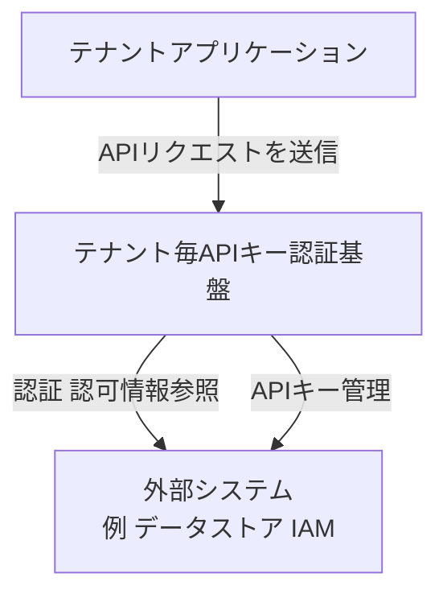
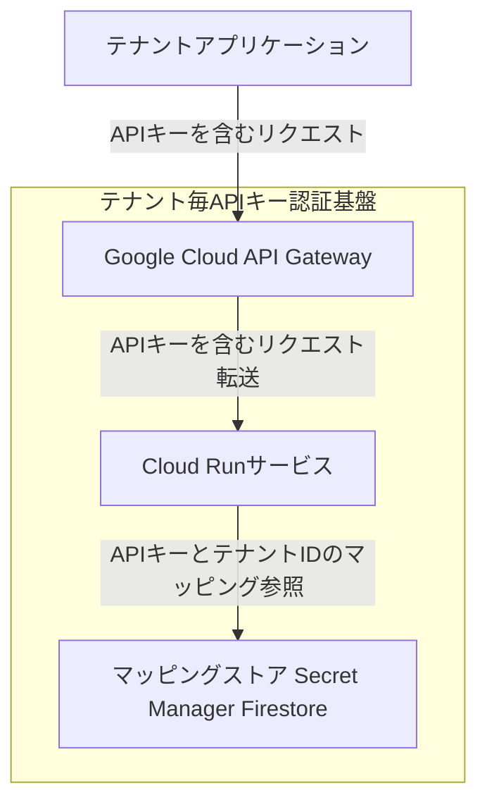
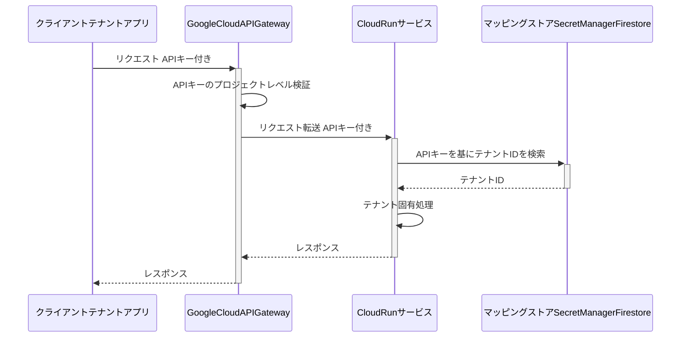
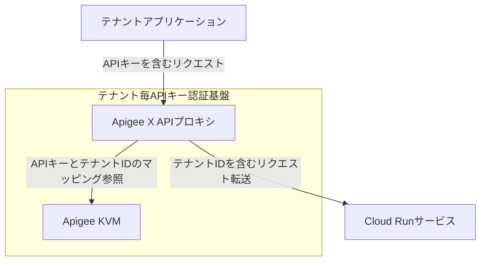
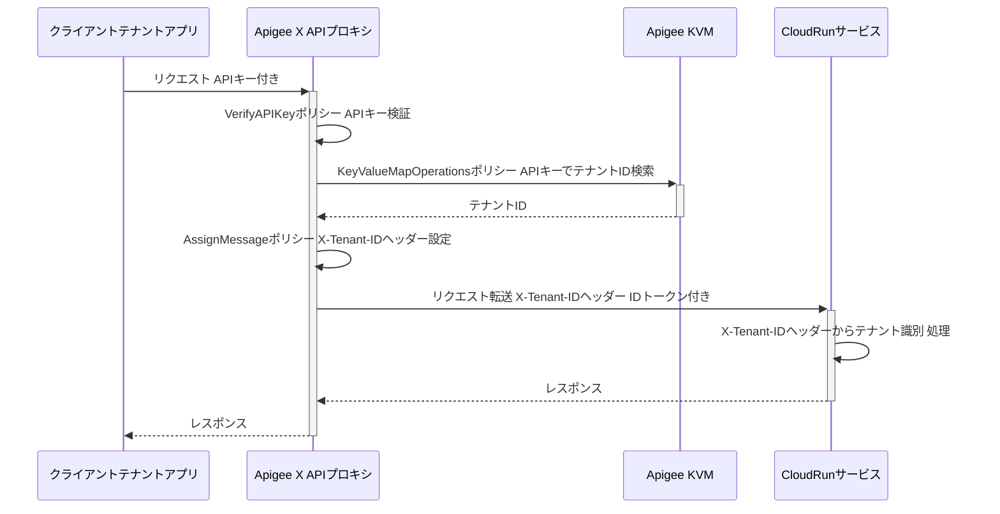

## ■概要

Cloud Runサービスに対して、テナント毎のAPIキー認証を後付けするためのアーキテクチャパターンを整理します。テナント固有のバックエンドシステムやサードパーティアプリケーションからのプログラムアクセスを安全で効率的に認証・認可する手法を解説します。主なパターンとして、Google Cloud API Gatewayを利用するケースと、Apigee Xを利用するケースの2つを取り上げ、それぞれの構築方法、利用方法、運用、長所・短所を比較検討します。

## ■課題

マルチテナントSaaSアプリケーションにおいて、プログラムによってアクセスするテナント固有のバックエンドシステムや外部アプリケーションに対して、認証と認可を行う仕組みが必要です。APIキーは、これらの非ユーザーエンティティが認証を行うための一般的な手段です。
ここでの主な課題は以下の通りです。

  * テナント毎に発行されるAPIキーを安全に管理すること。
  * APIキーを特定のテナントに確実に関連付けること。
  * バックエンドのCloud Runサービスが、各リクエストのテナントコンテキストを識別し、テナント固有のロジック実行とデータ分離を徹底できるようにすること。

これらの課題に対応するため、単純なAPIキー利用を超えた、テナントを意識した堅牢な認証システムの構築が求められます。特に、テナントの誤認は重大なセキュリティインシデントに繋がるため、正確なテナント識別は極めて重要です。

## ■GCPでのAPIキー

GCPにおけるAPIキーは、APIへのリクエストを認証・識別するための重要な要素です。ここでは、そのライフサイクル管理とセキュリティに関するベストプラクティス、そしてGCPコンソールの「APIとサービス \> 認証情報」で作成するAPIキーの特性について説明します。

### ●ライフサイクル管理

APIキーのライフサイクルは、作成、制限、安全な送信、保管、ローテーション、モニタリング、削除の各段階で構成されます。

  * **作成**: GCPコンソールの「APIとサービス \> 認証情報」セクションで生成します。テナントアプリケーションのようなユースケースでは、標準APIキーが主に関連します。
  * **制限**:
      * **API制限**: キーが呼び出せるAPIを特定のサービス（例: デプロイされたAPI Gatewayサービス）のみに限定します。
      * **アプリケーション制限**: IPアドレス、HTTPリファラー、またはアプリID（Android/iOS）によってキーの使用を制限します。サーバー間のテナント認証では、テナントのアプリケーションが静的IPアドレスを持つ場合にIPアドレス制限が有効です。
  * **安全な送信**: APIキーは、クエリパラメータではなくHTTPヘッダー（例: `x-goog-api-key` または `Authorization: Bearer API_KEY_STRING`）を使用して送信します。
  * **保管と取り扱い**: クライアントコードやリポジトリにキーを直接埋め込むことは避けます。テナントは割り当てられたAPIキーを安全に保管する責任を負います。
  * **ローテーション**: APIキーを定期的にローテーションし、古いキーを無効化します。テナントがキーを更新できる仕組みを提供する必要があります。
  * **モニタリングと削除**: APIキーの使用状況を監視し、不要になったキーは速やかに削除します。

### ●ベストプラクティス

APIキーのセキュリティを確保するためには、以下のベストプラクティスを遵守することが重要です。

| ベストプラクティス       | 説明                                                                                                                               |
| :----------------------- | :--------------------------------------------------------------------------------------------------------------------------------- |
| API制限の追加            | APIキーが呼び出せるAPIを、必要なものだけに限定します。これにより、不正なAPIへのアクセスを防ぎ、キーが侵害された場合の影響範囲を限定します。                                                    |
| アプリケーション制限の追加 | 可能であれば、APIキーを使用できるIPアドレスやHTTPリファラーを制限します。特に、テナントのバックエンドサービスが静的IPを持つ場合に有効です。                                                |
| 安全なヘッダーの使用       | APIキーをクエリパラメータではなく、`x-goog-api-key`などのHTTPヘッダーで送信します。これにより、URLスキャンによるキー盗難のリスクを低減します。                                                   |
| コードへの埋め込み回避     | APIキーをクライアントサイドのコードやソースコードリポジトリにハードコーディングしません。これにより、悪意のある攻撃者によるキーの傍受や盗難を防ぎます。                                                 |
| キーのローテーション       | APIキーを定期的に再生成し、アプリケーションを更新して新しいキーを使用し、古いキーを削除します。これにより、キーが侵害された場合の影響期間を短縮します。                                               |
| 使用状況のモニタリング     | APIキーの使用状況を監視し、異常なアクティビティや予期しない使用パターンがないか確認します。これにより、不正使用やキー侵害を早期に発見します。                                                          |
| 不要なキーの削除         | 現在使用していないAPIキーを削除します。これにより、攻撃対象領域を最小化します。                                                                                                 |

### ●APIとサービス \> 認証情報 で作成するAPIキー

「APIとサービス \> 認証情報」で管理されるAPIキーは、主に実行時にAPIへのリクエストを認証・識別するために使用されます。これらのAPIキーは、個々のエンドユーザーがトランザクションごとに認証を行うのとは異なり、外部サービスやアプリケーションがAPIに対してプログラム的にアクセスする際の「許可証」として機能します。主な役割は以下の通りです。

  * **プロジェクトの識別**: APIキーは、リクエストがどのGoogle Cloudプロジェクトから来たものかを識別し、API利用状況の追跡、課金、クォータ管理を可能にします。
  * **アクセス制御**: 特定のAPI、IPアドレス、アプリケーションからのアクセスのみを許可するように制限を設定できます。
  * **クライアントアプリケーション/サービスの認証**: APIキーは、リクエスト元が正当なプロジェクトに関連付けられていることを確認する手段として機能します。これは、個々のユーザーではなく、APIを呼び出すクライアントアプリケーションやサービスの認証です。

APIキーは、事前に定義されたシステム間連携や、特定の外部サービスからのAPI呼び出しを許可するために発行・設定されるものであり、エンドユーザーの動的なログイン認証とは区別されます。

## ■システムコンテキスト図

テナント毎のAPIキー認証基盤の全体像を示します。

| 要素名                      | 説明                                                                 |
| :-------------------------- | :------------------------------------------------------------------- |
| テナントアプリケーション        | テナントに代わってAPIリクエストを行うクライアントシステムです。            |
| テナント毎APIキー認証基盤   | 本調査で対象とする、テナント固有のAPIキーを用いた認証・認可を行うシステムです。 |
| 外部システム 例 データストア IAM | 認証情報やテナント情報の格納、APIキーの発行・管理などを行う外部の仕組みです。 |

## ■パターン1: Google Cloud API Gatewayとバックエンドロジックで実現する

バックエンド管理のテナント検索を伴うGoogle Cloud API Gatewayを利用するパターンです。

### ●コンテナ図

| 要素名                             | 説明                                                                                                |
| :--------------------------------- | :-------------------------------------------------------------------------------------------------- |
| テナントアプリケーション               | APIキーを利用してサービスにアクセスするテナントのアプリケーションです。                                             |
| Google Cloud API Gateway          | リクエストの初期検証とCloud Runサービスへのルーティングを担当するAPIゲートウェイです。                                 |
| Cloud Runサービス                   | APIキーに基づいてテナントIDを特定し、テナント固有のビジネスロジックを実行するバックエンドアプリケーションです。             |
| マッピングストア Secret Manager Firestore | APIキーとテナントIDのマッピング情報を安全に格納するストレージサービスです。Secret ManagerまたはFirestoreを利用します。 |

### ●シーケンス図

| 要素名                                      | 説明                                                                               |
| :------------------------------------------ | :--------------------------------------------------------------------------------- |
| クライアントテナントアプリ                  | APIキーを含むリクエストを送信するテナントのアプリケーションです。                          |
| GoogleCloudAPIGateway                 | リクエストの初期検証とルーティングを行うゲートウェイです。                                 |
| CloudRunサービス                          | APIキーに基づいてテナントIDを特定し、テナント固有の処理を実行するサービスです。                |
| マッピングストアSecretManagerFirestore | APIキーとテナントIDのマッピング情報を格納するストレージ（Secret Manager または Firestore）です。 |

### ●構築方法

#### API Gatewayの設定

  * **OpenAPI仕様の定義**:
      * APIのパス、メソッド、パラメータを定義します。
      * セキュリティ定義セクションでAPIキーを要求するように設定します。これにより、API Gatewayはリクエストに有効なAPIキーが含まれていることを確認します。
  * **バックエンドの設定**:
      * Cloud Runサービスをバックエンドとして指定します。
      * API GatewayがAPIキーを含むヘッダーをCloud Runサービスに転送するようにします。

#### Cloud Runサービスの実装

  * **APIキーの受信**:
      * リクエストヘッダー（例: `X-Goog-Api-Key`）からAPIキーを抽出するロジックを実装します。
  * **テナントID検索ロジック**:
      * **Secret Managerを利用する場合**:
          * Cloud Runサービスアカウントに `secretmanager.secretAccessor` ロールを付与します。
          * APIキーとテナントIDのJSONマップをシークレットとして保存し、サービス起動時またはリクエスト処理時に取得・解析します。
      * **Firestoreを利用する場合**:
          * Cloud RunサービスアカウントにFirestoreの読み取り権限（例: `roles/datastore.user`）を付与します。
          * APIキーをキーとするか、APIキーをフィールドに持つドキュメントとしてテナントIDを保存し、リクエスト処理時にクエリします。
  * **テナントID検索結果のキャッシュ**:
      * パフォーマンス向上のため、取得したAPIキーとテナントIDのマッピングをCloud Runインスタンスのメモリ内にキャッシュする機構を実装します（例: TTL付きキャッシュ）。
  * **テナントコンテキストの処理**:
      * 特定されたテナントIDに基づき、データアクセス制御やビジネスロジックの分岐処理を実装します。

#### マッピングストアの設定

  * **Secret Managerの場合**:
      * APIキーをキー、テナントIDを値とするJSONオブジェクトなどの形式でシークレットを作成し、バージョン管理します。
  * **Firestoreの場合**:
      * APIキーとテナントIDを格納するためのコレクションとドキュメント構造を設計します（例: APIキーをドキュメントIDとする）。

### ●利用方法

#### APIキーの払い出し

  * GCPコンソールの「APIとサービス \> 認証情報」でAPIキーを生成します。
  * 生成したAPIキーを、対応するテナントに安全な方法で払い出します。
  * 払い出したAPIキーとテナントIDの対応を、設定したマッピングストア（Secret ManagerまたはFirestore）に登録します。

#### APIの呼び出し

  * テナントアプリケーションは、払い出されたAPIキーをHTTPリクエストの指定されたヘッダー（例: `X-Goog-Api-Key`）に含めてAPI Gatewayのエンドポイントに送信します。

### ●運用

#### APIキー管理

  * **定期的なローテーション**: セキュリティポリシーに従い、APIキーを定期的にローテーションします。古いキーを無効化し、新しいキーをテナントに再配布し、マッピングストアを更新する手順を確立します。
  * **不要なキーの削除**: 利用されなくなったAPIキーは速やかにマッピングストアから削除し、GCPコンソール上でも無効化または削除します。
  * **アクセス権限の管理**: マッピングストアへのアクセス権限（Cloud Runサービスアカウントの権限）を最小限に保ちます。

#### モニタリングとロギング

  * **API Gatewayのログ**: API GatewayのログをCloud Loggingで監視し、APIキーの検証状況やリクエスト量を確認します。
  * **Cloud Runのログ**: Cloud Runサービスのアプリケーションログに、受信したAPIキー（マスキング推奨）と特定されたテナントID、処理結果を記録し、監査やトラブルシューティングに利用します。
  * **異常検知**: APIキーの不正利用試行（無効なキー、権限のないアクセスなど）や、特定のテナントからの異常なリクエストパターンを監視し、アラートを設定します。

#### マッピング情報の更新

  * テナントの追加、削除、APIキーの変更に伴い、マッピングストア（Secret ManagerまたはFirestore）の情報を正確かつ迅速に更新するプロセスを整備します。
  * Secret Managerを利用し、シークレットを環境変数としてCloud Runにマウントしている場合は、シークレット更新後にCloud Runの新リビジョンへのデプロイが必要になることがあります。

## ■パターン2: Apigee Xを利用する

高度なAPIキー認証とテナントコンテキスト注入のためのApigee Xを利用するパターンです。

### ●コンテナ図

パターン2におけるテナント毎APIキー認証基盤の主要なコンテナを示します。

| 要素名                  | 説明                                                                                                |
| :---------------------- | :-------------------------------------------------------------------------------------------------- |
| テナントアプリケーション    | APIキーを利用してサービスにアクセスするテナントのアプリケーションです。                                             |
| Apigee X APIプロキシ   | APIキーの検証、KVMからのテナントID検索、リクエストヘッダーへのテナントID注入など、高度なポリシーベースの処理を行うAPI管理レイヤーです。 |
| Cloud Runサービス       | Apigee Xによって注入されたテナントIDをリクエストヘッダーから読み取り、テナント固有のビジネスロジックを実行するバックエンドアプリケーションです。 |
| Apigee KVM             | Apigee X内で利用されるKey Value Mapストアで、APIキーとテナントIDのマッピング情報を格納します。                   |

### ●シーケンス図

| 要素名                  | 説明                                                                                                      |
| :---------------------- | :-------------------------------------------------------------------------------------------------------- |
| クライアントテナントアプリ | APIキーを含むリクエストを送信するテナントのアプリケーションです。                                                 |
| ApigeeXAPIプロキシ  | APIキーの検証、テナントIDの検索、カスタムヘッダーへのテナントID注入を行うApigee Xのコンポーネントです。               |
| ApigeeKVM             | APIキーとテナントIDのマッピング情報を格納するApigeeのKey Value Mapです。                                          |
| CloudRunサービス      | Apigee Xから注入されたテナントIDヘッダーを読み取り、テナント固有の処理を実行するサービスです。                          |

### ●構築方法

#### Apigee XのAPIプロキシ設定

  * **APIプロダクトの作成**:
      * テナントが利用するAPIをグループ化し、APIプロダクトとして定義します。
      * このプロダクトに対してアクセス制御やクォータを設定できます。
  * **デベロッパーアプリの登録**:
      * テナント毎（またはテナントのアプリケーション毎）にデベロッパーアプリを登録し、APIキーを生成・発行します。
  * **Key Value Map (KVM) の設定**:
      * APIキー（またはApigeeが発行するClient ID）とテナントIDのマッピング情報を格納するKVMを作成します。
  * **APIプロキシのポリシー設定**:
      * **VerifyAPIKeyポリシー**: リクエストからAPIキーを抽出し、Apigeeに登録された情報と照合して検証します。
      * **KeyValueMapOperationsポリシー**: 検証済みAPIキー（または関連するClient ID）をキーとしてKVMを検索し、テナントIDを取得します。
      * **AssignMessageポリシー**: 取得したテナントIDを、バックエンド（Cloud Run）へ渡すリクエストのヘッダー（例: `X-Tenant-ID`）に設定します。
      * 必要に応じて、Google署名付きIDトークンを生成してCloud Runを呼び出すためのポリシー（例: `ServiceCallout`ポリシーとカスタムJavaScript）を設定します。
  * **ターゲットサーバーの設定**:
      * バックエンドのCloud Runサービスのエンドポイントをターゲットサーバーとして設定します。

#### Cloud Runサービスの実装

  * **テナントIDヘッダーの読み取り**:
      * Apigee Xから転送されるリクエストのカスタムヘッダー（例: `X-Tenant-ID`）からテナントIDを読み取るロジックを実装します。
  * **テナントコンテキストの処理**:
      * 取得したテナントIDに基づき、データアクセス制御やビジネスロジックの分岐処理を実装します。
      * Apigee XがIDトークンで認証する場合、Cloud RunサービスはIAMで呼び出し元（Apigee Xのサービスアカウント）を検証するように設定します。

### ●利用方法

#### APIキーの払い出しと設定

  * Apigee X上でテナントに対応するデベロッパーアプリを作成し、APIキーを生成します。
  * 生成したAPIキーと対応するテナントIDを、Apigee KVMに登録します。
  * テナントにAPIキーを安全な方法で払い出します。

#### APIの呼び出し

  * テナントアプリケーションは、払い出されたAPIキーをHTTPリクエストの指定されたヘッダー（Apigee XのAPIプロキシで定義した方法、通常は `apikey` ヘッダーやクエリパラメータ）に含めてApigee Xのエンドポイントに送信します。

### ●運用

#### APIキーとKVM管理

  * **APIキーのライフサイクル管理**: Apigee Xの機能を利用して、APIキーの発行、承認、失効、ローテーションを管理します。
  * **KVMの更新**: テナントの追加、削除、APIキーの変更に伴い、Apigee KVMの情報を正確かつ迅速に更新します。Apigee APIやUIを通じてプログラムによる更新が可能です。
  * **アクセス制御**: APIプロダクトやロールベースアクセス制御（RBAC）を用いて、Apigee Xの管理機能やAPIへのアクセスを適切に制御します。

#### モニタリングとロギング

  * **Apigee Analytics**: Apigee Xの豊富な分析機能を活用し、APIトラフィック、エラーレート、レイテンシ、APIキー毎の利用状況などを監視します。テナントIDをカスタムディメンションとして記録することで、テナント毎の分析も可能です。
  * **Cloud Runのログ**: Cloud Runサービスのアプリケーションログに、受信したテナントID（`X-Tenant-ID`ヘッダーから）と処理結果を記録します。
  * **監査ログ**: Apigee XおよびGCPの監査ログを利用して、APIキー管理、ポリシー変更、デプロイメントなどの管理アクティビティを追跡します。

#### セキュリティポリシーの管理

  * Apigee Xのポリシー（脅威保護、トラフィック管理、セキュリティポリシーなど）を活用して、APIエンドポイントを保護します。
  * テナント毎のレート制限やクォータをAPIプロダクトレベルで設定・調整します。

## ■比較

| 特徴/考慮事項                 | パターン1 (GCP API Gateway + バックエンド)                     | パターン2 (Apigee X)                                                         |
| :---------------------------- | :----------------------------------------------------------- | :--------------------------------------------------------------------------- |
| テナントIDマッピングと注入ロジック | バックエンドのCloud Runサービス内（Secret ManagerまたはFirestoreを使用）に実装します。 | Apigee Xのポリシー（KVMおよびAssignMessageポリシーなど）で実装します。                       |
| コスト                        | 一般的に、Apigee Xと比較して低コストです。                                                 | 一般的に、GCP API Gatewayと比較して高コストです。                                               |
| 複雑性                      | 初期設定は比較的容易ですが、バックエンドでのマッピングロジック管理が必要です。             | Apigeeの学習曲線があり、設定やポリシー開発はより複雑になる可能性があります。                     |
| 高度なAPI管理機能             | 認証、ルーティングなど基本的なゲートウェイ機能を提供します。                       | 分析、収益化、トラフィック管理、高度なセキュリティポリシーなど豊富な機能を提供します。                 |
| レート制限の粒度              | GCP API Gatewayでは主にプロジェクトレベルでの制御となります（Service Control経由）。                          | APIプロダクトやAPIキーレベルでより詳細なレート制限を設定可能で、テナント固有の制御に適しています。 |
| セキュリティポリシー適用          | APIキーの基本的な検証を行います。                                          | Apigeeポリシーにより、OAuth、JWT検証、脅威保護など高度なセキュリティポリシーを適用できます。     |
| 運用オーバーヘッド              | バックエンドのテナントマッピングロジックとマッピングストア（Secret Manager/Firestore）の管理が必要です。 | Apigeeポリシー、KVM、APIプロダクト、デベロッパーアプリなどのApigee固有のコンポーネント管理が必要です。 |
| 他のGCPサービスとの統合         | Cloud Run、Secret Manager、Firestoreなどとネイティブに連携します。                                                   | Cloud Run（IDトークン発行など）、Logging、Monitoringなどとネイティブに連携します。             |

## ■まとめ

本調査では、GCP上でCloud Runサービスに対するテナント毎のAPIキー認証を実現するための2つの主要なアーキテクチャパターンを詳細に検討しました。

  * **パターン1: Google Cloud API Gateway と バックエンド管理のテナント検索**

      * API Gatewayが初期のAPIキー検証（プロジェクトレベル）とルーティングを行います。
      * Cloud Runサービスが、Secret ManagerまたはFirestoreに格納されたマッピング情報を利用して、APIキーからテナントIDを特定します。
      * 比較的低コストでシンプルな構成が可能ですが、テナント識別のロジックはバックエンドサービスに実装する必要があります。

  * **パターン2: Apigee X による高度なAPIキー認証とテナントコンテキスト注入**

      * Apigee XがAPIキーの検証、KVMを使用したテナントIDの検索、およびカスタムヘッダー（例: `X-Tenant-ID`）へのテナントID注入までを一元的に処理します。
      * Cloud Runサービスは、Apigee Xから注入されたヘッダーを読み取るだけでテナントを識別できます。
      * 高度なAPI管理機能（分析、セキュリティ、トラフィック制御など）を利用でき、テナント識別ロジックをバックエンドから分離できますが、コストと運用複雑性はパターン1より高くなる傾向があります。

**選び方:**

* **コスト重視、テナントロジックが単純な場合:**
  * **パターン1: GCP API Gateway + バックエンドロジック** が適している可能性が高いです。
  * 低コストで導入できますが、バックエンドでのマッピングロジックの実装と、マッピング情報の安全な管理・効率的な取得（キャッシュ戦略を含む）が重要になります。
* **小規模でもテナントAPIをビジネスとして実現する場合:**
  * **パターン1** に **Kong GatewayなどのオープンソースAPI Gatewayを組み合わせる** パターンが適している可能性が高いです。
  * 料金プランに合わせたレート制限など、競争優位性を生み出すわけではないが、APIを販売する場合に**共通で必要な機能**は、**つくるより使う**ほうが全体のコストが安くなります。
* **エンタープライズ規模、複雑なAPIエコシステム、高度なAPI管理機能が必要な場合:**
  * **パターン2: Apigee X** がより適切な選択となることが多いです。
  * コストは高まりますが、テナント識別ロジックの分離、豊富なAPI管理機能、柔軟なポリシー制御といった利点があります。認証ロジックの変更もバックエンドの再デプロイなしに行えるため、俊敏性が向上します。

どちらのパターンを選択するにしても、APIキーの厳格な管理（キーの制限、安全な送信と保管、定期的なローテーションなど）と、Cloud Runアプリケーション内での確実なテナントデータ分離は、マルチテナントシステムを安全かつ効果的に運用するための必須要件です。

この記事でなにか得られることがあったら、SNSでシェアしていただけると励みになります。
