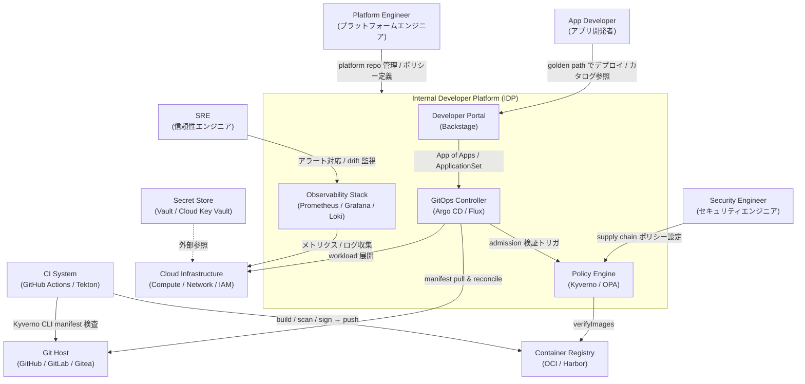
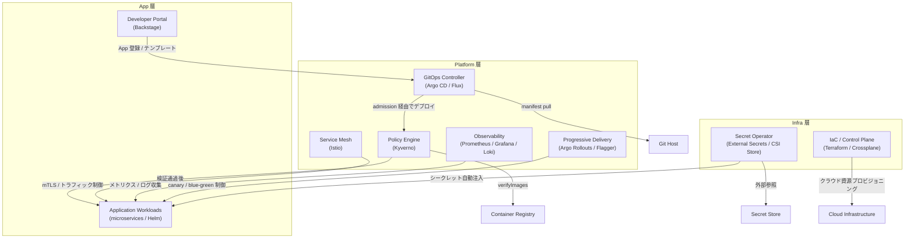
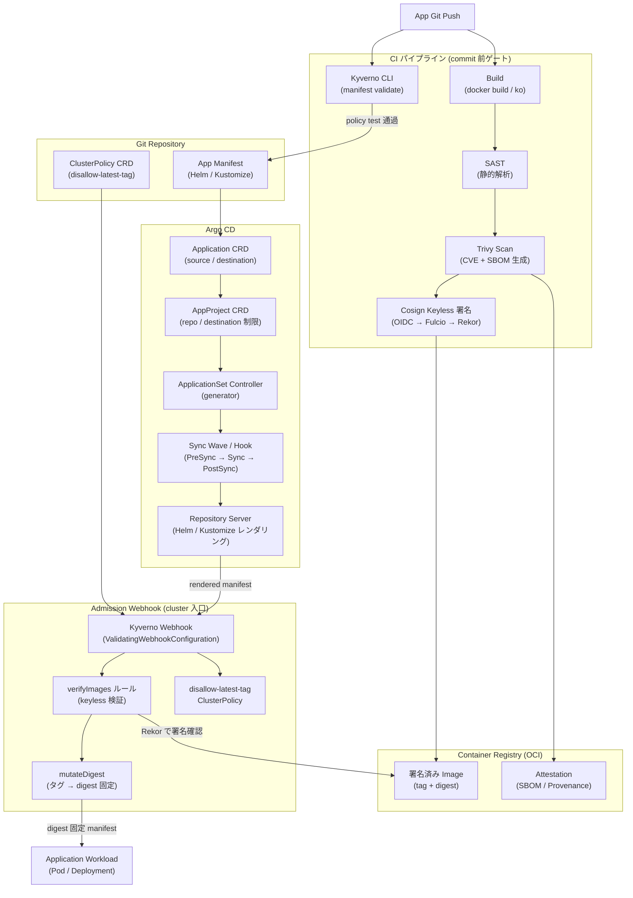
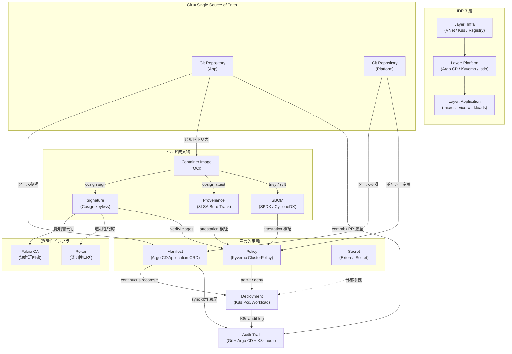
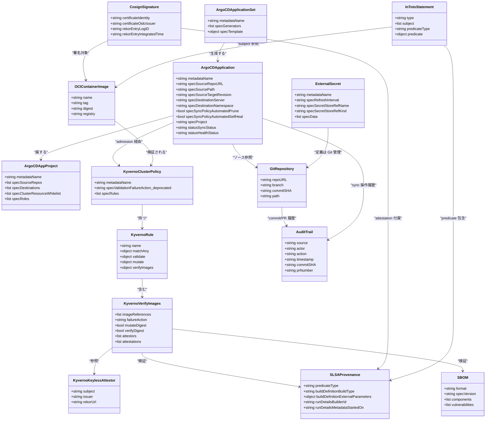

> 起点: CNCF Blog「Building a cloud-native Internal Developer Platform with Kubernetes, GitOps, and supply chain security」(Abu Hena Mostafa Kamal, 2026-05-29)
> 検証日: 2026-06-01

## 概要

Internal Developer Platform (IDP) とは、アプリケーション開発者が「開発・ビルド・デプロイ・運用」に必要な能力を、運用チケットや専門チームへの依頼なしに self-service で使える内部基盤です。CNCF App Delivery TAG の Platforms White Paper は、IDP を「利用者のニーズに応じて定義・提示した統合能力の集合体」と定義します。そして products (アプリ)・platforms (中間統合層)・capability providers (インフラ等の下層) という 3 層モデルを参照構造として示します。

CNCF Blog 記事は、この 3 層を Kubernetes 上に具体実装した参照例です。3 層の責務は次のように分かれます。

| 層 | 責務 | 代表ツール |
|---|---|---|
| Infrastructure | クラウド資源 (VNet・managed K8s・registry・IAM・secret store) のプロビジョニング | Terraform、Calico |
| Platform | K8s 上の共通能力 (デプロイ/ポリシー/観測/メッシュ) を宣言的に提供 | Argo CD、Kyverno、Istio、Prometheus/Grafana/Loki、Trivy、Cosign |
| Application | microservices をコンテナ workload としてデプロイ | アプリコード、Helm/Kustomize manifest |

記事が体現する設計思想の核は 2 点です。第一に「Git = single source of truth」です。すべての変更を Git の commit/PR として記録し、GitOps エンジン (Argo CD) が宣言した状態へ継続的に reconcile します。第二に「署名済みのみデプロイ」です。CI パイプラインで Cosign keyless 署名を付与し、クラスタ入口の admission webhook (Kyverno verifyImages) が署名と digest を検証して、未署名や改ざんされた image を出自に関わらず弾きます。

この記事の権威には留保があります。著者は CNCF Kubestronaut (個人認定プログラム) のメンバーであり、本記事は CNCF 公式参照アーキテクチャでも査読論文でもなく、Azure 上の単一実装例です。「CNCF が示す」という文脈での権威の過大評価には注意が必要です。一方で記事が体現する設計原則そのものは、CNCF Platforms White Paper・OpenGitOps 4 原則 (v1.0.0)・SLSA/Sigstore といった一次ソースと整合します。AI エージェントが CI/CD やインフラに変更を加える時代の、変更管理テンプレートとしての再利用価値が高いといえます。

## 特徴

### 3 層を collapse させないことが設計の起点

記事は「Infrastructure / Platform / Application の 3 層を早期に collapse させると保守複雑性が著しく増す」と明言します。これは Team Topologies の責務分離と直接対応します。すなわち stream-aligned チーム (アプリ)・platform チーム (プラットフォーム)・complicated-subsystem チーム (基盤) の分担です。

### GitOps が「正本・承認・差し戻し・監査」を一手に担う

OpenGitOps v1.0.0 の 4 原則 (Declarative / Versioned & Immutable / Pulled Automatically / Continuously Reconciled) に基づき、以下の制御をすべて Git 経路に集約します。

- 承認: PR の merge。VCS の既存ガバナンス (branch protection / CODEOWNERS / signed commit) にそのまま乗る
- 差し戻し: `git revert` で打ち消しコミットを作成し自動 reconcile。`git reset --hard` は履歴を破壊するため禁則
- 監査: Git commit/PR 履歴・Argo CD operation 履歴・K8s audit log の三重
- `syncPolicy.automated.prune: true / selfHeal: true` で Git から削除した資源の削除と手動改変の自動巻き戻しを担保

Argo CD・Flux はともに CNCF Graduated プロジェクトです。

### 署名済み成果物のみデプロイ — CI とクラスタ入口の 2 段で弾く

検証は 2 段構えです。CI 段でビルド・スキャン・署名を行い、クラスタ入口の admission webhook で署名と digest を再検証します。

- Cosign keyless: 長期鍵を持たず、OIDC ワークロード ID から Fulcio が短命証明書を発行し、Rekor 透明性ログに記録。検証は `--certificate-identity` / `--certificate-oidc-issuer` で照合
- SLSA (現行 v1.2, Build Track L0〜L3): provenance のレベルを定義し、検証側は「特定の builder が署名した provenance のみ受理」と規定可能
- Kyverno `verifyImages`: cosign keyless / attestation をネイティブ検証し、`mutateDigest` でタグを digest に固定。OPA/Gatekeeper は署名検証をネイティブに持たず ExternalData (Ratify 等) に委譲

設計の要点は「人間が出そうとエージェントが出そうと、admission policy という同じ決定論的境界で弾く」ことです。出自を問わない均一な境界が頑健性の源泉になります。

### Secret は Git に置かず外部参照または暗号化コミットで管理する

- 外部参照型: External Secrets Operator (CNCF Sandbox) や CSI Secrets Store driver が Vault / クラウド Key Vault を参照。記事は Azure Key Vault の自動ローテーションを反映する構成を示す
- 暗号化コミット型: SOPS (CNCF Sandbox) / Sealed Secrets (非 CNCF)

いずれも「Git に平文 secret を置かない」を実現します。ただし GitOps 文脈で secret 管理は依然として最も解けていない領域です。大規模運用では「secret drift (Git と実クラスタの乖離)」が Git = single source of truth の前提を崩す課題として残ります。

### 観測スタックの標準化 — OpenTelemetry 起点の三段構成

- 計装 (中立): OpenTelemetry がベンダーニュートラルな計装・収集を担う
- メトリクス保存: Prometheus (CNCF Graduated)
- 可視化: Grafana (CNCF 外)。ログは Loki を採用し、ELK スタック比のコスト・複雑性削減を記事は理由に挙げる

### サービスメッシュによる mTLS とトラフィック制御

- Istio (CNCF Graduated、2023-07-12 卒業) がサービス間 mTLS・トラフィック制御・L7 観測を担う
- Permissive mode から Strict mode へ namespace 単位で段階移行し、既存サービスを段階的に mTLS 境界へ取り込む
- Linkerd も CNCF Graduated で、シンプルさを重視する場合の代替

### Policy as Code — Kyverno と OPA の使い分け

- Kyverno (CNCF Graduated): K8s ネイティブの YAML + CEL で validate / mutate / generate / cleanup / verifyImages の 5 モードを持つ。署名検証をネイティブに担える。Kyverno 1.17 (2026-02) で CEL が v1 昇格
- OPA (CNCF Graduated): 汎用 Rego で K8s 外のポリシーも横断。K8s admission には Gatekeeper を介する

両者は「広さ (OPA) と K8s 特化 (Kyverno)」の方向で直交し、組み合わせて使うユースケースもあります。

### IDP の capability 体系 — White Paper の 13 ドメイン

CNCF Platforms White Paper はプラットフォームが提供しうる能力を 13 ドメインで整理します。任意の IDP 設計の網羅性チェックリストとして機能します。

| # | capability ドメイン |
|---|---|
| 1 | Web portals for provisioning and observing capabilities |
| 2 | APIs (and CLIs) for automatically provisioning products and capabilities |
| 3 | "Golden path" templates and docs |
| 4 | Automation for building and testing services and products |
| 5 | Automation for delivering and verifying services and products |
| 6 | Development environments |
| 7 | Observability for services and products |
| 8 | Infrastructure services |
| 9 | Data services |
| 10 | Messaging and event services |
| 11 | Identity and secret management services |
| 12 | Security services |
| 13 | Artifact storage |

記事の参照実装は主に 2・3・4・5・7・8・11・12・13 をカバーし、1 (Developer Portal) と 6 (開発環境) は明示的に扱いません。

### Golden Path と Thinnest Viable Platform

- Golden Path (Spotify 定義): 特定の成果物を作るための "opinionated and supported" なパス。推奨ツール・手順を明文化し "rumour-driven development" を排除する。Backstage の Software Templates (Scaffolder) が実装点
- Thinnest Viable Platform (TVP): Team Topologies が提唱する「必要十分な能力だけを提供し、プラットフォームの肥大化を防ぐ」原則。platform team のボトルネック化を防ぐ指針

### サプライチェーン防御の原理的限界

- SBOM (Trivy が SPDX/CycloneDX で生成) と署名 (Cosign) は「ビルドプロセス自体を侵す kitchen 型攻撃」(SolarWinds・XZ Utils・GhostAction (2025) 等) には原理的に届かない。署名対象がビルド時点で汚染されていれば防げない
- Cosign keyless は Rekor 透明性ログへの可用性依存があり、Yahoo は TSA (Timestamp Authority) を代替採用
- SLSA 上位レベル (L2 以上) の実運用採用は現時点で限定的

## 構造

CNCF クラウドネイティブ IDP は単一プロダクトではなく方法論・参照アーキテクチャです。そこで C4 model を「IDP の論理構造」に読み替えて示します。

### システムコンテキスト図



| 要素 | 説明 |
|---|---|
| App Developer | golden path に乗ってサービスをデプロイ。Developer Portal からカタログ・テンプレートを消費 |
| Platform Engineer | platform repo を管理し、golden path・ポリシー・テンプレートを定義・維持 |
| SRE | Observability Stack でアラートを受け、drift 検知時に対応 |
| Security Engineer | supply chain ポリシー (verifyImages / disallow-latest-tag 等) を設計・審査 |
| Internal Developer Platform | Developer Portal / GitOps Controller / Policy Engine / Observability の統合基盤 |
| Git Host | Git = Single Source of Truth。manifest・ポリシー・インフラ宣言を正本管理 |
| Container Registry | Cosign 署名済み OCI イメージを保管。admission 時に署名・digest を検証される |
| Secret Store | 平文シークレットを Git に置かず外部参照。ESO / CSI Secrets Store Driver で自動注入 |
| Cloud Infrastructure | Compute / Network / IAM 等。Terraform / Crossplane でプロビジョニング |
| CI System | build / SAST / Trivy scan / Cosign 署名を実行し、Kyverno CLI で manifest を事前検査 |

### コンテナ図



| コンテナ | 所属層 | 役割 |
|---|---|---|
| Developer Portal | App 層 | Backstage。Software Catalog・golden path テンプレート・TechDocs を提供する開発者向け入口 |
| Application Workloads | App 層 | 実業務のコンテナ workload。GitOps Controller が宣言した状態へ収束させる対象 |
| GitOps Controller | Platform 層 | Argo CD / Flux。Git から manifest を pull し、クラスタ状態と継続的に reconcile |
| Policy Engine | Platform 層 | Kyverno。validate / mutate / verifyImages を admission webhook と CLI で実行 |
| Service Mesh | Platform 層 | Istio。namespace 間の mTLS・L7 トラフィック制御・観測。Permissive→Strict 段階移行 |
| Observability Stack | Platform 層 | Prometheus / Grafana / Loki。OTel で計装し Prometheus へ転送 |
| Progressive Delivery | Platform 層 | Argo Rollouts / Flagger。メトリクスによる自動 promote / rollback |
| IaC / Control Plane | Infra 層 | Terraform / Crossplane。クラウド資源を宣言的にプロビジョニング |
| Secret Operator | Infra 層 | External Secrets Operator / CSI Secrets Store。Secret Store を参照し K8s Secret に自動同期 |

### コンポーネント図

CI で Kyverno CLI、registry に署名 image、admission webhook が verifyImages、そして workload という検証フローをドリルダウンします。



| コンポーネント | CRD / リソース名 | 役割 |
|---|---|---|
| Trivy Scan | — | CVE スキャンおよび SPDX/CycloneDX 形式の SBOM 生成 |
| Cosign Keyless 署名 | — | OIDC ワークロード ID から Fulcio が短命証明書発行、Rekor に記録。長期鍵不要 |
| Kyverno CLI | — | manifest を admission 前にローカル検査する CI ゲート |
| 署名済み Image | — | Cosign 署名済みの OCI image。digest に紐づく署名・証明書情報・透明性ログエントリを Rekor で検証できる |
| App Manifest | Helm values / Kustomize overlay | クラスタへの desired state 宣言。Argo CD が pull して reconcile する正本 |
| ClusterPolicy CRD | `ClusterPolicy` (Kyverno) | cluster 全体に適用するポリシー定義 |
| Application CRD | `Application` (argoproj.io/v1alpha1) | source repo / destination / syncPolicy を宣言する基本単位 |
| AppProject CRD | `AppProject` (argoproj.io/v1alpha1) | repo ホワイトリスト / destination allow-list / role でマルチテナント境界を定義 |
| ApplicationSet Controller | `ApplicationSet` (argoproj.io/v1alpha1) | generator でパラメータを量産し Application を自動生成 |
| Sync Wave / Hook | annotation `argocd.argoproj.io/sync-wave` | PreSync → Sync → PostSync の適用順序を制御 |
| Kyverno Webhook | `ValidatingWebhookConfiguration` | API Server に登録した admission webhook。作成/更新時に ClusterPolicy を評価 |
| verifyImages ルール | `verifyImages` (ClusterPolicy spec) | `keyless.subject` / `keyless.issuer` を照合し Cosign keyless 署名を検証 (Cosign CLI の verify では `--certificate-identity` / `--certificate-oidc-issuer` に対応) |
| mutateDigest | `mutateDigest: true` | image タグを検証済み digest に書き換えて immutability を保証 |
| disallow-latest-tag | `ClusterPolicy` (validate) | `:latest` タグの Pod 作成を拒否し、特定バージョンへの pin を強制 |

## データ

### 概念モデル

IDP が扱う主要概念と、参照・生成・検証・格納の関連を関係マップで示します。



| 概念 | 説明 |
|---|---|
| Layer: Infra | クラウド資源を IaC で管理する最下層 |
| Layer: Platform | K8s 上の共通能力を宣言的に提供する中間層 |
| Layer: Application | microservices をデプロイし Platform 層の能力を消費するアプリ層 |
| Git Repository | すべての desired state の単一正本。変更は PR → merge のみ受け入れ |
| Manifest | Kubernetes リソース定義。Argo CD が pull して適用 |
| Policy (ClusterPolicy) | Kyverno の admission ルール。CEL で条件記述 |
| Container Image | OCI イメージ。digest で不変参照され、mutateDigest で digest に固定 |
| Signature (Cosign) | keyless で生成される短命証明書ベースの署名 |
| Provenance (SLSA) | どのビルダーが・どの入力から作ったかの in-toto attestation |
| SBOM | ソフトウェア部品表。Trivy / Syft で生成し attest で保存 |
| Fulcio CA | OIDC トークンを検証し短命証明書を発行する認証局 |
| Rekor | 署名イベントをタイムスタンプ付きで不変記録する透明性ログ |
| Deployment | admission policy を通過した成果物のみが実体化する Pod / Workload |
| Secret | Git に平文を置かず外部参照または暗号化コミットで管理 |
| Audit Trail | Git 履歴・Argo CD 操作履歴・K8s audit log の三重構造 |

### 情報モデル

主要エンティティをクラスとして属性付きで定義します。属性が公式 docs で確認できたものは注記なし、補完したものは推測と注記します。



主要属性の出典は以下のとおりです。

- ArgoCDApplication: `spec.source.{repoURL,path,targetRevision}` / `spec.destination.{server,namespace}` / `spec.syncPolicy.automated.{prune,selfHeal}` / `spec.project` / `status.{sync,health}.status` — Argo CD docs
- ArgoCDAppProject: `spec.{sourceRepos,destinations,clusterResourceWhitelist,roles}` — Argo CD docs (Projects / RBAC)
- KyvernoVerifyImages: `imageReferences` (静的パターンのみ・変数補間非対応) / `mutateDigest` (既定 true) / `attestors[].keyless.{subject,issuer,rekor.url}` / `attestations[].predicateType` — Kyverno docs
- CosignSignature: `certificateIdentity` / `certificateOidcIssuer` は `--certificate-identity` / `--certificate-oidc-issuer` フラグに対応 — Sigstore/Cosign docs
- SLSAProvenance: `predicateType = https://slsa.dev/provenance/v1` (固定文字列) / `runDetails.builder.id` (level 判定に必須) — SLSA spec v1.0/1.2
- ExternalSecret: 現行 apiVersion は `external-secrets.io/v1` (旧 `v1beta1` は移行済み) — ESO docs
- KyvernoClusterPolicy: `spec.validationFailureAction` は deprecated。現行は rule ごとの `spec.rules[*].validate.failureAction` を使う — Kyverno docs

mermaid classDiagram のメンバー名にはドットが使えないため、`spec.source.repoURL` 等をキャメルケースに変換しています。実際の YAML キーは上記のドット表記が正です。

## 構築方法

以下のコードはすべて「記事の意図を反映した実装例」であり、補完元の公式 docs を各所に示します。CNCF 記事は Azure を前提とした単一実装です。

### Terraform でクラスタ・レジストリ・Key Vault をプロビジョニング

AKS クラスタ・Azure Container Registry・Azure Key Vault を Terraform で宣言する HCL 抜粋です。Key Vault の自動ローテーションが記事の要点です。

```hcl
# 記事の意図を反映した実装例
# 出典補完: https://registry.terraform.io/providers/hashicorp/azurerm/latest/docs
provider "azurerm" {
  features {}
}

resource "azurerm_kubernetes_cluster" "idp" {
  name                = "idp-cluster"
  location            = var.location
  resource_group_name = var.resource_group_name
  dns_prefix          = "idp"

  default_node_pool {
    name       = "system"
    node_count = 3
    vm_size    = "Standard_D4s_v3"
  }

  identity {
    type = "SystemAssigned"
  }

  network_profile {
    network_plugin = "azure"
    network_policy = "calico"
  }

  key_vault_secrets_provider {
    secret_rotation_enabled = true
  }
}

resource "azurerm_container_registry" "idp" {
  name                = "idpregistry"
  resource_group_name = var.resource_group_name
  location            = var.location
  sku                 = "Premium"
}

resource "azurerm_key_vault" "idp" {
  name                     = "idp-keyvault"
  location                 = var.location
  resource_group_name      = var.resource_group_name
  sku_name                 = "standard"
  tenant_id                = data.azurerm_client_config.current.tenant_id
  purge_protection_enabled = true
}
```

### Argo CD インストールと app-of-apps ブートストラップ

```bash
# 記事の意図を反映した実装例
kubectl create namespace argocd
kubectl apply -n argocd \
  -f https://raw.githubusercontent.com/argoproj/argo-cd/stable/manifests/install.yaml
```

app-of-apps の親 Application CRD は次のとおりです。

```yaml
# 記事の意図を反映した実装例
# 出典補完: https://argo-cd.readthedocs.io/en/stable/operator-manual/cluster-bootstrapping/
apiVersion: argoproj.io/v1alpha1
kind: Application
metadata:
  name: platform-apps
  namespace: argocd
  finalizers:
    - resources-finalizer.argocd.argoproj.io
spec:
  project: default
  source:
    repoURL: https://github.com/your-org/platform-repo
    targetRevision: HEAD
    path: apps/platform
  destination:
    server: https://kubernetes.default.svc
    namespace: argocd
  syncPolicy:
    automated:
      prune: true
      selfHeal: true
    syncOptions:
      - CreateNamespace=true
```

### Kyverno verifyImages ClusterPolicy — 署名済みイメージのみ許可

Kyverno v1.x の `verifyImages` ルールで、Cosign keyless 署名を持つイメージのみ admission を通します。`mutateDigest: true` でタグを digest に固定するのが要点です。

```yaml
# 記事の意図を反映した実装例
# 出典補完: https://kyverno.io/docs/policy-types/cluster-policy/verify-images/sigstore/
apiVersion: kyverno.io/v1
kind: ClusterPolicy
metadata:
  name: verify-signed-images
spec:
  webhookConfiguration:
    timeoutSeconds: 30
  rules:
    - name: verify-image-signature
      match:
        any:
          - resources:
              kinds:
                - Pod
      verifyImages:
        - imageReferences:
            - "ghcr.io/your-org/*"
          failureAction: Enforce
          mutateDigest: true
          verifyDigest: true
          attestors:
            - entries:
                - keyless:
                    subject: "https://github.com/your-org/your-repo/.github/workflows/build.yml@refs/heads/main"
                    issuer: "https://token.actions.githubusercontent.com"
                    rekor:
                      url: https://rekor.sigstore.dev
---
apiVersion: kyverno.io/v1
kind: ClusterPolicy
metadata:
  name: disallow-latest-tag
spec:
  rules:
    - name: require-image-tag
      match:
        any:
          - resources:
              kinds:
                - Pod
      validate:
        failureAction: Enforce
        message: "イメージは ':latest' タグを使用できません。特定バージョンを指定してください。"
        pattern:
          spec:
            containers:
              - image: "!*:latest"
```

### Cosign keyless 署名コマンド

GitHub Actions の OIDC トークンを使う keyless 署名が IDP の定石です。秘密鍵を保存せず、Fulcio が短命証明書を発行し Rekor に記録します。なお `--certificate-identity` / `--certificate-oidc-issuer` は検証 (`cosign verify`) 専用のフラグです。

```bash
# 記事の意図を反映した実装例
# 出典補完: https://docs.sigstore.dev/cosign/signing/overview/

# keyless 署名 (--yes で対話プロンプトをスキップ)
cosign sign --yes ghcr.io/your-org/your-app@${IMAGE_DIGEST}

# 署名の検証 (鍵ではなく identity で照合)
cosign verify \
  --certificate-identity "https://github.com/your-org/your-repo/.github/workflows/build.yml@refs/heads/main" \
  --certificate-oidc-issuer "https://token.actions.githubusercontent.com" \
  ghcr.io/your-org/your-app:${IMAGE_TAG}

# SLSA Provenance を attestation として付与
cosign attest --yes \
  --type slsaprovenance \
  --predicate provenance.json \
  ghcr.io/your-org/your-app@${IMAGE_DIGEST}
```

GitHub Actions の workflow 抜粋は次のとおりです。

```yaml
# 記事の意図を反映した実装例
jobs:
  build-sign:
    permissions:
      contents: read
      packages: write
      id-token: write     # keyless 署名に必要 (OIDC トークン取得権限)
    steps:
      - uses: sigstore/cosign-installer@v3
      - name: Build and push image
        id: build
        uses: docker/build-push-action@v5
        with:
          push: true
          tags: ghcr.io/your-org/your-app:${{ github.sha }}
      - name: Trivy 脆弱性スキャン (CI ゲート)
        uses: aquasecurity/trivy-action@master
        with:
          image-ref: "ghcr.io/your-org/your-app:${{ github.sha }}"
          exit-code: "1"
          severity: "CRITICAL,HIGH"
      - name: Cosign keyless 署名
        run: cosign sign --yes ghcr.io/your-org/your-app@${{ steps.build.outputs.digest }}
```

### External Secrets Operator (Git に平文 secret を置かない)

```yaml
# 記事の意図を反映した実装例
# 出典補完: https://external-secrets.io/latest/provider/azure-key-vault/
apiVersion: external-secrets.io/v1
kind: ClusterSecretStore
metadata:
  name: azure-keyvault-store
spec:
  provider:
    azurekv:
      tenantId: "<TENANT_ID>"
      vaultUrl: "https://idp-keyvault.vault.azure.net"
      authType: WorkloadIdentity
---
apiVersion: external-secrets.io/v1
kind: ExternalSecret
metadata:
  name: db-password
  namespace: my-app
spec:
  refreshInterval: 1h
  secretStoreRef:
    name: azure-keyvault-store
    kind: ClusterSecretStore
  target:
    name: db-secret
    creationPolicy: Owner
  data:
    - secretKey: password
      remoteRef:
        key: db-password
```

## 利用方法

アプリチームの golden path は次の流れです。manifest を Git に push して PR を作成し、CI ゲート (Trivy / Kyverno CLI) を通し、PR merge で Argo CD が自動 sync し、admission webhook が署名と digest を検証し、問題があれば `git revert` でロールバックします。

### manifest を Git に push して PR 作成

```bash
# 記事の意図を反映した実装例
git checkout -b feat/update-app-v2
git add k8s/deployment.yaml
git commit -m "chore: update app to v2.1.0"
git push origin feat/update-app-v2
gh pr create --title "deploy: app v2.1.0" --base main
```

### CI で trivy image と kyverno apply を実行 (PR ゲート)

```bash
# 記事の意図を反映した実装例
trivy image \
  --exit-code 1 \
  --severity CRITICAL,HIGH \
  ghcr.io/your-org/your-app:${IMAGE_TAG}

trivy image --format cyclonedx --output sbom.json \
  ghcr.io/your-org/your-app:${IMAGE_TAG}

kyverno apply ./policies/ --resource ./k8s/deployment.yaml --detailed-results
```

### PR merge で Argo CD が自動 sync

```bash
# 記事の意図を反映した実装例
argocd app get my-app
argocd app diff my-app
argocd app sync my-app --prune
```

Argo CD は `argocd.argoproj.io/sync-wave` annotation で CRD → Namespace → Deployment → PostSync テストの順序を制御します。

### admission webhook が署名と digest を検証 (自動)

```bash
# 記事の意図を反映した実装例
kubectl apply -f k8s/deployment-unsigned.yaml
# Error from server: admission webhook denied the request:
#   verify-signed-images: image ghcr.io/your-org/app:v2.0.0 failed signature verification

kubectl get pod <pod> -n my-app -o jsonpath='{.spec.containers[0].image}'
# ghcr.io/your-org/app@sha256:abcdef1234...  ← tag ではなく digest に変換済み
```

### git revert によるロールバック

```bash
# 記事の意図を反映した実装例
git log --oneline -5
git revert <commit-sha>
git push origin main
argocd app wait my-app --sync --health --timeout 300
```

`git reset --hard` は禁則です。履歴を書き換えると Argo CD の operation 履歴・監査証跡が壊れます。`git revert` による打ち消しコミットが GitOps の正攻法です (OpenGitOps 原則 2 の帰結)。Argo CD UI の rollback は Git を更新しないため、次の reconcile で元に戻る点に注意します。

## 運用

### Argo CD のスケールと ApplicationSet

大規模運用では単一 application-controller が全負荷を処理するため、スケールが最大のブロッカーになります。

```yaml
# cluster-generator で登録クラスタ全体に同一アプリをデプロイ
apiVersion: argoproj.io/v1alpha1
kind: ApplicationSet
metadata:
  name: guestbook
  namespace: argocd
spec:
  generators:
    - clusters:
        selector:
          matchLabels:
            env: production
  template:
    metadata:
      name: "{{name}}-guestbook"
    spec:
      project: default
      source:
        repoURL: https://github.com/argoproj/argocd-example-apps
        targetRevision: HEAD
        path: guestbook
      destination:
        server: "{{server}}"
        namespace: guestbook
      syncPolicy:
        automated:
          prune: true
          selfHeal: true
```

```bash
# シャーディングの有効化 (consistent-hashing は round-robin より均一だが手動確認が必要)
kubectl patch configmap argocd-cmd-params-cm -n argocd --type merge \
  -p '{"data":{"controller.sharding.algorithm":"consistent-hashing","controller.replicas":"3"}}'
```

シャーディングは均一分散を保証しません (一部レプリカが 0 クラスタを担当するケースもあります)。数百クラスタ規模では `argocd-agent` (Technology Preview) を検討します。エアギャップ・不安定ネットワーク・エッジ環境での大規模展開に対応します。

### Secret drift 検知

GitOps の宣言的モデルでは、外部 secret operator による正当なローテーションと手動 `kubectl edit` による drift を区別しにくくなります。

```yaml
# Argo CD Application で外部 operator 管理の Secret フィールドを除外し OutOfSync を抑制
spec:
  ignoreDifferences:
    - group: ""
      kind: Secret
      jsonPointers:
        - /data
```

`refreshInterval` を短くするほど drift ウィンドウが縮まりますが API コールが増えます。本番では 1h 以下、高感度環境では 5〜15 分が目安です。drift アラートは `argocd-notifications` で Slack / PagerDuty に飛ばすか、Prometheus の `argocd_app_info{sync_status="OutOfSync"}` をトリガーにします。

### Istio Permissive から Strict への移行

```yaml
# Step 1: namespace を Permissive (平文も許可) で開始
apiVersion: security.istio.io/v1
kind: PeerAuthentication
metadata:
  name: default
  namespace: app-namespace
spec:
  mtls:
    mode: PERMISSIVE
```

```bash
# Step 2: mTLS 接続率を Prometheus で確認
#   istio_requests_total{connection_security_policy="mutual_tls"} の割合が 99% 以上で移行
# Step 3: Strict に切り替え
kubectl patch peerauthentication default -n app-namespace \
  --type merge -p '{"spec":{"mtls":{"mode":"STRICT"}}}'
```

移行完了後は `AuthorizationPolicy` で namespace 間の通信を最小権限に絞ります。

### SLO 監視 (Observability)

```yaml
# recording rules で可用性 SLI を事前計算 (Prometheus)
groups:
  - name: slo_availability
    interval: 30s
    rules:
      - record: job:sli_availability:rate5m
        expr: |
          1 - (
            rate(http_requests_total{status=~"5.."}[5m])
            /
            rate(http_requests_total[5m])
          )
```

Grafana の SLO plugin で Burn Rate ダッシュボードを宣言的に管理できます。Loki を使う場合はログクエリ `count_over_time({app="myapp", level="error"}[5m])` を SLI の補助指標に組み込みます。

### 監査 (Git / Argo CD operation / K8s audit log)

監査は 3 レイヤで構成し、それぞれの証跡が補完関係になります。

| レイヤ | 証跡の内容 |
|---|---|
| Git 履歴 | who/when/what/why (commit author / PR / CODEOWNERS 承認) |
| Argo CD operation history | sync 操作・initiator・結果・revision (`argocd app history`) |
| K8s audit log | API サーバーへの全リクエスト (user / verb / resource / response) |

AI エージェントによる変更でも経路は同じです (全変更が Git PR を通るため audit 対象に入ります)。3 層を突き合わせれば「誰がいつ何を変更し、それが cluster に届いたか」をフルトレースできます。

## ベストプラクティス

反証エビデンスを「誤解 → 反証 → 推奨」の構造で統合します。

### IDP を敷けば生産性が上がる、は誤解

- 反証: DORA 2024 は、IDP 利用とスループット 8% 低下・変更安定性 14% 低下の関連を報告しており、導入だけで成果が出るわけではないことを示唆します (調査回答に基づく関連であり厳密な因果ではない点に注意)。調査対象 platform team の約 45% が効果を測定していません
- 推奨: DORA メトリクス (デプロイ頻度・変更リードタイム・変更失敗率・MTTR) を導入前後で測定する仕組みを最初から組み込みます。「プラットフォームのカスタマーは開発者」として採用状況を定期サーベイで追います。使われない IDP は負債になります

### 統合すれば堅牢になる、は誤解

- 反証: K8s ユーザーの約 70% が運用複雑性を最大の pain point に挙げ、「誰も全体を把握できない tool sprawl」が運用負債になるケースが多数報告されています。「統合」は別の見方では「ツールの寄せ集めが負債になる」表裏の関係です
- 推奨: 最小構成から段階追加します。まず「GitOps (Argo CD) + admission policy (Kyverno)」で始め、ROI が確認できたら Cosign / Trivy / Istio を順次追加します。各ツールに owning team / on-call を明示し、担当不在のコンポーネントは導入しません

### Git が単一の真実である、は誤解

- 反証: Secret drift により「Git=真実」前提が secret 領域で崩れます。外部 secret operator による正当なローテーションと手動改変の両方が「Git が知らない変更」として cluster に混入します
- 推奨: Secret は GitOps の例外領域として外部 operator (ESO / CSI Secrets Store) に委ねます。`ignoreDifferences` で operator 管理フィールドを除外し、意図しない drift (kubectl edit) は Prometheus alert + argocd-notifications で即検知して git revert フローに乗せます

### 署名すれば供給網は安全になる、は誤解

- 反証: SolarWinds・XZ Utils・GhostAction (2025) はいずれも「ビルドプロセス自体を侵す kitchen 型攻撃」です。SBOM と署名は「ingredients」を検証しますが、「kitchen (ビルドプロセス)」を汚染された場合、署名対象のバイナリそのものが汚染されているため防げません。Sigstore keyless は Rekor 可用性に依存し、Yahoo/Paranoids はその運用負荷を理由に Rekor でなく TSA を採用しました
- 推奨: 署名・SBOM・SLSA は必要条件であって十分条件ではないと位置づけます。kitchen 型対策として CI runner のエフェメラル化・ビルド環境への書き込み制限・CI pipeline 変更の Git 管理と署名を追加します。Rekor 可用性リスクには private Sigstore か TSA fallback を検討します。SLSA は L2 (GitHub attestation) から始めます

### AI エージェントには追加の承認ゲートが必要、は誤解

- 反証: 逐次承認は高頻度・並列なエージェント生成変更にスケールしません。Particle41 (2026-03-24) の事例では「全 PR を人間が承認」するフローが承認工数を「日 200 分」に押し上げました
- 推奨 (ArgoCon Europe 2026 の設計原則と Particle41 の実践を統合):
  - 承認フローではなく環境境界で守る: admission policy / namespace / mTLS / sandbox microVM がエージェントの「触れる範囲」を物理的に閉じる。出自を問わず同じ境界で弾く
  - リスク階層別承認: low-risk は自動承認、medium-risk は 1 名 + タイムアウト自動承認、high-risk (削除・本番昇格・信頼度 80% 未満) のみ明示 2 名承認
  - 自動セーフティゲート (schema / policy / cost impact / dependency analysis) を人間レビューの前段に置き、危険な提案を自動却下する
  - `MCP_READ_ONLY=true` のように能力集合を環境変数で絞り、エージェントに「見えないツールは呼べない」状態を作る (argoproj-labs/mcp-for-argocd)
  - エージェント provenance: commit/PR に加え agent identity / model identity / plan artifact を可能な範囲で attest する。現状は Luke Hinds (2026-01-21) の問題提起段階で標準未確立

## トラブルシューティング

### Argo CD OutOfSync が解消しない

- 症状: `Sync Status` が `OutOfSync` のまま sync しても戻る
- 原因の切り分け: secret 由来の drift (`ignoreDifferences` 未設定) / cluster 側の手動変更 (`selfHeal: true` 未設定) / manifest の resource version 衝突 / helm chart の非決定的テンプレート
- 対処:

```bash
argocd app diff <app-name> --hard-refresh
argocd app history <app-name>
git revert <commit-sha> && git push   # UI rollback でなく Git revert が正攻法
```

### Argo CD シャーディング不均一

- 症状: application-controller の replica 間で負荷が偏る
- 原因: デフォルトの round-robin シャーディングは均一分散を保証しない
- 対処: `argocd-cmd-params-cm` で `controller.sharding.algorithm: consistent-hashing` に切り替え、`kubectl rollout restart deployment argocd-application-controller -n argocd` で強制再シャーディング

### Kyverno admission webhook がブロック

- 症状: `kubectl apply` が `admission webhook ... denied the request` で失敗
- 原因の切り分け: policy 違反 / Kyverno pod 未起動・CrashLoop でフェールセーフ拒否 / namespaceSelector の設定ミス
- 対処:

```bash
kubectl get pods -n kyverno
kubectl describe policyreport -n <namespace>
kyverno test /path/to/policy/ --detailed-results
# 一時的に audit モードへ (現行は rule ごとの validate.failureAction を使う)
kubectl patch clusterpolicy disallow-latest-tag --type json \
  -p '[{"op":"replace","path":"/spec/rules/0/validate/failureAction","value":"Audit"}]'
```

webhook の `failurePolicy: Fail` の場合、Kyverno pod 障害で全リソース作成がブロックされます。`failurePolicy: Ignore` + 監視強化の組み合わせを本番で検討します。

### Cosign 署名検証失敗 (Rekor 到達不可)

- 症状: `cosign verify` / Kyverno verifyImages が `error communicating with rekor` で失敗
- 原因: keyless 検証は Rekor への HTTPS 接続を必要とする。ネットワーク制限・エアギャップ・Rekor 障害で到達不能になる
- 対処:

```bash
curl -v https://rekor.sigstore.dev/api/v1/log
# 開発/テストのみ: Rekor スキップ (透明性保証を失う)
cosign verify \
  --certificate-identity=https://github.com/<org>/<repo>/.github/workflows/build.yml@refs/heads/main \
  --certificate-oidc-issuer=https://token.actions.githubusercontent.com \
  --insecure-ignore-tlog=true <image>
```

本番で常態化する場合は private Sigstore (Fulcio + Rekor + ctlog) の自己ホストか TSA fallback を検討します。

### Secret rotation 反映の遅延

- 症状: Vault / Key Vault でローテーションしたが Pod が古い値を参照し続ける
- 原因: ESO の `refreshInterval` 経過まで新値を取得しない。env mount は Pod 再起動が必要
- 対処:

```bash
kubectl annotate externalsecret db-credentials force-sync=$(date +%s) -n app --overwrite
kubectl rollout restart deployment <deployment-name> -n app
```

ローテーション完了を Prometheus metric `externalsecrets_sync_calls_total` / `externalsecrets_sync_calls_error` で監視し、エラー増加時に alert を上げます。

## まとめ

CNCF クラウドネイティブ IDP の設計パターンは、3 層分離・Git を正本とする GitOps・署名済み成果物のみのデプロイを軸に、AI エージェント時代の変更管理テンプレートとして再利用できます。ただし DORA 2024 の実測ネガティブ・tool sprawl・Backstage コスト・secret drift といった限界があり、効果測定と責務分離を伴って初めて機能する点を押さえることが重要です。

この記事が少しでも参考になった、あるいは改善点などがあれば、ぜひリアクションやコメント、SNSでのシェアをいただけると励みになります！

## 参考リンク

- 起点・規格・公式
  - [CNCF Blog: Building a cloud-native IDP (2026-05-29)](https://www.cncf.io/blog/2026/05/29/building-a-cloud-native-internal-developer-platform-with-kubernetes-gitops-and-supply-chain-security/)
  - [CNCF Platforms White Paper (TAG App Delivery)](https://tag-app-delivery.cncf.io/whitepapers/platforms/)
  - [OpenGitOps Principles v1.0.0](https://opengitops.dev/)
  - [Team Topologies key concepts](https://teamtopologies.com/key-concepts)
  - [SLSA v1.0 spec](https://slsa.dev/spec/v1.0/about)
  - [SLSA v1.2 Build Track](https://slsa.dev/spec/v1.2/levels)
  - [in-toto attestation spec v1.2.0](https://github.com/in-toto/attestation/blob/main/spec/README.md)
  - [CNCF Projects (maturity levels)](https://www.cncf.io/projects/)
  - [Spotify Engineering: Golden Paths](https://engineering.atspotify.com/2020/08/how-we-use-golden-paths-to-solve-fragmentation-in-our-software-ecosystem)
- GitHub / 公式ドキュメント
  - [Argo CD Architecture](https://argo-cd.readthedocs.io/en/stable/operator-manual/architecture/)
  - [Argo CD Cluster Bootstrapping](https://argo-cd.readthedocs.io/en/stable/operator-manual/cluster-bootstrapping/)
  - [Argo CD ApplicationSet](https://argo-cd.readthedocs.io/en/stable/operator-manual/applicationset/)
  - [Argo CD AppProject / RBAC](https://argo-cd.readthedocs.io/en/stable/user-guide/projects/)
  - [Argo CD High Availability / Sharding](https://argo-cd.readthedocs.io/en/stable/operator-manual/high_availability/)
  - [argoproj-labs/argocd-agent](https://github.com/argoproj-labs/argocd-agent)
  - [argoproj-labs/mcp-for-argocd](https://github.com/argoproj-labs/mcp-for-argocd)
  - [Flux Concepts](https://fluxcd.io/flux/concepts/)
  - [Kyverno verifyImages (Sigstore/Cosign)](https://kyverno.io/docs/policy-types/cluster-policy/verify-images/sigstore/)
  - [Kyverno CLI](https://kyverno.io/docs/kyverno-cli/)
  - [Sigstore / Cosign signing overview](https://docs.sigstore.dev/cosign/signing/overview/)
  - [Sigstore self-managed logging](https://docs.sigstore.dev/logging/self-managed/)
  - [Trivy SBOM](https://trivy.dev/latest/docs/supply-chain/sbom/)
  - [External Secrets Operator (Azure Key Vault)](https://external-secrets.io/latest/provider/azure-key-vault/)
  - [Istio PeerAuthentication](https://istio.io/latest/docs/reference/config/security/peer_authentication/)
  - [Terraform AzureRM provider](https://registry.terraform.io/providers/hashicorp/azurerm/latest/docs/resources/kubernetes_cluster)
  - [Backstage docs](https://backstage.io/docs/overview/what-is-backstage/)
- 記事・反証
  - [Vercel Sandbox GA (2026-01-30)](https://vercel.com/blog/vercel-sandbox-is-now-generally-available)
  - [Luke Hinds: Sigstore/SLSA for AI agent provenance (2026-01-21)](https://www.alwaysfurther.ai/blog/sigstore-ai-agent-provenance)
  - [ArgoCon Europe 2026: Intelligent Drift Detection](https://tldrecap.tech/posts/2026/argocon-europe/gitops-intelligent-argo-cd/)
  - [DORA: Platform Engineering capability](https://dora.dev/capabilities/platform-engineering/)
  - [DORA 2024 Report](https://dora.dev/research/2024/dora-report/)
  - [The New Stack: DORA 2024 AI and platform engineering fall short](https://thenewstack.io/dora-2024-ai-and-platform-engineering-fall-short/)
  - [InfraCloud: Argo CD sharding](https://www.infracloud.io/blogs/sharding-clusters-across-argo-cd-application-controller-replicas/)
  - [OneUptime: Argo CD secret drift detection](https://oneuptime.com/blog/post/2026-02-26-argocd-secret-drift-detection/view)
  - [Yahoo/Paranoids: Scaling supply chain security with Sigstore](https://www.yahooinc.com/paranoids/scaling-up-supply-chain-security-implementing-sigstore-for-seamless-container-image-signing)
  - [Particle41: GitOps when AI agents make commits](https://particle41.com/insights/gitops-when-ai-agents-make-commits/)
  - [Earthly: Backstage is at peak hype](https://earthly.dev/blog/backstage-is-at-peak-hype/)
  - [The Stack: platform engineering hype cycle](https://www.thestack.technology/platform-engineering-hype-cycle-the-stack/)
