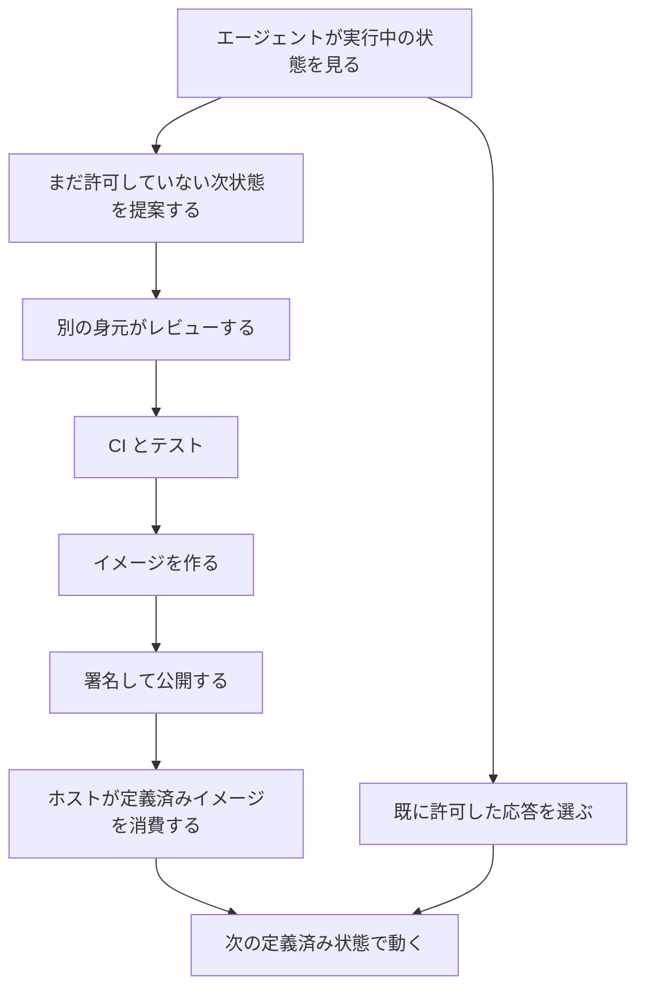

本番のエージェントに、実行中のホストをその場で変える権限を渡す代わりに、望ましい次のシステム状態を提案させ、software factory を通してから機械に消費させる。2026年10月8日、CNCF Ambassador の Mauro Morales が [CNCF ブログ](https://www.cncf.io/blog/2026/10/08/dont-give-ai-agents-root-make-them-propose-the-next-system-state/) に置いた線は、この分け方です。

この記事では、その線が分けるもの（提案と適用、自己修復と自己改善）と、OS および software factory に置く層を、ブログ本文と隣接する一次資料から追います。想定する読者は、コーディングエージェントとインフラエージェントの権限を、状態遷移の所有者で決めようとしている人です。

著者は Kairos のメンテナであり、実装の宣伝を避けてアーキテクチャの話に留め、答えはシステム依存だと本文で断っています。

*この記事の全体像。以下、順に解説します。*

## 次のシステム状態の提案とは

10月8日のブログが置く層は、OS と software factory です。software factory とは、ソース管理、レビュー、CI、テスト、イメージのビルド、署名、リリース、デプロイを指します。エージェントの出力の形は、この工場に入る次の状態です。

ブログは、クラウドネイティブに単一の答えはない、と書いています。ここで追うのは、著者が自分の層に置いた線です。

### 無制限の root を渡さない理由

root を本番で無制限に渡さない理由は、失敗そのものよりも再現性です。何が変わり、誰または何が変えたかを追えることです。ブログは、人間にも無制限の root を渡さないのと同じだ、と書いています。

同じブログは、AGENTS.md を、非決定的なシステムが回復不能な誤りを避ける保証の位置には置かない、と書いています。

### 自己修復と自己改善

自己修復は、再起動、置換、ロールバックのように、すでに許可した応答から選ぶことです。自己改善は、まだ許可していない状態の提案なので、同じ software factory を通します。

不変性の目的は、機械が定義された状態から、別の定義された状態へ移ることです。実行時は、別の場所で作られた状態を実行する場所です。ブログが名指しするのは、bootc、Flatcar Container Linux、Kairos です。

Hadron は、Kairos チームがイメージベースのシステム用に作った最小ベース OS で、パッケージマネージャを提供しない、とブログは書いています。

### 提案できる身元

エージェントの身元は、変更を提案できます。承認、マージ、パイプラインの改変、成果イメージの公開と署名、機械にそのイメージを消費させる強制は、その身元に渡しません。

ブログが挙げる具体例は、Kairos Trusted Boot イメージの探索的 QA です。エージェントがブート停止を go-ukify の PE セクション整列まで追い、ライブラリの修正、go-ukify v0.5.2、AuroraBoot の更新（[kairos-io/AuroraBoot#850](https://github.com/kairos-io/AuroraBoot/pull/850)）へつながった、とブログは書いています。

### エージェントもワークロードである

エージェントもワークロードです。標準 Pod はホストカーネルを共有し、範囲の狭いエージェントには向くことがあります。信頼できないコードや広い能力が要るエージェントには、サンドボックス Pod か VM が要ることがある、とブログは書いています。

### 観察から消費までの流れ

ブログが描く流れは、観察、提案、別身元のレビュー、工場、ホストによる消費です。自己修復は、すでに許可した応答を選ぶ経路です。

工場の中身は、ソース管理、レビュー、CI、テスト、イメージビルド、署名、リリース、デプロイです。ホスト側の消費の名前は、bootc、Flatcar、Kairos です。

## 注意点

ブログの線は読めます。逸話を、そのまま「検証済みの修正が Kairos と Hadron に乗った」と一般化すると、GitHub の記録より強くなります。以下は、2026年10月11日時点で公開記録と公式文書に残っている範囲です。

### 逸話が残している記録

| 記録 | 状態 | 何が起きたか |
| --- | --- | --- |
| [kairos-io/kairos#4885](https://github.com/kairos-io/kairos/issues/4885) | closed（2026-09-22） | go-ukify が追加する PE セクションを 512 バイト整列にし、systemd stub の SectionAlignment 0x1000 とずれる。著者は `mauro-agent` |
| [kairos-io/go-ukify#66](https://github.com/kairos-io/go-ukify/pull/66) | merged（2026-09-22、`mauromorales`） | 整列を stub の SectionAlignment へ切り上げる。承認は `jimmykarily`（本文は空）。著者は `mauro-agent` |
| [kairos-io/AuroraBoot#850](https://github.com/kairos-io/AuroraBoot/pull/850) | merged（2026-09-23、`mauromorales`） | go-ukify を v0.5.2 へ上げる依存更新。承認も `mauromorales`（本文は空、2026-09-23T07:56:56Z）。著者は `mauro-agent` |

#4885 の測定は、Hadron の main の Trusted Boot ISO、systemd-boot/stub 261.3、162 MB の UKI、136 MB の `.initrd`、QEMU の OVMF debug と gdb です。ファームウェアログは `Length(0x898A800) is not aligned!` のあと、MemoryProtection.c(281) の ASSERT です。ウォッチドッグのリセットは 299.997 秒、299.997 秒、300.05 秒です。ページ境界に揃えて同じ UKI を作り直すと、SecureBoot 下で assert はゼロになり、メニューの約 6 秒後にカーネルが出る、と issue は書いています。

同じ issue は、本番ファームウェアでは assert がデッドループしない、とも書いています。失敗した保護を飛ばして継続します。元の「2.5 分の黒画面のあと起動に成功」は別機構で、160 MB 級のファイルを起動媒体から読む時間の可能性が高く、ここでは未試験（Not tested here）です。リセットループは DEBUG ファームウェアの話です。

AuroraBoot #850 の Test plan は、`go mod tidy` と `go build ./pkg/uki/...` がチェック済みで、Trusted Boot ISO のブートテストは未チェックのままです。2026年10月11日の AuroraBoot main の go.mod は `github.com/kairos-io/go-ukify v0.5.2` を require しています。これは依存のピンであり、配布イメージがこのコミットから作り直された証明ではありません。配布イメージの消費は未確認です。別追跡のブートテストが実施されたかも、この PR の本文とレビューからは未確認です。

go-ukify #66 の `mauro-agent` レビューは、自分を `@mauromorales` が動かす AI エージェントだと書き、Mauro 個人のレビューではなく、静的読取のみでビルドもファームウェア再現もしていない、と書いています。PR 本文は、PR を開く前に人間がこのコードを読んでいない、とも書いています。Copilot の「人間の最終レビューが要る」は、AuroraBoot #850 のマージ後（2026-09-23T07:59:08Z）です。

アカウントの分離は、GitHub 上では守られています。人では、AuroraBoot #850 の承認とマージが、エージェントの運用者に戻っています。go-ukify #66 は別の人 `jimmykarily` が承認した例で、承認本文は空です。

### イメージを消費する時点

レビューがあるとすれば、イメージをレジストリへ出す前です。ホストがタイマーや `update_engine` で取る瞬間に、もう一度人が PR を見る、とは、ここで開いた公式ページには書いてありません。

[bootc の upgrade 文書](https://bootc.dev/bootc/bootc-upgrades.7.html) は、ベースイメージへの変更は stage され、既定では実行中システムは変わらない、と書いています。現行の既定では、staged 更新はシャットダウン時に `ostree-finalize-staged.service` が適用します。`bootc upgrade --apply` は再起動して適用します。`--download-only` は明示適用までシャットダウンや再起動では適用せず、その状態で再起動すると staged deployment は破棄されます。`bootc switch` は追跡イメージを変えるだけで、`/etc` と `/var` は残します。

[bootc の security ページ（印刷版）](https://bootc.dev/bootc/print.html) は、2026年10月11日に確認した範囲で、bootc を全権限で動かす前提で、CLI 入力は既定で完全に信頼する、と書いています。イメージ取得は `/etc/containers/policy.json` に従い、執筆時点の upstream 既定は一般イメージに署名を要求しません。署名必須は、利用者が足す設定です。

[Flatcar の supply-chain 文書](https://www.flatcar.org/docs/latest/security/supply-chain/) は、OS 全体のイメージだけを出荷し、個別パッケージの増分更新はサポートしない、と書いています。更新はフルのパーティションイメージで、A/B です。OS バイナリは読み取り専用の `/usr` にあり、起動のたびに dm-verity で検証します。`update_engine` はそのパーティション上にあり、焼き込み公開鍵で更新イメージを検証してからインストールします。[update-strategies](https://www.flatcar.org/docs/latest/updates-releases/releases/update-strategies/) は、各マシンが起動の約 10 分後、その後はおおよそ 1 時間ごとに check-in する、と書いています。既定の再起動戦略は `reboot` で、待ちは 5 分です。各ホストの消費時に人間の PR を要求する文は、開けたページにはありません。

エージェントが公開または署名できるなら、後ろの段は手順が増えただけになります。bootc は、署名があって初めて消費する、という前提を既定では持ちません。

### Hadron のパッケージマネージャと不変性

[2025年12月17日の Hadron 紹介](https://kairos.io/blog/2025/12/17/introducing-hadron-the-minimal-upstream-first-linux-base-for-kairos/) は、Package Management を None by design、Upgrade Model を Image-based (via Kairos) とします。[拡張 quickstart](https://kairos.io/quickstart/extending-the-system-dockerfile/) は "Hadron by itself is not immutable." と書き、不変とアトミックアップグレードは `kairos-init` のあとだとしています。同じページは "Hadron doesn’t ship with a package manager." とも書いています。

パッケージマネージャが無いことと、ファイルシステムが不変であることは、この文言では別です。

[現行の Kairos immutable 文書](https://kairos.io/docs/architecture/immutable/)（公開表記 2026-10-05。2026年10月11日に確認）は、Kairos 化したあとのパスを分けます。`/usr/local`（COS_PERSISTENT）と `/oem`（COS_OEM）は persistent、`/var` `/etc` `/srv` は ephemeral、`/` は immutable です。そのうえで、既定のパスを persistent パーティションの `/usr/local/.state` へ bind mount し、再起動とアップグレードを越えて読み書きできる状態にします。既定には一部の `/etc`（`/etc/kubernetes`、`/etc/ssh`、`/etc/ssl/certs` など）、`/home`、`/opt`、`/root`、`/usr/libexec`、一部の `/var/lib`、`/var/log`、`/var/cores` が含まれます。Ubuntu 系は `/snap` などを加えます。利用者がさらに足す設定は `bind_mounts` であり、既定リストとは別です。この既定リストは、版付き v4.3.0 の HTML としては再取得していません。

不変ホストの外に、`/etc`、`/var`、資格情報、kubeconfig が残ります。bootc は switch / upgrade で `/etc` と `/var` を残すと書いています。

### 著者の自己位置

ブログは、答えはシステム依存だと書き、自分が OS 開発と software factory に関わっていると自己位置を書いています。名指しの直後に、Kairos maintainer だと書いています。同じ記事は、家庭のサービスを MacBook から Linux へ止めずに移すとき、エージェントに superuser を渡した、とも書いています。実験と本番では期待が違う、と続けています。

本番の線は、著者がすべての機械に適用した記録ではありません。一般化の材料は、メンテナが自プロジェクトの一件を、アーキテクチャの話として置いたものです。

### 10月9日の記事は別の投稿である

NIS2 と DORA の担当を書いた CNCF 記事は、Posted on October 9, 2026、著者 Matteo Bisi（Reevo）です。10月8日の記事の本文に、NIS2 も DORA も、スキーマ検証も、却下した提案の扱いもありません。検証者の置き方と報告期限は、10月9日の記事と法令を、10月8日の線の隣に置いた読みです。

### 確認が閉じない点

次は、ここで閉じられていません。

- 別の人の承認を、空の本文でも足りると組織がみなすか。go-ukify #66 は足りると扱われてマージされています。
- 自己修復 API の動詞を、再起動、置換、ロールバックのどれまでに切るか。
- 却下理由コードの語彙を、誰がレビューするか。これを支える一次資料は見つかっていません。
- 英語の NIS2 第23条4項(d) の全文。期限のアンカーは、後述の欧州委員会通知とオランダ語正文で確認しています。
- 配布イメージが go-ukify v0.5.2 を消費済みか。
- 本番ファームウェアの 2.5 分黒画面の機構。issue は未試験と書いています。
- bootc 上の `ostree admin unlock` を、bootc が支持手順としているか。
- 10月8日の記事からリンクされた 2026-07-07、2026-07-14、2026-08-07 の CNCF 記事の本文。ここでは扱っていません。
- bootc、Flatcar、Kairos 以外のホストへ、同じ動詞の分離がそのまま移るか。ブログが単一の答えを否定している以上、この三つの公式ページからは決まりません。

## 提案と適用が分かれたまま残る条件

本番のエージェントには、root とその場変更を渡さない。版管理された次状態を提案させ、別の人がレビューし、別の権限がビルド、署名、公開し、ホストが消費する。自己修復は、その工場の外に、すでに許可した狭い応答として残す。実行場所を狭くすること（標準 Pod、サンドボックス、VM）と、提案した状態を誰が適用するかは、別の境界です。スキーマ検証は、10月8日の記事が引いた線そのものではありません。Kubernetes へ翻訳した設計です。

この読みを支えているものと、読みを戻すものを分けます。

支えているものは、次です。

- ブログは、再現性（何が変わり、誰が変えたか）を、root を渡さない理由として書いています。
- ブログは、提案できる身元と、承認、マージ、公開、署名、消費強制の身元を分けないと、手順が増えた root になる、と書いています。
- go-ukify #66 は、エージェントが提案し、別の人 `jimmykarily` が承認し、`mauromorales` がマージした記録です。
- Flatcar は、読み取り専用の `/usr` と、焼き込み公開鍵による更新検証を公式に書いています。
- bootc は、既定では実行中のベースイメージをその場で書き換えない、と公式に書いています。
- [10月9日の記事](https://www.cncf.io/blog/2026/10/09/who-owns-nis2-and-dora-on-a-kubernetes-platform-team/) は、セキュリティがポリシーを書けても Helm chart をマージすることはできない、と書き、成果物の Accountable をプラットフォームまたは要求元のエンジニアリングマネージャに置いています。

読みを戻すものは、次です。

- AuroraBoot #850 では、アカウントは分かれていても、承認した人とマージした人はエージェントの運用者です。承認本文は空で、ブートテストは未チェックです。
- ブログの「修正イメージを検証し、Kairos と Hadron が修正を拾う」は、#4885 の「本番ファームウェアの 2.5 分黒画面は未試験」と、#850 の未チェック項目より強いです。
- bootc の upstream 既定は、一般イメージの署名を要求しません。消費の自動適用は、署名済みであることと同じではありません。
- [OpenGitOps Principles v1.0.0](https://github.com/open-gitops/documents/blob/v1.0.0/PRINCIPLES.md) の原則4は、ソフトウェアエージェントに適用を試みさせます。提案者との分離は、原則の外で足す条件です。
- Kubernetes の `?dryRun=All` は保存しません。認可は非 dry-run と同一なので、dry-run を許すことは、その操作の適用権限を許すことです。Strict は未知または重複フィールドを 400 で拒むだけで、privileged や hostPath のような、形としては正しい悪い状態は通ります。
- 不変ホストの外に、`/etc`、`/var`、資格情報、kubeconfig が残ります。Hadron 単体は quickstart の文言では immutable ではありません。
- ブログ自身が、家庭の移行では superuser を渡したと書いています。本番の線は、すべての環境の記録ではありません。
- 緊急のその場変更は、公式文書に別の名前で残っています。[ImagePolicyWebhook](https://kubernetes.io/docs/reference/access-authn-authz/admission-controllers/) は、Pod の `*.image-policy.k8s.io/*` をバックエンドへ送り、例として緊急の "break glass" とチケット番号を挙げます。注記は利用者が付け、Kubernetes は検証しません。[OSTree の `ostree admin unlock --hotfix`](https://ostreedev.github.io/ostree/man/ostree-admin-unlock.html) は、現行デプロイメントをロールバック対象として残し、`/usr` の読み取り専用バインドを書き込み可能な overlay に替えます。bootc がこの unlock を支持手順としているかは未確認です。

残る条件は四つです。分ける単位を人にすること。署名を既定のままにしないこと。自己修復の API を狭く事前承認すること。逸話の検証範囲を DEBUG OVMF と依存ピンまでにすること。

境界ごとに、資料が書くことと、そのままでは足りない条件を置きます。

| 境界 | 何を分けるか | 公開資料が書くこと | そのままでは足りない条件 |
| --- | --- | --- | --- |
| 提案と適用 | 身元 | 10月8日の記事。提案はできる。承認、マージ、パイプライン改変、公開、署名、消費の強制は渡さない | 同じ人が承認する。エージェントがレジストリへ出せる |
| 自己修復と自己改善 | 既許可の応答か、未許可の新状態か | 再起動、置換、ロールバックは前者。新しい状態は工場 | 自己修復の API が広く、別名の root になる |
| 形の検査と適用 | リクエストの形と、保存する動詞 | Kubernetes は型を常に検証する。未知フィールドは Ignore / Warn（API サーバ既定）/ Strict。kubectl の既定は `--validate=true`（strict） | dry-run の認可は非 dry-run と同一。通った YAML が望ましい状態とは限らない |
| 出す前のレビューと、ホストの消費 | 時点 | bootc は stage してから次のブートで消費しうる。Flatcar は署名検証のあと自動で passive へ入れる | 署名が既定で必須ではない（bootc）。`/etc` と資格情報はイメージの外に残る |
| 経営機関と、成果物をマージする人 | 責任 | NIS2 第20条と DORA 第5条は経営機関。10月9日の記事は、成果物の Accountable をエンジニアリングマネージャに置く | セキュリティに規制名だけを渡すと、記事が書くボトルネックになる |

逆転条件は三つです。自己修復の許可範囲が、事実上なんでも実行できる大きさになったとき。提案者が公開または署名できるとき。承認者が常に運用者本人で、テスト未了のままマージするとき。この三つが同時に無いなら、本番では root とその場変更を渡さない、という第1の条件は残ります。

## 検証者は状態の所有者に従う

10月9日の記事は、法的助言でも公式のコンプライアンスマッピングでもない、と自分で書いています。NIS2 と DORA は結果ベースで、対象、比例性、十分な証拠は組織のリスク評価、分野規則、国内移調、監督当局による、とも書いています。以下の割り当ては、その限定つきの読みです。ここでも法的助言ではありません。

### 法令が置いている動詞

[NIS2（Directive (EU) 2022/2555）](https://eur-lex.europa.eu/legal-content/EN/ALL/?uri=CELEX:32022L2555) 第20条1項は、必須エンティティと重要エンティティの経営機関に、第21条のためのリスク管理措置の承認、実施の監督、その条項の違反についての責任を置きます。第20条2項は、経営機関の構成員に訓練を受けさせます。

第23条4項(a) は、重大インシデントを認知してから 24 時間以内の早期警戒で、該当すれば、違法または悪意の行為の疑いと越境影響の可能性を示します。第23条4項(b) は、認知から 72 時間以内のインシデント通知で、重大度と影響の初期評価と、入手できれば侵害指標を含みます。

最終報告を「認知から 1 か月」と短くすると、アンカーが落ちます。[欧州委員会通知（CELEX:52023XC0918(01)）](https://eur-lex.europa.eu/legal-content/EN/TXT/PDF/?uri=CELEX:52023XC0918(01)) は、インシデント通知の提出から 1 か月以内の最終報告、継続中なら進捗報告のあと、対処後 1 か月以内の最終報告、と説明します。指令のオランダ語正文の第23条4項(d) も、(b) の通知の提出から 1 か月以内です。英語指令の (d) 段落そのものは、ここでは全文を確認できていません。

[DORA（Regulation (EU) 2022/2554）](https://eur-lex.europa.eu/legal-content/EN/ALL/?uri=CELEX:32022R2554) 第5条2項は、金融エンティティの経営機関に、第6条1項の ICT リスク管理枠組みに関する取り決めの定義、承認、監督、実施責任を置きます。同項 (c) は、ICT 関連機能の役割と責任を明確に置きます。

DORA の報告時間は、規則 (EU) 2022/2554 の本文ではなく、[委員会委任規則 (EU) 2025/301](https://eur-lex.europa.eu/legal-content/EN/TXT/HTML/?uri=OJ:L_202500301)（OJ L 2025/301、2025-02-20）第5条にあります。第5条1項(a) は、初期報告を、できる限り早く、重大な ICT 関連インシデントへの分類から 4 時間以内、かつ金融エンティティがインシデントを認知した時点から 24 時間以内、とします。第5条1項(b) の中間報告は初期通知の提出から 72 時間以内、第5条1項(c) の最終報告は中間報告または最新の更新中間報告から 1 か月以内です。第5条2項は、認知から 24 時間以内に重大と分類せず、あとから重大と分類した場合、その分類から 4 時間以内に初期通知を出す、とします。NIS2 の早期警戒 24 時間と通知 72 時間を、この時計に写しません。

### 10月9日の記事が置いた RACI

10月9日の記事が、法令と Kubernetes の成果物のあいだに置いた読みは、次の表です。

| 状態 | Responsible | Accountable | Consulted |
| --- | --- | --- | --- |
| ホストイメージ、アドミッションポリシー、シークレットの経路、監査ログ | プラットフォームエンジニア | プラットフォームエンジニアリングマネージャ | セキュリティ |
| privileged や hostNetwork の例外 | 要求したエンジニア | 要求したエンジニアのマネージャ | セキュリティ |
| インシデントの事実（何が壊れたか、いつ、影響、既にしたこと） | オンコール | そのサービスのエンジニアリングマネージャ（ランブックを演習したこと） | セキュリティ |
| 当局への通知 | 指名された統制機能 | 記事は CISO をここに置く | オンコールは事実を渡す |
| 第21条 / 第6条の枠組みそのもの | 記事はリスク、法務、セキュリティが範囲と証拠の定義を持つ、と書く | 法令の文言は経営機関 | エンジニアリングマネージャ |

記事の繰り返しは、セキュリティが成果物の Accountable になることはめったにない、です。追跡の引き渡し物は条文番号ではなく、スプリントに乗った成果物です。一度きりの手作業スクリプトは、その連鎖を終えていない、と記事は書いています。

提案の検証者を「プラットフォームかアプリか」の一方に固定しない、という仮説は、この表と衝突しません。ホストイメージとアドミッションはプラットフォームのマネージャ、ワークロードの例外は要求元のマネージャ、法令上の承認と監督は経営機関です。すべての提案をプラットフォームに寄せると、記事が警告するボトルネック（break-glass の kubeconfig）に戻ります。全員をプラットフォームに置く読みとは、ここでは衝突します。

NIS2 の 24 時間は、早期警戒の期限です。DORA の 4 時間と 24 時間は、重大インシデントの初期通知の期限であり、アンカーは分類と認知の両方にあります。認知から 24 時間を過ぎてから重大と分類したときは、分類から 4 時間、という別枝があります。どちらも、ホストをその場で変えてよい期限だとは書いていません。工場が遅すぎて、緊急経路が常態になる場合は、別の問題です。その経路は、ImagePolicyWebhook の注記や OSTree の hotfix のように、名前、記録、期限を持ちます。提案エージェントの通常権限には入れません。

## 形の検査は適用権限の代わりにならない

[Kubernetes のオブジェクト管理](https://kubernetes.io/docs/concepts/overview/working-with-objects/object-management/)（ページの最終更新表示は 2022-01-08）は、imperative commands について、変更レビューの過程と結びつかず、変更に紐づく監査証跡を持たず、生きているもの以外の記録源を持たない、と書いています。declarative は、利用者が操作種別を自分では定義せず、`kubectl diff` のあと `kubectl apply` できる、と書いています。

[API concepts](https://kubernetes.io/docs/reference/using-api/api-concepts/) では、Kubernetes は型を常に検証します。未知フィールドは Ignore、Warn（API サーバ既定）、Strict です。kubectl の既定は `--validate=true`（strict）です。`?dryRun=All` は保存しません。一方で、dry-run の認可は非 dry-run と同一です。dry-run を許す動詞は、適用の動詞と同じです。

形の検査を適用の外に置くなら、提案者にその動詞を渡さないことです。Strict が拒むのは未知または重複フィールドであり、privileged や hostPath のような、形としては正しい状態は通ります。通った YAML は、望ましい状態の証明にはなりません。

OpenGitOps の原則4は、ソフトウェアエージェントが実際の状態を観察し、望ましい状態の適用を試みる、と書いています。原則文は、そのエージェントが望ましい状態を書いた主体と別人であることを要求していません。[用語集](https://raw.githubusercontent.com/open-gitops/documents/v1.0.0/GLOSSARY.md) は、state store にアクセス制御と監査を置く、とも書いています。原則4の適用者を、提案を書いた身元と同じにすると、10月8日の境界は戻ります。分離は、原則の文の外で足す条件です。

アドミッションポリシーの Accountable は、10月9日の記事に従いプラットフォームのマネージャに置き、例外は期限つきで要求元のマネージャに置きます。

## 却下した提案の戻し方

10月8日の記事は、却下した提案を次のプロンプトへ戻すとも、捨てるとも書いていません。

却下理由を次の入力へ返すと、エージェントが検証器の内部を探索する、という一次論文または公式文書は、ここでは見つかっていません。近くに出た padding oracle、Policy Space Response Oracles、API 実装の差を見る security policy oracle は、この主張そのものではありません。自動で戻すことの危険も、戻さないことの損失も、ここで参照した一次資料では決まりません。

起動前に決める、という仮説は次です。版管理された提案そのものは残します。検証器の内部手順は、次のプロンプトへ自動では戻しません。戻すなら、短い理由コードまでにし、そのコードが検証手順の説明にならないことを、検証者側で先に決めます。「内部手順を戻すと探索される」は一次未確認であり、前節までの条件（提案と適用の分離、署名、狭い自己修復、逸話の範囲）には含めません。

近い一次は、別の意味での却下です。[arXiv:2609.31490](https://arxiv.org/abs/2609.31490)（Jesus Salas、2026年9月25日投稿、"Authority at Commit Time"）は、エージェントを提案の生産者とし、コミット時点の権威あるサービスが現行の検証器で受理するか、古い作業を却下して再実行させる、と要約しています。これは「却下理由をモデルの次プロンプトへ返すか」の実験ではありません。数値は、ここでの推奨の根拠には使いません。

## 起動前に固定する条件

これは公開テーマ用の仮説であり、法的助言ではありません。10月9日の著者が置いた限定（公式のコンプライアンスマッピングではない）を、ここでも繰り返します。

1. 本番のエージェントには、root と、実行中ホストのその場変更を渡さない。出力はコマンド実行ではなく、版管理された次状態（PR またはイメージ定義）にする。
2. 分ける単位はアカウントだけでは足りない。承認する人は、エージェントを動かしている人とは別にする。承認本文が空のまま、未実施のテストをマージしない。
3. その身元に、パイプラインの改変、イメージの公開、署名、ホストへの消費強制を渡さない。bootc を使うなら、upstream 既定の「署名不要」を、自分のイメージでは要求する側へ変える。変える前は、消費の自動適用が署名の境界にはならない。
4. 自己修復は、再起動、置換、ロールバックのように、すでに許可した応答だけを選ぶコントローラに残す。新しい未許可の状態は工場へ戻す。自己修復の API を広げるたびに、別名の root になっていないかを見る。
5. スキーマ検証と dry-run は、適用権限の代わりにしない。Kubernetes では、dry-run を許す動詞は適用の動詞と同じである。形の検査は、提案者にその動詞を渡さないことで、適用の外に置く。アドミッションポリシーの Accountable はプラットフォームのマネージャに置き、例外は期限つきで要求元のマネージャに置く。
6. 却下した提案は、起動前に扱いを固定する。提案の記録は残し、検証器の内部手順は次のプロンプトへ自動では戻さない。この第6項の「内部手順を戻すと探索される」は一次未確認であり、第1項から第5項の条件ではない。
7. NIS2 の 24 時間と、DORA の初期通知（分類から 4 時間以内、かつ認知から 24 時間以内。遅れて重大と分類したときは、その分類から 4 時間）は、報告の期限である。未承認の状態変更を工場の外で行う許可としては読まない。緊急経路を持つなら、提案エージェントとは別の身元、別の記録、別の期限にする。

空の承認は、ブログが言うレビューを、手順としては満たしても、読みとしては満たさない、という仮説です。go-ukify #66 は、空の本文のままマージされています。組織がそれを足りるとみなすかは、まだ決まっていません。

## まとめ

10月8日のブログが本番に置いた線は、エージェントに root を渡さず、次のシステム状態を提案させ、別の身元の software factory を通してから、定義済みイメージをホストに消費させることです。自己修復は、すでに許可した応答を選ぶ側に残します。

その線は、アカウントが分かれていれば足りる、という記録にはなっていません。AuroraBoot #850 では承認とマージが運用者に戻り、go-ukify #66 の別承認は本文が空です。逸話の検証は DEBUG ファームウェアと依存ピンまでで、配布イメージの消費と本番ファームウェアの黒画面は未確認です。bootc の upstream 既定は署名を要求せず、Hadron 単体は quickstart の文言では immutable ではありません。

検証者は状態の所有者に従わせます。ホストイメージとアドミッションはプラットフォームのマネージャ、例外は要求元のマネージャ、法令上の承認と監督は経営機関です。NIS2 と DORA の時間は報告の期限であり、その場変更の許可期限ではありません。スキーマ検証と dry-run は、適用の動詞を提案者に渡さないことで、適用の外に置きます。

この記事が少しでも参考になった、あるいは改善点などがあれば、ぜひリアクションやコメント、SNSでのシェアをいただけると励みになります！

## 参考リンク

- Morales, Mauro. "Don’t give AI agents root. Make them propose the next system state." CNCF Blog. Posted on October 8, 2026. https://www.cncf.io/blog/2026/10/08/dont-give-ai-agents-root-make-them-propose-the-next-system-state/
- Bisi, Matteo. "Who owns NIS2 and DORA on a Kubernetes platform team?" CNCF Blog. Posted on October 9, 2026. https://www.cncf.io/blog/2026/10/09/who-owns-nis2-and-dora-on-a-kubernetes-platform-team/
- Directive (EU) 2022/2555. https://eur-lex.europa.eu/legal-content/EN/ALL/?uri=CELEX:32022L2555
- Commission notice, CELEX:52023XC0918(01). https://eur-lex.europa.eu/legal-content/EN/TXT/PDF/?uri=CELEX:52023XC0918(01)
- Regulation (EU) 2022/2554. https://eur-lex.europa.eu/legal-content/EN/ALL/?uri=CELEX:32022R2554
- Commission Delegated Regulation (EU) 2025/301 of 23 October 2024. OJ L 2025/301, 20 February 2025. https://eur-lex.europa.eu/legal-content/EN/TXT/HTML/?uri=OJ:L_202500301
- bootc upgrades. https://bootc.dev/bootc/bootc-upgrades.7.html
- bootc-upgrade(8). https://bootc.dev/bootc/man/bootc-upgrade.8.html
- bootc security and threat model（印刷版）. https://bootc.dev/bootc/print.html
- Flatcar supply chain. https://www.flatcar.org/docs/latest/security/supply-chain/
- Flatcar update strategies. https://www.flatcar.org/docs/latest/updates-releases/releases/update-strategies/
- Hadron 紹介. https://kairos.io/blog/2025/12/17/introducing-hadron-the-minimal-upstream-first-linux-base-for-kairos/
- Kairos extending Dockerfile quickstart. https://kairos.io/quickstart/extending-the-system-dockerfile/
- Kairos immutable architecture. https://kairos.io/docs/architecture/immutable/
- Kubernetes object management. https://kubernetes.io/docs/concepts/overview/working-with-objects/object-management/
- Kubernetes API concepts. https://kubernetes.io/docs/reference/using-api/api-concepts/
- Kubernetes admission controllers. https://kubernetes.io/docs/reference/access-authn-authz/admission-controllers/
- ostree-admin-unlock. https://ostreedev.github.io/ostree/man/ostree-admin-unlock.html
- OpenGitOps Principles v1.0.0. https://github.com/open-gitops/documents/blob/v1.0.0/PRINCIPLES.md
- OpenGitOps glossary v1.0.0. https://raw.githubusercontent.com/open-gitops/documents/v1.0.0/GLOSSARY.md
- kairos-io/kairos#4885. https://github.com/kairos-io/kairos/issues/4885
- kairos-io/go-ukify#66. https://github.com/kairos-io/go-ukify/pull/66
- kairos-io/AuroraBoot#850. https://github.com/kairos-io/AuroraBoot/pull/850
- Salas, Jesus. "Authority at Commit Time." arXiv:2609.31490. Submitted on 25 Sep 2026. https://arxiv.org/abs/2609.31490
