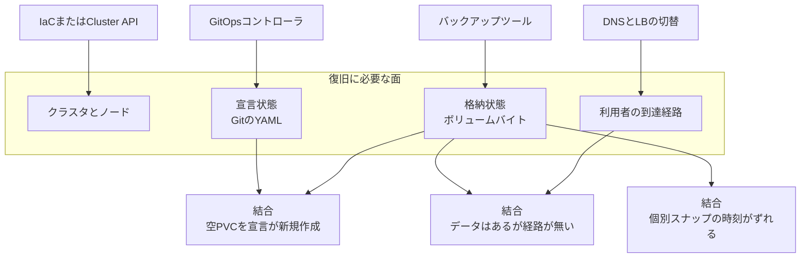

2026-09-10、CNCF Blog に [Kubernetes disaster recovery: Guidance from three reproducible failure scenarios](https://www.cncf.io/blog/2026/09/10/kubernetes-disaster-recovery-guidance-from-three-reproducible-failure-scenarios/) が公開されました。
著者は Saiyam Pathak 氏と Saloni Narang 氏（CNCF Ambassadors）です。
KubeCon + CloudNativeCon Japan 2026 セッション『Is Your Kubernetes Disaster Recovery Actually Ready?』の公開版で、Kubernetes 上の stateful アプリケーションを、バックアップがある状態から実際に復旧できるかを3つの再現ラボで切り分けます。
出典は CNCF ブログの Ambassadors 寄稿であり、CNCF TOC の標準やホワイトペーパーではありません。

読者が得るものは、復旧に必要な面の分担、Backup Completed / GitOps Synced / Snapshot ReadyToUse が結合では失敗し得る経路、VolumeGroupSnapshot の適用範囲、未使用の復旧先で期待データを確認する完了条件です。

:::message
寄稿の公開は 2026-09-10、本稿の参照は 2026-09-12 時点です。拘束力のある正本は Kubernetes CSI、Volume Group Snapshot の公式ドキュメント、Velero v1.18 の各リファレンスです。再現手順は公開ラボ [saiyam1814/kubecon-japan-dr-demo](https://github.com/saiyam1814/kubecon-japan-dr-demo) にあります。
:::

*この記事の全体像。以下、順に解説します。*

## Kubernetes災害復旧の欠落とは

対象は stateful アプリの復旧です。
コンプライアンス枠、製品比較、クラウドやデータセンター基盤そのものの復旧はスコープ外と明記されています。
GitOps とバックアップツールを併用して、クラスタ横断の復旧手順を設計する運用者が想定読者です。

文書はバックアップの YAML とボリュームバイト、Git の宣言状態とストアの格納状態、複数 PVC の時刻整合を別物として扱います。
各工程の成功表示が、結合では失敗し得る経路を示します。
Velero と CSI スナップショット API は参照実装として使われます。

ラボの構成は次です。

- 本番クラスタ（kiac。ノードが独立 VM）
- 災害前から存在する復旧クラスタ（kind）
- クラスタ外の S3 互換ストア（SeaweedFS）
- 復旧側 GitOps（Gitea + Argo CD）

ワークロードは既知の4行を持つ PostgreSQL と、2本の PVC に対で書き込む ledger です。

3つのシナリオは次の切り分けです。

| シナリオ | 操作 | 見るもの |
|---|---|---|
| 1 | Velero DataUpload の `bytesDone` でボリュームバイトの移動を確認し、namespace 削除後に同一4行を戻す | YAML とボリュームバイトの両方 |
| 2 | 本番 VM 停止後、GitOps 同期は Synced / Ready になるが DB は空。空アプリを消してバックアップから戻す | 宣言状態と格納状態 |
| 3 | 2本の VolumeSnapshot を5秒ずらすと、各 snapshot は ReadyToUse でも結合復旧点が存在しない時刻になる。VolumeGroupSnapshot の member から戻すとシーケンスが揃う | 複数巻の時刻整合 |

VolumeGroupSnapshot は Kubernetes 1.36 で GA です。
API は `groupsnapshot.storage.k8s.io/v1` です（[2026-05-08 公式ブログ](https://kubernetes.io/blog/2026/05/08/kubernetes-v1-36-volume-group-snapshot-ga/)）。

バックアップツールは既に存在するクラスタへリソースを戻します。
クラスタ、ノード、ネットワーク、LB、DNS の作成は IaC / Cluster API の責務です。

復旧が成立するには、少なくとも次の面が同時に戻ります。
各面には成熟したツールがあります。
失敗は面の結合で起きます。

責任分担は次です。

| 面 | 持つもの | 持たないもの |
|---|---|---|
| Git / GitOps | 意図（Deployment、Service、volumeClaimTemplates） | PVC のデータ実体 |
| バックアップ（Velero 等） | オブジェクト YAML とボリュームバイト（スナップショットまたは data mover） | クラスタそのもの、DNS、LB |
| CSI VolumeSnapshot | 単一ボリュームの時点 | 複数ボリュームの同一 write stream |
| CSI VolumeGroupSnapshot | 対応ドライバーにおける crash-consistent な複数巻の時点 | アプリケーション整合（flush / WAL replay） |
| IaC / Cluster API | クラスタ、ノード、基盤ネットワーク | アプリデータ |

## 注意点

出典は CNCF ブログですが、CNCF TOC の標準やホワイトペーパーではありません。
著者肩書は CNCF Ambassadors です。
寄稿が指す initiative [cncf/toc#1779](https://github.com/cncf/toc/issues/1779) は 2026-09-12 時点で OPEN、ラベルは `needs-triage` / `help wanted` です。
成果物は未交付です。
本寄稿を「CNCF の DR 標準」として引用しないでください。

ラボの定量は1回の実測キャプチャです。

| 数値 | 意味 | 外挿してよい範囲 |
|---|---|---|
| `bytesDone` 47,989,888 | 当該バックアップで data mover が報告した処理バイト | そのラボ実行の証拠。本番容量の指標ではない |
| 同一クラスタ restore 約2分 | namespace 削除から4行確認まで | スクリプト区間 |
| 電源断から検証済みデータまで 4分 live / 再演 2分弱 | 記事自身が scripted slice と限定 | 本番 RTO ではない |
| 個別スナップ 108352 対 108377（差25） | 5秒ギャップの1実行 | ギャップ幅と書き込み頻度に依存 |
| グループ側 109169 / 109169 | 同一実行の verifier | hostpath は writer pause と逐次 archive |

記事末尾のミラー [blog.kubesimplify.com/a-backup-is-not-disaster-recovery](https://blog.kubesimplify.com/a-backup-is-not-disaster-recovery) は 2026-09-12 に HTTP 404 です。

Velero 公式サンプルの `VolumeGroupSnapshotClass` に `driver: ebs.csi.aws.com` と書いてあるのは YAML の例です。
同じサンプルの `apiVersion` は `groupsnapshot.storage.k8s.io/v1alpha1` のままです。
Velero 1.18.1 が話すのは v1beta2 です。
AWS EBS CSI の README に Group Controller RPC の記載はありません。
`CreateVolumeGroupSnapshot` のコード検索（`kubernetes-sigs/aws-ebs-csi-driver`、2026-09-12）は 0 件です。

ラボは CSI hostpath テストドライバーを使います。
member を逐次 archive するため writer を pause します。
時点保証は本番ドライバーのストレージバックエンドに属する、と寄稿自身が書いています。
hostpath のデモ結果をクラウド CSI の能力とみなさないでください。

公開ラボ [saiyam1814/kubecon-japan-dr-demo](https://github.com/saiyam1814/kubecon-japan-dr-demo) は 2026-09-12 の `gh repo view` で star 約0、pushedAt は 2026-07-29 です。
定量の外的妥当性は低いです。
本稿はラボを再実行していません。
数値は寄稿と DEMO-STEPS の一次テキストです。

Velero 1.18 の tested Kubernetes は 1.33.7 / 1.34.1 / 1.35.0 です。
1.36 GA の `v1` VolumeGroupSnapshot API を Velero 1.18 が話すかは、公式 compatibility の tested 列にありません。

## Backup Completedはデータ実体の証明になるか

Kubernetes バックアップはリソース YAML と PV データの二部です。
Velero CSI Snapshot Data Movement はスナップショット取得後に `DataUpload` を作り、オブジェクトストアへバイトを移します。
進捗は `status.progress.bytesDone` / `totalBytes` です。
終端は Completed / Failed / Cancelled です（[Velero v1.18 SDM](https://velero.io/docs/v1.18/csi-snapshot-data-movement/)）。

シナリオ1のラボは、`Completed` かつ `bytesDone=47989888` を確認したうえで namespace（PVC 含む）を消し、同じ4行を戻しました。
Backup.phase だけでは、バイトがストアへ乗ったことは分かりません。

寄稿が列挙する、自動では埋まらない点は次です。

1. アプリ整合のための flush / quiesce
2. 別インフラへの StorageClass 変換
3. Completed はアプリ起動、期待データ、トラフィックの証明ではない

Velero backup hooks v1.18 は fsfreeze、`FLUSH TABLES WITH READ LOCK`、timeout 既定 30s を持ちます（[公式](https://velero.io/docs/v1.18/backup-hooks/)）。
Restore 時の StorageClass 変換は ConfigMap ラベル `velero.io/change-storage-class` です（[Restore Reference](https://velero.io/docs/v1.18/restore-reference/)）。
DataUpload の item-operation-timeout 既定は 4h、prepare timeout 既定は 30m です。

監視は Backup.phase だけでなく、DataUpload の終端とバイト、restore rehearsal の期待データ照会までを完了条件にします。
ラボの「約2分」は4行 Postgres のスクリプト時間です。
本番の所要時間には使いません。

Velero built-in data mover はリポジトリ共通の静的暗号化鍵を使う、と公式 Limitations が書きます。
バックアップストアへのアクセス制御は別リスクです。

## GitOpsのSyncedは格納状態を戻すか

シナリオ2の復旧クラスタは、アプリを一度も動かしていません。
Argo CD 同期は Synced、Postgres は Ready、照会は `ERROR: relation "attendees" does not exist` です。
Git は宣言だけを持ちます。
`volumeClaimTemplates` は新しい空 PVC を正規動作で作ります。

寄稿の成功手順は次です。

1. 空アプリを削除する
2. バックアップからオブジェクトとボリュームを戻す
3. 期待データで検証する

復旧は kiac から kind へ基板をまたぎます。
ポータビリティはテスト対象であり、前提ではありません。

Kubernetes StatefulSet の scale down は、既定でボリュームを消しません。
空 DB は別クラスタ、PVC 削除、新規 claim で起きます。

この経路は、Git に載っているのが素の StatefulSet YAML であるときに成立します。
データ所有者を Git に書く設計では、同期が復旧を起動します。

| 設計 | Git が持つもの | 同期が起動すること |
|---|---|---|
| 素の StatefulSet YAML | Deployment 相当の意図と volumeClaimTemplates | 新しい空 PVC のプロビジョン |
| CloudNativePG | `spec.bootstrap.recovery` で新しい Cluster を bootstrap。既存 Cluster の in-place restore はしない。WAL アーカイブが PITR に必須。VolumeSnapshot は base、WAL replay が整合の本体（[CNPG 1.27 Recovery](https://cloudnative-pg.io/docs/1.27/recovery)） | データ面の復旧 |
| Helm 系 | `persistence.existingClaim` | 先に戻した PVC への搭載 |
| 運用結合 | GitOps の selfHeal を止め、Velero に PVC を渡す | 既知の手順 |

Git に載せるものを分類してください。
素の StatefulSet なら、restore 後に GitOps を再開する順序を手順書にします。
DB オペレータなら、データ面の宣言を Git の正にします。

## 複数PVCの時刻ずれとVolumeGroupSnapshot

シナリオ3の ledger は、order n と payment n を別 PVC へ毎秒5回書きます。
不変条件は「すべての payment に order がある」です。

個別 VolumeSnapshot を5秒ずらすと、双方 ReadyToUse でも verifier が FAIL します。
キャプチャは order 108352 / payment 108377、payment 25件が孤立です。
VolumeGroupSnapshot の member VolumeSnapshot から戻すと双方 109169、verifier は OK です。

個別 ReadyToUse の積集合は、存在した時刻ではありません。

Kubernetes 1.36 で API は `groupsnapshot.storage.k8s.io/v1` です。
CSI ドライバーのみです。
ドライバーは Group Controller と `CreateVolumeGroupSnapshot` / `DeleteVolumeGroupSnapshot` / `GetVolumeGroupSnapshot`、capability `CREATE_DELETE_GET_VOLUME_GROUP_SNAPSHOT` が必須です（[GA ブログ](https://kubernetes.io/blog/2026/05/08/kubernetes-v1-36-volume-group-snapshot-ga/)、[CSI 開発者ガイド](https://kubernetes-csi.github.io/docs/group-snapshot-restore-feature.html)）。

リストアはグループオブジェクトから一括ではありません。
member の `VolumeSnapshot` を PVC `dataSource` にします。
crash-consistent はアプリケーション整合ではありません。
GA ブログは quiesce なしの write-order consistency と明記します。
複数 CSI driver をまたぐグループは失敗します。

VGS のライフサイクルは Alpha 1.27、Beta 1.32 / 1.34、GA 1.36 です。
Velero は 1.17 で VGS 連携し、1.18.1 は VolumeGroupSnapshot **v1beta2** と external-snapshotter v8.2.0 以降です（[Velero VGS](https://velero.io/docs/v1.18/volume-group-snapshots/)）。
PVC ラベル既定は `velero.io/volume-group` です。
リストアは通常の VolumeSnapshot 経路です。
`--enable-volume-group-snapshots` は削除され、feature gate `CSIVolumeGroupSnapshot` へ移っています。

ドライバー実装（2026-09-12）は次です。

| ドライバー | Group RPC / 公式記載 |
|---|---|
| CSI hostpath | 実装あり。CI/デモ。逐次。非本番 |
| Ceph CSI（CephFS。RBD は matrix 記載が分かれる） | README に Volume group snapshot。ステータス Alpha 表記が残る |
| NetApp Trident | ontap-san（iSCSI/FC）等で公式ドキュメント |
| Dell PowerStore / PowerFlex | ドライバー README。旧 Dell CSM VGS operator は独自 CRD で、標準 API とは別系統 |
| AWS EBS / Azure Disk / GCE PD CSI | 公式 README に Group Controller 記載なし。EBS リポの `CreateVolumeGroupSnapshot` 検索 0 件 |

AWS IaaS の [`CreateSnapshots`](https://docs.aws.amazon.com/AWSEC2/latest/APIReference/API_CreateSnapshots.html) は、同一 EC2 に付いた複数 EBS の crash-consistent スナップショットを提供します。
CSI VGS 未実装でも、同一ノードに載る複数ボリュームには別経路があります。

VGS は「個別 ReadyToUse の積集合 ≠ 存在した時刻」を API で潰す経路です。
本番価値は、配列が CSI spec の write-order MUST を実装するときに出ます。
WAL がある DBMS、Velero hooks で quiesce できるアプリ、単一 PVC 構成では、VGS は必要条件ではありません。

複数 PVC アプリは次のどれが実装されているかを、ドライバーとオペレータで確認します。

1. WAL / PITR
2. backup hooks の quiesce
3. 配列 / IaaS グループスナップ
4. CSI VGS

Ceph RBD の VGS ステータスは、CephFS matrix と examples が一致しません。
主要クラウド CSI は README と1リポの code search までの確認です。
ソース全ファイルの網羅ではありません。

## 復旧テストとRTOの測り方

寄稿の復旧テスト定義は次です。

1. そのアプリを動かしたことがないクリーンな先へ stateful 一式を戻す
2. リソース status ではなく期待データと利用者経路を見る
3. 時計で測る

ラボの 2から4分はスクリプト区間です。
本番 RTO は検知、判断、トラフィック切替、フェイルバックを包む、と寄稿が書きます。

[NIST SP 800-34 Rev. 1 の RTO](https://csrc.nist.gov/glossary/term/rto) は、情報システムの構成要素が recovery phase に留まれる全体時間です。
同 glossary の MTD は、mission / business process が重大な害なく中断できる時間です。
検知込みの壁時計は BCM では新しい定義ではありません。

Kubernetes 固有の寄与は「ダッシュボードが緑になった瞬間を復旧完了にしない」測定境界です。
RTO 語彙そのものの発明ではありません。
寄稿はコンプライアンス枠をスコープ外としつつ、この語彙を使います。
ラボの 2から4分を SLA にしないでください。

## エコシステムの欠落と運用で埋める範囲

寄稿が挙げる欠落は次の3点です。

1. クロスクラスタ failover の共通契約がコア Kubernetes に無い
2. アプリを復旧単位にする標準 Application リソースがコアに無い（namespace / ラベル / GitOps Application / Helm release が境界を別々に引く）
3. バックアップ成功メトリクスは広く、restore rehearsal は稀

1 と 2 は 2026-09-12 時点でコア API として確認できません。
3 は Velero 単体運用には強く、商用データ保護では既に restore ジョブが文書化されています。
Kasten の data-only ガードや別 NS restore が例です。
CloudCasa の有料 SLA 例はサービス稼働 99.9% であり、restore RTO の契約ではありません（製品マーケティングページの二次情報です）。

コア API が無いことを待たず、結合手順の実走を先に固定できます。

1. 未使用の復旧クラスタ（または別 NS）へ、本番相当の stateful を restore し、固定クエリと到達経路を時計付きで記録する。Backup.phase と DataUpload.bytesDone を別メトリクスにする
2. Git に載せるものを分類する。素の StatefulSet なら restore 後に GitOps を再開する。DB オペレータならデータ面の宣言を Git の正にする
3. 複数 PVC アプリは WAL / PITR、backup hooks、配列 / IaaS グループスナップ、CSI VGS の実装有無を確認する
4. RTO 目標はスクリプト時間ではなく、検知から切替までを含めて測る
5. toc#1779 は未トリアージ提案として追跡する

この設計が崩れる条件は次です。

- 主要クラウド CSI が Group Controller RPC を実装し、I/O 無停止で CSI spec の write-order を満たす、とドライバーテストで示される
- Git のみ（recovery bootstrap もバックアップ restore も existingClaim も無し）が stateful データの標準復旧手段である、と SIG が規範化する
- toc#1779 がクローズし、Completed / Synced / ReadyToUse を復旧完了と定義してはならない、を CNCF 成果物が採択する

## まとめ

素の StatefulSet と Git の宣言と個別 VolumeSnapshot という組み合わせでは、Backup Completed、GitOps Synced、Snapshot ReadyToUse が揃っても、データが空、または存在しない時刻の結合復旧点になり得ます。
完了条件は、一度も動かしていない復旧先での期待データ検証を含めます。
VGS は crash-consistent な複数巻の時刻ずれを減らせますが、CSI 実装とアプリ整合は別です。

一般化して「GitOps はデータを戻せない」「VGS が唯一の答え」「2から4分が RTO」と読むと、適用範囲を外れます。
適用範囲は、データソースを Git に持たない素の YAML と、quiesce も WAL も無い複数 PVC アプリに置きます。

意思決定は、バックアップ成功と GitOps 同期を復旧完了にしないことです。
完了条件は「一度も動かしていない復旧先で、期待データと利用者経路を確認した」にします。
ツール選定より結合手順の実走を先に固定してください。

この記事が少しでも参考になった、あるいは改善点などがあれば、ぜひリアクションやコメント、SNSでのシェアをいただけると励みになります！

## 参考リンク

- Saiyam Pathak, Saloni Narang, [Kubernetes disaster recovery: Guidance from three reproducible failure scenarios](https://www.cncf.io/blog/2026/09/10/kubernetes-disaster-recovery-guidance-from-three-reproducible-failure-scenarios/), CNCF Blog, 2026-09-10
- [公開ラボ saiyam1814/kubecon-japan-dr-demo](https://github.com/saiyam1814/kubecon-japan-dr-demo)
- Xing Yang, [Kubernetes v1.36: Moving Volume Group Snapshots to GA](https://kubernetes.io/blog/2026/05/08/kubernetes-v1-36-volume-group-snapshot-ga/), 2026-05-08
- [Kubernetes CSI, Volume Group Snapshot Feature](https://kubernetes-csi.github.io/docs/group-snapshot-restore-feature.html)
- [Velero Backup Hooks v1.18](https://velero.io/docs/v1.18/backup-hooks/)
- [Velero CSI Snapshot Data Movement v1.18](https://velero.io/docs/v1.18/csi-snapshot-data-movement/)
- [Velero Volume Group Snapshots v1.18](https://velero.io/docs/v1.18/volume-group-snapshots/)
- [Velero Restore Reference（StorageClass mapping）](https://velero.io/docs/v1.18/restore-reference/)
- [CloudNativePG 1.27 Recovery](https://cloudnative-pg.io/docs/1.27/recovery)
- [cncf/toc#1779 Cloud Native Business Continuity](https://github.com/cncf/toc/issues/1779)（2026-09-12 時点 OPEN）
- [NIST CSRC Glossary, Recovery Time Objective](https://csrc.nist.gov/glossary/term/rto)（NIST SP 800-34 Rev. 1）
- [AWS EC2 API CreateSnapshots](https://docs.aws.amazon.com/AWSEC2/latest/APIReference/API_CreateSnapshots.html)
