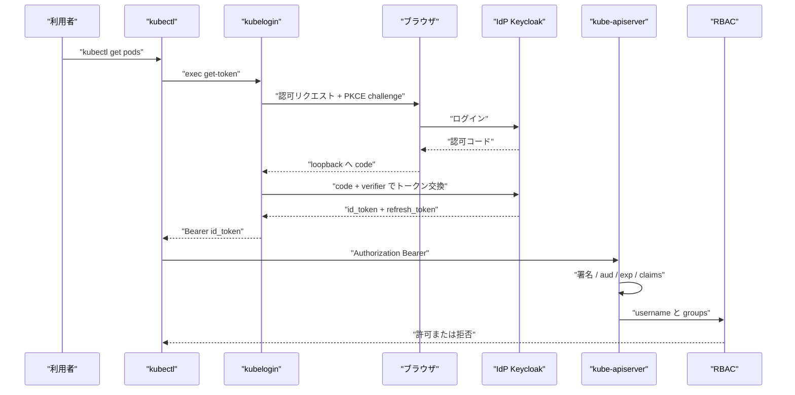

2026-09-08、CNCF Blog に [Kubernetes access via an identity provider: Public client, not confidential](https://www.cncf.io/blog/2026/09/08/kubernetes-access-via-an-identity-provider-public-client-not-confidential/) が公開されました。
著者は Kolawole Olowoporoku 氏（CNCF Ambassador、Senior Platform Engineer）です。
セルフホスト Kubernetes で、人間の kubectl を Identity Provider（IdP）の公開クライアントと PKCE で結ぶ運用設計です。
新仕様の到達宣言ではありません。

読者が得るものは、3部品の責任境界、公開クライアントを採る条件、kube-apiserver の claim 合わせ、失効と監査の検収項目です。

:::message
寄稿の公開は 2026-09-08、本稿の参照は 2026-09-09 時点です。拘束力のある正本は Kubernetes 公式ドキュメント、RFC 8252、RFC 9700 です。
:::


*この記事の全体像。以下、順に解説します。*

## 公開OIDCクライアントとPKCEによるKubernetes利用者認証とは

セルフホスト Kubernetes では、人間の API アクセスを静的なクライアント証明書や長寿命トークンの kubeconfig で渡すことが多いです。
寄稿が示す構成は、Keycloak など OIDC 準拠の IdP を前に置き、kubectl の exec プラグイン kubelogin（`kubectl oidc-login`）と kube-apiserver の OIDC 認証プラグインを、公開クライアントと PKCE で結びます。

対象読者は、オンプレ／セルフホストで利用者の識別と権限変更を IdP 側のアカウント運用に寄せたいプラットフォーム担当です。

Kubernetes は通常ユーザーを API オブジェクトとして持ちません。
認証プラグインが UserInfo（username / groups）を付け、RBAC がその主体に権限を付けます。
成功した認証者は常に `system:authenticated` グループを含みます。

寄稿の3部品は次です。

| 部品 | 役割 |
|---|---|
| kubelogin | ブラウザログインとトークン取得。kubectl の exec-credential として動く |
| IdP（Keycloak など） | 本人確認と groups claim の発行 |
| kube-apiserver | `--oidc-issuer-url` / `--oidc-client-id` / `--oidc-groups-claim` などで JWT を検証 |

クライアントは confidential（共有 secret）ではなく public です。
PKCE（S256）で認可コードの横取り交換を止めます。
kubeconfig のユーザー定義は `client.authentication.k8s.io/v1` の exec で、secret フィールドを置きません。
RBAC は IdP グループを `ClusterRoleBinding` の `kind: Group` に結びます。
確認は `kubectl auth whoami`（SelfSubjectReview）です。
Direct Access Grants（ROPC）は Off です。

人間の kubectl がトークンを得る経路と、API サーバがトークンを検証する経路は別です。



責任境界は次です。

| 部品 | 持つもの | 持たないもの |
|---|---|---|
| IdP | アカウント、グループ、クライアント種別、PKCE 強制、トークン発行 | Kubernetes オブジェクト |
| kubelogin | ブラウザフロー、PKCE、トークンキャッシュ | クラスタ権限の判定 |
| kube-apiserver | JWT 検証、claim から UserInfo への写像 | ログイン画面、トークン失効リスト |
| RBAC | グループ／ユーザーへの権限 | 本人確認 |

## 注意点

出典は CNCF 公式仕様の到達宣言ではありません。
寄稿者の運用解説です。

| 記事の言い方 | 公式・BCP 側の限定 |
|---|---|
| 「OAuth 2.1 が native/CLI について既に決着」 | OAuth 2.1 は 2026-09-03 時点で Internet-Draft（[draft-ietf-oauth-v2-1-16](https://www.ietf.org/archive/id/draft-ietf-oauth-v2-1-16.html)）。拘束力のある正本は [RFC 8252](https://www.rfc-editor.org/rfc/rfc8252.html)（BCP 212）と [RFC 9700](https://www.rfc-editor.org/rfc/rfc9700.html)（BCP 240） |
| 「署名鍵を一度取る以外、API サーバは IdP に届かなくてよい」 | 個々のリクエストは JWT をローカル検証します（phone home しません）。JWKS / discovery は起動・鍵回転・未知の `kid` で再取得します |
| 「グループ変更は直ちに適用。クラスタ側変更も kubeconfig 再配布も不要」 | **次に発行される ID トークン**から groups claim が変わります。既存 JWT は `exp` まで有効です。公式は「id_token can't be revoked, it's like a certificate」と書きます |
| 「セットアップは半日」 | 著者の工数目安です |
| Valid redirect `http://127.0.0.1:*` と `http://localhost:*` | kubelogin の登録例は `http://localhost:8000` と `:18000` です。[RFC 8252](https://www.rfc-editor.org/rfc/rfc8252.html) は localhost を非推奨とします。Keycloak は native 用に特殊 URI `http://127.0.0.1`（任意ポート）を用意します |

ID token は失効できません。
kubelogin は有効な ID token をキャッシュ返却します。
既定キャッシュはディスク（`~/.kube/cache/oidc-login`）です。
クラスタ CA と exec 引数は引き続き配ります。
公開クライアントでも impersonation と refresh 盗難は残ります。
手順書が `kubelogin` だけだと Azure/kubelogin（Entra 用）と取り違えます。
Homebrew core の int128 式は `kubectl-oidc_login` です。

Keycloak の wildcard redirect は繰り返し事故っています。
[CVE-2023-6927](https://github.com/advisories/GHSA-9vm7-v8wj-3fqw)（Keycloak < 23.0.4、patched 23.0.4）は JARM `form_post.jwt` と wildcard の組み合わせです。
汎用 `*` は使いません。

## 証明書や長寿命トークンと比べて何が変わるか

確立している事実は次です。

- 通常ユーザーはクラスタ API で作れません
- クライアント証明書は `notAfter` まで有効です。Kubernetes 1.37 は証明書失効をサポートしません
- 共有 kubeconfig は監査ログ上の主体が同じになり、個人識別が落ちます

寄稿の問題設定（退職後もファイルが生きる、コピーを探し切れない）は、公式のユーザーモデルと整合します。

比較は次です。

| 基準 | 証明書 / 静的トークン | confidential OIDC + secret 配布 | public OIDC + PKCE | webhook / 認証プロキシ |
|---|---|---|---|---|
| 端末の共有 secret | 秘密鍵・トークンファイル | client secret | なし（refresh は端末に残る） | 構成による |
| 個人識別（監査） | CN がユニークなら可。共有ファイルだと崩れる | 可 | 可（claim 設計次第） | 可 |
| 権限変更の速さ | 証明書は期限まで。失効 API なし | 次のトークン以降 | 次のトークン以降 | 問い合わせごとに近い |
| 実装の複雑さ | 低い | IdP + secret 回転 | IdP + PKCE + prefix 合わせ | 高い |
| BCP との関係 | 人間の native には不適 | RFC 8252 が非推奨 | RFC 8252 の本線 | 別系統 |
| 人間以外 | ノードは今も証明書 | 不適 | 不適（SA を併用） | 用途次第 |

人間のクラスタアクセスでは、端末へ confidential client secret を配るより、公開クライアント + PKCE + IdP グループ + RBAC の方が RFC 8252 に沿います。
ただし「グループ操作だけで即時失効」と「kubeconfig 配布からの解放」は成立しません。

## 公開クライアントとPKCEを採る条件

[RFC 8252](https://www.rfc-editor.org/rfc/rfc8252.html) は native app を public client とします。
静的埋め込み secret は confidential として扱いません。
PKCE は必須です。

kubelogin は Discovery の `code_challenge_methods_supported` で PKCE を自動選択します。
強制するなら `--oidc-pkce-method=S256` です。
`--oidc-client-secret` は任意です。
public なら空でよいです。

PKCE は認可コード横取り対策です。
発行後の refresh / ID token の bearer 性までは消しません。

合う条件は次です。

- 対象が人間の kubectl である
- ブラウザまたは device-code が使える
- IdP で PKCE を強制でき、redirect を loopback に閉じられる
- ID token を短命にでき、refresh を失効できる

合わない条件は次です。

- CI / コントローラ / in-cluster ワークロード（ServiceAccount）
- kubelet・制御プレーン（クライアント証明書）
- 発行済み JWT の即時無効化が法令・契約で必須（webhook / 超短命 + 強制再発行が要る）
- ヘッドレスで ROPC に逃げる運用（RFC 9700 違反）

逆転条件は次です。

- 監査が「権限剥奪の即時」を JWT TTL より短く要求する
- 利用者がブラウザも device-code も使えない
- IdP が groups を ID token に配列で出せない（access token にしか無い構成）

## kube-apiserverとRBACの合わせ方

必須フラグは `--oidc-issuer-url`（https のみ）と `--oidc-client-id` です。

寄稿が使う任意フラグは次です。

- `--oidc-username-claim=preferred_username`（公式既定は `sub`）
- `--oidc-groups-claim=groups`（値は **string 配列**）
- 自己署名 IdP なら `--oidc-ca-file`

```text
--oidc-issuer-url=https://<your-keycloak-host>/realms/<realm>
--oidc-client-id=kubernetes
--oidc-username-claim=preferred_username
--oidc-groups-claim=groups
```

未指定時の罠は次です。

- username claim が `email` 以外で `--oidc-username-prefix` 未指定 → 既定 prefix は `(Issuer URL)#`。無効化は `--oidc-username-prefix=-`
- `--oidc-groups-prefix` の `oidc:` は公式表の例です。付けないなら明示しないか、Structured Auth では空文字を明示します
- 署名アルゴリズム既定は RS256 です。IdP が ES384 等だと `--oidc-signing-algs` が必要です

Structured Authentication Configuration は Kubernetes v1.34 で Stable です。
`--oidc-*` と `--authentication-config` の併用は即終了する misconfiguration です。

kubectl 側の最小例は [int128/kubelogin](https://github.com/int128/kubelogin) の README です。
secret はありません。

```yaml
users:
  - name: oidc
    user:
      exec:
        apiVersion: client.authentication.k8s.io/v1
        command: kubectl
        args:
          - oidc-login
          - get-token
          - --oidc-issuer-url=https://<your-keycloak-host>/realms/<realm>
          - --oidc-client-id=kubernetes
          - --oidc-pkce-method=S256
```

インストールは次のいずれかです。

```bash
# Homebrew（macOS / Linux）。バイナリ名は kubectl-oidc_login
brew install kubelogin

# Krew
kubectl krew install oidc-login
```

Azure 向けの `Azure/kubelogin` とは別物です。
手順書は `kubectl oidc-login`（int128）と Azure `kubelogin` を書き分けます。

RBAC は IdP のグループ名を subject にします。

```yaml
apiVersion: rbac.authorization.k8s.io/v1
kind: ClusterRoleBinding
metadata:
  name: platform-viewers
subjects:
  - kind: Group
    name: platform-viewer
    apiGroup: rbac.authorization.k8s.io
roleRef:
  kind: ClusterRole
  name: view
  apiGroup: rbac.authorization.k8s.io
```

確認は次です。

```bash
kubectl auth whoami
```

成功例では Username と Groups が出ます。
Groups には IdP のグループと `system:authenticated` が並びます。
claim 名、prefix、RBAC subject が1文字でもずれると、認証は通っても認可が落ちます。

## 失効と監査で確認すること

監査の個人識別は、username claim が安定して一意であることに依存します。
`preferred_username` は変更されえます。
不変なら `sub` です。

退職・権限変更の検証項目は、IdP のグループ削除だけでは足りません。

1. 発行済み ID token の TTL（公式は数分を推奨）
2. refresh token の失効／rotation
3. 端末の `~/.kube/cache/oidc-login`（または keyring）の削除
4. `kubectl auth whoami` で新しい groups が出ること

キャッシュ削除は次です。

```bash
kubectl oidc-login clean
```

既定はディスクです。
keyring にするなら `--token-cache-storage=keyring` です。

redirect は loopback IP に揃えます。
kubelogin の listen 既定は `127.0.0.1:8000` と `:18000` です。
一方、redirect URL の既定は `http://localhost:<port>` です。
IdP に `127.0.0.1` を登録するなら、クライアント側で `--oidc-redirect-url=http://127.0.0.1:8000/`（と 18000）を明示します。
Keycloak 特殊 URI `http://127.0.0.1`（任意ポート）を使う場合も、クライアント側を 127.0.0.1 に合わせます。
`localhost*` と汎用 `*` は使いません。

即時剥奪が必須なら、このパターン単体ではブロックします。
短命トークンと refresh 失効をセットにできるなら、人間 kubectl の既定として進めてよいです。
ノード・ServiceAccount・break-glass 証明書は残します。
CI は ServiceAccount です。
人間の password grant を CI に流用しません。

## セットアップ前の検収チェック

寄稿の手順をクラスタへ貼る前に、次を確認します。

1. `--oidc-username-claim` / `--oidc-username-prefix` / `--oidc-groups-claim` / `--oidc-groups-prefix` と RBAC subject を `kubectl auth whoami` で一致確認する
2. redirect は loopback IP に揃える。IdP と kubelogin のホスト名（`127.0.0.1` か `localhost`）を一致させる
3. PKCE S256 を強制する。Direct Access Grants を Off にする
4. ID token を短命にする。退職時は IdP で refresh を失効し、TTL 経過と `oidc-login clean` を検証する
5. apiserver から IdP の discovery / JWKS へ継続到達できること（`--oidc-ca-file` 含む）
6. 手順書は `kubectl oidc-login`（int128）と Azure `kubelogin` を書き分ける
7. CI は ServiceAccount。人間の password grant を CI に流用しない

未確認のまま残る点もあります。

- 寄稿環境の実際の ID token / refresh 寿命
- 使用 Keycloak 版で `http://127.0.0.1:*` が特殊 URI `http://127.0.0.1` と同等か
- refresh 時に groups claim が再評価されるか（IdP 実装依存）
- 各組織の監査要件が「JWT 期限まで残存」を許容するか

## まとめ

人間の kubectl には、公開 OIDC クライアント + PKCE + グループ RBAC を採ります。
confidential secret の全端末配布は採りません。
ノード・ServiceAccount・break-glass 証明書は残します。

核は、secret を配らないことと、IdP の本人とグループを RBAC と監査に繋ぐことです。
確信度を下げるべきなのは即時性と「配布ゼロ」です。
グループ変更は次のトークンから効きます。
クラスタ CA と exec 引数は配り続けます。

この記事が少しでも参考になった、あるいは改善点などがあれば、ぜひリアクションやコメント、SNSでのシェアをいただけると励みになります！

## 参考リンク

1. Kolawole Olowoporoku, “Kubernetes access via an identity provider: Public client, not confidential”, CNCF Blog, 2026-09-08. https://www.cncf.io/blog/2026/09/08/kubernetes-access-via-an-identity-provider-public-client-not-confidential/
2. Kubernetes, “Authenticating”. https://kubernetes.io/docs/reference/access-authn-authz/authentication/
3. Kubernetes, “kubectl auth whoami”. https://kubernetes.io/docs/reference/kubectl/generated/kubectl_auth/kubectl_auth_whoami/
4. int128/kubelogin. https://github.com/int128/kubelogin
5. RFC 8252, OAuth 2.0 for Native Apps (BCP 212), 2017-10. https://www.rfc-editor.org/rfc/rfc8252.html
6. RFC 9700, OAuth 2.0 Security Best Current Practice, 2025-01. https://www.rfc-editor.org/rfc/rfc9700.html
7. draft-ietf-oauth-v2-1-16, 2026-09-03. https://www.ietf.org/archive/id/draft-ietf-oauth-v2-1-16.html
8. Keycloak, “Securing applications and services with OpenID Connect”. https://www.keycloak.org/securing-apps/oidc-layers
9. GHSA-9vm7-v8wj-3fqw / CVE-2023-6927（Keycloak < 23.0.4）. https://github.com/advisories/GHSA-9vm7-v8wj-3fqw
