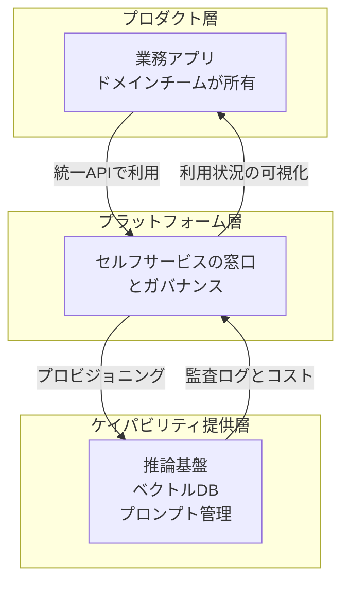

社内で生成AIの活用が部門単位から組織横断へ広がると、必ず所有権の問題にぶつかります。

- モデルの選定と切り替えは誰が決めるのか
- 推論APIの利用料が予算を超えたとき、誰が止めるのか
- ハルシネーションで業務に影響が出たとき、誰が一次対応するのか

この問いに「AI推進チームを新設して全部任せる」と答えると、たいてい失敗します。AIパイプラインはモデル、データ、アプリケーション、セキュリティ、コストを横断するため、単一チームに閉じた瞬間に他部門との間に責任の空白が生まれるからです。

CNCF Blogに2026年8月13日に掲載されたDaniel Bryant氏の寄稿「LLMOps and platform engineering: Who should own the AI pipeline?」は、この問題をプラットフォームエンジニアリングの語彙で整理しています。本記事では、その所有境界の考え方を、発注側や事業部の意思決定者が自組織へ持ち帰れる形に再構成します。読み終えたときに、AI導入の議論を「どのツールを入れるか」から「どの層を誰が持つか」へ切り替えられる状態を目指します。

*この記事の全体像。以下、順に解説します。*

## AIパイプラインの所有者を1人に決めると失敗する

現場でよく見る2つの失敗があります。

**責任の空白**

データサイエンティストにAIパイプライン全体を任せると、モデルの精度には責任を持てても、認証、監査ログ、インフラコストには責任を持てません。境界が曖昧なまま運用が始まり、障害時に一次対応者が決まりません。

**シャドーAI**

逆にガバナンスを効かせようとして中央集権のAI推進チームを作ると、承認待ちが発生します。待てない事業部は自分たちで外部APIを直接叩き始めます。統制の外側にパイプラインが増え、利用実態が把握できなくなります。

どちらも原因は同じで、**AIを「誰か1人が持つ特別なもの」として扱っている**ことです。寄稿の主張は、LLMOpsを独立した王国にせず、既存のプラットフォームエンジニアリングの構造へ組み込むべきだという点にあります。

## 問いを「誰が持つか」から「どの層を持つか」へ

寄稿が提示する整理は、パイプラインを3つの層に分けるものです。所有者を1人決めるのではなく、層ごとに所有者を決めます。

この分け方の効きどころは3つあります。

1. **AIが特別扱いされなくなる**。LLMOpsは、CI/CDやデータベースと同じく、プラットフォームが提供するケイパビリティの1つになります。
2. **窓口が1つになる**。データサイエンティストもアプリ開発者も、同じセルフサービスの仕組みを使います。専門家だけが触れる裏口を作らないことが要点です。
3. **ガバナンスが通り道に埋まる**。承認プロセスを外付けの関門にせず、プラットフォームの内側に置きます。

寄稿はこれを「ガバナンスをプラットフォームの周りではなく、プラットフォームそのものに組み込む」と表現しています。

## プラットフォーム側とドメイン側で持つものを分ける

層で分けた上で、実務上の判断は次のように割り当てます。

| 対象 | プラットフォーム側 | ドメイン側 |
|---|---|---|
| モデルの提供 | 承認済みモデルの一覧と切り替え口を用意 | どのモデルを業務に使うか決定 |
| プロンプト | 保管と版管理の仕組みを用意 | 内容の作成と改訂 |
| 評価 | 評価基盤とデータ保管を用意 | 正解ラベルと評価指標を定義 |
| セキュリティ | ポリシーの適用と監査ログ | 業務データの機密区分を申告 |
| コスト | 上限設定と利用量の可視化 | 上限を超える判断の是非を事業価値で決定 |
| 障害対応 | 基盤障害の復旧 | 出力品質の障害を一次対応 |

境界の引き方の原則はシンプルです。

> **プラットフォーム側は「できることの範囲」を決め、ドメイン側は「その範囲の中で何をするか」を決める。**

見落とされやすいのがコストの行です。プラットフォーム側は上限を設定できますが、**その上限を上げるべきかどうかは事業価値の判断**なので、ドメイン側が最終責任を持ちます。ここを技術部門に押し付けると、予算超過のたびに技術部門が事業判断を代行することになり、判断が遅れます。

同じく評価データも境界が曖昧になりがちです。「何をもって正しい出力とするか」は業務知識そのものなので、プラットフォーム側では決められません。

## ガードレールをゴールデンパスとして提供する

ドメイン側に裁量を渡すには、外れないための壁が要ります。寄稿が挙げるガードレールは4つです。

**1. 場当たりのスクリプトではなく、統制されたAPI**

ファインチューニングやデプロイを個別スクリプトで回すと、誰が何をしたか追えません。同じ操作をAPIとして提供します。

**2. リクエスト時点でのポリシー適用**

コスト上限やデータの所在地の制約は、事後のレビューではなくリクエストの時点で効かせます。事後チェックは、超過が起きた後にしか気づけません。

**3. リスクの高い変更への人の承認**

顧客の個人情報を扱う場合や、AIが自律的に意思決定を行う場合は、人の承認を挟みます。すべてに承認を付けると前述のシャドーAIを招くので、**対象を高リスクに限定する**ことが要点です。

**4. 変更と承認の監査証跡**

誰がいつ何を変え、誰が承認したかを残します。後から説明責任を果たすための最低条件です。

これらを実装に落とす際、寄稿はCNCF TAG App Deliveryの[Platforms Whitepaper](https://tag-app-delivery.cncf.io/whitepapers/platforms/)を土台として参照し、次のツール群を挙げています。

| 役割 | 挙げられているツール |
|---|---|
| ゴールデンパスの提示 | Backstage |
| インフラの構成 | Crossplane |
| プラットフォームの組み立て | Kratix、KusionStack、KubeVela |
| 既存のMLOps資産 | MLflow、Kubeflow、Weights & Biases |

注目すべきは、**AI専用のツールがほとんど登場しない**ことです。既存の内部開発者プラットフォームの部品に、AIのケイパビリティを1つ足すという構図になっています。新しい基盤を建てるのではなく、既にある基盤へ乗せる話だと理解すると、投資判断の規模感が変わります。

## 自組織へ持ち帰るときの進め方

そのまま適用できる標準ではないので、次の順序で自組織向けに翻訳します。

**ステップ1: 責任分界点の合意を先に取る**

ツール選定より先に、上の表を自組織の言葉で埋めます。特に合意が割れやすいのは次の2点です。

- 評価データの品質に最終責任を持つのは誰か
- 予算超過時に継続するか止めるかを決めるのは誰か

この2つが決まっていない状態で基盤を作ると、稼働後に必ず揉めます。

**ステップ2: ゴールデンパスを1本だけ作る**

全社の理想形を設計せず、実在する業務ユースケース1つに対して、申請から本番稼働までの経路を1本通します。通した後に、そこで実際に効いたガードレールだけを残します。

**ステップ3: 逸脱の量を観測する**

ゴールデンパスの外側で動いているパイプラインの数を数えます。この数が減らないなら、ガードレールが厳しすぎるか、経路が使いにくいかのどちらかです。ガバナンス強化ではなく、経路の改善で対応します。

## この設計が効かない場合

前提を確認しておきます。

**標準仕様ではありません**

これはCNCFの公式標準ではなく、メンバーによる寄稿記事の見解です。業界横断の規範として持ち出すと、根拠の強さを誤って伝えることになります。自組織の成熟度に合わせて調整する対象として扱います。

**プラットフォームが薄い組織では順序が変わります**

内部開発者プラットフォームが未整備の組織では、「既存の延長線上に乗せる」という前提そのものが成立しません。その場合、AIの所有境界の議論より前に、プラットフォームの有無という別の議論が先に来ます。

**ガードレールが強すぎるとアジリティを落とします**

モデルの世代交代は速く、承認済みモデル一覧の更新が遅れると、事業部は古いモデルを使い続けることになります。ガードレールの網目の細かさは、**モデルの更新頻度に追随できる運用体制とセット**でなければ機能しません。ここは寄稿が正面から扱っていない論点なので、自組織で設計する必要があります。

## まとめ

- AIパイプラインの所有者を1つのチームに決めると、責任の空白かシャドーAIのどちらかが起きる
- 問いを「誰が持つか」から「どの層を持つか」へ切り替え、プロダクト、プラットフォーム、ケイパビリティ提供の3層で所有者を分ける
- プラットフォーム側は「できることの範囲」を、ドメイン側は「その範囲で何をするか」を持つ
- コストの上限設定はプラットフォーム側、上限を上げる判断はドメイン側という分け方が、判断の速度を保つ要点になる
- ガードレールは統制されたAPI、リクエスト時点のポリシー適用、高リスク変更への人の承認、監査証跡の4点で構成する
- 挙げられているツールはBackstageやCrossplaneなど既存の基盤部品が中心で、AI専用基盤の新設を求めるものではない
- 標準仕様ではないため、責任分界点の合意を先に取り、ゴールデンパスを1本通してから広げる

この記事が少しでも参考になった、あるいは改善点などがあれば、ぜひリアクションやコメント、SNSでのシェアをいただけると励みになります！

## 参考リンク

- [LLMOps and platform engineering: Who should own the AI pipeline?](https://www.cncf.io/blog/2026/08/13/llmops-and-platform-engineering-who-should-own-the-ai-pipeline/) (CNCF Blog, Daniel Bryant, 2026-08-13)
- [CNCF TAG App Delivery: Platforms Whitepaper](https://tag-app-delivery.cncf.io/whitepapers/platforms/)
- [cncf/tag-app-delivery (GitHub)](https://github.com/cncf/tag-app-delivery)
- [Backstage](https://backstage.io/)
- [Crossplane](https://www.crossplane.io/)
- [Kratix](https://kratix.io/)
