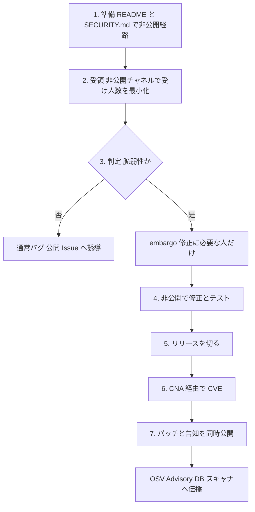
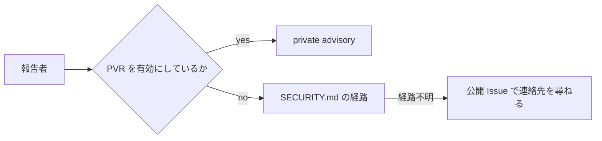

2026-09-07、CNCF TAG Security は [Handling vulnerability reports: Recipe card](https://www.cncf.io/blog/2026/09/07/handling-vulnerability-reports-recipe-card/) を公開しました。
著者は Marina Moore 氏（Edera、TAG Security co-chair）と Sherine Khoury 氏（Red Hat、TAG Security lead）です。
対象は、セキュリティ専任がいない中小プロジェクトです。
高リスク案件は [Alpha-Omega](https://alpha-omega.dev/) へ誘導します。

メンテナが先に決めることは3つです。
報告経路を README と SECURITY.md で見せる。
本格対応の前に、脆弱性か通常バグかを非公開で判定する。
修正リリースと公開 CVE を同じタイミングに揃える。

これは Kubernetes 級のインシデント対応ではありません。
内製の小さな公開 OSS と、CNCF sandbox 級でまだ専任がいないプロジェクトが主戦場です。
詳細手順は [OpenSSF maintainer-guide](https://github.com/ossf/oss-vulnerability-guide/blob/main/maintainer-guide.md) へ送られます。

読者が得るものは、3役の骨格と、そのままコピーしてはいけない点です。
90日を単独の best practice として写すこと、Recipe がリンクする CVSS v2、同時公開の無条件採用は、現行の GitHub / FIRST / 下流 distro の運用と食い違います。

:::message
公開は 2026-09-07、本稿の参照は 2026-09-08 時点です。Recipe は入口文書であり、GitHub Docs と OpenSSF の数値は Recipe 本文より優先します。
:::


*この記事の全体像。以下、順に解説します。*

## セキュリティ専任がいないプロジェクトが先に決める範囲

Recipe のスコープは、SECURITY.md、報告と embargo、CVE disclosure です。
依存ライブラリの脆弱性と予防コーディングは対象外です。
実務の主負荷が依存 CVE なら、この文書だけでは足りません。

受付の最小セットは次です。

- **threat model**：何を脆弱性とみなすか
- **非公開の報告先**：GitHub の Private Vulnerability Reporting（PVR）か private email
- **報告フォーマット**：再現手順と影響範囲を書ける形
- **初動と開示の目安**：受領確認と公開までの上限
- **bounty の有無**：中小では無しでよい

判定は人数を最小化します。
公開まで機密保持に合意します。
迷えば TAG Security か CNCF staff に、内容を出さず相談します。

修正は公開 PR に出しません。
GitHub なら report から temporary private fork の private branch を使います。
CI は動かない前提で、ローカルテストします。

公開の既定戦略は、パッチ提供と脆弱性告知の同時実施です。
利用者リストの事前通知は、小規模では維持できない、と Recipe は書きます。

## 受付、判定、公開は人数が1人でも分ける

責任は3役に分かれます。

| 役割 | 決めること | 失敗すると起きること |
|---|---|---|
| 受付担当 | 経路を見せ、初動する | 研究者が公開 Issue で連絡先を尋ねる |
| 判定者 | 脆弱性かどうかを決める | 通常バグを embargo に入れる、または脆弱性を公開 Issue へ流す |
| 公開判断者 | リリースと CVE のタイミングを決める | パッチだけ先に出る、または CVE だけ先に出る |

人数が1人でも、役割は分けます。
同じ人が兼務してよい、という意味です。
兼務してよいことと、判断の順番を省略してよいことは別です。

脆弱性は、CIA（機密性、完全性、可用性）を損なう exploitable な欠陥です。
すべてのバグではありません。
非脆弱性なら公開 Issue へ誘導します。
ドキュメント誤りも、判定質問に入ります。

OpenSSF の判定表は working as intended / bug / feature request / vulnerability です。
CNCF TAG の [incident-response テンプレ](https://tag-security.cncf.io/community/resources/project-resources/templates/incident-response/) は、トリアージ質問、受領確認、再現、CVE、公開を書きます。
そこの CVSS は **3.1** です。

## 報告から公開までの流れ

流れは準備からスキャナ伝播まで一直線ではありません。
途中で「脆弱性ではない」と分かれば、公開 Issue へ戻します。



embargo に入れるのは、修正に直接必要な人だけです。
下流ベンダーの事前通知リストは、小規模では運用しません。
リストを持つ余裕があるなら、Recipe ではなく OpenSSF と distro 側の手順を見ます。

## SECURITY.md を置いただけでは研究者に届かない

GitHub 上では、SECURITY.md と PVR は別機能です。
PVR を有効にしないと、研究者は SECURITY.md の手順を読むか、公開 Issue で連絡先を尋ねます。
PVR を有効にすると、研究者は SECURITY.md を読まなくてよい、と [GitHub Docs](https://docs.github.com/en/code-security/how-tos/report-and-fix-vulnerabilities/configure-vulnerability-reporting/configuring-private-vulnerability-reporting-for-a-repository) は書きます。



Recipe は SECURITY.md をリポジトリルートに置け、と指定します。
GitHub が認識する場所は `.github/`、ルート、`docs/` の順です。
根拠は [Adding a security policy](https://docs.github.com/en/code-security/getting-started/adding-a-security-policy-to-your-repository) です。
OpenSSF は README から SECURITY.md へのリンクと、email 代替を推奨します。

PVR は **public repository** の owner / admin が有効化します。
通知は admin や security manager でも届きません。
Watch（All activity または Security alerts）と通知設定が必要です。
VMT の GitHub Advisory 権限は、少なくとも 2 人です。
受領確認の目安は 1〜2 日です。

SECURITY.md を置いても、公開 Issue は残ります。
arXiv:2502.07395 は、679 の PyPI リポジトリを対象に、私的経路定義後も 58 リポジトリで 787 件のセキュリティ関連公開 Issue を報告しています。
これは論文側の二次情報であり、GitHub 一次の全数ではありません。
経路を書いたあとも、公開 Issue の監視は残します。

PVR を org の custom security configuration で private / internal に当てた場合の研究者 UI は、公式未記載です。
内製の private リポジトリへ、公開 GitHub 向け Recipe をそのまま当てない判断の根拠になります。

## 非公開修正では CI が走らない

GitHub の [temporary private fork](https://docs.github.com/en/code-security/tutorials/fix-reported-vulnerabilities/collaborate-in-a-fork) には、次の制約があります。

- integrations（CI を含む）はアクセスできない
- status checks は走らない
- branch protection は enforce されない
- 個別 PR は merge できない
- advisory 側で open PR を一括 merge する
- `main` 向け PR は 1 本だけ
- 公開すると temporary private fork は削除される

通常の品質ゲート（required checks）を、セキュリティ修正だけバイパスする設計です。
ローカルテスト担当を公開判断の前に明示しないと、未テスト修正が本番ブランチに入ります。
修正が CI 無しでは検証できないなら、private fork 以外の非公開テスト手段を先に決めます。

## 90日と CVSS v2 をそのままコピーしない

Recipe の 90 日は、受領から開示までの目安です。
原文は generally considered best practice と書きます。
OpenSSF は 90 日を「各種グループが default として検討する**最長**」と書きます。
distros は 7 日未満が望ましく、最大 14 日です。
CERT/CC は 45 日（修正無しでも公開、例外あり）です。
Google appsec / Project Zero は 90 日締切です。

reporter は GitHub Docs 上、応答が無い、待ちすぎなら公開してよい、と読めます。
Anthropic CVD（2026-03-06）は、無応答 30 日で外部コーディネータへ回します。
in-the-wild は 7 日です。
活発な悪用が疑われるなら、90 日を捨て、公開と緩和を前倒しします。

CVE は CNA が割り当てます。
GitHub は CNA です。
GitHub UI から request できます。
対象は **public repo** だけです。
request 自体は advisory を公開しません。
レビューは usually / typically **72 hours** であり、SLA ではありません。
コミュニティでは週単位遅延の報告があります。
これは二次情報であり、NVD 一次ではありません。
他 CNA のスコープ内では、GitHub は CVE を割り当てません。

公開後、GitHub は advisory を GitHub Advisory Database に入れ、Dependabot に使うことがあります。
この審査は **最大 72 hours** です。
CVE request の 72h とは別です。
osv.dev は `github-reviewed` の GHSA JSON を import します。
osv.dev 側の freshness SLO は upstream 追従 15 分 / 99.5% です（[OSV FAQ](https://google.github.io/osv.dev/faq/)）。
GitHub の 72h 審査を待たずに osv.dev に出る公式保証はありません。

GitHub Docs は、advisory 公開前に **fix version を書け** と指示します。
無いと、安全版の無い Dependabot アラートになります。
PoC は、修正がしばらく利用可能になってから検討します。
公開当日に PoC を出さない、をチェックリストに入れます。

severity は reporter と合意する、と Recipe は書きます。
GitHub が advisory に付ける CVSS は **3.1 または 4.0** です。
import した CVE は 4.0 / 3.1 / **3.0** もサポートします。
FIRST 現行電卓は **v4.0** です。
NVD は 2022-07-13 以降、新規 CVE に CVSS v2 を populate しません（[Retire CVSS v2](https://nvd.nist.gov/general/news/retire-cvss-v2)）。
Recipe がリンクする NVD CVSS **v2** calculator は、上記と不整合です。
SECURITY.md には CVSS 3.1 または 4.0 を書き、v2 は使いません。

## Recipe が向く場合と足りない場合

| 基準 | Recipe card | OpenSSF maintainer-guide | distros / 下流ベンダー |
|---|---|---|---|
| 対象 | 中小、非専任 | 一般 OSS。規模で修正 | パッケージ配布側 |
| 受領 | タイムラインを書け、とだけ | 1〜2 日 | 事前に上流へ直すこと |
| 開示 | 90 日以内が best practice | 90 日は最長 default。交渉の起点 | 最大 14 日。7 日未満が望ましい |
| 公開 git のパッチ | 速やかに merge して同時公開 | パッチは攻撃者にも読める | 公開リポジトリの修正 commit は既に公開扱い |
| CVE | GitHub UI または listed CNA | CNA を事前に1つ決める | 公開日に合わせて配布 |
| 事前通知リスト | 小規模では維持できない | ベンダー生態系が無ければ大概不要 | 本業。漏洩時の手順まで標準化 |

Recipe が向くのは、次が揃うときです。

- 公開 GitHub 上の小さなプロジェクト
- 下流 distro に載っていない
- メンテナが 1〜数名で、embargo リストを運用する余裕が無い

Recipe だけでは足りないのは、次です。

- 高リスク、広配布、kernel / Git / Envoy 級
- 他 CNA のスコープに入るプロジェクト
- 内製の **private** リポジトリ（GitHub PVR と GitHub CVE request が公式に public 限定）
- 依存脆弱性が主負荷

同時公開は、下流に準備時間を与えません。
[linux-distros](https://oss-security.openwall.org/wiki/mailing-lists/distros) は最大 14 日、公開 git の修正は公開扱いです。
[Red Hat CVD](https://access.redhat.com/articles/red-hat-coordinated-vulnerability-disclosure) も、公開リポジトリのセキュリティ修正 commit を embargo 破綻とみなします（ページ表示 Published 2026-08-25）。
パッチ公開は攻撃者への実質開示です。
OpenSSF と [Project Zero FAQ](https://projectzero.google/vulnerability-disclosure-faq.html) がそう書きます。
Project Zero はパッチ後 30 日の採用窓を置きます（2021 政策）。
Recipe は採用窓を置きません。

同時公開は「embargo リストを持たない場合の既定」として使います。
下流パッケージや企業配布がある場合は、distros の 14 日上限を先に見ます。

## CNCF incubation の14日はテンプレ本文には無い

[CNCF Security Guidelines for New Projects](https://contribute.cncf.io/projects/best-practices/security/) は、SECURITY.md、embargo テンプレ、incident response、OpenSSF badge を求めます。
TOC incubation application template v1.6 の本文に、「初期応答 14 日」「12 ヶ月 credit」の数値はありません。
一次は `cncf/toc` テンプレです（2026-09-08 時点）。

同テンプレの Required に、OpenSSF Best Practices **passing** badge があります。
passing の `vulnerability_report_response` は「直近 6 ヶ月の初期応答 ≤14 日」です（[OpenSSF passing criteria](https://www.bestpractices.dev/en/criteria/0)）。
14 日はテンプレ本文ではなく、**badge 経由の間接要件**です。
reporter credit（12 ヶ月）は passing ではなく silver 側の基準です。
incubation 必須としては扱いません。

## 公開判断を変える逆転条件

次に当てはまるなら、Recipe の既定を捨てます。

- **活発な悪用が疑われる**：90 日を捨て、公開と緩和を前倒しする。7 日締切は Project Zero / Google appsec の政策です。OpenSSF は数値ではなく quickly notify users and issue patches と書きます
- **他 CNA のスコープに入る**：GitHub の Request CVE を押さない
- **修正が CI 無しでは検証できない**：private fork 以外の非公開テスト手段を先に決める
- **報告の大半が依存 CVE**：Recipe の外。依存更新の品質ゲートを別途置く
- **成果物が distro に載る**：同時公開の既定は下流準備と衝突する。公開判断者の手順を変える
- **コードが private のまま**：GitHub CNA 経路は使えない。別 CNA（MITRE last resort を含む）か、公開ミラー上の advisory が要る

## 明日から書く3役の1行

公開の小さな OSS、内製で公開しているツールは、3役を採用します。
文書とツールは次で上書きします。

| 役割 | 決めること | 上書き |
|---|---|---|
| 受付 | 人名（またはローテ）、Watch と Security alerts、email 代替 | PVR を public repo で有効化。SECURITY.md は `.github/` かルート。README からリンク |
| 判定 | 脆弱性バー（threat model）。迷ったときの相談先 | OpenSSF の4分類。TAG IR のトリアージ質問 |
| 公開 | リリース担当。fix version を advisory に書く人 | 開示目安は 90 日を上限として書く。ack は 1〜2 日。severity は CVSS 3.1 または 4.0（FIRST）。v2 は使わない |

SECURITY.md に書く最小項目は次です。

```markdown
# Security

報告先: GitHub Private Vulnerability Reporting（このリポジトリの Security タブ）
代替: security@example.com（PGP があれば鍵へのリンク）

受領確認: 1〜2 日以内を目安にします。
開示: 受領から 90 日を上限とします。活発な悪用が疑われる場合は前倒しします。
判定: 機密性、完全性、可用性を損なう exploitable な欠陥を脆弱性とします。
通常バグは公開 Issue へ誘導します。
severity: CVSS 3.1 または 4.0。v2 は使いません。
bounty: ありません。
```

`security@example.com` は置き換えて使います。
public なら PVR を有効化し、メンテナの Watch を Security alerts にします。
advisory 公開チェックリストに、「fix version があるか」「PoC を同日に出さないか」を入れます。
private 内製なら、GitHub CVE を使わない経路（社内 PSIRT または公開 CNA）を先に決めます。

対象リポジトリで、受付 / 判定 / 公開の3名（兼務可）を1行で書ける状態が、入口としての完了です。

## まとめ

中小の公開 OSS は、Recipe の3動作（経路、判定、同時公開）を運営の骨格にしてよい、という結論は残ります。
確信度は「中小の公開 GitHub プロジェクト」に限定します。

タイムラインとスコア版は OpenSSF / GitHub / FIRST で上書きします。
開示目安は 90 日を上限として書き、best practice としてはコピーしません。
CVSS は 3.1 または 4.0 です。
同時公開は、embargo リストを持たない場合の既定です。
内製 private リポジトリと下流パッケージがある場合は、別手順にします。

この記事が少しでも参考になった、あるいは改善点などがあれば、ぜひリアクションやコメント、SNSでのシェアをいただけると励みになります！

## 参考リンク

1. Marina Moore, Sherine Khoury, [Handling vulnerability reports: Recipe card](https://www.cncf.io/blog/2026/09/07/handling-vulnerability-reports-recipe-card/), CNCF, 2026-09-07
2. OpenSSF, [Guide to implementing a coordinated vulnerability disclosure process](https://github.com/ossf/oss-vulnerability-guide/blob/main/maintainer-guide.md)
3. GitHub Docs, [Configuring private vulnerability reporting for a repository](https://docs.github.com/en/code-security/how-tos/report-and-fix-vulnerabilities/configure-vulnerability-reporting/configuring-private-vulnerability-reporting-for-a-repository)
4. GitHub Docs, [Repository security advisories](https://docs.github.com/en/code-security/concepts/vulnerability-reporting-and-management/repository-security-advisories)
5. GitHub Docs, [Collaborating in a temporary private fork](https://docs.github.com/en/code-security/tutorials/fix-reported-vulnerabilities/collaborate-in-a-fork)
6. GitHub Docs, [Creating a repository security advisory](https://docs.github.com/en/code-security/how-tos/report-and-fix-vulnerabilities/fix-reported-vulnerabilities/create-repository-advisory)
7. CNCF, [Security Guidelines for New Projects](https://contribute.cncf.io/projects/best-practices/security/)
8. CNCF TAG Security, [Incident response template](https://tag-security.cncf.io/community/resources/project-resources/templates/incident-response/)
9. FIRST, [CVSS](https://www.first.org/cvss/)（現行 v4.0、v2 は Archive）
10. NVD, [Retire CVSS v2](https://nvd.nist.gov/general/news/retire-cvss-v2)（2022-07-13）
11. oss-security, [linux-distros list policy](https://oss-security.openwall.org/wiki/mailing-lists/distros)
12. Red Hat, [Coordinated vulnerability disclosure](https://access.redhat.com/articles/red-hat-coordinated-vulnerability-disclosure)
13. Google Project Zero, [Vulnerability disclosure FAQ](https://projectzero.google/vulnerability-disclosure-faq.html)
14. Alpha-Omega, https://alpha-omega.dev/
15. OSV, [FAQ](https://google.github.io/osv.dev/faq/)
16. GitHub Blog, [Why you shouldn't fear requesting a CVE](https://github.blog/security/vulnerability-research/removing-the-stigma-of-a-cve/), 2022-04-22
17. OpenSSF, [FLOSS Best Practices Criteria (Passing Badge)](https://www.bestpractices.dev/en/criteria/0)
18. CNCF TOC, [Incubation application template v1.6](https://github.com/cncf/toc/blob/main/.github/ISSUE_TEMPLATE/template-incubation-application.md)
