> 起点 Pick: ITmedia エンタープライズ 2026-06-25「富士通と日本IBM、COBOL刷新で変換と構造改善を分業」
> 一次情報: 富士通 公式リリース 2026-06-17 / IBM watsonx Code Assistant for Z / IBM Bob / AWS Transform for mainframe / Microsoft Learn 6R / Gartner 7R / IPA / 経産省 DX レポート

## ■概要

### 役割分担モデルとは何か

本論文で扱う「役割分担モデル」とは、COBOL レガシーシステムのモダナイゼーションを **変換 / 構造改善 / 業務検証 / テスト自動化** という 4 つの工程に分解し、それぞれを別個の専用ツール・別個の責任主体に割り当てる方法論です。

従来のモダナイゼーション論は「Rehost か、Refactor か、Replace か」という **戦略選択** の議論に重心を置いてきました。役割分担モデルは、その手前の問いを置きます。すなわち「Refactor を選んだあと、その内部工程をどう分業すれば、業務継続性と保守性を両立できるか」です。

### なぜいま役割分担モデルが必要か

役割分担モデルが要請される背景には、次の 3 点があります。

1. COBOL アセットの大半が業務ロジックそのものであり、変換失敗のコストが極めて高いこと
2. 単一ベンダ単一ツールでは「変換精度」と「構造改善」と「業務検証」を同時に最適化できないこと
3. 生成 AI / エージェント AI の台頭で、工程ごとに最適な AI ツールを差し替える運用が現実解になったこと

特に 2026 年に入り、富士通 PROGRESSION と **IBM Bob** (2026-04-28 GA。IBM は既存 watsonx Code Assistant クライアントに adoption path を提供。本論文では以降「IBM Bob」と呼称) の提携が公表されたこと、AWS Transform for mainframe が Reimagine 機能で「構造抽出」と「テスト自動化」を分離したことなど、業界全体が役割分担を前提とした体制へ動いています。本論文はこの動きを方法論として一般化することを目的とします。

### 「単なる変換」で完結しない理由

COBOL モダナイゼーションは、ソースコードの記述言語を Java や Python に置き換えれば終わる作業ではありません。完結させるには、次の 3 つの隔たりを埋める必要があります。

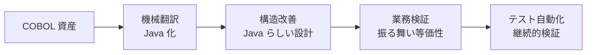

- **言語ギャップ**: COBOL の DIVISION / SECTION 構造と Java のクラス / メソッド構造は写像が一意でありません
- **設計ギャップ**: 変換直後の Java は手続き的で、クリーンアーキテクチャ等の現代設計に適合しません
- **検証ギャップ**: 旧来テストが手作業に依存しており、変換後の振る舞い等価性を確認する仕組みが残されていません

役割分担モデルは、この 3 つのギャップを 4 工程に明示的に割り当てて埋める方法論です。

### 提案する 4 工程の責務概要

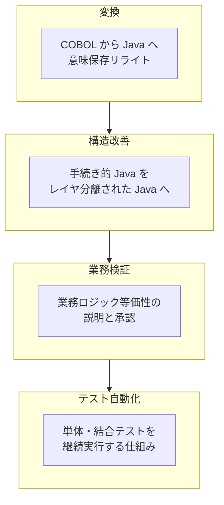

| 工程 | 主たる責務 | 主な成果物 | 典型担当 |
|---|---|---|---|
| 変換 | COBOL を機械的・規則的に Java へリライトし業務ロジックを失わない | Java ソース 初版 | リライトエンジン (PROGRESSION / AWS Transform Refactor 等) |
| 構造改善 | リライト直後の Java をクリーンアーキテクチャ等に再整形し保守可能にする | 構造改善済み Java | エージェント AI (Bob / Claude Code 等) |
| 業務検証 | 変換前後で業務ロジックが等価であることを業務担当者と検証する | 等価性証跡・業務ルール台帳 | 業務 SME + AI 文書化エージェント |
| テスト自動化 | 単体・結合テストを生成し CI に組み込み回帰防止する | 自動テスト群・CI 設定 | テスト生成 AI + 開発者 |

ここでの要点は「変換ツールと構造改善ツールを **同じものにしない**」という設計判断です。変換ツールは網羅性と意味保存性を、構造改善ツールは設計理解と妥当な書き換え判断を、それぞれ別軸で最適化する必要があるためです。

### 既存方法論との比較

#### 役割分担モデルの立ち位置

既存の Gartner 7R / Microsoft 6R などの **R フレームワーク** は「戦略の選択肢」を整理する地図です。一方、AWS Transform や富士通 × IBM の連携は「Refactor の中身」を実装する具体機構です。本論文の役割分担モデルは、その間を埋める **方法論レイヤ** に位置します。

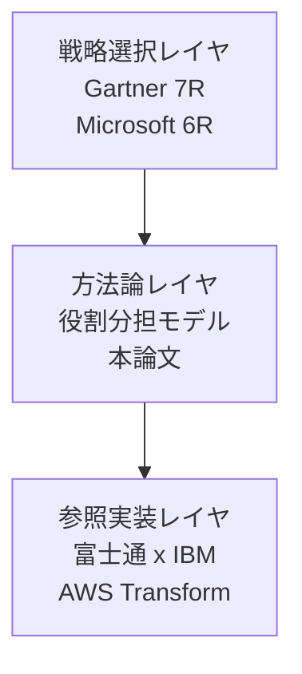

#### 既存方法論との比較テーブル

| 観点 | Gartner 7R | Microsoft 6R | 富士通 PROGRESSION × IBM Bob | AWS Transform for mainframe | 役割分担モデル 本論文 |
|---|---|---|---|---|---|
| レイヤ | 戦略選択 | 戦略選択 | 参照実装 (Refactor 特化) | 参照実装 (Refactor + Reimagine) | 方法論 |
| 主目的 | クラウド移行戦略の分類 | アプリ近代化戦略の分類 | COBOL から Java へのリライトと品質改善 | メインフレーム全体の自動移行 | Refactor 内部工程の分業設計 |
| 対象範囲 | クラウド移行全般 | アプリ近代化全般 | 富士通メインフレーム + UNIX サーバ COBOL | メインフレーム COBOL / PL/I / JCL / CICS / Db2 | COBOL Refactor の内部工程 |
| 構成要素 | Rehost / Relocate / Replatform / Refactor / Repurchase / Retire / Retain | Rehost / Replatform / Refactor / Rearchitect / Replace / Retire / Retain | PROGRESSION 変換 + Bob 構造改善・テスト | 単一エージェント内に Assessment / Refactor / Reimagine / Testing | 変換 / 構造改善 / 業務検証 / テスト自動化 |
| AI 駆動度 | 言及なし | 言及なし | PROGRESSION 自動変換 + Bob エージェント AI | エージェント AI 主導 | 工程ごとに最適 AI を差し替え可能 |
| ベンダ依存 | 中立 | Azure 寄り | 富士通 + IBM | AWS 寄り | 中立 |
| 業務検証の扱い | 明示なし | 明示なし | Bob が支援 | Reimagine で業務ルール抽出 | 独立工程として明示 |
| テスト自動化の扱い | 明示なし | 明示なし | Bob の自動単体テスト | Automated Testing 機能 | 独立工程として明示 |
| 適用先 | クラウドジャーニー設計 | Azure 移行設計 | 富士通 UNIX 顧客の Java 移行 | AWS 移行案件全般 | あらゆる COBOL Refactor 案件の内部設計 |

#### Gartner 7R / Microsoft 6R との関係

Gartner 7R と Microsoft 6R はいずれもアプリケーション単位の **戦略カタログ** です。Refactor (Microsoft では Refactor + Rearchitect) を選んだ案件で、その内部をどう分業するかは規定していません。役割分担モデルはこの空白部分を埋めます。

#### 富士通 × IBM 提携の位置づけ

2026 年 6 月の富士通 × IBM 提携は、本論文の役割分担モデルの **参照実装の 1 つ** と位置づけます。役割の対応は次表の通りです。

| 役割分担モデルの工程 | 富士通 × IBM での実装 |
|---|---|
| 変換 | 富士通 PROGRESSION による COBOL から Java への自動リライト |
| 構造改善 | IBM Bob (watsonx Code Assistant for Z) によるリファクタリング自動化とクリーンアーキテクチャ適用 |
| 業務検証 | IBM Bob による業務ロジック説明・文書化支援 |
| テスト自動化 | IBM Bob の生成 AI ベース単体テスト生成 |

ただし役割分担モデル自体はベンダ中立であり、AWS Transform、別ベンダのリライタ、Claude Code や Gemini などの汎用エージェント AI でも同等の役割割り当てが可能です。富士通 × IBM 提携を「主役」ではなく「先行事例」として扱う理由はここにあります。

## ■特徴

役割分担モデルの主要な特徴を以下に整理します。

- **工程の独立性**: 変換 / 構造改善 / 業務検証 / テスト自動化を独立工程とし、各工程の入出力を明示します
- **ツールの差し替え容易性**: 各工程は別ツール前提のため、ベンダロックインを最小化できます
- **業務検証の明示化**: 既存 R フレームワークが暗黙にしていた「振る舞い等価性検証」を独立工程として表面化します
- **テスト自動化の前倒し**: テスト自動化を変換後のオプションではなく、4 工程の 1 つとして必須化します
- **生成 AI / エージェント AI 親和性**: 工程ごとに最適な AI モデルを割り当てる前提で設計します
- **既存方法論との非競合**: Gartner 7R / Microsoft 6R の戦略選択を前提に、その Refactor 内部を補完する構造です
- **責任分界の明確化**: ベンダ・SI・業務部門の責任分界を 4 工程で切り分けやすくし、契約設計を簡素化します
- **参照実装の多様性**: 富士通 × IBM、AWS Transform、その他の組合せを同じ方法論で語れます

## ■構造

本章では、役割分担モデルを論理構造として捉え、C4 model の 3 段階 (システムコンテキスト / コンテナ / コンポーネント) で記述します。本章はあくまで「方法論の論理構造」を扱い、データモデル (エンティティ属性) と利用方法 (コマンド・操作) はそれぞれ別章で扱います。

### ●システムコンテキスト図

役割分担モデルを 1 つの方法論本体として中央に据え、その外側に存在する人的アクターと外部システムとの関係を示します。ここではベンダ製品名を使わず、論理的な役割名・カテゴリ名で表現します。

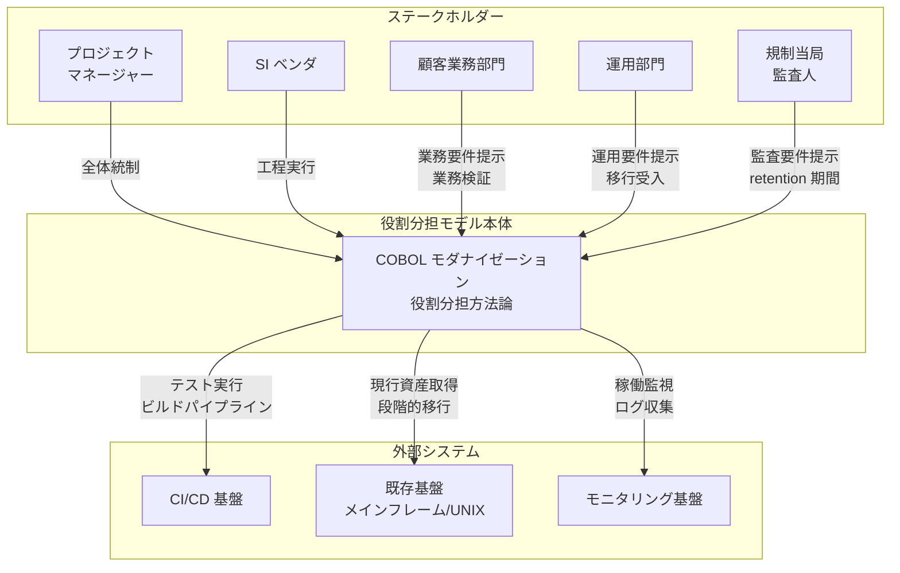

#### ステークホルダー

| 要素名 | 説明 |
|---|---|
| プロジェクトマネージャー | 顧客側の責任者として全体計画・予算・スコープを統制します。複数ベンダや業務部門との調整を担います |
| SI ベンダ | 4 工程の実行主体として変換・構造改善・業務検証・テスト自動化を担います。複数ベンダが分担するケースもあります |
| 顧客業務部門 | 既存業務仕様の保有者として要件定義の参照点となり、業務観点での受入検証を行います |
| 運用部門 | 本番運用の責任者として移行先システムの運用要件を提示し、段階移行を受け入れます |
| 規制当局・監査人 | 規制業界 (金融・保険・公共) で振る舞い等価性証跡・parallel run の retention 期間 (例: 7 年) を監査要件として提示します |

#### 役割分担モデル本体

| 要素名 | 説明 |
|---|---|
| COBOL モダナイゼーション役割分担方法論 | 本論文が対象とする方法論本体です。4 工程と補助工程を内包し、ステークホルダーと外部システムを橋渡しします |

#### 外部システム

| 要素名 | 説明 |
|---|---|
| CI/CD 基盤 | 移行後コードのビルド・テスト・デプロイを自動化する継続的統合・継続的デリバリ基盤です |
| 既存基盤 | メインフレームまたは UNIX サーバ上で稼働している現行 COBOL システムの実行基盤です |
| モニタリング基盤 | 移行先システムの稼働状況・性能・障害を収集する観測基盤です |

### ●コンテナ図

役割分担モデルの内側を 4 工程と補助工程に分解し、それぞれの責務と工程間の連携を示します。ここでも具体的なベンダ製品名は用いず、論理的な工程名で構造を表現します。

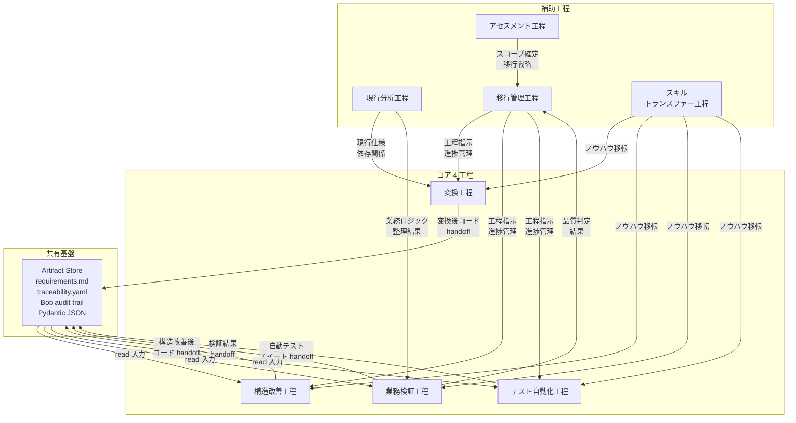

#### コア 4 工程

| 要素名 | 説明 |
|---|---|
| 変換工程 | 現行 COBOL ソースコードを目的言語 (Java / C# 等) のソースコードへ機械的に変換する工程です。構文・データ型・命名規約を移行先に整合させます |
| 構造改善工程 | 機械変換直後のコードに対してクリーンアーキテクチャ等の設計原則を適用し、保守性・拡張性を高める工程です |
| 業務検証工程 | 移行前後で業務ロジックが等価であることを確認し、顧客業務部門の受入観点で品質を保証する工程です |
| テスト自動化工程 | 業務検証に必要な単体・結合・回帰テストのスイートを自動化し、繰り返し実行可能な品質保証基盤を構築する工程です |

#### 補助工程

| 要素名 | 説明 |
|---|---|
| アセスメント工程 | 移行対象資産の規模・難易度・優先度を評価し、全体スケジュールと費用感を立案する工程です |
| 現行分析工程 | 現行 COBOL 資産のソース・データ・ジョブ構成を解析し、依存関係と業務仕様を可視化する工程です |
| 移行管理工程 | 4 工程の進捗・品質・リスクを横断的に管理し、ステークホルダー間の調整を行う工程です |
| スキルトランスファー工程 | レガシー技術と移行先技術の両面で人材育成・ノウハウ移転を行い、移行後の自走を支える工程です |

#### 共有基盤

| 要素名 | 説明 |
|---|---|
| Artifact Store | 4 工程が成果物を共有するための一元集約ストアです。AWS Transform の `requirements.md` / `traceability.yaml`、IBM Bob の audit trail、本論文で提案する Pydantic JSON ハンドオフが置かれます。各工程は前工程の成果物を read し、自工程の成果物を write します |

### ●コンポーネント図

ここからはコア 4 工程それぞれの内部構造をドリルダウンし、参照実装名 (Fujitsu PROGRESSION / IBM Bob / IBM watsonx Code Assistant for Z 等) を例として用いながら具体的に示します。

#### 変換工程の内部構造

変換工程は、現行 COBOL から目的言語への機械変換を担うサブコンポーネント群で構成されます。代表的な参照実装は Fujitsu PROGRESSION のソース自動変換と IBM watsonx Code Assistant for Z の Mechanical Conversion です。

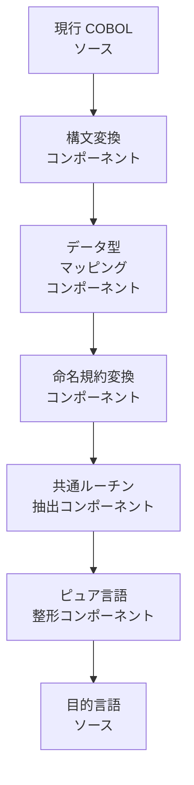

| 要素名 | 説明 |
|---|---|
| 構文変換コンポーネント | COBOL の各構文要素 (DIVISION / SECTION / PARAGRAPH) を目的言語の構文へ変換します。Fujitsu PROGRESSION のソースコンバート部や IBM watsonx Code Assistant for Z の Mechanical Conversion がこれにあたります |
| データ型マッピングコンポーネント | COMP-3 / PIC 句などの COBOL データ型を目的言語の数値型・文字列型へ対応付け、桁・符号の意味を保持します |
| 命名規約変換コンポーネント | COBOL 流のハイフン区切り識別子を目的言語の命名規約 (CamelCase 等) に整え、可読性を高めます |
| 共通ルーチン抽出コンポーネント | 複数プログラムで反復しているサブルーチンや COPY 句相当を共通モジュールとして括り出し、変換後の重複を抑制します |
| ピュア言語整形コンポーネント | 機械変換の痕跡 (擬似 COBOL 構造) を残さず、目的言語として自然な記述に整形します。業界で「pure Java 化」(JaBOL 解消) と呼ばれる工程に相当します (本稿の解釈: 富士通×日本IBM 協業では PROGRESSION が意味保存リライト、IBM Bob が変換後の構造改善を担う役割分担。富士通公式リリースの「クリーンアーキテクチャーを取り入れた構造化」表現は協業全体での目指す方向性として参照) |

#### 構造改善工程の内部構造

構造改善工程は、機械変換直後の手続き的なコードに対して設計原則を適用し、保守性と拡張性を高めます。参照実装は IBM Bob (公式 4 モード: Code / Ask / Plan / Advanced) を用いた構造改善フローと、富士通×日本 IBM 協業全体のリファクタリング工程 (クリーンアーキテクチャー適用) です。なお本稿で以降登場する「Architect」「Developer」等のロール名は **本稿上の役割名であり、IBM 公式モード名ではない** (公式名は Code/Ask/Plan/Advanced) ことに注意してください。

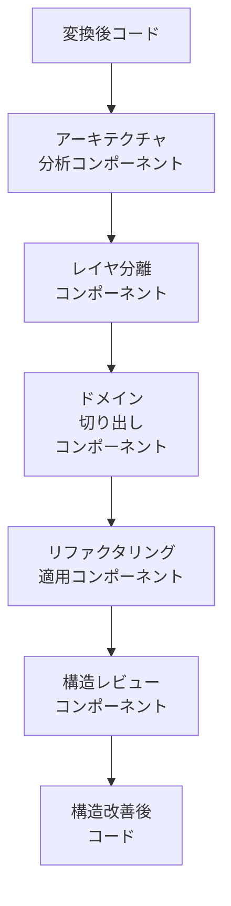

| 要素名 | 説明 |
|---|---|
| アーキテクチャ分析コンポーネント | 変換後コードの依存関係・呼び出しグラフを把握し、改善方針を立てます。IBM Bob (Project Bob、watsonx Code Assistant for Z 系譜) の Plan / Advanced mode で「アーキテクト的な分析タスク」を扱う運用が第三者レビュー (ap7i.com) で紹介されており、これを参照実装と位置付けます |
| レイヤ分離コンポーネント | プレゼンテーション・ユースケース・ドメイン・インフラの 4 層に責務を分離し、クリーンアーキテクチャを適用します |
| ドメイン切り出しコンポーネント | 業務ロジックをドメインオブジェクトに集約し、業務的な凝集度を高めます |
| リファクタリング適用コンポーネント | クラス分割・命名整理・条件式整理などの個別リファクタリングを段階的に適用します。IBM Bob の Code mode (公式 4 モード: Code / Ask / Plan / Advanced のうち、コード変更を担当するモード) が該当します |
| 構造レビューコンポーネント | 適用後の構造が設計原則に合致しているかを検証し、回帰しないようガードします |

#### 業務検証工程の内部構造

業務検証工程は、移行前後の動作等価性を業務観点で保証します。参照実装は IBM Bob の業務ロジック検証フローと Fujitsu PROGRESSION のテスト工程です。

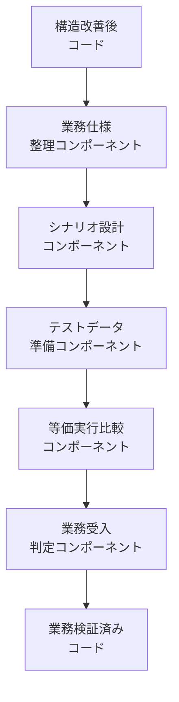

| 要素名 | 説明 |
|---|---|
| 業務仕様整理コンポーネント | 現行分析工程の成果を受け取り、検証すべき業務仕様を一覧化します |
| シナリオ設計コンポーネント | 業務仕様から検証シナリオ (正常系・準正常系・異常系) を設計します |
| テストデータ準備コンポーネント | 現行データから検証用データセットを抽出・マスキング・生成します |
| 等価実行比較コンポーネント | 現行 COBOL と移行先コードで同一入力を実行し、出力の等価性を比較します。IBM Bob のレガシーロジック検証機能が該当します |
| 業務受入判定コンポーネント | 顧客業務部門が受入観点で合否を判定し、業務的な完了を承認します |

#### テスト自動化工程の内部構造

テスト自動化工程は、業務検証で必要となる繰り返し実行可能なテスト基盤を構築します。参照実装は IBM watsonx Code Assistant for Z のテスト生成機能や、CopilotGo のテスト自動化コンポーネントです。

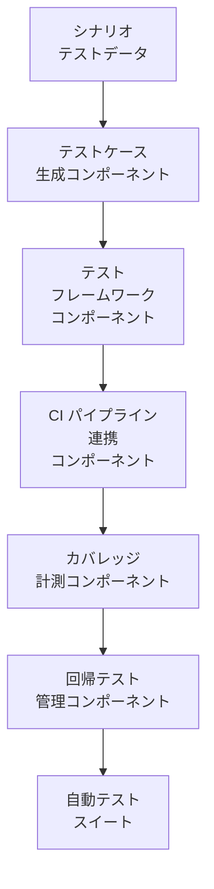

| 要素名 | 説明 |
|---|---|
| テストケース生成コンポーネント | 業務シナリオから単体・結合テストケースを生成します。IBM Bob の自動テスト生成や IBM watsonx Code Assistant for Z のテスト生成機能が該当します |
| テストフレームワークコンポーネント | JUnit / NUnit などの目的言語向けテストフレームワーク上で自動テストを実行可能にします |
| CI パイプライン連携コンポーネント | CI/CD 基盤と接続し、コミット・ビルドのたびに自動テストを回します |
| カバレッジ計測コンポーネント | コード網羅率と業務シナリオ網羅率を計測し、検証の十分性を可視化します |
| 回帰テスト管理コンポーネント | 構造改善の繰り返しでも品質が劣化しないよう、回帰テストの維持・追加を管理します |

## ■データ

役割分担モデルが扱うエンティティを、概念モデル (所有・利用関係) と情報モデル (主要属性) の二段で整理します。情報源は ITmedia (富士通 × IBM 協業)、富士通公式リリース、IBM watsonx Code Assistant for Z (WCA4Z)、Microsoft Learn の 6R フレームワーク、および AWS Transform continuous modernization の調査結果です。論文・公式記載に未掲載で実務上必要な属性は「補完」と注記します。

### ●概念モデル

工程横断の中核エンティティとその所有・利用関係を、4 つの役割 (変換 / 構造改善 / 業務検証 / テスト自動化) を subgraph として描画します。所有関係 (Aggregation) は subgraph で囲み、利用関係 (Reference) は矢印で表現します。

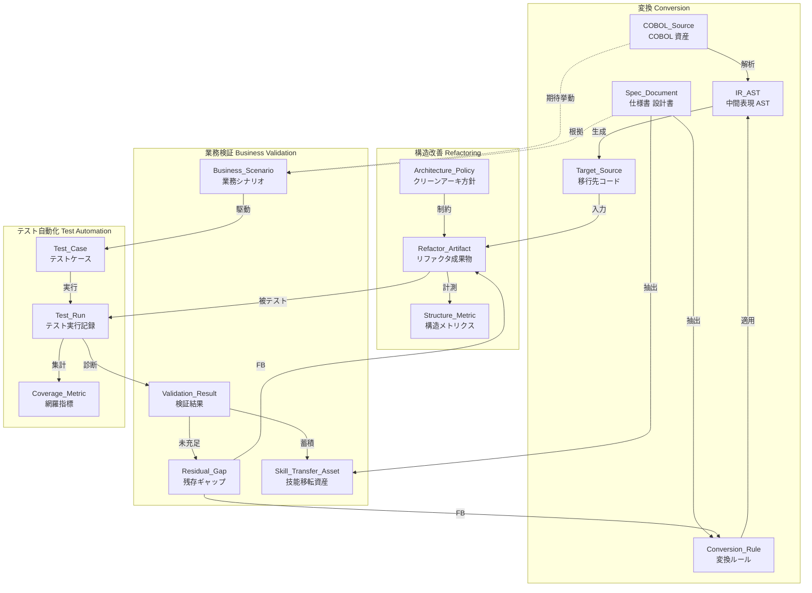

#### 所有関係 (subgraph)

| 役割 | 所有するエンティティ | 一次出典 |
|---|---|---|
| 変換 | COBOL_Source / Spec_Document / Conversion_Rule / IR_AST / Target_Source | 富士通 PROGRESSION (リライト)、IBM WCA4Z (COBOL から Java、AST 抽出)、Fujitsu Kozuchi (ソース解析 + 設計書自動生成) |
| 構造改善 | Architecture_Policy / Refactor_Artifact / Structure_Metric | 富士通公式 (クリーンアーキテクチャ刷新)、IBM Bob (構造化)、Microsoft 6R (Refactor / Rearchitect) |
| 業務検証 | Business_Scenario / Validation_Result / Residual_Gap / Skill_Transfer_Asset | ITmedia (ギャップ管理)、WCA4Z Validation Assistant (semantic equivalence)、富士通 (業務ロジック整合性) |
| テスト自動化 | Test_Case / Test_Run / Coverage_Metric | IBM Bob (テスト自動実施)、WCA4Z (自動テスト生成)、Microsoft 6R (Refactor 検証) |

#### 利用関係 (矢印) の意味

- `Spec_Document → Conversion_Rule`: 仕様書から手続き的ルール (キー項目マッピング、データ型変換、命名規約) を抽出します。
- `COBOL_Source → IR_AST`: パーサがソースを解析し中間表現 (AST / 制御フロー / 呼び出しグラフ) を構築します。
- `Conversion_Rule + IR_AST → Target_Source`: 中間表現にルールを適用し Java など移行先コードを生成します (WCA4Z)。
- `Target_Source → Refactor_Artifact`: 生成直後のコードに、クリーンアーキ方針 (層分離・依存方向) を適用して再構造化します。
- `Business_Scenario → Test_Case`: 業務シナリオから等価性検証用テストケースを自動生成します (WCA4Z Validation Assistant)。
- `Test_Run → Validation_Result → Residual_Gap`: 実行結果を診断し、未充足部分を残存ギャップとして登録、変換ルール / リファクタ成果物にフィードバックします (Fujitsu PROGRESSION のギャップ管理に相当)。
- `Spec_Document + Validation_Result → Skill_Transfer_Asset`: 検証で得られた知見を技能移転資産 (現新比較ドキュメント、教育素材) として蓄積します。

### ●情報モデル

主要エンティティの属性を classDiagram で示します。型は汎用名 (string / int / datetime / enum / list / map / set) に統一しています。属性のみ記載しメソッドは記載しません。

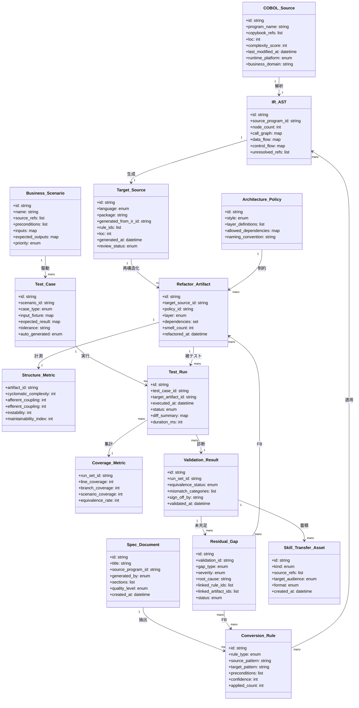

#### 属性の出典と補足

- `COBOL_Source.runtime_platform`: 富士通公式に「メインフレーム / UNIX サーバー」を明示。enum 値はそれを反映 (mainframe / unix / cloud)。
- `Spec_Document.generated_by`: Fujitsu Kozuchi が「ソースコード解析による設計書自動生成」を担う旨が公式リリースに明記 (enum: human / kozuchi / wca4z / hybrid)。
- `Conversion_Rule.confidence`: WCA4Z が確信度ベースの提示を行う運用に基づく補完属性。
- `IR_AST.call_graph / data_flow / control_flow`: AWS Transform 解析エンジンに倣った補完。COBOL から Java では PERFORM 連鎖と COPY 展開の解決が中心。
- `Target_Source.language`: ITmedia 記事に「Java などのオープン言語」と明記 (enum: java / csharp / kotlin / cobol_modern / other)。
- `Architecture_Policy.style`: 富士通公式の「クリーンアーキテクチャによる構造刷新」に対応 (enum: clean / hexagonal / layered / microservices)。
- `Structure_Metric.*`: 一般的な保守性指標を補完。富士通の「保守性・拡張性の高い構造」に対応する定量化軸。
- `Business_Scenario.source_refs`: 業務シナリオは COBOL_Source と Spec_Document の双方を参照しうるため list で複数参照を許容します。
- `Test_Case.auto_generated`: WCA4Z Validation Assistant の自動テスト生成機能に対応 (enum: auto / manual / mixed)。
- `Test_Run.diff_summary`: 現新比較で発生した差分カテゴリ別件数 (map: category → count)。WCA4Z の semantic equivalence 検証出力に対応。
- `Coverage_Metric.equivalence_rate`: 「現新等価率」を補完属性として定義。富士通 PROGRESSION の「業務ロジック整合性」を定量化する軸。
- `Validation_Result.equivalence_status`: enum (equivalent / partial / divergent / unknown)。WCA4Z Validation Assistant の判定結果カテゴリに対応。
- `Residual_Gap.gap_type`: ITmedia / 富士通の「ギャップ管理」に対応 (enum: data / logic / interface / nonfunctional / external_dependency)。
- `Residual_Gap.status`: open / in_progress / accepted / closed の運用ステータス (補完)。
- `Skill_Transfer_Asset.kind`: enum (現新比較ドキュメント / 教育素材 / 運用ランブック / FAQ)。「人材育成・スキル移転」を支援する 6R 議論に対応する補完。

#### 工程成果物 (Artifact) と検証指標 (Metric) の位置づけ

| 種別 | エンティティ | 主用途 | 主な出典 |
|---|---|---|---|
| Artifact | Spec_Document / IR_AST / Target_Source / Refactor_Artifact / Skill_Transfer_Asset | 役割間の受け渡し成果物 | 富士通 (PROGRESSION / Kozuchi)、IBM (WCA4Z / Bob) |
| Metric | Structure_Metric / Coverage_Metric / Validation_Result.equivalence_status | 役割の進捗・品質の定量化 | WCA4Z Validation Assistant、富士通「業務ロジック整合性」 |
| Backlog | Residual_Gap | 役割横断のフィードバック起点 | ITmedia (ギャップ管理)、Microsoft 6R (Refactor 残課題) |

Artifact は subgraph 内で所有され、Metric は対応する Artifact / Test_Run に対する集約として情報モデル上で関連付けられます。Residual_Gap は唯一、複数役割 (変換 / 構造改善) に対し双方向のフィードバックを送る「役割横断バックログ」として機能します。

## ■構築方法

本セクションでは、役割分担モデルを実プロジェクトとして立ち上げ、運用に乗せるまでの手順を整理します。Fujitsu PROGRESSION・IBM Bob (watsonx Code Assistant for Z)・AWS Transform for mainframe の公開ドキュメントを参照実装として扱い、共通化できる「工程パイプライン」「成果物受け渡し」「体制テンプレート」を提示します。

- 論文 / プレスリリースの主張は「論文の主張」として引用します
- GitHub Actions / Pydantic / Python / シェル の雛形は「実装案・例」として補完元 (公式ドキュメント) を明示します

### 必須パラメータ (プロジェクト立ち上げ時)

役割分担モデルを起動するために、最初に確定させる入力パラメータを以下にまとめます。Fujitsu PROGRESSION の自動変換、AWS Transform の Assess and reimagine フロー、IBM Bob の Architect/Code mode は、いずれもこれら入力が揃って初めて意味のある成果を出します。

| パラメータ | 例 | 用途 / 補完元 |
|---|---|---|
| `source_root` | `s3://acme-cobol-src/prod-batch/` | 変換対象 COBOL / JCL / Copybook の格納先。AWS Transform は S3 必須 (出典: AWS Transform User Guide) |
| `language_inventory` | `{cobol: 1.2M LoC, jcl: 80k, copybook: 4.3k}` | アセスメント結果。Fujitsu PROGRESSION / AWS Transform の Analyze code 出力に対応 |
| `target_runtime` | `Java 21 on EKS` / `Java 17 on Mainframe Modernization` | 変換工程の出力先ランタイム |
| `business_function_scope` | `["loan-origination", "daily-settlement"]` | AWS Transform の business function catalog で選定する単位 (出典: AWS Transform docs) |
| `glossary_csv` | `glossary/acme-terms.csv` | 業務語彙。documentation 品質を上げる (出典: AWS Transform "Glossary") |
| `acceptance_criteria_format` | `EARS` | requirements.md の出力形式。**本稿で定義する中間表現** (AWS Transform の公開成果物は test plan / business rules / traceability であり、`requirements.md`・EARS は公式仕様ではない) |
| `test_data_root` | `s3://acme-cobol-src/test-data/` | 業務検証 / テスト自動化で使うゴールデンデータ |
| `iam_roles` | `TransformAdminRole`, `BobOperatorRole` | コネクタ / Bob CLI 用の最小権限ロール |

### Step 1. アセスメントと現行資産棚卸

「論文の主張」(Fujitsu / IBM 共同プレスリリース) では、まず現行 COBOL を「UNIX サーバーで稼働する COBOL プログラム」として棚卸し、Java など OSS スタックへの変換可否を判定すると述べられています。AWS Transform は同じ役割を Analyze code フェーズで自動化し、ファイル種別・LoC・循環的複雑度・重複 Program ID・欠損ファイルを抽出します (出典: AWS Transform User Guide "Analyze code")。

実装案・例として、初期棚卸を「リポジトリへの push 時に必ず走らせる」前処理は次のように構築できます (補完: AWS Transform の S3 入力規約 + GitHub Actions の OIDC 連携)。

```yaml
# .github/workflows/00_assess.yml
# 実装案: AWS Transform Analyze code 工程をトリガするためのアップロード
# 補完元: https://docs.aws.amazon.com/transform/latest/userguide/transform-app-mainframe-workflow.html
name: cobol-assess
on:
  push:
    paths: ['src/**', 'jcl/**', 'copybook/**']
jobs:
  upload-and-trigger:
    runs-on: ubuntu-latest
    permissions: { id-token: write, contents: read }
    steps:
      - uses: actions/checkout@v4
      - uses: aws-actions/configure-aws-credentials@v4
        with:
          role-to-assume: arn:aws:iam::123456789012:role/TransformAdminRole
          aws-region: ap-northeast-1
      - name: sync source to S3 (AWS Transform 入力)
        run: |
          aws s3 sync ./src      s3://acme-cobol-src/prod-batch/src/
          aws s3 sync ./jcl      s3://acme-cobol-src/prod-batch/jcl/
          aws s3 sync ./copybook s3://acme-cobol-src/prod-batch/copybook/
      - name: create assess job (Web UI で開いて続行)
        run: |
          echo "AWS Transform コンソールで 'Assess and reimagine' job を作成"
          echo "S3 prefix: s3://acme-cobol-src/prod-batch/"
```

### Step 2. 移行対象選定 (business function 単位)

AWS Transform の Assess 出力は「business function catalog」として返り、business function summary と business function details (interactive graph) の 2 アーティファクトで構成されます (出典: AWS Transform User Guide)。これにより「どの batch job / CICS transaction / data store が 1 つの業務単位を構成するか」が決まり、移行対象スコープを LoC ではなく業務単位で切れます。

論文の主張として、Fujitsu / IBM 共同のリリースでは「ミッションクリティカルな機能維持」が段階的移行の最重要課題と明示されており、この business function 粒度の選定はその要請に直結します。

### Step 3. role 体制設計

役割分担モデルの中核は「変換」「構造改善」「業務検証」「テスト自動化」を別の主体に持たせる点です。実装案として、各工程に標準ロールを割り当てるテンプレートを示します (補完元: IBM Bob の role-based modes 設計 = architect / developer / security engineer に準拠)。

| 役割 | 主担当 | スキル要件 | 必要工数の目安 (中規模 1M LoC) |
|---|---|---|---|
| Conversion Lead | 変換工程 | COBOL / JCL 構文、Java バイトコード、移行ツール CLI 操作 | 1〜2 名 × フル稼働 |
| Refactoring Architect (本稿上の役割名) | 構造改善 | DDD / クリーンアーキテクチャ、IBM Bob (Plan/Code mode の使い分け)、IDE プラグイン | 1 名 × 60% |
| Business Validator | 業務検証 | 現行業務知識、requirements.md レビュー、業務部門との折衝 | 2〜3 名 × 50% (業務部門兼任可) |
| Test Automation Engineer | テスト自動化 | JUnit / pytest / VSAM・DB2 抽出スクリプト、CI/CD | 1〜2 名 × フル稼働 |
| Modernization PM | 全工程横断 | wave plan 管理、Worklog レビュー、リスク管理 | 1 名 × フル稼働 |
| Platform / SRE | インフラ | S3 / Neptune / EKS / IAM、コネクタ運用 | 0.5 名 |

IBM Bob はこの「役割を AI 側にも持たせる」設計を取り、公式 Bob Shell ドキュメントが定義する 4 モード (Code / Ask / Plan / Advanced) を切り替えながら同じ codebase に当たります。第三者レビュー (ap7i.com / betterstack.com) では、これらモードを実プロジェクトの役割 (architect / developer / security engineer 相当) と対応付ける運用例が紹介されています。本論文の役割分担モデルもこの対応付け運用を前提とします。

#### RACI 表 (工程 × ロール)

役割分担モデルの 8 工程に対し、誰が Responsible (実行) / Accountable (最終責任) / Consulted (相談) / Informed (共有) かを定義します。実装案として AWS Transform の Reimagine フェーズと IBM Bob の role-based modes を組み合わせる場合のテンプレートです (R = Responsible / A = Accountable / C = Consulted / I = Informed)。

| 工程 | PM | Conversion Lead | Refactoring Architect | Business Validator | Test Automation Engineer | 業務 SME | SRE | 規制部門 |
|---|---|---|---|---|---|---|---|---|
| アセスメント | A | R | C | C | C | C | C | I |
| 現行分析 | A | R | C | R | C | R | I | I |
| 変換 | I | R/A | C | I | C | I | C | I |
| 構造改善 | I | C | R/A | C | C | I | C | I |
| 業務検証 | A | I | C | R | C | R | I | C |
| テスト自動化 | A | C | C | C | R/A | C | C | I |
| 移行管理 | R/A | C | C | C | C | C | C | C |
| スキルトランスファー | A | R | R | R | R | R | C | I |

- 「業務 SME」は顧客業務部門の現場担当者 (現行業務の運用者)。Business Validator が SME を取り回す関係です。
- 「規制部門」は規制業界 (金融・保険・公共) で audit retention や parallel run 期間を承認する役割。中規模以下の案件では PM が兼務します。

### Step 4. 工程パイプラインの組み立て

実装案・例として、4 工程を 1 本のパイプラインに繋げる構成を示します。論文の主張では Fujitsu PROGRESSION が「変換」、IBM Bob が「構造改善 + コード修正 + 業務ロジック検証 + テスト」と分担すると述べられているため (出典: ITmedia 記事 2026-06-25)、工程ごとに別ツール / 別ロールを直列に並べる前提です。

```yaml
# .github/workflows/10_pipeline.yml
# 実装案 (擬似 CLI): 役割分担モデルを CI/CD に落とした例
# 補完元:
#   - AWS Transform: https://docs.aws.amazon.com/transform/latest/userguide/transform-app-mainframe-workflow.html
#   - IBM Bob Shell: https://bob.ibm.com/docs/shell
# 注記: Fujitsu PROGRESSION は SI 形態提供で公開 CLI は未公開。`<vendor-cli>` を疑似名で示す。
#       IBM Bob の `--mode architect/code` は公式 4 モード (Code/Ask/Plan/Advanced) と異なる擬似名。
name: cobol-modernization-pipeline
on:
  workflow_dispatch:
    inputs:
      business_function:
        description: '対象 business function (Step 2 で選定)'
        required: true

jobs:
  convert:                       # 工程 1: 変換 (Fujitsu PROGRESSION 相当、擬似 CLI)
    runs-on: [self-hosted, progression]
    steps:
      - run: <vendor-cli> convert \
          --source s3://acme-cobol-src/prod-batch/ \
          --target ./out/java \
          --function ${{ inputs.business_function }}
      - uses: actions/upload-artifact@v4
        with: { name: converted-java, path: ./out/java }

  refactor:                      # 工程 2: 構造改善 (IBM Bob Plan/Code mode 相当、擬似 CLI)
    needs: convert
    runs-on: ubuntu-latest
    steps:
      - uses: actions/download-artifact@v4
        with: { name: converted-java, path: ./out/java }
      - run: |
          # 擬似: 公式 Bob Shell は対話式が主で、--mode フラグの正式仕様は未公開
          bob shell # Plan mode で構造改善案を生成
          bob shell # Code mode で適用

  validate:                      # 工程 3: 業務検証
    needs: refactor
    runs-on: ubuntu-latest
    steps:
      - name: requirements.md と business_function_summary を突き合わせ
        run: python tools/validate_requirements.py \
              --reqs ./out/requirements.md \
              --legacy-summary ./out/business_function_summary.json

  test-automation:               # 工程 4: テスト自動化
    needs: validate
    runs-on: ubuntu-latest
    steps:
      - run: mvn -f ./out/java verify
      - run: python tools/replay_golden_dataset.py \
              --golden s3://acme-cobol-src/test-data/ \
              --target http://app.local:8080
```

### Step 5. アーティファクト受け渡しの正規化

工程間で受け渡す成果物を Pydantic スキーマで型付けして、ツール非依存の中間表現に揃えます。これは「論文の主張」(Fujitsu と IBM Bob の連携前提) を実装に落とすときの最重要ポイントで、AWS Transform の `traceability.yaml` (出典: AWS Transform User Guide) を参考に設計します。

```python
# tools/handoff_schema.py
# 実装案: 工程間ハンドオフの中間スキーマ
# 補完元: AWS Transform traceability.yaml / requirements.md 仕様
from typing import Literal
from pydantic import BaseModel, Field

class BusinessFunctionRef(BaseModel):
    id: str
    name: str
    data_paths: int
    loc: int

class ConvertedUnit(BaseModel):
    """工程1 → 工程2 ハンドオフ"""
    function: BusinessFunctionRef
    source_files: list[str]
    target_files: list[str]              # Java など
    converter: Literal["progression", "aws-transform-refactor", "blu-age"]
    converter_version: str
    audit_log_uri: str                   # S3 / Bob audit trail

class RefactoredUnit(ConvertedUnit):
    """工程2 → 工程3 ハンドオフ"""
    architecture_pattern: Literal["hexagonal", "layered", "microservice"]
    bob_session_id: str | None = None    # IBM Bob の自己文書化 session

class ValidatedRequirement(BaseModel):
    """工程3 → 工程4 ハンドオフ (AWS Transform requirements.md と互換)"""
    requirement_id: str                  # EARS 形式の ID
    user_story: str
    acceptance_criteria: list[str]
    traced_legacy_rules: list[str]       # traceability.yaml の参照

class TestArtifact(BaseModel):
    """工程4 出力"""
    requirement_id: str
    test_kind: Literal["unit", "integration", "regression-golden"]
    test_path: str
    last_pass: str | None = None
```

## ■利用方法

### 工程 1: 変換 (Fujitsu PROGRESSION / AWS Transform Refactor)

論文の主張: ITmedia 記事と Fujitsu プレスリリースでは、富士通×日本IBM の協業全体が「リライトとリファクタリング」を担い、その内訳として **PROGRESSION が COBOL から Java (など、オープン環境に適した言語) への変換 (リライト) を担当**し、**IBM Bob が変換後コード補正とリファクタリング自動化を担当**するという役割分担で述べられています (出典: ITmedia 2026-06-25 / global.fujitsu 2026-06-17)。AWS Transform は Refactor モードで「数百万行の COBOL / PL/1 を分単位で Java/Angular に変換し、業務機能を保ったまま」を提供します (出典: AWS re:Post 2026 ガイド)。

利用フロー (AWS Transform の場合):

1. AWS Transform コンソールにサインインし、workspace を作成
2. `Create job` で `Mainframe modernization` → `Custom job plan` を選択
3. Kickoff ステップで S3 連携 (CORS ポリシー必須。出典: AWS Transform User Guide "S3 bucket CORS permissions")
4. `Analyze code` → `Decompose code` → `Convert` の順に capability を選択
5. Worklog / Dashboard で進行を追跡

実装案・例として、変換工程をシェルから蹴る場合のテンプレート (補完元: AWS Transform User Guide のコンソール操作ステップ):

```bash
#!/usr/bin/env bash
# 実装案 (擬似 CLI): AWS Transform Refactor を CLI ライクに起動するラッパー
# 補完元: https://docs.aws.amazon.com/transform/latest/userguide/transform-app-mainframe-workflow.html
# 注記: AWS Transform は基本 Web/Chat UI 駆動で、`aws transform create-job` および
#       capability 名 (Analyze code / Decomposition / Code conversion) のサブコマンド/enum
#       仕様は公式 User Guide に未公開。下記は補完元のフェーズ名から推測した疑似 CLI。
set -euo pipefail

WORKSPACE_ID="${WORKSPACE_ID:?}"
S3_SRC="s3://acme-cobol-src/prod-batch/"
FUNCTION_ID="${1:?usage: $0 <business_function_id>}"

# 擬似: 公式 Web/Chat UI で実行する手順を CLI 風に表現
aws transform create-job \
  --workspace-id "$WORKSPACE_ID" \
  --job-plan "custom" \
  --capabilities "AnalyzeCode,Decomposition,CodeConversion" \
  --inputs "s3Uri=$S3_SRC,businessFunctionId=$FUNCTION_ID"
```

### 工程 2: 構造改善 (IBM Bob Plan/Code mode)

論文の主張: ITmedia 記事は IBM Bob が「コード修正と業務ロジックの検証、テスト」を担うと記述しています。IBM 公式ドキュメント (Bob Shell) では Bob は **Code / Ask / Plan / Advanced** の 4 モードを持つと説明されており、第三者レビュー (ap7i.com / betterstack.com) ではこれを architect / developer / security engineer の役割対応で運用するパターンが紹介されています。BobShell CLI は対話セッションで実行され、audit trail を残せます。

利用フロー (IDE):

1. VS Code に IBM watsonx Code Assistant for Z プラグインを導入
2. 変換工程の Java 出力を workspace として開く
3. 対話で「構造改善案 (hexagonal architecture 適用)」を依頼 (Plan mode 相当)
4. 提案を review し、Apply で反映 (Code mode 相当)

利用フロー (BobShell CLI):

```bash
# 実装案 (擬似 CLI): IBM Bob を CI から呼び出すレシピ
# 補完元: https://bob.ibm.com/docs/shell
# 注記: 公式 Bob Shell は対話式で、--mode/--apply/--review-output の正式 CLI フラグ仕様は
#       未公開。下記は「公式 4 モード (Code/Ask/Plan/Advanced) を CI ジョブで使い分ける」
#       想定の実装イメージで、実プロジェクトでは IDE 内対話または公式 SDK で代替する。
bob shell # Plan mode で構造改善案を生成
# プロンプト例: "Split monolith into hexagonal modules per business function. Preserve interfaces."

bob shell # Code mode でリファクタを適用 + audit log 出力
```

audit log として残る BobShell の対話ログが、後段の業務検証フェーズに「なぜこのリファクタを当てたか」を示す根拠になります。実プロジェクトでは公式 SDK (`watsonx Code Assistant` の REST API) で同じ役割を担うこともできます。

### 工程 3: 業務検証

論文の主張: Fujitsu / IBM のリリースは「ミッションクリティカルな機能維持」を移行中の最重要課題とし、業務ロジック検証を Bob と人間レビュアーが協働で担うとしています。AWS Transform は同じ役割を Reimagine フェーズで「Reverse Engineering → Forward Engineering → Deploy and Test」の 3 段で扱い (出典: AWS News Blog 2025 Reimagine 機能発表記事)、business logic extraction の JSON / test plan / business rules と test cases の traceability を生成します。本論文の `requirements.md` (EARS 形式) と `traceability.yaml` は AWS Transform 公式成果物ではなく、これら出力を方法論に揃えるための **実装案の中間表現** として扱います。

利用フロー:

1. AWS Transform チャットで対象 business function を選択
2. `Extract business logic` → `Generate requirements` を実行
3. `requirements.md` を業務担当者と共にレビュー (受入基準 = EARS の AC)
4. `traceability.yaml` で「どの legacy ルールが、どの requirement になったか」を確認
5. 不一致は AWS Transform の chat から business function を再選定して差し戻し

実装案・例として、業務検証の機械チェック (補完元: AWS Transform requirements.md 仕様):

```python
# tools/validate_requirements.py
# 実装案: requirements.md と legacy summary を突き合わせて、抜けた業務機能を検知
# 補完元: AWS Transform User Guide
import json, pathlib, re, sys

reqs_text = pathlib.Path(sys.argv[sys.argv.index('--reqs')+1]).read_text()
summary  = json.loads(pathlib.Path(sys.argv[sys.argv.index('--legacy-summary')+1]).read_text())

req_ids = set(re.findall(r'REQ-[A-Z0-9-]+', reqs_text))
expected = {bf['id'] for bf in summary['business_functions']}

missing = expected - {rid.split('-', 1)[1] for rid in req_ids}
if missing:
    print(f"[FAIL] requirements 未カバー business function: {sorted(missing)}")
    sys.exit(1)
print(f"[OK] {len(req_ids)} 件の requirement が {len(expected)} business function を網羅")
```

### 工程 4: テスト自動化

論文の主張: AWS Transform は 2025 年に automated testing 機能を導入し、「Test Plan Configuration → Test Plan Scope Definition → Test Plan Refinement」の 3 ステップでテスト計画を生成、VSAM / DB2 から自動でテストデータを抽出する仕組みを公開しています (出典: AWS Blogs 2025 "AWS Transform for mainframe introduces Reimagine capabilities and automated testing functionality")。IBM Bob は code mode + `/review` で生成テストを監査し、CI/CD レシピ化を `bobshell` で行います (出典: betterstack.com / bob.ibm.com/docs/shell)。

利用フロー:

1. AWS Transform の `Generate test plan` capability で entry point (JCL など) を指定
2. 生成された test plan を refinement (並び替え / 追加 / マージ / 分割)
3. VSAM / DB2 抽出スクリプトを実行してゴールデンデータを作成
4. CI で `mvn verify` 等を実行し、変換後 Java と legacy 結果を突合
5. 不合格があれば工程 3 に差し戻し、requirements.md を改訂

実装案・例として、ゴールデンデータ replay (補完元: AWS Transform automated testing の 3 ステップ設計):

```python
# tools/replay_golden_dataset.py
# 実装案: legacy 期待値と modernized API の結果を比較
# 補完元: AWS Transform Automated Testing 概念
import json, sys, urllib.request, pathlib

golden_dir = pathlib.Path(sys.argv[sys.argv.index('--golden')+1])
endpoint   = sys.argv[sys.argv.index('--target')+1]

failures = []
for case in golden_dir.glob('*.json'):
    expected = json.loads(case.read_text())
    req = urllib.request.Request(
        f"{endpoint}{expected['path']}",
        data=json.dumps(expected['input']).encode(),
        headers={'Content-Type': 'application/json'},
    )
    actual = json.loads(urllib.request.urlopen(req).read())
    if actual != expected['output']:
        failures.append({'case': case.name, 'diff': {'expected': expected['output'], 'actual': actual}})

if failures:
    print(json.dumps(failures, ensure_ascii=False, indent=2))
    sys.exit(1)
print(f"[OK] {len(list(golden_dir.glob('*.json')))} ケース合格")
```

### 工程間の成果物受け渡し (Artifact handoff)

役割分担モデルが機能する条件は「工程間の成果物が中間表現で固定されていること」です。AWS Transform は `requirements.md` / `traceability.yaml` / business function graph を中間表現として明示しており (出典: AWS Transform User Guide)、IBM Bob は BobShell の audit trail を同じ役割で使えます。役割分担モデル全体に拡張するなら、最低限以下のハンドオフを契約化するのが現実的です。

| From 工程 | To 工程 | 成果物 | フォーマット | 補完元 |
|---|---|---|---|---|
| Step 1 アセスメント | Step 2 移行対象選定 | code analysis 結果 (LoC / cyclomatic complexity / Program ID 重複) | JSON + 表形式 | AWS Transform Analyze code |
| Step 2 選定 | 工程 1 変換 | 対象 business function 集合 | `business_function_summary.json` | AWS Transform 出力 |
| 工程 1 変換 | 工程 2 構造改善 | `ConvertedUnit` (Java + 変換ログ) | Pydantic JSON | 実装案 |
| 工程 2 構造改善 | 工程 3 業務検証 | `RefactoredUnit` + Bob audit log | Pydantic JSON + Markdown | IBM Bob shell |
| 工程 3 業務検証 | 工程 4 テスト自動化 | `requirements.md` + `traceability.yaml` | Markdown + YAML (EARS) | AWS Transform Reimagine |
| 工程 4 テスト自動化 | 全工程フィードバック | `TestArtifact` + replay 結果 | Pydantic JSON | 実装案 |

### 参照実装ごとの利用面サマリ

| ツール | 主担当工程 | UI | CLI | IDE プラグイン |
|---|---|---|---|---|
| Fujitsu PROGRESSION | 変換 (COBOL から Java 等) | (非公開) | (非公開、ベンダー提供) | (個別) |
| AWS Transform for mainframe | 変換 + 業務検証 + テスト自動化 (Refactor / Reimagine / Automated testing) | Web ブラウザのチャット式コンソール (公式は基本 Web/Chat UI 駆動) | 公式 CLI 未確認 / IDE プラグイン (VS Code / Open VSX) | あり (traceability 連携) |
| IBM Bob (watsonx Code Assistant for Z) | 構造改善 + コード修正 + テスト生成 | (watsonx UI) | `bob shell` (BobShell, audit trail 出力) | VS Code 拡張 |
| Carbon for COBOL / OpenAI Codex CLI 等 | 変換 + 構造改善 (補助) | (CLI) | `codex` 系 CLI (ExecPlan ドキュメント駆動) | (任意 IDE) |
| Microsoft Agent Framework (Legacy Modernization Agents) | 変換 (COBOL から Java Quarkus) | (.NET ベース) | `dotnet run` 系 | (任意) |

## ■運用

### モニタリングと並行稼働 (parallel run) の継続

- カットオーバー直後は新旧両系を並行稼働させ、入力データを同時に流して出力差分を golden dataset と突き合わせる「parallel run」を一定期間 (一般に数週間〜数四半期) 維持します。規制業界では「behavioral equivalence」(振る舞いの等価性) の証跡が監査要件となるため、テスト自動化役割が parallel run 期間中も毎日回し続ける運用設計が必要です。
- AWS Transform for mainframe は、カットオーバー後の差分検出を自動化するため「test data collection scripts」「functional testing tools for data migration, results validation, and terminal connectivity」を提供しています。運用フェーズでも同じ test asset を回帰実行できる設計が役割分担の前提です。
- モニタリング指標は「機能差分件数」「処理時間 SLA」「数値精度 (10 進演算ずれ)」「夜間バッチ完了時刻」の 4 軸が最低限。特に COBOL は内部 10 進演算が前提で、Java の `BigDecimal` 取り扱いが正しいか、桁丸めルールが COBOL と一致しているかを毎日チェックしないと、月次締めで初めて顕在化します。

### 長期保守体制とスキル維持

- 本稿の運用提案として、IPA「システム再構築を成功に導くユーザガイド」の趣旨 (移行プロジェクトを多チーム編成で組み、稼働後も教育支援を継続する) に倣い、移行プロジェクトを「新システム開発・移行作業・教育支援」の 3 チーム編成で組み、これを本論文の「変換 / 業務検証 / テスト自動化」分業の運用フェーズ版として位置付けます。教育支援チームを稼働後 1 年は残し、業務部門・運用ベンダへの知識移転を担当させます (チーム名・期間は本稿の運用提案であり IPA ガイドの直接引用ではありません)。
- 富士通×日本 IBM の協業 (2026 年 6 月発表) では、富士通が「Fujitsu PROGRESSION」の中核技術と体系的スキルトランスファーを日本 IBM に提供し、日本 IBM が顧客に直接支援を提供する 2 段階体制を採っています。同じ構造は社内 IT でも有効で、変換役割を担うベンダから業務検証役割を担う社内チームへの skill transfer を契約に明記することが推奨されます。
- 経済産業省 DX レポートが警鐘を鳴らす通り、既存システムの維持・保守人材の枯渇は「2025 年の崖」として大きなリスクとされています。稼働後の保守を「COBOL を知る人」前提で組むと数年で詰むため、移行直後から Java 側の構造改善 (JaBOL 解消) と OJT を計画化しておきます。

### 再変換 (現行案件追加) のためのリポジトリ運用

- 段階的カットオーバーを採る場合、ストラングラーパターンで切り出した先行ドメインの変換ルール (COBOL イディオム → Java マッピング) を「変換ルールリポジトリ」として蓄積し、後続ドメインや次の現行案件追加で再利用します。watsonx Code Assistant for Z は「user exits 不足」がレビューで指摘されており、自社固有のコーディング規約をルール化する仕組みを内製で補う必要があります。
- 業務検証役割は、変換ルール変更時に「過去変換済みコードへの影響範囲」を回帰テストで自動チェックする責務を持ちます。

```yaml
# 役割分担モデルの運用フェーズへの拡張 (例)
roles:
  conversion:
    ownership: ["変換ルールリポジトリ", "再変換ジョブ"]
    cadence: "現行案件発生都度 + 四半期ルール棚卸し"
  structure_refactor:
    ownership: ["JaBOL 解消バックログ", "アーキ計画書"]
    cadence: "スプリント単位の継続的改善"
  business_verification:
    ownership: ["golden dataset", "業務部門合意ログ"]
    cadence: "月次クローズ + 規制変更時"
  test_automation:
    ownership: ["regression suite", "parallel run pipeline"]
    cadence: "日次 (parallel run 中) → 週次 (定常運用)"
```

## ■ベストプラクティス

### 業務ロジック保証 (現行機能保証)

- 「ソースコードが仕様」状態の COBOL は、業務検証役割が「なぜそのロジックが存在するか」のリバースエンジニアリング成果物を成果物として残します。AWS Transform の Reimagining 戦略では「AI-generated application specifications and code are continuously validated by domain experts」(ドメイン専門家による継続検証) を必須としており、業務部門 SME を巻き込まないモダナイゼーションは構造的に失敗します。
- 1991 年の規制対応、2003 年の不正検知パターンなど、コードに埋め込まれた「歴史的経緯」は業務検証チームが log として残し、Java 側のコメント / ADR (Architecture Decision Record) に転記します。
- 規制業界 (金融・保険・公共) では parallel run と golden dataset の retention 期間を監査要件にあわせて事前定義します。保存期間は業法・帳票種別・監査証跡の性質で異なり、「7 年」は一例にすぎません (e-文書法・金商法・銀行法施行規則・SOX 等で個別に定められるため、案件ごとに条文ベースで確認します)。

### 自動テスト品質ゲート

- テスト自動化役割は「カバレッジ」だけでなく「業務シナリオカバレッジ」(現行業務で実際に発生する入出力組合せ) を指標化します。watsonx Code Assistant for Z は「auto-generated test cases scrutinizing every probable code path」で全コードパスを網羅しますが、これは「コードに書かれていない仕様 (例: 入力パターン制限)」を保証しません。業務検証役割が「現行ジョブログから抽出した本番相当データ」を golden dataset 化することで補完します。
- 品質ゲートは段階別に: ①ユニット (変換役割) → ②差分回帰 (テスト自動化役割) → ③業務シナリオ受入 (業務検証役割) → ④非機能・性能 (運用役割) の 4 段で組み、各段で「人間の最終承認」を入れることが Reimagining (human in the loop) の原則です。

### 段階的カットオーバー / フィットギャップ

- カットオーバー方式は業務停止リスクと移行期間のトレードオフ。クリティカル度が高い基幹系では「ドメイン単位 3〜12 ヶ月、ストラングラーパターンで段階移行」が定石です。
- フィットギャップは「現行業務 100% 維持」を一旦の前提に置き、「変えたいもの (構造改善 / 廃止)」「変えてはいけないもの (規制 / 監査証跡)」「業務側で吸収できるもの (UI 細部 / 帳票レイアウト)」を業務部門と合意します。スコープクリープ (rewrite 開始後に wish-list 機能を混ぜる) はモダナイゼーション失敗の常連原因。
- 段階移行中は「残存 COBOL ⇔ 新 Java」の双方向データ同期と二重メンテが必要で、運用設計で見落とすと「コード 2 系 + データ 2 系 + 運用手順 2 系」のカオスになります。

### 残存 COBOL との共存

- 全廃しないドメインは「キャラクタコード変換」「数値精度変換」「同期タイミング」の 3 点を明示的に設計します。COBOL 内部 10 進数 ⇔ Java `BigDecimal` の桁丸めずれは「計算ロジックが正しくても出力の見た目が違う」だけで炎上原因になります。
- バックエンドが COBOL のまま、フロント/API ゲートウェイだけ Java 化する hybrid 構成は、業務検証役割が「両系統で同じ業務イベントが二重発生しない」ことを保証する必要があります。

### 反証エビデンス (誤解 → 反証 → 推奨)

#### 誤解 1: 「AI 変換ツールに通せば終わる」

- **誤解**: watsonx Code Assistant for Z や Fujitsu PROGRESSION のような変換ツールに COBOL を流せば、業務検証もテストも自動で完了する。
- **反証**: watsonx Code Assistant for Z の Gartner Peer Insights / CROZ レビューでは「proprietary code rules and customization の理解に限界」「user exits 不足」「learning curve とモデル訓練レイテンシ」が指摘されています。AWS の「Learnings from COBOL modernization in the real world」も、データ移行とドメイン専門家による継続検証なしの「rip-and-replace」型モダナイゼーションを失敗の主因として挙げています (Standish Group CHAOS reports や Gartner の大規模 IT プロジェクト統計でも、3-5 年規模の基幹系再構築の成功率は依然として低水準と報告)。
- **推奨**: 変換役割と独立した業務検証役割を必ず立て、AI 変換出力を SME がレビューする工程を成果物 (specification / ADR) として残す。Reimagining 戦略の「human in the loop」を契約上の義務に組み込む。

#### 誤解 2: 「現行機能はソースコードに全部書いてある」

- **誤解**: COBOL ソースを正として全変換すれば現行機能は維持できる。
- **反証**: 引退技術者が「なぜこのロジックがあるか」(規制経緯・障害対応・不正検知パターン) を頭の中だけに持っているケースが多く、ソース移植後 6 ヶ月のエッジケース顕在化で「誰も理由を覚えていない」状態が頻発します。日本では「ソースコードが仕様」文化により設計書が現存しないことも多数。
- **推奨**: 業務検証役割が「現行ジョブログ + 業務部門ヒアリング + 規制ドキュメント」の 3 点クロスチェックでリバース仕様書を作り、テスト自動化役割の golden dataset に取り込む。

#### 誤解 3: 「Java にすればモダンで保守性が上がる」

- **誤解**: COBOL から Java に変換すれば自動的に保守性が向上する。
- **反証**: 構文を機械的に置き換えただけの「JaBOL」(COBOL 風 Java) は、Java 言語を使っているだけで内部はオブジェクト指向の恩恵を受けず、結果として「COBOL も Java も両方読める人」が必要になり人材問題が悪化します。NACA など一部ツールは意図的に手続き型 Java を生成して「COBOL プログラマを離脱させない」設計ですが、これは中長期保守性とのトレードオフです。
- **推奨**: 構造改善役割を独立に立て、変換直後の JaBOL を「OO + ドメイン分割」にリファクタリングするバックログを明示的に持つ。AWS Transform Refactor パターンも「preserving the original monolithic architecture」と明記しており、構造改善は別工程として計画する必要があります。

#### 誤解 4: 「ベンダに任せれば運用も含めて安心」

- **誤解**: 変換ベンダにフル委託すればスキル不足は問題にならない。
- **反証**: 「mainframe vendor that is also the migration consultant」だと、ベンダ依存を維持する提案に傾く利益相反が報告されています (vendor lock-in)。また「コード分析なしの見積り」はスコープを過小評価し、コスト超過を招きます。基幹系 refactoring / rearchitecting プロジェクトは数百万ドル規模・1-4 年規模に膨らむことがベンダ各社の事例で報告されており (具体数値はベンダ見積もりレンジとして案件規模・地域に強く依存するため、本論文では幅で扱います)、見積もり前提を assessment 工程で固める必要があります。
- **推奨**: 業務検証役割を内製化 (または独立第三者) し、変換役割ベンダを評価・契約解除できる体制を設計時から組む。富士通×日本 IBM の事例のように「変換技術提供者」と「顧客向け実装者」を分離する 2 社体制も lock-in 緩和の選択肢。

#### 誤解 5: 「スコープを広げて一気にやれば効率的」

- **誤解**: モダナイゼーション中にデジタル化 / 新機能 / UI 刷新も同時にやれば一石二鳥。
- **反証**: スコープクリープは redevelopment 失敗の常連で、「refactor the payments module」が周辺結合の発見で爆発するケースが多発します。「move off the mainframe」のような曖昧目標は成功基準にならず、データ移行 / インタフェース破壊 / 業務部門合意の取り直しでプロジェクトが沈没します。
- **推奨**: 「現行 100% 維持」を第一フェーズの厳格な KPI に固定し、業務改善は第二フェーズ以降に切り離す。フィットギャップで「変えない」線を業務部門と先に合意する。

### 限界・適用条件

#### 役割分担モデルが向く案件

- 数十万〜数百万ステップの大規模 COBOL で、業務クリティカリティが高く (金融基幹系 / 保険 / 公共)、現行機能保証と監査証跡が必須。
- 業務部門 SME を巻き込め、parallel run のコスト (両系稼働費 + golden dataset 維持) を許容できる予算規模。
- 段階移行 (ストラングラーパターン) を採れるドメイン境界が事前に把握済み、または assessment で抽出可能。

#### 役割分担モデルが向かない / 過剰になる案件

- **小規模 COBOL (数千〜数万ステップ)**: 4 役割を立てる固定費が変換コストを上回ります。1-2 人の業務知識保持者がいれば、ドメイン専門家 1 名 + 変換ツール + 手動テストで完了するケースが多い。
- **業務ロジックを完全廃棄して新規開発する方が安いケース**: 現行業務自体が制度変更で大幅に変わる (例: 制度改正で勘定系の半分が陳腐化)、または現行が「動いているだけで業務上ほぼ未使用」のサブシステム。フィットギャップで「現行 100% 維持」を前提化すること自体が誤り。
- **業務側の要件整理が未着手**: 業務部門が「現行と同じ」しか言えず、SME が不在 / 退職済みで現行仕様が誰にもわからない。この状態で AI 変換に走ると「動くがなぜ動くか不明」な Java が量産されます。先に業務再設計 (rdra など) を独立フェーズで実施すべき。
- **マルチプラットフォーム依存が深い (CICS / IMS / VSAM / アセンブラ多数)**: 変換役割の対象範囲が COBOL を超え、AWS Transform / watsonx の現行サポート範囲外に出ます。役割分担より先に「移行対象スコープの絞り込み」が必要。

#### 規模別ガイダンス

| 規模 | 推奨アプローチ | 役割分担モデルの扱い |
|---|---|---|
| 数千〜数万ステップ | 業務知識者 1 名 + 変換ツール + 手動テスト | 4 役割を立てず、テスト自動化のみ最小限 |
| 数十万〜数百万ステップ | 段階的カットオーバー + parallel run + 4 役割分業 | 標準適用。富士通×IBM 型の 2 社協業も視野 |
| 1000 万ステップ超 (10 メガステップ級) | ドメイン分割 → 複数年プロジェクト → AWS Transform / watsonx 級 AI 支援必須 | 4 役割を「ドメイン単位 × 4 役割」のマトリクスに拡張。プログラム管理レイヤを追加 |

## ■トラブルシューティング

| 症状 | 想定原因 | 対処 |
|---|---|---|
| テスト件数が想定の 3 倍に膨らむ | AI 自動生成テスト (例: watsonx) が全コードパスを網羅し、業務上ありえない組合せまで生成 | 業務検証役割が「業務シナリオカバレッジ」を別途定義し、無関係パスをマージ前にフィルタ。golden dataset を優先的品質ゲートに昇格 |
| 変換後 Java コードが社内 Java 規約違反 | 変換ツールが COBOL 構造を保持した JaBOL を出力。社内コーディング規約 (命名 / 例外 / DI) が未反映 | 構造改善役割が静的解析 (Checkstyle / SpotBugs / SonarQube) を CI に組み、規約違反を Pull Request 段階で機械的に弾く。変換ルールリポジトリに規約パッチを追加 |
| 月次バッチの数値が 1 円ずれる | COBOL 内部 10 進演算と Java `double` / `BigDecimal` の桁丸めずれ。`ROUNDED` 句の Java マッピング不備 | テスト自動化役割が parallel run で「金額カラムの桁丸めずれ専用ダッシュボード」を作り、変換役割が `BigDecimal` の `RoundingMode` を COBOL `ROUNDED` 句にマッピング修正 |
| 業務部門との認識ズレ (「こんな仕様じゃない」) | リバース仕様書を業務検証役割が作らず変換ツール出力をそのまま受け入れ。SME レビュー工程の欠落 | Reimagining (human in the loop) を契約上の義務に。業務検証役割が「現行業務シナリオレビュー会」を週次で開催し、合意ログを ADR に残す |
| parallel run の差分が retention 進まない (新系統に切れない) | 業務検証で「許容できる差分」と「許容できない差分」の判定基準が未合意。SME が「全部一致」を要求 | 移行計画段階で「差分種別 (許容 / 注視 / 即時修正)」の 3 段階分類を業務部門・規制部門・運用部門で合意。差分許容ガイドラインを ADR 化 |
| ベンダから人材引き上げで保守が止まる | 変換ベンダにフル委託、スキルトランスファー条項の欠落 | 富士通方式の skill transfer (体系的スキル提供) を契約に明記。業務検証役割は内製 or 独立第三者で確保 |
| 移行コストが当初見積もりの 2-3 倍 | コード分析なしの見積もり、スコープクリープ、データ移行の過小評価 | 第一フェーズで「現行 100% 維持」KPI を固定。Code analysis (assessment) を見積もり前提条件化。データ移行は独立リスク項目として予算分離 |
| 残存 COBOL と新 Java で二重イベント発生 | hybrid 構成での「業務イベントの境界」設計不備。同期タイミングの未定義 | 業務検証役割がドメインイベント境界を明示。新旧両系で「どちらが正本か」を業務単位で定義し、運用 runbook に記載 |
| 1 ヶ月後にエッジケース障害続発 | retired engineer のドメイン知識欠落。リバース仕様書の網羅性不足 | 業務検証役割が「過去 5 年の障害チケット」「規制対応履歴」を別ソースとして golden dataset に投入。Java 側コメント / ADR に「なぜ」を残す |
| 業務側 wish-list が次々追加されカットオーバーが延期 | スコープクリープ。フィットギャップ未合意 | プロジェクトオーナーが「第一フェーズ = 現行 100% 維持」を再度宣言。wish-list は第二フェーズバックログへ強制移動 |

## ■まとめ

COBOL レガシーモダナイゼーションは「変換ツールに通す」で完結する作業ではありません。本記事では、富士通 × 日本 IBM 協業 (2026 年 6 月) と AWS Transform を参照実装として、Refactor の内部工程を **変換 / 構造改善 / 業務検証 / テスト自動化** の 4 工程に分解する役割分担モデルを論理構造・データモデル・実装パターン・反証エビデンスの 4 軸で整理しました。生成 AI / エージェント AI を工程ごとに差し替える前提でロックインを抑え、Gartner 7R / Microsoft 6R の戦略選択と参照実装の間を埋める方法論レイヤを示します。

この記事が少しでも参考になった、あるいは改善点などがあれば、ぜひリアクションやコメント、SNSでのシェアをいただけると励みになります！

## ■参考リンク
- 起点記事・公式発表

  - [富士通と日本IBM、COBOL刷新で変換と構造改善を分業 (ITmedia エンタープライズ 2026-06-25)](https://www.itmedia.co.jp/enterprise/articles/2606/25/news026.html)
  - [富士通と日本IBM、企業のデジタル変革を支えるモダナイゼーションで協業 (富士通公式リリース 2026-06-17)](https://global.fujitsu/ja-jp/pr/news/2026/06/17-01)
  - [メインフレームモダナイゼーションの自動化サービス「Fujitsu PROGRESSION」を日本国内で提供開始 (富士通)](https://info.archives.global.fujitsu/jp/news/2024/05/7.html)
  - [Fujitsu PROGRESSION ソリューション概要 (PDF)](https://docs.fujitsu/documents/3-001266/fujitsu-progression-ja.pdf)

- IBM watsonx Code Assistant for Z / IBM Bob

  - [IBM watsonx Code Assistant for Z 製品ページ](https://www.ibm.com/products/watsonx-code-assistant-z)
  - [About IBM watsonx Code Assistant for Z (IBM Documentation)](https://www.ibm.com/docs/en/watsonx/watsonx-code-assistant-4z/2.x?topic=welcome-overview-watsonx-code-assistant-z)
  - [Agentic AI for smarter mainframe modernization with IBM watsonx Code Assistant for Z](https://www.ibm.com/new/announcements/agentic-ai-for-smarter-mainframe-modernization-with-ibm-watsonx-code-assistant-for-z)
  - [IBM Bob Goes GA: Agentic SDLC Coding, Priced in Bobcoins (ap7i.com)](https://ap7i.com/posts/ibm-bob-goes-ga/)
  - [IBM Bob: Agentic Workflow, Code Review, and COBOL Modernization (Better Stack)](https://betterstack.com/community/guides/ai/ai-development/ibm-bob-ai/)
  - [Welcome to Bob Shell (IBM Bob 公式ドキュメント)](https://bob.ibm.com/docs/shell)
  - [Welcome to IBM Bob (IDE 統合ドキュメント)](https://bob.ibm.com/docs/ide)
  - [watsonx Code Assistant for Z v2.8.x: The Final Chapters Before Project Bob (CROZ)](https://croz.net/watsonx-final-chapters-before-project-bob/)
  - [watsonx Code Assistant for Z: Real-World Review (CROZ)](https://croz.net/honest-take-on-watsonx-code-assistant-for-z/)
  - [watsonx Code Assistant for Z Gartner Peer Insights](https://www.gartner.com/reviews/product/watsonx-code-assistant-for-z)
  - [Beyond the Demo: Testing IBM Bob AI with COBOL, PL/I, Assembler, and JCL (Planet Mainframe)](https://planetmainframe.com/2026/02/beyond-the-demo-testing-ibm-bob-ai/)

- AWS Transform for mainframe

  - [AWS Transform for mainframe 製品ページ](https://aws.amazon.com/transform/mainframe/)
  - [Transformation of mainframe applications (AWS Transform User Guide)](https://docs.aws.amazon.com/transform/latest/userguide/transform-app-mainframe-workflow.html)
  - [Accelerate mainframe modernization with AWS Transform: A comprehensive refactor approach](https://aws.amazon.com/blogs/migration-and-modernization/accelerate-mainframe-modernization-with-aws-transform-a-comprehensive-refactor-approach/)
  - [AWS Transform for mainframe introduces Reimagine capabilities and automated testing functionality (AWS Blogs)](https://aws.amazon.com/blogs/aws/aws-transform-for-mainframe-introduces-reimagine-capabilities-and-automated-testing-functionality/)
  - [Reimagining mainframe applications with AWS Transform and Claude Code](https://aws.amazon.com/blogs/migration-and-modernization/reimagining-mainframe-applications-with-aws-transform-and-claude-code/)
  - [Mainframe modernization with AWS: A complete guide for 2026 (AWS re:Post)](https://repost.aws/articles/ARue7jnmK4RUSaQH0NkZ4wng/mainframe-modernization-with-aws-a-complete-guide-for-2026)
  - [Learnings from COBOL modernization in the real world (AWS)](https://aws.amazon.com/blogs/machine-learning/learnings-from-cobol-modernization-in-the-real-world/)

- 戦略選択フレームワーク (Gartner / Microsoft / IBM)

  - [The 6 Rs of application modernization (Microsoft Learn)](https://learn.microsoft.com/en-us/azure/app-modernization-guidance/plan/the-6-rs-of-application-modernization)
  - [Modernization guidance to replatform, refactor, rearchitect (Microsoft Learn)](https://learn.microsoft.com/en-us/azure/cloud-adoption-framework/modernize/modernization-cloud-replatform-refactor-rearchitect)
  - [Refactor mainframe architecture by using CloudFrame Renovate (Microsoft Learn)](https://learn.microsoft.com/en-us/azure/architecture/example-scenario/mainframe/cloudframe-renovate-mainframe-refactor)
  - [The 7 R's of Cloud Migration (IBM Think)](https://www.ibm.com/think/insights/7-rs-cloud-migration)
  - [What Is COBOL Modernization? (IBM Think)](https://www.ibm.com/think/topics/cobol-modernization)

- 関連学術論文・規格

  - [Quality Evaluation of COBOL to Java Code Transformation (arXiv 2507.23356)](https://arxiv.org/html/2507.23356v1)
  - [Human–AI Collaboration in COBOL Modernization (DOGE case, MDPI)](https://www.mdpi.com/2073-431X/14/7/244)

- 政府・公的ガイドライン

  - [経済産業省 DX レポート (2018)](https://www.meti.go.jp/policy/it_policy/dx/20180907_02.pdf)
  - [IPA 重要情報を扱うシステムの要求策定ガイド](https://www.ipa.go.jp/digital/kaihatsu/system-youkyu-tebiki.html)
  - [IPA システム再構築を成功に導くユーザガイド](https://www.ipa.go.jp/archive/publish/qv6pgp000000117x-att/000057294.pdf)

- 反証エビデンス・失敗事例

  - [TIS: なぜ COBOL から Java への移行が難しいのか](https://www.tis.jp/special/modernization/column01/)
  - [日経xTECH: JaBOL だけではないレガマイの難題、データ移行に落とし穴](https://active.nikkeibp.co.jp/atcl/act/19/00597/071000002/)
  - [note: COBOL を捨てたら破綻した — 移行失敗の構造](https://note.com/iwashi55/n/n51e065274702)
  - [キヤノンITS: 舞呉コボ郎のマイグレーション放浪記](https://www.canon-its.co.jp/column/migration-column/01)
  - [Galirage: 生成 AI × COBOL から Java 変換 検証レポート](https://galirage.com/report/cobol-to-java/)
  - [Swimm: Converting COBOL to Java with GenAI — 5 best practices](https://swimm.io/learn/cobol/converting-cobol-to-java-with-genai-5-tools-and-5-best-practices)
  - [mlogica: Bridging Skill Gaps in Mainframe Modernization](https://mlogica.com/resources/blogs/bridging-skill-gaps-in-mainframe-modernization)
  - [Futurum: IBM vs. Anthropic — COBOL Modernization Tape](https://futurumgroup.com/insights/ibm-vs-anthropic-a-tale-of-the-cobol-modernization-tape/)

- 関連ツール・補完情報

  - [富士通、COBOLをJavaやC#に自動変換するレガシー移行SI「Fujitsu PROGRESSION」 (IT Leaders)](https://it.impress.co.jp/articles/-/26301)
  - [日本IBM、富士通メインフレームのCOBOLをJavaに移行するSI、富士通の技術支援を受けて提供 (IT Leaders)](https://it.impress.co.jp/articles/-/29470)
  - [富士通と日本IBMが「COBOL」を「Java」に変換するモダナイゼーションで協業を強化 (Web担当者Forum)](https://webtan.impress.co.jp/n/2026/06/18/52832)
  - [Modernizing your Codebase with Codex (OpenAI Cookbook)](https://developers.openai.com/cookbook/examples/codex/code_modernization)
  - [Legacy-Modernization-Agents (Microsoft Agent Framework, GitHub)](https://github.com/Azure-Samples/Legacy-Modernization-Agents)
  - [モダナイゼーション自動化ソリューション「CopilotGo」(六元素情報システム)](https://www.rgsis.com/news/6370.html)
