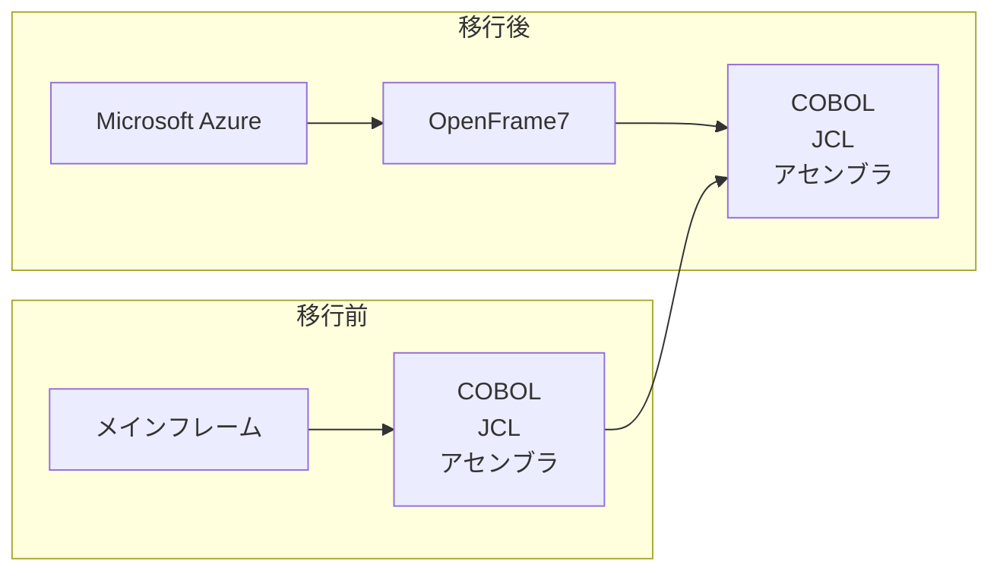

損害保険ジャパンが、メインフレーム上のシステムを Microsoft Azure へ移し、COBOL などの言語資産を残した事例を、公開資料の範囲で追えます。発注側は、残すもの、捨てるもの、切替の合格を一文へ落とすとき、公開資料がどこまで材料になるかを読めます。主材料は、日本ティーマックスソフトの2026年9月25日の発表です。このリホストと同じ内容を、損保ジャパンが単独で出したリリースは、2026年10月4日時点では確認できていません。

*この記事の全体像。以下、順に解説します。*

## ランオフ系リホストとは

ランオフ系のリホストは、既存の言語資産を残し、その下の基盤だけを差し替える移行です。ここでいうランオフは、日本ティーマックスソフト代表取締役の李亨庸が、コメントで「ランオフシステムのモダナイゼーション」と呼んだ範囲です。

2026年9月25日、日本ティーマックスソフトは、損害保険ジャパンが OpenFrame7 を採用し、メインフレームで稼働していたシステムをリホストしたと発表しました。本番稼働の開始は2025年6月です。プロジェクトは2021年9月に始まり、約45か月の開発を経た、と書かれています。発表の掲載は、共同通信 PR ワイヤーの同日 14:07 です。

対象は、COBOL、JCL、アセンブラを中心とした大規模なレガシー資産です。発表は、この対象をミッションクリティカルと書きます。会社紹介には、損保ジャパンの代表取締役社長として石川耕治の名前があります。顧客コメントの欄に、発言者の個人名はありません。

### 発表が残すと書いたもの

方式の名はリホストです。既存のアプリケーション資産を残し、稼働先を Microsoft Azure にします。発表が比較に挙げた方式の名は、リビルドとリライトです。発表は、選んだ理由を「既存資産を活用しながら短期間・低リスクで移行できる」と書きます。

プロジェクトの基本方針の文言は、「現行踏襲」と、リリース後の安定稼働です。OpenFrame7 の採用理由の文言は、アセンブラを含むプログラム資産への互換性により、アプリケーションの改修を最小限に抑えながら活用できることです。

損保ジャパン名義のコメントは、安定したサービスを維持することを最優先に取り組んだ、と述べます。同じコメントは、アセンブラを含む既存資産を活用し、オープン環境へ移行できたと述べます。続けて、メインフレーム維持コストの削減を実現したことと、今後はそのコストをデジタルサービスの高度化や DX 推進へ使うことを述べます。

李亨庸のコメントは、アセンブラを含む大規模なレガシー資産を維持したまま、品質を確保してオープン環境へ移すプロジェクトだった、と述べます。同じコメントは、損保ジャパン、SI パートナー、関係者の連携で本番稼働を迎えた、と述べます。SI パートナーの社名は、発表にありません。

### 言語資産の下だけを差し替える

李亨庸のコメントがランオフシステムと呼ぶ範囲では、言語資産は残り、その下の基盤が替わります。処理の規則は、発表が書く現行の踏襲です。

図の左は、移行前のメインフレームと、その上の COBOL、JCL、アセンブラです。図の右は、Microsoft Azure の上の OpenFrame7 と、同じ言語資産です。中央の矢印は、言語資産が残ることを示します。

## 注意点

見出し、評価語、別案件の数字を、この発表の本文から切り離して読みます。

### 同じ発表が長期間とも短期間とも書く

発表は、期間を「約45か月にわたる長期間の開発」と書きます。方式を選んだ理由は、「既存資産を活用しながら短期間・低リスクで移行できる」とも書きます。リライト案の見積期間は、この発表にはありません。「リライトより短かった」は、この発表だけでは測定できません。

野村證券の OpenFrame 事例は、債券約定処理システムです。導入期間の表記は2006年9月から2007年4月です。顧客コメントは「7ヶ月でプロジェクトは完遂」と書きます。別会社で、別の時代の事例です。45か月の長短を測る分母には使いません。

同じ発表の製品説明は、リビルドやリライトと比較して低リスク・低コスト、と書きます。これは OpenFrame 一般の説明です。この案件の削減額ではありません。製品説明が列挙する言語には PL/I もあります。今回の対象資産の中心として発表が書いたのは、COBOL、JCL、アセンブラです。

### 見出しが本文より広い

TechTarget Japan（2026年10月2日）の見出しは、「なぜ COBOL を捨てなかったのか」と「脱メインフレーム」を含みます。著者表記は CaseHUB.News です。末尾の注は、本多和幸氏と谷川耕一氏の CaseHUB.News 記事（2026年9月28日）を、TechTarget 編集部が一部編集して転載した、と書きます。

会員登録前の本文は、既存契約に関わる業務を続けるランオフシステムと、現行の業務ロジックの踏襲を書きます。暗黙の業務規則を失う恐れを、損保ジャパンの動機としては書いていません。見出し「リビルドがはらむリスクと、リホスト選定の論理」の続きは会員限定で、この記事では未読です。

IT Leaders（2026年9月25日、日川佳三）の見出しは「基幹系」です。本文は、ランオフという語を使いません。リホストの説明は、アプリケーションにできるだけ手を入れずに、異なるアーキテクチャのインフラに載せ替える、です。コストについては、メインフレームからオープン環境へ移すことで抑制できる可能性がある、と背景として書きます。損保ジャパンのコメントが述べる削減の金額は、IT Leaders にもありません。

### 削減の文言と、無い数字

損保ジャパン名義のコメントは、「メインフレーム維持コストの削減を実現」と書きます。「安全かつ確実にオープン環境へ移行することができました」とも書きます。削減額、削減率、比較期間、欠陥件数は、ベンダー発表にありません。Azure と OpenFrame のライセンスを含む総額かどうかも書いてありません。

TechTarget の公開されている要約も、維持費用を削減したと書き、金額は書きません。FWD 生命の「運用コスト 1/3」は、別顧客の導入事例です。この案件の効果としては使いません。ステップ数、試験項目数、現行出力との差分も、ベンダー発表にはありません。

### 無修正は現行手順の確認が残る

ソースをそのまま動かす、は、言語と業務ロジックを残す、という範囲で読みます。Microsoft Learn の過去版は “No reformatting is required” と書きます。ページの `ms.date` は 2019-04-02 で、置き場所は previous-versions です。現行の OpenFrame7 の手順の根拠にはしません。

現行の OpenFrame 移行ガイド（OpenFrame common 7.1 MVS）の本文は、この記事では取得できていません。検索結果の抜粋には、ソースの EBCDIC から ASCII への変換と、EXEC CICS を使う COBOL の osccblpp 前処理が手順に含まれる、と出ます。本文を読んでいないので、バイト単位の無修正は現行仕様の根拠にしません。文字コードと前処理は、発注前にガイドの版で確認する項目として残します。

### 別の刷新と、いまも書かれるメインフレーム

2024年11月27日の損保ジャパン発表は、別システム「SOMPO-MIRAI」です。オープン系技術を用いて一から作り直し、2024年5月以降の自動車保険の契約で業務利用を始めた、と書きます。ランオフ系のリホストと同一の移行としては読みません。

2026年10月4日に開いた SOMPO システムズの求人（job_code=205）は、損保ジャパンの基幹系システムが IBM 社製メインフレーム上で稼働している、と現在形で書きます。環境欄は IBM Z と IBM z/OS です。ページ上の公開日は見当たりません。「2026年6月現在」は、大阪センターの在籍人数（社員 8 名、パートナー会社 3 名）の時点です。同じ募集要項は、次世代基幹システム「未来革新プロジェクト」のメインフレームに関する対応も含みます。

日経クロステック 2024年12月11日の1ページ目は、損保ジャパンがバッチやデータベースなど特定処理用に新たにメインフレームを導入しながらモダナイズしている、と書きます。2ページ目の見出しは「損保ジャパンはバッチとDBをメインフレームに移行」で、本文は有料会員限定です。この記事では未読です。新設の範囲は、1ページ目の一文までです。

## 発注前に三方式を一行で埋める

言語の新旧は、表の1列です。発注の前に、各方式を1行で埋めます。三方式の名前の意味は、IT Leaders の説明を作業用に使います。IT Leaders は二次の記事です。表の「捨てる成果物」「残る欠陥の所在」「切替の合格試験」は、発注側が埋める欄です。損保ジャパンの契約文ではありません。

| 方式 | 捨てる成果物 | 残る欠陥の所在 | 切替の合格試験 | 言語 |
|---|---|---|---|---|
| リホスト | 現行メインフレームの筐体と、その OS・保守の契約。言語資産は残す | 残した COBOL とアセンブラの中の既存不具合。文字コード変換と前処理の隙間（ガイド本文は未確認） | 合意した入力について、現行本番と同じ出力になること。周辺接続、性能、障害復旧は別行で書く | COBOL のまま |
| リライト | 実行に使っていた旧ソース。仕様は残す前提 | 仕様書に落ちなかった規則。変換後のプログラム構造 | 現行出力との比較に加え、必要な仕様が新ソースに入っていること。現行出力だけでは足りない | 別の言語 |
| リビルド | 旧コードと、コードに埋まっていた手順 | 新設計で再現しなかった旧例外。新しい設計の抜け | 新しい業務の正しさ。現行出力との一致は、完了条件そのものにはならない | 新しい言語 |

野村総合研究所の lakyara vol.391（2024年10月10日、Ayumi Naradate、Kazuhiro Torii）は、リホストを、アプリケーションとデータを変えずに、新しい OS または基盤へ移すこと、と定義します。難所として挙げるのは、移行前後のアーキテクチャ差、データ移行と周辺システム連携、移行後システム全体の品質保証です。ソース変換の品質はベンダー保証になりやすい一方、システム全体の品質保証はシステムの所有者に残る、と書きます。統合試験の後の試験費用が、リビルド並みになり得る、とも書きます。これは保険会社の移行一般の論です。損保ジャパンの試験費用の実測ではありません。

リライトの行にある仕様の欠落は、別会社の公開例で裏づけます。日経クロステック 2024年12月11日の1ページ目は、日新火災が COBOL から仕様を起こして Java に作り替え、リリース前の新旧比較で必要な仕様が反映されていなかった、と安川真斗氏の発言として書きます。1220万ステップは、日新火災の COBOL とアセンブラーの合計です。損保ジャパンの規模ではありません。

## 言語を残す判断はどこまで持つか

業務規則を変えない既存契約の継続処理では、言語を残すリホストは、切替の主試験を現行出力との一致へ寄せられます。言語を新しくすることは、その判断の本体にはなりません。

支えは、次の三つです。

- ベンダー発表は、リビルドとリライトを採らず、リホストと「現行踏襲」を選んだと書きます。
- 採用理由の中心は、アセンブラを含む既存資産の互換性と、改修の最小化です。
- IT Leaders の説明でも、リホストはアプリケーションへの改修を抑えて基盤を載せ替える方式です。

限界は、次のとおりです。

- 同じ発表が、期間を長期間とも短期間とも書きます。短期間は、比較測定の無い評価語です。
- NRI の一般論では、全体品質の試験が発注者側に残ります。一致試験は主試験になり得ます。合格の全部にはなりません。
- 現行ガイドの本文は未確認です。文字コード変換と CICS 前処理の抜粋がある以上、バイト単位の無修正は現行仕様の根拠にしません。
- 求人の現在形、SOMPO-MIRAI の発表、日経クロステックの1ページ目は、このリホストを全社のメインフレーム廃止としては支えません。
- このランオフ系について、欠陥件数、試験項目、現行出力との差分、費用総額を示す公開の一次資料は、参照した範囲では見つかっていません。資料が無いとまでは言いません。

途中でリライトへ転換した記録と、この案件固有のロックイン契約は、参照した公開資料には見当たりません。見当たらないことを、転換が無かった証明や、ロックインが無い証明にはしません。

## 発注文に置く一文

発注側が、残す判断の完了条件として置く文は、次です。

対象は、商品規則を変えない既存契約の継続処理とします。新規商品と新規チャネルは対象外とします。言語資産は残します。捨てるのは、現行メインフレームの基盤契約です。切替の合格は、合意した入力集合について現行出力と一致することに加え、文字コード、周辺接続、障害復旧の試験を別行で書きます。

この一文が書けない資産には、リホストの完了条件を流用しません。規則を変える資産は、リビルドの行に「新しい業務の正しさ」を合格試験として書きます。言語を Java にすることだけでは、その行は埋まりません。

次に埋める表は、上の3行だけです。45か月を短期間とは呼びません。削減額は、一次資料に金額が出るまで空欄にします。OpenFrame を採るかどうかは、この表の外です。製品の採否は、完了条件の文が書けたあとで別に判断します。

### 一次がまだ無い項目

発注側が、この案件の数字としてまだ埋められない項目は、次です。

- 損保ジャパン自身の文書が、対象の境界と合格試験をどう書いたか。ベンダー発表の顧客コメント以外は、2026年10月4日時点で未確認です。
- 移行元メインフレームのメーカーと、SI パートナーの社名。求人が書く IBM は、2026年10月4日時点の募集要項です。2021年に始まったこのリホストの移行元である、と発表は書いていません。
- 維持コスト削減の額、率、比較期間。Azure と OpenFrame のライセンスを含む総額かどうか。
- 現行ガイド本文での、前処理と文字コード変換の版。
- 日経クロステック 2024年12月11日の2ページ目が、メインフレーム新設をどの範囲で書いているか。
- 求人ページの公開日と最終更新日。

## まとめ

ランオフ系のリホストは、言語資産を残し、基盤契約を捨てる移行です。損保ジャパンの事例で、その呼び方を置いたのはベンダー社長のコメントです。期間は約45か月と書かれ、同じ発表が短期間とも書きます。削減は実現したとコメントが書き、金額は公開されていません。

発注の前に置く一文は、対象を商品規則を変えない既存契約の継続処理に限り、合格を現行出力との一致だけにしない、というものです。文字コード、周辺接続、障害復旧は別行です。45か月を短期間とは呼ばず、削減額は一次に金額が出るまで空欄にします。

この記事が少しでも参考になった、あるいは改善点などがあれば、ぜひリアクションやコメント、SNSでのシェアをいただけると励みになります！

## 参考リンク

- [日本ティーマックスソフト発表（共同通信 PR ワイヤー、2026-09-25 14:07）](https://www.kyodo.co.jp/pr/2026-09-25_4037498/)
- [同一原稿（共同通信 PR ワイヤー）](https://kyodonewsprwire.jp/release/202609176155)
- [TechTarget Japan（2026-10-02、CaseHUB.News の転載。会員限定の節は未読）](https://techtarget.itmedia.co.jp/tt/article/2610/02/2000001917/)
- [IT Leaders（2026-09-25、日川佳三）](https://it.impress.co.jp/articles/-/29824)
- [損保ジャパン「自動車保険の基幹システム刷新完了」（2024-11-27）](https://prtimes.jp/main/html/rd/p/000000453.000078307.html)
- [SOMPO システムズ求人 job_code=205（2026-10-04 に開いたページ。公開日はページ上で未確認）](https://js02.jposting.net/sompo-sys/u/job.phtml?job_code=205)
- [NRI lakyara vol.391（2024-10-10）](https://www.nri.com/en/knowledge/publication/lakyara_202410/files/000027004.pdf)
- [野村證券 OpenFrame 事例（別案件）](https://www.tmaxsoft.com/jp/case-study/view?caseSeq=194)
- [日経クロステック（2024-12-11、1ページ目。2ページ目は有料で未読）](https://xtech.nikkei.com/atcl/nxt/column/18/03026/112800005/)
- [Microsoft Learn OpenFrame 入門（ms.date 2019-04-02、previous-versions）](https://learn.microsoft.com/en-us/previous-versions/azure/virtual-machines/workloads/mainframe-rehosting/tmaxsoft/get-started)
- [OpenFrame 移行ガイド（本文は未取得）](https://docs.tmaxsoft.com/en/openframe_common/7.1_MVS/migration-guide/chapter-application-migration-mvs.html)
