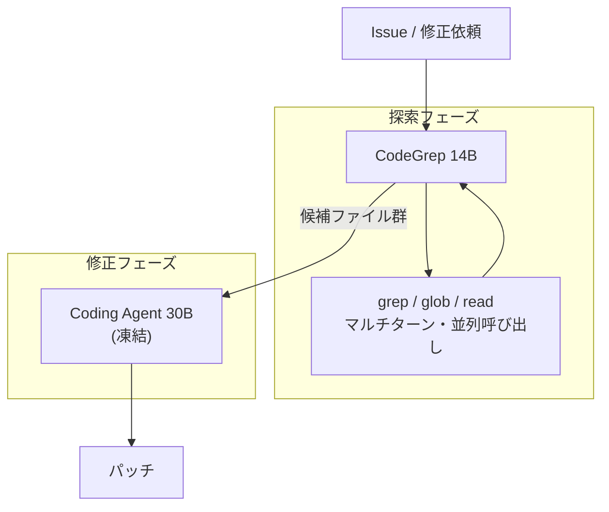

*この記事の全体像。以下、順に解説します。*

## この記事の対象と得られるもの

LLM コーディングエージェントを自作・改造している方が対象です。

エージェントの実行ログを眺めると、パッチを書く時間よりも「どのファイルを直すのか」を探す時間のほうが長い、という現象に心当たりがあると思います。`grep` と `glob` と `view_file` を何往復もして、ようやく修正対象にたどり着く。この探索フェーズを専用の小さいエージェントへ切り出せばコストが下がるのではないか、という発想は自然です。

2026 年 8 月の論文 *CodeGrep: An RL-Trained Retrieval Agent for LLM Coding Agents* (arXiv:2608.05886) は、この分離を実際に強化学習で作り込み、SWE-Bench Verified で評価しています。結果は「効く」でしたが、同時に**効くための条件**が示されました。

この記事で得られるものは次の 3 点です。

- 探索と修正を分離するアーキテクチャの全体像
- 分離が効く条件としての「検索精度の閾値」という考え方
- 自作エージェントへ適用するときの判断基準とトレードオフ

## 何が問題だったのか

コーディングエージェントの 1 タスクは、大きく 2 つの仕事が混ざっています。

| フェーズ | 仕事 | 必要な能力 |
| --- | --- | --- |
| 探索 | 修正対象のファイルを特定する | ツール呼び出しの反復、広く浅い読解 |
| 修正 | 差分を書く | 深いコード理解、整合性の維持 |

この 2 つを 1 つのモデルが担うと、探索で読み込んだ大量のファイル内容がそのままコンテキストに残ります。修正フェーズに入る頃には、本来不要な情報でコンテキストが膨らんでいる状態です。トークン単価もラウンド数も、ここで膨らみます。

## CodeGrep のアーキテクチャ

論文の提案は、探索を 14B の専用検索エージェントへ切り出し、下流のコーディングエージェント (30B) は凍結したまま候補ファイルだけを受け取る、という構成です。

ポイントは、下流のコーディングエージェントに手を入れていないことです。探索器の差し替えだけで下流のコストがどう変わるかを見る、という切り分けになっています。

学習側は、67K のオープンソースエージェント軌跡 (CATM) と Git worktree ベースの実行環境を用いた end-to-end の強化学習 (GRPO) です。効率化のシグナルを Advantage レイヤーへ適用することで、KL ドリフトを抑えながら「短く探す」方向へ寄せています。報酬設計そのものではなく Advantage 側で効率を効かせている点が、実装上の勘所です。

## 結果: コストは下がり、解決率は下がらない

SWE-Bench Verified での報告値は次のとおりです。

| 指標 | 変化 |
| --- | --- |
| 解決率 | 25.8% → 27.0% |
| 平均ラウンド数 (解決済みインスタンス) | 15% 削減 |
| 消費トークン数 (解決済みインスタンス) | 19% 削減 |

解決率を落とさずにコストだけ削る、という結果です。ここだけを読むと「探索は分離すべき」という結論になりますが、論文のより重要な示唆はこの先にあります。

## 本題: 精度閾値という条件

論文は、探索器を差し替えた比較を行っています。下流のコーディングエージェントは同一のまま、渡す候補ファイルの出所だけを変えた比較です。

| 探索器 | Precision | 下流への影響 |
| --- | --- | --- |
| BM25 | 0.375 | 無関係なファイルが混ざり、下流を混乱させて性能が劣化 |
| Jina | 0.445 | ニュートラル。コスト削減効果なし |
| CodeGrep | 0.677 | 不要なコンテキスト読み込みが減り、トークンとラウンドが削減 |

ここから読み取れるのは、**分離のメリットは検索精度に対して連続的ではない**ということです。精度が低い探索器へ分離すると、コストが下がらないどころか性能が落ちます。

理由は考えれば当然で、下流のエージェントは受け取った候補ファイルを「一度は読む」からです。候補に外れが多いほど、読み捨てるための無駄なトークンとラウンドが積み上がります。単一エージェントであれば、自分で探しながら不要だと判断した時点で読むのをやめられます。分離するとその判断機会が失われ、外れの分だけ純粋なコストになります。

つまり分離は、精度をコストへ変換するレバーです。精度が高ければコストが下がり、低ければコストが増えます。

Precision 0.6 後半という値は本論文の実験設定 (SWE-Bench Verified、14B 探索器、30B 下流) での観測であり、そのまま普遍の定数として扱うべきではありません。ただし「閾値が存在し、その下では分離が逆効果になる」という構造は、リポジトリや下流モデルが変わっても成立すると考えられます。

## 自作エージェントへの適用

ここからは、この論文をどう自分の設計へ持ち込むかです。

### 1. 分離する前に、現状の探索精度を測る

分離を検討しているなら、まず「その探索手段が返す候補のうち、実際に修正されたファイルは何割か」を測ります。ここが低いまま分離すると、確実に悪化します。

測り方は、過去に自分のエージェントが解いたタスクのログから、最終的に差分が入ったファイル一覧を正解として、探索候補と突き合わせるだけで十分です。

### 2. Recall より Precision を見る

検索の文脈では Recall を重視しがちですが、この用途では逆です。渡し漏れは下流が追加で探せば取り返せますが、余計なファイルを渡すコストは下流では取り返せません。ハンドオフの契約は「不要なファイルを渡さないこと」を第一条件にします。

### 3. 精度が足りないなら分離しない

閾値に届かないなら、単一エージェントの中で探索させるほうが安全です。「アーキテクチャとして綺麗だから分ける」は、この領域では成立しません。

## トレードオフと未解決の論点

分離には、論文の数値に表れないコストもあります。

- **運用の複雑さとレイテンシ**: トークンは 19% 減っても、14B と 30B の 2 モデルを協調させるデプロイ構成が必要になります。推論レイテンシとシステム的な複雑さは増えます。トークン単価の削減がこれを回収できるかは、自分の運用規模次第です。
- **コンテキストの分断**: 探索と修正を分けると、修正中に「やはりあのファイルも要る」というマルチホップな要求へ即応しづらくなります。静的に候補を渡し切る設計の限界です。なお、この点は本論文が定量評価した項目ではなく、マルチエージェント構成一般の課題からの推測です。実際の影響度は自分のタスク分布で確認する必要があります。

論文が残した問いも、そのまま実務の問いになります。

- 検索精度がどの水準を超えれば、別エージェント化の運用コストまで含めて回収できるか
- ハンドオフで渡すものを、ファイル一覧以上のもの (AST や依存関係グラフ) にしたとき、何をどうシリアライズするのが最適か

2 つ目は特に、自作エージェントで手を入れやすい領域です。ファイル一覧ではなく「該当シンボルとその参照元」まで渡せば、下流の読み込み量はさらに減る可能性があります。

## まとめ

- CodeGrep は探索を 14B の専用エージェントへ分離し、SWE-Bench Verified で解決率 25.8% → 27.0%、トークン 19% 削減、ラウンド 15% 削減を報告した
- ただし効果は探索器の Precision に依存し、低精度な探索器 (BM25, Precision 0.375) へ分離すると下流が劣化する
- 分離は「精度をコストへ変換するレバー」であり、精度が閾値に届かないなら単一エージェントのほうが安全
- 自作エージェントでは、分離の前に現状の探索精度を測り、Recall より Precision を優先してハンドオフ契約を設計する

この記事が少しでも参考になった、あるいは改善点などがあれば、ぜひリアクションやコメント、SNSでのシェアをいただけると励みになります！

## 引用文献

- Chen, W., Yang, Y., Cao, Y., & Lin, Y. (2026-08). *CodeGrep: An RL-Trained Retrieval Agent for LLM Coding Agents*. arXiv:2608.05886. https://arxiv.org/abs/2608.05886
