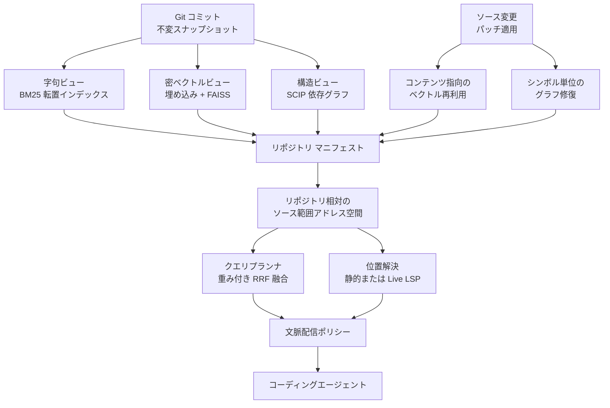

コーディングエージェントにリポジトリを理解させるとき、多くの議論は「grep か、ベクトル検索か、それともコードグラフか」という**検索方式の比較**に落ち着きます。

2026年7月に公開された論文 CodeNib (arXiv:2607.25431) は、この立て方そのものを組み替えます。主張はシンプルです。

> リポジトリ文脈の提供は検索アルゴリズムの問題ではなく、**データ管理システムの問題**である。

本記事では、CodeNib が持ち込んだ「コミットを基盤データ、各インデックスを導出ビューとみなす」設計と、その中核概念である**鮮度境界 (Validity Boundary)** を整理します。そのうえで、論文の実測値をどう読むか、自分のエージェント基盤に何を持ち込めるかまでを扱います。

対象読者は、コーディングエージェントやコード検索基盤を自分で設計・運用する立場の方です。読み終えたときに、「インデックスをいつ・どこまで作り直すか」を操作単位で決める判断軸が手元に残る状態を目指します。

## なぜ「検索方式の比較」では足りないのか

エージェントが大規模リポジトリを扱うとき、典型的には次の3系統を使います。

| 系統 | 代表実装 | 得意なこと |
|---|---|---|
| 字句検索 | grep / BM25 | 既知の識別子・文字列の発見 |
| 密ベクトル検索 | 埋め込み + FAISS | 曖昧な意図からの候補列挙 |
| 構造ナビゲーション | LSP / AST / SCIP | 定義・参照の正確な追跡 |

この3系統を**それぞれ独立に、必要になったら再実行する**のが従来の作り方でした。ここに2つのコストが隠れます。

- **再インデックスのコスト**: コードが1行変わるたびに、どのインデックスをどこまで作り直すべきかが不明なため、実務では「全部作り直す」か「古いまま使う」の二択になりがちです。
- **プロンプト履歴の圧迫**: エージェントが grep と read を手探りで繰り返すと、探索ログそのものがターンごとに蓄積し、本題の推論に使える文脈を食い潰します。

どちらも「どの検索方式が優れているか」を決めても解けません。解くべきは、**方式ごとに異なる更新コストと壊れやすさを、どう別々に管理するか**です。CodeNib はここをデータ管理の語彙で定式化します。

## CodeNib の全体像

CodeNib は Git のコミットを**不変の基盤データ**として固定し、字句・密ベクトル・構造グラフの3つを**導出ビュー**としてコミット単位でマテリアライズします。データベースにおけるベーステーブルとマテリアライズドビューの関係を、リポジトリに持ち込んだ構図です。

設計上の要点は3つです。

1. **単一のアドレス空間**: すべてのビューの出力は「どのコミットの、どのファイルの、何行目から何行目か」というリポジトリ相対のソース範囲に正規化されます。BM25 のスコア付き文書、ベクトルの近傍、グラフのシンボルノードという異種の出力を、同じ座標系で扱えるようにするのがこの層の役目です。
2. **マニフェストによる版管理**: どのコミットに対してどのビューがどの状態で存在するかを、単一のマニフェストが持ちます。ビューの整合性判断がここに集約されます。
3. **操作別の鮮度境界**: 変更があったとき、ビューを一律に無効化しません。ビューごと・操作ごとに「いつまで有効か」「何を条件に更新するか」を分けて定義します。

3つ目が CodeNib の核です。

## 鮮度境界という考え方

鮮度境界 (Validity Boundary) は、**このビューのこの出力は、どの変更までなら再利用してよいか**を明示する契約です。ビュー間で更新コストと壊れやすさが違うため、境界も別々に引きます。

| ビュー | 保持形式 | 更新メカニズム | 鮮度境界 | フル再構築との一致 / 速度 |
|---|---|---|---|---|
| 字句 | BM25 転置インデックス | 変更ファイル単位の文書差し替え | テキストが変わったファイルのみ無効 | 構築中央値 0.81 秒 |
| 密ベクトル | FAISS 内積インデックス | コンテンツハッシュによる埋め込み再利用 + 差分追加 | ハッシュ一致ブロックのベクトルは再利用 | 一致 90.3% (28/31 遷移) 中央値 25.44 倍 |
| 構造 | SCIP 依存グラフ | Git / LSP 支援のシンボル単位修復 | 変更ファイルと直接の定義・参照エッジのみ修復 | 一致 45.5% (15/33 遷移) 中央値 8.67 倍 |

読み方のポイントは、**「一致率」と「速度向上」を切り離して見る**ことです。

- **密ベクトル**は一致率が高く (90.3%)、速度向上も大きい (中央値 25.44 倍、IQR 15.24〜35.15 倍)。ここは差分更新を既定にしてよい領域です。埋め込み API のコストが乗るため、再利用の効果も直接効きます。
- **構造グラフ**は速度向上こそ得られる (中央値 8.67 倍、IQR 5.95〜10.99 倍) ものの、フル再構築と完全一致するのは半分以下 (45.5%) にとどまります。差分修復を既定にするなら、**一致しないケースを検知してフル再構築へ落とす安全弁**が前提になります。

つまり鮮度境界の設計とは、「速いから差分更新にする」ではなく、**その操作が要求する正確さに対して差分更新が十分かを操作ごとに判定する**作業です。

### 言語で結果が変わる

構造グラフの修復成功率は言語に強く依存します。論文では Go (7/7) と Python (8/8) が完全一致率 100% を示した一方、Rust と TypeScript / JavaScript は完全一致チェックを通過しませんでした。原因は型推論やマクロ展開といった、ファイル境界を越えて影響が伝播する仕組みです。

自分のリポジトリの主要言語がどちら側かで、採用できる鮮度境界が変わります。「差分修復が効く言語」と「素直にフル再構築すべき言語」を先に切り分けておくのが実務的です。

## 静的ナビゲーションは Live LSP の代わりになるか

CodeNib は SCIP ベースの静的プロバイダを用意し、Live LSP サーバーとの応答互換性を検証しています。1,000 リクエストでの結果です。

| 操作 | 静的と Live LSP の位置一致率 |
|---|---|
| 全体 | 63.2% (632/1,000) |
| 定義元ジャンプ | 87.4% (437/500) |
| 参照箇所検索 | 39.0% (195/500) |

完全一致した 632 件では、中央値レイテンシが静的 0.62ms、Live LSP 2.26ms で、ペア比の中央値は 4.72 倍の高速化でした。

ここから導ける判断は、操作を一括で扱わないことです。

- **定義元ジャンプ**は一致率 87.4% と高く、静的キャッシュで応答してよい操作です。
- **参照箇所検索**は 39.0% しか一致しません。動的型付けや高度な抽象化が絡むと、静的インデックスは参照を取りこぼします。ここは Live LSP へフォールバックする前提で組みます。

「静的か Live か」ではなく「**操作ごとに静的で足りるか**」を問うのが、鮮度境界の考え方をナビゲーションに適用した形です。

## トークン削減はポリシー設計の成果

CodeNib は検索結果をエージェントへ渡す方法も2つのポリシーに整理しています。

- **Eager Policy**: 検索上位候補を初回から提示し、手探りの grep 往復を省く。
- **Compact Policy**: 最初に成功したコード読み込みの直後に、それまでの探索履歴をコンパクト化する。

5つのモデル環境 (Claude 3.5 Haiku, Qwen2.5 7B / 27B, Gemma 2 12B, Gemini Flash) で測定した結果、ローカライゼーション精度 (AnswerRecall@5) を保ったまま、grep / read ベースラインに対して軌跡トークンを 50〜87% 削減しました。

| モデル | 最適ポリシー | ベースライン比のトークン比率 |
|---|---|---|
| Claude 3.5 Haiku | Eager | 49.9% |
| Qwen2.5 7B | Compact | 45.1% |
| Qwen2.5 27B | Compact | 44.8% |
| Gemma 2 12B | Compact | 12.9% |
| Gemini Flash | Compact | 35.8% |

注目したいのは、**最適ポリシーがモデルによって違う**点です。Haiku では Compact Policy がむしろトークンを増やし (ベースライン比 123.3%)、Eager のほうが有利でした。履歴の再構成そのものにトークンを要するため、モデルの文脈処理特性と指示追従の傾向で損益が反転します。

したがって「履歴コンパクションを入れれば減る」とは言えません。**使うモデルごとに測ってから既定値を決める**必要があります。

## 適用の前に見るべき損益分岐点

CodeNib の効果は無条件ではありません。論文が挙げる制約のうち、導入判断に直結するのは初期構築コストです。

コールド状態での全インデックス構築時間は**中央値 116.7 秒**、およそ2分です。数ターンで終わる使い捨てセッションや小さな単発タスクでは、この2分が探索削減分を上回ります。

判断は次のように分かれます。

| 状況 | 妥当な構成 |
|---|---|
| 長期間・多ターンで同じリポジトリを触る | 全ビューを構築し、差分更新で維持する |
| 変更頻度が極端に高い開発中ブランチ | 重い近傍探索インデックスやグラフ構築は省き、BM25 と単純なベクトルで運用する |
| 単発・短時間のタスク | インデックスを作らず従来の grep / read で足りる |

「常に全部作る」も「常に作らない」も最適ではなく、セッションの寿命と変更頻度で選ぶ話になります。

## 自分のエージェント基盤に持ち込むなら

論文の知見を、自分でエージェント基盤を運用する立場で使える形に落とすと、次の3点になります。

1. **キャッシュ戦略を操作別に分ける**
   ベクトルは関数・ブロック単位のコンテンツハッシュで再利用し、再埋め込みの API コストを抑えます。定義元ジャンプは静的キャッシュで応答し、参照箇所検索だけ Live LSP へ回します。1つのキャッシュ方針で全操作を覆わないのが要点です。

2. **履歴コンパクションは条件付きで入れる**
   長時間セッションでは、最初の成功 Read 直後に探索履歴を要約・破棄するパイプラインが効きます。ただし前節のとおりモデル依存なので、既定で有効にする前に自分の使うモデルで前後比較を取ります。

3. **コールドビルドの損益分岐点を運用ルールに書く**
   「どのリポジトリで、どの寿命のセッションなら、どのビューを作るか」を事前に決めておきます。決めていないと、2分の構築を毎回払うか、古いインデックスを使い続けるかのどちらかに流れます。

いずれも共通しているのは、**検索方式を選ぶのではなく、更新と再利用の境界を書き出す**という作業です。CodeNib の貢献は、その境界を語る語彙を用意したことにあります。

## まとめ

- CodeNib はリポジトリ文脈の提供を、検索アルゴリズムの比較ではなく**データ管理システムの設計問題**として定式化した。
- コミットを不変の基盤データ、字句・密ベクトル・構造グラフを導出ビューとし、出力をリポジトリ相対のソース範囲アドレス空間に正規化する。
- 中核概念は**鮮度境界**。ビューごと・操作ごとに有効期限と更新条件を分け、全体再インデックスを避ける。
- 実測では、ベクトル更新が中央値 25.44 倍、グラフ修復が中央値 8.67 倍の高速化。ただしフル再構築との完全一致率はベクトル 90.3% に対しグラフ 45.5% で、後者は安全弁が必要。
- 静的ナビゲーションは定義元ジャンプ (一致率 87.4%) には有効だが、参照箇所検索 (39.0%) では Live LSP へのフォールバックが前提。
- 文脈配信ポリシーで軌跡トークンを 50〜87% 削減できるが、最適ポリシーはモデル依存。Haiku では Compact が逆効果だった。
- コールドビルドは中央値 116.7 秒。セッションの寿命と変更頻度で、どこまでビューを作るかを決める。

この記事が少しでも参考になった、あるいは改善点などがあれば、ぜひリアクションやコメント、SNSでのシェアをいただけると励みになります！

## 参考リンク

- Zhanyi Huang, et al. "CodeNib: A Multi-View Data System for Serving Repository Context to Coding Agents", arXiv:2607.25431v1, Jul 2026 — https://arxiv.org/abs/2607.25431
- データセット: CodeNib Base split (`fishmingyu/codenib-base-dataset`), CodeNib Synthesis split (`sysevol-ai/codenib-synthesis`)
