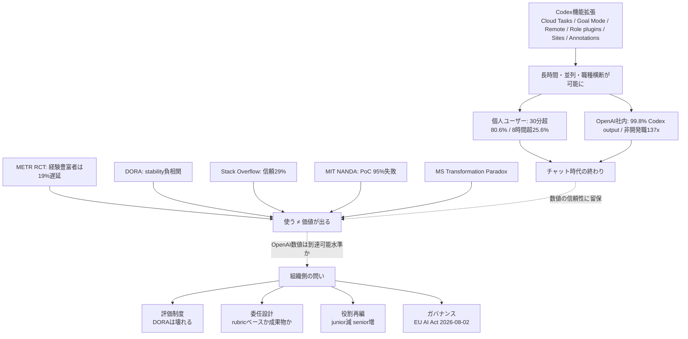

## 概要

2026-06-25、OpenAI Economic Research部門が「How agents are transforming work」と題するブログを公開しました。発表の核は、新モデルでも新機能でもなく、**「ナレッジワークの単位が、チャット1往復から長時間の委任タスクに切り替わった」**という主張です。それを **OpenAI社内の利用ログと個人ユーザーのタスク分布** という2系統のデータで裏付けています。

主な数値は以下のとおりです(すべてOpenAI自己申告、母集団・推定方法は非公開)。

| 数値 | 母集団 | 期間 |
|---|---|---|
| 30分超のタスクを1回以上委任した人 = **80.6%** | sampled individual Codex users | Dec 2025–May 2026 |
| 1時間超 = **70.2%** | 同上 | 同上 |
| 8時間超 = **25.6%** | 同上 | 同上 |
| OpenAI全社の **weekly output tokensの99.8%** がCodex経由 | OpenAI社員全体 | 発表時点 (2026-06) |
| 弁護士・リクルーターでも **出力トークンの85%超** がCodex経由 | OpenAI Legal / Recruiting職 | 同上 |
| 非開発者 個人ユーザー **137倍**、組織ユーザー **189倍** | Codex非開発職セグメント | 8/2025比 |
| Research部門 median利用量 **56倍**、Customer Support 32x / Engineering 27x / Legal 13x | OpenAI各部門 中央値社員 | 11/2025比 |

この発表は、6月2日の「Codex for every role, tool, and workflow」(役割別プラグイン × 6 / Sites / Annotations) と、5-6月にかけてのCloud Tasks GA、Goal Mode GA、Codex Remote GA、Multi-agent delegationの流れと組で読むのが妥当です。**機能側で「長時間・並列・職種横断」が可能になり、それが社内の主力AIを1年弱で完全に切り替えた**、というのがOpenAIのシナリオです。

ただし注意点も多い発表です。すべてOpenAI単独ソース、第三者監査なし、母集団のsampling条件も「sampled individual users」以上の開示がありません。METRのRCTが「経験豊富な開発者はAI利用群で19%遅延、にもかかわらず本人は『24%速くなった』と事前に予測した」と示すように、**主観の事前予測 +24% と実測 -19% の間には約43ポイントのギャップ** が普遍的に存在します。OpenAIの数値を「業界標準」として鵜呑みにできる段階ではありません。

本稿は、この発表を3つの観点で読み直します。

1. データの読み方: OpenAI数値はどこまで信じてよく、どこから注釈が要るか
2. 組織設計の含意: 「30分超委任が日常」になったとき、評価・委任・役割はどう変わるか
3. 実務の出発点: 自社・自分の組織で、明日から何を試せるか

## 特徴

### 「チャット」から「委任」へ — 計測単位そのものが変わった

これまでAI利用度の指標は「週次アクティブ」「1日あたりリクエスト数」「採用率」が主流でした。OpenAIが今回の発表で押し出した指標は、**1件のリクエストが「人間ならどれだけ時間がかかる仕事か」** をCodex自身で推定したものです。30分超80.6%、1時間超70.2%、8時間超25.6%という階層は、リクエストの「重さ」を時間軸に置いた点に新しさがあります。

別の角度として、Anthropic Economic Index (2026-06) も「Claude.aiの利用はdirective conversation比率が27% → 39%に増え、codingはdebugからprogram creation寄りにシフト」と報告しています。**業界全体で「短い対話の積み重ね」から「長い委任1本」へ移っている方向は共通** です。MicrosoftのWork Trend Index 2026は "delegation / collaboration / asking / exploration" を働き方の4モードと定義し、**delegationを公式語彙化** しました。

### 「全職種」が同じAIに集約される

OpenAI社内の最も衝撃的なデータは「**weekly output tokensの99.8%がCodex経由**」「**弁護士・リクルーターでも出力トークンの85%超** がCodex経由」です(いずれも自己申告、二次媒体経由で取得した一次数値)。この主張は2つに分解できます。

- 量的事実: OpenAI社員の生産する文書・コード・分析のほぼ全部がCodexを通っている
- 質的解釈: Codexが「主力AI」になった

ここに留保が要ります。OpenAI社員がChatGPT APIを直接叩くよりCodexを経由するのは、**社内認証・ログ取得・ガバナンス・無料利用枠** がCodex側で揃っているからと考えるのが自然で、「Codexの機能優位の結果」と単純化はできません。**dogfooding selection bias** (自社プロダクトに最も適合する人材が集まっている) も古典的に知られた偏りで、これを外部企業に転用するときは強い割引が必要です。

### 「8時間タスク」を可能にした機能群

「30分超」「8時間超」を物理的に成立させているのは、5-6月にかけてのCodex側の機能拡張です。主な機能群は以下のとおりです。

| 機能 | 役割 |
|---|---|
| Cloud Tasks (Codex Cloud, 2026-05 GA) | クラウドサンドボックスでバックグラウンド・並列実行。ローカルPCを閉じても継続可能 |
| Goal Mode GA (2026-05-21) | ゴールを与えるとCodexが自律的にサブタスク分解 |
| Locked Computer Use (2026-05-21) | macOSをロックしたままComputer Useを継続 |
| Codex Remote GA (2026-06-25) | スマホから遠隔ホスト上のタスクをstart / approve、local↔remoteのthread handoff (2026-06-18) |
| Multi-agent delegation controls (CLI 0.142.0, 2026-06-22) | 親エージェントが子エージェントに作業を委譲 |
| Role-specific plugins × 6 (2026-06-02) | Data Analytics / Creative Production / Sales / Product Design / Public Equity Investing / Investment Banking。62アプリ × 110自動スキルをノーコードでバンドル |
| Sites (Business / Enterprise preview) | Codex出力をダッシュボード / レビュー用ワークスペースとしてURLホスティング |
| Annotations | ドキュメント・スプレッドシート・スライド・Sitesの特定箇所を指して局所修正 |

つまり「8時間もCodexに任せる」ためには **長時間継続実行 + 中間状態保持 + 軌道修正の局所性 + 端末をまたぐ承認** が同時に必要で、それが5-6月でようやく揃ったというのが機能側の事実です。Pickの「OpenAI Economic Research」発表はこの機能整備の **直後** に出ています。

### 反証側 — 「使う」と「委任で生産性が出る」の間に深い溝

OpenAI数値を業界標準として読まないために、3つの第三者データを併置する必要があります。

| データ | 内容 |
|---|---|
| METR RCT (arXiv 2507.09089, 2025-07) | 平均5年のOSS経験を持つ16名・246タスクのrandomized trialで、AI利用群が19%遅延。本人の事前予測は「24%速くなる」、事後評価でも「20%速くなった」と認識。事前予測と実測のギャップ約43pt |
| DORA 2024 / 2025 | AI採用増に伴いdelivery throughput -1.5% / delivery stability -7.2% (2024)。2025はthroughput正に転じたが、stabilityは依然としてAI採用と負の相関を維持。「AIが下流に弱点を露出させる」と明記 |
| Stack Overflow 2025 Developer Survey (49,000+ 開発者) | AIツール採用率84% (過去最高)、daily利用51%。一方で「AIを信頼」29% (前年比 -11pt)、「強く信頼」3%、66%が「ほぼ正しいが微妙に違う」AI出力の修正に時間が増えた |

加えて、**MIT NANDA「The GenAI Divide: State of AI in Business 2025」は95%の生成AIパイロットが測定可能なP&Lインパクトを出せていない** と報告しています。Microsoft自身もWork Trend Indexで **「Transformation Paradox」を公式語彙化** し、AIユーザーの65%が「使わないと取り残される」と恐れる一方で45%が「現業に集中する方が安全」と回答していると報告しました。

つまり「使う ≠ 委任で価値が出る」の溝は業界全体の課題であり、OpenAI社内が **その溝をどう埋めたかは今回開示されていません**。

## 概念構造

OpenAI発表のシナリオと外部の温度差、それを受けた組織側の問いの関係を整理します。

要素の説明は次のとおりです。

| 要素 | 説明 |
|---|---|
| A: Codex機能拡張 | 5-6月でCloud Tasks / Goal Mode / Remote / Role plugins / Sites / Annotationsが揃った |
| B: 長時間・並列・職種横断 | 機能整備により、8時間タスクも非開発職も物理的に可能になった状態 |
| C/D: OpenAI数値 | 個人ユーザーと社内利用の両系統で「主力AI化」が観測される |
| E: チャット時代の終わり | OpenAIが今回のメインメッセージとして掲げる結論 |
| F-K: 反証データ | 第三者調査が「使う」と「委任で価値が出る」の乖離を示す |
| G: 温度差 | 使う ≠ 価値が出るというギャップ |
| L: 組織側の問い | 数値の信頼性とは別に、組織設計者が答えるべき4論点 |
| M-P: 4論点 | 評価制度、委任設計、役割再編、ガバナンスのそれぞれ |

### 評価制度 — DORAは壊れる、SPACE / DX Core 4 / Flow Metricsへ

OpenAI数値の真偽はさておき、**AI委任が日常化したときに既存の評価指標が機能しなくなる** ことは複数の独立データで確認されています。要点は以下のとおりです。

- DORA 2024 / 2025でAI採用増に伴い **Deploy Freq / Lead Timeは機械的に上がる** が、**Change Failure Rate / Reworkが増える** 「Throughput inflation」が観測された
- 個人commit数 / PR数はAI補助で98%増えても、組織throughputは3.6%しか上がらないというDORA引用も知られている
- 「個人成果物」を測る指標は **AI出力の量的インフレで意味が崩れる**

業界の処方箋は **SPACE / DX Core 4 / Flow MetricsとDORAを併用** し、AI attribution・code durability・complexity-adjusted throughputを加えるという方向です。OKRでは「自動化件数」ではなく「**人 × AIの協働スループット**」をKey Resultに置く再設計が広がっています(例: "Increase handled tickets per agent from 20 to 35 with AI copilot")。

ただし注意があります。**rubricベース評価(採点 / 編集 / 統合)への全面移行も万能ではありません**。Goodhartの法則がrubric上で頻出する失敗様態(response inflation / citation theater / hyper-optimization on visible criteria)を生み、LLM-as-a-Judgeでは特に顕著です。緩和にはrotating rubrics / hidden holdout criteria / judge-family diversity / periodic human auditsが必要で、ガバナンスコストは増えます。**「主観性を排除する」のではなく「メタ層の主観性に移すだけ」** であり、評価設計者と監査人を別途配置できる組織でしか機能しません。

### 委任設計 — 棚卸しは開発側からか、非開発側からか

OpenAIは「**非開発職137xの伸び**」を強調し、本Pickの示唆も「**非開発職の委任可能タスクから棚卸し**」を勧める方向です。しかしこの戦略は **EU AI Actの高リスク区分** (採用・選考・候補者スクリーニング・パフォーマンス予測等をAnnex IIIの高リスクに分類、2026-08-02全面施行、罰金€15Mまたは全世界売上の3%)と正面衝突する可能性があります。

MIT NANDAの **95% PoC失敗** も「非開発職に広く配ろう」を素朴に実行すると確実に再現される失敗例です。実害の典型は **Mata v. Avianca (SDNY 1:22-cv-01461, 2023-06-22)** で、法務職でChatGPTが捏造判例を出し、弁護士がそのまま提出して$5,000制裁 + 案件却下になりました。Judge Castelは "subjective bad faith" を認定しました。**法務・採用・税務は「成果物のリスク非対称性」が大きく、開発職(テストで落ちる)と同列の棚卸しは危うい** のです。

実務上の妥協点は以下のとおりです。

- **開発職で「委任 → 採点 → 編集」のrubricを先に作り、それを非開発職に展開する**: 開発側で型を固めることで、非開発側のリスク非対称性に対するrubricも「採点者は誰か / どのデータに触れて良いか / エスカレーション条件は何か」を明文化できる
- **高リスク区分(採用 / 法務 / 個人情報)は最後**: EU AI Act全面施行を待ち、技術文書・バイアステスト・人間監督・CEマークの整備とセットで導入
- **委任のrubric 4要素**: ①意図(何を満たせば合格か) ②境界(やってはいけないこと / エスカレーション条件) ③証跡(どの入出力を残すか) ④採点者(人 / AI-as-judge / 二段審査)。iRULER (CHI 2026)は「ルーブリック自体をルーブリックで評価する」二重評価を提案している

### 役割再編 — juniorの蒸発と "AI-augmented apprenticeship"

AI露出度の高いカテゴリで **junior求人 -16% / senior +26%**、米国エントリ職求人は18ヶ月で **-35%**、junior dev求人は211k (2022) → 63k (2026)と複数調査で報告されています。

これに対する逆張りも進んでいます。IBMは2026にエントリ職採用を3倍、Dropboxはインターン枠25%拡大に踏み切りました。背景には **「Juniorパイプラインを止めると2029にmidlevelが枯渇する」** という長期リスク認識があります(World Economic Forum)。

小組織が同じ問題に直面したときの実装は2つに分かれます。

- 採点 / 編集 / 統合の人材を外部から補う: 外注、コミュニティ、契約フリーランス
- "AI-augmented apprenticeship" を内製: AIをtutorとして組み込み、Juniorにrubric設計の訓練機会を作る(Snorkel AI等が提唱)

「1人 + nエージェント」型の小組織は、**人材ボトルネックを「judgmentとediting capacity」に集約** します。Sam Altman / Dario Amodeiの「1人ユニコーン」論はメッセージとして強烈ですが、Fortuneの調査で複数のsolo founderインタビューは「**部屋の中のspecialistが持つjudgmentはAIで代替できなかった**」と一貫して証言しています。法的責任の空白(税務調査の場にAI agentは出頭できない)、AI請求書が人件費規模(常時稼働agent群の月次AI請求は数十万ドル規模になり得る)、ソロファウンダーのburnout / depression率は共同創業より高いというHBRデータなど、現実は複雑です。

### ガバナンス — 三本柱と監査ログ要件

非開発職へのAI浸透は、**PII / 営業秘密 / 監査証跡** に触れる場面を一気に増やします。業界の共通フレームは以下のとおりです。

| 柱 | 内容 |
|---|---|
| 全行動のimmutable log | トリガーイベント・入力・行動・タイムスタンプ・責任者を記録 |
| 高インパクト操作のhuman approvalノード | 承認履歴・リスク評価・目的境界を明示 |
| least-privilege API credential | データアクセス境界 (RAGの権限フィルタ / row-level security) |

加えてEU AI Act高リスク条項が **2026-08-02全面施行**、罰則上限€35Mまたは売上7%です。米国はstate-by-stateでセクター別、日本は **AI事業者ガイドライン第1.2版** (2026-03-31)で「AIエージェント」「フィジカルAI」を正式定義した段階で、業務適用統計はまだ網羅されていません。**日本は「全社配布」フェーズ、米国先端企業の「役割別主力化」フェーズには1-2周回遅れ** というのが現実値です。

### 「OpenAI数値を到達可能水準として参照できるか」への暫定回答

本稿の立場は次のとおりです。

- 80.6% / 25.6% / 137x / 99.8%は **方向性として他社・第三者調査と整合** (Anthropic / Google / BCG / MSが同方向)
- ただし **OpenAIは社内dogfooding** ゆえ「採用ハロー効果 + 役員圧力 + 自社製品自家中毒」の偏りがあり、母集団が一般企業ではない
- 一般企業母集団では **McKinseyの「scale中23%、機能別 <10%」が現実値**
- 「委任で生産性が上がる」前提はMETR / DORA / Stack Overflowが真っ向から反論する。**OpenAIが示すべきは「長時間タスク委任で実throughputが上がった」客観指標** (PR merge / incident MTTR / 顧客対応SLA等)で、これは今回開示されていない

つまり「**Codex 25.6%は当面の到達目標として有用、ただし第三者検証なしの自己申告であり、同じ数字に届くことが企業価値向上を意味するわけではない**」というのが妥当な読み方です。

## 残された未解決の問い

今回の発表で開示されていない要素は次のとおりです。

| 問い | 内容 |
|---|---|
| 人時間換算の方法 | 30分超 / 1時間超 / 8時間超の境界は、LLM自己判定 / 人手ラベル / wall-clockのいずれか不明 |
| 個人ユーザーのsampling条件 | サンプルサイズ・地域分布・有料/無料の内訳が非開示 |
| 8/2025ベースの絶対数 | 137xの分母が非開示 |
| 8時間タスクの成功率・採用率・人手修正率 | 長時間タスク投入と価値創出は別問題 |
| 99.8% Codexの分母 | チャットセッション除外か、他API使用はどれだけ残っているか不明 |
| 第三者監査の存在 | Economic Research Exchange (2026-06-08発足) はこれから |

## 推奨アクション (小組織〜中堅組織の経営者 / EM向け)

優先度別に明日から試せる行動を整理します。

| 優先度 | 行動 | 理由 |
|---|---|---|
| 高 | 開発職で「委任 → 採点 → 編集」のrubricを1つ作り、運用してみる | rubric設計は組織能力で、非開発職展開の前提 |
| 高 | DORA + SPACE + DX Core 4のうち、AI attributionを含む2-3指標を試験導入 | 個人KPIが崩れる前に評価軸を増やす |
| 中 | 非開発職へはData Analytics / Creative Productionなど低リスク領域から展開 | 法務・採用は高リスク区分、EU AI Act整備とセット |
| 中 | immutable log + human approval + least-privilegeの3点を、最小構成でも入れる | EU AI Act 2026-08-02全面施行への備え |
| 中 | 「30分超委任」の最初の5件を社内事例として残す | OpenAI 80.6%の意味を自社のデータで再定義する |
| 低 | Junior採用を絞らない (もしくは "AI-augmented apprenticeship" を設計) | 2-3年後のmidlevel枯渇リスクを回避 |
| 低 | OpenAI数値を「自己申告 + 構造的偏り込み」と注記して参照する | KPIガイドポストとしては有用、業界標準として鵜呑みは危険 |

## まとめ

OpenAIの「How agents are transforming work」は、Codexが全職種で長時間委任の主力AIになったという衝撃データを提示しましたが、自己申告ゆえの偏りや第三者検証の不在を踏まえると、業界標準として鵜呑みにはできず、組織側の問い(評価・委任・役割再編・ガバナンス)に答える設計が先に必要です。**「Codexの25.6%は到達目標として使えるが、同じ数字に届くこと自体が企業価値の証明にはならない」** — この距離感を保ったうえで、明日からの第一歩として「開発職で1つだけrubricを作って運用する」ことから始めるのが、Pickの示唆と反証データを両立させる最も実務的な道です。

この記事が少しでも参考になった、あるいは改善点などがあれば、ぜひリアクションやコメント、SNSでのシェアをいただけると励みになります!

## 参考リンク

- 公式ドキュメント
  - [How agents are transforming work — OpenAI](https://openai.com/index/how-agents-are-transforming-work/)
  - [Codex for every role, tool, and workflow — OpenAI (2026-06-02)](https://openai.com/index/codex-for-every-role-tool-workflow/)
  - [Economic Research Exchange — OpenAI (2026-06-08)](https://openai.com/index/economic-research-exchange/)
  - [OpenAI Codex Developer Docs](https://developers.openai.com/codex/)
  - [DORA 2024 Report — Google Cloud](https://cloud.google.com/blog/products/devops-sre/announcing-the-2024-dora-report)
  - [DORA 2025 Report](https://dora.dev/dora-report-2025/)
  - [Microsoft 2026 Work Trend Index](https://www.microsoft.com/en-us/worklab/work-trend-index/agents-human-agency-and-the-opportunity-for-every-organization)
  - [Anthropic Economic Index (June 2026)](https://www.anthropic.com/research/economic-index-june-2026-report)
  - [EU AI Act 公式](https://digital-strategy.ec.europa.eu/en/policies/regulatory-framework-ai)
  - [経産省 AI事業者ガイドライン第1.2版](https://www.meti.go.jp/shingikai/mono_info_service/ai_shakai_jisso/20260331_report.html)
- 記事
  - [METR Early-2025 AI Productivity Study](https://metr.org/blog/2025-07-10-early-2025-ai-experienced-os-dev-study/)
  - [arXiv: Measuring the Impact of Early-2025 AI (2507.09089)](https://arxiv.org/abs/2507.09089)
  - [MIT NANDA: State of AI in Business 2025 (PDF)](https://mlq.ai/media/quarterly_decks/v0.1_State_of_AI_in_Business_2025_Report.pdf)
  - [Mata v. Avianca, Inc., 678 F.Supp.3d 443 (S.D.N.Y. 2023)](https://www.law.berkeley.edu/wp-content/uploads/archive/2025/12/Mata-v-Avianca-Inc.pdf)
  - [Stack Overflow 2025 Developer Survey (AI)](https://survey.stackoverflow.co/2025/ai/)
  - [Fortune: MIT report 95% generative AI pilots failing](https://fortune.com/2025/08/18/mit-report-95-percent-generative-ai-pilots-at-companies-failing-cfo/)
  - [Crowell & Moring: AI and HR in the EU 2026](https://www.crowell.com/en/insights/client-alerts/artificial-intelligence-and-human-resources-in-the-eu-a-2026-legal-overview)
  - [Latent.Space: OpenAI reports median internal usage](https://www.latent.space/p/ainews-openai-reports-median-internal)
  - [The Next Web: OpenAI Codex agents shift to non-developers](https://thenextweb.com/news/openai-codex-agents-shift-employees-non-developers)
  - [Axios: Codex agents growth (2026-06-25)](https://www.axios.com/2026/06/25/codex-agents-growth-openai)
  - [TechTimes: 137-Fold Non-Dev Growth](https://www.techtimes.com/articles/319114/20260626/agentic-ai-reaches-lawyers-recruiters-openai-data-shows-137-fold-non-dev-growth.htm)
  - [MIT Technology Review: Rethinking organizational design (2026-05)](https://www.technologyreview.com/2026/05/26/1137584/rethinking-organizational-design-in-the-age-of-agentic-ai/)
  - [arXiv: Intelligent AI Delegation (2602.11865)](https://arxiv.org/abs/2602.11865)
  - [Adnan Masood: Rubric-Based Evals & LLM-as-a-Judge](https://medium.com/@adnanmasood/rubric-based-evals-llm-as-a-judge-methodologies-and-empirical-validation-in-domain-context-71936b989e80)
  - [Snorkel AI: The science of rubric design](https://snorkel.ai/blog/the-science-of-rubric-design/)
  - [iRULER (CHI 2026)](https://dl.acm.org/doi/10.1145/3772318.3790539)
  - [Faros AI: DORA 2025 Key Takeaways](https://www.faros.ai/blog/key-takeaways-from-the-dora-report-2025)
