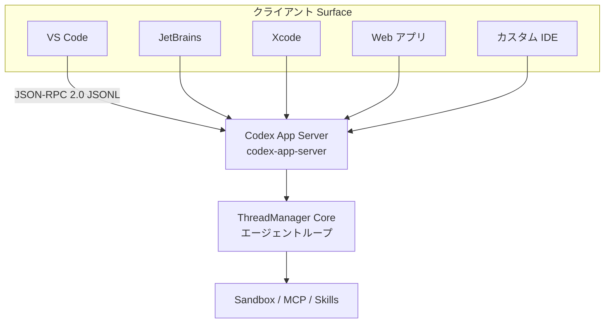
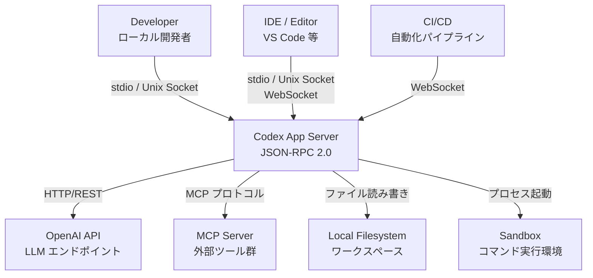
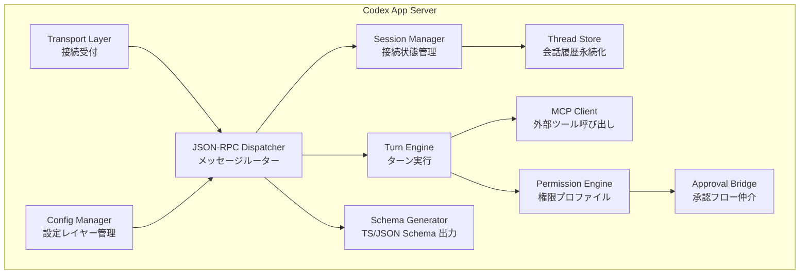
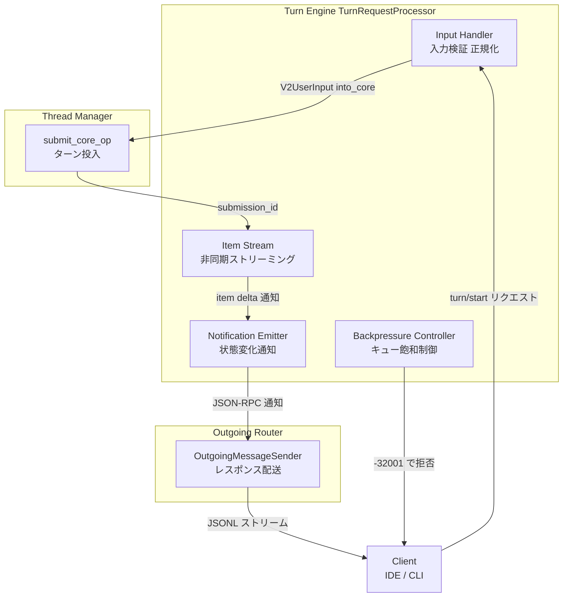
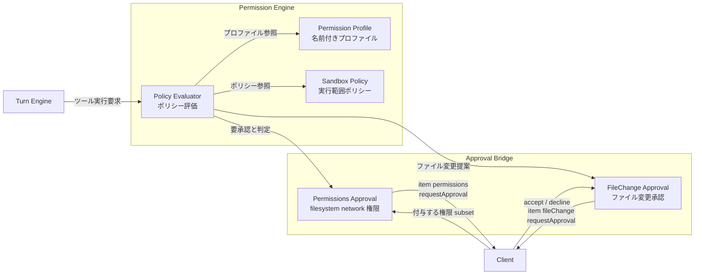
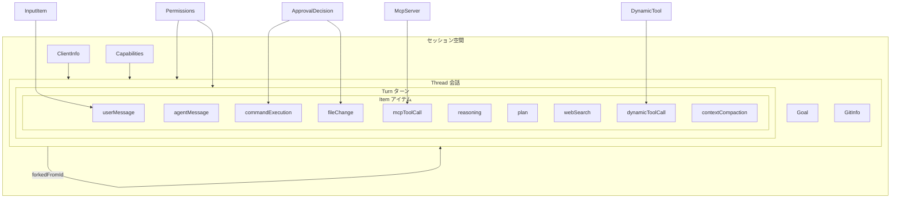
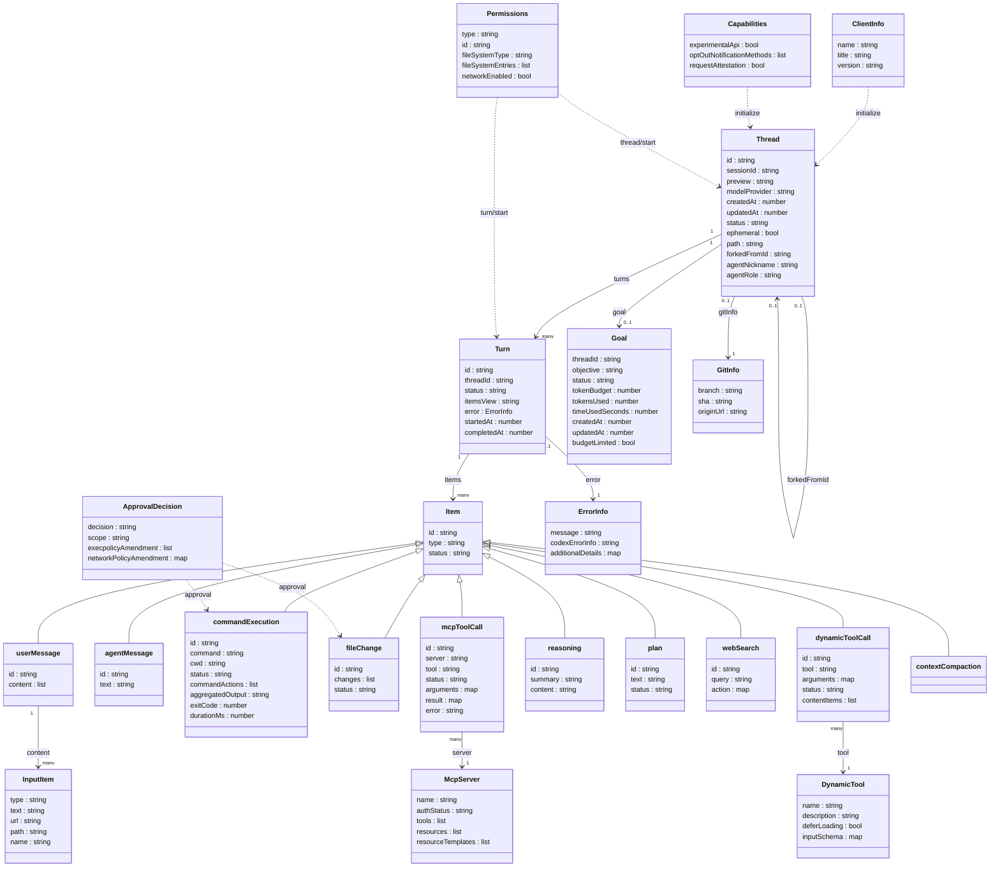

---
title: "技術調査 - Codex App Server"
emoji: "🔌"
type: "tech"
topics: ["Codex", "OpenAI", "JSONRPC", "LLM", "VSCode"]
published: false
---

> 検証日: 2026-05-14 / 主要ソース: `codex-rs/app-server` README (main)

## 概要

VS Code 拡張・自社の Web エディタ・CI/CD など、複数クライアントから Codex のエージェント機能を呼びたい場合、HTTP API 直叩きでは「状態管理」「承認フロー」「ストリーミング差分」を自前で実装する必要があります。Codex App Server はこの課題を JSON-RPC 2.0 双方向プロトコルで一気に解消する統合サーバーです。

Codex の中核ロジック（エージェントループ・スレッド管理・サンドボックス実行）をクライアント UI から切り離し、VS Code 拡張・JetBrains IDE・Xcode・Web アプリ・macOS デスクトップアプリといった多様な Surface を単一のプロトコルで統一します。

オープンソース（Rust 実装）として公開されており、`codex-rs/app-server` クレートに格納されています。

### 位置づけ



### 類似ツールとの比較

| 比較項目          | Codex App Server                           | MCP Server               | Codex CLI 直接実行    | Codex API Chat Completions |
| ----------------- | ------------------------------------------ | ------------------------ | --------------------- | -------------------------- |
| 通信方式          | JSON-RPC 2.0 JSONL                         | JSON-RPC 2.0 stdio/SSE   | ターミナル対話 / Exec | HTTP REST                  |
| 状態管理          | スレッド永続化 JSONL + SQLite              | 限定的（セッション単位） | なし（一回実行）      | なし（ステートレス）       |
| 対象クライアント  | IDE 拡張・Web アプリ・カスタム統合         | MCP 対応ツール全般       | CLI ユーザー / CI     | 任意の HTTP クライアント   |
| 承認フロー        | サーバー発信 JSON-RPC Request              | 限定的マッピング         | インタラクティブ対話  | なし                       |
| Streaming         | デルタ通知（テキスト・コマンド出力・差分） | 限定的                   | stdout ストリーム     | SSE / チャンク転送         |
| 双方向通信        | あり（Server→Client Request）              | あり                     | なし                  | なし                       |
| スレッド分岐 Fork | あり                                       | なし                     | なし                  | なし                       |
| MCP 統合          | あり（mcpServer/* メソッド群）             | 自身が MCP 実装          | あり（設定ベース）    | なし                       |

OpenAI は VS Code 向けに MCP の利用も検討しましたが、ストリーミング差分・承認フロー・スレッド永続化の要件が MCP のツール指向モデルと合わず、App Server として独立実装しました。MCP サーバーモードはよりシンプルなワークフロー向けに引き続き提供されます。

## 特徴

- **JSON-RPC 2.0 双方向通信**: クライアント → サーバーのリクエスト/レスポンスに加え、サーバー → クライアントの通知およびサーバー発信リクエスト（承認フロー用）をサポートします。Wire 形式は JSONL（改行区切り JSON）です。
- **Thread・Turn・Item の 3 階層モデル**: 会話全体（Thread）、1 往復（Turn）、原子イベント（Item）の階層で状態を管理します。各レイヤーに `started` / `completed` / `delta` のライフサイクル通知が定義されます。
- **複数 Transport**: `stdio://`（デフォルト）、`unix://`（ローカル制御プレーン）、`ws://IP:PORT`（実験的）、`off`（公開なし）の 4 種類を切り替えできます。
- **承認フロー Approval Workflow**: コマンド実行・ファイル変更・権限要求の各サーバー発信リクエストでユーザー承認を求めます。`approvalPolicy` で挙動を制御します。
- **MCP 統合**: 外部 MCP サーバーをツールとして呼び出せます。OAuth フロー・動的再読み込みに対応します。
- **Sandbox 統合**: `readOnly` / `workspaceWrite` / `dangerFullAccess` / `externalSandbox` の 4 モードでコマンド実行範囲を制御します。
- **v2 typed notifications**: 型付き通知（`thread/*` / `turn/*` 系）と Filesystem v2 を提供する新 API バージョンです。新規追加は v2 のみです。
- **Schema 生成**: `generate-ts` および `generate-json-schema` サブコマンドで TypeScript 型定義および JSON Schema を出力できます。
- **Backpressure 制御**: サーバー飽和時に JSON-RPC エラーコード `-32001`（Server overloaded）でリクエストを拒否し、クライアントに指数バックオフを促します。
- **Permission Profile**: `thread/start` の `permissions` フィールドで名前付き権限プロファイル（`:workspace` 等）を指定できます。`scope: "session"` でセッション継続が可能です。
- **通知抑制**: `initialize` の `optOutNotificationMethods` で個別通知メソッドを抑制できます。
- **スレッド永続化・分岐**: `$CODEX_HOME` 配下に JSONL ロールアウトファイルを保存し、SQLite でメタデータをインデックス管理します。`thread/fork` で分岐（`ephemeral: true` でインメモリ）できます。

## 構造

C4 model の 3 段階（システムコンテキスト / コンテナ / コンポーネント）で内部アーキテクチャを図解します。

### システムコンテキスト図



| 要素名           | 説明                                            |
| ---------------- | ----------------------------------------------- |
| Developer        | ローカル CLI や直接接続で利用する開発者         |
| IDE / Editor     | VS Code 等のリッチ UI クライアント              |
| CI/CD            | GitHub Actions 等の自動化パイプライン           |
| Codex App Server | JSON-RPC 2.0 を実装するコア統合サーバー         |
| OpenAI API       | LLM 推論・補完を提供するエンドポイント          |
| MCP Server       | Model Context Protocol で定義された外部ツール群 |
| Local Filesystem | ワークスペースのソースコードや設定ファイル      |
| Sandbox          | コマンド実行を隔離するプロセス環境              |

### コンテナ図



| コンテナ名          | 説明                                                                                                                                                                 |
| ------------------- | -------------------------------------------------------------------------------------------------------------------------------------------------------------------- |
| Transport Layer     | stdio / Unix Socket / WebSocket の 3 トランスポートを抽象化し、受信 JSONL メッセージを内部キューへ転送する。bounded queue ベースのバックプレッシャ制御と切断トークン管理を担う |
| JSON-RPC Dispatcher | `MessageProcessor` が中心。100 種超のリクエスト型を対応プロセッサへディスパッチし、シリアライゼーションスコープを管理する                                            |
| Session Manager     | 接続ごとの `ConnectionSessionState` を保持。初期化フラグ・実験的 API 有効化・通知抑制リストを管理する                                                                |
| Thread Store        | スレッドメタデータと履歴を永続化。`StoredThread` として `RolloutItem` ベクタを保持し、再開・分岐を可能にする                                                         |
| Turn Engine         | `TurnRequestProcessor` が入力検証・LLM 呼び出し・ストリーミング応答の全工程を担う                                                                                    |
| MCP Client          | `McpRequestProcessor` が MCP サーバーへのツール呼び出し・リソース取得・OAuth フローを処理する                                                                        |
| Permission Engine   | 名前付き権限プロファイル（`:workspace` 等）とサンドボックスポリシーを評価する                                                                                        |
| Approval Bridge     | `item/permissions/requestApproval` および `item/fileChange/requestApproval` のクライアント往復を仲介する                                                             |
| Schema Generator    | `generate-ts` / `generate-json-schema` サブコマンドで TypeScript 型定義・JSON Schema を生成する                                                                      |
| Config Manager      | CLI オーバーライド・クラウド要件・パーソナリティ移行を重ねて最終設定を生成する                                                                                       |

### コンポーネント図

#### Turn Engine ドリルダウン



| コンポーネント名        | 説明                                                                                                                                                                                |
| ----------------------- | ----------------------------------------------------------------------------------------------------------------------------------------------------------------------------------- |
| Input Handler           | `validate_v2_input_limit()` で文字数制限を検証し、`V2UserInput::into_core()` で内部型へ変換する。ターンコンテキストオーバーライド（モデル・サンドボックスポリシー）の同期検証も担う |
| Item Stream             | `submit_core_op()` へ入力を投入し、返却される `submission_id` をターン ID として使用する。応答は直接返却せず非同期ストリームで流す                                                  |
| Notification Emitter    | `turn/started` → `item/started` → `item/*delta` → `item/completed` → `turn/completed` の順でクライアントへ逐次送出する                                                              |
| Backpressure Controller | 受信キュー（bounded queue）が飽和した場合、リクエスト型には `-32001`（Server overloaded）を返す。通知・レスポンス型はキューに空きが生じるまでブロック待機する                            |

#### Permission Engine ドリルダウン



| コンポーネント名     | 説明                                                                                                                                     |
| -------------------- | ---------------------------------------------------------------------------------------------------------------------------------------- |
| Permission Profile   | `:workspace` 等の名前付き権限セット。スレッド開始時の `permissions.type = "profile"` で指定する                                          |
| Sandbox Policy       | `readOnly` / `workspaceWrite` / `dangerFullAccess` / `externalSandbox` の 4 段階でコマンド実行範囲を制限する                             |
| Policy Evaluator     | ツール実行前にプロファイルとポリシーを照合し、承認不要・要承認・拒否の 3 値を返す                                                        |
| Permissions Approval | `item/permissions/requestApproval` をクライアントへ送出し、付与する権限 subset を受け取る。`scope: "session"` 指定でセッション継続が可能 |
| FileChange Approval  | `item/fileChange/requestApproval` でファイル変更提案を送出し、accept / decline / cancel を受け取る                                       |

## データ

### 概念モデル



| 要素名            | 説明                                                        |
| ----------------- | ----------------------------------------------------------- |
| ClientInfo        | 接続クライアントのメタデータ                                |
| Capabilities      | 接続レベルの機能フラグ                                      |
| Thread            | ユーザーとエージェントの会話全体                            |
| Turn              | 1 往復の会話単位（ユーザー入力〜エージェント応答）          |
| Item              | Turn を構成するユーザー入力またはエージェント出力の最小単位 |
| userMessage       | ユーザーの発言アイテム                                      |
| agentMessage      | エージェントの返答テキストアイテム                          |
| commandExecution  | エージェントによるコマンド実行アイテム                      |
| fileChange        | エージェントによるファイル変更アイテム                      |
| mcpToolCall       | MCP サーバーへのツール呼び出しアイテム                      |
| reasoning         | エージェントの推論サマリアイテム                            |
| plan              | エージェントの計画テキストアイテム                          |
| webSearch         | ウェブ検索アイテム                                          |
| dynamicToolCall   | DynamicTool 呼び出しアイテム（実験的）                      |
| contextCompaction | コンテキスト圧縮マーカーアイテム                            |
| Goal              | Thread スコープの目標と予算管理                             |
| GitInfo           | Thread に紐付く Git リポジトリ情報                          |
| InputItem         | turn/start に渡すユーザー入力の discriminated union         |
| Permissions       | ファイルシステム・ネットワーク権限プロファイル              |
| ApprovalDecision  | ツール実行・ファイル変更に対する承認判断                    |
| DynamicTool       | 実行時に定義するカスタムツール（実験的）                    |
| McpServer         | 設定済み MCP サーバーとそのツール一覧                       |

### 情報モデル



| クラス名         | 説明                                                                                    |
| ---------------- | --------------------------------------------------------------------------------------- |
| Thread           | 会話の永続エンティティ。セッション ID・モデルプロバイダ・Git 情報を保持する             |
| Turn             | 1 往復の会話単位。ステータスと Item リストを持つ                                        |
| Item             | Turn 内の最小イベント単位。type 値で以下のサブクラスに分岐する                          |
| userMessage      | ユーザー発言。InputItem のリストを content に持つ                                       |
| agentMessage     | エージェント返答テキスト                                                                |
| commandExecution | コマンド実行と結果。承認フローを経る                                                    |
| fileChange       | ファイル変更差分。承認フローを経る                                                      |
| mcpToolCall      | MCP サーバーへのツール呼び出しと結果                                                    |
| reasoning        | エージェント内部推論のサマリと生コンテンツ                                              |
| plan             | エージェントが生成した実行計画テキスト                                                  |
| webSearch        | ウェブ検索クエリと結果アクション                                                        |
| dynamicToolCall  | 実行時登録ツールの呼び出しと結果（実験的）                                              |
| InputItem        | ユーザー入力の discriminated union。text / image / localImage / mention / skill の 5 種 |
| ClientInfo       | initialize 時に送るクライアント識別情報                                                 |
| Capabilities     | initialize 時に宣言する機能フラグ群                                                     |
| Permissions      | ファイルシステム・ネットワーク権限。profile 参照型または managed 詳細型                 |
| ApprovalDecision | commandExecution・fileChange への承認判断。accept / acceptForSession / decline / cancel |
| DynamicTool      | thread/start または turn/start 時に動的登録するツール定義                               |
| McpServer        | 設定済み MCP サーバー。ツール・リソース・認証状態を保持                                 |
| Goal             | Thread スコープの目標とトークン予算管理                                                 |
| GitInfo          | Thread に紐付く Git ブランチ・コミット・リモート URL                                    |
| ErrorInfo        | Turn や各 Item の失敗情報                                                               |

## 構築方法

### 前提条件

| 項目           | 要件                                                     |
| -------------- | -------------------------------------------------------- |
| OS             | macOS 12+, Ubuntu 20.04+ / Debian 10+, Windows 11 (WSL2) |
| RAM            | 4 GB 以上（8 GB 推奨）                                   |
| Node.js        | 18 以上（npm インストール / TypeScript SDK 利用時）      |
| Git            | 2.23 以上（オプション）                                  |
| Rust toolchain | ソースビルド時に必要（`rustup` 経由で取得）              |

Rust バイナリ版（npm パッケージ）は Node.js 不要です。npm パッケージは起動時にプラットフォーム向けのビルド済み Rust バイナリをダウンロードする薄いラッパーです。

### インストール

#### npm（推奨）

```bash
npm install -g @openai/codex
# 最新版へアップグレード
npm install -g @openai/codex@latest
```

#### Homebrew（macOS）

```bash
brew install codex
```

#### ソースビルド

```bash
# Rust toolchain
curl --proto '=https' --tlsv1.2 -sSf https://sh.rustup.rs | sh -s -- -y
source "$HOME/.cargo/env"

# リポジトリ取得
git clone https://github.com/openai/codex.git
cd codex

# ビルド
cargo build --release --bin codex

# または cargo install
cargo install --path codex-rs
```

### 認証

```bash
# 方法 1: 対話ログイン（ChatGPT アカウント）
codex login

# 方法 2: デバイスコードフロー（ヘッドレス）
codex login --device-auth

# 方法 3: OpenAI API キー
export OPENAI_API_KEY="sk-proj-..."
```

認証情報は `~/.codex/auth.json` にキャッシュされます。リモートマシンへの配布はこのファイルをコピーすることで可能です。

### app-server 起動方法

| transport               | 起動コマンド                                                   | 備考                                                     |
| ----------------------- | -------------------------------------------------------------- | -------------------------------------------------------- |
| stdio（デフォルト）     | `codex app-server` または `codex app-server --listen stdio://` | 改行区切り JSON（JSONL）                                 |
| Unix Socket             | `codex app-server --listen unix://`                            | `$CODEX_HOME/app-server-control/app-server-control.sock` |
| Unix Socket（パス指定） | `codex app-server --listen unix:///tmp/codex.sock`             | 任意のソケットパス                                       |
| WebSocket（実験的）     | `codex app-server --listen ws://127.0.0.1:8765`                | 1 フレーム 1 JSON-RPC メッセージ                         |
| Off（expose なし）      | `codex app-server --listen off`                                | ローカル transport を公開しない                          |

#### WebSocket 認証オプション

```bash
# capability-token 方式
codex app-server --listen ws://127.0.0.1:4500 \
  --ws-auth capability-token \
  --ws-token-sha256 <hex-digest>

# signed-bearer-token 方式
codex app-server --listen ws://127.0.0.1:4500 \
  --ws-auth signed-bearer-token \
  --ws-shared-secret-file /path/to/secret
```

クライアントは WebSocket ハンドシェイク時に `Authorization: Bearer <token>` ヘッダーを付けます。

#### セッションソースとロギング

```bash
# ログレベル制御
RUST_LOG=debug codex app-server

# JSON フォーマットログ（stderr）
LOG_FORMAT=json codex app-server
```

セッション開始の挙動は CLI フラグではなく `thread/start` の `sessionStartSource` パラメータで指定します（`"startup"` または `"clear"`）。

#### WebSocket ヘルスチェック

| エンドポイント | 説明                                           |
| -------------- | ---------------------------------------------- |
| `GET /readyz`  | 接続受け付け可能時に `200 OK`                  |
| `GET /healthz` | 常時 `200 OK`（`Origin` ヘッダー付きは `403`） |

### Schema 生成

```bash
# TypeScript 型定義
codex app-server generate-ts --out ./schemas

# JSON Schema バンドル
codex app-server generate-json-schema --out ./schemas

# 実験的 API の型定義
codex app-server generate-ts --experimental --out ./schemas
```

### バージョン確認

```bash
codex --version
codex app-server --help
```

## 利用方法

### ライフサイクル順序と必須パラメータ

| #   | 方向 | メソッド         | 種別         | 必須パラメータ                          | 補足                             |
| --- | ---- | ---------------- | ------------ | --------------------------------------- | -------------------------------- |
| 1   | C→S  | `initialize`     | Request      | `clientInfo.name`, `clientInfo.version` | セッションに 1 回のみ            |
| 2   | C→S  | `initialized`    | Notification | なし                                    | `initialize` 応答受信後に送信    |
| 3   | C→S  | `thread/start`   | Request      | なし（`model` 推奨）                    | 成功すると `thread.id` を返す    |
| 4   | S→C  | `thread/started` | Notification | —                                       | スレッド生成完了通知             |
| 5   | C→S  | `turn/start`     | Request      | `threadId`, `input[]`                   | エージェント実行開始             |
| 6   | S→C  | `turn/started`   | Notification | —                                       | ターン開始通知                   |
| 7   | S→C  | `item/started`   | Notification | —                                       | 各 item 開始                     |
| 8   | S→C  | `item/*/delta`   | Notification | —                                       | ストリーミングデルタ             |
| 9   | S→C  | `item/completed` | Notification | —                                       | item 完了                        |
| 10  | S→C  | `turn/completed` | Notification | —                                       | ターン完了（トークン使用量含む） |

### initialize リクエスト

```json
{
  "method": "initialize",
  "id": 0,
  "params": {
    "clientInfo": {
      "name": "my_client",
      "title": "My Client",
      "version": "0.1.0"
    },
    "capabilities": {
      "experimentalApi": true,
      "optOutNotificationMethods": ["thread/started", "thread/archived"]
    }
  }
}
```

応答受信後に `initialized` 通知を送ります。

```json
{ "method": "initialized", "params": {} }
```

| フィールド                               | 必須 | 型       | 説明                             |
| ---------------------------------------- | ---- | -------- | -------------------------------- |
| `clientInfo.name`                        | 必須 | string   | クライアント識別名               |
| `clientInfo.version`                     | 必須 | string   | クライアントバージョン           |
| `clientInfo.title`                       | 任意 | string   | 表示名                           |
| `capabilities.experimentalApi`           | 任意 | bool     | `true` で実験的 API をオプトイン |
| `capabilities.optOutNotificationMethods` | 任意 | string[] | 抑制する通知メソッド一覧         |

### thread/start

```json
{
  "method": "thread/start",
  "id": 10,
  "params": {
    "model": "gpt-5.1-codex",
    "cwd": "/Users/me/project",
    "approvalPolicy": "never",
    "sandbox": "workspaceWrite",
    "personality": "friendly",
    "dynamicTools": [
      {
        "name": "lookup_ticket",
        "description": "Fetch a ticket by ID",
        "deferLoading": false,
        "inputSchema": {
          "type": "object",
          "properties": { "id": { "type": "string" } },
          "required": ["id"]
        }
      }
    ]
  }
}
```

| フィールド                  | 型               | 説明                                                |
| --------------------------- | ---------------- | --------------------------------------------------- |
| `model`                     | string           | 使用モデル                                          |
| `cwd`                       | string           | エージェントの作業ディレクトリ（絶対パス）          |
| `approvalPolicy`            | string           | `never` / `unlessTrusted` / `onRequest`             |
| `sandbox` / `sandboxPolicy` | string \| object | `workspaceWrite`, `readOnly`, `dangerFullAccess` 等 |
| `personality`               | string           | エージェントの応答スタイル                          |
| `dynamicTools`              | array            | ホスト側ツール定義                                  |
| `permissions`               | object           | 権限プロファイル（`sandbox` と併用不可）            |

### thread/resume と thread/fork

```json
// 既存スレッドを再開
{ "method": "thread/resume", "id": 11, "params": { "threadId": "thr_abc123" } }

// 既存スレッドを分岐
{ "method": "thread/fork", "id": 12, "params": { "threadId": "thr_abc123", "ephemeral": true } }
```

### turn/start と input items

```json
{
  "method": "turn/start",
  "id": 51,
  "params": {
    "threadId": "thr_abc123",
    "input": [
      { "type": "text", "text": "最新コードのテストを実行して" },
      { "type": "mention", "name": "Demo App", "path": "app://demo-app" },
      { "type": "image", "url": "https://example.com/design.png" },
      { "type": "localImage", "path": "/Users/me/screenshot.png" }
    ],
    "model": "gpt-5.1-codex",
    "effort": "medium"
  }
}
```

| type         | 用途                    | 必須フィールド       |
| ------------ | ----------------------- | -------------------- |
| `text`       | テキスト入力            | `text`               |
| `mention`    | アプリ/コンテキスト参照 | `name`, `path`       |
| `image`      | URL 画像添付            | `url`                |
| `localImage` | ローカル画像添付        | `path`               |
| `skill`      | スキル実行              | スキル固有フィールド |

ターン中の操作:

```json
{ "method": "turn/steer",     "id": 52, "params": { "threadId": "thr_abc123", "expectedTurnId": "turn_xyz", "input": [{ "type": "text", "text": "RS256 を使って" }] } }
{ "method": "turn/interrupt", "id": 53, "params": { "threadId": "thr_abc123", "turnId": "turn_xyz" } }
```

### 通知ストリームの読み方

```
turn/started
  └─ item/started          (type: agentMessage | commandExecution | fileChange ...)
       ├─ item/agentMessage/delta        (テキスト断片)
       ├─ item/commandExecution/outputDelta (コマンド出力断片)
       ├─ item/fileChange/patchUpdated    (パッチ断片)
       └─ item/completed
  └─ turn/diff/updated     (ファイル変更サマリー)
  └─ turn/plan/updated     (エージェント計画更新)
turn/completed
```

`turn.status` の取り得る値: `inProgress` / `completed` / `interrupted` / `failed`。`failed` 時は `error.message` と `error.codexErrorInfo` を確認します。

### approval ハンドリング

承認が必要な操作でサーバーから id 付きリクエストが届きます。クライアントは必ずレスポンスを返します。

```json
// コマンド実行承認
{ "method": "item/commandExecution/requestApproval", "id": 1001, "params": { "itemId": "cmd_001", "command": "rm -rf dist/", "reason": "Potentially destructive" } }
{ "id": 1001, "result": { "decision": "accept" } }
{ "id": 1001, "result": { "decision": "acceptForSession" } }

// ファイル変更承認
{ "method": "item/fileChange/requestApproval", "id": 1002, "params": { "itemId": "file_001", "reason": "Creating new file" } }
{ "id": 1002, "result": { "decision": "accept" } }

// 権限承認（fileSystem.write 要求の例）
{
  "method": "item/permissions/requestApproval",
  "id": 1003,
  "params": {
    "threadId": "thr_123",
    "turnId": "turn_123",
    "itemId": "call_123",
    "cwd": "/Users/me/project",
    "reason": "Select a workspace root",
    "permissions": { "fileSystem": { "write": ["/Users/me/project", "/Users/me/shared"] } }
  }
}

// 応答（付与する subset を返す。scope を省略するとターン単位）
{
  "id": 1003,
  "result": {
    "scope": "session",
    "permissions": { "fileSystem": { "write": ["/Users/me/project"] } }
  }
}
```

`permissions` オブジェクトは `fileSystem` / `network` のサブセクションで構成されます。`fileSystem.write` には絶対パスの配列を渡し、応答では要求された subset のうち付与する分のみを返します。


`scope: "session"` を指定するとセッション中永続します。デフォルトはターン単位です。承認確定後、サーバーは `serverRequest/resolved` 通知を送信します。

### backpressure リトライ戦略

```json
{ "error": { "code": -32001, "message": "Server overloaded; retry later." } }
```

```typescript
async function sendWithBackpressure(send: (msg: unknown) => void, msg: unknown, maxRetries = 5) {
  for (let attempt = 0; attempt < maxRetries; attempt++) {
    const res = await sendAndWait(send, msg);
    if (!res.error || res.error.code !== -32001) return res;
    const delay = Math.min(1000 * 2 ** attempt + Math.random() * 200, 30000);
    await new Promise((r) => setTimeout(r, delay));
  }
  throw new Error("Server overloaded: max retries exceeded");
}
```

### TypeScript クライアント雛形（stdio 経由）

```typescript
import { spawn } from "node:child_process";
import * as readline from "node:readline";

const proc = spawn("codex", ["app-server"], {
  stdio: ["pipe", "pipe", "inherit"],
});

const rl = readline.createInterface({ input: proc.stdout! });

let msgId = 0;
const pending = new Map<number, (res: unknown) => void>();

function send(msg: unknown): void {
  proc.stdin!.write(JSON.stringify(msg) + "\n");
}

function request(method: string, params: unknown): Promise<unknown> {
  const id = ++msgId;
  return new Promise((resolve) => {
    pending.set(id, resolve);
    send({ method, id, params });
  });
}

rl.on("line", (line) => {
  const msg = JSON.parse(line) as { id?: number; method?: string; result?: unknown; error?: unknown; params?: unknown };
  if (msg.id !== undefined && pending.has(msg.id)) {
    pending.get(msg.id)!(msg);
    pending.delete(msg.id);
  } else if (msg.method) {
    handleNotification(msg.method, msg.id, msg.params);
  }
});

function handleNotification(method: string, id: number | undefined, params: unknown): void {
  switch (method) {
    case "item/agentMessage/delta":
      process.stdout.write((params as { delta: string }).delta);
      break;
    case "turn/completed":
      console.log("\n[turn completed]");
      break;
    case "item/commandExecution/requestApproval":
    case "item/fileChange/requestApproval":
      if (id !== undefined) send({ id, result: "accept" });
      break;
  }
}

async function main(): Promise<void> {
  await request("initialize", {
    clientInfo: { name: "my_app", version: "0.1.0" },
    capabilities: { experimentalApi: true },
  });
  send({ method: "initialized", params: {} });

  const threadRes = await request("thread/start", {
    model: "gpt-5.1-codex",
    cwd: process.cwd(),
    approvalPolicy: "unlessTrusted",
    sandbox: "workspaceWrite",
  }) as { result: { thread: { id: string } } };
  const threadId = threadRes.result.thread.id;

  await request("turn/start", {
    threadId,
    input: [{ type: "text", text: "このリポジトリの概要を教えて" }],
  });
}

main().catch(console.error);
```

### WebSocket クライアント雛形

```typescript
import WebSocket from "ws";

const ws = new WebSocket("ws://127.0.0.1:8765");

let msgId = 0;
const pending = new Map<number, (res: unknown) => void>();

function send(msg: unknown): void {
  ws.send(JSON.stringify(msg));
}

function request(method: string, params: unknown): Promise<unknown> {
  const id = ++msgId;
  return new Promise((resolve) => {
    pending.set(id, resolve);
    send({ method, id, params });
  });
}

ws.on("open", async () => {
  await request("initialize", {
    clientInfo: { name: "ws_client", version: "1.0.0" },
    capabilities: { experimentalApi: true },
  });
  send({ method: "initialized", params: {} });

  const threadRes = await request("thread/start", {
    model: "gpt-5.1-codex",
    cwd: "/Users/me/project",
  }) as { result: { thread: { id: string } } };
  const threadId = threadRes.result.thread.id;

  await request("turn/start", {
    threadId,
    input: [{ type: "text", text: "テストを実行して失敗を修正して" }],
  });
});

ws.on("message", (data: WebSocket.Data) => {
  const msg = JSON.parse(data.toString()) as { id?: number; method?: string; result?: unknown; params?: unknown };
  if (msg.id !== undefined && pending.has(msg.id)) {
    pending.get(msg.id)!(msg);
    pending.delete(msg.id);
  } else if (msg.method === "turn/completed") {
    console.log("[完了]");
    ws.close();
  } else if (msg.method === "item/commandExecution/requestApproval" && msg.id !== undefined) {
    send({ id: msg.id, result: "accept" });
  }
});
```

WebSocket transport は実験的です。本番用途には stdio transport を推奨します。

## 運用

### プロセスの起動・停止

`codex app-server` は `--listen` フラグでトランスポートを指定して起動します。停止は `SIGTERM` で行います。Unix Socket や WebSocket モードではソケットファイルが残存することがあるため、再起動前にファイルの存否を確認してください。

`codex app-server proxy` コマンドを使うと、`$CODEX_HOME/app-server-control/app-server-control.sock` に対してバイトをそのまま中継し、複数クライアントから既存プロセスへ接続できます。

### 状態確認（/readyz, /healthz）

WebSocket モードで起動した場合のみ HTTP ヘルスエンドポイントが有効になります。

| エンドポイント | 条件                     | 応答            |
| -------------- | ------------------------ | --------------- |
| `GET /readyz`  | リスナーが接続受付開始後 | `200 OK`        |
| `GET /healthz` | `Origin` ヘッダーなし    | `200 OK`        |
| `GET /healthz` | `Origin` ヘッダーあり    | `403 Forbidden` |

`/healthz` の `Origin` ヘッダー拒否は意図的なセキュリティ設計です。Kubernetes や外部ロードバランサーからのヘルスチェックは `Origin` ヘッダーを付けずに行ってください。

### ログとデバッグ

| 環境変数     | 設定例                             | 効果                               |
| ------------ | ---------------------------------- | ---------------------------------- |
| `RUST_LOG`   | `debug` / `codex_app_server=trace` | ログ詳細度を制御                   |
| `LOG_FORMAT` | `json`                             | stderr に JSON 1行 1イベントで出力 |

```bash
# デバッグ出力で起動
RUST_LOG=debug codex app-server --listen ws://127.0.0.1:9000

# 構造化ログ
LOG_FORMAT=json RUST_LOG=info codex app-server --listen unix:///tmp/codex.sock
```

ログファイルの保存先はデフォルトで `$CODEX_HOME/log` です。`config.toml` の `log_dir` で変更できます。履歴トランスクリプトは `history.persistence: save-all` で保存され、`history.max_bytes` で上限を設定できます。

`config/mcpServer/reload` を JSON-RPC で呼び出すと、プロセスを再起動せずに `config.toml` の MCP サーバー設定を再読み込みできます。

### 複数クライアントとの並走

1 つの `codex app-server` プロセスを Unix Socket で起動し、各クライアントは `codex app-server proxy` 経由で接続します。各接続は独立した `initialize` ハンドシェイクを必要とします。

```
Client A ──proxy──┐
Client B ──proxy──┤──Unix Socket──▶ codex app-server プロセス
Client C ──proxy──┘
```

WebSocket リスナーを公開する場合は `bind_address` をループバック（`127.0.0.1`）に限定してください。ケーパビリティトークンや署名ベアラートークンで認証を必ず有効にします。非ループバックアドレスへのバインドは `[permissions.<profile-name>.network] dangerously_allow_non_loopback_proxy = true` を明示的に設定しない限り許可されません。

`thread/unsubscribe` を呼び出してクライアントがスレッドから離脱すると、30 分間の非活動後にサーバー側で自動クリーンアップが行われます。

### バージョン更新と互換性

Codex CLI のバージョンが上がると JSON-RPC スキーマが変わることがあります。スキーマ互換性を保証するには、使用しているバージョンの成果物を生成して固定してください。

```bash
codex app-server generate-ts --out ./src/generated/
codex app-server generate-json-schema --out ./schema/
```

v1 API は新機能追加が凍結されています。v2 API で型付き通知（`thread/*` / `turn/*` 系）とファイルシステム v2 が提供されます。新規クライアントは v2 で実装してください。

`configRequirements/read` を呼び出すと管理者ポリシーで強制されている制約（許可 sandbox モード、許可 approval ポリシーなど）を事前確認できます。

## ベストプラクティス

### クライアント設計

トランスポート接続直後に必ず `initialize` を送り、続けて `initialized` 通知を送信します。この 2 ステップを完了するまで他のメソッドは拒否されます。

**再接続戦略（jittered exponential backoff）:**

サーバーから `-32001` を受け取ったら、指数バックオフ＋ランダムジッターで再試行します。

```python
import time, random

def retry_with_backoff(fn, max_retries=5, base_delay=1.0):
    for attempt in range(max_retries):
        try:
            return fn()
        except ServerOverloadedError:
            delay = base_delay * (2 ** attempt) + random.uniform(0, 1)
            time.sleep(delay)
    raise Exception("Max retries exceeded")
```

承認応答値の挙動は次のとおりです。`accept` は単一の承認、`acceptForSession` はセッション継続中の自動承認、`decline` は提案された操作のみ拒否（ターン継続）、`cancel` はターン全体を中止します。

**Notification opt-out で帯域削減:**

```json
{
  "method": "initialize",
  "params": {
    "capabilities": {
      "optOutNotificationMethods": [
        "item/agentMessage/delta",
        "rawResponseItem/streamed"
      ]
    }
  }
}
```

抑制対象は `thread/*` / `turn/*` / `item/*` / `rawResponseItem/*` 通知です。メソッド名の完全一致で指定し、ワイルドカードは使用できません。

**スレッド管理:**

- 新規スレッドは `thread/start`、再開は `thread/resume` を使用します。
- 分岐は `thread/fork` を使用し、`ephemeral: true` で in-memory 分岐にできます。
- `thread/list` はカーソルベースページネーションをサポートします。

### v2 API への統一

| 機能                 | v1         | v2 推奨                                     |
| -------------------- | ---------- | ------------------------------------------- |
| 通知                 | 型なし通知 | 型付き通知（`thread/turn` 系）              |
| ファイルシステム操作 | v1 schema  | ファイルシステム v2                         |
| 入力ブロック         | text のみ  | text / image / localImage / skill / mention |

`initialize` 時に `capabilities.experimentalApi: true` で実験的 API にアクセスできます。

#### v1 → v2 通知フォーマットの違い

```json
// v1（型なし通知、レガシー）
{ "method": "notification", "params": { "type": "turn_started", "turnId": "turn_xyz" } }

// v2（型付き通知、現行）
{ "method": "turn/started", "params": { "turn": { "id": "turn_xyz", "threadId": "thr_abc", "status": "inProgress" } } }
```

v2 通知は `experimentalApi: false` でも `thread/*` / `turn/*` / `item/*` の主要メソッドで受信できます。`experimentalApi: true` は `dynamicTools` や `rawResponseItem/streamed` 等の実験的サーフェスにのみ必要です。

### セキュリティ

**approvalPolicy の選択:**

| approvalPolicy    | 説明                                       | 推奨用途                           |
| ----------------- | ------------------------------------------ | ---------------------------------- |
| `"onRequest"`     | エージェントが必要と判断したとき承認を要求 | セキュリティ重視環境               |
| `"unlessTrusted"` | 信頼済みプロジェクトのみ自動承認           | 通常の開発環境                     |
| `"never"`         | 承認要求をスキップ                         | CI/CD 限定（スコープを厳格に制限） |

**permissions（推奨）vs sandbox（レガシー）:**

```json
// 推奨
{ "permissions": { "type": "profile", "id": ":workspace" } }

// レガシー
{ "sandbox": "workspaceWrite" }
```

両者を同一リクエストで併用するとエラーになります。

**サンドボックスモード:**

| モード               | ファイルシステム         | ネットワーク |
| -------------------- | ------------------------ | ------------ |
| `read-only`          | 読み取り専用             | 制限         |
| `workspace-write`    | ワークスペース書き込み可 | 設定次第     |
| `danger-full-access` | 無制限                   | 無制限       |

`approvalsReviewer: "auto_review"` を設定すると承認要求がリスクアセスメント付きサブエージェントにルーティングされ、完全自動化フローで活用できます。

### API キー管理

`config.toml` に API キーを直書きせず、環境変数または secret store を使用します。

```toml
# 環境変数から取得
[model_providers.openai]
env_key = "OPENAI_API_KEY"

# コマンドで動的生成
[model_providers.openai.auth]
command = ["sh", "-c", "vault kv get -field=key secret/openai"]
timeout_ms = 5000
refresh_interval_ms = 300000
```

`[model_providers.<id>] requires_openai_auth = true` を設定するとそのプロバイダーで OpenAI 認証情報を使用します。外部トークンモード（`account/chatgptAuthTokens/refresh` を実装）では、401 応答をトリガーとしてリフレッシュハンドラーを呼び出します。タイムアウトは約 10 秒です。

### MCP サーバー統合での OAuth キャッシュ

```json
// OAuth ログイン開始
{ "method": "mcpServer/oauth/login", "params": { "server": "my-mcp-server" } }
```

OAuth 認証情報のストレージは `config.toml` の `mcp_oauth_credentials_store` で `auto` / `file` / `keyring` から選択します。固定コールバックポートが必要な場合は `mcp_oauth_callback_port` を設定します。リモート devbox 環境では `mcp_oauth_callback_url` でカスタムリダイレクト URI を指定します。

設定変更後は `config/mcpServer/reload` でプロセス再起動なしに反映できます。

### CI/CD での非対話モード設計

スレッドを作らずコマンドを実行する場合は `command/exec` を使用します。

```json
{
  "method": "command/exec",
  "params": {
    "command": ["cargo", "test", "--workspace"],
    "cwd": "/workspace/my-project",
    "timeoutMs": 120000,
    "outputBytesCap": 1048576,
    "permissionProfile": "read-only"
  }
}
```

CI/CD 推奨設定:

```json
{
  "method": "thread/start",
  "params": {
    "model": "gpt-5.1-codex",
    "cwd": "/workspace",
    "approvalPolicy": "never",
    "approvalsReviewer": "auto_review",
    "permissions": { "type": "profile", "id": ":workspace" }
  }
}
```

- `approvalPolicy: "never"` で無人実行します。
- `approvalsReviewer: "auto_review"` でリスク評価を自動化します。
- `permissions` でアクセス範囲を最小限に制限します。
- `configRequirements/read` で管理者ポリシーとの整合性を事前確認します。
- `account/rateLimits/read` でレート制限の使用率を監視します。

長時間実行タスクは `process/spawn` でハンドルベース管理し、終了時に通知を受け取れます。

## トラブルシューティング

### 症状 / 原因 / 対処

| 症状                                                  | 原因                                                         | 対処                                                                                                                          |
| ----------------------------------------------------- | ------------------------------------------------------------ | ----------------------------------------------------------------------------------------------------------------------------- |
| `"Already initialized"` エラー                        | 同一接続で `initialize` を 2 回送信した                      | `initialize` はプロセスライフタイムに 1 回のみ。再接続が必要な場合はトランスポートを切断して新規接続を確立する                |
| `-32001 Server overloaded; retry later`               | サーバーのリクエストキューが満杯                             | 指数バックオフ＋ジッターで再試行する。バックグラウンドリクエスト（ロゴ取得等）はキャッシュを導入する                          |
| `"Not initialized"` エラー                            | `initialize` 完了前に他のメソッドを送信した                  | `initialize` → `initialized` の 2 ステップ完了後に他メソッドを送信する                                                        |
| スキーマミスマッチ（v1 vs v2）                        | クライアントが v1 スキーマで v2 フィールドを期待             | `codex app-server generate-ts` で使用バージョンの型定義を生成し固定する                                                       |
| Approval timeout                                      | クライアントが承認応答を返さない                             | 各 `requestApproval` のハンドラーを実装する。CI では `approvalPolicy: "never"` + 最小 permissions プロファイルを設定          |
| Sandbox 拒否                                          | `permissions` / `sandbox` 設定がアクセス先を許可していない   | `permissions.filesystem` に必要なパスを追加。`sandbox: "workspace-write"` + `writable_roots` を指定                           |
| MCP OAuth 失敗（auth_status: unsupported）            | OAuth フロー完了後にツールが thread にインポートされない     | `codex mcp list --json` で状態確認。`config/mcpServer/reload` を呼ぶ。DCR 不要のプロバイダーへ切り替え検討                    |
| MCP OAuth callback failure                            | 認可サーバーが DCR 非対応                                    | `mcp_oauth_callback_url` でカスタム URL 設定。プロバイダーに固定クライアント ID を発行依頼                                    |
| WebSocket Origin 拒否（403）                          | `Origin` ヘッダー付きが意図的に拒否される                    | ヘルスチェックから `Origin` ヘッダーを除去。ブラウザ直接接続は設計上禁止                                                      |
| `generate-ts` 失敗                                    | 出力ディレクトリが存在しない、または書き込み権限がない       | `--out` のディレクトリを事前作成。`codex` バイナリと設定バージョンの一致を確認                                                |
| `dynamicTools` の `inputSchema` invalid               | JSON Schema が不正                                           | `experimentalApi: true` を `initialize` で設定。`inputSchema` は `{"type":"object","properties":{...},"required":[...]}` 形式 |
| `turn.status: "failed"`                               | モデルエラー、コンテキスト超過、使用量制限超過               | `error.codexErrorInfo`（`ContextWindowExceeded` / `UsageLimitExceeded` / `HttpConnectionFailed` 等）を確認                    |
| `model/rerouted` 通知が頻発                           | バックエンドがサイバーセーフティチェック等でモデル切り替え   | モデル変更通知をログ記録。必要に応じて `thread/start` で別モデルを明示指定                                                    |
| 再接続ループ                                          | 並行セッション競合、認証キャッシュ競合、MCP streaming 不整合 | 全 Codex プロセス終了して単一セッションを再起動。`~/.codex/auth.json` 削除して再認証。MCP サーバーを一時無効化して切り分け    |
| required MCP サーバー起動失敗で `thread/start` が失敗 | 必須 MCP サーバーが初期化失敗                                | `mcpServerStatus/list` で状態確認。`config/mcpServer/reload` で再読み込み                                                     |

### デバッグ手順

```bash
# ログレベルを上げて起動
RUST_LOG=trace LOG_FORMAT=json codex app-server --listen unix:///tmp/codex-debug.sock 2>codex-debug.log
```

```json
// 設定要件を確認
{ "method": "configRequirements/read" }

// MCP サーバー状態を列挙
{ "method": "mcpServerStatus/list" }

// レート制限の使用率を確認
{ "method": "account/rateLimits/read" }
```

`-32001` がループして新規スレッドも起動できない場合は、`codex` プロセスをすべて終了し `$CODEX_HOME` のローカルステートをバックアップした上で再起動します。

### 補助メソッドの構文例

本文中で言及した補助メソッドの JSON-RPC 構文例です。

```json
// スレッド一覧（カーソルページネーション。nextCursor が null で末尾）
{ "method": "thread/list", "id": 20, "params": { "cursor": null, "limit": 20 } }

// 管理者ポリシーで強制されている制約の事前確認
{ "method": "configRequirements/read", "id": 21, "params": {} }

// レート制限の使用率
{ "method": "account/rateLimits/read", "id": 22, "params": {} }

// MCP サーバー状態の列挙
{ "method": "mcpServerStatus/list", "id": 23, "params": {} }

// MCP サーバー設定の再読み込み（プロセス再起動なし）
{ "method": "config/mcpServer/reload", "id": 24, "params": {} }

// スレッドの購読解除（30 分非活動でクリーンアップ）
{ "method": "thread/unsubscribe", "id": 25, "params": { "threadId": "thr_abc123" } }
```

`approvalPolicy: "unlessTrusted"` の信頼判定は `config.toml` の `projects` テーブルで `trusted` フラグを付けたディレクトリ単位で行われます。

```toml
[projects."/Users/me/trusted-project"]
trust_level = "trusted"
```

## まとめ

Codex App Server は、Thread/Turn/Item の 3 階層モデルと JSON-RPC 2.0 双方向通信で、OpenAI Codex を VS Code 拡張・Web アプリ・CI/CD など多様なクライアントへ統合するための基盤です。stdio / Unix Socket / WebSocket の選択、承認フロー、Permission Profile、MCP 統合の各要素を理解すれば、自前のエージェント UI や自動化パイプラインを安全に構築できます。

この記事が少しでも参考になった、あるいは改善点などがあれば、ぜひリアクションやコメント、SNS でのシェアをいただけると励みになります！

## 参考リンク

- 公式ドキュメント
  - [App Server — Codex | OpenAI Developers](https://developers.openai.com/codex/app-server)
  - [Quickstart — Codex | OpenAI Developers](https://developers.openai.com/codex/quickstart)
  - [CLI — Codex | OpenAI Developers](https://developers.openai.com/codex/cli)
  - [Authentication — Codex | OpenAI Developers](https://developers.openai.com/codex/auth)
  - [SDK — Codex | OpenAI Developers](https://developers.openai.com/codex/sdk)
  - [Configuration Reference — Codex](https://developers.openai.com/codex/config-reference)
  - [Model Context Protocol — Codex](https://developers.openai.com/codex/mcp)
  - [Codex Changelog](https://developers.openai.com/codex/changelog)
  - [Codex Troubleshooting](https://developers.openai.com/codex/app/troubleshooting)
- GitHub
  - [openai/codex リポジトリ](https://github.com/openai/codex)
  - [codex-rs/app-server ディレクトリ](https://github.com/openai/codex/tree/main/codex-rs/app-server)
  - [codex-rs/app-server/README.md](https://github.com/openai/codex/blob/main/codex-rs/app-server/README.md)
  - [src/main.rs](https://github.com/openai/codex/blob/main/codex-rs/app-server/src/main.rs)
  - [app-server-transport/src/transport/mod.rs](https://github.com/openai/codex/blob/main/codex-rs/app-server-transport/src/transport/mod.rs)
  - [src/message_processor.rs](https://github.com/openai/codex/blob/main/codex-rs/app-server/src/message_processor.rs)
  - [src/thread_state.rs](https://github.com/openai/codex/blob/main/codex-rs/app-server/src/thread_state.rs)
  - [src/request_processors/turn_processor.rs](https://github.com/openai/codex/blob/main/codex-rs/app-server/src/request_processors/turn_processor.rs)
  - [src/request_processors/mcp_processor.rs](https://github.com/openai/codex/blob/main/codex-rs/app-server/src/request_processors/mcp_processor.rs)
  - [src/request_processors/thread_processor.rs](https://github.com/openai/codex/blob/main/codex-rs/app-server/src/request_processors/thread_processor.rs)
  - [src/request_processors/initialize_processor.rs](https://github.com/openai/codex/blob/main/codex-rs/app-server/src/request_processors/initialize_processor.rs)
  - [AGENTS.md](https://github.com/openai/codex/blob/main/AGENTS.md)
  - [docs/install.md](https://github.com/openai/codex/blob/main/docs/install.md)
  - [TypeScript SDK README](https://github.com/openai/codex/blob/main/sdk/typescript/README.md)
  - [#19366 VS Code extension logo fetching causing -32001 errors](https://github.com/openai/codex/issues/19366)
  - [#20009 MCP OAuth auth_status stays unsupported](https://github.com/openai/codex/issues/20009)
  - [#15818 Remote HTTP MCP OAuth fails without DCR](https://github.com/openai/codex/issues/15818)
  - [#5588 OAuth attempted even when MCP server does not support it](https://github.com/openai/codex/issues/5588)
- 記事
  - [Deepwiki — openai/codex](https://deepwiki.com/openai/codex)
  - [codex-app-server-protocol — lib.rs](https://lib.rs/crates/codex-app-server-protocol)
  - [nshkrdotcom/codex_sdk — Elixir SDK](https://github.com/nshkrdotcom/codex_sdk)
  - [OpenAI Codex App Server / JSON-RPC Protocol (Daniel Vaughan, Mar 2026)](https://codex.danielvaughan.com/2026/03/28/codex-app-server-json-rpc-protocol/)
  - [OpenAI Codex App Server — InfoQ (Feb 2026)](https://www.infoq.com/news/2026/02/opanai-codex-app-server/)
  - [Codex App Server JSON-RPC Protocol — adwaitx.com](https://www.adwaitx.com/openai-codex-app-server-json-rpc-protocol/)
  - [Fix Codex CLI Re-connecting Loop (SmartScope, Apr 2026)](https://smartscope.blog/en/generative-ai/chatgpt/codex-cli-reconnecting-issue-2025/)
