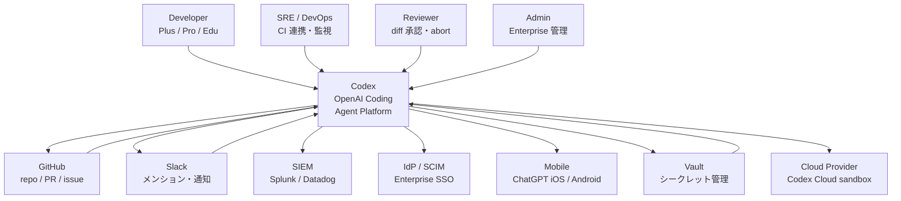
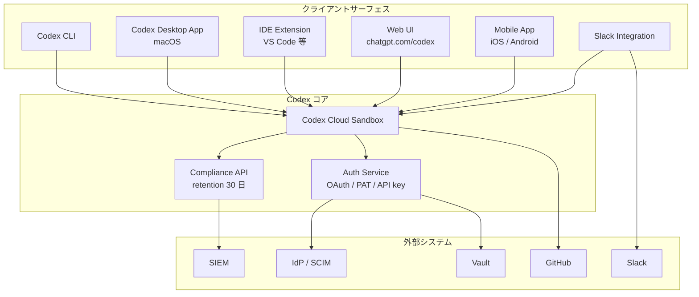
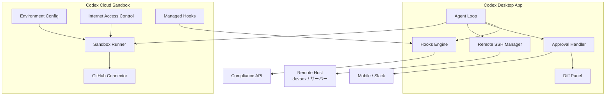
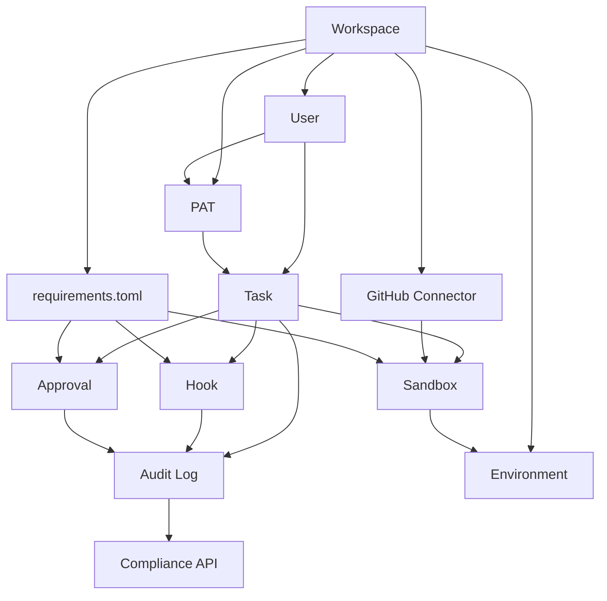
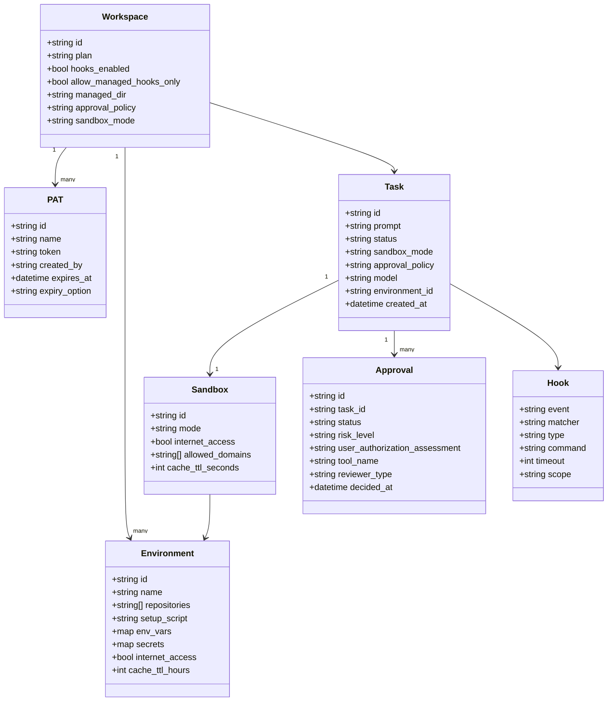

> 検証日: 2026-05-15
> 中核ソース: [Work with Codex from anywhere | OpenAI](https://openai.com/index/work-with-codex-from-anywhere/) (2026-05-14)

## 概要

OpenAI Codex は 2026-05-14 の "Work with Codex from anywhere" 発表で、端末上のコーディング補助ツールから「長時間タスクを非同期で実行し、人間が任意のサーフェスから介入できる非同期開発基盤」へ立ち位置を移しました。スローガンは「One agent for everywhere you code」です。ChatGPT Plus / Pro / Business / Edu / Enterprise の各プランで利用できます。コード生成・理解・レビュー・バグ修正・リファクタリングの従来機能に加えて、エージェントが数十分から時間オーダーで走り続けるバックグラウンド実行と、それを制御するサーフェスの多様化が中核変化です。

実行サーフェスは同日時点で CLI / IDE Extension / Desktop App (Remote SSH) / Web (Codex Cloud) / Slack / Mobile (iOS・Android, Preview) の 6 面に整理されました。各サーフェスは同一のタスクスレッドを参照します。デスクトップで起動した長時間タスクをモバイルで承認・ステアリングするクロスサーフェス運用が公式シナリオです。業界では Cursor Background Agents・GitHub Copilot Async Coding Agent・Devin が採用した「クラウド VM + 並列タスク + draft PR + Slack/Mobile 通知」モデルに Codex も並びました。ChatGPT 本体アプリとのモバイル一体化が差別化点です。

エンタープライズ向けには、2026-05-14 と前後して Hooks (GA)・Programmatic Access Tokens (GA, 2026-05-05)・Auto-review ポリシー・Compliance API の 4 機能が組織管理の柱として提供されました。Hooks は `SessionStart` から `Stop` まで 6 イベントを `~/.codex/hooks.json` で外部スクリプトに接続します。プロンプトのシークレットスキャン・監査ログ転送・承認フローのカスタマイズに利用できます。`requirements.toml` と `allow_managed_hooks_only` を組み合わせると、個人が hook を迂回できない DLP / ガバナンス構成を取れます。Anthropic Claude Code より組織強制が明確化されています。

対象読者は 3 層に分かれます。

| 層 | 関心事 |
|---|---|
| 個人開発者 | モバイルからタスクをキックして外出先で承認する非同期ワークフローの採用 |
| チームリード・EM | Slack 連携・draft PR 自動生成・Auto-review によるレビューループ省力化 |
| 企業 IT・セキュリティ | Hooks・PAT・Compliance API・SCIM 連携 IdP を組み合わせた監査・ガバナンス設計 |

機能の公開と運用の安全性は別物です。特に PAT 管理・Mobile 承認の MFA fatigue リスク・OIDC 直接対応の欠如は導入前の設計判断が求められます。

## 特徴

- 6 実行サーフェスの統合 (CLI / IDE / Desktop / Web / Slack / Mobile) が同一スレッドを共有
- Codex Mobile (Preview, 2026-05-14): ChatGPT モバイルアプリから新規スレッド開始・コマンド承認・diff レビュー・通知受信。Live Activity でロック画面に状態表示
- Remote SSH (全プラン展開, 2026-04-16〜): `~/.ssh/config` の concrete host を Desktop App が自動検出
- Hooks GA (2026-05-14): 6 イベントを 4 階層 (managed > system > user > project) で解決
- PermissionRequest の独立 hook イベント化 (Codex 独自設計)
- `requirements.toml` + `allow_managed_hooks_only` による DLP 強制
- Programmatic Access Tokens (GA, 2026-05-05): 有効期限 7 / 30 / 60 / 90 日。スコープなし、identity 継承型
- Auto-review ポリシー: 承認の 5 状態 (Reviewing / Approved / Denied / Aborted / Timed out) と risk level
- Compliance API: retention 30 日、SIEM 転送前提
- Codex Cloud / Web (GA): chatgpt.com/codex から長時間タスクを並列投入
- Slack 統合 (GA): `@Codex` メンションで cloud task 作成
- GitHub App installation token を per-operation で発行 (短命・branch protection 尊重)

## 構造

### システムコンテキスト



| 要素 | 説明 |
|---|---|
| Developer | タスク送信・コード生成依頼の主要ユーザー |
| SRE / DevOps | CI 連携・PAT 管理・コスト・監視の運用担当 |
| Reviewer | diff を確認して承認 / abort を行う承認者 |
| Admin | Enterprise workspace の managed config / 権限配布 |
| Codex | OpenAI のコーディングエージェント基盤全体 |
| GitHub | PR・branch・issue の管理システム |
| Slack | タスクキック・結果通知チャネル |
| SIEM | audit log の長期保管先 |
| IdP / SCIM | Enterprise SSO・ユーザー同期 |
| Mobile | ChatGPT iOS / Android アプリ |
| Vault | Codex API key / GitHub token の短命化管理 |
| Cloud Provider | Codex Cloud sandbox のインフラ |

### コンテナ



| 要素 | 説明 |
|---|---|
| Codex CLI | ターミナルからエージェントループを実行 |
| Codex Desktop App | macOS GUI。Remote SSH manager を内包 |
| IDE Extension | VS Code 等から cloud task をキック・diff 適用 |
| Web UI | chatgpt.com/codex から cloud task を管理 |
| Mobile App | iOS / Android で push 通知・Live Activity・diff 承認 |
| Slack Integration | `@Codex` メンションで cloud task を作成 |
| Codex Cloud Sandbox | バックグラウンド並列実行の cloud VM 環境 |
| Compliance API | conversation / audit log を 30 日保持 |
| Auth Service | OAuth / PAT / API key の認証統合 |

### コンポーネント



| 要素 | 説明 |
|---|---|
| Agent Loop | タスク実行制御・lifecycle event の発火 |
| Hooks Engine | 6 イベントを matcher でフィルタ・handler 実行 |
| Approval Handler | 承認要求を Mobile / Slack / Desktop に通知 |
| Diff Panel | 行レベル差分表示と承認アクションの分離 |
| Remote SSH Manager | concrete host を検出し SSH tunnel + WebSocket で接続 |
| Environment Config | cloud task の repo / setup / ツールを定義 |
| Sandbox Runner | cloud VM 上でコード実行・ファイル操作 |
| GitHub Connector | App installation token を per-operation で発行 |
| Internet Access Control | cloud sandbox のインターネット allowlist 制御 |
| Managed Hooks | `requirements.toml` で admin が配布する組織強制 hooks |

## データ

### 概念モデル



| エンティティ | 説明 |
|---|---|
| Workspace | ChatGPT Enterprise の組織テナント |
| User | Workspace に属する個人 |
| PAT | Programmatic Access Token (非対話実行用) |
| Task | エージェントが実行する作業単位 |
| Approval | タスク実行中の承認要求と判定結果 |
| Hook | エージェントループへの拡張差し込み点 |
| Sandbox | タスクを隔離実行するコンテナ環境 |
| Audit Log | タスク・Hook・Approval の監査証跡 |
| Environment | Cloud sandbox のリポジトリ・セットアップ設定 |
| GitHub Connector | GitHub App installation を仲介 |

### 情報モデル



主要な確認済みフィールドの出典を以下に整理します。

| クラス | フィールド | 出典 |
|---|---|---|
| Workspace | hooks_enabled / allow_managed_hooks_only / managed_dir | Hooks docs / Managed config docs |
| Workspace | approval_policy | Config Reference (`on-request` / `untrusted` / `never`) |
| Workspace | sandbox_mode | Config Reference (`read-only` / `workspace-write` / `danger-full-access`) |
| PAT | expiry_option | Access Tokens docs (7 / 30 / 60 / 90 日 または No expiration) |
| Approval | status | Agent Approvals docs (Reviewing / Approved / Denied / Aborted / Timed out) |
| Approval | risk_level | Agent Approvals docs (low / medium / high / critical) |
| Hook | event | Hooks docs (SessionStart / UserPromptSubmit / PreToolUse / PermissionRequest / PostToolUse / Stop) |
| Hook | timeout | Hooks docs (秒単位、デフォルト 600) |
| Sandbox | cache_ttl_seconds | Environments docs (最大 12 時間 = 43200 秒) |
| Environment | secrets | Environments docs (セットアップフェーズのみ、エージェント実行前に削除) |

その他のフィールド (id / created_at 等) は推定です。

## 構築方法

### 管理コンソールでの有効化

ChatGPT Enterprise または Business プランを契約します。Codex Cloud は Plus / Pro / Business / Enterprise / Edu で利用できます。PAT 発行や managed configuration 強制は Enterprise (および一部 Business) 限定です。

```
ChatGPT 管理コンソール → Settings > Codex
  → [ON] Allow members to use Codex cloud
  → [ON] Allow members to use Remote Control (SSH)
  → [ON] Allow members to use Codex Mobile approvals
  → GitHub Connector: 接続して許可リポジトリを選択
  → Settings > Codex > Integrations
    → [ON] Slack: Install Codex app to Slack workspace
```

### requirements.toml の配布

管理コンソールの Policies ページで `requirements.toml` を作成・配布します。MDM 経由でクライアントに展開します。

```toml
allowed_approval_policies = ["on-request"]
allowed_sandbox_modes     = ["workspace-write"]
allowed_web_search_modes  = ["disabled", "cached"]

[features]
hooks          = true
plugin_hooks   = true
browser_use    = false
in_app_browser = false
computer_use   = false

[hooks]
managed_dir         = "/etc/codex/hooks"
windows_managed_dir = 'C:\ProgramData\codex\hooks'
allow_managed_hooks_only = true

[[hooks.PreToolUse]]
matcher = "^Bash$"

[[hooks.PreToolUse.hooks]]
type          = "command"
command       = "python3 /etc/codex/hooks/pre_tool_use_policy.py"
statusMessage = "Security policy check..."
timeout       = 30

[[hooks.PostToolUse]]
matcher = "^Bash$"

[[hooks.PostToolUse.hooks]]
type    = "command"
command = "python3 /etc/codex/hooks/siem_logger.py"
timeout = 10

[[hooks.UserPromptSubmit]]

[[hooks.UserPromptSubmit.hooks]]
type    = "command"
command = "python3 /etc/codex/hooks/secret_scanner.py"
timeout = 15
```

`managed_dir` に置いたスクリプトは "trusted by policy" として扱われます。ユーザー側では無効化できません。

### Compliance API → SIEM bridge

Compliance API は会話ログを 30 日保持します。SIEM 側での長期保管には bridge が必要です。

```python
import os, requests, datetime

OPENAI_ORG  = os.environ["OPENAI_ORG_ID"]
OPENAI_KEY  = os.environ["OPENAI_ADMIN_KEY"]
SIEM_INGEST = os.environ["SIEM_INGEST_URL"]

def fetch_and_forward(since: str):
    resp = requests.get(
        "https://api.openai.com/v1/compliance/conversations",
        headers={"Authorization": f"Bearer {OPENAI_KEY}"},
        params={"organization": OPENAI_ORG, "after": since},
    )
    for event in resp.json()["data"]:
        requests.post(SIEM_INGEST, json=event)

if __name__ == "__main__":
    since = (datetime.datetime.utcnow() - datetime.timedelta(hours=1)).isoformat() + "Z"
    fetch_and_forward(since)
```

### IdP (SCIM) 連携

ChatGPT Enterprise は SCIM 2.0 による IdP 連携 (Okta / Azure AD 等) をサポートします。

```
管理コンソール → Settings > Authentication
  → Enable SCIM provisioning
  → SCIM endpoint: https://api.openai.com/scim/v2/
  → SCIM token: 発行して IdP に設定
```

## 利用方法

### Codex CLI

```bash
npm install -g @openai/codex
codex update

codex login                    # ChatGPT アカウント認証
codex login --device-auth      # ヘッドレス環境
codex login --with-api-key     # API key

codex                                       # TUI 起動
codex exec "fix the type errors in src/"    # 非対話実行
codex exec --json "add unit tests"          # JSON 出力
codex --model gpt-5.4 "refactor"            # モデル指定
codex resume                                # 前回セッション再開
codex cloud "implement OAuth2 login flow"   # クラウドタスク投入
codex cloud list                            # 実行中タスク一覧
codex apply <task-id>                       # クラウドタスクの差分をローカル適用
codex app                                   # デスクトップアプリ起動
```

主要なグローバルフラグを以下に整理します。

| フラグ | 説明 |
|---|---|
| `--add-dir <path>` | 追加ディレクトリへの書き込みアクセスを許可 |
| `--ask-for-approval, -a` | 承認プロンプトのタイミング制御 |
| `--cd, -C <path>` | 作業ディレクトリ設定 |
| `--config, -c <key=value>` | 設定値をその場でオーバーライド |
| `--model, -m <string>` | モデル選択 (gpt-5.4 / gpt-5.3-codex 等) |
| `--sandbox, -s` | サンドボックスポリシー設定 |
| `--profile, -p <string>` | 設定プロファイル選択 |

### Codex Cloud / Web

ブラウザから長時間タスクをクラウド sandbox に投入します。

```
1. https://chatgpt.com/codex を開く
2. environment を選択
3. プロンプトを入力してタスク投入
4. 進捗モニタリング (バックグラウンド・並列)
5. 完了後: Diff Panel で変更レビュー → ローカル適用 or PR 作成
```

### Codex Mobile (Preview)

ChatGPT モバイルアプリから、デスクトップで起動したタスクをステアリングできます。

```
1. ChatGPT モバイルアプリをインストール
2. Codex 有効プランでサインイン
3. ホスト側: macOS Codex Desktop App でタスクを開始
4. モバイル側: ChatGPT アプリ → Codex タブ → 実行中タスクを選択
5. メッセージ追加 / 承認要求に応答
```

### Remote SSH

```bash
ssh devbox npm install -g @openai/codex
ssh devbox which codex
```

```ssh-config
Host devbox
  HostName devbox.example.com
  User you
  IdentityFile ~/.ssh/id_ed25519
  ServerAliveInterval 60
```

ワイルドカード (`Host dev-*`) は Remote SSH の自動検出対象外です。Codex Desktop App が検出するのは concrete host (= `*` を含まないエントリ) のみです。

```
Codex App → Settings > Connections → [+ Add SSH Host]
  → ~/.ssh/config から "devbox" が自動検出されて表示
  → 有効化 → リモートプロジェクトフォルダを選択
```

### Slack 連携

```
1. Codex 設定ページ → Integrations > Slack → [Install Slack App]
2. Slack 側: @Codex をチャンネルに追加
3. デフォルト environment を設定
```

```
@Codex fix the null pointer error in auth.ts
@Codex fix the above in myorg/my-service
@Codex using staging-env, add rate limiting to /api/search
```

### Hooks 設定

#### Stop で lint + test を強制する例

```json
{
  "hooks": {
    "Stop": [
      {
        "hooks": [
          {
            "type": "command",
            "command": "bash -c 'cd \"$CODEX_CWD\" && npm run lint && npm test'",
            "statusMessage": "Running lint and tests...",
            "timeout": 120
          }
        ]
      }
    ]
  }
}
```

#### PreToolUse で危険コマンドをブロックする例

```python
import os, sys, json

tool_name = os.environ.get("CODEX_TOOL_NAME", "")
tool_input = json.loads(os.environ.get("CODEX_TOOL_INPUT", "{}"))

BLOCKED_PATTERNS = ["rm -rf /", "dd if=", "> /dev/sda", "mkfs"]

if tool_name == "Bash":
    cmd = tool_input.get("command", "")
    for pattern in BLOCKED_PATTERNS:
        if pattern in cmd:
            print(f"BLOCKED: dangerous command pattern '{pattern}'", file=sys.stderr)
            sys.exit(1)

sys.exit(0)
```

#### PostToolUse で SIEM に audit log を転送する例

```python
import os, datetime, requests

event = {
    "timestamp":   datetime.datetime.utcnow().isoformat() + "Z",
    "session_id":  os.environ.get("CODEX_SESSION_ID"),
    "tool_name":   os.environ.get("CODEX_TOOL_NAME"),
    "tool_input":  os.environ.get("CODEX_TOOL_INPUT"),
    "tool_output": os.environ.get("CODEX_TOOL_OUTPUT"),
    "cwd":         os.environ.get("CODEX_CWD"),
}

SIEM_URL = os.environ.get("SIEM_INGEST_URL")
try:
    requests.post(SIEM_URL, json=event, timeout=5)
except Exception as e:
    print(f"SIEM logger warning: {e}")
```

### PAT で CI から利用する

#### 基本パターン (GitHub-hosted runner + auth.json)

```yaml
name: Codex Task
on:
  workflow_dispatch:
    inputs:
      prompt:
        required: true

jobs:
  codex:
    runs-on: ubuntu-latest
    steps:
      - uses: actions/checkout@v4
      - uses: actions/setup-node@v4
        with:
          node-version: "22"
      - run: npm install -g @openai/codex

      - name: Write auth.json
        env:
          CODEX_AUTH_JSON: ${{ secrets.CODEX_AUTH_JSON }}
        run: |
          mkdir -p "$HOME/.codex"
          printf '%s' "$CODEX_AUTH_JSON" > "$HOME/.codex/auth.json"
          chmod 600 "$HOME/.codex/auth.json"

      - name: Run Codex task
        run: codex exec --json "${{ github.event.inputs.prompt }}"
```

#### Vault + OIDC でのセキュア構成

```yaml
name: Codex via Vault
permissions:
  id-token: write
  contents: read

jobs:
  codex:
    runs-on: ubuntu-latest
    steps:
      - uses: actions/checkout@v4
      - name: Authenticate to Vault via OIDC
        uses: hashicorp/vault-action@v3
        with:
          url: ${{ secrets.VAULT_URL }}
          method: jwt
          role: codex-ci-role
          secrets: |
            secret/data/codex auth_json | CODEX_AUTH_JSON

      - run: npm install -g @openai/codex
      - name: Write auth.json from Vault secret
        run: |
          mkdir -p "$HOME/.codex"
          printf '%s' "$CODEX_AUTH_JSON" > "$HOME/.codex/auth.json"
          chmod 600 "$HOME/.codex/auth.json"
      - run: codex exec --json "implement the feature in the PR description"
```

## 運用

### 承認ワークフローの 5 つの設計パターン

長時間エージェントの承認を 1 ボタンに集約すると、コンテキスト不足の誤承認・取り返しのつかない apply・監査ログでの責任追跡不能の 3 重事故が起きます。意思決定の種類ごとに承認イベントを分けるのが大原則です。

| パターン | 元ネタ | Codex への当てはめ |
|---|---|---|
| Plan / Apply 分離 | Terraform `plan` → 人間レビュー → `apply` | `approval_policy=on-request` 固定。Diff Panel で承認後に apply |
| Sync Waves | Argo CD `sync-wave` annotation | リサーチ → 設計 → 実装 → テスト → PR の wave 境界で hook ack |
| Escalation Policy | PagerDuty: Primary → Secondary | Timed out 状態を escalation hook で PagerDuty / Opsgenie 転送 |
| 方針転換 | Terraform stale plan refuse | AGENTS.md / 仕様更新時の「方針転換承認」を別 audit イベントに |
| 差分レビュー分離 | GitHub PR レビューと merge の分離 | 行レベル → 承認は別アクション、開いた timestamp を記録 |

### 監査・証跡

Compliance API + Hook で残すべき証跡を以下に整理します。

| 項目 | 取得元 |
|---|---|
| どのプロンプトで | Compliance API conversation export |
| 何を読んだか | `PreToolUse` hook (file read / shell exec) |
| 何を書いたか | Diff Panel commit メタ + `PostToolUse` hook |
| 何を承認したか | Auto-review Approved / Denied + risk level |
| 誰が承認したか | ChatGPT Enterprise user identity (SCIM) |
| いつ | 各イベント timestamp (UTC) |

Compliance API の retention は 30 日です。SOX 監査要件 (7 年) とのギャップは SIEM 側で埋めます。

### Hooks の組織管理 (4 階層)

```
1. Managed hooks       (cloud-managed requirements.toml)
2. System hooks        (/etc/codex/requirements.toml)
3. User hooks          (~/.codex/config.toml)
4. Project hooks       (.codex/config.toml、trusted projects のみ)
```

`allow_managed_hooks_only = true` で user / project / session の hook を完全無視します。managed hook のみを走らせます。

### Mobile 承認の運用ルール

- 高リスク操作 (production deploy / secret rotation) はモバイル承認禁止 (managed config で強制)
- Face ID / Touch ID 必須 (MDM で iOS 生体認証を Codex 承認に必須化)
- Rate limit + cooling: 同一ユーザーへの承認要求を N 分以内 M 件以上で自動 hold + Slack 通知
- Kill switch: 全 Codex タスクを即時 abort できる 1 タップ操作
- Abort の監査: abort イベントも Compliance API に残す

長時間タスクが並列で動くと承認 push が 1 日数十回に達します。MFA fatigue (push bombing) と同型のリスクです。CISA は number matching を MFA で推奨しています。Codex 承認でも diff hash 下 4 桁を入力させるなどの 2 段化が有効です。

### CI 連携 (Vault + OIDC)

```
GitHub Actions (OIDC) → Vault → Codex API key (短命)
                              → GitHub App token (Codex 用)
                              → Cloud creds (デプロイ用)
```

Codex API key を直接 GitHub Actions secrets に置きません。Actions secrets には Vault role 名のみを置きます。Codex API key 自体には現時点で OIDC 連携の正規ルートがありません (2026-05 時点)。

### コスト管理

- Local 5h 枠 と cloud tasks が同一ウィンドウを共有する仕様です
- Mobile 承認で cloud task を並列実行すると、ローカル CLI の枠も同時に削られます
- 2026-04-09 のトークン課金移行以降、消費速度が大幅に増えています
- 対策: usage trend を SIEM に取り込んで anomaly detection を設定。長時間並列タスクのコスト試算は従来の 10〜20 倍で計算

## ベストプラクティス

### 高リスク操作の分離

- production deploy / secret rotation はモバイル承認禁止 (managed config で強制)
- `danger-full-access` は `requirements.toml` で組織全体禁止
- production への commit / merge は agent 単独で実行させない (Plan / Apply 分離)
- Auto-review reviewer agent の誤承認リスクに備え、最終的に人間 PR 承認を必ず挟む二段構え

### managed_dir + MDM 配信

```toml
[hooks]
managed_dir = "/etc/codex/hooks"
allow_managed_hooks_only = true

[sandbox]
sandbox_mode = "workspace-write"
disallow_sandbox_modes = ["danger-full-access"]

[approval]
approval_policy = "on-request"
```

MDM (jamf / Microsoft Intune 等) で `managed_dir` のスクリプト群を全端末に配信します。

### 4 点セットの標準化

| hook | イベント | 目的 |
|---|---|---|
| prompt_scanner | `UserPromptSubmit` | API key / PII スキャン & ブロック |
| siem_logger | `PreToolUse` / `PostToolUse` | 全 I/O を SIEM に転送 |
| validator | `Stop` | lint / type check / secret scan 強制 |
| egress_filter | `PreToolUse` | network 接続先を allowlist で制限 |

### Vault でラップして PAT 短命化

PAT の long-lived 化を禁止し、Vault dynamic secret で job 単位に払い出します。personal PAT ではなく service account 化を強制します。StepSecurity の原則は「PAT を使うのは OIDC / GITHUB_TOKEN が使えない時に限る」です。

### Diff Panel で承認 / レビュー分離

行レベルフィードバックと承認を別アクションに分けます。承認者が diff を開いた timestamp を記録し、「見ていない承認」を排除します。

### PAT のローテーション目安

| カテゴリ | ローテーション周期 |
|---|---|
| prod credentials | 30 日 |
| high risk | 60 日 |
| その他 | 90 日 |

## トラブルシューティング

### 既知の脆弱性 (PAT プレーンテキスト窃取、パッチ済み)

BeyondTrust Phantom Labs が 2025-12-16 に BugCrowd 報告した command injection です。Codex Cloud のタスク作成 HTTP リクエストの GitHub branch 名が未サニタイズでした。悪意ある branch 名を含む repo を扱うと container 内で任意コマンド実行され、GitHub User Access Token がプレーンテキストで窃取可能でした。2026-02-05 に完全パッチ済みです。

教訓は「PAT を long-lived 化せず Vault 経由で短命に再発行する」アーキテクチャの必須化です。

### Hooks 関連の Issues

| Issue | 状態 | 1 行要約 |
|---|---|---|
| [openai/codex#21639](https://github.com/openai/codex/issues/21639) | Open | Codex Desktop 0.129.0-alpha.15 で SessionStart / PreToolUse hook が動かなくなる回帰 |
| [openai/codex#21148](https://github.com/openai/codex/issues/21148) | Open | hooks の deprecation 通知 URL が 404 |
| [openai/codex#17478](https://github.com/openai/codex/issues/17478) | Open | Hooks が Windows で動作しない |
| [openai/codex#18273](https://github.com/openai/codex/issues/18273) | Open | CLI に persistent governed repo mode 未実装 |
| [openai/codex#12190](https://github.com/openai/codex/issues/12190) | Open | governance hooks 未実装 |

Windows 主体の組織では Hook を組織ガバナンスの一級機能として依存しないでください。

### サンドボックス・承認 UI 関連の Issues

| Issue | 状態 | 1 行要約 |
|---|---|---|
| [openai/codex#5041](https://github.com/openai/codex/issues/5041) | Open | VS Code 拡張で `danger-full-access` でも sandbox エラーで遮断 |
| [openai/codex#10390](https://github.com/openai/codex/issues/10390) | Open | macOS で `network_access = true` が seatbelt sandbox に無視される |
| [openai/codex#10187](https://github.com/openai/codex/issues/10187) | Open | auto-approve でも 1 応答中に何十回も承認要求 |
| [openai/codex#19876](https://github.com/openai/codex/issues/19876) | Open | Desktop 承認通知をクリックすると blank / error 画面 |
| [openai/codex#21343](https://github.com/openai/codex/issues/21343) | Open | Context compact エラーで stream 切断、長時間タスクの状態をロスト |
| [openai/codex#20968](https://github.com/openai/codex/issues/20968) | Open | 通常利用で 503 Service Unavailable |
| [openai/codex#19557](https://github.com/openai/codex/issues/19557) | Open | CLI のレスポンスが極端に遅い |
| [openai/codex#21975](https://github.com/openai/codex/issues/21975) | Open | Auto-review が deny / abort した時に人間 fallback が無く Mobile 通知も来ない |

### よくある問題

#### クォータが異常に早く枯渇する

- 症状: Pro $200 課金直後に weekly 残り 3%、5h 枠 exhausted
- 原因: ローカル 5h 枠と cloud tasks が同一ウィンドウを共有。トークン課金移行以降、消費速度が大幅増
- 対策: usage trend を SIEM で可視化し、異常検知を設定。タスクごとの usage を `PostToolUse` hook で記録

#### Hooks が Desktop 更新後に動かない

- 症状: SessionStart / PreToolUse hook が黙って動かなくなる ([#21639](https://github.com/openai/codex/issues/21639))
- 対策: hook 呼び出し確認用の log を仕込む。Desktop を前バージョンに戻す。managed hooks のみで再配信

#### macOS で network_access = true が無視される

- 症状: `network_access = true` を設定しても seatbelt sandbox がネットワーク遮断 ([#10390](https://github.com/openai/codex/issues/10390))
- 対策: Cloud sandbox に移行し domain preset で許可。ローカルと Cloud の挙動差をテストスイートで事前検証

#### 長時間タスクが context compact エラーで途中終了

- 症状: stream 切断で planning / tool 状態をロスト ([#21343](https://github.com/openai/codex/issues/21343))
- 対策: Sync Waves パターンで細分化 (各 wave 30 分以内)。`Stop` hook で state を外部ファイルに書き出し

#### CI から Codex API key が流出した

- 即時対策: OpenAI dashboard で該当 key を無効化。Compliance API で影響範囲の audit。GitHub repository の secret scanning アラート確認
- 恒久対策: Vault + OIDC 構成に移行。Actions secrets には Vault role 名のみ。scoped secrets で影響範囲を封じ込める

## まとめ

OpenAI Codex は 2026-05-14 のリリースで「端末上の補助ツール」から「6 サーフェス・非同期実行・組織管理可能なエージェント基盤」へと立ち位置を移しました。機能は揃いましたが、PAT の脆弱性 (パッチ済み)・Hooks の Windows 動作不全・MFA fatigue 同型リスク・OIDC 直接対応の不在など、運用前に設計判断が必要な穴が残ります。組織導入では `requirements.toml` + Compliance API → SIEM bridge + PagerDuty escalation + Vault OIDC の 4 点セットを最初に組み立てるのが現実解です。

この記事が少しでも参考になった、あるいは改善点などがあれば、ぜひリアクションやコメント、SNS でのシェアをいただけると励みになります！

## 参考リンク

- OpenAI 公式
  - [Work with Codex from anywhere (2026-05-14)](https://openai.com/index/work-with-codex-from-anywhere/)
  - [Building Codex Windows sandbox](https://openai.com/index/building-codex-windows-sandbox/)
  - [Codex 概要](https://developers.openai.com/codex)
  - [Codex Quickstart](https://developers.openai.com/codex/quickstart)
  - [Codex CLI Reference](https://developers.openai.com/codex/cli/reference)
  - [Codex Remote connections](https://developers.openai.com/codex/remote-connections)
  - [Codex Hooks](https://developers.openai.com/codex/hooks)
  - [Codex Authentication](https://developers.openai.com/codex/auth)
  - [Codex CI/CD Authentication](https://developers.openai.com/codex/auth/ci-cd-auth)
  - [Codex Access Tokens (PAT)](https://developers.openai.com/codex/enterprise/access-tokens)
  - [Codex Cloud / Web](https://developers.openai.com/codex/cloud)
  - [Codex Cloud Environments](https://developers.openai.com/codex/cloud/environments)
  - [Codex Slack Integration](https://developers.openai.com/codex/integrations/slack)
  - [Admin Setup – Codex Enterprise](https://developers.openai.com/codex/enterprise/admin-setup)
  - [Managed Configuration](https://developers.openai.com/codex/enterprise/managed-configuration)
  - [Agent Approvals & Security](https://developers.openai.com/codex/agent-approvals-security)
  - [AGENTS.md](https://developers.openai.com/codex/guides/agents-md)
  - [Configuration Reference](https://developers.openai.com/codex/config-reference)
  - [Codex Changelog](https://developers.openai.com/codex/changelog)
  - [Codex rate card](https://help.openai.com/en/articles/20001106-codex-rate-card)
  - [New compliance and administrative tools for ChatGPT Enterprise](https://openai.com/index/new-tools-for-chatgpt-enterprise/)
  - [OpenAI Trust Portal](https://trust.openai.com/)
- GitHub
  - [openai/codex#21639](https://github.com/openai/codex/issues/21639)
  - [openai/codex#21148](https://github.com/openai/codex/issues/21148)
  - [openai/codex#17478](https://github.com/openai/codex/issues/17478)
  - [openai/codex#18273](https://github.com/openai/codex/issues/18273)
  - [openai/codex#12190](https://github.com/openai/codex/issues/12190)
  - [openai/codex#21975](https://github.com/openai/codex/issues/21975)
  - [openai/codex#21343](https://github.com/openai/codex/issues/21343)
  - [openai/codex#19876](https://github.com/openai/codex/issues/19876)
  - [openai/codex#10390](https://github.com/openai/codex/issues/10390)
  - [openai/codex#5041](https://github.com/openai/codex/issues/5041)
  - [openai/codex#10187](https://github.com/openai/codex/issues/10187)
  - [openai/codex#20968](https://github.com/openai/codex/issues/20968)
  - [openai/codex#19557](https://github.com/openai/codex/issues/19557)
  - [openai/codex#19585](https://github.com/openai/codex/issues/19585)
- 業界対比
  - [Cursor Background Agents](https://docs.cursor.com/en/background-agent)
  - [GitHub Copilot Agent Mode 101](https://github.blog/ai-and-ml/github-copilot/agent-mode-101-all-about-github-copilots-powerful-mode/)
  - [Devin (Cognition)](https://devin.ai/)
  - [Claude Code hooks reference](https://code.claude.com/docs/en/hooks)
- 脆弱性・セキュリティ
  - [Critical Vulnerability in OpenAI Codex Allowed GitHub Token Compromise (SecurityWeek)](https://www.securityweek.com/critical-vulnerability-in-openai-codex-allowed-github-token-compromise/)
  - [OpenAI Codex Command Injection Vulnerability (BeyondTrust)](https://www.beyondtrust.com/blog/entry/openai-codex-command-injection-vulnerability-github-token)
  - [JumpCloud: Push Bombing and MFA Fatigue](https://jumpcloud.com/blog/push-bombing-mfa-fatigue)
  - [BeyondIdentity: Push Notifications for MFA Is a Security Liability](https://www.beyondidentity.com/resource/using-push-notifications-for-mfa-is-a-security-liability)
  - [CISA: Implement Number Matching in MFA (PDF)](https://www.cisa.gov/sites/default/files/publications/fact-sheet-implement-number-matching-in-mfa-applications-508c.pdf)
- 設計パターン
  - [Terraform plan / apply](https://developer.hashicorp.com/terraform/cli/commands/plan)
  - [Argo CD Sync Waves](https://argo-cd.readthedocs.io/en/stable/user-guide/sync-waves/)
  - [PagerDuty Escalation Policies](https://support.pagerduty.com/main/docs/escalation-policies)
  - [GitHub OIDC docs](https://docs.github.com/en/actions/concepts/security/openid-connect)
  - [HashiCorp Vault JWT Auth](https://developer.hashicorp.com/vault/docs/auth/jwt)
  - [Vault 1.16 OIDC for GitHub Actions](https://johal.in/encrypting-secrets-github-actions-2026-hashicorp-vault-116/)
  - [StepSecurity: 7 GitHub Actions Security Best Practices](https://www.stepsecurity.io/blog/github-actions-security-best-practices)
- コスト・運用
  - [OpenAI Community: Pro $200 paid, weekly quota at 3% immediately](https://community.openai.com/t/pro-plan-200-paid-may-8-weekly-quota-at-3-immediately-after-payment-5h-already-exhausted/1380500)
  - [OpenAI Community: Codex usage limits draining fast since 10 May 2026](https://community.openai.com/t/codex-usage-limits-seem-to-be-draining-unusually-fast-since-10-may-2026-even-with-light-gpt-5-3-codex-use-while-the-usage-tracking-ui-also-appears-buggy-or-missing/1380649)
- コンプライアンス
  - [PolicyLayer: SOC 2 Compliance for AI Agents](https://policylayer.com/blog/soc2-compliance-ai-agents)
  - [Teleport: How AI Agents Impact SOC 2](https://goteleport.com/blog/ai-agents-soc-2/)
  - [Blaxel: SOC 2 Compliance for AI Agents in 2026](https://blaxel.ai/blog/soc-2-compliance-ai-guide)
