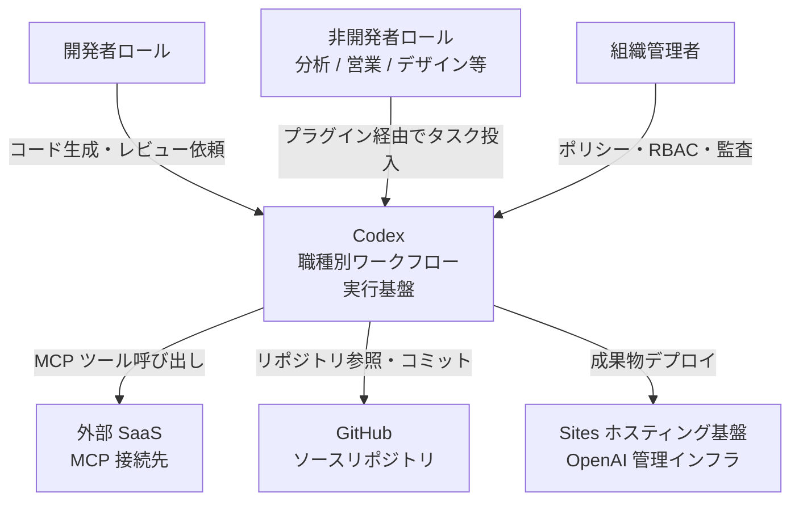
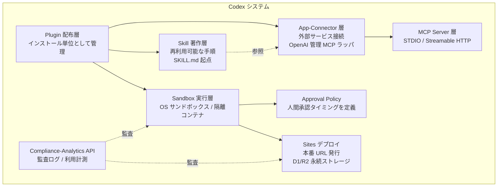
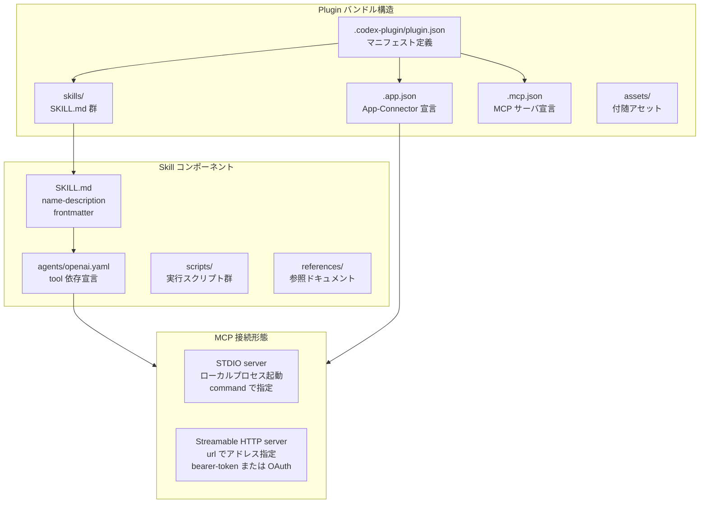
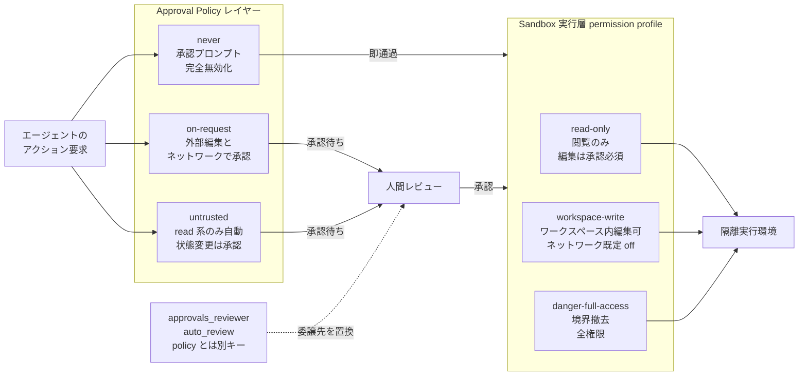
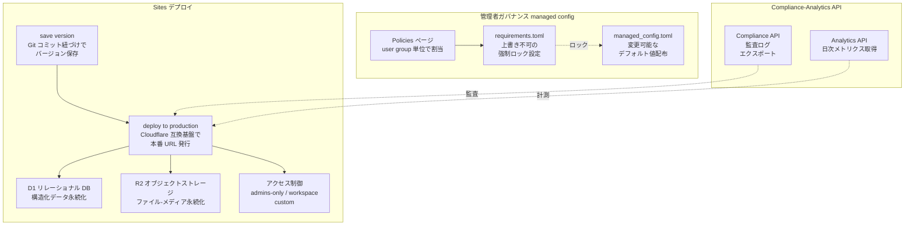
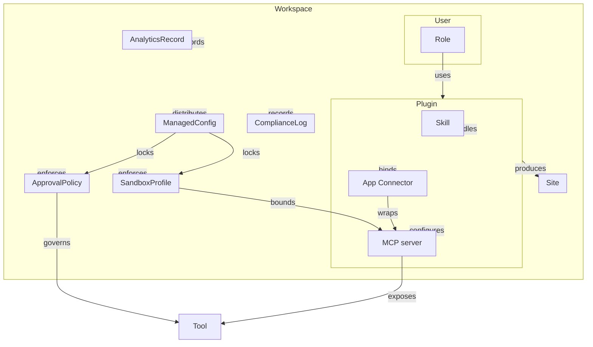
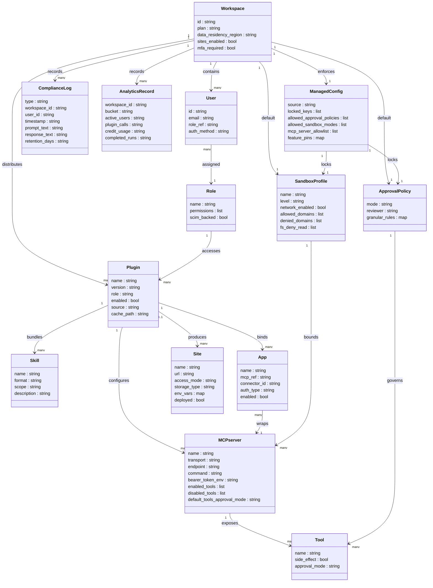

> 検証日: 2026-06-04 / 対象発表: 2026-06-02 OpenAI「Codex for every role, tool, and workflow」
> 分類: Coding Agent / Knowledge Work（職種別プラグイン + Sites による知識労働の実行基盤化）

## 概要

2026-06-02、OpenAI は公式ブログ「Codex for every role, tool, and workflow」で Codex の拡張を発表しました。新要素は 3 つです。

| 機能名 | 内容 | 提供状況 |
|---|---|---|
| **role-specific plugins（職種別プラグイン）** | 役割・ツールに合わせて Codex を適応させるインストール可能なバンドル。初期 6 職種をノーコードで提供 | ローリングアウト中 |
| **Sites** | Codex から直接インタラクティブな Web サイト・アプリを作り、ワークスペース内で URL 共有できるホスティング面 | preview（Business / Enterprise 向け） |
| **annotations（アノテーション）** | 成果物の特定箇所を指して局所的に修正を依頼する機能。ドキュメント・スプレッドシート・スライドへ対象を拡大 | 提供開始 |

発表の核心は「モデルが賢くなった」ことではありません。**仕事を投入する単位が、その場限りのチャットから、道具・成果物・承認点・共有面を束ねた宣言的な「role（役割）パッケージ」へ移った**点にあります。

Codex はもともと開発者向けコーディングツールとして始まりました。今回の拡張は、職種別プラグインによって「コーディング不要」でアナリスト・マーケター・投資家・バンカー等の知識労働者が Codex を使えるようにします。

OpenAI が示す普及指標は次のとおりです（いずれもベンダー自己申告・母数定義は非開示）。

- 週次ユーザー数: 500 万人超
- 非開発者の割合: 全体の約 20%
- 非開発者の成長速度: 開発者の 3 倍超

ローンチ済み 6 職種と近日提供予定の職種は次のとおりです。

| 状態 | 職種 |
|---|---|
| ローンチ済み（ブログ発表） | Data Analytics / Creative Production / Sales / Product Design / Public Equity Investing / Investment Banking |
| 近日提供予定（ブログ発表） | Corporate Finance / Private Equity Investing / Marketing Strategy / Strategy Consulting / Legal |

ブログ発表では 6 職種・合計 62 のアプリと 110 のスキルがバンドルされたとされています（OpenAI 発表値。公式ブログは取得制限のためプロキシ経由で確認）。一方、公式 OSS テンプレートリポジトリ `openai/role-based-plugins` に現時点で公開されているのは 4 職種（Sales / Data Analytics / Product Design / Financial Markets）です。職種ラインアップと公開テンプレートは別管理で、発表職種の一部はテンプレート未公開です。近日提供予定の職種名はブログ発表由来で、リポジトリ README には未記載です。

### 類似製品との比較

| 比較軸 | Codex plugins (OpenAI) | Anthropic knowledge-work-plugins (OSS) | Microsoft Copilot agents | Claude Artifacts / Code Interpreter |
|---|---|---|---|---|
| 配布単位 | Plugin（skills + apps + MCP servers のバンドル、インストール可能） | OSS テンプレート（リポジトリ単位） | Copilot agent（チャネル単位） | セッション内の成果物（単体） |
| 接続方式 | MCP がコア（STDIO / Streamable HTTP）+ OAuth / bearer token | MCP 互換（仕様準拠） | Microsoft Graph API + Copilot Studio connector | Code Interpreter（隔離 Python 実行）/ ツール呼び出し |
| 成果物共有 | Sites：本番 URL + 永続ストレージ + ワークスペース認証 | なし（成果物は外部に持ち出し） | SharePoint / Teams チャネル共有 | 閲覧リンク止まり（本番ホスティングなし） |
| ガバナンス | managed_config.toml でポリシーロック + Compliance API + RBAC | なし（OSS のため利用側設計） | Microsoft Purview + Entra ID | ChatGPT Enterprise 統制を継承 |

## 特徴

### 役割のパッケージ化（Plugin = role の宣言的バンドル）

Codex の拡張は入れ子構造を持ちます。最小の `Tool` → `MCP server` → `App / Connector` → `Skill（著作形式）` → `Plugin（配布単位）`という積み上がりです。公式は **"Skills are the authoring format, Plugins are the installable distribution unit"** と明言します。

「分析担当」「営業担当」という役割が、使う道具（MCP / コネクター）・作る成果物・実行手順（skills）を 1 つの宣言的パッケージにまとめます。チャット 1 回ごとにツールを繋ぎ直すのではなく、ロール単位で導入する発想です。

### MCP がコア接続

ツール接続は **MCP（Model Context Protocol）** がコアです。`STDIO` と `Streamable HTTP` の 2 形態を取ります。App / Connector も実体は OpenAI 管理の MCP ラッパであり、認証は bearer token / OAuth（`codex mcp login`）で行います。

### 2 レイヤー承認による実行制御

実行時の安全は 2 つのレイヤーが協調します。

- **Sandbox（技術境界）**: 新方式の permission profile プリセットはコロン付きの `:read-only` / `:workspace` / `:danger-full-access`、旧 `sandbox_mode` 値はコロン無しの `read-only` / `workspace-write` / `danger-full-access`。両者は相互排他で、どちらか一方を設定します。
- **Approval policy（承認方針）**: `on-request` / `untrusted` / `never` の 3 段階。何をするとき人間承認を挟むかを定義します。`auto_review`（承認を reviewer エージェントに委譲）は policy の値ではなく、別キー `approvals_reviewer = "auto_review"` で設定します（既定は `user`）。

ローカル CLI は OS サンドボックス（macOS Seatbelt / Linux bwrap+seccomp）、クラウドは隔離コンテナ + プロキシ網を使います。エージェント実行フェーズではネットワークが既定でオフになり、secrets はフェーズ開始前に削除されます。

### Sites — 成果物が「本番 URL」として共有される

Sites は、プロンプトや既存プロジェクトを **OpenAI 管理インフラ（Cloudflare Worker 互換ビルド + D1 / R2 ストレージ）** に本番 URL でデプロイする面です。静的サイト・インタラクティブアプリ・データ可視化・内部ツール・ゲームを対象とします。

アクセス制御は **admins only（既定）/ workspace / custom** の 3 モード + Sign in with ChatGPT 認証を持ちます。Business は既定で有効、Enterprise は RBAC で管理者が有効化します（preview）。

「全デプロイ URL が即"本番"」である点が最大の特徴であり、最大のリスクでもあります。Sites 専用の監査ログ・URL 自動失効・棚卸し機構は developer docs に記載が見当たらず[未確認]です。

### エンタープライズ統制の継承

管理機能は `managed_config.toml`（デフォルト設定）と `requirements.toml`（強制ロック）の二層構造です。組織管理者が `allowed_sandbox_modes` / `mcp_servers` ホワイトリスト等を強制できます。

監査は **Compliance API** と **Analytics API**（スコープ `codex.enterprise.analytics.read` は公式確認済み）が担います。イベント型名（`CODEX_LOG` / `CODEX_SECURITY_LOG`）や plugin 呼び出し計測の有無は調査時点で公式ページに明示が見当たらず[要確認]です。ただし API キー経路は Compliance API の対象外で、監査ログの保持期間は最大 30 日です。SSO / SCIM・MFA・データ所在地・zero data retention は ChatGPT Enterprise の統制をそのまま継承します。

## 構造

### システムコンテキスト図



| 要素名 | 説明 |
|---|---|
| 開発者ロール | Codex CLI / IDE 拡張 / クラウドタスクを通じてコーディング・レビューを行う利用者 |
| 非開発者ロール | 職種別プラグインを使い、コードを書かずにタスクを実行する利用者 |
| 組織管理者 | RBAC・managed config・監査 API を通じてポリシーを設定・施行する管理者 |
| Codex | 職種別プラグイン・スキル・MCP 接続・承認・Sites デプロイを束ねる実行基盤 |
| 外部 SaaS | MCP プロトコルで接続される外部サービス群 |
| GitHub | クラウドタスクが checkout・コミットする対象 |
| Sites ホスティング基盤 | OpenAI 管理の Cloudflare Worker 互換 + D1/R2 の本番デプロイ基盤 |

### コンテナ図



| 要素名 | 説明 |
|---|---|
| Plugin 配布層 | skill / app / MCP を束ねたインストール可能単位。マーケットプレース経由で配布 |
| Skill 著作層 | ワークフローの著作形式。SKILL.md を起点に手順を再利用可能な形で定義 |
| App-Connector 層 | GitHub / Slack / Google Drive 等との外部接続を担う OpenAI 管理の MCP ラッパ群 |
| MCP Server 層 | ツール呼び出しのコア。STDIO と Streamable HTTP の 2 形態で外部サービスに接続 |
| Sandbox 実行層 | OS サンドボックスまたは隔離コンテナで技術境界を保証する実行環境 |
| Approval Policy | エージェントのアクションに対し、いつ人間承認を要求するかを定義するポリシー層 |
| Sites デプロイ | Codex が生成した成果物を本番 URL として発行し永続ストレージで状態を保持する面 |
| Compliance-Analytics API | 監査ログのエクスポートと利用計測メトリクスの提供を担う API 群 |

### コンポーネント図（Plugin / Skill / App-Connector）



| 要素名 | 説明 |
|---|---|
| .codex-plugin/plugin.json | プラグインのマニフェスト。skill 群・app・MCP の参照を宣言 |
| skills/ | 著作層の実体。name / description frontmatter を必須とする手順ファイル群 |
| .app.json | App-Connector 宣言。GitHub / Slack 等の外部接続を指し示す |
| .mcp.json | MCP サーバ宣言。STDIO または Streamable HTTP のサーバ設定を含む |
| SKILL.md | 個別スキルの定義起点。progressive disclosure で metadata を先読み |
| agents/openai.yaml | スキルが依存する tool / MCP サーバを宣言する設定ファイル |
| STDIO server | ローカルプロセスとして起動する MCP サーバ形態 |
| Streamable HTTP server | HTTP アドレスでアクセスする MCP サーバ形態。OAuth スコープで tool を解放 |

### コンポーネント図（Sandbox / Approval Policy の 2 レイヤー協調）



| 要素名 | 説明 |
|---|---|
| on-request | バージョン管理下フォルダの既定ポリシー。ワークスペース外編集とネットワークアクセス時に承認を要求 |
| untrusted | read 系のみ自動実行し、状態変更・外部実行を招くコマンドは承認必須にするポリシー |
| never | 承認プロンプトを完全無効化するポリシー |
| auto_review | 承認要求をユーザーではなく reviewer agent に回す設定。policy の値ではなく `approvals_reviewer` キーで指定（既定は user） |
| read-only | ファイル閲覧のみを許可し、編集とコマンド実行は承認必須にする permission profile |
| workspace-write | ワークスペース内の編集を許可し、ネットワークは既定 off にする permission profile |
| danger-full-access | FS・ネットワークの境界を撤去する最大権限 permission profile |
| 隔離実行環境 | ローカルは OS サンドボックス、クラウドは隔離コンテナ + HTTP/HTTPS プロキシ網 |

### コンポーネント図（Sites / 管理者ガバナンス / 監査 API）



| 要素名 | 説明 |
|---|---|
| save version | デプロイ前に Git コミットと紐づけてバージョンを保存する段階。デプロイと分離 |
| deploy to production | 保存済みバージョンを Cloudflare Worker 互換基盤に即座に本番デプロイし URL を発行 |
| D1 リレーショナル DB | チェックリスト・フィルタ・注釈等の構造化データを永続化する SQLite ベースの DB |
| R2 オブジェクトストレージ | アップロード文書・画像・メディアのファイルバイトを永続化するオブジェクトストレージ |
| アクセス制御 | admins-only / workspace / custom の 3 モードで共有範囲を制御。Sign in with ChatGPT で認証 |
| requirements.toml | ユーザーが上書きできない強制設定ファイル。allowed_sandbox_modes / allowed_approval_policies 等をロック |
| managed_config.toml | セッション中にユーザーが変更可能なデフォルト値を配布する設定ファイル |
| Policies ページ | クラウド管理コンソールで requirements.toml ポリシーを user group に割り当てる管理画面 |
| Analytics API | codex.enterprise.analytics.read スコープでアクティブユーザー・コードレビュー量等を取得 |
| Compliance API | Codex タスク・環境の監査ログをエクスポートする API |

## データ

### 概念モデル

エンティティ間の所有関係を subgraph（入れ子）で、利用関係を矢印で示します。



### 情報モデル

主要エンティティの属性を定義します。型は汎用名で表記します。公式一次で確認できない属性は属性根拠表で「推測/補完」と明示します。



### 属性の根拠と補完注記

| エンティティ | 公式一次確認属性 | 推測/補完属性 |
|---|---|---|
| Plugin | name / version / enabled / cache_path / role | source（marketplace 由来と推測） |
| Skill | name / format（SKILL.md）/ scope | description（frontmatter 記載と推測） |
| App | name / mcp_ref / connector_id / auth_type / enabled | - |
| MCPserver | transport / endpoint / command / bearer_token_env / enabled_tools / disabled_tools / default_tools_approval_mode | - |
| Tool | name / approval_mode | side_effect（destructive annotation の実体として推測） |
| Site | url / access_mode / storage_type / deployed | name / env_vars（env_vars は map と推測） |
| ApprovalPolicy | mode / reviewer | granular_rules（granular 設定の実体として推測） |
| SandboxProfile | name / level / network_enabled / allowed_domains / denied_domains / fs_deny_read | - |
| ManagedConfig | source / locked_keys / allowed_approval_policies / allowed_sandbox_modes / mcp_server_allowlist / feature_pins | - |
| ComplianceLog | type / workspace_id / user_id / timestamp / prompt_text / response_text | retention_days（30 日と明記、API 側の値として補完） |
| AnalyticsRecord | workspace_id / bucket / active_users / plugin_calls / credit_usage / completed_runs | - |
| Role | name | permissions / scim_backed（RBAC + SCIM 連携の実体として推測） |
| Workspace | id / plan / data_residency_region / sites_enabled / mfa_required | - |
| User | id / email / role_ref / auth_method | - |

## 構築方法

### 必須パラメータ一覧

| コンポーネント | 設定ファイル | 必須キー | 補足 |
|---|---|---|---|
| MCP (STDIO) | `~/.codex/config.toml` | `command` | ローカルプロセス型サーバの起動コマンド |
| MCP (HTTP) | `~/.codex/config.toml` | `url` | Streamable HTTP サーバのエンドポイント |
| Plugin 無効化 | `~/.codex/config.toml` | `enabled = false` | 無効化保持（アンインストールせず保存） |
| Sites ストレージ | `.openai/hosting.json` | `project_id` | プロビジョニング後に自動生成 |
| Permission profiles | `~/.codex/config.toml` | `default_permissions` | profiles 使用時にアクティブプロファイルを指定 |

### Codex CLI / App / IDE 拡張の導入前提

- **Codex App**: ChatGPT の Business / Enterprise / Edu プラン向けに提供。
- **Codex CLI**: `npm install -g @openai/codex` でインストール。`~/.codex/config.toml` を設定ファイルとして使用。
- **IDE 拡張**: VS Code 等の拡張として提供。CLI と設定ファイルを共有。
- **Sites**: 2026-06-02 時点で preview。ChatGPT Business はデフォルト有効、Enterprise は管理者が RBAC で有効化が必要。

### プラグインの有効化（管理者 allowlist）

組織の管理者は allowlist モデルでプラグインを管理します。

- 全アプリはデフォルト無効。管理者が明示的に有効化したアプリのみメンバーが利用可能。
- 有効化の経路: `Workspace settings > Apps` で対象アプリを有効化。
- Enterprise / Edu では RBAC でユーザーまたはグループへのアクセスを個別に割り当て可能。

```toml
# 設定例: プラグインを無効化（アンインストールせずに保持）
[plugins."gmail@openai-curated"]
enabled = false
```

### MCP サーバの設定（`[mcp_servers.<name>]`）

`config.toml` はユーザースコープ（`~/.codex/config.toml`）とプロジェクトスコープ（`.codex/config.toml`）の両方をサポートします。

**STDIO 型（ローカルプロセス）の主な設定キー:**

| キー | 必須 | 説明 |
|---|---|---|
| `command` | 必須 | サーバを起動するコマンド |
| `args` | 任意 | コマンドへの引数 |
| `env` | 任意 | サーバプロセスに渡す環境変数 |
| `env_vars` | 任意 | ローカル環境変数をフォワード |
| `cwd` | 任意 | サーバ起動時の作業ディレクトリ |

**Streamable HTTP 型の主な設定キー:**

| キー | 必須 | 説明 |
|---|---|---|
| `url` | 必須 | サーバのエンドポイント URL |
| `bearer_token_env_var` | 任意 | Bearer トークンを保持する環境変数名 |
| `http_headers` | 任意 | 静的なヘッダ名と値のペア |
| `env_http_headers` | 任意 | ヘッダ名を環境変数名にマッピング |

**共通オプションキー:**

| キー | 説明 |
|---|---|
| `startup_timeout_sec` | サーバ起動タイムアウト（デフォルト 10 秒） |
| `tool_timeout_sec` | ツール実行タイムアウト（デフォルト 60 秒） |
| `enabled` | `false` で無効化 |
| `required` | `true` でサーバ未起動時に Codex 起動を失敗させる |
| `enabled_tools` | 利用を許可するツールの allowlist |
| `disabled_tools` | allowlist 適用後に除外するツールの denylist |
| `default_tools_approval_mode` | ツール全体の承認モード |

**設定例:**

```toml
# STDIO 型: Context7 MCP サーバ
[mcp_servers.context7]
command = "npx"
args = ["-y", "@upstash/context7-mcp"]
env_vars = ["LOCAL_TOKEN"]

# HTTP 型: Figma MCP サーバ（Bearer トークン認証）
[mcp_servers.figma]
url = "https://mcp.figma.com/mcp"
bearer_token_env_var = "FIGMA_OAUTH_TOKEN"
http_headers = { "X-Figma-Region" = "us-east-1" }
```

CLI でインタラクティブに追加することもできます。

```bash
codex mcp add <name> -- <command>
```

### `codex mcp login`（OAuth 認証）

OAuth 対応の MCP サーバに対しては `codex mcp login` でブラウザ認証フローを実行します。

```bash
codex mcp login <server-name>
```

- MCP サーバが `scopes_supported` を広告している場合はそのスコープを優先し、なければ `config.toml` に設定したスコープにフォールバックします。
- コールバックは `mcp_oauth_callback_port` または `mcp_oauth_callback_url` で上書きできます。

### `managed_config.toml` / `requirements.toml` の配置

| ファイル | 役割 | ユーザー上書き |
|---|---|---|
| `requirements.toml` | 管理者が強制する制約（ロック） | 不可 |
| `managed_config.toml` | 管理者が配布するデフォルト値 | セッション中は可（次回起動で再適用） |

**配置パス:**

| 環境 | `requirements.toml` | `managed_config.toml` |
|---|---|---|
| Linux / macOS | `/etc/codex/requirements.toml` | `/etc/codex/managed_config.toml` |
| Windows | `%ProgramData%\OpenAI\Codex\requirements.toml` | `~/.codex/managed_config.toml` |
| macOS MDM | `com.openai.codex:requirements_toml_base64` | `com.openai.codex:config_toml_base64` |

**優先順位（高→低）:**

1. クラウド管理 requirements（ChatGPT Business / Enterprise）
2. macOS MDM managed preferences
3. システムレベルファイル（`/etc/codex/requirements.toml` 等）
4. ユーザー `~/.codex/config.toml`
5. CLI 引数

**`requirements.toml` のロック設定例:**

```toml
# 管理者向けロック設定例
allowed_approval_policies = ["untrusted", "on-request"]
allowed_sandbox_modes = ["read-only", "workspace-write"]
allowed_web_search_modes = ["cached"]

[features]
browser_use = false
computer_use = false

[permissions.filesystem]
deny_read = ["/etc/passwd", "~/.ssh/**"]

[experimental_network]
enabled = false
```

ロック可能なキー: `allowed_approval_policies` / `allowed_sandbox_modes` / `allowed_approvals_reviewers` / `allowed_web_search_modes` / `enforce_residency` / `mcp_servers`（allowlist）/ `[features]` / `[permissions.filesystem].deny_read` / `[rules]` / `[experimental_network]` / `[hooks]`。

## 利用方法

### プラグインの利用

**Codex App での手順:**

1. メインメニューから「Plugins」セクションを開く。
2. プラグインディレクトリを検索またはブラウズする（「Curated by OpenAI」「Shared with you」「Created by you」の 3 カテゴリ）。
3. プラグインを選択して「Add to Codex」をクリックする。
4. 外部アプリの認証が求められた場合は認証する。
5. 新しいスレッドを開始してプラグインを呼び出す。

**呼び出し方法（2 種類）:**

```
# 直接依頼
今日の未読 Gmail スレッドを要約して

# 明示的な参照（@ で指定）
@gmail 今日の未読スレッドを要約して
```

CLI では `/plugins` コマンドでブラウザを開きます。

### approval policy の指定

| ポリシー値 | 挙動 |
|---|---|
| `on-request` | バージョン管理下フォルダの編集は承認不要。ワークスペース外の編集・ネットワークアクセスに承認が必要（既定） |
| `untrusted` | 既知安全な読み取り系のみ自動実行。状態変更・外部実行は承認必須 |
| `never` | 承認プロンプトを完全無効化（`--ask-for-approval never` と等価） |

`auto_review`（承認を reviewer エージェントに委譲）は approval policy の値ではなく、別キー `approvals_reviewer` で指定します（既定は `user`）。

```toml
# config.toml での永続設定
approval_policy = "on-request"
approvals_reviewer = "auto_review"   # 承認を reviewer エージェントへ委譲（任意）
```

```bash
# セッション中の切り替え
--ask-for-approval never
/permissions
```

### sandbox mode / permission profiles

**permission profiles**（推奨・新方式）と **sandbox mode**（旧方式）は相互排他です。どちらか一方を設定します。

| プリセット名 | ファイルシステム | ネットワーク |
|---|---|---|
| `:read-only` | 閲覧のみ（編集・コマンド実行は承認必須） | 制限 |
| `:workspace` | ワークスペース内の編集・ルーチンコマンドを許可（既定に近い） | 設定次第 |
| `:danger-full-access` | ローカルサンドボックス制限を撤去 | 制限なし |

```toml
# config.toml: アクティブプロファイルの指定（組込みプリセットはコロン付き）
default_permissions = ":workspace"
```

コロン無しの `workspace` はカスタムプロファイル名として扱われ、`[permissions.workspace]` を別途定義しない限り組込みプリセットとは等価になりません。

カスタムプロファイルの定義例:

```toml
[permissions.project-edit]
extends = ":workspace"
description = "Project editing with API access"

[permissions.project-edit.filesystem]
":minimal" = "read"

[permissions.project-edit.filesystem.":workspace_roots"]
"." = "write"
"**/*.env" = "deny"

[permissions.project-edit.network]
enabled = true

[permissions.project-edit.network.domains]
"api.openai.com" = "allow"
"*.github.com" = "allow"
"tracking.example.com" = "deny"
```

旧 `sandbox_mode` は `default_permissions` を使わない既存設定との互換用です（permission profiles と同時設定不可）。

### Sites のデプロイ

Sites は **保存（save）→ デプロイ（deploy）** の 2 段階ワークフローです。発行される URL は全て即座に本番環境となります。

1. Codex のスレッドで `@Sites` にプロジェクトのデプロイを依頼する。
2. Sites が互換性を確認し、必要な修正を行った上でビルドする。
3. `Save a version`（レビュー用、本番化しない）または `Deploy a version`（本番 URL を発行）を選択する。
4. デプロイ成功後に本番 URL が報告される。

```
@Sites Deploy this project. Check whether it is compatible with Sites, make any required changes, and give me the deployment URL.
```

**access mode の設定:**

| モード値 | アクセス対象 |
|---|---|
| `admins_only` | オーナーとワークスペース管理者のみ（デフォルト） |
| `workspace_all` | ワークスペースのアクティブユーザー全員 |
| `custom` | 指定ユーザーまたはグループ（オーナーは常に含む） |

```json
{
  "project_id": "<自動生成される project ID>",
  "d1": "DB",
  "r2": null
}
```

- 認証は **Sign in with ChatGPT**（ワークスペース認証済みユーザー ID）を使用します。
- 環境変数・シークレットは app サイドバーの Sites パネルから管理し、`.openai/hosting.json` や Git にコミットしません。更新後は再デプロイで反映します。

## 運用

### プラグインの配布・有効化管理（RBAC allowlist）

- すべてのアプリはデフォルト無効。管理者が Workspace settings → Apps で明示的に有効化。
- Business / Enterprise / Edu では管理者がユーザーに対して app または plugin へのアクセスを RBAC で制御可能。Enterprise / Edu はカスタムロールにアプリを紐づけて割り当て可能。

**Codex Policies ページ（クラウド側）**

- `requirements.toml` のポリシーを作成し、user group に割当または default fallback policy を設定。
- 優先順位（高→低）: Cloud-managed requirements → macOS MDM → システム `requirements.toml`。

[未確認] 強制配布（force push to all users）の可否。確認できたのは allowlist enable までの間接統制のみです。

### Compliance API（監査ログ・エクスポート）

- 主エンドポイント・パスとイベント種別名（`/compliance/workspaces/{workspace_id}/logs` 等、`CODEX_LOG` / `CODEX_SECURITY_LOG`）は調査時点で公式ページに明示が見当たらず[要確認・推測]。正本は ChatGPT 管理コンソールの API リファレンスを参照。
- エクスポート情報: プロンプト・レスポンス・メタデータ（workspace / user / timestamp / model）。
- 保持期間: 監査レコード最大 30 日。
- **[重大な死角] API キー認証経由の Codex 利用は Compliance API export の対象外**（API org 設定に従う）。

規制業種での完全監査証跡を要件とする場合、API キー認証ルートの利用者は監査対象から漏れます。SSO / ChatGPT 認証への一本化が必要です。

### Analytics API

- ベース URL: `https://api.chatgpt.com/v1/analytics/codex/`
- 必要スコープ: `codex.enterprise.analytics.read`
- 主エンドポイント: `/workspaces/{workspace_id}/usage` / `/code_reviews` / `/code_review_responses`（公式確認済み）。
- 計測メトリクス: active users / completed runs / token・credit usage / code review activity（threads・turns・credits 等）。plugin calls（ロール別プラグイン呼び出し数）と lines of code は公式メトリクス一覧での明示が確認できず[要確認]。
- 粒度: daily / weekly UTC バケット。
- データ反映ラグは数時間〜最大 24 時間程度（公式の更新頻度記載に幅あり。通常 6〜12 時間）。

### SCIM / SSO / MFA

- **SSO**: ChatGPT Enterprise 側で有効化済みが前提。Codex は継承して動作。
- **SCIM**: IdP 経由で Groups にユーザーを自動同期。「Codex Admin」グループを SCIM バックすることでメンバー変更が監査可能・中央管理になる。
- **MFA**: メール+パスワードログインの場合は Codex cloud アクセス前に MFA 設定が必須。SSO ユーザーは組織 SSO 管理者が MFA を強制。

### データ所在地・Zero Data Retention（ZDR）

- **ZDR の適用範囲**: App / CLI / IDE のローカルサーフェス。コードは開発者環境に留まる。
- **クラウド実行**: ChatGPT Enterprise の retention / residency 設定に準拠。
- **暗号化**: 保管時 AES-256 / 転送時 TLS 1.2 以上。エンタープライズデータはモデル学習に使用しない。

### Sites の運用（本番 URL 管理）

- **全デプロイ URL = 本番扱い**: 「Every Sites deployment URL is a production deployment.」（開発者 docs 一次本文）。
- レビューしたい場合は「デプロイせずに version を save」（save と deploy を分離）。
- **シークレット管理**: app サイドバーの Sites パネルから環境変数・シークレットを管理。`.openai/hosting.json` やソースにコミットしない。
- **[未確認]**: ストレージ上限・クォータ数値・カスタムドメイン可否・URL 失効/棚卸し・Sites 専用監査ログの有無。

## ベストプラクティス

### 役割単位の導入境界設計

- **誤解**: プラグインを全員に配ってから絞る。
- **反証**: allowlist モデルでは全アプリがデフォルト無効であり、有効化しない限りメンバーは使えません。一度有効化したアプリの棚卸し機構はビルトインで提供されると明言されていません（[二次情報: explainx.ai]）。
- **推奨**:
  1. 「Codex Admin」グループを最小権限で構成し、SCIM で IdP バックする。
  2. ロール別 user group（例: `codex-analyst` / `codex-sales` / `codex-banking`）を作成する。
  3. 各 group に対応するプラグインのアプリを allowlist で有効化する。
  4. group 単位で `requirements.toml` ポリシーを Policies ページから割当てる。
  5. Investment Banking / Equity Investing のような規制業種ロールは別 group に分離し、approval policy を `on-request` 以外に緩めない。

### 2 レイヤー承認の設計

- **誤解**: approval policy を `never` にすると「承認不要で便利」になる。
- **反証**: read-only + on-request 設定下でも MCP edit ツールが承認なしで実行される実装バグが報告されています（`openai/codex#4152`、Closed / 修正済み）。approval 設定が一貫して効くという前提はとりません。
- **推奨**:

| レイヤー | 設定 | 目的 |
|---|---|---|
| Sandbox Mode | `workspace-write` を明示ロック（`requirements.toml`） | 技術的に実行できる範囲を制限 |
| Approval Policy | `on-request` を `allowed_approval_policies` で固定 | Sandbox 離脱・ネットワーク利用・外部コマンドで人の承認を要求 |

承認リクエストイベントが notify hook にログされない実装バグ（`openai/codex#6024`、Closed）があったため、承認の監査証跡は Compliance API ログで確認し、hook 経由の通知だけに依存しません。

### Sites を「本番扱い」で運用する（既定 admins only + 棚卸し）

- **誤解**: Sites は「プレビュー用の一時 URL」であり、運用中だけ気を付ければよい。
- **反証**: デプロイ URL は全て即本番です。OpenAI 自社ドメイン上の URL は企業フィルタを素通りしうるリスクがあります。
- **推奨**:
  - デプロイ前に「save」で内部レビューを完了させ、デプロイは最終承認後のみ実施する。
  - Enterprise では Sites を RBAC / Early Access でロックし、有効化するロールを絞る。
  - Analytics API でデプロイ済み Sites を定期取得し、使われていない Sites を decommission する棚卸しフローを設ける。
  - アクセスは「admins only」を起点に必要最小限へ広げる。

### 規制業種での human-in-the-loop 設計（FINRA 2026）

- **誤解**: プラグインを導入すればコンプライアンスも自動的に満たされる。
- **反証**: FINRA 2026 Annual Regulatory Oversight Report は AI エージェントに human-in-the-loop の監督・追跡・統制の文書化を求めています。Codex の Compliance API は prompt / response / metadata 中心で、agent reasoning の中間ステップの完全追跡は一次本文で確認できていません（[未確認]）。
- **推奨**:
  - Equity Investing / Investment Banking プラグインの成果物は、必ず人間の専門家が最終レビューする承認ステップを社内フローに明示化する。
  - Written Supervisory Procedures（WSP）に Codex 利用のガバナンス・ベンダーリスク管理・エージェント監視手順を追記する。
  - 規制業種ワークスペースでは API キー認証を禁止し（Compliance API の死角）、全員 SSO / ChatGPT 認証に統一する。
  - Compliance API エクスポートを SIEM に接続し、30 日制限を超える長期保持を SIEM 側で設定する。

### Codex CLI を更新する（CVE-2025-61260）

- **誤解**: 社内環境で使うなら更新は後回しでよい。
- **反証**: CVE-2025-61260（CVSS 3.1 base 9.8 CRITICAL、CISA-ADP 評価）は **Codex CLI v0.23.0 以下**に影響します。信頼できないリポジトリで Codex を実行すると、プロジェクトローカルの `.env` / `.codex/config.toml`（悪意ある MCP 設定を含む）をユーザー確認なしに自動読込し、コマンドが実行されます。
- **推奨**:

```bash
# バージョン確認
codex --version

# 更新（npm 経由の場合）
npm install -g @openai/codex@latest
```

- 修正済みの後継バージョンへ更新する。
- 信頼できるリポジトリのみで Codex を実行する運用ポリシーを設け、外部・OSS リポジトリでの実行は承認済み環境に限定する。

## トラブルシューティング

| 症状 | 原因 | 対処 |
|---|---|---|
| MCP ツールが read-only 設定でもファイル編集を実行する | approval policy が MCP edit ツールをバイパスする実装バグ（`openai/codex#4152`、Closed） | Codex を最新版に更新。`requirements.toml` の `allowed_sandbox_modes` でファイル書き込みスコープ自体を制限する |
| 承認リクエストが notify hook に届かない | `on-request` 承認イベントが notify hook にログされない実装バグ（`openai/codex#6024`、Closed） | hook 経由の通知だけに頼らず Compliance API でログを正引きする |
| Computer Use が外部サービスを監査証跡なく操作する | `ambient_suggestions` が Computer Use で外部サービスを操作する（`openai/codex#24433`、Open） | `requirements.toml` で `computer_use = false` を設定。ambient_suggestions の利用を明示的に制限する |
| API キー認証ユーザーの操作が Compliance API に出てこない | API キー経由の利用は Compliance API export の対象外（公式 governance ドキュメント） | 規制対象ワークスペースでは API キー認証を禁止し SSO / ChatGPT 認証に統一する |
| Codex 起動時に外部コマンドが承認なしで自動実行される | CVE-2025-61260: 信頼できないリポジトリの `.codex/config.toml` 自動読込でコード注入（影響 v0.23.0 以下） | 修正済み後継版へ更新。信頼できないリポジトリで実行しない。`requirements.toml` で `mcp_servers` allowlist を組織管理下に固定 |
| Sites の URL が外部に漏洩する | デプロイ URL は全て即本番。OpenAI ドメイン上の URL は企業フィルタを通過しうる | Sites を RBAC / Early Access で管理者のみに制限。デプロイ前に save で内部レビューを完了させる |
| 監査ログが規制要件の 30 日以上の保持を要求される | Compliance API の保持は最大 30 日（公式 governance ドキュメント） | SIEM にリアルタイムエクスポートし、SIEM 側で規制要件に応じた長期保持を設定する |
| role-based-plugins インストール後にコネクタが動かない | placeholder app / connector ID が導入先ワークスペースの有効な ID に差し替えられていない（公式 GitHub README） | `.app.json` の connector ID を対象ワークスペースで利用可能な ID に差し替えてから install する |
| プラグインの preview 機能が突然使えなくなる | OpenAI は preview / 旧 API を予告のうえ廃止した実績がある | 業務フローを preview 機能に強依存させない。公式 changelog を定期監視し、移行計画を事前に持つ |

## まとめ

Codex for every role の本質は、仕事の単位をチャットから「道具・成果物・承認点・共有面を束ねた役割パッケージ」へ宣言的に移したことにあり、plugin / skill / MCP の入れ子と 2 レイヤー承認がその設計の型を示します。一方で Sites や拡張プラグインは preview・価格未確定で、CVE-2025-61260 や監査ログの死角もあるため、当面は「設計リファレンス + 限定 PoC」として読むのが妥当です。

この記事が少しでも参考になった、あるいは改善点などがあれば、ぜひリアクションやコメント、SNSでのシェアをいただけると励みになります！

## 参考リンク

- 公式（発表・ドキュメント）
  - [OpenAI: Codex for every role, tool, and workflow](https://openai.com/index/codex-for-every-role-tool-workflow/)
  - [Codex developer docs — plugins](https://developers.openai.com/codex/plugins)
  - [Codex developer docs — skills](https://developers.openai.com/codex/skills)
  - [Codex developer docs — MCP](https://developers.openai.com/codex/mcp)
  - [Codex developer docs — permissions](https://developers.openai.com/codex/permissions)
  - [Codex developer docs — sandboxing](https://developers.openai.com/codex/concepts/sandboxing)
  - [Codex developer docs — agent approvals and security](https://developers.openai.com/codex/agent-approvals-security)
  - [Codex developer docs — Sites](https://developers.openai.com/codex/sites)
  - [Codex developer docs — enterprise governance](https://developers.openai.com/codex/enterprise/governance)
  - [Codex developer docs — managed configuration](https://developers.openai.com/codex/enterprise/managed-configuration)
  - [Codex developer docs — admin setup](https://developers.openai.com/codex/enterprise/admin-setup)
  - [Codex developer docs — auth](https://developers.openai.com/codex/auth)
  - [Codex changelog](https://developers.openai.com/codex/changelog)
  - [Model Context Protocol 仕様](https://modelcontextprotocol.io/)
- GitHub
  - [openai/role-based-plugins](https://github.com/openai/role-based-plugins)
  - [GitHub Issue openai/codex#4152（approval policy バイパス）](https://github.com/openai/codex/issues/4152)
  - [GitHub Issue openai/codex#6024（notify hook にログされない）](https://github.com/openai/codex/issues/6024)
  - [GitHub Issue openai/codex#24433（Computer Use 監査証跡なし）](https://github.com/openai/codex/issues/24433)
- セキュリティ・規制
  - [NVD: CVE-2025-61260（Codex CLI v0.23.0 以下, CVSS 9.8）](https://nvd.nist.gov/vuln/detail/CVE-2025-61260)
  - [FINRA 2026 Annual Regulatory Oversight Report（GenAI）](https://www.finra.org/rules-guidance/guidance/reports/2026-finra-annual-regulatory-oversight-report/gen-ai)
- 日本語解説
  - [gihyo.jp: Codex business workflows](https://gihyo.jp/article/2026/06/codex-business-workflows)
  - [Impress Watch（窓の杜）報道](https://forest.watch.impress.co.jp/docs/news/2113920.html)
  - [Zenn（NTTデータ Tech）: Skills はチームで使われてはじめて意味を持つ](https://zenn.dev/nttdata_tech/articles/9e87f5c9c58b6e)
