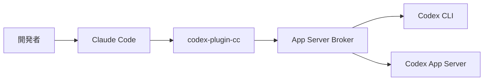
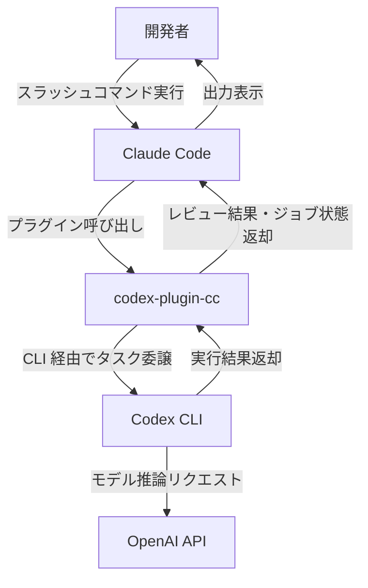
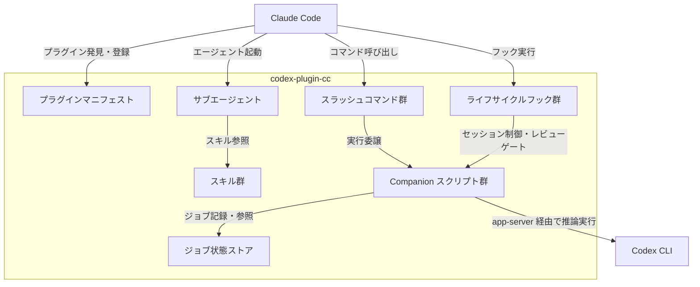
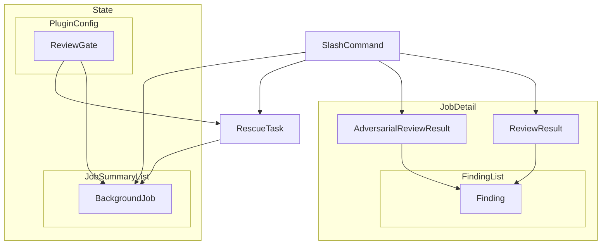
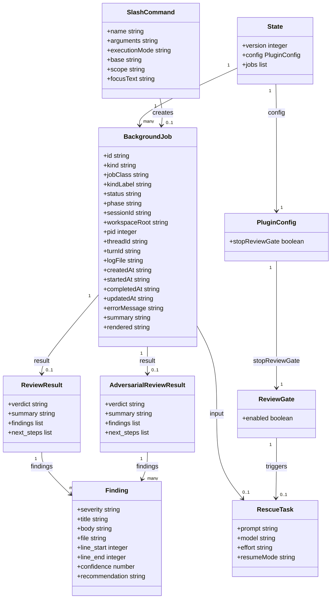
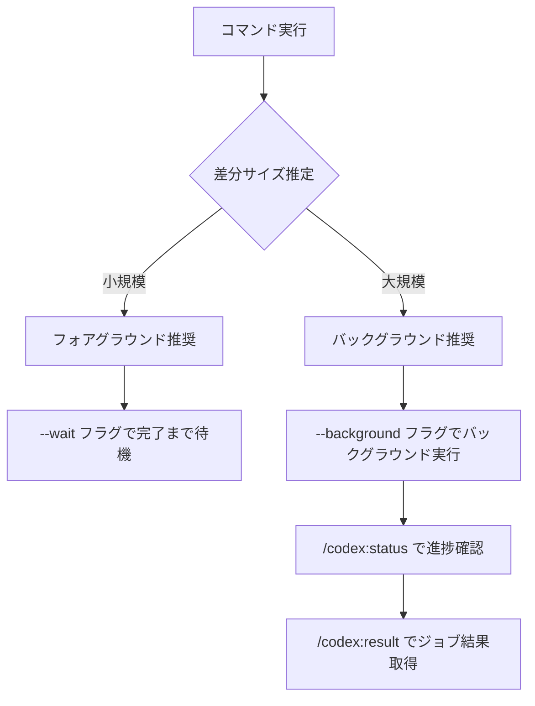

## 概要

Claude Code を日常的に使っている開発者にとって、「別の AI にもコードをチェックさせたい」と感じる場面は少なくありません。codex-plugin-cc は、そのニーズに応える OpenAI 公式の Claude Code プラグインです。

2026年3月31日に Apache 2.0 ライセンスでオープンソース公開されました。Claude Code のセッション内から、OpenAI Codex のコードレビュー機能とタスク委譲（rescue）機能をスラッシュコマンドで利用できます。

既存の Codex CLI のインストール・認証・設定をそのまま引き継ぐため、追加の環境構築は最小限で済みます。ツールを切り替えることなく、Claude Code 上で Codex の機能を活用できます。

### 関連技術との関係



| 要素名            | 説明                                                           |
| ----------------- | -------------------------------------------------------------- |
| 開発者            | Claude Code セッション内でスラッシュコマンドを実行するユーザー |
| Claude Code       | Anthropic 製のターミナルベース AI コーディング環境             |
| codex-plugin-cc   | Claude Code に Codex 機能を追加するプラグイン                  |
| App Server Broker | Codex への並列リクエストを直列化するプロキシ                   |
| Codex CLI         | ローカルにインストール済みの OpenAI Codex コマンドラインツール |
| Codex App Server  | Codex が内部で起動するアプリケーションサーバー                 |

codex-plugin-cc はローカルの Codex CLI を通じてリクエストを委譲します。独立したランタイムは持ちません。

## 特徴

- **3 つのコア機能**: 通常レビュー・adversarial（敵対的）レビュー・タスク委譲をスラッシュコマンドで提供
- **フォアグラウンド・バックグラウンド実行**: `--wait` / `--background` フラグによる実行モード選択（実装上は常にフォアグラウンド実行となる可能性あり。詳細は利用方法セクションを参照）
- **ジョブ管理**: バックグラウンドジョブの状態確認・結果取得・キャンセルをコマンドで操作可能
- **レビューゲート**: Claude が変更を確定する前に Codex レビューを自動実行するオプション機能
- **既存設定の継承**: ローカルの Codex CLI の認証・設定・MCP セットアップをそのまま利用
- **App Server Broker パターン**: 単一の Codex プロセスへの接続を多重化し、複数ジョブの並行実行でも起動オーバーヘッドが発生しない
- **戦略的な競合連携**: Claude Code が市場シェアを持つ環境へ OpenAI が公式にプラグインを提供

### 類似ツールとの比較

| 比較項目       | codex-plugin-cc                            | Codex CLI 単体       | DIY 実装 - codex exec | cc-codex-plugin 非公式版         |
| -------------- | ------------------------------------------ | -------------------- | --------------------- | -------------------------------- |
| 実行方式       | Claude Code 内スラッシュコマンド           | ターミナル直接実行   | SKILL.md カスタム設定 | Claude Code 内スラッシュコマンド |
| 提供元         | OpenAI 公式                                | OpenAI 公式          | ユーザー自作          | コミュニティ                     |
| リソース消費   | Broker による多重化で低コスト              | 毎回プロセス起動     | 設定依存              | 毎回プロセス起動                 |
| 対応機能       | レビュー・adversarial レビュー・タスク委譲 | Codex 全機能         | カスタマイズ可能      | レビュー・タスク委譲             |
| 起動速度       | Broker で常駐プロセスを再利用・高速        | 毎回コールドスタート | 設定依存              | コールドスタート                 |
| セットアップ   | スラッシュコマンド 1 本                    | npm install + 認証   | SKILL.md 手動設定     | 手動コピー                       |
| カスタマイズ性 | プラグイン設定の範囲内                     | 高い                 | 高い                  | 中程度                           |

### Claude Code 上で Codex を使う理由

| 観点             | 優位性                                                                                                       |
| ---------------- | ------------------------------------------------------------------------------------------------------------ |
| コンテキスト共有 | Claude Code のセッション内で実行するため、ワークスペースの Git コンテキストを共有した状態で Codex に委譲可能 |
| ワークフロー統合 | ツール切り替え不要。Claude のコード生成 → Codex のレビュー → Claude の修正を単一セッションで完結可能         |
| 二重チェック     | 異なる AI モデル（Claude と GPT-5-4）による独立したレビューで、単一モデルの盲点を補完可能                    |
| 自動品質ゲート   | レビューゲート機能により、Claude の変更を Codex が自動チェックする品質フローを構築可能                       |

### ユースケース別推奨

| ユースケース                                     | 推奨ツール                          | 理由                                         |
| ------------------------------------------------ | ----------------------------------- | -------------------------------------------- |
| Claude Code セッション内の日常的なコードレビュー | codex-plugin-cc                     | コンテキスト切り替え不要・セットアップが最小 |
| リリース前の詳細な品質監査                       | DIY 実装 - codex exec               | ループ動作を細かく制御可能                   |
| Codex 単独での調査・実装タスク                   | Codex CLI 単体                      | Codex の全機能にアクセス可能                 |
| Claude と Codex の二重チェックを自動化           | codex-plugin-cc（review gate 有効） | 自動品質ゲートとして機能                     |

## 構造

codex-plugin-cc の内部構造を [C4 model](https://c4model.com/) に基づき、3 段階の抽象度で描きます。システムコンテキスト図で外部アクターとの関係を俯瞰し、コンテナ図でプラグイン内の主要コンポーネントを分類し、コンポーネント図で個々のファイル粒度まで詳細化しています。

### システムコンテキスト図



| 要素名          | 説明                                                               |
| --------------- | ------------------------------------------------------------------ |
| 開発者          | Claude Code セッション内でコードレビューやタスク委譲を行うユーザー |
| Claude Code     | Anthropic 製のターミナル AI エージェント。プラグインシステムを搭載 |
| codex-plugin-cc | Claude Code 上で動作する OpenAI Codex 統合プラグイン               |
| Codex CLI       | ローカルにインストールされた OpenAI Codex のコマンドラインツール   |
| OpenAI API      | Codex CLI が推論リクエストを送信する OpenAI のクラウドサービス     |

### コンテナ図



| 要素名                 | 説明                                                                                     |
| ---------------------- | ---------------------------------------------------------------------------------------- |
| プラグインマニフェスト | marketplace.json と plugin.json で構成。Claude Code がプラグインを発見・登録する際に参照 |
| スラッシュコマンド群   | Markdown 形式で定義されたコマンド仕様。Claude Code のコマンドパレットに登録              |
| サブエージェント       | Claude Code が起動する専用エージェント定義。codex-rescue が該当                          |
| スキル群               | サブエージェントが参照する再利用可能な指示セット                                         |
| ライフサイクルフック群 | セッション開始・終了・停止時に Claude Code が自動実行するフック                          |
| Companion スクリプト群 | Node.js 製の実行スクリプト群。全コマンドのディスパッチと Codex CLI 連携を担当            |
| ジョブ状態ストア       | ワークスペースごとにジョブのメタデータとログをファイルシステムに永続化するストア         |

### コンポーネント図

```mermaid
graph TD
    subgraph スラッシュコマンド群
        CmdReview["commands/codex-review.md"]
        CmdAdversarial["commands/codex-adversarial-review.md"]
        CmdRescue["commands/codex-rescue.md"]
        CmdStatus["commands/codex-status.md"]
        CmdResult["commands/codex-result.md"]
        CmdCancel["commands/codex-cancel.md"]
        CmdSetup["commands/codex-setup.md"]
    end

    subgraph サブエージェント
        AgentRescue["agents/codex-rescue.md"]
    end

    subgraph スキル群
        SkillRuntime["skills/codex-cli-runtime"]
        SkillResult["skills/codex-result-handling"]
        SkillPrompting["skills/gpt-5-4-prompting"]
    end

    subgraph ライフサイクルフック群
        HookSession["hooks/session-lifecycle-hook.mjs"]
        HookStopGate["hooks/stop-review-gate-hook.mjs"]
    end

    subgraph Companionスクリプト群
        Dispatcher["codex-companion.mjs - ディスパッチャー"]
        AppServerBroker["app-server-broker.mjs - ブローカー"]
        AppServer["lib/app-server.mjs - app-server クライアント"]
        Git["lib/git.mjs - Git コンテキスト解決"]
        State["lib/state.mjs - 状態管理"]
        JobControl["lib/job-control.mjs - ジョブ制御"]
        TrackedJobs["lib/tracked-jobs.mjs - ジョブ追跡"]
        Prompts["lib/prompts.mjs - プロンプト読み込み"]
        Render["lib/render.mjs - 出力フォーマット"]
        Workspace["lib/workspace.mjs - ワークスペース解決"]
    end

    subgraph ジョブ状態ストア
        StateJSON["state.json - グローバルジョブ一覧"]
        JobFiles["jobs-id.json - 個別ジョブ詳細"]
        BrokerInfo["broker.json - ブローカー接続情報"]
        LogFiles["log.txt - 実行ログ"]
    end

    CodexCLI["Codex CLI"]

    CmdReview --> Dispatcher
    CmdAdversarial --> Dispatcher
    CmdRescue --> AgentRescue
    CmdStatus --> Dispatcher
    CmdResult --> Dispatcher
    CmdCancel --> Dispatcher
    CmdSetup --> Dispatcher

    AgentRescue --> SkillRuntime
    AgentRescue --> SkillResult
    AgentRescue --> SkillPrompting

    HookSession --> Dispatcher
    HookStopGate --> Dispatcher

    Dispatcher --> AppServerBroker
    Dispatcher --> Git
    Dispatcher --> State
    Dispatcher --> JobControl
    Dispatcher --> Prompts
    Dispatcher --> Render
    Dispatcher --> Workspace

    AppServerBroker --> AppServer
    JobControl --> TrackedJobs
    State --> StateJSON
    State --> JobFiles
    AppServerBroker --> BrokerInfo
    TrackedJobs --> LogFiles

    AppServer -->|JSON-RPC 2.0 over JSONL| CodexCLI
```



**スラッシュコマンド群**

| 要素名 | 説明 |
|---|---|
| commands/codex-review.md | 標準コードレビューを実行するコマンド定義 |
| commands/codex-adversarial-review.md | 設計の仮定を批判的に検証するアドバーサリアルレビューのコマンド定義 |
| commands/codex-rescue.md | 複雑なタスクを Codex サブエージェントに委譲するコマンド定義 |
| commands/codex-status.md | 実行中および完了済みジョブの状態を表示するコマンド定義 |
| commands/codex-result.md | 完了済みジョブの結果を表示するコマンド定義 |
| commands/codex-cancel.md | 実行中のバックグラウンドジョブを停止するコマンド定義 |
| commands/codex-setup.md | Node.js・npm・Codex CLI の導入確認とレビューゲート設定を行うコマンド定義 |

**サブエージェント・スキル群**

| 要素名 | 説明 |
|---|---|
| agents/codex-rescue.md | Codex CLI を用いてタスクを実行する専用サブエージェントの定義 |
| skills/codex-cli-runtime | サブエージェントが Codex CLI をワークスペースコンテキスト付きで呼び出すためのスキル |
| skills/codex-result-handling | Codex の実行結果を処理・フォーマットするためのスキル |
| skills/gpt-5-4-prompting | GPT-5-4 モデル向けのプロンプト戦略を定義するスキル |

**ライフサイクルフック群**

| 要素名 | 説明 |
|---|---|
| hooks/session-lifecycle-hook.mjs | SessionStart・SessionEnd イベントでセッション ID の設定とブローカーの終了を行うフック |
| hooks/stop-review-gate-hook.mjs | Stop イベントで Claude が停止する前に Codex レビューを実行するレビューゲートフック |

**Companion スクリプト群**

| 要素名 | 説明 |
|---|---|
| codex-companion.mjs | 全スラッシュコマンドのエントリポイント。引数を解析し各ハンドラーに振り分け |
| app-server-broker.mjs | 共有 Codex app-server インスタンスへのリクエストを多重化するブローカー |
| lib/app-server.mjs | Codex CLI の app-server を stdio または Unix ソケット経由で起動・通信するクライアント |
| lib/git.mjs | レビュー対象のワーキングツリーやブランチ差分を解決するモジュール |
| lib/state.mjs | ジョブのメタデータをワークスペースごとにファイルに読み書きするモジュール |
| lib/job-control.mjs | フォアグラウンド・バックグラウンドのジョブ起動とライフサイクル管理を行うモジュール |
| lib/tracked-jobs.mjs | ジョブの進行状態を監視し状態ファイルをアトミックに更新するモジュール |
| lib/prompts.mjs | prompts/ ディレクトリからテンプレートを読み込みコンテキストを埋め込むモジュール |
| lib/render.mjs | Codex の出力を Claude Code の表示形式に整形するモジュール |
| lib/workspace.mjs | カレントディレクトリのハッシュからワークスペース固有の状態ディレクトリを解決するモジュール |

**ジョブ状態ストア**

| 要素名 | 説明 |
|---|---|
| state.json | ワークスペース内の全ジョブの ID と状態を管理する JSON ファイル |
| jobs-id.json | ジョブごとの status・phase・threadId・pid・elapsed を記録する JSON ファイル |
| broker.json | ブローカーの Unix ソケットパスと PID を記録し再接続を可能にするファイル |
| log.txt | バックグラウンドジョブの標準出力・標準エラーを記録するログファイル |

## データ

### 概念モデル



| 要素名                  | 説明                                                                                      |
| ----------------------- | ----------------------------------------------------------------------------------------- |
| SlashCommand            | ユーザーが Claude Code から実行するコマンド                                               |
| PluginConfig            | プラグイン全体の設定。ワークスペースごとに state.json に永続化                            |
| ReviewGate              | Claude 停止時に自動レビューを実行する機能。PluginConfig が保持                            |
| State                   | state.json に保存されるグローバル状態。PluginConfig と BackgroundJob サマリーリストを包含 |
| BackgroundJob           | 非同期実行されるジョブの実行状態。State に最大 50 件保持                                  |
| ReviewResult            | 標準コードレビューの出力。BackgroundJob の result フィールドに格納                        |
| AdversarialReviewResult | adversarial レビューの出力。Finding リストを保持                                          |
| Finding                 | レビューで検出された個別の指摘事項                                                        |
| RescueTask              | rescue コマンドで Codex に委譲するタスク。BackgroundJob として実行                        |

### 情報モデル



| 要素名                  | 説明                                                                                                                                                                                    |
| ----------------------- | --------------------------------------------------------------------------------------------------------------------------------------------------------------------------------------- |
| SlashCommand            | name はコマンド識別子。executionMode は "foreground" または "background"。scope は "auto" / "working-tree" / "branch"                                                                   |
| PluginConfig            | stopReviewGate が true のとき ReviewGate が有効化                                                                                                                                       |
| State                   | version はスキーマバージョン（現在は 1）。jobs はサマリーリストで最大 50 件に自動剪定                                                                                                   |
| BackgroundJob           | id は用途別プレフィックスのユニーク識別子。status は queued / running / completed / failed / cancelled。kind は "review" / "adversarial-review" / "task"。jobClass は "review" / "task" |
| ReviewResult            | verdict は "approve" または "needs-attention"。review-output.schema.json で定義                                                                                                         |
| AdversarialReviewResult | ReviewResult と同一スキーマ。adversarial プロンプトで生成                                                                                                                               |
| Finding                 | severity は "critical" / "high" / "medium" / "low"。confidence は 0.0〜1.0 の数値                                                                                                       |
| ReviewGate              | enabled のみが state.json に永続化。decision・reason・timeoutMs は stop-review-gate-hook.mjs の実行時にのみ存在するランタイム値                                                         |
| RescueTask              | effort は "none" / "minimal" / "low" / "medium" / "high" / "xhigh"。resumeMode は "resume-last" / "fresh"                                                                               |

## 構築方法

### 前提条件

| 項目        | 要件                                                                 |
| ----------- | -------------------------------------------------------------------- |
| Node.js     | 18.18 以上                                                           |
| OpenAI 認証 | ChatGPT サブスクリプション（無料プランを含む）または OpenAI API キー |
| Claude Code | インストール済み                                                     |
| 使用量      | プラグイン経由の Codex 利用は Codex の利用制限に含まれる             |

### バージョン確認

```bash
# Node.js バージョン確認
node --version
# 出力例: v22.x.x (18.18 以上であること)

# Codex CLI バージョン確認 (インストール後)
codex --version
```

### プラグイン経由インストール（推奨）

Claude Code セッション内で以下を順番に実行します。

```bash
# Step 1: OpenAI マーケットプレイスを追加
/plugin marketplace add openai/codex-plugin-cc

# Step 2: Codex プラグインをインストール
/plugin install codex@openai-codex

# Step 3: プラグインをリロード
/reload-plugins

# Step 4: セットアップを確認
/codex:setup
```

`/codex:setup` は Node.js・npm・Codex CLI の存在と認証状態を検証します。npm が利用可能な場合、Codex CLI が未インストールであれば自動インストールを提案します。

### Codex CLI 手動インストール（任意）

```bash
npm install -g @openai/codex
```

### 認証

```bash
# Claude Code セッション内で実行
!codex login
```

同一マシン上で Codex に認証済みの場合、そのアカウントがそのまま使用されます。`/codex:setup` が未認証を報告した場合のみ `!codex login` を実行してください。

### インストール確認

セットアップ成功後に以下を確認します。

- `/codex:review` などのスラッシュコマンドが利用可能になっていること
- `/agents` に `codex:codex-rescue` サブエージェントが表示されていること

## 利用方法

### スラッシュコマンド一覧

| コマンド                    | 機能                             |
| --------------------------- | -------------------------------- |
| `/codex:setup`              | 環境検証・レビューゲート設定     |
| `/codex:review`             | 標準コードレビュー               |
| `/codex:adversarial-review` | 批判的・敵対的コードレビュー     |
| `/codex:rescue`             | Codex へのタスク委譲             |
| `/codex:status`             | バックグラウンドジョブの状態確認 |
| `/codex:result`             | 完了ジョブの結果表示             |
| `/codex:cancel`             | 実行中ジョブのキャンセル         |

### /codex:setup

環境の検証とレビューゲートの設定を行います。

```bash
# 基本実行（検証のみ）
/codex:setup

# レビューゲートを有効化
/codex:setup --enable-review-gate

# レビューゲートを無効化
/codex:setup --disable-review-gate
```

| オプション              | 説明                                                              |
| ----------------------- | ----------------------------------------------------------------- |
| `--enable-review-gate`  | Claude Code の停止前に Codex レビューを自動実行するフックを有効化 |
| `--disable-review-gate` | レビューゲートを無効化                                            |

### /codex:review

差分に対して標準的な Codex コードレビューを実行します。

> **制約:** `/codex:review` はファイルパスやフォーカステキストを引数に取れません。常に Git ワーキングツリー全体の差分（または `--base` 指定時のブランチ間差分）をレビュー対象とします。特定ファイルのみをレビューしたい場合は `/codex:rescue` で委譲してください。

```bash
# 基本実行
/codex:review

# ベースブランチを指定して比較
/codex:review --base main

# フォアグラウンドで完了まで待機
/codex:review --wait

# バックグラウンドで実行
/codex:review --background

# ベースブランチ指定 + バックグラウンド実行
/codex:review --base main --background
```

| オプション     | 説明                                       |
| -------------- | ------------------------------------------ |
| `--base <ref>` | 比較対象のブランチまたはコミット参照を指定 |
| `--wait`       | 完了まで待機してから制御を返す             |
| `--background` | バックグラウンドタスクとして実行           |

> **注意（README と実装の乖離）:** README では `--wait` / `--background` による実行モード選択が記載されていますが、現時点の実装では常に `runForegroundCommand()` を呼び出します。実際のバックグラウンド実行は Claude Code 側の `Bash(..., run_in_background: true)` で実現されます。

Claude Code のスラッシュコマンド定義側で差分サイズを推定し、実行モードを推奨する仕組みが組み込まれています。

#### 通常レビューのプロンプト構造

通常レビューでは、以下の観点でコードを評価します。

- バグ・論理エラー・境界条件の見落とし
- パフォーマンスのボトルネック
- セキュリティ上の懸念
- コードの可読性・保守性
- テストカバレッジの不足

verdict は以下の基準で判定されます。

| verdict         | 判定基準                               |
| --------------- | -------------------------------------- |
| approve         | critical / high の finding が 0 件     |
| needs-attention | critical / high の finding が 1 件以上 |

### /codex:adversarial-review

設計上の決定と前提に意図的に異議を唱え、脆弱性や見落としを洗い出す批判的レビューを実行します。通常レビューでは見逃しやすいエッジケースやセキュリティリスクの検出に適しています。

```bash
# 基本実行
/codex:adversarial-review

# ベースブランチ指定 + フォーカステキスト
/codex:adversarial-review --base main キャッシュとリトライの設計が適切か検証してください

# バックグラウンドで競合状態を調査
/codex:adversarial-review --background 競合状態とアプローチの妥当性を調査してください

# 待機モードで権限とテナント境界を確認
/codex:adversarial-review --wait 認証・権限・テナント分離の境界を確認してください

# ロールバック安全性の検証
/codex:adversarial-review ロールバック安全性を検証し不可逆な状態変更を特定してください
```

| オプション     | 説明                                       |
| -------------- | ------------------------------------------ |
| `--base <ref>` | 比較対象のブランチまたはコミット参照を指定 |
| `--wait`       | 完了まで待機してから制御を返す             |
| `--background` | バックグラウンドタスクとして実行           |
| `focus_text`   | レビューの焦点を指定するフリーテキスト     |

#### adversarial レビューのプロンプト構造

adversarial レビューでは、以下の攻撃面を優先的に検査します。

- 認証・権限・テナント分離・信頼境界
- データ損失・破損・重複・不可逆な状態変更
- ロールバック安全性・リトライ・部分的失敗・冪等性のギャップ
- 競合状態・順序の前提・古い状態・再入可能性
- 空状態・null・タイムアウト・劣化した依存の振る舞い

各 finding は以下の 4 点を回答します。

- 何が起こりうるか
- なぜ脆弱か
- 影響の大きさ
- リスク低減の具体策

### /codex:rescue

複雑なデバッグや実装タスクを Codex サブエージェントに委譲します。

> **実行経路:** `/codex:rescue` は他のスラッシュコマンドと異なり、`codex-companion.mjs` のディスパッチャーを経由しません。Claude Code が `agents/codex-rescue.md` で定義されたサブエージェントを直接起動し、そのエージェントがスキル経由で Codex CLI を呼び出します。

```bash
# 基本実行
/codex:rescue

# バックグラウンドで実行
/codex:rescue --background

# モデルを指定して実行
/codex:rescue --model o3

# 推論レベルを指定
/codex:rescue --effort high

# 前回のタスクを継続
/codex:rescue --resume
```

| オプション         | 説明                               |
| ------------------ | ---------------------------------- |
| `--background`     | バックグラウンドタスクとして実行   |
| `--wait`           | 完了まで待機してから制御を返す     |
| `--model <name>`   | 使用する Codex モデルを指定        |
| `--effort <level>` | 推論レベルを指定                   |
| `--resume`         | 現在のセッションの前回タスクを継続 |

#### --effort レベルの目安

| レベル  | 推奨ユースケース                                   | 推論の深さ   |
| ------- | -------------------------------------------------- | ------------ |
| none    | 単純なファイル操作・定型タスク                     | 最小限の推論 |
| minimal | 軽微なバグ修正・ワンライナー変更                   | 浅い推論     |
| low     | 小規模なリファクタリング                           | 標準的な推論 |
| medium  | 複数ファイルにまたがる機能追加                     | 中程度の推論 |
| high    | 複雑なデバッグ・設計判断を伴うタスク               | 深い推論     |
| xhigh   | アーキテクチャレベルの調査・大規模リファクタリング | 最大限の推論 |

#### バックグラウンド実行の仕組み

`codex-companion.mjs` が `detached: true` オプション付きで Node.js の child_process を spawn します。`lib/job-control.mjs` がジョブのライフサイクル管理を、`lib/tracked-jobs.mjs` がファイルシステム経由の状態ファイルのアトミック更新を担います。

親プロセス（Claude Code セッション）が終了してもジョブは継続実行されます。次回セッション開始時に `/codex:status` で結果を取得できます。

### /codex:status, /codex:result, /codex:cancel

```bash
# ジョブ一覧の表示
/codex:status

# 完了ジョブの結果取得
/codex:result <job-id>

# 実行中ジョブのキャンセル
/codex:cancel <job-id>
```

### 実行モードの選択フロー



## 運用

### 起動・停止

プラグインは Claude Code のセッションと同じライフサイクルで動作します。セッション開始時にブローカープロセスが自動起動し、終了時に停止します。

| 操作                     | 方法                                                   |
| ------------------------ | ------------------------------------------------------ |
| ブローカーの状態確認     | `$STATE_DIR/broker.json` に PID とエンドポイントが記録 |
| ブローカーの手動リセット | `broker.json` を削除すると次回コマンド実行時に再起動   |
| 設定の再確認             | `/codex:setup` を再実行するとブローカーを再初期化      |

`$STATE_DIR` は `$CLAUDE_PLUGIN_DATA/state/<workspace-slug>-<hash>/` です（`CLAUDE_PLUGIN_DATA` 未設定時は OS の tmpdir 配下）。

### 状態確認

```bash
# 実行中・直近のジョブ一覧を表示
/codex:status

# 完了したジョブの最終出力を表示
/codex:result <job-id>
```

### ログ確認

| パス                       | 内容                                     |
| -------------------------- | ---------------------------------------- |
| `$STATE_DIR/<job-id>.log`  | ジョブ実行ログ（ISO タイムスタンプ付き） |
| `$STATE_DIR/<job-id>.json` | ジョブ詳細（状態・終了コード）           |
| `$STATE_DIR/state.json`    | 全ジョブのサマリーと設定フラグ           |
| `$STATE_DIR/broker.json`   | ブローカーの PID とエンドポイント        |

### 更新

```bash
# Codex CLI の更新
npm update -g @openai/codex

# プラグイン自体の更新
/plugin update codex
```

### ジョブ管理

バックグラウンドジョブのライフサイクルは `queued → running → completed / failed / cancelled` の順に遷移します。

```bash
# 実行中のジョブを停止
/codex:cancel <job-id>
```

> **注意:** README では `--background` / `--wait` フラグが記載されていますが、実際のバックグラウンド実行は Claude Code 側の仕組みで実現されます。

ジョブ履歴は最新 50 件に自動整理されます。手動でリセットする場合は `$STATE_DIR/` 配下のジョブファイルを削除します。

### レビューゲートの操作

```bash
# レビューゲートを有効化
/codex:setup --enable-review-gate

# レビューゲートを無効化
/codex:setup --disable-review-gate
```

レビューゲートを有効にすると、Claude の停止前に `stop-review-gate-hook.mjs` が実行されます。Codex のレビュー結果が `BLOCK:` で始まる場合、セッションが継続されます。タイムアウト（15 分）時はデフォルトでブロックします。

### 設定ファイル

```toml
# ~/.codex/config.toml（ユーザー設定: 全プロジェクト共通）
model = "gpt-5.4-mini"
model_reasoning_effort = "xhigh"

# .codex/config.toml（プロジェクト設定: 信頼済みプロジェクトのみ有効）
openai_base_url = "https://your-endpoint.example.com/v1"
```

## ベストプラクティス

### フォアグラウンドとバックグラウンドの使い分け

| 条件                           | 推奨モード           | コマンド例                   |
| ------------------------------ | -------------------- | ---------------------------- |
| 変更が 1〜2 ファイル以内       | フォアグラウンド     | `/codex:review --wait`       |
| 変更が大規模・複数ファイル     | バックグラウンド     | `/codex:review --background` |
| 重要なコードパス・認証ロジック | adversarial レビュー | `/codex:adversarial-review`  |

### コマンドの使い分け: review vs rescue

`/codex:review` と `/codex:adversarial-review` は Git 差分全体をレビューする用途に特化しています。以下のケースでは `/codex:rescue` が適しています。

| ケース                                       | 推奨コマンド    | 理由                                                                            |
| -------------------------------------------- | --------------- | ------------------------------------------------------------------------------- |
| 特定ファイルの内容をレビューしたい           | `/codex:rescue` | review 系はファイル指定不可。rescue ならプロンプトで対象を指示可能              |
| ドキュメントの技術的正確性を検証したい       | `/codex:rescue` | Codex がソースコードを実際に読み、README や仕様との乖離を検出可能               |
| Git に未追跡のファイルを検査したい           | `/codex:rescue` | review 系は Git 差分ベースのため、未追跡ファイル単体の詳細検査に向かない        |
| Git 差分が大きすぎて review がクラッシュする | `/codex:rescue` | review 系は差分全体を取得するため ENOBUFS が発生しうる。rescue なら対象を絞れる |

### CI/CD 連携

- Codex CLI は `~/.codex/config.toml` の認証情報を引き継ぎ
- CI 環境では環境変数またはプロジェクト単位の `.codex/config.toml` を使用
- プロジェクト設定は信頼済みプロジェクトのみで有効

### レビューゲートの運用

- レビューゲートは Claude と Codex のループを発生させる可能性あり
- 有効化はアクティブに監視できるセッションのみに限定
- 使用量の急激な消費に注意

### スレッドの継続性

```bash
# 前回のスレッドを継続
/codex:rescue --resume

# 新規スレッドで開始
/codex:rescue --fresh
```

再開可能なスレッドがある場合、継続か新規開始かを確認するプロンプトが表示されます。

## トラブルシューティング

### 頻出エラーと対処

| 症状                               | 原因                                 | 対処                                                  |
| ---------------------------------- | ------------------------------------ | ----------------------------------------------------- |
| `/codex:*` コマンドが存在しない    | プラグインがロードされていない       | `/reload-plugins` を実行                              |
| `Codex not found`                  | Codex CLI が未インストール           | `/codex:setup` を実行し、npm によるインストールを選択 |
| 認証エラー・ログイン切れ           | Codex の認証情報が期限切れ           | `!codex login` を実行して再認証                       |
| バックグラウンドジョブが応答しない | ブローカープロセスがクラッシュ       | `$STATE_DIR/broker.json` を削除して再起動             |
| レビューゲートがブロックし続ける   | タイムアウトまたはレビュー結果が不正 | `/codex:setup --disable-review-gate` で無効化         |
| Node.js バージョンエラー           | Node.js 18.18 未満                   | Node.js を 18.18.0 以上に更新                         |
| カスタムエンドポイントへの接続失敗 | `openai_base_url` が未設定           | `.codex/config.toml` に `openai_base_url` を設定      |
| ジョブが `failed` になる           | 依存関係不足・認証失敗               | `$STATE_DIR/<job-id>.log` でエラーの詳細を確認        |

### 診断手順

```bash
# 1. 環境の確認
/codex:setup

# 2. 認証の確認と再認証
!codex login

# 3. ジョブの状態確認
/codex:status

# 4. 特定ジョブのログ確認
cat $STATE_DIR/<job-id>.log

# 5. プラグインの再読み込み
/reload-plugins
```

### Git 差分が大きい場合のエラー

ワーキングツリーに未追跡ファイルや大量の変更がある状態で `/codex:review` や `/codex:adversarial-review` を実行すると、Git 差分の取得時に `ENOBUFS`（バッファオーバーフロー）が発生する場合があります。

| 症状                    | 原因                               | 対処                                                                                    |
| ----------------------- | ---------------------------------- | --------------------------------------------------------------------------------------- |
| `spawnSync git ENOBUFS` | ワーキングツリーの差分が大きすぎる | `--base` でブランチを絞る、不要な変更を stash する、または `/codex:rescue` で対象を限定 |

### レビューゲートループの緊急停止

レビューゲートが Claude と Codex の無限ループを引き起こした場合、以下の手順で停止します。

```bash
# ブローカープロセスを強制停止
kill $(cat $STATE_DIR/broker.json | python3 -c "import sys,json; print(json.load(sys.stdin)['pid'])")

# ブローカー状態ファイルを削除して再起動を防止
rm $STATE_DIR/broker.json

# レビューゲートを無効化（次回セッション用）
/codex:setup --disable-review-gate
```

### バージョン整合性の確認

```bash
# Node.js のバージョン確認（18.18.0 以上が必要）
node --version

# Codex CLI のバージョン確認
codex --version

# codex-plugin-cc のバージョン確認
/plugin list
```

## まとめ

codex-plugin-cc は、Claude Code のセッション内から OpenAI Codex のコードレビューとタスク委譲を利用するための公式プラグインです。異なる AI モデルによる二重チェックを、ツール切り替えなしで実現できる点が最大の特徴です。

本記事では、App Server Broker による低オーバーヘッドな多重化アーキテクチャ、レビューゲートによる自動品質チェック、そしてトラブルシューティングまでを網羅的に解説しました。まずは `/codex:setup` でセットアップし、日常のコードレビューに `/codex:review` を組み込むところから始めてみてください。

この記事が少しでも参考になった、あるいは改善点などがあれば、ぜひリアクションやコメント、SNSでのシェアをいただけると励みになります！

## 参考リンク

- 公式ドキュメント
  - [Codex Plugins - OpenAI Developers](https://developers.openai.com/codex/plugins)
  - [Introducing Codex Plugin for Claude Code - OpenAI Developer Community](https://community.openai.com/t/introducing-codex-plugin-for-claude-code/1378186)

- GitHub
  - [openai/codex-plugin-cc](https://github.com/openai/codex-plugin-cc)
  - [plugins/codex directory](https://github.com/openai/codex-plugin-cc/tree/main/plugins/codex)
  - [marketplace.json](https://github.com/openai/codex-plugin-cc/blob/main/.claude-plugin/marketplace.json)
  - [hooks.json](https://github.com/openai/codex-plugin-cc/blob/main/plugins/codex/hooks/hooks.json)
  - [codex-companion.mjs](https://github.com/openai/codex-plugin-cc/blob/main/plugins/codex/scripts/codex-companion.mjs)
  - [review-output.schema.json](https://github.com/openai/codex-plugin-cc/blob/main/plugins/codex/schemas/review-output.schema.json)
  - [state.mjs](https://github.com/openai/codex-plugin-cc/blob/main/plugins/codex/scripts/lib/state.mjs)
  - [tracked-jobs.mjs](https://github.com/openai/codex-plugin-cc/blob/main/plugins/codex/scripts/lib/tracked-jobs.mjs)
  - [job-control.mjs](https://github.com/openai/codex-plugin-cc/blob/main/plugins/codex/scripts/lib/job-control.mjs)
  - [stop-review-gate-hook.mjs](https://github.com/openai/codex-plugin-cc/blob/main/plugins/codex/scripts/stop-review-gate-hook.mjs)
  - [codex-plugin-cc README.md](https://github.com/openai/codex-plugin-cc/blob/main/README.md)

- 記事
  - [openai/codex-plugin-cc - DeepWiki](https://deepwiki.com/openai/codex-plugin-cc)
  - [OpenAI Releases Official Claude Code Plugin — What codex-plugin-cc Means - SmartScope](https://smartscope.blog/en/blog/codex-plugin-cc-openai-claude-code-2026/)
