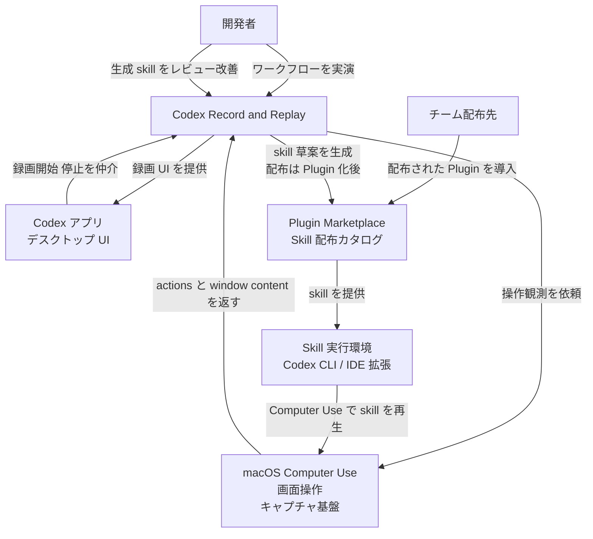
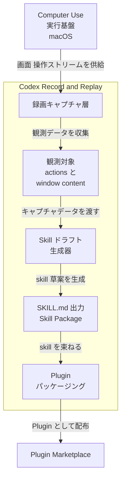
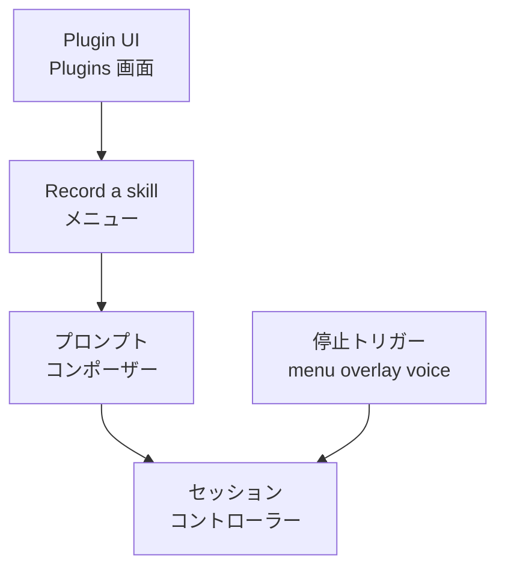
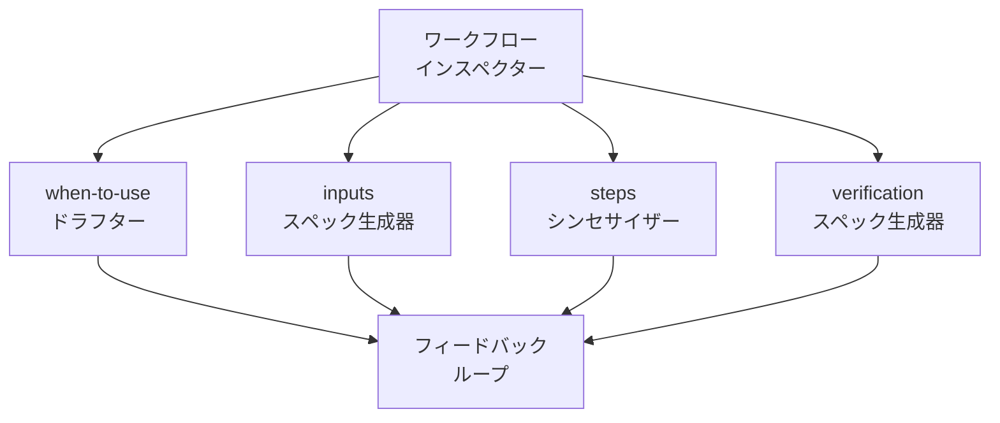
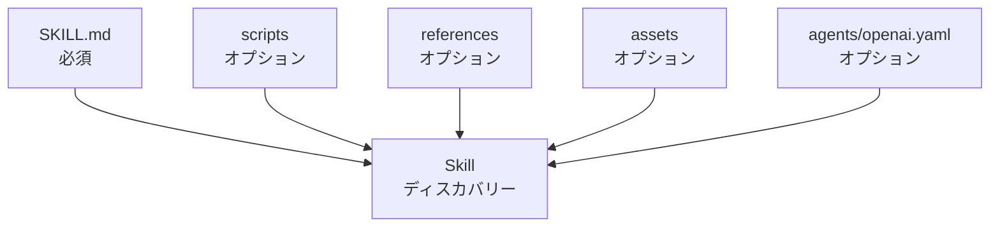
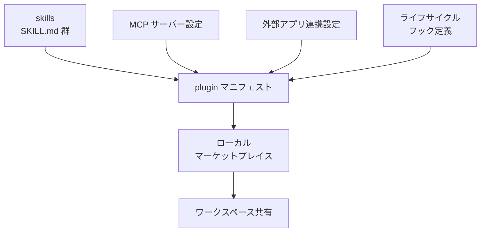
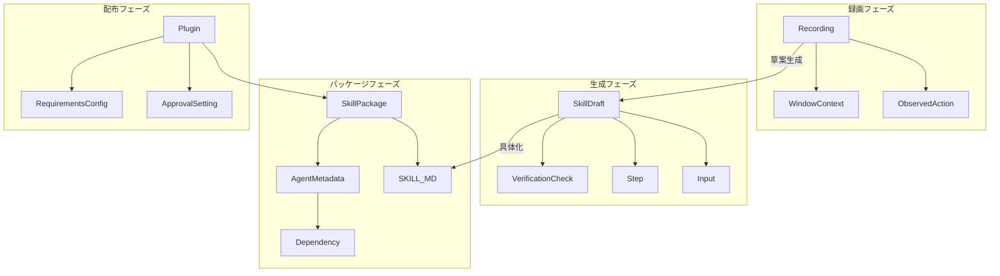
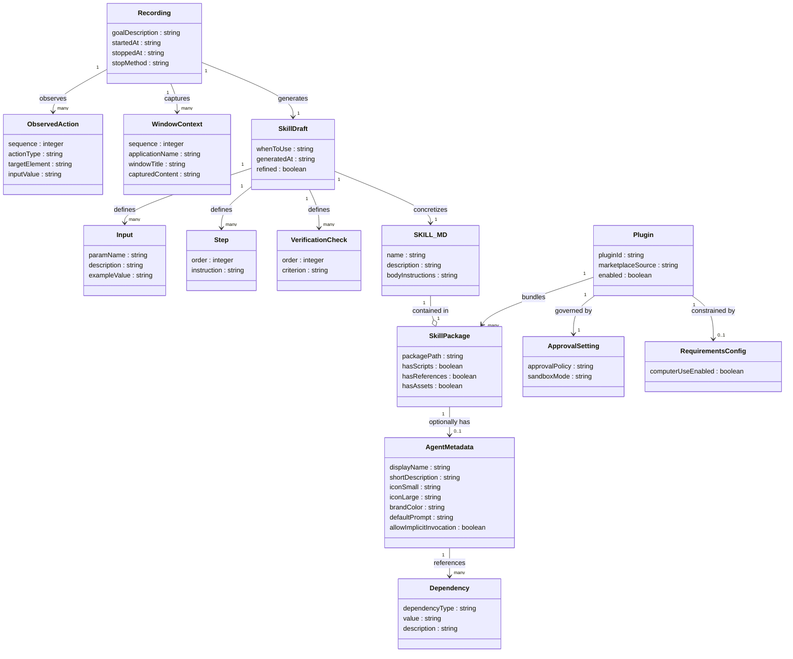

OpenAI Codex の Record & Replay は、Mac 上のワークフローを一度実演するだけで、Codex がその操作を観察・解析し、再利用可能な Skill の草案を自動生成する機能です。「手順を文章で書く」工程を「操作を実演する」工程に置き換えることで、暗黙知に依存した反復作業を検証付きの形式知へ変換します。2026 年 6 月 18 日に Codex アプリ 26.616 / `@openai/codex@0.141.0` でリリースされました。本記事は、この機能の構造・データモデル・構築方法・利用方法・運用までを、2026 年 6 月時点の公式ドキュメント (developers.openai.com/codex) を一次情報として整理します。地域制限など変動しうる情報は、参照時点を前提に確認してください。

## 概要

Record & Replay は、OpenAI Codex アプリに 2026 年 6 月 18 日 (Codex アプリ 26.616 / CLI `@openai/codex@0.141.0`) で追加された Skill オーサリング支援機能です。キャッチフレーズは「Show Codex a workflow once and turn it into a reusable skill」です。

ユーザーが Mac 上でワークフローを一度実演すると、Codex が操作とウィンドウ内容を観察し、再利用可能な Skill の草案を起草します。生成された Skill は従来と同じ SKILL.md 形式で出力され、そのまま実行したり、Plugin として配布したりできます。

### Codex エコシステムにおける位置づけ

Record & Replay は単独の機能ではなく、Codex の Skill / Plugin / Computer Use という 3 つの基盤の上に成り立ちます。

| 要素 | 説明 |
|---|---|
| Skill | タスク固有の能力パッケージ。命令・リソース・スクリプトで構成するオーサリング単位 |
| Plugin | Skill・App 連携・MCP サーバーを束ねた配布単位。マーケットプレイスで共有 |
| Computer Use | Codex が GUI を観察・操作する基盤機能 (公式上 macOS / Windows 対応)。Record & Replay の前提 (Record & Replay 自体は現時点 macOS のみ) |
| Record & Replay | 画面録画から Skill 草案を自動生成するオーサリング支援機能 |

Record & Replay は「Skill を書く工程」を代替する機能です。生成物は Skill、配布形態は Plugin という既存の枠組みにそのまま乗ります。

### 対象ユースケース

公式が想定するのは「繰り返し作業」「個人の好みに依存するワークフロー」「説明より実演が効果的な作業」です。具体例を挙げます。

| ユースケース | 概要 |
|---|---|
| 経費申請 | 経費入力フォームへの記入・送信フロー |
| 定型予約 | 外部サービスでの繰り返し予約操作 |
| Issue 作成 | プロジェクト固有の設定が必要な Issue の起票 |
| コンテンツ公開 | 動画・記事の投稿・設定フロー |
| レポート取得 | 定期的なレポートのダウンロード操作 |

これらは共通して「手順を言語化するより、実際にやって見せる方が速い」性質を持ちます。

## 特徴

- **一度の実演で Skill を生成します**: ユーザーが Mac 上で操作するだけで、Codex が操作とウィンドウ内容を観察し、Skill 草案を起草します。
- **生成 Skill を検査・編集できます**: 生成直後に内容を確認し、追加の改善指示を出せます。固定的な自動化スクリプトと異なり、人間の監督と調整を前提に設計されています。
- **生成 Skill は 4 つの要素で構成されます**: 「使用時機 (when to use)」「必要な入力 (inputs)」「実行ステップ (steps)」「検証方法 (result verification)」を含みます。
- **再生時は Computer Use と既存ツールを組み合わせます**: Replay は Computer Use・ブラウザ操作・接続済み Plugin を組み合わせて実行します。
- **macOS 専用で Computer Use が必須です**: 現時点では macOS のみ対応し、Computer Use が有効な環境でのみ利用できます。
- **組織レベルで無効化できます**: `requirements.toml` の `computer_use = false` で、Record & Replay を含む Computer Use 関連機能を無効化できます。
- **チーム配布は Plugin 化が推奨です**: 個人ワークフローの自動化には Record & Replay が適し、チーム横断で安定配布する場合は独立した Plugin として構築することが公式推奨です。
- **地理的制限があります**: 初期提供では EEA・英国・スイスが対象外です (現行ステータスは変動する可能性があります)。

### Skill オーサリング手段の比較

Record & Replay は、既存の Skill オーサリング手段に「録画」という入力経路を加えます。

| 比較項目 | 手書き SKILL.md | $skill-creator | Record & Replay |
|---|---|---|---|
| 入力形式 | テキスト (Markdown) | 対話型 Q&A (テキスト) | 画面操作の録画 (macOS) |
| 暗黙知の捕捉 | 作者が明示する必要あり | 対話で引き出す | 操作そのものを観察・抽出 |
| 再現性 | 作者の記述精度に依存 | 対話品質に依存 | 実際の操作を下敷きにするため高い |
| 前提環境 | テキストエディタのみ | Codex が起動していれば可 | macOS + Computer Use 必須 |
| 配布単位 | SKILL.md ファイル | SKILL.md ファイル | SKILL.md ファイル (→ Plugin 化可) |
| 編集・修正 | 直接編集 | 直接編集 | 生成後に追加指示で改善 |
| 適した場面 | 手順が明確で文書化済み | 手順を整理しながら言語化したい | 手順の説明より実演が速い |

## 構造

Record & Replay の内部構造を C4 model の 3 段階で図解します。公式ドキュメントに内部実装の詳細図はないため、公式記述と生成フィールド一覧から導いた論理的構成を含みます。論理的構成の部分は「推定」と注記します。

### システムコンテキスト図



| 要素 | 説明 |
|---|---|
| 開発者 | ワークフローを一度実演し、skill 草案をレビューするアクター |
| チーム配布先 | Plugin Marketplace 経由で配布された skill を受け取るアクター |
| Codex Record and Replay | 実演を観測して再利用可能な skill を生成するシステム本体 |
| macOS Computer Use | 画面操作・ウィンドウ内容をキャプチャする OS レベルの実行基盤 |
| Codex アプリ | 録画 UI と Plugin 管理を提供するデスクトップアプリケーション |
| Plugin Marketplace | skill パッケージの登録・配布・インストールを担うカタログ基盤 |
| Skill 実行環境 | 生成された skill を呼び出し、Computer Use を含むツールで再生する実行環境 |

### コンテナ図



| 要素 | 説明 |
|---|---|
| 録画キャプチャ層 | macOS Computer Use から actions と window content のストリームを受け取る入力層 |
| 観測対象 | キャプチャ対象の 2 種類のデータ。actions は操作イベント、window content は画面状態 |
| Skill ドラフト生成器 | キャプチャデータを検査し、when-to-use / inputs / steps / verification の 4 要素を持つ skill 草案を生成するコア処理 |
| SKILL.md 出力 | 生成された SKILL.md と付随ファイルを含む skill パッケージ。ローカル配置または Plugin 化の起点 |
| Plugin パッケージング | skill を plugin マニフェストで包み、Marketplace への登録と配布を可能にする層 |
| Computer Use 実行基盤 | macOS 上で画面操作を実行・観測するプラットフォーム。Record 時はキャプチャ源、Replay 時は実行基盤 |

### コンポーネント図

主要コンテナを 4 つのコンポーネント群に分けて図解します。ワークフローインスペクターの内部分割は、公式記述「Codex inspects the captured workflow and drafts a skill」と生成フィールド一覧から導いた推定です。

#### 録画キャプチャ層のコンポーネント



| 要素 | 説明 |
|---|---|
| Plugin UI | Codex デスクトップアプリの Plugins 画面。Record a skill の起点 |
| Record a skill メニュー | + メニューから選択して録画モードへ遷移するエントリーポイント |
| プロンプトコンポーザー | Codex が初期プロンプト案を提示し、開発者がコンテキストを追加して送信する対話コンポーネント |
| セッションコントローラー | 録画の開始から停止までのライフサイクルを管理する制御コンポーネント |
| 停止トリガー | メニューバー / オーバーレイ / 音声指示の 3 経路で録画停止を受け付けるインターフェース |

#### Skill ドラフト生成器のコンポーネント



| 要素 | 説明 |
|---|---|
| ワークフローインスペクター | キャプチャした actions と window content を解析し、4 要素生成器に入力を供給するコア分析コンポーネント (推定) |
| when-to-use ドラフター | skill をいつ使うべきかの使用条件文を生成するサブコンポーネント |
| inputs スペック生成器 | skill 実行に必要な入力パラメーターの定義を生成するサブコンポーネント |
| steps シンセサイザー | 観測した操作手順を再実行可能なステップ列に変換するサブコンポーネント |
| verification スペック生成器 | 実行結果の検証基準を生成するサブコンポーネント |
| フィードバックループ | 草案生成後に開発者から追加改善指示を受け付け、再生成を繰り返す対話機構 |

#### SKILL.md 出力パッケージのコンポーネント



| 要素 | 説明 |
|---|---|
| SKILL.md | skill パッケージの必須ファイル。front matter に name と description、本文に手順を記述する。Record & Replay が自動生成する主出力物 |
| scripts | skill が呼び出す実行スクリプト群を格納するオプションディレクトリ |
| references | skill が参照するドキュメント・仕様書類を格納するオプションディレクトリ |
| assets | skill が使用する画像・設定ファイル等を格納するオプションディレクトリ |
| agents/openai.yaml | UI カスタマイズ・起動ポリシー制御・ツール依存宣言を行うオプションメタデータファイル |
| Skill ディスカバリー | リポジトリ / ユーザー / システムの階層順にスキャンパスを探索し、skill を発見・ロードする機構 |

#### Plugin パッケージングのコンポーネント



| 要素 | 説明 |
|---|---|
| plugin マニフェスト | Plugin の定義ファイル。name / version / description と各コンポーネントへのポインタを保持 |
| skills | Plugin に同梱する skill フォルダ群 |
| MCP サーバー設定 | Plugin が提供する MCP サーバーのコマンドと引数を定義する設定 |
| 外部アプリ連携設定 | GitHub / Slack / Google Drive 等の外部アプリ連携を設定する定義 |
| ライフサイクルフック定義 | インストール・起動等のライフサイクルイベントに紐づくコマンドを定義する設定 |
| ローカルマーケットプレイス | リポジトリまたはユーザーホームのカタログを用いたローカル配布経路 |
| ワークスペース共有 | Codex アプリから直接チームワークスペースへ Plugin を共有する配布経路 |

## データ

Record & Replay が扱うエンティティを、録画から配布までのライフサイクルに沿ってモデル化します。一次情報に明記された属性と、公式記述から補完した推定属性を区別します。

### 概念モデル



| 要素 | 説明 |
|---|---|
| Recording | ユーザーがワークフローを実演した 1 回の録画セッション |
| ObservedAction | 録画中に Codex が観測した 1 つの画面操作イベント |
| WindowContext | 操作時点のウィンドウ内容スナップショット |
| SkillDraft | 録画終了後に自動生成される Skill の草案 |
| Input | Skill 実行時にユーザーが渡す可変パラメータ |
| Step | Skill の実行手順の 1 ステップ |
| VerificationCheck | 実行結果を検証するための基準 |
| SkillPackage | SKILL.md とリソースをまとめたディレクトリパッケージ |
| SKILL_MD | Skill の定義ファイル (名前・説明・手順) |
| AgentMetadata | agents/openai.yaml で定義する UI と依存関係のメタデータ |
| Dependency | AgentMetadata が参照する外部ツール (MCP サーバー等) |
| Plugin | SkillPackage を配布可能な単位にまとめたもの |
| ApprovalSetting | コマンド実行時の承認ポリシー設定 |
| RequirementsConfig | 管理対象マシン向けのポリシー制約設定 |

### 情報モデル



主要エンティティの属性の出典を整理します。一次情報に明記された属性と、公式記述から補完した推定属性を区別します。

| エンティティ | 一次情報に明記された属性 | 推定・補完した属性 |
|---|---|---|
| Recording | goalDescription (録画前に入力する目標テキスト) | startedAt / stoppedAt / stopMethod (menu / overlay / voice) |
| ObservedAction | — | sequence / actionType (click / text-input / navigation) / targetElement / inputValue |
| WindowContext | — | sequence / applicationName / windowTitle / capturedContent |
| SkillDraft | whenToUse | generatedAt / refined |
| Input | paramName | description / exampleValue |
| Step | order | instruction |
| VerificationCheck | order | criterion |
| SKILL_MD | name / description / bodyInstructions | — |
| AgentMetadata | displayName / shortDescription / iconSmall / iconLarge / brandColor / defaultPrompt / allowImplicitInvocation | — |
| Dependency | dependencyType / value / description | — |
| Plugin | pluginId / marketplaceSource / enabled | — |
| ApprovalSetting | approvalPolicy / sandboxMode | — |
| RequirementsConfig | computerUseEnabled | — |

ObservedAction と WindowContext は「Codex が学習に必要とする actions と window content」という公式記述から導いた構造です。録画データの内部スキーマは公式に非公開のため、属性は推定です。

## 構築方法

### 前提条件

| 項目 | 要件 |
|---|---|
| OS | macOS のみ (Windows / Linux は対象外) |
| Codex アプリ | デスクトップアプリ必須 (Record & Replay の録画 UI を操作するため) |
| Computer Use 権限 | 画面収録 (Screen Recording) とアクセシビリティ (Accessibility) の両権限 |
| 地域制限 | 初期提供では EEA・英国・スイスを除外 |
| Codex CLI バージョン | 公式に最低バージョンの明示なし。最新版へ更新して利用 |

### Codex CLI のインストール

CLI は以下のいずれかでインストールします。

**スタンドアローンインストーラー (macOS / Linux):**
```bash
curl -fsSL https://chatgpt.com/codex/install.sh | sh
```

**npm 経由:**
```bash
npm install -g @openai/codex
```

**Homebrew 経由:**
```bash
brew install --cask codex
```

**最新版への更新:**

インストール済みリリースが self-update に対応していれば `codex update` で更新を確認・適用できます (デバッグビルドはリリースビルドの導入を促すメッセージを表示)。npm / Homebrew で導入した場合は、各インストールコマンドの再実行でも更新できます。

```bash
codex update
# または各インストール手段を再実行 (例: npm install -g @openai/codex@latest)
```

### Computer Use の有効化

Record & Replay は Computer Use を前提とします。有効化は「macOS のシステム権限付与」と「ポリシーによる利用可否制御」の 2 層に分かれます。

#### 1. macOS システム権限の付与 (必須)

Codex アプリの設定から Computer Use を開いてインストールし、macOS のシステム設定で以下 2 つの権限を Codex に許可します。

- プライバシーとセキュリティ → 画面収録
- プライバシーとセキュリティ → アクセシビリティ

#### 2. `requirements.toml` による組織制御 (管理者向け)

`requirements.toml` は、管理者がユーザー側で上書きできない制約を配布する設定ファイルです (approval policy・sandbox・feature の固定なども扱います)。その `[features].computer_use` で Computer Use の利用可否を宣言し、`computer_use = false` を設定すると Record & Replay も無効化されます。

```toml
# requirements.toml
[features]
computer_use = false
```

> `~/.codex/config.toml` の `[features]` テーブルには `computer_use` の明示的な掲載が確認できません (公式未明示)。利用可否の宣言は `requirements.toml` 側で行うのが公式記述に沿った扱いです。

参考までに、`config.toml` の `[features]` テーブルに掲載が確認できる項目を示します (`computer_use` はこの表に含まれません)。

| Feature | デフォルト | ステータス |
|---|---|---|
| `shell_snapshot` | true | Stable |
| `shell_tool` | true | Stable |
| `multi_agent` | true | Stable |
| `personality` | true | Stable |
| `hooks` | true | Stable |
| `fast_mode` | true | Stable |
| `unified_exec` | true (Windows を除く) | Stable |
| `memories` | false | Stable |
| `undo` | false | Stable |
| `codex_git_commit` | false | Experimental |
| `apps` | false | Experimental |
| `web_search` | true | Deprecated |
| `web_search_cached` | false | Deprecated |
| `web_search_request` | false | Deprecated |

## 利用方法

### 主要パラメータ・フラグ一覧

| パラメータ / フラグ | 設定場所 | 主な値 | 説明 |
|---|---|---|---|
| `computer_use` | `requirements.toml` の `[features]` | `true` / `false` | Computer Use の利用可否を宣言。`false` で Record & Replay も無効化 |
| `approval_policy` | `~/.codex/config.toml` | `untrusted` / `on-request` / `never` | シェル/ファイル操作で承認を求めるタイミングを制御 |
| `sandbox_mode` | `~/.codex/config.toml` | `read-only` / `workspace-write` / `danger-full-access` | シェル/ファイル操作の OS レベルの実行境界 |
| `allow_implicit_invocation` | `agents/openai.yaml` の `policy` | `true` / `false` | skill をタスク説明からの自動選択で起動可能にするか |
| `--sandbox`, `-s` | CLI フラグ | `read-only` / `workspace-write` / `danger-full-access` | 実行時のサンドボックスポリシーを上書き |
| `--ask-for-approval`, `-a` | CLI フラグ | 承認動作を指定 | 実行時の承認ポリシーを上書き |

### 録画の開始

1. Codex デスクトップアプリで Plugins パネルを開きます。
2. + メニューをクリックします。
3. Record a skill を選択します。
4. Codex がプロンプト案を提示します。録画する操作の目的・変動する入力値・注意点などのコンテキストをここで追記します。

> コンテキスト追加の例:
> - 「ファイル名は毎回異なる」
> - 「コピー先フォルダは引数で渡す」
> - 「ログイン情報は含めない」

5. 内容を確認して送信します。
6. 録画許可の確認に対して許可します。

### 録画の実行

許可後、Mac 上で実際のワークフローを実行します。Codex がウィンドウ内容と操作を観察します。録画中は以下に注意します。

- 機密情報・パスワードを含めません (公式: avoid secrets and sensitive data)。
- 短く完結した操作を心がけ、不要な寄り道を入れません。
- 可変な入力値は現実的なテストデータで代替します。
- タスクが完了したらすぐ停止します。

### 録画の停止

以下の 3 つの方法で停止できます。

| 方法 | 操作 |
|---|---|
| メニューバー | macOS メニューバーの Codex から停止を選択 |
| オーバーレイ | 画面上のオーバーレイ UI の停止ボタンをクリック |
| 音声指示 | 停止を音声で指示 |

### 生成 Skill のレビューと改善依頼

録画停止後、Codex は観察した操作を検査して Skill 草案を生成します。生成される Skill は以下のフィールドを持ちます。

| フィールド | 内容 |
|---|---|
| When to use | この skill をいつ使うべきかの説明 |
| Inputs | 実行に必要な入力値の定義 |
| Steps | 実行ステップの記述 |
| Result verification | 実行結果の検証方法 |

これら 4 要素は、生成される SKILL.md に以下のように反映されると考えられます (記述位置は公式に明示されていないため推定です)。

| 生成要素 | SKILL.md での反映先 (推定) | 形式 |
|---|---|---|
| When to use | front matter `description` | 自然文 (発火条件) |
| Inputs | 本文の入力定義セクション | パラメータ名と説明のリスト |
| Steps | 本文の手順セクション | 番号付き手順 |
| Result verification | 本文の検証セクション | 完了条件の箇条書き |

生成された草案を確認し、不足・誤りがあれば追加で改善を依頼できます。

> 改善依頼の例:
> - 「ステップ 3 の条件分岐を追記して」
> - 「入力パラメータに target_folder を追加して」
> - 「判断基準を詳しく説明して」

### 生成 Skill の保存先と構造

生成された Skill は、以下の標準的なディレクトリ構造例で配置できます (`SKILL.md` のみ必須、その他はオプション)。

```
my-skill/
├── SKILL.md          # 必須: 手順・説明
├── scripts/          # オプション: 実行スクリプト
├── references/       # オプション: 参照資料
├── assets/           # オプション: 画像等のアセット
└── agents/
    └── openai.yaml   # オプション: UI設定・ポリシー
```

`SKILL.md` の最小構成は以下です。

```yaml
---
name: skill-name
description: Explain exactly when this skill should and should not trigger.
---

Skill instructions for Codex to follow.
```

### 生成 Skill の起動

Skill の起動には明示的起動と暗黙的起動の 2 種類があります。

**明示的起動 (`/skills` コマンドまたは `$` メンション):**

```
/skills
```

新しいスレッドで Skill 名を `$` メンションで指定することもできます。入力値は続けて自然言語で渡します。

```
$my-skill レポートを report_2026.pdf として /tmp/output にコピーして
```

**暗黙的起動 (自動選択):**

タスクの説明文から Codex が適合する Skill を自動選択します。`agents/openai.yaml` で無効化できます。

```yaml
# agents/openai.yaml
policy:
  allow_implicit_invocation: false
```

### Plugin 化して配布

チーム横断で安定配布する場合は、Skill を Plugin としてパッケージ化します。公式の指針は「Use skills to design the workflow itself, then package it as a plugin」です。

**インストール (アプリ内):**

1. Codex アプリのプラグインディレクトリから対象 Plugin を検索します。
2. Add to Codex をクリックします。
3. 外部アプリ連携が必要な場合は認証します。

**CLI からのインストール:**

```
codex
/plugins
```

マーケットプレイスタブでソースを切り替え、Install plugin を選択します。

## 運用

### 生成 Skill の保守・更新

生成 Skill は録画時点のワークフローを反映します。以下に該当する場合は再録画または手動編集を検討します。

| 状況 | 推奨アクション |
|---|---|
| 対象アプリの UI が変更された | 再録画して Skill を差し替える |
| 手順ステップが追加・変更された | 再録画または SKILL.md を直接編集する |
| Skill の出力が期待と外れ始めた | 再録画または description / steps を手動修正する |
| ワークフローのスコープを絞りたい | 録画を短く分割して別 Skill として再生成する |

SKILL.md は通常のテキストファイルです。録画し直さずに直接編集でき、Git リポジトリ配下に置けば差分管理・ロールバックができます。`.agents/skills/` をリポジトリのルートまたはホームディレクトリに配置し、コミット単位で変更を追跡することを推奨します (運用上の一般的な推奨)。

### チーム配布した Plugin の管理

Plugin を更新する基本フローは以下です。

1. 元となる Skill (SKILL.md) を修正または再録画する。
2. Plugin マニフェストの `version` を更新する。
3. Plugin をリポジトリまたはマーケットプレイスに再公開する。

Plugin を削除せず一時的に無効化する場合は、`~/.codex/config.toml` で `enabled = false` を設定して Codex を再起動します。キーは `name@marketplace-source` 形式の Plugin 識別子を指定します。

```toml
# ~/.codex/config.toml
[plugins."gmail@openai-curated"]
enabled = false
```

アンインストールは Codex アプリのプラグインブラウザから Uninstall plugin を選択します。アンインストールはプラグインバンドルを削除しますが、バンドルに含まれるアプリ連携 (GitHub・Slack 等) は ChatGPT 側に残ります。必要に応じて各アプリの設定から連携を手動解除します。

### 権限管理 (approval settings)

Plugin をインストールしても、Codex の既存の approval settings がそのまま適用されます。Plugin 側で権限が拡張されることはなく、ユーザーごとの承認ポリシーが優先されます。`approval_policy` はシェル/ファイル操作に対する承認制御です。

| approval_policy の値 | 挙動 |
|---|---|
| `untrusted` | 既知の安全な読み取り操作だけ自動実行し、状態変更や外部実行を伴うコマンドで承認を求める |
| `on-request` | ワークスペース内の読み取り・編集・実行は自動、ワークスペース外の編集とネットワークアクセスで承認を求める |
| `never` | 読み取りのみ実行し、承認は一切求めない |

承認の厳しさに加えて、Computer Use の GUI 操作は別レイヤー (許可するアプリの限定・機密アプリを閉じる運用・`requirements.toml` の `computer_use`) で管理します。画面操作を伴う Skill では `on-request` 以上の承認設定の維持を推奨します (運用上の一般的な推奨)。

## ベストプラクティス

### 機密情報を録画に含めない

Record & Replay は録画中に画面上のウィンドウ内容をキャプチャします。録画中に表示されたパスワード・API キー・個人情報・社外秘データは、そのまま Skill の素材になり得ます。

- 録画前にパスワードマネージャーや機密ファイルを閉じます。
- ダミーデータ・ダミーアカウントを使って録画します。
- 録画後に生成された SKILL.md をレビューし、機密情報が文字列として残っていないか確認します。
- 録画範囲に関係のないウィンドウ・通知は最小化または非表示にします。

### 録画は短く完結させる

公式は「短く、完全なデモンストレーションを維持する」ことを推奨します。

- 1 録画を 1 ワークフローに絞ります。関連のないクリーンアップ操作は録画終了後に行います。
- 録画が長くなると生成 Skill が冗長になり、steps が曖昧になります。
- 複数の手順をまとめたい場合は Skill を分割して組み合わせる設計にします。

### 個人利用は Skill のまま・チーム配布は Plugin 化

| 用途 | 推奨形態 |
|---|---|
| 個人の繰り返し作業 | `.agents/skills/` 配下の Skill |
| チームで安定配布・複数 Skill のバンドル | Plugin |
| 複数アプリ連携・MCP サーバーを含む | Plugin |
| SOP / Runbook として文書化する | Skill の `references/` に Markdown を置く |
| 個人メモとして使う | Skill の description に使用条件を明示して個人管理 |

公式の整理は「Skill でワークフロー自体を設計し、再利用・配布が必要になったら Plugin としてパッケージ化する」です。

### description を具体的に書いて誤発火を防ぐ

Skill の `description` は、Codex が暗黙的に起動するかを判断する最重要フィールドです。

- 冒頭に主要なユースケースとトリガー表現を前置きします。
- 「いつ使うか」と同様に「いつ使わないか」も明示します。
- description は簡潔に保ちます。複数 Skill が存在すると、各 description が限られたコンテキスト予算を共有するためです。

```yaml
---
name: deploy-to-staging
description: |
  ステージング環境へのデプロイ手順を実行します。
  トリガー: "ステージングにデプロイ" "staging deploy" "検証環境に上げて"
  対象外: 本番デプロイ・ロールバック・DB マイグレーションのみの操作
---
```

誤発火を完全に防ぎたい場合は `agents/openai.yaml` で暗黙的起動を無効にし、`$skill-name` または `/skills` からの明示的起動のみにします。

### 検証ステップを Skill に持たせる

生成 Skill には result verification フィールドが含まれます。このフィールドを充実させると、Codex が完了判定を自律的に行えます。

- 成功条件をコマンド出力・画面上の文字列・ファイルの存在など具体的な事実で記述します。
- 失敗時の fallback 手順を steps に追記すると、自動リカバリ率が上がります (運用上の一般的な推奨)。

### 権限スコープを最小化する

権限制御は 2 つのレイヤーに分けて考えます。`sandbox_mode` / `approval_policy` はシェル・ファイル操作の境界を、Computer Use はアプリへの GUI 操作の許可を制御します。

- `sandbox_mode` を `workspace-write` に設定し、シェル・ファイル操作に不必要なシステム全体アクセスを与えません。`danger-full-access` は管理者ポリシーで制限することを推奨します。
- Computer Use の GUI 操作は、操作対象アプリを限定し、録画・再生の前に機密アプリを閉じる運用で範囲を絞ります。
- 組織の `requirements.toml` で `computer_use` やサンドボックスの上限を固定します。

## トラブルシューティング

| 症状 | 原因 | 対処 |
|---|---|---|
| Plugins メニューに Record a skill が表示されない | `requirements.toml` で `computer_use = false` が設定されている | 設定を確認し、`computer_use = true` へ変更する (管理者への相談が必要な場合あり) |
| 録画開始直後に権限エラーになる | macOS の画面収録 / アクセシビリティで Codex が許可されていない | システム設定 → プライバシーとセキュリティ → 画面収録 / アクセシビリティ に Codex を追加し、Codex を再起動する |
| 生成 Skill の steps が空または極端に短い | 録画が短すぎる、または操作が観測されていない | 対象ワークフローを最初から最後まで実演し直して再録画する |
| Record & Replay 自体が使えない | EEA・英国・スイスは初期提供で除外されている | 現時点では対象外地域。OpenAI の地域展開情報を定期確認する |
| 録画が長すぎて生成 Skill が冗長になる | 1 録画に複数のワークフローを含めている | 録画を短い単位に分割し、ワークフローごとに個別の Skill を生成する |
| Skill が意図しないタスクで誤発火する | description の scope が広すぎる | 「対象外」条件を追記するか、`allow_implicit_invocation: false` で明示的起動のみにする |
| Skill が全く発火しない | description のトリガー表現がユーザー入力と乖離している | description の冒頭にユーザーが実際に使う自然言語表現を前置きする |
| 録画に機密情報が写り込んだ | 録画中に機密ウィンドウが開いていた | 生成された SKILL.md を編集して機密文字列を除去する。Skill を削除して再録画することも検討する |
| Skill 変更後に更新が反映されない | Codex がキャッシュを保持している | Codex を再起動する |
| Plugin 配布後にメンバーの権限が通らない | 受け手の `approval_policy` が厳格に設定されている | 受け手の設定を確認する。Plugin 側で権限を変更することはできない |
| Plugin をアンインストールしてもアプリ連携が残る | アンインストールはバンドル削除のみ | 各アプリ (GitHub・Slack 等) の設定から連携を手動解除する |
| `enabled = false` にしたが Plugin がまだ動く | Codex を再起動していない | 設定変更後に Codex を再起動する |

## まとめ

Codex Record & Replay は、Mac 上の画面操作を一度実演するだけで「使用時機・入力・手順・検証方法」を備えた Skill 草案を自動生成し、暗黙知の反復作業を検証付きの形式知へ変換します。生成物は従来どおりの SKILL.md であり、個人利用は Skill のまま、チーム配布は Plugin 化という既存の枠組みに乗るため、Computer Use の権限境界と機密情報の取り扱いを設計の起点に据えると安全に運用できます。

この記事が少しでも参考になった、あるいは改善点などがあれば、ぜひリアクションやコメント、SNSでのシェアをいただけると励みになります！

## 参考リンク

- 公式ドキュメント
  - [Codex Record & Replay](https://developers.openai.com/codex/record-and-replay)
  - [Codex Skills](https://developers.openai.com/codex/skills)
  - [Codex Plugins](https://developers.openai.com/codex/plugins)
  - [Codex Local Config](https://developers.openai.com/codex/local-config)
  - [Codex CLI Reference](https://developers.openai.com/codex/cli/reference)
  - [Codex Agent Approvals & Security](https://developers.openai.com/codex/agent-approvals-security)
  - [Codex Changelog](https://developers.openai.com/codex/changelog)
  - [Codex Computer Use](https://developers.openai.com/codex/app/computer-use)
  - [Codex Quickstart](https://developers.openai.com/codex/quickstart)
  - [Codex 公式トップ](https://developers.openai.com/codex)
- GitHub
  - [openai/skills](https://github.com/openai/skills)
- コミュニティ
  - [OpenAI Developer Community](https://community.openai.com/)
