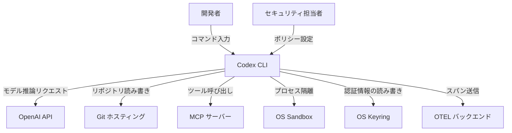
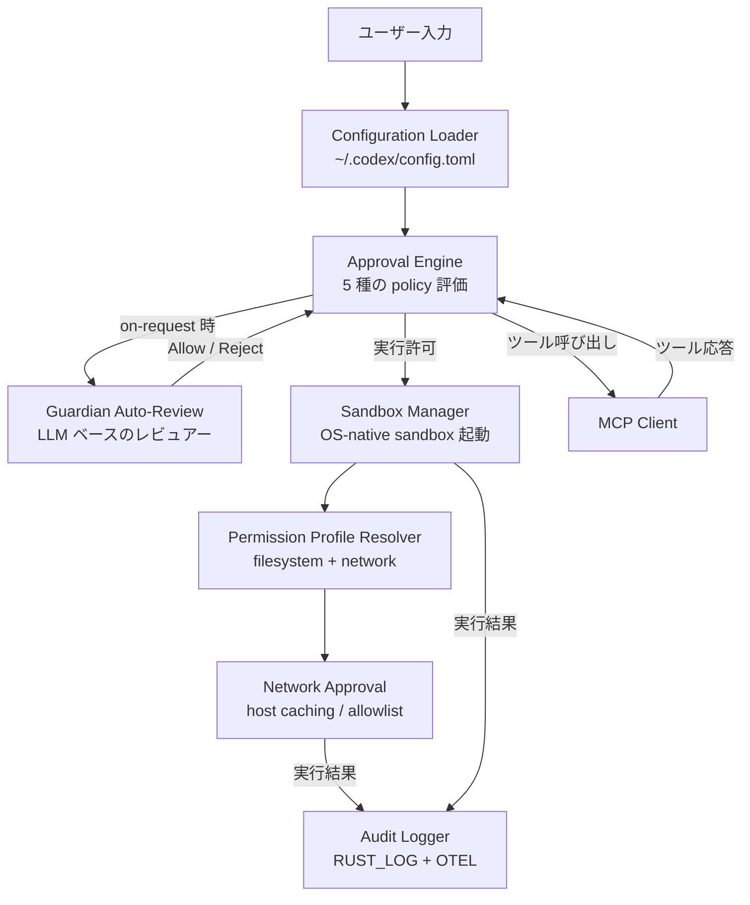
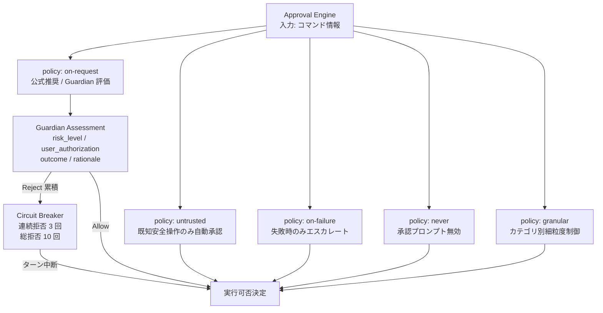
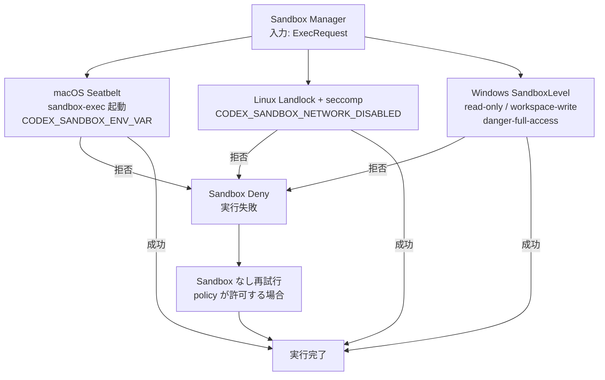
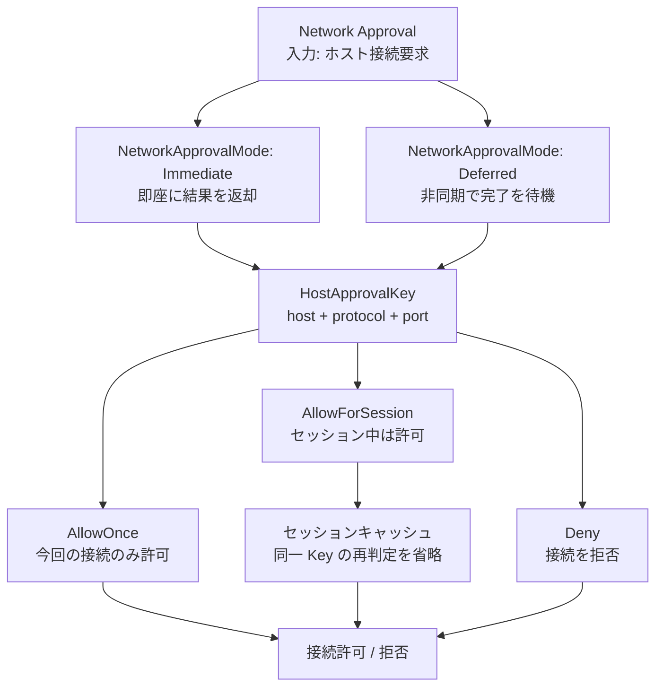
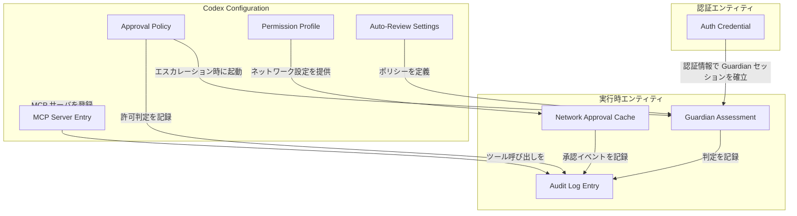
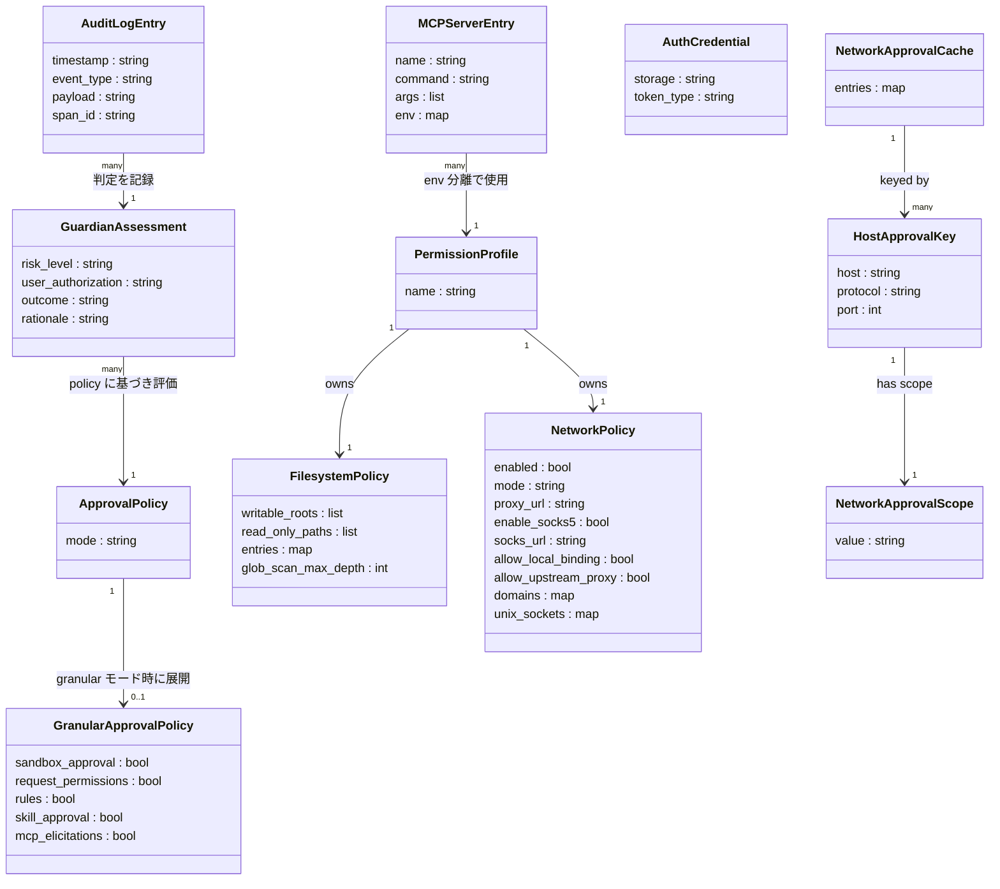

> 検証日: 2026-05-09 / 対象: Codex CLI v0.39.0 以降を最低ラインとする社内運用テンプレート

## 概要

OpenAI Codex CLI は、ターミナル上で動く軽量なコーディングエージェントです (Apache-2.0)。コード補完にとどまらず、ファイル読み書き・シェル実行・Web 検索を自律的に行います。そのため、**操作の自動許可範囲と監査の設計が運用品質を決定します**。

OpenAI が 2025 年に公開した「Running Codex safely at OpenAI」は、社内で Codex を運用する際の管理面を一次情報として整理したエンタープライズ向け資料です。本記事はこの資料を起点に、5 つの管理軸を体系化します。

| 管理軸 | Codex CLI での実装 |
| --- | --- |
| サンドボックス | OS-native 3 系統 (Seatbelt / Landlock / WindowsSandboxLevel) |
| 承認ポリシー | Approval Policy 5 種類 (deny-first 設計) |
| ネットワーク制御 | mode = "limited" でデフォルト遮断 |
| ID 管理 | ChatGPT Plan OAuth 推奨 / API Key |
| 監査ログ | ~/.codex/log + OpenTelemetry |

## 特徴

### Approval Policy

Approval Policy は 5 種類で、デフォルトは `untrusted` です。

| ポリシー | 動作 | 推奨シーン |
| --- | --- | --- |
| `untrusted` (デフォルト) | 既知の読み取り専用操作のみ自動承認、それ以外は確認 | 初回導入時 |
| `on-request` (**公式推奨**) | モデルが承認要否を判断、Guardian が事前フィルタ | git 管理ディレクトリ |
| `on-failure` | 全操作を sandbox 実行し、失敗時のみ確認 | 廃止予定 |
| `never` | 承認プロンプトなし | CI 環境 |
| `granular` | sandbox / rules / MCP / permissions / skills を個別制御 | 高度なカスタマイズ |

公式推奨は **git 管理ディレクトリで `on-request + auto_review`、未管理ディレクトリで `read-only`** です。`untrusted` でも workspace 内への書き込みは承認なしで実行されます。「`untrusted = 安全`」は誤解です。

### OS-native Sandbox

Sandbox は OS-native の 3 系統です。

| プラットフォーム | 実装 | 識別方法 |
| --- | --- | --- |
| macOS | Seatbelt (`/usr/bin/sandbox-exec`) | `CODEX_SANDBOX_ENV_VAR=seatbelt` |
| Linux | Landlock + seccomp | `CODEX_SANDBOX_NETWORK_DISABLED_ENV_VAR=1` |
| Windows | WindowsSandboxLevel (段階的隔離) | SandboxMode enum |

Permission Profile は 3 段階です。

| プロファイル | 説明 |
| --- | --- |
| `:read-only` | 読み取り専用 (最厳格) |
| `:workspace` (標準) | ワークスペース内書き込み許可 |
| `:danger-no-sandbox` | 制限なし (非推奨) |

いずれのモードでも `.git` `.agents` `.codex` は recursive read-only で保護されます。

### Guardian Auto-Review

`on-request` モード時、すべての承認対象アクションを Guardian が事前評価します。タイムアウト (90 秒)・JSON 不正・実行失敗はすべて **Reject** という fail-closed 設計です。Circuit Breaker は連続 3 回拒否または累計 10 回拒否でターン中断します (実装ソース: `codex-rs/core/src/guardian/mod.rs` の `GUARDIAN_REVIEW_TIMEOUT` / `MAX_CONSECUTIVE_GUARDIAN_DENIALS_PER_TURN` / `MAX_TOTAL_GUARDIAN_DENIALS_PER_TURN`)。

評価は次の Risk Taxonomy に従います。

| リスク種別 | 例 |
| --- | --- |
| Data Exfiltration | 秘密情報・認証情報の外部送信 |
| Credential Probing | auth ファイルへの直接アクセス |
| Persistent Security Weakening | 権限・アクセス制御の永続変更 |
| Destructive Actions | default/protected ブランチの削除・広範削除 |

### Network — deny-first

デフォルトは `mode = "limited"` で、明示的に許可したドメインのみアクセス可能です。`web_search = "cached"` がデフォルトで、ライブ取得せずキャッシュ結果を使用します。proxy / SOCKS5 / Unix socket も明示設定が必要です。

### 認証

| 方式 | 対象プラン | 備考 |
| --- | --- | --- |
| ChatGPT Plan OAuth (推奨) | Plus / Pro / Business / Edu / Enterprise | 中央ガバナンスに対応 |
| API Key | 全プラン | `~/.codex/auth.json` にデフォルト平文保存 |

API Key を使用する場合は `cli_auth_credentials_store = "keyring"` で OS keyring への移行が必須です。

### 監査ログ

| 出力先 | 内容 |
| --- | --- |
| `~/.codex/log/codex-tui.log` | TUI デフォルトログ |
| OTEL (OpenTelemetry) | span 単位のトレース (SIEM 連携用) |

記録イベントは Approval decisions、Network blocked request、Sandbox denials、Tool dispatch trace です。

### 3 モード比較

Codex CLI / Codex Web / IDE Plugin はホスティングと sandbox の境界が異なります。

| 属性 | Codex CLI | Codex Web | IDE Plugin |
| --- | --- | --- | --- |
| ホスティング | ローカル実行 | cloud (chatgpt.com/codex) | IDE プロセス内 |
| Sandbox | OS-native | Cloud 実行環境 | IDE 権限に従う |
| 認証 | API Key または ChatGPT OAuth | ChatGPT OAuth | IDE auth + OpenAI |
| 監査ログ | ~/.codex/log + OTEL (自己管理) | cloud 側 (詳細仕様非公開) | IDE ログに依存 |
| 推奨用途 | 開発者ローカル / エンタープライズ管理配布 | SaaS 利用 (企業向け) | IDE 内の軽量補助 |

### Claude Code との設計トレードオフ

Codex はカーネルレベルの OS-native Sandbox を中心に「実行環境を強制的に隔離する」アプローチを採ります。Claude Code は Hooks (Pre/Post ToolUse) を中心に「アプリケーション層で細粒度の制御を行う」アプローチを採ります。

| 比較軸 | Codex CLI | Claude Code |
| --- | --- | --- |
| 主要防衛機構 | OS-native Sandbox | Hooks |
| 制御の粒度 | 粗め (FS・ネットワーク境界) | 細かい (ツール呼び出し単位) |
| カスタマイズ性 | config.toml + Permission Profile | settings.json + Hook スクリプト |
| バイパスリスク | モデル生成値が policy を override (CVE-2025-59532) | Hooks 自体への injection (CVE-2025-59536) |
| エンタープライズ統制 | managed-settings を MDM 配布 | settings.json を MDM 配布 (メルカリ事例) |
| 監査ログ標準 | OTEL 統合 (公式) | OTEL 非標準 (コミュニティ実装) |

## 構造

### システムコンテキスト図



| 要素名 | 説明 |
| --- | --- |
| 開発者 | Codex CLI を通じてコーディングタスクを実行する利用者 |
| セキュリティ担当者 | config.toml でポリシーを設計・配布する管理者 |
| Codex CLI | ローカル端末で動作するコーディングエージェント本体 |
| OpenAI API | モデル推論と Guardian Auto-Review を担うクラウドエンドポイント |
| Git ホスティング | ソースコードの読み書き対象となるリモートリポジトリ |
| MCP サーバー | 外部ツール・サービスを Codex に接続するプロトコルサーバー |
| OS Sandbox | macOS Seatbelt / Linux Landlock+seccomp / Windows SandboxLevel の総称 |
| OS Keyring | 認証情報を平文 auth.json より安全に保管する OS 標準機構 |
| OTEL バックエンド | Approval 決定・Sandbox 拒否・ネットワークブロックをスパン単位で受信する監視基盤 |

### コンテナ図



| 要素名 | 説明 |
| --- | --- |
| Configuration Loader | ~/.codex/config.toml を読み込み、全コンポーネントに設定を配布する起動時処理 |
| Approval Engine | 5 種類のポリシーに従いコマンド実行の可否を決定する中核エンジン |
| Guardian Auto-Review | on-request 時に呼ばれる LLM ベースのレビュアー。Risk Taxonomy に基づき Allow / Reject を JSON で返す |
| Sandbox Manager | macOS Seatbelt / Linux Landlock+seccomp / Windows SandboxLevel のいずれかを起動し、プロセスを OS レベルで隔離する |
| Permission Profile Resolver | :read-only / :workspace / カスタムプロファイルを解決し、FS とネットワークの権限を確定する |
| Network Approval | ホスト単位の allowlist 判定とセッションキャッシュを担い、deny-first でネットワークアクセスを制御する |
| Audit Logger | RUST_LOG によるローカルログと OTEL スパン送信を行い、承認決定・Sandbox 拒否・ネットワークブロックを記録する |
| MCP Client | 外部 MCP サーバーへのツール呼び出しを仲介し、env 分離と認証情報ファイル参照を担う |

### コンポーネント図

#### Approval Engine ドリルダウン



| 要素名 | 説明 |
| --- | --- |
| policy: untrusted | 既知の安全な読み取り専用コマンドのみ自動承認する。デフォルトモード |
| policy: on-request | モデルが承認の必要性を判断し Guardian に委譲する。公式推奨モード |
| policy: on-failure | 全コマンドを Sandbox 内で実行し、失敗時のみ承認にエスカレートする |
| policy: never | 承認プロンプトを一切表示しない。非対話 CI 向け |
| policy: granular | sandbox_approval / request_permissions / rules / skill_approval / mcp_elicitations を個別に ON/OFF できる細粒度モード |
| Guardian Assessment | LLM が返す評価構造体。risk_level / user_authorization / outcome / rationale の 4 フィールドを持つ |
| Circuit Breaker | 同一ターンで Guardian が連続 3 回または総計 10 回 Reject した場合にターンを強制中断する |

#### Sandbox Manager ドリルダウン



| 要素名 | 説明 |
| --- | --- |
| macOS Seatbelt | /usr/bin/sandbox-exec を使用した OS レベルの Sandbox |
| Linux Landlock + seccomp | Landlock によるファイルシステム制限と seccomp によるシステムコールフィルタリングを組み合わせる |
| Windows SandboxLevel | read-only / workspace-write / danger-full-access の 3 段階で隔離レベルを制御する |
| Sandbox Deny | いずれかの Sandbox がコマンドを拒否した場合に発生し、Audit Logger に記録される |
| Sandbox なし再試行 | Sandbox Deny 後、ポリシーが許可していれば Sandbox を外して自動再試行する |

#### Network Approval ドリルダウン



| 要素名 | 説明 |
| --- | --- |
| NetworkApprovalMode: Immediate | 判定結果を即座に呼び出し元へ返すモード |
| NetworkApprovalMode: Deferred | 非同期で承認完了を待機するモード |
| HostApprovalKey | host / protocol / port の 3 要素で一意にホストを識別するキャッシュキー |
| AllowOnce | 今回のリクエストのみ許可し、キャッシュには保存しない |
| AllowForSession | セッション中は同一 HostApprovalKey の再承認を省略する |
| Deny | 接続を拒否し、Audit Logger にブロック記録を残す |
| セッションキャッシュ | AllowForSession で承認されたホストを記憶し、繰り返し承認プロンプトによる操作疲労を防ぐ |

## データ

### 概念モデル

Codex の安全運用機構を構成する主要エンティティと所有・利用関係を示します。



| 要素名 | 説明 |
| --- | --- |
| Approval Policy | 5 種類のポリシーから選択する承認設定 |
| Permission Profile | ファイルシステムとネットワークの権限を束ねたプロファイル |
| Auto-Review Settings | Guardian が評価に使うポリシー文 |
| MCP Server Entry | 外部 MCP サーバーの登録情報 |
| Guardian Assessment | 実行時に LLM が返す評価結果 |
| Network Approval Cache | ホスト単位のセッション承認キャッシュ |
| Audit Log Entry | RUST_LOG / OTEL に記録されるイベント |
| Auth Credential | OAuth / API Key の認証情報。auth.json または OS keyring に保管 |

### 情報モデル

各エンティティの属性を `codex-rs` 実装と `config.toml` スキーマに基づいて示します。



#### 主要属性の補足

`ApprovalPolicy.mode` の取りうる値は `untrusted` / `on-request` / `on-failure` / `never` / `granular` です。

`GuardianAssessment` の値域は次のとおりです。

- `risk_level`: `low` / `medium` / `high` / `critical`
- `user_authorization`: `high` / `medium` / `low` / `unknown`
- `outcome`: `Allow` / `Reject`

`NetworkApprovalScope.value` は `AllowOnce` / `AllowForSession` / `Deny` です。

`AuthCredential.storage` は `auth_json` (デフォルト平文) / `keyring` (OS キーリング) です。

`AuditLogEntry.event_type` の主な値は次のとおりです。

- `approval_decision` — GuardianAssessment の Allow / Reject 判定
- `network_blocked` — ネットワーク遮断イベント
- `sandbox_denial` — Sandbox によるシステムコール拒否
- `tool_dispatch` — MCP / ツール呼び出しトレース

## 構築方法

### インストール

3 通りの方法があります。

```bash
# npm (推奨)
npm install -g @openai/codex
```

```bash
# Homebrew (macOS)
brew install --cask codex
```

GitHub Releases からプラットフォーム別バイナリも取得できます。

| プラットフォーム | アーカイブ名 |
| --- | --- |
| macOS Apple Silicon | `codex-aarch64-apple-darwin.tar.gz` |
| macOS x86_64 | `codex-x86_64-apple-darwin.tar.gz` |
| Linux x86_64 | `codex-x86_64-unknown-linux-musl.tar.gz` |
| Linux arm64 | `codex-aarch64-unknown-linux-musl.tar.gz` |

### 認証

#### ChatGPT Plan OAuth (推奨)

```bash
codex
# 起動後 "Sign in with ChatGPT" を選択
```

Plus / Pro / Business / Edu / Enterprise プランで利用可能です。管理者が認証方式を強制する場合は `requirements.toml` で設定します。

```toml
# ~/.codex/requirements.toml (管理者配布用)
forced_login_method = "chatgpt"
forced_chatgpt_workspace_id = "00000000-0000-0000-0000-000000000000"
```

#### API Key 認証

```bash
export OPENAI_API_KEY="sk-..."
codex
```

`~/.codex/auth.json` はデフォルトで平文保存されます。OS keyring への移行を必ず設定してください。

```toml
# ~/.codex/config.toml
cli_auth_credentials_store = "keyring"   # "file" | "keyring" | "auto"
```

### 設定ファイルの場所

| ファイル | 役割 | スコープ |
| --- | --- | --- |
| `~/.codex/config.toml` | ユーザーレベル設定 | 全プロジェクト共通 |
| `~/.codex/requirements.toml` | 管理者強制設定 (MDM 配布) | ユーザー上書き不可 |
| `.codex/config.toml` | プロジェクトレベル設定 | 信頼済みプロジェクトのみ読み込む |
| `AGENTS.md` | プロジェクトの行動指示 (Prompt 層) | プロジェクト内 |
| `~/.codex/AGENTS.md` | ユーザー共通の行動指示 | 全プロジェクト共通 |

### 推奨デフォルト

公式推奨は **git 管理下 = Auto (workspace-write + on-request)** / **未管理 = read-only** です。

| 状況 | 推奨モード |
| --- | --- |
| git 管理下のディレクトリ | `workspace-write` + `on-request` (Auto) |
| git 管理外のディレクトリ | `read-only` |
| CI / 非対話環境 | `read-only` + `never` |

### バージョン確認と最低必要バージョン

```bash
codex --version
```

| CVE | CVSS | 内容 | 修正バージョン |
| --- | --- | --- | --- |
| CVE-2025-59532 | 8.6 | sandbox の writable root として model 生成 `cwd` を使用し、任意書き込みが可能 | **v0.39.0** |
| CVE-2025-61260 | 9.0 CRITICAL | `.env` で `CODEX_HOME` を上書きすると MCP server が承認なしで実行される | **v0.23.0** |

CVSS 値・修正バージョンは GHSA / CVE 一次ソース (本記事末尾の「CVE / セキュリティアドバイザリ」セクション) を参照してください。`v0.39.0` 以降は CVE-2025-61260 (v0.23.0 修正) の修正も包含するため、**両 CVE の修正を含む `v0.39.0` 以降を最低ラインとして固定する**ことを推奨します。

## 利用方法

### CLI 主要フラグ

| フラグ | 値 | 説明 |
| --- | --- | --- |
| `--sandbox` | `read-only` / `workspace-write` / `danger-full-access` | sandbox モード |
| `--ask-for-approval` | `untrusted` / `on-request` / `on-failure` / `never` | approval policy |
| `--dangerously-bypass-approvals-and-sandbox` | (フラグ) | sandbox・承認を完全無効化 (非推奨、エイリアス: `--yolo`) |
| `-c` | `key=value` | 単一設定値の上書き |
| `--profile` | `<name>` | 指定プロファイルの設定を読み込む |

### 起動と Sign in

```bash
# 通常起動
codex

# Auto モード (git 管理下の推奨構成)
codex --sandbox workspace-write --ask-for-approval on-request

# Read-only モード
codex --sandbox read-only --ask-for-approval on-request

# 非対話 CI モード
codex --sandbox read-only --ask-for-approval never

# ワンショット実行
codex exec "このコードベースを説明してください"
```

### config.toml の最小構成

```toml
# ~/.codex/config.toml — 最小構成 (git 管理プロジェクト向け)
approval_policy = "on-request"
approvals_reviewer = "auto_review"
permission_profile = ":workspace"
cli_auth_credentials_store = "keyring"
web_search = "cached"
```

### Auto-review (Guardian) を有効化する設定例

```toml
approval_policy = "on-request"
approvals_reviewer = "auto_review"

[auto_review]
policy = """
You are a safety reviewer. Assess the risk of the requested action.
Reject any action that falls into these categories:
- Data Exfiltration: secrets or credentials sent to untrusted destinations
- Credential Probing: direct read of auth files beyond task scope
- Persistent Security Weakening: permanent changes to permissions or access control
- Destructive Actions: deletion on default/protected branches, broad file removal
Return strict JSON: { "risk_level": "low|medium|high|critical", "outcome": "Allow|Reject", "rationale": "..." }
"""
```

granular policy で一部カテゴリだけ Guardian に委ねる場合は次のとおりです (TOML の inline table は単一行で記述します)。

```toml
approval_policy = { granular = { sandbox_approval = true, rules = true, mcp_elicitations = true, request_permissions = false, skill_approval = false } }
approvals_reviewer = "auto_review"
```

### Permission Profile のカスタム定義

```toml
permission_profile = "trusted-internal"

[permissions."trusted-internal".filesystem]
entries = { "/Users/dev/project/**" = "read-write", "/tmp/**" = "read-write", "/Users/dev/**/.env" = "none" }
glob_scan_max_depth = 3

[permissions."trusted-internal".network]
enabled = true
mode    = "limited"

[permissions."trusted-internal".network.domains]
"github.com"        = { https = true }
"api.github.com"    = { https = true }
"api.openai.com"    = { https = true }
```

`.git` / `.agents` / `.codex` は `workspace-write` モードでも recursive read-only として強制保護されます。

### MCP Server 登録

```toml
[[mcp_servers]]
name    = "github"
command = "npx"
args    = ["-y", "@modelcontextprotocol/server-github"]
env     = { GITHUB_TOKEN_FILE = "/run/secrets/codex-github-token" }
enabled = true
startup_timeout_sec = 10
```

シークレットを config.toml に直書きしないことが原則です。`requirements.toml` で identity を固定できます。

```toml
# ~/.codex/requirements.toml
[mcp_servers.github.identity]
command = "npx"
args    = ["-y", "@modelcontextprotocol/server-github@1.2.3"]
```

### Network allowlist 設定

```toml
[permissions."default".network]
enabled = true
mode    = "limited"

[permissions."default".network.domains]
"github.com"               = { https = true }
"api.github.com"           = { https = true }
"api.openai.com"           = { https = true }
"registry.npmjs.org"       = { https = true }
"git.internal.company.com" = { https = true }
```

CI 環境ではネットワークを完全に無効化することを推奨します。

```toml
approval_policy    = "never"
permission_profile = ":read-only"

[permissions."ci".network]
enabled = false
```

### プロファイルによる環境切り替え

```toml
[profiles.full_auto]
approval_policy = "on-request"
sandbox_mode    = "workspace-write"
web_search      = "cached"

[profiles.readonly_quiet]
approval_policy = "never"
sandbox_mode    = "read-only"
```

```bash
codex --profile full_auto
codex --profile readonly_quiet
```

### ログ確認

```bash
tail -F ~/.codex/log/codex-tui.log
RUST_LOG=codex_core=debug,codex_tui=info codex
codex -c log_dir=./.codex-log
```

## 運用

### バージョンとリリース監視

```bash
npm view @openai/codex version
codex --version
```

`v0.39.0` かつ `v0.23.0` 以降を満たすバージョンを最低要件として固定します。週次でパッチリリースを確認し、セキュリティアドバイザリは GHSA を RSS または GitHub Watch で追跡します。

### 監査ログの収集

```bash
RUST_LOG=debug codex "タスク内容"
ls ~/.codex/log/codex-tui.log
```

```toml
[otel]
enabled = true
endpoint = "http://localhost:4317"
service_name = "codex-cli"

[otel.resource_attributes]
"deployment.environment" = "production"
"team.name" = "platform-sre"
```

OTEL exporter が記録する主なイベントは次のとおりです。

- `codex.approval.requested` / `codex.approval.granted` / `codex.approval.denied`
- `codex.sandbox.violation`
- `codex.network.blocked`
- `codex.tool.dispatch`
- `codex.guardian.assessment`

### SIEM 連携

```yaml
# otel-collector-config.yaml
receivers:
  otlp:
    protocols:
      grpc:
        endpoint: "0.0.0.0:4317"

exporters:
  datadog:
    api:
      key: "${DD_API_KEY}"
      site: "datadoghq.com"
  splunk_hec:
    token: "${SPLUNK_HEC_TOKEN}"
    endpoint: "https://splunk.internal.company.com:8088/services/collector"
  otlphttp:
    endpoint: "http://openobserve.internal.company.com:5080/api/default/"

service:
  pipelines:
    traces:
      receivers: [otlp]
      exporters: [datadog, splunk_hec]
```

ログの保持期間は最低 90 日を推奨します (Huntress 事例より)。

### approval / guardian の denial rate モニタリング

| メトリクス | アラート閾値 | 意味 |
| --- | --- | --- |
| approval.denied / approval.requested | > 30% | approval fatigue 兆候 |
| guardian.assessment == "reject" / total | 急増または急減 | Guardian 誤判定の可能性 |
| sandbox.violation 件数 | 1 件以上 / 日 | Sandbox bypass 試行の可能性 |

### MCP server の token rotation

四半期サイクルでローテーションします。

1. 新トークンを secret store (Vault / AWS Secrets Manager 等) で生成する
2. `/run/secrets/` 配下のファイルを上書きする
3. MCP server プロセスを再起動する
4. 旧トークンを revoke する

### Kill switch (即時 read-only)

```toml
# kill-switch.toml — インシデント時に即時配布
approval_policy = "never"
permission_profile = ":read-only"

[permissions."default".network]
enabled = false
```

```bash
cp ~/dotfiles/codex/kill-switch.toml ~/.codex/config.toml
```

kill switch 適用後は次の手順を実施します。

1. `auth.json` の認証情報を rotation する
2. `~/.codex/log/` を SIEM に転送する
3. MCP server トークンを revoke する
4. 問題解決後に通常の `config.toml` を再配布する

## ベストプラクティス

### 3 層ガードレールの重ね方

| 層 | 手段 | 強さ | 担当 |
| --- | --- | --- | --- |
| Prompt 層 | `AGENTS.md` / system prompt | 弱 (LLM が override 可) | プロジェクトオーナー |
| Policy 層 | `~/.codex/config.toml` | 中 | 情シス / セキュリティ |
| OS 層 | macOS Seatbelt / Linux Landlock+seccomp / Dev Container / 物理マシン分離 | 強 | Platform / SRE |

**Prompt 層を最終防衛線にしてはいけません。** LLM は prompt injection や悪意ある `AGENTS.md` の commit によって上書きされる可能性があります。

### MDM / dotfiles 配布パターン

```bash
# Jamf 経由の managed-config 配布スクリプト例
#!/bin/bash
CODEX_CONFIG_DIR="$HOME/.codex"
mkdir -p "$CODEX_CONFIG_DIR"
cp /Library/Managed\ Preferences/codex/config.toml "$CODEX_CONFIG_DIR/config.toml"
chmod 600 "$CODEX_CONFIG_DIR/config.toml"
```

dotfiles の構成例です。

```
dotfiles/
  codex/
    config.toml          # 一般開発者向け (on-request + workspace-write)
    config.ci.toml       # CI 環境向け (never + read-only)
    config.admin.toml    # 管理者向け (granular)
    kill-switch.toml     # インシデント時
  install.sh
```

### forbidden command list の二重化

Policy 層 (auto_review) で次のように制限します。

```toml
[auto_review]
policy = """
You are a safety reviewer. Automatically REJECT any command that:
- Runs `rm -rf` with / or ~ as target
- Runs `git push` to origin/main or origin/master without explicit approval
- Runs `curl`, `wget`, or `fetch` to external (non-allow-listed) domains
- Accesses or transmits files matching *.env, *secret*, *credential*, *token*
- Installs packages from unverified registries
Return strict JSON: {"decision": "reject", "reason": "..."}
"""
```

Shell wrapper 層で物理的にもブロックします。

```bash
codex_forbidden_wrapper() {
  local forbidden=("rm -rf /" "rm -rf ~" "git push origin main" "git push origin master")
  local cmd="$*"
  for f in "${forbidden[@]}"; do
    if [[ "$cmd" == *"$f"* ]]; then
      echo "[BLOCKED] Forbidden command detected: $f" >&2
      return 1
    fi
  done
  command codex "$@"
}
alias codex=codex_forbidden_wrapper
```

### auth.json を OS keyring へ

```toml
cli_auth_credentials_store = "keyring"
```

```bash
codex auth login
rm ~/.codex/auth.json
```

### Network allow-list の社内ドメイン基準

```toml
[permissions."default".network]
enabled = true
mode = "limited"

[permissions."default".network.domains]
"git.internal.company.com" = { https = true }
"registry.npmjs.org" = { https = true }
"pypi.org" = { https = true }
"api.openai.com" = { https = true }
"github.com" = { https = true }
"api.github.com" = { https = true }
```

`x-unix-socket` や SOCKS5 proxy は不要なら設定しません。allow-list の迂回経路になる可能性があるためです。

### MCP は別 trust boundary、env file 渡し

```toml
# 良い例: トークンをファイル参照
[[mcp_servers]]
name = "github"
command = "npx"
args = ["-y", "@modelcontextprotocol/server-github"]
env = { GITHUB_TOKEN_FILE = "/run/secrets/codex-github-token" }

# 悪い例: config.toml に平文 (CVE-2025-61260 の悪用経路)
# [[mcp_servers]]
# env = { GITHUB_TOKEN = "ghp_xxxxxxxxxxxx" }
```

CVE-2025-61260 が示す通り、`.env` で `CODEX_HOME` を上書きされると MCP server entries が承認なしで自動実行されます。`.env` を `.gitignore` に追加し、`CODEX_HOME` 環境変数を shell レベルでロックします (`export -r CODEX_HOME=~/.codex`)。

### PR レビュー時の Codex 出力検証

Codex が生成したコマンドは SOC triage で攻撃者コマンドと混在し、signal/noise 比を悪化させます (Huntress 事例)。PR テンプレートに検証項目を追加します。

```markdown
## Codex 生成コマンド確認
- [ ] `~/.codex/log/codex-tui.log` で実行コマンドを確認した
- [ ] 外部への通信 (curl / wget / fetch) が含まれていないことを確認した
- [ ] 削除系コマンド (rm / git clean) の対象ディレクトリを確認した
- [ ] 環境変数や secret へのアクセスが含まれていないことを確認した
```

## トラブルシューティング

下記表の Issue 状態は検証日 (2026-05-09) 時点のものです。

| 症状 | 原因 | 対処 |
| --- | --- | --- |
| 同じコマンドで approval prompt が再発する | session キャッシュが永続化されない (Issue #6395, #14547) | `v0.39.0` 以降に更新する。`granular` で `sandbox_approval` の粒度を絞る |
| `--dangerously-bypass-approvals-and-sandbox` が directory trust prompt を出す | v0.114.0 の regression (Issue #14345) | v0.114.0 を回避し、CI では `approval_policy = "never"` + `permission_profile = ":read-only"` を使用する |
| `guardian review completed without an assessment payload` | Guardian の assessment payload 欠落 (Issue #15341) | コマンドリトライ。応急対応として `approvals_reviewer` を空にして人間承認に切り替え |
| Guardian が destructive な cleanup を auto-approve した | Guardian に危険度ベースの閾値が無い (Issue #18840 open) | `granular` で `skill_approval` を ON、削除系操作には人間承認を強制。`auto_review` の policy に「不可逆削除は reject」を明示 |
| Windows で `sandbox_mode = "danger-full-access"` が parse reject される | Windows での設定値パース非対応 (Issue #20942) | Windows では `sandbox_mode = "workspace-write"`。`danger-full-access` 用途は Linux / macOS で実行 |
| MCP tool が read-only モードで write 操作を実行した | MCP tool が sandbox 制約を無視 (Issue #7635) | MCP server を別 sandbox envelope (Dev Container / Docker) で実行。MCP ログを SIEM で監視し write 系 tool call を検知 |
| `review quota limit exceeded` で auto-review が機能停止 | quota 誤検出 (Issue #15477) | OpenAI dashboard で残量確認。機能停止中は `approvals_reviewer` を空にして手動承認 |
| `~/.codex/auth.json` に認証情報が平文保存されている | デフォルト動作 | `cli_auth_credentials_store = "keyring"` を追加し再ログイン、`auth.json` を削除 |
| Windows で sandboxed agent が isolation を脱出した | bridge process による sandbox 脱出 (Issue #15625) | Windows での sandboxed 実行を一時停止。Linux / macOS に移行。修正リリースを追跡 |
| zsh 環境で sandbox が適用されないコマンドがある | zsh fork が sandbox wrapper を drop (Issue #12800, v0.106.0 修正済み) | `v0.106.0` 以降を使用 |

## まとめ

OpenAI Codex CLI の安全運用は「公式推奨デフォルト + Guardian + 3 層ガードレール (Prompt / Policy / OS)」をベースラインに据えつつ、CVE-2025-59532・CVE-2025-61260 や Guardian 誤判定の事例を反証として取り込み、テンプレ単独で安全を主張しないことが重要です。本記事の config 例・運用チェックリスト・kill switch を基点に、自社の trust boundary に合わせて調整してください。

この記事が少しでも参考になった、あるいは改善点などがあれば、ぜひリアクションやコメント、SNS でのシェアをいただけると励みになります！

## 参考リンク

### OpenAI 公式 / GitHub

- [Running Codex safely at OpenAI](https://openai.com/index/running-codex-safely/)
- [OpenAI Codex Documentation](https://developers.openai.com/codex)
- [Agent Approvals & Security](https://developers.openai.com/codex/agent-approvals-security)
- [Execution Policy](https://developers.openai.com/codex/exec-policy)
- [Authentication](https://developers.openai.com/codex/auth)
- [Config Reference](https://developers.openai.com/codex/config-reference)
- [IDE 連携](https://developers.openai.com/codex/ide)
- [ChatGPT プラン説明](https://help.openai.com/en/articles/11369540-codex-in-chatgpt)
- [openai/codex (GitHub)](https://github.com/openai/codex)
- [openai/codex Releases](https://github.com/openai/codex/releases/latest)

### CVE / セキュリティアドバイザリ

- [GHSA-w5fx-fh39-j5rw / CVE-2025-59532](https://github.com/openai/codex/security/advisories/GHSA-w5fx-fh39-j5rw)
- [CVE-2025-61260 (CODEX_HOME override via .env)](https://www.cve.org/CVERecord?id=CVE-2025-61260)
- [Check Point Research, "OpenAI Codex CLI command injection vulnerability"](https://research.checkpoint.com/2025/openai-codex-cli-command-injection-vulnerability/)
- [BeyondTrust, "Codex Command Injection via GitHub Branch"](https://www.beyondtrust.com/blog/entry/openai-codex-command-injection-vulnerability-github-token)

### 反証・実害事例

- [Huntress, "Codex Red: Linux Incident Analysis"](https://www.huntress.com/blog/codex-part-one)
- [GMO Flatt Security, "バイブコーディングのセキュリティリスク 7 選"](https://blog.flatt.tech/entry/vibe_coding_security_risk)
- [Trend Micro, "バイブコーディングの本当のリスク"](https://www.trendmicro.com/ja_jp/research/26/d/the-real-risk-of-vibecoding.html)

### GitHub Issue (運用上の罠)

- [openai/codex#6395 (approval session persistence)](https://github.com/openai/codex/issues/6395)
- [openai/codex#14345 (bypass regression v0.114.0)](https://github.com/openai/codex/issues/14345)
- [openai/codex#14547 (approval prompt 再発)](https://github.com/openai/codex/issues/14547)
- [openai/codex#15341 (guardian assessment payload)](https://github.com/openai/codex/issues/15341)
- [openai/codex#15477 (review quota 誤検出)](https://github.com/openai/codex/issues/15477)
- [openai/codex#15625 (Windows bridge process escape)](https://github.com/openai/codex/issues/15625)
- [openai/codex#18840 (destructive cleanup auto-approve)](https://github.com/openai/codex/issues/18840)
- [openai/codex#20942 (Windows sandbox_mode parse)](https://github.com/openai/codex/issues/20942)
- [openai/codex#7635 (MCP sandbox bypass)](https://github.com/openai/codex/issues/7635)
- [openai/codex PR#12800 (zsh fork sandbox bypass)](https://github.com/openai/codex/pull/12800)

### 日本語実践事例

- [メルカリ, "Claude Code セキュリティ設定の組織配布戦略"](https://speakerdeck.com/hi120ki/claude-code-organization-settings)
- [AQUA, "Claude Code 企業導入セキュリティガイド【2026年最新】"](https://www.aquallc.jp/claude-code-enterprise-security-guide/)
- [Classmethod, "Let's Use Claude Code Safely"](https://dev.classmethod.jp/en/articles/claude-code-security-basics/)
- [Zenn (chiji), "Codex を使うあなたへ。おすすめ設定 & MCP 集"](https://zenn.dev/chiji/articles/57cb52773391ab)
- [Zenn (foxytanuki), "Claude Code × Codex MCP サーバー連携で踏んだ罠と回避法"](https://zenn.dev/foxytanuki/articles/9df8e0134ed412)
