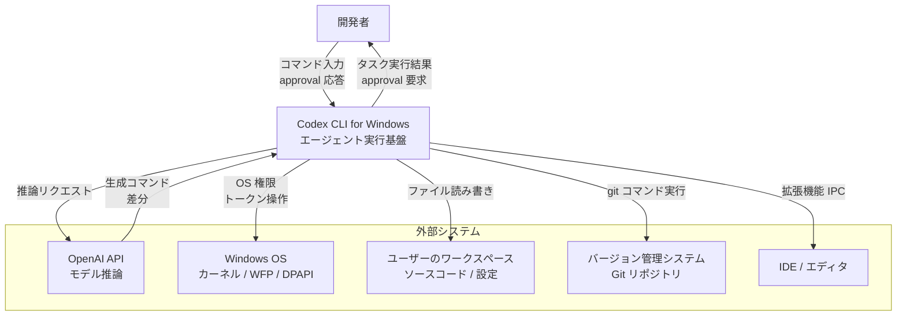
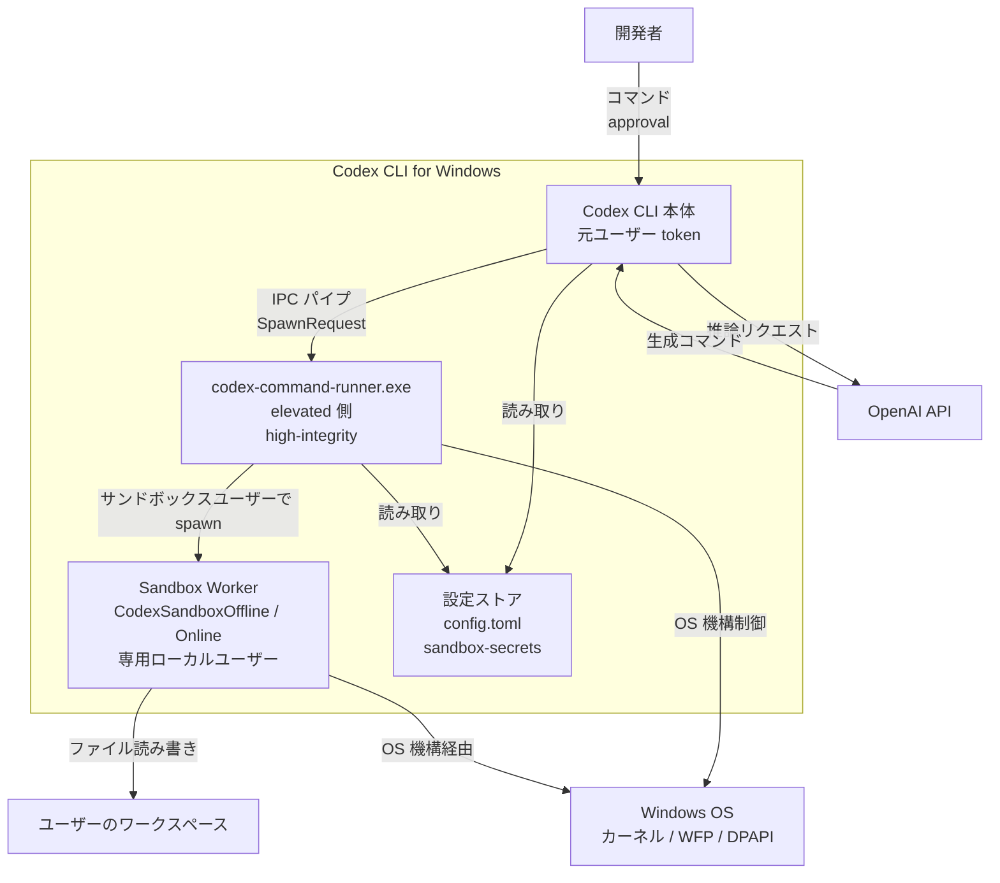
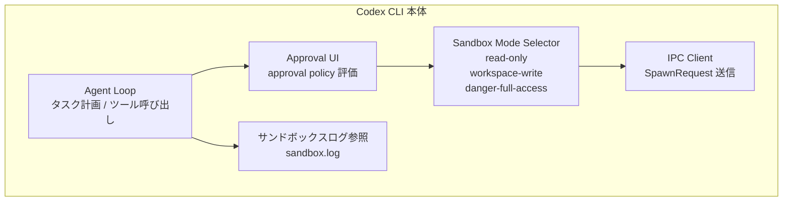
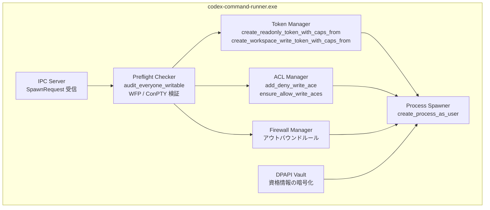
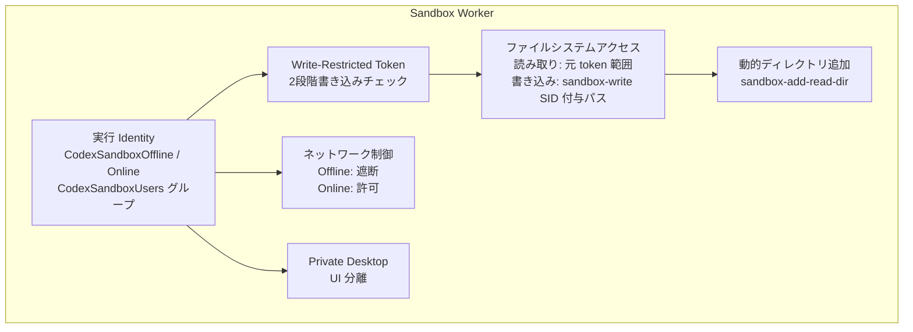
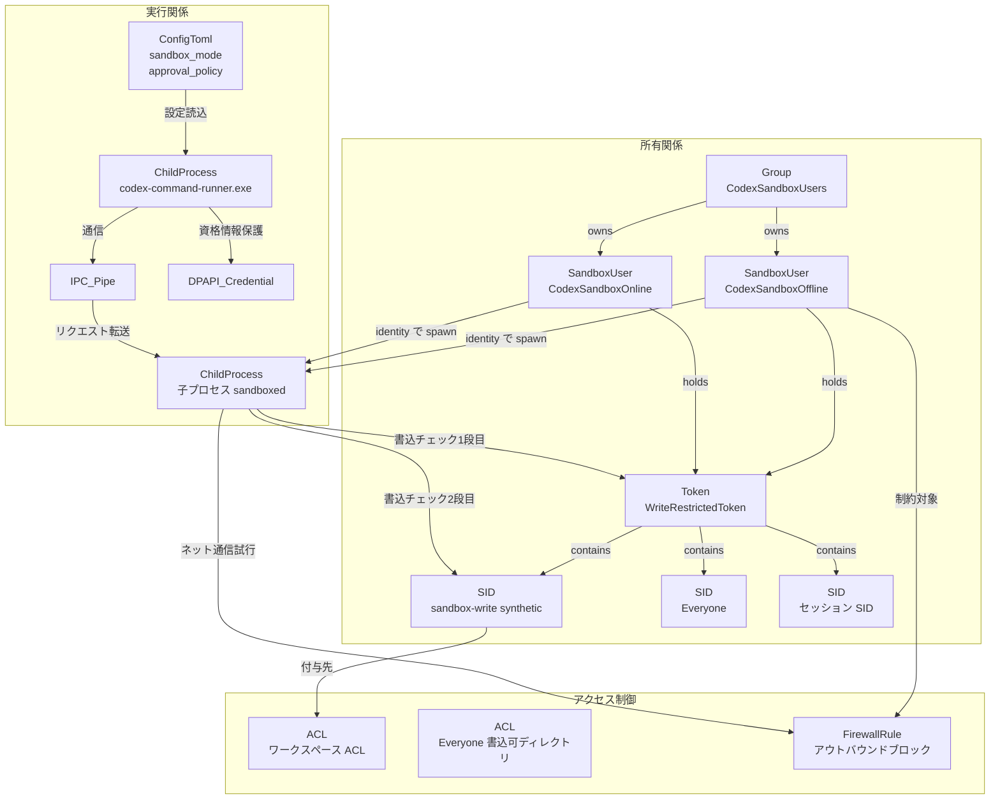
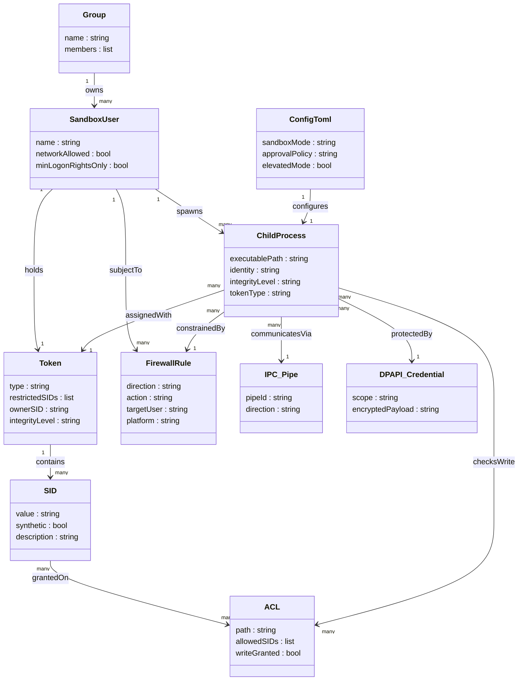

> 検証日: 2026-05-15 / 対象: OpenAI Codex CLI for Windows (2026-05 現行版)
>
> **出典に関する注記**: 本記事の固有名 (`CodexSandboxOffline` / `CodexSandboxOnline` / `CodexSandboxUsers` / 合成 SID `sandbox-write` / バイナリ名 `codex-command-runner.exe` / パス `CODEX_HOME/.sandbox-secrets/` 等) は OpenAI のブログ記事「Building a safe, effective sandbox to enable Codex on Windows」を一次ソースとし、`developers.openai.com/codex/*` の公開ドキュメントには明示されていません。Rust 関数名 (`create_readonly_token_with_caps_from` / `create_workspace_write_token_with_caps_from` / `audit_everyone_writable` / `add_deny_write_ace` / `ensure_allow_write_aces`) は DeepWiki によるコード解析を二次ソースとします。ログ出力パス・監査 Event ID の挙動・winget パッケージ名・CLI フラグの表記は今後変更される可能性があるため、`codex --help` および `codex setup` の出力で最新を確認してください。
>
> なお本記事で「Windows Sandbox」と書いた場合は Microsoft が提供する仮想化ベースの製品 (Hyper-V を使う使い捨て VM) を指します。「Codex のサンドボックス」「Codex Windows sandbox」は OpenAI が独自に設計したサンドボックス機構を指します。両者を区別してお読みください。

## 概要

Codex CLI for Windows のサンドボックスは、コーディングエージェントが実環境の開発フォルダで読み書きとコマンド実行を行うときに生じるリスクを OS 権限レイヤで局所化する安全機構です。対象とするリスクは prompt injection、意図しないシステム変更、データ流出です。

OpenAI は 2026 年 5 月にこのサンドボックス設計をブログで公開しました。対象領域は Coding Agent / Security / Sandbox の交差点に位置づきます。「承認 UI だけではプロンプトインジェクションを防げない」という問題意識に対し、「承認の前段として OS カーネルが書き込みとネットワーク通信を制限する」アーキテクチャを採用しています。

Windows には既存のサンドボックス機構として AppContainer、Windows Sandbox、Mandatory Integrity Control があります。OpenAI はこれらを以下の理由から不採用としました。

- AppContainer は capability の事前宣言が必要で、対象プロジェクトが動的に変化するコーディングエージェントに適合しません。
- Windows Sandbox は仮想化ベースの完全分離で、ホストの開発環境を Codex から利用させたい要件と両立しません。
- Mandatory Integrity Control の完全性ラベルは細粒度の書き込み制御やネットワーク制御を提供しません。

OpenAI はこれらの分析を経て、「書き込み境界」と「ネットワーク境界」を独立した OS 機構で実現する独自構成を選択しました。2026 年 3 月の初期実装では `C:\Users\` ツリー全体への広範な権限付与が OpenSSH 鍵拒否や Vivaldi DRM 不具合を誘発しました。2026 年 5 月の現行版はこの反省を踏まえ、execution identity 分離、OS 層ネットワーク遮断、書き込みスコープ縮小、DPAPI 保護を柱に再設計されています。

## 特徴

### 1. SID と write-restricted token による書き込み制御

OpenAI は合成 SID `sandbox-write` を作成し、Codex の子プロセスに write-restricted token を割り当てます。restricted SID リストには `Everyone`、現在のログオンセッション SID、`sandbox-write` の 3 つが含まれます。書き込みは 2 段階のアクセスチェックを通過したときだけ成立します。

- 1 段目: トークンオーナーが書き込みを許可されているか
- 2 段目: restricted SID リスト内の少なくとも 1 つが書き込みを許可されているか

ワークスペース内の指定パスには `sandbox-write` SID だけが ACL で付与されるため、書き込みはそのスコープに限定されます。読み取りは元トークンの権限で広く残ります。

### 2. 専用ローカルユーザーと Windows Firewall によるネットワーク制御

OpenAI は専用ローカルユーザーを 2 つ作成し、`CodexSandboxUsers` グループに置きます。

- `CodexSandboxOffline` は既定の実行 identity で、Windows Firewall のアウトバウンドルールが外向き通信をブロックします。
- `CodexSandboxOnline` はネットワークアクセスが必要な操作のときだけ起動します。

初期実装は環境変数・プロキシ・git config 強制でネットワークを制限していました。子プロセスが直接ソケットを開けば回避できたため、現行版は OS カーネル層 (Windows Filtering Platform) による遮断に移行しました。

### 3. Elevated / Unelevated / WSL2 の 3 モード

| モード | 必要権限 | 主要機構 | 強度 |
|---|---|---|---|
| Elevated (推奨) | 管理者 | 専用 sandbox ユーザー + Firewall + ACL + ローカルポリシー | architecturally solid |
| Unelevated (フォールバック) | 一般ユーザー | restricted token + ACL のみ | 書き込み制御中心 |
| WSL2 | WSL2 環境 | Linux 側の Landlock + seccomp + namespace | Codex 訓練環境に最も近い |

管理者権限が取れない企業端末では「Unelevated + WSL2 ハイブリッド」が現実解です。重要な実行を WSL2 内に閉じ込め、Windows ネイティブ側は ACL ベースの境界に留めます。

### 4. command-runner.exe と IPC アーキテクチャ

elevated モードでは `codex-command-runner.exe` が high-integrity 側で常駐します。Codex CLI は IPC パイプ経由でリクエストをこのランナーに渡し、ランナーがサンドボックスユーザー identity で子プロセスを spawn します。制約された実行コンポーネントと高権限コンポーネントを分離する設計です。

起動前チェックは DPAPI 状態、Firewall 状態、command-runner へのハンドオフ、子プロセス起動制御の 4 段階で実施します。資格情報は DPAPI (Windows Data Protection API) で暗号化保護します。

### 5. 類似サンドボックスとの比較

| | macOS Seatbelt | Linux Landlock + seccomp | WSL2 (Windows 上) | Windows Sandbox (VM 型) | AppContainer | Codex 独自構成 |
|---|---|---|---|---|---|---|
| 実行方式 | カーネルプロファイル (SBPL) | bubblewrap + syscall フィルタ | Hyper-V 上の Linux カーネル | 軽量 Hyper-V VM | Capability ベース | restricted token + Firewall |
| 分離単位 | プロセス | Linux namespace | Linux ディストリビューション | VM | AppContainer 境界 | OS ユーザー identity + ACL |
| カーネル機構 | Sandbox kernel extension | Landlock + seccomp + unshare | Linux Landlock + seccomp | Hyper-V / VBS | Win32 capability / DACL | SID / restricted token / WFP |
| 前提権限 | 不要 | bubblewrap 導入 | WSL2 有効化 | 管理者 | アプリ署名 / ストア登録 | elevated=管理者 |
| ホスト環境の利用 | 選択的に許可 | 選択的マウント | `/mnt/c` 経由 (注意要) | 基本不可 | 宣言した capability のみ | 読み取りは広く、書き込みのみ制限 |
| UX への影響 | ほぼ透過 | ほぼ透過 | I/O 性能差あり | IDE 連携困難 | capability 宣言ミスで動作不全 | ACL 残骸リスク |

## 構造

### システムコンテキスト図



| 要素 | 説明 |
|---|---|
| 開発者 | Codex CLI を起動し approval を判断する人間のオペレーター |
| Codex CLI for Windows | エージェント実行基盤。本図の対象システム |
| OpenAI API | 推論モデルを提供。Codex はコマンドや差分を受け取る |
| Windows OS | カーネル、Windows Filtering Platform、DPAPI を提供 |
| ユーザーのワークスペース | Codex が読み書きするソースコードや設定ファイルの実体 |
| バージョン管理システム | Git リモート。サンドボックスのネットワーク境界の外にある |
| IDE / エディタ | VS Code 拡張などが Codex CLI と IPC で連携する |

### コンテナ図



| 要素 | 説明 |
|---|---|
| Codex CLI 本体 | ユーザーの元 token で動作するフロントエンド。OpenAI API と通信し IPC でコマンドを Runner に委譲する |
| codex-command-runner.exe | elevated (high-integrity) 側で動作する常駐ランナー。サンドボックスユーザー identity で子プロセスを spawn する |
| Sandbox Worker | `CodexSandboxOffline` / `CodexSandboxOnline` のローカルユーザーとして動作するプロセス群 |
| 設定ストア | `config.toml` と `CODEX_HOME/.sandbox-secrets/` に格納される DPAPI 保護資格情報 |
| OpenAI API | 外部推論エンドポイント |
| Windows OS | カーネル / WFP / DPAPI を提供する OS 基盤 |
| ユーザーのワークスペース | Sandbox Worker が読み書きするファイルシステム領域 |

### コンポーネント図

#### Codex CLI 本体の内部コンポーネント



| 要素 | 説明 |
|---|---|
| Agent Loop | タスクを計画しコマンドをツール呼び出しに変換するエージェントコア |
| Approval UI | approval policy を評価し必要に応じてユーザーに承認を求める |
| Sandbox Mode Selector | sandbox_mode をモード変数に変換し Token Manager に渡す |
| IPC Client | SpawnRequest を framed IPC パイプ経由で command-runner に送信する |
| サンドボックスログ参照 | sandbox.log を読み取りエラー診断に使用する |

#### codex-command-runner.exe の内部コンポーネント



| 要素 | 説明 |
|---|---|
| IPC Server | CLI 本体から SpawnRequest を受信するフレームドパイプサーバー |
| Preflight Checker | ワールド書き込み可ディレクトリを事前監査し Windows バージョン / WFP / ConPTY / UAC を検証する |
| Token Manager | Rust 関数で restricted token を生成。restricted SID list に Everyone / セッション SID / sandbox-write を含める |
| ACL Manager | 合成 SID `sandbox-write` をワークスペースパスの ACL に付与し書き込み境界を確立する |
| Firewall Manager | Windows Firewall の動的アウトバウンドルールを設定。CodexSandboxUsers からの外向き通信を遮断する |
| DPAPI Vault | Windows Data Protection API で資格情報を暗号化し sandbox-secrets に保存する |
| Process Spawner | サンドボックスユーザー identity の子プロセスを起動し restricted token を継承させる |

#### Sandbox Worker の内部コンポーネント



| 要素 | 説明 |
|---|---|
| 実行 Identity | CodexSandboxOffline か Online の専用ローカルユーザー。最小ログオン権利のみ付与 |
| Write-Restricted Token | restricted SID list を継承した token。書き込み時に 2 段階チェックを実施 |
| ファイルシステムアクセス | 読み取りは元 token 権限で広く許可。書き込みは sandbox-write SID が付与されたパスのみ |
| ネットワーク制御 | Offline は WFP ベースのファイアウォールルールでアウトバウンド通信を遮断する |
| 動的ディレクトリ追加 | `sandbox-add-read-dir` コマンドで実行時に追加ディレクトリへの読み取りアクセスを付与する |
| Private Desktop | UI を分離しデスクトップへのアクセスを制限する |

## データ

### 概念モデル



| 要素名 | 説明 |
|---|---|
| SandboxUser CodexSandboxOffline | 既定サンドボックス実行ユーザー。Firewall でアウトバウンド通信がブロックされる |
| SandboxUser CodexSandboxOnline | ネットワーク許可が明示的に必要な場合のみ使用するサンドボックスユーザー |
| Group CodexSandboxUsers | 2 つのサンドボックスユーザーを束ねるローカルグループ |
| SID sandbox-write | 実ユーザーに対応しない合成 SID。許可ワークスペースパスの ACL にのみ付与 |
| SID Everyone | restricted SID リストに含まれる組み込み SID |
| SID セッション SID | 現在のログオンセッション SID |
| Token WriteRestrictedToken | 子プロセスへ割り当てる制限トークン |
| ACL ワークスペース ACL | sandbox-write SID に書き込み権限が付与されたパス群 |
| ACL Everyone 書込可ディレクトリ | sandbox-write SID が付与されていない既存ディレクトリ |
| FirewallRule アウトバウンドブロック | CodexSandboxOffline からの外向き通信を WFP でブロックするルール |
| ChildProcess codex-command-runner.exe | elevated 側で動作し IPC パイプ経由でリクエストを受ける |
| ChildProcess 子プロセス | サンドボックスユーザー identity で spawn される実行プロセス |
| IPC_Pipe | CLI と command-runner 間の通信チャネル |
| DPAPI_Credential | Windows Data Protection API で保護された資格情報 |
| ConfigToml | sandbox_mode と approval_policy を保持する設定 |

### 情報モデル



| 要素名 | 属性 |
|---|---|
| SandboxUser | name / networkAllowed / minLogonRightsOnly |
| Group | name / members |
| SID | value / synthetic / description |
| Token | type / restrictedSIDs / ownerSID / integrityLevel |
| ACL | path / allowedSIDs / writeGranted |
| FirewallRule | direction / action / targetUser / platform |
| ChildProcess | executablePath / identity / integrityLevel / tokenType |
| IPC_Pipe | pipeId / direction |
| DPAPI_Credential | scope / encryptedPayload |
| ConfigToml | sandboxMode / approvalPolicy / elevatedMode |

## 構築方法

### 前提条件

| 項目 | 要件 |
|---|---|
| OS | Windows 11 (推奨) / Windows 10 1809 以降 |
| コンソール | ConPTY が有効 |
| パッケージマネージャ | `winget` が利用可能 |
| 管理者承認 | elevated モード時に必要 |
| Node.js | npm 経由なら Node.js 22 以降を推奨 |

### インストール (Windows ネイティブ)

```powershell
# npm によるグローバルインストール (現時点の主経路)
npm i -g @openai/codex

# インストール確認
codex --version
```

winget 経由のインストールが公式に提供される計画があります。執筆時点で公式パッケージ名は未確定のため、最新は公式ドキュメントで確認してください。本記事中で `winget upgrade openai.codex` 等と表記している箇所は仮の名称です。

### WSL2 経路でのインストール

ホストの Windows 開発環境を直接触らせず、Linux 側の Landlock + seccomp で隔離したい場合に選びます。

```powershell
# elevated PowerShell で実行
wsl --install
```

```bash
# WSL2 シェル内で Node.js を導入
curl -o- https://raw.githubusercontent.com/nvm-sh/nvm/master/install.sh | bash
source ~/.bashrc
nvm install 22

# Codex を WSL2 側にインストール
npm i -g @openai/codex
codex --version
```

リポジトリは Windows マウントパス (`/mnt/c/...`) ではなく Linux ホーム配下 (`~/projects/...`) に置く運用を推奨します。I/O 性能と ACL 整合性のためです。

### セットアップ時の警告: Everyone 書き込み可ディレクトリの検出

elevated モード初回起動時に、`Everyone` SID に書き込み権限が付与されているディレクトリを Codex が自動検出して警告します。

```
[WARNING] The following directories have write permissions for Everyone:
  C:\ProgramData\SomeApp
  C:\Users\Public\Documents
These paths cannot be protected by the Codex sandbox.
```

該当ディレクトリはサンドボックス境界から漏れます。ACL を修正するか Codex の書き込みスコープから除外してください。

### elevated / unelevated 切替

```toml
# ~/.codex/config.toml
[windows]
sandbox = "elevated"   # 管理者承認済み環境 (推奨)
# sandbox = "unelevated"  # 管理者権限なし環境向け
```

## 利用方法

### 主要設定パラメータ一覧

| キー | 場所 | 選択肢 | 既定値 |
|---|---|---|---|
| `sandbox_mode` | config.toml ルート | `read-only` / `workspace-write` / `danger-full-access` | `workspace-write` |
| `approval_policy` | config.toml ルート | `untrusted` / `on-request` / `never` | `on-request` |
| `sandbox_workspace_write.writable_roots` | config.toml | 絶対パス配列 | ワークスペースのみ |
| `sandbox_workspace_write.network_access` | config.toml | `true` / `false` | `false` |
| `[windows].sandbox` | config.toml | `elevated` / `unelevated` | `elevated` |

config.toml の配置場所はユーザー全体が `~/.codex/config.toml`、プロジェクト単位が `.codex/config.toml` です。CLI フラグは config.toml より優先されます。

### sandbox_mode の各モード詳細

#### read-only (検査専用)

```toml
sandbox_mode = "read-only"
approval_policy = "on-request"
```

```bash
codex "このリポジトリのセキュリティ問題を洗い出して"
```

#### workspace-write (既定)

```toml
sandbox_mode = "workspace-write"
approval_policy = "on-request"

[sandbox_workspace_write]
writable_roots = [
  "C:\\Users\\you\\projects\\myapp",
  "C:\\Users\\you\\projects\\shared-libs"
]
```

```bash
# 現行 CLI のフラグは -s/--sandbox および -a/--ask-for-approval が確認されています。
# 旧表記 --sandbox-mode / --approval-policy が動かない場合は -s / -a を試してください。
codex -s workspace-write "テストを追加して"
```

#### danger-full-access (制約なし)

```toml
sandbox_mode = "danger-full-access"
approval_policy = "never"
```

```bash
# CI 環境での起動例 (隔離コンテナ内)
codex -s danger-full-access -a never "依存関係を全更新して"
```

### sandbox_workspace_write の追加設定

```toml
[sandbox_workspace_write]
writable_roots = [
  "C:\\Users\\you\\projects\\myapp",
  "C:\\tmp\\codex-work"
]
network_access = false
exclude_slash_tmp = true
exclude_tmpdir_env_var = true
```

実行中に読み取り許可を追加するには `/sandbox-add-read-dir C:\absolute\directory\path` を使います。

### モード × Approval Policy の組合せ早見表

| | `untrusted` | `on-request` (既定) | `never` |
|---|---|---|---|
| read-only | 監査・手元検証 | PR レビュー等 | 表示専用 |
| workspace-write | 編集も都度承認 | 標準開発モード | 自動化ジョブ |
| danger-full-access | 非推奨 | 非推奨 | CI 隔離コンテナのみ |

## 運用

### ログ確認

Codex CLI は `%APPDATA%\OpenAI\Codex\logs\` 配下にセッション単位のログを出力します (ログ出力先は公開 docs 未掲載のため、実環境で `Get-ChildItem` 等で再確認することを推奨)。起動前 4 段チェックの失敗メッセージもここに含まれます。

```powershell
# 最新ログをリアルタイムで追う
Get-ChildItem "$env:APPDATA\OpenAI\Codex\logs\" | Sort-Object LastWriteTime -Descending | Select-Object -First 1 | Get-Content -Wait
```

Security 監査が有効な環境では、サンドボックスユーザーによるプロセス起動が一般に Event ID 4688 (Process Create) に、Firewall ブロックが Event ID 5157 に記録されます (Codex 固有ではなく Windows 標準の監査機構)。

```powershell
$since = (Get-Date).AddHours(-1)
Get-WinEvent -LogName Security -FilterXPath "*[System[(EventID=4688) and TimeCreated[@SystemTime>='$($since.ToUniversalTime().ToString("o"))']]]" |
  Where-Object { $_.Message -match 'CodexSandbox' } |
  Select-Object TimeCreated, Message | Format-List
```

`.git` 配下の変更を検出する場合は SACL を設定し ID 4663 を監視します。

```powershell
$acl = Get-Acl -Path "C:\repos\myproject\.git"
$rule = New-Object System.Security.AccessControl.FileSystemAuditRule(
  "Everyone", "Write,Delete,ChangePermissions",
  "ContainerInherit,ObjectInherit", "None", "Success,Failure"
)
$acl.AddAuditRule($rule)
Set-Acl -Path "C:\repos\myproject\.git" -AclObject $acl
```

### アンインストール後の SID/ACL クリーンアップ検証

初期版では SID エントリが `C:\Users\` の ACL に残存しました。現行版でも検証手順を必ず実施します。

```powershell
# 1. CodexSandbox* ユーザーの残存確認
Get-LocalUser | Where-Object { $_.Name -like 'CodexSandbox*' }

# 2. ACL に SID が残っていないか確認
icacls C:\Users /T /Q 2>&1 | Select-String 'S-1-5-' | Select-String 'Codex'

# 3. 孤立 SID を削除 (実 SID に置き換える)
$orphanSID = "S-1-5-21-xxxx-xxxx-xxxx-xxxx"
icacls C:\Users /remove:g $orphanSID /T /Q

# 4. Firewall ルール残骸の確認と削除
Get-NetFirewallRule | Where-Object { $_.DisplayName -like 'Codex*' } | Remove-NetFirewallRule

# 5. グループ残存確認
Get-LocalGroup | Where-Object { $_.Name -like 'CodexSandbox*' }
```

### アップデート時の挙動

アップデート (`winget upgrade openai.codex` 等) では既存のサンドボックスユーザーと Firewall ルールが再作成されます。

```powershell
Get-NetFirewallRule | Where-Object { $_.DisplayName -like 'Codex*' } | Select-Object DisplayName, Enabled, Direction, Action
Get-LocalGroupMember -Group 'CodexSandboxUsers'
```

ACL の付与対象ワークスペースがリセットされる場合があり、`codex setup` の再実行が必要になることがあります。

## ベストプラクティス

### elevated 推奨 / unelevated は ACL 監査と組合せ

elevated モードは sandbox ユーザー + Windows Firewall + ACL の 3 層が揃います。unelevated を強いられる場合は ACL を週次以上で監査し、機密実行は WSL2 に閉じ込めてください。

```powershell
# Everyone に Write 権限が付いているディレクトリを洗い出す
icacls "C:\repos\myproject" /T /Q 2>&1 | Where-Object { $_ -match 'Everyone.*\(.*W.*\)' }
```

### WSL2 を使う判断基準

| 状況 | 推奨 |
|---|---|
| Linux ベース CI/CD と一致させたい | WSL2 (Landlock + seccomp) |
| 管理者権限が取れない | unelevated + WSL2 ハイブリッド |
| Windows 固有ツールに触らせる必要 | Windows ネイティブ elevated |
| BitLocker / Defender / Group Policy 統合 | Windows ネイティブ elevated |

### 機密ファイルの隔離

子プロセスは元ユーザーの読み取り権限を広く継承します。SSH 鍵や API 鍵を `CodexSandboxUsers` から拒否する ACL を設定してください。

```powershell
$sshPath = "$env:USERPROFILE\.ssh"
$acl = Get-Acl -Path $sshPath
$denyRule = New-Object System.Security.AccessControl.FileSystemAccessRule(
  "CodexSandboxUsers", "ReadAndExecute",
  "ContainerInherit,ObjectInherit", "None", "Deny"
)
$acl.AddAccessRule($denyRule)
Set-Acl -Path $sshPath -AclObject $acl
```

### CI/CD 連携

| approval policy | sandbox mode | 推奨環境 |
|---|---|---|
| `never` | `workspace-write` | ローカル elevated または WSL2 内 |
| `never` | `danger-full-access` | 隔離コンテナ内のみ |
| `on-request` | `workspace-write` | 既定。人とのペア作業 |

`never` + `danger-full-access` の組合せはコンテナや使い捨て VM を前提とし、ホストへのボリュームマウントを最小限にしてください。

### GPO / Intune による集中管理

OpenAI は GPO / Intune による集中管理の公式ドキュメントを執筆時点で提供していません。Intune / SCCM による配布、GPO による Firewall 強制、ローカルユーザー作成ポリシー制御は可能です。アップデート時の GPO 衝突や UAC との干渉は各組織で検証してください。

## 既知の限界 (反証として整理)

### 1. 設計レベルの限界

- `Everyone` 書き込み可ディレクトリは原理的に守れません。write-restricted token の 2 段階チェックは ACL に `Everyone` の書き込み許可があると 2 段目が常に通過します。Codex は警告するのみで、ACL の修正は運用側に委ねられます。
- 読み取りスコープは元 token の権限で広く残ります。子プロセスはユーザーホーム全体の読み取り権限を継承します。機密ファイル (SSH 鍵、`.env`、Credential Manager) の読み出しを止めるには、別途 ACL で `CodexSandboxUsers` 拒否を設定してください。

### 2. Unelevated モードの迂回ベクタ

unelevated モードは restricted token + ACL のみで、専用ユーザー分離と Firewall を欠きます。攻撃側の視点では以下が懸念となります。

- **同一ユーザー権限の子プロセスへの token 操作**: 同一ユーザー権限で動く別プロセスから `OpenProcessToken` → `WriteProcessMemory` 等で token 経路を改竄する可能性
- **ACL 設定の TOCTOU**: ACL を付与してから子プロセス起動までの時間窓で別プロセスが ACL を書き換える可能性
- **環境変数・プロキシによるネットワーク制御の不完全さ**: WFP レイヤでの遮断は elevated 専用で、unelevated ではプロセスが直接ソケットを開けば通信できる可能性

### 3. 独立検証で確認されていない領域

- 読み取りスコープが現行版で実際に狭くなったかの第三者検証
- アンインストール後の SID/ACL クリーンアップの完全性
- SSH 鍵保護の再現実験
- GPO/Intune 統合動作

### 4. 一次ソースの利益相反

OpenAI の公式ブログは自社製品の安全性を主張する立場の文書です。設計判断の妥当性を検証するには、独立した第三者によるレッドチーミングやペネトレーションテストの結果と照合することが望ましいです。執筆時点ではそのような第三者検証レポートは公開されていません。

## トラブルシューティング

| 症状 | 原因 | 対処 |
|---|---|---|
| OpenSSH が鍵を拒否し接続できない | 初期版が `~/.ssh/` の ACL を緩めた | `icacls $env:USERPROFILE\.ssh\id_rsa /inheritance:r /grant:r "$env:USERNAME:(R)"` で限定。`CodexSandboxUsers` 拒否ルールを追加 |
| Vivaldi DRM が機能しない | AppData 配下の ACL 改変 | `icacls "$env:LOCALAPPDATA\Vivaldi" /reset /T /Q` でリセット |
| Cricut Design Space がアクセス拒否 | 同上 | `icacls "$env:LOCALAPPDATA\Cricut" /reset /T /Q` |
| アンインストール後も SID が残る | クリーンアップ不足 | アンインストール後 SID/ACL クリーンアップ検証を実施 |
| `Everyone` 書込可で制御がバイパス | 設計上の限界 | `icacls "C:\対象" /remove:g "Everyone" /T` で Everyone 書込を削除 |
| Firewall ブロックが効かない | elevated で起動できていない / グループポリシー衝突 | `Get-NetFirewallRule` で確認。なければ elevated で `codex setup` 再実行 |
| command-runner.exe が起動しない | DPAPI 破損 / UAC ポリシー干渉 | イベントビューア確認。DPAPI は資格情報マネージャーをリセット。UAC は `secpol.msc` を確認 |
| WSL2 で `/mnt/c` 書込拒否 | `wsl.conf` の metadata 未設定 | `[automount] options = "metadata"` を設定し対象ディレクトリのパーミッションを調整 |

## まとめ

OpenAI Codex CLI for Windows のサンドボックスは、AppContainer や Windows Sandbox を採用せず、合成 SID と write-restricted token、Windows Firewall、専用ローカルユーザー、IPC で隔離した command-runner を組み合わせて「書き込み境界」と「ネットワーク境界」を独立に作る独自構成です。初期版で噴出した OpenSSH 鍵拒否や ACL 残骸の反省を経て、現行版は execution identity 分離と OS 層ネットワーク遮断に再設計されていますが、`Everyone` 書込可ディレクトリと unelevated モードの迂回ベクタは構造的に残るため、運用側での ACL 監査と機密ファイル ACL の拒否設定が不可欠です。

この記事が少しでも参考になった、あるいは改善点などがあれば、ぜひリアクションやコメント、SNSでのシェアをいただけると励みになります!

## 参考リンク

- 公式ドキュメント (OpenAI)
  - [Building a safe, effective sandbox to enable Codex on Windows](https://openai.com/index/building-codex-windows-sandbox/)
  - [Codex on Windows (Developers)](https://developers.openai.com/codex/windows)
  - [Sandboxing concept (Developers)](https://developers.openai.com/codex/concepts/sandboxing)
  - [Codex security (Developers)](https://developers.openai.com/codex/security)
  - [Agent approvals & security](https://developers.openai.com/codex/agent-approvals-security)
  - [Config basics](https://developers.openai.com/codex/config-basic)
  - [Config reference](https://developers.openai.com/codex/config-reference)
- 公式ドキュメント (Microsoft)
  - [CreateRestrictedToken function (Win32)](https://learn.microsoft.com/en-us/windows/win32/api/securitybaseapi/nf-securitybaseapi-createrestrictedtoken)
  - [Restricted Tokens (Authorization)](https://learn.microsoft.com/en-us/windows/win32/secauthz/restricted-tokens)
  - [Windows Filtering Platform Architecture](https://learn.microsoft.com/en-us/windows/win32/fwp/windows-filtering-platform-start-page)
  - [CreateProcessAsUser function](https://learn.microsoft.com/en-us/windows/win32/api/processthreadsapi/nf-processthreadsapi-createprocessasuserw)
  - [CreateDesktop function](https://learn.microsoft.com/en-us/windows/win32/api/winuser/nf-winuser-createdesktopw)
  - [CryptProtectData function (DPAPI)](https://learn.microsoft.com/en-us/windows/win32/api/dpapi/nf-dpapi-cryptprotectdata)
  - [Mandatory Integrity Control](https://learn.microsoft.com/en-us/windows/win32/secauthz/mandatory-integrity-control)
  - [AppContainer Isolation](https://learn.microsoft.com/en-us/windows/win32/secauthz/appcontainer-isolation)
- 公式ドキュメント (Linux)
  - [Linux Landlock kernel documentation](https://docs.kernel.org/userspace-api/landlock.html)
  - [bubblewrap (containers/bubblewrap)](https://github.com/containers/bubblewrap)
- GitHub
  - [openai/codex](https://github.com/openai/codex)
  - [DeepWiki: openai/codex 5.6 Sandboxing Implementation](https://deepwiki.com/openai/codex/5.6-sandboxing-implementation)
- 記事
  - [WinBuzzer (2026-05-14): OpenAI Details Codex Windows Sandbox Controls](https://winbuzzer.com/2026/05/14/building-a-safe-effective-sandbox-to-enable-codex-xcxwbn/)
  - [Codex Daniel Vaughan (2026-04): Codex CLI on Windows](https://codex.danielvaughan.com/2026/04/01/codex-cli-windows-native-sandbox-wsl/)
  - [Windows Gadget Hacks: What Changed After Early Security Failures](https://windows.gadgethacks.com/news/openai-codex-windows-sandbox-what-changed-after-early-security-failures/)
