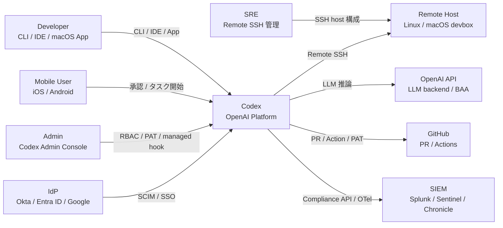
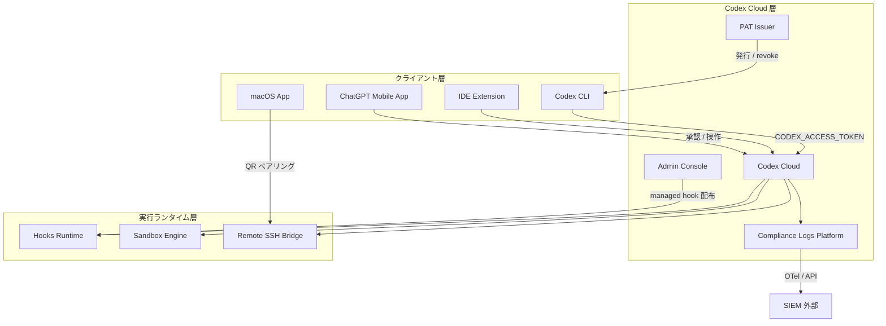
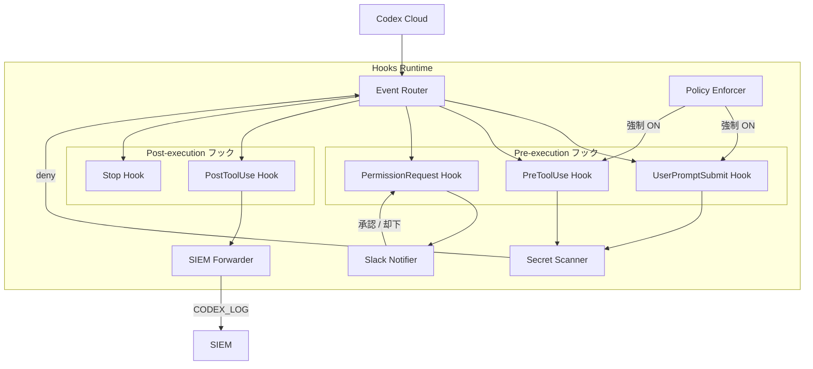
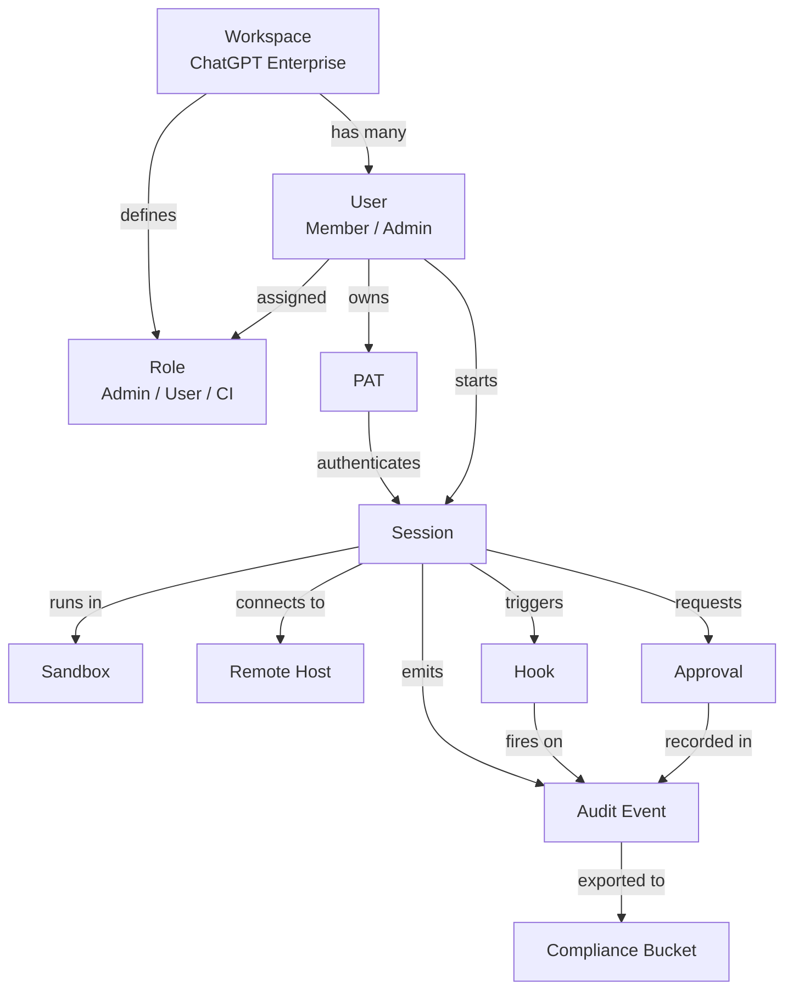
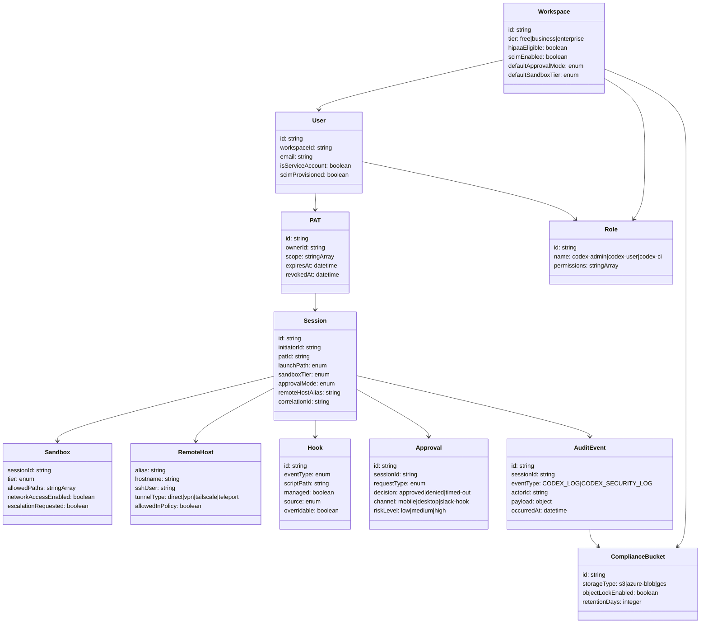

> 調査日: 2026-05-16 / 元発表: 2026-05-14

## 概要

2026 年 5 月 14 日、OpenAI は Codex に対して 5 機能を同日に発表しました。発表内容は Remote SSH 一般提供、Hooks 一般提供、Programmatic Access Tokens、ChatGPT モバイル承認 (preview)、HIPAA 対応 local Codex です。タイトル「Work with Codex from anywhere」が示すとおり、これは個別機能の追加ではありません。コーディングエージェントを承認・監査・実行・コンプライアンスの運用基盤に乗せる「運用基盤化の宣言」です。

対象ユーザは 3 層に分かれます。個人開発者には Remote SSH と Hooks (全プラン提供) が主な恩恵をもたらします。チーム・Business プランには PAT による CI/CD 統合が加わります。ChatGPT Enterprise の eligible workspace では HIPAA 対応の BAA 対象として local Codex が利用可能になります。

5 機能の関係は次のように整理できます。Remote SSH が実行境界を手元 Mac から本番ジャンプホストや staging Linux へ広げます。ChatGPT モバイル承認が承認導線をデスクトップ外に延伸します。Hooks は実行パスと承認パスの両方に割り込み、secret scan・ポリシー強制・SIEM 連携を可能にする監査基盤の接合点として機能します。PAT は人の操作を経ずに CI が Codex を起動する自動化主体を提供します。HIPAA 対応はこれら全体を規制産業に持ち込むためのコンプライアンス境界を画定します。

この同時 GA が示す戦略的意味は、Codex が「CLI / IDE / Cloud / Mobile / Remote SSH / GitHub Action / PAT」の 7 経路から起動できる唯一の主要 AI コーディングツールになった点にあります。一方、承認モードをユーザが `never` まで下げられる柔軟性は、組織側に管理責務を移す設計でもあります。Remote SSH が本番環境への到達経路を開いた事実は、PCI / SOX / HIPAA の production access path として監査要件が変わることを意味します。運用基盤化の宣言は同時に、ガバナンスを組織が設計・実施しなければならない宣言でもあります。

## 特徴

- Remote SSH GA (全プラン): `~/.ssh/config` の concrete host alias を解読、macOS Codex App / CLI / IDE Extension / ChatGPT Mobile から OpenSSH 経由でリモートホストに Codex server を起動。VPN / Tailscale 経由・最小権限アカウント・公衆網直接公開禁止を公式推奨
- Hooks GA (全プラン, 6 イベント): `SessionStart` / `PreToolUse` / `PermissionRequest` / `PostToolUse` / `UserPromptSubmit` / `Stop`。`config.toml` インラインまたは `hooks.json` 別ファイルで設定。`requirements.toml` 経由の managed hook はユーザー上書き不可
- Hooks のセキュリティ用途: prompt 内 API key 検出によるブロック、ターン終了時のカスタムバリデーション、会話要約による永続メモリ自動生成、ポリシー強制の 4 用途を公式明記
- Programmatic Access Tokens (Business・Enterprise 限定): ChatGPT admin console で名前と有効期限を指定して発行。環境変数 `CODEX_ACCESS_TOKEN` で `codex exec` を非対話実行。推奨有効期限 7 / 30 / 60 / 90 日、最短 1 日。発行直後にのみ表示、即時 revoke 可
- PAT のセキュリティ制約: token を持つ者は creator として Codex run を起動できる仕様。secret manager 保管・ログ除外・ローテーション必須。人の identity を借りる構造のため、退職リスク回避には dedicated service account が必要
- ChatGPT モバイル承認 (iOS / Android, Preview, 全プラン rolling out): macOS Codex App でセットアップ、ChatGPT モバイルで QR コードをスキャンしてホストを紐付け。実行可能な操作はスレッド開始・継続・コマンド承認・findings レビュー・live diffs / terminal output / test results 閲覧・モデル切替。ファイル・credentials・permissions はホスト側に残り、phone には更新ストリームのみ流れる
- HIPAA-compliant local Codex (ChatGPT Enterprise の eligible workspace 限定): 対象環境は local 環境 (Codex CLI / IDE Extension / Codex App) のみ。Codex cloud / web 実行は HIPAA スコープ外。BAA の対象範囲に local Codex が含まれる形
- プラン別提供範囲: Remote SSH と Hooks は全プラン。PAT は Business / Enterprise のみ。HIPAA 対応は Enterprise の eligible workspace のみ
- Compliance Logs Platform (Enterprise): Compliance API に `CODEX_LOG` / `CODEX_SECURITY_LOG` typed event。保持期間 30 日、長期保持は自前ダウンロードが必要と公式明記
- 承認モードと sandbox の 4×3 設定: 承認設定は `untrusted` / `on-request` / `on-failure` / `never` の 4 段階。sandbox は `read-only` / `workspace-write` / `danger-full-access` の 3 段階
- 起動経路の多様性: CLI / IDE Extension / Codex App (macOS) / ChatGPT Mobile / ChatGPT Web / Remote SSH / GitHub Action / PAT 経由スクリプトの 8 経路

## 構造

### システムコンテキスト図



| 要素 | 説明 |
|---|---|
| Developer | CLI / IDE Extension / macOS App から Codex を操作するエンジニア |
| SRE | Remote SSH の接続先ホストを管理、Tailscale / VPN を運用 |
| Admin | ChatGPT Admin Console で RBAC・PAT・managed hook を管理。Workspace Owner と分離推奨 |
| Mobile User | iOS / Android ChatGPT アプリでタスクを承認・開始 |
| Codex | コーディングエージェントのプラットフォーム本体 |
| GitHub | PR 管理・Actions・Secret Scanning Push Protection を提供 |
| OpenAI API | LLM 推論バックエンド。Enterprise では BAA の対象 |
| Remote Host | Codex が SSH 経由で接続するリモート devbox / サーバ |
| SIEM | Compliance API ログを集約 |
| IdP | SCIM で Codex Admin グループと workspace メンバーを管理 |

### コンテナ図



| コンテナ | 説明 |
|---|---|
| Codex CLI | ターミナルからの非対話実行・CI exec。`CODEX_ACCESS_TOKEN` 環境変数で動作 |
| IDE Extension | VS Code / JetBrains から Codex セッションを起動 |
| macOS App | デスクトップ GUI、Remote SSH 初期セットアップ・QR ペアリング発行元 |
| ChatGPT Mobile App | iOS / Android で承認 UI・タスク開始・findings レビュー |
| Codex Cloud | LLM 推論・タスク管理・承認フローを担う実行基盤 |
| PAT Issuer | Access Tokens 管理機能。発行・revoke・有効期限設定 |
| Admin Console | RBAC・SCIM 連携・Codex Policies・managed hook 配布の一元管理 |
| Compliance Logs Platform | typed event を 30 日保持、自前 S3 ミラー前提 |
| Hooks Runtime | `config.toml` / `hooks.json` / `requirements.toml` のフックスクリプトを実行 |
| Sandbox Engine | エージェント操作権限を 3 段階で制御 |
| Remote SSH Bridge | `~/.ssh/config` の host alias を解決、OpenSSH 経由で Codex server を起動 |

### コンポーネント図

対象コンテナは Hooks Runtime です。組織ガバナンスの中核として、secret scan・ポリシー強制・SIEM 連携・承認自動化のすべてが集約されます。



| コンポーネント | 説明 |
|---|---|
| Event Router | Codex Cloud からのイベント種別を判定、対応する hook チェーンを順次起動 |
| UserPromptSubmit Hook | プロンプト処理前に Secret Scanner で秘匿情報を検査 |
| PreToolUse Hook | bash・apply_patch・MCP ツール呼び出しの実行前検査、deny シグナルを返却 |
| PermissionRequest Hook | sandbox escalation 要求を受け取り Slack Notifier 経由で承認 / 却下 |
| PostToolUse Hook | ツール実行後の結果を SIEM Forwarder に転送、correlation ID 付与 |
| Stop Hook | 会話終了時に会話要約を `.codex/memory` に書き込み |
| Policy Enforcer | managed hook を最優先解決、ユーザー上書きを禁止 |
| Secret Scanner | gitleaks / TruffleHog 呼び出し、API キー・トークン等を正規表現で検出 |
| SIEM Forwarder | PostToolUse イベントを HEC / Sentinel Ingestion API に転送 |
| Slack Notifier | PermissionRequest 発生時に承認チャンネルへ interactive message を送信 |

## データ

### 概念モデル



| エンティティ | 説明 |
|---|---|
| Workspace | ChatGPT Enterprise/Business のテナント単位、SCIM・RBAC・HIPAA eligibility の境界 |
| User | Workspace のメンバー、人間アカウントまたは dedicated service account |
| Role | Codex Admin / Codex User / CI Service Account の 3 階層、最も寛容な権限ルールで解決 |
| PAT | Business/Enterprise 限定の Programmatic Access Token、CI/CD 自動化で使用 |
| Session | Codex の一実行単位、起動経路は 7 種類 |
| Sandbox | Session の実行境界、3 段階 |
| Remote Host | `~/.ssh/config` 経由で接続する外部 Linux/macOS ホスト |
| Hook | 6 種類のイベントで外部スクリプトを差し込む仕組み |
| Approval | Codex がユーザーに承認を求めるイベント |
| Audit Event | Compliance API が出力する typed イベント |
| Compliance Bucket | 外部の S3 / Azure Blob、30 日保持を超える保管先 |

### 情報モデル



| エンティティ | フィールド | 説明 |
|---|---|---|
| Workspace | tier | free / business / enterprise、PAT は business 以上 |
| Workspace | hipaaEligible | Enterprise の eligible workspace のみ true |
| Workspace | defaultApprovalMode | 組織既定値、`never` は禁止推奨 |
| User | isServiceAccount | CI 専用の dedicated service account は true |
| PAT | expiresAt | 推奨 7 / 30 / 60 / 90 日、最小 1 日、`auth.json` は 8 日で自動更新 |
| Session | launchPath | 7 経路 |
| Session | correlationId | SSH セッションログとの突合用 |
| Sandbox | tier | read-only / workspace-write / danger-full-access |
| RemoteHost | tunnelType | VPN / Tailscale 推奨 |
| Hook | managed | true なら上書き不可 |
| Hook | source | system / mdm / cloud / requirements-toml / user |
| Approval | channel | mobile / desktop / slack-hook |
| AuditEvent | eventType | CODEX_LOG / CODEX_SECURITY_LOG |
| ComplianceBucket | retentionDays | Compliance Logs Platform は 30 日、自前バケットで延長 |
| ComplianceBucket | objectLockEnabled | S3 Object Lock 推奨、改ざん防止 |

## 構築方法

### ワークスペースの初期設定 (Admin)

Business または Enterprise プランが前提です。Codex Admin ロールは Workspace Owner と分離して付与します。RBAC は 3 階層で設計します。

| ロール | 権限 |
|---|---|
| codex-admins | Workspace Analytics 閲覧、Codex Policies 編集、Cloud Environments 管理 |
| codex-users | 開発者、本番 SSH 接続権限なし |
| codex-ci | dedicated service account、人の identity を借りない |

承認モード 4 段階の使い分けを以下に示します。

| モード | 挙動 | 推奨用途 |
|---|---|---|
| `untrusted` | ほぼすべての操作を承認要求 | 本番 SSH 接続先 |
| `on-request` | エージェントが明示的に要求したとき | 組織既定値 |
| `on-failure` | sandbox 失敗時のみ | staging 環境 |
| `never` | 承認なし | 禁止 |

### SSO / SCIM 連携

対応 IdP は Okta、Microsoft Entra ID、Google Workspace、OneLogin です。SCIM で IdP グループをリアルタイムに同期し、退職時の RBAC 喪失を自動化します。退職者のクレデンシャル回収チェックリストは次のとおりです。

- IdP アカウント無効化 → SCIM で ChatGPT ロール即時剥奪
- SSH 公開鍵をリモートホストの authorized_keys から削除
- その人が発行した PAT を Admin Console から失効
- GitHub PAT / Vault トークンも別途回収

### managed hook の配布

Codex の hook 設定は優先順位が高い順に上書きします。

| 優先度 | ソース |
|---|---|
| 1 | MDM (Jamf / Intune) 経由の requirements.toml |
| 2 | Cloud-managed group の requirements.toml |
| 3 | リポジトリ直下の .codex/requirements.toml |
| 4 | ユーザーの ~/.codex/config.toml |

managed hook は `requirements.toml` で強制 ON にします。

```toml
# .codex/requirements.toml
[features]
hooks = true

[hooks.managed]
secret_scan  = "~/.codex/hooks/secret_scan.sh"
deny_rules   = "~/.codex/hooks/deny_rules.sh"
audit_logger = "~/.codex/hooks/audit_logger.sh"
```

secret scan hook の実装例を示します。

```bash
#!/usr/bin/env bash
# ~/.codex/hooks/secret_scan.sh
set -euo pipefail

INPUT=$(cat)
CONTENT=$(echo "$INPUT" | jq -r '.content // .arguments // ""')

if echo "$CONTENT" | gitleaks detect --source - --no-git -q 2>/dev/null; then
  echo '{"permissionDecision": "allow"}'
  exit 0
fi

if echo "$CONTENT" | grep -qE 'AKIA[0-9A-Z]{16}|xoxb-[0-9A-Za-z-]+|sk-[A-Za-z0-9]{48}'; then
  echo '{"permissionDecision": "deny", "reason": "secret detected"}' >&2
  exit 2
fi

echo '{"permissionDecision": "allow"}'
```

deny rule hook の実装例を示します。

```bash
#!/usr/bin/env bash
# ~/.codex/hooks/deny_rules.sh
INPUT=$(cat)
TOOL=$(echo "$INPUT" | jq -r '.tool // ""')
ARGS=$(echo "$INPUT" | jq -r '.arguments // "" | tostring')

if echo "$ARGS" | grep -qE 'prod[-_]?(db|database|rds)'; then
  echo '{"permissionDecision": "deny", "reason": "direct production DB access denied"}' >&2
  exit 2
fi

if [[ "$TOOL" == "bash" ]] && echo "$ARGS" | grep -qE 'rm\s+-rf\s+/'; then
  echo '{"permissionDecision": "deny", "reason": "rm -rf / is forbidden"}' >&2
  exit 2
fi

echo '{"permissionDecision": "allow"}'
```

### Remote SSH の準備

`~/.ssh/config` の設定例を示します。

```sshconfig
Host codex-staging
  HostName 10.0.1.50
  User codex-runner
  IdentityFile ~/.ssh/id_ed25519_codex
  ForwardAgent no
  StrictHostKeyChecking yes
  UserKnownHostsFile ~/.ssh/known_hosts_codex

Host codex-prod-jump
  HostName codex-prod.tailnet.example.com
  User codex-readonly
  IdentityFile ~/.ssh/id_ed25519_codex_prod
  StrictHostKeyChecking yes
```

Tailscale を使ったリモートホスト準備の例を示します。

```bash
curl -fsSL https://tailscale.com/install.sh | sh
sudo tailscale up --authkey=tskey-auth-XXXX --hostname=codex-devbox-staging

sudo useradd -m -s /bin/bash codex-runner
sudo mkdir -p /home/codex-runner/.ssh
sudo cp /etc/codex-runner-authorized_keys /home/codex-runner/.ssh/authorized_keys
sudo chown -R codex-runner:codex-runner /home/codex-runner/.ssh
sudo chmod 700 /home/codex-runner/.ssh
sudo chmod 600 /home/codex-runner/.ssh/authorized_keys
```

## 利用方法

### Codex CLI の基本実行

```bash
npm install -g @openai/codex
codex auth login

codex "src/api/user.ts の handleLogin 関数に入力バリデーションを追加して"
codex --include src/api/user.ts "エラーハンドリングを追加"
codex --approval-mode on-request "テストを書いて"
codex --sandbox read-only "このリポジトリの依存関係グラフを教えて"
codex --dry-run "package.json の依存を最新版に更新して"
```

### Remote SSH での開発

```bash
codex --remote codex-staging \
  "staging DB のスロークエリログを分析して改善案を提案して"

codex --remote codex-staging \
  --include "src/**/*.ts" \
  "TypeScript の型エラーをすべて修正して"

CODEX_SESSION_ID=$(uuidgen) \
  codex --remote codex-staging \
  "deploy スクリプトのバグを修正して"
```

### Programmatic Access Token を CI で使う

GitHub Actions の例を示します。`auth.json` は 8 日で自動 refresh する仕様のため、Vault に書き戻す構成にします。

```yaml
name: Codex Code Review

on:
  pull_request:
    branches: [main, develop]

jobs:
  codex-review:
    runs-on: self-hosted
    if: github.event.pull_request.head.repo.full_name == github.repository

    steps:
      - uses: actions/checkout@v4
        with:
          fetch-depth: 0

      - name: Restore Codex auth from Vault
        env:
          VAULT_ADDR: ${{ secrets.VAULT_ADDR }}
          VAULT_TOKEN: ${{ secrets.VAULT_TOKEN }}
        run: |
          mkdir -p ~/.codex
          vault kv get -field=auth_json secret/codex/ci-runner \
            | base64 -d > ~/.codex/auth.json
          chmod 600 ~/.codex/auth.json

      - name: Refresh Codex auth
        env:
          CODEX_PAT: ${{ secrets.CODEX_PAT }}
        run: |
          codex auth refresh --token "$CODEX_PAT" || \
            echo "::warning::auth refresh failed"

      - name: Run Codex Review
        env:
          CODEX_PAT: ${{ secrets.CODEX_PAT }}
        run: |
          CHANGED_FILES=$(git diff --name-only origin/main...HEAD \
            | grep -E '\.(ts|py|go|java)$' | head -20)
          if [ -z "$CHANGED_FILES" ]; then exit 0; fi
          codex \
            --auth-token "$CODEX_PAT" \
            --sandbox read-only \
            --approval-mode never \
            --output json \
            "コードレビューを実施: $CHANGED_FILES" > codex-review-result.json
          REVIEW=$(jq -r '.output' codex-review-result.json)
          gh pr comment "${{ github.event.pull_request.number }}" --body "## Codex Review
          $REVIEW"

      - name: Cleanup
        if: always()
        run: rm -f ~/.codex/auth.json
```

### モバイル承認フロー

モバイル承認 UI で確認すべき 6 項目を以下に示します。

| 番号 | 項目 |
|---|---|
| 1 | 起動者 ID |
| 2 | 対象ホスト (Remote SSH の場合) |
| 3 | Sandbox 種別 / Escalation 要求 |
| 4 | Prompt 冒頭 200 文字 |
| 5 | 影響ファイルパス |
| 6 | Network access 要求の有無 |

承認・却下の判断基準を以下に示します。

| 表示内容 | 判断 |
|---|---|
| Sandbox escalation あり (workspace-write → danger-full-access) | 必ず却下して再確認 |
| Network access 要求あり + 対象ホストが prod | 却下 |
| 起動者 ID が service account | 自動化タスク、diff を PR で確認 |
| Prompt 冒頭が指示内容と一致しない | 却下、プロンプトインジェクションの可能性 |
| `rm` / `drop` / `delete` を含む bash 呼び出し | 慎重に確認、本番系なら却下 |

## 運用

### 監査ログ (Compliance Logs Platform)

Compliance Logs Platform は 30 日保持です。SOX / HIPAA / ISO 27001 のいずれも 30 日では不足するため、初日から自前アーカイブ基盤を組み込みます。

推奨アーキテクチャは次のとおりです。

- Compliance API の `/logs` を 1 時間ポーリングでバッチ取得
- 取得した JSONL を S3 (Object Lock COMPLIANCE モード、最低 7 年) へ転送
- `CODEX_LOG` / `CODEX_SECURITY_LOG` を S3 Intelligent-Tiering で保管
- ログ取得 job 失敗時は Slack に即時アラート

Google Chronicle には OpenAI audit log 専用パーサーが存在し、`CODEX_LOG` / `CODEX_SECURITY_LOG` event type を解析できます。Splunk / Sentinel は HEC または ingestion API 経由で構成します。

### PAT ライフサイクル管理

- 発行: Business / Enterprise tier 限定、CI 用途は 30 日以下を推奨
- dedicated service account: 人の identity に紐付かない構成が必須
- 回転: 期限 14 日前に Slack アラートを上げる nightly job
- 失効: SCIM deprovision で ChatGPT account を失効、PAT を連鎖的に無効化
- `auth.json` 8 日 refresh: ephemeral runner では起動時に secure storage から復元

### 承認 SLA

組織既定値は `on-failure` 以上に固定します。`never` は組織レベルで禁止します。本番 SSH 接続を伴うタスクは `read-only` sandbox を既定とします。"Timed out" 状態はデフォルト deny とし、自動 retry させません。

### インシデント対応

CVE 監視ソースを以下に示します。

| 情報源 | 主な監視対象 |
|---|---|
| BeyondTrust Phantom Labs | Codex CLI / SDK / IDE Extension の command injection / token 流出系 CVE |
| Adversa AI / Penligent | deny rule サイレントバイパス、Hooks セキュリティバイパス |
| Cymulate | Configuration-Based Sandbox Escape (CBSE) |
| Check Point Research | Claude Code / Codex 系の RCE、API token exfiltration |
| NVD / GitHub Security Advisories | Codex 関連 CVE の正式登録 |

インシデント発生時の初動手順を以下に示します。

1. PAT を即時失効
2. `auth.json` をすべての runner から削除
3. SSH 接続先ホストの auditd ログと Compliance API ログを突合
4. Hook 経由での secret 流出の可能性を UserPromptSubmit / PreToolUse 履歴で確認
5. OpenAI Trust Portal でインシデント通知を確認

## ベストプラクティス

### 誤解と反証 (主要 6 項目)

**1. 「PAT を使えばトークン管理が楽になる」**

- 誤解: PAT を CI に発行すれば認証管理がシンプルになる
- 反証: Codex CLI / SDK / IDE Extension / ChatGPT Web の全チャネルに影響した Unicode コマンドインジェクション CVE が 2026 年 2 月にパッチ済みです (BeyondTrust Phantom Labs)。branch 名に U+3000 を埋め込み GitHub User Access Token を curl で送出する手口です。2025 年の tj-actions / SpotBugs 事件では PAT 起点のサプライチェーン攻撃が 23,000 リポジトリに波及しました
- 推奨: PAT は dedicated service account に発行、30 日 TTL を上限にします。secret scan hook を managed hook として強制 enable します

**2. 「Hooks でガバナンスを実装すれば安全」**

- 誤解: PreToolUse / PostToolUse Hooks に deny rule を書けば組織ポリシーを強制できる
- 反証: Claude Code (Codex と同型) で 50 個以上の subcommand を `&&` / `||` / `;` で繋ぐと deny rule がサイレントに無効化されます (Adversa AI / Penligent)。`.claude/settings.json` 経由の RCE が CVE-2025-59536 / CVE-2026-21852 として確認されています。Codex `.codex/` も同型リスクを構造的に持ちます
- 推奨: OS / コンテナ層のサンドボックスを先に整備し、Hooks は二次の検知層と位置づけます

**3. 「モバイル承認で人間の監督を確保できる」**

- 誤解: モバイル承認で人間が常にエージェントを監督できる
- 反証: push bombing (MFA fatigue) は 2025 年公的セクター攻撃の 20% 以上で成功しています (Dark Analytics, BeyondTrust)。Uber / Cisco / MGM / Marks & Spencer の侵害で使われた手法です。スマホ画面でコード差分を精査する行為はレビューとして機能しません
- 推奨: モバイル承認の役割を「start/stop 制御」に限定します。コード変更承認は PC ブラウザ + フル diff + number matching を必須とします

**4. 「Codex Enterprise なら HIPAA ワークロードに使える」**

- 誤解: Enterprise の eligible workspace なら全機能を HIPAA 対応として使える
- 反証: BAA 提供は「Enterprise の eligible workspace における local Codex」に限定されます。Remote SSH 経由 Linux ホストが covered かは未確認です。AI 生成コードがエラーハンドラに request/response 全体をログ出力する傾向があり、PHI が制御不能な場所に溜まります
- 推奨: HIPAA workload は local CLI / IDE 限定にします。Remote SSH は別 workspace で隔離します。OpenAI Enterprise sales 経由で BAA 範囲を個別確認します

**5. 「承認モード設定でエージェントの暴走を防げる」**

- 誤解: approval mode を適切に設定すれば破壊的操作を防げる
- 反証: Cursor は本番 DB と volume-level バックアップを 9 秒で全消失するインシデントを起こし、エージェント自身が「I guessed instead of verifying」と証言しました (PocketOS / The Register)
- 推奨: 本番系 credentials を Codex から完全に隔離します。本番 SSH は別ロール・別 workspace に分離します

**6. 「エージェントは指示した操作だけを行う」**

- 誤解: 指示を明確に書けばエージェントは指示通りに動く
- 反証: AI 駆動の lateral movement がエージェントセッション経由で 80〜90% の戦術的操作を自律実行したインシデントが報告されています (Unit42 / The Hacker News)。10,000 LoC 超のプロジェクトでは精度が約 50% に低下します
- 推奨: 用途を「再現手順のある bounded バグ修正」「小規模な単一目的タスク」に限定します。エージェント出力は人間レビューを必須工程にします

### OWASP / NIST マッピング

| フレームワーク | 該当項目 | Codex 文脈での解釈 |
|---|---|---|
| OWASP LLM Top 10 (2025) LLM06 | Excessive Agency | Remote SSH + Hooks + mobile approval の組み合わせは Excessive Functionality / Permissions / Autonomy の 3 要件を同時充足 |
| OWASP LLM Top 10 (2025) LLM03 | Supply Chain | Codex がパッケージを引いてビルドを走らせる挙動は LiteLLM 型 compromise の経路 |
| OWASP Agentic AI Top 10 ASI04 | Agentic Supply Chain | MCP 経由ツール / dynamic prompt / Hooks の compromise |
| NIST AI RMF 1.0 + CSA Agentic Profile | agentic system の autonomy 扱い不足 | AAGATE 相当の Kubernetes-native policy engine を別途整備 |

## トラブルシューティング

### Remote SSH 接続失敗

- TOFU エラー: SSH CA を組織運用し SSHFP DNSSEC を併用、`StrictHostKeyChecking no` は禁止
- `~/.ssh/config` 解決: パーミッション (700 / 600)、`IdentityFile`、ProxyJump を確認
- VPN / Tailscale: 公衆網直接 SSH は非推奨、Tailscale ACL で接続ログを admin console から確認

### Hooks が起動しない / 想定外実行

- managed hook 配布失敗: `requirements.toml` の配置、MDM プロファイル、`[features].hooks=true` を確認
- 設定パス: `.codex/` ディレクトリ、untrusted repository を開く前に確認
- 上書き禁止仕様: managed hook はユーザー上書き不可、変更は Codex Admin のみ
- deny rule サイレントバイパス: 監査ログに記録されない可能性、多層防御で対応

### PAT 認証失敗

- `auth.json` 8 日 expiration: 8 日ごとに `codex auth refresh` を nightly job で実行
- PAT 期限切れ: 最小 1 日、最大 90 日、期限 14 日前のアラート設定
- service account の OAuth 問題: MFA を企業 SSO に統合、OIDC / SAML で認証

### Compliance Logs が SIEM に流れない

- OTel 設定: Codex 側で有効化、egress allowlist、SIEM コネクタ設定を確認
- API ポーリング: PAT 期限、rate limit (429)、ページネーション、event type フィルタを確認
- 30 日 retention: S3 への連続コピー基盤を初日から稼働、Object Lock を COMPLIANCE モードで設定

## まとめ

OpenAI が 2026 年 5 月 14 日に Codex へ 5 機能を同時 GA したことで、コーディングエージェントは「IDE 内の補助」から「承認・監査・実行・コンプライアンス」の運用基盤に乗る存在へと変わりました。一方、承認モードを下げられる柔軟性と Remote SSH の到達経路は組織側に管理責務を移す設計でもあり、PAT・Hooks・モバイル承認・HIPAA 境界の運用設計を欠くと攻撃面を広げる側面もあわせ持ちます。

この記事が少しでも参考になった、あるいは改善点などがあれば、ぜひリアクションやコメント、SNSでのシェアをいただけると励みになります！

## 参考リンク

- OpenAI 公式
  - [Work with Codex from anywhere (リリース告知)](https://openai.com/index/work-with-codex-from-anywhere/)
  - [Codex Changelog](https://developers.openai.com/codex/changelog)
  - [Remote connections – Codex](https://developers.openai.com/codex/remote-connections)
  - [Hooks – Codex](https://developers.openai.com/codex/hooks)
  - [Access tokens – Codex](https://developers.openai.com/codex/enterprise/access-tokens)
  - [Agent approvals & security – Codex](https://developers.openai.com/codex/agent-approvals-security)
  - [Admin Setup – Codex](https://developers.openai.com/codex/enterprise/admin-setup)
  - [Governance – Codex](https://developers.openai.com/codex/enterprise/governance)
  - [Maintain Codex account auth in CI/CD](https://developers.openai.com/codex/auth/ci-cd-auth)
  - [GitHub Action – Codex](https://developers.openai.com/codex/github-action)
  - [Compliance API for Enterprise Customers](https://help.openai.com/en/articles/9261474)
  - [How can I get a BAA with OpenAI](https://help.openai.com/en/articles/8660679)
- セキュリティリサーチ・CVE
  - [BeyondTrust Phantom Labs: Codex コマンドインジェクション CVE](https://www.beyondtrust.com/blog/entry/openai-codex-command-injection-vulnerability-github-token)
  - [Check Point: CVE-2025-59536 (Claude Code RCE)](https://research.checkpoint.com/2026/rce-and-api-token-exfiltration-through-claude-code-project-files-cve-2025-59536/)
  - [Adversa AI: deny rule サイレントバイパス](https://adversa.ai/blog/claude-code-security-bypass-deny-rules-disabled/)
  - [Cymulate: Configuration-Based Sandbox Escape](https://cymulate.com/blog/the-race-to-ship-ai-tools-left-security-behind-part-1-sandbox-escape/)
  - [The Register: Cursor 本番 DB 消失](https://www.theregister.com/2026/04/27/cursoropus_agent_snuffs_out_pocketos/)
  - [Wiz: tj-actions サプライチェーン攻撃](https://www.wiz.io/blog/github-action-tj-actions-changed-files-supply-chain-attack-cve-2025-30066)
- MFA / 承認セキュリティ
  - [BeyondTrust: MFA Fatigue Attack](https://www.beyondtrust.com/resources/glossary/mfa-fatigue-attack)
  - [Dark Analytics: MFA Bombing 2025](https://www.darkanalytics.com/post/the-rising-threat-of-mfa-bombing-in-2025-understanding-and-defending-against-push-notification-fatigue)
- HIPAA / コンプライアンス
  - [Aptible: HIPAA Compliant AI](https://www.aptible.com/trust/hipaa/hipaa-compliant-ai)
  - [Augment Code: HIPAA AI Coding Guide](https://www.augmentcode.com/guides/hipaa-compliant-ai-coding-guide-for-healthcare-developers)
- OWASP / NIST / SIEM
  - [OWASP LLM Top 10 (2025)](https://owasp.org/www-project-top-10-for-large-language-model-applications/)
  - [OWASP Agentic Skills Top 10](https://owasp.org/www-project-agentic-skills-top-10/)
  - [NIST AI RMF 1.0](https://www.nist.gov/itl/ai-risk-management-framework)
  - [CSA Agentic NIST AI RMF Profile](https://labs.cloudsecurityalliance.org/agentic/agentic-nist-ai-rmf-profile-v1/)
  - [Chronicle OpenAI audit log パーサー](https://docs.cloud.google.com/chronicle/docs/ingestion/default-parsers/openai-auditlog)
