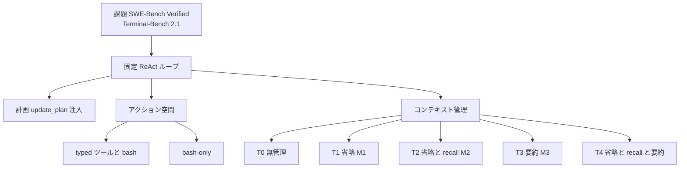

コーディングエージェントの現場差は、モデルカードだけでは説明しきれません。
同じモデルでも、計画の入れ方、使える操作、文脈の圧縮の仕方が違えば、成功率とコストは別物になります。

Fan、Zhang らは [An Empirical Study of Harness Design for Coding Agents](https://arxiv.org/abs/2609.20804) で、ループを固定した軽量ハーネスの上で、計画、アクション空間、コンテキスト管理の 3 成分だけを動かします。
本稿は、その条件付き効果を、発注と自前ハーネスの測り方として再構成します。

対象読者は、コーディングエージェントを選ぶ、または自前ハーネスのノブを決める発注側です。

:::message alert
本記事は 2026-09-17 投稿の arXiv preprint（[arXiv:2609.20804v1](https://arxiv.org/abs/2609.20804)、ピンは v1）を解説したものです。会議採録の一次証拠は確認していません。
:::

*この記事の全体像。以下、順に解説します。*

## コーディングエージェントのハーネスとは

**コーディングハーネス**は、モデル能力を長ホライズンのソフトウェア工学性能へ翻訳する実行層です。
本論文の対象は、その実行層のうち、計画、アクション空間、コンテキスト管理の 3 ノブです。

固定するのは **ReAct ループ**です。
その上で次だけを変えます。

- **計画**：`update_plan` と毎ターン注入。会話履歴には積まない
- **アクション空間**：typed ツール一式か bash-only。web search は SWE 漏洩回避で除外
- **コンテキスト管理**：T0 から T4 の 5 段。窓予算は 32k、64k、96k、128k

モデルは Nemotron-3 の 30B、120B、550B と Mistral-Medium-3.5-128B です。
ベンチは SWE-Bench Verified（500 課題）と Terminal-Bench 2.1（89 課題）です。
条件は 176 です。
所属は UMass Amherst、Emory、UNC Charlotte、Zoom です。
Fan と Zhang が equal contribution です。
一部は Zoom インターン期間の成果です。
連絡先は Xiaoyang.W@zoom.us です。

文脈は preamble と直近ターンを残し、中間だけを圧縮します。

T4 は M1、M2、M3 を重ねます。
軟閾値 B1 は窓の 0.6 で省略し、recall 可能にします。
なお溢れたら硬閾値 B2 は 0.85 で要約します。
T1 から T3 は単一動作なので B2 のみです。

固定のまま残るものもあります。
workspace ガード、read-before-write、permission、編集後診断（ruff、pyflakes）、stuck 検出です。
stuck 検出は、同一呼び出し 5 回、または同一失敗 5 回で注意し、同一失敗 8 回で打ち切ります。

176 条件の内訳は次です。

| 軸 | 値 |
|---|---|
| モデル | 4 |
| ベンチ | 2 |
| 文脈 | 5 段 × 4 窓 = 20 |
| 追加 ablation | 計画 OFF、bash-only（いずれも T4、128k） |
| 合計 | 4 × 2 × 22 = 176 |

サービングは SGLang BF16 です。
温度 0、top-p 0.95 です。
出力上限は 16,384 token/ターンです。
最大 300 step です。
ツール結果は 24k 文字で切ります。
読み取り専用は 1 ステップ最大 8 並列です。

軌跡は LLM 判定（GPT-5.5）で位相ラベルを付けます。
人間 3 名が 200 軌跡、15,610 単位を見ます。
judge と human の加重平均 Cohen's κ は 0.929 です。

コストは OpenRouter 価格です。
論文は 2026-08 取得と記載します。

| モデル | 入力 / 出力 USD per 1M token |
|---|---|
| Nemotron-3 30B | 0.05 / 0.20 |
| Nemotron-3 120B | 0.08 / 0.45 |
| Nemotron-3 550B | 0.50 / 2.20 |
| Mistral-Medium-3.5-128B | 1.50 / 7.50 |

## 注意点

本論文は「どのハーネスが一番強いか」を決めていません。
特定実装の条件付き効果です。

計画とアクション空間の ablation は T4、128k だけです。
full factorial ではありません。
各条件は課題あたり 1 run です。
Terminal-Bench は 89 課題です。
McNemar で有意にならない対比が多く残ります。

モデルは Nemotron-3 の 3 サイズと Mistral 1 本です。
Claude 系、GPT 系への交差点は未検証です。
SWE-Bench Verified は Python のみです。

アクション空間はツール数だけではありません。
プロンプト、file-state、編集後診断の束です。
T4 の効率優位は、T1 から T3 と閾値が違うことと交絡し得ます。

コードと軌跡の公開 URL は abs と本文にありません（2026-09-19 確認）。
既発信の 7 構成要素地図（[arXiv:2609.00006](https://arxiv.org/abs/2609.00006)）は本論文が引用していません。
後述の接続は本稿の整理です。

数値はすべて v1 本文と表から直接読みます。

## コンテキスト管理は窓が狭いほど効く

モデル平均の managed（T1 から T4）対 T0 の成功率差は、窓が狭いほど大きいです。

| 窓 | SWE-Bench Verified | Terminal-Bench 2.1 |
|---|---|---|
| 32k | 35.7 pp | 9.5 pp |
| 64k | 15.9 pp | 7.5 pp |
| 96k | 5.5 pp | 4.8 pp |
| 128k | 2.7 pp | 2.8 pp |

T0 の overflow 率（モデル平均）は、SWE で 78.7% から 8.7%、TB で 61.0% から 12.1% へ落ちます。
managed 段は全予算で overflow 0 です。

128k でも差が消えるわけではありません。
Nemotron-3 550B の SWE は T0 59.80% に対し T2 67.40%、T4 65.80% です。
論文は McNemar で有意（`*`）とします。
30B の SWE 128k は T0 24.80% と T4 25.20% でほぼ同じです。

軌跡側では、32k の T0 の中央長が 20 から 30 ターンで Localize で落ちます。
managed は 50 から 180 ターンまで延び、Verify に届きます。
128k では段差が小さいです。
30B の中央は 39 から 42、550B は 70 から 74 です。

主効果は「切れずに編集と検証まで進むこと」です。
行動の型そのものは大きく変わりません。

## 規則省略のあとに要約すると平均コストが下がる

論文は T4 を「managed 戦略の中で最も効率が良い」と書きます。
根拠は、平均成功率の近さ、4 モデル × 2 ベンチの 8 パネル中 7 で平均コスト最低、peak-context 比の最低、要約呼び出しの少なさです。

成功率のピークは T4 ではありません。

| 設定 | より高い段 | T4 |
|---|---|---|
| SWE 128k 30B | T2 26.00 | 25.20 |
| SWE 64k 120B | T1 45.40 | 41.80 |
| SWE 32k 550B | T3 58.40 | 55.60 |
| SWE 128k 550B | T2 67.40 | 65.80 |
| SWE 64k Mistral | T1 69.00 | 66.00 |
| TB 128k 30B | T2 16.85 | 13.48 |

30B の TB は 32k T4 と 96k T3 が 17.98% で当該モデル最高（同点）です。
128k T4 は 13.48% に落ちます。
窓を広げても単調に良くなりません。

Lewis 2026（[arXiv:2608.26218](https://arxiv.org/abs/2608.26218)）は、LLM 要約なしの機械省略に stall 検出と command safeguard を足したパッケージ（Yuj treatment）を報告します。
窓 20,480、480 秒固定の SWE-bench Verified 169 課題で、mean F2PF は 28% から 49%、complete solutions は 43 から 72 です。
広い窓 262,144 では差 −0.3 pp（69.0 vs 68.7、区間 [−4.5, +3.9]）です。
これは Fan の T1 単体ではありません。
Lewis 自身は機械規則とモデル要約を比較していません。

運用の既定を「T4 コピー」にはしません。
まず規則で太い観測を削り、それでも溢れるときだけ要約する、という順序は残ります。
閾値と要約の寄与は分離されていません。

## 回復可能な省略はこの実装では使われない

T2 は T1 に `recall_event(id)` を足すだけです。
32 のモデル × ベンチ × 窓対比で、T2 が勝つ 15、負ける 14、引き分け 3 です。
平均差は −0.36 pp です。

Table 13（呼び出し/task の平均）は次です。

- T2、T4 の 64 設定のうち 36（56.3%）が 0 回
- 平均は 32k 0.540 → 64k 0.069 → 96k 0.011 → 128k 0.007
- 最大は 30B TB 32k T2 の 4.326。この設定は T1 より 3.37 pp 低い
- T4、128k の計画とアクション ablation 16 設定はすべて 0

一般化は弱いです。
LCM（Ehrlich と Blackman 2026、[arXiv:2605.04050](https://arxiv.org/abs/2605.04050)）はエンジンが lossless pointer を挿し、モデル自発の ID 呼び出しに頼らない設計です。
Claude Code の `/compact` 後は `CLAUDE.md` をディスクから再注入します（[公式 docs](https://code.claude.com/docs/en/memory)、取得 2026-09-19）。
これらを Fan の recall 未使用で否定してはなりません。

SWE 上で `recall_event(id)` 型が成功率を上げた一次は、反証探索でも見つかりませんでした。

## 計画の効果はモデルサイズだけでは切れない

条件は T4、128k、typed ツールです。
計画 ON 対 OFF は次です。

| モデル | SWE SR on/off | SWE コスト $ | TB SR on/off | TB コスト $ |
|---|---|---|---|---|
| 30B | 25.20 / 13.60* | 0.09 / 0.02 | 13.48 / 08.99 | 0.14 / 0.08 |
| 120B | 44.00 / 46.60 | 0.34 / 0.25 | 28.09 / 28.09 | 0.28 / 0.38 |
| 550B | 65.80 / 67.80 | 2.33 / 3.31 | 44.94* / 46.07 | 2.43 / 2.52 |
| Mistral | 68.60 / 69.00 | 3.14 / 4.65 | 37.08 / 39.33 | 2.22 / 3.71 |

30B SWE は計画で成功率 +11.6 pp です。
編集なし終了は 68.6% から 27.8% へ落ちます。
Localize 停滞は 58.4% から 10.4% へ落ちます。
中央ターンは 5 から 40 です。
ターン数は +293.2%、ツール呼び出しは +474.0% です。

550B SWE はコスト約 30% 減（3.31 から 2.33）、SR は −2.0 pp です。
Mistral SWE はコスト約 32% 減（4.65 から 3.14）、SR は −0.4 pp です。
中央ターンは 108 から 74、68 から 53 です。
削られるのは主に検証ターンです。
強モデルの SR 減は `*` なしです。
検出力不足と区別できません。

二分を壊すセルもあります。

- 120B SWE：計画は SR を下げ、コストを上げる
- 550B TB：SR は計画 OFF の方が高い。コスト差は約 4%。ターンは +6.8%

Liu 2026（[arXiv:2605.05716](https://arxiv.org/abs/2605.05716)）は HotpotQA で単一ツールが All-In を 32% 上回ると報告します（F1 0.233 vs 0.177）。
コーディングベンチではありません。
計画を弱モデルへ無条件追加する根拠にはなりません。

## アクション空間は能力と課題型で交差する

条件は T4、128k、計画 ON です。
typed 対 bash-only は次です。

| モデル | SWE tools / bash | TB tools / bash |
|---|---|---|
| 30B | 25.20 / 10.20* | 13.48 / 03.37* |
| 120B | 44.00 / 42.40 | 28.09 / 23.56 |
| 550B | 65.80 / 69.40* | 44.94 / 50.56 |
| Mistral | 68.60 / 45.40* | 37.08 / 43.82 |

550B の bash-only は SWE で +3.6 pp、コスト −53%（2.33 から 1.11）です。
TB で +5.6 pp、コスト −30%（2.43 から 1.70）です。
呼び出しは SWE −32%、TB −24% です。
再パッチは 4.6 から 1.5 です。
最大編集の中央は 18 から 54 行です。

30B の bash-only TB は 66% がレジストリに無い tool-call で終わります。
平均軌跡は 71 から 15 ターンです。
bash 熟練度の測定ではなく、学習時語彙とインターフェースの不一致です。

Mistral は SWE で typed が +23.2 pp です。
bash-only の編集なし終了は 32.8% です。
typed は 1.2% です。
未解決のうち file localization 失敗は 16.0% から 41.4% です（Table 10）。
TB では bash 比率 71.9% 対 SWE 40.4% です。
同じモデルでも課題型で符号が反転します。

近接の一体評価として、Cao ら 2026（[arXiv:2603.00729v1](https://arxiv.org/abs/2603.00729) Table 3、SWE-Bench Verified、最大 300 turn）があります。

| モデル | SWE-Agent | MiniSWE-Agent | OpenHands |
|---|---|---|---|
| Claude-Opus-4.5 | 78.2 | 77.8 | 79.0 |
| Claude-Sonnet-4.5 | 76.0 | 68.4 | 74.6 |
| Qwen3-Coder-Next 80A3 | 70.6 | 71.1 | 71.3 |

Sonnet 4.5 は強いモデルでも MiniSWE（bash-only）が SWE-Agent より 7.6 pp 低いです。
Fan 導入部の「Opus は OpenHands、Sonnet は SWE-Agent」は、この表と一致します。

## 7構成要素地図への落とし方

解剖論文（Barbaste ら、[arXiv:2609.00006](https://arxiv.org/abs/2609.00006)）の 7 サブシステムのうち、本実験が動かしたのは 3 です。
Fan の本文はこの地図を引用していません。
対応は本稿の整理です。

| 7 サブシステム | 本実験 |
|---|---|
| Agent loop | 固定 |
| LLM integration | 固定（サイズだけ変える） |
| Tools and actions | 変動 |
| Memory and context | 変動（単一軌跡の compaction。セッション memory ではない） |
| Safety | 固定 |
| Orchestration | 非対象 |
| Extensibility | 非対象 |

計画は独立サブシステムではありません。
loop 上の scaffold と `update_plan` ツールの交差です。

予算と能力別の作業規則は、処方ではなく、この標本での優先順位です。

| 条件 | 文脈 | 計画 | アクション |
|---|---|---|---|
| 窓 32k から 64k | 規則省略を先に。溢れたら要約 | 弱モデルは ON | 語彙が typed に寄るならツールを出す |
| 窓 128k、弱モデル | overflow 以外の寄与は小さい | ON（編集まで生きる） | typed |
| 窓 128k、強モデル、SWE | コスト用に T4 型は候補 | 検証の冗長を切る目的なら ON。SR 目的なら必須ではない | モデルと課題で測る。Mistral は typed |
| 強モデル、CLI 中心 | 同上 | 効果は小さい | bash-only を候補にする |
| 本番の memory と compact | Fan の recall 未使用を移植しない | 対象外 | 対象外 |

独立ノブの greedy 選択は危険です。
Liu の abs は 183/325（56.3%）の劣加法違反を報告します（QA、math。コーディングではない）。
Lewis は solver を model と harness の組として扱えと書きます。
Fan 自身も組み合わせ不足を Limitation に書いています。

## この一次証拠が支える範囲

ハーネス成分の効果は、モデル能力、課題型、窓予算に条件付きです。
一体比較ではメカニズムが混ざります。
ただし 3 ノブを独立に最適合成できる、とはこの実験は示していません。

支持する一次は次です。

- 同一ループ上の 176 条件と McNemar
- overflow 0 対 T0 の高い打ち切り
- 30B の計画による編集到達
- 550B の bash-only での粗い編集とコスト減
- 軌跡判定の人間一致 κ 0.929

反証と制限は次です。

- T4 はピーク SR ではない。閾値が T1 から T3 と違う
- recall 未使用は `recall_event(id)` に閉じる
- 計画の二分は 120B と 550B TB で崩れる
- 30B bash-only 失敗は out-of-inventory
- Sonnet 4.5 では bash-only が SWE で劣る（Cao Table 3）
- Safety、Orchestration、Extensibility は未評価
- Fan 論文へのコミュニティ批判と公式 repo は公開 2 日時点で見つからない

記述（条件付き効果）は残ります。
既定ハーネスのコピー規則としては弱いです。
現場では「まず規則省略、計画は弱モデルの打ち切り対策、ツール集合は語彙と課題型で測る」までが、この一次証拠が支える範囲です。

残る問いは次です。

- 計画とアクションを 32k T1 や 128k T0 と組んだときの符号
- Claude、GPT、Codex での交差点の位置
- エンジン管理の lossless compact が SWE 成功率を上げるか
- 温度 0、1 run の分散
- 公開再現物の所在
- 7 サブシステムの残り 4 を同じ手法で触ったときの寄与

意思決定への影響として、本番ハーネスの全面置換はブロックします。
既存ハーネスの 3 ノブを測る実験設計としては使えます。

## 現場で測る順

芯は「ハーネスは一体スコアで買わず、窓、モデル、課題型で成分を測れ」です。
7 地図の Tools と Memory に、予算別の優先を足します。

自前ハーネスでは、規則省略を要約より前に置きます。
recall ツールを足す前に、stub に何を残すかと再注入経路を決めます。

弱モデル経路では、計画 ON と typed ツールを既定にします。
bash-only に落とすなら、学習時 tool 名の out-of-inventory を先に見ます。

強モデル経路では、計画はコスト用です。
SWE では typed を残す候補を消しません。
CLI バッチだけ bash-only を試します。

検証してから一般化します。
今の runner で T4 相当と計画 ON/OFF を 1 本ずつ測ります。
論文の交差点をそのまま採用しません。

逆転条件は次です。

- 対象モデルが Fan の 4 本とツール語彙が同じ、かつ窓が 32k 級なら、論文の順序をより強く使ってよい
- 本番がディスク再注入や LCM 型 pointer を持つなら、recall 不要の結論を適用しない
- 評価が一体ハーネスの発注比較なら、Cao と Lewis の「組として測る」を優先する

## まとめ

Fan らの実証は、コーディングハーネスを一体スコアで買わず、計画、アクション空間、コンテキスト管理を窓とモデルと課題型の交差で測る設計です。
狭窓では規則省略が編集到達を救い、T4 は平均コストで勝ちやすい一方、成功率のピークではありません。
`recall_event(id)` はこの実装ではほぼ使われません。
計画は 30B の打ち切りを崩し、強モデルではコスト用です。
アクション空間の符号は、550B の bash-only と Mistral の typed、Sonnet 4.5 の MiniSWE 劣位が同時に残ります。

コピー規則ではなく、自前 runner で 3 ノブを測る実験設計として使う範囲が、この一次証拠の上限です。

この記事が少しでも参考になった、あるいは改善点などがあれば、ぜひリアクションやコメント、SNSでのシェアをいただけると励みになります！

## 参考リンク

1. Run-Ze Fan, Zihao Zhang, Simin Ma, Yebowen Hu, Shouju Wang, Kaiqiang Song, Fei Liu, Hamed Zamani, Xiaoyang Wang. *An Empirical Study of Harness Design for Coding Agents*. arXiv:2609.20804v1, 2026-09-17. https://arxiv.org/abs/2609.20804
2. Paul Barbaste, Tristan Darrigol, Germain Vu, Tom Wiltberger. *Harness Engineering: Anatomy, Architecture, and Evolution of Coding Agents*. arXiv:2609.00006v1, 2026-07-15. https://arxiv.org/abs/2609.00006
3. Qwen Team. *Qwen3-Coder-Next Technical Report*. arXiv:2603.00729v1, 2026-02-28. Table 3. https://arxiv.org/abs/2603.00729
4. Sydney Lewis. *Same model, different harness: Different coding-agent results*. arXiv:2608.26218. https://arxiv.org/abs/2608.26218
5. Ming Liu. *More is not always better: Cross-component interference in LLM agent scaffolding*. arXiv:2605.05716. https://arxiv.org/abs/2605.05716
6. Clint Ehrlich, Theodore Blackman. *LCM: Lossless Context Management*. arXiv:2605.04050. https://arxiv.org/abs/2605.04050
7. Carlos E. Jimenez et al. SWE-bench. ICLR 2024.
8. Mike Merrill et al. Terminal-Bench. ICLR 2026.
9. John Yang et al. SWE-agent. NeurIPS 2024.
10. Anthropic. Claude Code memory. https://code.claude.com/docs/en/memory （取得 2026-09-19）
