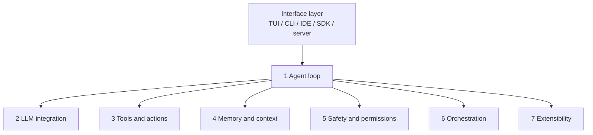

コーディングエージェントの差は、モデルカードだけでは見えません。
同じモデルでも、ループの止め方、検索の仕方、安全境界、拡張面が違えば、現場での挙動は別物になります。

Barbasteらによる [Harness Engineering: Anatomy, Architecture, and Evolution of Coding Agents](https://arxiv.org/abs/2609.00006) は、11の開ソース実装をソースから解剖し、7つのサブシステムと29の設計パターンとして地図にしました。
ベンチで順位を付けません。
SWE-Benchの数値も比較表から外しています。
本稿は、この地図を製品比較と自前ハーネスのチェックリストとして使える形に再構成します。

:::message alert
本記事は 2026-07-15 投稿の arXiv preprint（[arXiv:2609.00006v1](https://arxiv.org/abs/2609.00006)、cs.SE、CC BY 4.0）を解説したものです。会議採録の一次証拠は確認していません。論文自身が、Claude Code のソースは 2026-03 流通スナップショットであり再現性の最弱リンクだと書いています。ピンは 2026-07 です。
:::

*この記事の全体像。以下、順に解説します。*

## コーディングエージェントはモデルとハーネスである

論文の定義は短いです。
エージェントはモデルとハーネスです。

ハーネスは、ループ、ツール、文脈、安全制御、オーケストレーション、拡張面を束ねるランタイムです。
人間とプログラムは、TUI、CLI、IDE、SDK、サーバといった interface layer からこのループを駆動します。
モデルは内側にあります。
外側の配線が、何を見て、何を実行し、いつ止まるかを決めます。

7つのサブシステムは、すべて「意図的な不在」も含めて位置を取る必要があります。
オーケストレーションの最小は Aider の単一エージェントです。
不在は欠陥とは限りません。
設計判断として記録する対象です。

横断面は session substrate です。
transcript、resume、fork が、ターンをまたぐ状態を支えます。
Databricks の Omnigent は編集ループを持たない meta-harness であり、11の中には数えません。

この7行は順位付けの唯一軸ではありません。
開ソース CLI を記述するチェックリストです。
Cursor 級の IDE や、LangGraph 出自のハーネスへそのまま外挿しません。

## 7つのサブシステムは比較のチェックリストである

論文 Table 1 の最小と最大は、実装の幅を示す観察です。
スコアではありません。

| # | サブシステム | 役割 | 最小（観察） | 最大（観察） |
|---|---|---|---|---|
| 1 | Agent loop | 推論と行動の交互。停止と回復 | Mini-SWE-Agent: `while` と bash 1本 | OpenHands: event log と並列 action batch |
| 2 | LLM integration | プロバイダプロトコル、プロンプト、キャッシュ、thinking、routing | Mini-SWE-Agent: LiteLLM と Jinja | Hermes: 5 transport / 29 profile。Codex: サーバ配信カタログ |
| 3 | Tools and actions | 実行可能操作。中心はファイル編集 | Mini-SWE-Agent: bash only | Claude Code: 43 typed と deferred loading（漏洩ツリー在庫）。Codex: tool call を V8 実行 |
| 4 | Memory and context | 窓の配分。ターン／セッション横断の永続 | Mini-SWE-Agent: 無制限履歴 | Codex: agent-maintained memory。Gemini CLI: graph distillation |
| 5 | Safety and permissions | 実行可否と隔離 | Mini-SWE-Agent: cost / step 上限 | Codex: policy と LLM reviewer と 3 OS sandbox |
| 6 | Orchestration | サブエージェントと連携 | Aider: なし | Claude Code: recursive。Omnigent: ベンダー横断（meta） |
| 7 | Extensibility | config / hooks / skills / plugins / MCP | Mini-SWE-Agent: Python Protocol | Pi: everything-is-an-extension。Codex: marketplace plugin |

Claude Code の 43 tools と deferred 約40% は、漏洩ツリーと勧告節の概数です。
2026-07 バイナリとの一致は保証されません。

実務で見るセルは、合計点ではありません。
次の6点です。

1. コード検索は ripgrep か、埋め込みか
2. 安全は OS sandbox か、permission 規則か
3. Skills の発見パスはどこか
4. MCP はあるか。無いなら拒否理由は何か
5. ACP server を出すか
6. 政策はプロンプト文か、実行可能な設定か

この6点を揃えると、モデル名が同じでも運用差が見えます。

## 11システムはどこに位置するか

解剖対象は次の11です。
対照は Omnigent です。

| システム | 言語 | ピン（論文） | 役割 |
|---|---|---|---|
| Claude Code | TypeScript | ソース 2026-03 snapshot / binary 2.1.206（2026-07） | プロバイダ旗艦。deferred tools。他が模倣する参照 |
| Codex CLI | Rust | rust-v0.144.1 | クロスセッション memory。3 OS sandbox。marketplace |
| Gemini CLI | TypeScript | v0.50.0 | モデル routing。A2A。消費者向けは Antigravity へ移行と論文が記述（ランドスケープ。source-verified ではない） |
| Mistral Vibe | Python | v2.19.1 | middleware pipeline。ACP 上の rewind |
| OpenHands | Python | V1 SDK v1.34.0 | event sourcing。ACP で rival harness をホスト |
| Aider | Python | v0.86.3.dev | 13 編集フォーマット。RepoMap。Skills / MCP なし |
| Mini-SWE-Agent | Python | v2.4.5 | 約100行の床 |
| Hermes | Python | 0.18.2 | 自己改善 skill。verify-on-stop |
| Pi | TypeScript | v0.80.6 | 最小コア。Skills あり、MCP 拒否 |
| OpenCode | TypeScript | v1.17.18 | client/server。`~/.claude/skills` を読む |
| OpenClaw | TypeScript | v2026.6.11 | 非 SWE の gateway。ネイティブ編集ツールなし |
| Omnigent | Python | v0.4.0 | 対照のみ。編集ループなし |

OpenClaw を分母に入れるかは、採用率を動かします。
論文は 11 と coding-first の 10 の両方を報告します。
Skills は 9/11、coding-first では 8/10 です。
MCP は 8/11、coding-first では 7/10 です。

閉ソース IDE（Cursor、Copilot、Devin）は論文 Table 2 自身がコーパス外に置きます。
ランドスケープ記述は source-verified ではありません。
生産の中心が IDE なら、この11の地図は適用範囲が狭いです。

## 29の設計パターンは何を繰り返しているか

29パターンは April 版 17 に、July 追加 12 を足したものです。
カタログであり、実装必須のチェックリストではありません。
全部を積むほど良い、とは読めません。

April 17（Table 11）の要点は次です。

| パターン | 要点 | 代表 |
|---|---|---|
| Event Sourcing | 行動と観察を永続ログへ | OpenHands、Pi、OpenCode |
| Policy-as-Code | 安全規則を実行可能設定に | Codex Starlark、Claude hooks、Gemini TOML |
| Recursive Composition | サブエージェント spawn | Claude、Codex、OpenHands、OpenClaw |
| Polymorphic Edits | モデル別に編集契約 | Aider、OpenCode |
| Deferred Loading | ツールと skill を需要時に出す | Claude、Codex BM25、Hermes。skills 8系 |
| Template Method | 基底フローと上書き | Aider Coder、OpenHands Agent |
| Protocol Interfaces | 構造的部分型 | Mini-SWE-Agent、Pi |
| LLM Summarization | 履歴圧縮 | 9システム（Mini-SWE-Agent 以外。Aider は部分） |
| Stuck Detection | 反復行動の検出 | OpenHands 5シナリオ、Gemini hybrid |
| Reflection Loop | lint / test の自己修正 | Aider。いとこ: Gemini edit fixer |
| Prompt Caching | キャッシュ境界 | Claude、Codex、OpenHands、Hermes、Pi、OpenCode |
| Context Forking | 親状態のクローン | Claude、Codex、Hermes |
| Middleware Pipeline | ターン政策の合成 | Mistral Vibe |
| JIT Repo Context | Markdown 文脈の自動発見 | プロバイダ4と Hermes / Pi / OpenCode / OpenHands |
| Skills | SKILL.md バンドル | 9システム |
| Conditional Activation | パスと環境で skill を出す | Claude paths、OpenHands PathTrigger、OpenClaw requires |
| Turn-Level Checkpoint | rewind 可能なスナップショット | Mistral Vibe、OpenCode / Hermes の shadow-git、Pi |

July 12（Table 12）は、セッション寿命、検証、相互運用、安全の境界を厚くしています。

| パターン | 要点 | 代表 |
|---|---|---|
| Agent-Maintained Memory | 背景サブエージェントが記憶を抽出 | Codex。Gemini は人間ゲート inbox |
| Outer Verification Loop | ターン外の完了判定 | OpenHands `/goal`、Hermes verify-on-stop |
| Self-Improving Skill Loop | エージェントが skill を書く | Hermes。Gemini は抽出 inbox |
| Lineage Compaction | 圧縮を家系付きセッション回転に | Hermes |
| Session-Tree Version Control | 追記木と可動 head | Pi、OpenHands |
| Minimal-Core / Extension-Host | 安全、sandbox、サブエージェントをイベントバスへ | Pi |
| Client/Server Harness | 埋め込み API。UI は全部クライアント | OpenCode、OpenHands agent-server |
| Model-Family Prompt Matrix | モデル家系別に基底プロンプト | Codex、OpenCode 9、Hermes |
| Cache-Dialect Fanout | 全プロバイダの cache 方言を同時出力 | OpenCode |
| Syntax-Aware Command Permissioning | tree-sitter でコマンドを解析し権限 | OpenCode。Mistral / Hermes は近縁 |
| Untrusted-Content Delimiting | ツール結果を汚染マーカで囲む | Hermes、OpenHands |
| Harness Mimicry | 他社ハーネスの identity を名乗って OAuth に乗る | Pi |

読者側で先に見るべき塊は3つです。

1. **文脈の出し方**: Deferred Loading、JIT Repo Context、LLM Summarization、Lineage Compaction
2. **止め方**: Stuck Detection、Reflection Loop、Outer Verification Loop、Turn-Level Checkpoint
3. **境界**: Policy-as-Code、Syntax-Aware Command Permissioning、Untrusted-Content Delimiting、Harness Mimicry

Harness Mimicry は相互運用の方便に見えます。
他社 identity を名乗って OAuth に乗るため、信頼境界の穴でもあります。
採用するなら、なぜその identity が必要かを先に書き、拒否できる経路を残す必要があります。

論文は約90行の最小ハーネスと18の設計推奨も示します。
Mini-SWE-Agent の 74%超は自己申告であり、モデルと日付が揃っていません。
本文の主数値にはしません。

## SkillsとMCPとACPは層が違う

Skills（SKILL.md）は 9/11 です。
MCP は 8/11 です。
ACP は 6/11 です。
「9が8を上回った」は採用件数の観察です。
標準戦争の勝者宣言ではありません。
タイブレイクは Pi の1票です。

**Skills あり（9）**: Claude Code、Codex、Gemini CLI、Mistral Vibe、OpenHands、Hermes、Pi、OpenCode、OpenClaw。

**Skills なし**: Aider、Mini-SWE-Agent。

**MCP あり（8）**: Claude Code、Codex、Gemini CLI、Mistral Vibe、OpenHands、Hermes、OpenCode、OpenClaw。coding-first では 7/10。

**MCP なし**: Aider、Mini-SWE-Agent、**Pi（明示拒否: CLI ツールと README）**。

**ACP（6）**: Mistral Vibe、OpenClaw、OpenCode、Hermes、OpenHands、Gemini CLI。

論文本文（§12.4–12.5、Observation 8）では、Skills と MCP は合成可能だと書きます。
MCP は別プロセスのワイヤです。
Skills はディレクトリ規約です。
代替ではありません。

ACP の役割は3つです。

1. エディタとエージェントの接続
2. harness hosting（OpenHands が Claude / Codex / Gemini を backend にする）
3. A2A mesh（Gemini CLI）

CLI は interface の一つです。
OpenCode では server が本体です。
UI はクライアントに落ちます。

実務の順序は論文の推奨に揃えます。
Skills を先に置き、MCP は外部接続に使います。
Pi の「CLI と README、MCP なし」は、防御可能な最小です。
第三者 skill は trust tier を前提にします。
発見パスの相互運用も既に起きています。
OpenCode は `~/.claude/skills` を読みます。

## 2つの不在はどこまで外挿できるか

論文が twin absences と呼ぶ観察は2つです。

1. 一般エージェントフレームワークを runtime に import しない
2. コード検索にベクトル埋め込みを使わない

grep 対象は LangChain、LangGraph、LlamaIndex、AutoGen、CrewAI、Pydantic AI、Genkit、Haystack agents、Semantic Kernel、Google ADK、Smolagents、Swarm、Agno です。
Gemini CLI は Google 自身のフレームワークも未使用です。
ループは asyncio、Promise、Tokio の手書きです。
約4M行の grep は概数です。
再現カウント手順は論文にありません。
vendored、テスト、生成物の扱いは不明です。

境界は論文自身が書いています。

- OpenCode は Vercel AI SDK を inner plumbing に使う（orchestration FW ではない、と論文は分類）
- Aider の `/help` は llama-index をドキュメント RAG に任意インストールする
- Hermes の "LangChain" 文字列は bundled skill の説明文である

コード検索の代替（Table 13）は ripgrep、glob、tree-sitter、`AGENTS.md` / `CLAUDE.md` / `GEMINI.md` の自動発見です。
OpenClaw だけ会話メモリに sqlite-vec をデフォルトで使います。
コードツリーには使いません。

外挿しない範囲ははっきりしています。

- Cursor 公式はチャンク、埋め込み、ベクトル DB を製品の中核にし、semantic search を grep と併用すると書きます。オフライン QA +12.5%（モデルにより 6.5–23.5%）はベンダー自己報告です。開ソース CLI の不在は、IDE 製品の不在ではありません
- Deep Agents（LangGraph）と Pydantic AI Harness は、論文が「使うな」と列挙する系統が coding harness を出荷しています。不在はコーパス runtime の話です
- Rombaut の Prometheus は LangGraph を制御に使います（[arXiv:2604.03515](https://arxiv.org/abs/2604.03515)）。Barbaste の11の外です
- 論文 §15.6: 動的 import、内部フォーク、トランスパイルは未追跡です

CodeRAG-Bench（Wang et al., [arXiv:2406.14497](https://arxiv.org/abs/2406.14497)）では、gold document で GPT-4o が SWE-Bench +27.4% です。
Retrieval-then-Rerank + GPT-4o は no-retrieval 比で約21 point です。
一方、retriever は lexical overlap 不足で苦戦します。
生産 CLI が RAG を飛ばす理由は「効かない」より、「実 retriever が gold に届かない」と「索引がすぐ腐る」に近い、という読み方が論文周辺の整理です。

したがって、コード RAG を既定にしない、が現場の出発点になります。
先に ripgrep、tree-sitter、階層 Markdown で足りるか測ります。
大規模 IDE 文脈なら、Cursor 型の索引を別オプションとして残します。

一般エージェントフレームワークも、コーディング runtime の既定にはしません。
理由は debuggability です。
ただし 2026 の合流（Deep Agents、Pydantic AI Harness、Claude Agent SDK）は、「使ってはいけない」から「どのハーネスが既に走っているか」へ問いを変えています。

## 90日で何が収束し何が腐るか

論文 §14.5 は、同じハーネスを四半期で source-diff します。
April の8システムを置き換えず再ピンしたため、縦断比較が取れます。

見えるのは次です。

- 収束が模倣になる。Codex が Claude Code の hook 語彙を verbatim 採用する。OpenHands が `.claude-plugin` を読む。OpenCode が `~/.claude/skills` を読む
- 政策がプロンプトから設定へ移る。Codex が no-commit を feature flag へ移す。Mistral Vibe が Never Commit を削除する
- inventory（ツール数、版ピン）は数週間で腐る。構造（ループ分類、不在）は相対的に持つ、と論文は分離する

SDK、marketplace、importer、MDM、OpenAI 互換ゲートウェイ、Omnigent は、コーパス内で見える platform 化です。
これを「分野全体が 2026 前半に完了した転換」とは書きません。
観察です。完成命題ではありません。

反証も並びます。

- O’Reilly（2026-07-22）の Kirby effect: ハーネス部品はモデルができないことの仮定である。吸収されたら削除対象である。coding 以外の短ターンエージェントへ一般化しません
- Dan McAteer（2026-08-22）: 尺度は「同じ能力を保ったままいくら消せるか」である。system prompt 80% 削除は McAteer 経由の二次引用です
- Don’t Blame the LLM（[arXiv:2607.03691](https://arxiv.org/abs/2607.03691)）: Qwen3 を固定し Qwen Code 35版を SWE-bench Verified 50題で評価する。resolve rate に統計的有意な改善はない。後期は token と tool call がほぼ倍増する。ハーネス肥大は品質向上と同義ではありません。HTML に Journal: TOSEM Volume: 000 とありますが、proceedings 一次は未確認です。preprint として扱います

Anthropic の *Building Effective Agents* が「フレームワークを安易に使うな / JIT 検索」と書く点は、開ソース CLI の実装と一致します（論文 Observation 10）。
因果は未証明です。

## 比較と自前ハーネスに使うときの判断

7サブシステムは canonical ではありません。
隣接サーベイは別の切り方をします。

- Rombaut は 3層12次元と 5 loop primitive の合成
- Don’t Blame は 10コンポーネント
- Raschka は 6部品
- サーベイ 2606.20683 は 6責務

Agentless（[arXiv:2407.01489](https://arxiv.org/abs/2407.01489)）は、固定パイプラインで自律ツール選択をしない設計を示します。
loop は必須ではありません。

それでも、開ソース CLI を比較するときは、この7行は使えます。
モデルカードより、ループ、検索、安全境界、拡張面を見た方が差が出ます。
使うときの規則は次です。

1. **比較表は7行チェックリストにする。** スコア合計で勝敗を付けない
2. **Skills を先に、MCP を外部接続に使う。** 拒否理由があるなら残す
3. **コード RAG を既定にしない。** 先に決定的検索で測る
4. **一般エージェント FW をコーディング runtime の既定にしない。** 既に走っているハーネスがあるなら、その地図で読む
5. **platform 化を完成命題にしない。** marketplace と SDK は観察である。Kirby effect と Don’t Blame のコスト回帰を併記する
6. **ベンチ自己申告を本文の主数値にしない。** 論文が外した理由を維持する

Context Engineering の話へ接続するなら、JIT Markdown、deferred skill、compaction の三分法です。
Agent Skills の話へ接続するなら、発見パスの相互運用です。
MCP の話へ接続するなら、ワイヤであり Skills の代替ではない、です。

## この地図が持たないもの

残る結論は、「開ソース CLI の記述地図として使う」なら持ちます。
「全コーディングエージェントの完成した解剖学」としては確信度を下げます。

未解決は次です。

- Claude Code 公式ソースが公開されたとき、March snapshot のどのセルが残るか
- Cursor / Copilot CLI / Grok Build の依存グラフは閉ソースのため未確認。埋め込み検索は Cursor docs のみ一次
- 約4M LoC の再現
- Skills 9/11 の第三者再集計は無い
- 会議採録は無い。権威は arXiv preprint
- CVE によるハーネス層の系統破綻は、NVD / MITRE / ベンダー advisory の一次を本解説では確認していない

inventory は腐ります。
残す価値があるのは、7行の位置取りと、2つの不在の適用範囲です。

## まとめ

コーディングエージェントはモデルとハーネスです。
Barbasteらの論文は、11の開ソース実装を7サブシステムと29パターンで地図にしました。
順位表ではありません。
記述用チェックリストです。

Skills と MCP は層が違います。
併用します。
コードベクトル RAG と一般エージェントフレームワークは、2026-07 ピンの開ソース CLI では例外です。
IDE とフレームワーク出自ハーネスは別地図です。

比較するときは、検索、安全境界、Skills 発見パス、MCP の有無、ACP、政策の置き場所を見ます。
合計点で勝敗を付けません。
肥大は品質と同義ではありません。

この記事が少しでも参考になった、あるいは改善点などがあれば、ぜひリアクションやコメント、SNSでのシェアをいただけると励みになります！

## 参考リンク

- Paul Barbaste, Tristan Darrigol, Germain Vu, Tom Wiltberger. *Harness Engineering: Anatomy, Architecture, and Evolution of Coding Agents*. arXiv:2609.00006v1, 2026-07-15. https://arxiv.org/abs/2609.00006 / [HTML](https://arxiv.org/html/2609.00006v1)
- Benjamin Rombaut. *Inside the Scaffold*. arXiv:2604.03515v2. https://arxiv.org/abs/2604.03515
- Oussama Ben Sghaier et al. *Don’t Blame the Large Language Model*. arXiv:2607.03691v2. https://arxiv.org/abs/2607.03691
- Zora Zhiruo Wang et al. *CodeRAG-Bench*. arXiv:2406.14497v2. https://arxiv.org/abs/2406.14497
- Chunqiu Steven Xia et al. *Agentless*. arXiv:2407.01489. https://arxiv.org/abs/2407.01489
- Hugo Bowne-Anderson. *Stop Overengineering Your Agent Harness*. O’Reilly Radar, 2026-07-22. https://www.oreilly.com/radar/stop-overengineering-your-agent-harness/
- Dan McAteer. *The Evolution of the Agent Harness*. Latent Space, 2026-08-22. https://www.latent.space/p/attention-interface
- Cursor. *Codebase indexing*. https://cursor.com/docs/context/codebase-indexing
- LangChain. *Deep Agents*. https://docs.langchain.com/oss/python/deepagents/overview
- Pydantic. *AI Harness*. https://pydantic.dev/docs/ai/harness/
