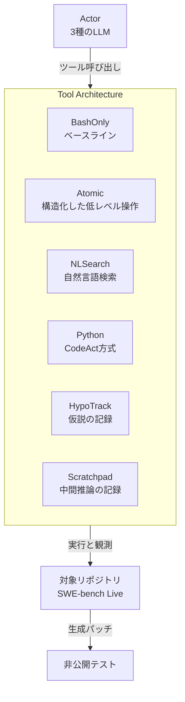
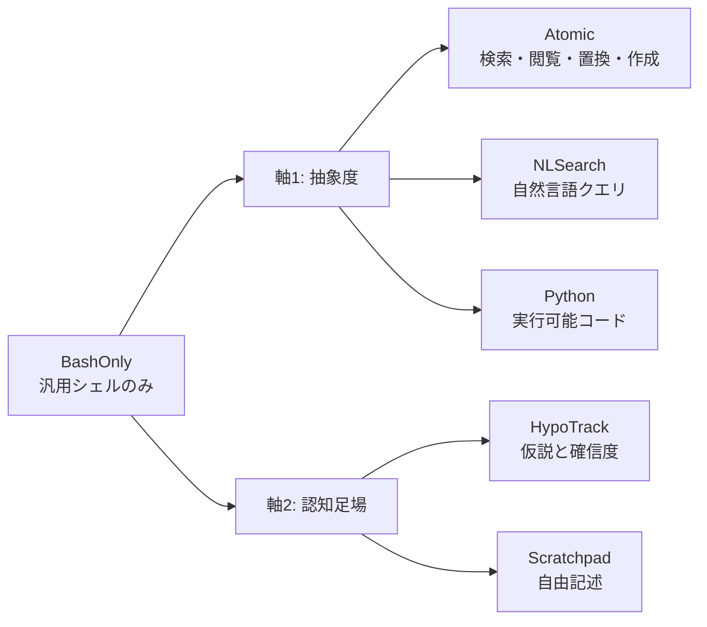
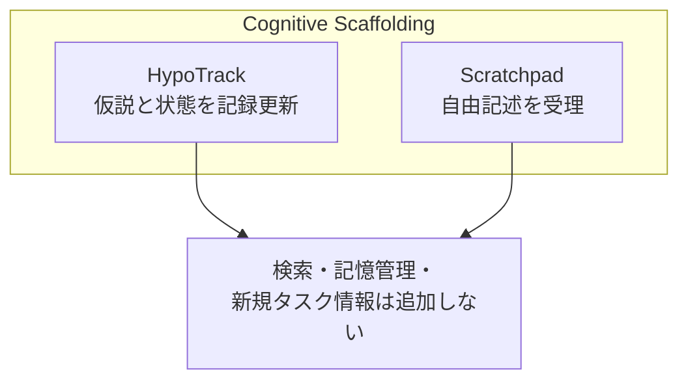
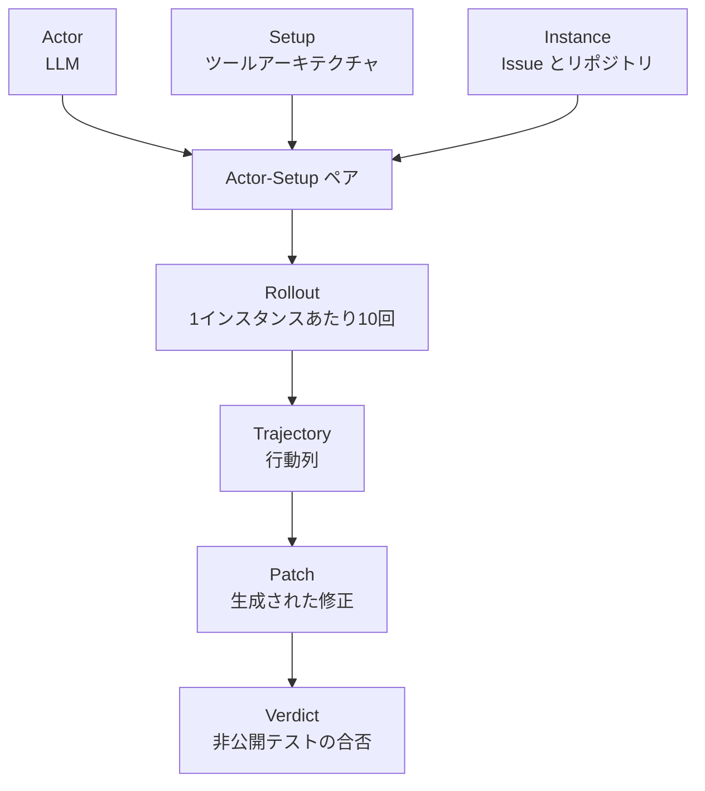
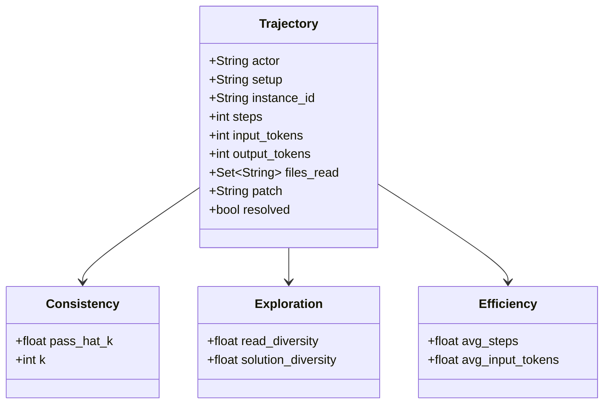

コーディングエージェントに「何ができるか」を足す議論は多くあります。一方で「同じことを、どういう形で渡すか」はほとんど検証されていません。

COLM 2026 の論文 [The Devil Is in the Interface: Evaluating How Tool Architecture Shapes Coding Agent Behavior](https://arxiv.org/abs/2608.11386) は、この後者を **ツールアーキテクチャ (tool architecture)** と名付け、能力差を可能な限り抑えたまま提供形式を変えた 6 つの設計を、3 モデル・11,700 トラジェクトリで比較しました。

結果は明快です。**タスク解決率はほとんど変わらないのに、一貫性・探索・コストは大きく変わります。**

この記事では、6 アーキテクチャの定義、実測値、そして自分のエージェント基盤にどう反映するかを整理します。


*この記事の全体像。以下、順に解説します。*

## ツールアーキテクチャとは何か

論文は、ソフトウェア工学のアナロジーでこの概念を定義します。

| ソフトウェア工学 | エージェントのツール設計 |
|---|---|
| 機能 (functionality): 何をするか | ツール能力 (tool capability): どんな情報と操作を使えるか |
| ソフトウェアアーキテクチャ: どう構造化するか | **ツールアーキテクチャ: 能力をどう整理してモデルへ露出するか** |
| 非機能: 堅牢性・適応性・効率 | 非機能: **一貫性・探索・効率** |

重要なのは、実務では能力とアーキテクチャが**混ざりやすい**という指摘です。

たとえばコードリポジトリの意味検索ツールを入れると、埋め込み検索という新しい能力が増えると同時に、grep 相当の低レベル操作が自然言語インターフェースへ置き換わります。性能が上がったとき、どちらの効果なのか切り分けられません。

この論文は能力差を可能な限り抑えることで、**主としてアーキテクチャ差による効果**を測りにいきます。完全に同一の能力へ揃えられたわけではない点は、結果を読むうえで前提になります。

軸は 2 つです。

- **抽象度 (level of abstraction)**: 低レベル操作をそのまま出すか、自然言語検索にするか、実行可能コードを書かせるか
- **認知足場 (cognitive scaffolding)**: 中間推論や仮説を記録するインターフェースを与えるか

## 検証結果の特徴

先に結論をまとめます。

- **タスク解決率は設計間でほぼ同じ。** 能力差を抑えた設計なので想定どおりで、だからこそ非機能の差が意味を持ちます
- **`Atomic` は一貫性を最大 4.7 倍改善。** 3 モデルすべてで pass^k が改善した唯一の設計です
- **`NLSearch` は読むファイルの多様性を +13.4〜21.3% 押し上げる。** 関連ファイルの再現率も上がりますが、適合率は下がります
- **`Python` は同等性能を 41.6% 少ないステップ・56.3% 少ない累積入力トークンコストで達成。** ただし一貫性は下がる方向です
- **認知足場 (`HypoTrack` / `Scratchpad`) の効果は限定的。** 推論の中身がほとんど変わらないためです

つまり **「速い設計」「ブレない設計」「広く探す設計」は別物** です。今回評価された 6 つの単一構成のなかに、3 つの指標を同時に最大化するものはありませんでした。ここが実務にそのまま効く発見です。

## ツールアーキテクチャの構造

### システムコンテキスト図

エージェント (actor) は、ツールアーキテクチャという層を通してのみリポジトリに触れます。この層の実装だけを差し替えるのが実験設計です。



エージェントに見えるのは中央の層だけです。下にある情報と操作はどの設計でもほぼ同じに保たれています。

### コンテナ図

6 つの設計は、`BashOnly` を原点として 2 軸に展開されます。



各設計には実在するコーディングエージェントの対応物があります。

| 軸 | 設計 | 代表的なエージェント |
|---|---|---|
| ベースライン | `BashOnly` | SWE-bench の bash-only 構成、Mini-SWE-Agent |
| 抽象度 | `Atomic` | OpenHands、Claude Code、SWE-Agent |
| 抽象度 | `NLSearch` | 意味検索を持つコンテキストエンジン系 |
| 抽象度 | `Python` | Smolagents |
| 認知足場 | `HypoTrack` | sequential thinking 系ツール、SWE-Search |
| 認知足場 | `Scratchpad` | sequential thinking 系ツール |

### コンポーネント図

認知足場の 2 つは、**能力を足さない**ことを意図して設計されています。ここが結果の解釈に効きます。



`Scratchpad` は自由記述を受け取って確認メッセージを返すだけです。`HypoTrack` は仮説とその状態を記録するだけです。どちらも**エージェントが推論テキストに書けば済む内容**しか扱いません。これは「軽量な足場それ自体に効果があるか」を切り分けるための、意図的な制約です。

## エージェント行動のデータモデル

### 概念モデル

評価は actor と setup の組み合わせごとに、同じ問題へ繰り返し挑ませる形をとります。



繰り返し実行を前提に置いたことが、この論文の肝です。1 回の成否ではなく**成功の安定性**を測れるようになります。

規模は次のとおりです。

| 項目 | 値 |
|---|---|
| ベンチマーク | SWE-bench Live のサブセット |
| 問題インスタンス | 65 (100 リポジトリから 25 を無作為抽出、1 リポジトリ最大 5 件) |
| 1 インスタンスあたりの試行 | 10 ロールアウト |
| actor モデル | Qwen3Coder-30B / Kimi-K2.5 / Claude Sonnet 4.5 |
| 総トラジェクトリ | 11,700 |

### 情報モデル

トラジェクトリから、4 つの評価軸に対応する指標が算出されます。



各指標の定義は次のとおりです。

| 指標 | 定義 | 測り方 |
|---|---|---|
| タスク解決率 | 成功した試行の割合 | 非公開テストの合否 |
| 一貫性 | 繰り返し試行で成功が安定するか | pass^k (k = 5, 7, 9) |
| 探索の多様性 | 試行ごとに読むファイルが違うか | ファイル集合の Jaccard 距離 |
| 解の多様性 | 生成パッチが違うか | パッチ間の CodeBLEU 距離 |
| 効率 | 到達コスト | 入力・出力トークン、ステップ数 |

`pass@k` (k 回のうち 1 回でも成功) ではなく **`pass^k` (k 回すべて成功)** を使う点に注意してください。運用で問われるのは「たまに解ける」ではなく「任せて大丈夫か」なので、この指標選択は実務感覚と一致します。

定義は組合せによる推定量です。インスタンス `i`・構成 `s` について、全 `n` 回の試行のうち成功が `c` 回なら次のように計算します。

$$
\mathrm{pass}^k(i,s) = \frac{\binom{c(i,s)}{k}}{\binom{n}{k}}
$$

「`n` 回から `k` 回を選ぶすべての組合せのうち、全部成功している組合せの割合」です。試行の順序には依存しません。

## 構築方法: 6アーキテクチャの実装

論文の Figure 2 が示すインタラクション形式を、疑似的なツール定義として書き下すと構造が掴めます。以下は実装イメージであり、公開実装の API そのものではありません。

### ベースライン: BashOnly

```python
def bash(command: str) -> str:
    """汎用シェル。探索・閲覧・編集・実行をすべてこれ1つで行う。"""
```

柔軟ですが構造がありません。定型作業でもモデルが毎回低レベルコマンドを組み立てる必要があります。

### 抽象度: Atomic

```python
def search(path: str, pattern: str) -> str:
    """リポジトリ内を検索する。"""

def view(path: str, start: int, end: int) -> str:
    """範囲を限定してファイルを閲覧する。"""

def str_replace(path: str, old: str, new: str) -> str:
    """対象文字列を置換する。"""

def create(path: str, content: str) -> str:
    """ファイルを作成する。"""

def bash(command: str) -> str:
    """汎用シェルは併存する。テスト実行などはこちらへ戻る。"""
```

**bash を置き換えるのではなく、bash に足す構成である点が重要です。**汎用シェルは残したまま、頻出するシェル操作を明示的なプリミティブへ再梱包しただけで、能力そのものは広がっていません。この「再梱包」だけで一貫性が動く、というのが論文の Finding 1 です。

### 抽象度: NLSearch

```python
def nl_search(query: str) -> str:
    """自然言語クエリを受け取り、関連するコード片を返す。"""
```

実装上の重要な注意点があります。**埋め込み検索や意味インデックスは使っていません。**同じ actor モデルを使ったサブエージェントが、内部で `grep` 相当のコマンドを反復実行して候補を返します。

つまり後述する探索の改善は、埋め込み検索エンジンの性能から来ているのではありません。ただし **自然言語インターフェースと、それを実装するサブエージェントの追加推論は同時に入っており、両者の寄与は切り分けられていません。**改善は `NLSearch` という構成全体の効果として読む必要があります。

### 抽象度: Python

```python
def python(code: str) -> str:
    """実行可能なPythonブロックを実行する。個別のツール呼び出しを置き換える。"""
```

こちらも能力の拡張ではありません。bash が使えるエージェントは元々 Python スクリプトを書いて実行できます。違いは**対話スタイル**です。実際、サンプリングした 100 個の Python アクションのうち 97% が `BashOnly` でも実行可能な操作に対応していました。

### 認知足場: HypoTrack と Scratchpad

```python
def hypo(statement: str, confidence: float, status: str = "open") -> str:
    """仮説とその確信度・状態を記録し、後から更新する。"""

def scratchpad(text: str) -> str:
    """自由記述の思考内容を書き留める。確認メッセージのみ返す。"""
```

どちらもリポジトリを変更せず、検索・記憶管理・新規タスク情報・推論ポリシーの強制を一切追加しません。ただし `HypoTrack` はツールの内部に仮説とその状態を保持し、後から更新できます。`Scratchpad` は受け取った内容に確認メッセージを返すだけです。

## 利用方法: どう選ぶか

### 一貫性を上げたいとき

`Atomic` が唯一、3 モデルすべてで pass^k を改善しました。

| Actor | Setup | pass^5 | pass^7 | pass^9 |
|---|---|---|---|---|
| Qwen3Coder-30B | `BashOnly` | 0.046 | 0.031 | 0.020 |
| Qwen3Coder-30B | **`Atomic`** | **0.106** (+0.059) | **0.097** (+0.067) | **0.094** (+0.074) |
| Qwen3Coder-30B | `Python` | 0.016 (-0.030) | 0.006 (-0.025) | 0.002 (-0.018) |
| Kimi-K2.5 | `BashOnly` | 0.290 | 0.277 | 0.266 |
| Kimi-K2.5 | **`Atomic`** | **0.304** (+0.014) | **0.289** (+0.013) | **0.280** (+0.014) |
| Sonnet-4.5 | `BashOnly` | 0.296 | 0.270 | 0.252 |
| Sonnet-4.5 | **`Atomic`** | **0.313** (+0.017) | **0.297** (+0.027) | **0.283** (+0.031) |
| Sonnet-4.5 | `NLSearch` | 0.314 (+0.018) | 0.303 (+0.033) | 0.295 (+0.043) |

冒頭の **4.7 倍はここから読み取れます。**Qwen3Coder-30B の pass^9 が 0.020 から 0.094 へ、すなわち約 4.7 倍です。

ただし読み方には注意が必要です。

- **相対倍率であって絶対値の改善幅は +0.074 です。**元の値が小さいほど倍率は大きく出ます
- **効果はモデル依存です。**最も弱い actor で最大、強い 2 つの actor では +0.013〜0.031 に留まります (表の +0.043 は Sonnet-4.5 の `NLSearch` であって `Atomic` ではありません)
- 論文の解釈は「構造化されたプリミティブが**低レベルの環境操作ミスを減らす**」ことです。壊れた編集や不正なコマンドといった、構造化で直接避けられる種類のエラーが減っていました。弱いモデルほどそのミスの余地が大きいため、伸びしろも大きくなります

**つまり `Atomic` は、弱いモデルの取りこぼしを埋める設計だと読めます。**ただしこれは 3 つの actor から得た仮説であり、フロンティアモデルでの期待値は自分の構成で確かめる必要があります。

### 探索を広げたいとき

`NLSearch` は 3 モデルすべてで読むファイルの多様性を上げた唯一の設計です。

| Actor | 読む対象の多様性 (`BashOnly` 比) |
|---|---|
| Qwen3Coder-30B | +18.6% |
| Kimi-K2.5 | +21.3% |
| Sonnet-4.5 | +13.4% |

一方で **解の多様性はほとんど変わりません。**違う場所を読んでいても、最終的なパッチは似た形へ収束します。

なお、この読み取りの多様性 (+13.4〜21.3%) と、論文が別途示す **「関連しそうなファイルへのアクセスが 11% 以上増える」は別の指標です。**前者は試行間で読むファイル集合がどれだけ散らばるかを Jaccard 距離で測ったもの、後者は関連ファイルへ到達できたかを測ったものです。

そして広がった探索には**ノイズが伴います。**高関連ファイルの再現率は 3 モデルすべてで上がりますが、適合率は `BashOnly` より下がります。増えたアクセスには当たりも外れも含まれます。

### コストを下げたいとき

`Python` が 3 モデルすべてで最も効率的でした。同等のタスク性能を、**41.6% 少ないステップ・56.3% 少ない累積入力トークンコスト**で達成しています。

ここで削減されるのは **入力トークン** です。論文は入力・出力・観測の 3 種を別々に定義しており、そのうち API 呼び出しごとに履歴を再送する累積入力コストが `Python` の主な利得です。出力トークンと観測トークンは一様には減りません (Kimi-K2.5 では観測トークンがむしろ増えています)。

理由は**複合操作**です。Python ブロックなら複数の操作を 1 回のやり取りにまとめられます。ターン数が減るぶん、再送される履歴の累積量も減ります。

ただし前述のとおり、Qwen3Coder-30B では pass^9 が 0.020 から 0.002 へ落ちました。**効率と一貫性は同じ方向を向きません。**

なお `Atomic` の効率はモデル依存です。Qwen3Coder-30B ではコストが下がりますが、Kimi-K2.5 と Sonnet-4.5 では**入力トークンが増えます。**強い actor は本来 bash で 1 回にまとめられた作業を、粒度の細かいツールに分解させられてターン数が増えるためです。

### 選択の早見表

| 目的 | 選ぶ設計 | 代償 |
|---|---|---|
| 繰り返しの安定性 | `Atomic` | 強いモデルではトークン増 |
| 探索範囲・再現率 | `NLSearch` | 適合率の低下、ノイズ増 |
| ステップ・トークン削減 | `Python` | 一貫性の低下 |
| 推論の質そのもの | いずれも効果は限定的 | — |

## 運用で監視する指標

この論文が示すのは、**タスク解決率だけ見ていてもアーキテクチャの良し悪しは判定できない**という点です。解決率はどの設計でもほぼ同じでした。運用では次を分けて取ります。

### 一貫性を pass^k で取る

```python
from math import comb


def pass_hat_k(results: list[bool], k: int) -> float:
    """1インスタンスのpass^k。n回の試行からk回を選ぶ全組合せのうち、
    すべて成功している組合せの割合を返す。試行順には依存しない。"""
    n = len(results)
    if k > n:
        return 0.0
    return comb(sum(results), k) / comb(n, k)


def pass_hat_k_overall(per_instance: list[list[bool]], k: int) -> float:
    """インスタンスごとに算出してから平均を取る。"""
    if not per_instance:
        return 0.0
    return sum(pass_hat_k(r, k) for r in per_instance) / len(per_instance)
```

試行を先頭から k 個ずつ区切って数えると、順序に依存する別物になります。**組合せで数える点が要点です。**

1 回の成功率だけを見ていると、`Python` のような「速いがブレる」設計を過大評価します。

### 探索の広がりを読み取り集合で取る

```python
def read_diversity(file_sets: list[set[str]]) -> float:
    """試行間で読んだファイル集合のペアワイズJaccard距離の平均を返す。
    分母は全ペア数C(n,2)に固定し、両方が空のペアは距離0.0として残す。"""
    pairs = [
        (1.0 - len(a & b) / len(a | b)) if (a | b) else 0.0
        for i, a in enumerate(file_sets)
        for b in file_sets[i + 1:]
    ]
    return sum(pairs) / len(pairs) if pairs else 0.0
```

多様性が高いこと自体は善でも悪でもありません。**再現率と適合率をセットで見ます。**

### コストは 3 点で取る

```python
def efficiency_summary(trajectories: list[dict]) -> dict:
    """入力トークン・出力トークン・ステップ数の平均をまとめて返す。"""
    count = len(trajectories) or 1
    keys = ("input_tokens", "output_tokens", "steps")
    return {key: sum(t[key] for t in trajectories) / count for key in keys}
```

トークンとステップは**解決率と併せて解釈します。**タスクを解けなくなった結果としてコストが下がっているなら、それは改善ではありません。

### 低レベル操作エラーを分類して取る

`Atomic` の効果は「壊れた編集」「不正なコマンド」といった環境操作ミスの減少として現れました。**エラーを種類別に集計しておくと、インターフェース変更の効果が事前に見積もれます。**このカテゴリのエラーが多いなら `Atomic` 化の余地があり、少ないなら効果は薄いと判断できます。

## ベストプラクティス

### 能力追加の前にインターフェースを疑う

新しいツールを足す前に、**既存の能力の出し方**を見直します。`Atomic` も `Python` も新しい能力を足していません。再梱包だけで一貫性と効率が動きました。

### 弱いモデルほど構造化が効く

今回の 3 つの actor では、**最も弱い Qwen3Coder-30B で利得が最大**でした。論文もこれを「actor 依存」とし、弱い actor ほど低レベル操作ミスの余地が大きいことを理由として示唆しています。

ここから「小型・安価なモデルを使う構成ほど `Atomic` 化の投資対効果が高い」と考えるのは自然ですが、**モデル強度を連続変数として測った実験ではないため、あくまで検証すべき仮説です。**自分の構成では、後述する操作エラーの分類集計で先に確かめられます。

### 探索と編集でインターフェースを分ける

`NLSearch` が効くのは探索フェーズ、`Atomic` が効くのは編集の確実性、`Python` が効くのは定型的な一括処理です。**フェーズごとに露出するツールを切り替える**設計は、この結果から導かれる自然な発想です。

ただし論文が比較したのは 6 つの単一構成であり、**併用やフェーズ別切り替えは評価していません。**これは実務仮説として扱い、自分の環境で測る必要があります。

### 認知足場に期待しすぎない

`Scratchpad` と `HypoTrack` の効果は限定的でした。理由は、エージェントが**元々の推論パターンをそのまま足場へ写しているだけ**だからです。`Scratchpad` の内容は `BashOnly` の推論テキストとほぼ同じで、`HypoTrack` でも複数の競合仮説を維持することは稀でした。

ただし論文はこれを「認知足場一般が無効」とは主張していません。**検索・記憶管理・新規タスク情報・推論ポリシーの強制を伴わない軽量な足場**に限った結論です。それらを伴うより強い足場は次の検証候補になりますが、**本論文はその有効性を評価していません。**

### 非機能を先に決める

今回評価された 6 つの単一構成のなかに、一貫性・探索・効率を同時に最大化したものはありませんでした。**何を優先するかを先に決めてからアーキテクチャを選びます。**この論文の実務的な価値は、そのトレードオフを数字で示した点にあります。

## トラブルシューティング

### 症状から設計変更へ

| 症状 | 想定される原因 | 対処 |
|---|---|---|
| 同じ問題で成功と失敗を繰り返す | 低レベル操作の取りこぼしが試行ごとに違う | `Atomic` 化し、操作エラーの種類別集計で効果を確認 |
| 壊れた編集・不正なコマンドが多い | シェル任せで構造がない | 頻出操作を明示的なプリミティブへ再梱包 |
| 関連ファイルへ辿り着けない | actor が低レベルの grep/find クエリを直接組み立てるため探索が狭まる | `NLSearch` を導入。適合率低下とセットで評価 |
| 無関係なファイルを大量に読む | 自然言語検索のノイズ | 検索結果件数の上限設定、探索フェーズの限定 |
| トークン・ステップが膨らむ | 操作が細かく分割されている | `Python` 等の複合操作を許す設計へ |
| `Atomic` 化したらコストが増えた | 強い actor で bash 複合作業が分断された | actor の強さに応じて粒度を戻す |
| 思考記録ツールを入れたが変化なし | 軽量な足場は推論を変えない | 投資を止めるか、検索・記憶管理を伴う設計を試す (本論文では未評価) |

### 判定を誤りやすい点

- **解決率だけで比較しない。**能力が同等なら解決率はほぼ動きません。差は非機能に出ます
- **単発の試行で評価しない。**一貫性は繰り返し試行がなければ測れません
- **倍率表示を絶対値と混同しない。**4.7 倍は絶対値 +0.074 の改善です
- **1 モデルの結果を一般化しない。**`Atomic` の効果も `Python` の副作用もモデル依存でした

## まとめ

この論文は、コーディングエージェントの**ツールアーキテクチャ**、つまり能力をどう整理して露出するかが、能力差を抑えてもなお行動を変えることを、3 モデル・11,700 トラジェクトリで示しました。

- **タスク解決率はほぼ変わらない。**差は一貫性・探索・効率という非機能に出る
- **`Atomic` は一貫性を最大 4.7 倍改善。**ただし絶対値では +0.074 で、今回の 3 モデルでは最も弱いモデルで効果が最大だった
- **`NLSearch` は読む範囲の多様性を +13.4〜21.3% 広げる。**関連ファイルの再現率は上がるが適合率は下がる
- **`Python` は 41.6% 少ないステップ・56.3% 少ない累積入力トークンコストで同等性能。**代わりに一貫性は落ちる
- **軽量な認知足場の効果は限定的。**エージェントは元の推論を写すだけになる

実務への含意は単純です。**ツールを増やす前に、いま持っている能力の出し方を見直す。**そして、一貫性・探索・コストのどれを優先するかを先に決める。今回評価された単一構成のなかに、この 3 つを同時に満たすものはありませんでした。

この記事が少しでも参考になった、あるいは改善点などがあれば、ぜひリアクションやコメント、SNSでのシェアをいただけると励みになります！

## 参考リンク

### 一次資料

- [The Devil Is in the Interface: Evaluating How Tool Architecture Shapes Coding Agent Behavior (arXiv:2608.11386)](https://arxiv.org/abs/2608.11386)

### 関連する研究とベンチマーク

- [SWE-bench Goes Live! (arXiv:2505.23419)](https://arxiv.org/abs/2505.23419) — 本実験で使われたベンチマーク
- [SWE-bench: Can Language Models Resolve Real-World GitHub Issues? (arXiv:2310.06770)](https://arxiv.org/abs/2310.06770)
- [Executable Code Actions Elicit Better LLM Agents (arXiv:2402.01030)](https://arxiv.org/abs/2402.01030) — `Python` 設計の元になった CodeAct
- [SWE-bench Pro (arXiv:2509.16941)](https://arxiv.org/abs/2509.16941)
- [SWE-Search: Enhancing Software Agents with Monte Carlo Tree Search (arXiv:2410.20285)](https://arxiv.org/abs/2410.20285)
- [ContextBench: A Benchmark for Context Retrieval in Coding Agents (arXiv:2602.05892)](https://arxiv.org/abs/2602.05892)

### 代表的なコーディングエージェント

- [OpenHands](https://github.com/All-Hands-AI/OpenHands)
- [Smolagents](https://github.com/huggingface/smolagents)
- [Claude Code](https://code.claude.com/docs/en/overview)
