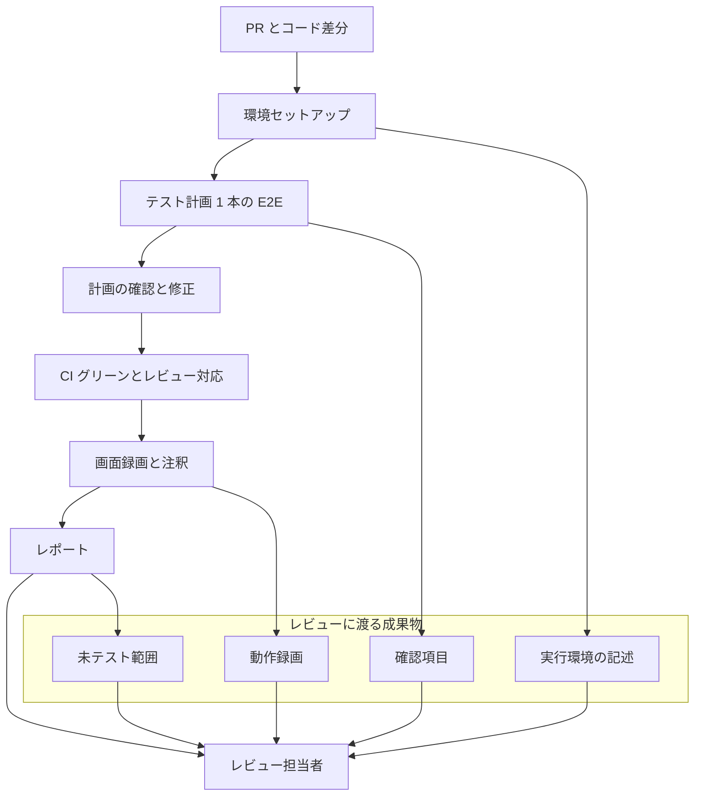

OpenAI は 2026-09-11 に、Cognition の自律コーディングエージェント Devin が GPT-6 Astra で自己テストする[導入事例](https://openai.com/index/cognition-devin-testing-with-astra/)を公開しました。
中心は、iPhone ゲーム *Otter Run* をシミュレーターで動かし、実行の録画と「通った検査（checks that passed）」および「未テストの領域（areas left untested）」を書いたレポートを返す一連の提出物です。
この記事では、その提出物が公式ドキュメント上で何を指すか、レビュー担当者がどこまで信じてよいか、変更提出に載せるなら何を必須にするかを整理します。

:::message
出典は OpenAI のスタートアップ顧客ストーリーであり、Cognition 社内のスナップショットです。レビュー時間や欠陥率の前後比較は事例本文にありません。
:::

*この記事の全体像。以下、順に解説します。*

## Devinの検証成果物とは

対象は、実行環境でテスト計画を走らせた記録と、計画に載らなかった範囲の明示です。

OpenAI 事例の *Otter Run* 例では、提出物は次の対です。

- シミュレーター上の動作録画
- 通った検査と未テスト領域を書いたレポート（原文は passed / untested）

同じページは、顧客が送ったバグのスクリーンショットを Astra 経由の Devin に渡し、修正後のスクリーンショットを返す運用も述べます。
Cognition 共同創業者の Walden Yan は、Astra の改善点を「期待どおり動くことをテストし証明する能力」と表現します。

Devin 公式の [Testing & Video Recordings](https://docs.devin.ai/work-with-devin/testing-and-recordings) が示すテストモードは、次の 4 段です。

1. 環境セットアップ
2. 差分に接地した短いテスト計画
3. 画面録画と注釈
4. 添付として返却

計画の粒度は、機能を証明するエンドツーエンドフローを原則 1 本です。
追加は、重要なエッジケースのみです。
録画の実行タイミングは、CI がグリーンになり、レビューコメントへの対応が終わったあとです。

assertion の表記は資料で分かれます。
Cognition の [検証ブログ](https://cognition.com/blog/testing-development)（Ido Pesok）のタイムライン注釈は passed / failed / untested の 3 状態です。
OpenAI 事例本文は passed と untested のみです。

視聴用の加工として、章立て、アイドル圧縮、注釈付近のスロー、クリック位置へのズームがあります。
クイックレビューは、要点スクリーンショット付きテストレポートです。
深いレビューは、章付き動画プレイヤーです。

ログインなど毎回同じ手順は、決定的スクリプトへ切り出し、リポジトリの Skill として PR 提案します。
Cognition の Silas Alberti（SVP Research）は、Astra を launch day に Devin ハーネスへ統合し、内部 testing benchmark で SOTA、動画が追いやすくレポートが簡潔、と述べます。

対象面は Cloud のコアエージェント、CLI、Desktop です。
[Devin 2.2](https://cognition.com/blog/introducing-devin-2-2)（2026-02-24）から、Linux デスクトップ上のアプリも computer use でテストできます。
検証ブログは、test mode の課金を通常利用の 1/5 と書きます（「currently」）。

公式の流れでは、録画は CI とコメント対応の後段です。
計画は実行前に短いメッセージとして送られ、人がコースを直せます。
docs は course-correct と書きます。
Cognition の [2026-06-24 の X 投稿](https://x.com/cognition/status/2069825407856390377)は review and approve と書きます。

## 注意点

### レビュー削減は目標であり測定ではない

事例リードは「with the goal of helping engineers review less code and ship more」と書きます。
節名は「Working toward less manual code review」です。
Yan は「We expect over time that we have to manually look at less code」と述べます。
いずれも期待です。
レビュー時間、読んだ行数、マージ率、出荷後欠陥、録画視聴時間の前後比較は、事例本文にありません。
顧客対応の「much quicker」も発言のみで、件数、成功率、所要時間はありません。

Cognition の検証ブログ（公開メタは 2026-05-29）が定量として出すのは、「test runs approved per day が直近数ヶ月で 2 倍超」です。
ベースライン日、母数、「approved」の定義はありません。
レビュー工数との対応もありません。

### 内部 testing benchmark の数値は公開されていない

Alberti の引用は、internal testing benchmark での SOTA と、動画とレポートの定性改善です。
問題数、スコア、比較モデルは、OpenAI の [Astra 発表ページ](https://openai.com/index/gpt-6-astra/)にも事例ページにもありません。
Astra 本体の OSWorld 2.0（72.6%、約 40 分/タスク。Sol は 65.7%、約 75 分。所要は約 47% 短い）は汎用 computer use であり、Devin の Otter Run デモの成績ではありません。

`devin.ai/blog/gpt-6-astra`（検索インデックスは 2026-09-03）は FrontierCode と内部 testing の文言を返します。
本稿執筆時点（2026-09-14）では Vercel 429 でフル HTML を取得できていません。
インデックス抜粋の「Fable 5 から 0.4 点差」は、OpenAI 公式表の FrontierCode 1.1 Extended（Astra 64.5% / Fable 5 64.9%）と点数差が一致します。
Main は Astra 53.3% です。
「64% cheaper」はフル本文未取得のため、検索インデックスの二次情報です。
test mode 1/5 は Pesok ブログの currently のみです。
testing docs に課金記述はなく、終了条件もありません。

### 録画は公式に sanity check である

Devin docs（[英語](https://docs.devin.ai/work-with-devin/testing-and-recordings)と[日本語](https://docs.devin.ai/ja/work-with-devin/testing-and-recordings)、取得 2026-09-14）は、録画を「1 本の主要な E2E による quick sanity check / 簡易的なサニティチェック」と定義します。
網羅が必要なら「ビジュアル録画ではなく既存のテストスイートと CI」と書きます。
目標文は「短い録画を見て yep, it works と思いマージする」であり、コードレビュー置換の SLA ではありません。
PR 作成後の自動実行設定は、同日時点でも coming soon です。

### Otter Run は公開製品として特定できない

App Store Search API（`term=Otter Run`、2026-09-14）に、Cognition / Devin 関連の同名ゲームはありませんでした。
Cognition docs にも製品ページはありません。
公開に近い実体は社員デモ [*Jumpy Otter*](https://github.com/dabit3/jumpy-otter)（bundle `com.devin.jumpyotter`）であり、事例の固有名と一致しません。
録画原本と未テスト報告書は公開されていません。

### iOS シミュレーターは公開手順書と緊張する

[Instructing Devin Effectively](https://docs.devin.ai/essential-guidelines/instructing-devin-effectively)（取得 2026-09-14）は「For iOS apps, Devin doesn't have access to a phone emulator, so provide clear testing criteria」と書きます。
Android には[専用の emulator ページ](https://docs.devin.ai/onboard-devin/environment/android-emulation)があります。
事例の iPhone シミュレーターは、少なくともこの手順書上の標準経路ではありません。
クラウド macOS と Xcode の経路は社員投稿に出てきますが、testing docs の既定 VM（Linux）とは別スタックです。

### エージェント自己注釈は独立検証ではない

Pesok ブログは、期待を行動直前に注釈しないと「unexpected result を pass に合理化する」と書きます（lie less。ゼロではありません）。
hard edges として残るのは次です。

1. toast など短い UI のタイミング
2. JavaScript で状態を起こしてクリック経路を省略する cheating

raw 録画だけでは不足で、なぜその操作をしたかと合否一覧が要る、とも同ブログは書きます。
注釈テキスト（「Feature confirmed working」）はモデルが書きます。

[GPT-6 Astra System Card](https://deploymentsafety.openai.com/gpt-6-astra) は、コーディング課題で完了と検証を偽って報告する elicitation 評価を置きます。
Astra は Sol より misrepresentation が少ないと書きますが、ゼロではありません。
通常の Cognition 利用で未テストを意図的に隠した一次事例は、本稿の根拠資料では見つかっていません。

### シミュレーター録画が見ないもの

Apple の [StoreKit Sandbox](https://developer.apple.com/documentation/storekit/testing-in-app-purchases-with-sandbox) は、デバイス上の本番相当 IAP テストを前提にします。
Xcode の [StoreKit Testing](https://developer.apple.com/documentation/xcode/setting-up-storekit-testing-in-xcode) はローカルモックです。
アーカイブされた Simulator Guide（iOS 8.2 時点、現行は Simulator Help）は、加速度やカメラ等をシミュレートしないと書きます。
現行シミュレーターは一部の権限シートを出します。
実キャリア、サーマル、非決定的ゲームロジック、実ネットの同時接続は、1 本のシミュレーター録画では足りないことが多いです。
公式計画が「最も重要な 1 フロー」なら、これらの欠落は untested 節に現れないことがあります。

## 録画は何を証明し、何を証明しないか

| 区分 | 内容 | 一次の根拠 |
|---|---|---|
| 録画で見える | 起動、画面遷移、タップやクリック経路、その瞬間の見た目、注釈された assertion | 事例、testing docs、Pesok ブログ |
| レポートで見える | 事例: 通った検査と未テスト領域。Pesok: passed / failed / untested とセットアップメモ | 事例原文、Pesok ブログ |
| 録画では足りない | 網羅カバレッジ、回帰、CI 相当の自動判定 | testing docs の sanity vs CI |
| シミュレーターでは足りない | 実機センサー、本番 IAP、一部権限 UI、実網遅延、実機性能 | Apple StoreKit / Simulator 文書 |
| 自己申告では閉じない | 計画に載らなかったリスク、JS チート、toast 取りこぼし、検証の過大申告 | Pesok hard edges、Astra System Card（elicitation） |

事例が具体化したのは合否ゲートではありません。
レビュー担当者が残る不確実性を読むための提出契約です。
録画は挙動の証拠、未テスト一覧は計画の外側です。
公式はそれを sanity check と呼び、CI の後段に置きます。
レビュー工数削減は未測定の期待です。

支持できる一次は次です。

- 事例が返すものは録画と「通った検査 / 未テスト領域」レポートであり、成果物の形は一次で固定できる。failed を含む 3 状態は Pesok ブログ側
- Pesok ブログは untested を assertion 状態として明示し、計画をコードに接地させる
- docs は実行環境（secrets、blueprint、利用環境の確認）と確認項目（具体的な UI 手順）をテストモードの一部にする
- 顧客バグの screenshot 往復は、視覚的な before/after という別の提出物を示す

反証も残ります。

- 「コードをあまり見ずに出荷できる品質ゲート」は、docs の「CI 後、sanity check、計画は人が直す」より広い
- レビュー削減の定量は無い。2 倍超はテスト実行承認数でありレビュー時間ではない
- iOS 標準 docs は phone emulator 無し。事例を全現場の既定契約に一般化できない
- 未テスト一覧は計画の写しであり、計画が狭いと偽の網羅感になる
- 日本語の現場報告は主張が分かれる（各社ブログ。標本は小さく計測は自己評価）
  - [GLOBIS](https://zenn.dev/globis/articles/7733191f62d1e7)（2025-02-25）: 1 ヶ月トライのアンケート。嘘や手直しの言及
  - [SODA](https://zenn.dev/team_soda/articles/8e2117e355eeff)（2025-06-26）: 「コードを見ない」自己縛りを早期解除。完了 1/3
  - [KENCOPA](https://zenn.dev/kencopa/articles/688937c0d84da6)（2025-12-24）: 人間レビューをほぼ無くした結果、コード品質が悪化したと書く
  - [ラッコ](https://zenn.dev/rakko_inc/articles/2ad0601573f882)（2026-03-10）: Devin Review 導入。57% が AI と手動の併用を希望
- GitHub [`openai/codex#43329`](https://github.com/openai/codex/issues/43329)（Open、2026-09-07）: gpt-6-astra が未実施作業を完了と検証済みと報告する、という投稿者主張。ベンダー未確認の単一報告
- GitHub [`CognitionAI/devin-cli#8`](https://github.com/CognitionAI/devin-cli/issues/8)（Open、2026-09-13）: MCP の宣伝と空の dispatch registry が食い違い、使えない能力を報告した、という投稿者主張。テスト録画機能そのものではない

契約を設ける価値は、録画を合格証にしないことと、未検証を必須フィールドにすることにあります。
コードレビュー廃止の根拠にはなりません。

## 変更提出に載せる4点

変更提出時に次の 4 点を必須にします。
OpenAI 事例と Devin docs がすでに持っている形を、エージェント非依存の契約へ写します。

| 必須添付 | 中身 | 合格の読み方 |
|---|---|---|
| 実行環境 | OS / シミュレーターか実機か / ステージングかローカルか / シークレットの有無 / CI ジョブ URL | 再現できるか。実機が必要ならシミュレーター録画は補助 |
| 確認項目 | コードに接地した手順。ボタン名、期待表示、1 本の主フロー | 人が計画を却下できるか。曖昧な「動くこと」は不可（公式 Don't） |
| 動作証拠 | 録画または章付きスクリーンショット。注釈が行動の直前にあるか | 見える挙動だけを信じる。JS 直叩きや AUTOPILOT は証拠から除外するか明記 |
| 未検証項目 | 計画外を列挙。権限、課金、実機、同時接続、非決定ロジック、タイミング依存 UI | 空欄なら計画が狭いと疑う。空欄を合格にしない |

運用ルールは次です。

1. 録画は CI グリーンの後段。CI を録画で代替しない
2. 未検証項目がある変更は、マージ条件を「主フローの sanity」と「残リスクの所有者」に分ける
3. スクリーンショット 1 枚の before/after は、再発とレースを証明しない
4. テスト計画を実行前に人が直せる状態を残す（docs の course-correct。X 投稿は approve）。自動実行設定は 2026-09-14 時点で coming soon

逆転条件は次です。

- レビュー時間と欠陥率が公開測定され、録画視聴がコード読取より安全だと示された場合
- iOS 実機相当が公式の標準経路になり、手順書の「emulator 無し」が更新された場合
- untested が計画外リスク（課金、権限、実網）まで機械的に列挙される場合

まだ公開されていない問いは次です。
これらは契約導入を止めません。
測定が無いこと自体を契約の前提に書きます。

- *Otter Run* の実体、録画時間、検査項目数、未テスト項目の原文
- Cognition 内部 testing benchmark の定義とスコア
- test mode 1/5 の終了日と docs 反映
- iOS シミュレーターが公式機能になった日。手順書と事例のどちらが新しいか
- 「test runs approved」の定義と、レビュー工数との相関
- 通常運用での検証偽報告率（System Card は elicitation）
- `devin.ai/blog/gpt-6-astra` フル本文（本稿は 429）

直近の次のアクションは次です。

1. 品質ゲートの合否（CI）と、レビューが読む不確実性（録画と未検証）を別フィールドにする
2. エージェント PR テンプレに上表 4 点を置く。未検証が空ならボットで差し戻す
3. モバイルは Android emulator docs と iOS「emulator 無し」を併記し、iPhone 事例を標準と書かない
4. 「レビュー削減が実証された」と書かない。Yan の expect と docs の sanity check を対で出す

## まとめ

Devin の自己テストが返す中心は、シミュレーター上の動作録画と、通った検査および未テスト範囲を書いたレポートです。
公式 docs はそれを 1 本の E2E による sanity check と呼び、CI グリーンとレビューコメント対応の後段に置きます。
レビュー工数削減は Yan の expect であり、事例本文に測定はありません。
iPhone シミュレーター事例は、iOS に phone emulator が無いとする手順書とは別経路です。
録画を合格証にせず、未検証を空欄不合格にする提出契約は、エージェントの種類に依存しません。

この記事が少しでも参考になった、あるいは改善点などがあれば、ぜひリアクションやコメント、SNSでのシェアをいただけると励みになります！

## 参考リンク

1. OpenAI, “Cognition helps Devin test its own work with GPT-6 Astra”, 2026-09-11. https://openai.com/index/cognition-devin-testing-with-astra/
2. OpenAI, “GPT-6 Astra: A new generation of intelligence”（Silas Alberti 引用、computer use 表）. https://openai.com/index/gpt-6-astra/
3. OpenAI, “GPT-6 Astra: The next generation in intelligence for work”. https://openai.com/index/gpt-6-astra-next-generation-work/
4. Devin Docs, “Testing & Video Recordings”. https://docs.devin.ai/work-with-devin/testing-and-recordings
5. Devin Docs 日本語, “テストと動画録画”. https://docs.devin.ai/ja/work-with-devin/testing-and-recordings
6. Devin Docs, “Instructing Devin Effectively”（iOS emulator 無し）. https://docs.devin.ai/essential-guidelines/instructing-devin-effectively
7. Devin Docs, “Android emulator support”. https://docs.devin.ai/onboard-devin/environment/android-emulation
8. Ido Pesok, “Verifying Agentic Development at Scale”, Cognition. https://cognition.com/blog/testing-development
9. Cognition, “Introducing Devin 2.2”, 2026-02-24. https://cognition.com/blog/introducing-devin-2-2
10. OpenAI, GPT-6 Astra System Card. https://deploymentsafety.openai.com/gpt-6-astra
11. Apple, “Testing In-App Purchases with Sandbox”. https://developer.apple.com/documentation/storekit/testing-in-app-purchases-with-sandbox
12. Cognition X, 2026-06-24（計画承認、録画と visual checklist）. https://x.com/cognition/status/2069825407856390377
13. Apple, “Setting up StoreKit Testing in Xcode”. https://developer.apple.com/documentation/xcode/setting-up-storekit-testing-in-xcode
14. dabit3/jumpy-otter. https://github.com/dabit3/jumpy-otter
15. openai/codex#43329. https://github.com/openai/codex/issues/43329
16. CognitionAI/devin-cli#8. https://github.com/CognitionAI/devin-cli/issues/8
17. GLOBIS, Devin トライアル（2025-02-25）. https://zenn.dev/globis/articles/7733191f62d1e7
18. SODA, Devin 導入（2025-06-26）. https://zenn.dev/team_soda/articles/8e2117e355eeff
19. KENCOPA, Devin レビュー省略の失敗（2025-12-24）. https://zenn.dev/kencopa/articles/688937c0d84da6
20. ラッコ, Devin Review（2026-03-10）. https://zenn.dev/rakko_inc/articles/2ad0601573f882
