> 対象スタック: Google Cloud Confidential Space + NVIDIA H100 Confidential Computing + Intel Trust Authority + Confidential Computing Consortium 仕様群
> 起点記事: Google Cloud Blog (URL slug は "verifiable-trust-in-the-ai-era-…"、現行ページ H1 は "Verifiable, private AI: Google Cloud expands Confidential Computing frontiers"、2026-06-24 公開、著者 Sam Lugani / Ranjit Narjala)
> 更新日: 2026-06-25

## 概要

### 実行時保護という第三の柱

クラウドにおけるデータ保護はこれまで「保存時暗号化」と「転送時暗号化」の 2 層で語られてきました。AI ワークロードでは、モデル推論や学習中にデータが平文でメモリ上に展開されるため、クラウドプロバイダー・ハイパーバイザー・特権 OS 管理者が原理的にデータへアクセスできる状態が続いていました。

Confidential AI はこのギャップを埋める「実行時保護」を体系化した設計領域です。CPU・GPU 上に構築する TEE (Trusted Execution Environment) でワークロードを実行し、Remote Attestation で「何のソフトウェアがどのハードウェア上で動いているか」を暗号学的に証明することで、クラウドプロバイダー自身を信頼境界の外に置きます。

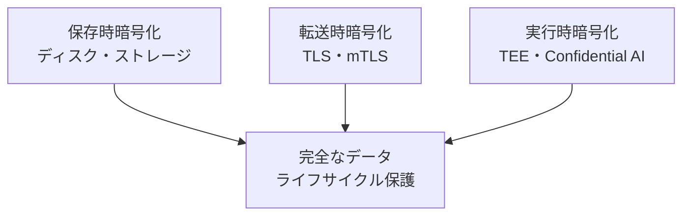

| 要素名 | 説明 |
|---|---|
| 保存時暗号化 | ディスク上の静止データを保護する従来の層 |
| 転送時暗号化 | ネットワーク経路上のデータを保護する従来の層 |
| 実行時暗号化 | CPU・GPU のメモリ上で処理中のデータを保護する新しい層 |
| 完全なデータライフサイクル保護 | 3 層を揃えて初めて達成されるエンドツーエンド保護 |

### 信頼境界の再定義

従来の VM モデルは「クラウドプロバイダーを信頼する」前提でした。Confidential AI は CPU・GPU シリコンの Root of Trust から始まる完全性をハードウェアレベルで起点に置き、Remote Attestation で全スタックの状態を証明することで、クラウドプロバイダーを含む特権ソフトウェアを信頼境界の外に置きます。

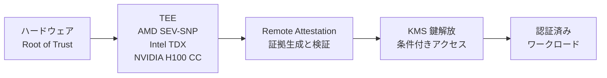

| 要素名 | 説明 |
|---|---|
| ハードウェア Root of Trust | CPU・GPU シリコン上のオンダイ RoT。測定値の起点 |
| TEE | ハードウェア強制の隔離実行環境。メモリ暗号化と整合性保護を提供 |
| Remote Attestation | TEE の状態を暗号学的証拠として外部に提示するプロセス |
| KMS 鍵解放 | Attestation 成功を条件に暗号鍵を解放する条件付きアクセス制御 |
| 認証済みワークロード | 証明を通過したコンテナのみがデータに触れられる |

### 関連技術との関係

| 区分 | 技術 | 保護単位 | 特徴 |
|---|---|---|---|
| CPU TEE | AMD SEV-SNP | VM 全体 | Secure Nested Paging でハイパーバイザーによるページテーブル改ざんを防止。Google Cloud N2D・C3D / Azure DCasv5 で GA |
| CPU TEE | Intel TDX | VM 全体 (Trust Domain) | AES-256 メモリ暗号化。SEAM モードで TDX Module が VMM と同格で動作。Intel Trust Authority と連携 |
| CPU TEE | Arm CCA | Realm (VM) | 4 ワールドモデル (Normal / Secure / Realm / Root)。Realm Management Monitor が管理。クラウド普及は今後 |
| GPU TEE | NVIDIA H100 CC | GPU 全体 | GPU として初の Confidential Computing Consortium 準拠 TEE。CPU TEE と SPDM セッションで接続 |
| GPU TEE | NVIDIA Blackwell CC | GPU 全体 | H100 を発展させた次世代 GPU TEE。NVLink トラフィックの暗号化に対応する予定。2026-06 時点では Google Cloud の **Confidential VM / Confidential GKE Node (G4 系、RTX PRO 6000 Blackwell) の Preview** として提供開始。**Confidential Space + GPU** は引き続き H100 のみが公式対応 |

### 比較

| 方式 | 実行時データ保護 | 信頼境界 | 鍵管理者 | マルチパーティ対応 | GPU 対応 | 成熟度 |
|---|---|---|---|---|---|---|
| 従来 VM (CC なし) | なし | プロバイダーを含む | プロバイダー | 困難 | あり | 成熟 |
| Confidential VM (CPU TEE のみ) | メモリ暗号化 | ハイパーバイザー外 | ユーザー管理可 | 限定的 | 通常なし | 成熟 |
| Confidential Space | メモリ暗号化 + 実行証明 | プロバイダー外 | データ協力者が条件定義 | 対応 | 対応 (H100。Blackwell は Confidential VM / GKE Node 側の Preview で先行、Confidential Space 統合は今後) | GA |
| AWS Nitro Enclaves | メモリ・CPU 隔離 | ハイパーバイザー外 | KMS 連携 | 限定的 | 非対応 | GA |
| Azure Confidential VM + NVIDIA H100 | メモリ暗号化 + GPU TEE | ハイパーバイザー外 | PMK/CMK 選択 | 限定的 | 対応 | GA |
| 完全準同型暗号 (FHE) | 暗号文のまま演算 | ハードウェア依存なし | ユーザー管理 | 対応 | 対応困難 | 研究・限定実用 |
| 多者間計算 (MPC) | 秘密分散 | 参加者分散 | 各参加者 | 対応 | 対応困難 | 限定実用 |

補足:

- FHE は理論的安全性が最も高い反面、TEE 比で 100 〜 10,000 倍の計算オーバーヘッドが生じます。
- TEE (Confidential Space) は Attestation による完全性証明を持ち、FHE・MPC にはないワークロード検証機能を提供します。
- AWS Nitro Enclaves は外部ネットワークや永続ストレージを持たない設計のため、マルチパーティ AI シナリオへの適用には制約があります。

### ユースケース別推奨

| ユースケース | 推奨アプローチ | 理由 |
|---|---|---|
| マルチパーティ AI 学習 | Confidential Space + NVIDIA H100 | Workload Identity で参加者をデータから分離。GPU TEE で学習計算を保護 (Blackwell は現状 Confidential VM / GKE Node の Preview 限定) |
| プライベートインフェレンス | Confidential VM (CPU + GPU TEE) | モデル重みを TEE 内にのみ展開。プロバイダーも推論依頼者も重みを取得不可 |
| 暗号化 RAG | Confidential Space + KMS 条件付き鍵解放 | ベクトル DB への問い合わせが TEE 内でのみ復号される |
| 規制下データの推論 (医療・金融) | Confidential VM + Attestation + 監査ログ | Attestation トークンが規制コンプライアンス証跡として機能 |
| 大規模 AI サービス (Apple PCC 型) | TEE + GPU TEE + ハードウェア RoT + 透明性ログ | エンドユーザーデバイスがプロバイダーを検証。オープンソース公開で外部監査可能 |
| 超高セキュリティ (ハードウェア信頼を排除) | FHE または MPC | ハードウェアベンダーへの信頼を一切前提にしない。性能制約を許容できる場合 |

---

## 特徴

- **ハードウェア Root of Trust による第三者 Attestation** — CPU・GPU シリコンから始まる信頼チェーンにより、ワークロードの完全性を暗号学的証拠として外部に提示できます。
- **GPU TEE 対応** — NVIDIA H100 が GPU として初めて TEE を実装し、AI 推論や学習の計算コアを保護対象に含められます。Blackwell (RTX PRO 6000) は G4 マシンシリーズの Confidential VM / Confidential GKE Node 側で Preview 提供中で、Confidential Space への正式統合は今後の予定です。
- **ネイティブ性能への近接** — H100 CC は GPU 内部計算を平文で実行しつつ HBM3 を物理攻撃から保護します。性能オーバーヘッドは主に CPU-GPU 間転送の暗号化に限られ、AI 推論や HPC で実用水準を維持します。
- **クラウド KMS との条件付き鍵解放連携** — Attestation Token の検証を条件に Cloud KMS が暗号鍵を解放します。データ協力者はコード本体を見ずにコンテナイメージダイジェストで鍵アクセスを制御できます。
- **Workload Identity Federation 統合** — OIDC 準拠の Attestation Token を IAM に直接連携し、サービスアカウントや IAM ポリシーと統合した細粒度アクセス制御を実現します。
- **マルチパーティ協調の安全な基盤** — Workload Author / Workload Operator / Data Collaborator を役割分離し、互いに信頼しない複数組織が単一 TEE 上でデータを持ち寄れます。
- **独立 Attestation 検証者の選択** — Intel Trust Authority などのサードパーティ検証サービスをクラウドプロバイダーと独立して利用でき、検証者自体をプロバイダー管理外に置けます。
- **Live Migration 対応** — AMD SEV ベースの N2D・C3D で Confidential VM のライブマイグレーションが GA となり、計画メンテナンス中も暗号化されたゲストメモリを保護したまま継続できます。
- **エンドツーエンドプロンプト暗号化** — オープンソースの Prompt Encryption SDK により、クライアントが TEE との間に Attested TLS セッションを確立し、プロンプトを TEE 外で平文にさらすことなく推論できます。
- **大規模 AI サービスへの採用実績** — Apple Private Cloud Compute (PCC) が Google Cloud の Intel TDX + NVIDIA Blackwell CC を採用し、コンシューマー向け AI サービスへの Confidential AI 適用の先行事例となりました。
- **規制コンプライアンス証跡としての Attestation** — Attestation レポートに含まれるプラットフォームブート設定・ファームウェア測定値・OS 測定値は、規制当局へ提出できる監査証跡として機能します。
- **コード変更不要の適用** — NVIDIA H100 CC は既存の CUDA アプリケーションを変更せず CC モードで動作でき、Confidential Space も数クリックの設定で有効化できます。

---

## 構造

### システムコンテキスト図

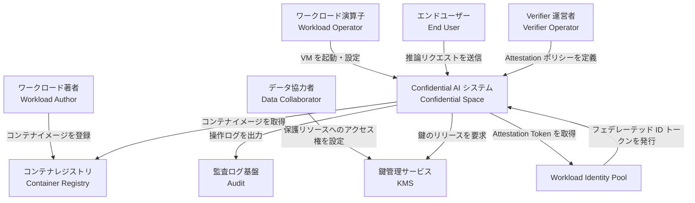

| 要素名 | 説明 |
|---|---|
| ワークロード著者 | コンテナイメージを開発して Container Registry に登録する開発者。データや実行結果へのアクセス権は持ちません |
| ワークロード演算子 | Confidential VM を起動・構成する運用者。コンテナ内のデータにはアクセスできません |
| データ協力者 | KMS や Storage に保護リソースを預け、特定のワークロード測定値を持つ環境のみへアクセスを許可する所有者 |
| エンドユーザー | 推論 API を呼び出す最終利用者。TEE 内の処理に対して暗号的な保証を受けられます |
| Verifier 運営者 | Attestation ポリシー (許可する測定値・証明書条件) を定義する主体 |
| Confidential AI システム | Confidential Space 全体。TEE 上でコンテナワークロードを実行し、リモート Attestation を提供します |
| KMS | 暗号鍵を保管する鍵管理サービス。Attestation Token の検証後にのみ鍵をリリースします |
| Container Registry | コンテナイメージを保管するレジストリ。Launcher が起動時にイメージを取得します |
| Workload Identity Pool | Attestation Token を IAM が利用できるフェデレーテッド ID トークンに変換する仲介サービス |
| 監査ログ基盤 | VM 操作ログや Attestation イベントを収集する外部ログ基盤 |


### コンテナ図

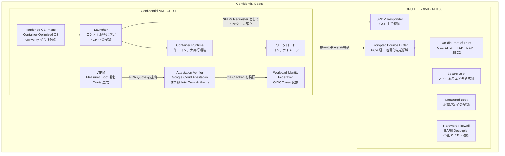

| 要素名 | 説明 |
|---|---|
| Confidential VM - CPU TEE | AMD SEV-SNP または Intel TDX で保護された仮想マシン。ハイパーバイザーからメモリを暗号化し隔離します |
| Hardened OS Image | Container-Optimized OS をベースにした最小構成 OS。dm-verity で整合性を保護し、SSH アクセスを無効化しています |
| Launcher | 起動時にコンテナイメージを Container Registry から取得し、イメージとその設定を vTPM の PCR に測定値として記録するコンポーネント |
| Container Runtime | Launcher が管理する単一目的のコンテナ実行環境。複数コンテナの混在は許可されません |
| ワークロード | Workload Author が提供するコンテナイメージ本体。秘密データの処理ロジックを内包します |
| vTPM | Google 管理の仮想 TPM。ブートシーケンス全体の測定値を署名し、Attestation Verifier が検証できる PCR Quote を生成します |
| Attestation Verifier | vTPM Quote とイベントログを受け取り、ポリシーと照合して OIDC Token を発行するサービス。Google Cloud Attestation または Intel Trust Authority が担います |
| Workload Identity Federation | Attestation Verifier が発行した OIDC Token を IAM が利用できるフェデレーテッド ID トークンに変換する中間レイヤー |
| GPU TEE - NVIDIA H100 | Hopper アーキテクチャ上の Confidential Computing モード。CPU TEE と組み合わせて複合 Attestation を構成します |
| On-die Root of Trust | GPU チップ上に焼き付けられた信頼の起点。CEC1736 (EROT) → FSP → GSP → SEC2 の階層で信頼チェーンを形成します |
| Secure Boot | FSP が NVIDIA 秘密鍵でファームウェア署名を検証し、GSP 初期化前に実行される起動時検証プロセス |
| Measured Boot | GPU 起動時の測定値を記録し、後続の Attestation で参照できるようにするプロセス |
| SPDM Responder | GSP 上で稼働する SPDM プロトコル応答コンポーネント。CPU 側の SPDM Requester と鍵交換を行い、PCIe 経由の暗号化チャネルを確立します |
| Encrypted Bounce Buffer | CPU TEE と GPU TEE の間でデータを中継する共有メモリ領域。転送前に AES-GCM 256 で暗号化します |
| Hardware Firewall - BAR0 Decoupler | Confidential Computing モード時に PCIe 経由でのレジスタアクセスをブロックするハードウェア機構 |

### コンポーネント図

#### Attestation Verifier の内部

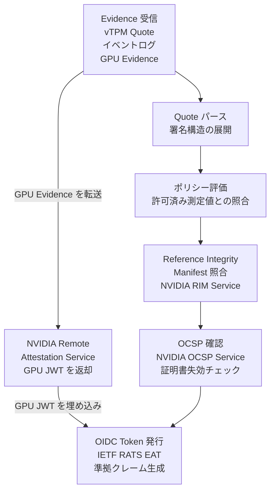

| 要素名 | 説明 |
|---|---|
| Evidence 受信 | CPU TEE の vTPM Quote とイベントログ、GPU TEE の Evidence を受け取る入力ステップ |
| Quote パース | vTPM Quote の署名構造を展開し、PCR 値とイベントログの対応を検証する処理 |
| ポリシー評価 | Verifier 運営者が定義した許可済み測定値と受け取った PCR 値を照合する処理 |
| Reference Integrity Manifest 照合 | NVIDIA RIM Service が提供する VBIOS・ファームウェアの期待測定値と実測定値を比較する処理 |
| OCSP 確認 | GPU デバイス証明書の失効状態を OCSP プロトコルで問い合わせる処理 (NVIDIA 側 OCSP レスポンダのエンドポイント。固有のサービス名称は公式 docs で明示確認できないため一般名で扱う) |
| OIDC Token 発行 | 検証が完了した測定値を IETF RATS EAT 準拠のクレームに変換し、署名付き OIDC Token として発行する処理 |
| NVIDIA Remote Attestation Service | GPU Evidence を独立して検証し、GPU 測定値を含む JWT を返す NVIDIA 側の外部サービス |


#### GPU TEE (NVIDIA H100) の内部

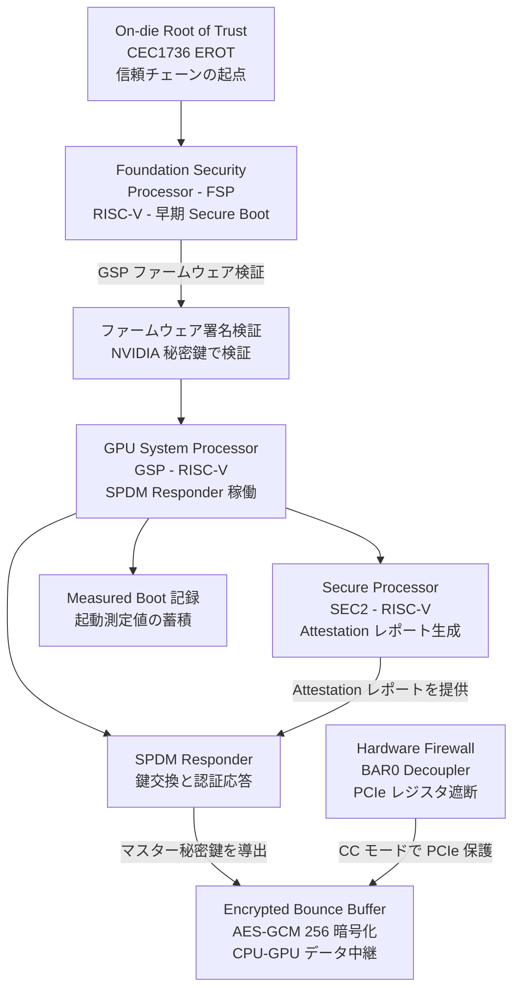

| 要素名 | 説明 |
|---|---|
| On-die Root of Trust (CEC1736 EROT) | GPU チップ上に実装された Microchip CEC1736 コントローラ。信頼チェーン全体の起点として機能し、FSP の初期化を管掌します |
| Foundation Security Processor (FSP) | RISC-V マイクロコントローラ。早期 Secure Boot として GSP ファームウェアの署名を NVIDIA 秘密鍵で検証し、GSP-RM の初期化前に完了させます |
| GPU System Processor (GSP) | RISC-V エンジン。SPDM Responder コンポーネントを内包し、GPU 全体の初期化を管理します |
| Secure Processor (SEC2) | RISC-V マイクロコントローラ。復号・整合性検証・デバイス Attestation レポート生成・メモリスクラブを専任で処理します |
| ファームウェア署名検証 | FSP が NVIDIA の秘密鍵と対応する公開鍵を用いて GSP ファームウェアの署名を検証する Secure Boot ステップ |
| Measured Boot 記録 | GPU 起動シーケンス中の各ステージの測定値を蓄積し、Attestation レポートに含める記録プロセス |
| SPDM Responder | GSP 上で稼働するコンポーネント。CPU 側 NVIDIA カーネルドライバの SPDM Requester と SPDM プロトコルで鍵交換を行い、PCIe 経由のセキュアチャネルを確立します |
| Encrypted Bounce Buffer | CPU TEE と GPU TEE の間に置かれる共有メモリ中継領域。CPU 側が AES-GCM 256 で暗号化してから GPU に転送し、GPU 側が復号して処理します |
| Hardware Firewall (BAR0 Decoupler) | Confidential Computing モード有効化時に GPU ファームウェアが設定するハードウェア保護機構。PCIe 経由での BAR0 レジスタアクセスをブロックし、ホスト側から GPU 制御レジスタを隠蔽します |

#### ネットワーク構成図

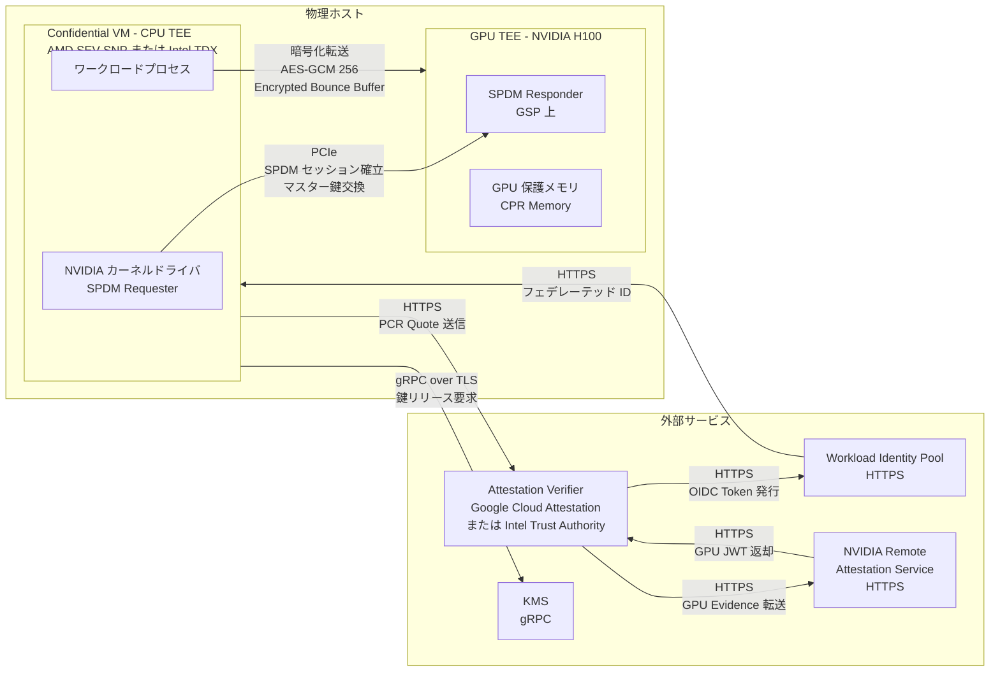

| 接続 | プロトコル | 説明 |
|---|---|---|
| CPU TEE - GPU TEE 間 | PCIe + SPDM | NVIDIA カーネルドライバの SPDM Requester が GSP の SPDM Responder と PCIe 上で鍵交換を行い、セキュアチャネルを確立します |
| CPU TEE - GPU TEE データ転送 | AES-GCM 256 over PCIe | Encrypted Bounce Buffer を経由して CPU TEE が暗号化したデータを GPU TEE が復号しながら処理します |
| CPU TEE - Attestation Verifier | HTTPS | vTPM PCR Quote とイベントログを HTTPS で Attestation Verifier に送信します |
| Attestation Verifier - NVIDIA RAS | HTTPS | Attestation Verifier が GPU Evidence を NVIDIA Remote Attestation Service に転送し、GPU JWT を受け取ります |
| Attestation Verifier - Workload Identity Pool | HTTPS | 複合 Attestation Token を Workload Identity Pool に送り、フェデレーテッド ID トークンに変換させます |
| CPU TEE - KMS | gRPC over TLS | フェデレーテッド ID トークンを提示して KMS に鍵リリースを要求します |

---

## データ

### 概念モデル

Confidential AI スタックの主要エンティティとその関係を、IETF RATS (RFC 9334) のロールモデルに沿って表現します。

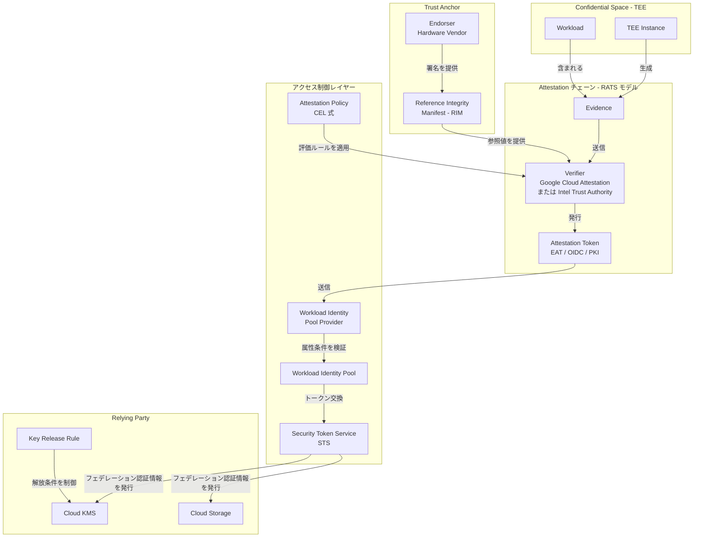

| 要素名 | 説明 |
|---|---|
| Workload | TEE 上で実行されるコンテナイメージとその設定 |
| TEE Instance | Workload を実行するハードウェア環境 (Confidential VM + GPU TEE) |
| Evidence | TEE Instance が生成する署名付き測定値の集合 (Quote / Report) |
| Verifier | Evidence を Trust Anchor と Policy に照合し、Attestation Token を発行する役割 |
| Attestation Token | Verifier が発行する署名付きトークン。EAT / OIDC / PKI のいずれかの形式 |
| Reference Integrity Manifest | ハードウェアベンダーが公開する期待測定値の参照標準 |
| Endorser | ハードウェアベンダー。RIM や証明書に署名する Trust Anchor の供給源 |
| Attestation Policy | Verifier が Evidence を許可するための評価ルール。CEL 式で表現 |
| Workload Identity Pool / Provider | Attestation Token を IAM が消費できる形式に変換する仲介 |
| Security Token Service | フェデレーション ID から短期アクセストークンを発行する Google Cloud のサービス |
| Cloud KMS / Cloud Storage | Attestation Token の検証後にのみアクセスが許可される保護リソース |
| Key Release Rule | KMS が鍵を解放する条件を定義する IAM バインディング |

### 情報モデル

#### Workload と TEE Instance

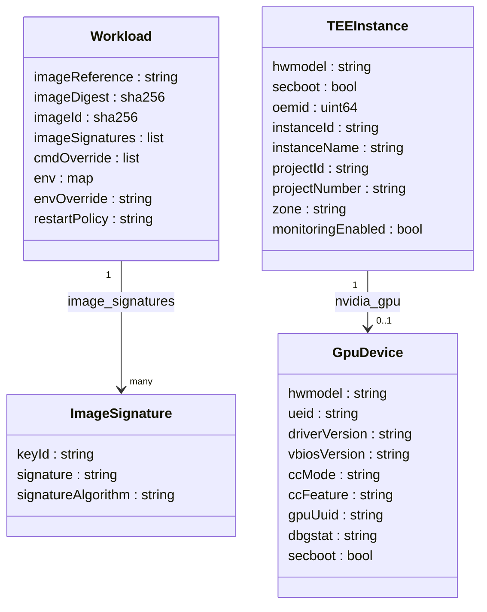

#### Evidence

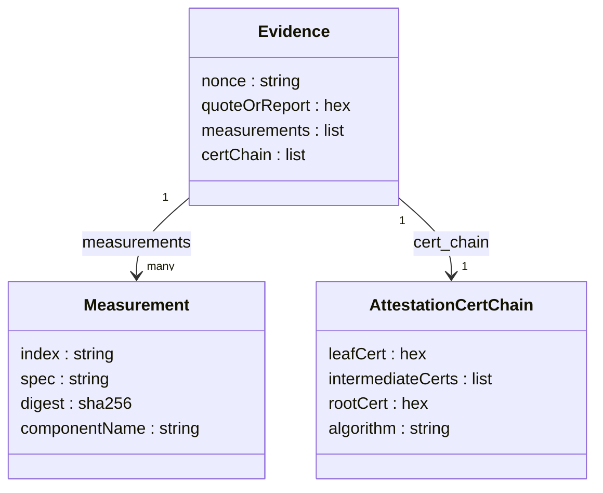

#### Attestation Token

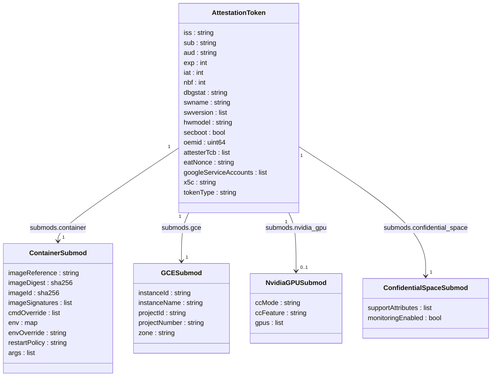

#### Reference Integrity Manifest

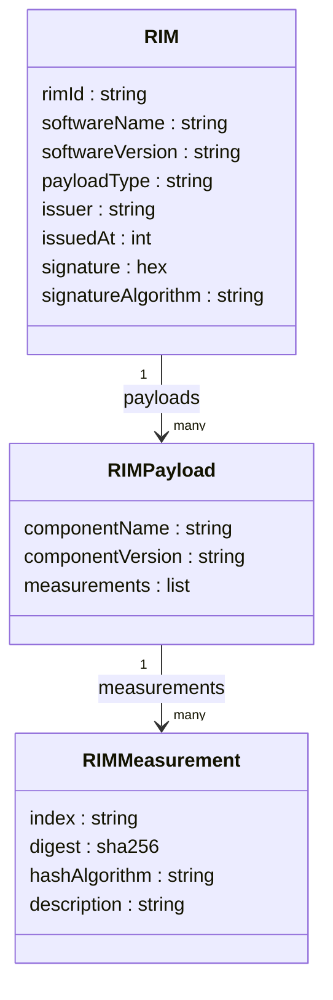

#### Attestation Policy と Workload Identity

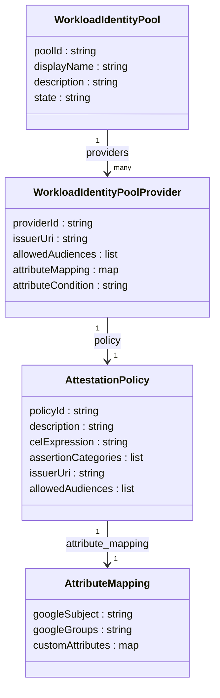

#### Key Release Rule と Relying Party

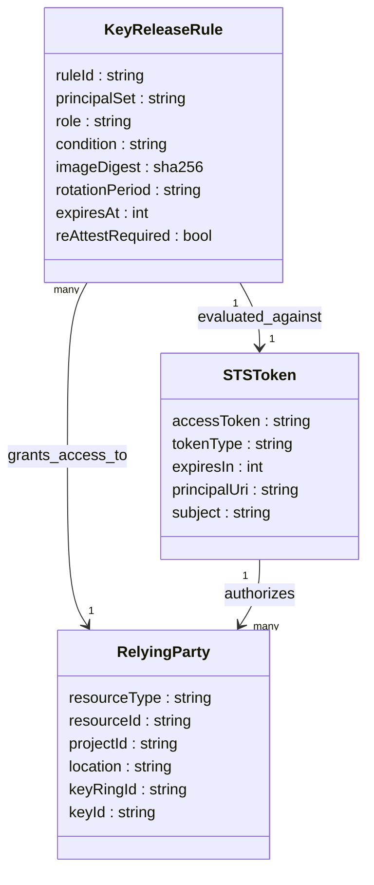

---

## 構築方法

### 前提条件

- **GCP プロジェクトと課金**: `gcloud projects create` でプロジェクトを作成し、課金を有効にします。
- **必要な API の有効化**: 以下のコマンドで必要なサービスを一括有効化します。

```bash
gcloud services enable \
    compute.googleapis.com \
    confidentialcomputing.googleapis.com \
    artifactregistry.googleapis.com \
    cloudkms.googleapis.com \
    iamcredentials.googleapis.com \
    logging.googleapis.com
```

- **IAM 権限**: 作業ユーザーには `roles/compute.admin`、`roles/iam.workloadIdentityPoolAdmin`、`roles/cloudkms.admin` が必要です。
- **gcloud の最新化**: `gcloud components update` を実行して最新バージョンを使います。

### Confidential Space image の選択

`confidential-space-images` プロジェクトが image を管理します。Production と Debug の 2 バリアントと、3 段階のサポート属性があります。

| サポート属性 | 意味 |
|---|---|
| `LATEST` | 最新バージョン。サポート対象・脆弱性監視対象。`STABLE` および `USABLE` も兼ねます |
| `STABLE` | サポート対象・脆弱性監視対象。`USABLE` も兼ねます |
| `USABLE` | この属性のみの場合はサポート外。自己責任での使用に限ります |
| `EXPERIMENTAL` | プレビュー機能を含むテスト用 image。本番では使用しません |

- `confidential-space` (Production): ロックダウンされており、Operator はワークロードの処理データにアクセスできません。
- `confidential-space-debug` (Debug): SSH が有効化されており、ルートアクセスでデバッグできます。Attestation Token にデバッグ状態が記録されます。

```bash
gcloud compute images list \
  --project=confidential-space-images \
  --no-standard-images \
  --filter="family~'confidential-space$'"

gcloud compute images list \
  --project=confidential-space-images \
  --no-standard-images \
  --filter="family~'confidential-space-debug$'"
```

本番環境では `image-family=confidential-space` を指定し、LATEST/STABLE 属性を持つ image を自動選択させます。

### ワークロード用サービスアカウントとロール

```bash
gcloud iam service-accounts create workload-sa \
  --display-name="Confidential Space Workload SA" \
  --project=PROJECT_ID

gcloud projects add-iam-policy-binding PROJECT_ID \
  --member="serviceAccount:workload-sa@PROJECT_ID.iam.gserviceaccount.com" \
  --role="roles/confidentialcomputing.workloadUser"

gcloud projects add-iam-policy-binding PROJECT_ID \
  --member="serviceAccount:workload-sa@PROJECT_ID.iam.gserviceaccount.com" \
  --role="roles/artifactregistry.reader"

gcloud projects add-iam-policy-binding PROJECT_ID \
  --member="serviceAccount:workload-sa@PROJECT_ID.iam.gserviceaccount.com" \
  --role="roles/logging.logWriter"
```

### Workload Identity Pool と Provider の作成

データ協力者は専用プールと OIDC プロバイダーを作成し、Attestation Verifier を登録します。

```bash
gcloud iam workload-identity-pools create my-cs-pool \
  --location=global \
  --display-name="Confidential Space Pool"

gcloud iam workload-identity-pools providers create-oidc attestation-verifier \
  --location=global \
  --workload-identity-pool=my-cs-pool \
  --issuer-uri="https://confidentialcomputing.googleapis.com" \
  --allowed-audiences="https://sts.googleapis.com" \
  --attribute-mapping="google.subject=\"gcpcs::\"+assertion.submods.container.image_digest+\"::\"+assertion.submods.gce.project_number+\"::\"+assertion.submods.gce.instance_id,attribute.image_digest=assertion.submods.container.image_digest" \
  --attribute-condition="assertion.swname == 'CONFIDENTIAL_SPACE' && 'STABLE' in assertion.submods.confidential_space.support_attributes && \"workload-sa@PROJECT_ID.iam.gserviceaccount.com\" in assertion.google_service_accounts"
```

- `issuer-uri`: Confidential Space の Attestation Verifier エンドポイントです。
- `allowed-audiences`: STS トークン交換用 URL を固定で指定します。
- `attribute-condition`: CEL 式で STABLE image のみを許可し、debug image を除外します。サービスアカウントは配列順序に依存する `[0]` ではなく `in assertion.google_service_accounts` で membership チェックする方が安全です (`tee-impersonate-service-accounts` メタデータで複数 SA が入る可能性に対応)。

### KMS 鍵の作成と IAM 設定

```bash
gcloud kms keyrings create my-keyring \
  --location=global

gcloud kms keys create my-key \
  --location=global \
  --keyring=my-keyring \
  --purpose=encryption

gcloud kms keys add-iam-policy-binding \
  projects/PROJECT_ID/locations/global/keyRings/my-keyring/cryptoKeys/my-key \
  --member="principalSet://iam.googleapis.com/projects/PROJECT_NUMBER/locations/global/workloadIdentityPools/my-cs-pool/attribute.image_digest/sha256:WORKLOAD_CONTAINER_IMAGE_DIGEST" \
  --role="roles/cloudkms.cryptoKeyDecrypter"
```

ダイジェストが変わるたびに IAM バインディングを更新する必要があるため、CI/CD パイプラインで自動化することを推奨します。

### Artifact Registry へのイメージ登録

```bash
gcloud artifacts repositories create my-cs-repo \
  --repository-format=docker \
  --location=us-central1 \
  --description="Confidential Space workload images"

gcloud auth configure-docker us-central1-docker.pkg.dev

docker build -t us-central1-docker.pkg.dev/PROJECT_ID/my-cs-repo/workload:latest .
docker push us-central1-docker.pkg.dev/PROJECT_ID/my-cs-repo/workload:latest

docker inspect \
  us-central1-docker.pkg.dev/PROJECT_ID/my-cs-repo/workload:latest \
  --format='{{index .RepoDigests 0}}'
```

### Confidential VM のマシンタイプと GPU 対応

| テクノロジー | 対応マシンタイプ例 | GPU | 備考 |
|---|---|---|---|
| AMD SEV | `n2d-standard-2` 等 | なし | `--confidential-compute-type=SEV`。`--maintenance-policy=MIGRATE` 可 |
| Intel TDX | `c3-standard-*` | なし | `--confidential-compute-type=TDX`。`--maintenance-policy=TERMINATE` 必須 |
| Intel TDX + NVIDIA H100 | `a3-highgpu-1g` | NVIDIA H100 | `--confidential-compute-type=TDX`。`--maintenance-policy=TERMINATE` 必須 |
| Blackwell G4 (Preview) | G4 系 | NVIDIA RTX PRO 6000 Blackwell | **Confidential VM / Confidential GKE Node 側の Preview**。2026-06 時点で Confidential Space の公式 deploy 手順には未掲載 |

注: Confidential Space の現行公式 `Deploy workloads` ドキュメントが受け付ける `--confidential-compute-type` の値は `SEV` と `TDX` のみです (Confidential VM 一般では `SEV_SNP` も存在しますが、Confidential Space の公式手順では未掲載のため本表からは外しています)。

CPU のみのワークロードを AMD SEV でデプロイする例:

```bash
gcloud compute instances create my-cs-instance \
  --confidential-compute-type=SEV \
  --machine-type=n2d-standard-2 \
  --image-project=confidential-space-images \
  --image-family=confidential-space \
  --shielded-secure-boot \
  --maintenance-policy=MIGRATE \
  --service-account=workload-sa@PROJECT_ID.iam.gserviceaccount.com \
  --metadata="^~^tee-image-reference=us-central1-docker.pkg.dev/PROJECT_ID/my-cs-repo/workload:latest~tee-restart-policy=Never~tee-container-log-redirect=true"
```

Intel TDX + NVIDIA H100 GPU を使用する例:

```bash
gcloud compute instances create my-gpu-cs-instance \
  --confidential-compute-type=TDX \
  --machine-type=a3-highgpu-1g \
  --image-project=confidential-space-images \
  --image-family=confidential-space \
  --shielded-secure-boot \
  --maintenance-policy=TERMINATE \
  --provisioning-model=SPOT \
  --zone=us-central1-a \
  --boot-disk-size=30G \
  --service-account=workload-sa@PROJECT_ID.iam.gserviceaccount.com \
  --metadata="^~^tee-image-reference=us-central1-docker.pkg.dev/PROJECT_ID/my-cs-repo/workload:latest~tee-restart-policy=Never~tee-container-log-redirect=true"
```

---

## 利用方法

### 必須パラメータ一覧

| パラメータ / 変数 | 種別 | 必須 | 説明 |
|---|---|---|---|
| `tee-image-reference` | VM メタデータ | 必須 | ワークロードコンテナの Artifact Registry URI |
| `tee-restart-policy` | VM メタデータ | 任意 | `Never` / `Always` / `OnFailure`。デフォルトは `Never` |
| `tee-container-log-redirect` | VM メタデータ | 任意 | `false` (デフォルト) / `true` (両方) / `cloud_logging` / `serial` の 4 値。`true` 指定時は Cloud Logging とシリアルコンソールの両方に出力 |
| `tee-env-<VAR>` | VM メタデータ | 任意 | コンテナへ渡す環境変数。Workload Author の許可が必要 |
| `ita-api-key` | VM メタデータ | Intel TDX 時 | Intel Trust Authority の API キー |
| `ita-region` | VM メタデータ | Intel TDX 時 | `US` または `EU` |
| `--confidential-compute-type` | gcloud フラグ | 必須 | Confidential Space 公式手順では `SEV` または `TDX` (`SEV_SNP` は Confidential VM 一般では存在しますが Confidential Space 公式 deploy doc には未掲載) |
| `--image-family` | gcloud フラグ | 必須 | `confidential-space` または `confidential-space-debug` |
| `audience` | Token リクエスト Body | カスタム Token 時 | STS エンドポイントまたは任意の文字列 |
| `nonces` | Token リクエスト Body | カスタム Token 時 | リプレイ攻撃防止のためのチャレンジ乱数。Relying Party が発行し、Attestation Token の `eat_nonce` クレームに埋め込まれて返るので、Relying Party 側で突合する。10〜74 バイトで最大 6 個まで指定可 |
| `token_type` | Token リクエスト Body | カスタム Token 時 | `OIDC` または `UNSPECIFIED` |

### ワークロードコンテナの最低要件

- **任意の言語・フレームワーク**: Python、Go、Java など制限はありません。
- **Artifact Registry への格納**: Container Registry は非推奨のため Artifact Registry を使用します。
- **デーモン不要**: コンテナ自身が entrypoint としてビジネスロジックを実行します。
- **ポートの明示**: コンテナが公開するポートは `EXPOSE` ディレクティブで宣言します。
- **root 不要**: root 以外のユーザーで動作させることを推奨します。

最小構成の Dockerfile 例:

```dockerfile
FROM python:3.11-slim

WORKDIR /app
COPY requirements.txt .
RUN pip install --no-cache-dir -r requirements.txt

COPY workload.py .

RUN useradd -m appuser
USER appuser

ENTRYPOINT ["python", "workload.py"]
```

### Attestation Token の取得方法

#### ファイルマウント経由 (デフォルト Token)

launcher が自動生成したデフォルト OIDC Token は固定パスにマウントされます。audience は固定値 `https://sts.googleapis.com` で、Workload Identity Federation 経由で GCP API を呼び出す際に使用します。Token の有効期限は 60 分です。

```python
with open("/run/container_launcher/attestation_verifier_claims_token") as f:
    attestation_token = f.read().strip()

import urllib.request
import json

sts_url = "https://sts.googleapis.com/v1/token"
body = json.dumps({
    "grantType": "urn:ietf:params:oauth:grant-type:token-exchange",
    "audience": "//iam.googleapis.com/projects/PROJECT_NUMBER/locations/global/workloadIdentityPools/my-cs-pool/providers/attestation-verifier",
    "requestedTokenType": "urn:ietf:params:oauth:token-type:access_token",
    "subjectTokenType": "urn:ietf:params:oauth:token-type:jwt",
    "subjectToken": attestation_token,
    "scope": "https://www.googleapis.com/auth/cloud-platform"
}).encode()

req = urllib.request.Request(sts_url, data=body,
    headers={"Content-Type": "application/json"})
with urllib.request.urlopen(req) as resp:
    gcp_access_token = json.loads(resp.read())["access_token"]
```

#### Unix socket 経由 (カスタム Token)

任意の audience や nonce を持つカスタム Token は Unix ドメインソケットを経由して取得します。

```python
import socket
import http.client
import json

class UnixSocketHTTPConnection(http.client.HTTPConnection):
    def __init__(self, socket_path):
        super().__init__("localhost")
        self.socket_path = socket_path

    def connect(self):
        self.sock = socket.socket(socket.AF_UNIX, socket.SOCK_STREAM)
        self.sock.connect(self.socket_path)

SOCKET_PATH = "/run/container_launcher/teeserver.sock"

payload = json.dumps({
    "audience": "https://example.com/my-relying-party",
    "nonces": ["base64encodednonce1"],
    "token_type": "OIDC"
}).encode()

conn = UnixSocketHTTPConnection(SOCKET_PATH)
conn.request("POST", "/v1/token",
    body=payload,
    headers={"Content-Type": "application/json"})
response = conn.getresponse()
token_data = json.loads(response.read())
custom_token = token_data["token"]
```

### Attestation Policy (CEL) のサンプル

Workload Identity Pool Provider の `--attribute-condition` に CEL 式を記述します。

```cel
assertion.submods.container.image_digest == "sha256:837ccb607e312b170fac7383d7ccfd61fa5072793f19a25e75fbacb56539b86b"
```

```cel
"workload-sa@my-project.iam.gserviceaccount.com" in assertion.google_service_accounts
```

```cel
assertion.hwmodel == "GCP_INTEL_TDX"
```

```cel
assertion.submods.nvidia_gpu.cc_mode == "ON"
```

複合条件の例:

```cel
assertion.swname == "CONFIDENTIAL_SPACE" &&
"STABLE" in assertion.submods.confidential_space.support_attributes &&
assertion.hwmodel == "GCP_INTEL_TDX" &&
assertion.submods.nvidia_gpu.cc_mode == "ON" &&
"workload-sa@PROJECT_ID.iam.gserviceaccount.com" in assertion.google_service_accounts
```

`hwmodel` の値は **Google 公式ドキュメント内で表記揺れ**があるため、参照面ごとに分けて整理します。

**発行 Attestation Token の `hwmodel` 値 (token-claims リファレンス)**

| 値 | 意味 |
|---|---|
| `GCP_AMD_SEV` | AMD SEV |
| `GCP_AMD_SEV_ES` | AMD SEV-ES |
| `GCP_INTEL_TDX` | Intel TDX |
| `GCP_SHIELDED_VM` | Shielded VM |

**CEL `attribute-condition` で評価する assertion 側の値 (attestation-assertions リファレンス)**

| 値 | 意味 |
|---|---|
| `GCP_AMD_SEV` | AMD SEV |
| `INTEL_TDX` | Intel TDX (`GCP_` 接頭辞なしで記載されている) |

実運用では、CEL ポリシーを本番投入する前に発行された Live Token の `hwmodel` を `gcloud iam workload-identity-pools providers list` 等で実測確認し、どちらの表記が evidence 側に乗ってくるかを確かめてから policy を fix することを推奨します。

`submods.nvidia_gpu.cc_mode` の値は `ON` / `OFF` / `DEVTOOLS` の 3 種類です。本番では `ON` のみを許可します。

### GPU TEE を有効化したワークロードの起動

Confidential GKE ノードプールの例:

```bash
gcloud container node-pools create gpu-confidential-pool \
  --cluster=my-gke-cluster \
  --location=us-central1 \
  --confidential-node-type=TDX \
  --node-locations=us-central1-a \
  --machine-type=a3-highgpu-1g \
  --accelerator=type=nvidia-h100-80gb,count=1,gpu-driver-version=latest \
  --maintenance-policy=TERMINATE \
  --spot \
  --num-nodes=1
```

VM 内での GPU ドライバ初期設定:

```bash
sudo apt-get install -y build-essential linux-headers-$(uname -r)
sudo apt-get install -y nvidia-open-kernel-source-580

echo "options nvidia NVreg_EnableGpuFirmware=1" | sudo tee /etc/modprobe.d/nvidia.conf
sudo update-initramfs -u

sudo nvidia-smi -pm 1

sudo reboot
```

再起動後の確認:

```bash
nvidia-smi conf-compute -f
```

### Intel Trust Authority 連携

Intel Trust Authority (ITA) を独立した Attestation プロバイダーとして使うと、インフラプロバイダー (Google Cloud) と Attestation プロバイダーを分離できます。規制業界のゼロトラスト要件に対応した構成です。

```bash
gcloud compute instances create my-ita-instance \
  --confidential-compute-type=TDX \
  --machine-type=c3-standard-4 \
  --image-project=confidential-space-images \
  --image-family=confidential-space \
  --shielded-secure-boot \
  --maintenance-policy=TERMINATE \
  --service-account=workload-sa@PROJECT_ID.iam.gserviceaccount.com \
  --metadata="^~^tee-image-reference=us-central1-docker.pkg.dev/PROJECT_ID/my-cs-repo/workload:latest~ita-api-key=YOUR_ITA_API_KEY~ita-region=US~tee-restart-policy=Never"
```

コンテナ内からの ITA Token 取得:

```python
import socket
import http.client
import json

class UnixSocketHTTPConnection(http.client.HTTPConnection):
    def __init__(self, socket_path):
        super().__init__("localhost")
        self.socket_path = socket_path

    def connect(self):
        self.sock = socket.socket(socket.AF_UNIX, socket.SOCK_STREAM)
        self.sock.connect(self.socket_path)

SOCKET_PATH = "/run/container_launcher/teeserver.sock"

payload = json.dumps({
    "Audience": "https://my-relying-party.example.com",
    "TokenType": "OIDC"
}).encode()

conn = UnixSocketHTTPConnection(SOCKET_PATH)
conn.request("POST", "/v1/intel/token",
    body=payload,
    headers={"Content-Type": "application/json"})
response = conn.getresponse()
ita_token = json.loads(response.read())["token"]
```

Google Token と ITA Token のエンドポイントが `/v1/token` と `/v1/intel/token` で異なる点に注意します。

#### Google Cloud Attestation と Intel Trust Authority の比較

| 項目 | Google Cloud Attestation | Intel Trust Authority |
|---|---|---|
| 運営主体 | Google | Intel |
| 信頼境界 | クラウドプロバイダー (Google) と一体 | クラウドプロバイダーから分離 |
| エンドポイント | コンテナ内 TEE Server の `http://localhost/v1/token` (実装は Unix socket。サンプルでは `/run/container_launcher/teeserver.sock`) | 同じ TEE Server の `http://localhost/v1/intel/token`。リージョン指定 `ita-region=US` で `api.trustauthority.intel.com`、`EU` で `api.eu.trustauthority.intel.com` を ITA 側エンドポイントとして利用 |
| 認証 | サービスアカウント (`workload-sa`) | API キー (`ita-api-key` メタデータ) |
| トークン形式 | OIDC JWT (`submods.container` / `submods.gce` / `submods.nvidia_gpu` / `submods.confidential_space` のサブモジュール構造) | OIDC JWT (`attester_tcb_status` / `policy_ids` 等の ITA 独自クレーム) |
| ポリシー記述 | Workload Identity Pool Provider の CEL `attribute-condition` | ITA ポータルで定義する Appraisal Policy |
| 適用ガイド | GCP に閉じたゼロトラスト構成で十分なケース | 規制業界などで「Attestation 検証者をクラウドプロバイダー管理外に置きたい」ケース |

両者は排他ではなく、同一 VM 上で **両方のトークンを取得して**用途別に Relying Party を分けることも可能です。

### Prompt Encryption SDK の使い方

`google/prompt-encryption-sdk` は、クライアントが TEE 内ワークロードへプロンプトをエンドツーエンドで暗号化して送信するための Python ライブラリです。Attested TLS を利用してチャネルとワークロードの正当性を同時に検証します。


```bash
git clone https://github.com/google/prompt-encryption-sdk.git
cd prompt-encryption-sdk
pip install .
pip install ".[server]"
```

サーバー側 (TEE 内ワークロード) の実装:

```python
from fastapi import FastAPI
from prompt_encryption_sdk.server import run_uvicorn_app

app = FastAPI()

@app.post("/v1/completions")
def completions(data: dict):
    prompt = data.get("prompt", "")
    result = {"choices": [{"text": f"Response to: {prompt}"}]}
    return result

if __name__ == "__main__":
    run_uvicorn_app(
        app,
        host="0.0.0.0",
        port=8000,
        ssl_keyfile="key.pem",
        ssl_certfile="cert.pem"
    )
```

クライアント側の実装:

```python
from prompt_encryption_sdk.client import PromptEncryptionClient
from prompt_encryption_sdk.proto import attestation_pb2

policy = attestation_pb2.AttestationPolicy(
    hw_model=attestation_pb2.HARDWARE_MODEL_TDX,
    workload=attestation_pb2.WorkloadPolicy(
        image_hash="sha256:YOUR_EXPECTED_CONTAINER_IMAGE_HASH"
    )
)

client = PromptEncryptionClient(policy)
target_url = "https://LOAD_BALANCER_IP:8000/v1/completions"

with client.session() as http:
    response = http.post(
        target_url,
        json={"prompt": "機密データについて説明してください"},
        verify="/path/to/ca-bundle.pem"
    )
    print(response.json())
```

SDK の内部フローは次の手順を踏みます。

1. TCP/TLS 接続を開始します。
2. ハンドシェイク中断中に Attested Connection RPC でノンスを送信します。
3. TEE ハードウェアからクォートを生成します。
4. クライアントは Policy とクォート署名を検証します。
5. チャネルの Exported Keying Material (EKM) がセッション内容と一致することを確認します。
6. 全ての検証が成功した後にのみ、暗号化されたプロンプト本体を送信します。

---

## 運用

### Confidential Space image のバージョン管理

長期稼働する VM はワークロード終了のたびに削除・再作成することで、常に最新 image を使用できます。image 更新後は `assertion.submods.container.image_digest` のポリシー値を更新し、IAM バインディングの principal set も新しい digest に対応させます。

```bash
gcloud compute images list \
  --project=confidential-space-images \
  --no-standard-images \
  --filter="family~'confidential-space$'"
```

attestation policy には次の条件を必ず組み込み、debug image を本番から排除します。

```cel
'STABLE' in assertion.submods.confidential_space.support_attributes
```

### Attestation Token の有効期限と再取得

Confidential Space の launcher は Workload Identity Pool 向けトークンを 1 時間ごとに自動ローテーションします。Token には次のクレームが含まれます。

- `iat`: トークン発行時刻
- `exp`: トークン失効時刻
- `nbf`: トークン有効開始時刻

KMS の trust path が切れた場合、`exp` を過ぎたトークンは WIP で拒否され、その時点から鍵 release も失敗します。対処は WIP プロバイダーの再設定と VM の再起動による Token 強制再取得です。

### Reference Integrity Manifest の更新

NVIDIA が提供する RIM は GPU ドライバおよび VBIOS ビルド時に生成される TCG SWID 形式の XML ファイルです。SHA384 ハッシュ値と ECDSA-SHA384 署名が含まれており、attestation 時に NVIDIA RIM Service から SDK が自動取得します。

- ドライバまたは VBIOS をアップデートすると、古いバージョン向けの RIM では測定値が一致しなくなります。
- サポート対象バージョンの確認は NVIDIA H100 Confidential Computing ガイドで行います。
- RIM の自動取得に失敗する場合はネットワーク疎通を確認します。RIM Service のエンドポイントへのアクセスが必要です。

### Live Migration と attestation の再評価

AMD ベースの N2D マシンタイプは AMD SEV の Live Migration を、C3D-based Confidential VMs は 2026-06-24 の発表で Live Migration の一般提供開始 (GA) が告知されました (起点記事 "Verifiable trust in the AI era")。migration 中もゲストメモリは暗号化されたまま転送されるため、ワークロードへの中断はありません。移行後は attestation の再評価が実施され、移行先ホストの測定値が新しいトークンに反映されます。

AMD SEV-SNP でファームウェアアップデートを行うと v4 attestation レポートが生成されるため、v3 専用のパーサーは破綻します。GKE 環境では対応バージョンへのアップグレード時に live migration が自動有効化されます。

```bash
gcloud compute instances stop <VM_NAME>
gcloud compute instances start <VM_NAME>
```

### GPU TEE の cc_mode 切替と本番運用

NVIDIA H100 GPU は 3 つの動作モードを持ちます。

| モード | 概要 | 本番適性 |
|---|---|---|
| CC-Off | CC 機能無効。標準的な GPU 動作 | 開発・テスト向け |
| CC-On | CC 機能全有効。パフォーマンスカウンター無効化によりサイドチャネル攻撃を抑制 | 本番推奨 |
| CC-DevTools | CC ワークフローを維持しつつ、プロファイリング用にパフォーマンスカウンターを有効化 | 開発・デバッグ向け |

モード切替は GPU リセットを伴うハイパーバイザー特権操作で、エンドユーザー (ワークロード内) からは変更できません。Google Cloud では `--confidential-compute-type=TDX` + `a3-highgpu-1g` で起動した VM の GPU は自動的に CC-On が選択され、ワークロード側は `nvidia-smi conf-compute -f` でモードを確認するのみとなります。オンプレミス環境やセルフマネージドのハイパーバイザーで CC モードを切り替える場合は、[NVIDIA/nvtrust](https://github.com/NVIDIA/nvtrust) リポジトリの `host_tools/` 配下に同梱された GPU 管理ツールをホスト側 root 権限で実行し、その後 VM を再起動します (具体的なスクリプト名はリポジトリの README とリリースで都度確認してください)。本番では CC-On を必須とし、attestation policy で `assertion.submods.nvidia_gpu.cc_mode == 'ON'` を検証します。SPDM セッション確立後にドライバが unload されてセッションキーが破棄されるとデータ保護が破綻するため、ドライバの常駐確保 (代表的には `nvidia-persistenced` デーモンの起動) を運用上強く推奨します。

```bash
nvidia-smi conf-compute -f
nvidia-smi -q | grep -i "confidential"
```

### 監視 (Cloud Audit Logs / NVIDIA NRAS)

Confidential Space の attestation に関するイベントは Cloud Audit Logs に記録されます。attestation 失敗は Data Access ログとして出力されます。

```
resource.type="gce_instance"
protoPayload.serviceName="sts.googleapis.com"
severity>=WARNING
```

NVIDIA NRAS はクラウドサービスとして提供され、GPU デバイス証明書の OCSP 検証と RIM 照合結果を返します。attestation 失敗時は `attestation-support@nvidia.com` へエスカレーションします。

### 鍵ローテーション (Cloud KMS / CMEK)

Cloud KMS は対称鍵の自動ローテーションをサポートします。PCI DSS 準拠などのコンプライアンス要件がある場合は 90 日周期のローテーションが推奨されます。

```bash
gcloud kms keys versions create \
  --key=KEY_NAME \
  --keyring=KEYRING_NAME \
  --location=LOCATION \
  --primary
```

- 非対称鍵は自動ローテーション非対応のため、手動ローテーションが必要です。
- 旧バージョンで暗号化されたデータは旧バージョンで復号できます。再暗号化は明示的な操作が必要です。
- image digest を更新する場合は、IAM バインディングの principal set を新しい digest 値に差し替え、旧 principal set のバインディングを削除します。

---

## ベストプラクティス

### Workload Author / Operator / Data Collaborator の役割分離

- **Workload Author**: コンテナイメージを構築し、launch policy を定義します。ワークロードのセキュリティ仕様を管理しますが、本番データにはアクセスできません。
- **Workload Operator**: VM のデプロイ、環境変数の設定、サービスアカウントの管理を行います。コンテナ内のデータにはアクセスできません。
- **Data Collaborator**: WIP プロバイダーと attestation policy を定義します。KMS 鍵の IAM バインディングを管理し、特定の image digest を持つワークロードにのみアクセスを許可します。

CI/CD パターンとして、イメージビルドと署名は Workload Author のパイプラインで完結させ、Operator はビルド済み image の参照のみを行う設計が推奨されます。

### Multi-party Computation の trust boundary 設計

3 者以上のデータ提供者が相互不信のまま協業する場合、次の設計原則を適用します。

- **多者認可**: 1 者の侵害だけでは秘密にアクセスできない構造にします。複数の WIP プロバイダーが異なるデータセットの鍵を管理し、それぞれが独立して policy を評価します。
- **最小権限**: TEE が処理に必要なデータのみを受け取る設計にします。
- **Operator 排除**: Confidential Space の hardened image は Workload Operator が実行中ワークロードに SSH 接続できない構造になっています。これが multi-party の信頼の起点です。
- **監査可能性**: `assertion.submods.gce.*` クレームをログに記録し、どのプロジェクト・ゾーン・インスタンスで処理されたかの監査証跡を残します。

### Defense-in-depth

多層防御は次のレイヤーで構成します。

1. **TEE (ハードウェア)**: AMD SEV-SNP / Intel TDX / NVIDIA H100 CC-On によるメモリ暗号化と測定値記録
2. **TCB の縮小**: Hardened OS Image は dm-verity による read-only ルートと SSH 無効化で TCB を絞り、ワークロードコンテナ側でも `securityContext.capabilities.drop: ["ALL"]`、`runAsNonRoot: true`、seccomp デフォルトプロファイル維持、不要カーネルモジュールの blacklist を適用して攻撃面を縮小する
3. **トランスポート暗号化**: PCIe 上の CPU-GPU 間通信は SPDM セッションで確立した AES 鍵で暗号化
4. **Attestation policy**: CEL 式による image digest・サポート属性・ハードウェアモデルの多項目検証
5. **Data minimization**: ワークロードが処理に必要な最小限のデータのみを受け取る設計
6. **Audit logging**: Cloud Audit Logs への attestation イベント記録と SIEM 連携

Apple PCC の実装事例から学べる設計として、事前定義された構造化ログのみをノードから出力するアプローチが挙げられます。汎用ログ機構を持たせないことでユーザーデータの漏洩経路を減らせます。

### Attestation Policy のテスト

CEL 条件のテストには次のアプローチを用います。

- **ローカル検証**: `gcloud iam workload-identity-pools create-cred-config` のドライランで policy の構文エラーを検出します。
- **Golden image digest 管理**: CI/CD でビルドした image の digest を SBOM と対応付けて管理し、policy に含める digest が意図した image を指していることを確認します。
- **Staging 環境での attestation 疎通確認**: debug image で動作確認後、production image に切り替えて attestation が成功することをステージング環境で確認します。

### Container image の immutable 化

mutable tag (`:latest` など) をポリシーで禁止し、`image_digest` による固定参照を必須とします。

```bash
gcloud projects add-iam-policy-binding DATA_COLLABORATOR_PROJECT_ID \
  --member="principalSet://iam.googleapis.com/.../attribute.image_digest/sha256:DIGEST" \
  --role=roles/cloudkms.cryptoKeyDecrypter
```

mutable tag を使用すると、image が差し替えられても既存の policy が通過するリスクがあります。image_digest による固定参照はこのリスクを排除します。

### GPU TEE 性能オーバーヘッドの最小化

NVIDIA H100 CC-On モードの性能特性は次の通りです。

- **LLM 推論全体**: 大部分の典型的なクエリでスループット低下を 7% 未満に抑えられます ([arXiv 2409.03992](https://arxiv.org/abs/2409.03992) のベンチマーク報告)。
- **大規模モデル・長シーケンスほど影響小**: モデル規模が大きくシーケンス長が長くなるほど CC モードのオーバーヘッドはゼロに近づきます。
- **主なボトルネック**: PCIe 越しの暗号化データ転送と、スモールバッチでの RPC レイテンシです。
- **CUDA graph 制約**: 一部のドライババージョンでは `--enforce-eager` フラグが必要となり、CC モードのオーバーヘッドに加えてさらに 10〜15% のスループット低下が追加されます。最新ドライバで CUDA graph が許可されれば回避できます。

大バッチ推論では暗号化バウンスバッファのオーバーヘッドが計算コストに対して相対的に小さくなるため、バッチサイズを大きくとることが性能最適化の基本戦略です。

### Apple PCC の実装事例から学べる設計

| 設計原則 | Apple PCC の実装 | Confidential AI への応用 |
|---|---|---|
| Transparency log | 全 PCC コード測定値を append-only の暗号的改ざん防止 log で公開 | image digest を公開 SBOM と連携させ、独立検証を可能にする |
| Stateless execution | リクエスト完了後にデータを即時削除し、リブートごとに鍵を消去 | ワークロードのリブートポリシーを `Never` にし、セッション間の状態保持を禁止する |
| 監査ログの最小化 | 汎用ログ機構を持たず、事前定義された構造化 log のみ出力 | Cloud Audit Logs に出力するフィールドをあらかじめ定義し、未定義データの漏洩を防ぐ |
| 特権アクセスの排除 | リモートシェルや対話的デバッグを意図的に除外 | 本番 image は SSH 無効化、Workload Operator のルートアクセスをブロック |

---

## トラブルシューティング

### 頻出エラーの症状・原因・対処

| 症状 | 原因 | 対処 |
|---|---|---|
| WIP がトークンを拒否 (image digest mismatch) | ワークロード image を再ビルドしたが policy の digest 値が旧いまま | IAM バインディングと WIP 属性条件の digest 値を新 image の SHA256 に更新する |
| WIP がトークンを拒否 (hwmodel 不一致) | VM マシンタイプを変更し、ハードウェアモデルが policy 記載値と異なる | `assertion.hwmodel` の値を `gcloud compute instances describe` で確認し、policy を修正する |
| WIP がトークンを拒否 (GPU cc_mode mismatch) | GPU が CC-On になっていないが policy で `cc_mode == 'ON'` を要求している | `nvidia-smi -q` で CC モードを確認する。CC-Off の場合は GPU 管理ツールで CC-On に切り替えて VM を再起動する |
| KMS 鍵 release 拒否 (CEL policy が false) | `support_attributes` に `STABLE` が含まれていない (debug image を使用している) | 本番 image (STABLE 属性あり) に切り替える |
| Attestation token 取得失敗 (token expiry) | トークンの `exp` を過ぎた状態でリクエストしている | launcher が 1 時間ごとに自動更新するため VM が正常稼働しているか確認する。停止していれば再起動する |
| GPU 測定値不一致 (measurement record index 9) | GPU アタッチ後の初期化シーケンスの既知バグ | `gcloud compute instances stop` → `start` で完全再起動する (guest OS の reboot では解消しない) |
| RIM lookup 失敗 | ドライバまたは VBIOS のバージョンが CC 非対応 | NVIDIA H100 CC ガイドでサポートバージョンを確認し、対応バージョンに更新する |
| RIM 無効・破損 | トランジット中の改ざん、またはサポート外のフォーマット | ドライバと VBIOS を正規バージョンに再インストールし、RIM の完全性を確認する |
| SPDM セッション確立失敗 | `nvidia-persistenced` が未起動でセッション確立後に driver がアンロードされた | `nvidia-persistenced` デーモンを起動し、CC モードでの driver 常駐を確保する |
| H100 起動エラー (`GPU Driver installation is not supported`) | Confidential Space image 上での GPU ドライバインストールが不可 | VM を再起動する (Confidential Space の既知の問題) |
| Live migration 後の attestation 再評価エラー | 移行先ホストの firmware が古く、attestation レポート形式 (v3→v4) が変わった | attestation レポートパーサーを v4 対応版に更新する |
| KMS への鍵 release 後も復号失敗 | 旧バージョンの鍵でデータを暗号化したが、ローテーション後の新バージョンで復号しようとしている | 旧バージョンが `ENABLED` 状態であることを確認する。再暗号化が必要な場合は明示的にデータを新バージョンで暗号化し直す |

### Attestation 失敗の調査

attestation 失敗は Cloud Audit Logs の `sts.googleapis.com` サービスの `ExchangeToken` イベントで検出できます。失敗時のログには `assertion` の実際の値が含まれるため、policy の期待値と比較することで原因を特定できます。

```bash
gcloud logging read \
  'resource.type="iam_workforce_pool" \
   protoPayload.methodName="google.identity.sts.v1.SecurityTokenService.ExchangeToken"' \
  --limit=20
```

### Token expiry / 再取得失敗

launcher による自動更新が停止している場合、メタデータサーバから直接 Token を取得して launcher の動作を診断できます。

```bash
curl -H "Metadata-Flavor: Google" \
  "http://metadata.google.internal/computeMetadata/v1/instance/service-accounts/default/identity?audience=https://sts.googleapis.com"
```

### SPDM セッション確立失敗

```bash
systemctl status nvidia-persistenced
systemctl start nvidia-persistenced
```

CC モードではセッションキーが破棄されると FLR (Function Level Reset) が必要になるため、driver の常駐が前提となります。

### Attestation forgery (証明偽造) と Endorser 失効の罠

Attestation の信頼チェーンは Endorser (ハードウェアベンダー) の公開鍵証明書を頂点に持ちます。Verifier が次のいずれかを怠ると、攻撃者が偽造 Evidence を通過させ得る前提崩壊が起こります。

- **証明書チェーンの完全検証**: GPU 個体証明書 → Intermediate CA → NVIDIA Root CA までを毎回辿る。中間 CA を省略しない。
- **OCSP / CRL 失効チェック**: NVIDIA OCSP Service への疎通が前提。エアギャップ環境では OCSP stapling または CRL を定期キャッシュし、失効データなしの Verifier を本番で使わない。
- **RIM 署名の検証**: NVIDIA が SWID XML に付与する ECDSA-SHA384 署名を必ず検証し、未署名 RIM をフォールバックで受け入れない。
- **nonce 検証**: Relying Party は自分が発行した `nonce` が Token の `eat_nonce` クレームに含まれるかを確認し、過去 Token のリプレイを拒否する。

Google Cloud Attestation と Intel Trust Authority はマネージドサービスとして上記を実施しますが、独自に Verifier を構築する場合 (Veraison / Keylime 等) はこの 4 項目を実装漏れなく担保する必要があります。

### TEE が守らないもの — 脅威モデルの外側

TEE はソフトウェア的な攻撃に対して強力な防御を提供しますが、次の脅威カテゴリは明示的にスコープ外です。

- **物理メモリバス傍受 (TEE.Fail)**: 2025 年 10 月公開の TEE.Fail 攻撃は、安価な機材で DDR5 メモリバスを傍受し、Intel TDX・AMD SEV-SNP の鍵を抽出できると報告されました (BleepingComputer / The Hacker News 報道、[tee.fail](https://tee.fail/))。物理アクセスと root 権限が前提のため、クラウド環境での実施難度は高いとされています。各ベンダーの一次 advisory については別途公式リリースで確認してください。
- **Cold boot 攻撃 (HBM)**: GPU の HBM は電源断直後も短時間内容を保持するため、GPU ノードへの物理アクセスを持つ攻撃者がモデル重みや直近の推論データを抽出できる可能性があります。
- **ファームウェアダウングレード攻撃**: 古いファームウェアに意図的に戻すことで既知の脆弱性を利用する攻撃です。SEV-SNP は悪意ある古い firmware をリモート検出できますが、物理アクセスを伴うケースは保護対象外です。
- **サイドチャネル (キューメタデータ)**: NVIDIA GPU-CC では、コマンドキューの `readPtr`/`writePtr` などのメタデータが平文で残ります。これを観測することで RPC のタイプを高精度で推定できます。
- **マルチ GPU 間の NVLink 暗号化**: Hopper 世代では NVLink トラフィックは暗号化されません (Blackwell 世代で対応予定)。
- **OS・ハイパーバイザーの侵害後のゲスト VM**: ゲスト OS が侵害されると、TEE 内のデータも攻撃者の支配下に入ります。TEE は「クラウドプロバイダー・Operator からのデータ保護」を提供しますが、ワークロード自体のコード侵害は防げません。

---

## まとめ

Confidential AI は「実行時保護 + 第三者 Attestation」を AI ワークロードの前提に組み込み、クラウドプロバイダーを信頼境界の外に置く新しい運用モデルです。Google Cloud Confidential Space と NVIDIA H100 GPU TEE の GA、Intel Trust Authority による独立検証の選択肢、Apple PCC のような採用事例の積み上がりにより、機密データ AI 案件の調達要件と基盤設計を「保存時/転送時暗号化 + 実行時 TEE + 鍵 release ポリシー」の三層で語ることが現実的になりました。設計段階から CEL ポリシー / image digest 固定 / GPU CC モード必須化 / Attestation forgery 対策 / TEE が守らないもの (TEE.Fail・NVLink 非暗号化等) の境界を明文化し、規制要件を「Attestation トークンの監査証跡」で吸収できるかを早期に検証していくのが要点です。

この記事が少しでも参考になった、あるいは改善点などがあれば、ぜひリアクションやコメント、SNS でのシェアをいただけると励みになります！


## 参考リンク

### 概要・トレンド

- [Verifiable trust in the AI era: what's new in Confidential Computing (Google Cloud Blog, 2026-06-24)](https://cloud.google.com/blog/products/identity-security/verifiable-trust-in-the-ai-era-whats-new-in-confidential-computing/)
- [Powering the next era of Confidential AI - Apple PCC on Google Cloud (Google Cloud Blog)](https://cloud.google.com/blog/products/identity-security/powering-the-next-era-of-confidential-ai/)
- [Confidential Computing Consortium (Linux Foundation)](https://confidentialcomputing.io/)
- [CCC Technical Analysis of Confidential Computing v1.3](https://confidentialcomputing.io/wp-content/uploads/sites/10/2023/03/CCC-A-Technical-Analysis-of-Confidential-Computing-v1.3_unlocked.pdf)
- [About Azure confidential VMs (Microsoft Learn)](https://learn.microsoft.com/en-us/azure/confidential-computing/confidential-vm-overview)
- [AWS Nitro Enclaves](https://aws.amazon.com/ec2/nitro/nitro-enclaves/)
- [Confidential AI on Azure (Microsoft Learn)](https://learn.microsoft.com/en-us/azure/confidential-computing/confidential-ai)
- [AMD SEV-SNP vs Intel TDX vs NVIDIA GPU TEE 比較 (Phala)](https://phala.com/learn/AMD-SEV-vs-Intel-TDX-vs-NVIDIA-GPU-TEE)
- [Confidential Computing vs FHE (Phala)](https://phala.com/learn/Confidential-Computing-vs-FHE)
- [Confidential Computing for AI Inference (AppScale Blog)](https://appscale.blog/en/blog/confidential-computing-ai-inference-tees-nitro-enclaves-nvidia-h100-h200-2026)

### 構造・データモデル

- [Confidential Space overview (Google Cloud)](https://docs.cloud.google.com/confidential-computing/confidential-space/docs/confidential-space-overview)
- [Confidential Space security overview (Google Cloud)](https://docs.cloud.google.com/docs/security/confidential-space)
- [Google Cloud Attestation overview](https://docs.cloud.google.com/confidential-computing/docs/attestation)
- [Confidential VM attestation (Google Cloud)](https://docs.cloud.google.com/confidential-computing/confidential-vm/docs/attestation)
- [Attestation assertions (Confidential Space)](https://docs.cloud.google.com/confidential-computing/confidential-space/docs/reference/attestation-assertions)
- [Attestation token claims (Confidential Space)](https://docs.cloud.google.com/confidential-computing/confidential-space/docs/reference/token-claims)
- [Workload Identity Federation (Google Cloud IAM)](https://docs.cloud.google.com/iam/docs/workload-identity-federation)
- [NVIDIA Attestation Suite Documentation](https://docs.nvidia.com/attestation/index.html)
- [NVIDIA Trusted Computing Solutions](https://docs.nvidia.com/nvtrust/index.html)
- [NVIDIA GPU Claims Guide](https://docs.nvidia.com/attestation/advanced-documentation/latest/claims-guide/gpu_claims.html)
- [Confidential Computing on H100 GPUs (NVIDIA Developer Blog)](https://developer.nvidia.com/blog/confidential-computing-on-h100-gpus-for-secure-and-trustworthy-ai/)
- [NVIDIA GPU Confidential Computing Demystified (arXiv 2507.02770)](https://arxiv.org/html/2507.02770v1)
- [GPU Remote Attestation With Intel Trust Authority](https://docs.trustauthority.intel.com/main/articles/articles/ita/concept-gpu-attestation.html)
- [RFC 9334: RATS Architecture (IETF)](https://datatracker.ietf.org/doc/html/rfc9334)
- [RFC 9711: Entity Attestation Token (EAT) (IETF)](https://www.rfc-editor.org/info/rfc9711/)
- [TCG Reference Integrity Manifest (RIM) Information Model](https://trustedcomputinggroup.org/resource/tcg-reference-integrity-manifest-rim-information-model/)

### 構築・利用

- [Deploy workloads (Confidential Space)](https://docs.cloud.google.com/confidential-computing/confidential-space/docs/deploy-workloads)
- [Create a Confidential VM instance with GPU (Google Cloud)](https://docs.cloud.google.com/confidential-computing/confidential-vm/docs/create-a-confidential-vm-instance-with-gpu)
- [Confidential GKE Nodes with GPU (Google Cloud)](https://cloud.google.com/kubernetes-engine/docs/how-to/gpus-confidential-nodes)
- [Create and grant access to confidential resources](https://docs.cloud.google.com/confidential-computing/confidential-space/docs/create-grant-access-confidential-resources)
- [Create your first Confidential Space environment](https://docs.cloud.google.com/confidential-computing/confidential-space/docs/create-your-first-confidential-space-environment)
- [Confidential Space images](https://docs.cloud.google.com/confidential-computing/confidential-space/docs/confidential-space-images)
- [Prompt Encryption SDK (GitHub)](https://github.com/google/prompt-encryption-sdk)
- [Prompt Encryption SDK Codelab](https://codelabs.developers.google.com/prompt-encryption-sdk)
- [Integrating GCP Confidential Space with Intel Trust Authority](https://docs.trustauthority.intel.com/main/articles/articles/ita/integrate-gcp-cs.html)
- [Intel Trust Authority overview](https://docs.trustauthority.intel.com/main/articles/integrate-overview.html)
- [NVIDIA Attestation SDK (PyPI)](https://pypi.org/project/nv-attestation-sdk/)
- [NVIDIA nvtrust GitHub Repository](https://github.com/NVIDIA/nvtrust)
- [Confidential Space PKI Codelab](https://codelabs.developers.google.com/confidential-space-pki)

### 運用・ベストプラクティス

- [Confidential Space release notes](https://docs.cloud.google.com/confidential-computing/confidential-space/docs/release-notes)
- [Live migration for Confidential Computing (Google Cloud Blog)](https://cloud.google.com/blog/products/identity-security/innovate-with-confidential-computing-attestation-live-migration-on-google-cloud)
- [Key rotation (Cloud KMS)](https://docs.cloud.google.com/kms/docs/key-rotation)
- [NVIDIA Attestation Troubleshooting Guide](https://docs.nvidia.com/attestation/advanced-documentation/latest/attestation-troubleshooting-guide/attestation_troubleshooting_guide_common.html)
- [NVIDIA RIM Guide](https://docs.nvidia.com/attestation/quick-start-guide/latest/rim_guide.html)
- [Confidential Computing on NVIDIA Hopper GPUs: Performance Benchmark Study (arXiv)](https://arxiv.org/pdf/2409.03992)
- [Apple Private Cloud Compute Security Research Blog](https://security.apple.com/blog/private-cloud-compute/)
- [Confidential GPU Computing on Cloud: Deploy LLMs with NVIDIA TEE (Spheron)](https://www.spheron.network/blog/confidential-gpu-computing-nvidia-tee-encrypted-vram/)
- [How Confidential Space and MPC secure digital assets (Google Cloud Blog)](https://cloud.google.com/blog/products/identity-security/how-to-secure-digital-assets-with-multi-party-computation-and-confidential-space)

### トラブルシューティング・反証・限界

- [TEE.Fail Side-Channel Attack (BleepingComputer)](https://www.bleepingcomputer.com/news/security/teefail-attack-breaks-confidential-computing-on-intel-amd-nvidia-cpus/)
- [TEE.Fail Extracts Secrets from DDR5 Enclaves (The Hacker News)](https://thehackernews.com/2025/10/new-teefail-side-channel-attack.html)
- [Confidential AI with GPU Acceleration: Bounce Buffers (Intel Community Blog)](https://community.intel.com/t5/Blogs/Tech-Innovation/Artificial-Intelligence-AI/Confidential-AI-with-GPU-Acceleration-Bounce-Buffers-Offer-a/post/1740417)
- [Understanding the Confidential Containers Attestation Flow (Red Hat)](https://www.redhat.com/en/blog/understanding-confidential-containers-attestation-flow)
- [Attestation and Key-Release Flow - NVIDIA Enterprise Reference Architecture](https://docs.nvidia.com/enterprise-reference-architectures/deploying-proprietary-models-confidential-compute-self-hosted-kubernetes/latest/attestation-and-key-release-flow.html)
- [salrashid123/confidential_space (GitHub)](https://github.com/salrashid123/confidential_space)
- [CCC-Attestation (GitHub Organization)](https://github.com/CCC-Attestation)
