> 検証日: 2026-06-29

## ■概要

「Context Data Pipeline for RAG」とは、生成 AI / RAG (Retrieval-Augmented Generation) に渡す**文脈データ**を、社内に散らばる非構造データ (PDF・議事録・メール・ナレッジ記事・図表) から継続的に作り出すデータ加工パイプラインを指します。収集 → クレンジング → 意味付け → ベクトル化 → 同期更新 までを一本化します。

特定プロダクトの名前ではなく、「LLM の素の性能を上げるよりも、LLM に渡す**文脈そのもの**を継続的に整える方が業務 RAG の回答品質に効く」という設計思想に名前を付けたものです。Andrej Karpathy が 2025 年に「Context Engineering」と呼んで一般化させ、Anthropic が公式エンジニアリングブログで体系化しました。同じ時期に、ETL / ELT の延長として「非構造データ向け継続パイプライン」を組み立てる実装側の流れも進み、両者が 2025-2026 年に合流しました。

位置付けを 1 枚で示します。

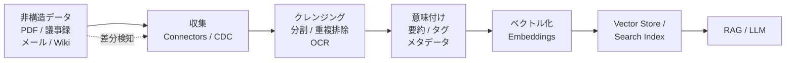

意味付け (D) と継続供給 (A→B の点線) が、従来の「ファイルを 1 回ベクトル化して終わり」の素朴な RAG と Context Data Pipeline 設計とを分けます。

### なぜ 2025-2026 にかけて注目されているか

LLM の競争軸が**モデル性能のフロンティア**から**文脈供給の質**へ移行したためです。

| 時期 | 主な競争軸 | 代表的な議論 |
|---|---|---|
| ~2024 | モデル本体の能力（パラメータ数 / ベンチマーク） | GPT-4 / Claude 3 / Gemini |
| 2024-2025 前半 | プロンプト工夫（Prompt Engineering） | CoT / few-shot / system prompt |
| 2025 後半-2026 | 文脈そのものの設計（Context Engineering） | Karpathy / Anthropic / Long-context vs RAG |

Karpathy は 2025 年 6 月の X 投稿で「Context engineering is the delicate art and science of filling the context window with just the right information for the next step.」と述べ、業務 LLM アプリでは prompt より context そのものの設計こそが本質だと位置付けました。Anthropic は公式ブログ「Effective context engineering for AI agents」で「the set of strategies for curating and maintaining the optimal set of tokens (information) during LLM inference」と定義し、prompt engineering の自然な発展形として体系化しました。

日経クロステック「RAGの精度向上、『AI-Ready』データを作るコンテキストエンジニアリング」、ITmedia の日本ハム事例、note の「社内RAGの回答精度が上がらない本当の理由」など、2026 年前半の国内記事も同じ論点に収束しており、テーマが普及局面に入ったとわかります。

### Context Engineering 言説との接続

Karpathy / Anthropic の言う「Context Engineering」は、推論時の context window に**何を**入れるかを設計します。Context Data Pipeline は、その「入れるべきもの」を**事前に作っておく**側を担当します。

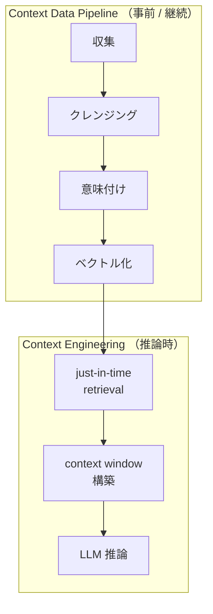

両者は対立する概念ではなく、上流 (素材作り) と下流 (盛り付け) の関係です。Anthropic が紹介する just-in-time retrieval（必要な瞬間にだけ context へ取り込む）も、素材側の意味付けとメタデータが整っていなければ「取り込むべき適切な単位」を選べません。Context Data Pipeline の品質が、Context Engineering の打ち手の選択肢を広げます。

### 日本ハム事例から見える典型課題（「薄い回答」の原因分解）

日本ハムは Azure OpenAI Service を用いた社内 AI アシスタント「Smart Generative Chat」と、生活者 1,000 人分のアンケートを 45 分で擬似実行する GC (Generated Customer) 分析を運用しています。この事例と、関連する国内記事 (note 言語理解研究所 / 日経クロステック) を突き合わせ、本稿では「AI が薄い回答を返す」原因を次の 4 つに抽象化して整理します。

| 原因クラス | 具体例 | 主因 |
|---|---|---|
| 文書構造の崩れ | 文字数固定チャンキングで「見出し+本文」が分断 | クレンジング工程の設計不足 |
| 表 / 図の意味喪失 | セル結合の空白が「空」と誤解、フローチャートの参照関係が消える | 非構造データ → テキスト変換時の意味付け欠落 |
| 業務文脈の欠落 | 社内略号・組織固有用語・部署コードが解釈できない | semantic enrichment の不在 |
| 鮮度ずれ | 古い議事録・廃止規程が混入、最新版と矛盾 | 継続供給 (CDC / 差分更新) の欠落 |

note 言語理解研究所の整理に従えば、これらは**モデル起因のハルシネーション**ではなく**データ起因のハルシネーション**であり、「日本の企業で RAG の精度が上がらない原因の大半」を占めるとされています。「薄い回答」の正体はモデルの限界ではなくパイプライン上流の意味付け不足であり、ここに Context Data Pipeline の存在意義があります。

## ■特徴

### 4-6 工程への分離

Context Data Pipeline の中核は、従来 1 つの「ロード処理」として扱っていた工程を、責務ごとに明確に分離することです。代表的な工程分解は次の 6 段です。

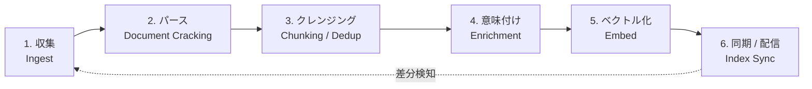

| 工程 | 役割 | 代表的な実装 |
|---|---|---|
| 収集 | データソースからの取得 | LangChain Document Loaders / Unstructured Source Connectors / Bedrock Data Source / Azure Indexer Data Source |
| パース | バイナリ → テキスト + 構造 | Unstructured の partition / Bedrock Smart Parsing / Azure document cracking |
| クレンジング | 分割・重複排除・正規化 | LlamaIndex SentenceSplitter / 構造的チャンキング |
| 意味付け | 要約・タグ・メタデータ付与 | LlamaIndex TitleExtractor / Azure Skillset / Unstructured 要約 enrichment |
| ベクトル化 | embedding 生成 | OpenAIEmbedding / Bedrock 埋め込みモデル / Azure 統合ベクタライゼーション |
| 同期 | Vector Store / Search Index への反映 | LlamaIndex IngestionPipeline / Azure Indexer / Bedrock Sync |

工程を分離すると、「精度が出ない」ときに**どの工程の問題か**を切り分けられ、最小単位で打ち手を選べます。

### 静的ロードでなく継続パイプラインであること

素朴な RAG では「初回に全件をベクトル化して終わり」の静的ロードを選びがちですが、業務データは毎日変わるため、数週間で精度が劣化します。Context Data Pipeline は**継続パイプライン**であることが必須要件です。

| 方式 | 仕組み | 代表例 |
|---|---|---|
| スケジューラ駆動 | cron / Airflow / Kestra で定期再実行 | Azure AI Search Indexer（最短 5 分間隔） |
| 差分検知 (CDC) | 更新タイムスタンプ・hash 比較で変更分のみ取り込み | LlamaIndex docstore (doc_id → document_hash の map) / Azure Blob change detection |
| イベント駆動 | ファイル PUT / Webhook で逐次起動 | S3 + Lambda + Bedrock Sync |

特に hash ベースの dedup が重要です。LlamaIndex IngestionPipeline は doc_id と document_hash の対応を保持し、hash が変わったときだけ再処理 + 更新し、変わらなければスキップします。巨大ナレッジベース全体を毎晩再 embed する無駄を避けながら、鮮度を保てます。

### semantic enrichment の役割

semantic enrichment は、生テキストに**検索可能なメタ情報**を付与する工程で、Context Data Pipeline の差別化点そのものです。

| Enrichment | 内容 | 効く場面 |
|---|---|---|
| タイトル抽出 | チャンクごとに見出しを推定・付与 | 文字数固定チャンクで「見出しと本文が分断」する問題の補正 |
| 要約付与 | 長文チャンクの 1-2 行サマリを併走 | 検索ヒット時のリランキング / プレビュー |
| タグ / カテゴリ | 業務領域・文書種別の分類 | metadata filter で検索範囲を絞る |
| 表 / 図の要約 | テーブル・図を自然文化 | セル結合の空白問題、フローチャート参照関係の喪失を回避 |
| エンティティ抽出 | 人名・組織・製品名 | 構造化検索 (SQL) との併用、グラフ RAG |

Azure AI Search では skillset が enrichment の容れ物となり、OCR・key phrase 抽出・翻訳・カスタムスキルを「パイプラインの中のパイプライン」として差し込めます。LlamaIndex では TitleExtractor などの Transformation として表現し、Unstructured では画像・テーブルの要約を optional enrichment として提供します。

### 業務文脈（組織固有用語・社内コード・略号）の継続抽出

semantic enrichment の中でも、企業固有の「方言」を継続的に拾い続ける機構が、社内 RAG の精度を最も大きく動かします。

| 課題 | 例 | 継続抽出の打ち手 |
|---|---|---|
| 社内略号 | 「営推」= 営業推進部、「PJ-X」= 製品コード | 用語辞書をマスタ化し、enrichment 時に展開・並記 |
| 組織コード | 部署コード「H001」→ 物流本部 | 組織マスタを join して人間可読化 |
| 製品 / 案件名 | 内部コードと外部呼称の二重管理 | エンティティ辞書を定期更新、エイリアスを metadata に付与 |
| 文書種別 | 「規程」「手順書」「議事録」「マニュアル」 | 種別を分類タグ化し、種別ごとに検索重みを変える |

これらは一度作って終わりではありません。新製品・組織改編・新略号の発生に合わせ**継続抽出**が必要で、ここが「継続パイプライン」と意味付けの結合点です。

### 他アプローチとの位置付け比較

LLM に文脈を渡す手段は Context Data Pipeline だけではなく、目的と制約に応じて選び分けます。

| アプローチ | 何をするか | 強み | 弱み | 向く用途 |
|---|---|---|---|---|
| Fine-tuning | モデル重みに知識を焼き込む | 推論時コスト低、レイテンシ小 | 更新が高コスト、ハルシネーション残る | 文体・口調・固定スキル |
| Long-context | 100 万トークン級の context に全部入れる | パイプライン不要、実装簡単 | コスト爆発、`needle-in-haystack` 劣化 | 単発の長文解析 |
| 単純 RAG（静的） | 1 回ベクトル化 + 類似検索 | 構築が速い | 鮮度・意味付け不足で「薄い回答」 | PoC / 小規模社内 FAQ |
| **Context Data Pipeline** | 継続収集 + 意味付け + 差分同期 | 鮮度・精度・統制 | 設計・運用コスト | 業務 RAG / エンタープライズ |
| Agentic just-in-time | エージェントが必要時に都度取得 | context が常に最小 | ツール設計が複雑 | 自律エージェント |

Context Data Pipeline は単純 RAG と Agentic の中間に位置し、「精度・鮮度・コスト・統制」のバランスを取ります。Anthropic の整理に従えば、agentic just-in-time retrieval の「呼ばれる側」を支える基盤としても機能します。

### 主要 5 プラットフォーム比較

代表的な 5 つのプラットフォームを Context Data Pipeline の観点で並べます。

| 観点 | LlamaIndex IngestionPipeline | Unstructured.io Platform | LangChain Document Loaders | AWS Bedrock Knowledge Bases | Azure AI Search Indexer |
|---|---|---|---|---|---|
| 実行方式 | ライブラリ（Python）。バッチ / async / multiprocessing parallel。Redis・Mongo・Firestore 等での分散キャッシュ | マネージド SaaS（no-code UI）+ Ingest CLI / API。Pay-as-you-go パイプライン | ライブラリ（Python / JS）。ローダ単位呼び出し、独自オーケストレーションが前提 | フルマネージド（Managed）と Customer-managed の 2 モード | マネージド Indexer（pull model）。最短 5 分間隔スケジューラ |
| 対応データソース | LlamaHub 経由で数百コネクタ（S3 / Notion / Slack / DB / Web） | 多数の source connector（PDF / Office / メール / クラウドストレージ / DB） | 公式 + コミュニティで数百ローダ | S3 / SharePoint / Confluence / Salesforce / Google Drive / OneDrive / Web Crawler | Azure Blob / Data Lake Gen2 / Cosmos DB / SQL DB / OneLake / SharePoint (preview) など Azure 中心 |
| 意味付けの作り込みやすさ | Transformation を Python クラスで自由追加。TitleExtractor などの組込あり | 画像・表の自動要約 enrichment が標準提供。no-code で組み合わせ | ローダ自体は最小限。enrichment は別途自作 | Smart Parsing が文書種別ごとに自動最適化。マルチモーダル ingestion | Skillset として OCR / key phrase / 翻訳 / カスタムスキルを差し込み可 |
| 継続供給（差分検知 / スケジューラ） | docstore による doc_id+hash dedup。スケジューラは外部（Airflow / Kestra 等） | スケジュール実行・CDC は Platform 側で対応 | 標準では弱い。indexer や別パイプラインとの併用が必要 | Sync API + Managed の自動 ingestion。S3 イベント駆動と相性良 | Blob は自動 change detection、その他は change tracking 設定で増分化。最短 5 分間隔 |
| ベクトル DB との結合度 | 多数の vector store integration（Qdrant / Pinecone / Weaviate / pgvector など） | Destination connector で主要ベクタ DB に直接書込 | 多数の vector store ラッパー、自前で組む | Managed は OpenSearch Serverless / Aurora / Neptune Analytics をネイティブ管理 | Azure AI Search 自身が vector search 機能を内蔵、統合ベクタライゼーションで完結 |
| 推奨ユースケース | OSS で柔軟に組みたい中規模 RAG、研究開発、custom transformation が多い案件 | 非構造データの parser 品質が肝の案件、no-code で運用したいチーム | ローダ単位で部品再利用したい既存 LangChain プロジェクト | AWS スタックで完結、エージェント（AgentCore）と一体運用したい案件 | Azure スタックで完結、企業向け検索 + RAG 統合、管理 ID / セキュリティ統制重視の案件 |

選択軸は、「自前で組む自由度（LlamaIndex / LangChain）を取るか、マネージド統合（Bedrock / Azure / Unstructured）を取るか」と、「クラウド（AWS / Azure）との親和性」の 2 軸です。日本ハムのような Azure OpenAI Service ベースの案件では Azure AI Search Indexer + Skillset が自然な選択となり、AWS ベースなら Bedrock Knowledge Bases、マルチクラウド / OSS 寄りなら LlamaIndex + Unstructured の組み合わせが現実的な落とし所です。

## ■構造

システムコンテキスト図とコンテナ図は汎用構造として示し、コンポーネント図では既存実装（LlamaIndex / Unstructured / LangChain / Bedrock KB / Azure AI Search / Databricks Vector Search 等）を例示します。

### ●システムコンテキスト図

Context Data Pipeline 本体を中央に置き、人間アクター（役割）・上流データ源カテゴリ・下流の検索 / 生成基盤との関係を表現します。Pipeline は「Knowledge Owner が持つ生の知識」を「RAG Application User が消費可能な検索可能コンテキスト」へ継続的に変換する系です。

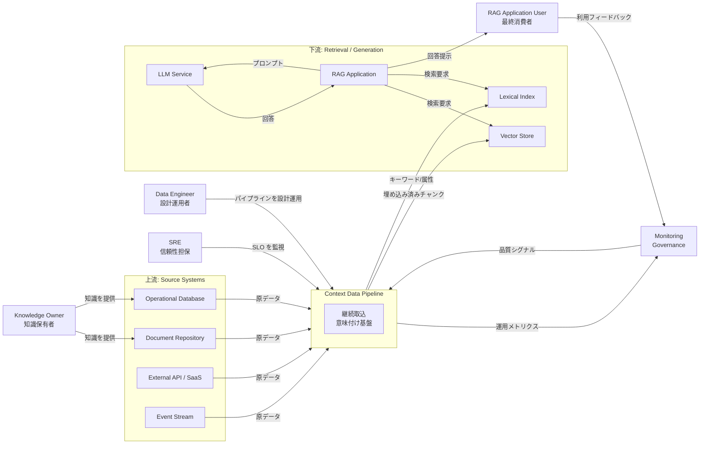

#### アクター

| 要素名 | 説明 |
|---|---|
| Knowledge Owner | 業務知識の発生源となる役割です。文書を執筆し、データベース上の業務記録を生み出し、その正本性に責任を負います。 |
| Data Engineer | パイプライン本体の設計と運用を担う役割です。コネクタ・前処理・チャンク戦略・埋め込みモデル選定の意思決定を行います。 |
| SRE | パイプラインの信頼性とコストを担保する役割です。鮮度 SLO、エラーレート、再処理コストを継続監視します。 |
| RAG Application User | 最終的に RAG アプリケーションを通じて生成回答を受け取る役割です。回答品質に対するフィードバックの源泉となります。 |

#### Pipeline 本体

| 要素名 | 説明 |
|---|---|
| Context Data Pipeline | 非構造データを RAG 向けコンテキストに継続変換する論理境界です。詳細はコンテナ図で分解します。 |

#### 上流カテゴリ（Source Systems）

| 要素名 | 説明 |
|---|---|
| Document Repository | 文書群を保持する原本系のカテゴリです。共有ストレージ・ナレッジベース・コード管理基盤などを含みます。 |
| Operational Database | 業務遂行に伴って生まれる構造化データのカテゴリです。トランザクション系・マスタ系を含みます。 |
| External API / SaaS | 第三者が提供する API や SaaS のカテゴリです。差分取得とレート制御の対象となります。 |
| Event Stream | 発生時刻に意味があるイベント列のカテゴリです。準リアルタイム取込の主要供給源となります。 |

#### 下流カテゴリ（Retrieval / Generation）

| 要素名 | 説明 |
|---|---|
| Vector Store | 埋め込みベクトルを保持し近似最近傍検索を提供する基盤カテゴリです。 |
| Lexical Index | 語彙的検索や属性フィルタを提供する基盤カテゴリです。ハイブリッド検索の片翼を担います。 |
| LLM Service | プロンプトに対し生成応答を返す基盤カテゴリです。Pipeline の直接顧客ではなくアプリ越しに利用されます。 |
| RAG Application | 検索結果と LLM を結合し最終回答を生成する利用側です。Pipeline の出力品質を実利用面で検証します。 |

#### 横断要素

| 要素名 | 説明 |
|---|---|
| Monitoring / Governance | 鮮度・コスト・品質・系統（リネージ）を観測しガバナンスを与える横断カテゴリです。利用フィードバックを Pipeline に還流します。 |

### ●コンテナ図

Context Data Pipeline 本体を 9 つの論理コンテナに分解します。各コンテナは「単一責務 + 明示的なインターフェース契約」を持ち、後段の差し替え（例: 埋め込みモデルの更新、チャンク戦略の刷新）に耐えます。Orchestrator が左右（取込側 / 索引側）を統括し、Quality Evaluator と Lineage / Catalog が横断的にメタ情報を扱う配置です。

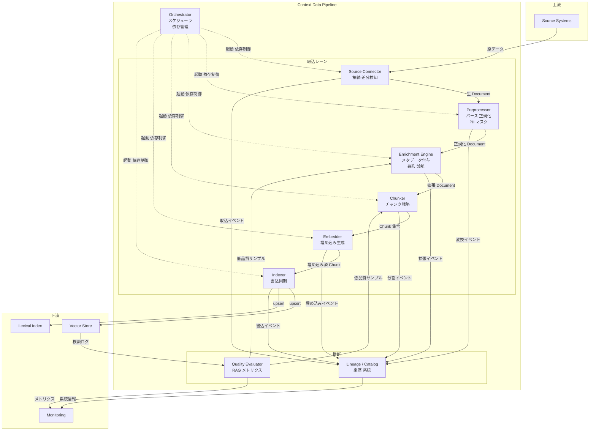

#### 取込レーン（Ingest Lane）

| 要素名 | 説明 |
|---|---|
| Source Connector | 上流データ源との接続と差分検知に責務を持ちます。完全取得 / 増分取得 / イベント駆動の 3 形態を吸収する境界です。 |
| Preprocessor | 取得したバイナリや HTML を構造化テキストに変換し、文字コード・改行・空白・機密情報マスクなどの正規化を行います。 |
| Enrichment Engine | テキストに対しメタデータ付与・要約・タグ付け・分類・実体抽出などの意味付け処理を施します。RAG 精度を左右する中核工程です。 |
| Chunker | 検索粒度に合わせて文書を分割する責務を持ちます。固定長 / 構造ベース / セマンティック / 階層など複数戦略の切替が前提です。 |
| Embedder | チャンクをベクトル化する責務を持ちます。モデル切替時の全件再生成にも耐える設計が求められます。 |
| Indexer | Vector Store と Lexical Index への書込と整合性同期を担います。冪等な upsert と削除伝播が要件です。 |

#### 横断（Cross-cutting）

| 要素名 | 説明 |
|---|---|
| Orchestrator | スケジューリング・依存制御・再実行制御を担います。バッチとイベント駆動の両方を同一モデルで扱えることが望まれます。 |
| Quality Evaluator | RAG 評価メトリクス（忠実性 / 文脈精度 / 文脈再現率 等）を収集し、低品質サンプルを Enrichment と Chunker にフィードバックする責務を持ちます。 |
| Lineage / Catalog | どのソースのどのバージョンが、どの変換を経て、どのチャンクとして格納されたかという来歴を保持します。再現性とガバナンスの基盤です。 |

#### 境界（Boundary）

| 要素名 | 説明 |
|---|---|
| Source Systems | 上流に位置する原データの供給源です。コンテキスト図のカテゴリと同義です。 |
| Vector Store / Lexical Index | 下流の検索基盤です。Pipeline 出力の格納先かつ Quality Evaluator の観測点です。 |
| Monitoring | 鮮度・コスト・品質・系統を可視化する横断基盤です。 |

### ●コンポーネント図

主要コンテナの内部構造を、既存実装の役割を例示しながら分解します。中核となる Enrichment Engine と Chunker を最優先で扱い、続いて Source Connector / Embedder + Indexer / Quality Evaluator + Lineage を示します。

#### Enrichment Engine のドリルダウン

Enrichment Engine は「テキスト自体は変えずに、検索性と説明可能性を上げるメタ層を被せる」工程です。処理は宣言的なスキル（skill）群の DAG として記述され、画像 / テキスト / 表 / コード のメディア種別ごとに別系統を持つのが定石です。Azure AI Search の skillset は典型例で、組込スキルとカスタムスキルの両方を同一実行モデルで扱います。

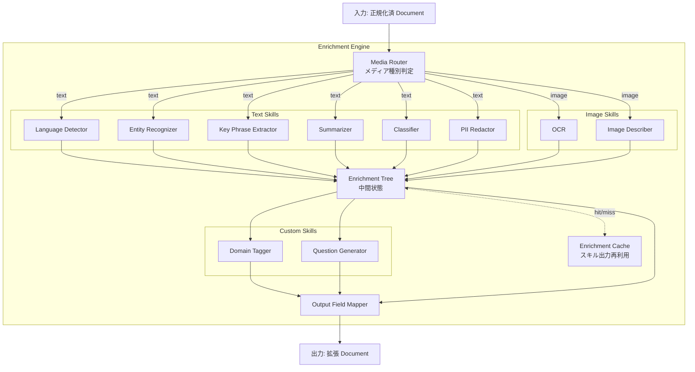

##### 制御部

| 要素名 | 説明 |
|---|---|
| Media Router | 入力文書の種別（テキスト / 画像 / 表 / 音声）を判定し、適切なスキル系統に振り分けます。 |
| Enrichment Tree | スキル群が出力する中間メタを木構造で集約する内部状態です。Azure AI Search の enriched document に対応します。 |
| Enrichment Cache | スキル出力を入力ハッシュ単位で再利用する仕組みです。OCR や LLM 呼び出しなど高コスト処理の再実行を抑制します。 |
| Output Field Mapper | 拡張結果を後段の Chunker / Indexer が期待する正規スキーマへ写像します。 |

##### Text Skills 群

| 要素名 | 説明 |
|---|---|
| Language Detector | 言語コードを推定しダウンストリームの分かち書きや翻訳の前提を整えます。 |
| Entity Recognizer | 人物・組織・場所・製品など固有表現を抽出します。属性フィルタや知識グラフ連携の入口になります。 |
| Key Phrase Extractor | 文書を代表するキーフレーズを抽出します。検索の意図一致を補強します。 |
| Summarizer | 抜粋型または抽象型の要約を生成します。長文の前段プレビューとして retrieval 精度に寄与します。 |
| Classifier | 業務ドメイン上のラベルを付与します。マルチテナント分離や権限境界の表現にも使えます。 |
| PII Redactor | 個人情報や機微情報を検出しマスクまたは伏字化します。GDPR や社内ポリシー遵守の責務です。 |

##### Image Skills 群

| 要素名 | 説明 |
|---|---|
| OCR | 画像内テキストを抽出します。スキャン PDF や図中文字の検索性を確保します。 |
| Image Describer | 画像を自然言語で説明するキャプションを生成します。マルチモーダル検索の橋渡しとなります。 |

##### Custom Skills 群

| 要素名 | 説明 |
|---|---|
| Domain Tagger | ドメイン辞書や規則に基づくタグ付け処理です。組込スキルで賄えない業務固有の意味付けを担います。 |
| Question Generator | チャンクから想定質問を逆生成し、Q-to-Chunk 検索の補助索引を作る処理です。HyDE などの派生手法に接続します。 |

#### Chunker のドリルダウン

Chunker は「埋め込みの単位」を決める工程で、RAG 全体の精度に最大の影響を与える分岐点です。LangChain の text splitter 分類（長さベース / テキスト構造 / 文書構造 / 意味）と Bedrock KB の戦略（固定長 / 階層 / セマンティック / 無分割）を統合し、ストラテジ選択器を中心に据える設計が定石です。

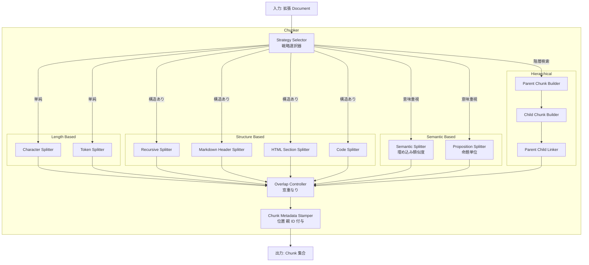

##### 制御部

| 要素名 | 説明 |
|---|---|
| Strategy Selector | 文書種別・サイズ・ドメインに応じて分割戦略を選択する責務を持ちます。ファイル種別と Enrichment 結果（言語 / 分類）を入力に取ります。 |
| Overlap Controller | チャンク間の重なり幅を制御します。文脈の境界欠落を防ぐ役割を担います。 |
| Chunk Metadata Stamper | 位置情報・親チャンク ID・出典 URL・更新時刻などをチャンクに刻印します。Lineage と引用表示の起点です。 |

##### Length Based

| 要素名 | 説明 |
|---|---|
| Character Splitter | 文字数または記号区切りで分割する最も素朴な戦略です。日本語のトークン数とずれが出る点に注意が要ります。 |
| Token Splitter | 埋め込みモデルや LLM のトークナイザに合わせて分割します。コンテキスト窓の上限制御が容易です。 |

##### Structure Based

| 要素名 | 説明 |
|---|---|
| Recursive Splitter | 段落 → 文 → 単語 と複数区切り文字を再帰的に試す戦略です。汎用テキストに対する標準解です。 |
| Markdown Header Splitter | 見出し階層を保ったまま分割する戦略です。Zenn / Confluence など見出しが意味を持つ媒体に向きます。 |
| HTML Section Splitter | DOM 構造（section / article）を境界として尊重します。Web 取込時のノイズを抑えます。 |
| Code Splitter | 関数やクラス境界を尊重する分割で、コード検索精度を高めます。言語別 AST が前提です。 |

##### Semantic Based

| 要素名 | 説明 |
|---|---|
| Semantic Splitter | 隣接文の埋め込み類似度を見て話題の切れ目で分割します。Bedrock KB の semantic chunking が一例です。 |
| Proposition Splitter | LLM で命題単位に分解する戦略です。粒度を揃え検索精度を高めますが生成コストを要します。 |

##### Hierarchical

| 要素名 | 説明 |
|---|---|
| Parent Chunk Builder | 広い文脈を担う親チャンクを構築します。Bedrock KB の hierarchical chunking の上位層に相当します。 |
| Child Chunk Builder | 検索精度を担う小粒な子チャンクを構築します。埋め込みは子で行い検索時に親に置換する想定です。 |
| Parent Child Linker | 親子参照を双方向に保持しメタデータに刻印します。検索時の置換と引用に使います。 |

#### Source Connector のドリルダウン

Source Connector は「上流の変更を漏れなく、かつ重複なく取得する」責務に特化します。LlamaIndex の docstore による doc_id × document_hash の管理、Bedrock KB のフルクロール / 増分同期、Databricks の Delta Sync が代表例です。

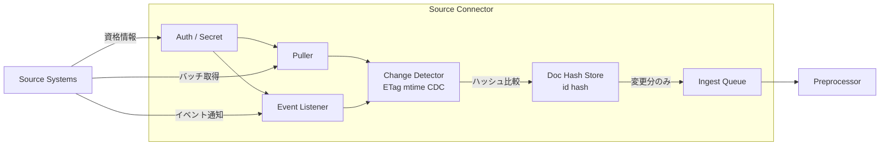

| 要素名 | 説明 |
|---|---|
| Auth / Secret | 資格情報の保管と更新を担います。シークレットローテーションが前提です。 |
| Puller | バッチで上流を走査する取得器です。スケジュール起動が基本です。 |
| Event Listener | Webhook やメッセージブローカからの変更通知を受ける取得器です。準リアルタイム取込を可能にします。 |
| Change Detector | ETag・更新時刻・CDC ログ等を用いて変更分を判定します。 |
| Doc Hash Store | doc_id とコンテンツハッシュの対応を保持し冪等性を担保します。LlamaIndex の docstore が代表例です。 |
| Ingest Queue | 後段への引渡しを非同期にする緩衝です。スパイクと再試行を吸収します。 |

#### Embedder + Indexer のドリルダウン

Embedder と Indexer は密結合で動く局面が多いため一枚で扱います。モデル管理・バッチ最適化・upsert / delete の整合がここで完結することで、上流の戦略変更を下流に波及させずに済みます。

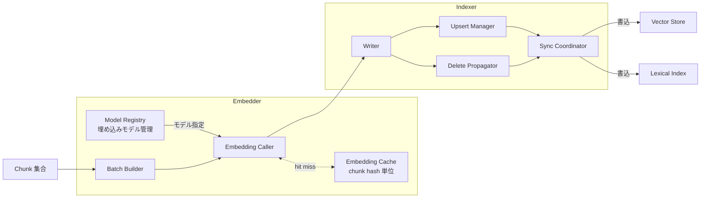

| 要素名 | 説明 |
|---|---|
| Model Registry | 利用する埋め込みモデルとバージョンを管理します。モデル切替時の全件再生成を支配する起点です。 |
| Batch Builder | API レート上限とコストに合わせて呼出単位を組み立てます。 |
| Embedding Caller | 埋め込み生成 API を実呼出する責務です。リトライとフォールバックを担います。 |
| Embedding Cache | チャンクハッシュ単位で生成済ベクトルを再利用します。LlamaIndex の transformation cache に相当します。 |
| Writer | 物理ストアへの書込ドライバです。Vector Store と Lexical Index の方言差を吸収します。 |
| Upsert Manager | 既存 ID への上書きを冪等に行う責務です。 |
| Delete Propagator | 上流削除を下流に伝播し古いチャンクを除去します。法令遵守の重要点です。 |
| Sync Coordinator | Vector Store と Lexical Index の整合を取り、片側欠損を防ぎます。Databricks の Delta Sync が一例です。 |

#### Quality Evaluator + Lineage / Catalog のドリルダウン

Quality Evaluator と Lineage / Catalog は読み取り専用の横断系で、Pipeline の改善ループとガバナンスの両輪を担います。Quality Evaluator は RAGAS 由来の四指標（忠実性 / 回答関連性 / 文脈精度 / 文脈再現率）を継続収集し、Lineage は OpenLineage 互換のイベントを蓄積する設計が広く採られます。

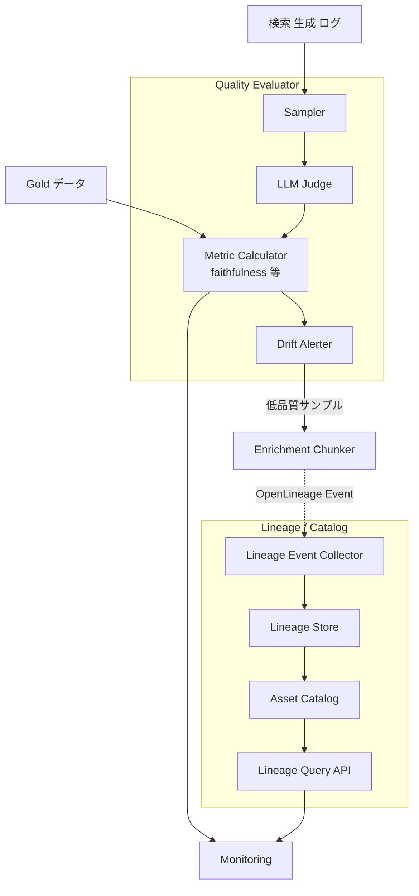

##### Quality Evaluator

| 要素名 | 説明 |
|---|---|
| Sampler | 検索生成ログから評価対象を抽出します。実トラフィックの代表性確保が要件です。 |
| LLM Judge | 回答と文脈を LLM で評価する仕組みです。Gold データと併用しコストと網羅性を両立します。 |
| Metric Calculator | 忠実性・回答関連性・文脈精度・文脈再現率などを算出します。RAGAS 互換が事実上の標準です。 |
| Drift Alerter | 指標悪化を検知しアラートとフィードバックを発します。Enrichment と Chunker の再調整契機を生みます。 |

##### Lineage / Catalog

| 要素名 | 説明 |
|---|---|
| Lineage Event Collector | 各コンテナが発するライフサイクルイベントを集約します。OpenLineage 仕様のイベント形式を採用する例が多いです。 |
| Lineage Store | 系統イベントを永続化する層です。Marquez 等の参照実装が知られます。 |
| Asset Catalog | データセット・ジョブ・ラン の三主体メタを横断検索可能にする層です。 |
| Lineage Query API | 「このチャンクは何のソースのどの版から来たか」を逆引きするインターフェースです。引用と監査の基盤になります。 |

## ■データ

Context Data Pipeline for RAG が扱う主要エンティティを、LlamaIndex の Document / Node スキーマ、LangChain の Document スキーマ、Unstructured の Element、AWS Bedrock Knowledge Base のリソース、Azure AI Search の Skillset / Indexer / Index、RAGAS の評価メトリクスから抽出して整理します。実装ごとに名称は異なりますが、抽象化すると同じ役割のエンティティに収れんします。

### ●概念モデル

パイプラインの構造を主要エンティティの関係として表現します。所有関係（composition / aggregation）を subgraph で、利用関係（use / produce / consume）を矢印で示します。

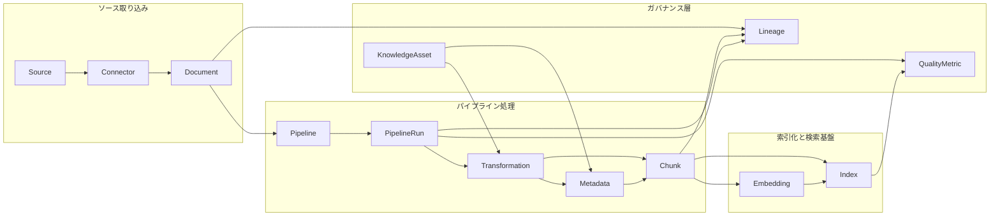

| 要素 | 説明 |
|---|---|
| Source | データの所在を示す論理的な源です。S3 バケット・Confluence space・Web サイト・データベースなどが該当します。 |
| Connector | Source への接続と認証を担うアダプタです。Bedrock では DataSource type、Unstructured では Connector、Azure AI Search では Indexer の dataSource に相当します。 |
| Document | パイプラインに取り込まれた 1 件の文書単位です。LlamaIndex Document、LangChain Document、Bedrock の Document に対応します。 |
| Pipeline | 取り込みから索引化までの処理手順を定義するテンプレートです。LlamaIndex の IngestionPipeline、Bedrock の Knowledge Base、Azure AI Search の Skillset+Indexer に対応します。 |
| PipelineRun | Pipeline の 1 回の実行インスタンスです。Bedrock の IngestionJob、Azure AI Search の Indexer execution に相当します。 |
| Transformation | Document または Chunk に作用する個別の処理です。Splitter・Extractor・Embedder・Cleaner・OCR Skill などを抽象化します。 |
| Chunk | Document を分割した検索可能な最小単位です。LlamaIndex の Node、Unstructured の Element、Bedrock の Chunk に対応します。 |
| Metadata | Document や Chunk に付与される構造化属性です。タグ・分類ラベル・要約・ページ番号などを保持します。 |
| Embedding | Chunk のベクトル表現です。Embedding model の出力で、Index 検索のキーになります。 |
| Index | Embedding と Metadata を格納し、類似検索とフィルタを提供する蓄積層です。Vector Index と Inverted Index の両方を含みます。 |
| Lineage | Source から Chunk・Embedding・Index までの来歴を辿れる追跡情報です。再現性とガバナンスの基盤になります。 |
| QualityMetric | Retrieval / Generation の品質を測る指標です。RAGAS の faithfulness・context recall・context precision・answer relevancy などを含みます。 |
| KnowledgeAsset | 組織固有の用語辞書・業務ルール・分類体系などのナレッジ資産です。Transformation や Metadata 付与に参照されます。 |

### ●情報モデル

各エンティティの主要属性を classDiagram で表現します。型は言語非依存の汎用型（string / int / float / bool / datetime / list / map / set）で記述し、関連には多重度を明示します。属性は一次資料（LlamaIndex / LangChain / Unstructured / Bedrock KB / Azure AI Search / RAGAS）を根拠としています。

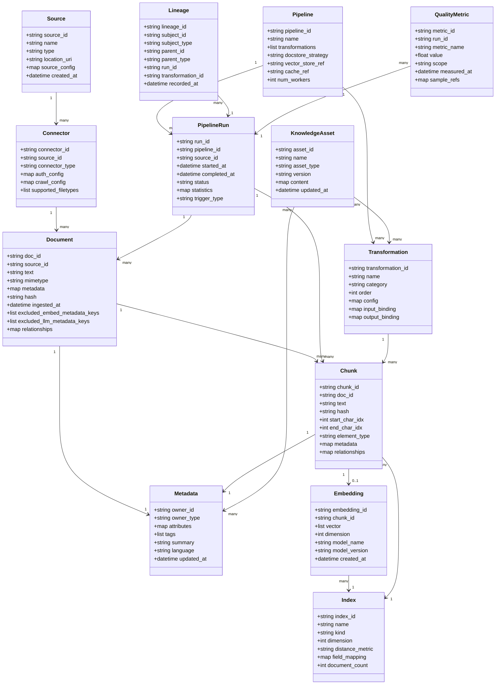

| 要素 | 説明 |
|---|---|
| Source | データ所在の論理定義です。type は s3 / web / confluence / database などを取り、location_uri が物理アドレスを保持します。 |
| Connector | Source への接続実装です。auth_config に資格情報、crawl_config に頻度・差分検知ルール、supported_filetypes に対応 mime 一覧を持ちます。 |
| Document | パイプライン取り込み単位です。LlamaIndex の Document・LangChain の Document・Bedrock の Document に共通する text・metadata・hash を中心に、excluded_*_metadata_keys で埋め込み・LLM 利用を制御します。 |
| Pipeline | 処理テンプレートです。transformations に Transformation の参照配列、docstore_strategy に重複処理方針（UPSERT / DUPLICATES_ONLY / NONE）、vector_store_ref に索引化先を保持します。 |
| PipelineRun | 1 回の実行記録です。status は STARTING / IN_PROGRESS / COMPLETE / FAILED を取り、statistics に処理件数・スキップ件数・所要時間を保持します。 |
| Transformation | パイプライン内の個別処理です。category は splitter / extractor / embedder / enricher / classifier などを取り、config に閾値やモデル名を保持します。 |
| Chunk | Document を分割した検索単位です。element_type に Unstructured 由来の意味種別（NarrativeText / Title / Table など）を保持し、start_char_idx と end_char_idx で原文位置を追跡します。 |
| Metadata | Document または Chunk に付与する属性集合です。attributes が汎用 key-value、tags が分類タグ、summary が抽出要約を保持します。 |
| Embedding | Chunk のベクトル表現です。dimension と model_name で再現性を担保し、model_version で再埋め込みの必要性を判定します。 |
| Index | Embedding と Metadata の蓄積層です。kind は vector / inverted / hybrid を取り、distance_metric に cosine / dot / euclidean を保持します。 |
| Lineage | エンティティ間の来歴です。subject_id と parent_id でグラフ構造を表現し、run_id と transformation_id で生成経緯を再現できます。 |
| QualityMetric | 評価指標の測定値です。metric_name は faithfulness / context_recall / context_precision / answer_relevancy などを取り、scope に retrieval / generation / end_to_end を保持します。 |
| KnowledgeAsset | 組織固有のナレッジ資産です。asset_type は glossary / taxonomy / business_rule / prompt_template などを取り、version で更新管理します。 |

実装側で名称が異なる場合（例: Bedrock の IngestionJob = PipelineRun、Unstructured の Element = Chunk、Azure AI Search の Skill = Transformation）は、本概念名にマッピングするとフレームワーク非依存の設計議論ができます。QualityMetric は Pipeline の継続改善ループの起点になり、RAGAS の 4 指標（faithfulness / answer_relevancy / context_precision / context_recall）を最低限の計測対象としつつ、Lineage と組み合わせてどの Chunk・Transformation が劣化要因かを追跡できる構造にします。KnowledgeAsset は組織用語辞書や業務ルールを Transformation や Metadata 付与に注入する役割を担い、汎用 RAG が陥りがちな「自社用語が出てこない・誤検出される」問題への対策として独立エンティティで扱います。

## ■構築方法

Context Data Pipeline 自体は特定プロダクト名ではないため、ここで示すコードはすべて方法論を実装するパターン例です。参照元の公式ドキュメント URL をコードコメントに明示します。

### 前提条件

| 前提項目 | 内容 | 補足 |
|---|---|---|
| Python 環境 | Python 3.9 以上 | LlamaIndex / LangChain / Unstructured すべて 3.9 以上を要求 |
| LLM API キー | OpenAI / Bedrock / Azure OpenAI / Cohere いずれか | 埋め込みモデル呼び出しと Enrichment 用 LLM 呼び出しに使う |
| Vector DB | Pinecone / Weaviate / OpenSearch / pgvector / Azure AI Search いずれか | クラウド版なら接続情報、OSS なら docker compose 等で起動する |
| ソース接続権限 | S3 IAM / SharePoint App / Confluence Token | コネクタごとに最小権限の OAuth / API キーを発行する |
| Orchestrator | cron / Airflow / Step Functions / Logic Apps | 継続供給（差分同期）を支える定期実行基盤 |

ローカル PoC から段階的に組み上げる前提で、まず Python 仮想環境を準備します。

```bash
# Source: https://developers.llamaindex.ai/python/framework/
python -m venv .venv
source .venv/bin/activate
python -m pip install --upgrade pip
```

### インストール（パターン別）

方法論の実装パターンを 4 つに分けて、最小構成のインストール手順を示します。

#### パターン A: LlamaIndex IngestionPipeline（OSS / pip）

LlamaIndex は Source / Preprocessor / Chunker / Enrichment / Embedder / Indexer を `IngestionPipeline` の transformations として宣言的に並べる構成です。

```bash
# Source: https://developers.llamaindex.ai/python/framework/module_guides/loading/ingestion_pipeline/
pip install llama-index
pip install llama-index-readers-file        # ローカル / fsspec 経由のソース
pip install llama-index-vector-stores-qdrant # Vector DB の例 (Qdrant)
pip install llama-index-embeddings-openai    # 埋め込みモデル
```

バージョン確認は次のコマンドで行います。

```bash
python -c "import llama_index; print(llama_index.__version__)"
```

#### パターン B: Unstructured.io（OSS / API）

非構造ファイル（PDF / DOCX / HTML / 画像）を要素（Title / NarrativeText / Table）に分解する Preprocessor を担うパターンです。OSS 版と API 版があります。

```bash
# Source: https://docs.unstructured.io/open-source/core-functionality/partitioning
pip install "unstructured[all-docs]"    # OSS 版 (PDF/Office/Image 含む)
# 注: hi_res 戦略を使う場合は別途 tesseract / poppler / libmagic が必要
```

API 版を使う場合は API キー発行後に次の SDK を入れます。

```bash
# Source: https://docs.unstructured.io/api-reference/api-services/sdk
pip install unstructured-client
```

#### パターン C: AWS Bedrock Knowledge Bases（マネージド / CDK）

マネージドサービス側に Source Connector / Chunker / Embedder / Indexer / Orchestrator を任せる構成です。Console 操作と CDK / API の 2 ルートがあります。

```bash
# Source: https://docs.aws.amazon.com/bedrock/latest/userguide/knowledge-base-create.html
pip install boto3 aws-cdk-lib constructs
aws --version    # awscli v2 想定
cdk --version    # CDK v2 想定
```

API リクエストの最小例（公式ドキュメント抜粋）は次のとおりです。

```http
PUT /knowledgebases/ HTTP/1.1
Content-type: application/json

{
  "name": "MyKB",
  "roleArn": "arn:aws:iam::111122223333:role/service-role/AmazonBedrockExecutionRoleForKnowledgeBase_123",
  "knowledgeBaseConfiguration": {
    "type": "VECTOR",
    "vectorKnowledgeBaseConfiguration": {
      "embeddingModelArn": "arn:aws:bedrock:us-east-1::foundation-model/amazon.titan-embed-text-v2:0"
    }
  },
  "storageConfiguration": {
    "opensearchServerlessConfiguration": {
      "collectionArn": "arn:aws:aoss:us-east-1:111122223333:collection/abcdefghij1234567890",
      "fieldMapping": {"metadataField": "metadata", "textField": "text", "vectorField": "vector"},
      "vectorIndexName": "MyVectorIndex"
    }
  }
}
```

#### パターン D: Azure AI Search Indexer + Skillset（マネージド / Bicep）

Indexer（定期 pull + 差分検知）と Skillset（chunk / OCR / embedding / 自然言語処理）を組み合わせる構成です。Bicep / azd / REST いずれでも構築できます。

```bash
# Source: https://learn.microsoft.com/en-us/azure/search/search-howto-create-indexers
az --version
azd version
pip install azure-search-documents
```

Indexer 定義の最小例（Skillset 連携あり）は次のとおりです。

```json
{
  "name": "rag-indexer",
  "dataSourceName": "blob-ds",
  "targetIndexName": "rag-index",
  "skillsetName": "rag-skillset",
  "schedule": { "interval": "PT1H" },
  "parameters": { "configuration": { "indexedFileNameExtensions": ".pdf,.docx" } }
}
```

### バージョン確認コマンド（まとめ）

| ツール | コマンド | 備考 |
|---|---|---|
| LlamaIndex | `python -c "import llama_index; print(llama_index.__version__)"` | パターン A |
| Unstructured | `python -c "import unstructured; print(unstructured.__version__)"` | パターン B |
| LangChain text-splitters | `python -c "import langchain_text_splitters; print(langchain_text_splitters.__version__)"` | チャンク分割の補強 |
| AWS CLI / Bedrock | `aws bedrock-agent list-knowledge-bases` | パターン C 接続確認 |
| Azure CLI / AI Search | `az search service show -g <rg> -n <svc>` | パターン D 接続確認 |
| Pinecone | `python -c "import pinecone; print(pinecone.__version__)"` | Vector DB の確認 |

## ■利用方法

各工程の典型コード例を、冒頭にコネクタ別必須パラメータを整理した一覧を置いた上で示します。

### コネクタ別必須パラメータ（Source Connector 早見表）

| connector | source_id | auth_method | schedule | chunk_strategy | 備考 |
|---|---|---|---|---|---|
| S3（LlamaIndex `S3Reader`） | `bucket` + `prefix` | AWS IAM（key / role） | cron / Airflow | RecursiveCharacter / Sentence | `pip install llama-index-readers-s3` |
| SharePoint（Bedrock KB / LlamaIndex `MicrosoftSharePointReader`） | `siteUrl` + `documentLibrary` | Azure AD App（client_id/secret/tenant） | KB Sync / cron 1h | Hierarchical 推奨 | Bedrock では tenantId / clientId / authType 指定 |
| Confluence（Bedrock KB / LlamaIndex `ConfluenceReader`） | `hostUrl` + `spaceKeys` | OAuth2.0 or API Token | KB Sync / cron 6h | Semantic 推奨 | スペース単位で権限分離 |
| Azure Blob（AI Search Indexer） | `connectionString` + `container` | Managed Identity 推奨 | `schedule.interval=PT1H` | Skillset SplitSkill | Indexer が `LastModified` で差分検知 |
| Web（Bedrock KB Web crawler） | `seedUrl` + `inclusionFilters` | （公開 URL） | KB Sync | Default 300 トークン | クロール深度・除外 URL を必ず指定 |
| ローカルファイル（LlamaIndex `SimpleDirectoryReader`） | `input_dir` | OS 権限 | cron | RecursiveCharacter | `fs=` で fsspec 経由のリモート FS にも対応 |

### 1. ソース接続（Source Connector）

LlamaIndex のローカル / S3 接続例です。Source Connector 工程を OSS で実装するパターン例です。

```python
# Source: https://developers.llamaindex.ai/python/framework/module_guides/loading/simpledirectoryreader/
from llama_index.core import SimpleDirectoryReader

# 1) ローカルディレクトリ
documents = SimpleDirectoryReader(input_dir="./corpus").load_data()

# 2) S3 (fsspec 経由)
# pip install s3fs
import s3fs
fs = s3fs.S3FileSystem(anon=False)  # AWS_PROFILE / IAM Role を利用
documents_s3 = SimpleDirectoryReader(
    input_dir="my-bucket/reports/2026/",
    fs=fs,
    recursive=True,
).load_data()
```

クラウドマネージド側（Bedrock KB）は Console / API でデータソース種別（`S3` / `SHAREPOINT` / `CONFLUENCE` / `SALESFORCE` / `WEB`）を選ぶだけで Connector が自動構築されます。

### 2. クレンジング・パース（Preprocessor）

Unstructured を使った PDF / HTML パースの例です。要素単位（Title / NarrativeText / Table）で取り出すことで、後段の Chunker / Enrichment に意味的な単位を渡せます。

```python
# Source: https://docs.unstructured.io/open-source/core-functionality/partitioning
from unstructured.partition.auto import partition

elements = partition(
    filename="example.pdf",
    strategy="hi_res",        # OCR / レイアウト解析を行う高精度モード
    languages=["jpn", "eng"],
)

for el in elements:
    print(type(el).__name__, "|", el.text[:80])
# 出力例: Title | 2026 年度経営計画
#         NarrativeText | 本書は当社の中期経営計画を…
#         Table | <html><table>...</table></html>
```

PII マスクは Preprocessor 工程で次のように適用するパターンが定石です（Microsoft Presidio などの OSS を併用）。

```python
# Source: https://microsoft.github.io/presidio/
from presidio_analyzer import AnalyzerEngine
from presidio_anonymizer import AnonymizerEngine

analyzer = AnalyzerEngine()
anonymizer = AnonymizerEngine()

def mask_pii(text: str) -> str:
    results = analyzer.analyze(text=text, language="en")
    return anonymizer.anonymize(text=text, analyzer_results=results).text

cleaned = [mask_pii(el.text) for el in elements if el.text]
```

### 3. チャンク分割（Chunker）

代表的な 3 つの分割戦略を、Chunker 工程の実装パターン例として示します。

```python
# Source: https://docs.langchain.com/oss/python/integrations/splitters/recursive_text_splitter
from langchain_text_splitters import RecursiveCharacterTextSplitter

splitter = RecursiveCharacterTextSplitter(
    chunk_size=1000,
    chunk_overlap=200,
    length_function=len,
    is_separator_regex=False,
)
chunks = splitter.create_documents([raw_text])
```

LlamaIndex の Sentence / Token / Semantic Splitter を使い分ける例です。

```python
# Source: https://developers.llamaindex.ai/python/framework/module_guides/loading/node_parsers/modules/
from llama_index.core.node_parser import (
    SentenceSplitter,
    TokenTextSplitter,
    SemanticSplitterNodeParser,
)
from llama_index.embeddings.openai import OpenAIEmbedding

# (a) 文単位 (FAQ・短文向け)
sent = SentenceSplitter(chunk_size=512, chunk_overlap=64)

# (b) トークン単位 (長文・コスト最適化)
tok = TokenTextSplitter(separator=" ", chunk_size=1024, chunk_overlap=128)

# (c) 意味単位 (技術文書・契約書向け)
sem = SemanticSplitterNodeParser(
    buffer_size=1,
    breakpoint_percentile_threshold=95,
    embed_model=OpenAIEmbedding(),
)
```

| 戦略 | 向く文書 | 主要パラメータ | 注意点 |
|---|---|---|---|
| RecursiveCharacter | 汎用 / ブログ / FAQ | `chunk_size`, `chunk_overlap` | 区切り文字優先順を守る |
| SentenceSplitter | マニュアル / FAQ | `chunk_size`, `chunk_overlap` | 文境界を保持 |
| TokenTextSplitter | LLM コスト最適化 | tokenizer 依存 | トークナイザの差で結果が変わる |
| SemanticSplitter | 技術文書 / 契約書 | `breakpoint_percentile_threshold` | 埋め込みコストが追加で発生 |

Bedrock 側では Console / API で **Standard（Default / Fixed-size / No chunking を内包）/ Hierarchical / Semantic / Multimodal** を選ぶだけで同等の機能が得られます。

### 4. 意味付け（Enrichment）

LlamaIndex の Metadata Extractor を Enrichment 工程に組み込む実装パターン例です。

```python
# Source: https://developers.llamaindex.ai/python/framework/module_guides/loading/documents_and_nodes/usage_metadata_extractor/
from llama_index.core.extractors import (
    TitleExtractor,
    QuestionsAnsweredExtractor,
    SummaryExtractor,
    KeywordExtractor,
)
from llama_index.core.node_parser import TokenTextSplitter
from llama_index.core.ingestion import IngestionPipeline

text_splitter = TokenTextSplitter(separator=" ", chunk_size=512, chunk_overlap=128)
title_extractor = TitleExtractor(nodes=5)
qa_extractor = QuestionsAnsweredExtractor(questions=3)
summary_extractor = SummaryExtractor(summaries=["self", "prev"])
keyword_extractor = KeywordExtractor(keywords=10)

pipeline = IngestionPipeline(
    transformations=[
        text_splitter,
        title_extractor,
        qa_extractor,
        summary_extractor,
        keyword_extractor,
    ]
)
nodes = pipeline.run(documents=documents, in_place=True, show_progress=True)
```

業務用語辞書（シノニム / 略語）で補強する場合は、Extractor の後段でメタデータに `synonyms` フィールドを足すアプローチが扱いやすくなります。

```python
# 業務用語辞書による補強 (方法論の実装パターン例)
business_glossary = {"KPI": "Key Performance Indicator", "WBS": "Work Breakdown Structure"}

for node in nodes:
    hits = [k for k in business_glossary if k in node.get_content()]
    if hits:
        node.metadata["synonyms"] = {k: business_glossary[k] for k in hits}
```

### 5. 埋め込み（Embedder）

埋め込みモデルは差し替え可能な部品として扱います。OpenAI / Bedrock Titan / Cohere の差し替え例です。

```python
# Source: https://developers.llamaindex.ai/python/framework/module_guides/models/embeddings/
from llama_index.embeddings.openai import OpenAIEmbedding
from llama_index.embeddings.bedrock import BedrockEmbedding
from llama_index.embeddings.cohere import CohereEmbedding

# (a) OpenAI
embed_openai = OpenAIEmbedding(model="text-embedding-3-large")

# (b) AWS Bedrock Titan
embed_titan = BedrockEmbedding(model_name="amazon.titan-embed-text-v2:0")

# (c) Cohere
embed_cohere = CohereEmbedding(model_name="embed-multilingual-v3.0")
```

差し替えに伴う注意点として、**次元数（dimension）が変わると Vector DB のインデックスを作り直す必要がある**点を必ず確認します（Pinecone は `dimension`、Bedrock KB は `vector dimensions` パラメータ）。

### 6. インデックス（Indexer）

Pinecone への書き込みの最小例です。

```python
# Source: https://docs.pinecone.io/guides/get-started/quickstart
from pinecone import Pinecone

pc = Pinecone(api_key="YOUR_API_KEY")
index_name = "rag-context"

if not pc.has_index(index_name):
    pc.create_index_for_model(
        name=index_name,
        cloud="aws",
        region="us-east-1",
        embed={"model": "llama-text-embed-v2", "field_map": {"text": "chunk_text"}},
    )

dense_index = pc.Index(index_name)
records = [
    {"id": n.node_id, "chunk_text": n.get_content(), **n.metadata}
    for n in nodes
]
dense_index.upsert_records("default", records)
```

LlamaIndex の `IngestionPipeline` に `vector_store=` を渡すと、ここまでの transformations と Vector DB 書き込みが 1 本のパイプラインになります。

```python
# Source: https://developers.llamaindex.ai/python/framework/module_guides/loading/ingestion_pipeline/
from llama_index.vector_stores.qdrant import QdrantVectorStore
from llama_index.core.storage.docstore import SimpleDocumentStore

vector_store = QdrantVectorStore(client=client, collection_name="rag-context")

pipeline = IngestionPipeline(
    transformations=[text_splitter, title_extractor, embed_openai],
    vector_store=vector_store,
    docstore=SimpleDocumentStore(),   # DocStore を付けると差分検知が効く
)
pipeline.run(documents=documents)
```

### 7. 継続供給（Orchestration）

#### cron（最小構成）

```bash
# Source: crontab(5)
# 毎時 5 分に LlamaIndex pipeline を実行
5 * * * * /home/app/.venv/bin/python /home/app/jobs/run_ingestion.py >> /var/log/rag.log 2>&1
```

`run_ingestion.py` は前述の `pipeline.run(documents=documents)` を呼び出すだけです。`docstore`（LlamaIndex）が hash で差分検知するため、変更ファイルのみが再処理されます。

#### Airflow（依存とリトライを管理）

```python
# Source: https://airflow.apache.org/docs/apache-airflow/stable/tutorial/fundamentals.html
from airflow import DAG
from airflow.operators.python import PythonOperator
from datetime import datetime, timedelta

with DAG(
    dag_id="rag_context_pipeline",
    start_date=datetime(2026, 1, 1),
    schedule="@hourly",
    catchup=False,
    default_args={"retries": 3, "retry_delay": timedelta(minutes=5)},
) as dag:
    ingest = PythonOperator(task_id="ingest", python_callable=run_ingestion)
    enrich = PythonOperator(task_id="enrich", python_callable=run_enrichment)
    index  = PythonOperator(task_id="index",  python_callable=run_indexing)
    ingest >> enrich >> index
```

#### AWS Step Functions（Bedrock KB の差分 Sync）

```json
{
  "Comment": "Trigger Bedrock KB ingestion job hourly",
  "StartAt": "StartIngestionJob",
  "States": {
    "StartIngestionJob": {
      "Type": "Task",
      "Resource": "arn:aws:states:::aws-sdk:bedrockagent:startIngestionJob",
      "Parameters": {
        "KnowledgeBaseId": "ABCDEFGHIJ",
        "DataSourceId": "1234567890"
      },
      "End": true
    }
  }
}
```

EventBridge スケジュールから 1 時間ごとに呼び出すと、Bedrock KB が差分のみを Embedding + Indexing します。

#### Azure Logic Apps（AI Search Indexer のスケジュール / リセット）

Azure AI Search は **Indexer 自体に `schedule.interval` を持たせる**のが定石で、追加 Orchestrator なしでも差分同期が回ります（例: `PT1H` で 1 時間ごと）。フルリインデックスや Skillset 再実行が必要な時のみ Logic Apps から `POST /indexers/{name}/reset` や `POST /indexers/{name}/run` を呼び出します。

```http
POST https://<svc>.search.windows.net/indexers/rag-indexer/run?api-version=2024-07-01
api-key: <admin-key>
# Source: https://learn.microsoft.com/en-us/azure/search/search-howto-run-reset-indexers
```

差分検知は Blob の `LastModified` / SQL の `rowVersion` / Cosmos DB の `_ts` を Indexer が内部 high water mark として管理します。

## ■運用

### パイプラインの起動・停止・スケジュール管理

定期同期は二通りに大別されます。一つは Bedrock Knowledge Bases のように**同期 API（`StartIngestionJob`）を外部から叩く**方式で、もう一つは Azure AI Search Indexer のように**マネージドのインデクサ自身がスケジュールを持つ**方式です。

- Bedrock KB の `StartIngestionJob` は **0.1 req/sec（10 秒に 1 回）**のハードリミットがあります（`docs.aws.amazon.com/bedrock/latest/userguide/quotas.html`）。EventBridge や S3 通知で連発するとすぐ Throttling になるため、**SQS で平準化してから Lambda が逐次キックする構成が現実的な定石**です（AWS 公式参考実装: `github.com/aws-samples/sample-automatic-sync-for-bedrock-knowledge-bases`）。
- Azure AI Search Indexer はスケジュール実行（最短 5 分間隔、最長 24 時間間隔）に加え、On-Demand 実行も可能です。連続失敗時はバックオフが 2h〜24h でキャップされるため、ジョブ状態管理は Indexer のステータスを真実とみなすのが安全です。
- LlamaIndex / LangChain で自前構築する場合は Prefect か Dagster に寄せると後段の lineage が活きます。**Dagster は asset 中心**で「どの chunk が何由来か」を asset graph として持てるため、RAG の素材管理に親和的です。Prefect は Python ネイティブで動的 DAG が組みやすく軽量です。

### 差分検知 / CDC と再インデックス戦略

差分検知の難しさは「**何を unchanged の根拠にするか**」を決めることに集約されます。

- **オブジェクトストレージ起点**: S3 Event Notifications → EventBridge → Lambda → Bedrock KB or 自前 Pipeline、というイベント駆動が低レイテンシで標準的です。Bedrock KB は内部で「前回 sync 以降に追加 / 変更 / 削除されたオブジェクト」のみを処理します。
- **RDB 起点**: Azure AI Search Indexer の **High Water Mark** 方式は monotonically increasing なカラム（推奨 `rowversion`）に対するポインタを持ちます。**注意点として、HWM は行削除を検知できません**。別途 soft-delete policy を併用するか、SQL Integrated Change Tracking に切り替える必要があります。
- **LlamaIndex `IngestionPipeline`**: `(node, transformation)` ペアの cache と `docstore` ベースの dedup を持ち、management strategy として `upserts` / `duplicates_only` / `upserts_and_delete` が選べます。フル同期（削除反映含む）には `upserts_and_delete` を選ぶ必要があります。
- **イベント駆動 vs ポーリング**: イベント駆動は鮮度に優れる一方で下流の rate limit（Bedrock 0.1 RPS など）を直撃するため、SQS や DynamoDB で必ずバッファします。ポーリングはレイテンシが schedule 間隔分だけ遅れますが、**HWM のように削除を検知できない方式と組み合わせると古い chunk が残り続ける**リスクがあります。

### 状態確認（PipelineRun の追跡、件数モニタリング）

- LangSmith は `@traceable` デコレータで関数を包むだけで retriever / tool call / latency / cost を span として記録します。LangChain 非依存で LlamaIndex / OpenAI SDK / Anthropic SDK にも貼れます。
- LlamaIndex は `llama-index-observability-otel` で Workflow ステップを OpenTelemetry span として自動出力できます。Langfuse / Arize Phoenix / SigNoz に流して保管するのが定番です。
- Dagster の asset materialization は「どの run でいくつ chunk が作られたか」を asset metadata として自動記録するため、`chunk_count` / `embedding_count` / `failed_doc_count` を運用 KPI に直結できます。

### ログ確認（失敗ドキュメントのトリアージ）

失敗ドキュメントは「再試行で復旧するもの」と「パーサ起因で構造的に直らないもの」を分けて扱います。

- リトライ可能（rate limit / 一時的なネットワーク失敗 / モデルの過負荷） → DLQ に積んで指数バックオフで再投入。
- パーサ失敗（壊れた PDF / 暗号化されたファイル / OCR 不能なスキャン） → 別ルートにルーティングし、Azure Document Intelligence や AWS Textract など OCR 強めのパーサに渡し直す手順を運用に組み込みます。

### スケール（並列度、エンベディング rate limit）

| 対象 | 数値 | 出典 |
|---|---|---|
| OpenAI `text-embedding-3-small` Tier 1 | 第三者資料で 500 RPM / 1,000,000 TPM（公式は組織別。limits ページ要確認） | `platform.openai.com/docs/guides/rate-limits` |
| Bedrock `amazon.titan-embed-text-v2:0` | 約 2,000 invocations/min（リージョン・アカウント別。要確認） | `docs.aws.amazon.com/general/latest/gr/bedrock.html` |
| Pinecone upsert | 1 リクエストあたり **2 MB or 1,000 record** が上限。推奨は 100〜200 vector / req | `docs.pinecone.io/reference/api/database-limits` |
| Bedrock `StartIngestionJob` | 0.1 RPS、同時実行 5 / アカウント、1 / KB | `docs.aws.amazon.com/bedrock/latest/userguide/quotas.html` |
| Weaviate batch | server-side `batch.stream()` が EMA で自動チューニング | `docs.weaviate.io/weaviate/concepts/data-import` |

Embedding は**入力を複数文字列で 1 リクエストにまとめる**のが最も安価で、`asyncio.gather` + semaphore で並列度を制御するのが標準パターンです。

### バージョン管理（チャンク戦略変更時の再構築 vs 増分）

**チャンクサイズ / overlap / splitter を変えた場合、source document の checksum は変わらないので CDC は変化を検知できません**。事実上、フル再インデックスが必要になります。Bedrock KB はデータソースを削除して作り直す手順、Pinecone / Weaviate は別 namespace / class に新バージョンを構築して切替える blue-green 戦略が安全です。embedding model を差し替える場合も同様で、インデックス全体を再生成します。

### 来歴（lineage）と監査ログの保持

- **OpenLineage** が業界標準で、`Job` / `Run` / `Dataset` を起点に Airflow / Spark / dbt / Debezium（2025-06 から native）と連携します。ただし**RAG 専用の facet（chunk / embedding）は標準仕様化されていない**ため、embedding テーブル / vector index を Dataset としてモデル化するのは各チームの設計責任です。
- vector metadata に `doc_id` / `chunk_id` / `source_uri` / `content_hash` / `embedding_model` / `embedding_version` を必ず格納すると、後段の lineage クエリと「特定モデル版で作った chunk だけ削除」のような運用が成立します。
- 監査ログは「いつ・誰の権限で・どの document が・どの chunk となって・どの index に入り・どの query で検索されたか」を追跡可能にすることが GDPR / SOC2 上の要件になります。

## ■ベストプラクティス

### チャンク戦略

**誤解**: 「semantic chunking が最強なので fixed-size はもう使わなくていい」。

**反証**: 複数の chunking 比較ベンチマークでは **recursive 512-token splitting が安定して上位**を占めます。semantic chunking はチャンク長の分布が暴れて retrieval の calibration を壊す例が報告されています。Anthropic の Contextual Retrieval も Recursive を前提に「各 chunk に 50〜100 トークンの文脈付与」を上乗せする発想で、Recursive 自体を否定はしていません。

**推奨**:
- 既定は **Recursive 256〜512 tokens / overlap 10〜20%**。
- 長尺で相互参照のある文書（規程 / RFC / マニュアル）は **Hierarchical（Parent-Document）**で「子で precision、親で context」を分離。
- 異種文書が混ざるコーパスのみ Semantic を試す。
- Contextual Retrieval は適用すれば **retrieval failure を 35% 削減**、+BM25 で 49%、+reranker で **67% 削減** が報告されていますが、**chunk 数 × LLM 呼び出し回数のコスト**（prompt caching 前提で約 $1.02 / M doc tokens）を見積もってから判断します。

### 意味付け（Enrichment）の運用

**誤解**: 「業務用語辞書を 1 度作れば LLM が解釈してくれる」。

**反証**: 辞書はメンテされないと「2 年前の組織名が現役」「廃止された商品コードがそのまま」のように汚染源になります。Enrichment LLM 呼び出しは chunk 単位なので **1,000 文書 × 50 chunk = 50,000 呼び出し** に容易に膨らみます。

**推奨**:
- 辞書のオーナーシップを業務部門に置き、レビュー周期（四半期 / プロダクトリリース連動）を契約として明文化します。
- 単一 LLM 呼び出しで複数フィールド（title / summary / entities / topic tags）を一気に抽出する **MDKeyChunker パターン**でコスト平準化。
- 人手レビューは「上位 retrieval 失敗 query 100 件」の chunk に限定し全数レビューを避けます。

### 継続供給の設計

**誤解**: 「夜間バッチで全文洗い替えすれば差分管理は不要」。

**反証**: 全文洗い替えは大規模化すると embedding API のコストと vector DB のスループットが二重に効いてきて、Bedrock の 0.1 RPS や OpenAI の Tier 1 1M TPM をすぐ超えます。

**推奨**:
- イベント駆動（S3 Event / Azure Event Grid）を**SQS / Event Hub でバッファ**してから downstream の rate limit に合わせて消化。
- ポーリングは「削除検知が可能な change-tracking 方式」を選ぶか、別途 soft-delete を実装します。
- Bedrock KB のような managed は incremental sync を持つので、外部 orchestrator はトリガーだけ担当し中身は KB に任せると運用負荷が下がります。

### 評価メトリクスの継続計測

**誤解**: 「RAGAS の faithfulness が 0.9 を超えれば本番投入してよい」。

**反証**: RAGAS / TruLens / Bedrock KB Evaluation は **LLM-as-judge** が前提で、position bias（順序入替で精度が変動）、verbosity bias（長い回答を好む）、self-preference bias（GPT-4 judge は GPT-4 出力を高評価）が文献化されています（CALM フレームワークによる 12 種類のバイアス包括分析）。**RAGAS スコア 5% 未満の差分はノイズ**と扱うのが安全です。

**推奨**:
- **RAG triad**（context relevance / groundedness / answer relevance、TruLens）を最小セットとして CI に組み込みます。
- 評価 judge は**2 つ以上のモデルファミリ**（例: Claude + GPT）で並走させ、定期的に人手ラベルでキャリブレーション。
- Bedrock KB Evaluation（2025-03 GA、citation coverage / citation precision を追加）はマネージドで完結するので AWS 系では第一候補。

### セキュリティ / ガバナンス

**誤解**: 「ベクトル化したら元の PII は残らない」。

**反証**: embedding は近傍探索で意味的な復元（embedding inversion attack）が可能とされ、PII 含み chunk の「実質的削除」には raw chunk + embedding 双方を消す必要があります。

**推奨**:
- 埋め込み前に **Microsoft Presidio や AWS Comprehend で PII を pseudonymize**（`[PERSON_1]` 置換）。完全削除より意味保存に優れます。
- アクセス制御は metadata filtering（Bedrock KB の `vectorSearchConfiguration` / Azure AI Search の security trimming）で行いますが、**フィルタ適用はアプリ側責務**であり漏洩リスクとして audit 必須です。Defense-in-depth として Amazon Verified Permissions + Cedar policy を併用する AWS 推奨パターンがあります。
- GDPR の right-to-be-forgotten では、**Pinecone serverless は delete-by-metadata の扱いに制約がある場合があり**（ID prefix 削除での代替を検討し最新ドキュメントで要確認）、Weaviate は `delete_many` だが `QUERY_MAXIMUM_RESULTS` 上限まで繰り返す必要があるなど、ベンダ別の落とし穴を把握しておきます。

### コスト最適化

**誤解**: 「vector DB のストレージ費用が支配的」。

**反証**: ランタイムでは **LLM generation コストが 70〜85%、embedding 5〜15%、storage 5% 未満、rerank 5〜10%** が業界記事の概算（構成・ワークロード依存）で、リランカや caching を入れることで **LLM context が短くなって総コストが下がる** 構造です。

**推奨**:
- **Reranker を入れる（最も ROI 高い単一打ち手）**。Cohere Rerank 3.5 で金融ドメインの dense retrieval 比 +25% 精度、Voyage rerank-2 で OpenAI v3-large に +13.89% 精度の報告。candidate を 50〜100 に絞ってから cross-encoder にかけ、LLM 入力 chunk 数を 3〜5 まで削ります。
- **Semantic cache**（GPTCache 等）。hit 率 18〜68.8% / 最大 98.5%、コスト 60〜85% 削減、latency 2.5s → 200〜400ms の報告がありますが、stale hit のリスクとトレードオフです。
- chunk strategy 変更時のフル再 embedding は予算化（数万〜数百万 token の埋め込みコストが一気に発生）。

### マルチテナント / マルチドメイン分離

**誤解**: 「テナント毎に index を分けるのが一番安全」。

**反証**: 100 テナント超では運用と料金が線形に増え、Pinecone serverless / Weaviate の native multi-tenancy のほうが効率的です。

**推奨**:

| アプローチ | 適合 | 限界 |
|---|---|---|
| Pinecone namespaces（100,000 超は要相談、実質ミリオン規模可） | 軽量、shared index | noisy-neighbor（共有 HNSW） |
| Weaviate native multi-tenancy | 1,000+ テナント、サイズ不均衡 | 運用負荷高い |
| Bedrock KB metadata filtering | 単一 shared index + tenant ID filter | アプリ側で必ず audit |
| Per-tenant index | HIPAA など強規制 | 50+ テナントでコスト爆発 |

100 テナント未満は metadata filter、1,000 テナント以上 B2B SaaS は Weaviate native MT、強規制のみ index 分離が一般解です。

### 反証 / 限界 / Caveat

#### 「Context Engineering で全部解決」は誇張

- **fine-tuning が優位な領域**: 出力スタイル / フォーマット / 分類が固定で、知識が小さく静的な場合は fine-tuning が retrieval なしでも十分です。Menlo Ventures 2024+2025 のエンタープライズ調査では採用順は **prompt > RAG > fine-tuning** で、fine-tuning は niche に留まりますが、**最先端パターンは「軽い fine-tune + RAG のハイブリッド」**に収束しつつあります。
- **long-context が retrieval を不要にする**説への反証: Chroma "Context Rot"（2025-07-14、18 frontier models）は**「コンテキストが伸びるほど性能が一様に劣化する」**ことを単純タスクですら実証し、特に LongMemEval で**「関連箇所だけ 300 tokens」が「全文 113k tokens」を有意に上回る**ことを示しました。**1M-token window を持つことが retrieval をスキップしてよい根拠にはなりません**。
- **lost-in-the-middle**（Liu et al., TACL 2024、arXiv プレプリント 2023-07）: 文脈の中央に置かれた関連情報の精度が U 字に落ちます。RAG 設計では **best chunk を context 先頭と末尾に置く / k を 5〜10 に絞る**が実務的な落とし所です。

#### 評価メトリクス（RAGAS 等）自体のバイアス

- LLM-as-judge は position / verbosity / self-preference bias を構造的に持つことが arXiv で文献化されています。
- **RAGAS のスコア絶対値ではなく、同一 judge での相対変化**を見ること。差分が 5% 未満ならノイズ範囲とみなす。
- 定期的に人手ラベル（数十件で十分）で calibration し、judge を更新したら過去スコアと比較しないこと（再ベースライン化）。

#### 業務用語辞書の継続更新コスト

- 辞書のオーナーシップを業務部門に置き、レビュー周期を契約として明文化しない限り、**辞書は半年で陳腐化**します。
- 「辞書 LLM 解釈に任せる」を前提に設計すると、組織変更 / 商品名変更で retrieval 品質が静かに劣化していきます。

#### ベンダロックイン

- **Bedrock KB** は incremental sync / 評価機能 / metadata filtering が密結合で快適な反面、**ingest job rate limit（0.1 RPS）や同時実行 5 などの制約に運用が縛られます**。data source の作り直しでチャンク戦略を変える前提も AWS スタックに閉じています。
- **Azure AI Search** の skillset（OCR / KeyPhrase / Custom Skill）も独自で、Bedrock や Vertex AI への移植は大幅な書き直しが必要です。
- ロックインを避けたい場合は **LlamaIndex / LangChain など OSS フレームワークを抽象層として挟み、vector store を Pinecone / Weaviate / pgvector に分離** する pattern を採るのが現実解です。

#### "Context Rot" の最大の含意

Chroma の "Context Rot" は**「shuffled haystack のほうが logically coherent な haystack より良い」**という反直感的な結果を含み、これは「文脈は構造化すればするほど良い」という素朴な前提を覆します。長文脈を整えるより**小さく的確に retrieval する**ほうが安定するという、**「Context Engineering ≠ より多くの context を詰める」**という結論につながっています。

## ■トラブルシューティング

### 主要な症状 → 原因 → 対処マトリクス

| 症状 | 主因 | 対処 |
|---|---|---|
| **RAG の回答が薄い / 浅い** | chunk 粒度ミスマッチ、enrichment 不足、top-k 不足、retrieval は当たるが順序が悪い | (1) Recursive 256〜512 に揃える (2) Contextual Retrieval を導入 (3) top-k を 5→20 に増やし reranker で 5 に絞る |
| **retrieval は当たるが回答が誤る** | context precision 不足 → LLM hallucination | (1) cross-encoder reranker を投入（+15〜40% 精度） (2) prompt で「文脈にない場合は I don't know」を強制 (3) inline citation を要求 |
| **コストが想定の 5 倍** | chunk 戦略変更でフル再 embed、enrichment LLM が chunk 毎にフル呼び出し、reranker を 1,000 candidate に適用 | (1) blue-green で旧 index を残しつつ段階移行 (2) MDKeyChunker パターンで multi-field 1 call 化 (3) candidate を 50〜100 に上限 |
| **更新したのに古い回答が返る** | Azure HWM が削除を検知していない、Pinecone eventual consistency、semantic cache stale hit | (1) Azure は SQL Integrated Change Tracking か soft-delete policy に切替 (2) Pinecone は per-write LSN で freshness 確認 (3) cache key に retrieved chunk ID hash を混ぜる |
| **PDF のテーブルが崩れる** | PyPDF / pdfplumber が列-行 binding を失う | (1) Unstructured `partition_pdf(strategy="hi_res", skip_infer_table_types=False)` (2) スキャン PDF は Azure Document Intelligence / AWS Textract (3) markdown 化なら LlamaParse / Docling |
| **セマンティック検索が hit しない** | index と query で embedding model が違う、ドメイン用語が dense 一辺倒で薄まる | (1) index 時と query 時で**完全に同一 model + version**を使う（変更時はフル再構築） (2) BM25 + dense の hybrid 化（Hybrid + Reranker で Recall@5 が dense 比 +39% の報告） (3) HyDE で hypothetical answer を embed し query-doc 形式差を埋める |
| **retrieval が明らかな doc を取り逃す** | heading-ignore chunking、chunk size 過小 / 過大 | (1) structure-aware packing で見出しパスを metadata に持つ (2) 200〜500 tokens を起点に benchmark (3) hybrid search を最低限の baseline に |
| **コンプライアンスで使えない** | access control がベクター検索を通り抜ける、PII が embedding に残る | (1) metadata filtering をアプリ側コードレビューで強制 (2) Presidio で pseudonymize してから embed (3) raw chunk + embedding 双方を削除する right-to-be-forgotten flow を実装 |
| **Bedrock KB の sync が遅延 / 失敗** | `StartIngestionJob` 0.1 RPS の throttle、ファイルサイズ上限超過 | (1) SQS バッファ + Lambda 逐次キック (2) 大きい PDF は事前分割 (3) StepFunctions で同時実行 5 を厳守 |
| **複数版の embedding model が index に混在** | model 切替時に新旧混在 | (1) vector metadata に `embedding_model` / `embedding_version` を必ず記録 (2) 切替は別 namespace で blue-green (3) 旧版 chunk は明示削除して残骸を作らない |

### 切り分けの順序

1. **retrieval が当たっているか**を query log + top-k chunk dump で目視確認します。
2. 当たっていれば**reranker / prompt / context precision**の問題、当たっていなければ**chunk / embedding model / hybrid**の問題、と二分します。
3. 「更新が反映されない」は**書き込み時点で freshness 確認（Pinecone LSN, Azure indexer status）→ CDC で削除を拾えているか確認 → cache の stale hit を疑う**、の順で進めます。

## ■まとめ

Context Data Pipeline for RAG は、業務 RAG の「薄い回答」の正体をモデル限界ではなくパイプライン上流の意味付け不足と捉え、収集・クレンジング・意味付け・ベクトル化・差分同期を責務ごとに分離して継続運用する設計思想です。LlamaIndex / Unstructured / Bedrock KB / Azure AI Search といった実装の選び分け、チャンク戦略・enrichment・継続供給・評価・コスト・ガバナンスの各論点を、誤解と反証つきで整理しました。

この記事が少しでも参考になった、あるいは改善点などがあれば、ぜひリアクションやコメント、SNSでのシェアをいただけると励みになります！

## ■参考リンク

### 起点・国内事例
- [ITmedia ビジネスオンライン: 日本ハム RAG 事例（起点記事）](https://www.itmedia.co.jp/business/articles/2606/26/news012.html)
- [株式会社システムサポート: 日本ハム Smart Generative Chat 事例](https://smart-generative-chat.com/case/%E6%97%A5%E6%9C%AC%E3%83%8F%E3%83%A0%E6%A0%AA%E5%BC%8F%E4%BC%9A%E7%A4%BE%E6%A7%98/)
- [Microsoft Customer Stories: 日本ハム Azure OpenAI Service 活用 GC 分析事例](https://www.microsoft.com/ja-jp/customers/story/22479-nh-foods-azure-app-service)
- [日経クロステック: RAGの精度向上、「AI-Ready」データを作るコンテキストエンジニアリング](https://xtech.nikkei.com/atcl/nxt/column/18/03242/041400021/)
- [note 言語理解研究所: 社内RAGの回答精度が上がらない本当の理由](https://note.com/ilujapan/n/nabff7a5a4710)

### Context Engineering 言説
- [Anthropic: Effective context engineering for AI agents](https://www.anthropic.com/engineering/effective-context-engineering-for-ai-agents)
- [Andrej Karpathy on X: context engineering 提唱投稿](https://x.com/karpathy/status/1937902205765607626)
- [Anthropic: Contextual Retrieval](https://www.anthropic.com/news/contextual-retrieval)

### LlamaIndex 公式
- [LlamaIndex IngestionPipeline](https://developers.llamaindex.ai/python/framework/module_guides/loading/ingestion_pipeline/)
- [LlamaIndex Documents and Nodes](https://developers.llamaindex.ai/python/framework/module_guides/loading/documents_and_nodes/)
- [LlamaIndex MetadataExtractor](https://developers.llamaindex.ai/python/framework/module_guides/loading/documents_and_nodes/usage_metadata_extractor/)
- [LlamaIndex Node Parsers / Splitters](https://developers.llamaindex.ai/python/framework/module_guides/loading/node_parsers/modules/)
- [LlamaIndex SimpleDirectoryReader](https://developers.llamaindex.ai/python/framework/module_guides/loading/simpledirectoryreader/)
- [LlamaIndex Document Management Pipeline](https://docs.llamaindex.ai/en/stable/examples/ingestion/document_management_pipeline/)
- [LlamaIndex RAG failure-mode checklist](https://developers.llamaindex.ai/python/framework/optimizing/rag_failure_mode_checklist/)
- [LlamaIndex OpenTelemetry observability](https://developers.llamaindex.ai/python/llamaagents/workflows/observability/)
- [LlamaParse](https://docs.llamaindex.ai/en/stable/llama_cloud/llama_parse/)

### Unstructured / LangChain 公式
- [Unstructured.io: Welcome](https://docs.unstructured.io/welcome)
- [Unstructured.io: Platform Overview](https://docs.unstructured.io/platform/overview)
- [Unstructured Partitioning](https://docs.unstructured.io/open-source/core-functionality/partitioning)
- [Unstructured Document Elements](https://docs.unstructured.io/api-reference/api-services/document-elements)
- [Unstructured chunking best practices](https://unstructured.io/blog/chunking-for-rag-best-practices)
- [LangChain Document overview](https://docs.langchain.com/oss/python/langchain/overview)
- [LangChain RecursiveCharacterTextSplitter](https://docs.langchain.com/oss/python/integrations/splitters/recursive_text_splitter)

### AWS Bedrock 公式
- [Amazon Bedrock Knowledge Bases](https://docs.aws.amazon.com/bedrock/latest/userguide/knowledge-base.html)
- [Bedrock KB - Create a Knowledge Base](https://docs.aws.amazon.com/bedrock/latest/userguide/knowledge-base-create.html)
- [Bedrock KB - Chunking & Parsing](https://docs.aws.amazon.com/bedrock/latest/userguide/kb-chunking-parsing.html)
- [Bedrock KB - data sources](https://docs.aws.amazon.com/bedrock/latest/userguide/knowledge-base-ds.html)
- [Bedrock KB - data ingestion](https://docs.aws.amazon.com/bedrock/latest/userguide/kb-data-ingestion.html)
- [Bedrock StartIngestionJob API](https://docs.aws.amazon.com/bedrock/latest/APIReference/API_agent_StartIngestionJob.html)
- [Bedrock quotas](https://docs.aws.amazon.com/bedrock/latest/userguide/quotas.html)
- [Bedrock KB Evaluation（RAG eval & LLM-as-judge）](https://aws.amazon.com/blogs/aws/new-rag-evaluation-and-llm-as-a-judge-capabilities-in-amazon-bedrock/)
- [Bedrock KB auto-sync ref impl](https://aws.amazon.com/blogs/machine-learning/build-and-deploy-an-automatic-sync-solution-for-amazon-bedrock-knowledge-bases/)
- [Bedrock KB access control via metadata](https://aws.amazon.com/blogs/machine-learning/access-control-for-vector-stores-using-metadata-filtering-with-knowledge-bases-for-amazon-bedrock/)
- [Bedrock GDPR right-to-be-forgotten](https://aws.amazon.com/blogs/machine-learning/implementing-knowledge-bases-for-amazon-bedrock-in-support-of-gdpr-right-to-be-forgotten-requests/)

### Azure AI Search 公式
- [Azure AI Search Indexer Overview](https://learn.microsoft.com/en-us/azure/search/search-indexer-overview)
- [Azure AI Search AI enrichment 概要](https://learn.microsoft.com/en-us/azure/search/cognitive-search-concept-intro)
- [Azure AI Search Skillset definition](https://learn.microsoft.com/en-us/azure/search/cognitive-search-defining-skillset)
- [Azure AI Search Create an Indexer](https://learn.microsoft.com/en-us/azure/search/search-howto-create-indexers)
- [Azure AI Search Run / Reset Indexers](https://learn.microsoft.com/en-us/azure/search/search-howto-run-reset-indexers)
- [Azure AI Search SQL indexer](https://learn.microsoft.com/en-us/azure/search/search-how-to-index-sql-database)
- [Azure AI Search Blob change/delete](https://learn.microsoft.com/en-us/azure/search/search-how-to-index-azure-blob-changed-deleted)
- [Azure AI Search document-level access](https://learn.microsoft.com/en-us/azure/search/search-document-level-access-overview)
- [Azure AI Search Indexer troubleshooting](https://learn.microsoft.com/en-us/azure/search/search-indexer-troubleshooting)

### Vector DB 公式
- [Pinecone Quickstart](https://docs.pinecone.io/guides/get-started/quickstart)
- [Pinecone upsert / data freshness](https://docs.pinecone.io/guides/index-data/upsert-data)
- [Pinecone database limits](https://docs.pinecone.io/reference/api/database-limits)
- [Pinecone update/delete by metadata](https://www.pinecone.io/blog/update-delete-and-fetch-by-metadata/)
- [Pinecone multi-tenancy](https://docs.pinecone.io/guides/index-data/implement-multitenancy)
- [Weaviate data import](https://docs.weaviate.io/weaviate/concepts/data-import)
- [Weaviate delete by filter](https://weaviate.io/developers/weaviate/manage-data/delete)
- [Databricks Vector Search (AI Search) 概要](https://docs.databricks.com/en/generative-ai/vector-search.html)

### 評価 / Observability / Lineage
- [RAGAS Metrics overview](https://docs.ragas.io/en/stable/concepts/metrics/available_metrics/)
- [TruLens RAG Triad](https://www.trulens.org/getting_started/core_concepts/rag_triad/)
- [LangSmith observability](https://docs.langchain.com/langsmith/observability-quickstart)
- [OpenLineage 公式](https://openlineage.io/)
- [Debezium × OpenLineage native integration](https://debezium.io/blog/2025/06/13/openlineage-integration/)
- [Confident AI: RAG Evaluation Metrics](https://www.confident-ai.com/blog/rag-evaluation-metrics-answer-relevancy-faithfulness-and-more)
- [INVRA: How to Evaluate RAG Pipelines with RAGAS](https://www.invra.co/en/rag-evaluation-with-ragas-measuring-faithfulness-context-precision-and-recall-in-production/)

### 反証 / 限界（一次論文）
- [Lewis et al. 2020 "Retrieval-Augmented Generation for Knowledge-Intensive NLP Tasks"（NeurIPS 2020、RAG 原典）](https://arxiv.org/abs/2005.11401)
- [Lost in the Middle: How Language Models Use Long Contexts（Liu et al., TACL 2024 / arXiv 2023-07）](https://arxiv.org/abs/2307.03172)
- [Context Rot: How Increasing Input Tokens Impacts LLM Performance（Chroma Research, 2025-07-14）](https://research.trychroma.com/context-rot)
- [Justice or Prejudice? Quantifying Biases in LLM-as-a-Judge（CALM, 12 種類のバイアス包括分析）](https://arxiv.org/html/2410.02736v1)
- [Self-Preference Bias in LLM-as-a-Judge](https://arxiv.org/html/2410.21819v2)
- [From BM25 to Corrective RAG: Benchmarking Retrieval Strategies for Text-and-Table Documents (arXiv:2604.01733)](https://arxiv.org/html/2604.01733v1)

### 業界記事 / 実装ノウハウ
- [Cohere Rerank 3.5](https://cohere.com/rerank)
- [Reranking guide（Ranjan Kumar）](https://ranjankumar.in/rag-engineering-reranking-precision-gap)
- [HyDE 解説](https://machinelearningplus.com/gen-ai/hypothetical-document-embedding-hyde-a-smarter-rag-method-to-search-documents/)
- [NirDiamant RAG_Techniques repo](https://github.com/NirDiamant/RAG_Techniques)
- [Firecrawl chunking benchmark](https://www.firecrawl.dev/blog/best-chunking-strategies-rag)
- [Firecrawl PDF parser 2026 review](https://www.firecrawl.dev/blog/best-pdf-parsers)
- [LangCopilot Document chunking guide](https://langcopilot.com/posts/2025-10-11-document-chunking-for-rag-practical-guide)
- [abhs.in: RAG in production cost guide 2026](https://www.abhs.in/blog/rag-in-production-chunking-retrieval-cost-developers-2026)
- [Hybrid search for RAG](https://denser.ai/blog/hybrid-search-for-rag/)
- [Kapa.ai: How to Build a RAG Pipeline from Scratch in 2026](https://www.kapa.ai/blog/how-to-build-a-rag-pipeline-from-scratch-in-2026)
- [Cloudian: RAG Architecture 4 Key Components](https://cloudian.com/guides/ai-infrastructure/rag-architecture-4-key-components-example-implementation-2026/)
- [NVIDIA Technical Blog: RAG 101](https://developer.nvidia.com/blog/rag-101-demystifying-retrieval-augmented-generation-pipelines/)

### 関連既存資産
- [長時間エージェントのコンテキスト設計（context-engineering-agents.md, 2026-06-11）](https://github.com/suwa-sh/pkm/blob/main/notes/deep_research/2026/2026-06/context-engineering-agents.md)
