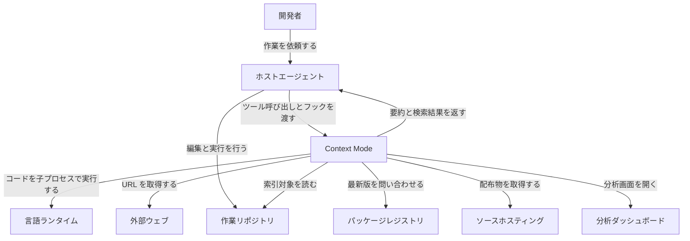
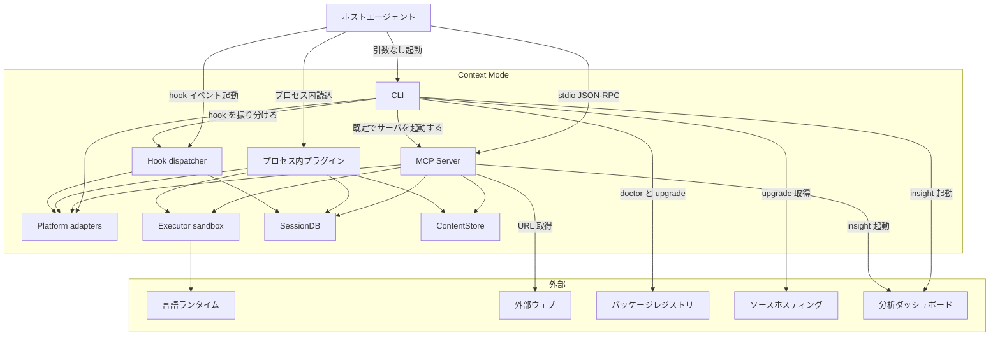
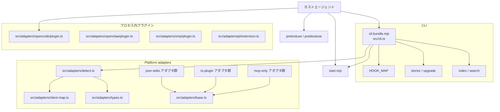
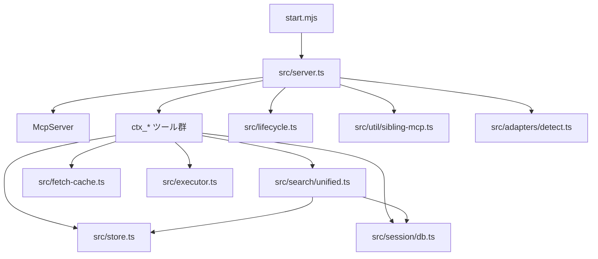
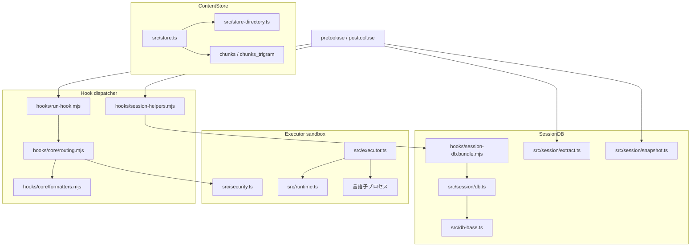
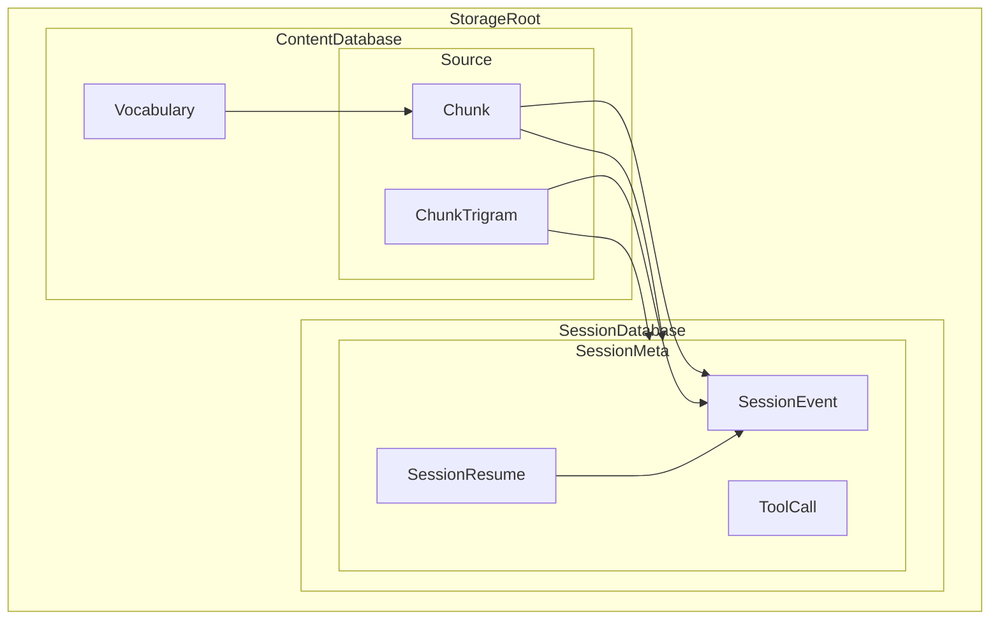
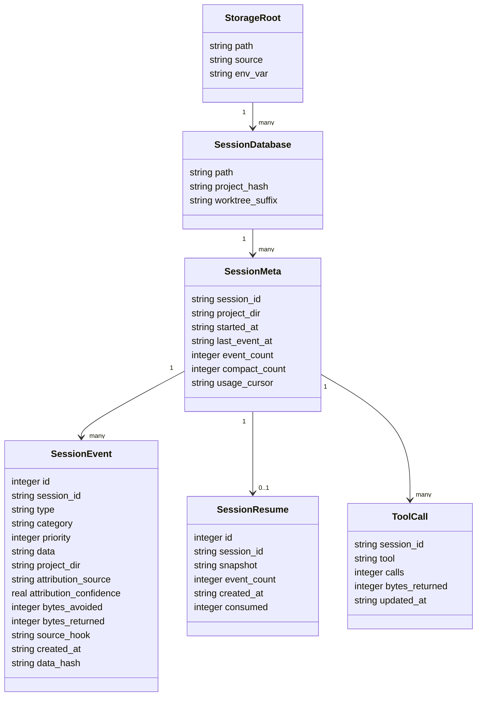
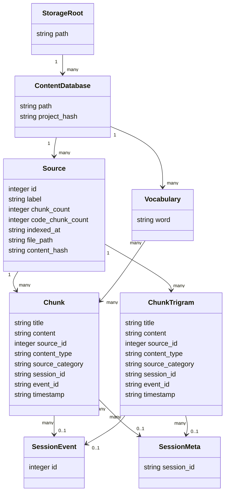

AI コーディングエージェントを長く動かすと、ログ・ブラウザのスナップショット・Issue 一覧といった大きなツール出力がコンテキスト窓を埋めます。context-mode は、この生出力を会話へ流し込まずにサンドボックス実行と SQLite 全文検索へ迂回させる MCP プラグインです。

この記事では、npm `context-mode@1.0.169`（GitHub release tag `v1.0.169`、公開 2026-06-29）を対象に、内部構造・永続データ・導入・運用までを整理します。数値と挙動は、公開されている README・ベンチマーク・ソースコードに基づきます。


*この記事の全体像。以下、順に解説します。*

## context-mode とは

context-mode は、ホストのエージェントが受け取るツール出力の行き先を変える層です。MCP サーバーとして 11 個の `ctx_*` ツールを公開し、あわせてホスト側のフックでルーティングを強制します。モデルが大きな出力を直接読む経路を減らし、代わりに次の 2 つを通します。

- サンドボックスでのコード実行。処理結果を中心とした短いレスポンスだけが文脈へ入ります。
- SQLite FTS5 の知識ベース。検索でヒットした断片だけが文脈へ入ります。

作者は Mert Koseoğlu です。配布物は npm パッケージ `context-mode` と GitHub リポジトリ `mksglu/context-mode` で、ライセンスは Elastic License 2.0 です。

| 項目 | 値 |
|---|---|
| リポジトリ | `mksglu/context-mode`（作成 2026-02-23） |
| 版 | 1.0.169 |
| ライセンス | Elastic-2.0（`package.json` / LICENSE 本文） |
| Node | `>=22.5.0`（`package.json` の `engines`） |
| CLI バイナリ | `context-mode` |
| MCP SDK | `@modelcontextprotocol/sdk` |

公式サイトは、OSS プラグインと有償 Platform を同じエンジンの二面として位置づけます。

| 面 | 対象 | 料金 | 役割 |
|---|---|---|---|
| `$context-mode` プラグイン | 個人開発者 | 無償 | 端末上で生データを文脈から外す |
| Context Mode Platform | エンジニアリング組織 | Insight が $20 / seat / month | 構造化イベントを組織ビューへ転送する |

プラグインはローカルの SQLite だけで動きます。Platform はオプトインのイベント転送で、公式は転送対象をツール名・ファイルパス・エラー件数などの構造メタデータに限定し、ソースコードとプロンプト本文は対象外としています。

### 解こうとしている 4 つの問題

README はコンテキストの問題を 4 つの辺で定義します。

| 辺 | 症状 | context-mode の答え |
|---|---|---|
| Context Saving | MCP の生出力が窓を埋める | サンドボックスへ迂回し、処理結果と検索ヒットだけを返す |
| Session Continuity | compact 後に編集中ファイル・進行中タスク・直近の依頼が落ちる | SQLite にイベントを蓄積し、FTS5 経由で必要な断片だけ復元する |
| Think in Code | モデルが多数のファイルを読んで集計する | 集計スクリプトを書かせ、結果の標準出力だけを文脈へ入れる |
| 文体 | 短文化プロンプトが推論品質を落とす事例がある | ルーティングはデータの行き先に限定し、最終回答の文体には介入しない |

### 削減量のベンチマーク

公式の `BENCHMARK.md` は、実ツール出力のフィクスチャを使った削減量を公称値として載せています。概要は 21 シナリオと書きますが、内訳表は 14 行 + 6 行の 20 行で、掲載されている Raw Size を足しても概要の総量と一致しません。次の値は公称値として読み、丸め済みの表から自分で削減率を再計算しないほうが安全です。

| 指標 | 値 | 範囲 |
|---|---|---|
| 全体 | 376 KB → 16.5 KB、96% | `ctx_execute_file` と `ctx_index`/`ctx_search` の合計 |
| `ctx_execute_file` 小計 | 315 KB → 5.5 KB、98% | ログ・スナップショット・Issues など |
| `ctx_index`/`ctx_search` 小計 | 60.3 KB → 11.0 KB、82% | 文書・コード例の検索（ベンチマーク資料はチャンク全体の返却として説明） |
| Playwright スナップショット | 56.2 KB → 299 B、99% | Playwright MCP の実出力 |
| GitHub Issues | 58.9 KB → 1,139 B、98% | `facebook/react` の issue 一覧 |
| nginx アクセスログ | 45.1 KB → 155 B、約 100% | 500 行 |

README が掲げる「98% reduction」は `ctx_execute_file` 小計に相当します。全体の 96% とは別の集計です。この読み替えは後段の「注意点」でまとめます。

### 近い技術との違い

context-mode は MCP サーバーを置き換える製品ではなく、MCP の結果経路とホストのフック経路を束ねる層です。

| 項目 | context-mode | Code Mode / Code execution with MCP | Playwright MCP 単体 | Claude Code hooks 単体 |
|---|---|---|---|---|
| 実行方式 | MCP サーバー + ホストフック。処理結果だけが文脈へ入る | MCP をコード API として提示し、サンドボックス内で合成する | アクセシビリティツリーを返す | ライフサイクルで deny / 注入を返す |
| リソース消費 | ローカル SQLite。Node 22.5+ または Bun | セキュアなコード実行基盤が前提 | Chromium 系ブラウザ | フックごとの短命プロセス |
| 対応機能 | サンドボックス 6 + メタ 5、FTS5、セッション継続、マルチホスト | ツール合成、中間結果のフィルタ | ブラウザ操作とスナップショット | 許可判定。知識ベースは持たない |
| 導入コスト | Claude Code は marketplace。他ホストは npm global + 設定 | ハーネス改修または Cloudflare Agents SDK | `npx @playwright/mcp` | `settings.json` にフックを書く |

用途から選ぶなら、次の対応になります。

| やりたいこと | 向く選択肢 | 理由 |
|---|---|---|
| 長時間セッションでログ・docs・Issues が窓を埋める | context-mode | 結果の迂回と compact 後のセッション継続 |
| 多数の MCP サーバーを 1 本のスクリプトで合成する | Code Mode | ツールをコード API として合成する設計 |
| 探索的なブラウザ操作そのもの | Playwright MCP | ページ状態と操作 API を持つ |
| 破壊的コマンドの拒否だけ | Claude Code hooks 単体 | 許可判定が本業 |
| 複数ホストで同じ迂回を敷く | context-mode | アダプタとフックディスパッチャがホスト差を吸収する |

Claude Code の MCP Tool Search はツール定義の遅延ロードで、context-mode はツール結果の迂回です。同じ「コンテキスト節約」でも層が異なります。

## 特徴

- **サンドボックス実行**: `ctx_execute` / `ctx_execute_file` / `ctx_batch_execute` が子プロセスでコードを走らせ、処理結果を中心に返します（実行したコードの抜粋やパス、失敗時の標準エラーも付きます）。対応言語は JavaScript、TypeScript、Python、Shell、Ruby、Go、Rust、PHP、Perl、R、Elixir、C# の 12 です。
- **Think in Code**: 集計・フィルタ・解析はスクリプト側で行い、モデルは結果だけを読みます。
- **FTS5 知識ベース**: `ctx_index` が見出し単位でチャンク化し、Porter stemming と trigram の結果を Reciprocal Rank Fusion で合成します。
- **URL 取得と TTL キャッシュ**: `ctx_fetch_and_index` が HTML を Markdown 化して索引します。既定 TTL は 24 時間です。
- **意図フィルタ**: 出力が約 5 KB を超え `intent` の指定がある場合、全文を索引したうえで意図に合う箇所だけ返します。
- **セッション継続**: ファイル編集・git・タスク・エラー・利用者の判断を SQLite へ残し、PreCompact でスナップショットを作り、SessionStart で必要な断片を検索可能にします。
- **フックによるルーティング**: 大きな出力を出すホストツールと他 MCP をサンドボックス側へ誘導します。標準出力へ流す `curl` / `wget` やインライン HTTP は PreToolUse でコマンドを書き換え、WebFetch は拒否します。
- **文体への不介入**: ルーティングはデータの行き先に限定し、最終回答の短文化は強制しません。
- **11 個の MCP ツール**: サンドボックス 6（`ctx_batch_execute`、`ctx_execute`、`ctx_execute_file`、`ctx_index`、`ctx_search`、`ctx_fetch_and_index`）とメタ 5（`ctx_stats`、`ctx_doctor`、`ctx_upgrade`、`ctx_purge`、`ctx_insight`）。
- **マルチホスト**: フックの実装形（`HookParadigm`）は `json-stdio` / `ts-plugin` / `mcp-only` の 3 つ、プラットフォーム識別子（`PlatformId`）は 18 値 + `unknown` です。
- **検索の段階制御**: 同一エージェント文脈での検索回数に応じて結果件数を絞り、過多な検索を `ctx_batch_execute` へ誘導します。
- **ローカル実行**: プラグインは端末上で完結します。Elastic License 2.0 は、実質的な機能一式をホスト型サービスとして第三者へ提供することを制限します。

## 構造

内部アーキテクチャを C4 モデルの 3 段階で図解します。システムコンテキスト図とコンテナ図は役割名で、コンポーネント図はファイル名とアダプタ名で示します。

### システムコンテキスト図

開発者がホストエージェントへ作業を依頼し、ホストエージェントが context-mode を呼び出します。context-mode はツール出力をサンドボックスと検索ストアへ導き、セッション状態を永続化します。



| 要素名 | 説明 |
|---|---|
| 開発者 | コーディング作業をホストエージェントへ依頼する人 |
| ホストエージェント | セッションを駆動し、MCP ツールとフックを呼び出す外部システム |
| Context Mode | サンドボックス実行・FTS5 検索・セッション継続を提供する本体 |
| 作業リポジトリ | ホストエージェントと context-mode が読み書きするプロジェクト領域 |
| 言語ランタイム | サンドボックスがコード実行に使うホスト上の処理系 |
| 外部ウェブ | URL 取得と索引の対象になる公開ページ |
| パッケージレジストリ | 診断とアップグレードが最新版を問い合わせる配布元 |
| ソースホスティング | アップグレード時に配布物を取得するリポジトリ |
| 分析ダッシュボード | セッション分析を表示するホスト型画面 |

### コンテナ図

起動単位とデータストアに分解します。ホストエージェントは、JSON 標準入出力の MCP 子プロセス、プロセス内プラグイン、フック起動の 3 経路で接続します。



内部のコンテナです。

| 要素名 | 説明 |
|---|---|
| CLI | バイナリ入口。サーバ起動、hook 振り分け、診断、アップグレード、索引、検索を担う |
| MCP Server | 11 個の `ctx_*` ツールを stdio MCP で公開する実行プロセス |
| プロセス内プラグイン | ホストのプラグイン API へツールとフックを直接登録する経路 |
| Hook dispatcher | ホストのライフサイクルイベントを受け、ルーティングとイベント記録を行う |
| Platform adapters | ホスト差分を `HookAdapter` 契約へ正規化する共有層 |
| Executor sandbox | 言語コードを子プロセスで実行し、処理結果を呼び出し元へ返す |
| SessionDB | プロジェクト単位の永続イベントストア。再開スナップショットを保持する |
| ContentStore | ツール出力とセッションイベントを FTS5 で検索する知識ベース |

外部の要素です。

| 要素名 | 説明 |
|---|---|
| ホストエージェント | MCP クライアントとフック起動元。context-mode の外側でセッションを駆動する |
| 言語ランタイム | Executor が起動する処理系 |
| 外部ウェブ | `ctx_fetch_and_index` の取得先 |
| パッケージレジストリ | バージョン照会先 |
| ソースホスティング | アップグレード時の配布物取得先 |
| 分析ダッシュボード | Insight の表示先 |

### コンポーネント図

コンテナ内部をファイル単位に分解します。MCP のツール実装とフックのルーティングは、別プロセスでも同じコアを共有します。図は入口側、MCP サーバ側、フックと永続化側の 3 枚に分けます。

まず、ホストからの 4 つの入口とアダプタ層です。



次に、MCP サーバ内部とツールの依存です。



最後に、フックディスパッチャ、Executor、2 つのストアです。



CLI と MCP Server の内訳です。

| 要素名 | 説明 |
|---|---|
| `cli.bundle.mjs` / `src/cli.ts` | バイナリ `context-mode` の入口。引数なし起動で MCP サーバを開く |
| `HOOK_MAP` | `context-mode hook <platform> <event>` を対応する `hooks/*.mjs` へ動的 import する |
| `doctor` / `upgrade` | ランタイム・フック・FTS5・版を診断し、配布物取得とフック再配線を行う |
| `index` / `search` | CLI から ContentStore へ直接索引・検索する |
| `start.mjs` | 自己修復のあと `server.bundle.mjs` を優先し、開発時は `build/server.js` を読み込む |
| `src/server.ts` | MCP サーバ本体。ツール登録、ストア配線、統計の永続化を行う |
| `src/lifecycle.ts` | 親プロセスの死亡を監視し、孤児プロセスを回収する |
| `src/util/sibling-mcp.ts` | 同一プロジェクトの旧 MCP 子プロセスを見つけて終了する |
| `src/search/unified.ts` | ContentStore・SessionDB・auto-memory を統合検索する |
| `src/fetch-cache.ts` | URL 取得の TTL キャッシュキーを組み立てる |

プラグイン・フック・アダプタの内訳です。

| 要素名 | 説明 |
|---|---|
| `src/adapters/opencode/plugin.ts` | OpenCode / KiloCode 向け。`package.json` の `main` |
| `src/adapters/openclaw/plugin.ts` | OpenClaw ゲートウェイ向け |
| `src/adapters/omp/plugin.ts` | OMP 向け |
| `src/adapters/pi/extension.ts` | Pi 向け。MCP 子プロセスは `mcp-bridge.ts` 経由 |
| `hooks/run-hook.mjs` | フックのクラッシュ耐性ラッパ。失敗をログへ書き、終了コード 0 でホストへ返す |
| `hooks/core/routing.mjs` | `routePreToolUse`。Bash / Read / Grep / WebFetch をサンドボックス経路へ誘導する |
| `hooks/core/formatters.mjs` | 正規化した判定をホスト別 JSON へ変換する |
| `hooks/session-helpers.mjs` | セッション ID、プロジェクトディレクトリ、DB パスを解決する |
| `src/adapters/types.ts` | `HookAdapter` 契約と 3 パラダイム |
| `src/adapters/detect.ts` | `detectPlatform` と `getAdapter` |
| `src/adapters/client-map.ts` | MCP の `clientInfo.name` から `PlatformId` へ写像する |

アダプタは 3 つのパラダイムに分かれます。

| パラダイム | 対象プラットフォーム |
|---|---|
| json-stdio | `claude-code` / `gemini-cli` / `vscode-copilot` / `jetbrains-copilot` / `copilot-cli` / `cursor` / `codex` / `kimi` / `qwen-code` / `antigravity-cli` / `kiro` |
| ts-plugin | `opencode`（`kilo` は `OpenCodeAdapter` を共有）/ `openclaw` |
| mcp-only | `antigravity` / `zed` |

実行と永続化の内訳です。

| 要素名 | 説明 |
|---|---|
| `src/executor.ts` / `PolyglotExecutor` | 一時ディレクトリへスクリプトを書き、子プロセスを起動する |
| `src/runtime.ts` | Node / Bun / Python などの処理系を検出する |
| `src/security.ts` | deny / allow パターンとプロジェクト境界を評価する |
| `src/db-base.ts` / `SQLiteBase` | WAL、`busy_timeout` 30000ms、`withRetry` を共有する |
| `src/session/db.ts` / `SessionDB` | 永続イベントストア |
| `src/store.ts` / `ContentStore` | 見出し単位でチャンク化し、Porter と trigram の FTS5 を RRF で結合する |

## データ

永続データの単位は、プロジェクト単位の SessionDatabase と、検索用の ContentDatabase です。列名は `src/session/db.ts` と `src/store.ts` の DDL に従います。

### 概念モデル

所有関係を入れ子、利用関係を矢印で示します。



| 要素名 | 説明 |
|---|---|
| StorageRoot | 永続ルート。`CONTEXT_MODE_DIR` が絶対パスのときはその直下に `sessions` と `content` を置く。既定はアダプタの `configDir` 配下の `context-mode/sessions` で、`content` はその兄弟ディレクトリ |
| SessionDatabase | プロジェクトと worktree 単位の SQLite。`session_meta` / `session_events` / `session_resume` / `tool_calls` を持ち、WAL で複数プロセスが同一パスを開く |
| SessionMeta | 1 セッションの台帳行。`session_id` が主キー |
| SessionEvent | フックとサーバが書き込む活動イベント。セッションあたり最大 1000 件で、超過時は `priority` 昇順・`id` 昇順で追い出す |
| SessionResume | compact 前に作る XML スナップショット行。`session_id` は UNIQUE |
| ToolCall | セッション内のツール名ごとの累積カウンタ。主キーは `session_id, tool` |
| ContentDatabase | FTS5 知識ベースの SQLite。`sources` / `chunks` / `chunks_trigram` / `vocabulary` を持つ |
| Source | 1 回の索引単位。同一 `label` の再索引は既存チャンクを置き換える |
| Chunk | Porter + unicode61 トークナイザの FTS5 行 |
| ChunkTrigram | 同じ 8 列を trigram トークナイザで持つ FTS5 行 |
| Vocabulary | あいまい検索用の単語辞書。`word` が主キー |

### 情報モデル

型名は DDL の論理型を汎用名へ写したものです。日時は TEXT のため `string` です。図はセッション側とコンテンツ側に分けます。

まず、ストレージ根とセッション側です。



次に、検索用のコンテンツ側です。`Chunk` と `ChunkTrigram` は、セッションのイベントとメタへ任意で結び付きます。



実装上の細部です。

| 要素名 | 説明 |
|---|---|
| StorageRoot | `source` は `default` または `override`。`env_var` は上書き時の `CONTEXT_MODE_DIR`。相対パスは `StorageDirectoryError` |
| SessionDatabase | ファイル名は正規化プロジェクトパスの SHA-256 先頭 16 hex。リンクされた worktree では `__` + 8 hex を付ける |
| SessionMeta | `CREATE TABLE` の列に加え、`initSchema` が `usage_cursor TEXT` を ALTER する。`last_event_at` は NULL を許す |
| SessionEvent | `priority` の既定は 2。`project_dir` と `data_hash` は NOT NULL DEFAULT 空文字。`attribution_source` は NOT NULL DEFAULT `'unknown'` |
| SessionResume | `snapshot` は XML 文字列。未消費行の取得は `consumed = 0` かつ現セッション以外の最新行を `consumed=1` に更新する自己注入防止がある |
| ToolCall | `calls` と `bytes_returned` を UPSERT で加算する |
| ContentDatabase | 永続パスは `contentDir/<16hex>.db`。コンストラクタ既定は `tmpdir/context-mode-<pid>.db`。チャンク分割の目安は 4096 バイトで、段落境界で切るため空行の無い長い段落は超過し得る |
| Source | `file_path` と `content_hash` は NULL を許す |
| Chunk | `tokenize='porter unicode61'`。UNINDEXED 列は `source_id` / `content_type` / `source_category` / `session_id` / `event_id` / `timestamp` |
| ChunkTrigram | 列は Chunk と同じで `tokenize='trigram'` |
| Vocabulary | `INSERT OR IGNORE` で単語を足す |

イベントの優先度定数 `EventPriority` は `LOW=1` / `NORMAL=2` / `HIGH=3` / `CRITICAL=4` です。追い出しの SQL は `ORDER BY priority ASC, id ASC` なので、**数値が小さいものから先に消えます**。

配置パスは次のとおりです。

| 条件 | パス |
|---|---|
| `CONTEXT_MODE_DIR` が絶対パス | `<root>/sessions` と `<root>/content` |
| 既定 | `<adapter configDir>/context-mode/sessions`。content は `dirname(sessions)/content` |
| SessionDatabase の永続ファイル | `<sessionsDir>/<canonicalHash><worktreeSuffix>.db` |
| ContentDatabase の永続ファイル | `<contentDir>/<canonicalHash>.db` |
| SessionDB コンストラクタ既定 | `join(tmpdir(), "session-<pid>.db")` |
| ContentStore コンストラクタ既定 | `join(tmpdir(), "context-mode-<pid>.db")` |

サイドカーは `<path>-wal` と `<path>-shm` です。journal は WAL、synchronous は NORMAL です。

## 構築方法

### 前提条件

- Node.js `>= 22.5.0`（`package.json` の `engines.node`）。
- 代替ランタイムとして Bun を使えます。
- SQLite バックエンドは実行時に自動選択されます（`src/db-base.ts` の `loadDatabase()`）。
  - Bun: `bun:sqlite`
  - Node.js >= 22.5 かつ FTS5 あり: `node:sqlite`（OS は問いません）
  - それ以外、または `node:sqlite` に FTS5 が無いとき: native addon の `better-sqlite3`（依存 `^12.6.2`）
- Claude Code のプラグイン経路では、`/plugin` と `/plugin marketplace` が使える版が必要です。README は v1.0.33+ と書きますが、これらのコマンドを含むプラグインシステムは Claude Code 2.0.12 で公開されたため、実際にはそれ以降の版を用意します。`/plugin` が認識されなければ先に Claude Code を更新します。
- Claude Code 以外のフック経路では、グローバルバイナリ `context-mode` を PATH に置きます。

導入前後の確認です。

```bash
node --version
claude --version
npm view context-mode version
```

```bash
context-mode doctor
```

Claude Code では slash command でも診断できます。

```text
/context-mode:ctx-doctor
```

### Claude Code プラグイン

README の主経路です。

```text
/plugin marketplace add mksglu/context-mode
/plugin install context-mode@context-mode
```

インストール後に Claude Code を再起動するか `/reload-plugins` を実行し、`/context-mode:ctx-doctor` で確認します。プラグインは次を登録します。

- hooks: PreToolUse / PostToolUse / UserPromptSubmit / PreCompact / SessionStart / Stop
- 11 個の MCP ツール
- skills（slash command）

フックと slash command を省いて試すだけなら、MCP のみでも登録できます。

```bash
claude mcp add context-mode -- npx -y context-mode
```

ステータスラインはプラグイン manifest の外側で、`~/.claude/settings.json` に一度書きます。

```json
{
  "statusLine": {
    "type": "command",
    "command": "context-mode statusline"
  }
}
```

保存後に Claude Code を再起動すると、`$ saved this session · $ saved across sessions · % efficient` が表示されます。

### npm グローバル導入とフック

Claude Code プラグイン以外は、まずグローバル導入します。

```bash
npm install -g context-mode
```

`package.json` の `bin` は `"context-mode": "./cli.bundle.mjs"` で、このバイナリが MCP サーバ起動と `context-mode hook <platform> <event>` の両方を担います。

Gemini CLI では `~/.gemini/settings.json` に MCP とフックをまとめます。

```json
{
  "mcpServers": {
    "context-mode": {
      "command": "context-mode"
    }
  },
  "hooks": {
    "BeforeTool": [
      {
        "matcher": "run_shell_command|read_file|read_many_files|grep_search|search_file_content|web_fetch|activate_skill|mcp__plugin_context-mode|mcp__context-mode|mcp__(?!.*context-mode)",
        "hooks": [{ "type": "command", "command": "context-mode hook gemini-cli beforetool" }]
      }
    ],
    "AfterTool": [
      {
        "matcher": "",
        "hooks": [{ "type": "command", "command": "context-mode hook gemini-cli aftertool" }]
      }
    ],
    "PreCompress": [
      {
        "matcher": "",
        "hooks": [{ "type": "command", "command": "context-mode hook gemini-cli precompress" }]
      }
    ],
    "SessionStart": [
      {
        "matcher": "",
        "hooks": [{ "type": "command", "command": "context-mode hook gemini-cli sessionstart" }]
      }
    ]
  }
}
```

ルーティング用の指示ファイルは任意です。グローバル導入後のコピー元は `npm root -g` 配下です。

```bash
cp "$(npm root -g)/context-mode/configs/gemini-cli/GEMINI.md" ./GEMINI.md
```

### OpenCode プラグイン

OpenCode は TypeScript プラグイン経路で、`ctx_*` は OpenCode プロセス内のツールとして登録されます。

```json
{
  "$schema": "https://opencode.ai/config.json",
  "plugin": ["context-mode"]
}
```

`plugin: ["context-mode"]` と旧来の `mcp.context-mode` を同時に書くと、MCP 子プロセス側の `tools/list` が意図的に空になります。ツールの重複登録を避けるための挙動で、プラグイン側の 11 ツールはそのまま使えます。MCP クライアントから子プロセスを覗くと「ツールが無い」ように見えるため、旧ブロックは `context-mode upgrade` で外します。KiloCode は同じ経路で、設定ファイル名が `kilo.json` です。

### Codex プラグイン

まず marketplace を追加し、Codex のプラグイン UI からプラグインをインストールします。

```bash
codex plugin marketplace add mksglu/context-mode
```

フックは feature flag で有効化します。

```toml
[features]
plugin_hooks = true
hooks = true
```

現行の Codex は `[features].hooks` を公開しますが、バンドルされた plugin hooks は既定で有効になるまで `plugin_hooks` も必要です。ストレージを移すときは絶対パスを渡します。

```bash
CONTEXT_MODE_DIR="$HOME/.codex-context-mode" codex
```

インストール後に Codex を再起動し、`ctx stats` で MCP の到達を確認します。フックは、Codex がプラグインのフックコマンドを信頼したうえで有効になるため、承認を求められたら確認します。

Codex の PreToolUse は deny に対応します。`updatedInput` は runtime が拒否するため（openai/codex#18491）、`additionalContext` は PreToolUse では落ち、PostToolUse と SessionStart で注入されます。

`plugin_hooks` が無いビルドでは手動で配線します。`~/.codex/config.toml` に MCP を書き、

```toml
[features]
hooks = true

[mcp_servers.context-mode]
command = "context-mode"

[mcp_servers.context-mode.env]
CONTEXT_MODE_PLATFORM = "codex"
```

続けて `$CODEX_HOME/hooks.json`（未設定なら `~/.codex/hooks.json`）へフックを登録します。この JSON を書かないと、MCP ツールは使えてもルーティングは効きません。matcher の文字列はツール名と完全一致で照合されるため、`shell_command` や裸の `ctx_*` 名を削らずに、公式の値をそのまま使います。

```json
{
  "hooks": {
    "PreToolUse": [{ "matcher": "local_shell|shell|shell_command|exec_command|Bash|Shell|apply_patch|Edit|Write|grep_files|ctx_execute|ctx_execute_file|ctx_batch_execute|ctx_fetch_and_index|ctx_search|ctx_index|mcp__", "hooks": [{ "type": "command", "command": "context-mode hook codex pretooluse" }] }],
    "PostToolUse": [{ "hooks": [{ "type": "command", "command": "context-mode hook codex posttooluse" }] }],
    "SessionStart": [{ "hooks": [{ "type": "command", "command": "context-mode hook codex sessionstart" }] }],
    "PreCompact": [{ "hooks": [{ "type": "command", "command": "context-mode hook codex precompact" }] }],
    "UserPromptSubmit": [{ "hooks": [{ "type": "command", "command": "context-mode hook codex userpromptsubmit" }] }],
    "Stop": [{ "hooks": [{ "type": "command", "command": "context-mode hook codex stop" }] }]
  }
}
```

再起動後は、`ctx stats` で MCP を、ルーティング規則に当たるコマンドの実行でフックを、それぞれ分けて確認します。

### その他のプラットフォーム

共通の前段は `npm install -g context-mode` です。

| プラットフォーム | パラダイム | 導入経路 | hooks | 設定パス |
|---|---|---|---|---|
| VS Code Copilot | json-stdio | npm global | あり | `.vscode/mcp.json` + `.github/hooks/*.json` |
| JetBrains Copilot | json-stdio | npm global + Settings UI | あり | `.github/hooks/*.json` |
| GitHub Copilot CLI | json-stdio | `copilot plugin install mksglu/context-mode:configs/copilot-cli` または npm global | あり | `~/.copilot/mcp-config.json` + `~/.copilot/hooks/context-mode.json` |
| Cursor | json-stdio | local-folder plugin または npm global | あり。`sessionStart` は validator が拒否。PreCompact は v1 非対応 | `.cursor/mcp.json` + `.cursor/hooks.json` |
| KiloCode | ts-plugin | npm `plugin: ["context-mode"]` | あり | `kilo.json` / `~/.config/kilo/` |
| OpenClaw | ts-plugin | `npm run install:openclaw` | あり | `openclaw.json` / `~/.openclaw/` |
| Kimi Code | json-stdio | npm global | あり | `~/.kimi-code/mcp.json` + `~/.kimi-code/config.toml` |
| Qwen Code | json-stdio | npm global | あり | `~/.qwen/settings.json` |
| Antigravity IDE | mcp-only | npm global | なし | `~/.gemini/antigravity/mcp_config.json` |
| Antigravity CLI `agy` | json-stdio（bounded） | `agy plugin install https://github.com/mksglu/context-mode/tree/main/configs/antigravity-cli`。agy >= 1.0.7 | あり（bounded） | `~/.gemini/config/mcp_config.json` + plugin の `hooks.json` |
| Kiro | json-stdio | npm global | あり | `~/.kiro/settings/mcp.json` |
| Zed | mcp-only | npm global | なし | `~/.config/zed/settings.json` の `context_servers` |
| Pi | mcp-only | `pi install npm:context-mode` または npm global | JS 拡張 `src/adapters/pi/extension.ts` が `pi.on` で配線 | MCP 登録は `~/.pi/agent/mcp.json`。診断用は `~/.pi/settings.json` |
| OMP | mcp-only（アダプタ定義） | npm global または `omp plugin install context-mode` | アダプタは JSON-stdio フックを持たない。プラグイン経路では `tool_call` / `tool_result` / `session_start` / `session_before_compact` を登録する | `~/.omp/agent/mcp.json`。セッション根は `~/.omp/context-mode/` |

Cursor Marketplace は README が審査待ちと書いており、掲載までは local-folder 経路になります。フックの呼び出し形はどのホストでも共通です。

```text
context-mode hook <platform> <event>
```

### native ビルド

glibc 2.31 以上（Ubuntu 20.04+、Debian 11+、Fedora 34+、macOS、Windows）では prebuilt を使います。Node.js 22.5 以上で FTS5 があるときは、OS を問わず組み込みの `node:sqlite` に切り替わります。古い glibc では、ソースビルドに C++20 コンパイラ・Make・Python setuptools が必要です。Windows で native addon が欠けるときは、プラグインディレクトリで `npm install better-sqlite3 --no-optional` を実行します。

`context-mode` は Node を同梱しないため、ホストのプロセスから `node` が見えることも前提になります。

## 利用方法

### ツールの引数

引数の正本は `src/server.ts` の `server.registerTool` で、`ctx_search` のみ `src/search/ctx-search-schema.ts` です。

| ツール | 必須 | 任意 | ハンドラ側の追加条件 |
|---|---|---|---|
| `ctx_execute` | `language`, `code` | `timeout`, `background`（既定 false）, `cwd`, `intent` | — |
| `ctx_execute_file` | `path`, `language`, `code` | `timeout`, `intent` | `path` はプロジェクト境界内 |
| `ctx_index` | スキーマ上は全て任意 | `content`, `path`, `source`, `maxDepth`, `maxFiles` ほか | `content` または `path` のどちらか |
| `ctx_search` | スキーマ上 `queries` は任意 | `queries`, `limit`（既定 3）, `source`, `contentType`, `sort` | 公開引数は `queries` のみ。文字列 1 本を渡すと配列へ変換される |
| `ctx_fetch_and_index` | スキーマ上は任意 | `url`, `source`, `requests[]`, `concurrency`（1-8）, `force`, `ttl` | `url` または `requests` |
| `ctx_batch_execute` | `commands` 1 件以上, `queries` 1 件以上 | `timeout`, `concurrency`（1-8）, `cwd`, `query_scope` | — |
| `ctx_stats` | なし | なし | `inputSchema: z.object({})` |
| `ctx_doctor` | なし | なし | 同上 |
| `ctx_upgrade` | なし | なし | MCP はシェルコマンドを返す |
| `ctx_purge` | `confirm` | `sessionId`, `scope`（session または project） | `confirm: true` が進行条件 |
| `ctx_insight` | なし | なし | ブラウザで Insight を開く |

`language` の enum は `javascript` / `typescript` / `python` / `shell` / `ruby` / `go` / `rust` / `php` / `perl` / `r` / `elixir` / `csharp` です。

### サンドボックス実行

分析はコードで行い、ファイルの中身ではなく処理結果が文脈に入ります。

```javascript
ctx_execute({
  language: "javascript",
  code: `
    const fs = require('fs');
    const files = fs.readdirSync('src').filter(f => f.endsWith('.ts'));
    files.forEach(f => {
      const lines = fs.readFileSync('src/'+f,'utf8').split('\\n').length;
      console.log(f + ': ' + lines + ' lines');
    });
  `
})
```

単一ファイルの処理では、内容が `FILE_CONTENT` 変数に入ります。

```javascript
ctx_execute_file({
  path: "huge.log",
  language: "javascript",
  code: "const errs = FILE_CONTENT.split('\\n').filter(l => /ERROR|FATAL/.test(l)); console.log(errs.length + ' error lines');"
})
```

複数コマンドの実行と、その結果に対する検索をまとめて行えます。

```javascript
ctx_batch_execute({
  commands: [
    { label: "README", command: "head -n 80 README.md" },
    { label: "Package", command: "cat package.json" }
  ],
  queries: ["authentication middleware", "entry point"],
  concurrency: 1
})
```

- `timeout`: 省略時は MCP ホストの RPC timeout が上限になります。
- `background`（`ctx_execute` のみ）: timeout 後もプロセスを残します。
- `intent`: 出力が約 5 KB を超えると FTS5 へ自動で索引し、該当箇所だけ返します。
- `concurrency`: 1〜8。I/O 向けで、CPU バウンドな処理は 1 のまま使います。

レスポンスは標準出力そのものではありません。`buildExecuteEcho` が実行したコードを最大 2,000 文字まで先頭に付け、`ctx_execute_file` ではパスも添えます。失敗時は標準エラーが返り、`ctx_batch_execute` は標準出力と標準エラーを結合します。読み込んだファイル全体が入らないという意味での節約であり、応答が結果 1 行だけになるとは限りません。

### フックのルーティング判定

PreToolUse の判定は `hooks/core/routing.mjs` が持ちます。

| ホストツール | 条件 | 判定 | 応答 |
|---|---|---|---|
| Bash | 利用者の `permissions.deny` にマッチ | deny | `Blocked by security policy` |
| Bash | `curl` / `wget` が標準出力へ出す | 書き換え + 誘導 | コマンドを書き換えて `ctx_execute` へ。silent + ファイル出力は通過 |
| Bash | インライン HTTP | 書き換え + 誘導 | `ctx_execute` へ |
| Bash | gradle / maven / sbt | 書き換え + 誘導 | `ctx_execute` の shell へ |
| Bash | 大きな出力が見込まれる | 通過 + 案内 | 一度だけ `ctx_execute` を案内 |
| Read | 大きなファイル | 案内 | `ctx_execute_file` を案内。拒否はしない |
| WebFetch | 常時 | deny + 誘導 | `ctx_fetch_and_index` のあと `ctx_search` |
| 全ツール | 利用者の deny glob | deny | security モジュール欠落時は通過。`CONTEXT_MODE_REQUIRE_SECURITY=1` で拒否側へ倒す |

### インデックス作成

```javascript
ctx_index({
  path: ".",
  source: "project:my-app",
  maxDepth: 5,
  maxFiles: 200
})
```

```javascript
ctx_fetch_and_index({
  url: "https://example.com/docs",
  source: "Example docs"
})
```

複数 URL をまとめて取得できます。

```javascript
ctx_fetch_and_index({
  requests: [
    { url: "https://example.com/a", source: "doc-a" },
    { url: "https://example.com/b", source: "doc-b" }
  ],
  concurrency: 4
})
```

- 既定 TTL は 24 時間です。
- `ttl` はミリ秒で、`ttl: 0` はキャッシュをバイパスします。
- `force: true` でも再取得します。
- `maxDepth` の既定は 5、`maxFiles` は 200、`respectGitignore` は true です。

### 検索

```javascript
ctx_search({
  source: "project:my-app",
  queries: ["authentication middleware", "token refresh"],
  limit: 2,
  sort: "relevance"
})
```

- `sort: "relevance"`: プロジェクトの永続 ContentStore を BM25 の関連度順で検索します。
- `sort: "timeline"`: 時系列で、ContentStore に加えて SessionDB と auto-memory も対象にします。
- `contentType`: `"code"` または `"prose"` を指定します。
- 引数名は `queries` に統一されています。単数形の `query` はスキーマに無く、MCP 経由では検証で落ちます。
- 返るのはチャンク全体ではありません。各ヒットは一致箇所の周辺 1,500 文字程度へ抜粋されるため、長いコードブロックは途中で切れます。
- `limit` のスキーマ既定は 3 ですが、ハンドラが通常時も `Math.min(limit, 2)` を適用します。連打を検知したあとは 1 クエリ 1 件です。`limit: 5` と書いても 1 クエリあたり最大 2 件になります。

### 更新と削除

```javascript
ctx_upgrade({})
```

```bash
context-mode upgrade --platform codex
```

`--platform` は MCP の `clientInfo` に基づく自動検出を上書きします。

```javascript
ctx_purge({ confirm: true, scope: "project" })
ctx_purge({ confirm: true, sessionId: "7c8a-1234-5678-9abc-def012345678" })
```

- `confirm: true` で実行します。`confirm: false` は中止を返します。
- `sessionId` と `scope: "project"` の同時指定はエラーです。
- 引数が `{confirm: true}` だけの場合は `scope: "project"` として扱われ、標準エラーへ非推奨の警告が出ます。

### CLI リファレンス

引数なしの起動は MCP サーバ（stdio）です。

```text
context-mode                         Start MCP server stdio
context-mode index <path>            Index a file or directory
context-mode search <query...>       Search the FTS5 knowledge base
context-mode doctor                  Diagnose runtimes, hooks, FTS5, version
context-mode upgrade                 Fix hooks, permissions, and settings
context-mode hook <platform> <event> Dispatch a hook script
context-mode statusline              Print Claude Code status line
context-mode insight                 Open Insight dashboard
```

```bash
context-mode index . --source project:my-app
context-mode search "authentication middleware" --source project:my-app --limit 5
CONTEXT_MODE_DIR=/absolute/path context-mode
```

Claude Code の slash command は MCP ツールに 1 対 1 で対応します。

| Slash command | 対応ツール |
|---|---|
| `/context-mode:ctx-stats` | `ctx_stats` |
| `/context-mode:ctx-doctor` | `ctx_doctor` |
| `/context-mode:ctx-index` | `ctx_index` |
| `/context-mode:ctx-search` | `ctx_search` |
| `/context-mode:ctx-upgrade` | `ctx_upgrade` |
| `/context-mode:ctx-purge` | `ctx_purge` |
| `/context-mode:ctx-insight` | `ctx_insight` |

## 運用

稼働後の操作は次のとおりです。

- ホストが MCP 子プロセスとして `context-mode` を stdio で起動します。
- 診断は `context-mode doctor` または `ctx_doctor` です。
- 更新は `context-mode upgrade` または `ctx_upgrade` です。
- 削除は `ctx_purge(confirm: true)` だけです。
- セッション継続は `--continue` / `--resume` 付きの起動です。

### 起動

引数なしの CLI が MCP サーバ起動です。

```bash
context-mode
```

ストレージ根を差し替えるときは、起動環境に絶対パスを置きます。

```bash
CONTEXT_MODE_DIR="$HOME/.codex-context-mode" codex
```

空文字や空白のみの `CONTEXT_MODE_DIR` は未設定として扱われます。非空の値は絶対パスが必須で、相対パスは `StorageDirectoryError` になります。`~` は展開されません。

### 停止

通常の停止はホストのセッション終了に追随します。開発時の残骸掃除は CONTRIBUTING の手順です。

```bash
pkill -f "context-mode.*start.mjs"
```

`/ctx-upgrade` は新しいファイルを入れる前に、同じプロジェクトの MCP プロセスを SIGTERM から SIGKILL の順で止めます。複数ウィンドウから同一プロジェクトの DB へ書くことは正規の使い方です（ADR 0001、`busy_timeout` 30000ms）。

### 状態確認

```text
/context-mode:ctx-stats
/context-mode:ctx-doctor
```

```bash
context-mode doctor
context-mode index . --source project:my-app
context-mode search "authentication middleware" --source project:my-app
```

`ctx_stats` は読み取り専用です。統計が返ることは MCP 到達の証明であり、フックが信頼され発火していることの証明は別に確認します。

### ログ確認

フックは標準エラーを `/dev/null`（Windows は `\\.\NUL`）へ閉じます。バグ報告用の一次診断は debug スクリプトです。

```bash
bash scripts/ctx-debug.sh
```

収集対象は、OS、ランタイム、better-sqlite3、アダプタ検出、設定（秘匿値はマスク）、フック検証、FTS5、executor、プロセス、セッション DB、環境変数です。

### 診断

CLI の `context-mode doctor` は次を確認します。

| 項目 | 内容 |
|---|---|
| Storage | sessions / content / stats のパスと書き込み |
| Runtimes | 検出言語。2 未満は critical FAIL |
| Linux Node | Linux + Node < 22.5 + Bun なしは SIGSEGV 経路として FAIL |
| Server test | `PolyglotExecutor` で `console.log("ok")` |
| Hooks | `adapter.validateHooks(pluginRoot)` |
| Plugin registration | `adapter.checkPluginRegistration()` |
| FTS5 / SQLite | in-memory の `fts5` MATCH |
| Version | ローカルと npm latest の比較 |

MCP ツールの `ctx_doctor` はサーバ内で `[OK]` / `[FAIL]` / `[WARN]` を返します。対象は runtimes、storage、server test、FTS5、hooks、version で、plugin registration は CLI 側の担当です。完全な診断は CLI の `context-mode doctor` になります。

### 更新

MCP の `ctx_upgrade` はアップグレード用のシェルコマンドを返します。実行後にセッションの再起動が必要です。

```bash
npm install -g context-mode@latest
context-mode upgrade
```

CLI の `context-mode upgrade` は、marketplace の同期、clone、同プロジェクトの MCP 停止、リビルド、キャッシュ修復、フック再配線、doctor 再実行を行います。OpenCode / KiloCode で `plugin` と `mcp.context-mode` が併存し、旧 MCP 接続の `tools/list` が空になったときも、このコマンドが古い `mcp.context-mode` だけを外します。

### パージ

取り消せない破壊的操作です。`confirm: true` が必須です。

| 呼び出し | 効果 |
|---|---|
| `ctx_purge(confirm: true, sessionId: "<uuid>")` | SessionDB の該当セッション行を消す。統計は残る。ハンドラが先に content DB ファイルごと削除し得るため、兄弟セッションの検索データが残る保証はない |
| `ctx_purge(confirm: true, scope: "project")` | FTS5 知識ベース、全セッション DB、events markdown、統計 |
| `ctx_purge(confirm: true)` | 非推奨。`scope: "project"` 相当 + 警告 |

`/clear` と `/compact` は context-mode のデータを消しません。削除経路は `ctx_purge` だけです。

### Insight

`ctx_insight` / `context-mode insight` は、ホストされたダッシュボードをブラウザで開きます。URL は `https://context-mode.com/insight` です。ローカルの Insight サーバは廃止されています。

### セッション継続

`--continue` / `--resume` / `/resume` 付きの起動は `source: "resume"` として扱われ、前回セッションのイベントまたは未消費スナップショットを注入します。`--continue` なしの起動は `source: "startup"` の新規セッションで、ホストの会話は白紙から始まります。

```text
PreCompact
  → SessionDB の events を読む
  → 優先度付き XML snapshot
  → session_resume に保存
SessionStart source compact
  → snapshot を取り出す
  → 構造化 events ファイルを FTS5 へ自動インデックス
  → Session Guide を注入
```

生のセッションイベントはコンテキストへ入りません。入るのは要約と `ctx_search` 用のクエリだけです。SessionStart は孤児の probe ID（`pid-*` 形）を消し、UUID のセッションは 7 日を超えたものを掃除します。content DB と sources は 14 日を超えると起動時に削除されます。

### スケールと隔離

プロセスは「ホストの 1 セッションあたり MCP 1 つ」が正規です。リンクされた git worktree はセッション DB 名に `__<8hex>` を付けます。明示的に上書きするなら `CONTEXT_MODE_SESSION_SUFFIX` を使います（空文字は隔離無効）。

```bash
export CONTEXT_MODE_SESSION_SUFFIX=ci-job-123
```

`ctx_search` の連打防止はセッション ID 単位で効きます。

| 変数 | 既定 | 意味 |
|---|---|---|
| `CONTEXT_MODE_SEARCH_WINDOW_MS` | `60000` | 窓の長さ（ms） |
| `CONTEXT_MODE_SEARCH_MAX_RESULTS_AFTER` | `3` | これより多い呼び出しで 1 クエリ 1 件へ絞る |
| `CONTEXT_MODE_SEARCH_BLOCK_AFTER` | `8` | これより多い呼び出しで遮断する |

## ベストプラクティス

### CI/CD

- ジョブごとに `CONTEXT_MODE_SESSION_SUFFIX` を一意にします。
- 共有ランナーでは `CONTEXT_MODE_DIR` をジョブ専用の絶対書き込みパスにします。
- 内部ネットワークへの取得範囲を絞るときは `CTX_FETCH_STRICT=1` を使います。
- チームで共有するフックは、ポータブルな `context-mode hook <platform> <event>` 形にします。マシン固有の絶対パスは doctor が FAIL します。
- オフライン CI では `npm install -g context-mode@<version>` とバージョンを固定すると再現性が上がります。

### マルチ環境

- 既定のストレージはアダプタの configDir 配下です。
- `CONTEXT_MODE_DIR=/abs` は `<root>/sessions` と `<root>/content` に分かれます。
- プラットフォーム検出が曖昧なときは `CONTEXT_MODE_PLATFORM` で固定します。
- OMP は `~/.omp/context-mode/`、Pi は `~/.pi/context-mode/` を使い、共有しません。
- OpenCode は `plugin: ["context-mode"]` だけを書きます。
- Cursor はプロジェクトの `.cursor/hooks.json` がユーザーの `~/.cursor/hooks.json` より優先されます。

### リソース制限

- 個別の `ctx_search` を連打するより `ctx_batch_execute(commands, queries)` にまとめます。
- ディレクトリの索引は `maxFiles` / `maxDepth` / `--ext` / `--exclude` で上限を置きます。
- 取得の TTL 既定は 24 時間です。再取得は `ttl: 0` または `force: true` です。
- 14 日のクリーンアップを前提に、長期的に残したい知識はプロジェクト外の正本へ置きます。

### セキュリティ

サンドボックスはプロセス境界であり、OS レベルの隔離（seatbelt / bwrap / landlock）は実装されていません。子プロセスはホストのファイルシステムとネットワークを継承します。

| 面 | 関連 Issue | 現状 |
|---|---|---|
| `ctx_execute_file` の `path` 引数 | #852（closed） | パス正規化で拒否。絶対パス / `../` / symlink 経由を拒否。ただし検査対象は `path` だけで、同じ呼び出しの `code` が読むファイルは制限しない |
| `ctx_execute` / `ctx_batch_execute` の任意コード実行 | #857（closed） | OS 隔離は未実装。ホストの FS と network を継承する |

実行ツールの承認は、任意コード実行の承認として扱うのが安全です。`ctx_execute_file` のパス検査が守るのは `path` 引数だけで、同じ呼び出しの `code` が開くファイルは対象外です。`ctx_execute` / `ctx_batch_execute` も同様に、コードからホストの FS とネットワークへ届きます。ホストの deny パターンだけでは隔離できないため、3 つの実行ツールを個別承認にするか、隔離した環境でホストごと動かす判断が要ります。

次の設定は、ホストのツール（Bash や Read）に対する許可・拒否の例です。意図的にプロジェクト外を読ませたい場合は `permissions.allow` に `Read(...)` を足します。

```json
{
  "permissions": {
    "deny": [
      "Bash(sudo *)",
      "Read(.env)",
      "Read(**/.env*)"
    ],
    "allow": [
      "Bash(git:*)",
      "Read(/var/log/**)"
    ]
  }
}
```

- 評価順は deny > ask > allow です。
- `ctx_fetch_and_index` は `http:` / `https:` のみを許可し、クラウドのメタデータアドレス `169.254.0.0/16` は遮断します。
- MCP の `tool_input` は、秘密情報を示すキー名に一致した値だけを再帰的に `[REDACTED]` へ置き換えます。値の中身は検査しないため、URL のクエリ文字列やコード中に埋め込まれた秘密情報はマスクされません。

Elastic License 2.0 の Limitations は、実質的な機能一式をホスト型・マネージド型サービスとして第三者へ提供することを禁じています。

```text
You may not provide the software to third parties as a hosted or managed
service, where the service provides users with access to any substantial set
of the features or functionality of the software.
```

### 設定管理

- グローバルバイナリ `context-mode` を PATH に置き、フックは `context-mode hook <platform> <event>` 形へ統一します。
- Claude Code は marketplace プラグインを正とし、MCP のみの登録は試用向けです。
- Node は `>= 22.5.0` にそろえます。
- Windows の better-sqlite3 は `npm rebuild` ではなく `npm install` が正です。
- Cursor の Windows ローカルプラグインは `robocopy /MIR` で実体コピーします（symlink は辿られません）。

## 注意点

ドキュメントと実装、あるいは資料どうしで記載が食い違う箇所があります。導入判断に効くものを挙げます。

| 対象 | 資料の記載 | 実装・一次資料 | 読み替え |
|---|---|---|---|
| 98% 削減 | README / 公式サイト / package.json | `ctx_execute_file` 小計が 98%。全体 21 シナリオは 96%、文書・コード検索は 82% | 全体効果を 98% と読むと過大 |
| 対応プラットフォーム数 | README は 17 platforms | `docs/platform-support.md` は 17 clients + OpenClaw。`PlatformId` は 18 値 + `unknown` | 対応表は platform-support を正とする |
| Node 要件 | 公式サイトは Node.js 18+、CONTRIBUTING は 20+ or Bun | `package.json` の `engines` は `>=22.5.0` | 導入要件は package.json を正とする |
| ツール数 | 本文は 11 MCP tools | README の Tools 表は 10 行で `ctx_insight` が欠落 | 機能一覧は 11 |
| 知識ベースの寿命 | CONTRIBUTING は `/tmp/context-mode-<PID>.db` の一時 DB | 永続経路は `<contentDir>/<hash>.db` | 正本はプロジェクト単位の FTS5 |
| スナップショット容量 | README は優先度付き XML で 2 KB 以下 | `buildResumeSnapshot` は `maxBytes` を無視する旨のコメントを持つ | 2 KB を上限の契約として扱わない |
| 新規セッションの削除 | README は `--continue` なしで前回データを即削除 | 孤児 probe ID を消し、UUID セッションは 7 日で掃除 | 会話は白紙だが、SQLite の過去行は残る |
| priority の向き | README は Critical P1 … Low P4 | `EventPriority` は `LOW=1` … `CRITICAL=4` で追い出しは昇順 | 数値が小さいほど先に消える |
| CLI ヘルプ | `printHelp()` の Usage に insight が無い | 分岐と README には存在する | `context-mode insight` は動作する |
| ライセンス表記 | GitHub API は `NOASSERTION` | LICENSE 本文は Elastic License 2.0、`package.json` は `Elastic-2.0` | SPDX の自動判定と本文がずれる |
| 利用者数 | 公式サイトは 331,200+ developers | `stats.json`（2026-09-13 取得で users 562.3k+、npm 527.2k+、marketplace 35k+）は、npm の累計ダウンロード数と直近 14 日のユニーク clone 数を足した値。`marketplace` も clone 数 | 重複を除いた利用者数としては読めない |
| リリースと main | tag v1.0.169 は 2026-06-29 公開 | `main` への push は継続中 | npm 版と HEAD に機能差があり得る |
| セッション単位の purge | ツール説明は兄弟セッションと統計を残すと書く | ハンドラはスコープ分岐の前に content DB を削除し得る | セッション単位でも FTS5 が消えることがある |
| 採用企業 | README / 公式サイトに大手企業名 | 表現は "Used across teams at" で、導入契約の一次証拠は確認できない | 採用企業として断定しない |

Stars 22,499 / forks 1,618 は 2026-09-13 時点の GitHub API の値で、時間とともに変わります。

## トラブルシューティング

導入と診断でよくある症状です。

| 症状 | 原因 | 対処 |
|---|---|---|
| doctor が Storage FAIL / `StorageDirectoryError` | 非空の `CONTEXT_MODE_DIR` は絶対パス必須。`~` も展開されない | `export CONTEXT_MODE_DIR="$HOME/.context-mode-data"` のように絶対パスにする |
| 旧 MCP 接続の `tools/list` が空（OpenCode / KiloCode） | `plugin: ["context-mode"]` と `mcp.context-mode` の二重登録。子プロセス側の登録を意図的に抑止している | `context-mode upgrade` で旧ブロックを外す。プラグイン側のツールも使えない場合は別の障害として切り分ける |
| Claude Code 再起動後に MCP が `MODULE_NOT_FOUND` | 古い `.mcp.json` が失効した `start.mjs` の絶対パスを指す | `/context-mode:ctx-upgrade` で掃除する |
| Linux で最初のツール呼び出しが SIGSEGV | Linux + Node < 22.5 で better-sqlite3 が壊れる | Node >= 22.5 または Bun へ上げて入れ直す |
| Windows で `FTS5 / better-sqlite3: FAIL` | prebuild が無く node-gyp に落ちる | プラグインディレクトリで `npm install better-sqlite3 --no-optional` |
| Windows で `stderr: spawn sh ENOENT` | 旧実装が POSIX の `sh` を直接起動していた | 現行は Git Bash → `sh` → `pwsh` → `powershell` → `cmd.exe` の順で探すため、更新する |
| Cursor のローカルプラグインが認識されない（Windows） | Cursor が Windows の symlink を辿らない | `robocopy` で実体をコピーする |

実行時の症状です。

| 症状 | 原因 | 対処 |
|---|---|---|
| `ctx_search` が `BLOCKED: N search calls in Xs` | 同一セッションが窓内で既定 8 回を超えた | 次の調査は `ctx_batch_execute(commands, queries)` にする |
| 新しいセッションで前回の決定・ファイルが消えている | `--continue` なしの起動は新規セッション | `--continue` / `--resume` / `/resume` で起動する |
| `ctx_execute_file` が `File access blocked` | `path` 引数がプロジェクト境界の外 | 意図的な外部読み取りは `permissions.allow` に `Read(/abs/path/**)` を足す |
| ホストが拒否したファイルやコマンドを `ctx_execute` で実行できてしまう | `ctx_execute` / `ctx_batch_execute` はホストのサンドボックス外。実行コードは絶対パスを開いたり子プロセスを起動したりできる | settings のパターン検査では防げない。実行ツール自体を個別承認または無効化するか、コンテナなど OS 側で隔離した環境で動かす |
| `ctx_purge` したのに検索が残る、または全部消えた | スコープの取り違え。引数が `confirm` だけならプロジェクト相当 | セッション単位は `sessionId`、プロジェクト単位は `scope: "project"`。先に `ctx_stats` で件数を見る |
| Codex で統計は返るがセッションが残らない | `[features].hooks` / `plugin_hooks` がオフ、またはフック未信頼 | `hooks = true` と `plugin_hooks = true` を入れ、plugin hooks を信頼する |
| Copilot CLI で MCP は動くがルーティングが効かない | フック未登録、または古いグローバルバイナリ | `npm install -g context-mode@latest` と `CONTEXT_MODE_PLATFORM=copilot-cli` |

Windows の Cursor へローカルプラグインを置く例です。

```powershell
git clone https://github.com/mksglu/context-mode.git
cd context-mode
robocopy . "$env:USERPROFILE\.cursor\plugins\local\context-mode" /MIR
```

better-sqlite3 の復旧例です。

```bash
cd "$(npm root -g)/context-mode"
npm install better-sqlite3 --no-optional
context-mode doctor
```

## まとめ

- context-mode は、ツール出力をサンドボックス実行と SQLite FTS5 へ迂回させ、処理結果と検索ヒットだけをコンテキストへ入れる MCP プラグインです。
- 内部は CLI・MCP サーバ・プロセス内プラグイン・フックディスパッチャ・アダプタ・Executor・SessionDB・ContentStore に分かれ、経路が違っても同じコアを共有します。
- 永続データはプロジェクト単位の SessionDatabase と ContentDatabase で、イベントは 1000 件上限、content は 14 日で掃除されます。
- 削減率はワークロードで大きく変わります。ログやスナップショットの迂回は 98%、文書・コード検索は 82% です。
- サンドボックスはプロセス境界までで OS 隔離はありません。実行ツールの承認は任意コード実行の承認として扱い、必要なら隔離環境で動かします。

この記事が少しでも参考になった、あるいは改善点などがあれば、ぜひリアクションやコメント、SNSでのシェアをいただけると励みになります！

## 参考リンク

- [mksglu/context-mode](https://github.com/mksglu/context-mode)
- [README.md](https://raw.githubusercontent.com/mksglu/context-mode/main/README.md)
- [BENCHMARK.md](https://raw.githubusercontent.com/mksglu/context-mode/main/BENCHMARK.md)
- [LICENSE](https://raw.githubusercontent.com/mksglu/context-mode/main/LICENSE)
- [package.json](https://raw.githubusercontent.com/mksglu/context-mode/main/package.json)
- [公式サイト](https://context-mode.com)
- [docs/platform-support.md](https://raw.githubusercontent.com/mksglu/context-mode/main/docs/platform-support.md)
- [CONTRIBUTING.md](https://raw.githubusercontent.com/mksglu/context-mode/main/CONTRIBUTING.md)
- [src/adapters/types.ts](https://raw.githubusercontent.com/mksglu/context-mode/main/src/adapters/types.ts)
- [src/server.ts](https://raw.githubusercontent.com/mksglu/context-mode/main/src/server.ts)
- [src/session/db.ts](https://raw.githubusercontent.com/mksglu/context-mode/main/src/session/db.ts)
- [src/store.ts](https://raw.githubusercontent.com/mksglu/context-mode/main/src/store.ts)
- [src/db-base.ts](https://raw.githubusercontent.com/mksglu/context-mode/main/src/db-base.ts)
- [hooks/core/routing.mjs](https://raw.githubusercontent.com/mksglu/context-mode/main/hooks/core/routing.mjs)
- [ADR 0001 SessionDB multi-writer](https://raw.githubusercontent.com/mksglu/context-mode/main/docs/adr/0001-sessiondb-multi-writer.md)
- [Issue #852 project boundary](https://github.com/mksglu/context-mode/issues/852)
- [Issue #857 sandbox residual](https://github.com/mksglu/context-mode/issues/857)
- [openai/codex#18491 updatedInput](https://github.com/openai/codex/issues/18491)
- [Anthropic Code execution with MCP](https://www.anthropic.com/engineering/code-execution-with-mcp)
- [Cloudflare Code Mode](https://blog.cloudflare.com/code-mode)
- [Claude Code Hooks](https://code.claude.com/docs/en/hooks)
