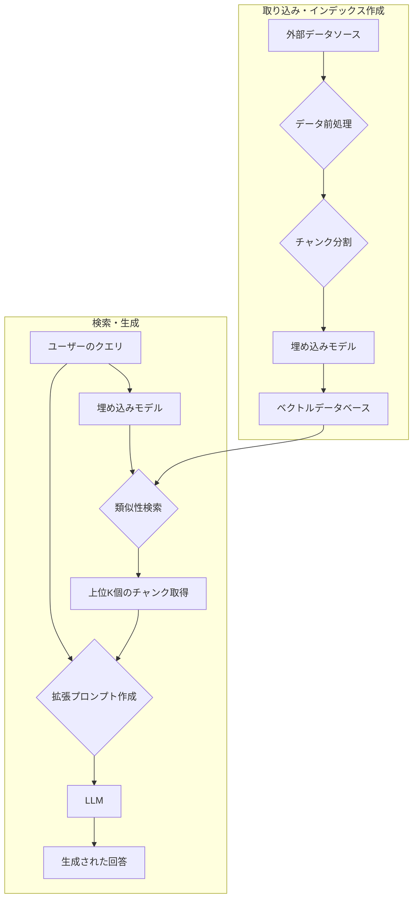
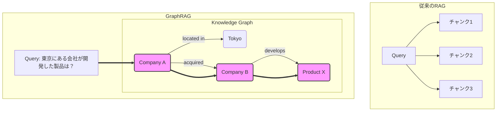
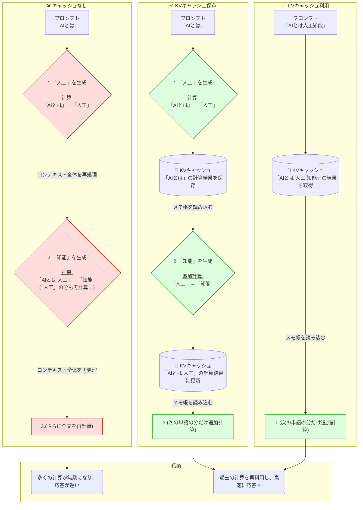
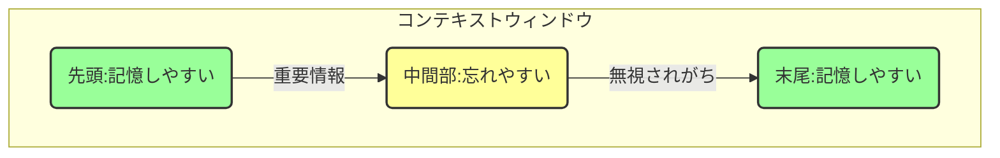
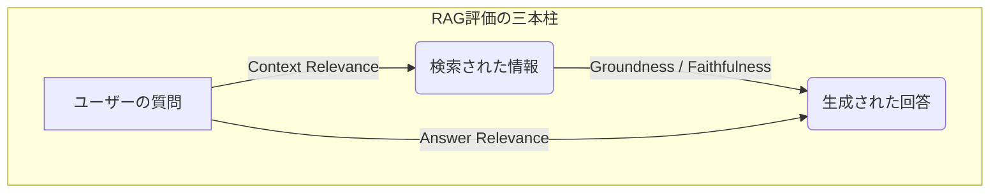
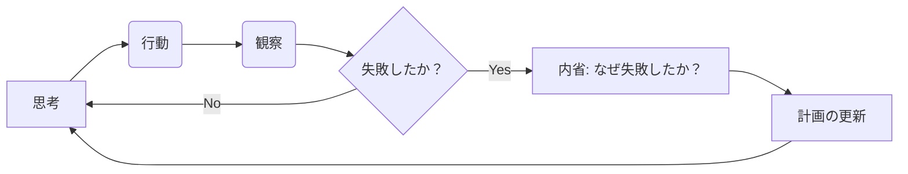

## ■はじめに：なぜ今、「プロンプト」から「コンテキスト」なのか？

本記事では、AI開発の新たな専門分野「コンテキストエンジニアリング」を体系的に解説します。この分野は、単発の指示でAIを動かす「プロンプトエンジニアリング」の限界から生まれました。本記事を読めば、信頼性と拡張性の高い次世代AIシステムを構築するための、設計思想と実践的な戦略の全体像を掴むことができます。

## ■1. プロンプトからコンテキストへ ― AI開発のパラダイムシフト

本章では、AI開発の新たな潮流「コンテキストエンジニアリング」の登場背景を解き明かします。まず、その前身であるプロンプトエンジニアリングの定義と限界を明確にし、コンテキストエンジニアリングがその課題をいかにして克服するかを示します。

### ●1.1. プロンプトエンジニアリングの定義と限界

プロンプトエンジニアリングとは、生成AIモデルから望ましい出力を得るために、テキスト入力（プロンプト）を設計・洗練させる**言語的な職人技**です。これは、ユーザーが言葉を選び、試行錯誤を繰り返すプロセスを指します。

#### ▷プロンプトの主要構成要素

一般的なプロンプトは、以下の3要素で構成されます。

1.  **指示（Instruction）**: モデルに実行させたい具体的なタスク。
2.  **コンテキスト（Context）**: モデルが推論で考慮すべき外部情報。
3.  **出力インジケータ（Output Indicator）**: 期待する出力の型や形式。

#### ▷限界と脆弱性

このアプローチは単発のタスクには強力ですが、本質的に**脆弱で、拡張性に乏しい**という課題があります。表現のわずかな違いやモデルの更新が出力を大きく左右し、複数ターンの対話ではモデルが初期の指示を見失いやすくなります。この課題が、より堅牢で体系的なアプローチ、すなわちコンテキストエンジニアリングの登場を促しました。

### ●1.2. コンテキストエンジニアリングの登場

コンテキストエンジニアリングは、プロンプトエンジニアリングの限界から生まれた、より広範で体系的なアプローチです。単なる指示の最適化を超え、AIがタスクを遂行するために必要な**情報エコシステム全体を設計する**ことを目指します。

*出典: [The New Skill in AI is Not Prompting, It's Context Engineering - Philschmid](https://www.philschmid.de/context-engineering)*

#### ▷中核となる定義

コンテキストエンジニアリングとは、大規模言語モデル（LLM）がタスクを達成するために、 **「適切な情報とツール」** を **「適切な形式」** で **「適切なタイミング」** で提供する動的なシステムを設計・構築する専門分野です。その本質は、プロンプト文字列そのものではなく、LLMを呼び出す前に実行される **「システム全体の振る舞い」** にあります。

#### ▷スコープの拡大

コンテキストエンジニアリングは、対話履歴、検索されたドキュメント、ユーザーデータ、利用可能なツール、システム指示など、 **モデルが参照する「すべて」** を対象とします。これは、「良い質問をすること（プロンプト）」と「AIが参照すべき知識体系を構築すること（コンテキスト）」の違いに例えられます。

#### ▷開発者中心の専門分野へ

この分野は開発者指向であり、LLMのためのソフトウェアアーキテクチャに似た**システム思考**を要求します。焦点は、言語的な調整から、モデルの思考プロセスのフローとメモリ全体の設計へと移行しています。LLMが汎用的な推論エンジンとして普及する今、持続的な競争優位性は、独自のデータソースと、それらをLLMに接続する**コンテキストパイプライン**によってもたらされるのです。

### ●1.3. 比較分析：戦術から戦略へ

プロンプトエンジニアリングが特定の応答を引き出す「戦術」なら、コンテキストエンジニアリングは一貫して高品質なパフォーマンスを保証する「戦略」です。

**表1：プロンプトエンジニアリングとコンテキストエンジニアリングの比較**

| 次元           | プロンプトエンジニアリング（戦術）     | コンテキストエンジニアリング（戦略）                    |
| :------------- | :------------------------------------- | :------------------------------------------------------ |
| **スコープ**   | 単一の入出力ペア                       | 情報エコシステム全体（履歴、ツール、データ）            |
| **中核タスク** | テキスト指示の作成（言葉選び）         | データパイプラインとシステムアーキテクチャの設計        |
| **思考様式**   | 言語的チューニング                     | システム思考                                            |
| **ツール**     | プロンプトテンプレート、少数ショット例 | RAGパイプライン、ベクトルDB、エージェントフレームワーク |
| **目標**       | 特定タスクで良い出力を得ること         | 1000回目の出力も高品質であることを保証すること          |
| **拡張性**     | 脆弱で、スケールしにくい               | スケーラビリティと堅牢性を前提とした設計                |
| **主な担い手** | エンドユーザー、プロンプター           | 開発者、エンジニア                                      |

今や、プロンプトエンジニアリングは、より広範なコンテキストエンジニアリングの**重要なサブセット**として位置づけられます。優れたプロンプトは不可欠ですが、その真価は、それを取り巻くコンテキストの質によって決定されるのです。

## ■2. 実装のためのコアアーキテクチャ

本章では、コンテキストエンジニアリングを支える主要なアーキテクチャを詳述します。基本となる検索拡張生成（RAG）から、より高度なAIエージェント構造へと進みます。

### ●2.1. 検索拡張生成（RAG）：信頼性の高いAIの基盤

RAGは、LLMの内部知識を外部の信頼できる知識ベースで補強するアーキテクチャです。これにより、モデルの知識の古さやハルシネーション（事実に基づかない情報の生成）といった根本的な限界に対処します。

#### ▷2.1.1. 標準的なRAGアーキテクチャ

RAGのプロセスは、オフラインでの「インデックス作成」と、オンラインでの「検索・生成」の2フェーズで構成されます。

#### ▷2.1.2. 高度な検索技術

本番環境レベルのRAGシステムでは、検索精度を最大化するため、より洗練された技術が求められます。

  * **ハイブリッド検索**: ベクトル検索の「意味的」な類似性と、キーワード検索の「字句的」な精度を組み合わせるアプローチ。
  * **リランキング**: 高速な手法で広範な候補を取得し、より高精度なモデルで再評価して順位を付け直す2段階プロセス。

### ●2.2. GraphRAG：データ間の「関係性」を検索する

GraphRAGは、知識をエンティティ（点）と関係（線）のネットワークとして表現する**知識グラフ**を活用し、データポイント間の複雑な関係性を捉える先進的な手法です。

GraphRAGは、サプライチェーン分析や不正検知など、複数の情報源を横断する**多段階の推論**を必要とする複雑なクエリで真価を発揮します。

### ●2.3. 高度なRAGの実践ツール：local-RAG-backend

ここで紹介した高度なRAGのコンセプトを実現するOSS `local-RAG-backend` を公開しています。

https://github.com/suwa-sh/local-RAG-backend

https://zenn.dev/suwash/articles/local_rag_backend_20250622

このツールは、多くの開発者が直面する以下のような課題を解決します。

1. **高精度なデータ取り込み**: PDFやWordなど多様なファイル形式に対応し、レイアウトや意味のまとまりを維持したまま情報を抽出・分割します。
2. **ハイブリッド検索とリランキング**: ベクトル検索、全文検索、そして本章で解説したグラフ検索を組み合わせたハイブリッド検索を標準で搭載。さらに、複数の手法でリランキングを行い、文脈に最も関連性の高い情報を特定します。
3. **簡単な導入**: docker compose upコマンド一つで、これら高機能な検索サーバー群をローカル環境に構築できます。

`local-RAG-backend`のようなツールを活用することで、開発者は複雑な環境構築に時間を費やすことなく、コンテキストの最適化という本質的な課題に集中できるのです。

### ●2.4. AIエージェント：検索から「行動」へ

AIエージェントは、LLMを単なる回答生成器としてではなく、次に行うべき一連の**「行動」を「決定」する思考エンジン**として使用するシステムです。

#### ▷エージェントのコアコンポーネント

1.  **LLMコア**: 計画立案と意思決定を担う推論エンジン。
2.  **メモリ**: 過去の対話から情報を保存・検索するシステム。
3.  **ツール／関数**: 外部世界と対話するためのAPIやデータベース。

#### ▷代表的なアーキテクチャパターン: ReAct

**ReAct (Reason + Act)** は、「思考 → 行動 → 観察」のループを繰り返す、エージェントの基本パターンです。

効果的なエージェントシステムの設計は、プロンプトエンジニアリングから、AIエージェントの役割や通信プロトコルを定義する **「組織設計」にも似たアプローチ** へと進化しています。

## ■3. 実践的実装戦略 ― 現場で使えるテクニック

第2章で解説したアーキテクチャを実システムに組み込むためには、具体的なエンジニアリングのベストプラクティスが不可欠です。本章では、現場での実装に焦点を当てたテクニックを紹介します。

### ●3.1. パフォーマンスとコストを最適化する

本番環境で稼働するAIシステムにとって、パフォーマンスとコストは最重要課題です。特に、LLMの推論プロセスにおける**KVキャッシュ**の活用が決定的な役割を果たします。

#### ▷KVキャッシュとは？ ― 計算結果の「メモ帳」

KVキャッシュとは、一言で言えば**「計算結果のメモ帳」**です。これはプログラミングにおける**メモ化（Memoization）**と同じ考え方に基づいています。

LLMは、文章を一度に生成しているように見えて、内部では単語（トークン）を1つずつ順番に生成しています。そして、次の単語を予測するためには、それまでに出力したすべての単語（コンテキスト）の関係性を毎回参照する必要があります。**この参照計算（アテンション計算）は非常に高コスト**です。

  * **キャッシュがない場合**: 100個目の単語を生成するために、1〜99個目までの単語の関係性を**ゼロから再計算**します。
  * **キャッシュがある場合**: 100個目の単語を生成するために、メモ帳から1〜99個目の計算結果を**読み込み**、99個目と100個目の関係性だけを**新規に計算**します。

KVキャッシュは、この無駄な再計算をなくし、応答速度を劇的に向上させるための根幹技術です。この「メモ帳」の仕組みを理解すれば、なぜ「コンテキストの先頭部分を安定させる」ことが重要なのかが明確になります。プロンプトの先頭が変わると、**キャッシュが無効化されてしまう**ため、その恩恵を受けられなくなるのです。

#### ▷KVキャッシュを最大化するテクニック

1.  **プロンプトプレフィックスを安定させる**: システムプロンプトや初期コンテキストは静的に保ちます。
2.  **コンテキストを追記専用にする**: 対話履歴は常に追記する形式が望ましいです。
3.  **シリアライゼーションを決定論的に行う**: JSONなど構造化データを含める場合、キーの順序を常に安定させます。

### ●3.2. 長いコンテキストと「注意散漫」を管理する

LLMは長いコンテキストを扱えますが、単に長くするだけでは性能は向上しません。

#### ▷「中間部での忘却（Lost in the Middle）」問題

多くのLLMは、コンテキストの先頭と末尾の情報はよく記憶する一方、**中間部の情報を無視する傾向**があります。これは、Transformerアーキテクチャの注意機構に起因する根本的な限界です。

#### ▷緩和戦略

1.  **情報を戦略的に配置する**: 最も重要な情報（指示、目標など）をプロンプトの**先頭または末尾**に置きます。
2.  **注意を意図的に操作する**: エージェントの目標などを記述したファイルを常に更新し、コンテキストの**「末尾」**に配置します。
3.  **要約と枝刈りでノイズを減らす**: 長大な対話履歴は、定期的に要約してノイズを削減します。

### ●3.3. 堅牢なメモリと状態を管理する

  * **ファイルシステムを永続的なメモリとして利用する**: エージェントが中間結果をファイルに書き込み、必要に応じて読み返すことで、事実上無制限のメモリを実現できます。
  * **可逆的な圧縮を行う**: ウェブページの内容を削除する代わりにURLを保持すれば、トークン数を削減しつつ、後から完全な情報を再取得できます。

### ●3.4. 回復力（レジリエンス）を設計する

  * **削除せず、マスクする**: 利用不可能なツールは、デコーディング時に「マスク」し、モデルが選択できないようにします。
  * **失敗をコンテキストに残す**: ツール呼び出しの失敗は、エラー情報ごとコンテキストに残し、自己修正を促します。
  * **少数ショット学習の罠を避ける**: 応答の形式に意図的に小さなランダム性を加え、パターンの固定化を防ぎます。

## ■4. AIシステムの製品化と評価

優れたシステムを設計しても、その性能を客観的に評価し、安定運用できなければ価値は半減します。本章では、RAGやエージェントシステムを本番環境に展開し、その性能を測定するための実践的な側面に焦点を当てます。

### ●4.1. 本番環境の「3つの壁」

RAGアプリケーションを本番運用する際には、**コスト（Cost）**、**遅延（Latency）**、そして**品質（Quality）**という3つの壁に直面します。本番環境での成功は、完璧なプロンプトを見つけることではなく、**堅牢で観測可能、かつ保守可能なデータパイプラインを構築すること**にかかっているのです。

### ●4.2. 体系的な評価フレームワーク

「なんとなく良さそう」という主観的な評価から脱却し、厳密なメトリクスに基づいた評価プロセスへ移行することが不可欠です。

#### ▷RAG評価の三本柱（RAGトライアド）

RAGシステムの品質は、主に3つの観点から評価されます。

1.  **コンテキスト関連性 (Context Relevance)**: 検索された情報は、ユーザーの質問に関連しているか？
2.  **接地性／忠実性 (Groundness / Faithfulness)**: 生成された回答は、検索された情報によって完全に裏付けられているか？
3.  **回答関連性 (Answer Relevance)**: 最終的な回答は、ユーザーの質問に的確に答えているか？

#### ▷「LLM-as-Evaluator」パターン

RAGAsやTruLensといった評価フレームワークは、高性能なLLM自身を「評価者」として用い、上記のメトリクスを自動でスコアリングします。

### ●4.3. 高品質な評価データセットを構築する

評価の質は、使用するテストデータセットの質によって決まります。**評価データセットへの投資は、システム全体の性能向上において極めて効果的な活動の一つです。**

## ■5. コンテキストエンジニアリングの未来

本章では、この分野の研究開発の最前線を探り、コンテキストエンジニアリングの原則がどのように進化しているかを探ります。

### ●5.1. 自律的に自己改善するエージェント

AIエージェントの進化は、自らのパフォーマンスを批判し、過ちから学び、計画を洗練させることができる**自己反映型システム**へと向かっています。

#### ▷自己反映アーキテクチャ: Reflexion

Reflexionは、エージェントがタスクのフィードバックについて言語的に「内省」し、その学びを次の試行に活かすアーキテクチャです。

### ●5.2. 自動化されたワークフローアーキテクチャ

未来のシステムは、与えられたタスクに対し、最適なワークフローや計画そのものを**「自動的に生成」**できるようになるでしょう。予測可能な定型タスクには信頼性の高い「ワークフロー」を、予測不可能な非定型タスクには自律的な「エージェント」を使い分けるハイブリッドシステムが主流になると考えられます。

### ●5.3. モデルを意識したコンテキスト適応

最適なコンテキストは、使用するLLMの特性に依存します。将来のシステムは、対象モデルの長所・短所に基づいて、提供するコンテキストを動的に適応させるようになるでしょう。

## ■まとめ：未来のAI開発をリードするために

コンテキストエンジニアリングは、もはや単なる技術トレンドではありません。信頼性が高くスケーラブルなAIアプリケーションを構築するための、**中心的かつ不可欠な専門分野**です。今後のAI開発を進めていくために以下のようなマインドセットで挑む必要があります。

1.  **使い捨てのプロンプトではなく、システムに投資する**: 一時的なプロンプトのトリックを追い求めるのをやめ、堅牢なデータパイプラインとMLOpsの構築を優先しましょう。
2.  **メトリクス駆動の文化を根付かせる**: 「動いたからOK」で終わらせず、体系的な評価を開発プロセスに組み込み、高品質なテストデータセットの作成にこそ投資しましょう。
3.  **モジュール性と階層性で複雑さに対応する**: 複雑なシステムを、専門化され、独立してテスト可能なコンポーネントの組み合わせとして設計しましょう。
4.  **自律性の未来を受け入れる**: 自己反映や自動ワークフロー生成といった先進的なアーキテクチャの実験を今日から始め、長期的な競争優位性を築きましょう。

皆さんの現場では、どのようなコンテキスト設計の工夫をされていますか？
この記事が少しでも参考になった、あるいは改善点などがあれば、ぜひリアクションやコメント、SNSでのシェアをいただけると励みになります！

## ■引用リンク

### ●コンテキストエンジニアリングの概念と比較

- [2025年AI開発の新常識！Context Engineering（コンテキストエンジニアリング）が変える開発現場](https://qiita.com/takuya77088/items/579cce606799e207a2c4)
- [AIを使う上で必要なのはプロンプトエンジニアリングよりも「コンテキストエンジニアリング」](https://gigazine.net/news/20250703-ai-context-engineering/)
- [ChatGPTのプロンプトエンジニアリングとは｜7つのプロンプト例や記述のコツを紹介](https://www.skillupai.com/blog/ai-knowledge/chatgpt-prompt-engineering/)
- [Context Engineering vs Prompt Engineering | by Mehul Gupta | Data Science in Your Pocket](https://medium.com/data-science-in-your-pocket/context-engineering-vs-prompt-engineering-379e9622e19d)
- [Context Engineering: A Guide With Examples - DataCamp](https://www.datacamp.com/blog/context-engineering)
- [Context Engineering: Going Beyond Prompts To Push AI - Simple.AI](https://simple.ai/p/the-skill-thats-replacing-prompt-engineering)
- [Context Engineering: The Future of AI Development - Voiceflow](https://www.voiceflow.com/blog/context-engineering)
- [Context Engineering: The Future of AI Prompting Explained - AI-Pro.org](https://ai-pro.org/learn-ai/articles/why-context-engineering-is-redefining-how-we-build-ai-systems/)
- [Context Engineering: Why the Future of Enterprise AI Isn't in Prompts, But in Architecture | by Dario Fabiani | Jul, 2025 | Medium](https://medium.com/@dario.fabiani/context-engineering-why-the-future-of-enterprise-ai-isnt-in-prompts-but-in-architecture-44b9ff44e627)
- [Context Engineering - INNOQ](https://www.innoq.com/en/blog/2025/07/context-engineering-powering-next-generation-ai-agents/)
- [The New Skill in AI is Not Prompting, It's Context Engineering - Philschmid](https://www.philschmid.de/context-engineering)
- [Understanding Prompt Engineering and Context Engineering - Walturn](https://www.walturn.com/insights/understanding-prompt-engineering-and-context-engineering)
- [What Is This Context Engineering Everyone Is Talking About?? My Thoughts.. - Reddit](https://www.reddit.com/r/PromptEngineering/comments/1lnsprm/what_is_this_context_engineering_everyone_is/)
- [What is Context Engineering? The New Foundation for Reliable AI and RAG Systems](https://datasciencedojo.com/blog/what-is-context-engineering/)

### ●RAG

- [技術調査 - RAGの精度向上戦略 | zenn](https://zenn.dev/suwash/articles/rag_accuracy_20250516)
- [A Comprehensive Review of Retrieval-Augmented Generation (RAG): Key Challenges and Future Directions - arXiv](https://arxiv.org/pdf/2410.12837)
- [Architecting Production-Ready RAG Systems: A Comprehensive Guide to Pinecone](https://ai-marketinglabs.com/lab-experiments/architecting-production-ready-rag-systems-a-comprehensive-guide-to-pinecone)
- [Introduction to Retrieval Augmented Generation (RAG) - Weaviate](https://weaviate.io/blog/introduction-to-rag)
- [Retrieval-Augmented Generation (RAG) - Pinecone](https://www.pinecone.io/learn/retrieval-augmented-generation/)
- [Retrieval-Augmented Generation: A Comprehensive Survey of Architectures, Enhancements, and Robustness Frontiers - arXiv](https://arxiv.org/html/2506.00054v1)
- [[2506.00054] Retrieval-Augmented Generation: A Comprehensive Survey of Architectures, Enhancements, and Robustness Frontiers - arXiv](https://arxiv.org/abs/2506.00054)
- [What is RAG? Understand the Next Evolution of GenAI - Cohere](https://cohere.com/blog/what-is-rag)
- [Advanced RAG Implementation using Hybrid Search and Reranking | by Nadika Poudel | Medium](https://medium.com/@nadikapoudel16/advanced-rag-implementation-using-hybrid-search-reranking-with-zephyr-alpha-llm-4340b55fef22)
- [Advanced RAG Techniques - Weaviate](https://weaviate.io/blog/advanced-rag)
- [Building Contextual RAG Systems with Hybrid Search & Reranking - Analytics Vidhya](https://www.analyticsvidhya.com/blog/2024/12/contextual-rag-systems-with-hybrid-search-and-reranking/)
- [Enhancing Retrieval-Augmented Generation: A Study of Best Practices - arXiv](https://arxiv.org/html/2501.07391v1)
- [Exploring RAG and GraphRAG: Understanding when and how to use both | Weaviate](https://weaviate.io/blog/graph-rag)
- [From RAG to GraphRAG: What's Changed? - Shakudo](https://www.shakudo.io/blog/rag-vs-graph-rag)
- [GraphRAG vs RAG: Which is Better? | by Mehul Gupta | Data Science in Your Pocket](https://medium.com/data-science-in-your-pocket/graphrag-vs-rag-which-is-better-81a27780c4ff)
- [GraphRAG: A Complete Guide from Concept to Implementation - Analytics Vidhya](https://www.analyticsvidhya.com/blog/2024/11/graphrag/)
- [Intro to GraphRAG](https://graphrag.com/concepts/intro-to-graphrag/)
- [Level Up Your GenAI Apps: Overview of Advanced RAG Techniques ...](https://unstructured.io/blog/level-up-your-genai-apps-overview-of-advanced-rag-techniques)
- [Naive RAG vs GraphRAG with Neo4J & Weaviate - Colab](https://colab.research.google.com/github/neo4j-contrib/ms-graphrag-neo4j/blob/main/examples/neo4j_weaviate_combined.ipynb)
- [Neo4j GraphRAG for Python - GitHub](https://github.com/neo4j/neo4j-graphrag-python)
- [Optimizing RAG with Hybrid Search & Reranking | VectorHub by Superlinked](https://superlinked.com/vectorhub/articles/optimizing-rag-with-hybrid-search-reranking)
- [Query Routing for Retrieval-Augmented Language Models - arXiv](https://arxiv.org/html/2505.23052v1)
- [[2505.23052] Query Routing for Retrieval-Augmented Language Models - arXiv](https://arxiv.org/abs/2505.23052)
- [RAG vs GraphRAG - DEV Community](https://dev.to/angu10/rag-vs-graphrag-5671)
- [Understanding GraphRAG. Through Hands-On Implementation | by Pelin Balci | Medium](https://medium.com/@balci.pelin/understanding-graphrag-ef62fe357571)
- [What is GraphRAG? - IBM](https://www.ibm.com/think/topics/graphrag)
- [[2507.03226] Efficient Knowledge Graph Construction and Retrieval from Unstructured Text for Large-Scale RAG Systems - arXiv](https://arxiv.org/abs/2507.03226)

### ●AIエージェント（自律的アーキテクチャ）

- [AI Agent Architecture: Tutorial & Examples - FME by Safe Software](https://fme.safe.com/guides/ai-agent-architecture/)
- [Agent architectures - GitHub Pages](https://langchain-ai.github.io/langgraph/concepts/agentic_concepts/)
- [AutoGen Implementation Patterns: Building Production-Ready Multi-Agent AI Systems](https://galileo.ai/blog/autogen-multi-agent)
- [AutoFlow: Automated Workflow Generation for Large Language Model Agents - arXiv](https://arxiv.org/html/2407.12821v1)
- [Build smarter AI agents: Manage short-term and long-term memory with Redis | Redis](https://redis.io/blog/build-smarter-ai-agents-manage-short-term-and-long-term-memory-with-redis/)
- [Building Effective AI Agents - Anthropic](https://www.anthropic.com/research/building-effective-agents)
- [Building Your First Hierarchical Multi-Agent System - Spheron's Blog](https://blog.spheron.network/building-your-first-hierarchical-multi-agent-system)
- [Cognitive Memory in Large Language Models - arXiv](https://arxiv.org/html/2504.02441v1)
- [ContextAgent: Context-Aware Proactive LLM Agents with Open-World Sensory Perceptions - arXiv](https://arxiv.org/html/2505.14668v1)
- [Creating an API endpoint for using an LLM-Based agent - Dataiku Developer Guide](https://developer.dataiku.com/latest/tutorials/webapps/dash/api-agent/index.html)
- [Hierarchical multi-agent systems with LangGraph - YouTube](https://www.youtube.com/watch?v=B_0TNuYi56w)
- [How does LangChain's agent interface with external APIs and services? - Milvus](https://milvus.io/ai-quick-reference/how-does-langchains-agent-interface-with-external-apis-and-services)
- [Language Agent Tree Search Unifies Reasoning, Acting, and Planning in Language Models - arXiv](https://arxiv.org/pdf/2310.04406)
- [LLM + The API Economy: How to Integrate and Why It Matters | by Can Demir | Medium](https://medium.com/@candemir13/llm-the-api-economy-how-to-integrate-and-why-it-matters-b43579cfcc9e)
- [Memory in multi-agent systems: technical implementations - AI/LLM - Artium.AI](https://artium.ai/insights/memory-in-multi-agent-systems-technical-implementations)
- [Microsoft AutoGen: Redefining Multi-Agent System Frameworks - Akira AI](https://www.akira.ai/blog/microsoft-autogen-with-multi-agent-system)
- [Multi-agent Conversation Framework | AutoGen 0.2](https://microsoft.github.io/autogen/0.2/docs/Use-Cases/agent_chat/)
- [Prompt Engineering Is Dead, and Context Engineering Is Already Obsolete: Why the Future Is Automated Workflow Architecture with LLMs - OpenAI Developer Community](https://community.openai.com/t/prompt-engineering-is-dead-and-context-engineering-is-already-obsolete-why-the-future-is-automated-workflow-architecture-with-llms/1314011)
- [#12: How Do Agents Learn from Their Own Mistakes? The Role of Reflection in AI](https://www.turingpost.com/p/reflection)
- [Reflection Agents - LangChain Blog](https://blog.langchain.com/reflection-agents/)
- [Reflective AI: From Reactive Systems to Self-Improving AI Agents - Neil Sahota](https://www.neilsahota.com/reflective-ai-from-reactive-systems-to-self-improving-ai-agents/)
- [Talk Structurally, Act Hierarchically: A Collaborative Framework for LLM Multi-Agent Systems](https://arxiv.org/html/2502.11098v1)
- [Understanding Autonomous Agent Architecture - SmythOS](https://smythos.com/ai-agents/agent-architectures/autonomous-agent-architecture/)
- [We need to talk about Agents... - Beehiiv](https://div.beehiiv.com/p/need-talk-agents)
- [Why Memory Matters in LLM Agents: Short-Term vs. Long-Term Memory Architectures](https://skymod.tech/why-memory-matters-in-llm-agents-short-term-vs-long-term-memory-architectures/)
- [A Developer's Guide to Building Scalable AI: Workflows vs Agents | Towards Data Science](https://towardsdatascience.com/a-developers-guide-to-building-scalable-ai-workflows-vs-agents/)

### ●実装・運用と最適化

- [Context Engineering for AI Agents: Lessons from Building Manus](https://manus.im/blog/Context-Engineering-for-AI-Agents-Lessons-from-Building-Manus)
- [Building a Scalable RAG Data Ingestion Pipeline for Large-Scale ML Workloads - Medium](https://medium.com/@pronnoy.goswami/building-a-scalable-rag-data-ingestion-pipeline-for-large-scale-ml-workloads-f6e05d4f8982)
- [Calculating the Cost of Your RAG-Powered Chatbot - Medium](https://medium.com/@insyte-from-pranay/calculating-the-cost-of-your-rag-powered-chatbot-693a433f61df)
- [Context-Engineering Challenges & Best-Practices | by Ali Arsanjani ...](https://dr-arsanjani.medium.com/context-engineering-challenges-best-practices-8e4b5252f94f)
- [Cost optimization in RAG applications | by Shreyas Mondikal Subramanya | Nerd For Tech](https://medium.com/nerd-for-tech/cost-optimization-in-rag-applications-45567bfa8947)
- [Data Pipelines for RAG | amazee.io](https://www.amazee.io/blog/post/data-pipelines-for-rag/)
- [A Guide to Improving Long Context Instruction Following - Scale AI](https://scale.com/blog/long-context-instruction-following)
- [LLM Inference Performance Engineering: Best Practices | Databricks Blog](https://www.databricks.com/blog/llm-inference-performance-engineering-best-practices)
- [Lost in the Middle: How Language Models Use Long Contexts Paper Reading - Arize AI](https://arize.com/blog/lost-in-the-middle-how-language-models-use-long-contexts-paper-reading/)
- [Making RAG Production-Ready: Overcoming Common Challenges with Solutions](https://www.konverso.ai/en/blog/rag)
- [Production-Ready RAG: Engineering Guidelines for Scalable Systems - Netguru](https://www.netguru.com/blog/rag-for-scalable-systems)
- [RAG Time Journey 2: Data ingestion and search techniques for the ultimate RAG retrieval system with Azure AI Search - Microsoft Community Hub](https://techcommunity.microsoft.com/blog/azure-ai-services-blog/rag-time-journey-2-data-ingestion-and-search-practices-for-the-ultimate-rag-retr/4392157)
- [Scalable RAG Architectures: How Context Length, Model Choice, and Business Needs Drive Latency | by John Elliott | Medium](https://medium.com/@john-elliott/scalable-rag-architectures-how-context-length-model-choice-and-business-needs-drive-latency-fd17d7154507)
- [The Production-Ready RAG Pipeline: An Engineering Checklist - ActiveWizards](https://activewizards.com/blog/the-production-ready-rag-pipeline-an-engineering-checklist)
- [What is an acceptable latency for a RAG system in an interactive setting (e.g., a chatbot), and how do we ensure both retrieval and generation phases meet this target? - Milvus](https://milvus.io/ai-quick-reference/what-is-an-acceptable-latency-for-a-rag-system-in-an-interactive-setting-eg-a-chatbot-and-how-do-we-ensure-both-retrieval-and-generation-phases-meet-this-target)

### ●評価・テスト手法

- [Best Practices for Building a QA Dataset to Evaluate RAG Quality? : r/LangChain - Reddit](https://www.reddit.com/r/LangChain/comments/1iq8vtb/best_practices_for_building_a_qa_dataset_to/)
- [Building an LLM evaluation framework: best practices - Datadog](https://www.datadoghq.com/blog/llm-evaluation-framework-best-practices/)
- [Building a RAG Evaluation Dataset: A Step-By-Step Guide Using Document Sources](https://magnimindacademy.com/blog/building-a-rag-evaluation-dataset-a-step-by-step-guide-using-document-sources/)
- [CASE-Bench: Context-Aware Safety Benchmark for Large Language Models - arXiv](https://arxiv.org/html/2501.14940v3)
- [CASE-Bench: Context-Aware Safety Evaluation Benchmark for Large Language Models](https://openreview.net/forum?id=y9tQNJ2n1y)
- [Evaluating Long Context Lengths in LLMs: Challenges and Benchmarks | by Onn Yun Hui](https://medium.com/@onnyunhui/evaluating-long-context-lengths-in-llms-challenges-and-benchmarks-ef77a220d34d)
- [Generate synthetic data for evaluating RAG systems using Amazon Bedrock - AWS](https://aws.amazon.com/blogs/machine-learning/generate-synthetic-data-for-evaluating-rag-systems-using-amazon-bedrock/)
- [Generate Synthetic Testset for RAG - Ragas](https://docs.ragas.io/en/stable/getstarted/rag_testset_generation/)
- [How do RAG evaluators like Trulens actually work? : r/Rag - Reddit](https://www.reddit.com/r/Rag/comments/1lvesfm/how_do_rag_evaluators_like_trulens_actually_work/)
- [How to make good RAG evaluation dataset? | by AutoRAG - Medium](https://medium.com/@autorag/how-to-make-good-rag-evaluation-dataset-8adcd222195b)
- [An Overview on RAG Evaluation | Weaviate](https://weaviate.io/blog/rag-evaluation)
- [RAG Evaluation: Don't let customers tell you first - Pinecone](https://www.pinecone.io/learn/series/vector-databases-in-production-for-busy-engineers/rag-evaluation/)
- [Top 10 RAG & LLM Evaluation Tools for AI Success - Zilliz Learn](https://zilliz.com/learn/top-ten-rag-and-llm-evaluation-tools-you-dont-want-to-miss)
