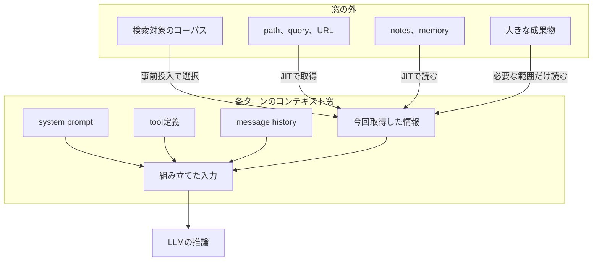
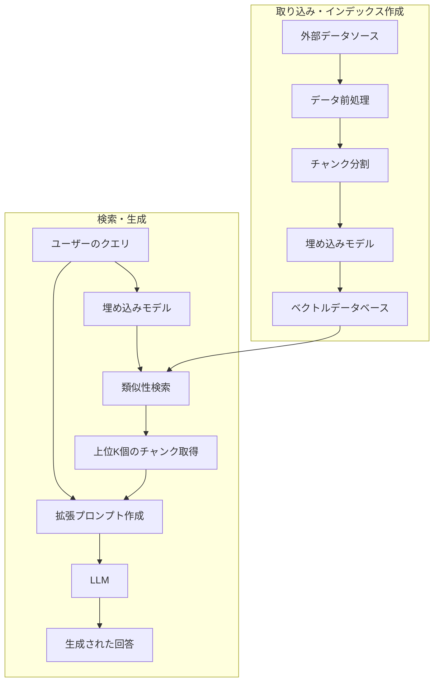
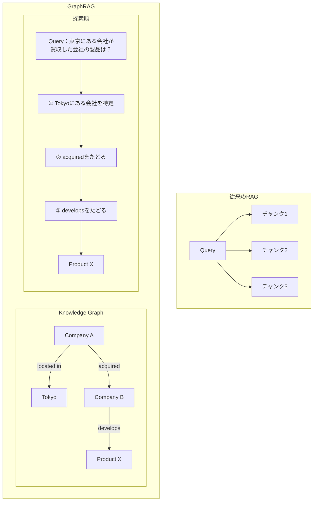
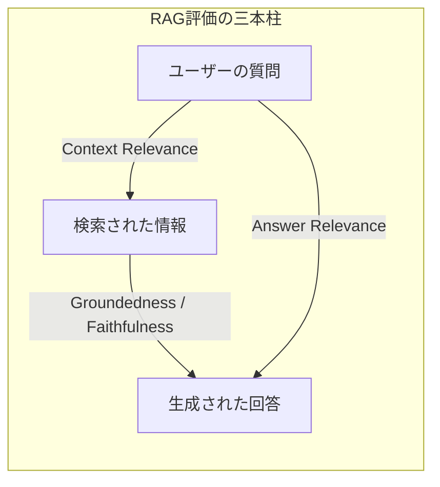

## はじめに

> この記事は2025年7月に公開しました。2025年9月以降の一次資料を反映して定義、用語、ツール設計、キャッシュの記述を更新し、2026年8月に長時間タスクのコンテキスト管理と評価を追加しました。

AIエージェントを長く動かすと、途中から指示を忘れる、同じ調査を繰り返す、規約を破る、といった劣化が起きます。
原因の一つは、各推論ターンでモデルに渡している情報の設計です。

単発の指示を改善するプロンプトエンジニアリングだけでは、この問題を扱いきれません。
必要なのは、指示、ツール、履歴、検索結果などを含めて、モデルが参照する情報全体を設計することです。

この記事では、コンテキストエンジニアリングの定義から、RAGとJIT取得、長時間タスクの履歴管理、キャッシュ、本番環境での評価までを順に解説します。
読み終えると、何を毎ターン載せ、何を窓の外へ置き、情報が増えたときにどう整理するかを判断できるようになります。

## 1. プロンプトからコンテキストへ

### 1.1. プロンプトエンジニアリングの対象

**プロンプトエンジニアリング**は、生成AIモデルから望ましい出力を得るために、指示や入力の表現を設計する技術です。
一般的なプロンプトには、実行させる指示、判断に使う情報、期待する出力形式が含まれます。

この方法は単発のタスクで有効です。
しかし、数十ターンにわたる対話では、表現の調整だけで履歴、外部データ、ツールの選択、状態の保存まで制御することはできません。

### 1.2. コンテキストエンジニアリングの対象

そこで設計対象を、プロンプト文字列から、推論時にモデルへ渡す情報全体へ広げます。
[Anthropicの定義](https://www.anthropic.com/engineering/effective-context-engineering-for-ai-agents)に沿えば、**コンテキストエンジニアリング**とは、各推論ターンでモデルへ渡すトークン集合を選び、維持することです。

対象には次の情報が含まれます。

| 対象 | 具体例 |
|---|---|
| System prompt | 役割、制約、出力形式 |
| Tools | ツール定義、関数やMCPサーバーのスキーマ |
| Examples | few-shotの実例 |
| History | 過去の発話、ツールの呼び出しと応答 |
| 外部データ | 実行時に読み込んだファイルや検索結果 |

設計の原則は、判断に必要な高信号の情報だけを載せることです。
ここで「最小」と「短い」は同じではありません。
必要な前提まで削ると、モデルは不足した情報を推測で補います。

### 1.3. プロンプトエンジニアリングとの違い

プロンプトエンジニアリングは、コンテキストエンジニアリングの部分集合として位置づけられます。

| 次元 | プロンプトエンジニアリング | コンテキストエンジニアリング |
|---|---|---|
| **主なスコープ** | 指示、例、出力形式 | 指示に加えて履歴、ツール、外部データ |
| **中核タスク** | 入力表現を調整する | 各ターンの入力を取得、選択、圧縮する |
| **代表的な手段** | プロンプトテンプレート、few-shot | RAG、外部メモリ、履歴管理、ツール設計 |
| **評価単位** | 一つの入出力 | 複数ターンを含むシステム全体 |

プロンプトの文言は引き続き設計対象です。
ただし、長時間動くシステムでは、毎ターン何を組み立てるかが出力を大きく左右します。

## 2. なぜコンテキストは多いほどよいとは限らないのか

### 2.1. コンテキスト窓は有限な注意資源である

窓を広く取れば問題が解決する、という直感は部分的にしか正しくありません。
入力が長くなると、モデルは増えた情報のすべてを同じ精度で利用できるわけではないからです。

[Anthropicはこの制約を「attention budget」](https://www.anthropic.com/engineering/effective-context-engineering-for-ai-agents)と表現しています。
Transformerでは各トークンがほかのトークンを参照できるため、入力がnトークンなら考慮される組み合わせはn²の規模で増えます。
窓へ情報を追加できることと、その情報を同じ精度で利用できることは別です。

[Chromaのテクニカルレポート「Context Rot」](https://www.trychroma.com/research/context-rot)も、入力が長くなるにつれて複数モデルの性能が非一様に低下する現象を報告しています。

### 2.2. 長い入力で観測される性能劣化

長いコンテキストの弱点は、一つのベンチマークだけで観測されているわけではありません。

| 研究 | 観測 |
|---|---|
| [Lost in the Middle](https://arxiv.org/abs/2307.03172) | 関連情報が入力の中央にあると、先頭や末尾にある場合より精度が落ちる |
| [NoLiMa](https://arxiv.org/abs/2502.05167) | 字面の一致が少ない検索では、入力長の増加に伴って複数モデルの性能が低下する |
| [LongMemEval](https://arxiv.org/abs/2410.10813) | 長期対話から過去の情報を想起する課題で、商用アシスタントを含む複数システムの精度低下を観測した |

これらの結果から、広告されるコンテキスト窓の長さと、タスクで実効的に使える長さは分けて考える必要があります。
位置による劣化と、情報量の増加による劣化も同じ現象ではないため、評価では切り分けます。

### 2.3. 大きなコンテキスト窓で置き換えられる範囲

大きな窓には、情報を検索や要約で削らず、一度の入力へ載せられるという容量上の利点があります。
入力が窓へ収まらないことだけが問題なら、窓の拡大によって切り捨てや要約を減らせます。
一方、必要な情報の特定や長期にわたる規約の維持は、容量を増やすだけでは解決しません。

したがって、大きな窓だけではコンテキスト管理を置き換えられません。
窓の大きさを増やした場合も、不要な履歴や検索結果を無条件に載せる構成は避けます。

## 3. 外部情報をコンテキストへ入れる

### 3.1. 事前投入とJIT

外部情報の渡し方は、推論前に検索して載せる**事前投入**と、識別子だけを保持して必要時に読む**JIT（just-in-time）取得**に分けられます。

```mermaid
flowchart TD
  subgraph outside ["窓の外"]
    Universe["検索対象のコーパス"]
    Ids["path、query、URL"]
    Notes["notes、memory"]
    Files["大きな成果物"]
  end

  subgraph inside ["各ターンのコンテキスト窓"]
    Sys["system prompt"]
    Tools["tool定義"]
    Hist["message history"]
    Retrieved["今回取得した情報"]
    Assemble["組み立てた入力"]
  end

  Universe -->|"事前投入で選択"| Retrieved
  Ids -->|"JITで取得"| Retrieved
  Notes -->|"JITで読む"| Retrieved
  Files -->|"必要な範囲だけ読む"| Retrieved
  Sys --> Assemble
  Tools --> Assemble
  Hist --> Assemble
  Retrieved --> Assemble
  Assemble --> LLM["LLMの推論"]
```

| 方式 | 向く場面 | 弱点 |
|---|---|---|
| 事前投入 | 静的で更新の少ないコーパス | 古い情報や無関係な断片が窓へ入りやすい |
| JIT | 変化するファイル群、探索的な調査 | 往復が増え、ツールの誤用も起こり得る |
| ハイブリッド | 実運用の多く | 両方の取得経路を設計する必要がある |

RAGは事前投入または選択的取得を実装する手段であり、コンテキストエンジニアリング全体と同義ではありません。

### 3.2. 検索拡張生成（RAG）

[RAG](https://arxiv.org/abs/2005.11401)は、LLMの内部知識を外部の知識ベースで補うアーキテクチャです。
検索結果を回答の根拠として渡すことで、モデルの知識の古さや、根拠のない生成を減らしやすくします。

#### 3.2.1. 標準的なRAGアーキテクチャ

RAGのプロセスは、オフラインでの「インデックス作成」と、オンラインでの「検索・生成」の2フェーズで構成されます。

```mermaid
flowchart TD
    subgraph "取り込み・インデックス作成"
        A["外部データソース"] --> B["データ前処理"];
        B --> C["チャンク分割"];
        C --> D["埋め込みモデル"];
        D --> E["ベクトルデータベース"];
    end

    subgraph "検索・生成"
        F["ユーザーのクエリ"] --> G["埋め込みモデル"];
        G --> H["類似性検索"];
        E --> H;
        H --> I["上位K個のチャンク取得"];
        I --> J["拡張プロンプト作成"];
        F --> J;
        J --> K["LLM"];
        K --> L["生成された回答"];
    end
```

#### 3.2.2. 高度な検索技術

本番環境のRAGでは、検索結果の関連性を高めるために複数の手法を組み合わせます。

- **ハイブリッド検索**：ベクトル検索による意味の類似性と、キーワード検索による字句の一致を組み合わせる
- **リランキング**：高速な手法で候補を取得し、別のモデルで再評価して順位を付け直す

### 3.3. GraphRAGで関係を検索する

[GraphRAG](https://arxiv.org/abs/2404.16130)は、知識をエンティティ（点）と関係（線）のネットワークとして表現する**知識グラフ**を活用し、断片間の関係を検索へ利用する手法です。

```mermaid
flowchart TD
    subgraph 従来のRAG
        A["Query"] --> B["チャンク1"];
        A --> C["チャンク2"];
        A --> D["チャンク3"];
    end
    subgraph GraphRAG
        subgraph knowledgeGraph ["Knowledge Graph"]
            E["Company A"] -- "located in" --> F["Tokyo"];
            E -- "acquired" --> G["Company B"];
            G -- "develops" --> H["Product X"];
        end
        subgraph searchPath ["探索順"]
            I["Query：東京にある会社が買収した会社の製品は？"] --> S1["① Tokyoにある会社を特定"];
            S1 --> S2["② acquiredをたどる"];
            S2 --> S3["③ developsをたどる"];
            S3 --> R["Product X"];
        end
    end
```

GraphRAGは、サプライチェーン分析や不正検知など、複数の情報源を横断する**多段階の推論**を必要とするクエリに向きます。
この図は、関係をたどる検索を示す簡略例です。
MicrosoftのGraphRAGは、エンティティ間のグラフに加えてコミュニティ要約を構築し、データセット全体を問う質問にも対応します。

### 3.4. 実装例としてのlocal-RAG-backend

ここで紹介した高度なRAGのコンセプトを実現するOSS `local-RAG-backend` を公開しています。

https://github.com/suwa-sh/local-RAG-backend

https://zenn.dev/suwash/articles/local_rag_backend_20250622

このツールは、次の機能をまとめて提供します。

1. **データ取り込み**：PDFやWordなどから情報を抽出し、レイアウトや意味のまとまりを考慮して分割する
2. **ハイブリッド検索とリランキング**：ベクトル検索、全文検索、グラフ検索を組み合わせ、候補を再評価する
3. **ローカルでの導入**：`docker compose up`で検索サーバー群を起動する

`local-RAG-backend`を使うと、各検索方式を個別に構築せず、取得するコンテキストの比較と調整から始められます。

## 4. エージェントのコンテキストを設計する

### 4.1. 検索から行動へ

AIエージェントは、LLMを回答生成だけでなく、次の行動を選ぶために使うシステムです。

#### エージェントの構成要素

1. **LLMコア**：計画立案と意思決定を担う推論エンジン
2. **メモリ**：過去の対話や進捗を保存し、必要時に取得する仕組み
3. **ツール／関数**：APIやデータベースを操作するインターフェース

#### ReAct

[**ReAct（Reason + Act）**](https://arxiv.org/abs/2210.03629)は、「思考 → 行動 → 観察」のループを繰り返すエージェントの基本パターンです。

```mermaid
graph LR
    A[思考: 次に何をすべきか？] -->|LLMが計画| B(行動: ツールを実行);
    B -->|API/DBから結果取得| C(観察: 結果はどうだった？);
    C -->|結果を元に再考| A;
```

ReActでは、思考、行動、観察を繰り返すたびに履歴が増えます。
したがって、行動の選択だけでなく、次のターンへ何を残すかもエージェント設計に含まれます。

### 4.2. 窓を構成する部品

エージェントの窓は、主に次の4部品で構成されます。
実行時に取得した外部データは、これらに追加されます。

| 部品 | 失敗の両極 | 設計方針 |
|---|---|---|
| System prompt | 条件分岐を詰め込む、前提を省略する | 最小から始め、観測した失敗に対応する規則を足す |
| Tools | 機能が重複する、選択基準が曖昧になる | 人間でも選べる粒度と名前にする |
| Examples | エッジケースの百科事典になる | 少数の代表例に絞る |
| History | 全履歴が堆積する | 圧縮、外部化、隔離を使い分ける |

System promptやexamplesの適切な量は、モデル世代によって変わります。
特定モデルで得られた推奨を、別のモデルへそのまま適用しないようにします。

### 4.3. ツールをコンテキストとして設計する

ツール定義と戻り値も、モデルが読むコンテキストです。
機能が重複するツールを並べると選択が不安定になり、巨大な戻り値は次の判断に必要な情報を埋もれさせます。

この節の設計方針は、Anthropicの[Writing effective tools for agents](https://www.anthropic.com/engineering/writing-tools-for-agents)を基礎にしています。

実務では、次の原則を使えます。

- `list_*`を多数並べるより、目的に対応した`search_*`や複合操作を用意する
- UUIDだけでなく、人間が意味を判断できる識別子を返す
- 戻り値の件数とサイズに上限を設ける
- 失敗理由と再試行に必要な情報を構造化して返す

## 5. 長時間タスクのコンテキストを管理する

### 5.1. Compaction、外部メモリ、サブエージェント

窓に収まらない長さの仕事では、次の3手段を使い分けます。

| 手段 | 仕組み | 向く仕事 | 主な失敗 |
|---|---|---|---|
| [Compaction](https://platform.claude.com/docs/en/build-with-claude/compaction) | 履歴を要約して新しい窓を作る | 往復の多い対話の継続 | 後で必要になる制約が要約から落ちる |
| Notes、memory | 進捗や決定を窓の外へ保存する | マイルストーンのある反復作業 | 書き忘れた情報が次のセッションへ残らない |
| Sub-agent | 探索を別の窓へ隔離し、成果だけを戻す | 独立した並列調査 | 引き継ぎで前提や決定が失われる |

情報の置き場は、再び窓へ入れる方法と組み合わせて決めます。

| 置く情報 | 置き場 | 再取得する方法 |
|---|---|---|
| 不変の規約 | 毎ターンの固定prefix | 常にモデルへ渡す |
| path、query、URL | 履歴または外部メモリ | JITツールで展開する |
| 大きな検索結果や成果物 | ファイルシステム | 必要な範囲だけ読む |
| 進捗、決定、未解決事項 | notes、memory | セッションの開始時や必要時に読む |
| 探索の詳細なトレース | 子エージェントの窓 | 要約または成果物を親へ戻す |

### 5.2. Compactionは固定規約を保証しない

Compactionは自動化しやすい一方、要約に含まれなかった情報を復元できません。
[Governance Decay](https://arxiv.org/abs/2606.22528)のpreprintでは、常時有効な方針を全文脈へ残した条件では違反率が0%だったのに対し、compaction後は全体で30%、モデルによっては59%まで上昇しました。
制約が要約へ残った場合は0%、落ちた場合は38%でした。

この結果は1,323エピソードを使ったpreprintの報告であり、異なるモデルやタスクへ同じ数値を一般化することはできません。
それでも、直近の会話で話題にならない禁止操作、完了条件、運用規約を要約だけに預けない理由にはなります。

この種の常時有効な規約は、要約対象の履歴ではなく、毎ターン読み込む固定領域へ置きます。
要約には、進捗、決定、その判断理由、未解決事項を残します。

[Context editing](https://platform.claude.com/docs/en/build-with-claude/context-editing)で古いツール結果を削除する場合も、削減量だけでは評価できません。
履歴のprefixが変わるとPrompt Cacheを再利用できなくなるため、削減できるトークン量と再計算コストを合わせて測ります。

### 5.3. 外部メモリと可逆的な圧縮

ファイルシステムは、長時間タスクの外部メモリとして利用できます。
検索結果の全文を履歴へ残す代わりにファイルへ保存し、pathやURLだけを保持すれば、必要なときに元の情報を読み直せます。

これは、情報を捨てる要約とは異なる可逆的な圧縮です。
[MemGPT](https://arxiv.org/abs/2310.08560)は、窓の中を主記憶、外部ストレージを補助記憶に見立て、必要な情報を出し入れする構成として定式化しています。
ただし、[memoryツール](https://platform.claude.com/docs/en/agents-and-tools/tool-use/memory-tool)からファイルを操作できる設計では、canonical pathへ解決したうえで許可したprefix内かを検証し、パストラバーサルを防ぐ必要があります。

### 5.4. サブエージェントへ分離する基準

サブエージェントは、独立して調べられる探索を分離するときに役立ちます。
[Anthropicのmulti-agent research system](https://www.anthropic.com/engineering/multi-agent-research-system)は、並列化しやすい調査で複数エージェントを利用しています。

一方、[Cognitionは並列エージェント間で暗黙の決定を共有できない問題](https://cognition.com/blog/dont-build-multi-agents)を挙げ、文脈を共有する単一エージェントを推奨しています。
複数の作業が同じ規約や決定へ依存する場合、窓を分けると共有すべき情報が欠けます。

判断の目安は、探索ノイズは隔離できるが、決定と規約は隔離しないことです。
子エージェントの要約だけに依存せず、生成した成果物や根拠をファイルに残すと、親エージェントが必要な箇所を確認できます。

## 6. パフォーマンスと回復力を設計する

### 6.1. KVキャッシュとPrompt Cache

KVキャッシュとPrompt Cacheは、どちらも同じprefixに対する計算結果を再利用し、トークンの再処理を減らします。
違いは、主にキャッシュを再利用する範囲と寿命です。

#### KVキャッシュ

**KVキャッシュ**は、処理済みトークンのKeyとValueを保存し、同じ生成の次のステップで再利用する仕組みです。
新しいトークンを生成するときは、過去のKeyとValueを再計算せず、新しいトークンのQueryからキャッシュ済みのすべてのKeyへattentionを計算します。
直前のトークンとの関係だけを計算するわけではありません。

これにより、過去の系列全体を各ステップで処理し直す計算を避けられます。

#### Prompt Cache

[**Prompt Cache**](https://platform.claude.com/docs/en/build-with-claude/prompt-caching)は、同じprefixに対する計算結果を複数リクエストで再利用する機能です。
概念上は、同一生成内のKVキャッシュより再利用範囲を広げたものとして捉えられますが、内部実装、保持時間、課金条件はサービスによって異なります。
固定情報を先頭にまとめ、ターンごとに変わる情報を後ろへ置くと、共通prefixを再利用しやすくなります。

キャッシュを利用する場合は、次の点を揃えます。

1. System promptやツール定義などの固定情報を先頭に置く
2. JSONなどのキー順を安定させる
3. 履歴の削除や並べ替えがキャッシュを無効にすることを計測へ含める

### 6.2. 失敗から回復できる情報を残す

ツールの失敗を単に削除すると、エージェントは同じ呼び出しを繰り返す可能性があります。
エラーの種類、失敗した入力、再試行の条件を残せば、次のターンで別の行動を選べます。

一方、利用不能なツールを選択肢へ残し続ける必要はありません。
現在使えるツールだけを提示し、過去の失敗は再判断に必要な範囲へ圧縮します。

## 7. AIシステムを評価する

コンテキストの改善は、出力だけでなく、コストと遅延を含めて評価します。
同じ品質なら入力が少ない構成を選べますが、必要な前提を削って品質が落ちるなら最適化にはなりません。

### 7.1. コスト、遅延、品質

RAGやエージェントを本番運用するときは、コスト、遅延、品質を同時に測ります。
完璧なプロンプトを探すのではなく、取得、組み立て、生成の各段階を観測できるデータパイプラインを作ります。

### 7.2. RAGの評価

RAGの品質は、検索と生成を分けて評価します。

#### RAG評価の三本柱

RAGシステムの品質は、主に3つの観点から評価されます。

```mermaid
flowchart LR
    subgraph triad ["RAG評価の三本柱"]
        A["ユーザーの質問"] -- "Context Relevance" --> B["検索された情報"];
        B -- "Groundedness / Faithfulness" --> C["生成された回答"];
        A -- "Answer Relevance" --> C;
    end
```

1. **コンテキスト関連性（Context Relevance）**：検索された情報は、質問に関連しているか
2. **根拠との整合性（Groundedness / Faithfulness）**：回答は、検索された情報に裏づけられているか
3. **回答関連性（Answer Relevance）**：回答は、質問に答えているか

#### LLM-as-Evaluator

[RAGAS](https://arxiv.org/abs/2309.15217)や[TruLens](https://www.trulens.org/getting_started/core_concepts/rag_triad/)などは、LLMを評価者として使い、これらの指標をスコアリングします。
ただし、LLM judgeの判定も誤るため、人手で確認した評価セットとの一致率を測ります。

### 7.3. コンテキスト管理の評価

長時間タスクでは、通常の回答精度だけでは履歴管理の失敗を検出できません。
次の条件を評価セットへ含めます。

- 履歴が長くなっても固定規約を守れるか
- Compactionの前後で、決定と完了条件が維持されるか
- 無関係な情報を追加したときに精度が落ちないか
- JIT取得に失敗したあと、別の方法へ切り替えられるか
- 入力トークン数を減らしたとき、品質と遅延がどう変わるか

評価の質は、テストデータセットで決まります。
実際の失敗ログから回帰ケースを追加し、モデル、prompt、retriever、compaction方式の変更前後で同じ評価を実行します。

## 8. 実務チェックリスト

自分のエージェント基盤へ適用するときは、次の順で確認できます。

1. **設計単位をターンにする**：セッション開始時にすべてを載せず、各ターンで必要な情報を選ぶ
2. **固定規約を要約の外へ置く**：禁止操作、完了条件、運用規約を毎ターンの固定領域へ置く
3. **大きな成果物を外部化する**：ファイルへ保存し、履歴にはpathやURLを残す
4. **取得方法を分ける**：静的コーパスでは事前投入を使い、変化する情報はJITで読む
5. **探索だけを分離する**：サブエージェントへ渡すのは独立した探索に絞り、決定と規約を親へ残す
6. **大きな窓を過信しない**：長時間ループでは、外部メモリと選択的な履歴管理を残す
7. **三つの指標で評価する**：トークン数、遅延、品質を変更前後で比較する

モデル世代が変わると、適切なsystem promptの量、examplesの効果、利用できる窓の長さも変わります。
個別モデルの推奨を固定ルールにせず、失敗ログと評価セットから構成を更新します。

## まとめ

コンテキストエンジニアリングは、各推論ターンでモデルへ渡す情報を設計する考え方です。
プロンプトだけでなく、ツール、履歴、検索結果、外部メモリまでを対象にします。

長い入力は、それだけで高い性能を保証しません。
RAGとJITを使い分け、大きな成果物を窓の外へ置き、Compaction、外部メモリ、サブエージェントを仕事に応じて選びます。

設計の基準は、必要な情報を、必要なターンだけ、再取得できる形でモデルへ渡すことです。
その効果は、トークン数だけでなく、遅延と品質を含む評価で確かめます。

この記事が参考になった、あるいは改善点があれば、リアクションやコメントで共有していただけると励みになります。

## 関連記事

- [プロンプトエンジニアリングの進化](https://zenn.dev/suwash/articles/prompt_engneering_20250529)：コンテキストの中でも、指示そのものの書き方を設計する

## 参考リンク

### コンテキスト設計と運用

- [Effective context engineering for AI agents](https://www.anthropic.com/engineering/effective-context-engineering-for-ai-agents)
- [Writing effective tools for agents](https://www.anthropic.com/engineering/writing-tools-for-agents)
- [Compaction](https://platform.claude.com/docs/en/build-with-claude/compaction)
- [Context editing](https://platform.claude.com/docs/en/build-with-claude/context-editing)
- [Prompt caching](https://platform.claude.com/docs/en/build-with-claude/prompt-caching)
- [Memory tool](https://platform.claude.com/docs/en/agents-and-tools/tool-use/memory-tool)
- [Context Rot](https://www.trychroma.com/research/context-rot)
- [Governance Decay](https://arxiv.org/abs/2606.22528)

### 研究とアーキテクチャ

- [Retrieval-Augmented Generation for Knowledge-Intensive NLP Tasks](https://arxiv.org/abs/2005.11401)
- [From Local to Global: A Graph RAG Approach to Query-Focused Summarization](https://arxiv.org/abs/2404.16130)
- [ReAct: Synergizing Reasoning and Acting in Language Models](https://arxiv.org/abs/2210.03629)
- [Lost in the Middle](https://arxiv.org/abs/2307.03172)
- [NoLiMa](https://arxiv.org/abs/2502.05167)
- [LongMemEval](https://arxiv.org/abs/2410.10813)
- [MemGPT](https://arxiv.org/abs/2310.08560)
- [RAGAS: Automated Evaluation of Retrieval Augmented Generation](https://arxiv.org/abs/2309.15217)
- [TruLens RAG Triad](https://www.trulens.org/getting_started/core_concepts/rag_triad/)
- [How we built our multi-agent research system](https://www.anthropic.com/engineering/multi-agent-research-system)
- [Don't Build Multi-Agents](https://cognition.com/blog/dont-build-multi-agents)
