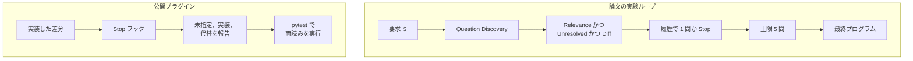

コーディングエージェントへ要求を渡すと、書いていない挙動をエージェントが自分の仮定で埋めることがあります。CONTRA は、その仮定で埋める前に、どの問いをユーザーへ返すかを選ぶ手続きです。訓練は使いません。候補の問いを広く作り、必要な挙動と無関係なもの、要求文がすでに決めているものを落とします。残った問いには二つの答えを付け、その答えで条件付けたプログラムを同じ入力で走らせ、安定した出力が分かれた問いだけを残します。対話の履歴を見て、まだ聞く必要がある問いを予算の範囲で選ぶか、聞くのをやめます。

この記事は、エージェントへ渡す要求と受入条件を書く人向けに、問いが残る条件、論文の実験ループ、公開プラグインの流れ、受入条件へ写す三列をまとめます。著者は Zheng Fang らです。Zhi Jin が Wuhan University、他は Peking University、連絡先は Ge Li です。記述の範囲は、2026-10-01 投稿の arXiv:2610.01769v1 と、同日公開のコードスナップショットです。

*この記事の全体像。以下、順に解説します。*

## CONTRAとは

CONTRA は、未指定の要求に対して「今聞く問い」を選ぶ手続きです。最終的なプログラムはそのあとで作ります。部品には同じ LLM を通します。論文が報告する実験では、GPT-5-mini、Grok 4.5、Gemini 3.1 Pro、GPT-5.5 を使っています。

評価の場は ClarifyCodeBench です。未指定タスク 419 と、完全指定タスク 80 を使います。質問の上限は 5 です。聞いた質問が gold（ベンチマークが正解として持つ質問）と一致するかは、GPT-4o による 3 判定の多数決です。precision の分母には、完全指定タスクで聞いた質問も入ります。

同じ LLM を部品全体に使った 4 モデルのすべてで、F1 と TKQR は、比べた 3 手法より高い、と論文は報告します。4 モデルのマクロ平均は F1 41.20%、TKQR 38.32%、precision 45.42%、recall 38.01% です。F1 は最良ベースラインである Ask-or-Assume の 27.32% より 13.88 ポイント高く、TKQR は最良ベースラインである ClarifyGPT の 25.99% より 12.33 ポイント高い、と論文は書きます。TKQR は、予算のなかで早く当たるかを見る指標です。できたプログラムの pass@1 は別表なので、数値は次の節で分母と一緒に扱います。

### 問いが残る条件

問いを残すには、条件を同時に満たします。論文の図はこれを Relevance、Unresolved、Diff と呼びます。本文が挙げる中身は次の四つです。

- 問いが、必要なプログラム挙動についている。
- 二つの補完が、その挙動の別案である。
- 要求文が、一方を支持して他方を排除していない。
- 共有入力の少なくとも一つで、両群の安定出力が定義され、互いに違う。

二つの補完は、要求と両立します。違うのは、その問いの答えだけです。安定とは、補完あたり 3 本のうち 2 本以上が同じ出力であることです。共有入力は 7 個以上です。

Discovery は二種類の生成を繰り返します。一つは要求だけからの生成です。もう一つは、既存の候補を見た生成です。重複はマージします。

### 二つの流れ

論文の実験と、公開プラグインは、時点が違います。実験は、要求から候補を作り、資格付けで残し、履歴で次の 1 問か停止を選びます。最終プログラムはそのあとです。公開プラグインは、実装のあとに差分と完了報告を見て決定を並べ、開いた選択だけ区別テストを試みます。

公開物は Apache-2.0 の version 0.1.0 です。Python 3.10 以降で、資格付けスクリプト、凍結した質問計画、適応選択、Claude Code プラグインを含みます。プラグインは変更後に、要求が述べていない決定を報告します。実行で分けられるのは `.py` と pytest です。隔離の既定は Linux の bubblewrap です。selector は、ClarifyCodeBench のパッケージを外部パスで受け取ります。

プラグインの skill `clarify-before-coding` は、実装した差分を見て決定を並べます。実装の前に待つのは、間違った読みの取り消しが高いときだけです。論文が挙げる例は、データの書き込み、メッセージ送信、マイグレーションです。それ以外は、開示して出荷します。両読みでテストが通った結果のラベルは `not_separated` です。

比べている手続きの、問いを残す条件と聞くタイミングは次のとおりです。

| やり方 | 問いを残す条件 | 聞くタイミング |
|---|---|---|
| Direct Prompting | モデルが聞くと判断したとき | 生成の前に 1 問かコード |
| Ask-or-Assume | 意図エージェントが追加の明確化を求めたとき | 行動の前 |
| ClarifyGPT | 同一要求からサンプルしたプログラムの出力が割れたとき | 生成の前 |
| CONTRA の実験 | 関連し、未解決で、二つの答えの安定出力が違う | 最終プログラムの前。上限 5 |
| 公開プラグイン | 差分に、要求が述べていない決定がある | 実装のあと。取り消しが高いときだけ待つ |

## 注意点

質問の F1 と、できたコードの pass@1 は別の量です。前節のマクロ F1 の 13.88 ポイントは、聞いた質問が gold の未カバー項目に一致したかの差です。未指定タスクの pass@1 は、Gemini 3.1 Pro が 57.32%（Direct Prompting は 56.10%）、GPT-5.5 が 64.63%（ClarifyGPT は 64.02%）です。差は 1.22 ポイントと 0.61 ポイントで、論文自身が modest gains と書いています。

recall 38.01% は、gold 質問の過半数が、実際に聞いた質問と一致していない、という意味です。モデル別の CONTRA recall は 34.56%、36.50%、44.28%、36.72% です。先頭の 34.56% は、GPT-5-mini の ablation が示す recall と一致します。Adaptive Question Selection の前の候補集合では、マクロ recall が 50.16% あります。5 問に絞ると 38.01% まで下がります。一方で TKQR は 32.52% から 38.32% へ上がります。予算内の効率と、gold の網羅は、同時には最大になりません。

Direct Prompting のマクロ F1 は 25.30% です。GPT-5.5 の Direct Prompting は precision 59.32%、recall 15.12% です。Ask-or-Assume のマクロ F1 27.32% が、4 モデルで最良のベースライン F1 です。ClarifyGPT のマクロ precision は 16.59%、マクロ recall は 28.29% です。

ClarifyGPT は、同じ要求からサンプルしたプログラムの出力の割れで質問を作ります。論文は、その割れが要求の曖昧さではなく、実装ミスでも起きると書きます。GPT-5-mini では、ClarifyGPT の precision が 13.58%、recall が 37.37% です。CONTRA から Behavioral Verification を外すと、同じモデルで precision は 36.20% から 28.04% へ下がり、recall は 34.56% から 38.88% へ上がり、F1 は 35.36% から 32.58% へ下がります。差の証拠は、不要な質問を減らす方向に働きます。差が無いことは、「聞いてなくてよい」の証明には使えません。論文の §3.4 も、Diff が立たないことを、二つの読みが同じ挙動である証明とは書いていません。プラグイン側も、`not_separated` を同値証明とは呼びません。

CONTRA-Flash は、選ばれた候補だけを資格付けします。評価回数は 65.7% から 96.0% 減ります。F1 の変化が最大 1.8 ポイント、と論文が書くのは、GPT-5-mini、Grok 4.5、GPT-5.5 の 3 モデルです。Gemini 3.1 Pro の Flash は F1 35.7%、TKQR 28.3% で、Table 1 のフル手法 50.49% / 45.37% とは別の点です。論文は、この F1 が最良ベースラインから 1.9 ポイント以内である、と書きます。

ハーネス比較の絶対値は小さいです。同じ Qwen3.8-27B、同じ質問上限、同じ採点で、Claude Code の F1 は 9.63%、OpenHands の F1 は 10.61%、CONTRA の F1 は 19.86% です。CONTRA の recall は 20.73% です。FPR は CONTRA と Claude Code が 5.00%、OpenHands が 32.50% です。この 19.86% は、4 モデル実験のマクロ F1 41.20% とは、母集団もモデルも違います。他のモデルで Claude Code や OpenHands と比較した表は、この論文にありません。Qwen3.8-27B のモデルカードは公開されています。

プラグイン評価が測っているのは、決定の文章が三要素を含む割合と、独立レビューが追加で見つけた決定の数です。対象は単一関数のコミット 40、リポジトリ 6、未指定ラベル 20、完全指定ラベル 20、seed 20260903 です。要求はコミットメッセージです。実行は Claude Code 2.1.261 と claude-opus-5、評価日は 2026-09-05 です。報告エントリの分母は、プラグイン無し 70、あり 67 です。未指定情報の記載は 4.3% から 59.7%、代替解釈は 7.1% から 47.8%、三要素すべては 2.9% から 46.3% です。262 決定のうち 116（44.3%）は、独立レビューにだけあります。開発者の手間と、長いセッションのコード品質は、論文の §6 が今後の課題だと書いています。この割合は、pass@1 の表には出てきません。

ベンチマークは、著者グループが重なります。ClarifyCodeBench（arXiv:2607.00711v2、改訂 2026-08-31）の著者にも、Zheng Fang、Dongming Jin、Yongmin Li、Zhi Jin、Ge Li がいます。その説明は、LiveCodeBench v6 の完全な問題文から情報を削るだけ（deletion-only）で曖昧な要求を作り、gold の答えは削った文そのもの、と書きます。419 件の内訳は、曖昧さ 1 点が 199、2 点が 169、3 点が 51 です。同論文は、元の問題文を学習済みのモデルが、曖昧な版でも推測しうる、とデータ漏洩を妥当性への脅威に挙げています。完全指定 80 件は、CONTRA の §4.1 が ClarifyCodeBench 提供と書きます。ClarifyCodeBench の §3.2 は、419 件の内訳を書きます。CONTRA の abs ページと PDF 先頭に、会議やジャーナルの採録名はありません。

公開 README は、offline discovery の全部と、複数プログラムの behavioral verification ドライバはリリースに含まれず、代替実装も無い、と書きます。ベンチマークのタスク、注釈、実験出力も含まれません。2026-10-03 時点の公開リポジトリは、star が 1、archived ではなく、main の先端は 2026-10-01 のコミットです。取得した Issues は空でした。独立した追試は、この時点で確認できた範囲にはありません。プログラム実行の時間、メモリ、出力の具体的な上限は、論文が fixed と書くだけで、数値はありません。

Appendix C の費用 $0.70 は、Requests への Brotli 対応を題材にした単発デモです。内訳は、コーディング 40 秒で $0.47、報告 90 秒で $0.17、検証 15 秒で $0.06 です。報告が現れるのは依頼から約 130 秒後で、検証はそのあとバックグラウンドで 15 秒です。40 秒、90 秒、15 秒を足して 130 秒にはしません。常時の単価ではありません。

## 受入条件を三列にする

二列（黙ってよい / 聞く）だと、Diff に落ちた項目を、黙ってよい側へ入れやすくなります。論文の定義では、落ちた項目は未証明です。受入条件は次の三列にします。

| 列 | 判定 | エージェントがしてよいこと | テストとの関係 |
|---|---|---|---|
| 要求が決めている | 文が一方を支持し、他方を排除できる。根拠文を引用する | 聞かない。排除された側を実装しない | 要求にある側のテストで足りる |
| 挙動が分かれ、取り消しが高い | 二つの読みで観測値が違い、データの書き込みや送信や移行のように戻せない | 実装の前に 1 問だけ聞く | 選んだ後のテストは、選ばなかった読みを実行しないので、この列を拾えない |
| 挙動が分かれうるが、取り消しが安い | 出力、例外、順序、型が変わりうる。戻せる | 一つの読みで実装し、未指定だったこと、実装したこと、代替を同じ変更で書く | 両読みで通るテストは分離ではない。分けるテストは、代替パッチで落ちることを見る |

判断の型を当てはめた例です。要求が「問い合わせメールを送る」だけだとします。宛先と本文の必須項目が文にあれば、1 列目です。根拠文を引用し、聞かないで実装します。送信そのものは取り消しが高いので、2 列目です。実装の前に 1 問だけ聞きます。件名の定型や送信ログの文言は、戻せるなら 3 列目です。一つの読みで実装し、未指定、実装、代替を同じ変更に書きます。

GPT-5-mini の ablation では、Resolution を外したときの precision 低下（36.20% から 26.46%）が、Relevance を外した低下（31.27%）より大きいです。すでに書いてあることを聞き返すコストは、1 列目を先に埋めることで避けます。

Adaptive Question Selection を外すと、同じモデルで F1 が 35.36% から 26.69% へ 8.67 ポイント下がります。precision は 20.96% へ下がり、recall は 36.72% へ上がります。Table 3 が示すのは、この増減です。候補をすべて口に出した、と表からまでは言えません。論文の §4.6 は、上限のなかで質問を選ぶ効果として解釈しています。受入条件側でも、「聞く列」は少数にします。

生成後のレビューだけに、仕様の空白を寄せません。要求を書くときに、三列を 1 枚付けます。聞く列は、戻すコストが高い挙動の分岐に限ります。安い分岐は実装してよいです。ただし、完了報告に未指定、実装、代替の三つが無い変更は、受入にしません。追加したテストが、選んだ読みで通ることだけを受入にすると、聞かなかった分岐は残ります。

## 実験ループとプラグインを分けて使う

公開プラグインを、「生成前に CONTRA が問いを選ぶ装置」として入れません。skill の名前は `clarify-before-coding` です。動きは、先に実装してから差分を見ます。論文の実験ループと、リポジトリの Stop フックは、時点が違います。

プラグインを使うなら、実装後の開示と、Python に限った区別テストとして使います。論文の質問 F1 を、その導入の効果の見積もりには使いません。F1 が測っているのは、聞いた質問と gold の一致です。プラグインの割合が測っているのは、完了報告の三要素と、独立レビューが追加で見つけた決定です。

導入の前に、自分の変更で三列のどれだったかを見ます。仕様に無く実装にある分岐を集め、1 列目なのに聞いていないか、2 列目なのに黙って出荷していないか、3 列目なのに完了報告の三要素が欠けていないかを分けます。文書の差分だけを標本にすると、挙動の分岐は拾えません。

## まとめ

CONTRA の実験は、必要な挙動についての問いで、要求がまだ決めておらず、二つの答えで安定した出力が分かれるものだけを、上限 5 問のなかから聞きます。公開プラグインは、そのループの前段ではなく、実装したあとの開示と、Python の区別テストです。質問の F1 が上がることと、pass@1 が同幅で上がることは、論文の別表です。pass@1 の差は 1 ポイント前後で、論文は modest gains と書いています。

要求側の受入は三列です。文が決めていることは聞きません。戻すコストが高い分岐だけ、実装の前に 1 問聞きます。戻せる分岐は実装してよいです。その代わり、未指定、実装、代替が同じ変更に無いものは受入にしません。選んだ読みのテストが通ることだけを受入にすると、聞かなかった分岐は残ります。

この記事が少しでも参考になった、あるいは改善点などがあれば、ぜひリアクションやコメント、SNSでのシェアをいただけると励みになります！

## 参考リンク

- Fang et al. CONTRA. arXiv:2610.01769v1, 2026-10-01. [abs](https://arxiv.org/abs/2610.01769) / [PDF](https://arxiv.org/pdf/2610.01769)
- 公開コード（Apache-2.0, version 0.1.0）。plugin README と `plugin/skills/clarify-before-coding/SKILL.md` を含む。[fangz-cs/Contra](https://github.com/fangz-cs/Contra)
- Fang et al. ClarifyCodeBench. arXiv:2607.00711v2, 改訂 2026-08-31. [abs](https://arxiv.org/abs/2607.00711)
- Mu et al. ClarifyGPT. PACMSE 1(FSE), 2024. doi:10.1145/3660810
- Edwards and Schuster. Ask or Assume. arXiv:2603.26233
- Fakhoury et al. TiCoder. IEEE TSE 50(9), 2024. doi:10.1109/TSE.2024.3428972
- [Qwen3.8-27B のモデルカード](https://huggingface.co/Qwen/Qwen3.8-27B)
