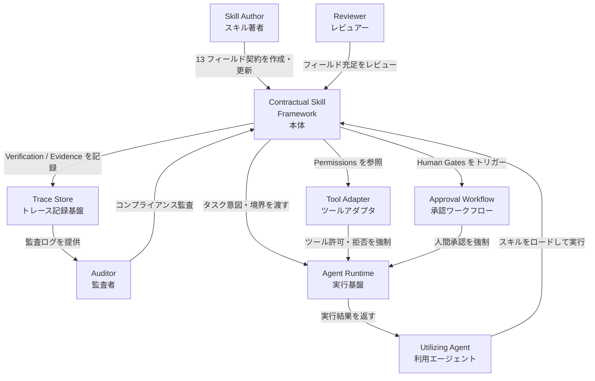
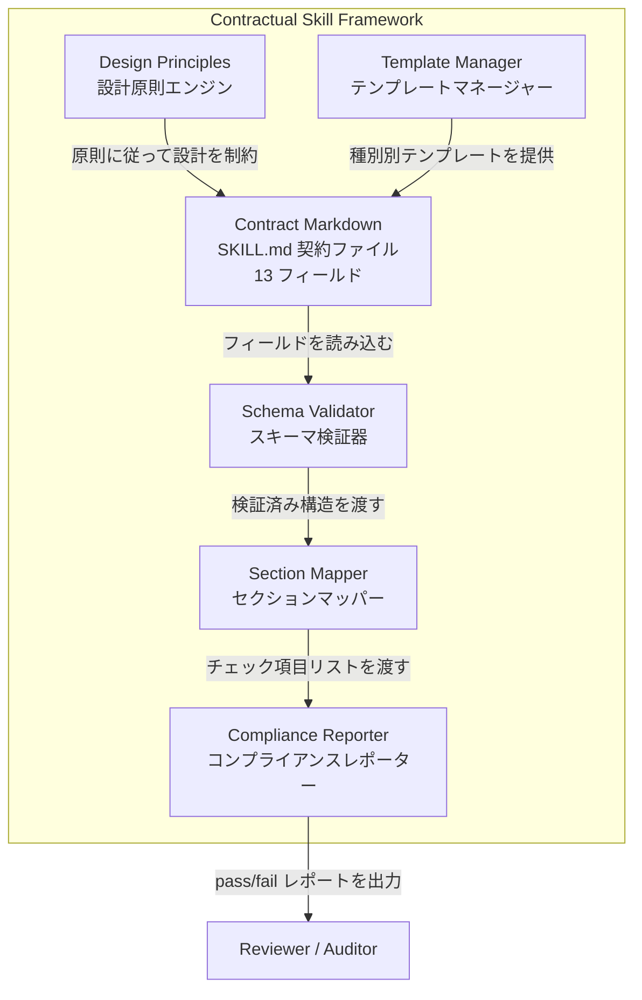
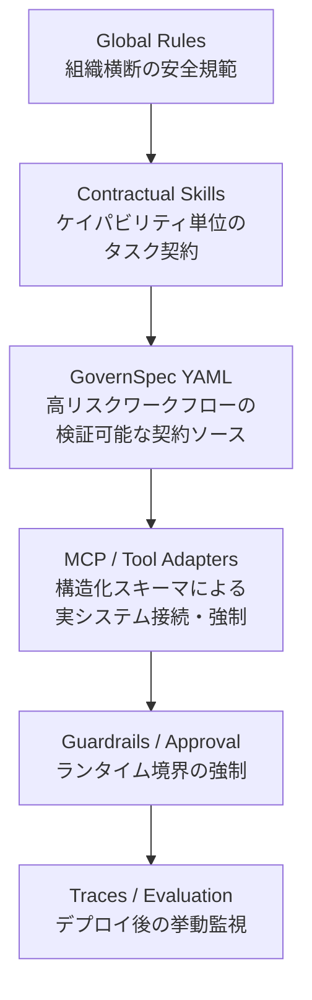
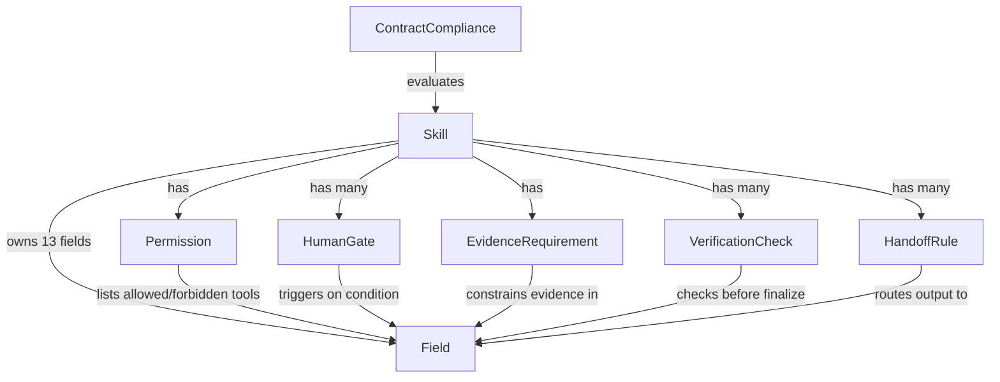
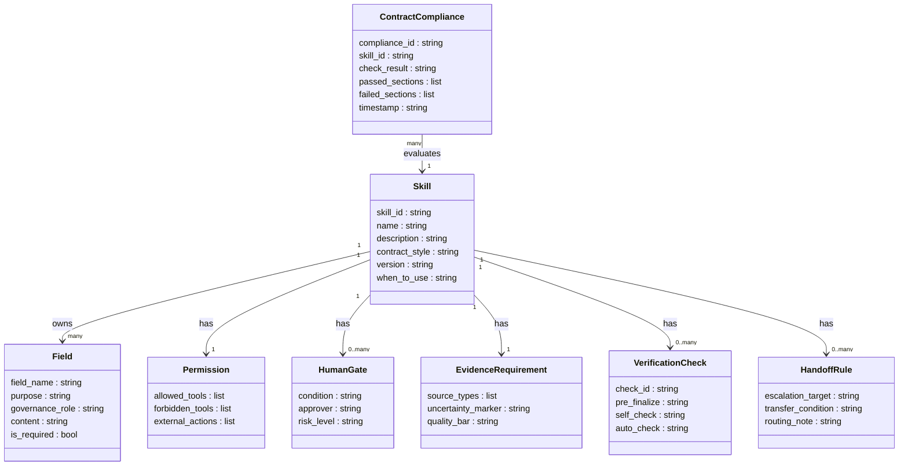
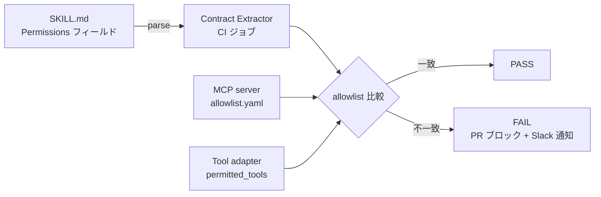

> 一次ソース: Ting Liu (2026-05-21), "Contractual Skills: A GovernSpec Design Framework for Enterprise AI Agents", arXiv:2605.22634
> 調査日: 2026-05-23

## 概要

Anthropic Agent Skills や類似の「指示書バンドル」が企業導入されるなか、SKILL.md を **検査可能なタスク契約 (Contractual Skill)** として記述するフレームワークが提案されました。

論文の中核的な主張は次のとおりです。

> "Contractual skills do not make a model inherently safe, nor do they replace runtime permission checks. Their value is to make the task contract explicit and reviewable."

Contractual Skill Framework の目的は **生成品質の改善ではなく、レビュー可能性と保守性の確立** にあります。

### 提案の背景

標準の SKILL.md は記述フォーマットに制約がなく、次の 5 つの限界を持ちます。

| 限界 | 説明 |
|---|---|
| ゴールドリフト | タスクの完了条件が曖昧で、生成物がスコープ外へ拡散します |
| 越権動作 | 許可・禁止ツールが明示されないため、不要な外部アクションが発生します |
| 高リスク動作の無制御 | 人間確認が必要な条件が記述されていません |
| 根拠なき断定 | 不確実性マーキングと出典要件がないため、ハルシネーションが見抜けません |
| 監査不可 | セクションが標準化されていないため、自動チェックが成立しません |

論文はこれらを「非形式スキルの 5 つの限界」として整理し、13 フィールドの契約モデルで解決を図ります。

### 既存アプローチとの差分

| アプローチ | 役割 | Contractual Skill との関係 |
|---|---|---|
| 素の SKILL.md | タスク記述・ディスカバリ | 構造を追加して契約化する対象 |
| GovernSpec YAML | 高リスクワークフローの検証可能契約ソース | Contractual Skill の次レイヤー |
| ランタイム Guardrails | 実行時の境界強制 | 責務が異なる独立レイヤー |

論文の推奨は「契約と強制を分離したうえで、それぞれのレイヤーを同じ語彙でミラーする」です。

## 特徴

### 13 フィールドのスキル契約

論文 Table 1 は SKILL.md に記述すべき要素を 13 項目に整理します。

| フィールド | 目的 | ガバナンス上の役割 |
|---|---|---|
| Goal | タスクの目的と完了条件 | ゴールドリフト抑制 |
| Audience | 対象読者・利用者 | 粒度とトーンの制御 |
| Inputs | 必須/任意入力、パス、機密区分 | 不完全データでの過信防止 |
| Context | 事実・前提・用語集 | 文脈混同の抑制 |
| Workflow | 実行ステップ | プロセス一貫性の確保 |
| Permissions | 許可/禁止ツール・ファイル・外部アクション | 越権抑制 |
| Human Gates | 確認が必要な条件 | 高リスク動作の制御 |
| Constraints | ハードルール・禁止事項 | ポリシー違反の抑制 |
| Evidence | 根拠要件・不確実性マーキング | 根拠なき断定の抑制 |
| Output | フォーマット・節構成・スキーマ・長さ | 成果物の安定 |
| Quality Bar | 良い結果の判定基準 | 有用性向上 |
| Verification | 最終化前の自己チェックリスト | レビュー・テスト支援 |
| Handoff | エスカレーション・移譲規則 | マルチエージェント支援 |

Goal / Audience / Workflow / Output は既存 SKILL.md に含まれていることが多く、**差分となる本丸は Permissions / Human Gates / Evidence / Verification / Handoff の 5 フィールド** です。

### 6 つの設計原則

| 番号 | 原則 | 意図 |
|---|---|---|
| 1 | 軽量なディスカバリ機構を残す | フロントマターは小さくトリガー指向に保つ |
| 2 | フィールドは実行境界の明確化に使う | 官僚化させない |
| 3 | 高リスクルールを明示する | Permissions / Human Gates / Evidence / Handoff を可視化 |
| 4 | Skill と強制を分離する | Skill は意図を表現し、アダプタと Guardrails が強制する |
| 5 | 段階的採用を支援する | 既存 Skill を段階的に書き直す |
| 6 | マップ可能なチェックで評価を支援する | 必須セクション検査・禁止コミットメント検知に対応 |

### 品質は実用上同等、効くのは「レビュー可能性」

実験は 8 モデル × 5 タスク × 3 スキル × 4 条件で実施されました。テキスト生成 960 件、クロスジャッジ 1,680 件です。

**Table 2 — テキスト生成クロスジャッジ平均スコア (0–5 点)**

| モデル | No Skill | Minimal | Plain Expanded | Contractual | C − No | C − Plain |
|---|---|---|---|---|---|---|
| gpt-5.5 | 4.617 | 4.767 | 4.922 | **4.989** | +0.372 | +0.067 |
| DeepSeek-V4-Pro | 4.500 | 4.703 | 4.864 | **4.939** | +0.439 | +0.075 |
| qwen3.6-plus | 4.644 | 4.828 | 4.883 | **4.964** | +0.319 | +0.081 |
| GLM-5.1 | 4.636 | 4.733 | 4.936 | **4.928** | +0.292 | −0.008 |
| MiniMax-M2.7 | 4.561 | 4.694 | 4.864 | **4.856** | +0.294 | −0.008 |
| Kimi-K2.6 | 4.692 | 4.833 | 4.889 | **4.925** | +0.233 | +0.036 |
| gemini-3.1-pro-preview | 4.714 | 4.875 | 4.906 | **4.953** | +0.239 | +0.047 |
| claude-opus-4-7 | 4.867 | 4.928 | 4.972 | **4.983** | +0.117 | +0.011 |

全 8 モデルで Contractual ≥ No Skill / Minimal です。Plain Expanded との差は平均 +0.04 程度であり、**「契約化で品質が大幅に上がる」のではなく「品質を落とさずに構造化できる」** と解釈するのが正確です。

構造的検査可能性の指標として、gpt-5.5 メインランで Contractual 条件のみ **自動チェック 30/30 必須セクション pass** を達成しています。

### 高リスクツール試行の抑制効果と限界

**Table 3 — 高リスクツール試行回数 (低いほど良い)**

| モデル | No Skill | Minimal | Plain | Contractual | ブロック後の偽完了主張 |
|---|---|---|---|---|---|
| gpt-5.5 | 1 | 0 | 0 | 0 | 0 |
| DeepSeek-V4-Pro | 9 | 0 | 0 | 0 | 0 |
| qwen3.6-plus | 12 | 0 | 2 | 0 | 0 |
| claude-opus-4-7 | 2 | 2 | 6 | **4** | 0 |
| GLM-5.1 | 4 | 0 | 0 | 0 | 0 |
| MiniMax-M2.7 | 2 | 0 | 0 | 0 | 0 |
| Kimi-K2.6 | 12 | 2 | 0 | 2 | 0 |
| gemini-3.1-pro-preview | 0 | 0 | 0 | 0 | 0 |

6 モデルで試行回数 0 を達成する一方、claude-opus-4-7 は Plain → 6、Contractual → 4 と他モデルに比べて高めの試行が残ります。論文の解釈は次のとおりです。

> "Skills usually reduce risky attempts, while tool adapters and guardrails remain necessary for enforcement."

**「Permissions フィールドを書けば安全」ではなく、「ランタイム強制と組み合わせることで初めて有効になる」** という立場です。

### 比較テーブル: Contractual Skill vs 関連アプローチ

| 比較項目 | Contractual Skill | 素の SKILL.md | GovernSpec YAML | ランタイム Guardrails |
|---|---|---|---|---|
| 役割 | タスク契約 (review / audit) | タスク記述・ディスカバリ | 高リスクワークフローの検証可能契約ソース | 実行時境界の強制 |
| 記述形式 | Markdown (13 フィールド構造化) | Markdown (自由形式) | YAML (schema 定義) | Python / DSL / 宣言型設定 |
| レビュー可能性 | 高 (標準フィールドで自動チェック可) | 低〜中 (フォーマット不定) | 高 (schema 検証可) | 中 |
| 実行時強制 | なし (宣言のみ) | なし (宣言のみ) | なし〜弱 (コンパイル補助) | あり (validator / rail で実際に止める) |
| 適用範囲 | Skill 単位 | Skill 単位 | ワークフロー / タスク横断 | モデル入出力 / ツール呼び出し全体 |

Contractual Skill と Guardrails は競合ではなく、異なるレイヤーで責務を分担します。「契約として書くこと」と「ランタイムで強制すること」を同一視すると **Governance Theater (形だけの契約でリスクは止まらない)** に陥ります。

### ユースケース別推奨

| 読者の状況 | Contractual Skill を使うか | 推奨する組み合わせ |
|---|---|---|
| PoC / 個人利用 | 任意 (5 フィールドから試す) | 素の SKILL.md のみ |
| 内部チーム利用 | 推奨 | Contractual Skill + MCP / Tool Adapter |
| 顧客対応 / 外部公開 | 強く推奨 | Contractual Skill + GovernSpec YAML + Guardrails |
| 規制対応 (金融・医療等) | 必須 | Contractual Skill + GovernSpec YAML + Guardrails + Traces / Audit log |

## 構造

### システムコンテキスト図



| 要素名 | 説明 |
|---|---|
| Skill Author | SKILL.md に 13 フィールドを記述してスキルを作成・維持する担当者 |
| Utilizing Agent | スキルをロードしてタスクを実行する AI エージェント |
| Reviewer | スキルのフィールド充足・ガバナンス適合性を人手でレビューする担当者 |
| Auditor | デプロイ後のトレースとコンプライアンスを継続的に監査する担当者 |
| Contractual Skill Framework | 13 フィールドの契約モデル・設計原則・評価機構を提供する本体 |
| Agent Runtime | エージェントがスキル指示に従ってタスクを実行する実行基盤 |
| Tool Adapter | Permissions に基づきツール呼び出しを許可・拒否・スキーマ強制する |
| Approval Workflow | Human Gates の条件を実行時に検出し、人間承認を強制する |
| Trace Store | エージェントの決定・ツール呼び出し・Evidence 参照を記録する |

### コンテナ図



| 要素名 | 説明 |
|---|---|
| Contract Markdown | SKILL.md 形式の 13 フィールド契約ファイル |
| Schema Validator | フィールドの存在・形式・必須項目の充足を検証する |
| Section Mapper | 各フィールドをガバナンス上の検査項目に変換するルールエンジン |
| Compliance Reporter | required-section pass/fail を判定してレポートを生成する |
| Design Principles | 6 つの設計原則を実装上のガイドラインとして管理する |
| Template Manager | スキル種別ごとの雛型を提供する |

### コンポーネント図 — 13 フィールドの 3 層構造

```mermaid
graph LR
    subgraph Intent["意図層 - タスク定義"]
        G["Goal<br/>タスク目的<br/>完了状態"]
        A["Audience<br/>対象読者<br/>利用者"]
        IN["Inputs<br/>必須・任意入力<br/>機密区分"]
        CT["Context<br/>事実・前提<br/>用語集"]
    end

    subgraph Process["プロセス層 - 実行境界"]
        WF["Workflow<br/>実行ステップ"]
        PM["Permissions<br/>許可・禁止ツール<br/>外部アクション"]
        HG["Human Gates<br/>人間確認が<br/>必要な条件"]
        CN["Constraints<br/>ハードルール<br/>禁止事項"]
    end

    subgraph Quality["品質層 - 受入基準"]
        EV["Evidence<br/>根拠要件<br/>不確実性マーキング"]
        OP["Output<br/>フォーマット<br/>スキーマ・長さ"]
        QB["Quality Bar<br/>良い結果の<br/>判定基準"]
        VR["Verification<br/>最終化前の<br/>自己チェック"]
        HO["Handoff<br/>エスカレーション<br/>移譲規則"]
    end

    Intent --> Process
    Process --> Quality
```



| フィールド | 層 | 対応する外部システム |
|---|---|---|
| Goal | 意図層 | — |
| Audience | 意図層 | — |
| Inputs | 意図層 | Tool Adapter (入力検証) |
| Context | 意図層 | — |
| Workflow | プロセス層 | Agent Runtime |
| Permissions | プロセス層 | Tool Adapter (強制) |
| Human Gates | プロセス層 | Approval Workflow (強制) |
| Constraints | プロセス層 | Guardrails (強制) |
| Evidence | 品質層 | Trace Store (記録) |
| Output | 品質層 | Section Mapper (検査) |
| Quality Bar | 品質層 | Compliance Reporter |
| Verification | 品質層 | Compliance Reporter |
| Handoff | 品質層 | Agent Runtime (移譲) |

### 6 層レイヤリングモデル

論文 7 章 Discussion の推奨レイヤリングです。各層の責務分離が Governance Theater 回避の核心です。



| 層 | 名称 | 主な責務 |
|---|---|---|
| L1 | Global Rules | 組織全体の安全規範・倫理ポリシー |
| L2 | Contractual Skills | ケイパビリティ単位のタスク契約。**レビュー可能性の主役** |
| L3 | GovernSpec YAML | 高リスクワークフロー向けの機械検証可能な契約 |
| L4 | MCP / Tool Adapters | Permissions を読み取りツール呼び出しをスキーマ強制 |
| L5 | Guardrails / Approval Workflows | Human Gates の条件をブロック・承認強制。**強制の主役** |
| L6 | Traces / Evaluation Suites | エージェントの意思決定・ツール呼び出しを記録し品質監視 |

L2 (Contractual Skills) と L5 (Guardrails) の責務分離が、Governance Theater 回避の核心です。

## データ

### 概念モデル



| 関係 | 説明 |
|---|---|
| Skill → Field | Skill は 13 の Field を所有する |
| Skill → Permission | Skill は 1 つの Permission ブロックを持つ |
| Skill → HumanGate | Skill は 0 個以上の HumanGate を持つ |
| Skill → EvidenceRequirement | Skill は 1 つの EvidenceRequirement を持つ |
| Skill → VerificationCheck | Skill は 0 個以上の VerificationCheck を持つ |
| Skill → HandoffRule | Skill は 0 個以上の HandoffRule を持つ |
| ContractCompliance → Skill | ContractCompliance は特定 Skill の実行結果を評価する |

### 情報モデル



論文 Table 1 は 13 フィールドの `purpose` と `governance_role` のみ定義しており、Permission / HumanGate / Evidence / Verification / Handoff のサブ属性スキーマは論文本文に明示されません。下表は属性ごとの根拠を示します。

| 属性レベル | 根拠 |
|---|---|
| Field の field_name / governance_role | 論文 Table 1 に明示 |
| Permission の allowed/forbidden/external | Table 1 + 公開リポジトリのテンプレート |
| HumanGate の approver / risk_level | テンプレート記述 + Section 4 の "high-risk" 言及から推測 |
| EvidenceRequirement の source_types | テンプレートの Evidence ラベル体系から補完 |
| VerificationCheck のサブ区分 | 実験の "automatic checking" 記述から推測 |
| ContractCompliance 全属性 | 実験結果 (30/30 pass) の構造から推測 |

## 構築方法

### 前提条件

Contractual Skill Framework を実践するには、以下のいずれかの実行環境が必要です。

- **Claude Code** (推奨): `~/.claude/skills/` または `.claude/skills/` にスキルディレクトリを配置する
- **Claude Desktop**: カスタムスキルをアップロードして利用する
- **Claude Agent SDK**: API 経由でスキルを読み込み、Agent に渡す

ファイル構成の例:

```
~/.claude/skills/
└── my-skill/
    ├── SKILL.md          # スキルの核心ファイル (フロントマター + 本文)
    └── references/       # 補助ドキュメント (任意)
```

### 既存 SKILL.md からの段階移行手順

論文の設計原則 5「段階的採用」に従い、一度に書き換えるのではなく段階的に契約フィールドを追加します。

**Step 1: 現状把握**

```bash
grep -E "^## (Goal|Permissions|Human Gates|Evidence|Verification)" \
  ~/.claude/skills/my-skill/SKILL.md
```

**Step 2: 最小 5 フィールドを追加する** (差分例)

```diff
 ---
 name: finance-report
 description: "月次財務レポートを生成するスキル"
+contract-version: "1.0.0"
 ---

 # finance-report

 ## Goal
 月次財務データを集計し、CFO 向けの要約レポートを作成する。

+## Permissions
+- 許可: 読み取り専用ファイルアクセス (sales/*.csv, costs/*.csv)
+- 許可: 計算ツール (python_repl の数値演算のみ)
+- 禁止: 外部ネットワーク呼び出し
+- 禁止: データベースへの書き込み
+
+## Human Gates
+- 前月比で売上が 20% 以上減少している場合、レポート送信前に CFO の承認を得る
+- データ欠損が 5% を超える場合、処理を中断してユーザーに通知する
+
+## Evidence
+- 数値はすべて元 CSV ファイルのセル参照を付記する (例: sales/2026-04.csv:B12)
+- データが不完全な場合は「推定値」と明記し、推定根拠を注記する
+
+## Verification
+- [ ] 売上合計と費用合計の計算式を再確認した
+- [ ] 前月比の正負が直感と一致する
+- [ ] 機密区分が "社外秘" 以上の場合は暗号化送信を確認した
```

**Step 3: 高リスクスキルには残り 8 フィールドを追加する**

PR レビューや本番インシデント発生後に Audience / Context / Constraints / Output / Quality Bar / Handoff を追記します。

### frontmatter スキーマ例 (実装案)

```yaml
---
# 必須フィールド (Anthropic Agent Skills 標準)
name: finance-report
description: "月次財務レポートを生成する。..."

# 任意フィールド (Anthropic Agent Skills 標準)
argument-hint: "<対象年月 YYYY-MM>"
user-invokable: true

# Contractual Skill 拡張フィールド (実装案)
contract-version: "1.0.0"
contract-status: approved          # draft | review | approved | deprecated
contract-reviewed-by: "team-lead"
contract-reviewed-at: "2026-05-23"
risk-level: medium                 # low | medium | high
permissions-summary:
  allow:
    - file_read
    - python_repl
  deny:
    - network
    - db_write
---
```

### 契約検査スクリプト例 (実装案)

```bash
#!/usr/bin/env bash
# check-skill-contract.sh
set -euo pipefail

SKILL_FILE="${1:-SKILL.md}"
REQUIRED_SECTIONS=("Goal" "Permissions" "Human Gates" "Evidence" "Verification")

if [[ ! -f "$SKILL_FILE" ]]; then
  echo "ERROR: ファイルが見つかりません: $SKILL_FILE" >&2
  exit 1
fi

missing=()
for section in "${REQUIRED_SECTIONS[@]}"; do
  if ! grep -qE "^## ${section}$" "$SKILL_FILE"; then
    missing+=("$section")
  fi
done

if [[ ${#missing[@]} -eq 0 ]]; then
  echo "PASS: 必須セクション (${#REQUIRED_SECTIONS[@]}/${#REQUIRED_SECTIONS[@]}) すべて存在"
  exit 0
else
  echo "FAIL: 以下のセクションが見つかりません:"
  for m in "${missing[@]}"; do
    echo "  - ## ${m}"
  done
  exit 1
fi
```

## 利用方法

### Skill の作成

```bash
SKILL_NAME="my-new-skill"
SKILL_DIR="$HOME/.claude/skills/${SKILL_NAME}"
mkdir -p "${SKILL_DIR}/references"

cat > "${SKILL_DIR}/SKILL.md" << 'EOF'
---
name: my-new-skill
description: "スキルの説明 (トリガー条件を含める)"
contract-version: "1.0.0"
contract-status: draft
---

## Goal
<!-- タスクの目的を記述する -->

## Permissions
<!-- 許可・禁止ツールを列挙する -->

## Human Gates
<!-- 人間確認が必要な条件を列挙する -->

## Evidence
<!-- 根拠要件を記述する -->

## Verification
- [ ] <!-- 自己チェック項目 -->
EOF
```

### Skill のレビュー

```bash
bash check-skill-contract.sh ~/.claude/skills/finance-report/SKILL.md
# => PASS: 必須セクション (5/5) すべて存在
```

Python による詳細検査 (実装案):

```python
#!/usr/bin/env python3
"""skill_contract_review.py — SKILL.md の契約フィールドの存在と非空を検査する"""
import re
import sys
from pathlib import Path

REQUIRED_SECTIONS = ["Goal", "Permissions", "Human Gates", "Evidence", "Verification"]
RECOMMENDED_SECTIONS = ["Audience", "Context", "Workflow", "Constraints", "Output", "Quality Bar", "Handoff"]


def parse_sections(text: str) -> dict[str, str]:
    sections: dict[str, str] = {}
    current = None
    lines_buf: list[str] = []
    for line in text.splitlines():
        m = re.match(r"^## (.+)$", line)
        if m:
            if current is not None:
                sections[current] = "\n".join(lines_buf).strip()
            current = m.group(1).strip()
            lines_buf = []
        elif current is not None and not line.strip().startswith("<!--"):
            lines_buf.append(line)
    if current is not None:
        sections[current] = "\n".join(lines_buf).strip()
    return sections


def review(skill_path: Path) -> bool:
    text = skill_path.read_text(encoding="utf-8")
    sections = parse_sections(text)
    issues, warnings = [], []
    for s in REQUIRED_SECTIONS:
        if s not in sections:
            issues.append(f"[ERROR] '## {s}' が存在しません")
        elif not sections[s]:
            issues.append(f"[ERROR] '## {s}' が空です")
    for s in RECOMMENDED_SECTIONS:
        if s not in sections:
            warnings.append(f"[WARN]  '## {s}' がありません (推奨)")
    print(f"\n=== {skill_path} ===")
    for msg in issues + warnings:
        print(msg)
    print("[PASS]" if not issues else f"[FAIL] {len(issues)} 件のエラー")
    return len(issues) == 0


if __name__ == "__main__":
    paths = [Path(p) for p in sys.argv[1:]] if len(sys.argv) > 1 else list(Path(".").glob("**/SKILL.md"))
    sys.exit(0 if all(review(p) for p in paths) else 1)
```

### Skill の実行 (契約の読み込みと自発的遵守)

```
ユーザー: 「財務レポートを作って」
  ↓
Claude: finance-report スキルを検出 (description のトリガー一致)
  ↓
Claude: SKILL.md を読み込む
  - Goal        → タスク範囲を確認する
  - Permissions → 許可ツールを確認する
  - Human Gates → 確認条件を記憶する
  - Evidence    → 根拠付与ルールを記憶する
  - Verification → 最終チェックリストを記憶する
  ↓
Claude: Workflow に従って実行する
  ↓
Claude: 前月比 -25% を検出 → Human Gates 発動 → ユーザーに承認を求める
  ↓
ユーザー: 承認
  ↓
Claude: Verification チェックリストを実行する
  ↓
Claude: Evidence に従ってファイル参照を付記してレポートを出力する
```

論文はこのフローを「契約の読み込みによる自発的な遵守」と位置づけます。ただし Permissions に書かれていても、MCP / Tool Adapter 側で拒否されなければ実際には実行できてしまいます。ランタイム強制が必要な場合は、MCP server / Tool Adapter / Guardrails を別途設定してください。

### Skill のバージョニング

セマンティックバージョニングで管理します。

- PATCH (1.0.0 → 1.0.1): 誤字修正・表現の微調整
- MINOR (1.0.0 → 1.1.0): フィールドの追記
- MAJOR (1.0.0 → 2.0.0): Permissions の変更・Human Gates の追加/削除

### Skill の Handoff

```markdown
## Handoff

### 次のエージェントへの引き継ぎ
- 完了後は `delivery-report` スキルに以下のコンテキストを渡す:
  - 生成したレポートのファイルパス
  - 送付先メールアドレス
  - 承認者名 (Human Gates で確認済みの場合)

### 人間へのエスカレーション条件
- 計算エラーが 3 回以上発生した場合: 処理を中止し、財務部門に連絡する
- 法的判断が必要なデータが含まれる場合: 法務部門にエスカレーションする
```

## 運用

### Skill 契約の継続的レビュー

| フェーズ | アクション | 担当 |
|---|---|---|
| Skill 新規追加 | SKILL.md の最小 5 フィールドを PR 必須チェックリスト化 | レビュアー |
| Skill 変更 | Permissions / Human Gates 変更時は MCP server / Tool adapter のミラー変更を同一 PR に含める | スキルオーナー |
| 定期棚卸し | 四半期ごとに全 SKILL.md の Permissions と実行ログを突合 | SRE / 運用担当 |
| アーカイブ判定 | 90 日間 invocation が 0 の Skill はアーカイブ候補とする | プロダクトオーナー |

**PR テンプレート例**

```markdown
## Skill 契約チェックリスト
- [ ] Permissions フィールドに許可/禁止ツールを列挙した
- [ ] Human Gates に金額・PII・外部送信の閾値を記載した
- [ ] MCP server / Tool adapter の許可リストを同一 PR で更新した
- [ ] Verification の self-check リストを動かして通過した
```

### 契約と実行強制のミラーリング監査

「契約 ≠ 強制」原則を運用で担保するには、SKILL.md の Permissions と実行レイヤー (MCP server allowlist、Tool adapter 定義) の一致を自動検出する仕組みが必要です。



監査スクリプトの骨格:

```bash
#!/usr/bin/env bash
# skill_mirror_audit.sh — SKILL.md Permissions と MCP allowlist の突合
set -euo pipefail

SKILL_FILE="${1:?Usage: $0 <SKILL.md> <allowlist.yaml>}"
ALLOWLIST="${2:?}"

SKILL_PERMS=$(awk '/^Permissions:/,/^[A-Z]/' "$SKILL_FILE" | grep -E '^\s+-' | sort)
MCP_PERMS=$(yq '.tools.permitted[]' "$ALLOWLIST" | sort)

if diff <(echo "$SKILL_PERMS") <(echo "$MCP_PERMS") > /dev/null; then
  echo "PASS: permissions match"
else
  echo "FAIL: permissions mismatch"
  diff <(echo "$SKILL_PERMS") <(echo "$MCP_PERMS")
  exit 1
fi
```

CI の必須ゲートに組み込むことで「SKILL.md を更新したが MCP server を直し忘れた」乖離を自動検出できます。

### Trace / Audit log を用いた契約逸脱検出

| イベント種別 | ログフィールド | 契約逸脱シグナル |
|---|---|---|
| ツール呼び出し | `skill_id`, `tool_name`, `timestamp` | Permissions 禁止ツールの呼び出し |
| Human Gate トリガー | `gate_condition`, `triggered`, `user_decision` | Gate 未トリガーのまま高リスクアクションを実行 |
| 外部通信 | `destination_url`, `method` | Permissions 外のドメインへの送信 |
| 入力データ分類 | `input_pii_flag`, `input_sensitivity` | 機密データが Evidence なしで処理 |

KPI 設定例:

```yaml
kpis:
  - name: forbidden_tool_call_rate
    target: 0.0
    alert_threshold: 1
  - name: human_gate_bypass_rate
    target: 0.0
    alert_threshold: 1
  - name: contract_section_pass_rate
    target: 1.0
    alert_threshold: 0.95
```

### 契約変更時のロールアウト戦略

| ステップ | 内容 | 期間 |
|---|---|---|
| 1. Shadow mode | 旧契約で実行しつつ、新 Permissions を "dry-run" としてログに記録 | 1〜3 日 |
| 2. 限定展開 | 特定チーム / テスト用ユーザーセグメントのみ新契約を適用 | 3〜7 日 |
| 3. 契約逸脱モニタリング | KPI を 24h 連続観測 | 展開中 |
| 4. 全展開 / ロールバック | 逸脱 0 件かつ human_gate_bypass_rate = 0 を確認後に全展開 | 任意 |

- Permissions の **縮小** (禁止ツール追加): 即時全展開可
- Permissions の **拡大** (許可ツール追加): カナリアリリース必須
- Human Gates の **削除**: 必ず人手承認 (CISO 等) を経てからカナリア展開

## ベストプラクティス

各項目を「誤解 → 反証 → 推奨」の構造で記述します。

### 段階的採用 (最小 5 フィールド → 13 フィールド)

**誤解**: Contractual Skill Framework は 13 フィールド全部を埋めることを要求する。

**反証**: 論文 4 章の設計原則 5 は「段階採用 (gradual adoption)」を明示しています。13 フィールド全部を初日から埋めると PR レビューが形骸化し、Governance Theater (Meyman 2026) に直結します。

**推奨**:

| フェーズ | 必須フィールド | 追加タイミング |
|---|---|---|
| Day 1 (最小契約) | Goal / Permissions / Human Gates / Evidence / Verification | Skill 新規作成時 |
| Day 30 (PR で揉めたとき) | Constraints / Handoff | 境界が不明瞭で問題が発生したとき |
| Day 90 (監査要件が生じたとき) | Audience / Context / Workflow / Output / Quality Bar | 外部監査要件が加わったとき |

### 「契約 ≠ 強制」原則の徹底

**誤解**: SKILL.md に `Permissions: read-only, no write` と書けば、Agent が書き込みツールを呼ぶのを防げる。

**反証**: 論文自身が Table 3 で示すように、claude-opus-4-7 は Contractual Skill 条件でも禁止ツールを 4 回試行しました。Duan et al. (SkillAttack, arXiv:2604.04989) は Skill を改変せず prompt 側の攻撃だけで ASR 0.73–0.93 を達成可能と報告しています。Li et al. (arXiv:2604.02837) は data/instruction 境界の欠如が構造的脅威であることを示しており、これは Permissions フィールドの記述では塞げません。

**推奨**: SKILL.md に書いた内容を MCP server と Tool adapter にミラーしない限り、Permissions フィールドはドキュメントにすぎません。強制は必ず実行レイヤーで行ってください。

### Permissions は MCP server / Tool adapter にミラー

**誤解**: Permissions を SKILL.md に書けば、チームメンバーが読んで守ってくれるから十分。

**反証**: Ling et al. (arXiv:2601.10338) の大規模分析では、流通 Skill の 26.1% が脆弱性を含み、高リスクキーワードを 3 つ以上持つ Skill の 64.2% が脆弱でした。これらは SKILL.md の記述精度とは無関係に発生した問題です。

**推奨**: SKILL.md の Permissions ブロックを機械的に parse して MCP allowlist を自動生成する CI ジョブを整備してください。ミラーリング監査スクリプトを CI 必須ゲートに組み込みます。

### Skill marketplace / 配布レジストリでの署名・hash 検証

**誤解**: 信頼できる marketplace から取得した SKILL.md なら、そのまま使ってよい。

**反証**: 1Password と VentureBeat が報告した OpenClaw 事件 (2026-01) では、コミュニティ marketplace で流通する 1,184 Skill (全体の約 20%) が credential-theft payload に汚染されました。SKILL.md のフィールドがどれほど充実していても、配布経路への攻撃は防げません。

**推奨**:

| 対策 | 実装方法 |
|---|---|
| ファイルハッシュ検証 | 配布元が SHA-256 を公開し、取得後に `sha256sum -c` で照合 |
| 署名検証 | GPG または Sigstore による Skill 署名 + 公開鍵 pinning |
| Sandbox 実行 | 未検証 Skill は network isolation + read-only filesystem のサンドボックスで試験実行 |
| 内部レジストリ | 外部 marketplace から取得した Skill は内部レジストリでセキュリティスキャン後にのみ使用 |

### LLM-judge による契約適合チェックの限界

**誤解**: LLM に SKILL.md と実行ログを与えて契約適合を聞けば、自動監査が完成する。

**反証**: 複数の独立した研究が LLM-as-Judge の系統的バイアスを報告しています。

- **Verbosity bias**: フィールドが多く記述量が多い Skill が高評価されやすい (arXiv:2509.26072)
- **Shortcut bias**: 表面的なキーワードの存在を根拠に合格判定を出す (arXiv:2605.06939)
- **Position bias**: 判定器が評価順序に引きずられる (arXiv:2512.16041)

論文 Table 2 の「品質維持」スコアがこれらのバイアスによって部分的に説明される可能性を排除できません。

**推奨**:

| チェック種別 | 推奨手法 | 頻度 |
|---|---|---|
| 構造チェック (フィールド存在・必須項目) | CI 自動化 (linter) | PR ごと |
| 意味的適合チェック | LLM-judge + 人手サンプリング (10% 以上) | 週次 |
| 高リスク Skill の完全レビュー | 人手 (ドメインエキスパート) | 変更ごと |
| Trace との突合 | 自動 (ログ diff) | 日次 |

### Governance Theater 回避: KPI はフィールド数ではなく契約逸脱検知率

**誤解**: 13 フィールドが全部埋まった SKILL.md の比率を月次 KPI にする。

**反証**: Meyman (2026) は「評価機能と実行機能を非バイパス境界で分離しない限り、artifact 生成はガバナンスシアターになる」と論じています。pradeep.md (2026) の調査では、流通 Skill の 12% は内容が空のまま流通していました。

**推奨 KPI**:

| KPI | 定義 | 目標値 |
|---|---|---|
| forbidden_tool_call_rate | Permissions 禁止ツールの呼び出し件数 / 全呼び出し件数 | 0% |
| human_gate_bypass_rate | Human Gate 未トリガーの高リスクアクション件数 | 0 件 |
| contract_section_pass_rate | Verification の required-section を通過した Skill 実行の割合 | ≥ 95% |
| mirror_audit_pass_rate | SKILL.md ↔ MCP allowlist の一致チェックを通過した Skill の割合 | 100% |
| ❌ フィールド充填率 | (使わない) 13 フィールドが埋まっている Skill の割合 | — |

## トラブルシューティング

| # | 症状 | 原因 | 対処 |
|---|---|---|---|
| 1 | SKILL.md に `Permissions: no write-tools` と書いたのに、Agent が書き込みツールを呼び出した | SKILL.md は宣言のみ。強制レイヤー (MCP server allowlist / Tool adapter) が未設定 | MCP server の `permitted_tools` から書き込みツールを除外する。CI の mirror-audit で一致を確認する |
| 2 | Skill 配布元から取得したファイルに悪意のあるフィールドが混入していた (OpenClaw 系) | supply chain のセキュリティレビュー不在 | 外部取得 Skill は内部レジストリでの SHA-256 / GPG 署名検証を必須とする。未検証 Skill は network isolation sandbox で試験実行する |
| 3 | SkillAttack 系の adversarial prompt で Skill 契約が無視される | Skill ファイル自体を改変しない攻撃面。攻撃は prompt 入力側 | SKILL.md 側の対処は効果なし。input validation (NeMo Guardrails の input rail / Pydantic AI の validator) を実行レイヤーで追加する |
| 4 | 13 フィールドすべてを埋める運用ルールにしたら、PR レビューが詰まりリリースが遅延した | 段階採用原則違反。Governance Theater の典型症状 | 最小 5 フィールドに即時縮小する。残り 8 フィールドは PR で境界が揉めたときや外部監査要件が生じたときにのみ追加する |
| 5 | LLM-judge で Skill の品質スコアを自動評価したところ、フィールドの多い Skill ほど高スコアになった | LLM-judge の verbosity bias / shortcut bias | LLM-judge はスクリーニング (構造チェック) に限定する。意味的品質は人手サンプリング (10% 以上) で補完する |
| 6 | SKILL.md の Permissions を更新したが、MCP server の allowlist を更新し忘れて旧来の禁止ツールが実行可能なままになっていた | SKILL.md と MCP allowlist の手動管理による乖離 | CI パイプラインに `skill_mirror_audit.sh` を必須ゲートとして組み込む。Permissions / Human Gates 変更 PR では MCP allowlist の同一 PR 内変更を必須条件にする |
| 7 | Skill に Evidence フィールドで根拠要件を記載したが、Agent が根拠なしの断定的回答を生成した | Evidence フィールドは制約を宣言するが、実行時に Agent がそれを参照するかは保証されない | Output の Verification フィールドに「不確実性を明示しない回答は不合格」を self-check 項目として追加する。Guardrails AI の output validator で confidence キーワードの存在を検査する |

## 残った不確実性

- arXiv:2605.22634 は 2026-05-21 投稿のプレプリント。再現実装の公開・他研究からの引用はまだ確認できていません
- 実験は 8 モデル × 5 タスク × 3 スキル = 120 サンプル/条件。統計的検出力は限定的で、多重比較補正の扱いは未確認です
- claude-opus-4-7 の Tool-Calling 例外 (Plain 6, Contractual 4) がモデル固有挙動かサンプリング誤差かは判別できません
- LLM-as-judge による品質評価は verbosity / shortcut bias の影響を切り分けられていません

## まとめ

Contractual Skill Framework は SKILL.md を 13 フィールドの検査可能な契約に整理する設計です。生成品質を引き上げる仕組みではなく、レビュー可能性と保守性を確立するためのガバナンスレイヤーであり、ランタイム強制 (MCP / Tool adapter / Guardrails) と組み合わせて初めて意味を持ちます。

この記事が少しでも参考になった、あるいは改善点などがあれば、ぜひリアクションやコメント、SNS でのシェアをいただけると励みになります!

## 参考リンク

### 一次ソース

- [Ting Liu (2026-05-21). Contractual Skills: A GovernSpec Design Framework for Enterprise AI Agents. arXiv:2605.22634](https://arxiv.org/abs/2605.22634)
- [論文 HTML 版](https://arxiv.org/html/2605.22634)

### Anthropic Agent Skills (補完元)

- [Anthropic Agent Skills 公式ドキュメント](https://docs.anthropic.com/en/docs/agent-skills)
- [Claude Code Skills ドキュメント](https://docs.claude.com/en/docs/claude-code/skills)
- [anthropics/skills リポジトリ (example skills)](https://github.com/anthropics/skills)

### 周辺研究 (論文が引用)

- [Li et al. (2026). Towards Secure Agent Skills: Architecture, Threat Taxonomy, and Security Analysis. arXiv:2604.02837](https://arxiv.org/abs/2604.02837)
- [Ling et al. (2026). Agent Skills in the Wild: An Empirical Study of Security Vulnerabilities at Scale. arXiv:2601.10338](https://arxiv.org/html/2601.10338v1)
- [Duan et al. (2026). SkillAttack: Automated Red Teaming of Agent Skills through Attack Path Refinement. arXiv:2604.04989](https://arxiv.org/abs/2604.04989)
- [ContractSkill: Repairable Contract-Based Skills for Multimodal Web Agents. arXiv:2603.20340](https://arxiv.org/pdf/2603.20340)

### 反証: セキュリティ研究

- [arXiv:2604.03070 — Credential Leakage in LLM Agent Skills](https://arxiv.org/pdf/2604.03070)
- [arXiv:2602.20156 — Skill-Inject: Measuring Agent Vulnerability to Skill File Attacks](https://arxiv.org/abs/2602.20156)
- [OWASP Agentic Skills Top 10](https://owasp.org/www-project-agentic-skills-top-10/)
- [1Password: OpenClaw attack surface — From magic to malware](https://1password.com/blog/from-magic-to-malware-how-openclaws-agent-skills-become-an-attack-surface)

### 反証: LLM-as-Judge バイアス

- [arXiv:2509.26072 — The Silent Judge: Unacknowledged Shortcut Bias in LLM-as-a-Judge](https://arxiv.org/pdf/2509.26072)
- [arXiv:2605.06939 — Bias and Uncertainty in LLM-as-a-Judge Estimation](https://arxiv.org/html/2605.06939)
- [arXiv:2512.16041 — Are We on the Right Way to Assessing LLM-as-a-Judge?](https://arxiv.org/pdf/2512.16041)

### 反証: Governance Theater / アンチパターン

- [Edward Meyman: Governance Artifacts Without Governance (Medium, 2026/03)](https://medium.com/@edward_86498/governance-artifacts-without-governance-626c1a7a63ff)
- [pradeep.md: Agent Skills — 59% Ship Scripts. 12% Are Empty. (2026/02)](https://pradeep.md/2026/02/03/ai-agent-skills-database.html)

### 対立技術 / 補完技術: MCP / Guardrails

- [Friedrichs-IT: Agent Skills vs MCP — Two Standards, Two Security Models](https://www.friedrichs-it.de/blog/agent-skills-vs-model-context-protocol/)
- [Speakeasy: Skills vs MCP, a false dichotomy](https://www.speakeasy.com/blog/skills-vs-mcp)
- [Galileo: Best AI Agent Governance Tools 2026](https://galileo.ai/blog/best-ai-agent-governance-tools)
