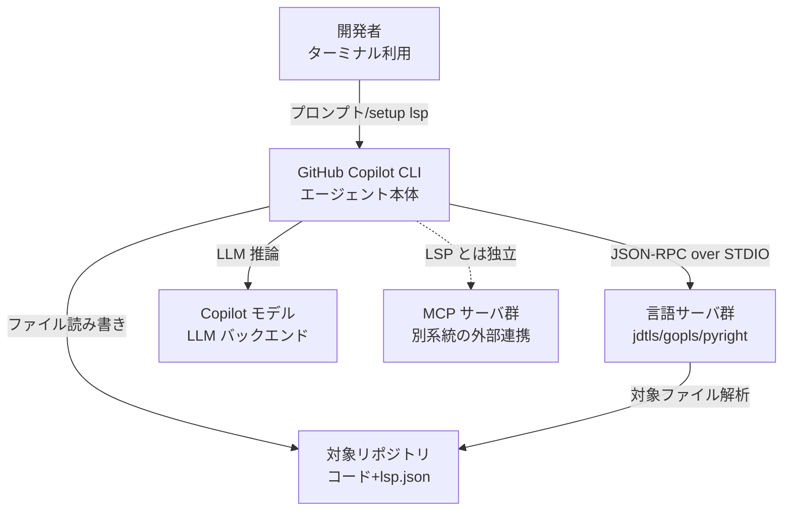
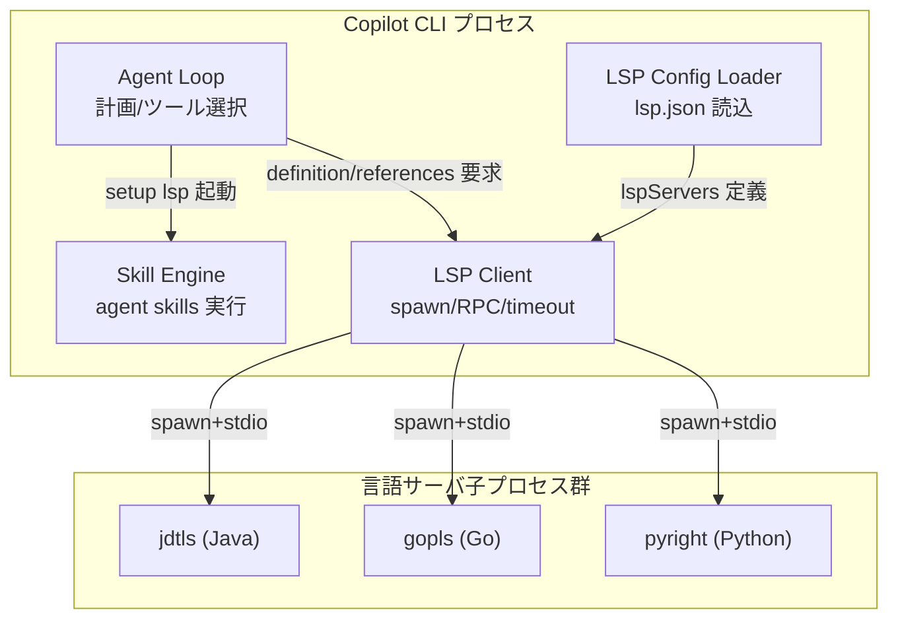
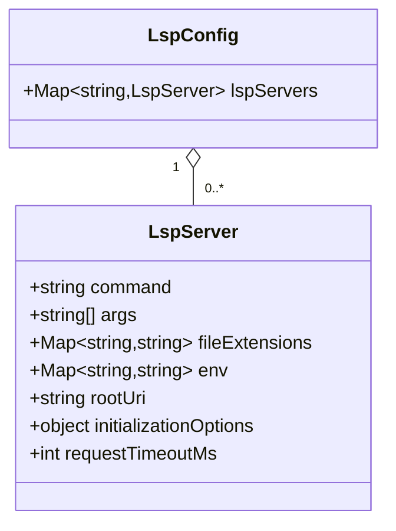
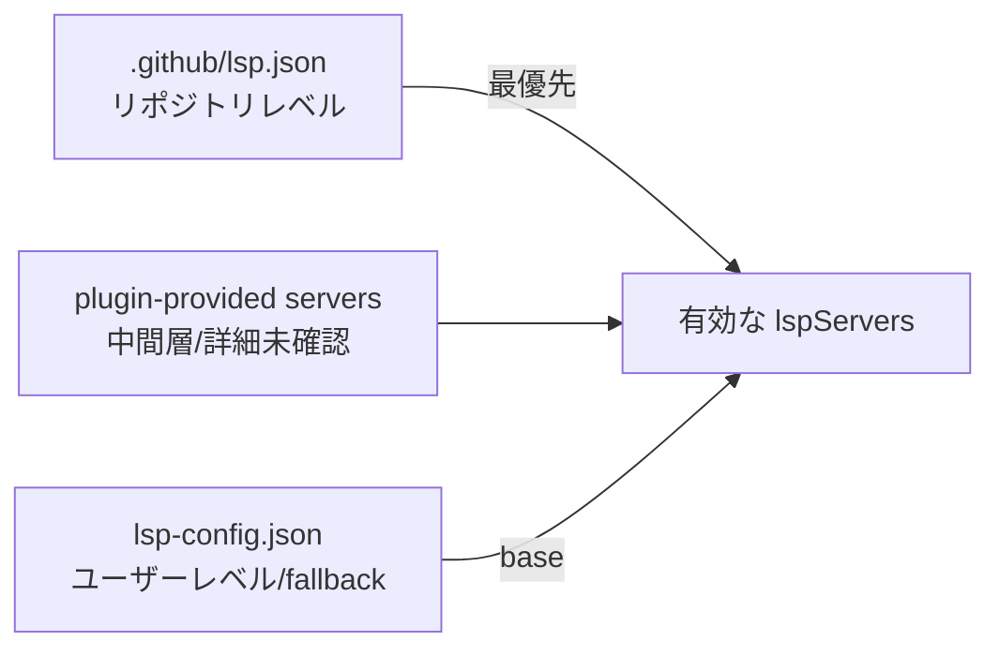
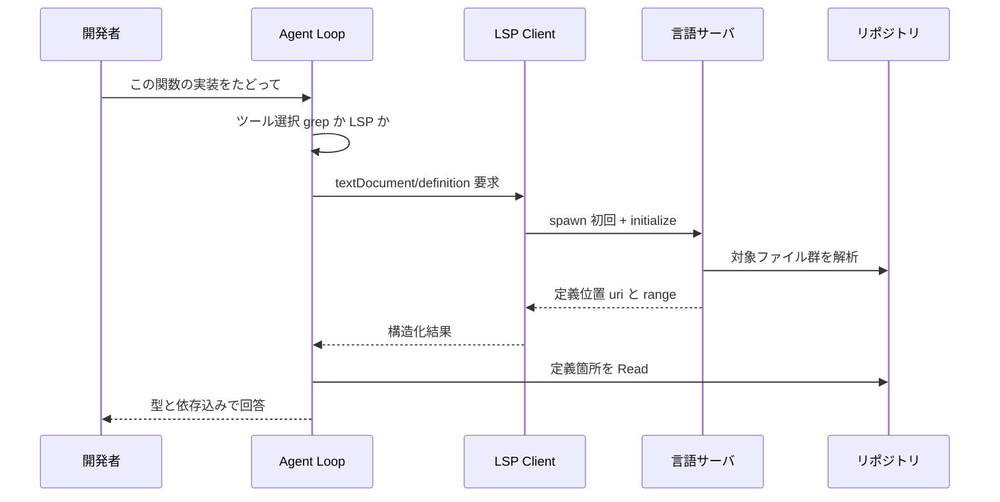
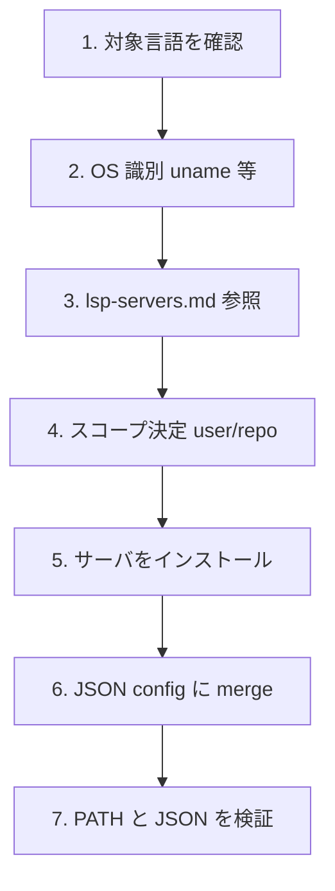

GitHub Copilot CLI が 2026 年 6 月 10 日に Language Server Protocol（LSP）連携を追加しました。この記事では、CLI 型のコーディングエージェントが「コードベースの理解」をどう変えようとしているのかを、構造・データ・構築・利用・運用の観点から整理します。

> 検証日: 2026-06-11 / 対象: GitHub Copilot CLI（GA 2026-02-25）+ LSP 連携（2026-06-10 公開）

## この調査の射程

CLI 型コーディングエージェントは、これまでコードベースの理解をおおむね「テキスト探索」に頼ってきました。`grep` や `ripgrep` でファイルを横断し、文字列の一致からコードの構造を推測する方式です。

今回の LSP 連携は、この理解の仕方を「セマンティックな問い合わせ」へ移します。定義へのジャンプ、参照の検索、型の解決、hover によるドキュメント取得といった、IDE で当たり前に使える操作をエージェントが自動的に使えるようにするものです。

本記事では、この仕組みを実装エンジニアが自チームのエージェント基盤に取り込む判断に使えるレベルまで具体化します。

## 概要

GitHub Copilot CLI は、ターミナル上で動くエージェント型のコーディングツールです。public preview が 2025 年 9 月に始まり、GA（一般提供）は 2026 年 2 月 25 日です。そして 2026 年 6 月 10 日に LSP 連携が追加されました。

中核にあるのは、CLI 本体にネイティブ統合された独立した LSP クライアントです。`lspServers` を記述した JSON 設定を読み込み、各言語サーバを STDIO 上の JSON-RPC で起動して接続します。この LSP 連携は MCP（Model Context Protocol）を経由しません。MCP は外部ツール統合の別系統として併存します。

セットアップは `github/awesome-copilot` リポジトリの `lsp-setup` skill が支援します。これは Markdown と YAML frontmatter で記述された agent skill で、言語サーバのインストールと設定生成を 7 ステップでガイドします。

この機能が解決する問題を、公式ブログは象徴的な例で説明しています。Java の API シグネチャを知るために、エージェントが「JAR ファイルを一時ディレクトリに展開し、`.class` ファイルを grep し、生のバイトコードから API シグネチャを継ぎ接ぎで推測する」という振る舞いです。LSP を使えば、generics・overload・transitive type（推移的な型）まで構造的に解決できます。

## 構造（C4 モデル）

ここからは C4 モデルの階層（Context → Container → Component）で構造を整理します。

### Context: 誰が・何と関わるか

まず全体の関係者を俯瞰します。次の図は、開発者・Copilot CLI・言語サーバ・リポジトリ・LLM・MCP の関係を表したものです。



この図から読み取れるのは、Copilot CLI が中心に立ち、LLM・言語サーバ・リポジトリの 3 方向と通信している点です。そして MCP は破線で示したとおり、LSP とは独立した別系統として存在します。

各要素の役割は次のとおりです。

| 要素 | 種別 | 役割 |
|---|---|---|
| 開発者 | Person | CLI にプロンプトを投げる。`setup lsp` で初期設定を行う |
| Copilot CLI | System | エージェントループと LSP クライアントを内蔵する |
| 言語サーバ群 | External System | LSP 仕様に準拠したサーバプロセス。14 言語に既定値を持つ |
| 対象リポジトリ | External | コード本体とチーム共有設定（`.github/lsp.json`） |
| Copilot モデル | External | LLM 推論バックエンド |
| MCP サーバ群 | External | LSP とは独立した外部ツール統合機構 |

### Container: Copilot CLI の内部

次に Copilot CLI プロセスの内部に踏み込みます。次の図は、CLI 内の主要コンポーネントと、起動される言語サーバの子プロセスの関係を表します。



ポイントは、言語サーバが Copilot CLI の子プロセスとして起動される点です。CLI はそれらを STDIO で接続し、ライフサイクル全体を管理します。

各コンテナの責務は次のとおりです。

| コンテナ | 責務 |
|---|---|
| Agent Loop | プロンプト解釈・計画・ツール（LSP / grep / edit）の選択 |
| Skill Engine | `lsp-setup` 等の agent skill を実行し、インストールと設定生成を支援する |
| LSP Config Loader | ユーザー設定とリポジトリ設定を読み、優先順位を解決する |
| LSP Client | 言語サーバの起動・JSON-RPC 通信・タイムアウト管理を担う |
| 言語サーバ | `textDocument/*` の要求に応えるセマンティック解析エンジン |

### Component: LSP クライアントの内訳

さらに LSP クライアントの内部を分解します。次の図は、リクエストの振り分けから言語サーバ起動・通信・タイムアウト管理までの構成要素を表します。


LSP クライアントが扱う主要な操作は次のとおりです。これらは公式の concept docs に基づきます。

- `textDocument/definition`（定義へのジャンプ）
- `textDocument/references`（参照の検索）
- `textDocument/hover`（型とドキュメントの取得）
- rename（シンボルの横断リネーム）
- document symbols（ファイル内のシンボル一覧）
- workspace symbol search（プロジェクト全体のシンボル検索）
- go-to-implementation（interface や abstract メソッドの実装を探す）
- call hierarchy（呼び出し関係の incoming / outgoing）

なお、Pick の問題意識には「診断（diagnostics）」が含まれていますが、ブログと concept docs の操作リストには `textDocument/publishDiagnostics` の消費が明示されていません。本記事では型・定義・参照・hover を主操作として扱い、診断の利用有無は確認できていない点として残します。

## データモデル

ここからは設定ファイルのデータ構造を見ます。

### LSP 設定スキーマ

次の図は、設定ファイルのトップレベル `lspServers` と、各サーバ定義のフィールド構成を表します。



各フィールドの意味は次の表のとおりです。`command` と `fileExtensions` が必須で、残りは任意です。

| フィールド | 必須 | 内容 |
|---|---|---|
| `command` | はい | LSP サーバを起動するコマンド（バイナリ名または絶対パス） |
| `args` | いいえ | コマンドに渡す引数（例: `--stdio`） |
| `fileExtensions` | はい | 拡張子（先頭ドット付き）から language ID へのマップ |
| `env` | いいえ | 環境変数。`${VAR}` 展開をサポート |
| `rootUri` | いいえ | root ディレクトリ（Git root からの相対、既定は `.`） |
| `initializationOptions` | いいえ | サーバ起動時に送るカスタムオプション |
| `requestTimeoutMs` | いいえ | リクエストのタイムアウト（ミリ秒、既定は 90000） |

サーバ名には一意な名前を付けます。使用できる文字は英数字・アンダースコア・ハイフンのみです。

### 設定の優先順位

設定はユーザーレベルとリポジトリレベルの 2 か所に書けます。次の図は、両者が存在するときの優先順位を表します。



公式ブログは「Repository-level configuration takes precedence when both exist（両方が存在する場合はリポジトリレベルが優先される）」と明言しています。ユーザーレベルは `~/.copilot/lsp-config.json`、リポジトリレベルは `.github/lsp.json` です。

この優先順位には実務上の意味があります。チーム共有の設定をリポジトリにコミットしておけば、エージェントの「コード理解の前提」を組織標準として固定できます。

### 設定例（Java）

次は公式ブログに掲載されている Java の設定例です。

```json
{
  "lspServers": {
    "java": {
      "command": "jdtls",
      "args": [],
      "fileExtensions": { ".java": "java" }
    }
  }
}
```

### 14 言語の既定サーバ

`lsp-setup` skill は 14 言語に対して、既定の言語サーバとインストール手順を用意しています。`command` の値がそのまま `lspServers.<name>.command` に入ります。

| 言語 | サーバコマンド | インストール例 |
|---|---|---|
| TypeScript / JavaScript | `typescript-language-server` | `npm i -g typescript typescript-language-server` |
| Java | `jdtls` | `brew install jdtls` |
| Python | `pyright-langserver` | `npm i -g pyright` / `pip install pyright` |
| Go | `gopls` | `go install golang.org/x/tools/gopls@latest` |
| Rust | `rust-analyzer` | `rustup component add rust-analyzer` |
| C / C++ | `clangd` | `brew install llvm` / `apt install clangd` |
| C# | `dotnet` 系（要 .NET SDK） | .NET SDK の導入（起動引数は未確認） |
| Ruby | `solargraph` | `gem install solargraph` |
| PHP | `intelephense` | `npm i -g intelephense` |
| Kotlin | `kotlin-language-server` | `brew install kotlin-language-server` |
| Swift | `sourcekit-lsp` | Xcode / Swift toolchain に同梱 |
| Lua | `lua-language-server` | `brew install lua-language-server` |
| YAML | `yaml-language-server` | `npm i -g yaml-language-server` |
| Bash | `bash-language-server` | `npm i -g bash-language-server` |

## データフロー（利用時のシーケンス）

エージェントが実際に LSP を使う流れを見ます。次の図は、開発者の依頼から定義位置の取得・回答までのシーケンスを表します。



この流れで注意したいのは、初回の起動（spawn）と `initialize` のコストです。大規模なリポジトリでは初期化に分単位の時間がかかる事例があります（後述します）。2 回目以降は常駐したサーバへの問い合わせになるため、コストは下がります。

## 構築（セットアップ手順）

ここからは実際の導入手順です。

### lsp-setup skill の導入

導入は次の流れです。

1. `github/awesome-copilot` のダウンロードサイトを「lsp」でフィルタし、`lsp-setup` skill を取得する
2. 展開して `~/.copilot/skills/`（ユーザー）または `.github/skills/`（プロジェクト）へ配置する
3. Copilot CLI を起動するか `/skills reload` を実行する
4. プロンプト `setup lsp` を実行する

### skill が踏む 7 ステップ

`setup lsp` を実行すると、skill は次の 7 ステップを順に進めます。



最後のステップで、バイナリが `$PATH` から到達できるかと、JSON 構文の妥当性を検証します。設定の merge は既存エントリを保持したまま行われます。

### 前提条件

導入にあたっての前提は次の 3 点です。

- 言語サーバのバイナリが `$PATH` 上にあること（または `command` に絶対パスを指定すること）
- 多くのサーバは `args` に `--stdio` が必要なこと（JSON-RPC over STDIO のため）
- 信頼できるソースの言語サーバのみを導入すること（公式ドキュメントの注意）

## 利用（運用コマンドと挙動）

設定後は、次のスラッシュコマンドで状態を確認・操作できます。

| コマンド | 機能 |
|---|---|
| `/lsp` または `/lsp show` | 設定済みの全サーバの状態を表示する |
| `/lsp test <name>` | サーバの起動テスト（一時インスタンスで成否を確認する） |
| `/lsp reload` | ディスクから LSP 設定を再読込する |
| `/lsp help` | コマンドのヘルプを表示する |

重要なのは、LSP サーバが設定されていれば、エージェントは明示的な要求なしに自動でそれを使う点です。利用者が「LSP を使って」と指示する必要はありません。

grep との関係は「置換」ではなく「段階的な escalation」です。ライブな grep を背骨として使いつつ、型解決や横断的な参照が必要になったときに LSP へ上げる、という使い分けになります。

## 運用上の論点と限界

LSP 連携は万能ではありません。採用の判断に効く論点を整理します。

### grep ベースと LSP ベースの比較

次の表は、両者の特性を対比したものです。

| 観点 | grep / ripgrep | LSP |
|---|---|---|
| 精度 | recall が高い / precision が低い | precision が高い（型・スコープ解決） |
| 設定 | ゼロ設定 | サーバ導入・初期化が必要 |
| 鮮度 | 常に最新 | 初期化後に最新 |
| 型 / 依存解決 | 不可 | サードパーティ定義や推移的な型まで |
| コスト | 軽量 | 起動・メモリ・初期化が重い |

### 反証と限界

採用判断のために、LSP の優位を弱める側のエビデンスも見ておきます。

第一に、LSP を載せても活用されない、あるいは逆効果になるケースがあります。LSP 拡張版のエージェントで、標準と比べてコンテキスト消費が約 8.5% 増えたうえで性能向上がゼロだった、という探索的な報告があります（この数値は二次情報で、一次の PDF にアクセスできず再検証が必要です）。定義や参照を引きすぎるとトークンを浪費する側面があります。

第二に、言語サーバ自体の実運用コストです。一次情報の GitHub Issue では、次のような事例が報告されています。

- `golang/go#69523`（open）: 2 万パッケージ規模のモノレポで gopls の初期化に 3 分 26 秒かかる
- `hashicorp/terraform-ls#1946`（open）: 保存時に 600% の CPU を使い、7〜8 分ハングする
- `github/copilot-language-server-release#35`（open）: メモリを 1GB 消費する

第三に、動的型付け言語や DSL では旨味が減ります。Python や JavaScript は型情報が薄く、定義ジャンプの精度が落ちて grep との差が縮みます。良質な言語サーバがない言語（14 言語の枠外）では、設定の負担に見合わないこともあります。

第四に、`lsp-setup` skill 固有の摩擦です。サーバの手動インストール、`$PATH` への依存、リポジトリごとの設定が必要で、設定が欠けるとサーバが起動しません。

一方で、見つからなかった反証もあります。これは結論の頑健性を確認する意味で重要です。LSP 連携に起因する確定した CVE は NVD / MITRE で確認できませんでした。また「精度で grep が LSP に明確に勝つ」直接のベンチマークもありませんでした。つまり反証は「LSP 優位の全否定」ではなく、「大規模リポジトリ・動的型付け・設定負担という条件下での限定」にとどまります。

### 観測（ログ設計の宿題）

「LSP の状態・診断・生成物をエージェントの実行ログに残せばレビューの根拠になる」という発想は有効です。ただし現状、ツール側にそのための標準的な機構はありません。ログ設計は利用側で補う必要がある課題として残ります。

## エコシステム上の位置づけ

「エージェントに LSP を渡す」実装は、大きく 2 系統に分かれます。

ひとつは内蔵型です。Copilot CLI は LSP クライアントを CLI 本体に統合し、MCP を介さず直接 JSON-RPC / STDIO で通信します。設定が `lsp.json` に閉じるため、配布が容易です。

もうひとつは MCP 外付け型です。`oraios/serena` は LSP を MCP サーバとして公開し、任意の MCP 対応エージェントへ横展開します（star は約 25k、2026 年 6 月時点の概数で、正確な値は要再確認です）。OpenAI Codex CLI も LSP を MCP の用途として外付けします。

標準化の地図は、次の三層で整理できます。

- MCP: 運び手（transport）
- LSP: 意味の口（semantic interface）
- コードインデックス（tree-sitter・embeddings・SCIP）: 事前知識

Copilot の今回の一手は、この三層のうち「意味の口」を CLI に内蔵した位置づけになります。

## 実装者への示唆

最後に、自チームへの取り込みを考える際の示唆を 3 点挙げます。

第一に、AsIs 情報の標準化です。`.github/lsp.json` をリポジトリにコミットすれば、エージェントのコード理解の前提をチーム全員で固定できます。これは「ドキュメント丸投げ」をやめて、セマンティックな層を共有資産にする第一歩です。

第二に、escalation の設計です。grep を捨てるのではなく、「ライブな grep → 構造（tree-sitter）→ LSP / 型解決」という段階を設計に組み込みます。LSP は安くないため、常用ではなく必要なときに上げる、という運用が現実的です。

第三に、観測の自前補完です。LSP の問い合わせ結果をエージェントのログに残す機構は未整備なので、レビューの根拠として使いたい場合は利用側で設計する必要があります。

## まとめ

GitHub Copilot CLI の LSP 連携は、CLI エージェントのコード理解を「テキスト探索」から「セマンティックな問い合わせ」へ引き上げる一手で、`.github/lsp.json` によってチームの理解前提を標準化できる点に実務的な価値があります。一方で言語サーバの初期化コストや動的型付け言語での効きづらさといった限界もあり、grep を置き換えるのではなく必要なときに上げる escalation として設計するのが現実的です。

この記事が少しでも参考になった、あるいは改善点などがあれば、ぜひリアクションやコメント、SNSでのシェアをいただけると励みになります！

## 参考リンク

### 公式ドキュメント・ブログ

- [Give GitHub Copilot CLI real code intelligence with language servers](https://github.blog/ai-and-ml/github-copilot/give-github-copilot-cli-real-code-intelligence-with-language-servers/)
- [Adding LSP servers for GitHub Copilot CLI](https://docs.github.com/en/copilot/how-tos/copilot-cli/set-up-copilot-cli/add-lsp-servers)
- [Using LSP servers with GitHub Copilot CLI](https://docs.github.com/en/copilot/concepts/agents/copilot-cli/lsp-servers)
- [GitHub Copilot CLI is now generally available](https://github.blog/changelog/2026-02-25-github-copilot-cli-is-now-generally-available/)

### GitHub リポジトリ・Issue

- [github/awesome-copilot - lsp-setup skill](https://github.com/github/awesome-copilot/blob/main/skills/lsp-setup/SKILL.md)
- [oraios/serena](https://github.com/oraios/serena)
- [golang/go #69523](https://github.com/golang/go/issues/69523)
- [hashicorp/terraform-ls #1946](https://github.com/hashicorp/terraform-ls/issues/1946)
- [github/copilot-language-server-release #35](https://github.com/github/copilot-language-server-release/issues/35)
