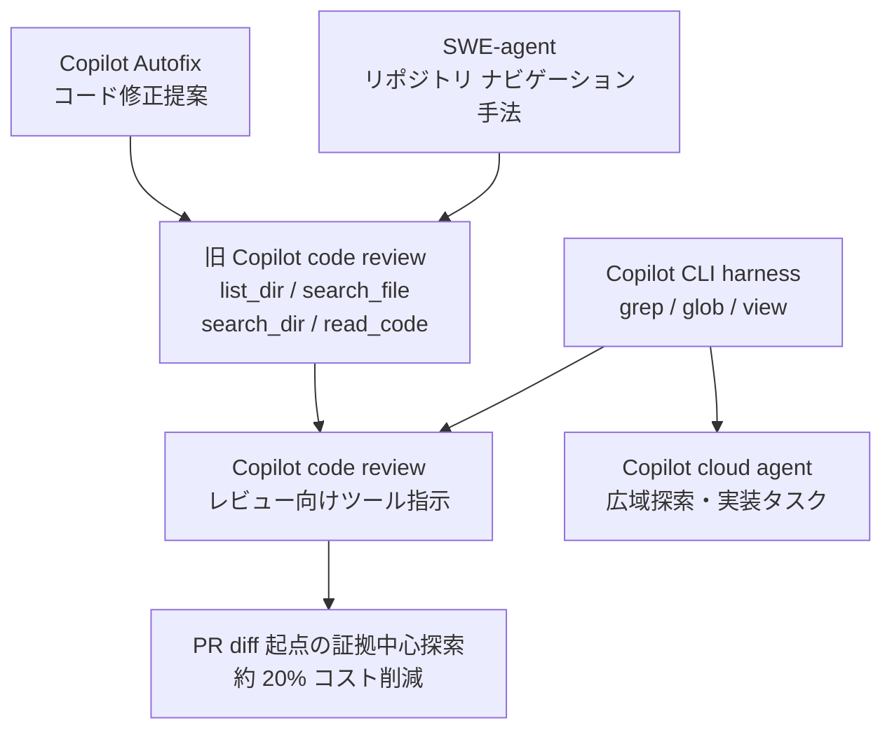
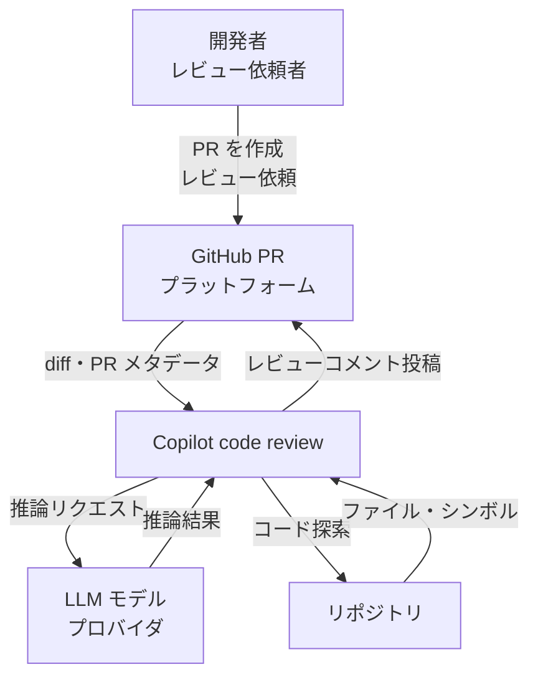
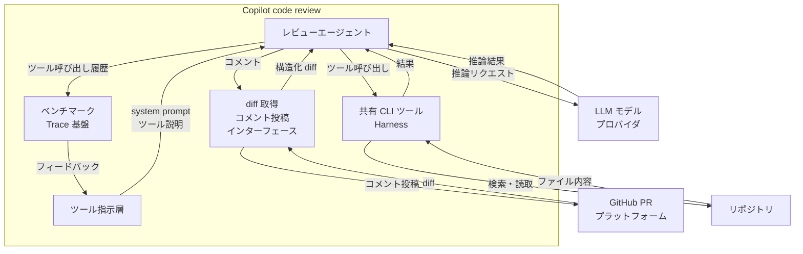
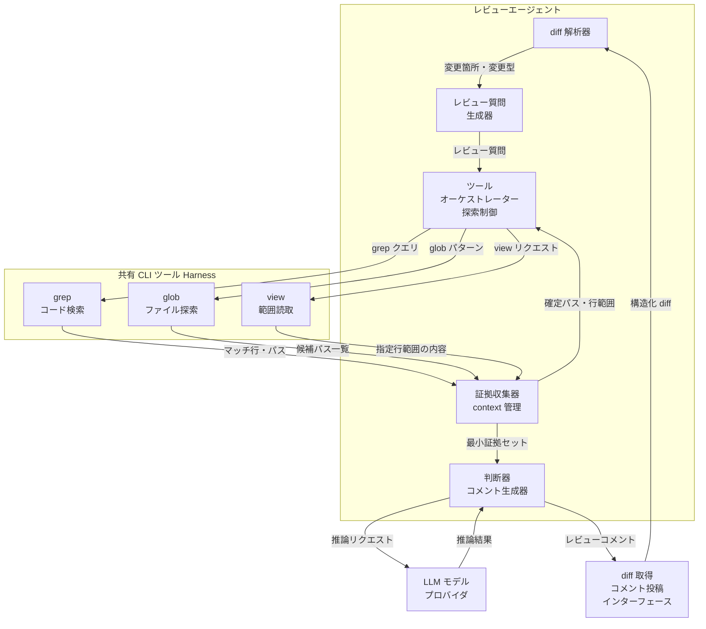
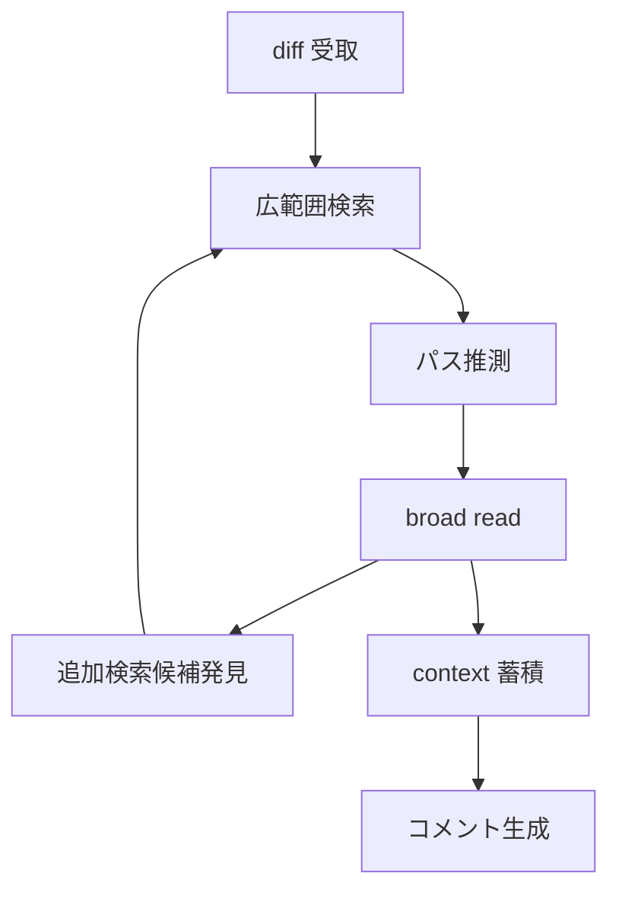
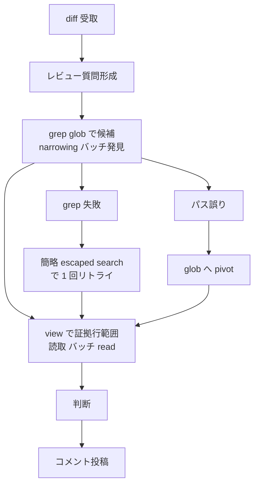
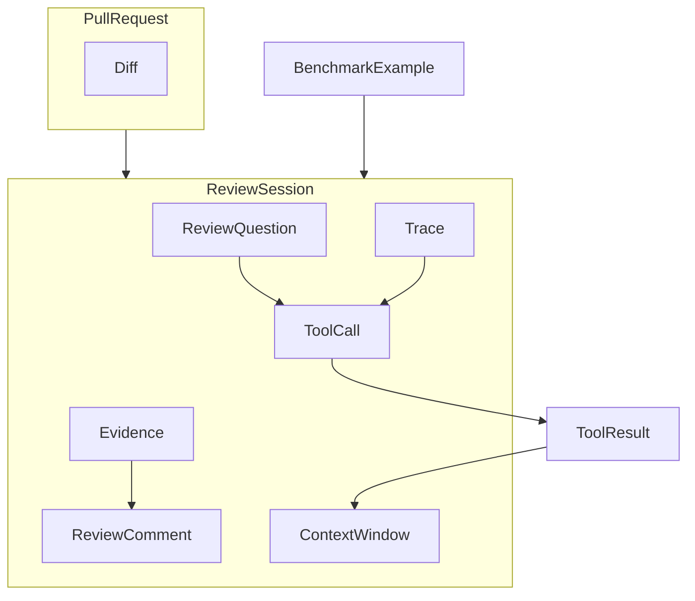
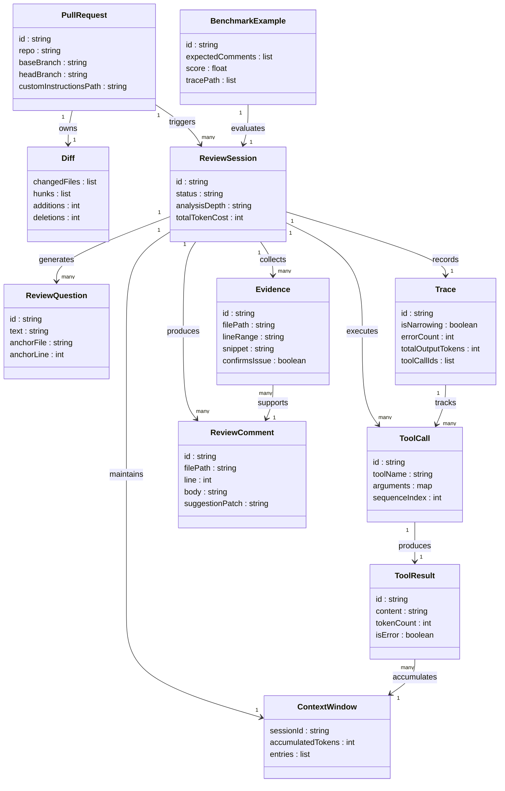
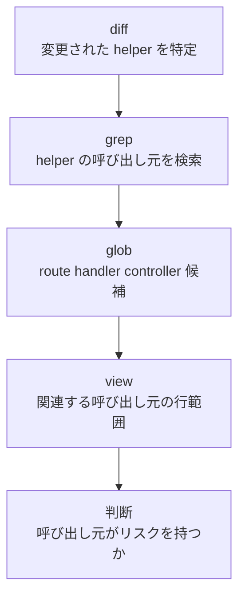
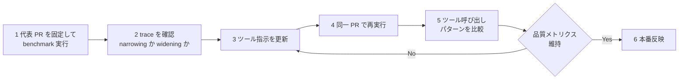

> 検証日: 2026-07-11 / 一次ソース: GitHub Blog（2026 年 7 月公開）・GitHub Changelog（2026-06-25）・GitHub Docs（code review / cloud agent / custom instructions）

エージェントに良いツールを渡せば、良い仕事をするはずだ。直感はそう告げます。しかし GitHub が Copilot code review の探索ツールを Copilot CLI 共有ツール（grep / glob / view）へ置き換えたとき、レビューコストは増え、検出できる問題は減りました。

この記事はツールの機能紹介ではありません。**回帰の原因がツールではなくツール指示（tool descriptions）にあった**という一点を軸に、レビューエージェントの構造・データ・運用を一次ソースから読み解きます。エージェント型のコードレビューや自律実行基盤を設計する実装エンジニアに向けて、diff 起点の証拠中心探索をどう指示へ落とすか、そしてなぜ同じツールでも仕事が違えば指示を変えるべきかまで扱います。

## 概要

GitHub Copilot code review は、Pull Request（PR）の diff を起点にコードを探索し、出荷前に問題のある変更を見つけてフィードバックするエージェント型レビューサービスです。

GitHub は Copilot code review の内部コード探索ツールを、**Copilot CLI 共有ハーネス**の `grep` / `glob` / `view` へ統合移行しました。目的はツール実装の重複排除と、Copilot 製品群全体への改善の横展開でした。しかし移行当初、オフラインベンチマークでレビューコストが増加し、有用コメント数が減少する回帰が生じました。

調査の結果、**原因はツールではなくツール指示（tool descriptions / instructions）** でした。CLI 向けの汎用ツール指示が、コーディングアシスタント的な「リポジトリ全体を広く探索する」ワークフローを誘発したためです。ツール指示をコードレビュー向け（diff 起点・narrow first・証拠中心）に書き直した結果、本番環境で **平均レビューコスト約 20% 削減**を達成しつつ、出荷をブロックするレビュー品質の低下シグナルは観測されませんでした。

この再設計は、「同じツールでも、仕事に合った指示とベンチマークがなければスケールしない」という原理を実証した事例です。ツール記述やシステム指示は、LLM にとって API ドキュメントに近い役割を持ちます。曖昧な記述は、曖昧な API ドキュメントが人間を混乱させるのと同じように、エージェントのコスト・品質・調査の形を変えます。

### 関連技術との関係



| 要素名 | 説明 |
|---|---|
| Copilot CLI harness | grep・glob・view の共有実装元。Copilot 複数製品が利用する共通基盤 |
| Copilot cloud agent | 同じ CLI ツール群を使うが、ツール指示はリポジトリ全体の広域調査・実装タスク向け。code review とは目的が異なる |
| Copilot Autofix | 旧ツール（list_dir・search_file 等）の設計に影響を与えたコード修正エージェント |
| SWE-agent | 旧ツールのリポジトリナビゲーション設計の源流の一つ。広域探索を前提とした先行研究 |

### 他の AI コードレビュー製品との比較

| 製品 | 探索方式 | diff 起点 | ツール指示の設計思想 | コスト最適化 | 対応プラットフォーム |
|---|---|---|---|---|---|
| GitHub Copilot code review | grep→glob→view の narrow-first 証拠探索。batch discovery 後に focused read | PR diff が唯一のアンカー | レビュー専用。探索幅を最小化し context 増加を抑制 | ツール指示の再設計で約 20% コスト削減を実証 | GitHub.com |
| CodeRabbit | 並列マルチエージェント。静的解析ツールとの融合。リポジトリ clone + sandbox 実行 | PR / diff ベース | 広域コンテキスト収集を前提とした多次元分析 | 並列化による高スループット | GitHub / GitLab / Bitbucket |
| Qodo Merge（旧 PR-Agent） | diff + クロスファイル分析。スキルエージェントのモジュラー構成 | PR ベース | 複数サブエージェントがバグ・スタイル・セキュリティを分担 | カスタムルールでスコープ絞り込み可能 | GitHub / GitLab / Bitbucket |
| Graphite Reviewer | diff スレッド中心。自動コメント + マージキュー管理 | diff スレッド | ワークフロー自動化重視 | バッチマージ・diff サイジング | GitHub |
| Cursor Bugbot | IDE 統合。編集時のリアルタイム diff 解析 | エディタ内 live diff | 編集中の即時フィードバック。局所分析 | ローカル実行でラウンドトリップ削減 | VS Code / Cursor |

> 比較列の一部（他製品のツール指示設計・コスト削減値）は公式に数値公開がないため、公開情報に基づく傾向として記載します。断定はしません。

#### ユースケース別推奨

| ユースケース | 推奨 | 理由 |
|---|---|---|
| GitHub 上の標準 PR レビュー効率化 | Copilot code review | diff 起点の証拠中心探索で低コスト・品質維持 |
| 多言語・多サービスの大規模リポジトリ | CodeRabbit | 静的解析との並列融合でカバレッジ重視 |
| OSS / セルフホスト重視 | Qodo Merge | OSS で YAML による細かい制御が可能 |
| エディタ内リアルタイムフィードバック | Cursor Bugbot | コーディング中に即時確認 |

## 特徴

- **diff-anchored（diff 起点）**: PR の diff を唯一のアンカーとし、diff に紐づかない探索を避けます。
- **narrow-first（絞り込み優先）**: `grep` と `glob` で候補を絞ってから `view` でファイルを読みます。広読みを避けます。
- **証拠中心（evidence-centric）**: 「レビュー上の問いに答える最小の近傍証拠だけを収集する」という思想で探索を設計します。
- **batch discovery**: 独立した検索を先にまとめて実行し、検索と読み込みの交互呼び出しを避けます。
- **trace ベース debug**: 内部ベンチマークがスコアだけでなくツール呼び出しトレースを可視化し、ループ型の挙動を検出してツール指示の改善サイクルを回します。
- **共有ツール + 製品別指示**: `grep` / `glob` / `view` は Copilot CLI ハーネスと共有します。ツール実装ではなくツール指示を製品ごとに最適化することでスケールします。
- **約 20% コスト削減**: ツール変更ではなくツール指示の再設計だけで達成し、本番のオンライン評価でも確認済みです。

## 構造

### システムコンテキスト図



#### 要素説明

| 要素名 | 説明 |
|---|---|
| 開発者 レビュー依頼者 | Pull Request を作成し Copilot code review を起動するアクター |
| GitHub PR プラットフォーム | diff の提供とレビューコメントの受け取りを担う外部システム |
| Copilot code review | diff を起点にコードを探索し問題を検出するレビューエージェントシステム |
| LLM モデルプロバイダ | 推論・コメント生成を担う外部 AI サービス |
| リポジトリ | 探索対象のソースコードを保持する外部ストレージ |

### コンテナ図



#### サブグラフ: Copilot code review

| 要素名 | 説明 |
|---|---|
| レビューエージェント | diff を起点にツールを呼び出し証拠を収集してコメントを生成する中核コンポーネント |
| 共有 CLI ツール Harness | grep・glob・view を提供する Copilot CLI と共有のツール実行基盤 |
| ツール指示層 | system prompt とツール説明を保持しエージェントの探索姿勢を規定するコンポーネント |
| ベンチマーク Trace 基盤 | ツール呼び出し履歴・コスト・エラー・探索方向を記録し品質改善ループを支える基盤 |
| diff 取得 コメント投稿インターフェース | PR プラットフォームとの入出力を仲介するインターフェース |

### コンポーネント図



#### サブグラフ: レビューエージェント

| 要素名 | 説明 |
|---|---|
| diff 解析器 | PR の diff を解析し変更箇所・変更型を抽出する |
| レビュー質問生成器 | 変更箇所ごとに「この関数の呼び出し元は」等の具体的な調査質問を生成する |
| ツールオーケストレーター 探索制御 | レビュー質問に基づきツール呼び出し順序を制御し narrowing を維持する |
| 証拠収集器 context 管理 | ツール結果を蓄積し context window のトークンコストを管理する |
| 判断器 コメント生成器 | 最小証拠セットを根拠に問題の有無を判断しコメントを生成する |

#### サブグラフ: 共有 CLI ツール Harness

| 要素名 | 説明 |
|---|---|
| grep コード検索 | シンボル・呼び出し箇所・パターンをテキスト検索する |
| glob ファイル探索 | パスが不確かな場合にパターンで候補ファイルを発見する |
| view 範囲読取 | 確定したファイルパスと行範囲のみを読み取り broad read を避ける |

### 探索フローの状態遷移（Before / After）

移行直後の回帰は、同じツールを使いながら探索の「形」が変わったことに起因します。旧挙動（browsing loop）と新挙動（review-shaped flow）を状態遷移で対比します。

#### Before: browsing loop（旧挙動）



| 状態名 | 説明 |
|---|---|
| diff 受取 | PR の diff を受け取る起点 |
| 広範囲検索 | diff に直接関係しない周辺も含めた broad な検索 |
| パス推測 | 存在を確認せずにファイルパスを推測して読取を試みる |
| broad read | ファイル全体または大きな範囲を一括で読み取る |
| 追加検索候補発見 | 読取結果から新たな検索対象を見つけ探索が再拡大する |
| context 蓄積 | 不要な結果も context window に残留しトークンコストが増える |
| コメント生成 | 過剰な context を抱えた状態でコメントを生成する |

#### After: review-shaped flow（新挙動）



| 状態名 | 説明 |
|---|---|
| diff 受取 | PR の diff を受け取る起点 |
| レビュー質問形成 | diff の変更箇所ごとに具体的な調査質問を形成する |
| grep glob で候補 narrowing | ファイルを読む前に grep と glob を一括実行して候補を絞る |
| view で証拠行範囲読取 | 確定した候補のみ必要な行範囲を一括で読み取る |
| grep 失敗 | grep の入力が複雑すぎてマッチしない異常系 |
| 簡略 escaped search で 1 回リトライ | エスケープを調整した単純化クエリで 1 回だけ再試行する |
| パス誤り | 指定パスが存在しない異常系 |
| glob へ pivot | パス推測を重ねる代わりに glob で正しいパスを探索し直す |
| 判断 | 最小証拠セットを根拠に問題の有無を判断する |
| コメント投稿 | 判断結果を PR にコメントとして投稿する |

### ツール指示の書換（before / after）

回帰の修正は、ツール実装ではなくツールの description・system 指示を書き換えることで実現しました。汎用の探索姿勢を、diff 起点で最小証拠に絞る姿勢へ変えます。概念を単純化した before / after を示します。

```text
Generic posture（旧: 広域探索を誘発）
  "Use the available tools to inspect repository context that may be relevant."

Review-shaped guidance（新: レビュー向け）
  "Start from the diff. Narrow first with grep and glob; read exact evidence
   with view. If grep fails to find relevant context, retry with a simpler
   escaped search. If a path is wrong, pivot to glob instead of guessing
   nearby paths."
```

grep 単体の description も、レビューの仕事に合わせて負の適用範囲（negative scope）と失敗時の回復を明示します。

```diff
- grep: "Search repository files for relevant code or symbols."
+ grep: "Search for symbols and call sites referenced in the diff. Use this
+  before opening any file. Do not search broadly for context unrelated to the
+  diff. If there are no results, retry once with a simpler escaped query."
```

文言の変更は小さくても効果は大きく、エージェントのリズムを「browse・read・search を繰り返す」から「問う・絞る・読む・判断する」へ変えました。

## データ

Copilot code review が「diff から根拠へ至る探索」を遂行する際に扱う概念エンティティを定義します。本モデルは公式 API の内部実装を断定するものではなく、起点記事の記述から導出した**概念的なモデル**です。

### 概念モデル

エンティティの所有関係を入れ子（subgraph）で、利用・呼出関係を矢印で示します。



| 要素名 | 説明 |
|---|---|
| PullRequest | Diff を所有し ReviewSession を起動する起点 |
| Diff | 変更内容。changedFiles・hunks がレビューの anchor になる |
| ReviewSession | 一回のレビュー実行単位。ReviewQuestion・ToolCall・Evidence・ReviewComment・Trace・ContextWindow を持つ |
| ReviewQuestion | diff から立てる targeted な問い |
| ToolCall | grep・glob・view の呼び出し単位。ToolResult を生成する |
| ToolResult | ToolCall の出力。ContextWindow に蓄積される |
| Evidence | 判断を確定または却下する最小近傍コード |
| ContextWindow | セッション中に蓄積されるトークンの総体 |
| ReviewComment | 最終出力のレビューコメント |
| Trace | ToolCall 列・出力量・エラー・narrowing/widening の記録 |
| BenchmarkExample | オフラインベンチマークの評価事例。ReviewSession の経路を評価する |

### 情報モデル

主要属性のみを示します。型は汎用名を使用し、多重度は文字列で表します。



#### 主要エンティティの補足

- **ToolCall と旧ツールの対応**: 移行前後のツールは次のように対応します。

| toolName | 旧ツール | 用途 |
|---|---|---|
| glob | list_dir | パスが不確実なときの候補ファイル・ディレクトリ発見 |
| grep | search_file / search_dir | テキスト・シンボル・呼び出し元の検索 |
| view | read_code | パス・範囲が既知のファイル内容の読み取り |

> Changelog（2026-06-25）は探索ツール群として `grep`・`rg`（ripgrep）・`glob`・`view` を挙げています。本記事は起点ブログの 3 ツール対応表（grep / glob / view）を主軸に説明し、`rg` は grep 系の検索実装として grep に含めて扱います。

- **ContextWindow がコストの核心**: `ToolResult` が加算されるたびに `accumulatedTokens` が増加します。コスト削減の核心は、この蓄積量の抑制にあります。旧ツールは検索・読取時に周辺コードを余分に返す設計だったため、蓄積が大きくなりがちでした。
- **Evidence は最小近傍**: 「最小近傍」という性質から、`lineRange` は可能な限り狭い範囲に留まります。
- **Trace が挙動可視化の鍵**: `isNarrowing` が false（widening）の場合は探索が拡散しており、ベンチマーク上の問題シグナルになります。
- **customInstructionsPath**: `.github/copilot-instructions.md`、またはパス指定の `.github/instructions/**/*.instructions.md` を参照します。

## 構築方法

### 前提条件

| 項目 | 内容 |
|---|---|
| 必要プラン（個人） | Copilot Pro / Pro+ / Max |
| 必要プラン（組織） | Copilot Business 以上、または Enterprise で管理者が有効化 |
| レビュー対象 | GitHub.com 上の Pull Request（draft PR も設定次第で対象） |
| レビュー結果種別 | Comment のみ（Approve / Request changes は出さない） |
| マージブロック | なし（必須レビュー数にカウントされない） |

> プラン名・機能対応は変更されやすいため、導入時は公式ドキュメントで最新のプラン対応を確認してください。

### 手動レビュー依頼の前提確認

- Copilot code review は追加インストール不要です。
- プランが対象であれば、PR の Reviewers サイドバーに **Copilot** が表示されます。
- Organization の場合は、管理者が Copilot を有効化済みであることを確認します。

```text
確認手順:
1. 任意のリポジトリで Pull Request を開く
2. 右サイドバー "Reviewers" に "Copilot" が表示される → 利用可
3. 表示されない場合はプランまたは Organization 設定を確認する
```

### 自動レビューの有効化 — 個人設定

個人の Pull Request に対して自動レビューを有効化します。

```text
手順:
1. 画面右上のプロフィール画像 → "Your Copilot" / "Copilot settings" を開く
2. "Automatic Copilot code review" のドロップダウンを開く
3. "Enabled" を選択する
```

### 自動レビューの有効化 — リポジトリ Ruleset

PR 作成時に Copilot が自動でレビューを開始するよう、Branch Ruleset で設定します。

```text
手順（リポジトリ単位）:
1. リポジトリ → Settings → Rules → Rulesets
2. "New ruleset" → "New branch ruleset" を選択
3. "Ruleset Name" に任意の名前を入力
4. "Enforcement Status" を "Active" に設定
5. "Target branches" で対象ブランチを追加（例: Include default branch）
6. "Branch rules" の "Automatically request Copilot code review" を選択（サブオプションが展開される）
7. 必要に応じてサブオプションを選択
   - "Review new pushes": PR へのプッシュごとに再レビューする（未選択なら初回のみ）
   - "Review draft pull requests": Draft PR もレビューする
8. "Create" をクリック
```

### 自動レビューの有効化 — Organization Ruleset

Organization 配下の複数リポジトリに一括適用します。

```text
手順（Organization 単位）:
1. 右上アイコン → Your organizations → 対象 Org → Settings
2. サイドバー "Repository" → "Rulesets"
3. "New ruleset" → "New branch ruleset" を選択
4. "Target repositories" でパターンを指定
5. "Target branches" / "Branch rules" はリポジトリ単位と同様に設定
6. "Create" をクリック
```

### レビュー深度（analysis depth）の設定

Copilot code review はレビューの分析深度を設定できます。標準（デフォルト）に加えて、複雑なロジックやクロスサービス変更を深く分析する **Medium** が public preview として提供されています（2026-06-25 changelog 時点）。

- Medium 実行は PR の overview コメントに `Medium` として明示される。
- Organization は未設定リポジトリ向けのデフォルトレビュー深度を設定でき、各リポジトリは個別に上書きできる。
- Medium は追加のモデル処理とランナー時間を消費するため、コストと品質のトレードオフで選ぶ。

### カスタムインストラクション（コーディングガイドライン）の配置

Copilot のレビュー挙動を調整するファイルを 2 種類置けます。リポジトリ全体向けとパス別です。

#### リポジトリ全体に適用

```bash
mkdir -p .github
touch .github/copilot-instructions.md
```

```markdown
# .github/copilot-instructions.md の記述例

When performing a code review, respond in Japanese.

When performing a code review, apply the checks in the /security/security-checklist.md file.

When performing a code review, focus on readability and avoid deeply nested ternary operators.
```

> Copilot はベースブランチ（`main` 等）の指示ファイルを参照します。feature ブランチへの追加だけでは反映されない点に注意します。

#### パス別インストラクション

特定ファイル群にのみ適用したい場合は、`.github/instructions/` 配下に `*.instructions.md` を置きます。

```markdown
---
applyTo: "src/api/**/*.ts,src/models/**/*.ts"
---

When reviewing TypeScript files in src/api or src/models,
enforce strict null checks and avoid the any type.
```

| ファイルパス | 適用範囲 |
|---|---|
| `.github/copilot-instructions.md` | リポジトリ全体 |
| `.github/instructions/**/*.instructions.md` | frontmatter の applyTo glob に一致するパス |

## 利用方法

### 主要操作の早見

| 操作 | 方法 |
|---|---|
| 手動レビュー依頼 | Reviewers サイドバーで Copilot に Request |
| 再レビュー依頼 | Copilot 名の横の Re-request review |
| 提案を適用 | コメント内の "Commit suggestion" |
| コメント解決 | "Resolve conversation" |
| フィードバック | コメントの 👍 / 👎 |

### 手動でレビューを依頼する

PR 作成後、Reviewers サイドバーから Copilot にレビューを依頼します。

```text
手順:
1. GitHub.com で Pull Request を開く（新規作成 or 既存）
2. 右サイドバー "Reviewers" → Copilot の横の "Request" をクリック
3. 数十秒以内にコメントが投稿される
```

REST API でリクエストする場合は、レビュアーに Copilot のレビュアー bot を指定します。

```bash
# REST API でレビュアーを追加する例
gh api \
  --method POST \
  -H "Accept: application/vnd.github+json" \
  /repos/{owner}/{repo}/pulls/{pull_number}/requested_reviewers \
  -f "reviewers[]=copilot-pull-request-reviewer[bot]"
```

### 再レビューを依頼する

新しいプッシュ後に手動で再レビューを依頼します。

```text
手順:
1. Reviewers の Copilot 名の横にある Re-request review ボタンをクリック
```

> 再レビュー時は、resolve 済みや 👎 済みのコメントが再度表示される場合があります。

### コメントへの対応

Copilot のコメントは通常のレビューコメントと同じ操作が可能です。

| 操作 | 方法 |
|---|---|
| 提案を適用（1 件） | コメント内の "Commit suggestion" をクリック |
| 提案を適用（複数） | "Add suggestion to batch" → "Commit suggestions" |
| コメントを解決 | "Resolve conversation" をクリック |
| フィードバックを送る | 👍 / 👎 ボタンをクリック |

### エージェント構築者向け: レビュー向けツール指示テンプレ

Copilot code review の設計原則は、自作のレビューエージェントにも移植できます。以下の 5 ステップ workflow をシステムプロンプトに組み込みます。

```text
You are a code reviewer. Follow the workflow below exactly.

## 探索フロー（5 ステップ）
1. [diff 起点] diff から変更箇所を特定し、具体的なレビュー質問を立てる。
   例: "この関数の呼び出し元は旧挙動に依存していないか"
2. [絞り込み] path が不確実なら glob。候補 file・symbol・呼び出し元は grep。
3. [batch discovery] ファイルを読む前に、安価な discovery（glob/grep）をまとめて実行する。
4. [focused read] ファイルパスと行範囲が確定してから view を呼ぶ。ファイル全体を読まない。
5. [batch read] search と read を交互にせず、複数の focused read をまとめて実行する。

## 失敗時の回復
- grep が失敗した場合: クエリを単純化して 1 回だけ再試行する。
- path が誤りの場合: 近傍推測でなく glob へ pivot する。
```

例として、認可ヘルパー（authorization helper）を変更した diff を考えます。適切なレビュー質問は「この helper を呼ぶすべてのファイル全体を見せて」ではなく、「旧挙動に依存する request 処理の呼び出し元はあるか」という狭い問いです。意図する探索パスは短く保ちます。



```text
## 禁止事項
- diff と無関係なファイルを広く読まない。
- 1 tool 呼び出しごとに次の tool を決めるループを組まない。
- grep 失敗時に連続して別パスを試みる探索ループを組まない。
```

> 設計根拠: Copilot code review 自体がこの原則を採用し、コスト約 20% 削減・品質維持を達成しました（2026-06-25 changelog）。

## 運用

### レビューコスト / 品質メトリクスの監視

Copilot code review のコストは、モデルのトークン処理と、agentic な処理に使うランナー時間の観点で発生します。監視すべき観点を示します。

| 観点 | 指標 | 確認場所 |
|---|---|---|
| レビューコスト | AI 消費量（PR 単位 / 月次合計） | 組織の Copilot 利用状況・請求ダッシュボード |
| ランナー使用量 | Actions 分（分析深度別） | GitHub Actions 使用状況 |
| レビュー品質 | 有用コメント数・👍 / 👎 比率 | PR タイムライン + 開発者フィードバック |
| ベースライン比較 | チューニング前後の差分（control 比） | 内部ベンチマークログ |
| アラート条件 | コスト急増 / 有用コメント急減 | 監視ツール・通知 |

### benchmark と trace を使った反復チューニング

Copilot code review の内部ベンチマークは、最終スコアだけでなく **trace**（どのツールを呼んだか・出力量・エラー発生箇所・narrowing か widening か）を可視化します。この trace を feedback loop の中心に据えると、ツール指示の変更がどの挙動を変えたかを具体的に確認できます。



trace レビューで問うべき具体的な問いを列挙します。

```text
□ narrow first だったか（grep/glob で絞ってから view を呼んでいるか）
□ independent な検索を batch したか（並列可能な grep を 1 本ずつ呼んでいないか）
□ view に理由があったか（パスと行範囲を特定した上で view を呼んでいるか）
□ tool error が減ったか、それとも別の場所に移っただけか
□ trace が diff の証拠に focus し続けたか
□ 品質メトリクスは維持されているか
```

最も有用なシグナルは「指示が良くなった」ではありません。「ツール呼び出し数は同程度だが、より多くを関連する証拠に費やし、探索の再拡大が減った」という具体的な観測です。

> 注意: この benchmark と trace は GitHub 内部のツール群です。自作のレビューエージェントで同じループを回す場合は、各 ToolCall（tool 名・引数・出力トークン数・エラー有無）を自前でログ化し、trace として蓄積します。

### ツール指示の変更管理（A/B・control 比較）

ツール指示の変更は、before / after を同一 PR セットで比較して効果を定量化します。

```text
実験構成（例）
  control:   既存のツール指示（変更なし）
  treatment: 新しいツール指示（narrow-first ガイダンス追加）

  評価対象 PR セット: 代表的な PR を固定
  評価軸: tool 呼び出し総数 / 有用コメント数 / コスト
  判定基準: コスト減 かつ 品質シグナル劣化なし
```

> 参考: GitHub 社内では同様の比較で平均レビューコスト約 20% 削減を確認し、出荷をブロックする品質シグナルは観測されませんでした。この結果はオフライン評価とオンライン評価の両方で確認されています。

### 製品別に instruction を分ける

共有ツール（grep / glob / view）と製品別のツール指示は分離します。Copilot CLI と Copilot code review は同じツールを使いますが、仕事が異なるため同一の指示では最適化できません。

| 製品 | 特性 | 指示の方向性 |
|---|---|---|
| Copilot code review | diff を起点・スコープ固定 | narrow-first / diff anchor 維持 |
| Copilot CLI | 対話型・広範な探索が仕事の一部 | 広い context 収集を許容 |
| Copilot cloud agent | タスク駆動・多ターン | タスク目的に応じた柔軟な探索 |

## ベストプラクティス

### ツール指示は「仕事（job）」に合わせて設計する

```text
悪い例（汎用 coding assistant 向け）
  "Use the available tools to inspect repository context that may be relevant."

良い例（code review 向け）
  "Start from the diff. Narrow first with grep and glob; read exact evidence
   with view. Batch independent searches before opening files. Load only the
   minimum context needed to confirm or dismiss the review question."
```

review workflow の診断的問いを順に辿ります。diff で何が変わったか（問いの形成）→ 関連する呼び出し元・依存先はどこか（narrow: grep/glob）→ 必要な行範囲だけを読む（focused read: view）→ 問題の有無を判断して終了。

### tool result をコンテキストトークンとして管理する

ツール結果は、エージェントの作業コンテキストに蓄積し続けます。余分なファイル内容を読むと、後続ステップのトークン消費が増え、レビューの焦点も下がります。ツール結果は使い捨ての出力ではなく、context window に残るトークンです。証拠を絞らないと、diff から遠い無関係なコードが context に残り、モデルの判断が diff 外のコードに引きずられます（注意の希釈）。

- view の呼び出し 1 回は、context に残る追加トークンを意味する。
- 「とりあえず読む」を避け、「この行範囲を読む必要がある理由」を先に確定する。
- 大きな探索ループに入るほどコストが膨らむ。

### 安価な discovery を batch する

`grep` と `glob` は `view` より安価です。候補の絞り込みは先にまとめて行います。`grep` と `glob` の出力トークンは `view` より小さいため、発見フェーズを先にまとめると「検索 1 回の出力 ≪ 読取 1 回の出力」という非対称性を活かし、context 蓄積を最小化できます。

```text
# 悪いパターン（search → read → search → read の繰り返し）
grep "authHelper" src/
view src/middleware/auth.ts          # 全体
grep "authHelper" routes/
view routes/api.ts                   # 全体

# 良いパターン（batch search → focused read）
grep "authHelper" src/
grep "authHelper" routes/
glob "**/*auth*.ts"
view src/middleware/auth.ts:45-78    # 特定行範囲のみ
view routes/api.ts:112-130           # 特定行範囲のみ
```

### trace を第一級の観測対象にする

スコアだけでなく trace を見ることで、ツール指示の変更がどの挙動を変えたかが分かります。「指示が良くなった」という曖昧な評価ではなく、「呼び出し数は同程度だが、関連する証拠への呼び出し割合が増え、widening が減った」という具体的な観測を得ます。

### ツール記述を API ドキュメント品質で書く

ツールの description は、LLM が読む API ドキュメントと同等に扱います。曖昧な記述は、人間が曖昧な API を使うのと同じ結果を招きます。

```text
記述の品質チェックリスト
□ ツールの用途（いつ使うか）が明確か
□ 使うべきでない状況（negative scope）が書かれているか
□ 失敗時の推奨リカバリ手順が含まれているか
□ 入力パラメータの型・制約が明示されているか
□ 出力の形式・量が書かれているか
```

### 同じツール、違う仕事という guardrail を守る

同じレビュー向けの指示を Copilot CLI に当てても、同じ勝ちは出ませんでした。これは重要な反例です。Copilot CLI は diff アンカーがなく、広い探索が仕事の一部です。共有ツールは、指示とベンチマークが仕事に合ってはじめてスケールします。ツール指示を横展開する前に、対象製品の仕事の形を確認します。

## トラブルシューティング

### 症状 → 原因 → 対処

| 症状 | 推定原因 | 対処 |
|---|---|---|
| レビューコスト増加 + 有用コメント減少 | 汎用指示による browsing loop（広く探索 → パス推測 → 広く読む → さらに探索） | ツール指示をレビュー向けに書き換える（narrow-first / diff anchor 明示） |
| grep 失敗後に探索が連鎖拡大する | tool error を放置した大きな探索ループへの発展 | 「grep 失敗時は 1 回だけ簡略クエリで再試行し、path 不明なら glob に切り替える」を明記 |
| context 肥大でコメント精度が低下 | diff と無関係なファイルを全体 view している | 「diff 起点で最小の近傍行範囲だけ view する」を追加し、必要行範囲を先に grep で特定させる |
| CLI に同じ指示を適用しても効果がない | CLI は diff アンカーがなく広い探索が本来の仕事 | CLI と code review の指示を分離する |
| 再レビューで同じコメントが再出力される | dismiss 済みコメントの扱い | resolve + push 後に re-request する運用を周知する |

### browsing loop の検出と対処

trace から次のパターンを読み取ると browsing loop を見分けられます。

```text
症状の見分け方（trace を読む）
- grep → 多数の候補ファイル → view（全体） → grep → view（全体） の繰り返し
- tool 呼び出し数が多いが diff から離れたファイルが多い
- context トークン消費が diff サイズに対して不釣り合いに大きい

対処（指示例）
"When exploring context, first form a specific question from the diff.
 Use grep and glob to narrow to a few candidate files before calling view.
 Do not read a file unless you have identified the specific line range needed."
```

### grep 失敗の連鎖を止める

```text
症状
  grep が 0 件 → 別クエリで再 grep → path を推測して view →
  ファイルが無い → 近傍 path を試す → … の連鎖

対処（指示例）
"If grep returns no results, retry once with a simpler, escaped search query.
 If the path is wrong, pivot to glob rather than guessing neighboring paths.
 Do not attempt more than one retry per failed search."
```

```bash
# 失敗しがちなクエリ（特殊文字が多い）
grep -r "authHelper(ctx, opts?.token)" src/

# 単純化した再試行（指示で誘導）
grep -r "authHelper" src/
```

### context 肥大の防止

```text
症状
  diff は数十行なのに tool 呼び出しで数百行超のファイルを複数 view
  レビューコメントが diff 外のコードに言及する

対処（指示例）
"Always prefer view with explicit line ranges over reading an entire file.
 Start from the changed lines in the diff and expand only to the minimum
 surrounding context needed to answer the review question."
```

## まとめ

Copilot code review の再設計が示したのは、エージェントにとってツールの表面（description・system 指示）が実装の詳細ではなく製品体験の一部だという事実です。同じ grep / glob / view でも、汎用の探索指示は browsing loop を招き、diff 起点で最小証拠に絞る指示は平均レビューコストを約 20% 下げました。ツール記述を API ドキュメント品質で書き、trace を第一級の観測対象にし、仕事（job）に合わせて指示を分ける。これが共有ツールをスケールさせる条件です。

この記事が少しでも参考になった、あるいは改善点などがあれば、ぜひリアクションやコメント、SNSでのシェアをいただけると励みになります！

## 参考リンク

### 起点情報

- [Better tools made Copilot code review worse—here's how we actually improved it（GitHub Blog）](https://github.blog/ai-and-ml/github-copilot/better-tools-made-copilot-code-review-worse-heres-how-we-actually-improved-it/)
- [Copilot code review: analysis depth and efficiency updates（GitHub Changelog 2026-06-25）](https://github.blog/changelog/2026-06-25-copilot-code-review-analysis-depth-and-efficiency-updates/)

### 公式ドキュメント

- [Using GitHub Copilot code review（GitHub Docs）](https://docs.github.com/en/copilot/how-tos/use-copilot-agents/request-a-code-review/use-code-review)
- [Configuring automatic code review by Copilot（GitHub Docs）](https://docs.github.com/en/copilot/how-tos/copilot-on-github/set-up-copilot/configure-automatic-review)
- [Adding repository custom instructions for GitHub Copilot（GitHub Docs）](https://docs.github.com/en/copilot/how-tos/copilot-on-github/customize-copilot/add-custom-instructions/add-repository-instructions)
- [About GitHub Copilot cloud agent（GitHub Docs）](https://docs.github.com/en/copilot/concepts/agents/cloud-agent/about-cloud-agent)
- [Copilot Autofix for code scanning（GitHub Docs）](https://docs.github.com/en/code-security/concepts/code-scanning/copilot-autofix-for-code-scanning)

### 関連技術・比較

- [SWE-agent（GitHub）](https://github.com/swe-agent/swe-agent)
- [CodeRabbit ドキュメント](https://docs.coderabbit.ai/)
