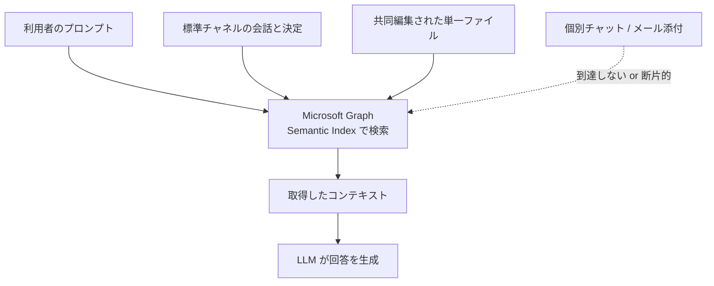
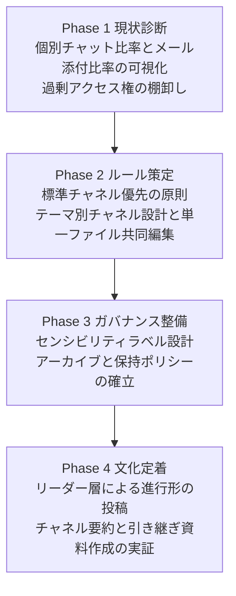

## この記事の対象と結論

Microsoft 365 Copilot を導入したのに「思ったほど使えない」と感じている組織の、導入判断をする側の方に向けた記事です。

北海道大学 DX 業務推進室が公開した「Microsoft Teams での情報共有の考え方」を起点に、次の 3 点を整理します。

- Copilot の回答品質を決めているのは、プロンプトの巧拙ではなく組織の情報共有構造であること
- なぜ構造が効くのかを、Copilot のグラウンディング（根拠検索）の仕組みから説明できること
- 「情報を 1 か所に集める」方針をそのまま適用すると起きる副作用と、その補完策

先に結論を書きます。**Copilot 導入の投資対効果を左右するのは、研修予算ではなく情報設計の意思決定です。** プロンプト研修を追加しても、参照先の情報が個別チャットとメール添付に散っていれば、回答品質の天井は動きません。

## 何が起きているのか - 「操作」ではなく「構造」がボトルネック

多くの AI 活用推進は、プロンプトエンジニアリング研修とツール操作研修から始まります。しかし北海道大学の方針は、活用が進まない原因を利用者のスキル不足ではなく、組織の情報インフラ側に置いています。

調査レポートで整理した、典型的なボトルネックは次の 3 つです。

| ボトルネック | 現場で起きていること | Copilot 側の帰結 |
|---|---|---|
| 個別チャットの乱立 | 業務の会話が 1 対 1 のチャットに閉じる | 当事者以外の回答根拠にならない |
| メール添付によるファイル散在 | 同じ資料が複数バージョンで各人の手元に残る | どれが最新版か判定できない |
| 決定理由の未記録 | 結論だけが投稿され、経緯は口頭で消える | 「なぜそうしたか」に答えられない |

この整理の重要な点は、**3 つとも「AI 導入前から存在していた問題」だということ**です。AI を入れたから発生したのではなく、もともとあった情報設計の負債が、Copilot という可視化装置によって回答品質の劣化として表面化しています。

北海道大学の方針は、この前提に立って Teams の役割を再定義しています。Teams を「即時連絡の場」ではなく、**業務の背景・議論・決定・関連資料が集約される進行中の業務データベース**として位置づける、という再定義です。

## 3 つの原則と、その効き方

北海道大学が示した行動規範は、次の 3 つに要約できます。それぞれが「人間側の業務改善」と「AI 側のグラウンディング改善」の両方に効く構造になっている点が、この方針の再現性を高めています。

| 原則 | 具体的なプラクティス | Copilot への影響 | 人間側の業務への影響 |
|---|---|---|---|
| ① 情報を 1 か所に集める | プライベートチャネル・個別チャットを避け、原則として標準チャネルでオープンに共有 | 参照可能なスコープに業務情報が正しく含まれる | 新任者が「事務室内の会話を聞く」感覚で進行状況を把握できる |
| ② 会話・決定・ファイルを同じチャネルに集める | 業務テーマ単位でチャネルを作り、同一ファイルを共同編集する | 会話とファイル更新の因果関係を追跡できる | 最新版を探す手間とメール添付の往復が消える |
| ③ 「誰が・何を・なぜ」が分かるようにする | 決定の背景・理由を投稿し、口頭や電話の調整も要点をメモ化する | 事実の要約にとどまらず、判断根拠に基づいた回答ができる | 前任者の思考プロセスが残り、引き継ぎコストが下がる |

3 つの原則は独立していません。① で情報が同じ場所に入り、② で会話とファイルが同じ文脈につながり、③ でその文脈に理由が付く、という積み上げになっています。①だけを実施して「標準チャネルに投稿しよう」とだけ号令をかけると、投稿量が増えるわけですが、後述する情報過多の副作用だけが先に来ます。

## なぜ構造が効くのか - グラウンディングの仕組みから見る

M365 Copilot は、プロンプトを受け取ると Microsoft Graph / Semantic Index を介して組織内の情報を検索し、取得したコンテキストを LLM に渡して回答を生成します。いわゆる RAG（検索拡張生成）の構造です。

この構造を踏まえると、3 つの原則が効く理由は次のように説明できます。

### 1. 個別チャット・プライベートチャネルの壁

個別チャットやプライベートチャネルの情報は、アクセス権を持つごく一部のユーザーにとってのグラウンディング対象にはなりますが、組織全体のナレッジとしては再利用されません。結果として「知っている人にしか AI が答えられない」状態が固定化します。

これは AI の性能問題ではなく、権限設計の帰結です。Copilot は**利用者の閲覧権限を超えて情報を返さない**という前提で動いているため、権限の届かない場所にある知識は、原理的に回答に現れません。

### 2. バージョン散在によるハルシネーション

`企画書_v1_修正版.docx` `企画書_最終案.docx` のようにファイルが散在していると、どのファイルを優先すべきかの判断材料が索引側にありません。結果として、古いデータを根拠に誤った事実を答えるリスクが上がります。

「1 つのファイルを共有し、更新し続ける」という方針は、共同編集の効率化策としてよりも、**ハルシネーション防止策**として理解したほうが導入の説得力が出ます。

### 3. コンテキストの消失

「A 案を採用します」という結論しか残っていない場合、Copilot に「なぜ A 案になったのか」と尋ねても答えられません。逆に、会話スレッドに「コスト面と納期面を比較し、B 案は保守体制に懸念があったため A 案にした」という経緯が残っていれば、追加の指示なしに理由を説明できます。

ここが、プロンプト研修では埋められない差です。**存在しない情報は、どれだけ上手に聞いても出てきません。**

## 効果の規模感 - どこまで期待してよいか

北海道大学は 2025 年 6 月の実証実験について、1 名あたり月平均 15.6 時間の業務時間削減を報告しています。内訳として効果が大きかったのは次の領域です。

| 領域 | 月あたり削減時間 |
|---|---|
| 壁打ち・相談 | 189 分 |
| 議事録作成 | 139 分 |
| リサーチツール活用 | 76 分 |

この数字を読むときは、前提の確認が必要です。公開されている効果測定結果は、試行参加者 22 名のうち 16 名の回答を集計した自己申告ベースの値です。母数が小さく、参加者は試行に手を挙げた層である可能性が高いため、**全社展開時の平均値としてそのまま用いるのは適切ではありません**。

一方で、削減が大きかった領域の並びは示唆的です。壁打ちと議事録作成は、いずれも**組織内に蓄積された文脈を前提とする作業**です。ここに効果が出ているという事実は、情報構造の整備が効果の前提条件であるという本記事の主張と整合します。

投資判断の材料としては、絶対値ではなく「どの業務に効くのか」の当たりをつける材料として使うのが妥当です。

## そのまま適用すると起きる 4 つの副作用

「情報を 1 か所に集める」は正しい方向ですが、単独で号令をかけると副作用が出ます。導入を決める側が事前に手当てすべき論点を 4 つ挙げます。

### 副作用 1: 過剰共有（Oversharing）

標準チャネルへの集約を過度に推奨すると、人事情報、未発表の研究データ、契約上の機密事項などが誤って広く共有されるリスクが上がります。Copilot は利用者の閲覧権限があるすべての情報をグラウンディング対象にするため、**過剰なアクセス権が付いた機密情報は、AI の回答経由でより見つかりやすくなります**。

従来は「フォルダの奥にあって誰も気づかなかった」ことが実質的な防御になっていた情報が、自然言語検索によって表に出てきます。

補完策は次の 2 つを並行させることです。

- Microsoft Purview によるセンシビリティラベルの付与
- 機密業務のチャネル分離ルールと、アクセス権限の定期監査

### 副作用 2: 情報過多と通知疲弊

「事務室内の会話が聞こえてくるイメージ」で標準チャネルの発言を増やすと、組織規模によっては投稿量が爆発します。重要な連絡が埋没し、メンバーが通知疲弊に陥ります。

補完策は、メンション（@チーム、@チャネル、@個人）とタグの運用規範を明文化し、「全員が読むべき投稿」と「参照用の投稿」を運用上はっきり分けることです。原則②が求めているのは投稿量の増加ではなく、**投稿先の集約**である点を、周知の際に取り違えないようにします。

### 副作用 3: 古い情報の残留

過去の議論、ボツ案、更新が止まった業務手引きをチャネルに無期限に蓄積すると、Copilot が過去の決定を現行ルールとして回答するケースが生じます。原則③で理由を丁寧に記録するほど、古い理由も同じ密度で残る点が厄介です。

補完策は、データのライフサイクル管理です。

- 保持ポリシーとアーカイブ方針の設定
- 使われなくなったチャネルの読み取り専用化
- 正本文書の明示的なタグ付け（どれが現行版かを機械的に判別できる状態にする）

### 副作用 4: 心理的安全性のハードル

未完成の思考や決定前の案を、全体から見える標準チャネルに投稿することへの抵抗感は、多くの日本の組織で強く出ます。ルールだけを配っても、実際の投稿は「完成してから」に寄り、原則③が最も機能しません。

補完策は制度ではなく実践です。「途中経過の投稿を歓迎する」ことをリーダー層が先に実演し、試行錯誤の共有を可視化することが要になります。**この 4 つ目だけは、ツール設定で解決できません。**

## 導入判断者向けの進め方

自組織で Copilot 活用を本格化させる場合、情報共有構造の再設計は次の順序を推奨します。前段の副作用を織り込み、ガバナンスを文化定着より前に置く構成にしています。

各フェーズで、判断者が確認すべき問いは次のとおりです。

| Phase | 判断者が確認する問い |
|---|---|
| 1 現状診断 | 業務の会話は、どの割合が個別チャットに閉じているか。誰がどこまで見られる状態か |
| 2 ルール策定 | チャネルの分割単位は「組織図」ではなく「業務テーマ」になっているか |
| 3 ガバナンス | 機密情報の分離と、古い情報の退役ルールが、展開前に用意できているか |
| 4 文化定着 | 未完成の投稿を歓迎する実例を、まず自分が出しているか |

Phase 1 を飛ばして Phase 2 のルール配布から始める進め方は、うまくいきません。現状の個別チャット比率とアクセス権の実態が分からないままでは、**ルールの効き目も、過剰共有のリスク量も測れない**ためです。

## まとめ

- Copilot の回答品質を決めているのは、プロンプトスキルではなく組織の情報共有構造
- 効く理由はグラウンディングの仕組みで説明できる。権限が届かない情報、版が散らばった情報、理由が残っていない情報は、原理的に回答に現れない
- 北海道大学の 3 原則は、人間側の引き継ぎ改善と AI 側の精度向上に同時に効くため、導入の説得材料として使いやすい
- 公開されている月 15.6 時間という削減値は、22 名中 16 名の自己申告集計。全社平均としてではなく「どの業務に効くか」の当たりをつける材料として扱う
- そのまま適用すると、過剰共有・情報過多・古い情報の残留・心理的安全性の 4 つの副作用が出る。ガバナンス整備を文化定着より前に置く

コンテキスト設計は、AI エージェント内部の検索アルゴリズムやプロンプト設計にとどまらず、組織の情報共有構造そのものへ拡張されます。Copilot の導入検討は、実質的には自組織の情報設計を見直す機会です。

この記事が少しでも参考になった、あるいは改善点などがあれば、ぜひリアクションやコメント、SNSでのシェアをいただけると励みになります！

## 参考リンク

- [Copilot活用に向けた「Microsoft Teamsでの情報共有の考え方」を作成しました（北海道大学DX業務推進室）](https://mx.general.hokudai.ac.jp/posts/SuvDaMaR)
- [Microsoft 365 Copilotの効果測定結果を公開します（北海道大学DX業務推進室）](https://mx.general.hokudai.ac.jp/posts/YR2K8Bio)
- Microsoft, "Learn about Microsoft 365 Copilot architecture and grounding", Microsoft Learn
