> GPU アクセラレーションによる大規模ネットワークグラフ・機械学習埋め込みの可視化／分析ツールキットです。2025 年 11 月にメジャーバージョン 2.0 をリリースしました。本記事は構造（C4 model）とデータモデルを中心に、構築・利用・運用までを一次情報と照合して調査した技術調査レポートです（検証日: 2026-06-06）。

## ■概要

### 目的と位置づけ

Cosmograph 2.0 は、ブラウザ上で大規模ネットワークグラフと機械学習埋め込みを GPU 加速によりリアルタイムに可視化・分析するツールキットです。2025 年 11 月にリリースされた本バージョンは、初版から 3 年以上の開発を経た大規模アーキテクチャ刷新を含みます。

「単一ノードの Web ツールとして唯一、100 万ノード超のグラフを可視化できる」という主張が核心的な差別化点です。すべての処理をブラウザ内で完結させるため、サーバー不要かつプライバシー保護の設計になっています。フォースレイアウトと描画は GPU、SQL によるフィルタ・集計は DuckDB-Wasm（WebAssembly）が担います。

### 対象ユーザー

| ユーザー層 | 利用形態 |
|---|---|
| データサイエンティスト | Jupyter Notebook 内の Python ウィジェット（`cosmo()` 関数） |
| Web 開発者 | JavaScript / React ライブラリ（`@cosmograph/cosmograph` / `@cosmograph/react`） |
| 研究者・アナリスト | スタンドアロン Web アプリ（`cosmograph.app`、ブラウザで完結） |

### 主要ユースケース

- **知識グラフ**: エンティティ・関係・オントロジーの構造探索
- **AI 埋め込み可視化**: 機械学習モデルが生成した高次元ベクトルの意味的近傍表示
- **金融取引ネットワーク**: 不正検出・資金フロー分析
- **サイバーセキュリティログ**: 通信グラフの異常パターン検出

### cosmos.gl（旧 @cosmograph/cosmos）との関係

Cosmograph の中核 GPU エンジンは **cosmos.gl**（旧称 `@cosmograph/cosmos`）です。cosmos.gl は OpenJS Foundation に参加したオープンソース（MIT ライセンス）のフォースレイアウト & WebGL レンダリングライブラリです。すべてのフォースシミュレーション計算をフラグメント・頂点シェーダー上で実行することで、CPU との高コストなメモリ転送を最小化します。

Cosmograph はこのエンジンを基盤として、分析コンポーネント（タイムライン・ヒストグラム・検索・クロスフィルタ）やデータパイプライン層を追加した上位ツールキットです。両者の関係を以下に示します。

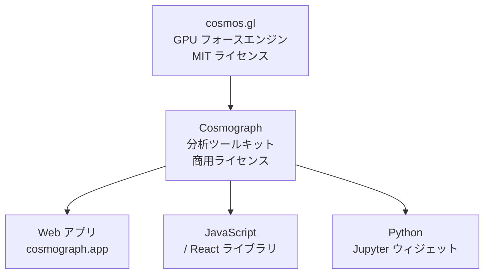

| 要素名 | 説明 |
|---|---|
| cosmos.gl | GPU フォースレイアウト計算と WebGL 描画を担う中核エンジン。MIT ライセンスの OSS |
| Cosmograph | cosmos.gl の上に分析機能・データパイプラインを載せた上位ツールキット |
| Web アプリ | コード不要でブラウザから利用できるスタンドアロン版 |
| JavaScript / React ライブラリ | npm 配布のライブラリ。既存 Web アプリへ組み込む |
| Python Jupyter ウィジェット | DataFrame を渡すだけで Notebook に描画する版 |

### 2.0 の技術スタック

Cosmograph 2.0 は以下の 4 つの技術を新たに統合しました。

| 技術 | 役割 |
|---|---|
| **DuckDB-Wasm** | WebAssembly 経由のブラウザ内インメモリ分析 DB。SQL によるフィルタ・集計・変換をサーバーなしで実行する |
| **Apache Arrow** | 列指向フォーマットによる効率的なデータ変換。WebGL レンダラーへの高速データ供給を担う |
| **Mosaic** | リアクティブデータフロー基盤。DuckDB を駆動するクロスフィルタ・宣言的ビジュアライゼーションフレームワーク |
| **SQLRooms** | DuckDB・状態管理・UI コンポーネントを統合したオープンソース React ツールキット。人間と AI の協調分析を想定した設計 |

これらの統合により、従来は不可能だった大規模データへの SQL 操作と、ブラウザ内でのリアクティブなクロスフィルタが実現しています。

### v1 からの主要変更点

| カテゴリ | v1 | v2.0 |
|---|---|---|
| データ処理 | JavaScript 配列処理のみ | DuckDB-Wasm による SQL 処理 |
| メモリ管理 | 大規模データで制約あり | Apache Arrow 列指向データによる効率化 |
| ファイル対応 | CSV 中心 | Parquet ネイティブ対応を追加 |
| フィルタ | 基本フィルタ | Mosaic クロスフィルタ（高速・リアクティブ） |
| タイムライン・ヒストグラム | 低速 | DuckDB 駆動で大幅高速化 |
| ポイント操作 | 選択のみ | ドラッグ（位置移動）対応 |
| クラスタリング | 非対応 | 新クラスタリングフォース追加 |
| 共有 | なし | クラウド保存・共有機能 |
| AI 連携 | なし | チャット機能（クローズドベータ） |

#### マイナーバージョン履歴（2.0 以降）

- **Ver 2.0**（2025 年 11 月）: DuckDB / Mosaic / SQLRooms 統合、Parquet 対応、クラウド共有、ポイントドラッグ
- **Ver 2.1**（2025 年 12 月）: 複数ノード同時選択、`VARCHAR[]` Parquet 読込、検索機能強化
- **Ver 2.2**（2026 年 4 月）: ポイントシェイプ、画像表示サポート、データ信頼性改善

### 類似ツールとの比較

| ツール | 実行方式 | スケール上限 | データ形式 | 分析機能 | ライセンス |
|---|---|---|---|---|---|
| **Cosmograph 2.0** | GPU / Web（ブラウザ内） | 100 万ノード超 | CSV、Parquet、Arrow、JSON | クロスフィルタ、タイムライン、ヒストグラム、検索、SQL | 商用（Web アプリは無料プランあり） |
| **cosmos.gl** | GPU / Web（ブラウザ内） | 数十万〜数百万ノード | Arrow（JavaScript API 経由） | フォースレイアウト・レンダリングのみ | MIT |
| **Gephi** | CPU + OpenGL / デスクトップ | 〜20 万ノード・100 万エッジ | GEXF、CSV、GraphML、GDF | 統計・レイアウト・プラグイン拡張 | GPL-3.0 |
| **Sigma.js** | CPU レイアウト + WebGL レンダリング / Web | 〜10 万エッジ（レイアウトは〜5 万ノード） | Graphology 経由（JSON 等） | レンダリングのみ（分析は外部ライブラリ依存） | MIT |
| **vis-network（vis.js）** | CPU / Web（Canvas） | 数千ノード（クラスタリング併用で増加） | JSON | 基本インタラクション | Apache 2.0 / MIT |
| **D3-force** | CPU / Web（SVG / Canvas） | 〜1 万ノード（Barnes-Hut 近似） | 任意（JavaScript API） | レイアウト計算のみ | ISC |
| **Graphistry** | GPU（サーバーサイド）+ WebGL レンダリング / Web | 数百万〜（サーバー GPU） | Arrow、CSV、JSON、Parquet | 高度なグラフ分析・RAPIDS 連携 | OSS コア + 商用 |
| **ReGraph / KeyLines** | GPU / Web | 大規模（企業向け） | 任意（SDK API） | リンク解析、インクリメンタル更新 | 商用（サブスクリプション） |

#### ユースケース別推奨

| ユースケース | 推奨ツール | 理由 |
|---|---|---|
| ブラウザ完結・100 万ノード超の可視化 | **Cosmograph 2.0** | 唯一の単一ノード Web ツール。データがローカルに留まる |
| 研究・学術用デスクトップ分析 | **Gephi** | 豊富なレイアウト・統計アルゴリズム、プラグイン生態系 |
| Web アプリへの軽量組み込み | **Sigma.js** | MIT ライセンス、〜10 万エッジまでの Web 埋め込みに適切 |
| 超大規模（数百万〜）サーバー側処理 | **Graphistry** | サーバー GPU で巨大グラフを処理しストリーミング配信 |
| 企業向けセキュリティ・インテリジェンス分析 | **ReGraph / KeyLines** | 豊富なインタラクション API と商用サポート |
| 数千ノード以下の Web フォーム統合 | **vis.js** | セットアップが容易、Canvas レンダリングで幅広い互換性 |
| カスタムレイアウトの完全制御 | **D3-force** | データドリブンな描画の自由度が最高 |

## ■特徴

特徴を「描画エンジン」「データ処理」「分析コンポーネント」「提供形態」の 4 カテゴリで整理します。

### 描画エンジン（cosmos.gl）

- **GPU フォースレイアウト**: フォースシミュレーション（バネ力・多体反発・重力）をすべて GPU シェーダー上で実行し、CPU を解放します。
- **百万ノード超の可視化**: 単一ノードの Web ツールとして唯一、100 万ノードを超えるグラフをリアルタイムにレンダリングできます。
- **ブラウザ完結・プライバシー優先**: すべての処理をブラウザ内で完結させ、データをローカルに保持します（共有は任意）。フォースレイアウトと描画は GPU、SQL 処理は DuckDB-Wasm が担います。
- **ポイントドラッグ**: 任意のノードを手動で移動し、フォースレイアウト上の位置を調整できます。
- **クラスタリングフォース**: 属性値に基づくノードのグループ凝集を自動化する新しいレイアウトアルゴリズムです。

### データ処理（DuckDB-Wasm / Arrow）

- **SQL によるデータ操作**: DuckDB-Wasm を介したブラウザ内 SQL 処理で、大規模データのフィルタ・集計・変換をサーバーなしで実行します。
- **Parquet ネイティブ対応**: クラウドや外部ストレージの Parquet ファイルを直接開けます。
- **Apache Arrow によるデータパイプライン**: 列指向フォーマットで WebGL レンダラーへデータを効率的に供給し、レンダリング性能を向上させます。
- **埋め込み可視化対応**: シミュレーション無効化と座標カラム指定により、機械学習埋め込み（UMAP / t-SNE 等）の散布図的可視化が可能です。

### 分析コンポーネント（Mosaic 連携）

- **クロスフィルタ**: ヒストグラム・タイムラインの選択操作が即座にグラフ全体へ反映されるリアクティブな連動フィルタです。
- **Timeline コンポーネント**: 時系列属性を持つグラフで、時間軸に沿ったネットワーク変化を観察できます。
- **Histogram コンポーネント**: 数値属性の分布を可視化し、選択範囲がグラフにリアルタイム反映されます。
- **Search コンポーネント**: ノード属性の全文検索とオートサジェスト。検索結果ノードへの自動ズームに対応します。

### 提供形態・連携

- **Python Jupyter 統合**: `cosmo()` 関数で DataFrame を渡すだけでウィジェット表示でき、Notebook から Web プラットフォームへのエクスポートも可能です。
- **React / JavaScript ライブラリ**: `@cosmograph/react` / `@cosmograph/cosmograph` として npm 提供され、既存 Web アプリに組み込めます。
- **クラウド共有**: 分析済みグラフを URL 共有できます。
- **AI チャット連携（クローズドベータ）**: グラフデータに対するクエリを自然言語で行う機能が開発中です。

## ■構造

Cosmograph 2.0 の内部アーキテクチャを C4 model の 3 段階（システムコンテキスト → コンテナ → コンポーネント）で図解します。

### ●システムコンテキスト図

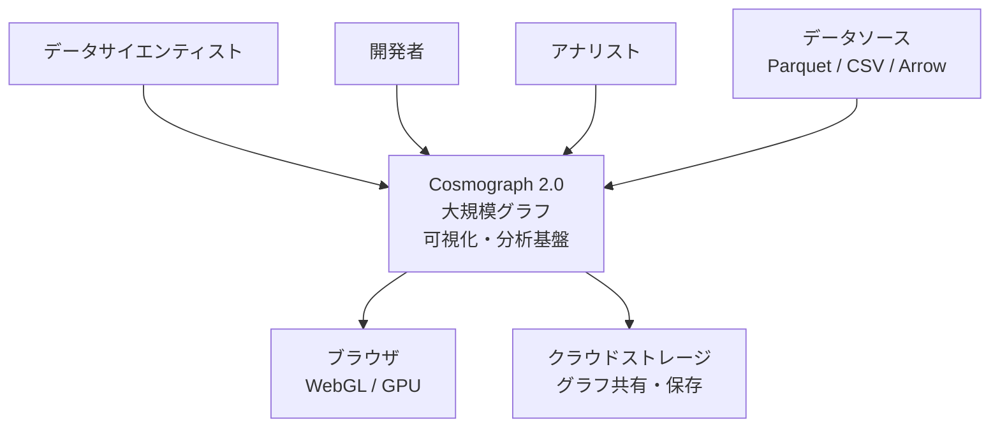

| 要素名 | 説明 |
|---|---|
| データサイエンティスト | Python ウィジェット（Jupyter）経由でグラフを構築・分析する利用者 |
| 開発者 | JavaScript / React ライブラリ経由でシステムに組み込む利用者 |
| アナリスト | Web アプリ経由でインタラクティブにグラフを探索する利用者 |
| Cosmograph 2.0 | GPU アクセラレーション大規模グラフ可視化・分析基盤 |
| ブラウザ - WebGL / GPU | フォース計算と描画を受け持つ実行環境。SQL 処理は同じブラウザ内の DuckDB-Wasm が担う |
| データソース - Parquet / CSV / Arrow | 入力データの供給源。ローカルまたはリモートに配置する |
| クラウドストレージ | 生成したグラフの保存と共有に使用する外部ストレージ |

### ●コンテナ図

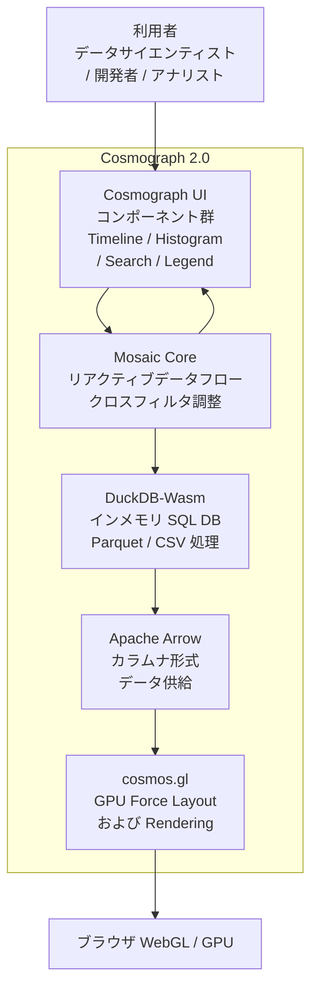

| 要素名 | 説明 |
|---|---|
| Cosmograph UI コンポーネント群 | ユーザー操作を受け取り、Mosaic Core に選択・フィルタを送出するインタラクション層。Timeline・Histogram・Search・Legend 等を含む |
| Mosaic Core | MosaicClient からのクエリを収集し、DuckDB-Wasm に発行する。リアクティブな Selection / Param でクロスフィルタを管理する調整層 |
| DuckDB-Wasm | WebAssembly 上で動作するインメモリ列指向 DB。SQL フィルタ・集計・変換をブラウザ内で完結させる |
| Apache Arrow | DuckDB-Wasm のクエリ結果を列指向バイナリ（IPC バッファ）で保持し、GPU へゼロコピーに近い形で供給するデータ転送層 |
| cosmos.gl | GPU 上で Force Layout 計算と WebGL 描画を行うレンダリングエンジン。luma.gl（WebGL 2）を基盤とする |

### ●コンポーネント図

コンテナごとに内部コンポーネントをドリルダウンします。

#### Cosmograph UI コンポーネント群

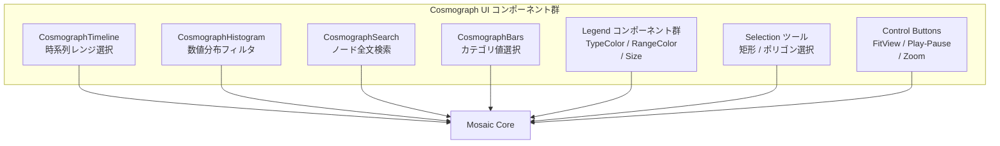

| 要素名 | 説明 |
|---|---|
| CosmographTimeline | 時系列属性のレンジ選択。選択範囲を Mosaic Selection として送出する |
| CosmographHistogram | 数値カラムの分布表示と範囲フィルタ。Inclusive Selection で複数値に対応する |
| CosmographSearch | ノード属性の全文検索。候補サジェストとズームイン連携を持つ |
| CosmographBars | カテゴリ属性のバー表示と Exclusive / Inclusive 選択 |
| Legend コンポーネント群 | TypeColorLegend・RangeColorLegend・SizeLegend で凡例と選択を統合する |
| Selection ツール | 矩形・ポリゴン操作でポイントを範囲選択する直接操作レイヤ |
| Control Buttons | Fit View・シミュレーション Play/Pause・ズーム等の補助操作ボタン群 |

#### Mosaic Core

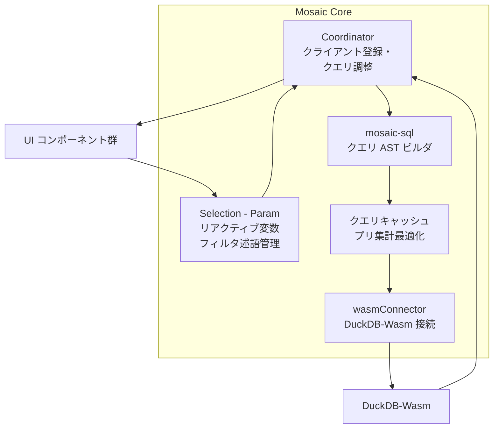

| 要素名 | 説明 |
|---|---|
| Coordinator | connect / disconnect でクライアントを管理し、Selection 変化を検出してクエリ再発行を調整する中央ハブ |
| Selection - Param | Param（スカラリアクティブ変数）と Selection（フィルタ述語集合）を管理する。single / union / intersect / crossfilter の 4 解決戦略を持つ |
| mosaic-sql | Query クラスで SQL を AST として構築する。select / from / where / groupby / 集計関数 / ウィンドウ関数を提供する |
| wasmConnector | ブラウザ内の DuckDB-Wasm に接続するコネクタ。Arrow IPC バッファで結果を受け取る |
| クエリキャッシュ - プリ集計最適化 | Coordinator が高コストクエリをキャッシュし、インタラクティブレートを維持するための最適化層 |

#### DuckDB-Wasm

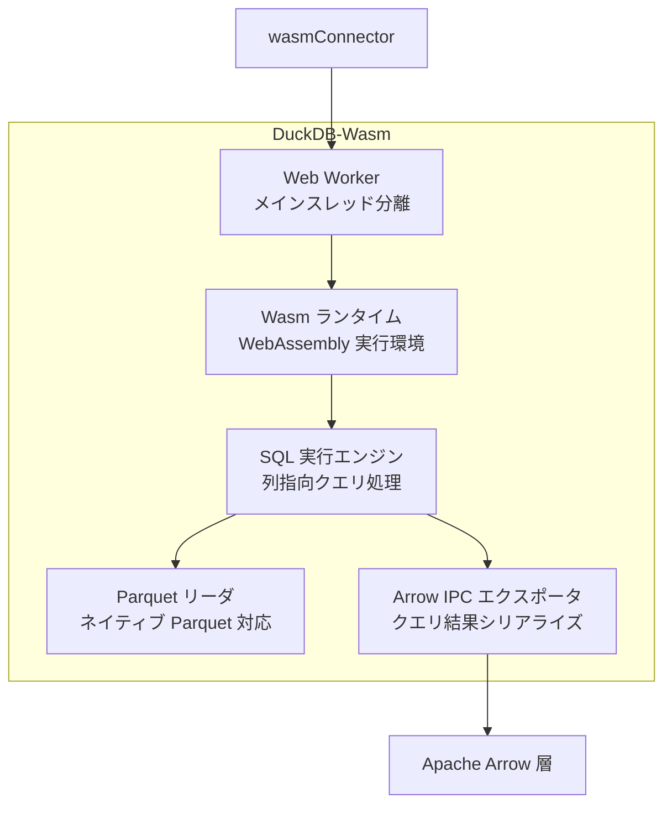

| 要素名 | 説明 |
|---|---|
| Wasm ランタイム | DuckDB を WebAssembly にコンパイルしたブラウザ実行環境。4 GB のメモリ制約内で動作する |
| SQL 実行エンジン | 列指向クエリ処理エンジン。フィルタ・集計・結合をブラウザ内で完結する |
| Parquet リーダ | Parquet ファイルをネイティブ読み込みする。リモート Parquet のパーシャルフェッチにも対応する |
| Arrow IPC エクスポータ | クエリ結果を Apache Arrow IPC バイナリに変換してシリアライズする。後続 Arrow 層へ渡す |
| Web Worker | SQL 実行をメインスレッドから分離し、UI ブロッキングを防ぐ非同期実行境界 |

#### Apache Arrow 層

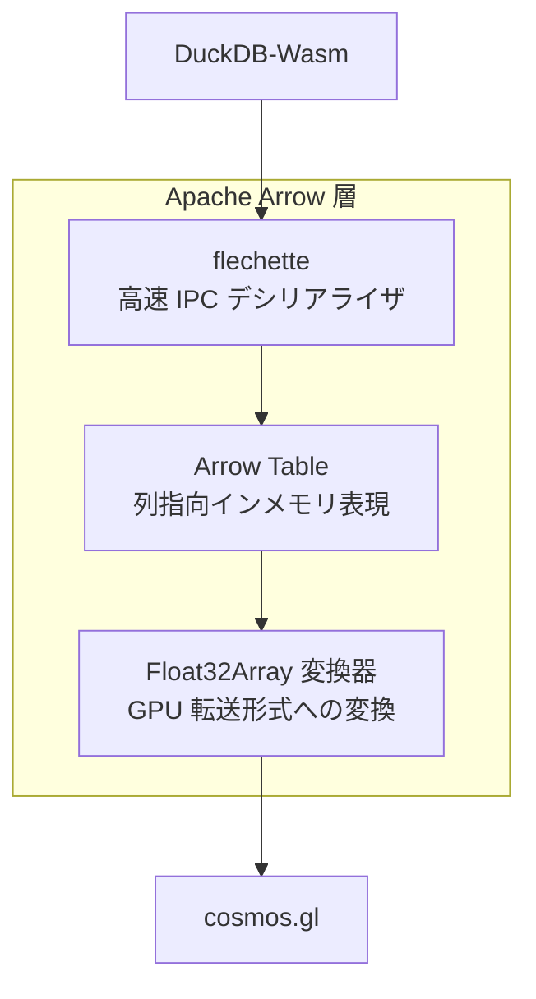

| 要素名 | 説明 |
|---|---|
| Arrow Table | 列指向インメモリ表現。DuckDB-Wasm が出力する IPC バッファを構造化して保持する |
| flechette | Mosaic が採用する高速 Arrow IPC デシリアライザ。標準 arrow-js より解析オーバーヘッドが小さい |
| Float32Array 変換器 | Arrow 列データを WebGL が直接読み込める Float32Array 形式に変換するアダプタ |

#### cosmos.gl

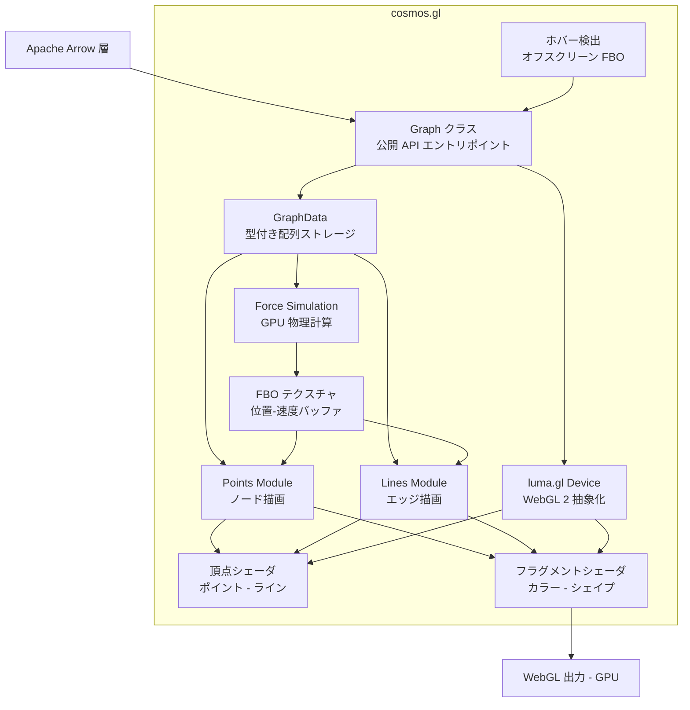

| 要素名 | 説明 |
|---|---|
| Graph クラス | cosmos.gl レイヤーの主要な公開 API。setPointPositions / setLinks / start / pause / zoom 等を提供する中央オーケストレータ |
| GraphData | Float32Array 形式でポイント位置・リンクインデックス・色・サイズ等を保持する GPU 転送用ストレージ |
| luma.gl Device | WebGL 2 を抽象化するレンダリングデバイス。複数 Graph インスタンス間でデバイスを共有できる |
| Points Module | ポイントのインスタンス描画を担当する。複数シェイプ対応、テクスチャアトラスでカスタム画像も扱う |
| Lines Module | エッジをラインストリップで描画する。カーブドリンク・矢印方向表示をサポートする |
| Force Simulation | Gravity / Center / ManyBody / Link / Cluster / Mouse の 6 力タイプを GPU シェーダで計算する物理エンジン |
| FBO テクスチャ | ポイント位置と速度をフレームバッファオブジェクト（テクスチャ）に格納し、GPU 側で読み書きする |
| ホバー検出 | オフスクリーン FBO に描画してピクセル色を読み取りヒットテストを行う。複数フレームごとにスロットルして負荷を抑制する |
| 頂点シェーダ | ポイントとライン各々の座標変換・インスタンス配置を GPU で処理する |
| フラグメントシェーダ | ピクセル単位の色・形状・アルファを GPU で決定する。GLSL で記述する |

#### データフロー図

ユーザー操作から WebGL 描画完了までの一連のデータフローを示します。

```mermaid
graph LR
    U["ユーザー操作<br/>フィルタ / 選択"]
    SEL_R["Selection - Param<br/>述語更新"]
    COORD_R["Coordinator<br/>クライアント通知"]
    SQL_R["mosaic-sql<br/>SQL AST 構築"]
    OPT["キャッシュ - プリ集計<br/>クエリ最適化"]
    WASM_R["wasmConnector<br/>クエリ発行"]
    DUCK_R["DuckDB-Wasm<br/>SQL 実行"]
    ARR_R["Arrow IPC バッファ<br/>クエリ結果"]
    FLET["flechette<br/>デシリアライズ"]
    F32["Float32Array<br/>GPU 転送形式"]
    GPU_SIM["cosmos.gl<br/>Force Simulation<br/>FBO 更新"]
    GPU_DRAW["cosmos.gl<br/>WebGL 描画<br/>Points - Lines"]
    OUT["WebGL 出力<br/>GPU レンダリング結果"]

    U --> SEL_R
    SEL_R --> COORD_R
    COORD_R --> SQL_R
    SQL_R --> OPT
    OPT --> WASM_R
    WASM_R --> DUCK_R
    DUCK_R --> ARR_R
    ARR_R --> FLET
    FLET --> F32
    F32 --> GPU_SIM
    GPU_SIM --> GPU_DRAW
    GPU_DRAW --> OUT
```

| ステップ | 要素名 | 説明 |
|---|---|---|
| 1 | ユーザー操作 | Timeline スライド・Histogram レンジ選択・Search 入力など |
| 2 | Selection - Param | フィルタ述語を crossfilter 戦略で更新し、Coordinator へブロードキャストする |
| 3 | Coordinator | 影響を受けるクライアントを特定し、クエリ再構築を要求する |
| 4 | mosaic-sql | Query AST としてフィルタ付き SQL を構築する |
| 5 | キャッシュ - プリ集計 | 既出クエリはキャッシュから応答し、新規のみ DuckDB へ送出する |
| 6 | wasmConnector | ブラウザ内 DuckDB-Wasm にクエリを発行する |
| 7 | DuckDB-Wasm | Web Worker 内の Wasm ランタイムで SQL を列指向実行する |
| 8 | Arrow IPC バッファ | クエリ結果を Arrow IPC バイナリとしてシリアライズして返却する |
| 9 | flechette | IPC バッファを高速デシリアライズして Arrow Table に展開する |
| 10 | Float32Array | Arrow 列を WebGL 直読み可能な Float32Array に変換する |
| 11 | cosmos.gl Force Simulation | GPU シェーダで 6 力を計算し、FBO テクスチャに位置・速度を書き込む |
| 12 | cosmos.gl WebGL 描画 | Points Module と Lines Module が FBO から位置を読み取り、頂点・フラグメントシェーダで描画する |
| 13 | WebGL 出力 | GPU レンダリング結果をブラウザキャンバスに表示する |

## ■データ

> 本記事では、グラフ理論上の概念を「ノード」、Cosmograph API のキー名・エンティティを「Point / point」と表記します。Cosmograph 2.0 の API は `point*` 系で統一されており、旧称の `node*` 系は使いません。

### ●概念モデル

Cosmograph のデータレイヤーは、グラフデータ（Point・Link）、設定（CosmographDataPrepConfig・CosmographConfig）、分析コンポーネント（Crossfilter・Timeline・Histogram・Search）で構成されます。

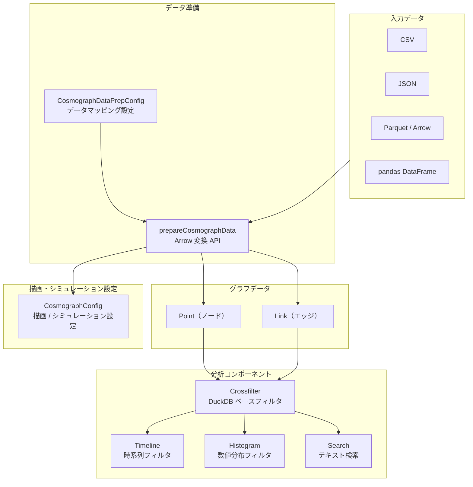

| 要素名 | 説明 |
|---|---|
| 入力データ | CSV / JSON / Parquet / Arrow / pandas DataFrame の複数形式を受け付ける |
| CosmographDataPrepConfig | 列名とアクセサのマッピングを定義する設定オブジェクト |
| prepareCosmographData | 入力データを Apache Arrow テーブルへ変換する非同期 API |
| Point | グラフのノードを表すエンティティ。`pointIdBy` で一意識別する |
| Link | グラフのエッジを表すエンティティ。`linkSourceBy` / `linkTargetBy` で接続先を指定する |
| CosmographConfig | 変換済み Arrow テーブルと描画・シミュレーションのパラメータを保持する設定 |
| Crossfilter | DuckDB-Wasm を基盤としたインメモリフィルタ。Point・Link を横断的に絞り込む |
| Timeline | 日付列を軸にした時系列ブラシフィルタ。Crossfilter 経由でグラフに反映する |
| Histogram | 数値列の分布を可視化するフィルタ。Crossfilter 経由でグラフに反映する |
| Search | テキスト列をキーワード検索するコンポーネント。Crossfilter 経由でグラフに反映する |

### ●情報モデル

概念モデルに登場する各エンティティの主要属性を示します。

#### Point（ノード）

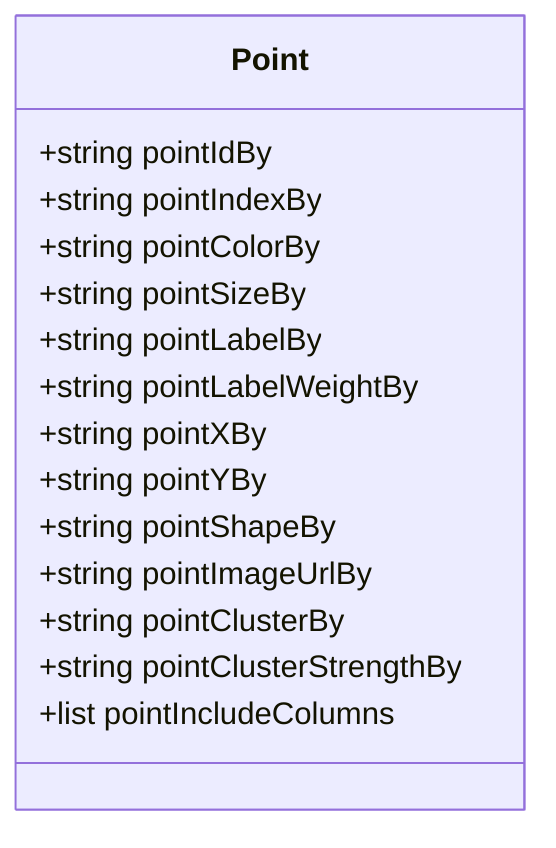

| 属性 | 必須 | 説明 |
|---|---|---|
| pointIdBy | 必須 | 各ノードを一意に識別する列名 |
| pointIndexBy | 任意 | 0 始まりの連番インデックス列名。パフォーマンス最適化に使用する |
| pointColorBy | 任意 | ノードの色を決定する列名。色文字列または RGBA 配列を格納する |
| pointSizeBy | 任意 | ノードの描画サイズを決定する数値列名 |
| pointLabelBy | 任意 | ノードに表示するラベルの列名 |
| pointLabelWeightBy | 任意 | ラベル表示優先度を 0〜1 で示す数値列名 |
| pointXBy | 任意 | シミュレーションを無効にした埋め込み配置時の X 座標列名 |
| pointYBy | 任意 | シミュレーションを無効にした埋め込み配置時の Y 座標列名 |
| pointShapeBy | 任意 | ノードの形状を指定する列名（数値または文字列） |
| pointImageUrlBy | 任意 | ノードに表示する画像 URL の列名 |
| pointClusterBy | 任意 | クラスタ割り当てを格納する列名 |
| pointClusterStrengthBy | 任意 | クラスタ引力の強さを示す数値列名 |
| pointIncludeColumns | 任意 | Histogram / Search / Timeline などのコンポーネントが参照する追加列名のリスト。`['*']` で全列を含める |

#### Link（エッジ）

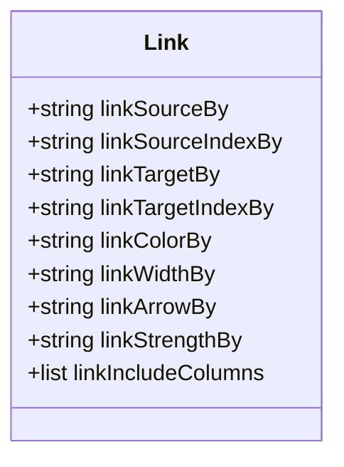

| 属性 | 必須 | 説明 |
|---|---|---|
| linkSourceBy | 必須 | エッジの起点ノードを識別する列名 |
| linkSourceIndexBy | 任意 | 起点ノードのインデックス列名。高速ルックアップに使用する |
| linkTargetBy | 必須 | エッジの終点ノードを識別する列名 |
| linkTargetIndexBy | 任意 | 終点ノードのインデックス列名 |
| linkColorBy | 任意 | エッジの色を決定する列名。色文字列または RGBA 配列を格納する |
| linkWidthBy | 任意 | エッジの幅を決定する数値列名 |
| linkArrowBy | 任意 | 矢印表示の有無を示すブール値列名 |
| linkStrengthBy | 任意 | フォースシミュレーションに作用するエッジ強度の数値列名（0〜1） |
| linkIncludeColumns | 任意 | Histogram / Search が参照する追加列名のリスト。`['*']` で全列を含める |

> Note: 1 本のエッジは必ず 1 対 1（ソース → ターゲット）の接続です。データ準備時の `CosmographDataPrepConfig` では複数ターゲットを表す `linkTargetsBy`（配列）を渡せます。Data Kit がこれを個別エッジへ展開します。一方、ランタイムの `CosmographConfig` では単数の `linkTargetBy` を使います。

#### CosmographDataPrepConfig（データマッピング設定）

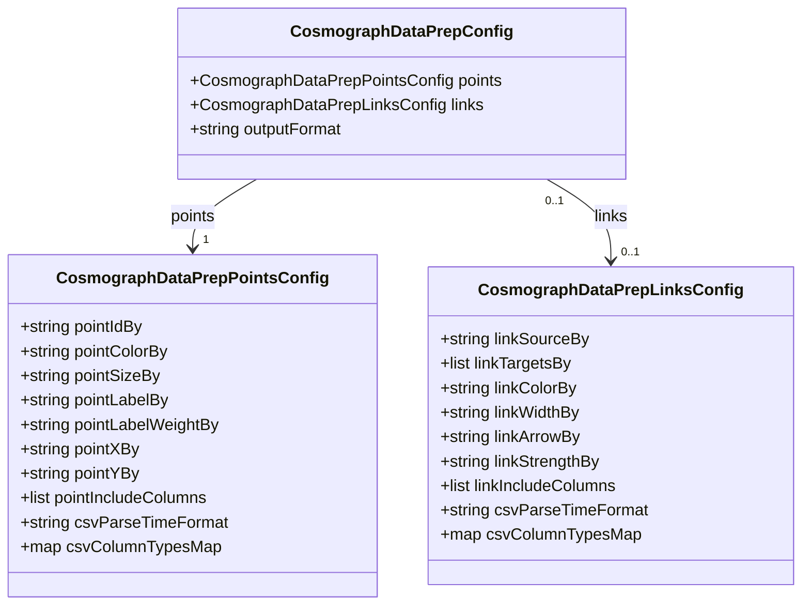

| 属性 | 必須 | 説明 |
|---|---|---|
| points | 必須 | Point テーブルのマッピング設定 |
| links | 任意 | Link テーブルのマッピング設定。Point のみのグラフでは省略可 |
| outputFormat | 任意 | 出力形式。`csv` / `arrow` / `parquet` から選択する。デフォルトは `parquet` |
| pointIdBy（points 内） | 必須 | ノードを一意に識別する列名 |
| linkSourceBy（links 内） | 必須（Links 使用時） | エッジの起点列名 |
| linkTargetsBy（links 内） | 必須（Links 使用時） | 終点ノードの列名リスト。複数列指定時は個別エッジへ展開される |
| csvParseTimeFormat | 任意 | CSV 入力時の時刻フォーマット文字列（例: `YYYY-MM-DD`） |
| csvColumnTypesMap | 任意 | 自動型推定が失敗した列への手動型割り当てマップ |

#### CosmographConfig（描画・シミュレーション設定）

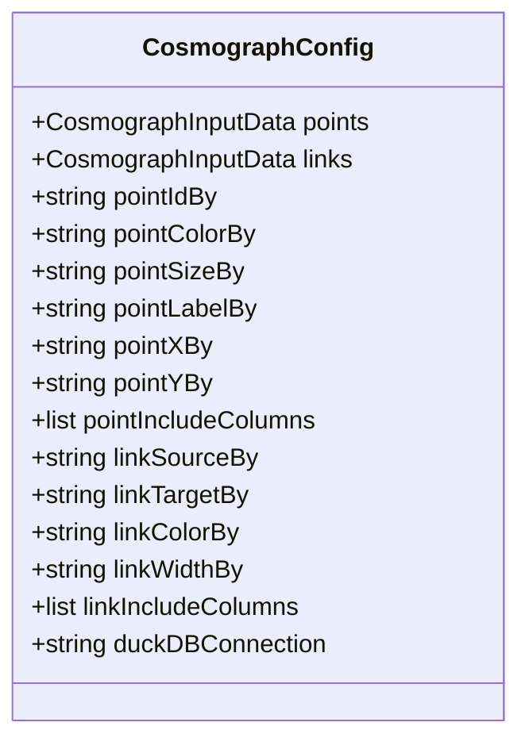

| 属性 | 説明 |
|---|---|
| points | Arrow テーブル、Parquet、CSV、JSON、URL 文字列（DuckDB テーブル名）のいずれかを受け付ける |
| links | points と同様の複数形式入力を受け付ける |
| pointIdBy | 描画時のノード識別列名 |
| pointIncludeColumns | コンポーネント（Histogram / Search / Timeline）が参照する追加列のリスト |
| linkIncludeColumns | コンポーネントが参照するエッジの追加列のリスト |
| duckDBConnection | 外部 DuckDB インスタンスの接続情報。文字列または `{duckdb, connection}` オブジェクトを渡す |

#### Crossfilter（DuckDB ベースフィルタ）

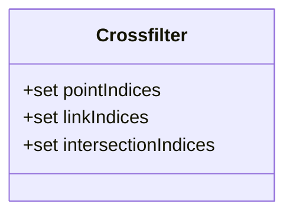

| 属性 | 説明 |
|---|---|
| pointIndices | フィルタ後の Point インデックスの集合 |
| linkIndices | フィルタ後の Link インデックスの集合 |
| intersectionIndices | Point と Link の双方がフィルタ条件を満たす交差インデックスの集合 |

Crossfilter は DuckDB-Wasm をバックエンドとして動作します。Timeline・Histogram・Search がそれぞれ独立したフィルタ条件を発行し、Crossfilter がそれらを合成してグラフの表示を更新します。

#### Timeline / Histogram / Search の入力データ要件

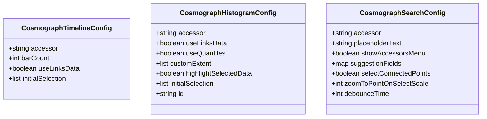

| コンポーネント | accessor が参照する列の種別 | 列を含めるための設定 |
|---|---|---|
| Timeline | 日付 / 時刻列 | `pointIncludeColumns` または `linkIncludeColumns` に列名を追加 |
| Histogram | 数値列 | `pointIncludeColumns` または `linkIncludeColumns` に列名を追加 |
| Search | 文字列列 | `pointIncludeColumns` または `linkIncludeColumns` に列名を追加 |

| 属性 | コンポーネント | 説明 |
|---|---|---|
| accessor | Timeline / Histogram / Search | 参照する列名。対象列は `pointIncludeColumns` / `linkIncludeColumns` に含める必要がある |
| useLinksData | Timeline / Histogram | `true` の場合は Link データを対象とする。初期化時に固定する |
| barCount | Timeline | 表示するバー（時間区間）の数 |
| useQuantiles | Histogram | `true` の場合、5 / 95 パーセンタイルで外れ値をトリムする |
| customExtent | Histogram | 表示範囲の最小・最大値を手動指定する |
| highlightSelectedData | Histogram | 選択範囲のデータをハイライトする。大規模データでは性能に影響する |
| id | Histogram | コンポーネントの安定 ID。複数インスタンスの識別に使用する |
| showAccessorsMenu | Search | 検索対象列の切り替えメニューを表示する |
| suggestionFields | Search | 提案フィールドと表示ラベルのマッピング |
| selectConnectedPoints | Search | 検索結果の隣接ノードも選択対象に含める |
| debounceTime | Search | 入力からクエリ発行までの遅延時間（ミリ秒）。デフォルト 300 |

#### 入力データ形式と変換フロー

Cosmograph は次の入力形式を受け付けます。

| 形式 | JavaScript | Python |
|---|---|---|
| Apache Arrow テーブル | Arrow Table / Uint8Array / ArrayBuffer | pyarrow Table |
| Parquet ファイル | `.parquet` / `.pq` ファイル・URL | `pd.read_parquet()` |
| CSV | `.csv` / `.tsv` ファイル・URL | pandas DataFrame 経由 |
| JSON | オブジェクト配列 | - |
| DuckDB テーブル | テーブル名文字列（外部 DuckDB 接続時） | - |
| pandas DataFrame | - | DataFrame 直接渡し |

`prepareCosmographData` が生データを Apache Arrow へ変換する流れを示します。

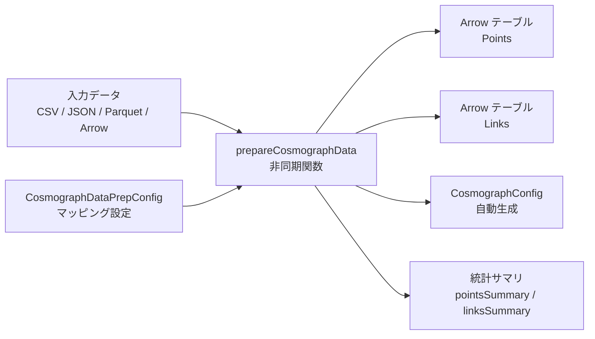

| 出力フィールド | 説明 |
|---|---|
| points | Arrow 形式に変換済みのノードテーブル |
| links | Arrow 形式に変換済みのエッジテーブル |
| cosmographConfig | そのまま `Cosmograph` に渡せる設定オブジェクト |
| pointsSummary | 件数・最小値・最大値・平均・標準偏差・NULL 率などの統計情報 |
| linksSummary | エッジの統計情報 |
| pointsProcessedFully | メモリ制限内で全件処理が完了したかを示すブール値 |
| linksProcessedFully | エッジの全件処理が完了したかを示すブール値 |

`prepareCosmographData` は非同期関数です。戻り値を `await` で受け取り、`cosmographConfig` をスプレッド演算子で `CosmographConfig` に展開するパターンが標準です。

## ■構築方法

### インストール方法

Cosmograph 2.0 は用途に応じて 4 通りの手段でセットアップできます。

| 手段 | 対象 | コマンド／URL |
|---|---|---|
| バニラ JS / TypeScript | Node.js + バンドラ | `npm install @cosmograph/cosmograph` |
| React | React アプリ | `npm install @cosmograph/react` |
| Python ウィジェット | Jupyter Notebook | `pip install cosmograph` |
| Web アプリ | ブラウザのみ（コード不要） | https://cosmograph.app |

#### バニラ JS / TypeScript

```bash
npm install @cosmograph/cosmograph
```

#### React

```bash
npm install @cosmograph/react
```

両パッケージとも TypeScript 型定義を内包しています。

#### Python ウィジェット

```bash
pip install cosmograph
```

内部で anywidget を利用し、Jupyter Notebook / JupyterLab で動作します。

#### Web アプリ（ブラウザ利用）

https://cosmograph.app をブラウザで開くだけで使用できます。インストールは不要です。CSV / JSON / Parquet ファイルをアップロードするか、URL を指定してデータを読み込みます。

### 前提条件

| 環境 | 要件 |
|---|---|
| ブラウザ | WebGL2 対応（Chrome / Firefox / Edge 最新版推奨） |
| Node.js | バンドラ（Vite / webpack 等）が動作するバージョン |
| Python | 3.10 以上 |
| Jupyter | Notebook / JupyterLab（anywidget を内部利用） |

### バージョン確認方法

#### npm パッケージ

```bash
# インストール済みバージョンを確認
npm list @cosmograph/cosmograph
npm list @cosmograph/react
```

```bash
# レジストリの最新バージョンを確認
npm view @cosmograph/cosmograph version
npm view @cosmograph/react version
```

#### Python パッケージ

```bash
pip show cosmograph
```

## ■利用方法

### 必須パラメータ一覧

データを正しくマッピングするために、以下のパラメータは必ず指定します。

| パラメータ（JS/TS） | パラメータ（Python） | 設定対象 | 必須 | 説明 |
|---|---|---|---|---|
| `pointIdBy` | `point_id_by` | Points | **必須** | ノードの一意識別子カラム名 |
| `linkSourceBy` | `link_source_by` | Links | リンクを使う場合は必須 | エッジの起点カラム名 |
| `linkTargetsBy` / `linkTargetBy` | `link_target_by` | Links | リンクを使う場合は必須 | エッジの終点カラム名（データ準備時の JS は配列 `linkTargetsBy`、ランタイムは単数 `linkTargetBy`） |

その他のよく使うマッピングパラメータを以下に示します。

| パラメータ（JS/TS） | パラメータ（Python） | 説明 |
|---|---|---|
| `pointColorBy` | `point_color_by` | ノード色に使うカラム |
| `pointSizeBy` | `point_size_by` | ノードサイズに使うカラム |
| `pointLabelBy` | `point_label_by` | ノードラベルに使うカラム |
| `linkColorBy` | `link_color_by` | エッジ色に使うカラム |
| `linkWidthBy` | `link_width_by` | エッジ幅に使うカラム |
| `outputFilename` | — | 出力ファイル名（`downloadCosmographData` 用） |

### ポイントの色設定（pointColorStrategy）

ノードの色は `pointColorBy`（参照列）と `pointColorStrategy`（着色戦略）の組み合わせで決まります。戦略を省略すると、`pointColorByFn` → `pointColorByMap` → 数値列なら continuous → 文字列／真偽値列なら categorical → リンクありなら degree → fallback single の優先順位で自動解決します。

| 戦略 | 用途 | 主な設定 |
|---|---|---|
| `map` | 離散値ごとに固定色を割り当てる | `pointColorByMap`（値 → 色のマップ） |
| `categorical` | カテゴリにパレットを循環適用する | `pointColorPalette`（任意） |
| `continuous` | 数値をグラデーション補間する | `pointColorPalette`（任意、例: 黄→赤） |
| `degree` | 接続数で着色する（5/95 パーセンタイルにクランプ） | `pointColorPalette` |
| `preciseDegree` | 正確な接続数で着色する | — |
| `linkDirection` | source / target / both の役割で着色する | `pointColorPalette` |
| `direct` | 列値を色として直接使う、または関数で算出する | `pointColorByFn` |
| `single` | 全ポイントを単色で着色する | `pointDefaultColor` |

`pointColorByMap` のキーは文字列です（数値・真偽値の列値は `'42'` / `'true'` のように文字列で指定します）。値には 16 進文字列・RGBA 配列（RGB は 0〜255、アルファは 0〜1）・CSS 有効色を渡せます。

```javascript
const config = {
  points: [
    { id: '1', idx: 0, status: 'active' },
    { id: '2', idx: 1, status: 'inactive' },
  ],
  pointColorBy: 'status',
  pointColorStrategy: 'map',
  pointColorByMap: {
    'active': '#4caf50',     // 16 進文字列
    'inactive': [244, 67, 54, 1], // RGBA 配列
  },
}
```

`null` / `undefined` の値には `unknownColor` が適用されます。

### データ準備（prepareCosmographData / downloadCosmographData / prepareCosmographDataFiles）

Cosmograph 2.0 は Apache Arrow 形式を内部フォーマットとして使用します。生データは `prepareCosmographData` で Arrow に変換してから Cosmograph インスタンスに渡します。

#### 対応入力フォーマット

- CSV（`.csv`, `.tsv`）・JSON（`.json`）。JSON は最大 100 MB（CSV / TSV の明示的な上限は公式に記載なし）
- Apache Parquet（`.parquet`, `.pq`）
- Apache Arrow（`.arrow`）
- URL 文字列
- Apache Arrow `Table` インスタンス
- Typed Array
- プレーンな JavaScript オブジェクト配列

#### prepareCosmographData

```typescript
import { prepareCosmographData, CosmographDataPrepConfig } from '@cosmograph/cosmograph'

const dataConfig: CosmographDataPrepConfig = {
  points: { pointIdBy: 'id' },
  links: { linkSourceBy: 'source', linkTargetsBy: ['target'] },
}

const rawPoints = [
  { id: 'a', value: 10 },
  { id: 'b', value: 20 },
  { id: 'c', value: 30 },
]
const rawLinks = [
  { source: 'a', target: 'b' },
  { source: 'b', target: 'c' },
]

// Arrow 形式に変換（非同期）
const result = await prepareCosmographData(dataConfig, rawPoints, rawLinks)
// result: { points, links, cosmographConfig, pointsSummary, linksSummary,
//           pointsProcessedFully, linksProcessedFully }
```

#### prepareCosmographDataFiles

Arrow 形式ではなく指定フォーマットの `Blob` を返します。ファイル保存やサーバー送信に使います。

```typescript
import { prepareCosmographDataFiles } from '@cosmograph/cosmograph'

const filesResult = await prepareCosmographDataFiles(dataConfig, rawPoints, rawLinks)
// filesResult.points / filesResult.links が Blob
```

#### downloadCosmographData

ブラウザでのファイルダウンロードを直接トリガします。`CosmographDataPrepConfig` の `outputFilename` でファイル名を指定します。

```typescript
import { downloadCosmographData } from '@cosmograph/cosmograph'

await downloadCosmographData(
  {
    points: { pointIdBy: 'id', outputFilename: 'my-graph-points' },
    links: { linkSourceBy: 'source', linkTargetsBy: ['target'], outputFilename: 'my-graph-links' },
  },
  rawPoints,
  rawLinks
)
```

`outputFilename` は `points` / `links` の各オブジェクト内で指定します。

`outputFormat` は `prepareCosmographDataFiles` / `downloadCosmographData` でのみ有効です（`prepareCosmographData` では無視されます）。`'csv'` / `'arrow'` / `'parquet'` から選択します。

### Cosmograph インスタンス初期化（バニラ JS / TypeScript）

```typescript
import { Cosmograph, prepareCosmographData } from '@cosmograph/cosmograph'

// 1. データ準備
const dataConfig = {
  points: { pointIdBy: 'id' },
  links: { linkSourceBy: 'source', linkTargetsBy: ['target'] },
}
const result = await prepareCosmographData(dataConfig, rawPoints, rawLinks)
if (!result) return

const { points, links, cosmographConfig } = result

// 2. DOM 要素を取得してインスタンスを生成
const container = document.getElementById('graph') as HTMLElement
const cosmograph = new Cosmograph(container, {
  points,
  links,
  ...cosmographConfig,
})
```

コンストラクタのシグネチャは以下のとおりです。

```typescript
new Cosmograph(
  containerElement: HTMLElement,
  config: CosmographConfig,
  duckDbConnection?: string | WasmDuckDBConnection
)
```

設定の追加変更には `setConfig` を使います。

```typescript
cosmograph.setConfig({ showDynamicLabels: true, pointSizeRange: [2, 12] })
```

主要メソッドを以下に示します。

| メソッド | 説明 |
|---|---|
| `setConfig(config?)` | 設定を更新する |
| `fitView(duration?, padding?)` | 全ノードが収まるようにビューを調整する |
| `zoomToPoint(index, duration?, scale?)` | 指定ノードへズームする |
| `selectPoints(indices, addToSelection?)` | ノードを選択状態にする |
| `unselectAllPoints()` | 選択を解除する |
| `start(alpha?)` | シミュレーションを開始する |
| `pause()` / `unpause()` | シミュレーションを一時停止 / 再開する |
| `captureScreenshot(fileName?, scale?)` | スクリーンショットをダウンロードする |
| `destroy()` | インスタンスを破棄してリソースを解放する |

### React コンポーネント（`<Cosmograph />`）

```typescript
import React, { useEffect, useState } from 'react'
import { Cosmograph, CosmographConfig, prepareCosmographData } from '@cosmograph/react'

const rawPoints = [
  { id: 'a', category: 'A' },
  { id: 'b', category: 'B' },
  { id: 'c', category: 'A' },
]
const rawLinks = [
  { source: 'a', target: 'b' },
  { source: 'b', target: 'c' },
  { source: 'c', target: 'a' },
]

export const GraphComponent = () => {
  const [config, setConfig] = useState<CosmographConfig>({})

  useEffect(() => {
    const load = async () => {
      const dataConfig = {
        points: { pointIdBy: 'id' },
        links: { linkSourceBy: 'source', linkTargetsBy: ['target'] },
      }
      const result = await prepareCosmographData(dataConfig, rawPoints, rawLinks)
      if (result) {
        const { points, links, cosmographConfig } = result
        setConfig({ points, links, ...cosmographConfig })
      }
    }
    load()
  }, [])

  return <Cosmograph {...config} />
}
```

`@cosmograph/react` は `@cosmograph/cosmograph` のすべての API（`prepareCosmographData` 等）を再エクスポートしています。

### Python ウィジェット（Jupyter Notebook）

基本的な使い方は `cosmo` 関数です。

```python
import pandas as pd
from cosmograph import cosmo

points = pd.DataFrame({
    'id': [1, 2, 3, 4, 5],
    'label': ['Node A', 'Node B', 'Node C', 'Node D', 'Node E'],
    'value': [10, 20, 15, 25, 30],
    'category': ['A', 'B', 'A', 'B', 'A'],
})

links = pd.DataFrame({
    'source': [1, 2, 3, 1, 2],
    'target': [2, 3, 4, 5, 4],
    'value': [1.0, 2.0, 1.5, 0.5, 1.8],
})

widget = cosmo(
    points=points,
    links=links,
    point_id_by='id',
    link_source_by='source',
    link_target_by='target',
    point_color_by='category',
    point_label_by='label',
    point_size_by='value',
    point_include_columns=['value'],
    link_include_columns=['value'],
)
widget  # セルの最後に置くとノートブック内に描画される
```

詳細な制御が必要な場合は、`snake_case` のパラメータをまとめて渡します。

```python
widget = cosmo(
    points=points,
    point_id_by='id',
    point_color_by='category',
    point_size=12,
    point_size_scale=1.5,
    links=links,
    link_source_by='source',
    link_target_by='target',
    link_color='#666666',
    link_width=2,
    link_arrows=True,
    curved_links=False,
    # シミュレーション
    disable_simulation=False,
    simulation_repulsion=0.4,
    simulation_link_spring=1.5,
    simulation_link_distance=3,
    simulation_gravity=0.1,
    simulation_friction=0.8,
    simulation_decay=2000,
    # 表示
    background_color='#0a0a0a',
    scale_points_on_zoom=True,
    initial_zoom_level=1.2,
    # ラベル
    show_top_labels=True,
    show_top_labels_limit=20,
    show_hovered_point_label=True,
    # パフォーマンス
    pixel_ratio=2,
    show_FPS_monitor=True,
)
widget
```

主要なウィジェットメソッド・プロパティを以下に示します。

| メソッド / プロパティ | 説明 |
|---|---|
| `widget.fit_view()` | ビューを全ノードに合わせてリセットする |
| `widget.selected_point_ids` | 現在の選択ノード ID リストを取得する |
| `widget.export_project_by_name(name)` | Cosmograph プラットフォームへエクスポートする |

クラウド連携には API キーを設定します。

```python
from cosmograph import set_api_key
set_api_key("your-api-key-here")
```

### Parquet / Arrow データのロード

大規模データには Parquet または Arrow 形式を使います。`prepareCosmographData` にファイルオブジェクトまたは URL を直接渡せます。

```typescript
import { prepareCosmographData } from '@cosmograph/cosmograph'

// File オブジェクト（input[type=file] 等から取得）
const parquetFile: File = event.target.files[0]  // .parquet ファイル

const result = await prepareCosmographData(
  { points: { pointIdBy: 'id' }, links: { linkSourceBy: 'src', linkTargetsBy: ['dst'] } },
  parquetFile,
  'https://example.com/links.arrow'  // URL 文字列も渡せる
)
```

### Timeline コンポーネントの組み込み

```typescript
import { Cosmograph, CosmographTimeline } from '@cosmograph/cosmograph'

const cosmograph = new Cosmograph(container, config)

const timelineContainer = document.getElementById('timeline') as HTMLElement
const timeline = new CosmographTimeline(cosmograph, timelineContainer, {
  accessor: 'timestamp',
  showAnimationControls: true,
  animationSpeed: 100,
  initialSelection: [new Date('2024-01-01'), new Date('2024-12-31')],
  onSelection: (selection, isManual) => {
    console.log('Selected range:', selection, 'Manual:', isManual)
  },
})

// アニメーション制御
timeline.playAnimation()
timeline.pauseAnimation()
timeline.stopAnimation()

// 選択範囲の取得と設定
const current = timeline.getCurrentSelection()
timeline.setSelection([new Date('2024-06-01'), new Date('2024-09-30')])
```

主要設定パラメータを以下に示します。

| パラメータ | 型 | デフォルト | 説明 |
|---|---|---|---|
| `accessor` | `string` | `undefined` | 時間値を持つカラム名 |
| `useLinksData` | `boolean` | `false` | `true` でリンクデータ側でフィルタする |
| `useQuantiles` | `boolean` | `false` | 5〜95 パーセンタイルで外れ値を除外する |
| `customExtent` | `[number, number]` | `undefined` | 表示範囲を手動指定する |
| `initialSelection` | `[number, number]` または日付ペア | `undefined` | 初期選択範囲 |
| `showAnimationControls` | `boolean` | `false` | 再生 / 一時停止ボタンを表示する |
| `animationSpeed` | `number` | `50` | アニメーション更新間隔（ミリ秒） |
| `barCount` | `number` | `250` | バーの本数（`dataStep` が未設定の場合に有効） |

### Histogram コンポーネントの組み込み

```typescript
import { Cosmograph, CosmographHistogram } from '@cosmograph/cosmograph'

const cosmograph = new Cosmograph(container, {
  points,
  links,
  ...cosmographConfig,
  // Histogram で使うカラムを事前に含める
  pointIncludeColumns: ['pagerank'],
  linkIncludeColumns: ['weight'],
})

const histogramContainer = document.getElementById('histogram') as HTMLElement
const histogram = new CosmographHistogram(cosmograph, histogramContainer, {
  accessor: 'pagerank',
  useQuantiles: true,
  highlightSelectedData: true,
  onSelection: (selection) => {
    console.log('Histogram selection:', selection)
  },
})

histogram.setSelection([0.1, 0.9])
```

主要設定パラメータを以下に示します。

| パラメータ | 型 | デフォルト | 説明 |
|---|---|---|---|
| `accessor` | `string` | `undefined` | 数値カラム名（`pointIncludeColumns` / `linkIncludeColumns` に含める必要あり） |
| `useLinksData` | `boolean` | `false` | `true` でリンクデータ側でフィルタする（初期化後変更不可） |
| `useQuantiles` | `boolean` | `false` | 5〜95 パーセンタイルで外れ値を除外する |
| `customExtent` | `[number, number]` | `undefined` | 表示範囲を手動指定する |
| `highlightSelectedData` | `boolean` | `true` | 選択データをハイライトする（大規模データでは性能に影響） |
| `initialSelection` | `[number, number]` | `undefined` | 初期選択範囲 |
| `preserveSelectionOnUnmount` | `boolean` | `false` | アンマウント後も選択を維持する |
| `id` | `string` | `undefined` | 安定したフィルタリングクライアント識別子 |

### Search コンポーネントの組み込み

```typescript
import { Cosmograph, CosmographSearch } from '@cosmograph/cosmograph'

const cosmograph = new Cosmograph(container, config)

const searchContainer = document.getElementById('search') as HTMLElement
const search = new CosmographSearch(cosmograph, searchContainer, {
  accessor: 'name',
  placeholderText: 'ノードを検索...',
  showAccessorsMenu: true,
  suggestionFields: { name: '名前', category: 'カテゴリ' },
  debounceTime: 200,
  onInput: (value, results, event) => {
    console.log('Input:', value, 'Results:', results)
  },
  onSelect: (item) => {
    console.log('Selected:', item)
  },
})

search.focus()
search.clearInput()
```

同一ページ内で複数の Search を使う場合、アクティブな選択は常に 1 インスタンスのみです。主要設定パラメータを以下に示します。

| パラメータ | 型 | デフォルト | 説明 |
|---|---|---|---|
| `accessor` | `string` | `undefined` | 検索対象カラム名 |
| `placeholderText` | `string` | `'Search...'` | 入力欄のプレースホルダー |
| `showAccessorsMenu` | `boolean` | `true` | カラム切り替えメニューを表示する |
| `suggestionFields` | `Record<string, string>` | `undefined` | サジェストに表示するフィールドとラベルのマップ |
| `suggestionTruncationLength` | `number` | `50` | マッチ前後の表示文字数 |
| `selectConnectedPoints` | `boolean` | `false` | 検索結果の隣接ノードも選択する |
| `debounceTime` | `number` | `300` | 入力デバウンス時間（ミリ秒） |
| `zoomToPointOnSelectScale` | `number` | `3` | 選択時のズーム倍率 |

## ■運用

### シミュレーション制御

cosmos.gl ではレンダリングとシミュレーションが分離されています。シミュレーションはデフォルトで自動的に開始されます。

```typescript
// シミュレーションを開始（alpha=1.0 がデフォルト：最大エネルギー）
graph.start(alpha?: number)   // alpha 範囲: 0.0〜1.0

// シミュレーションを一時停止（状態を保持）
graph.pause()

// 一時停止から再開
graph.unpause()

// 完全停止
graph.stop()

// 1 フレームだけ進める（デバッグ・静的確認用）
graph.step()

// 実行状態の確認
const running: boolean = graph.isSimulationRunning
```

Python ウィジェットでも同等のメソッドを提供します。

```python
widget.start(alpha=1.0)   # シミュレーション開始
widget.pause()            # 一時停止
widget.restart()          # 再開
widget.step()             # 1 ステップ実行
```

Cosmograph ライブラリでは `enableSimulation` で静的レイアウトに切り替えます。`enableSimulation` は init-only フィールドのため、初期化時に指定します（`setConfig` では変更されません）。

```typescript
const cosmograph = new Cosmograph(container, {
  points,
  links,
  ...cosmographConfig,
  enableSimulation: false,  // リンクがないか座標が提供済なら自動で無効
  pointXBy: 'x',
  pointYBy: 'y',
})
```

`enableSimulation: false` は埋め込み（UMAP / t-SNE 等）可視化に必須です。Python では `disable_simulation=True` が対応します。シミュレーションのライフサイクルはコールバックで監視できます。

```typescript
const config: CosmographConfig = {
  onSimulationStart:   () => console.log('started'),
  onSimulationEnd:     () => console.log('converged'),
  onSimulationPause:   () => console.log('paused'),
  onSimulationTick:    (alpha) => console.log('tick', alpha),
}
```

### ノード位置のエクスポートと保存・復元

シミュレーション収束後にポイント位置を取得できます。用途に応じてメソッドを使い分けます。Cosmograph 2.0 では「Node」ではなく「Point」表記です。

| メソッド | 戻り値 | 用途 |
|---|---|---|
| `getPointPositions()` | `number[]`（`[x0,y0,x1,y1,...]`） | 全ポイントの現在座標を平坦配列で取得する |
| `getPointPositionByIndex(index)` | `[x, y]` | 指定インデックスのポイント座標を取得する |
| `trackPointPositionsByIndices(indices)` | — | 指定ポイント群の位置を毎ティック追跡する |
| `getTrackedPointPositionsArray()` | `number[]`（平坦配列） | 追跡中ポイントの座標を平坦配列で取得する |
| `getTrackedPointPositionsMap()` | `Map<index, [x, y]>` | 追跡中ポイントの座標をインデックスキーの Map で取得する |
| `getSampledPointPositionsMap()` | `Map<id, [x, y]>` | 画面上の可視点をサンプリングした Map を取得する |

レイアウトの保存・復元フローを示します。全ポイントの座標は `getPointPositions()` の平坦配列を入力ポイントの順序と対応づけて保存します。

```typescript
// 保存：シミュレーション収束を onSimulationEnd で検知して全座標を取得
const config: CosmographConfig = {
  onSimulationEnd: () => {
    const flat = cosmograph.getPointPositions() // [x0, y0, x1, y1, ...]
    const layout = rawPoints.map((p, i) => ({
      id: p.id,
      x: flat[i * 2],
      y: flat[i * 2 + 1],
    }))
    localStorage.setItem('graph_layout', JSON.stringify(layout))
  },
}
```

```typescript
// 復元：保存済み座標を points に付与し、再シミュレーションを無効化
const savedLayout = JSON.parse(localStorage.getItem('graph_layout') || '[]')
const layoutMap = new Map(savedLayout.map((e: { id: string; x: number; y: number }) => [e.id, e]))
const pointsWithLayout = rawPoints.map(p => ({
  ...p,
  x: (layoutMap.get(p.id) as { x: number })?.x ?? 0,
  y: (layoutMap.get(p.id) as { y: number })?.y ?? 0,
}))
const restoreConfig: CosmographConfig = {
  pointXBy: 'x',
  pointYBy: 'y',
  enableSimulation: false,
}
```

### クラウド保存・共有（Cosmograph 2.0 新機能）

- アプリ上で「Share」から共有 URL を生成すると、データセット・レイアウト座標・設定をすべて含むリンクが作成されます。
- データファイルは CORS 制限のないストレージ（S3 等）にホストし、クエリパラメータで指定します。
- Python ウィジェットでは `widget.export_project_by_name(name)` がクラウドプロジェクトとして保存し、識別子を返します。

```python
project_id = widget.export_project_by_name("my-network-2026")
```

### 状態確認: FPS モニタ

```typescript
const config: CosmographConfig = {
  showFPSMonitor: true,   // WebGL FPS モニタを表示（default: false）
  pixelRatio: 2,          // デバイスピクセル比（default: 2）
}
```

```python
widget = cosmo(show_FPS_monitor=True, pixel_ratio=2, ...)
```

FPS が継続的に 30 を下回る場合は「ベストプラクティス」のパフォーマンス最適化を実施します。`pixelRatio` を 1 に下げると、Retina 環境では GPU 負荷が大きく下がります。

### データの更新（setConfig による再描画）

```typescript
// 設定のみ更新（データ再投入なし）
cosmograph.setConfig({ simulationRepulsion: 0.8 })

// データと設定を同時更新
cosmograph.setConfig({ points, links, ...cosmographConfig })

// 現在の設定を取得
const current = cosmograph.getConfig()
```

- `enableSimulation`、`initialZoomLevel`、`randomSeed`、`attribution` は初期化時のみ有効な **init-only** フィールドです。`setConfig` では変更されません。
- `preservePointPositionsOnDataUpdate: true` を設定すると、データ更新後も既存のノード座標を維持します。

## ■ベストプラクティス

### データ形式の選択

- **Parquet / Apache Arrow を使う。** CSV より読み込みが大幅に速く、DuckDB-Wasm との親和性が高いです。
- `pointIncludeColumns` / `linkIncludeColumns` で必要な列のみ Arrow テーブルに含めます。不要な列は GPU に転送されません。

```typescript
const dataConfig: CosmographDataPrepConfig = {
  points: {
    pointIdBy: 'id',
    pointIncludeColumns: ['category', 'value'],  // 必要列だけ
  },
  links: {
    linkSourceBy: 'source',
    linkTargetsBy: ['target'],
    linkIncludeColumns: ['weight'],
  },
}
```

### レンダリング設定（百万点規模）

```typescript
const config: CosmographConfig = {
  pixelRatio: 1,              // Retina 画面での GPU 負荷を半減（品質とのトレードオフ）
  renderLinks: false,         // リンクが多い場合、非表示で劇的に高速化
  scalePointsOnZoom: false,   // ズーム中の再計算を省略
}
```

ヒストグラムの `highlightSelectedData` は `false` にすると、全点の再評価を避けて軽量化できます。

```typescript
const histogramConfig = {
  highlightSelectedData: false,  // true は全点を再評価するため重い（default: true）
}
```

### enableSimulation の使い分け

| 用途 | enableSimulation | 追加設定 |
|---|---|---|
| 力指向レイアウト（通常グラフ） | デフォルト（自動判定） | simulation パラメータをチューニング |
| 埋め込み可視化（UMAP / t-SNE） | `false` | `pointXBy` / `pointYBy` で座標列指定 |
| 保存済みレイアウト復元 | `false` | 座標を points データに付与して渡す |
| 静的グラフ（プレゼン表示等） | `false` | `renderLinks: false` 併用も有効 |

```python
# Python: 埋め込み可視化の典型パターン
widget = cosmo(
    points=points_df,
    point_id_by='id',
    point_x_by='umap_x',
    point_y_by='umap_y',
    disable_simulation=True,
    render_links=False,
    point_label_by='label',
)
```

### force シミュレーションパラメータのチューニング

cosmos.gl の `GraphConfigInterface` と Cosmograph ライブラリは同一のデフォルト値を共有します。以下の値は公式の `GraphConfigInterface` / `CosmographConfig` で確認したものです。代表的なパラメータを以下に示します。

| パラメータ | デフォルト | 意味 | チューニング指針 |
|---|---|---|---|
| `simulationRepulsion` | 1.0 | ノード間反発力 | 大きいほどノードが広がる。密なグラフでは 0.3〜0.8 |
| `simulationGravity` | 0.25 | 中心への引力 | 0 で無効。孤立ノードが中心に固まりすぎる場合は小さくする |
| `simulationCenter` | 0 | 重心への中心化力 | ノード群が分散しすぎる場合に 0.1〜0.3 |
| `simulationFriction` | 0.85 | 摩擦係数（0=大摩擦, 1=摩擦なし） | 高いほど動きが持続。0.85〜0.95 が安定域 |
| `simulationDecay` | 5000 | 冷却係数（収束までの時間） | 大きいほどゆっくり収束。百万点では 10000 以上も検討 |
| `simulationLinkSpring` | 1.0 | リンクのばね力 | 大きいほどリンクが短くなる。0.5〜1.5 |
| `simulationLinkDistance` | 10 | リンク最小距離（ピクセル） | 大きいほどノード間距離が広がる |
| `simulationRepulsionTheta` | 1.15 | Barnes-Hut 精度（θ値） | 大きいほど高速・粗い。百万点では 1.5〜2.0 も許容 |

```typescript
// 大規模グラフ（50 万ノード以上）向けの初期値例
const config: CosmographConfig = {
  simulationRepulsion: 0.5,
  simulationGravity: 0.1,
  simulationFriction: 0.9,
  simulationDecay: 10000,
  simulationLinkSpring: 0.8,
  simulationLinkDistance: 5,
}
```

収束の確認には `onSimulationEnd` コールバックを使います。alpha 値が下限を下回ると自動停止します。`simulationDecay` を大きくするとシミュレーションの冷却が遅くなり、収束までの時間が延びます。

### 大規模グラフのラベル描画

百万点規模では全点のラベルを DOM で描画すると描画が破綻します。`getSampledPointPositionsMap()` で画面上に均等分布する代表点のみ取得し、Canvas オーバーレイでラベルを描画します。ズーム操作のコールバック内で呼び出すとラベル密度を動的に調整できます。

```typescript
// ズーム時のコールバック内などで代表点だけを取得する
const sampledPositions = cosmograph.getSampledPointPositionsMap()
renderLabelsOverlay(sampledPositions)
```

### 埋め込み（Embeddings）可視化

```typescript
const config: CosmographConfig = {
  enableSimulation: false,
  pointXBy: 'x',
  pointYBy: 'y',
  renderLinks: false,
  scalePointsOnZoom: true,
  showTopLabels: true,
  showTopLabelsLimit: 30,
  showHoveredPointLabel: true,
}
```

初期ズームは `fitViewOnInit: true` でデータ全体に自動フィットさせます。

## ■トラブルシューティング

### 症状・原因・対処一覧

| 症状 | 原因 | 対処 |
|---|---|---|
| **グラフが真っ白・何も表示されない** | WebGL 2 非対応ブラウザ | Chrome 最新版を使用。`chrome://gpu` で WebGL2 を確認 |
| **iOS でノードが中央に固まる** | iOS の一部バージョンで `EXT_float_blend` 未サポート | iOS を最新版にアップデート |
| **Android で描画されない** | `OES_texture_float` WebGL 拡張が未対応 | 対応端末・ブラウザへ変更 |
| **シミュレーションが収束しない（振動し続ける）** | `simulationFriction` が低すぎる / `simulationRepulsion` が高すぎる | `friction` を 0.85〜0.95 に上げる。`repulsion` を下げる |
| **シミュレーションが一瞬で止まる** | `simulationDecay` が小さすぎる | `decay` を 5000 以上に増やす |
| **ノード ID 重複エラー** | `pointIdBy` 列に重複値がある | データ前処理で ID を一意化。`pointsSummary` でチェック |
| **リンク接続エラー（リンク先ノードが存在しない）** | `linkSourceBy` / `linkTargetsBy` の値が points に存在しない | `linksSummary` を確認。孤立リンクを除外してから `prepareCosmographData` を実行 |
| **ラベルが表示されない** | 列名指定ミス / 対象列が未包含 | `pointLabelBy` に正しい列名を指定。`pointIncludeColumns` に含まれているか確認 |
| **FPS が低い（10 以下）** | データ量過多 / `pixelRatio` が高い / リンク描画コスト | `pixelRatio: 1`。`renderLinks: false`。`highlightSelectedData: false` |
| **setConfig 後に反映されない** | init-only フィールド（`enableSimulation` 等）を変更しようとしている | init-only フィールドはインスタンスを破棄・再生成する |
| **データ更新後にノード位置がリセットされる** | デフォルトではデータ更新時に座標が初期化される | `preservePointPositionsOnDataUpdate: true` を設定 |
| **Linux Chromium でレンダリングがおかしい** | luma.gl / WebGL2 の Linux GPU ドライバ互換性問題 | Chrome Stable 版を使用。GPU ドライバを最新版に更新 |
| **初期化直後にメソッド呼び出しが失敗する** | GPU デバイス初期化が非同期で、完了前にアクセスしている | 初期化完了を待ってからメソッドを呼ぶ |
| **複数グラフ間で GPU リソース競合** | 各インスタンスが独立した GPU デバイスを作成 | 同一 Device インスタンスを共有する |
| **Parquet / CSV 読み込み時に CORS エラー** | ブラウザの同一生成元ポリシーによるブロック | データを CORS 設定済みのストレージ（S3、GCS 等）にホスト |
| **大規模データ読み込みでメモリ不足になる** | DuckDB-Wasm の 4 GB メモリ上限に到達している | `pointIncludeColumns` / `linkIncludeColumns` で列を絞る。Parquet のパーシャルフェッチでデータを分割して読み込む |
| **描画が突然消えてエラーになる** | GPU ドライバ再起動等による WebGL コンテキスト消失 | `webglcontextlost` イベントを捕捉し、`destroy()` で破棄してからインスタンスを再生成する |

### よく使うデバッグコマンド

```typescript
// 初期化完了を待ってからアクセス
console.log('isSimulationRunning:', graph.isSimulationRunning)
console.log('zoomLevel:', graph.getZoomLevel())
console.log('config:', graph.getConfig())

// 1 ステップだけ進めて位置を確認
graph.step()
const pos = cosmograph.getPointPositions() // [x0, y0, x1, y1, ...]
console.log('positions sample:', pos?.slice(0, 10))
```

```python
# Python: デバッグ向け単一ステップ実行
widget.step()
print(widget.clicked_point_id)
print(widget.selected_point_ids[:5])
```

## ■まとめ

Cosmograph 2.0 は、GPU エンジン cosmos.gl の上に DuckDB-Wasm・Mosaic・Apache Arrow を重ね、ブラウザ内で 100 万ノード超のグラフ可視化と SQL ベースのクロスフィルタを両立させたツールキットです。本記事では C4 model による構造、Point / Link のデータモデル、JS / React / Python の構築・利用、force シミュレーションのチューニングと運用・トラブルシューティングまでを一次情報と照合して整理しました。

この記事が少しでも参考になった、あるいは改善点などがあれば、ぜひリアクションやコメント、SNS でのシェアをいただけると励みになります！

## ■参考リンク

- 公式ドキュメント
  - [Cosmograph 公式サイト](https://cosmograph.app/)
  - [Introduction | Cosmograph](https://cosmograph.app/docs-general/)
  - [What's new in Cosmograph](https://cosmograph.app/docs-general/whats-new/)
  - [The Concept of Cosmograph (next docs)](https://next.cosmograph.app/docs/concept/)
  - [Cosmograph 2.0 Pre Release](https://cosmograph.app/releases/cosmograph-2.0-pre-release/)
  - [Cosmograph Library Docs (docs-lib)](https://cosmograph.app/docs-lib/)
  - [Cosmograph API: Cosmograph class](https://cosmograph.app/docs-lib/api/classes/Cosmograph/)
  - [Cosmograph API: prepareCosmographData](https://cosmograph.app/docs-lib/api/functions/prepareCosmographData/)
  - [Cosmograph API: CosmographConfig interface](https://cosmograph.app/docs-lib/api/interfaces/CosmographConfig/)
  - [Cosmograph API: CosmographTimeline class](https://cosmograph.app/docs-lib/api/classes/CosmographTimeline/)
  - [Cosmograph API: CosmographHistogram class](https://cosmograph.app/docs-lib/api/classes/CosmographHistogram/)
  - [Cosmograph API: CosmographSearch class](https://cosmograph.app/docs-lib/api/classes/CosmographSearch/)
  - [Data Requirements | Cosmograph](https://cosmograph.app/docs-lib/data-requirements/)
  - [Data Kit | Cosmograph](https://cosmograph.app/docs-lib/data-requirements/data-kit)
  - [Advanced data usage | Cosmograph](https://cosmograph.app/docs-lib/data-requirements/advanced-data-usage/)
  - [External DuckDB Connection | Cosmograph](https://cosmograph.app/docs-lib/data-requirements/external-duck-db-connection/)
  - [Cosmograph Python widget メソッド](https://cosmograph.app/docs-widget/)
  - [DuckDB-Wasm Overview](https://duckdb.org/docs/stable/clients/wasm/overview.html)
  - [Mosaic Core Documentation](https://idl.uw.edu/mosaic/core/)
  - [SQLRooms Overview](https://sqlrooms.org/)
- GitHub
  - [cosmos.gl GitHub Repository](https://github.com/cosmosgl/graph)
  - [cosmos.gl README（メソッド・設定一覧）](https://github.com/cosmosgl/graph/blob/main/README.md)
  - [cosmos.gl GitHub Issues](https://github.com/cosmosgl/graph/issues)
  - [py_cosmograph GitHub](https://github.com/cosmograph-org/py_cosmograph)
  - [cosmograph-org 組織ページ](https://github.com/cosmograph-org)
  - [Mosaic GitHub Repository](https://github.com/uwdata/mosaic)
  - [SQLRooms GitHub Repository](https://github.com/sqlrooms/sqlrooms)
- 記事・その他
  - [Introducing cosmos.gl - OpenJS Foundation](https://openjsf.org/blog/introducing-cosmos-gl)
  - [@cosmograph/cosmograph - npm](https://www.npmjs.com/package/@cosmograph/cosmograph)
  - [Cosmograph Python Widget (PyPI)](https://pypi.org/project/cosmograph/)
  - [cosmos.gl DeepWiki](https://deepwiki.com/cosmosgl/graph)
  - [SQLRooms cosmos API（@sqlrooms/cosmos）](https://sqlrooms.org/api/cosmos/)
