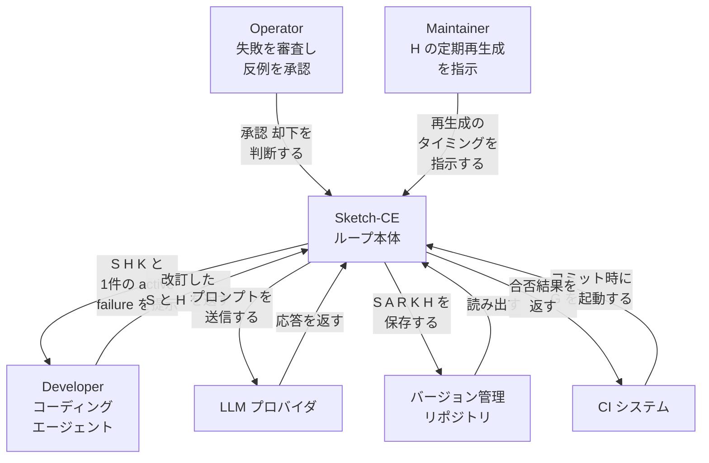
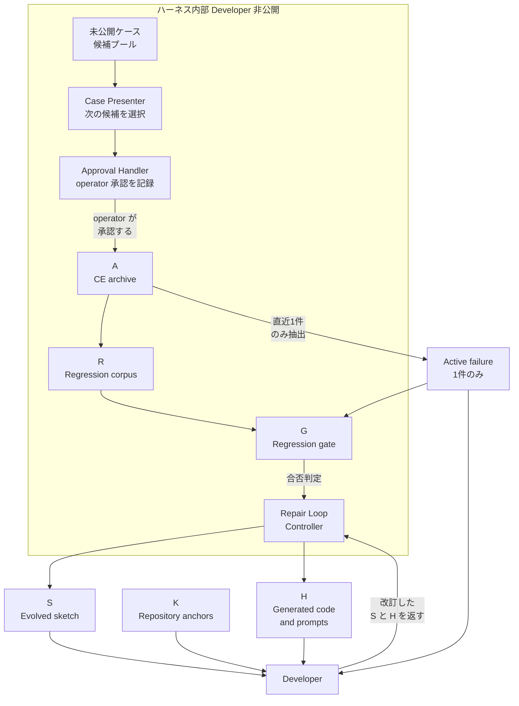
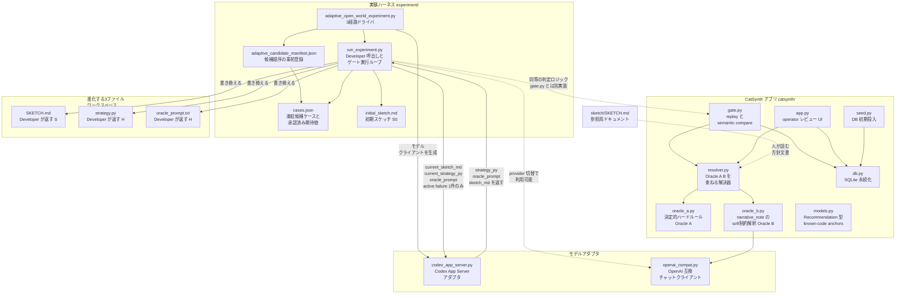
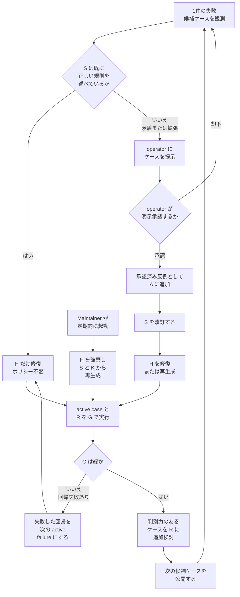
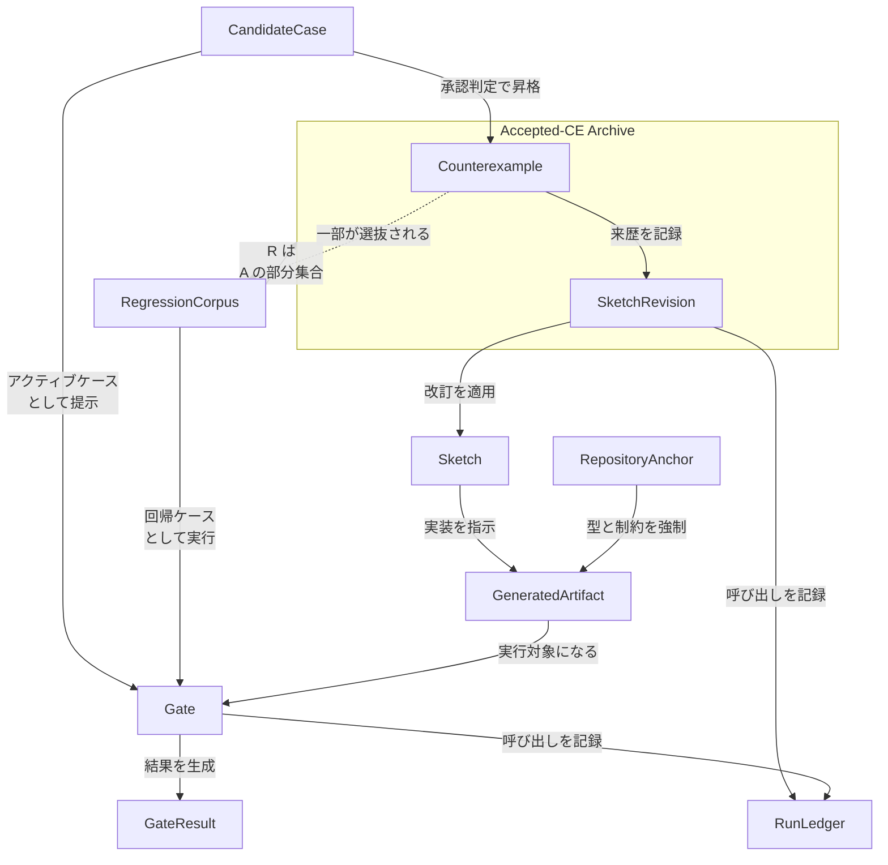
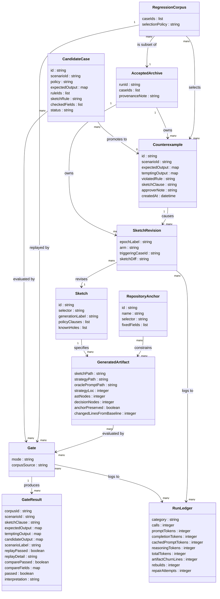
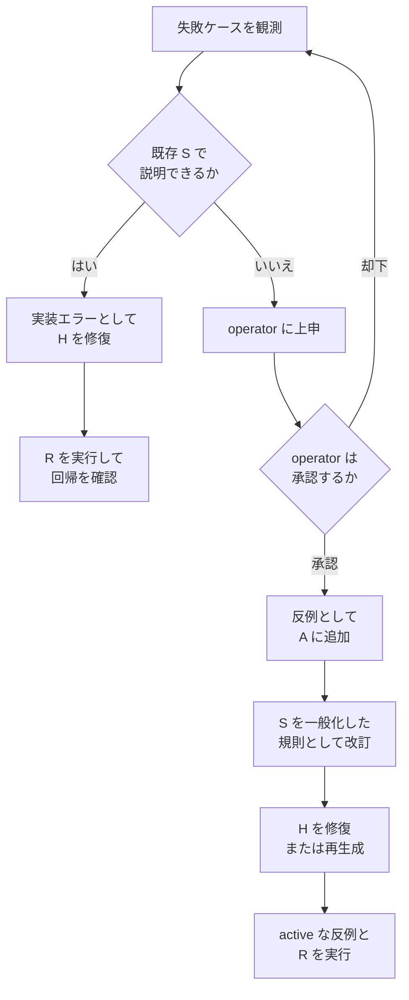

コーディングエージェントは、失敗した具体例を直せます。しかし、その失敗を生んだドメイン規則までは残しません。規則が会話履歴やその場のプロンプトにしか存在しないと、次にエージェントがコードを再生成したとき、レビュー済みのはずの制約が再び欠落します。

2026-07-17 に arXiv へ投稿された論文 [Agentic Synthesis against Counterexample-Supplemented Sketches](https://arxiv.org/abs/2607.15854) は、この「学んだはずの規則が消える」問題に答えます。承認された反例だけがリポジトリ内のポリシー成果物を書き換える、という制約を置く手法です。本記事では以下、Sketch-CE と呼びます。

論文と公開実装 [open-horizon-labs/counterexample-supplemented-sketches](https://github.com/open-horizon-labs/counterexample-supplemented-sketches) を一次情報として、構造・データ・構築・利用・運用を整理します。

| 項目 | 内容 |
|---|---|
| 論文 | Agentic Synthesis against Counterexample-Supplemented Sketches |
| arXiv | [2607.15854](https://arxiv.org/abs/2607.15854) |
| 著者 | Muness Castle, Eric Rubeck |
| 投稿日 | 2026-07-17 |
| 公開実装 | [open-horizon-labs/counterexample-supplemented-sketches](https://github.com/open-horizon-labs/counterexample-supplemented-sketches) |
| リポジトリ作成日 | 2026-07-14 |

> **評価規模の注意**: 中核結果は単一モデル (GPT-5.4-mini, low effort)・単一 reveal order・1 回の実行に基づきます。承認ストリームは事前に凍結した候補ケースによるシミュレーションであり、ライブの人間承認ではありません。ドメインは合成された猫アプリ (CatSynth) です。一般化された性能比較としてではなく、ポリシーを成果物として保存する設計手順として読むのが妥当です。

## 概要

Sketch-CE は、コーディングエージェントによるリポジトリ内のコード生成・修復に、**明示承認された反例でしか変化しないポリシー成果物**を組み込む手法です。

### 解く問題

論文はコーディングエージェントの既知の弱点を出発点にしています。

> Coding agents can fix a failing example without preserving the domain rule that made it fail, so later generations can repeat the same plausible mistake.

失敗した具体例を直せても、その失敗を生んだドメイン規則が残りません。Sketch-CE は、ポリシーをリポジトリ内のバージョン管理された成果物として固定する形で答えます。


### 位置づけ

Sketch-CE は「完全な仕様が最初から存在するか」で適用場面を切り分けます。

| 状況 | 選ぶべき方針 |
|---|---|
| Closed world: 完全な仕様が実装前から存在する | 仕様から生成し、そのゲートに対して修復する (spec-first) |
| Open world: 実装が始まってから重要なポリシーが失敗を通じて判明する | Sketch-CE でスケッチと実装を並行して進化させる |

リポジトリの README は前者について「Spec-first is the better choice when a complete specification actually exists.」と明記しています。Sketch-CE が対象とするのは後者です。

CatSynth は**両方の run をキャプチャしています**。closed-world 実行では Developer が完全な不変仕様と空ファイルを受け取り、1 世代 + 3 リペアで 21 件のゲートケースすべてを通過しました。承認後評価も visible 20/20・withheld 21/21 を通過しています。トークンは承認まで 611,519、評価を含めて 851,448 でした。この run は [`experiment/results/gpt-5.4-mini-spec-first-20260712/`](https://github.com/open-horizon-labs/counterexample-supplemented-sketches/blob/main/examples/catsynth/experiment/results/gpt-5.4-mini-spec-first-20260712/README.md) で監査できます。

> 仕様が実在するなら spec-first の方が結果もコストも良好です。本手法は「仕様が事前に存在しない」場合の選択肢である点を、最初に押さえてください。

論文は CEGIS の「反例生成 → 改訂 → 検証」のリズムを借用しつつ、その証明力は引き継いでいないと明記しています。ゲートが緑になっても保証されるのは「現在の実装 `H` がエンコード済みチェック `G(R)` を通過した」という事実だけです。

### 論文が明記する限界

本手法の評価は 1 回の実行に基づきます。論文 abstract の最終文がその範囲を定めています。

> with one model and one reveal order, they do not establish general superiority or correctness beyond the encoded checks.

- 中核結果は **単一モデル (GPT-5.4-mini, low effort)・単一 reveal order・1 回の実行**に基づく
- 承認ストリームは実行前に凍結した候補ケースと期待出力による**シミュレーション**。ライブの人間承認ではない
- ドメインは合成された猫アプリ (CatSynth)。ペット選択や医療助言の実例ではない
- 公開実装は 2026-07-14 作成・star 1 の小規模リポジトリ。本番運用の事例は確認できない

### 関連手法との比較

| 比較対象 | 学習したポリシーの置き場所 | エージェントに渡す文脈 | 人間の関与 | 再生成可能性 |
|---|---|---|---|---|
| CEGIS | 形式仕様・制約そのもの。独立したポリシー成果物を持たない | 1 件の反例。SAT/SMT で自動発見 | なし。検証器が自動判定 | 仕様が同じなら常に同じ解へ再合成できる |
| 従来の sketch-based synthesis | プログラマが事前に書く sketch のホール制約 | sketch と形式仕様 | sketch 記述時のみ。合成自体は自動 | 形式的な検証範囲内では高い |
| test-driven な agent 修復 | どこにも残らない。会話履歴や差分に暗黙的に残るのみ | 失敗したテストとトレース | テスト作成時のみ。修正内容の承認は薄い | 低い。再生成すると同じ失敗を繰り返しやすい |
| few-shot 方式 (承認済み例をプロンプトに積む) | プロンプト履歴上の例の集合。リポジトリ成果物ではない | 承認済み全例をバルクで注入 | 例の承認のみ。規則の文章化はしない | 例に依存し、トークンコストが増大しやすい |
| spec mining | 自動推定されたモデル・不変条件 | 実行トレース群 | 通常なし。人間レビューは後付け | 推定精度に依存し誤検出を含みうる |
| **Sketch-CE** | **リポジトリ内の進化するスケッチ `S`** | **1 件の active failure のみ** | **operator の明示承認が反例化の必須条件** | **定期的なクリーン再生成が `S` の捕捉力を検査する** |

### 学術系譜

- **CEGIS**: 候補解を反例で反証し、反例を制約に加えて再合成する枠組みです。形式仕様と決定手続きの上で動作します。Sketch-CE は検証器を「リポジトリのエンコード済みゲート」に置き換え、証明力を放棄しています。
- **sketch-based program synthesis**: Solar-Lezama の博士論文 "Program Synthesis by Sketching" (2008) が起点です。プログラマがホール付きの部分プログラムを書き、合成器が詳細を埋めます。Sketch-CE はこの発想をリポジトリ規模の運用に持ち込み、**骨格自体も承認済み反例に応じて進化させます**。
- **test-driven な agent 修復**: 失敗テストをエージェントに渡して直させるアプローチです。Sketch-CE は失敗のたびに「実装エラーとして直すか」「ポリシーとしてスケッチに昇格させるか」を operator に分岐させ、後者だけがリポジトリ成果物を変えます。
- **spec mining**: 実行トレースから仕様を推定する研究群です。自動推定である点が異なります。Sketch-CE のスケッチ改訂は operator の明示承認を必須とします。

## 特徴

論文とリポジトリで繰り返し使われるキーワードは "repository-native"・"open-world"・"provenance" の 3 語です。

- **repository-native (リポジトリ生来)**: ポリシーが会話やチケットではなく、リポジトリ内の 6 アーティファクト (`S` / `A` / `R` / `K` / `H` / `G`) として存在します。
- **open-world (実装しながら判明する世界観)**: 重要なポリシーは実装が始まってから失敗を通じて明らかになる、という前提に立ちます。
- **provenance (来歴保存)**: 承認済み反例ごとに、operator の判断・アーカイブ記録・改訂されたスケッチ節が対応づけて保存されます。どのケースがどのポリシー変更を引き起こしたかを後から追跡できます。

その他の特徴です。

- Developer (コーディングエージェント) は常に **1 件の active failure だけ**を受け取ります。承認済みアーカイブ `A`・回帰コーパス `R`・未公開ケースを、バルクのプロンプト文脈としては渡しません。
- 失敗が既存のスケッチで説明できる場合は、実装エラーとして `H` だけを修復します。ポリシー `S` は変更しません。
- 失敗がスケッチと矛盾する、またはスケッチを拡張する場合のみ operator に上げます。**operator の明示承認だけが反例化を許可**します。モデルは自分のポリシー変更を承認できません。
- 定期的に生成済みコード `H` を破棄し、`S` と `K` だけから再生成して `G(R)` を通します。この再生成でアーカイブがプロンプト文脈として必要になった場合、スケッチがポリシーを捕まえきれていない証拠と解釈します。
- スケッチには**規則**を書きます。承認された具体的な入出力の行をそのまま貼ることを禁じています。

### メソッドの 6 アーティファクト

README が定義する 6 つの役割です。

| 記号 | アーティファクト | 役割 |
|---|---|---|
| `S` | Evolved sketch | レビュー済みポリシーと既知の穴 |
| `A` | Accepted-counterexample archive | 承認された修正とスケッチ変更の完全な記録 |
| `R ⊆ A` | Regression corpus | 異なるポリシー境界を守る選抜ケース |
| `K` | Repository anchors | 固定インタフェース・型・known-code 制約 |
| `H` | Generated code and prompts | 現行スケッチの置換可能な実装 |
| `G` | Regression gate | active case と `R` を実行し、実際出力と承認出力を比較 |

`Developer` はスケッチ・コード・プロンプトを編集するコーディングエージェントを指します。

### 10 ステップのループ

README「The method」が正本です。

1. インタフェース・既知の戦略・残る穴を述べた初期スケッチ `S0` を書く
2. `S0` と `K` を Developer に与え、最初の実装 `H0` を生成させる
3. 1 件の具体的な失敗を観測する
4. `S` が既に正しい規則を述べているなら実装エラーとして扱う。その 1 件だけを Developer に渡し、ポリシーを変えずに `H` を修復する。`R` を実行し、回帰を直してから次のケースを観測する
5. 失敗が `S` に矛盾する、または `S` を拡張するなら operator に上げる。operator はケース・修正後の出力・誘惑的な誤り出力・欠けていた規則をレビューする。**明示承認だけが反例化を許す**
6. 承認された反例を `A` に追加する
7. Developer に `S`・`H`・`K`・その 1 件の active な反例を渡す。Developer は改訂スケッチ `S'` と必要なコード・プロンプト変更を返す。operator はスケッチ改訂が承認済みの修正と整合するか確認する
8. active な反例と `R` を実行する。回帰が落ちたらそれを次の active failure として改訂スケッチのもとで修復する。**ゲートが通るまで次のケースを公開しない**
9. 既存の選抜ケースがカバーしていないポリシー境界を守る場合、その反例を `R` に追加する。`R` が小さくても、承認済み反例は全件 `A` に残す
10. 定期的に `H` を破棄し、`S` と `K` から再生成して `G(R)` を実行する。**再生成にアーカイブがプロンプト文脈として必要なら、スケッチがポリシーを捕まえきれていない証拠**。その後ステップ 3 に戻る

## 構造

Sketch-CE の論理構造を C4 model の 3 段階で示します。

### システムコンテキスト図

アクターとループ本体、外部システムの関係です。



| 要素名 | 説明 |
|---|---|
| Operator | 失敗ケースを審査し、反例として承認または却下します |
| Maintainer | `H` の定期的な破棄と再生成を指示します |
| Sketch-CE ループ本体 | 6 アーティファクトを管理し、ケース提示と修復ループを制御します |
| Developer | スケッチ・コード・プロンプトを編集するコーディングエージェントです |
| LLM プロバイダ | Developer の応答や Oracle 判定を生成する外部モデル基盤です |
| バージョン管理リポジトリ | 6 アーティファクトを永続化する外部リポジトリです |
| CI システム | コミット時に回帰ゲートを起動する外部システムです |

### コンテナ図

ループ本体をドリルダウンします。**Developer が受け取れる情報は `S`・`K`・`H`・1 件の active failure だけ**です。`A`・`R`・未公開ケースはハーネス内部にとどまります。



境界を越えて Developer に渡る反例情報は、`A` から `Active failure` への 1 本の矢印だけです。この矢印が情報境界を表します。

#### ハーネス内部 Developer 非公開

| 要素名 | 説明 |
|---|---|
| 未公開ケース候補プール | まだ提示していない候補ケースの集合です |
| Case Presenter | 未公開プールから次の候補を選びます |
| Approval Handler | operator の承認可否を記録します |
| A CE archive | 承認された修正とスケッチ変更の完全な記録です |
| R Regression corpus | 異なるポリシー境界を守る選抜ケースです |
| G Regression gate | active case と `R` を実行し、実際出力と承認出力を比較します |
| Repair Loop Controller | Developer 呼び出しと合否判定を制御します |

#### Developer に開示される情報

| 要素名 | 説明 |
|---|---|
| Active failure 1件のみ | 直近に抽出された単一の失敗ケースです |
| S Evolved sketch | レビュー済みポリシーと既知の穴です |
| K Repository anchors | 固定インタフェース・型・known-code 制約です |
| H Generated code and prompts | 現行スケッチの置換可能な実装です |
| Developer | スケッチ・コード・プロンプトを編集するコーディングエージェントです |

この情報境界は実装でも確認できます。`run_experiment.py` の `developer_messages()` は、承認済みアーカイブに相当する `promoted` 引数を受け取ったうえで `del promoted` によって明示的に破棄し、Developer へのプロンプトには現行の 3 ファイルと 1 件の active failure だけを載せます。アーカイブ全体がバルク注入されるのは `one_shot` 系の経路のみで、これは後述する **replay-all の対照アーム**に属します。

### コンポーネント図

CatSynth 実装をドリルダウンします。図中のファイルはすべてリポジトリに実在します。



#### 実験ハーネス experiment/

| 要素名 | 説明 |
|---|---|
| adaptive_open_world_experiment.py | Sketch-CE 本体と 2 つの対照アームを駆動する 3 経路ドライバです |
| run_experiment.py | Developer 呼び出しとゲート実行ループを実装します。active failure を 1 件だけ渡す `developer_messages` 関数を持ちます |
| adaptive_candidate_manifest.json | 候補ケースの ID 順序を実行前に登録し、sha256 で改変を検知します |
| cases.json | 凍結された候補ケースと承認済み期待値を保持します |
| initial_sketch.md | Developer に与える初期スケッチ `S0` です |

#### CatSynth アプリ catsynth/

| 要素名 | 説明 |
|---|---|
| gate.py | replay と semantic compare の 2 層でゲート `G` を実装します。教材 UI が使います |
| oracle_a.py | ハードルールを決定的に適用する Oracle A です |
| oracle_b.py | 自由記述の narrative_note を soft 制約に変換する Oracle B です |
| resolver.py | Oracle A を主経路とし、Oracle B の soft 制約を合成するハイブリッド解決器です |
| app.py | operator が候補を確認し承認を記録するレビュー UI です。Developer を呼び出しません |
| db.py | breeds・rules・scenarios・golden_corpus・gate_runs を保持する SQLite 永続化層です |
| models.py | `Recommendation` 等の型定義です。known-code anchors `K` に相当します |
| seed.py | データベースへ初期データを投入します |

#### モデルアダプタ

| 要素名 | 説明 |
|---|---|
| codex_app_server.py | Codex App Server の JSON-RPC を話すアダプタです。3 経路実験で使います |
| openai_compat.py | OpenAI 互換のチャットクライアントです。Oracle B や `run_experiment.py` の別プロバイダ指定で使います |

#### 進化する3ファイル ワークスペース

| 要素名 | 説明 |
|---|---|
| SKETCH.md | Developer が世代ごとに返す `S` です |
| strategy.py | Developer が世代ごとに返す `H` の実装本体です |
| oracle_prompt.txt | Developer が世代ごとに返す `H` のプロンプト部分です |
| sketch/SKETCH.md | 教材 UI が参照する人間可読の方針文書です。実験のワークスペース版とは別ファイルです |

`gate.py` と `run_experiment.py` は、いずれも `G` の役割を実現しますが**別実装**です。`run_experiment.py` は自動実験用に `evaluate_case` / `run_gate` を内部に持ち、`gate.py` は教材 UI 向けに replay と semantic compare の 2 層ゲートを提供します。

### 制御フロー図

失敗の分岐と、ゲートが緑になるまで次のケースを公開しないループです。



| 要素名 | 説明 |
|---|---|
| 1件の失敗候補ケースを観測 | Developer 生成後に観測された単一の失敗です |
| S は既に正しい規則を述べているか | 実装エラーか、ポリシーの穴かを分ける分岐条件です |
| H だけ修復 ポリシー不変 | 実装エラーとして扱い、`S` を変更しません |
| operator にケースを提示 | 矛盾または拡張として operator に上げます |
| operator が明示承認するか | 明示承認だけが反例化を許します |
| 承認済み反例として A に追加 | 承認された修正をアーカイブに記録します |
| S を改訂する | 承認された変更をスケッチへ反映します |
| H を修復または再生成 | 改訂後のスケッチに合わせて実装を更新します |
| active case と R を G で実行 | 直近ケースと回帰コーパスをゲートで検証します |
| G は緑か | ゲートの合否を分ける分岐条件です |
| 失敗した回帰を次の active failure にする | 緑になるまで次のケースを公開しません |
| 判別力のあるケースを R に追加検討 | 異なるポリシー境界を守るケースを選抜します |
| 次の候補ケースを公開する | ゲートが緑の場合だけ次を公開します |
| Maintainer が定期的に起動 | `H` の陳腐化を防ぐトリガーです |
| H を破棄し S と K から再生成 | 定期的なクリーン再生成です |

## データ

### 概念モデル

`AcceptedArchive` は `Counterexample` と `SketchRevision` を所有します。`RegressionCorpus` は `AcceptedArchive` の部分集合 (`R ⊆ A`) であり、所有関係ではなく矢印で表現します。



| 要素名 | 説明 |
|---|---|
| Sketch | レビュー済みポリシーと既知の穴を保持する現行スケッチ `S` |
| CandidateCase | 提示前の凍結候補ケース。承認判定で反例に昇格するか coverage として棄却される |
| Counterexample | 承認済みの反例。入力・承認出力・誘惑的な誤り出力・欠けていた規則・承認者の記録を持つ |
| AcceptedArchive | 承認された反例とスケッチ変更の完全な記録 `A` |
| RegressionCorpus | ポリシー境界を守るために選抜された `AcceptedArchive` の部分集合 `R ⊆ A` |
| RepositoryAnchor | 固定インタフェース・型・known-code 制約 `K` |
| GeneratedArtifact | 現行スケッチの置換可能な実装 `H` |
| Gate | active case と回帰コーパスを実行し、実際出力と承認出力を比較する回帰ゲート `G` |
| GateResult | ゲートの 1 ケース分の実行結果。replay と compare の合否と詳細 |
| SketchRevision | どの反例がどのスケッチ改訂を引き起こしたかの来歴リンク |
| RunLedger | model calls・tokens・artifact churn 行数の記録 |

`RegressionCorpus` から `AcceptedArchive` への矢印は所有ではなく部分集合関係です。実装 `gate.py` の docstring がこの区別を明記しています。

> CatSynth uses every operator-approved CE as a regression, so R = A in this small teaching app. The general method may curate R as a subset of archive A.

CatSynth では規模が小さいため `R = A` (承認済み 8 件がそのまま回帰ケース) ですが、**一般のメソッドはこの一致を要求しません**。


### 情報モデル

属性は `cases.json`・`adaptive_candidate_manifest.json`・`gate.py`・`models.py`・`db.py`・実行結果キャプチャから抽出しています。



| 要素名 | 説明 |
|---|---|
| Sketch | `SKETCH.md` の実体。ポリシー節と `Holes` (未定義事項) の節を持つ |
| CandidateCase | `cases.json` の 1 エントリ。昇格すると `status` が `promoted`、棄却されると `coverage-not-promoted` になる |
| Counterexample | 昇格後の反例。SQLite の `golden_corpus` 行と `promoted-corpus.json` の 1 エントリに対応する |
| AcceptedArchive | 実行キャプチャでは `promoted-corpus.json` に対応。CatSynth では `golden_corpus` テーブルが `A` と `R` を兼ねる |
| RegressionCorpus | 一般には `A` の部分集合。CatSynth では `golden_corpus` テーブルそのもの |
| RepositoryAnchor | `models.py` の `Breed` / `OwnerProfile` / `Operation` / `Recommendation` |
| GeneratedArtifact | `SKETCH.md` / `strategy.py` / `oracle_prompt.txt` の 3 ファイル一式 |
| Gate | `gate.py` の `run_gate` 関数。`mode` は resolver モード |
| GateResult | `run_gate` がケースごとに返す辞書。replay と compare の 2 層で合否を分ける。`scenario_label` は表示用のラベル |
| SketchRevision | `generations/<epoch>/metadata.json` に記録される 1 回の Developer 修復 |
| RunLedger | `results.json` の `tokens.by_category` と `metrics` |

#### 属性の根拠づけ

| 要素名 | 主な根拠ファイル | 補足 |
|---|---|---|
| Sketch | `examples/catsynth/sketch/SKETCH.md` | `Policy-bearing fields` / `State gap` / `Holes` の節構成を確認。`generationLabel` はディレクトリ名から実装補完 |
| CandidateCase | `experiment/cases.json`、`adaptive_candidate_manifest.json` | `cases.json` は 14 件。`status` は `discovery/*.json` から実装補完 |
| Counterexample | `catsynth/db.py` の `golden_corpus` スキーマ、`discovery/*.json` | `temptingOutput` は `tempting_json` 列で裏付け。`approverNote` は `note` 列から実装補完 |
| AcceptedArchive | `results/<run>/promoted-corpus.json` | 8 件のリスト。`runId` はディレクトリ名から実装補完 |
| RegressionCorpus | `catsynth/gate.py` docstring、`catsynth/db.py` | `selectionPolicy` は一般化のための実装補完。CatSynth に該当フィールドは存在しない |
| RepositoryAnchor | `catsynth/models.py` | 冒頭コメント "Domain types = known-code anchors (K)" が根拠 |
| GeneratedArtifact | `results/<run>/arms/*/generations/*/`、`results.json` の `quality` | LOC・decision nodes 等は `results.json` から抽出 |
| Gate | `catsynth/gate.py` | `run_gate(conn, mode="policy", ...)` のシグネチャから抽出 |
| GateResult | `catsynth/gate.py` の `run_gate` 内 | `corpus_id` `scenario_id` `scenario_label` `sketch_clause` `expected` `tempting` `candidate` `replay` `compare` `passed` `interpretation` を実装から直接抽出 |
| SketchRevision | `arms/sketch-ce/generations/<epoch>/metadata.json` | `arm` `corpus_ids` `developer.diffs` を確認 |
| RunLedger | `results/<run>/results.json` | `tokens.by_category` と `metrics` を実装から直接抽出 |

#### 永続化レイアウト

`<run>` は `gpt-5.4-mini-adaptive-open-world-v2-20260712` を指します。

| アーティファクト | 保存パス | 備考 |
|---|---|---|
| CandidateCase (凍結候補プール) | `examples/catsynth/experiment/cases.json` | 14 件 |
| 昇格ルール | `examples/catsynth/experiment/adaptive_candidate_manifest.json` | `promotion_rule` / `control_rule` / `stop_rule` / `publication_gate` |
| 実行スケジュール | `examples/catsynth/experiment/open_world_schedule.json` | `epoch` / `case_id` / `loop_type` / `decision` / `approved_clause` |
| 隠し spec 回帰ケース | `examples/catsynth/experiment/spec_regression_cases.json` | `spec-0xx` id |
| 反例判定の実行キャプチャ | `experiment/results/<run>/discovery/ce-XXX.json` | `counterexample` / `evaluation_before_promotion` / `status` |
| AcceptedArchive の実行キャプチャ | `experiment/results/<run>/promoted-corpus.json` | 8 件 |
| golden_corpus テーブル | CatSynth の SQLite (`catsynth/db.py` の `SCHEMA`) | `id` `scenario_id` `expected_json` `tempting_json` `violated_rule` `sketch_clause` `note` `created_at` |
| gate_runs テーブル | CatSynth の SQLite | `id` `created_at` `resolver_mode` `passed` `summary_json` |
| Sketch の世代スナップショット | `results/<run>/arms/<arm>/generations/<epoch>/SKETCH.md` | epoch ごとの版 |
| GeneratedArtifact 3 点セット | 同階層の `strategy.py` / `oracle_prompt.txt` | Developer が生成する置換可能実装 |
| SketchRevision のメタデータ | `arms/<arm>/generations/<epoch>/metadata.json` | `active_failure` / `corpus_ids` / `developer.diffs` |
| RunLedger | `experiment/results/<run>/results.json` | `developer`・`tokens.by_category`・`metrics.artifact_churn_lines` |
| RepositoryAnchor 実体 | `examples/catsynth/catsynth/models.py` | `Breed` / `OwnerProfile` / `Operation` / `Recommendation` |
| Gate 実装 | `examples/catsynth/catsynth/gate.py` | `replay` / `semantic_compare` / `run_gate` |

#### アーティファクト命名規約

`.oh/knowledge/task-line-parser/` は、6 アーティファクトがファイル命名としてどう現れるかを観察できる実例です。ファイル名プレフィックスと frontmatter の `rna.kind` が 1 対 1 で対応します。

| プレフィックス | `rna.kind` | 対応するアーティファクト |
|---|---|---|
| `sketch.*` | `sketch` | `S` (Evolved sketch) |
| `ce.*` | `counterexample` | `A` の要素 |
| `test.*` | `verification_check` | `G` の検証観点 |
| `execution.*` | `execution_point` | 反例が `H` のどこで処理されたかのリンク |
| `implementation.*` | `generated_artifact` | `H` (Generated code and prompts) |
| `known-code.*` | `known_code_anchor` | `K` (Repository anchors) |
| `session.*` | `agent_session` | 6 アーティファクトの外側の実行文脈 |

`ce.*` の frontmatter は `relationships` に `tests_tempting_patch`・`verified_by`・`handled_by` を持ち、反例の属性構成を裏付けます。`G` に対応する単独の `gate.*` プレフィックスは存在せず、`test.*` がゲートの検証観点を担います。

## 構築方法

### 前提条件

| 項目 | 内容 |
|---|---|
| Python | Python 3 系 |
| パッケージ管理 | `uv` (公式再現コマンドが使用)、または `venv` + `pip` |
| 依存パッケージ | `fastapi==0.115.6` / `uvicorn==0.34.0` / `requests==2.32.3` |
| Codex App Server 経路 | ローカルに `codex` CLI がインストール・認証済みであること |
| OpenAI 互換経路 | `GET /v1/models`・`POST /v1/chat/completions`・JSON Schema structured output・usage フィールドを備えたエンドポイント |

リポジトリには `pyproject.toml` も `uv.lock` も存在せず、`uv run --with-requirements requirements.txt` でその場の依存解決を行う運用です。CI 設定やパッケージ配布は整備されていません。

### 3 経路比較実験を動かす

論文の実験本体は `experiment/adaptive_open_world_experiment.py` です。

```bash
cd examples/catsynth
uv run --with-requirements requirements.txt \
  python experiment/adaptive_open_world_experiment.py \
  --model gpt-5.4-mini \
  --max-repairs 12
```

このスクリプトは **Codex App Server 固定**です。`--provider` フラグは存在しません。

#### CLI 引数リファレンス: adaptive_open_world_experiment.py

`argparse` の定義から確認した結果です。**必須引数と位置引数はありません**。

| 引数 | 型 | デフォルト | 説明 |
|---|---|---|---|
| `--output` | Path | `experiment/artifacts/adaptive-open-world-<UTC timestamp>` | 結果の出力先ディレクトリ |
| `--model` | str | 環境変数 `CATSYNTH_CODEX_MODEL`、未設定なら `gpt-5.3-codex-spark` | Codex App Server に渡すモデル名 |
| `--max-repairs` | int | `12` | 1 epoch あたりの最大リペア回数。超えると `ExperimentError` |

#### CLI 引数リファレンス: run_experiment.py

closed-world の spec-first / one-shot 系に使うもう 1 つのエントリポイントです。3 経路比較には使いません。

| 引数 | 型 | デフォルト | 説明 |
|---|---|---|---|
| `--provider` | `codex-app-server` \| `openai-compatible` | `codex-app-server` | モデルバックエンド選択 |
| `--base-url` | str | 環境変数 `CATSYNTH_LLM_BASE_URL`、未設定なら `http://127.0.0.1:8080/v1` | `openai-compatible` 選択時のエンドポイント |
| `--model` | str | provider に応じて既定値 | モデル名 |
| `--output` | Path | `experiment/artifacts/<run_id>` | 出力先 |
| `--max-repairs` | int | `12` | 最大リペア回数 |
| `--one-shot-source-run` | Path | なし | 他 run の承認済みアーカイブと最終スケッチで one-shot + repair のみ実行 |
| `--one-shot-canonical` | フラグ | `False` | 同梱の初期スケッチ + complete corpus から one-shot + repair を実行 |
| `--spec-first` | フラグ | `False` | 例を与えず完全な仕様から一発生成 + repair を実行 |

`--one-shot-source-run` / `--one-shot-canonical` / `--spec-first` は排他です。2 つ以上指定すると `SystemExit` になります。

```bash
# closed-world spec-first を実行する
cd examples/catsynth
uv run --with-requirements requirements.txt \
  python experiment/run_experiment.py \
  --provider codex-app-server \
  --model gpt-5.4-mini \
  --max-repairs 12 \
  --spec-first
```

### モデルバックエンドを設定する

#### Codex App Server

`catsynth/codex_app_server.py` の `CodexAppServerClient` が実装です。

- サブプロセス `codex app-server --stdio` を起動し、改行区切り JSON-RPC で通信します
- `effort="low"` / `summary="none"` / `personality="none"` はクラス属性として固定です。CLI から変更できません
- 1 モデル呼び出しごとに `ephemeral: true` の使い捨てスレッドを開始します
- `allowProviderModelFallback: false`・`approvalPolicy: "never"`・`permissions: ":read-only"`・`environments: []`・`dynamicTools: []` を固定送信し、ツール呼び出しと環境アクセスを無効化します
- 認証はこのファイルの責務外です。インストール・認証済みの `codex` CLI に委ねられます

```python
# codex_app_server.py の環境変数 (実装から抜粋)
DEFAULT_CODEX_MODEL = os.environ.get(
    "CATSYNTH_CODEX_MODEL", "gpt-5.3-codex-spark"
)
```

#### OpenAI 互換 Chat Completions

`catsynth/openai_compat.py` の `OpenAICompatibleClient` が実装です。`run_experiment.py --provider openai-compatible` と、教材 UI の Oracle B から使われます。

| 環境変数 | デフォルト | 用途 |
|---|---|---|
| `CATSYNTH_LLM_BASE_URL` | `http://127.0.0.1:8080/v1` | エンドポイント URL |
| `CATSYNTH_LLM_MODEL` | `local-model` | モデル名 |
| `CATSYNTH_LLM_API_KEY` | `local` | `Authorization: Bearer <key>` ヘッダに使用 |
| `CATSYNTH_LLM_DIALECT` | `standard` | `ollama` 指定で `think` / `reasoning_effort` / `options.num_ctx` を追加送信 |

```bash
# OpenAI 互換エンドポイントで spec-first を実行する
CATSYNTH_LLM_API_KEY=local \
uv run --with-requirements requirements.txt \
  python experiment/run_experiment.py \
  --provider openai-compatible \
  --base-url http://127.0.0.1:8080/v1 \
  --model your-served-model \
  --spec-first
```

### 教材 UI を起動する

```bash
cd examples/catsynth
python3 -m venv .venv
source .venv/bin/activate
python3 -m pip install -r requirements.txt
python3 cli.py seed --no-wiki
python3 cli.py serve
```

起動後 `http://127.0.0.1:8000` を開きます。`serve` は内部で `uvicorn.run("catsynth.app:app", ...)` を呼びます。

| サブコマンド | 主な引数 | 説明 |
|---|---|---|
| `seed` | `--no-wiki` / `--refresh-wiki` | DB を初期化し猫種情報を取り込む |
| `gate` | `--mode {policy,naive}` (既定 `policy`) | 回帰コーパスに対してゲートを実行 |
| `suggest` | 位置引数 `scenario_id`、`--mode {policy,naive}` | 1 シナリオに対して resolver を実行 |
| `serve` | `--host` (既定 `127.0.0.1`) / `--port` (既定 `8000`) / `--reload` | ローカル Web UI を起動 |

教材 UI は **Developer を呼び出さず、リポジトリのスケッチも書き換えません**。DB パスは環境変数 `CATSYNTH_DB` で変更できます。


`policy` と `naive` はどちらも決定的なコードで、違いはルール表を適用するかどうかだけです。`naive` はゲートが捕まえるべき「もっともらしいが誤った修正」を再現します。


### キャプチャ済み run を監査する

`experiment/results/gpt-5.4-mini-adaptive-open-world-v2-20260712/` には実行済みの全世代が保存されており、**モデルを再度呼ばずに監査できます**。

```bash
# ディレクトリ構成を確認する
find examples/catsynth/experiment/results/gpt-5.4-mini-adaptive-open-world-v2-20260712 -maxdepth 2
```

| パス | 内容 |
|---|---|
| `arms/{sketch-ce,replay-all,evolved-sketch-rebuild}/generations/<epoch>/` | 各世代の `SKETCH.md` / `strategy.py` / `oracle_prompt.txt` / `metadata.json` |
| `arms/*/final/` | 各経路の最終状態 |
| `discovery/ce-*.json` | 14 候補ケースそれぞれの評価記録と `status` |
| `promoted-corpus.json` | 承認された 8 件の反例 |
| `protocol.json` | 候補順序・ソースハッシュ・promotion / control / stop ルール |
| `results.json` | 3 経路の集計結果 (機械可読) |

```bash
# 個別候補の承認/却下理由を読む
cat examples/catsynth/experiment/results/gpt-5.4-mini-adaptive-open-world-v2-20260712/discovery/ce-001-allergy-override.json
```

生の Codex App Server 通信ログは意図的にコミットされていません。監査で再現できるのは各世代のアーティファクト状態と `metadata.json` の要約までです。

```bash
# 同梱テストスイートを実行する
cd examples/catsynth
uv run --with-requirements requirements.txt \
  python -m unittest discover -s tests -v
```

## 利用方法

### 必須の運用制約

自分のリポジトリへ導入する前に、README と 3 つの flow ファイルが明記する制約を確認します。

| 制約 | 内容 | 出典 |
|---|---|---|
| Developer に渡す文脈は 1 件の active failure のみ | `A`・`R`・未公開候補ケースをバルクのプロンプト文脈として渡さない | README「The agent never receives either collection as bulk prompt context」 |
| ゲートが緑になるまで次のケースを見せない | 回帰が落ちたらそれを次の active failure として修復する | README ステップ 8 |
| Developer は自分の反例を承認できない | 反例承認・ポリシー変更の権限を Developer に与えない | `flows/repair-from-counterexample.md` |
| 反例化は operator の明示承認だけが許す | 失敗が `S` を拡張・矛盾する場合のみ上申し、承認された場合だけ `A` に追加する | README ステップ 5 |
| 承認済み反例は必ずスケッチを変更する | スケッチが変わらない反例は誤分類または見直し不足のサイン | `flows/repair-from-counterexample.md` |
| 反例は一般化した規則として書く | 承認された具体行をそのままスケッチに貼らない | `flows/repair-from-counterexample.md`「State the broader rule; do not paste the concrete row」 |
| 定期的に `H` を破棄し `S` + `K` から再生成する | 再生成にアーカイブが必要なら、スケッチがポリシーを捕まえきれていない証拠 | README ステップ 10 |

### 初期スケッチ S0 の書き方

`experiment/initial_sketch.md` と `examples/task-line-parser/sketch.md` を読み比べると、良いスケッチの構成要素が見えます。

| 構成要素 | CatSynth の例 |
|---|---|
| インタフェース | `recommend(profile, breeds, rules, oracle_tags)` の入出力形を明記 |
| 既知の戦略 | 好みスコアの計算式 (重み付け・タイブレーク規則) を確定して書く |
| 開いている穴 | `rules` と `oracle_tags` を「reserved policy inputs. Do not invent their semantics before the sketch or an active counterexample defines them」と明記し、意味を先取りしない |
| fixture 特化の禁止 | 「Never inspect `scenario_id` or hard-code behavior for a named fixture」と明記 |
| 安全側フォールバック | 候補がすべて除外され該当ルールがなければ `escalate` を返す、と明記 |

テンプレート化すると次の形になります。

```markdown
# Initial sketch: <domain>

## Interface
<公開エントリポイントのシグネチャと返り値の形>

## Known strategy
<すでに確定している計算ロジック・優先順位・タイブレーク規則>

## Reserved / open inputs
<意味がまだ定義されていない入力を名指しする。
 active counterexample が定義するまで意味を先取りしないと明記する>

## Guardrails
- 特定の fixture / scenario_id を名指しした分岐を書かない
- ポリシーが未定義で安全な既定動作が自明でない場合は、
  推測せず escalate (安全側) を返す
```

### 3 つの flow: Developer に渡す指示書

`flows/` 配下の 3 ファイルは、そのまま自分のコーディングエージェントに移植できる中核資産です。

#### implement-from-sketch.md

- **読む対象**: スケッチ、known-code アンカー、精選済み回帰コーパス、既存テスト
- **禁止事項**: スケッチに書かれていない振る舞いを実装しない。アーカイブや回帰ケースから未言及のポリシーを推測しない
- **停止条件**: 回帰ケースがスケッチにない振る舞いを要求したら、実装を止めて operator 承認の反例プロセス経由でスケッチ改訂を求める
- **出力**: 実装 + 回帰コーパスに対するゲートレポート + スケッチだけから再生成できなかった振る舞いの明示

```markdown
## Rules (全 8 項目のうち 5 項目を抜粋)
- Preserve known-code style.
- Prefer explicit branches over clever parsing.
- Keep the implementation dependency-free.
- Implement only sketched behavior.
- Do not infer unstated policy from the CE archive or regression cases.
...
```

#### repair-from-counterexample.md

- **前提**: operator が明示承認した反例にのみ使う。スケッチが既に正しい規則を述べている場合は通常の回帰修復を使う
- **読む対象**: 現在のスケッチ、active な反例と operator 承認と正しい修正、現在の実装、known-code アンカー、精選済み回帰コーパス
- **タスク**: 反例が露呈した一般規則としてスケッチを改訂し、その改訂スケッチのもとで実装を修復または再生成する
- **出力**: operator レビュー用の改訂スケッチ、修復後の実装、ゲート結果、回帰サブセットへの追加推奨、却下が確認された誘惑的な誤り修正

```markdown
## Rules (全 7 項目のうち 4 項目を抜粋)
- Keep the counterexample strict.
- Do not let Developer accept its own counterexample or authorize its own policy change.
- Change the sketch for every accepted counterexample.
- State the broader rule; do not paste the concrete row into the sketch.
...
```

#### verify-known-code-style.md

- **タイミング**: 実装後に method contract を満たすかを検証する
- **検証項目**: 共有 result 形状を使っているか、validation で例外を投げていないか、純粋関数であり続けているか、回帰コーパスを通過するか、素朴な happy-path only 実装を落とせるか、アーカイブ全体を読まずにスケッチ + known-code アンカーだけから再生成できるか
- **出力**: pass/fail、未カバーのポリシー境界、known-code スタイル逸脱、まだ可能な誘惑的な誤り修正、コードにはあるがスケッチにない振る舞い

### 反例の記録フォーマット

`examples/task-line-parser/counterexamples.md` の各エントリは「入力 → 誘惑的な誤り修正 → 期待出力」の 3 点構成です。

```markdown
## First prefix only is status

Input:

    done: blocked: deploy app

Tempting wrong patch: split on every colon and treat `blocked:` as a second status.

Expected:

    TaskRecord(status="done", title="blocked: deploy app", reason=None)
```

同じ反例は `.oh/knowledge/task-line-parser/ce.*.md` にメタデータとしても登録されます。スケッチ側の該当範囲 (`selector`) と、テスト・実行記録への関連付け (`relationships`) を持つ点が特徴です。

```yaml
---
rna:
  kind: counterexample
  id: ce.task-line-parser.first-prefix-only-is-status
  name: "First prefix only is status"
  selector: "examples/task-line-parser/counterexamples.md:16-31"
  relationships:
    - kind: tests_tempting_patch
      target: split on every colon and treat a later status-looking prefix as a second status
    - kind: verified_by
      target: test.task-line-parser.first-prefix-only-is-status
    - kind: handled_by
      target: execution.task-line-parser.first-prefix-only-is-status.1
    - kind: handled_by
      target: execution.task-line-parser.first-prefix-only-is-status.2
---
```

1 つの反例に対して `handled_by` が複数並ぶ点に注目してください。同じ反例を確定させるまでに要した実行試行がすべて記録され、来歴として追跡できます。

`counterexamples.md` 冒頭には「A fresh implementation should not need this archive as prompt context. The evolved sketch carries the policy learned from these cases」という注記があり、アーカイブが監査用の記録であって Developer への通常のプロンプト文脈ではないことを明記しています。

### known-code アンカー K の書き方

`examples/task-line-parser/known_code/result.py` は、固定インタフェースをそのまま known-code アンカーとして提供する例です。

```python
@dataclass(frozen=True)
class Ok(Generic[T]):
    value: T
    ok: bool = True


@dataclass(frozen=True)
class Err:
    error: ParseError
    ok: bool = False


ParseResult = Ok[T] | Err
```

対応する `.oh/knowledge/task-line-parser/known-code.result.md` は、この型を `implementation.parse-task-line` に対する制約として登録します。

```yaml
---
rna:
  kind: known_code_anchor
  id: known-code.result
  name: "Ok/Err result shape"
  selector: "examples/task-line-parser/known_code/result.py"
  relationships:
    - kind: constrains
      target: implementation.parse-task-line
---
```

known-code アンカーは「Developer が変えてはいけない固定要素」を明示する仕組みです。スケッチがポリシーを担うのに対し、`K` は型・インタフェース・既存コードスタイルの不変条件を担います。

### operator の承認判断の基準

| 状況 | 判断 | Developer への指示 |
|---|---|---|
| 失敗が既存 `S` の記述どおりに説明できる | 実装エラー。ポリシーは正しい | `H` だけを修復する。ポリシーは変えない。`R` を実行し他の回帰を先に直す |
| 失敗が `S` と矛盾する、または `S` の範囲外 | 反例候補として operator に上申 | 修正案は出さず、修正後の出力・誘惑的な誤り出力・欠落している規則を添えて判断を仰ぐ |
| operator が却下 | 反例化しない | 観測ループに戻り次のケースを見る |
| operator が明示承認 | 反例として `A` に追加 | スケッチを一般化した規則として改訂し、`H` を修復または再生成。active な反例と `R` を実行 |
| 承認したのに `S` に変更が生じない | 誤分類または見直し不足のシグナル | 分類をやり直す。改訂なしの反例追加は認めない |



## 運用

### CatSynth 実験の構成: 1 つの手法と 2 つの対照アーム

数値を読む前に、3 経路の位置づけを正確に押さえます。README は次のように明記しています。

> The two rebuild paths are controls. They test what the evolved sketch carries and what retaining generated code contributes; they are not additional recommended methodologies.

| 経路 | 位置づけ | 何を測るためのものか |
|---|---|---|
| **Sketch-CE (retained code)** | **本手法** | 手法そのものの挙動 |
| Evolved-sketch rebuild | 対照アーム | 進化後スケッチが単独でポリシーを運べるか |
| Replay-all | 対照アーム | 承認済み例のバルク再提示と比べてどうか |

**2 つの rebuild は推奨手法ではありません。** 対照アームの数値は「スケッチという仕組みが機能しているか」の証拠であり、採用すべき経路の順位付けではありません。

### 実験結果

CatSynth の open-world 実行では、**14 件の凍結候補ケース中 8 件が反例に昇格**しました。残る 6 件は既に通過したため coverage として記録され、Developer には送られていません。3 経路すべてが承認済み 8 ケースを通過しています (8/8)。

| 指標 | Replay-all (対照) | Evolved-sketch rebuild (対照) | **Sketch-CE (本手法)** |
|---|---:|---:|---:|
| 全記録モデルトークン (評価含む) | 1,061,834 | 998,307 | 1,191,504 |
| Developer 呼出 | 15 | 16 | **9** |
| Developer トークン | 400,081 | 371,050 | 217,576 |
| 承認済み反例の評価 | 8/8 | 8/8 | 8/8 |
| **withheld 評価 (21 件)** | 15/21 | 19/21 | **18/21** |
| 追加リペア試行 | 6 | 7 | 0 |
| 初回試行時の既存回帰崩れ | 2 | 7 | 0 |
| 累積 artifact churn 行数 | 2,394 | 2,326 | **719** |
| 最終 strategy LOC | 224 | 228 | 298 |
| 最終 decision nodes | 77 | 70 | 110 |

3 経路の合計は **173 model calls / 3,251,645 recorded model tokens** です (承認後評価を含む)。Developer 呼出の合計は 15 + 16 + 9 = 40 件で、残りは Oracle と評価の呼び出しです。両者を混同しないでください。

> **withheld の数値を経路の優劣として読まないでください。** Sketch-CE の 18/21 は Evolved-sketch rebuild の 19/21 より低く見えますが、rebuild は**対照アーム**であり、Sketch-CE が探索して確定させた昇格スケジュールと進化後スケッチを**継承したうえで**再構築しています。両者は同じ仕事をしていません。この 2 つの数値が示すのは「進化後スケッチがポリシーを運べている」ことであり、採用すべき経路の順位ではありません。1 件差 (18 対 19) を単一 run の差として有意に扱うのも適切ではありません。

README はこの run から 2 つの所見を挙げています。

1. **この run の withheld ケースでは、進化後スケッチが例のバルク再提示よりポリシーをよく運んだ。** Evolved-sketch rebuild が 19/21、Replay-all が 15/21 でした。これは**スケッチという仕組みの有効性**を示す証拠であり、rebuild を採用せよという意味ではありません。
2. **コードを保持すると Developer の作業と churn が減った。** Sketch-CE は 9 呼出・217,576 Developer トークン・719 行の churn で、追加リペアも既存回帰崩れもゼロでした。ただし全モデルトークン合計は最大で、最終 strategy の行数と decision node は最多でした。これは継続性と手戻り削減を支持しますが、**最終的な保守性の優位を示すものではありません**。

> ⚠️ **トークン合計は end-to-end のコスト比較になりません。** README は「The totals do not cover the same work.」と明記しています。Sketch-CE は候補ストリームを探索し規則を提案するコストを払っていますが、2 つの対照アームはその結果生じた昇格スケジュールを**継承**しています。したがって対照アームの合計は Sketch-CE が含む discovery 作業を含みません。「どの経路が安いか」の順位付けには使えません。

これらはすべて **1 回の run・1 モデル (GPT-5.4-mini, low effort)・1 つの reveal order** で観測された数値です。他モデル・他ドメインで同じ傾向になるとは一般化できません。

### クリーン再生成の運用

本手法の中核的な健全性検査は、生成済みコード `H` を定期的に捨てて作り直すことです。

- `H` を破棄する
- 進化後スケッチ `S` とリポジトリアンカー `K` だけから作り直す
- 作り直した実装に回帰ゲート `G(R)` を通す

この検査には診断的な意味があります。README は「If regeneration needs the archived examples as prompt context, the sketch has not captured the policy well enough.」と述べています。`flows/implement-from-sketch.md` も同じ制約を「Do not infer unstated policy from the CE archive or regression cases.」と明記しています。

再生成が失敗したときの戻り先です。

| 失敗の内容 | 戻り先 | 対処 |
|---|---|---|
| `G(R)` を通すためにアーカイブをプロンプト文脈として渡す必要がある | ステップ 3 | `S` がポリシーを捕まえていない証拠として扱い、通常ループでスケッチを改訂する。アーカイブを渡してごまかさない |
| アーカイブなしで `G(R)` が単純に落ちる | ステップ 8 相当 | その失敗を次の active failure として渡し、現行スケッチのもとで修復する。ゲートが通るまで次のケースを公開しない |

実施頻度について、論文・README とも具体的な数値の指定はありません。原文は "periodically" とだけ述べています。

### 回帰コーパス R の育て方

`A` と `R` は役割が異なります。

- `A` は承認された反例を**全件保持**します
- `R` は「既存の選抜ケースがカバーしていないポリシー境界を守るとき」だけ追加します
- `R` に入れなかったケースも `A` からは削除しません

`flows/implement-from-sketch.md` はサイズ判断の基準を明示しています。

> Keep the regression corpus small enough to run routinely and strong enough to reject known tempting patches.

論文の Limitations も同じトレードオフを述べています。小さすぎる `R` は重要な境界を取りこぼし、無差別な `R` は高価なノイズになります。間引く対象は、他のケースと同じポリシー境界しか守っていない重複ケースです。`A` からは削除せず、`R` からだけ外します。

### 来歴の監査

監査で読むアーティファクトは 2 系統あります。

**1. `.oh/knowledge/` の命名規約**

`ce.*` の frontmatter を読むと、「どの誤った実装パターンを拒否するために存在するか」「どのテストで検証されているか」「何回の実行試行を経て確定したか」が `relationships` から一目でたどれます。

**2. CatSynth 実行キャプチャ**

`promoted-corpus.json` の各エントリは `id` / `scenario_id` / `policy` (承認された一般規則) / `sketch_rule` (実際にスケッチへ書かれた条項) / `rule_ids` / `expected` を持ちます。監査の実務は次の流れです。

- `policy` と `sketch_rule` を突き合わせ、承認理由どおりの一般規則がスケッチに落ちているか確認する
- 世代ごとの `metadata.json` の diff で、その反例由来の変更がどこに現れたかを追う

## ベストプラクティス

### operator 承認を人間が握り続ける

反例化を許すのは operator の明示的な承認だけです。README は「Only explicit approval turns the case into a counterexample.」と述べています。

- `flows/repair-from-counterexample.md` は「Do not let Developer accept its own counterexample or authorize its own policy change.」と明記しています
- 論文の Limitations も「Developer must not authorize its own policy changes.」と述べています
- CatSynth の検証実行ですら承認ストリームを実行前に凍結しています。**参照実装自身がモデルに承認権限を渡していません**

### 情報境界を守る

Developer が 1 サイクルで受け取れるのは `S`・`H`・`K`・**1 件の active な失敗ケース**だけです。

この境界を守る理由は、クリーン再生成の診断的な意味を成立させるためです。Developer が普段からアーカイブへ自由にアクセスできるなら、「再生成にアーカイブが要る = スケッチの説明力不足」という検査が意味を失います。

### スケッチに書くのは規則であり例ではない

反例を承認したら、具体的な入出力の行をそのまま貼るのではなく、その反例が例示する一般規則を書きます。具体例をそのまま貼ると、実質的にプロンプト履歴方式と同じ状態に退化し、`S` がポリシーを運ぶという前提が崩れます。

### ゲートが緑になるまで次のケースを公開しない

直前の反例由来の修正が回帰コーパスを通過するまで、次の候補ケースを Developer に渡しません。

### 既存の CI / レビュー体制への組み込み方

リポジトリ自体に CI ワークフロー設定は含まれていません。`.github/` ディレクトリが存在しないことを GitHub API で確認しています。

一方でゲート相当の仕組みはコードとして提供されています。

- `catsynth/gate.py` — replay と semantic compare を実装
- `python -m unittest discover -s tests -v` — CatSynth のテスト一式
- `flows/verify-known-code-style.md` — 実装後に確認する契約チェックリスト

`verify-known-code-style.md` の出力項目は、そのまま PR レビューのチェックリストに転用できます。`S` または `H` への変更が入る PR で `G(R)` を必須チェックにする組み込み方が自然です。ただしこれは README と flows から導ける**提案**であり、リポジトリが CI 設定を提供しているわけではありません。

### 向くプロジェクトと向かないプロジェクト

| 状況 | 推奨アプローチ | 根拠 |
|---|---|---|
| 完全な仕様が実装前から存在する (closed world) | 仕様から直接生成し、そのゲートに対して修復する | README「Spec-first is the better choice when a complete specification actually exists.」 |
| 実装を始めてから重要なポリシーが失敗を通じて判明する (open world) | Sketch-CE でスケッチと実装を並行して進化させる | README「Open world: failures will reveal important policy after implementation begins.」 |

仕様が事前に確定している領域に本手法を持ち込むのは過剰です。

## トラブルシューティング

### リポジトリの Issue 状況

GitHub 上の Issue を確認しました。

```bash
gh issue list --repo open-horizon-labs/counterexample-supplemented-sketches --state all
# → 0 件

# PR を除いた実 issue 件数を数える
gh api repos/open-horizon-labs/counterexample-supplemented-sketches/issues \
  --jq '[.[]|select(.pull_request==null)]|length'
# → 0
```

Issue が 0 件であることは「トラブルが起きていない」ことの証明にはなりません。作成から日が浅く、外部利用がまだ蓄積していない可能性が高いためです。**本番運用の事例は確認できません。**

### 運用上の失敗モード

README・flows・論文の Limitations の記述から構成した失敗モードです。

| 症状 | 原因 | 対処 |
|---|---|---|
| クリーン再生成が `G(R)` を通らない、またはアーカイブを渡さないと通らない | `S` がポリシーを十分に捕まえていない | ステップ 3 に戻り、通常ループで `S` を改訂する。アーカイブを渡してその場をしのがない |
| 同じ誤りが再発する | 個別の例だけを直し、一般規則が `S` に昇格していない | 該当ケースを反例として承認し直し、`S` に一般規則として書く。`flows/repair-from-counterexample.md`「a CE that produces no sketch change has been misclassified or incompletely reviewed.」 |
| 回帰がなかなか通らない、承認済みのはずのケースで矛盾した振る舞いが要求される | 誤った承認や誤った golden データが `S` または `R` に混入している可能性 | 該当ケースを domain reviewer が再点検し、「修正された答え」なのか「修正された仕様」なのかを切り分ける。必要なら承認を取り消し `S` を書き換える |
| ゲートの実行が遅い、回すコストが膨らむ | `R` の肥大化 | ルーチンで回せる小ささと既知の誤り実装を弾ける強さの両立点まで、重複した境界しか守らないケースを `R` から間引く。`A` からは削除しない |
| Developer が `S` にない振る舞いを実装しようとする | `S` に書かれていないポリシーをアーカイブや回帰ケースから推測しようとした | 実装を止め、operator 承認済みの反例プロセスを経てから `S` を改訂する |

「回帰が延々に直らない」原因を「ポリシー同士の直接的な矛盾」と断定する記述は、論文・README・flows のいずれにも見当たりませんでした。上表ではこの症状を、論文が明記する golden dataset quality と approval quality の限界に基づいて再構成しています。これは推論であり、論文がこの因果を明示しているわけではありません。

### CatSynth 実行時の技術的な失敗

`codex_app_server.py` と `openai_compat.py` のソースから確認できた失敗モードだけを記載します。

#### Codex App Server アダプタ

| 症状 | 原因 |
|---|---|
| `TimeoutError: timed out waiting for Codex App Server` | `_read()` が timeout 秒 (既定 300 秒) 以内に応答を受け取れない |
| `CodexAppServerError: App Server exited with <code>` | 応答待ち中に App Server プロセスの stdout が閉じた |
| `CodexAppServerError: <method> failed: {...}` | RPC 応答に `error` フィールドが含まれる |
| `CodexAppServerError: Codex turn failed [<code>]: <message>` | `turn/completed` や `error` の `codexErrorInfo` から終端エラーを抽出。プロバイダ側の認証・レート制限はこの経路で表面化する |
| `CodexAppServerError: bounded turn emitted forbidden tool/approval events` | ツール呼び出し・承認要求を禁止した bounded turn で、それらのイベントが発生した |

`codex` CLI がインストールされていない、または `PATH` 上にない環境では `subprocess.Popen` の時点で失敗します。この経路に専用の例外処理はありません。

#### OpenAI 互換アダプタ

| 症状 | 原因 |
|---|---|
| `HTTPError` (401 系) | `CATSYNTH_LLM_API_KEY` (既定 `local`) がエンドポイントの認証情報と一致していない |
| `HTTPError` (429 系・5xx 系) | エンドポイント側のレート制限・障害。**リトライやバックオフは実装されていません** |
| `HTTPError` (400 系、`response_format` 関連) | エンドポイントが `json_schema` 構造化出力 (`strict: true`) に対応していない |

`CATSYNTH_LLM_BASE_URL` (既定 `http://127.0.0.1:8080/v1`) が稼働中のエンドポイントを指していない場合は接続エラーになります。いずれのアダプタにも自動リトライはないため、一時的な障害に当たるとその呼び出し単位で処理が中断します。

## まとめ

Sketch-CE は、コーディングエージェントが学んだポリシーを会話履歴から引き剥がし、承認済み反例とスケッチというリポジトリ内の成果物へ固定する手法です。中核は「Developer に渡すのは 1 件の active failure だけ」「反例化は operator の明示承認だけが許す」「定期的なクリーン再生成がスケッチの捕捉力を検査する」の 3 つの制約にあります。

ただし評価は単一モデル・単一 reveal order・1 回の実行にとどまり、本番運用の事例も確認できません。数値を性能比較として読むのではなく、仕様が事前に確定しない領域で「失敗を再生成可能な規則へ昇格させる」設計パターンとして読むのが妥当です。

この記事が少しでも参考になった、あるいは改善点などがあれば、ぜひリアクションやコメント、SNSでのシェアをいただけると励みになります！

## 参考リンク

- 一次論文
  - [Agentic Synthesis against Counterexample-Supplemented Sketches (arXiv:2607.15854)](https://arxiv.org/abs/2607.15854)
  - [同 HTML 全文](https://arxiv.org/html/2607.15854v1)
- 公開実装
  - [open-horizon-labs/counterexample-supplemented-sketches](https://github.com/open-horizon-labs/counterexample-supplemented-sketches)
  - [README.md (メソッド定義の正本)](https://github.com/open-horizon-labs/counterexample-supplemented-sketches/blob/main/README.md)
  - [examples/catsynth/ (runnable supplement)](https://github.com/open-horizon-labs/counterexample-supplemented-sketches/tree/main/examples/catsynth)
  - [examples/catsynth/README.md](https://github.com/open-horizon-labs/counterexample-supplemented-sketches/blob/main/examples/catsynth/README.md)
  - [キャプチャ済み run (gpt-5.4-mini-adaptive-open-world-v2-20260712)](https://github.com/open-horizon-labs/counterexample-supplemented-sketches/tree/main/examples/catsynth/experiment/results/gpt-5.4-mini-adaptive-open-world-v2-20260712)
- 実装ソース
  - [catsynth/gate.py](https://github.com/open-horizon-labs/counterexample-supplemented-sketches/blob/main/examples/catsynth/catsynth/gate.py)
  - [catsynth/models.py](https://github.com/open-horizon-labs/counterexample-supplemented-sketches/blob/main/examples/catsynth/catsynth/models.py)
  - [catsynth/db.py](https://github.com/open-horizon-labs/counterexample-supplemented-sketches/blob/main/examples/catsynth/catsynth/db.py)
  - [catsynth/resolver.py](https://github.com/open-horizon-labs/counterexample-supplemented-sketches/blob/main/examples/catsynth/catsynth/resolver.py)
  - [catsynth/codex_app_server.py](https://github.com/open-horizon-labs/counterexample-supplemented-sketches/blob/main/examples/catsynth/catsynth/codex_app_server.py)
  - [catsynth/openai_compat.py](https://github.com/open-horizon-labs/counterexample-supplemented-sketches/blob/main/examples/catsynth/catsynth/openai_compat.py)
  - [experiment/adaptive_open_world_experiment.py](https://github.com/open-horizon-labs/counterexample-supplemented-sketches/blob/main/examples/catsynth/experiment/adaptive_open_world_experiment.py)
  - [experiment/run_experiment.py](https://github.com/open-horizon-labs/counterexample-supplemented-sketches/blob/main/examples/catsynth/experiment/run_experiment.py)
  - [experiment/initial_sketch.md](https://github.com/open-horizon-labs/counterexample-supplemented-sketches/blob/main/examples/catsynth/experiment/initial_sketch.md)
- エージェントへの指示書 (flows)
  - [flows/implement-from-sketch.md](https://github.com/open-horizon-labs/counterexample-supplemented-sketches/blob/main/flows/implement-from-sketch.md)
  - [flows/repair-from-counterexample.md](https://github.com/open-horizon-labs/counterexample-supplemented-sketches/blob/main/flows/repair-from-counterexample.md)
  - [flows/verify-known-code-style.md](https://github.com/open-horizon-labs/counterexample-supplemented-sketches/blob/main/flows/verify-known-code-style.md)
- 来歴アノテーションの実例
  - [.oh/knowledge/task-line-parser/](https://github.com/open-horizon-labs/counterexample-supplemented-sketches/tree/main/.oh/knowledge/task-line-parser)
  - [examples/task-line-parser/counterexamples.md](https://github.com/open-horizon-labs/counterexample-supplemented-sketches/blob/main/examples/task-line-parser/counterexamples.md)
  - [examples/task-line-parser/sketch.md](https://github.com/open-horizon-labs/counterexample-supplemented-sketches/blob/main/examples/task-line-parser/sketch.md)
- 論文ソースと図版
  - [paper/README.md (arXiv 提出パッケージのビルド手順)](https://github.com/open-horizon-labs/counterexample-supplemented-sketches/blob/main/paper/README.md)
  - [paper/catsynth-worked-example.md (epoch ごとの guided walkthrough)](https://github.com/open-horizon-labs/counterexample-supplemented-sketches/blob/main/paper/catsynth-worked-example.md)
  - [paper/figures/catsynth/ (埋め込み図版の出典)](https://github.com/open-horizon-labs/counterexample-supplemented-sketches/tree/main/paper/figures/catsynth)
- 学術系譜
  - [Program Synthesis by Sketching (Armando Solar-Lezama 博士論文)](https://people.csail.mit.edu/asolar/papers/thesis.pdf)
  - [The Sketching Approach to Program Synthesis](https://people.csail.mit.edu/asolar/papers/Solar-Lezama09.pdf)
  - [The Daikon system for dynamic detection of likely invariants](https://www.sciencedirect.com/science/article/pii/S016764230700161X)
  - [A Survey of LLM-based Automated Program Repair](https://arxiv.org/html/2506.23749v1)

本記事に埋め込んだ 4 枚のスクリーンショットは、いずれもリポジトリの `paper/figures/catsynth/` に置かれた論文ビルド成果物です。
