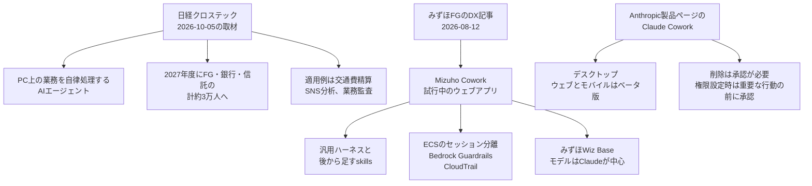

2026年10月5日、日経クロステックは、みずほフィナンシャルグループが従業員のパソコン業務を自律的に処理するAIエージェントを導入すると報じた。公開リードは、2026年8月に一部の部門でPoCを始め、2027年度にもみずほFG、みずほ銀行、みずほ信託銀行の計約3万人への導入を目指す、と取材で明らかになったと書く。適用例は交通費精算、SNS分析、業務監査である。

みずほFGのDX記事（2026年8月12日）は、汎用デスクワーク向けのウェブアプリ「Mizuho Cowork」を、試行検証中のアプリケーションとして説明している。Anthropicは、別の製品ページで「Claude Cowork」を有料プランの機能として説明している。

この記事では、3つの公開文がそれぞれ何を書いているか、約3万人がどの人数に近いか、行員の机上作業をグループ規模で渡すときに終えてよい操作と人が残す操作をどう分けるかを追う。日経クロステックの当該記事は有料会員限定で、ここでの日経側の事実関係は公開リードまでである。

*この記事の全体像。以下、順に解説します。*

## Coworkとは

Cowork という名前は、日経クロステックの取材、みずほFGの講演レポート、Anthropicの製品ページに、それぞれ別の説明として出ている。以下は、各ページが書いている内容である。

### 日経クロステックの公開リード

記事は金子寛人「みずほ、AIエージェント『Cowork』3万人に導入へ　非定型タスクも自律処理」で、掲載日は2026年10月5日である。公開リードの事実関係は次のとおりである。

- 対象業務は、従業員がパソコン上で対応していた業務を、AIエージェントが自律的に処理することである。
- 時期は、2026年8月に一部部門でPoCを始め、2027年度の導入を目指す、という取材ベースの記述である。リードが置いているのは導入の目標である。
- 対象組織は、みずほFG、みずほ銀行、みずほ信託銀行である。規模は「計約3万人」である。
- 適用範囲の例は、交通費精算、SNS分析、業務監査で、非定型作業を含む、と書いている。
- 次ページの見出しは「幅広い業務に適用可能、ノウハウ伝承にも」である。

公開リードには、製品の提供元の記載がない。

### みずほFGの Mizuho Cowork

みずほFGの記事は、2026年6月26日のAWS Summit Japan 2026の講演を扱っている。登壇者は、執行役員デジタル戦略部長 Chief AI Officer の藤井達人である。記事の公開日は2026年8月12日である。

同じ名前のアプリについて、記事は次のように書く。

- 全社員の資料作成や数値分析など、一般的なデスクワーク向けの共通ワークスペースである。
- 法人営業向けの「みずほRM Studio」とは別のアプリケーションである。
- 形態はウェブアプリケーションで、状態は試行検証中である。
- 標準の仕組みは3つある。ユーザーごとの使い捨てコンテナ（Amazon ECS）によるセッション分離。Amazon Bedrock Guardrails による出力の遮断。AWS CloudTrail による「誰がどのような操作を行ったか」の記録。記事はこの3点目を「完全な監査ログ」と書く。
- アクセス原則として Need to Know（知る必要のある人だけがアクセスできる）を挙げる。
- 構造は、汎用ハーネスの上に、みずほのルールや稟議・監査のチェックを後から skills として足す、という説明である。
- 将来の予定として、利用者のフィードバックを反映し、自律的に業務を改善・実行するAIエージェントへ進化させる、と書く。
- 土台はAWS上の「みずほWiz Base」である。ベースモデルは「Claudeを中心」とし、独自モデル「みずほLLM」も載せる。

### 3社の単体従業員数

2026年3月31日現在の単体従業員数は、各社の会社概要ページにある。

| 会社 | 単体従業員数 | 人数の範囲 |
| --- | ---: | --- |
| みずほFG | 2,867人 | 社外出向を除き、受入出向を含む。海外の現地採用を含む。執行役員、嘱託、臨時従業員を含まない。括弧内に、FGおよび連結子会社の就業者数合計 52,427人 |
| みずほ銀行 | 23,356人 | 社外出向を除き受入出向を含み、海外の現地採用を含み、執行役員、嘱託、臨時従業員を含まない |
| みずほ信託銀行 | 2,955人 | 注記は銀行と同じ |

3ページの単体人数を足すと 29,178人になる。

EDINET DB が掲げるみずほFGの有価証券報告書本文には、2026年3月31日現在の主要な連結会社として、FG 2,867人、銀行 23,356人、みずほ証券 6,479人が並ぶ。連結従業員の合計は 52,427人で、嘱託および臨時従業員 12,081人は含まない、と注記がある。同じ表の外書きは、2025年度の平均人員として合計欄に 12,112人を置く。注記の 12,081人と外書き合計の 12,112人は、このページの中で一致しない。金融庁EDINETのPDF原本は未参照である。人数の出典は EDINET DB の本文ページである。

同じ本文は、2026年4月1日にみずほ銀行を存続会社として、みずほリサーチ＆テクノロジーズを吸収合併したと書く。3月31日の銀行単体 23,356人は、この合併の前の人数である。

### Anthropicの Claude Cowork

Anthropicの製品ページは、Claude Cowork を有料プランで使える機能として書く。削除には承認が必要である。権限設定を有効にすると、Claudeは計画を表示し、重要な行動の前に承認を待つ。Team と Enterprise の管理者は、アクセス権、支出制限、部門ごとのツール権限を管理できる。アクティビティは OpenTelemetry で利用者側のSIEMへ流せると書く。

同じページの Enterprise の説明には、Cowork のアクティビティは、まだ監査ログやコンプライアンスAPIに記録されていない、とある。この文は Anthropic の製品の説明である。

形態はデスクトップである。ウェブとモバイルはベータ版とページが書く。

2026年10月5日時点の製品ページは、Pro を月あたり約20ドル（年額前払いだと月あたり約17ドル）、Max を月約100ドルと月約200ドルの二段、Team を1シートあたり月約20ドル（2人から150人）と表示している。税別で、価格は変わり得るとページが書く。チャットより上限を早く消費すると書き、分あたりの回数は書いていない。

### 3つの公開文の関係

日経の報道、みずほのDX記事、Anthropicの製品ページは、それぞれ別の説明である。図は、各ページが書いている関係だけを置いている。

## 注意点

公開リードの人数、開始時期、適用例、監査の句は、それぞれ定義と時点を分けて読む。

### 約3万人の分母

公開リードの「約3万人」は、分母の定義を記事が書いていない。29,178人は、2026年3月31日の3社単体を足した計算であり、みずほが29,178人へ配ると発表した人数ではない。2027年度の目標と、2026年3月末の在籍は時点が違う。人数には執行役員、嘱託、臨時従業員が入っていない。銀行の人数は、2026年4月1日の吸収合併より前である。合併後の単体人数は、公開の会社概要とEDINET DB本文の範囲では確認していない。

開示情報データベースは、2026年3月期の銀行について、連結従業員 33,175人と整理している。これは二次情報である。銀行の有価証券報告書PDFに同じ連結人数がある、という指摘はある。PDF原本は未参照である。FGの連結就業者 52,427人や、証券単体 6,479人は、日経が書いた3社の範囲とは別の集計である。

約3万人が、3社の正社員相当の全員を指すのか、その規模になる選定集団を指すのかは、公開リードだけでは決まらない。

### PoCの開始時点

「2026年8月にPoCを始めた」は取材の記述である。みずほの講演レポートは、2026年6月26日の登壇内容として、Mizuho Cowork を試行検証中のウェブアプリと書く。開始日そのものは書いていない。6月の講演時点ですでに試行中だったのか、8月12日公開の記事が後の状態を講演の再現に混ぜたのかは、公開文だけでは決まらない。

### 適用例と、動いているスキル

交通費精算、SNS分析、業務監査は、日経リードでは「適用できる」例である。みずほの記事は、稟議・監査のチェックを後から skills として足せると書き、稼働中のスキル一覧は載せていない。最初に載せる業務は、公開文の範囲では確認していない。

日経のCoworkと、DX記事の Mizuho Cowork が同じ試行だと、どちらの文章も書いていない。会社のプレスリリースとして、2027年度に3社で約3万人規模の導入を目指す、という文は、この範囲では見つかっていない。有料部分に提供元、最初の業務、承認が残る操作がある可能性は残る。

### 完全な監査ログ

「完全な監査ログ」は、みずほ記事の表現である。AWSのCloudTrail利用者ガイドは、ユーザー、ロール、またはAWSサービスが、コンソール、CLI、SDK、APIで行ったアクションをイベントとして記録すると書く。Event history は、リージョン内の過去90日の management events である。アプリ内のすべてのデスク操作を記録する、という文は同ガイドにはない。

Mizuho Cowork のログ項目の一覧は公開されていない。CloudTrail に残るイベントが、コンソール、CLI、SDK、APIのアカウント操作だけなのか、アプリが明示的に出した業務イベントも含むのかは、公開文では決まらない。

### Coworkの規模と読まない数字

同じ講演にある別の数字を、Coworkの導入規模や効果と読まない。2026年から3年間で1,000億円規模の投資計画、AIコーチ約1,900名、エージェント候補1,000以上、RM Studio のPoC拠点における準備時間約50%減と会話機会約3倍は、いずれもCoworkの配賦人数やCoworkの完了実績としては書かれていない。RM Studio の割合は、みずほ記事の中の確認結果である。

### Claude Coworkの承認と価格

Anthropic製品ページの承認、削除、監査ログ未記録、価格は、Claude Cowork の説明である。みずほが同じ承認モードを採用した証拠は、ここまで挙げた公開資料にはない。Wiz Base のモデルが「Claudeを中心」であることは、Claude Cowork という製品名の採用を意味しない。

提供元が Anthropic、Microsoft、または他社だと名指しした一次資料は、日経の公開リード、みずほのDX記事、会社概要、EDINET DB本文、Anthropicの製品ページの範囲では見つかっていない。見つかったのは、製品名の不在である。

### まだ公開文に無い項目

Mizuho Cowork について、データ所在地、利用者認証、レート制限、課金は公開文に無い。公開APIが無いため、レート制限、サンプルコード、ノートブック、エラーコード、対外価格は、製品の公開チェック項目としては該当しない。認証方式、リージョン、データ所在地、入力上限も、公開文には無い。

### 主張ごとに残る限界

| 主張 | 支持 | 限界 |
| --- | --- | --- |
| 2027年度に3社で約3万人規模の導入を目指している | 日経の取材リードが、対象3社と「計約3万人」「2027年度」を書く | 会社のプレスリリースとしては、この範囲では見つかっていない。有料部分は未読。分母は記事が定義していない |
| 非定型を含むPC業務を自律処理する | 日経リードが、自律的処理と非定型作業を含む適用を書く | みずほの同名アプリの公開説明は、試行中のウェブアプリと、将来の自律エージェントである。現在完了した自律運用とは書いていない |
| 同名の社内アプリがAWS上で試行されている | みずほDX記事が Mizuho Cowork の構成と3つの統制を書く | 日経のCoworkと同一だと、どちらの文章も書いていない |
| 約3万人は3社の単体従業員に近い | 2026年3月31日の会社概要を足すと29,178人 | 記事はその等式を書いていない。合併後、嘱託、臨時従業員、証券、連結は別数である |

## 机上作業を渡す前の境界

窓口や査定の役割分担の次に、行員のデスクトップ作業をグループ規模で渡すときは、名前が同じでも説明文を分けて読む。配賦の前に決めるのは、製品名の一致ではなく、どの操作が台帳や送信の状態を変えるかである。

### 状態を変えない作業と、状態を変える作業

作業は、状態を変えるかどうかで2つに分ける。

1. 下書き、調査、数値の整理など、台帳や送信の状態を変えない作業。みずほが公開している Mizuho Cowork の現在形は、資料作成と数値分析の試行である。この範囲に近い。
2. 対外送信、勘定、顧客連絡。完了の証拠は、実行者の自己申告ではなく、送信記録、仕訳、顧客台帳の状態が変わったことである。公開資料は、この境界を Cowork の承認一覧としては書いていない。

日経リードの交通費精算は、下書きの作成で終わるなら1に近い。仕訳や支払依頼の状態を変えるなら2に入る。SNS分析は、集計と下書きなら1に近い。対外投稿や顧客への連絡を含むなら2に入る。業務監査は、点検メモの作成なら1に近い。指摘の確定や是正の記録を台帳へ書くなら2に入る。最初にどの業務を載せるかは、公開文では確認していない。

### 配賦前の確認表

業務種別ごとに、エージェントが終えてよい操作と、人が残す操作を表にする。次の表は、状態を変えるかどうかで分けた確認用の例である。みずほの公開文は、この行をCoworkの承認設計としては書いていない。

| 業務種別 | エージェントが終えてよい操作 | 人が残す操作 | 完了の証拠 |
| --- | --- | --- | --- |
| 資料作成、数値の整理 | 下書き、集計、比較表の作成 | 対外送付の実行 | 送付記録が変わっていないこと |
| 交通費精算 | 申請下書き、費目の整理 | 仕訳と支払依頼の確定 | 仕訳と支払状態 |
| SNS分析 | 収集結果の整理、報告の下書き | 対外投稿、顧客連絡 | 投稿ログと顧客台帳 |
| 業務監査 | 点検メモ、差分の列挙 | 指摘の確定、是正記録の確定 | 監査台帳の状態 |

CloudTrail を載せる場合は、残るのがコンソール、CLI、SDK、APIのアカウント操作なのか、業務上の完了なのかを、ログ項目で確認する。みずほ記事の「完全な監査ログ」という句だけでは、対外送信や勘定の完了証拠にはならない。Event history がリージョン内の過去90日の management events である、という利用者ガイドの範囲も、業務台帳の保存期間とは別である。

Claude Cowork の承認モードや価格は、みずほの設計図として使わない。削除の承認、重要な行動の前の承認、監査ログ未記録、月額の表示は、Anthropicの製品ページの説明である。採用するなら、みずほの文書が製品名と対象人数を書いた時点で、この境界を更新する。

## まとめ

日経クロステックの公開リードは、2027年度にみずほFG、みずほ銀行、みずほ信託銀行の計約3万人へ、パソコン上の非定型業務を含むAIエージェントを広げる計画を、取材として書いている。みずほFGが公開している Mizuho Cowork は、資料作成と数値分析の試行中のウェブアプリで、ECSのセッション分離、Bedrock Guardrails、CloudTrailの3つを標準の仕組みとして書いている。Anthropicの Claude Cowork は、別の有料機能である。

約3万人は、2026年3月31日の3社単体を足した29,178人に近い。この和は、みずほが配賦人数として発表した数ではない。合併後の銀行単体、嘱託、臨時従業員、証券、連結は別の数である。

グループ規模で机上作業を渡す前に分けるのは、下書きや集計のように状態を変えない作業と、対外送信、勘定、顧客連絡のように状態を変える作業である。完了の証拠は自己申告ではなく、送信記録、仕訳、顧客台帳の変化に置く。CloudTrailの記録範囲は、ログ項目で確認する。

この記事が少しでも参考になった、あるいは改善点などがあれば、ぜひリアクションやコメント、SNSでのシェアをいただけると励みになります！

## 参考リンク

- 日経クロステック、金子寛人「みずほ、AIエージェント『Cowork』3万人に導入へ　非定型タスクも自律処理」（2026-10-05）: [記事](https://xtech.nikkei.com/atcl/nxt/column/18/00001/12072/)
- みずほFG「AWS Summit Japan 2026講演レポート」（2026-08-12）: [DX記事](https://www.mizuho-fg.co.jp/dx/articles/awssummit-2608/index.html)
- みずほFG 会社概要（従業員 2,867人、連結就業者 52,427人、2026-03-31）: [会社概要](https://www.mizuho-fg.co.jp/company/info/overview/index.html)
- みずほ銀行 会社概要（従業員 23,356人、2026-03-31）: [会社概要](https://www.mizuhobank.co.jp/company/info/profile/index.html)
- みずほ信託銀行 会社概要（従業員 2,955人、2026-03-31）: [会社概要](https://www.mizuho-tb.co.jp/company/about/info.html)
- EDINET DB によるみずほFG有価証券報告書本文（E03615。PDF原本は未取得）: [本文](https://edinetdb.jp/company/E03615/text)
- 開示情報データベースによるみずほ銀行の連結従業員（二次情報）: [指標](https://disclosure.catr.jp/companies/c0c9b/65120/metrics)
- みずほFG、銀行の有価証券報告書PDF（PDF原本は未参照）: [PDF](https://www.mizuho-fg.co.jp/investors/financial/report/yuho_202603/pdf/bk_fy.pdf)
- AWS「What Is AWS CloudTrail?」: [利用者ガイド](https://docs.aws.amazon.com/awscloudtrail/latest/userguide/cloudtrail-user-guide.html)
- Anthropic「Claude Cowork」（2026-10-05に本文を確認）: [製品ページ](https://claude.com/ja/product/cowork)
