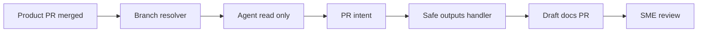

製品リポジトリとドキュメントリポジトリが分かれていると、機能がマージされた後にドキュメントだけが遅れがちです。GitHub Blog の Aspire 事例は、この docs lag を AI エージェントで短縮する実装例です。

ただし、この記事の本質は「AI にドキュメントを直接書かせる」ことではありません。AI の判断と GitHub への書き込みを分離し、最終責任を feature owner と SME reviewer に戻す governance pattern が要点です。

## この記事で扱うこと

この記事では、GitHub Agentic Workflows を使った cross-repo documentation automation を、運用設計の観点で整理します。

| 観点 | 説明 |
|---|---|
| 解く課題 | 製品 PR マージ後に docs writer が後追いで仕様を読み解く負荷 |
| 中核設計 | intent と execution の分離 |
| 権限設計 | GitHub App を対象 2 repo に限定 |
| 安全策 | protected-files blocked、draft PR、fallback-as-issue |
| 成果指標 | 396 runs から 82 docs PR、同一期間の生成 PR は 100% merge |

## 問題は docs lag と責任境界です

Aspire の事例では、製品 repo の `microsoft/aspire` と docs site repo の `microsoft/aspire.dev` が分かれています。docs writer は、すでに閉じた PR を後から読み解き、変更の意図と影響範囲を復元していました。

GitHub Blog はこの負荷を reverse-engineering tax と表現しています。これは単なる執筆速度の問題ではありません。

- 製品 author は次の作業に移る
- docs writer は closed PR と linked issue から文脈を復元する
- SME reviewer は後から正しさを確認する
- リリース済み機能と公開 docs の同期が遅れる

設計思想は「機能は docs が揃うまで完了ではない」です。AI は typing と初稿作成を担い、人間は正しさと責任を閉じます。

## cross-repo automation は権限設計が難しいです

同一 repo 内の automation なら、GitHub Actions の `GITHUB_TOKEN` に最小権限を設定して完結しやすいです。一方、別 repo に docs PR を作るには、docs repo 側の contents や pull requests への書き込み権限が必要です。

ここで broad PAT や org-wide token を AI agent に渡すと、リスクが大きくなります。

| リスク | 何が起きるか |
|---|---|
| Prompt injection | issue、commit message、docs 由来の命令で agent が誘導される |
| Runner compromise | Actions 実行環境から token が悪用される |
| Workflow misconfiguration | 想定外の repo や branch に書き込む |
| Tool abuse | agent が過剰な権限で GitHub 操作を実行する |

そのため、設計課題は「AI にうまく書かせる」より先にあります。AI が騙されても、実行できる操作の範囲を狭く保つことが重要です。

## 解決策は intent と execution の分離です

Aspire の pattern では、agent は GitHub に直接 PR を作りません。agent は「docs PR を作りたい」という intent を構造化して出し、別の safe-outputs handler が policy に照らして materialize します。

| 要素名 | 説明 |
|---|---|
| Product PR merged | `pull_request: closed` かつ `merged == true` で起動 |
| Branch resolver | PR milestone、linked issue milestone、base ref、main fallback の順で target branch を決定 |
| Agent read only | diff と linked issue を読み、docs-worthy かを判断 |
| PR intent | `create_pull_request` safe-output として構造化した意思表示 |
| Safe outputs handler | target repo、base branch、protected files、draft policy を検証 |
| Draft docs PR | docs repo に作る下書き PR |
| SME review | feature owner や subject matter expert による確認 |

この分離により、AI の reasoning は柔軟なままにできます。一方で、外部への書き込みは deterministic な filter と policy の通過後に限定できます。

## pipeline の流れ

実際の流れは次のように整理できます。

1. `main` または `release/*` への product PR merge で workflow を起動
2. agent 起動前に bash で target branch を解決
3. agent が diff と linked issue から docs-worthy を判定
4. docs が必要なら `microsoft/aspire.dev` workspace で MDX draft を作成
5. agent が safe-output intent を出力
6. handler が policy を検証して draft PR または issue を作成
7. companion job が source PR に marker comment を残す
8. rerun 時は古い marker comment を minimize

重要なのは、agent に推測させる領域を絞ることです。branch routing、対象 repo、protected files、draft policy は agent の判断ではなく、workflow と policy で決めます。

## 成功条件は agent に考えさせない場所を増やすことです

Aspire の設計で特に効いているのは、milestone から release branch への routing です。target branch を agent に推測させず、既存の milestone 運用を deterministic bash に変換しています。

agent が判断する範囲は、次の 2 つに寄せています。

- この diff は user-facing docs が必要か
- 既存 docs にどの差分を入れるか

逆に、次の判断は agent から外しています。

| agent から外す判断 | deterministic に決める方法 |
|---|---|
| どの docs repo に書くか | safe output の `target-repo` |
| どの branch に向けるか | milestone と base ref による resolver |
| PR を draft にするか | `draft: true` policy |
| 触ってよいファイルか | protected-files blocked |
| PR 作成失敗時にどうするか | fallback-as-issue |
| reviewer を誰にするか | source PR の review chain から routing |

GitHub App installation も限定されています。対象は `microsoft/aspire` と `microsoft/aspire.dev` の 2 repo です。cross-repo automation で必要な repo だけに scope を閉じています。

## 安全策は prompt だけに依存しません

v1 の docs-worthy gate は広すぎました。CI tweak、internal helper、tests-only まで docs PR 化し、別の earlier window では 69件中9件、約13% が close されました。

この数字は、後述する 2026-05-03〜2026-06-02 の rolling 30-day window とは別期間です。v1 の false-positive phase として分けて読む必要があります。

改善は「より賢いモデルにする」だけではありません。user-facing change の定義を締め、negative examples を prompt に追加しています。

| 改善対象 | 対応 |
|---|---|
| CI tweak | docs 不要の negative example に追加 |
| tests-only | docs 不要の negative example に追加 |
| internal helper | user-facing change の対象外に整理 |
| PR 作成失敗 | silent drop ではなく issue fallback |
| target repo 再発見 | mirrored checkout pattern で deterministic 化 |

mirrored checkout pattern も実務上の工夫です。`microsoft/aspire.dev` を workspace として checkout し、さらに `_repos/aspire.dev` にも置くことで、safe-outputs handler が target repo を安定して再発見できます。

## メトリクスが示す成果

2026-05-03〜2026-06-02 の rolling 30-day window では、次の結果が公開されています。

| 指標 | 値 | 読み方 |
|---|---:|---|
| product PR merged | 396 | product PR 全件を母集団として起動 |
| main branch merged | 338 | `main` 向け product PR |
| release 13.3 merged | 50 | `release/13.3` 向け product PR |
| release 13.2 merged | 8 | `release/13.2` 向け product PR |
| pr-docs-check runs | 396 | trigger coverage は product PR と一致 |
| draft docs PR | 82 | 300件超を docs 不要と判定 |
| merged docs PR | 82 | 生成された docs PR はこの window で全件 merge |
| closed without merge | 0 | この window の生成 docs PR では close なし |
| open | 0 | window 終了時点で未処理なし |
| target branches | 52 to release/13.3、27 to release/13.4、3 to main | milestone routing が release docs に作用 |
| median time-to-merge | 44.8時間 | 後追い docs から数日内 reviewable draft へ移行 |
| 24h merge | 38% | 即日 merge された比率 |
| 7d merge | 96% | 1週間内にほぼ merge |

この 100% merge は「生成された docs PR の受容率」です。「docs が必要だったすべての product PR を漏れなく拾った recall」までは示しません。

公開値だけでは、次の項目は評価できません。

- false negative の件数
- review 修正量
- technical writer の介入度
- AI cost
- SME reviewer の追加負荷
- accepted docs PR あたりの runner time

成果を見るときは、created PR 数だけではなく、merge rate、time-to-merge、review churn、fallback issue 数、cost を合わせて追う必要があります。

## 代替案との比較

この pattern は有力ですが、すべての組織に最初から必要な設計ではありません。

| 選択肢 | 向いている状況 | 強み | 弱み |
|---|---|---|---|
| 人手の後追い | PR 数が少ない組織 | 新しい基盤が不要 | reverse-engineering tax が残る |
| docs-as-code gate | docs を code PR に同梱できる組織 | 単純で review visibility が高い | repo や review chain が分かれる場合に弱い |
| same-repo AI draft | docs が製品 repo 内にある組織 | cross-repo token 問題が小さい | docs site repo が別なら根本解決にならない |
| broad PAT cross-repo write | 個人 repo や小規模検証 | 実装が簡単 | blast radius が大きく security review が難しい |
| issue-only advisory | 初期検証 | 最小権限で始めやすい | typing burden が残る |
| intent/execution split | repo 分離が強い組織 | AI の柔軟性と deterministic guardrail の両立 | checkout、auth、fallback、monitoring の運用負荷 |

まず docs-as-code gate で解けるかを確認するのが安全です。解けない場合は、issue-only advisory から始め、draft PR へ段階的に権限を広げると移行しやすくなります。

## 反論と限界

### read-only agent でも poisoned intent は出せます

intent/execution split は、AI が直接書き込めない点で強い設計です。一方で、AI がもっともらしいが誤った PR intent を出すリスクは残ります。

OWASP は、agentic AI のリスクとして prompt injection、tool abuse、excessive autonomy、decision and approval manipulation、denial of wallet を挙げています。code comments、documentation、commit messages、issue descriptions、web pages は indirect prompt injection の媒体になります。

### deterministic handler も Actions の攻撃面を持ちます

handler が deterministic でも、実行環境は GitHub Actions です。checkout、third-party actions、secrets、runner、token permissions が攻撃面になります。

特に、docs validation のために target repo を checkout し、build や test を privileged context で実行する場合は注意が必要です。untrusted PR content を privileged context で動かすと、pwn request 型のリスクが生まれます。

### human-in-the-loop は万能ではありません

SME reviewer が忙しく、bot PR を rubber stamp するようになると、human-in-the-loop は governance theater になります。

NIST AI RMF と Generative AI Profile は、automation bias や human-AI configuration のリスクを扱っています。SME review は、review SLA、review checklist、review comment、re-open 率などで観測する必要があります。

### docs-with-code の方が良い場合があります

GitLab の documentation workflow は、feature docs は developer が primary author であり、可能なら code MR に docs を含めるべきだとしています。

別 PR は review 対象者を減らし、feature PR と docs PR の文脈を分けます。Aspire は marker comment と SME reviewer routing で補っていますが、同じ補助線なしに移植すると逆効果になります。

## 導入判断のチェックリスト

採用に向いているのは、次の条件を満たすチームです。

- 製品 repo と docs repo が分かれている
- docs lag が release 品質に影響している
- PR milestone、linked issue、base branch から target docs branch を deterministic に解ける
- SME reviewer を source PR の review chain から機械的に決められる
- GitHub App を workflow 単位で作れる
- GitHub App の対象 repo を最小限に絞れる
- `draft: true` を policy として運用できる
- allowed base branches を明示できる
- protected-files blocked を運用できる
- fallback-as-issue を受け止める担当がいる
- false positive と false negative を継続測定できる
- merge rate、time-to-merge、review churn、cost を追える

採用を急がない方がよいのは、次の条件に当てはまるチームです。

- docs を code PR に同梱できる
- milestone や release branch の運用が安定していない
- owner mapping が曖昧
- Actions security を運用する余力がない
- bot PR review が rubber stamp になりやすい
- AI cost を監視できない

## 最小導入のすすめ

最小導入は issue-only advisory です。merged PR を見て docs-worthy 判定をし、source PR に marker comment を残すか、docs repo に issue を作ります。

その後、次の順で権限を広げます。

1. 現状の docs lag を測る
2. target branch resolver を先に実装する
3. allowed repos、allowed base branches、protected files、fallback policy を表にする
4. issue-only dry run を2週間回す
5. false positive を negative examples で減らす
6. GitHub App を 2 repo 程度に限定する
7. draft PR のみ許可する
8. merge と protected files の編集は許可しない
9. fallback issue と rejected PR をサンプル監査する
10. kill switch と key rotation 手順を用意する

最初から自動 merge を目指す必要はありません。draft PR までに留め、review と measurement の設計を先に固める方が安全です。

## 実装時の guardrail 例

実装に落とす場合は、次のような policy を明文化するとレビューしやすくなります。

| 項目 | 推奨設定 |
|---|---|
| GitHub App repositories | product repo と docs repo の 2 repo |
| Agent permission | read-only |
| Output type | structured safe output |
| Target repo | docs repo 固定 |
| Base branch | `main` と `release/*` のみ |
| PR state | draft 固定 |
| Protected files | blocked |
| Failure handling | fallback-as-issue |
| Source traceability | source PR への marker comment |
| Rerun behavior | 既存 comment の minimize と冪等化 |
| Metrics | created、merged、closed、open、time-to-merge、fallback、cost |

この表は、security review の共通言語にもなります。AI の能力ではなく、AI が失敗したときの封じ込め方を先に説明できます。

## 避けたいアンチパターン

導入時は、便利さよりも失敗時の封じ込めを優先します。次の設計は、短期的には簡単でも後から監査しにくくなります。

| アンチパターン | 問題 | 置き換え |
|---|---|---|
| AI agent に broad PAT を渡す | repo 横断の blast radius が大きい | GitHub App を対象 repo に限定 |
| target branch を agent に推測させる | release docs の誤配線が起きる | milestone と base ref で resolver 化 |
| docs PR 作成失敗を無視する | silent drop で docs lag が見えない | fallback-as-issue |
| bot PR の merge 率だけを見る | false negative と review 負荷を見落とす | recall audit と review churn を併用 |
| reviewer routing を手動にする | owner 不在で滞留する | source PR の review chain から自動 routing |

特に、100% merge という数字を品質保証の証拠として単独で扱わないことが大切です。生成された PR の受容率と、必要な docs を拾えた recall は別の指標です。

## まとめ

cross-repo docs automation の肝は、AI に書き込み権限を渡すことではなく、read-only agent の intent を deterministic handler で検証してから draft PR に変換することです。Aspire の事例は、GitHub App の repo scope、protected-files blocked、fallback-as-issue、milestone routing を組み合わせると、docs lag を短縮しながら権限境界を保てることを示しています。

この記事が少しでも参考になった、あるいは改善点などがあれば、ぜひリアクションやコメント、SNSでのシェアをいただけると励みになります！

## 参考リンク

- 公式ドキュメント
  - [Use GITHUB_TOKEN for authentication in workflows](https://docs.github.com/en/actions/tutorials/authenticate-with-github_token)
  - [Secure use reference](https://docs.github.com/en/actions/reference/security/secure-use)
  - [AI Agent Security Cheat Sheet](https://cheatsheetseries.owasp.org/cheatsheets/AI_Agent_Security_Cheat_Sheet.html)
  - [LLM Prompt Injection Prevention Cheat Sheet](https://cheatsheetseries.owasp.org/cheatsheets/LLM_Prompt_Injection_Prevention_Cheat_Sheet.html)
  - [AI Risk Management Framework](https://www.nist.gov/itl/ai-risk-management-framework)
  - [Generative AI Profile NIST AI 600-1](https://nvlpubs.nist.gov/nistpubs/ai/NIST.AI.600-1.pdf)
  - [GitLab Documentation workflow](https://docs.gitlab.com/development/documentation/workflow/)
- GitHub
  - [Automating cross-repo documentation with GitHub Agentic Workflows](https://github.blog/ai-and-ml/github-copilot/automating-cross-repo-documentation-with-github-agentic-workflows/)
  - [GitHub Agentic Workflows](https://github.github.com/gh-aw/)
  - [Security Architecture](https://github.github.com/gh-aw/introduction/architecture/)
  - [Safe Outputs](https://github.github.com/gh-aw/reference/safe-outputs/)
  - [Safe Outputs Pull Requests](https://github.github.com/gh-aw/reference/safe-outputs-pull-requests/)
  - [Cross-Repository Operations](https://github.github.com/gh-aw/reference/cross-repository/)
  - [Authentication](https://github.github.com/gh-aw/reference/auth/)
  - [Threat Detection](https://github.github.com/gh-aw/reference/threat-detection/)
  - [Outcomes](https://github.github.com/gh-aw/reference/outcomes/)
- 記事
  - [Docs as Code guide](https://www.writethedocs.org/guide/docs-as-code/)
