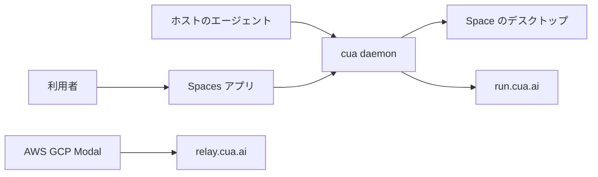
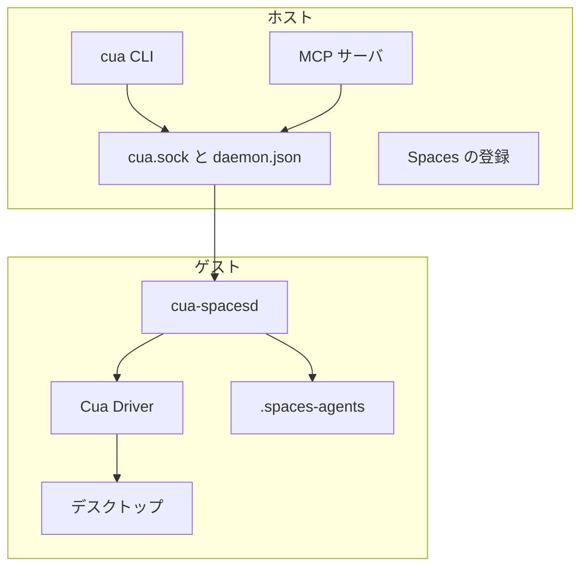
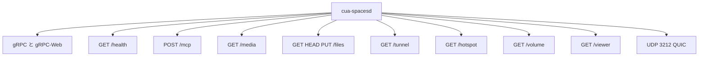
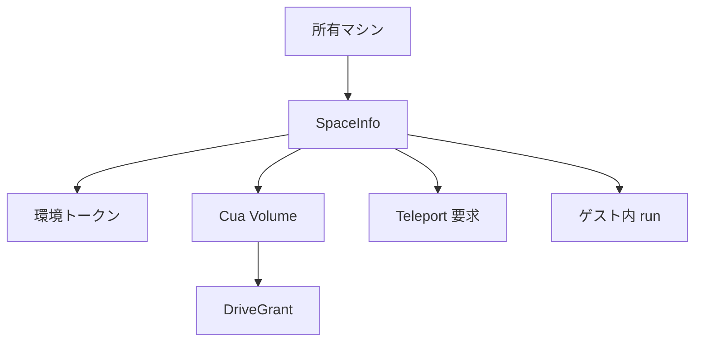
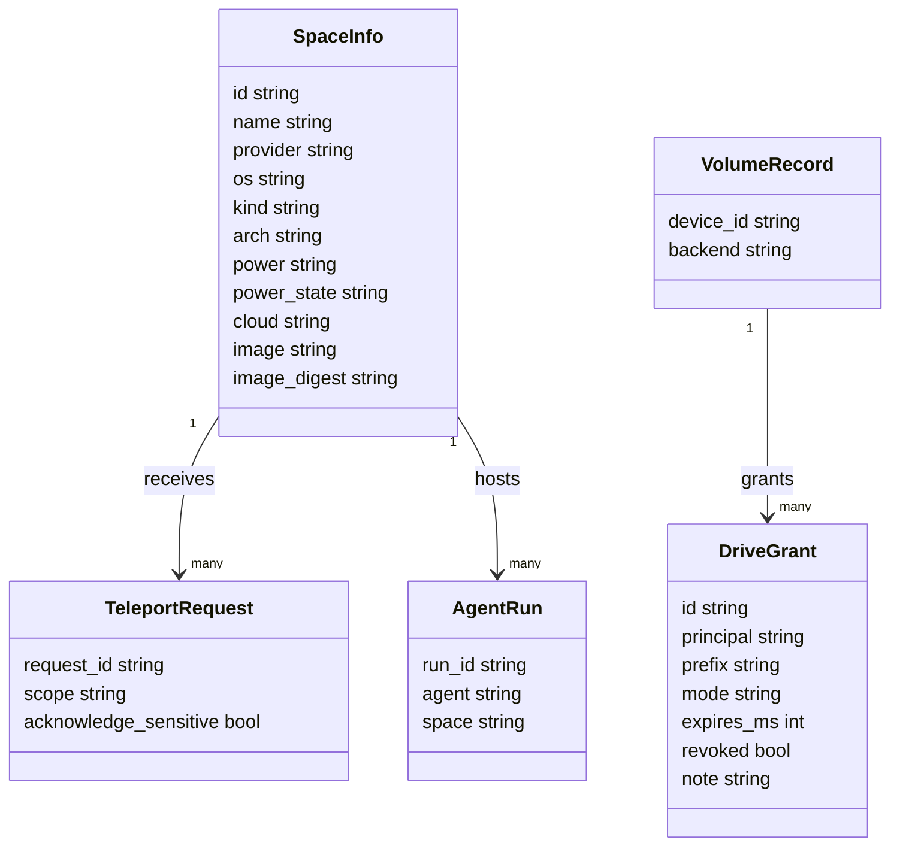

AI エージェントに GUI を操作させたいとき、手元の画面をそのまま渡すのは不安があります。
[Cua Spaces](https://spaces.cua.ai/) は、エージェント専用のデスクトップを用意し、人がその画面を見守れるようにする仕組みです。
この記事では、Cua Spaces の構成要素、扱うデータ、導入から運用までを、公式ドキュメントとリポジトリ [trycua/cua](https://github.com/trycua/cua) に沿って整理します。
記載は 2026-10-07 時点の公開情報にもとづきます。


*この記事の全体像。以下、順に解説します。*

## Cua Spacesとは

Cua Spaces は、エージェントが操作し、人が画面を見守れるデスクトップです。
1 つの Space は、仮想マシンまたはコンテナとして動く、完結したデスクトップです。

Space を動かせる場所は次の 4 つです。

| 実行場所 | 内容 | ID の接頭辞 |
|---|---|---|
| 手元のマシン | このマシン上のコンテナまたは VM。ホストは macOS、Linux、Windows | `local:` |
| 所有しているマシン | アドレス直結、またはリレー経由で登録したマシン | `direct:` / `relay:` |
| 自分のクラウド | AWS、Google Cloud、Modal。公式が手順を書いているのはこの 3 つ | `relay:` |
| Cua Cloud | Cua がホストするフリートのサンドボックス | `cloud:` |

配布物は 2 層に分かれます。

- macOS 26 以降向けの Spaces アプリ。2026-10-05 公開の `cua-spaces-v0.7.2` が最新です。
- 同じリポジトリの `cua` CLI、`cua daemon`、Cua Driver、Lume、言語 SDK。これらは MIT です。

ゲストの中では `cua-spacesd` が TCP 3211 と UDP 3212 で待ち受けます。
ポインタとキーボードの注入は Cua Driver が担います。`cua-spacesd` 自身は入力を注入しません。

アカウントと料金の扱いは次のとおりです。

| 項目 | 内容 |
|---|---|
| アカウント | 手元の Space とアドレス直結には不要。リレー、共有、自分のクラウドにはサインインが必要 |
| 手元と所有マシン | 無料 |
| ホストされたリレー | 早期アクセスのあいだ無料 |
| 自分のクラウド | 計算資源はそのクラウド事業者の請求 |
| Cua Cloud | 動いているあいだ Cua 側で請求 |
| Pro と Teams | 近日公開 |

ライセンスはパスで分かれます。
ルートの `LICENSE.md` は MIT です。Spaces 系のパスは FSL-1.1-MIT で、各リリースは 2 年後に MIT になります。
主なパスは次のとおりです。正本は [LICENSING.md](https://raw.githubusercontent.com/trycua/cua/main/LICENSING.md) です。競合利用の商用条件は `COMMERCIAL.md` を確認してください。

| パス | SPDX | 範囲 |
|---|---|---|
| ルート `LICENSE.md` | MIT | SDK、`cua` CLI、`cua daemon`、Cua Driver、Lume、`cua-proto`（`StreamService` を含む） |
| `apps/cua-spaces`、`apps/cua-spaces-macos` | FSL-1.1-MIT | Spaces アプリ |
| `libs/cua-spacesd` | FSL-1.1-MIT | `cua-spacesd` と relay |
| `libs/cua/crates/cua-spaces-*` 系 | FSL-1.1-MIT | アプリ中核、拡張、FFI、Spaces CLI |
| `libs/cua/crates/` の `cua-keyvault`、`cua-teleport` など | FSL-1.1-MIT | 鍵、Teleport、封緘、Volume |
| `libs/cua/crates/cua-media-*` | FSL-1.1-MIT | メディア実装 |

2026-10-07 に GitHub API で取得したリポジトリの指標です。

| 指標 | 値 |
|---|---|
| アプリ Release | `cua-spaces-v0.7.2`（2026-10-05 公開、prerelease ではない） |
| macOS DMG | `cua-spaces-0.7.2-darwin-universal.dmg`（約 220 MB） |
| stars / forks | 28456 / 2024 |
| 主言語 | Rust |
| `open_issues_count` | 1117（PR を含む） |

## 特徴

- Space の ID は、実行場所を接頭辞で表します。`local:`、`direct:`、`relay:`、`cloud:` の 4 種です。
- 配置は 3 軸で決まります。`on` が場所、`kind` が container か vm、`runtime` がエンジンです。
- ゲストの制御面は `cua-spacesd` です。契約は `cua.env.v1` の protocol version 1、revision 8 です。
- メディアの経路は 2 つです。UDP 3212 の QUIC（ALPN `rcdp/2`）と、TCP 3211 のチケット付き WebSocket `GET /media` です。
- 環境トークンは URL に載せません。ブラウザはチケットと署名付き URL を使います。
- ホストのエージェントは `cua daemon mcp` または `cua mcp` 経由でツールを呼びます。
- Space の中で起動できる準備済みの harness は `claude-code` と `openai-codex` です。
- Cua Volume は版管理された共有ドライブです。削除は削除マーカーで表し、履歴は残ります。
- Teleport は、同意を経てセッションを Space へ渡します。イメージ同梱のバンドルは `cua-machine-seal` で封緘されます。
- 匿名テレメトリは既定でオンです。`DO_NOT_TRACK=1` で確実に止まります。
- 実験フラグ `cua_volume`、`your_cloud`、`sharing` は Settings の Experiments にあります。オフにしても入口が隠れるだけで、既存のマウント、接続、共有は残ります。

公式のイメージカタログ（[SDK quickstart](https://cua.ai/docs/cua-sdk/quickstart.md)）は次のとおりです。

| イメージ | このマシン | Cua Cloud | spacesd |
|---|---|---|---|
| `linux:24.04` と slim | コンテナ。gVisor があれば gVisor | gVisor コンテナ | あり |
| `linux:24.04-disk` と slim-disk | QEMU | KubeVirt | あり |
| `windows:2022` | QEMU | KubeVirt | あり。ライセンスは同梱しない。amd64 |
| `macos:26` と `macos:26-slim` | Lume。Apple silicon のみ | Not available yet | あり |
| `macos:15`（Sequoia） | Lume | Not available yet | なし |
| `omarchy:edge` と edge-disk | QEMU | KubeVirt | あり |

Linux イメージのログインユーザは `cua` です。パスワードなしの sudo を持ちます。

## 構造

### システムコンテキスト図

利用者、ホスト上のエージェント、Spaces、リレー、自分のクラウドの関係です。



| 要素名 | 説明 |
|---|---|
| 利用者 | アプリ、CLI、またはサインインで Space を見ます。 |
| ホストのエージェント | Claude Code や Codex などが MCP で `cua daemon` を呼びます。 |
| Spaces アプリ | macOS 版は SwiftUI です。Tauri 版は Linux と Windows 向けに配布されます。 |
| cua daemon | ローカルの作成、一覧、MCP をまとめます。CLI とアプリは同じデーモンを共有します。 |
| Space のデスクトップ | ゲストです。中で `cua-spacesd` が動きます。 |
| relay.cua.ai | 所有マシンと自前クラウドが外向きに接続する中継です。`CUA_RELAY_URL` で差し替えできます。 |
| AWS GCP Modal | 自前クラウドです。ゲストから `relay.cua.ai` へ外向きに接続します。ID は `relay:` です。 |
| run.cua.ai | Cua がホストするフリートです。既定の `CUA_FLEET_BASE_URL` です。ID は `cloud:` です。 |

手元の Space と、アドレスで直結した Space はリレーを通りません。
自前クラウドのサンドボックスは受信ポートを開かず、`relay.cua.ai` へ外向きに接続します。
リレーは TLS を終端します。通過中の画面、入力、ファイルを読める位置にありますが、保存はしません。
Teleport の封緘バンドルはリレーから読めない、と `cua-machine-seal` の説明にあります。

### コンテナ図

1 台のホストと、1 つのゲストの境界です。



| 要素名 | 説明 |
|---|---|
| cua CLI | `cua spaces`、`cua sb`、`cua cloud`、`cua agents`、`cua runtime` を提供します。 |
| MCP サーバ | `cua daemon mcp` または `cua mcp` です。 |
| cua.sock と daemon.json | デーモンの発見に使います。`~/.cua/cua.sock` と `~/.cua/daemon.json` です。 |
| Spaces の登録 | アプリ README は共有レジストリとして `~/.cua/spaces.json` を挙げます。サンドボックスのローカル状態は `~/.cua/sandboxes` です。 |
| cua-spacesd | ゲスト内の gRPC サーバです。TCP 3211 と UDP 3212 で待ち受けます。 |
| Cua Driver | ポインタ、キーボード、コンピュータツールの本体です。 |
| デスクトップ | コンテナまたは VM の画面です。 |
| .spaces-agents | ゲスト内のエージェント実行です。`~/.spaces-agents/` の下に run id ごとに置かれます。 |

ホスト側で押さえておくファイルは次のとおりです。

| ファイル | 用途 |
|---|---|
| `~/.cua/spaces-control.json` | アプリのループバック制御 |
| `$CUA_HOME/config.toml` | 設定。`CUA_HOME` の既定は `~/.cua` |
| `~/.cua/cloud/state.json` | クラウド接続の状態 |

### コンポーネント図

`cua-spacesd` が公開する主な面です。



| 要素名 | 説明 |
|---|---|
| gRPC と gRPC-Web | TCP 3211 です。ネイティブ gRPC は HTTP/2、gRPC-Web は HTTP/1.1 です。リフレクションもあります。 |
| GET /health | 認証なしです。提供中は 204、停止中は 503 を返します。 |
| POST /mcp | 環境トークンが必要です。Cua Driver のツールを Streamable HTTP MCP で公開します。無効なら 501 です。 |
| GET /media | `StreamService.OpenMedia` のチケットで開きます。映像は H.264、音声は Opus、ワイヤは v2 です。 |
| /files | `CreateSignedUrl` の署名 URL で読み書きします。Range に対応します。期限切れや改ざんは 403 です。 |
| /tunnel | `TunnelService.Forward` のチケットでポート転送します。 |
| /hotspot | `StartHotspot` のチケットで逆向きの SOCKS を張ります。 |
| /volume | Volume 用のチケット付き WebSocket です。クライアントがゲストのマウントを提供します。 |
| /viewer | 静的な Web ビューアです。認証なしで、チケットは URL フラグメントから読みます。 |
| UDP 3212 QUIC | メディアのデータグラムです。ALPN は `rcdp/2` です。証明書は `OpenMedia` でピン留めします。 |

認証と待ち受けの規則は次のとおりです（[libs/cua-spacesd の README](https://github.com/trycua/cua)）。

- トークンのヘッダは `authorization: Bearer` または `x-cua-env-authorization: Bearer` です。
- フリートのゲートウェイは `authorization` を消費します。その先では代替ヘッダを使います。
- 既定の待ち受けは、トークンがあるとき `0.0.0.0:3211`、無いとき `127.0.0.1:3211` です。
- ループバック以外をトークンなしで開くことは、既定では拒否されます。
- `--insecure-bootstrap` を付けたときだけ、トークンなしの非ループバックを許します。このとき応答するのは `GetCapabilities`、`Health`、`Init` だけです。
- gRPC-Web はクライアントストリームを運べません。`StreamInput` の代わりに `SendInput`、`WriteFile` の代わりに `UploadChunk` を使います。
- チケットは `?ticket=` か、WebSocket サブプロトコル `cua.ticket.` に続けて渡します。
- トークンを回すと、そのトークン由来のチケットと署名 URL は失効します。

RPC の数は [protocol ページ](https://cua.ai/docs/cua-sdk/reference/protocol.md) の表のとおりです。

| 契約 | サービスと RPC 数 |
|---|---|
| `cua.env.v1`（ゲスト） | System 10、Process 8、Filesystem 16、Computer 7、Driver 2、WindowsService 11、Accessibility 3、Stream 5、Presence 3、Teleport 7、Tunnel 6、Volume 3、HostSpaces 6 |
| `cua.daemon.v1`（ローカルデーモン） | Sandbox 19、Runtime 5、Space 17、Daemon 3 |

StreamService のチケット型は、MIT の `cua-proto` にあります。

## データ

### 概念モデル

Space にぶら下がる主な記録です。



| 要素名 | 説明 |
|---|---|
| SpaceInfo | 1 つのデスクトップの公開レコードです。一覧と接続時スナップショットで鮮度が違います。 |
| 環境トークン | ゲストを操作するための秘密です。URL には置きません。 |
| Cua Volume | 利用者、エージェント、Space が共有する版付きドライブです。 |
| DriveGrant | 主体、パス接頭辞、モード `r` または `rw` の組です。presence が必要です。 |
| Teleport 要求 | 同意前は配送しません。選択に機密項目があるとき、`acknowledge_sensitive` は true です。 |
| ゲスト内 run | `agent_start` が作る実行です。資格情報の複製は `CUA_SPACES_AGENT_CREDENTIALS_HOME=none` で止められます。 |
| 所有マシン | アカウントのリレー枠は最大 32 です。所有マシンも自前クラウドのサンドボックスも 1 つずつ数えます。ゲストが持つのは自分のマシントークンだけです。 |

配置は次の順で解決されます。

1. 呼び出し時の明示
2. 環境変数 `CUA_DEFAULT_ON` と、kind・runtime 用の同系統の環境変数
3. 設定の `default.on`
4. 組み込みの既定値（`local` / `auto` / `auto`）

不正な組み合わせは `InvalidPlacement` になります。
`kind=auto` では、macOS と Windows のイメージは VM、コンテナ rootfs はコンテナ、ディスクだけのイメージは VM になります。

### 情報モデル

公開レコードのうち、運用でよく読むものだけをクラス図にしました。メソッドは省いています。



| 要素名 | 説明 |
|---|---|
| id | `local:`、`direct:`、`relay:`、`cloud:` のいずれかで始まります。例は `direct:10.0.0.5:3211` です。 |
| provider | `cloud`、`local`、`direct`、`relay` です。自前クラウドは `relay` で、`cloud` フィールドに事業者が入ります。 |
| os / kind / arch | os は `linux`、`macos`、`windows`、または空です。kind は `container`、`vm`、または空です。arch は `arm64`、`amd64`、または空です。 |
| power | `suspend`、`stop`、または空です。空は `Spaces.stop` で電源を切れないことを表します。Cua Cloud と、アドレス登録だけの Space が空です。 |
| power_state | `running`、`suspended`、`stopped`、または空です。 |
| cloud | 自前クラウドの事業者です。空、または `aws`、`gcp`、`modal` です。 |
| image_digest | 動作中バリアントのダイジェストです。`sha256:` で始まります。Teleport バンドルのハッシュとは別物です。 |
| DriveGrant.principal | `volume_grant` が付与する主体は `agent:<名前>` または `space:<Space ID>` です。`user` は `DriveListing.principal` 側の値です。 |
| VolumeRecord.backend | 保存先は `fs` または `s3` です。`cloud` は拒否されます。`cloud_available` は現行リリースでは常に false です。 |
| TeleportRequest.scope | `full` または `tabs` です。`include` が空のリストは拒否されます。 |
| AgentRun.agent | 準備済みは `claude-code` と `openai-codex` だけです。 |

`Space.info` は接続時のスナップショットです。spacesd があると、handshake で得た OS 関連の値がレコードの値を置き換えます。
`Spaces.list` と `Spaces.resolve` は、レジストリ上のレコードをそのまま返します。

Volume まわりの値は次のとおりです（[volume](https://cua.ai/docs/cua-sdk/reference/spaces/volume.md)、[volume-sync](https://cua.ai/docs/cua-sdk/reference/spaces/volume-sync.md)）。

| 項目 | 値 |
|---|---|
| 同期状態 | `synced`、`pending_upload`、`conflict`、`conflict_copy` |
| `volume_sync_events` の `wait_ms` | 最大 30000 |
| ゲストのマウント先 | Linux は `/volume`、macOS は `~/Cua Volume` |
| マウント方式 | `nfs`（macOS）、`fuse`（Linux）、`fskit`、`none`。既定はオフ |
| キャッシュ容量 | 下限 256 MiB |
| S3 バックエンド | バケットのバージョニングが必要 |
| 永続エージェントのホーム | ボリューム内の `agents/<名前>` |

サンドボックスの状態は `provisioning`、`starting`、`ready`、`stopped` です。
作成の進捗フェーズは `preparing`、`pulling`、`creating`、`booting`、`waiting_for_services`、`connecting` の順に進みます。

## 導入

### 前提

| 対象 | 要件 |
|---|---|
| Spaces アプリ（macOS） | macOS 26 以降 |
| CLI | macOS、Linux、Windows |
| `cua sb create macos` | Apple silicon、macOS 14 以降、空きディスク約 40 GB、空きメモリ約 8 GB |
| 高レベル SDK `cua-sandbox` | Python 3.11 以降 |
| 自前クラウド | そのクラウドの CLI 資格情報と `cua auth login` の両方。AWS は `~/.aws`、Google Cloud は `gcloud`、Modal は `~/.modal.toml` |

### アプリと CLI

macOS と Linux は同じ 1 行でインストールします。Windows は PowerShell を使います。

```bash
curl -fsSL https://cua.ai/install.sh | sh
```

```powershell
irm https://cua.ai/install.ps1 | iex
```

インストーラのフラグは `--select`、`--only`、`--cli-only`、`--app-only`、`--mode`（`host` または `client`）、`--version`、`--no-onboarding`、`--dry-run`、`--yes` です。
Mac のアプリだけが欲しい場合は、[Release cua-spaces-v0.7.2](https://github.com/trycua/cua/releases/tag/cua-spaces-v0.7.2) の DMG か `.pkg` を使えます。

インストール後は次のコマンドで確認します。

```bash
cua --version
cua auth status
cua spaces ls
```

### Python と TypeScript

SDK は用途で入口が分かれます。

| 言語 | パッケージ | 用途 |
|---|---|---|
| Python | `cua` | Spaces の低レベル API（レジストリ、Space 操作） |
| Python | `cua-sandbox` | サンドボックスの高レベル API |
| TypeScript | `@trycua/cua` | 両方。削除メソッド名は `delete_` |
| Rust | `cua-sdk` | git 依存で配布 |
| Swift / Kotlin | `Cua`（SwiftPM）ほか | Volume、実験フラグ、アプリ export の一部は Swift の `CuaSpacesFFI` だけ |

```bash
pip install cua-sandbox
```

```bash
npm install @trycua/cua
```

既存の Space をアドレスとトークンで登録し、コマンドを実行する例です。

```python
import asyncio
import cua

async def main():
    spaces = cua.embedded().spaces()
    info = await spaces.add("http://10.0.0.5:3211", "TOKEN", "lab")
    space = await spaces.space(info.id)
    out = await space.bash("uname -a", None)
    print(info.id, out.stdout)

asyncio.run(main())
```

高レベル API で直結する場合は次のように書きます。

```python
from cua_sandbox import Sandbox

async with Sandbox.connect(url="http://127.0.0.1:3211", token="TOKEN") as sb:
    print(sb)
```

```typescript
import { embedded } from "@trycua/cua"

const sandbox = await embedded().sandboxes().connectUrl(url, token, "dev")
```

### ローカルランタイム

ランタイムの診断と導入は `cua runtime` で行います。名前を渡せる対象は `qemu`、`lume`、`container` です。

```bash
cua runtime doctor
cua runtime setup --dry-run
cua runtime setup
cua runtime setup lume
```

Docker で Linux デスクトップを起動する公式例です。
トークンは環境変数で渡し、ホスト側のポートはループバックに限定します。

```bash
TOKEN=$(openssl rand -hex 24)
docker run -d --name my-space -e CUA_ENV_TOKEN=$TOKEN -p 127.0.0.1:3211:3211 ghcr.io/trycua/linux:24.04
```

後片付けは `docker rm -f my-space` です。

- SDK や CLI でローカルに作るとき、Linux コンテナのランタイムは自動選択です。gVisor が入っていれば gVisor、無ければ runc になります。
- 上の `docker run` 例は gVisor を指定していないため、Docker の既定ランタイムで動きます。
- Cua Cloud の `ghcr.io/trycua/linux:24.04` は gVisor コンテナで動きます。
- `--kind vm` を付けるとディスク付きバリアントが選ばれます。手元は QEMU、Cua Cloud は KubeVirt です。

## 利用方法

### 配置

配置の 3 軸が取る値は次のとおりです。

| 軸 | 値 |
|---|---|
| `on` | `local`、`cloud`、`direct:<アドレス>`、`aws`、`gcp`、`modal`、`host:<マシン ID>` |
| `kind` | `auto`、`container`、`vm` |
| `runtime` | `auto`、`gvisor`、`runc`、`qemu`、`lume`、`kubevirt` |

SDK のイメージ指定は次のように書きます。

| 呼び出し | 意味 |
|---|---|
| `Image.linux()` | コンテナの Linux |
| `Image.linux(kind="vm")` | VM の Linux |
| `Image.windows()` | Windows Server 2022 |
| `Image.macos()` | macOS Tahoe |
| `Image.macos("15")` | Sequoia。spacesd はありません |

CLI の対応フラグは `--on`、`--kind`、`--runtime` です。
`cua spaces create` はイメージを位置引数に取ります。省略すると正規の Linux になります。
ほかに `--name`、`--count`（1〜8）、`--cpus`、`--memory-mb`、`--disk-gb`、`--gpu` があります。

### 作成

このマシンに Linux を作り、自前の AWS にもう 1 つ作る例です。

```bash
cua spaces create linux
cua spaces create linux --on aws --name research
cua sb create linux --kind vm --name dev-vm
cua sb create macos:tahoe --name mac
```

Python で場所を省略すると、このマシンの正規 Linux になります。

```python
import asyncio
import cua

async def main():
    spaces = cua.embedded().spaces()
    created = await spaces.create(cua.SpaceCreateOptions())
    print(created.space.id)
    await spaces.delete(created.space.id)

asyncio.run(main())
```

作成のキャンセルは `cua spaces cancel local:space-1a2b3c` か、SDK の `cancel_create` です。

- 結果は `cancelled`、`not_creating`、`already_created` のいずれかです。
- キャンセルされた作成は `CuaError.Cancelled` で失敗します。Ctrl-C の CLI 終了コードは 130 です。
- 取得済みのイメージレイヤはキャッシュに残ります。

### 登録

既にあるマシンは URL とトークンで登録します。登録はリモートの作成や削除をしません。

```bash
cua spaces add 10.0.0.5:3211 --token "$CUA_ENV_TOKEN" --name studio
```

```bash
cua sb create --on direct:10.0.0.5:3211 --token "$CUA_ENV_TOKEN"
```

スペアの Mac をリレー経由で提供するときは `--profile spare` を使います。
これは `--no-desktop --provide-spaces` と同じ意味です。

```bash
cua host setup --profile spare --name "Mac mini spare"
cua spaces create macos:26 --on host:0123abcd4567ef89
```

リレーを使わない直接待ち受けは、信頼できる LAN か Tailscale 向けです。待ち受けは平文 HTTP です。

```bash
cua host setup --direct 100.101.102.103:3211 --profile spare --name "Mac mini spare"
cua spaces add 100.101.102.103:3211 --host --name "Mac mini spare" --token "$CUA_ENV_TOKEN"
```

削除系の操作は意味が分かれます。

| 操作 | 作成したサンドボックス | アドレス登録だけの Space |
|---|---|---|
| `spaces.delete` | サンドボックスを消し、登録も外す | 登録を外すだけ |
| `spaces.remove` | 登録を外すだけ | 登録を外すだけ |

### エージェント接続

ホストのエージェントを検出して、MCP を設定します。

```bash
cua agents detect
cua agents setup --agents claude,codex --yes
cua agents status
```

手作業で MCP を登録する例です。

```bash
claude mcp add cua -- cua daemon mcp
claude mcp add cua -- cua mcp --sandbox dev --permissions sandbox:readonly,computer:all
```

`--sandbox` または環境変数 `CUA_SANDBOX` が、コンピュータツールの既定の操作対象になります。
権限グループ（`CUA_MCP_PERMISSIONS`）は次のとおりです（[MCP server ガイド](https://cua.ai/docs/cua-cli/guides/mcp-server.md)）。

| グループ | 内容 |
|---|---|
| `all` | すべて |
| `spaces:all` / `spaces:readonly` | readonly は一覧、download、agent_status など |
| `sandbox:all` / `sandbox:readonly` | all は list、create、delete、start、stop、restart、suspend、get、view。readonly は list、get |
| `computer:all` / `computer:readonly` | readonly はスクリーンショットのみ |
| `skills:all` / `skills:readonly` | スキル操作 |

- 空のリストだけがすべてを許可する、と公式が警告しています。
- 未知の権限名は警告して読み飛ばします。
- 有効な権限が 1 つも残らないと、ツールは登録されません。
- 破壊的な操作として名指しされているのは `computer:shell`、`computer:file`、`spaces:space_bash`、`spaces:teleport_app`、`sandbox:delete`、`spaces:delete_space` です。
- 座標は、直前の `computer_screenshot` の画素空間です。長辺は 1200 px が上限です。

ホスト側のセットアップ文書は、Claude Code、Codex、Cursor、Gemini CLI、Cline、Kiro、OpenClaw、OpenCode、Pi、Windsurf、Devin、Copilot CLI、Amp、Goose、Zed、VS Code、Google Antigravity、Hermes の設定場所を挙げています。
このうち Pi は MCP を持たない、と文書に書かれています。

### Space 内エージェント

ゲストの中でエージェントを走らせるツール群です。
`agent_capabilities` が返す準備済み harness は `claude-code` と `openai-codex` だけです。

| ツール | 主な引数 |
|---|---|
| `agent_start` | `space`、`agent`、`prompt`、`show` |
| `agent_message` | `space`、`run_id`、`text`、`force` |
| `agent_status` / `agent_list` / `agent_stop` | 状態の確認と停止 |

ホスト側の MCP 接続と、ゲスト内の harness は別の一覧です。
[use-from-an-agent ガイド](https://cua.ai/docs/spaces/guides/use-from-an-agent.md) が名前を挙げるツールは、`list_spaces`、`create_space`（`reuse`）、`space_bash`、`send_file`、`stream_endpoint`、`list_tools`、`call_tool`、`delete_space`、`add_space`、`remove_space`、`teleport_manifest`、`teleport_app` です。

機能が足りないときのエラーは 2 種類です。

- ゲストに機能が無いときは `capability_missing` です。
- ホスト側（アプリセッション、オペレータ表示、ローカルランタイム、未登録のストリームクライアント）に無いときは `host_capability_missing` です。どの拡張も提供しないツールは Cua Spaces に同梱される、とメッセージが案内します。

### デスクトップとファイル

`send_file` はホストのファイルをゲストの `~/Downloads` へ置き、SHA-256 で検証します。
Teleport ゾーンへドロップしたファイルも同じ検証を通ります。

```python
await space.send_file(path, cua.SpaceSendFileOptions(target_directory="inbox"))
```

```bash
cua sb screenshot mac -o desktop.png
cua sb view mac
```

画面ストリームを開く SDK の例です。

```python
opts = cua.SpaceStreamOptions(app_name="Firefox", audio=True, max_fps=30, codecs=["h264"])
ticket = await space.open_stream(opts)
```

Teleport は同意を必須にしています。

- 初回の `teleport_app` は `consent_required` を返し、自分では承認しません。
- 同意のフィールドは `request_id`、`scope`（`full` または `tabs`）、`include`（マニフェスト内の相対パス）、`acknowledge_sensitive` です。
- 空の `include` は拒否されます。

GPU の扱いは環境で分かれます。

| 環境 | GPU |
|---|---|
| 確認コマンド | `cua spaces gpus` |
| Apple silicon の Lume | `cua spaces create macos --gpu paravirtual` が実験的に使える |
| QEMU の virgl | Linux ホストだけ |
| NVIDIA | Linux の runc コンテナ |
| Modal | T4、L4、A10G、A100、H100 |

## 運用

### 起動とログイン

アプリの初回起動は、Welcome、Command line、Sign in、AI agents、This machine、Done の順に進みます。

- This machine では、他のマシンへアクセスするか、このマシンを無人アクセス用に提供するかを選びます。無人側は `cua host setup --provide-spaces` です。
- Screen Recording と Accessibility の許可は利用者が与えます。プログラムからは付与しません。
- ログイン時の自動起動を選べます。
- Windows では、メインウィンドウを閉じても隠れるだけです。
- Settings の AI agents は `cua agents setup` を実行します。
- デバッグ用に、`CUA_SPACES_START_VIEW` で開始画面を `new-space` か `settings` にできます。

Cua Cloud の資格情報は次の優先順で使われます。

1. サインイン済みユーザ（デバイス認可）
2. 環境変数の静的ベアラ `FLEETS_TOKEN`
3. 環境変数 `CUA_CLIENT_ID` と `CUA_CLIENT_SECRET`

トークン URL の既定は `https://auth.cua.ai/realms/cyclops-cs/protocol/openid-connect/token` です。

```bash
cua auth login
cua auth status
```

初回インストールモードの記録は `~/.cua/spaces-install-mode` です。
Windows は `%USERPROFILE%\.cua\spaces-install-mode`、MSI では `%ProgramData%\Cua\spaces-install-mode` です。
マシン全体の設定は `/Library/Application Support/Cua/` または `/etc/cua/` に置きます。

### 電源

`Spaces.stop` の意味は場所で分かれます。

| 場所 | `power` | `stop` の挙動 |
|---|---|---|
| ローカルのコンテナと QEMU | `suspend` | メモリを残してサスペンド |
| ローカルの Lume VM | `stop` | ディスクを残して停止 |
| Cua Cloud（`cloud:`）とアドレス登録 | 空 | 電源を切れない |
| 自前の AWS と Google Cloud（`relay:`） | — | `cua spaces stop` / `start` でディスクを残す。メモリは残らない。停止中の請求はディスク分 |
| Modal | — | stop / start 不可。寿命は最大 24 時間 |

```bash
cua spaces stop local:dev
cua spaces start local:dev
```

- `start` は再開または起動です。
- 高レベル API のローカル suspend / resume は手元だけで使えます。
- クラウドの suspend と restart は `Unsupported` です。
- 短命サンドボックスはハンドルとともに消えます。
- プロセスが落ちた場合は、次の `cua sb` かデーモンが 10 分後に回収します。分数は `CUA_ORPHAN_REAP_MINUTES` で変えられます。

### テレメトリ

匿名テレメトリは既定でオンです（[telemetry](https://cua.ai/docs/cua-sdk/concepts/telemetry.md)）。

| 項目 | 内容 |
|---|---|
| 送らないもの | 画面、ファイル、プロンプト、keyvault の中身 |
| 送信先 | PostHog EU。geoip は無効 |
| インストール ID | `$CUA_HOME/telemetry/install_id`。128 ビットの乱数で、アカウントとは結び付けない |
| 送信開始 | 初回の通知を一度表示するまで送らない |
| 送信方式 | バックグラウンド。予算は 3 秒 |
| オフライン待ち行列 | 500 件、7 日。終了時の待ちは 0.4 秒 |
| CI | `CUA_TELEMETRY=1` でない限りオフ |

止めるときは次のコマンドを使います。`DO_NOT_TRACK=1` は他の設定より優先されます。

```bash
cua telemetry off
cua config set telemetry off
```

SDK からは `cua.telemetry.disable()` と `telemetrySetEnabled(false)` で止めます。
`CUA_TELEMETRY=0` や、旧来の `CUA_TELEMETRY_ENABLED=false`、`CUA_DRIVER_RS_TELEMETRY_ENABLED=false` も有効です。

### ディスク

イメージ、VM ディスク、ログは `~/.cua` の下に置かれます（[disk-usage](https://cua.ai/docs/cua-sdk/guides/disk-usage.md)）。

- キャッシュ予算は、30 GiB と空きの 10% のうち小さい方です。
- prune で消さないものは、動作中・停止中のサンドボックス、サンドボックスが使うもの、チェックポイント、SDK が作っていない Docker オブジェクトです。
- ログは 1 ファイル 10 MiB が上限です。
- スクリーンショットは `~/.cua/screenshots` に新しい 20 枚だけを残します。

```bash
cua cache du
cua cache prune --dry-run
cua cache prune
cua cache config --budget 50G --min-free 10G
```

| 環境変数 | 意味 |
|---|---|
| `CUA_CACHE_BUDGET` | `auto`、`off`、またはサイズ |
| `CUA_DISK_MIN_FREE` | 作成に必要な最小空き。既定 5G |
| `CUA_DISK_WARN_FREE` | 警告の閾値。既定 20G |
| `CUA_CACHE_AUTO_GC` | `0` で自動 GC をオフ |
| `CUA_BENCH_WARN_SIZE` | `cua-bench` 結果の警告閾値。既定 10 GiB |

空きが足りない作成は `CuaError.InsufficientDisk` で止まります。CLI の終了コードは 7 で、何も書き込みません。

### 自前クラウドの寿命

接続、試験、状態確認、掃除のコマンドです（[your-cloud](https://cua.ai/docs/cua-sdk/guides/your-cloud.md)）。

```bash
cua cloud connect aws --region us-west-2 --default
cua cloud test aws
cua cloud status
cua cloud sweep --delete
```

- `cua cloud disconnect` は接続情報を忘れるだけで、クラウド上の資源は消しません。
- `cua cloud sweep --delete` は、この所有者のタグが付いた資源だけを消します。タグは `cua-managed=true`、`cua-owner`、`cua-space`、`cua-machine`、`cua-created-by`、`cua-expires` です。
- IAM ユーザは作りません。既存のネットワーク、セキュリティグループ、ファイアウォール規則は変更しません。

事業者ごとに作られる資源は次のとおりです（[your-cloud-resources](https://cua.ai/docs/cua-sdk/guides/your-cloud-resources.md)）。

| 事業者 | サンドボックスごと | 共有資源 |
|---|---|---|
| AWS | EC2 1 台とディスク。インスタンス上の Docker がイメージを動かす | デフォルト VPC に、インバウンド規則の無いセキュリティグループを 1 つ |
| Google Cloud | Compute Engine 1 台とディスク。同じく Docker | インバウンド規則の無いネットワークを 1 つ。プロジェクト既定のファイアウォールは適用されない |
| Modal | Modal サンドボックス 1 つ | なし |

寿命の規則は次のとおりです。

- 既定の TTL は 8 時間です。`--ttl-hours` で変更し、`0` は削除するまで残します。
- TTL が来ると、サンドボックスは自分で削除します。
- AWS と Google Cloud では、TTL の前に `stop` と `start` を使うとディスクが残ります。
- Modal は stop / start ができず、上限は 24 時間です。`/dev/kvm` が無いため Linux イメージだけが動きます。
- Windows、Omarchy、macOS は自前クラウドでは未提供です。AWS で macOS を出すには EC2 Mac の専用ホスト（最小 24 時間）が必要です。
- 失敗は `CuaError.Cloud` になります。

`cua cloud status` が示す、稼働中の計算とディスクの概算です。ネットワーク費用は含みません。

| クラウド | linux | linux-slim |
|---|---|---|
| AWS | `t4g.medium`（arm64）、約 $0.04/時 | `t4g.small`、約 $0.03/時 |
| Google Cloud | `e2-medium`、約 $0.04/時 | `e2-small`、約 $0.03/時 |
| Modal | 1 core（2 vCPU）と 4 GiB、約 $0.24/時 | 同じ |

### Cua Cloud の寿命

Cua がホストするフリートのサンドボックスは、15 分の claim で保持されます。

- プロセスが保持しているあいだ、claim は更新されます。設定名は `CloudOptions` の `claim_ttl` と `keep_alive` です。
- この 15 分は、自前クラウドの 8 時間とは別のタイマーです。
- クレジットを使い切ると `CloudCreditExhausted` です。動いているものは動き続け、手元の Space には影響しません。
- 受付拒否は `FleetAdmissionDenied` です。多くのアカウントでは、サンドボックスあたり 1〜8 vCPU、1〜32 GiB が上限です。
- 資格情報が無いと `ProviderNotConfigured` です。
- 同じ名前が複数の場所にあると `AmbiguousSandbox` になり、メッセージが `local:` と `cloud:` の候補を列挙します。

### 更新

- アプリの版は GitHub Release の `cua-spaces-v*` で配布されます。2026-10-07 時点の macOS 版は 0.7.2 です。
- CLI の版を固定するときは、インストーラの `--version` を使います。
- プロトコルは加算的に拡張され、`buf breaking` の検査を通ります。
- 契約の版は `SystemService.GetCapabilities` が返します。現行は protocol version 1、revision 8 です。
- 実験フラグをオフにしても、マウント済み Volume、接続済みクラウド、既存の共有は残ります。
- Settings の Storage は、volume の実験がオンのときだけ表示されます。

## ベストプラクティス

### トークンの置き場所

- 環境トークンは、環境変数か CLI の `--token` で渡します。
- URL やログには出しません。ブラウザにはチケットを渡します。
- ループバック以外で待ち受けるときは、必ずトークンを付けます。
- Docker の公開ポートは `127.0.0.1` に限定し、LAN へ直接出しません。

### 停止の意味

- 手元のコンテナを止めるとき、サスペンドはメモリを残す前提で扱います。
- ディスクを残したい自前クラウドは、`stop` と `start` を使います。
- Cua Cloud は 15 分の claim で保持されます。保持しているプロセスを落とすと、次の更新が来ません。
- 自前クラウドの 8 時間、Modal の 24 時間上限、フリートの 15 分を、同じタイマーとして扱いません。

### 権限グループ

- MCP の権限は、必要なグループを明示します。空リストは全許可になります。
- シェル、ファイル、`space_bash`、Teleport、delete は破壊的です。読み取りだけの用途では `readonly` 側を選びます。
- 未知の権限名は全拒否になりません。有効な権限が 1 つも残らないときだけ、ツール登録が閉じます。

### ディスク予算

- 作成の前に `cua cache du` で `~/.cua` の使用量を確認します。
- 予算は `cua cache config` で変えます。
- 未使用のキャッシュをすべて消すときは `cua cache prune --all` を使います。サンドボックス本体は prune の対象外です。本体とディスクを消すときは `cua sb rm <名前> -f` を使います。
- 空きが `CUA_DISK_MIN_FREE` を下回ると、作成は終了コード 7 で止まります。先に空きを作ります。
- 短命サンドボックスがクラッシュしたあとは、既定 10 分の回収を待つか、次の `cua sb` で回収させます。

## 注意点

### ドキュメントと実装の乖離

公式資料のあいだで記載が分かれる箇所があります。迷ったときに正とする資料を併記します。

| 対象 | 記載の違い | 正とするもの |
|---|---|---|
| 自前クラウドのウィザード | Tauri アプリの README は New Space の Your cloud を coming soon とし、Azure も挙げます。`your-cloud` ガイドは AWS、GCP、Modal を今使えると書きます。 | CLI の `cua cloud connect` の手順。Azure は対象外として扱う |
| Linux の形 | ランディングの FAQ は Linux Space をコンテナとだけ書き、Windows に触れません。 | イメージカタログ。Linux の VM や Windows Server 2022 もある |
| エージェント一覧 | ランディングの FAQ は短い一覧です。MCP セットアップ文書は長い一覧です。 | ホストへ MCP を足せることと、Space 内で harness を起動できること（`claude-code` と `openai-codex`）は別物として読む |
| Spaces ツール数 | 手順は「33 Spaces tools」と書きますが、名前を挙げるのは一部です。 | 名前が明記されたツールだけを使い、未掲載の名前を推測しない |
| 登録例のアドレス | quickstart のコードは `http://10.0.0.5:3211` を渡し、結果の説明は `direct:127.0.0.1:3211` です。 | 入力例と出力例を同じ実行結果として結び付けない |
| レジストリのパス | アプリ README は `~/.cua/spaces.json` を挙げます。SDK のリファレンスには `~/.cua/sandboxes`、`daemon.json`、`cua.sock` が出ます。 | 1 つの JSON だけを台帳と見なさない |
| ID の表記 | リファレンスは `local:` などの接頭辞です。Tauri README は `space://relay/<ID>` の形も書きます。 | 呼び出すコマンドのページの表記に合わせる |
| Teleport のハッシュ | ランディングは SHA-256 検証を書きます。SDK のツールページは同意フィールドを書きます。 | ハッシュ検証と同意は両方ある。クラウド専用という古い SDK コメントは不具合と明記されている |
| パッケージ名 | README の一部と古い `what-is-cua` 系のページは `pip install cua` と `ComputerAgent` を出します。 | 高レベル API は `cua-sandbox`、Spaces レジストリは `cua` |
| 旧 MCP 入口 | 古いスニペットに `cua-driver mcp` が残っています。 | `cua daemon mcp` または `cua mcp` |
| DMG の版 | リポジトリ README が古い DMG タグを指すことがあります。 | GitHub Release `cua-spaces-v0.7.2` |
| GitHub の license フィールド | API はリポジトリ既定の MIT を返します。 | `LICENSING.md`。Spaces 系は FSL-1.1-MIT |

### 資料間の食い違い

似た名前で中身が違う概念です。混同すると挙動を読み違えます。

| 対象 | 混同しやすい点 | 実際 |
|---|---|---|
| クラウドの TTL | どちらも「クラウド」と呼ばれます。 | フリートの claim は 15 分。自前クラウドの既定は 8 時間、Modal は最大 24 時間 |
| 電源フィールド | cloud Space の `power` は空で止められない、とリファレンスにあります。 | ここでの cloud は `provider=cloud` の Cua Cloud とアドレス登録のこと。AWS と GCP の自前クラウドは stop / start でディスクを残せる |
| Volume の主体 | `volume_grant` の `space:` には Space ID が続きます。 | ゲストマウントの `principal` は、`space:` のあとにフォルダが続く形で別ページに書かれている |
| 座標 | コンピュータツールの座標はスクリーンショットの画素です。 | presence のカーソルは 0〜1 の正規化値、ウィンドウの bounds は論理ポイント |
| スナップショット | 作成オプションは GPU を Space と一緒に保持する、とあります。 | 公開 `SpaceInfo` に GPU、CPU、メモリ、ディスクのフィールドは無い |

### 公式資料で確認できない事項

| 対象 | 状況 | 読者への影響 |
|---|---|---|
| 自前クラウドの OS | イメージ表の Cloud 列は Windows と Omarchy を KubeVirt と書きます。これは Cua Cloud の VM です。 | 自前の EC2 へ Windows を出せるとは読まない |
| `cua cloud test` | `cua cloud test aws` は vCPU クォータをまだ読みません。 | テストが成功しても、上限超過は AWS のメッセージで失敗し得る |
| ストリーミングのライセンス | README は streaming wire protocol が MIT のままと書きます。`LICENSING.md` は `cua-media-protocol` と `cua-media-transport` を FSL とします。 | MIT なのは `cua-proto` の `StreamService` まで。メディア実装は FSL |
| ID の種類数 | `spaces.md` の表は `local`、`direct`、`relay` の 3 種です。 | Cua Cloud の `cloud:` もある。どちらのクラウドかは ID で判別する |
| チームのマシン | ランディングは shared team machines を Pro と Teams の coming soon とします。 | 今使える共有機能と、有料プランの予告を区別する |
| 導入時のサインイン | FAQ はアカウント不要と書き、Quickstart はインストーラがサインインを経ると書きます。 | ローカルとアドレス追加はアカウントなしで使える。既定のウィザードはサインインを通る |
| カーソル | ランディングは各自のカーソル、配信ガイドは shared cursor と書きます。 | spacesd は参加者ごとのカーソルを持つ |
| `Sandbox.snapshot` | concepts は `cua-sandbox` 0.9.0 に無いと書き、Python リファレンスは載せています。 | 入れる版で存在を確認してから呼ぶ |
| Homebrew | 配布チャネルとして言及はあります。 | formula 名の公式手順は見当たらない |
| Keyvault の暗号方式 | OS 鍵ストア、パスフレーズ、監査 MAC は書かれています。 | アルゴリズム名は書かれていない |
| ボット間の隔離 | デスクトップ分離はうたわれています。 | 公開された脅威モデルでボットごとの境界の強さは示されていない |
| `libs/python/som` | AGPL-3.0-or-later です。 | Spaces の中核パスではないので、Spaces の利用条件とは分けて考える |

## トラブルシューティング

症状は、CLI や SDK が返す `CuaError` のバリアントに対応します。
各バリアントの説明は `https://cua.ai/docs/cua-sdk/reference/errors#` にバリアント名の小文字を付けた URL にあります。

| 症状 | 原因 | 対処 |
|---|---|---|
| 作成が `InvalidPlacement` で止まる | `on`、`kind`、`runtime` の組み合わせが不正 | イメージカタログの列に合わせる。macOS をコンテナにしない |
| 作成が `InvalidArgument` で止まる | 引数の形が不正 | リファレンスの必須引数に戻す |
| 作成が `InsufficientDisk`、終了コード 7 | 空きが `CUA_DISK_MIN_FREE` を下回る。何も書き込まない | `cua cache du` で確認し、空きを作る |
| 作成が `ImageNotPublished` | そのイメージが公開されていない | カタログにあるタグに戻す |
| 作成が `Cancelled`、Ctrl-C で終了コード 130 | キャンセルが完了した | レイヤはキャッシュに残る。もう一度 create する |
| `ProviderNotConfigured` | フリートの資格情報が無い | `FLEETS_TOKEN`、クライアント ID と秘密、または `cua auth login` |
| `FleetAdmissionDenied` | サイズがアカウントの上限を超えている | 多くは 1〜8 vCPU、1〜32 GiB。サイズを下げる |
| `CloudCreditExhausted` | Cua Cloud のクレジット切れ | 動いているものは動き続ける。手元には影響しない |
| `CuaError.Cloud` | 自前クラウドの権限、クォータ、リージョン | `cua cloud test <事業者>` で確認する |
| `Unauthenticated` / `PermissionDenied` | トークン、署名 URL、チケットの不一致 | トークンを回したあとはチケットを取り直す |
| `DaemonNotRunning` | デーモンが落ち、`~/.cua/daemon.json` だけ残っている | デーモンを起動し、古い発見ファイルを疑う |
| `SpacesdNotAvailable` | イメージに spacesd が無い | Sequoia など、カタログで spacesd が無い行を避ける |
| `CapabilityMissing` | ゲストが機能を持っていない | spacesd ありのイメージに変える |
| `HostCapabilityMissing` | ホスト側の拡張が無い | Spaces アプリ同梱の拡張が必要な機能 |
| `TeleportRefused` | 同意ゲートか承認者が拒否した | マニフェストを承認するか scope を狭める。空の `include` は別途拒否される |
| `Timeout` / `Transport` | 待ち受け、ポート、ネットワーク | `GET /health` が 204 を返すか確認する。直結は平文 HTTP |
| `AmbiguousSandbox` | 短い名前が複数の場所にある | メッセージの `local:` / `cloud:` 付き ID を指定する |
| `Unsupported` | その場所に suspend、restart、snapshot が無い | 手元の suspend とクラウドの TTL を分けて扱う |
| `NotFound` | ID がレジストリに無い | `cua spaces ls` の接頭辞付き ID を使う |
| `PoolSpecMismatch` / `ClaimSecretsNotDelivered` | フリートの claim 条件がずれている | プロセスを持ち直して claim を更新する |
| `Internal` | サーバ内部のエラー | GitHub Issues に報告する |

### 作成が終わらない

- 進捗フェーズは `preparing`、`pulling`、`creating`、`booting`、`waiting_for_services`、`connecting` です。どこで止まっているかを見ます。
- イメージ取得中にキャンセルしても、取得済みのレイヤは残ります。
- `cua runtime doctor` がランタイムの不足を先に報告します。
- macOS イメージの Cloud 列は Not available yet です。Cua Cloud には macOS を作れません。

### 認証エラー

- 非ループバックの待ち受けにトークンが無いと、サーバは起動を拒否します。
- ブラウザでトークンをクエリに付けても通りません。チケットを使います。
- 署名 URL の 403 は、期限切れか改ざんです。`CreateSignedUrl` をやり直します。
- デバイス認可でサインインしていると、環境変数の静的トークンより優先されます。

### ディスク不足

- 終了コード 7 は、書き込みの前に止まった状態です。途中で壊れたわけではありません。
- prune は、動いているサンドボックスと、SDK が作っていない Docker オブジェクトを消しません。
- スクリーンショットは 20 枚でローテートします。容量を圧迫する本体はイメージと VM ディスクです。

### デーモン未起動

- CLI と MCP は同じデーモンを使います。片方が古い `daemon.json` を見ていると、もう片方だけが成功します。
- ソケットは `~/.cua/cua.sock` です。
- `Closed` は、使用中に接続が閉じたときに出ます。発見からやり直します。

### 配置の拒否

- `InvalidPlacement` のときは、コンテナ rootfs に QEMU を指定していないかを確認します。
- Windows は amd64 の VM です。ARM のコンテナ手順は使えません。
- NVIDIA GPU は runc コンテナで使います。gVisor のコンテナに GPU を足す手順は公式にありません。

### 能力不足

- `host_capability_missing` はゲストの不具合ではありません。ホストに Spaces の拡張が無い、という意味です。
- 作成、一覧、削除のオーケストレーションは MIT のクライアントで動きます。spacesd とリレー側は FSL です。
- 拡張が必要なツールを、MIT の SDK だけで補えるとは考えないでください。

## まとめ

- Cua Spaces は、エージェントが操作し人が見守るデスクトップを、手元、所有マシン、自前クラウド、Cua Cloud のどこにでも立てる仕組みです。
- 中心はゲスト内の `cua-spacesd` で、gRPC、MCP、メディア、ファイル、トンネルをトークンとチケットで守って公開します。
- ホストのエージェントは `cua daemon mcp` から接続し、権限グループで操作範囲を絞れます。
- 停止の意味と寿命のタイマーは場所ごとに異なります。特に Cua Cloud の 15 分と自前クラウドの 8 時間は別物です。
- ライセンスはパスで分かれます。SDK と CLI は MIT、Spaces アプリと spacesd は FSL-1.1-MIT です。

この記事が少しでも参考になった、あるいは改善点などがあれば、ぜひリアクションやコメント、SNSでのシェアをいただけると励みになります！

## 参考リンク

### 公式ドキュメント

- [Cua Spaces](https://spaces.cua.ai/)
- [llms.txt](https://cua.ai/docs/llms.txt)
- [Spaces](https://cua.ai/docs/spaces.md)
- [Spaces Quickstart](https://cua.ai/docs/spaces/quickstart.md)
- [Use from an agent](https://cua.ai/docs/spaces/guides/use-from-an-agent.md)
- [Add a Space](https://cua.ai/docs/spaces/guides/add-a-space.md)
- [Teleport リファレンス](https://cua.ai/docs/spaces/reference/teleport.md)
- [Cua SDK Quickstart](https://cua.ai/docs/cua-sdk/quickstart.md)
- [Cua SDK](https://cua.ai/docs/cua-sdk.md)
- [How sandboxes work](https://cua.ai/docs/cua-sdk/concepts/how-sandboxes-work.md)
- [Telemetry](https://cua.ai/docs/cua-sdk/concepts/telemetry.md)
- [Protocol](https://cua.ai/docs/cua-sdk/reference/protocol.md)
- [Spaces リファレンス](https://cua.ai/docs/cua-sdk/reference/spaces.md)
- [Volume](https://cua.ai/docs/cua-sdk/reference/spaces/volume.md)
- [Volume sync](https://cua.ai/docs/cua-sdk/reference/spaces/volume-sync.md)
- [Errors](https://cua.ai/docs/cua-sdk/reference/errors.md)
- [Experiments](https://cua.ai/docs/cua-sdk/reference/spaces/app-core/experiments.md)
- [Your cloud](https://cua.ai/docs/cua-sdk/guides/your-cloud.md)
- [Your cloud resources](https://cua.ai/docs/cua-sdk/guides/your-cloud-resources.md)
- [Lifecycle](https://cua.ai/docs/cua-sdk/guides/lifecycle.md)
- [Disk usage](https://cua.ai/docs/cua-sdk/guides/disk-usage.md)
- [MCP server](https://cua.ai/docs/cua-cli/guides/mcp-server.md)
- [Host Spaces on your spare Mac](https://cua.ai/docs/start-here/host-spaces-on-your-spare-mac.md)
- [Local runtimes](https://cua.ai/docs/cua-sdk/guides/local-runtimes.md)

### リポジトリと配布

- [trycua/cua](https://github.com/trycua/cua)
- [Release cua-spaces-v0.7.2](https://github.com/trycua/cua/releases/tag/cua-spaces-v0.7.2)
- [LICENSING.md](https://raw.githubusercontent.com/trycua/cua/main/LICENSING.md)
- [apps/cua-spaces/README.md](https://raw.githubusercontent.com/trycua/cua/main/apps/cua-spaces/README.md)
- [install.sh](https://cua.ai/install.sh)
- [install.ps1](https://cua.ai/install.ps1)
