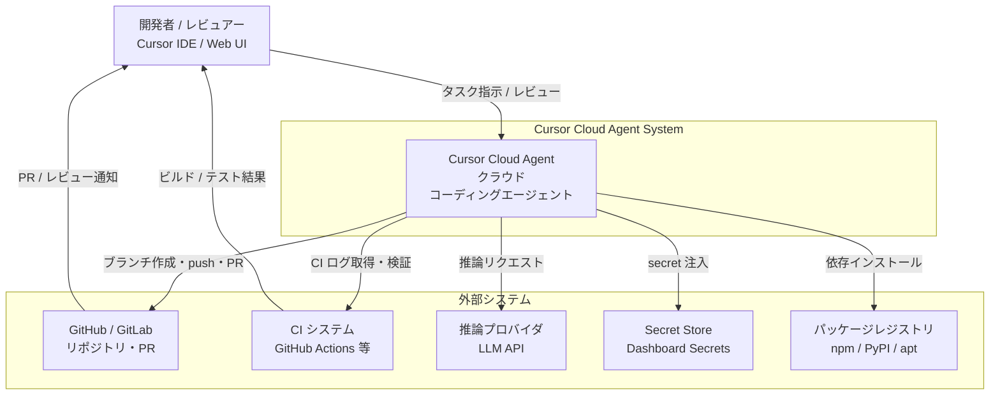
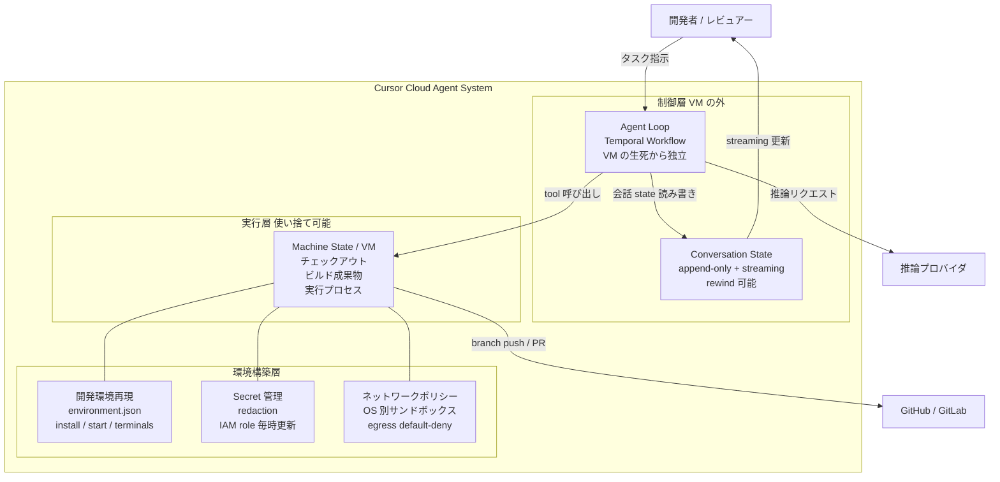
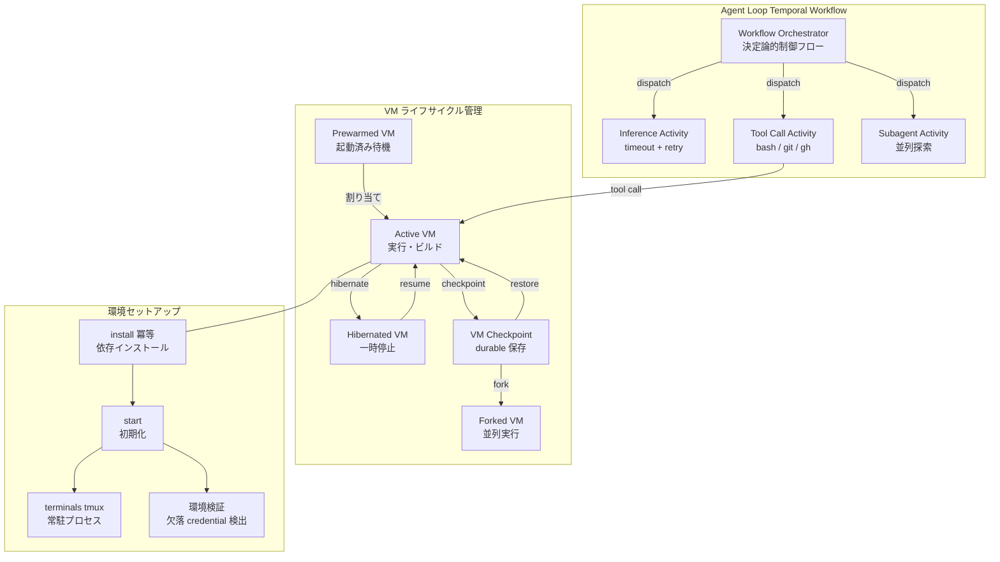
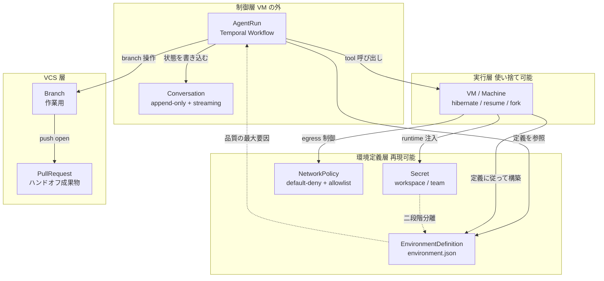
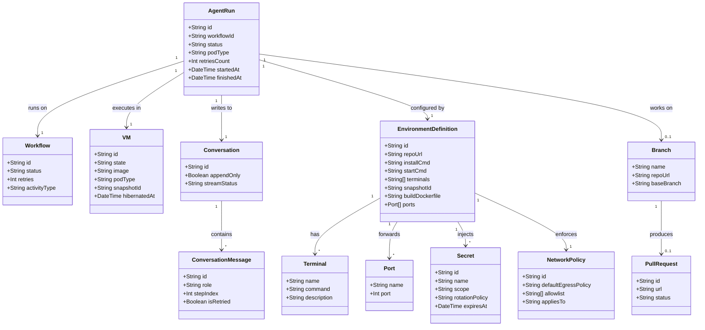

> 検証日: 2026-05-26 / 一次ソース: Cursor 公式ブログ "What we've learned building cloud agents"（2026-05-21）。本文中の "two 9s"・1 日 5,000 万アクションなどの数値は、特記ない限り **Cursor の自己申告値**です（第三者の独立検証は確認できていません）。

## 概要

Cursor は 2026-05-21 に公式ブログ "What we've learned building cloud agents"（著者: Josh Ma）を公開しました。約 1 年間のクラウドコーディングエージェント運用から得た教訓を体系化した記事です。中心命題は一文に集約されます。

> **「クラウドエージェントの出力品質を決める最大の要因は、開発者と同じ完全な開発環境を与えられているかどうかだ」**

ローカルエージェントは、開発者のラップトップ上の環境（インストール済み依存・認証・ツール・パス設定）を無償で継承します。一方クラウドエージェントは、その環境をゼロから再構築しなければなりません。依存が一つ欠けても「エラーで止まる」のではなく「微妙に品質が落ちる」形で劣化します。だからモデル性能を疑う前に、まず実行環境を点検すべきだ、というのが本設計論の出発点です。

この主張は Cursor だけのものではありません。OpenAI Codex cloud・GitHub Copilot coding agent・Devin・Claude Code を横断調査すると、各社が独立に「環境イメージ・スナップショット・セットアップスクリプトを品質の前提として一級市民化する」方向へ収斂しています。本記事は Cursor を主軸の実例としつつ、この収斂点を **「実行環境をプロダクトとして設計・運用する」** 設計原則として一般化し、現場で点検できるチェックリストに翻訳します。

想定読者は、クラウドコーディングエージェントを自社に導入・運用する実装エンジニア・SRE・LLMOps 担当です。「エージェントの品質が出ない」と感じたときに、モデル選定の前に実行基盤の何を点検すべきかを判断する材料を提供します。

## 特徴

Cursor の教訓を構成する 6 つの設計要素です。これがそのまま「環境をプロダクトとして扱う」の中身になります。

### 1. 完全な開発環境の再現が品質の最大要因

クラウドエージェントには、人間の開発者が当たり前に持つものがデフォルトでは何もありません。インストール済みの依存、設定済みの認証情報、動作するビルド・テスト・lint コマンド、ネットワークアクセスのいずれもです。

Cursor はこれを **"enterprise IT for agents"**（エージェントのための社内 IT 部門）と表現します。secret redaction・ネットワークポリシー・credential 管理を備えた環境構築の仕組みを構築したとしています（Cursor 自己申告）。環境セットアップ時には、不足する credential をフラグで通知し、セットアップが正しく完了したかを検証します。

### 2. 状態の 3 分離（アーキテクチャの核）

Cursor の設計の核心は、エージェント実行を 3 つの独立した状態に分離したことです。

| 状態 | 説明 |
|---|---|
| Agent loop | エージェントの思考ループ本体。Temporal 上（VM の外）に存在し、VM の生死から独立 |
| Machine state | VM 上のコードのチェックアウト・ビルド成果物・実行中プロセス |
| Conversation state | append-only ストレージ + クライアントへの streaming。リトライ時に巻き戻して差し替え可能 |

Agent loop が VM 外（Temporal 上）に存在するため、VM をメッセージ間で hibernate・resume したり、read-only VM・prewarmed VM など pod の種別を自由に切り替えられます。VM が落ちてもエージェントの思考は失われません。

### 3. 耐障害性 — work-stealing から Temporal へ

初期アーキテクチャは work-stealing 方式で、信頼性は **"one 9"（約 90%）** にとどまり脆弱でした（Cursor 自己申告）。リトライ・マシン跨ぎのスケジューリング・ノード障害耐性を自前実装しようとして「durable execution を再発明しかけた」ことが移行の動機です。Temporal へ移行したことで **"two 9s"（約 99%）** に到達したとしています（Cursor 自己申告）。

現在は 1 日あたり 5,000 万以上のアクション・700 万以上のユニークワークフローを処理しています（Cursor 自己申告）。推論プロバイダの障害・pod の hibernate/resume・数日から数週間に及ぶ run を生き延びる設計です。

### 4. harness の過剰制約から agent autonomy へ

初期の Cursor は harness（エージェントを包む決定論的ロジック層）で過剰に制約していました。全タスク完了後に harness が二重チェックし、強制的に commit・push する設計です。モデルが向上するにつれ、この決定論的ロジックをツール側へ移譲する方向に転換しました。リポジトリレイアウトの説明・ブランチ/PR 操作ツール・GitHub CLI を公開し、CI logs のような大きな出力はファイルに書き出してエージェントに検索させます。

クラウドとローカルでは prompting も変えます。クラウドは **ブロッキングのコストが高い**（人間が気づくまで数時間放置されうる）ため、より自律的に判断して進むよう促します。

### 5. secret 管理とブランチ運用

secret は `.env.local` のようなローカルファイルに依存せず、ダッシュボードの Secrets タブで workspace・team スコープで管理します。エージェントは GitHub・GitLab 上で別ブランチを切って作業し、push でハンドオフします。環境定義は `.cursor/environment.json` に置き、agent-led setup・保存スナップショット・Dockerfile の 3 経路から構築できます。

### 6. self-healing 環境 / autoinstall（研究プレビュー段階）

Cursor が示す将来方向は、エージェント自身が環境的障壁を検出し自動修復する **self-healing 環境** です。「secret が足りない」「ネットワークが遮断されている」といった状況を自己検出します。研究ブログ「Bootstrapping Composer with autoinstall」で公開された autoinstall は、未構成のリポジトリ checkout から RL 用の実行環境を自動生成します。不足ファイルを mock・placeholder 画像・ダミー DB テーブル・MinIO/Docker で補完する能力を持ちます。

Composer 2 は Terminal-Bench 2.0 で **61.7%**（Composer 1.5 の 47.9% から向上）と報告されています（Cursor が自社 harness で測定した自己申告値。Terminal-Bench 公式 leaderboard 掲載値ではありません）。

ただし self-healing は現時点で研究プレビュー段階です。false positive や敵対的操作（攻撃者が環境エラーを偽装して修復ロジックを誘導する）のリスクが指摘されており、業界では human-in-the-loop が推奨される段階にあります。

## 構造

C4 model の 3 段階（システムコンテキスト・コンテナ・コンポーネント）で Cursor Cloud Agent の実行基盤を可視化します。

### システムコンテキスト図



| 要素 | 説明 |
|---|---|
| 開発者 / レビュアー | Cursor IDE または Web UI からタスクを指示し、PR をレビューする人間 |
| Cursor Cloud Agent System | Temporal workflow 上のエージェントループ・使い捨て VM・append-only 会話ストレージで構成される実行基盤 |
| GitHub / GitLab | コードリポジトリ兼コラボレーション基盤。clone・別ブランチ作業・push の対象 |
| CI システム | エージェントの自己検証に使う lint・test・build パイプライン |
| 推論プロバイダ | LLM の推論 API。障害時は Temporal が timeout・retry で捕捉 |
| Secret Store | workspace・team スコープの secret。実行時に環境変数として注入。IAM role は毎時自動更新 |
| パッケージレジストリ | 環境構築時に依存をインストールする外部レジストリ群 |

### コンテナ図



| コンテナ | 説明 |
|---|---|
| Agent Loop | Temporal Workflow 上の思考ループ本体。VM 停止・切替でもループ継続。長時間 run・瞬断に耐性 |
| Conversation State | append-only ストレージ + streaming。リトライ時に stream を rewind して UI の整合性を維持 |
| Machine State / VM | 使い捨て可能な実行単位。hibernate / resume / fork / 種別切替を自由に実施 |
| 開発環境再現 | environment.json・snapshot・Dockerfile の 3 経路。install・start・terminals を定義 |
| Secret 管理 | workspace・team スコープの secret 注入。IAM role assume による短命クレデンシャル |
| ネットワークポリシー | egress デフォルト遮断 + allowlist。macOS は Seatbelt、Linux は seccomp + Landlock |

### コンポーネント図



VM ライフサイクルの構成要素です。

| 要素 | 説明 |
|---|---|
| Prewarmed VM | 起動済みの待機状態。割り当て時の起動待ちを短縮 |
| Active VM | コード実行・ビルド・ファイル変更を行う通常状態 |
| Hibernated VM | メッセージ間にアイドルとなった VM の休止。コスト最適化 |
| VM Checkpoint | checkpoint / restore / fork パイプラインで durable に保存した VM イメージ |
| Forked VM | 同一チェックポイントから分岐した VM（一次ソースに具体ユースケースの明記なし、推測補完） |

Temporal Activity と環境セットアップの構成要素です。

| 要素 | 説明 |
|---|---|
| Workflow Orchestrator | 決定論的制御フロー。同一入力でリプレイすると同じ経路。VM 障害で失われない |
| Inference Activity | 推論プロバイダ呼び出し。瞬断は timeout から Retry Policy で自動リトライ |
| Tool Call Activity | bash・git・GitHub CLI の async ツール呼び出し。冪等設計で二重発火防止 |
| Subagent Activity | サブエージェント起動。並列ブランチ探索などの協調実行 |
| install / start / terminals | 冪等な依存インストールから初期化、長時間プロセスの tmux 常駐 |
| 環境検証 | 欠落 credential の検出・完了確認。微妙な品質劣化を事前に捕捉 |

## データ

### 概念モデル



| 概念 | 説明 |
|---|---|
| AgentRun | エージェントの思考ループ 1 実行。VM の生死から独立 |
| Conversation | 会話履歴。append-only に書き込み、クライアントへ streaming |
| VM / Machine | 使い捨て可能なコンピューティング単位。hibernate / resume / fork が可能 |
| EnvironmentDefinition | environment.json にコード化した環境定義。品質の最大要因 |
| Secret | 機密情報。workspace・team スコープで管理し runtime 注入 |
| NetworkPolicy | egress 既定遮断 + allowlist。prompt injection・データ持ち出し対策 |
| Branch / PullRequest | エージェント作業用ブランチと、push してオープンするハンドオフ成果物 |

### 情報モデル



| エンティティ | 説明 |
|---|---|
| AgentRun | エージェント実行。startedAt〜finishedAt は数日から数週間のスパンあり |
| Workflow | Temporal Workflow の状態とリトライ数 |
| VM | 状態（running / hibernated / terminated）・image・podType・snapshotId |
| Conversation / ConversationMessage | append-only フラグ・stream 状態・ステップ番号・差し替えフラグ |
| EnvironmentDefinition | install / start / terminals / snapshot / build.dockerfile（クラス図の `buildDockerfile` は概念属性、実 JSON では `build.dockerfile`）。ポート転送はトップレベル `ports` |
| Terminal | name / command / description。ポートは Terminal 内ではなく `ports[]` で定義 |
| Secret | scope（workspace / team）・rotationPolicy（毎時）。値そのものは非保持 |
| NetworkPolicy | defaultEgressPolicy（deny）・allowlist・appliesTo（Copilot の盲点を表現） |

「推測/補完」と記した属性は、Cursor 公式ブログ・docs・research blog に明示のない補完項目です。設計上の必要性から導出しました。なお Privacy Mode は environment.json のフィールドではなく、ダッシュボード設定として管理されます。

## 構築方法

### environment.json による環境定義

Cursor クラウドエージェントの実行環境は、リポジトリ内の `.cursor/environment.json` で宣言的に定義します。これをコミットすることで、チーム内で再現可能な実行基盤を共有できます。CI と定義を揃えたい場合は、後述の Makefile のように `install`・検証コマンドを共通の入口に寄せます。なお Cursor の `install`・`start`・`terminals` は、Dev Container の lifecycle（`onCreateCommand`・`postCreateCommand` 等）とは別物です。

| フィールド | 説明 |
|---|---|
| `snapshot` | ディスクイメージ ID。書き戻すことで install をスキップして高速起動 |
| `install` | 依存インストールコマンド。冪等必須、project root で実行 |
| `start` | install 後の初期化コマンド。DB マイグレーション等 |
| `terminals` | tmux セッションで動く長時間プロセス。dev server / watch / test runner 等 |
| `build.dockerfile` | Dockerfile ベース構築時のパス。`build` オブジェクト配下（`build.context` とセット） |
| `ports` | フォワードするポート。トップレベル配列で `{name, port}` 形式 |

```json
{
  "install": "npm ci && pip install -r requirements.txt",
  "start": "python manage.py migrate --noinput",
  "terminals": [
    { "name": "api-server", "command": "python manage.py runserver 0.0.0.0:8000", "description": "Django API server" },
    { "name": "frontend-watch", "command": "npm run dev", "description": "Vite dev server" },
    { "name": "test-runner", "command": "npm run test:watch -- --reporter=verbose", "description": "Jest watch" }
  ],
  "ports": [
    { "name": "api-server", "port": 8000 },
    { "name": "frontend", "port": 3000 }
  ]
}
```

`install` 完了後、ダッシュボードから発行された snapshot ID を書き戻す運用で、次回起動時の依存インストールをスキップできます。正確なフィールド定義は公式 JSON Schema を参照してください。

### devcontainer.json の lifecycle 設計

Dev Container spec の lifecycle コマンドは次の順序で実行されます。

```
initializeCommand (ホスト側)
  -> onCreateCommand (コンテナ内・初回のみ)        ← prebuild がキャッシュ
    -> updateContentCommand (コンテンツ更新時)     ← prebuild がキャッシュ
      -> postCreateCommand (ユーザー割り当て後)
        -> postStartCommand (起動のたび)
          -> postAttachCommand (ツール attach のたび)
```

`onCreateCommand` と `updateContentCommand` はユーザー割り当て **前** に走るため、ユーザースコープの secret にアクセスできません。secret が必要な処理は、すべて `postCreateCommand` 以降に配置します。

```json
{
  "name": "my-project",
  "image": "mcr.microsoft.com/devcontainers/base:ubuntu-22.04",
  "features": {
    "ghcr.io/devcontainers/features/node:1": { "version": "20" },
    "ghcr.io/devcontainers/features/python:1": { "version": "3.12" },
    "ghcr.io/devcontainers/features/github-cli:1": {}
  },
  "onCreateCommand": "npm ci && pip install -r requirements.txt",
  "updateContentCommand": "npm ci --prefer-offline",
  "postCreateCommand": "bash .devcontainer/postCreate.sh",
  "postStartCommand": "bash .devcontainer/postStart.sh",
  "remoteUser": "vscode"
}
```

ポイントは 3 点です。`containerEnv` に機密値を直書きしません（イメージに焼き込まれます）。`privileged` と `capAdd` は必要最小限に絞ります。feature はメジャーバージョン固定（`:1` 等）でフロート参照を避けます。

secret 依存処理は `postCreateCommand` 以降のスクリプトに分離します。

```bash
#!/usr/bin/env bash
set -euo pipefail
# NPM private registry 認証（secret は環境変数で注入済み）
if [[ -n "${NPM_TOKEN:-}" ]]; then
  echo "//registry.npmjs.org/:_authToken=${NPM_TOKEN}" > ~/.npmrc
fi
# DB 接続確認
if [[ -n "${DATABASE_URL:-}" ]]; then
  python manage.py check --database default
fi
```

### secret を runtime に寄せる三原則

1. environment.json・devcontainer.json・Dockerfile・リポジトリ本体に secret を直書きしない
2. build time（prebuild・Docker build・Dev Container features）には secret を渡さない
3. 可能な限り短命クレデンシャル（IAM role assume 等）を採用する

| プラットフォーム | 注入タイミング | 制約 |
|---|---|---|
| Cursor ダッシュボード | エージェント起動時に環境変数として注入 | environment.json への直書き厳禁 |
| GitHub Codespaces | コンテナ起動後・ユーザーセッションに環境変数 export | build time・features では使用不可 |
| OpenAI Codex cloud | setup フェーズのみ使用可、agent フェーズ開始前に削除 | agent 本体には届かない設計 |

### egress allowlist 設定

「既定で閉じ、allowlist で開く」がネットワーク設計の定石です。GitHub Copilot coding agent では organization settings から組織レベルで設定でき、OS パッケージ・コンテナレジストリ・主要言語パッケージレジストリが推奨 allowlist で自動カバーされます。社内 private registry はドメイン形式（`packages.mycompany.internal`）または URL 形式（`https://npm.mycompany.internal/scope/`）で追加します。

ここで重要な盲点があります。Copilot の firewall は **エージェントの Bash tool 経由で起動したプロセスにのみ適用** されます。MCP サーバや setup steps で起動したプロセスには適用されません。

Cursor のローカル sandbox は OS 別に隔離します。Linux は seccomp + Landlock、macOS は Seatbelt（sandbox-exec）、Windows は WSL2 内 Linux sandbox です。

## 利用方法

### 起動から push ハンドオフまで

```
1. ダッシュボードまたは Slack 連携でタスク指示
2. エージェントが新規ブランチを自動作成して作業開始
3. environment.json の install -> start -> terminals で環境を構築し
   lint / test / build で自己検証しながら実装
4. 完了後に push し PR を自動作成（Slack / ダッシュボードに PR リンク共有）
5. 人間がレビューして merge
```

### 検証コマンドを Makefile で一元化

エージェントと CI が同一定義を参照できるよう、検証コマンドを Makefile に集約します。

```makefile
.PHONY: lint test build typecheck check
lint:
	npm run lint
	python -m flake8 src/
test:
	npm test -- --coverage
	python -m pytest tests/ -v --tb=short
typecheck:
	npm run typecheck
	python -m mypy src/
build:
	npm run build
check: lint typecheck test build
	@echo "All checks passed"
```

エージェントへの指示例は「変更後は必ず `make check` を実行して全検証をパスさせてから push してください」です。

### 別ブランチ作業と Branch Protection

クラウドエージェントは常に dedicated ブランチで作業させ、main/develop への直接 push を禁止します。

```yaml
# .github/settings.yml（GitHub Settings Manager 等で管理する場合の実装例）
branches:
  - name: main
    protection:
      required_pull_request_reviews:
        required_approving_review_count: 1
        dismiss_stale_reviews: true
      required_status_checks:
        strict: true
        contexts: ["ci/lint", "ci/test", "ci/build"]
```

クラウド向けの prompting では「ブロッキングのコストが高い」前提で、自律的に判断して進むよう指示します。不明な仕様は README と既存テストから推定させ、推定内容を PR 説明に記載させます。

### CI ログをファイル経由で検索させる

大きな CI ログを直接コンテキストに流すとトークンを圧迫します。ファイルに書き出してエージェントに検索させます。

```yaml
- name: Run tests (ログをファイル保存)
  run: npm test -- --coverage 2>&1 | tee /tmp/test.log
  continue-on-error: true
- name: Upload logs as artifacts
  uses: actions/upload-artifact@v4
  if: always()
  with:
    name: ci-logs-${{ github.run_id }}
    path: /tmp/*.log
```

エージェントへの指示例は「CI が失敗したら artifacts からログを取得し、`grep -n "Error" /tmp/test.log | head -50` で失敗箇所を絞り込んでから対処してください。ログ全体をコンテキストに貼らないこと」です。

### 注意点（日本特有の罠と共通の落とし穴）

- **Cursor**: Background Agent は実行中コードを Cursor の AWS VM 上に保持します。2026-05-26 時点の現行ドキュメントでは Privacy Mode 下でも利用可能とされますが、組織のデータ保持ポリシーによっては Privacy Mode 設定の確認・調整が必要です（旧バージョンでは無効化が必須だったとの情報もあり、利用前に現行 docs で確認してください）。ポート転送はトップレベルの `ports`（`{name, port}` 形式）で明示指定します。
- **Codex Cloud**: `codex-universal` コンテナ内では Docker を起動できません。PostgreSQL・Redis 等はベースイメージに直接インストールします。agent フェーズのインターネットアクセスは既定でオフで、依存解決は setup フェーズで完結させます。
- **GitHub Copilot coding agent**: Issue にアサインされた時点で、既存の devcontainer.json・Codespaces 設定を利用しません。`copilot-setup-steps.yml` で別途環境を定義します。
- **OpenAI Codex**: secret は setup script では使えますが、agent フェーズ開始前に削除されます。private registry 認証等は setup フェーズで完結させ、`~/.npmrc` を削除する設計にします。

## 運用

### 耐障害性 — Temporal による durable execution

Temporal の運用観点で押さえるべき概念です。

| 概念 | エージェント基盤での意味 |
|---|---|
| Deterministic Workflow | Workflow は決定的に実装し、同一入力で再実行時に同じ経路。非決定エラー防止 |
| Activity + Retry Policy | 外部副作用を Activity に切り出し、回数・バックオフ・timeout を明示 |
| Heartbeat / Checkpoint | 数分超の長時間 Activity は heartbeat を打ち、進捗メタデータで中断から再開 |
| 冪等性ガード | リトライで副作用が二重発火しないよう Activity 側に冪等ガード |

```yaml
# Temporal Activity の Retry Policy 設定例
activity_options:
  start_to_close_timeout: 3600s
  heartbeat_timeout: 120s
  retry_policy:
    initial_interval: 10s
    backoff_coefficient: 2.0
    maximum_interval: 300s
    maximum_attempts: 5
    non_retryable_error_types: ["PermanentFailure"]
```

注意点があります。"two 9s"（99%）は datacenter 標準では low-level service が出す程度の水準です。99.9%（three 9s）以上を前提とする SLA と比較する際は差異を意識します。Temporal は学習コストが高く「非常に複雑」という批判もあります。既存ストリーム処理基盤で要件を満たせるか事前評価を推奨します。

### secret の短命化 — IAM role 毎時 assume

Cursor Cloud Agent は AWS IAM ロールの assume（external ID 付き）をネイティブサポートし、認証情報を毎時自動更新します。「長命クレデンシャルが漏洩した際のダメージを時間軸で限定する」設計思想に基づきます。

```bash
# IAM role assume（setup.sh での使用例）
assume_role_output=$(aws sts assume-role \
  --role-arn "$AGENT_ROLE_ARN" \
  --role-session-name "cursor-agent-$(date +%s)" \
  --external-id "$EXTERNAL_ID" \
  --duration-seconds 3600)
export AWS_ACCESS_KEY_ID=$(echo "$assume_role_output" | jq -r '.Credentials.AccessKeyId')
export AWS_SESSION_TOKEN=$(echo "$assume_role_output" | jq -r '.Credentials.SessionToken')
```

secret の二段階分離は業界の収斂点です。ビルド時には secret を渡さず（Codespaces は明示的に不可）、エージェント本体の実行フェーズにも直接露出させません（Codex は agent フェーズ前に削除、Claude Code は credential を sandbox 外に保持し proxy 経由）。

### egress 監視とネットワーク点検

「既定で閉じ、allowlist で開く」は主要クラウドコーディングエージェント全社が採用する設計です。最重要の盲点は Copilot firewall です。firewall は Bash tool 経由で起動したプロセスにのみ適用され、MCP サーバや setup steps で起動したプロセスには適用されません。MCP サーバ経由の外部通信は、別途ネットワーク監視・サンドボックス層での制御が必要です。

## ベストプラクティス

実行基盤チェックリストを「誤解 → 反証 → 推奨」の構造で整理します。

### 環境再現

- **誤解**: 「出力が悪いのはモデルの問題。モデルを上げれば改善する」
- **反証**: frontier モデル 6 機種が SWE-bench Verified で 0.8pt 差に収束しており、「モデルはもはや差別化要因でない」とされます（二次情報）。依存欠落は「エラー」でなく「品質劣化」で現れます。なお Anthropic の infrastructure noise 計測記事では、RAM を 5 倍にしてもスコアは SWE-bench では +1.54pt にとどまる一方、Terminal-Bench 2.0 では数 pt 規模の影響が出ます。メモリという単一リソース軸の効果は評価タスク依存であり、「完全な環境再現」全体を否定する反証ではありません。
- **推奨**:
  - 環境定義をコード化する（devcontainer.json・environment.json・setup script）
  - 開発者と同等の依存・ツールがあるか確認する（欠落の症状は品質劣化で現れる）
  - 環境セットアップ後に検証ステップを持つ
  - Codex Cloud はコンテナ内 Docker 不可、ミドルウェアはベースイメージに直接インストール

### 状態分離・耐障害性

- **誤解**: 「Temporal を使えば耐障害性は解決する。すぐ導入すべき」
- **反証**: durable execution は非常に複雑で学習コストが高いです。"two 9s" は low-level service 水準です。既存のストリーム処理で要件を満たせるか先に評価すべきです。
- **推奨**:
  - エージェントの思考ループを VM の生死から分離する
  - 長時間 run のリトライ・チェックポイント・推論プロバイダ障害耐性を持つ
  - 外部副作用が冪等で、リトライで二重発火しない
  - まず既存ツールで足りるか評価し、Temporal 等は必要な場合のみ採用

### secret・ネットワーク

- **誤解**: 「secret を環境変数に入れておけば安全」
- **反証**: 環境変数はプロセスツリー全体・子プロセス・ログに漏れやすいです。build time には渡せない制約もあります。
- **推奨**:
  - secret を environment.json・devcontainer.json・Dockerfile・リポジトリに直書きしない
  - secret 依存処理が `postCreateCommand` 以降にあり、prebuild 対象に紛れていない
  - secret を短命化し、長命クレデンシャルを使わない
  - MCP サーバと setup steps は firewall をバイパスする前提で別途制御する
  - egress をデフォルト deny + allowlist で管理する

### 検証・運用

- **誤解**: 「harness でエージェントを細かく制御するほど品質が安定する」
- **反証**: Cursor 自身が初期の過剰制約 harness を撤廃し、ツール公開 + 自律判断に転換しました。モデルが向上するほど決定論的ロジックは足かせになります。
- **推奨**:
  - lint・test・build を一発で呼べる形で定義し、CI と同一定義を共有する
  - CI logs のような大出力をファイル経由で検索させる
  - harness で過剰制約せず、必要なツールを公開して autonomy を持たせる
  - クラウド向けに「ブロッキングのコストが高い」前提の prompting にする

### 日本での導入時の既知の罠（Devin Enterprise）

DeNA の Devin Enterprise 導入レポート（2025/9）からの知見です。

- VPC/EC2 の自前 SRE 運用が必要（autoscaling・Reserved Instances での対応）
- 推奨インスタンス i3.metal の東京リージョン費用は **約 $4,274.88/月（2025年9月時点）**
- GHES（GitHub Enterprise Server）は WebUI 非対応（GitHub Enterprise Cloud のみ対応）
- SSO はベンダー直接連絡が必要、Slack 連携は Enterprise Admin のみ・1 組織 1 ワークスペース制限

## トラブルシューティング

### 「品質が出ない」— モデルではなく環境を疑う

```
品質の問題を検知 -> モデルを上げる前に確認
  1. 依存・ツールが正しくインストールされているか
  2. secret が正しく注入されているか（runtime 注入か / build time 設定でないか）
  3. ネットワークアクセスが通っているか（allowlist に必要なドメインがあるか）
  4. 検証コマンドが機能しているか（lint / test を手動実行）
  5. モデルを疑う（最後）
```

### firewall の盲点 — MCP サーバ・setup steps に未適用

firewall を設定したのに外部への意図しない通信が発生する症状です。原因は、Copilot の firewall が Bash tool 経由のプロセスにのみ適用され、MCP サーバ・setup steps はバイパスする点にあります。対処として、MCP サーバの通信を個別に監視・制限し、setup steps の通信を棚卸しし、組織レベルで allowlist を集中管理し、eBPF/sysdig 等でコンテナ外通信を全記録します。

### 可用性障害 — 落ちる/起動しない の切り分け

Cursor フォーラムには可用性障害の報告が複数あります。serialization エラーで agents ページが開けない、spin up せず 10 分以上待つ、branch 作成・push に繰り返し失敗する、VM snapshot 作成で反復失敗する、といった事例です。

```
Step 1: status ページとフォーラムを確認
        （all operational でも active incident が同時に出る矛盾あり）
Step 2: 環境起因 vs サービス起因
  環境起因: 特定リポジトリだけで setup 失敗 / VM snapshot 作成失敗 / git push のみ失敗
  サービス起因: 複数リポジトリ・複数ユーザーで同時発生 / 内部 serialization error
Step 3: 環境起因なら environment.json の install をローカル再現
        setup.sh 手動実行、secret 注入確認、Privacy Mode 設定確認
```

### self-healing の false positive と敵対的操作リスク

self-healing 環境（secret 欠落・ネットワーク遮断を自律検知して自動修復）は、現時点で 2 つのリスクがあります。

```
自動修復の分類
  低リスク（自動 OK）  : パッケージキャッシュのクリア / ログローテーション / 冪等な install の再実行
  高リスク（人間確認） : secret の再注入・ローテーション / ネットワークポリシー変更 / VM 再作成
                        / 同じ是正が反復する場合
ルール: 同じ自動修復が N 回連続したらアラートを上げて停止する
```

業界ガイダンスは human-in-the-loop を推奨する段階です。Cursor の完全自律修復ビジョンは、現行ベストプラクティスと逆行する面があります。

### 大規模 monorepo での環境再現破綻

devcontainer 設定が複雑化し「公式手順でも動かせない」「イメージが肥大化する」症状です。製品ごとに依存・ツール・ビルド設定が異なる monorepo では、単一 devcontainer で全部を賄うのが困難です。対処として、devcontainer を製品/サービス単位に分割し、共通ベースイメージ + オーバーレイ方式を採り、並列エージェントを独立コンテナ（container-use・E2B 等）で実行し、Cursor なら snapshot を製品単位で分けます。

## まとめ

クラウドコーディングエージェントの品質は、モデル性能よりも「完全な開発環境の再現・状態分離・耐障害性・検証基盤」という実行環境で決まります。Cursor の 3 状態分離と Temporal による durable execution を軸に、secret の二段階分離・egress allowlist・検証コマンド公開を点検すれば、モデルを上げる前に効く改善箇所が見えてきます。

この記事が少しでも参考になった、あるいは改善点などがあれば、ぜひリアクションやコメント、SNSでのシェアをいただけると励みになります！

## 参考リンク

- Cursor 公式
  - [What we've learned building cloud agents](https://cursor.com/blog/cloud-agent-lessons)
  - [Cursor Cloud Agent docs](https://cursor.com/docs/cloud-agent)
  - [Cursor Cloud Agent setup](https://cursor.com/docs/cloud-agent/setup)
  - [environment.json JSON Schema](https://cursor.com/schemas/environment.schema.json)
  - [Bootstrapping Composer with autoinstall](https://cursor.com/blog/bootstrapping-composer-with-autoinstall)
  - [Implementing a secure sandbox for local agents](https://cursor.com/blog/agent-sandboxing)
- 競合・周辺技術
  - [OpenAI Codex cloud — Cloud environments](https://developers.openai.com/codex/cloud/environments)
  - [OpenAI Codex — Sandboxing](https://developers.openai.com/codex/concepts/sandboxing)
  - [GitHub Copilot coding agent — About](https://docs.github.com/copilot/concepts/agents/coding-agent/about-coding-agent)
  - [GitHub Copilot — Firewall customization](https://docs.github.com/copilot/customizing-copilot/customizing-or-disabling-the-firewall-for-copilot-coding-agent)
  - [GitHub Copilot — allowlist reference](https://docs.github.com/en/copilot/reference/copilot-allowlist-reference)
  - [Anthropic — Making Claude Code more secure and autonomous](https://www.anthropic.com/engineering/claude-code-sandboxing)
  - [Devin Enterprise deployment docs](https://docs.devin.ai/enterprise/deployment/overview)
  - [Dev Container spec — json reference](https://containers.dev/implementors/json_reference/)
  - [Temporal — Workflow Execution](https://docs.temporal.io/workflow-execution)
  - [Temporal — Activity Execution](https://docs.temporal.io/activity-execution)
- 反証・批判的視点
  - [Qovery — Cursor Cloud Agents enterprise limitations](https://www.qovery.com/blog/cursor-cloud-agents-enterprise-limitations)
  - [DCD — Our misguided faith in the Five Nines](https://www.datacenterdynamics.com/en/opinions/our-misguided-faith-five-nines/)
  - [materializedview.io — Durable Execution: Justifying the Bubble](https://materializedview.io/p/durable-execution-justifying-the-bubble)
  - [Anthropic Engineering — Quantifying infrastructure noise in agentic coding evals](https://www.anthropic.com/engineering/infrastructure-noise)
  - [oneuptime.com — How to implement self-healing infrastructure](https://oneuptime.com/blog/post/2026-02-23-how-to-implement-self-healing-infrastructure-with-terraform/view)
- 国内事例・実践知
  - [DeNA — Devin Enterprise 導入 8つの課題](https://engineering.dena.com/blog/2025/09/aj-devin-enterprise/)
  - [NHNテコラス — Cursor 導入事例](https://techblog.nhn-techorus.com/archives/41012)
  - [LayerX — AIエージェントを安全に動かすサンドボックス](https://zenn.dev/layerx/articles/a99cd11af487fc)
