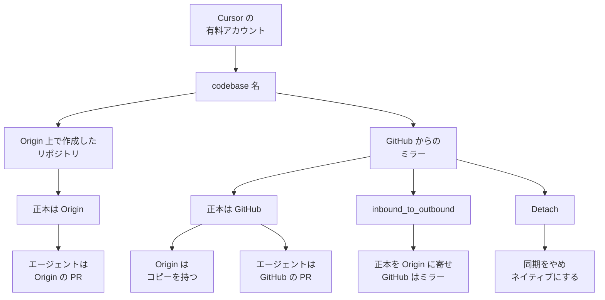

Cursor Origin は、Cursor が提供する git forge です。有料プラン（Pro、Teams、Enterprise）向けの早期ベータで、リポジトリの作成、標準の git による clone / push / pull、プルリクエスト、ブラウザでのコード閲覧、GitHub からのミラーを行います。公開ドキュメントは、冒頭で early beta と書いています。

操作の入口は `cursor.com/codebase` です。git の HTTPS リモートは `origin.cursor.com` です。この記事では、リポジトリの作り方でコードの正本が Origin になる場合と GitHub のままになる場合を分けます。権限、監査、バックアップ、CI をどこに残すかを、2026-09-27 時点の cursor.com の公開ドキュメントと changelog に沿って読めます。

*この記事の全体像。以下、順に解説します。*

## Cursor Originとは

Cursor Origin は、コードを置く場所と、プルリクエストを開く場所を、Cursor のアカウントの中に持つ git ホスティングです。公開ドキュメントは、エージェントが同じ場所でリポジトリを作り、変更し、プルリクエストを開ける、と書いています。公開 API の base URL は `https://api.cursor.com/v1/origin` で、状態は Early Beta です。

### 使える範囲

コード保管は Pro、Teams、Enterprise で使えます。公開は段階的です。チームは先に codebase 名（namespace）を取得します。URL は `https://cursor.com/codebase/{owner}/{repo}` です。

Origin の Privacy Mode は、namespace の所有者（チームまたは個人）の設定に従います。

### 正本が分かれる2つの置き方

コードの置き場所は2系統です。

Origin 上で作ったリポジトリでは、push の着地先が Origin です。GitHub は経路に入りません。この系統では Origin が正本です。

GitHub から同期したリポジトリでは、GitHub が正本のままです。Origin はそのコピーを持ちます。同じ HTTPS リモートへの push は GitHub に届き、Origin は GitHub が受け取ったあと更新します。

### ミラーが運ぶもの

ミラーが運ぶのは、git の履歴、ブランチ、タグ、閲覧できるコード、Cursor 上でレビューできる GitHub のプルリクエストです。

### プルリクエストとブランチ保護

プルリクエストには Activity、Commits、Checks、Files Changed があります。API は依存関係のあるスタック PR（`stack`）を持ちます。ネイティブのリポジトリでは、スタック中の PR をマージすると、根からその PR までの列をまとめて着地します。

ブランチ保護は ruleset です。対象は merge、branch push、tag push、repository push です。ルール種別の例は、pull request、status checks、up to date、deletion、non-fast-forward です。

### 権限と公開範囲

権限は grants で付けます。リポジトリは `read` / `write` / `admin` です。namespace は `PERMISSION_READ` / `PERMISSION_CONTRIBUTOR` / `PERMISSION_WRITE` / `PERMISSION_ADMIN` です。

チーム所有リポジトリの公開範囲は Internal または Private です。個人所有は常に Private です。API が列挙する visibility は `internal` と `private` です。

### CI、取り出し、エージェント

changelog が CI の接続先として書くのは Depot と Buildkite です。どちらも、既存の GitHub Actions workflow を実行できる、とあります。外部の CI は Checks API で結果をコミットに載せられます。CloneKit（`origin repo clone-fast`）は、事前に組んだパックから clone を始めます。

取り出しは2つです。通常の git clone と、1コミットのツリーを返す Get Repo Tarball です。

クラウドエージェントは、Origin 上で作ったリポジトリでは Origin のプルリクエストを開きます。ミラーでは GitHub のプルリクエストを開きます。作成時の権限は、その Cursor アカウントと同じです。

### 正本の分かれ方

正本がどちらかは、リポジトリの作り方で分かれます。ミラーは後から方向を変えられます。`inbound_to_outbound` は、正本を Origin に寄せ、GitHub をミラーにします。Detach は同期を切り、Origin 上のネイティブなリポジトリにします。

git の案内ページが示すクローン URL は `https://origin.cursor.com/{owner}/{repo}.git` です。Migration API の応答例は `https://origin.cursor.com/git/{owner}/{repo}.git` です。運用では、画面の Code ボタンが返す URL を使います。

## 注意点

見出しや二次記事が、上の2系統を1つの製品機能にまとめて読む箇所があります。公開文書が範囲として書いているものと、2026-09-27 の公開目次と本文では確認できなかったものを分けます。確認できなかったものは、存在しない、とまでは書きません。

### 見出しが2系統を1つにまとめる場合

InfoQ 日本語版（`datePublished` は 2026-09-25、原文は 2026-08-25）の見出しは「GitHubの新たな代替」です。同じ記事の本文は、同期したプロジェクトでは push が GitHub に着地し、GitHub が system of record だと書いています。2026-08-17 の changelog も、Origin 上で作ったものだけ Origin が正本だと分けています。見出しの「代替」は、この2系統を1つにまとめた言い方です。

changelog は同日、「Agent-native features ship soon」と書きます。2026-09-27 のドキュメントは、エージェントがリポジトリを作り、変更し、プルリクエストを更新できる、と既に書いています。soon の中身は、changelog が列挙していません。

2026-08 の比較記事が「ruleset も rate limit も無い」と書いた部分は、2026-09-27 の API と一致しません。ruleset、点数制の rate limit、Checks は、その日の公式にあります。

### 文書が範囲として書いていること

- Free プランではコード保管を使えません。Enterprise は、管理者が対象外にできます。
- ベータ中、取得した namespace は変更できません。
- レガシー privacy mode のチームは、Privacy Mode に切り替えるまで Origin を有効化できません。
- ミラーは、GitHub Issues と、GitHub Actions の workflow および secrets を運びません。
- Depot と Buildkite は、Origin 上で作ったリポジトリに限ります。
- CloneKit は Enterprise で、リポジトリごとに Cursor 側の有効化が要ります。セルフサーブの切替はありません。
- クローン URL は、git の案内ページと Migration API の応答例でパスが違います。運用では、画面の Code ボタンが返す URL を使います。

### 公開文書では確認できなかったこと

- Origin 専用の稼働率コミットメント。SOC 2 Type II は、Cursor 全体の Trust Center にあります。
- Origin の git オブジェクトが、Enterprise の US-only data residency に含まれるという名指し。同文書は、Customer Data の保存とバックアップを選択リージョンに置くと書き、列挙は推論、処理、Cloud Agents、Tab です。Origin も git オブジェクトも、その箇条書きにありません。除外リストにも Origin はありません。
- `repository.access_changed` と `namespace.access_changed` を、Enterprise 監査ログの `event_type` 一覧、Admin API、または Origin の webhook 一覧から読む手順。Grants API は、権限の書き込みがこの2つの監査イベントを記録する、と書きます。Enterprise のイベント一覧には、この2名がありません。近い別名は `team_repo` と `grok_bot_access_changed` です。文書は、それらを Origin の grant と同一だとは書いていません。
- GitHub Issues 相当の課題台帳。Origin API のグループに Issue はありません。ミラーは GitHub Issues を運びません。別製品の Rollouts（Teams / Enterprise）は、回帰時に issue を開きます。その実体が Origin の Issue オブジェクトだとは、Rollouts の文書が書いていません。
- GitHub Actions を Origin がホストすること。Depot と Buildkite が既存 workflow を走らせる、という文はあります。workflow と secrets の同期は、ミラーの対象外です。
- マージキュー。スタック PR は API にあります。`merge queue` という語は、公開されている Origin API の全文では、製品機能として見当たりませんでした。
- Origin 専用のストレージ料金と容量上限。資格は有料プランだと書いてあります。容量の数値は、料金ページには見当たりませんでした。別料金が無いことの証明にはしません。
- 非公式サイトが書く秒あたりコミット数や、取得金額。会社ブログは「Cursor has officially been acquired by SpaceX」と書きます。金額はその記事にありません。参照した記述には、掲載日が含まれていません。

### beta の利用規約

利用規約（Last updated 2026-09-03、契約の名宛は Anysphere, Inc.）は、Service に「build, deploy, host, and manage software projects」を含めます。同 1.6 は、beta と明示された機能を評価用とし、warranty、support、maintenance、storage を負わない、と書きます。Origin の文書は冒頭で early beta と書きます。10 節は、Service が変わりアクセスを失う場合に備え、Content のコピーを手元に残せ、と書きます。

### 数値がまだ書かれていない項目

- Git over HTTPS の独自レート予算の点数。文書はヘッダを読めと言い、既定値を書いていません。
- REST の 500 / 503 を何秒で再試行するか。429 の `Retry-After` は 60 秒、と core 予算には書いてあります。
- `repository.access_changed` が、ダッシュボードに別名で出るか。カタログにはその名前がありません。
- Origin の git オブジェクトの保存リージョン、専用 SLA、専用の容量上限。
- 全履歴のバックアップまたはリストアの専用 API。clone と tarball 以外は、索引にありません。
- Rollouts が開く issue の保存先。

## 正本をどちらに残すか

比較の基準日は 2026-09-27 の公開ドキュメントです。GitHub 側の機能一覧は、ここで再計測していません。GitHub 列は、ミラーを使うときに GitHub 側へ残るものとして読んでください。

| 基準 | Origin 上で作成 | GitHub ミラー（inbound） | 判断 |
| --- | --- | --- | --- |
| 正本 | Origin | GitHub | 作り方で決まる |
| Issues | API グループに Issue が無い | GitHub に残る。同期されない | 課題台帳が要るなら GitHub を残す |
| Actions の workflow と secrets | Origin 自身が Actions をホストする記述は、2026-09-27 の changelog と設定文書では確認できなかった。changelog は Depot と Buildkite が既存 workflow を実行できる、と書く | GitHub に残る | workflow の保管場所は GitHub のままにできる |
| 自前ランナー | Checks API と、Enterprise の CloneKit | 既存の GitHub Actions を使える | ランナーを自前で持てるなら、Actions ホストの欠落だけでは足りる |
| 公開リポジトリ | visibility は internal / private | GitHub 側の公開設定は Origin の visibility ではない | 公開が要るなら GitHub を残す |
| 権限の外部監査 | イベント名は記録すると書く。読み出し手順は監査カタログに無い | 監査主体は GitHub のままにできる | 権限変更の SIEM が要るなら、Origin ネイティブを正本にしない |
| 履歴の取り出し | git clone。tarball は1コミットのツリー | git clone。push は GitHub に着地 | ベンダのバックアップ保証とは別 |
| 正本の切り替え | 最初から Origin | `inbound_to_outbound` で Origin を正本にできる。Detach はこの API では戻せない。`outbound_to_inbound` の force cutover は、このホストにしか無い ref をスナップショットしたうえで、上流の正本には採用しない | 切り戻しの単位を先に決める |
| エージェントの書き込み先 | Origin の PR | GitHub の PR。インバウンド中、アプリの token は metadata と contents の read 以外が 403 | レビュー正本を GitHub に残せる |

## 外す条件と残してよい使い方

権限変更を外部の監査ログで読むこと、GitHub Issues 相当の課題台帳、公開リポジトリ、git オブジェクトの保存先の明示、GitHub Actions の workflow と secrets を Origin がホストすること、のどれかが契約上必須なら、Origin 上で作ったリポジトリをコードの正本にする移行から外します。GitHub を正本にしたミラーは、閲覧、検索、および GitHub のプルリクエストを開くエージェントと Automations に使ってよい、が公開記述の範囲です。

ハーネスや Skills の下に足す問いは、エージェントの書き込み先と、人間のレビュー正本を、同じ製品に乗せるかどうかです。乗せるなら、権限、監査、バックアップの単位をエディタベンダー側に置くと、契約と運用に書きます。置かないなら、ミラーのまま GitHub を正本にします。

### 判断を支える公開記述

- changelog（2026-08-17）と Origin の文書が、正本を2系統に分けています。
- ミラーの文書が、Issues と Actions の workflow / secrets を Not included にしています。
- visibility の許容値は `internal` と `private` です。
- Grants の監査イベント名が、Enterprise の `event_type` 一覧と Origin webhook の Events にありません。
- データレジデンシー文書が、Origin の git オブジェクトを名指ししません。
- 利用規約 1.6 が、beta について storage を含む保証を負わない、と書きます。
- Detach が「Detaching is not reversible through this API」と書きます。

### 外しすぎない条件

「自前 CI が無いから外す」は強すぎます。外部ランナーが clone し、Checks API で結果を返せるなら、Origin が Actions をホストする記述が確認できないことだけでは外しません。CloneKit は Enterprise かつリポジトリごとの有効化です。

「ミラーは閲覧とレビューだけ」は狭いです。公式は、閲覧、検索、エージェント、Automations のトリガーまで書いています。課題台帳と Actions 設定は GitHub に残ります。

スタック PR、ruleset、git clone、1コミットの tarball しか要らない組織は、上の5条件に入りません。その組織を、この判断は禁じていません。

8月の二次記事にある「機能がほぼ無い」は、9月の API で一部が埋まっています。判断の根拠にしません。

### 除外を広げる材料

namespace はベータ中に変更できません。

エージェントは、アカウントと同じ権限でリポジトリを作れます。作成権限をエージェントだけ狭くする、という公式の別権限は、作成手順の文書にはありません。

会社ブログは、SpaceX による取得を書いています。公開の利用規約の名宛は Anysphere, Inc. のままです。git オブジェクトの所在は、親会社の変更だけでは確定しません。

Origin の git ホスティングに紐づく CVE は、2026-09-27 の公開検索（`Cursor Origin CVE`、`origin.cursor.com`、NVD）では一次情報として確認できませんでした。デスクトップのサンドボックス助言は別の製品面であり、正本の選定を覆しません。

## 移行の前に運用へ書くこと

1. 上の5条件のどれかが契約または運用の必須なら、Origin ネイティブを正本にしません。監査、課題、公開、所在、Actions の保管は GitHub に残します。
2. ミラーは使ってよいです。正本、権限、監査、バックアップの単位が GitHub のままであることを、リポジトリごとに画面の Sync Status で確認します。インバウンド中、アプリの installation token は metadata と contents の read 以外が 403 になります。ユーザー資格情報での遷移や Detach は、同じ文では制限していません。
3. 正本を Origin に寄せる前に、次を運用手順に書きます。namespace はベータ中固定です。Detach はこの API では戻せません。`outbound_to_inbound` の force cutover は、このホストにしか無い ref をスナップショットしたうえで、上流の正本には採用しません。beta の利用規約は storage の保証を負わない、と 1.6 が書きます。手元の git clone を、ベンダのバックアップとは別に持ちます。
4. 自前ランナーと Checks で足りる組織は、Origin が Actions をホストする記述が確認できないことだけを理由に外しません。CloneKit を使うなら、Enterprise と、リポジトリごとの有効化依頼を見積もります。

## まとめ

Cursor Origin は、有料プラン向け早期ベータの git forge です。Origin 上で作ったリポジトリは Origin が正本で、GitHub から同期したリポジトリは GitHub が正本のままです。エージェントが開くプルリクエストも、その分かれに従います。

権限変更の外部監査、課題台帳、公開リポジトリ、git オブジェクトの所在、Actions の workflow と secrets のホストのどれかが契約上必須なら、ネイティブな Origin を正本にする移行から外します。ミラーは、閲覧、検索、GitHub 側のプルリクエストを開くエージェントに使えます。beta の利用規約は storage の保証を負わないので、手元の clone を別に持ちます。

この記事が少しでも参考になった、あるいは改善点などがあれば、ぜひリアクションやコメント、SNSでのシェアをいただけると励みになります！

## 参考リンク

- [Cursor changelog, Origin Code Hosting（2026-08-17）](https://cursor.com/changelog/origin-code-hosting)
- [Cursor Docs, Origin](https://cursor.com/docs/origin)
- [Cursor Docs, Mirror a GitHub repository](https://cursor.com/docs/origin/mirror-github)
- [Cursor Docs, Clone, Push & Pull](https://cursor.com/docs/origin/git)
- [Cursor Docs, Repository settings](https://cursor.com/docs/origin/settings)
- [Cursor Docs, Create an Origin repository](https://cursor.com/docs/origin/create-repository)
- [Cursor Docs, Integrations](https://cursor.com/docs/origin/integrations)
- [Cursor Docs, Set up CloneKit in CI](https://cursor.com/docs/origin/clonekit-ci)
- [Cursor Docs, Origin API（Early Beta）](https://cursor.com/docs/api/origin/llms-full.txt)
- [Cursor Docs, Origin Grants API](https://cursor.com/docs/api/origin/grants-api)
- [Cursor Docs, Origin Migration API](https://cursor.com/docs/api/origin/migrations)
- [Cursor Docs, Compliance and Monitoring](https://cursor.com/docs/enterprise/compliance-and-monitoring)
- [Cursor Docs, Privacy and Data Governance](https://cursor.com/docs/enterprise/privacy-and-data-governance)
- [Cursor Docs, Rollouts](https://cursor.com/docs/rollouts)
- [Cursor Docs, API overview](https://cursor.com/docs/api)
- [Cursor Terms of Service（Last updated September 3, 2026）](https://cursor.com/terms-of-service)
- [Cursor blog, Cursor is now a part of SpaceX](https://cursor.com/blog/joining-spacex)
- [InfoQ, Cursor Releases Origin as an Agent-Native Alternative to GitHub（Aug 25, 2026）](https://www.infoq.com/news/2026/08/cursor-origin-alternative-github/)
- [InfoQ 日本語版（datePublished 2026-09-25）](https://www.infoq.com/jp/news/2026/09/cursor-origin-alternative-github/)
