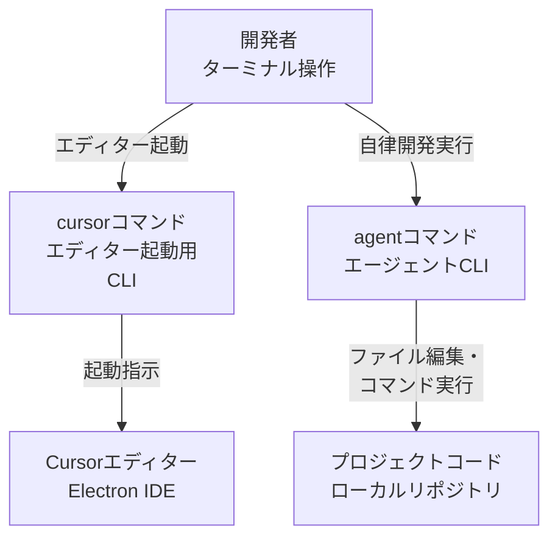
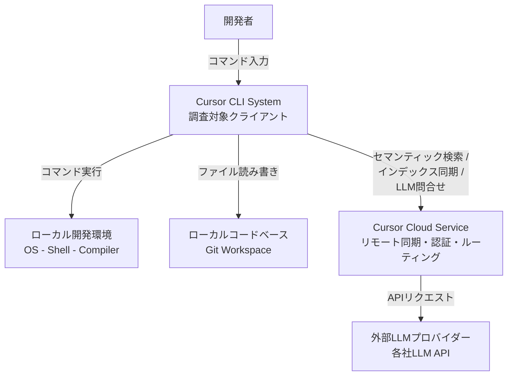
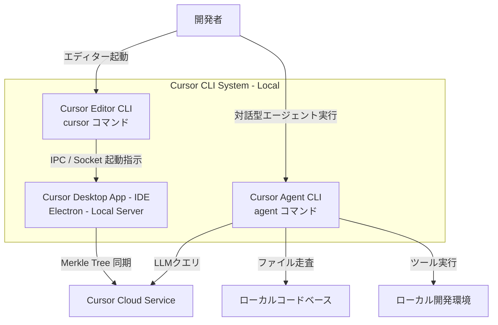
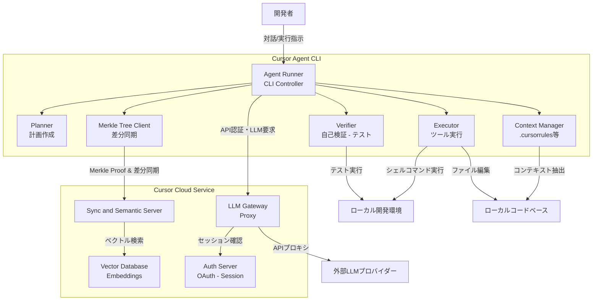
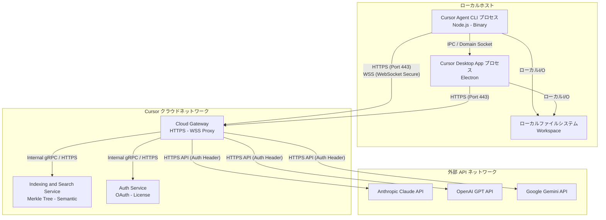
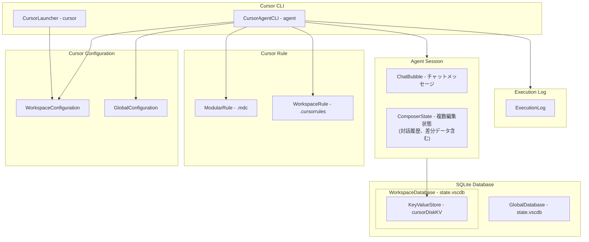
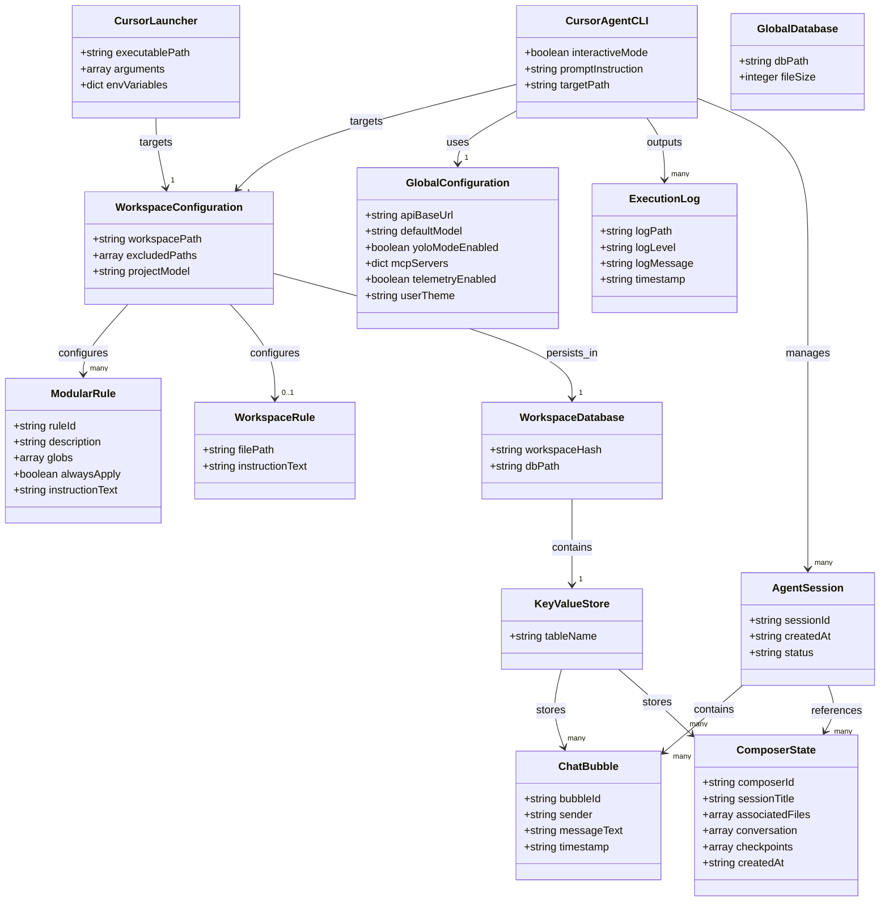

Cursor CLIは、ターミナルからCursorのAI支援機能を利用するためのコマンドラインツール群です。本ツール群は、以下の2つのコマンドで構成されます。

- **`cursor` コマンド**: Cursorエディター本体を起動して、ファイルやディレクトリを開くインターフェース。
- **`agent` コマンド**: 自律的AIエージェントを起動して、コーディングタスクを実行するメインインターフェース（旧称 `cursor-agent`）。

以下の図は、これらのコマンドと開発環境の構成要素との関係を示します。



| 要素名 | 説明 |
|---|---|
| 開発者 | ターミナルから各種コマンドを実行するユーザー。 |
| cursor コマンド | Cursorエディターを起動するコマンド。 |
| agent コマンド | 自律的なAIエージェントを起動するコマンド。 |
| Cursor エディター | GUIを提供する統合開発環境。 |
| プロジェクトコード | ローカル環境のソースコードやディレクトリ。 |

## 特徴

各コマンドが提供する主な機能は以下の通りです。

#### `cursor` コマンドの機能
- ターミナルからCursorエディターを起動し、指定ディレクトリやファイルを即座にオープン。
- ファイルの差分（`--diff`）をエディター上で視覚的に比較。
- 拡張機能のインストールやアンインストールなどの管理をターミナルから実行。

#### `agent` コマンドの機能
- ターミナル上で対話型または非対話型でAIエージェントを実行。
- プロジェクト内のローカルルール（`.cursor/rules/` 内の `.mdc` ファイルや `.cursorrules`）を自動検出して準拠。
- ファイルの追加、編集、削除、ディレクトリ探索、およびコマンド実行を自律的にループ。
- ターミナル内で `@` によるファイル参照や `/` によるスラッシュコマンドを使用。
- TypeScript SDK（`@cursor/sdk`）を介してプログラムからエージェントを制御。
- クラウド上の隔離された環境（Cloud Agent）へ重いタスクをオフロード。

### 類似ツールとの比較

| ツール名 | 実行方式 | リソース消費 | 対応機能 | 起動速度 |
|---|---|---|---|---|
| `cursor` コマンド | ローカルのElectronエディタープロセスの起動・制御 | 高（Electronプロセスのメモリ使用量に依存） | エディターの起動、ファイルオープン、拡張機能管理 | 低（Electronの初期化を伴う） |
| `agent` コマンド | ターミナル上の軽量CLIプロセスによる自律ループ実行 | 中（API通信、ファイルI/O、シェルコマンド実行） | 自律的なファイル編集、計画立案、プロジェクト探索 | 高（UIを持たないため高速に起動） |
| `gh copilot` | CLI拡張による単発の対話型コマンド生成・実行 | 低（単一のAPIリクエストとテキスト出力） | コマンド生成、シェル操作の解説 | 高（即時起動） |
| `aider` | ターミナル上のPython/Git連携型エージェントループ実行 | 中〜高（ローカルAST解析、Git履歴読み込み） | 自律的なファイル編集、Gitコミット自動化、テスト実行 | 中（Python初期化を伴う） |

#### アーキテクチャの違いと技術的根拠
- **`cursor` コマンド**: VS CodeをベースとしたElectronアプリケーションを制御するアーキテクチャを採用しています。UIレンダリングプロセスやNode.js実行環境が起動するため、メモリフットプリントが比較的大きく、起動までに一定の初期化時間を要します。
- **`agent` コマンド**: ターミナル入出力、LLM APIクライアント、およびローカルファイルI/Oに特化したヘッドレスアーキテクチャを採用しています。UIレンダリングプロセスを介さないため、メモリフットプリントが比較的小さく、高速に起動します。
- **`gh copilot`**: 単一のプロンプトとAPIリクエストを送信するだけのシンプルなCLIツールです。自律的な状態管理やファイル編集のループを持たないため、リソース消費が極めて小さくなります。
- **`aider`**: ローカルのPython環境で動作し、GitリポジトリやAST（抽象構文木）を直接解析するアーキテクチャです。Git履歴の走査や差分計算、静的解析を行うため、I/O負荷およびリソース消費が `agent` コマンドより高くなります。

#### ユースケース別の推奨ツール

| ユースケース | 推奨ツール | 選定理由 |
|---|---|---|
| ターミナル開発中に、手軽にエディターでファイルを開いてコードを視覚的に編集したい場合 | `cursor` コマンド | エディター画面を直接起動してUI上で視覚的な作業を開始できるため。 |
| NeovimやJetBrainsなどの別エディター、またはヘッドレス環境（CI/CDなど）から自律的にコードを修正したい場合 | `agent` コマンド | UIを介さずに、ターミナルやスクリプトから直接AIエージェントを起動してタスクを解決できるため。 |
| ターミナル上で実行したい複雑なシェルコマンドが思い出せず、対話的に検索・実行したい場合 | `gh copilot` | コマンドの提案と解説に特化しており、安全にファイル状態を維持しながらコマンドを実行できるため。 |
| Git履歴と密接に連携し、各ステップで自動コミットを作成しながら自律開発を進めたい場合 | `aider` | Git連携とファイルの自動コミット機能が標準で強力に統合されているため。 |

## 構造

### システムコンテキスト図

Cursor CLIシステムが、開発者、ローカルの実行環境、およびCursorのクラウドサービスや外部のLLMプロバイダーとどのように相互作用するかを示します。



| 要素名 | 説明 |
|---|---|
| 開発者 | ターミナルまたはシェル環境からCursor CLIを操作するユーザー。 |
| Cursor CLI System | 調査対象。エディター起動制御を行う `cursor` コマンド、および自律的AIエージェントを動かす `agent` コマンドで構成されるクライアント側システム。 |
| ローカル開発環境 | エージェントが提案した変更の検証（ビルドやテスト実行）を行うローカルのOS、シェル、コンパイラなどの実行環境。 |
| ローカルコードベース | 対象プロジェクトのディレクトリ。Gitで管理されたソースコードや設定ファイル群。 |
| Cursor Cloud Service | クライアントと通信し、インデックス作成の仲介や、各LLMへのAPIリクエストの仲介・プロキシを行うクラウドサービス。 |
| 外部LLMプロバイダー | Cursor Cloud経由でエージェントに言語モデル推論（Claude、GPT、Gemini 等）を提供するサードパーティーAPI群。 |

### コンテナ図

Cursor CLIシステムの内部構造を示します。ローカル環境におけるエディターCLI、エージェントCLI、およびデスクトップアプリ（IDE）の連携は以下の通りです。



| 要素名 | 説明 |
|---|---|
| Cursor Editor CLI | エディター本体を起動したり、ターミナルから指定のファイルやディレクトリを開くための軽量なスクリプト。 |
| Cursor Agent CLI | ターミナルから直接自律的なコーディングエージェントを起動・実行するためのコマンドラインツール。Headless環境やリモート開発環境でも動作可能。 |
| Cursor Desktop App - IDE | Electronベースのデスクトップアプリケーション。内部にローカルサーバーを保持し、エディター機能と連携した静的解析やインデックス制御を実行。 |

### コンポーネント図

`Cursor Agent CLI` の実行プロセスおよび `Cursor Cloud Service` の各内部構成要素を示します。エージェントループ（Planner-Executor-Verifier）とインデックス同期（Merkle Tree）の仕組みは以下の通りです。



| 要素名 | 説明 |
|---|---|
| Agent Runner | CLIのメインスレッド。ユーザーからの入力を受け付け、セッション全体を制御。 |
| Planner | ユーザーの開発要望から、段階的なタスク手順（計画）を策定するコンポーネント。 |
| Executor | Plannerの計画に沿って、ファイル編集やコマンド実行などのツールAPIを実行するコンポーネント。 |
| Verifier | テストやビルドを実行して結果を検証。エラー時は自己修正ループを実行。 |
| Context Manager | コードベース内の `.cursor/rules` やローカルのGitインデックスを取得し、プロンプトに統合。 |
| Merkle Tree Client | ローカルコードベース全体のハッシュ木（Merkle Tree）を計算し、差分情報のみを同期。 |
| Sync and Semantic Server | クラウド側でMerkle Treeを比較し、変更されたファイル差分のみを受信・処理。 |
| Vector Database | 同期されたコードベースのベクトル埋め込み（Embeddings）を保持し、セマンティック検索を高速化。 |
| LLM Gateway | クライアントからの推論リクエストを仲介するゲートウェイ。ライセンス認証、使用量制限、ルーティングを制御。 |
| Auth Server | 開発者アカウントの認証（OAuth連携など）、ライセンス確認、アクセス用トークンの発行を実行。 |

### ネットワーク構成図

ローカルマシンとCursorクラウド、および外部LLMプロバイダー間の物理的・論理的な通信経路を示します。



| 要素名 | 説明 |
|---|---|
| IPC / Domain Socket | `cursor` や `agent` コマンドがローカルのエディタープロセスと通信するためのローカルプロセス間通信。 |
| ローカル I/O | ディスクへの直接書き込み、差分検知、およびシンボルのスキャン動作。 |
| HTTPS (Port 443) / WSS | クライアントからCursorクラウドへの通信チャネル。ストリーミング回答などに使用。 |
| Internal gRPC / HTTPS | クラウドゲートウェイから内部サービスへの高速・低遅延なマイクロサービス間通信。 |
| HTTPS API (Auth Header) | 専用APIキーまたは認証ヘッダーを付与して、外部LLMの公式エンドポイントへ推論をリクエストする通信。 |

## データ

### 概念モデル

Cursor CLIを構成する主要エンティティの包含関係および参照関係を以下に示します。



| 要素名 | 説明 |
|---|---|
| CursorLauncher (cursor) | Cursorエディター本体を起動し、指定されたディレクトリやファイルを開くためのランチャー。 |
| CursorAgentCLI (agent) | ターミナル上で対話型、または非対話型でコード生成や編集タスクを自動実行するAIエージェントの実行環境。 |
| GlobalConfiguration | 全ワークスペース共通のAIモデル設定、API設定、YOLOモードの設定、およびMCPの設定。 |
| WorkspaceConfiguration | 特定プロジェクトに閉じられた設定（除外パスやプロジェクト推奨モデル等）。 |
| WorkspaceRule | ワークスペース全体に適用される共通のプロンプト指示（`.cursorrules`）。 |
| ModularRule | 特定のファイルパターンに適用される個別適用ルールファイル（`.mdc`）。 |
| GlobalDatabase | エディター全体やグローバルでのAI対話・Composer履歴などを管理するデータベースファイル（`globalStorage/state.vscdb`）。 |
| WorkspaceDatabase | ワークスペースの履歴・セッション情報を個別に管理するデータベースファイル（`workspaceStorage/<hash>/state.vscdb`）。※環境により `globalStorage/state.vscdb` に集約される場合あり。 |
| KeyValueStore | データベース内の主要テーブル。キーバリュー構造でAI履歴データを永続化。 |
| ChatBubble | チャットメッセージの単位。 |
| ComposerState | 複数ファイルをまたぐコード編集をサポートする「Composer」機能のコンテキスト・編集履歴。 |
| AgentTranscript | エージェントの実行履歴。呼び出されたツールやその実行結果を記録。 |
| StateCheckpoint | エージェント実行中に生成された編集パッチやファイル状態の世代管理用チェックポイント。 |
| ExecutionLog | デバッグ情報や動作トレース。 |

### 情報モデル

概念モデルに対応する各エンティティの具体的な属性を示します。



#### エンティティ・プロパティ詳細

##### 1. CLI / 実行プラットフォーム
- **CursorLauncher (cursor コマンド)**
  - `executablePath`: エディター起動用バイナリの物理パス。
  - `arguments`: `--folder-uri`, `--file-uri` などの引数。
  - `envVariables`: プロセス起動時に引き継ぐ環境変数。
- **CursorAgentCLI (agent コマンド)**
  - `interactiveMode`: 対話シェルモードか非対話モードかの識別フラグ。
  - `promptInstruction`: 非対話時の指示テキスト。
  - `targetPath`: エージェントが操作対象とするプロジェクトのルートパス。

##### 2. Configuration (設定データ)
- **GlobalConfiguration**
  - `apiBaseUrl`: バックエンドのエンドポイント。
  - `defaultModel`: 優先適用するLLM。
  - `yoloModeEnabled`: YOLOモード設定。
  - `mcpServers`: MCPサーバー設定。
- **WorkspaceConfiguration**
  - `workspacePath`: 対象ワークスペースのパス。
  - `excludedPaths`: 除外するディレクトリ・ファイルの配列。
  - `projectModel`: プロジェクト推奨LLMモデル。

##### 3. Rule (AIガイドライン)
- **WorkspaceRule (`.cursorrules`)**
  - `filePath`: `.cursorrules` の物理パス。
  - `instructionText`: 共通プロンプト指示。
- **ModularRule (`.cursor/rules/*.mdc`)**
  - `ruleId`: ルールの識別子。
  - `description`: ルールの用途と適用契機。
  - `globs`: 適用対象となるファイルパスパターンの配列。
  - `alwaysApply`: 常に適用するかのフラグ。
  - `instructionText`: 指示テキスト。

##### 4. SQLite Database (データ永続化)
- **GlobalDatabase (`state.vscdb`)**
  - `dbPath`: グローバル領域のパス（例: `~/Library/Application Support/Cursor/User/globalStorage/state.vscdb`）。
  - `fileSize`: ファイルサイズ。
- **WorkspaceDatabase (`state.vscdb`)**
  - `workspaceHash`: ワークスペースハッシュ文字列。
  - `dbPath`: `workspaceStorage/<hash>/state.vscdb` パス（※環境により空ファイルであるか、使用されない場合あり）。
- **KeyValueStore (`cursorDiskKV`)**
  - `tableName`: テーブル名 `cursorDiskKV`。対話・エージェント状態を永続化（globalStorage または workspaceStorage のいずれか、もしくは両方に格納）。

##### 5. Session / Context (セッションと履歴)
- **AgentSession**
  - `sessionId`: セッションの識別子。
  - `createdAt`: セッションの開始タイムスタンプ。
  - `status`: セッションの進捗状態（`active`, `completed`, `failed` など）。
- **ChatBubble**
  - `bubbleId`: チャットメッセージのID。
  - `sender`: 発言者。`user` (開発者) または `assistant` (AIエージェント)。
  - `messageText`: テキストコンテンツ。
  - `timestamp`: メッセージ発生日時。
- **ComposerState**
  - `composerId`: Composer セッションのID（`composerData:*` キー）。
  - `sessionTitle`: セッションタイトル。
  - `associatedFiles`: 編集・参照対象のファイルパス一覧。
  - `conversation`: 単一の Composer JSON 内にネストされる会話履歴やエージェントツール実行履歴。
  - `checkpoints`: JSON 内に保持される変更チェックポイント（インライン差分データなど）。
  - `createdAt`: セッションの作成日時。

##### 6. Diagnostics (デバッグ)
- **ExecutionLog**
  - `logPath`: ログファイル出力先パス。
  - `logLevel`: `DEBUG`, `INFO` 等の深刻度。
  - `logMessage`: ログ本文。
  - `timestamp`: タイムスタンプ。

## 構築方法

### 前提条件
- **対応OS**: macOS、Linux、WSL（Windows Subsystem for Linux）、Windows。
- **必要なシステム環境**:
  - `cursor` コマンドを使用する場合、Cursorエディター本体のインストールが必要。
  - `agent` コマンドを使用する場合、`curl` および `bash` が必要（※Node.js 要件はインストーラーの配布バージョンに依存）。
- **アカウント**: Cursorアカウント（サインイン・認証に必要）。

### エディター起動用 CLI（cursor コマンド）のインストール方法
- **GUI からのインストール手順**:
  - macOS または Linux 環境において、Cursorエディターのコマンドパレットを利用してインストール。
  1. Cursorエディターを起動。
  2. コマンドパレット（Mac: `Cmd+Shift+P`、Windows/Linux: `Ctrl+Shift+P`）を起動。
  3. `Shell Command: Install 'cursor' command in PATH` を検索して実行。
  4. ターミナルを再起動するか、設定ファイルを再読み込み。
- **自動追加（Windows の場合）**:
  - Windows環境では、インストール時に自動でシステム環境変数 `PATH` にコマンドを登録。

### エージェント用 CLI（agent コマンド）のインストール方法
- **シェルスクリプトを使用したインストール方法（推奨）**:
  - macOS、Linux、WSL環境において、以下のワンライナーを実行してインストール。
    ```bash
    curl https://cursor.com/install -fsS | bash
    ```
  - インストール完了後、バイナリは通常 `~/.local/bin` 配下に配置され、同時にレガシーなエイリアスとして `cursor-agent` のシンボリックリンクも作成。利用には `~/.local/bin` を `PATH` に追加する。

> [!NOTE]
> **公式インストール経路について**
> 公式の `agent` コマンド（および旧名 `cursor-agent`）は、シェルスクリプト経由でのみ提供されています。npmパッケージ（`@cursor/cli`）などは公式に存在しないため、公式インストーラーを必ず使用してください。

### バージョン確認
インストール完了の確認のため、バージョン表示コマンドを実行。
- **エディター起動用 CLI の確認**:
  ```bash
  cursor --version
  ```
- **エージェント用 CLI の確認**:
  ```bash
  agent --version
  ```

## 利用方法

### 必須パラメーターおよび重要オプション一覧

指定が必要なパラメーターや主要オプションは以下の通りです。

| 対象コマンド | パラメーター/フラグ | 指定の必須性 | 設定例 | 説明 |
|---|---|---|---|---|
| `agent` | `-p`, `--prompt "<テキスト>"` | 非対話実行時に**必須** | `-p "Refactor main.ts"` | エージェントに実行させる具体的なプロンプトや命令文を指定。非対話型で動作。 |
| `agent` | `CURSOR_API_KEY` (環境変数) | CI/CD等での非対話認証時に**必須** | `export CURSOR_API_KEY="..."` | ヘッドレス環境などで認証を行うためのAPIキー（※CLI引数によるキー指定は非サポート）。 |
| `cursor` | `<path>` (引数) | 任意 (未指定時はカレント) | `cursor src/` | 開く対象となるファイルやディレクトリのパスを指定。 |
| `agent` | `--mode <ask \| plan \| agent>` | 任意 (デフォルトは `agent`) | `--mode plan` | エージェントの動作権限を切り替え。 |
| `agent` | `--model <モデル名>` | 任意 (デフォルトは設定モデル) | `--model claude-3.5-sonnet` | 使用するAIモデルを指定。 |

#### AI動作モードの詳細と実行例
`--mode` オプションに指定可能な 3 つのモードは、エージェントの行動許容範囲（権限）を決定します。

- **`agent` モード (デフォルト)**:
  - **挙動**: 計画立案、ファイルの読み書き、シェルコマンド実行を自律的に繰り返すフル権限モード。
  - **用途**: バグ修正や新機能追加など、自律的なコーディングを依頼する場合に使用。
- **`plan` モード**:
  - **挙動**: 実行計画（Plan）を策定して提示するのみ。ファイルの書き換えやコマンド実行は非実行。
  - **用途**: AIがどのような計画を立てるか事前に確認・修正したい場合に使用。
- **`ask` モード**:
  - **挙動**: プロジェクトのファイルを読み取り、質問に対して回答を返却する読み取り専用モード。
  - **用途**: コードベースの調査やコードの動作に関する質問を行う場合に使用。

### 認証と初期設定
- **対話型ログイン**:
  - エージェントを使用する前に、以下のコマンドを実行してCursorアカウントに認証。
    ```bash
    agent login
    ```
  - 実行後ブラウザが開くため、サインインを実行。完了後、認証情報がローカルに保存。
- **認証ステータスの確認**:
  - 現在のログイン状態や接続設定を確認。
    ```bash
    agent status
    ```
- **ログアウト**:
  - ローカルに保存された認証情報を削除し、セッションを破棄。
    ```bash
    agent logout
    ```

### エディター起動用 CLI（cursor コマンド）の利用方法
- **ファイルやディレクトリのオープン**:
  ```bash
  cursor .
  cursor path/to/project
  cursor path/to/file.txt
  ```
- **行・列を指定したファイルオープン**:
  ```bash
  cursor -g path/to/file.ts:120:5
  ```
- **新しいウィンドウの起動**:
  ```bash
  cursor -n
  ```
- **差分比較 (Diff) 表示**:
  ```bash
  cursor --diff fileA.ts fileB.ts
  ```
- **ファイルクローズの待機**:
  ```bash
  cursor --wait commit_message.txt
  ```

### エージェント用 CLI（agent コマンド）の利用方法
- **対話型セッションの開始**:
  ```bash
  agent
  ```
- **非対話型でのプロンプト実行（一括タスク処理）**:
  ```bash
  agent -p "Read src/index.ts and write tests using Vitest."
  ```
- **実行モデルの明示的指定**:
  ```bash
  agent -p "Refactor database query" --model claude-3.5-sonnet
  ```
- **前回の会話セッションの継続**:
  ```bash
  agent --continue
  ```
- **セッション内での特殊操作**:
  - `@<ファイルパス>`: 特定ファイルをコンテキストとして読込。
  - `/model`: 使用するモデルを変更。
  - `! <シェルコマンド>`: ローカルコマンドを実行。

### インテグレーション時の注意点

#### コマンド終了コード (Exit Codes)
- 通常の UNIX コマンドに準拠し、タスクの正常完了時やエージェントループの正常終了時には `0`、何らかのエラー（認証エラーや無効な引数など）が発生した場合は非ゼロ（`1` など）が返却されます。

### 設定ファイルの記述方法
- **プロジェクトルールの設定 (`.cursor/rules/`)**:
  - プロジェクトルートの `.cursor/rules/` 内に配置した `.mdc` ファイルを介してエージェントの行動を制御。
  - **設定例 (`.cursor/rules/api-standard.mdc`)**:
    ```markdown
    ---
    description: Apply to backend API code
    globs: "src/api/**/*.ts"
    ---
    - APIエンドポイントのレスポンスは常にJSON形式で統一。
    - 非同期処理には async/await を使用し、try-catch ブロックで例外を捕捉。
    ```
- **MCP サーバーの設定 (`.cursor/mcp.json`)**:
  - MCPを使用してエージェントがアクセス可能なリソースを拡張。プロジェクト固有の `.cursor/mcp.json` に加え、グローバル設定画面から構成するサーバーも利用可能。
  - **設定例 (`.cursor/mcp.json`)**:
    ```json
    {
      "mcpServers": {
        "sqlite": {
          "command": "npx",
          "args": ["-y", "@modelcontextprotocol/server-sqlite", "--db", "path/to/development.db"]
        }
      }
    }
    ```
- **Cloud Agent 開発環境の設定 (`.cursor/environment.json`)**:
  - クラウド上で動作するエージェント（Cloud Agent）のビルド・実行環境を設定。環境の特定に必要な識別子（snapshot ID 等）などを記述（※スキーマの詳細は公式ドキュメントを参照）。

## 運用

### 起動・停止・セッション再開
*   **起動コマンド:**
    *   **インタラクティブモード:** ターミナルで `agent` を実行すると、対話型セッションが開始。
    *   **非インタラクティブモード:** `-p` または `--prompt` フラグを使用し、1回のプロンプト実行で結果を出力して終了。
        ```bash
        agent -p "src/index.ts の型エラーを修正してください"
        ```
    *   **実行モードの限定:** `--mode plan`（計画のみ）や `--mode ask`（質問のみ・読み取り専用）を指定。
    *   **クラウド実行モード**: `-c` または `--cloud` フラグを指定し、クラウド上の隔離された環境（Cloud Agent）で実行。
*   **停止（強制終了）:**
    *   実行中のエージェントセッションを停止するには、ターミナルで `Ctrl + C` を入力。
*   **セッション再開:**
    *   直前のチャットセッションを再開するには、`--continue` フラグを付与（※ `-c` は `--cloud` 用であるため、混同に注意）。
    *   特定の過去セッションを指定して再開する場合は、`--resume [chatId]` を使用。

        > [!TIP]
        > **`chatId` の特定方法**
        > 再開に必要な `chatId` は、以下の方法で特定できます。
        > 1. **ローカルデータベースから特定**: SQLite ツールで `state.vscdb` を開き、`cursorDiskKV` テーブルからキー（`composerData:*`）をクエリして特定します。

### 状態確認・ログと履歴の確認
*   **ステータス確認:**
    *   `agent status` コマンドを実行し、現在のログイン状態やバックエンドとの接続状況を確認。
*   **セッション履歴の保存場所:**
    *   エージェントの会話履歴や状態は、ローカルマシンの SQLite データベース（`state.vscdb`）に保存。
        - **macOS (実機検証済み)**:
          - `~/Library/Application Support/Cursor/User/globalStorage/state.vscdb`
          - または `~/Library/Application Support/Cursor/User/workspaceStorage/{workspace_hash}/state.vscdb`
        - **Windows (VS Codeの標準配置に基づく推定パス)**:
          - `%APPDATA%\Cursor\User\globalStorage\state.vscdb`
          - または `%APPDATA%\Cursor\User\workspaceStorage\{workspace_hash}\state.vscdb`
        - **Linux (VS Codeの標準配置に基づく推定パス)**:
          - `~/.config/Cursor/User/globalStorage/state.vscdb`
          - または `~/.config/Cursor/User/workspaceStorage/{workspace_hash}/state.vscdb`
        - ※ 実機や環境によっては `workspaceStorage` 配下は空であり、すべての履歴データ（特に `composerData:*` キー）が `globalStorage/state.vscdb` 側に一括保存される傾向があります。
*   **デバッグとログ抽出:**
    *   会話履歴が消失したように見える場合は、プロジェクトフォルダーの移動やリネームにより SQLite DB とのパス情報マッピングが切れた可能性があります。フォルダー名を戻すか、再度エディターで開き直してください。
    *   直前のチャットセッションの再開には `agent --continue`、特定の過去セッションを再開するには `agent --resume [chatId]` を使用します。この `chatId` も SQLite 内から特定可能です。
    *   履歴データを直接抽出したい場合は、SQLite ツールで `state.vscdb` を開き、`cursorDiskKV` テーブルを読み込みます。

### 更新とバージョン管理
*   **バージョン確認:**
    *   `agent --version` を実行し、現在インストールされている CLI のバージョンを確認。
*   **更新手順:**
    *   Cursor CLI には自動アップデート機能がないため、最新のインストールスクリプトを再度実行してバイナリを上書き更新。
        ```bash
        curl https://cursor.com/install -fsS | bash
        ```

## ベストプラクティス

### CI/CD 連携（GitHub Actions）
*   **非インタラクティブ実行の設定:**
    *   CI/CD環境などのヘッドレス環境では、必ず `-p`（Print Mode）を使用し、対話プロンプトによるパイプラインの停止を回避。
*   **認証トークンの管理:**
    *   認証用のAPIキー（`CURSOR_API_KEY`）は、GitHubのリポジトリ設定から **GitHub Secrets** として安全に保管し、環境変数経由で引き渡し。
    *   APIキーの漏洩を防ぐため、ログ出力の設定時などに対象の環境変数がマスクされていることを必ず確認。
*   **GitHub Actions ワークフロー例:**
    ```yaml
    name: Cursor Agent Code Review
    on:
      pull_request:
        types: [opened, synchronize]
    jobs:
      review:
        runs-on: ubuntu-latest
        steps:
          - name: Checkout code
            uses: actions/checkout@v6
          - name: Run Cursor Agent Review (コミュニティによるサードパーティ実装例)
            uses: PunGrumpy/cursor-action@main
            with:
              api-key: ${{ secrets.CURSOR_API_KEY }}
              prompt: "PRで変更されたコードに対して、セキュリティとパフォーマンスの観点からコードレビューを行い、簡潔に要約してください。"
    ```

### ●Git プリコミットフック (pre-commit) 連携
ローカルのコミット前に、ステージングされたファイルに対して Cursor Agent による自動レビューや静的解析を実行可能。

**設定例 (`.git/hooks/pre-commit`):**
```bash
#!/bin/sh
# 変更されたファイルの一覧を取得
STAGED_FILES=$(git diff --cached --name-only --diff-filter=ACM)

if [ -z "$STAGED_FILES" ]; then
    exit 0
fi

echo "Cursor Agent に変更コードの自動検証を依頼しています..."
# ステージングされたファイルを対象に、読み取り専用 (askモード) で検証を実行
agent -p "以下のステージングされたファイルにシンタックスエラーや論理バグがないか確認してください: $STAGED_FILES" --mode ask --trust

# エージェントがエラー (終了コード 1 以上) を検出した場合にコミットをブロック
if [ $? -ne 0 ]; then
    echo "❌ Cursor Agent による検証が失敗したか、エラーが検出されました。コミットを中止します。"
    exit 1
fi

echo "✅ 変更コードの検証に成功しました。"
exit 0
```

### 設定・ルール管理（Modern MDC 構成）
*   **レガシーファイルからの移行:**
    *   旧来の単一ルールファイル形式である `.cursorrules` から、より細かいルール管理ができる `.cursor/rules/` ディレクトリ（MDC構成）への移行が推奨されています。
*   **YAML Frontmatter を用いたスコープ制限:**
    *   各ルールファイル（`.mdc`）の冒頭に YAML Frontmatter を定義し、適用するファイルパターン（`globs`）や自動適用の有無（`alwaysApply`）を制御。不要なコンテキスト読み込みを防ぎ、トークン消費を最小化。
    *   **設定例 (`typescript.mdc`):**
        ```yaml
        ---
        description: TypeScript のコーディング標準ルール
        globs: "src/**/*.ts"
        alwaysApply: false
        ---
        # TypeScript Rules
        - 常に厳格な型定義（strict: true）を維持してください。
        - any 型の使用を禁止し、可能な限り unknown または具体的なインターフェースを定義してください。
        ```
*   **階層型ルール管理戦略（Tiered Strategy）:**
    *   **Tier 1（常時適用ルール）:** アーキテクチャ構成や主要技術スタックなど、プロジェクト全体で順守すべきコア標準（200行以下）。
    *   **Tier 2（ディレクトリ/言語別ルール）:** `src/components/**` など、特定の場所でのみ必要となる特化型ルール。

### リソース制限とインデックス除外
*   **コンテキストサイズの節約:**
    *   エージェントが肥大化したファイル（コンパイル後の成果物や依存パッケージなど）を読み込まないよう、`.cursorignore` や `.cursorindexingignore` を適切に記述し、インデックス対象から除外。

### セキュリティと権限管理
*   **YOLO Mode（Auto-Run）のリスク:**
    *   `--yolo` または `--force` フラグを使用すると、エージェントがユーザーの承認なしに任意のコマンドを実行。シェルコマンドの実行、ファイルの削除、外部へのデータ送信などを勝手に行う可能性があるため、本番環境や機密データが存在する環境では絶対に使用不可。
*   **安全な代替手段（Auto-Review モード）:**
    *   「Auto-Review モード」を併用。ホワイトリストに登録された安全なコマンドのみを自動実行し、リスクのある操作はサブエージェントが判定して承認を要求。
    *   **Auto-Review モードの設定仕様 (`.cursor/permissions.json`)**:
        - ※本仕様は公式ドキュメントで提示されている設定例です。環境やバージョンによるローカルバイナリへの同梱状況は異なる場合があります。
        - プロジェクト配下の `.cursor/permissions.json` （およびグローバル共通設定用の `~/.cursor/permissions.json`）ファイルを作成し、自動実行を許可するコマンド（`allow_instructions`）とブロックするコマンド（`block_instructions`）を、`"autoRun"` キーの配下にネストして記述して挙動を制御します。両方のファイルが存在する場合は、設定内容が結合されます。
        - **記述例**:
          ```json
          {
            "autoRun": {
              "allow_instructions": [
                "git diff",
                "npm test",
                "vitest run"
              ],
              "block_instructions": [
                "rm -rf",
                "curl -X POST",
                "wget"
              ]
            }
          }
          ```
*   **ホスト環境の保護:**
    *   CI/CDパイプラインや高リスクな自動化タスクでエージェントを動かす場合は、ホストマシンのファイルシステムから隔離された Docker コンテナまたは VM（仮想マシン）環境で CLI を実行。
*   **ドットファイルの保護:**
    *   `.env` や `~/.ssh/config`、`~/.aws/credentials` などの秘匿情報を含むファイルは、`.cursorignore` に追加してエージェントからのアクセスを遮断。また、エディター設定で MCP ツールの実行時に都度確認を要求するオプションを有効化。

## トラブルシューティング

| 症状 | 主な原因 | 対処方法 |
| :--- | :--- | :--- |
| **ログインエラー / 認証失敗**<br>`Unauthorized` や `agent login` が失敗する | <ul><li>認証トークン・APIキーの期限切れ</li><li>環境変数（`CURSOR_API_KEY`）の設定ミス</li><li>プロキシやファイアウォールによる通信ブロック</li></ul> | <ul><li>ローカル環境では再度 `agent login` を実行してブラウザ認証を完了させます。</li><li>CI/CD 環境では GitHub Secrets の値が正しく設定されているか確認し、APIキーを再生成します。</li></ul> |
| **ワークスペース信頼エラー**<br>`This workspace is not trusted` と表示され停止する | <ul><li>実行対象のディレクトリがエディター側で信頼（Trust）されていない</li><li>非インタラクティブ実行時に確認プロンプトで停止している</li></ul> | <ul><li>起動コマンドに `--trust` フラグを付与して強制的に信頼状態にします。</li><li>ローカル環境では Cursor エディターの「Workspace Trust」設定で親フォルダーを信頼リストに追加します。</li></ul> |
| **自動実行の停止**<br>処理の途中で確認プロンプトが表示され、自動実行が一時停止する | <ul><li>`--yolo` または `--force` フラグが指定されていない</li><li>バージョン変更により `--yolo` フラグが非推奨化された</li></ul> | <ul><li>非インタラクティブ実行時に自動化を継続させる場合、`--yolo` もしくは `--force` フラグを指定します。</li><li>`--yolo` でエラーが出る場合は `--force` に置き換えて実行してください。</li></ul> |
| **セッション履歴が見つからない / 消失した**<br>`--continue` で前回のチャットが再開できない | <ul><li>プロジェクトディレクトリのパス（名前や配置場所）が変更されたため、ローカル DB とのマッピングが切れた</li></ul> | <ul><li>プロジェクトフォルダーの名前やパスを元の状態に戻します。</li><li>または、一度プロジェクトを開き直して新しいセッション識別子（ID）を割り当てます。</li></ul> |

## まとめ

本記事では、Cursor CLI（`cursor` コマンドおよび `agent` コマンド）の機能、内部構造、永続データ形式、利用・運用方法、およびベストプラクティスを包括的に調査して整理しました。ターミナル起動制御と自律型AIエージェント実行環境である各コマンドの特性を理解することで、より高度な開発自動化と安全な実行制御が可能となります。

この記事が少しでも参考になった、あるいは改善点などがあれば、ぜひリアクションやコメント、SNSでのシェアをいただけると励みになります！

## 参考リンク

- 公式ドキュメント
  - [Cursor Documentation](https://docs.cursor.com)
  - [Cursor CLI Introduction](https://cursor.com/cli)
  - [Cursor Features](https://cursor.com/features)
  - [Cursor Rules for AI Documentation](https://docs.cursor.com/context/rules-for-ai)
  - [Cursor Ignore Files Documentation](https://docs.cursor.com/context/ignore-files)
  - [Cursor Model Context Protocol (MCP)](https://docs.cursor.com/advanced/model-context-protocol)
- GitHub / 外部パッケージ
  - [GitHub - getcursor/cursor](https://github.com/getcursor/cursor)
  - [npm - @cursor/sdk Package](https://www.npmjs.com/package/@cursor/sdk)
- 技術解説記事
  - [How Cursor Editor Indexes Codebases](https://towardsdatascience.com/how-cursor-editor-indexes-codebases)
