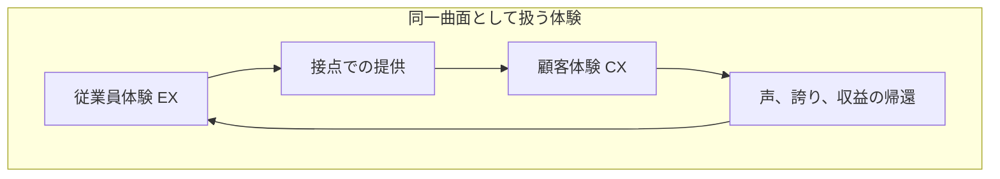
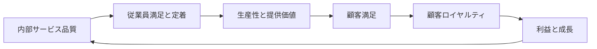

顧客体験（CX）と従業員体験（EX）を「表裏一体で循環するもの」として語るとき、メビウスの帯の比喩が使われることがあります。この記事では、その比喩がどこから来て何を指しているのか、隣接する枠組みと何が違うのか、そして数値の根拠をどこまで信じてよいのかを整理します。

対象読者は、組織開発と CX/EX の実務者、およびこの比喩を記事や助言で正確に使いたい人です。読み終えると、「メビウスサイクル」という言葉を自分の現場でどう扱うか判断できるようになります。数値の多くは企業の自己申告調査や事業単位のメタ分析に基づくため、定義と分母を添えて読みます。

*この記事の全体像。以下、順に解説します。*

## メビウスサイクルとは

メビウスサイクルは、CX と EX がメビウスの帯のように同一の面上で途切れなく循環する、という見方です。

英語圏での出自は 2021 年です。ServiceNow の Dean Robison が Workflow Q&A（2021-07-15）でカスタマーサポート組織を「片面かつ一辺の無限ループ」に喩え、Forbes BrandVoice（有料プログラム）が 2021-08-12 に *The Möbius Strip Of CX And EX* として広めました。

日本語の CX-EX 文献では、同じ相互循環を「ぐるぐる回す」「好循環」「CV サークル」と呼ぶことが多く、固有名詞としての「メビウスサイクル」は 2026-09-16 時点で確認できませんでした。

### 何を主張しているか

比喩が指している中身は次の 4 点です。

- **片面性**: CX 部門と EX 部門を別世界として切らず、接点では同じ体験面に乗る。
- **一辺のループ**: 従業員の提供、顧客の知覚、声・誇り・収益の帰還、再び提供、という連続。
- **正負の両回転**: 好循環（誇りと品質の増幅）と悪循環（不満と品質低下の増幅）を同じ図で扱う。
- **交差点の設計**: 顧客ジャーニーと従業員ジャーニーが重なる瞬間（接客、サポート、現場改善）を設計単位にする。

計測の単位は個人ではなく、店舗、チーム、コンタクトセンターなどの事業単位です。事業単位ごとに EX 指標と CX 指標を突合します。

### 構造

メビウスの帯が CX-EX に写しているのは、位相幾何の全性質ではありません。使われているのは「区別できない一体」と「途切れない帰還」の 2 点です。

帯の性質と実務の対応は次のとおりです。

| 帯の性質 | CX-EX への写像 | 実務での中身 |
|---|---|---|
| 片面 | 顧客側と従業員側を別部門の別問題にしない | 同じ接点を CX チームと HR が共有する |
| 一辺 | 提供と帰還が途切れない | VOC（顧客の声）を現場に戻し、改善を顧客に返す |
| 無限ループ | 好循環と悪循環 | 誇り、品質、感謝、誇り、またはその逆 |
| 半捻り、非向き付け | 英語一次資料ではほぼ使われない | 一周すると符号が反転し得る、という読みは注意点で扱う |

### 古典との関係

同じ循環を因果の鎖として書くと、Heskett らのサービスプロフィットチェーン（1994）になります。

Heskett らはリンクを「propositions（命題）」と呼びます。Gartner のトータルエクスペリエンス（TX）は鎖ではなく、CX、EX、UX、MX の 4 分野を交差点で織る戦略ラベルです。Gartner TX や Qualtrics XM の本文は Möbius という語を使いません。

### 同名の別物

「メビウス」を冠する枠組みは他にもあり、CX-EX のメビウス比喩とは別物です。

| 名称 | 内容 | CX-EX との関係 |
|---|---|---|
| 名和高司のメビウスモデル | 顧客現場と組織 DNA の学習循環（『学習優位の経営』2010） | 顧客と組織。EX ではない |
| Mobius Outcome Delivery | Discover / Decide / Deliver のプロダクト開発ループ | プロダクト開発。CX-EX ではない |
| Williams and Helde の Mobius Cycle | 購買ジャーニー（2013） | 顧客側のみ |
| 社名 Möbius のコンサル | 企業名 | 枠組みではない |

## 注意点

出典の到達宣言と数値は、定義と分母を落とすと過大になります。読者がどこまで信じてよいかを項目ごとに示します。

### 比喩は方法論ではない

「メビウスサイクル」という手順書、監査項目、KPI セットの一次定義は、日英とも確認できませんでした。英語の中核は ServiceNow の Forbes BrandVoice 1 本と、その 4 週間前の Workflow Q&A です。ESI ThoughtLab の Workflow Quarterly Summer 2021 PDF 本文に "Möbius" は出てきません。

### Forbes の 41% と 34% は一次チャートと一致しない

ESI ThoughtLab と ServiceNow による TX 合算便益（幹部 900 人の自己申告）は、売上増 45%、市場シェア拡大 33%、資本コスト低下 28% です。Forbes 記事の「leading 企業の 41% が市場シェア、34% が資本コスト減」は、leaders 個別チャートの別項目（EX leaders の new business models 41%、CX leaders の shareholder value 34%）との取り違えが疑われます。

いずれにせよ、この数値は「何% の幹部がその便益を挙げたか」であり、市場シェアが 41% 伸びた実験結果ではありません。

### Gallup の 10% と 18% は介入効果ではない

Gallup Q12 メタ分析 第 11 版（2024）は、736 研究、347 組織、183,806 事業単位、3,354,784 人を対象とします。エンゲージメント上位四分位と下位四分位の中央値差は、顧客ロイヤルティ/エンゲージメント 10%（顧客指標は 110 組織）、売上生産性 18%（170 組織）、利益 23%（94 組織）です。

読むときの前提は 3 つです。

- 測定は EX 全体ではなく、Q12 の 12 条件です。
- 本文は「This paper does not directly address issues of causality」と明記しています。
- 2002 年の査読論文（Harter, Schmidt, Hayes）では、顧客満足・ロイヤルティとの真値相関は 0.33（観測 r = 0.16、3,199 単位、20 研究）です。

### Gartner の「満足度で 25% 上回る」は予測

確認できた一次資料は次のとおりです。

| 出典 | 内容 |
|---|---|
| Gartner プレスリリース（2020-10-19、日本語 2020-11-12） | 今後 3 年で主要満足度指標で競合を上回る、という数値なしの予測 |
| G00755679（2021-10-18） | 2026 年までに大企業の 60% が TX でビジネスモデルを変える、という Strategic Planning Assumption |
| ガートナージャパン「2021 年の製造業におけるビジネス・トレンドのトップ 5」（2021-07-29） | 2024 年までに TX 提供企業が CX と EX の満足度指標で競合を 25% 上回る、という予測文 |

25% は予測であり、期限到来後の達成検証は 2026-09-16 時点で公式の振り返りを確認できませんでした。一方、デジタル施策の理由として CX 58%、従業員生産性 57%（2021 Digital Business Acceleration Survey、n=615）は回答者の自己申告としての一次数値です。

### サービスプロフィットチェーンの包括メタ分析は「常に最大化せよ」を否定する

Hogreve, Iseke, Derfuss, Eller（*Journal of Marketing* 81(3), 2017）は 518 研究、576 データセット、1,591 相関を統合しました。提案リンクは有意ですが、効果量はサービス種でばらつきます。著者らは「従業員満足と外部サービス品質を常に最大化すべき」という暗黙前提に異議を唱えています。

同一メタ分析の著者によるドイツ語要約（PERSONALquarterly 2019）では、従業員満足から顧客ロイヤルティへの直接パス β = −.12、サービス品質から利益への直接パス β = −.19 です。総合効果は間接の正と相殺され得ますが、単調な無限増幅ではありません。

### 満足ミラーは小売で逆転し得る

Silvestro and Cross（2000）は英大手食料品チェーンで、従業員満足が利益を駆動するという主張を支持せず、従業員の不満足と店舗利益に強い相関を報告しました。Pritchard and Silvestro（2005）はホームセンター 75 店で、satisfaction mirror とロイヤルティから財務へのリンクが弱いとしました。

いずれも単一企業の横断研究であり普遍的な反証ではありませんが、「EX を上げれば業績が上がる」という一般解にはなりません。

### 高 CX と低 EX は両立し得る

ACSI（米国顧客満足度指数）の Amazon.com は、スコア年 2025 が 83、スコア年 2026 が 82 です。一方、Strategic Organizing Center の OSHA データ分析（2025）では、Amazon 倉庫の重傷率は非 Amazon 倉庫の約 2 倍です。上院 HELP 委員会（2024）は、安全部門のクォータ緩和案を上級役員が顧客体験への影響を懸念して却下した、と書いています。

Glassdoor と ACSI の突合では、高接触業では星 1 つあたり ACSI +3.2 ですが、製造や IT、倉庫では関連が弱いかほぼありません。

### トポロジーの通俗化

メビウスの帯は表裏の区別が大域的に定義できない曲面であり、「flip side（裏側）」という通常の裏表比喩と緊張します。無限ループはねじりのない円筒でも成立します。帯に固有な非向き付け可能性は、Forbes 記事では CX-EX に写されていません。

## 隣接モデルとどう違うのか

CX と EX をつなぐ枠組みは複数あります。メビウス比喩との差を一覧にします。

| 枠組み | 出自 | CX と EX のつなぎ方 | メビウス比喩との差 |
|---|---|---|---|
| サービスプロフィットチェーン | Heskett ら、HBR 1994 | 内部品質、従業員、提供価値、顧客、利益、という命題の鎖 | 線形の段階。同一曲面ではない |
| Service climate | Schneider ら、1998 | サービス重視の集合知覚が顧客品質知覚と往復する | 媒介変数は気候。帯ではない |
| Human Sigma | Fleming, Coffman, Harter、HBR 2005 | 従業員エンゲージメントと顧客エンゲージメントの積 | エンカウンタの乗法。位相ではない |
| トータルエクスペリエンス TX | Gartner、2020–2021 | CX、EX、UX、MX を交差点で織る IT/体験戦略 | 4 分野のベン図。Möbius という言葉なし |
| XM / virtuous cycle | Qualtrics XM Institute | X-data と O-data で 4 体験を測り、投資、EX、CX、財務、再投資 | データ結合の運用。帯ではない |
| Forrester Total Experience Score | 2025–2026 | BX + CX がスコア。EX は impact として並置 | Gartner TX とは定義が違う |
| ぐるぐる / 好循環 | コミューンほか、日本語実務 | 顧客の本音と従業員の顧客志向を同じ場で回す | 二つの円またはスパイラル。メビウスではない |
| CV サークル | 大広とトータル・エンゲージメント・グループ | 左 CX、右 EX の現場改善サークル | QC サークルのサービス版 |

実務の設計単位を選ぶときの対応は次のとおりです。

- 鎖の監査と内部品質の改善: サービスプロフィットチェーン。
- デジタル接点と UX/MX の同時改修: TX。
- 店舗単位で EX ドライバと NPS を回帰する: XM の 6 経路。
- コミュニティで顧客と社員が同じ場にいる: 日本語の「ぐるぐる」。
- 「表裏一体」のスライド 1 枚: メビウス比喩。手順書にはなりません。

## CX と EX のつながりはどこまで実証されているのか

結論から書くと、CX と EX は高接触のフロントラインで統計的に結びついています。ただし結びつきは中程度の相関であり、業種、接触度、時間差、店規模で符号と大きさが変わります。

### 支持する研究

- **事業単位メタ分析**: Gallup Q12 第 11 版。上位四分位は顧客指標 10%、売上 18% 高い（中央値差）。メタ分析に入った組織の 51% では、エンゲージメント時点 1 と成果時点 2 の予測妥当性推定を計算しています。51% で予測が成功した、という意味ではありません。
- **査読メタ分析**: Harter, Schmidt, Hayes（*JAP* 2002）。エンゲージメントと顧客満足・ロイヤルティの真値相関 0.33。
- **サービス気候**: Hong, Liao, Hu, Jiang（*JAP* 2013）。気候から顧客満足へ r_c = 0.29、サービス業績から顧客満足へ r_c = 0.53。従業員態度そのものより「サービスを重視する気候」が内部と外部を結びます。
- **縦断研究**: Harter, Schmidt, Asplund, Killham, Agrawal（*Perspectives on Psychological Science* 2010）。2,178 事業単位、10 組織。従業員知覚から成果への影響の方が、成果から知覚より強い。財務とは部分的に相互です。
- **店レベル SEM**: Yee, Yeung, Cheng（*JOM* 2008）。香港の高接触 206 店。従業員満足からサービス品質へ 0.423。最良モデルは利益から従業員満足への逆パス 0.181 を含みます。
- **Sears**: Rucci, Kirn, Quinn（HBR 1998）。従業員態度 +5 単位で顧客印象 +1.3 単位、売上成長 +0.5%。単一企業の転換期モデルです。
- **Qualtrics の 5 組織分析**: フロントラインで CX に効く EX は、目的への誇り、安全と公平、顧客対応の権限の 3 群（2022）。
- **日本語一次資料**: 橋本翔太（2024）は、コミュニティ、全社会、顧客商品の体感、称賛の還元を「銀の弾丸ではない積み重ね」として記述しています。

### 反証する研究

- Hogreve ら 2017 / 2022: 効果は非線形で条件付き。原サービスプロフィットチェーンのモデル適合は悪い。満足の最大化が顧客ロイヤルティを直接減らす経路があり得ます。
- Silvestro 系: 食料品とホームセンターで満足ミラーが不成立。高稼働店は利益が立つ一方で従業員満足が低い。
- Evanschitzky ら（*Journal of Retailing* 2012）: 投資と満足、満足と業績に時差がある。静的な循環図で投資すると誤ります。
- Glassdoor と ACSI: 低接触職では EX から CX への経路が切れます。
- Amazon: 高顧客満足と倉庫傷害の併存。経営文書が CX を理由に EX 改善を止めた事例。
- Rust and Huang（*JM* 2012）: サービス生産性は利益に対して逆 U 字。最大化は最適点を外し得ます。
- Jacobson and Mizik（*Marketing Science* 2009）: ACSI と将来株価の広範なミスプライシングは支持されない。ESI の資本コスト自己申告と噛み合いません。
- Forrester 定義の 2026 年観測: 米ブランドの 37% で EX が CX に負のインパクト、正は 25%（CMSWire による報道。原レポートは有料）。

### 総合評価

高接触サービスで「従業員の仕事の条件を良くし、顧客接点の品質を測り、同じ単位で改善する」ことは、複数の一次研究が支えます。

「同一曲面で無限に循環するから EX を最大化すれば業績も上がる」という主張は、メタ分析、小売の反例、低接触職、トポロジーのいずれでも成り立ちません。確信度を下げるべきなのは後者です。

## 自分の現場でどう使うか

メビウスは説明用の比喩に留め、実務の正本には置かないことを推奨します。鎖の設計と監査にはサービスプロフィットチェーンを、デジタル接点の同時改修には TX の交差点発想を、店舗やチームの数値結合には XM の経路分析を使います。日本語の現場では「ぐるぐる」の具体的な運用（顧客の声を全員が見る、改善を返す、称賛を還元する）を正本にします。

### 採用してよい条件

- 高接触のフロントラインがある。
- EX と CX を同じ単位（店、チーム、拠点）で時系列に取れる。
- 内部品質（道具、権限、期待の明確さ、認識）を先に触れる権限がある。

### 採用しない方がよい条件

- 顧客非接触が主戦力（倉庫、製造、純粋 R&D）。
- 満足スコアの最大化が目標になっている。
- ベンダーの TX スイート導入が目的化している。
- 比喩スライドだけで KPI とオーナーが無い。

### 判断を見直す条件

- 同一単位の時系列で EX 改善後に CX が動かない。媒介は権限とサービス気候であり、満足スコアではない可能性があります。
- 高稼働店で従業員満足を上げると生産性が落ち利益が減る（Silvestro 型）。
- 測定行為そのものが顧客や従業員の体験を毀損する。

### 直近の次のアクション

1. 自組織がフロントライン型か低接触型かを切り分け、後者ならメビウス/TX の物語を使わない。
2. 既存の eNPS と NPS（または CSAT）を、個人ではなく拠点単位で 4 四半期分突合する。
3. 突合の説明変数は満足総点ではなく、道具、権限、目的、安全のドライバにする。
4. 記事や助言で 41%/34%、Gallup の 10%/18% を因果効果として書かない。分母と時点を添える。
5. 「メビウスサイクル」をスキル名や製品名にするなら、名和モデルと Mobius Loop との混同注記を冒頭に置く。

## 未解決の問い

次の点は裏付けが弱いか未確認です。

- Hogreve 2017 英文本体のリンク別相関表。ドイツ語の著者要約の β に依存しています。
- Gartner 25% 予測の英語原ノート番号。製造業向け日本語プレス以外で突き止めていません。
- 日本語で「メビウスサイクル」を CX-EX に使う非公開の社内資料や講演スライドの有無。
- Forrester 2026 EX Index の相関係数（有料原レポート）。
- バックオフィスとプロダクト開発職での EX から CX への媒介経路（ブランド、欠陥率、リードタイム）の定量。
- TX 採用率と満足度差の事後検証。
- 「エンゲージメント 1% で顧客 2%、利益 0.5%」（Qualtrics 記事の一組織発言）の再現。

## まとめ

- メビウスサイクルは、CX と EX が同一の面上で途切れなく循環するという見方です。出自は 2021 年の ServiceNow と Forbes BrandVoice で、日本語の固有名詞としては確認できませんでした。
- 比喩が写しているのは「区別できない一体」と「途切れない帰還」の 2 点で、方法論・手順書・KPI セットの一次定義はありません。
- 引用されがちな数値（Forbes の 41%/34%、Gallup の 10%/18%、Gartner の 25%）は、自己申告の割合・四分位差・予測であり、介入効果ではありません。
- CX と EX の結びつきは高接触のフロントラインで実証されていますが、中程度の相関で、小売・低接触職・満足の最大化では逆転し得ます。
- 実務の正本にはサービスプロフィットチェーン、TX、XM、日本語の「ぐるぐる」を使い、メビウスは説明用のスライド 1 枚に留めます。

この記事が少しでも参考になった、あるいは改善点などがあれば、ぜひリアクションやコメント、SNSでのシェアをいただけると励みになります！

## 参考リンク

- Heskett, J. L., Jones, T. O., Loveman, G. W., Sasser, W. E., Jr., & Schlesinger, L. A. (1994). Putting the service-profit chain to work. *Harvard Business Review, 72*(2), 164–174. https://www.hbs.edu/faculty/Pages/item.aspx?num=9149
- Hogreve, J., Iseke, A., Derfuss, K., & Eller, T. (2017). The service–profit chain: A meta-analytic test of a comprehensive theoretical framework. *Journal of Marketing, 81*(3), 41–61. https://doi.org/10.1509/jm.15.0395
- Hogreve, J., Iseke, A., & Derfuss, K. (2022). The service-profit chain: Reflections, revisions, and reimaginations. *Journal of Service Research, 25*(3), 460–477. https://doi.org/10.1177/10946705211052410
- Harter, J. K., Schmidt, F. L., & Hayes, T. L. (2002). Business-unit-level relationship between employee satisfaction, employee engagement, and business outcomes: A meta-analysis. *Journal of Applied Psychology, 87*(2), 268–279. https://doi.org/10.1037/0021-9010.87.2.268
- Harter, J. K., Schmidt, F. L., Asplund, J. W., Killham, E. A., & Agrawal, S. (2010). Causal impact of employee work perceptions on the bottom line of organizations. *Perspectives on Psychological Science, 5*(4), 378–389. https://doi.org/10.1177/1745691610374589
- Gallup. (2024). *The relationship between engagement at work and organizational outcomes* (Q12 Meta-Analysis, 11th ed.). https://www.gallup.com/workplace/321725/gallup-q12-meta-analysis-report.aspx
- Hong, Y., Liao, H., Hu, J., & Jiang, K. (2013). Missing link in the service profit chain: A meta-analytic review of the antecedents, consequences, and moderators of service climate. *Journal of Applied Psychology, 98*(2), 237–267. https://doi.org/10.1037/a0031666
- Silvestro, R., & Cross, S. (2000). Applying the service profit chain in a retail environment: Challenging the "satisfaction mirror". *International Journal of Service Industry Management, 11*(3), 244–268. https://doi.org/10.1108/09564230010340760
- Gartner. (2020, October 19). Gartner identifies the top strategic technology trends for 2021. 日本語版: https://www.gartner.co.jp/ja/newsroom/press-releases/pr-20201112
- Wong, J., Duerst, M., Scheibenreif, D., Brand, S., Chiu, M., & Baker, V. (2021, October 18). Top strategic technology trends for 2022: Total experience (Gartner ID G00755679).
- Robison, D. (2021, July 15). The undeniable impact of employee experience on customer experience. ServiceNow Workflow.
- ServiceNow. (2021, August 12). The Möbius strip of CX and EX. Forbes BrandVoice (Paid Program). https://www.forbes.com/sites/servicenow/2021/08/12/the-mbius-strip-of-cx-and-ex/
- ESI ThoughtLab & ServiceNow. (2021, Summer). Workflow Quarterly: Total experience.
- Temkin, B., & Herbert, C. (2022, August 18). Six analytical pathways that link employee and customer experience. XM Institute. https://www.qualtrics.com/articles/customer-experience/cx-ex-analysis-pathways/
- 橋本翔太. (2024, December 26). 「CX（顧客体験）とEX（従業員体験）をぐるぐる回す」実践について. https://note.com/89shota/n/neab4105be35d
- 名和高司. (2010). 『学習優位の経営』ダイヤモンド社.
- Yee, R. W. Y., Yeung, A. C. L., & Cheng, T. C. E. (2008). The impact of employee satisfaction on quality and profitability in high-contact service industries. *Journal of Operations Management, 26*(5), 651–668. https://doi.org/10.1016/j.jom.2008.01.001
- Rucci, A. J., Kirn, S. P., & Quinn, R. T. (1998). The employee-customer-profit chain at Sears. *Harvard Business Review, 76*(1), 82–97.
- Rust, R. T., & Huang, M.-H. (2012). Optimizing service productivity. *Journal of Marketing, 76*(2), 47–66. https://doi.org/10.1509/jm.10.0441
