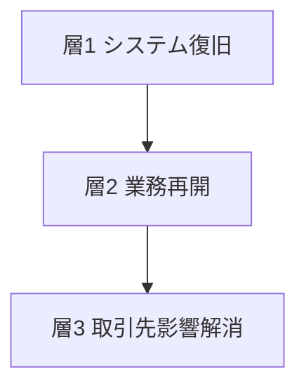
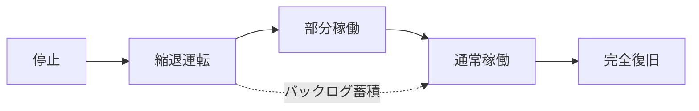

2026年7月、冷凍物流大手のニチレイでサイバー攻撃によるシステム障害が起きました。報道は「約10日で全面復旧」と伝えています。

一方で同社は、事案の発生前から自社サイトで DR 構成を公開していました。そこに書かれている設計値は「DR 発動からオンライン再開まで約1時間」です。

設計値は約1時間、実績は4日と11日でした。2桁以上の開きがあります。

この記事は、この開きを一次情報で検証し、「復旧」という言葉を3つの層に分解して整理します。対象読者は、障害報告を受け取る側の意思決定層と、AI エージェント基盤の障害設計を担う技術者です。

先に結論を置きます。復旧は、システム復旧 (層1)、業務再開 (層2)、取引先影響解消 (層3) の3層に分かれます。層ごとに指標も責任者も終了条件も違います。設計 RTO の「約1時間」は層1の指標であり、層2と層3の停止時間については何も語りません。

## 起点記事の技術的説明は、一次情報で裏づけできませんでした

調査はまず、起点となった記事の主張を一次ソースで検証しました。結果は次のとおりです。

| 起点記事の主張 | 一次ソースでの確認結果 |
|---|---|
| バックアップから復旧 | 公式発表7本 (リリース第1〜5報 + 適時開示2本) に「バックアップ」「復元」「リストア」は0件 |
| 現場の代替運用で凌いだ | 同7本に「手作業」「手書き」「紙」「代替」は0件 |
| 約10日で復旧 | 同社は日数を公表せず。「約10日」は二次情報のみ |
| 東京がメイン、西日本にDRサイト | 主従が逆。一次ではメインサイトが西日本データセンター、DRサイトが東日本データセンター |
| サイバー攻撃を想定した切替訓練を平時から実施 | 統合レポート2025 に載る訓練は、大地震想定の対策本部設置訓練 (年1回) と安否確認訓練 (年2回) のみ |

「バックアップで早期再開」という説明の出所は、日本経済新聞 2026-07-22 の記事1本にさかのぼります。本文は会員限定のため取得できず、広報発言か記者の推測かを特定できませんでした (二次情報)。日経クロステックは唯一ニチレイ広報に直接取材していますが、バックアップには触れず「調査中」と伝えています。

### 一次情報だけで立つ、より強い事実

ニチレイは事案の発生前から、DR 構成を自社サイトと統合レポートで公開していました。Wayback Machine の 2025-12-08 時点と現行ページが一致するため、事後の後付けではありません。

> ニチレイロジグループでは、リスクマネジメントの一環として、2018年2月より物流基幹システムのBCP対応の強化を図りました。これまで東京一極集中だったデータセンターのメインサイトを西日本に設置し、迅速な災害復旧を可能にするディザスタリカバリ (以下、DR) を構築しました。大規模災害の発生時、メインサイトからDRサイトに切り替える「2拠点化」を実現することにより、速やかに業務復旧を進めることができます。**DR発動からオンライン再開までの時間は約1時間**と、さまざまな状況下でお客様の業務や食品物流に影響を与えない最大限の配慮がなされています。
>
> 出典: ニチレイ「リスクマネジメント」

公式リリースから確定できる実績は次のとおりです。

| 区間 | 起点 | 終点 | 日数 |
|---|---|---|---|
| 検知から業務再開まで (部分稼働、受発注制限あり) | 7/13 | 7/17 | 4日 |
| 検知から全拠点の平常時通常稼働まで (受発注制限解除) | 7/13 | 7/24 | 11日 (暦日) |

この開きは失態と呼ぶべきものではありません。DR の一次記述は一貫して「データセンターの被災を想定」と書いてあります。想定外の事象に、想定内の指標が効かなかった、という当然の結果です。

問題は別の場所にあります。**その当然の帰結を、経営が事前に自覚しているか**です。

## 「復旧」には少なくとも3つの層があります

復旧は単一の概念ではありません。層ごとに指標も、責任者も、終了条件も違います。

| 要素名 | 説明 |
|---|---|
| 層1 システム復旧 | IT資産が安全に動く状態への回復。指標は RTO と RPO。責任は情報システム部門。終了条件は健全性確認と再接続承認 |
| 層2 業務再開 | 決めた最低水準での製品サービス提供。指標は RLO と impact tolerance。責任は事業部門と経営。終了条件はバックログの処理完了 |
| 層3 取引先影響解消 | 取引先側の業務の回復。指標は取引先ごとの影響期間。責任は営業と経営。終了条件は相手側の宣言 |

層をまたぐ指標の用語を先に確認します。

| 用語 | 説明 |
|---|---|
| RTO (目標復旧時間) | 停止から復旧までの目標時間。層1で使用 |
| RPO (目標復旧時点) | 許容できるデータ損失の時点。層1で使用 |
| RLO (目標復旧レベル) | 復旧時点で満たすべき業務の水準。層2で使用 |
| impact tolerance | 事業サービスに許容できる中断の限界。英国の監督規制で使用 |
| MBCO (最低事業継続目標) | 事案中に維持すべき最低限の製品サービス水準 |

DR の「約1時間」は層1の指標です。層1の指標だけを持つ組織は、層2と層3の停止時間を管理していません。

各層は順番に進みますが、**終わる順番は同じとは限りません**。大阪急性期・総合医療センターでは、電子カルテ再稼働の10日後まで紙カルテ運用が続きました。層1が終わっても層2は続きます。

なお、この3層分解自体に新規性はありません。NIST SP 800-184 (2016-12) は既に "full recovery may not be the immediate goal" と "continue operation in a diminished capacity" を明記しています。MBCO (最低事業継続目標) の概念はシンガポール TR19 (2005) が初出で、ISO 22301:2012 で国際標準になりました (二次情報)。**この記事の価値は概念の提示ではなく、日本の実事案で定量に確認した点にあります。**

### 「復旧した」が意味しうる4つの状態

| 要素名 | 説明 |
|---|---|
| 停止 | 業務の停止状態 |
| 縮退運転 | 手動代替による一部業務の継続 |
| 部分稼働 | システム稼働、ただし受付や機能に制限あり |
| 通常稼働 | 制限解除後の平常運転 |
| 完全復旧 | 侵害された IT 資産の健全性回復 |
| バックログ蓄積 | 縮退運転中に積み上がる未処理分。通常稼働の到達を遅らせる要因 |

ニチレイの公式発表を当てはめると、7/17 が部分稼働、7/24 が通常稼働にあたります。**完全復旧については一次に記述がありません。** 第5報の表現は「受発注制限を解除し、全拠点で平常時の通常稼働に移行」であり、IT 資産の健全性回復を宣言したものではありません。報道が使った「全面復旧」は要約語です。

この区別を曖昧にしたままだと、経営は「復旧しました」という一言で、4つの異なる状態のどれかを受け取ることになります。

## 事案横断で見えた6つの特徴

### 特徴1: 開きの幅は業種のバックログ蓄積性でほぼ決まります

国内9事案を横断調査し、業種の違いが明確に出た6件を並べます。業務再開までの時間と全面復旧までの時間の開きは、業種によって桁が違います。

| 事案 | 業種 | 業務再開まで | 全面復旧まで | 開き |
|---|---|---|---|---|
| 全銀システム (2023) | 決済 | 43時間 | ほぼ同時 | ほぼゼロ |
| 名古屋港 NUTS (2023) | 港湾 | 約60時間 | ほぼ同時 | ほぼゼロ |
| ニチレイ (2026) | 冷凍物流 | 4日 (部分稼働) | 11日 (制限解除) | 約3倍 |
| 大阪急性期・総合医療センター (2022) | 医療 | 数日で紙運用 | 約2か月 | 約10倍 |
| アサヒグループHD (2025) | 食品 | 段階再開 | 約190日 | 桁違い (二次情報) |
| 江崎グリコ (2024) | 食品 | 4/18 一部再開 | 約216日 | 桁違い |

フロー型 (処理しそこねた分が消える) の決済と港湾は、開きがほぼありません。多品種を扱う物流と製造は、停止中に注文と在庫のずれが積み上がるため、4〜7か月かかります。

**経営が最初に知るべきは、自社がどちらの型かです。** フロー型なら、システム復旧の速さがほぼそのまま事業の話になります。蓄積型なら、システムが戻った日は復旧の中間地点にすぎません。

### 特徴2: 手動代替は入口から先に壊れます

大阪急性期・総合医療センターの一次報告書には、業務水準の実測値が残っています (2022年11月、前年同月比)。

| 業務 | 維持できた水準 |
|---|---|
| 延外来 | 61.6% |
| 延入院 | 52.9% |
| 新入院 | 33.3% |
| 手術 | 28.1% |
| 初診 | 17.9% |
| 救急車搬入 | 13.0% |

継続中の業務は5〜6割を維持できます。一方で**新規受付は1〜3割に落ちます**。既に情報が紙にある患者は紙で回せますが、新規はマスタ参照が要るため回りません。

全銀システムでも同じ構造が出ています。被仕向は全件処理できた一方、仕向は 64〜67% しか処理できず、3割強が未処理のまま残りました。

### 特徴3: 用意してある代替手段と、実際に回る代替手段は別物です

全銀システムは計画どおり当日11時に代替手段を発動しました。それでも3割強を処理できませんでした。全銀ネット自身が報告書で「所要時間・練度の検証がなされていなかった」と総括しています。

理由として挙がっているのは次の3点です。

- 平常時には入力しない項目の自前入力
- 想定を超えたデータ量
- 電子媒体の物理搬送

大阪急性期では、さらに根本的な問題が出ています。**災害用の紙様式と BCP マニュアルが電子カルテ上のグループウェアに置いてあり、取り出せませんでした。** 様式の作り直しから始めています。患者連絡先も参照できず、紙で提出済みの入院申込書だけが頼りでした。

名古屋港 NUTS では、国土交通省の中間とりまとめが「システム化以前のマニュアル作業の経験者がいたことにより対応が可能」と明記しています。手作業が回った要因は設計の成果ではなく、**在職者の記憶という償却中の資産**でした。

### 特徴4: 部分再開そのものが失敗しえます

江崎グリコは 2024年4月18日に一部再開し、翌19日に再停止しました。原因は「データ不整合」と「想定を超える受注品目数に処理が追いつかない」ことです。

**再開の判断基準がシステムの稼働可否であり、積み上がったバックログの処理能力ではありませんでした。**

英国 PRA のシナリオテストで Firm B が得た教訓と正確に対応します。同社が計画に追加したのは、復旧できたかの確認ではなく、「復旧後に積み上がった滞留を捌ける人員がいるか」の検証と、増員および即時研修でした。

### 特徴5: 被害企業の開示と、実害の所在はずれます

ニチレイの一次発表には、影響を受けた取引先名も、欠品や遅延の具体的規模も記載がありません。一方、取引先側には一次発表が複数存在します。

- 日本KFC: 委託先物流会社のシステム障害により、商品の一部品切れ、販売メニュー制限、営業時間短縮。7/22 に全店で通常営業再開 (影響期間 7/13〜7/22 の10日間)
- コープデリ、ユーコープ、パルシステム連合会、東海コープ事業連合、551蓬莱、くら寿司: 各社サイトで告知

**影響の実像は、被害企業ではなく取引先の発表側に書かれています。** 層3 を自社の指標だけで管理できない理由がここにあります。

### 特徴6: 制度は事案の3か月前に動いていました

国土交通省は標準倉庫寄託約款を改正し、**2026年4月1日から「情報システムの機能に支障があるときは寄託の引受け・出庫を拒絶できる」ことを明文化**しています。改正趣旨には「システム障害によるサービス停止に対し多額の賠償金」という記述があります。

ニチレイの事案は、その施行の3か月後に起きました。一方で物流BCPガイドラインには、新旧いずれも「サイバー」の語が0件です。**契約上の免責は整備が進んだ一方、業務継続の手引きは追いついていません。**

## 水準の決め方は、規格側に定式があります

日本と英国では、書きぶりの具体性が大きく違います。

| 出典 | 定式 | 強制力 |
|---|---|---|
| 内閣府 事業継続ガイドライン 3.1.2 (p.12) | `RTO < 時間の許容限界` かつ `RLO > レベルの許容限界` の不等式2本。階段状 RLO も公認 (脚注33) | ガイドライン |
| 英国 PRA SS1/21 ¶3.12 | normal operating capacity の X% を下回る状態が Y 時間続くことは許容しない | 監督声明 |
| 英国 FCA SYSC 15A.2.5R / 15A.2.9R | impact tolerance の設定義務および遵守義務 | Rule (義務) |
| EU DORA Art.12(6) | critical or important function ごとの RTO と RPO。水準は契約 SLA へ委任 | 規則 (適用開始 2025-01-17) |
| ISO 22301:2019 8.2.2 e) | RTO の定義に水準が内包。「規定された最低限の許容できる規模で再開するまでの優先すべき時間枠」 | 認証規格 (JIS Q 22301:2020 で確認) |
| 金融庁 オペレジDP / 金融分野サイバーGL (令和6年10月4日) | 耐性度の設定は【対応が望ましい事項】 | 義務ではない |

英国の設定実例 (FCA PS21/3) は具体的です。e-wallet 決済が 2 hours、自動車保険の請求受付 (Web と電話の両方) が 2 days です。

注目すべきは英国 PRA の2つの割り切りです。

- ¶3.5: 原因も発生確率も考慮しない
- ¶3.13: 頻度も考慮しない

サイバーか地震かで水準を割りません。単一障害が起きた場合の影響限界だけを見ます。内閣府ガイドラインも 3.1.1 で「その原因に関わらず」と同じ立場を取っています。

**この割り切りが、ニチレイ事案の開きへの直接の処方箋になります。** 「データセンター被災を想定した1時間」という指標は、原因を特定した瞬間に、他の原因では機能しなくなります。

## 縮退運転を検証せよという要求は、既に存在します

| 出典 | 要求内容 |
|---|---|
| 内閣府 事業継続ガイドライン 7.1.1 (p.30) | 手作業で業務処理を行うと定めている場合、その業務処理量が計画通りかを点検 |
| 同 脚注64 | 復旧後、手作業で行った処理がシステムへ反映されたことを確認 |
| 米 FFIEC | テストシナリオに Processing a full day's work at peak volumes、スクリプトに Procedures to guide manual work-around processes と定量メトリクス記録 |
| 英国 FCA SYSC 15A.5 | severe but plausible scenario で impact tolerance を超えないことを検証 |
| 英国 FCA SYSC 15A.2.10G | degraded service での再開は、完全復旧まで停止する不利益を上回る場合にのみ適切 |

要求はあります。実行が伴っていません。

帝国データバンク 2026 (n=10,521、備えの分母 n=5,311) によると、**業務の復旧訓練を実施している企業は 14.2%** で、前年の 15.7% から減少しています。

日本のサイバー演習は現状すべて机上です。NCO 全分野一斉演習2025 (923組織7,846名)、Delta Wall 2025 (177先) の到達点は「手順書の確認」と「課題抽出」であり、紙を配って実際に処理量を測る実地演習ではありません。

## 技術としての縮退設計は、直感と逆を向いています

システム側の設計指針は、フォールバックを増やす方向を推奨していません。

> Note that the pathways taken in case of component failure need to be tested and should be **significantly simpler than the primary pathway**. Generally, **fallback strategies should be avoided**.
>
> 出典: AWS Well-Architected Reliability Pillar, REL05-BP01

理由は 2001年の Amazon 障害です。キャッシュが死んだときに DB を直接参照するフォールバックが発動し、それが全社停止を招きました。Google SRE Book も「使わないコードパスは動かない」と同じ警告を出しています。

AWS の推奨は「書き込みを止めて読み取りだけ生かす」ではありません。**書き込みをキュー (SQS 等) へ退避して受付だけ続ける**です。これは特徴2で見た「新規受付から先に壊れる」問題への直接の回答になっています。

そして Bainbridge (1983) が43年前に書いています。

> automatic control can **'camouflage' system failure**
>
> graceful degradation は Fitts List で **機械に対する人間の優位** として挙げられている
>
> 出典: Lisanne Bainbridge, "Ironies of Automation" (1983) p.776

**縮退運転は本来、人間の得意技です。** 機械は破局的に壊れるか、異常を隠蔽するかのどちらかに寄ります。SRE の graceful degradation は、この人間の性質を機械側へ移植する試みだと位置づけられます。

## AI エージェント基盤への適用は、慎重に書きます

公式指針は存在します。AWS Well-Architected Generative AI Lens (2025-11-19 公開) の Reliability pillar、GENREL03-BP02 (リスク: High) は、エージェントが使えないままなら**ユーザが自力で完了できる次の手順を出力せよ**と規定しています。Bainbridge の「引き継ぎ時には最小情報しか使えない」という論点への、直接の技術的回答です。

しかしこの調査では、**「設計要件に引き継ぎを書けば足りる」という結論を否定する一次エビデンスが、支持エビデンスより強く出ました。**

| 出典 | 内容 |
|---|---|
| Green (2022, Computer Law & Security Review) | 実在する41の human oversight ポリシーを調査。人間は監督機能を果たせず、ポリシーは false sense of security を与えて欠陥システムを正当化 |
| NTSB HAR-19/03 (Uber ATG テンピ事故) | 緊急時に人間へ制御を戻す handoff 設計そのものを寄与要因に挙げ、"humans are very poor at this task" と明言 |
| Parasuraman & Manzey (2010) | 自動化が安定して信頼できる条件では異常検知率 33%、変動条件では 82%。AIの性能が上がるほど引き継ぎ能力は低下 |
| Turpin et al. (2023) | Chain-of-Thought の説明は真の判断理由を systematically misrepresent する。引き継ぎ出力自体の信頼性に疑義 |
| Elish (2019) | handoff は moral crumple zone、すなわち責任の付け替えに転化 |

**AI の性能向上と、人間の引き継ぎ可能性は構造的に競合します。** エージェントが安定するほど、人間は監視をやめ、いざというときに引き継げなくなります。これは訓練で埋まる差ではなく、注意という資源の性質の問題です。

3層をエージェント基盤に置き換えると、次の対応になります。

| 層 | エージェント基盤での対応 | 決めておく値の例 |
|---|---|---|
| 層1 システム復旧 | ワーカー、モデル API、ツール接続の回復 | 再実行までの目標時間、再実行の上限回数 |
| 層2 業務再開 | エージェントが担う業務の最低水準の維持 | 平常時処理件数の X% を Y 時間 |
| 層3 取引先影響解消 | 下流の利用部門と顧客への影響の解消 | 滞留分を捌き切るまでの期間 |

したがって AI エージェント基盤の縮退設計は、次のように立てます。

- 引き継ぎを設計項目ではなく、**能力の維持問題**として扱う
- エージェントが担う業務についても、層2の水準 (X% を Y 時間) を先に決める
- 引き継げないと判断した業務は、**引き継がせない**。止める、あるいは自動化しない、という選択を明示的に取る

## 反証によって修正した4点

反証専用の調査で、当初の結論のうち4点を修正しました。

| 当初の主張 | 反証 | 修正後 |
|---|---|---|
| AI基盤にも引き継ぎ出力を設計要件にすべき | Green 2022 / NTSB HAR-19/03 / Parasuraman & Manzey 2010 / Turpin 2023 (すべて一次) | 「設計要件で足りる」を撤回。能力の維持問題として提示し、引き継がせない選択も明示 |
| 手動代替は処理量で検証すべき | 国交省の最終とりまとめは、TOS はコンテナ単位の膨大な情報を処理するためマニュアル代替が困難と断定し、手動代替設計ではなく予防セキュリティ規制の強化を選択 | 条件付きに修正。処理量が大きい領域では、検証しても打ち手がない。「どの業務を手動代替の対象にしないか」を決めることも設計 |
| 縮退経路は常時稼働させるべき | Google SRE Book 自身が complex load shedding and graceful degradation can cause problems themselves と警告。全銀2023 の暫定対処ⅱは内国為替制度運営費を一律0円にする、誤データを意図的に生成する縮退 | 2条件を付加。①主経路より大幅に単純であること ②誤データが下流に与える影響を事前に決めること |
| この3層分解には新規性がある | MBCO はシンガポール TR19 (2005) 初出。NIST SP 800-184 (2016) が既に diminished capacity を明記。@IT が 2026-07-21 に同じ事案セットで同じ切り口の記事を公開済み | 新規性の主張を撤回。価値は「日本の実事案で定量検証した」点に置き直し |

覆すには至らないものの、記録しておく緊張が3点あります。

- CISA #StopRansomware の復旧優先度は predefined critical asset list であり、システム資産駆動です。「システムの積み上げをやめよ」と正面から緊張します
- NIST SP 800-184 は「メトリクスが拙速な調査を誘発しうる」と警告しています。水準を数値で決めること自体に副作用があります
- 大阪急性期では、業務能力が参照端末台数というシステム側変数に従属して拡大していました。因果の向きが逆の可能性があります。委員会の結論も RLO ではなく「オフラインバックアップと参照系システム」という IT 施策でした

また、名古屋港は発生4時間後に復旧最優先を決断して60時間で再開しましたが、感染経路を断定できず、再開前の健全性評価も不十分だったと後に指摘されています。早期の業務再開とフォレンジックは、明確にトレードオフの関係にあります。層2 を急ぐことは無条件の善ではありません。

## 未解決の問い

1. ニチレイの復旧手段は、今後も不明のまま残る可能性が高い状態です。再発防止策は 2026-07-27 時点で未公表。業績影響と対応費用の次の開示機会は、2026年12月期第1四半期決算発表 (8月7日予定)
2. 手動代替の実像は、テレビ朝日「報道ステーション」取材の証言1本のみです (二次情報、要再検証)。「保管場所がデータで確認できず、商品の"住所"が分からない」「手書きで管理せざるを得ない」という内容で、対象業務、拠点、期間はすべて不明
3. 日本経済新聞 2026-07-22「バックアップで早期再開」の本文は会員限定のため未取得です。広報発言であれば一次相当ですが、確認できていません
4. 手動代替の費用便益分析は、反証調査でも発見できませんでした。「準備コストが便益を上回る」を定量で示した文献は未確認です
5. ISO 22301:2019 の英語原文は有料のため未取得です (JIS Q 22301:2020 IDT で代替、二次情報)
6. GENREL03-BP02 に対する名指しの批判文献は存在しません。Green (2022) の批判が機能的に同じ設計思想を対象とするため、構造的に同じ批判が及ぶと評価しました

## 判断のチェックリスト

### 経営が決めること

| 項目 | 内容 |
|---|---|
| 型の判定 | 自社がフロー型か蓄積型かの確定。蓄積型なら、システム復旧日を復旧完了日として報告させない |
| 層2の水準設定 | 「X% を Y 時間」の形で先に決定 (PRA SS1/21 ¶3.12 の定式)。原因、発生確率、頻度は考慮しない |
| 手動代替の対象外の明示 | 手で回さない業務の確定。対象外は「止まる」ことを経営が承認した業務として扱う |
| 復旧宣言の語彙固定 | 縮退運転 / 部分稼働 / 通常稼働 / 完全復旧 の4段階。どの段階かを言わない報告を受け取らない |

水準を決められない業務は、内閣府ガイドライン脚注34 に従い、顧客単位に割って「重要顧客への供給」を重要業務に置き換えます。

### 現場が検証すること

| 項目 | 内容 |
|---|---|
| 処理量での測定 | 用意の有無ではなく処理量で測定 (内閣府 7.1.1、FFIEC の Processing a full day's work at peak volumes)。測る量は平常時のピーク相当 |
| 前提物の所在確認 | 紙様式、BCPマニュアル、取引先連絡先、マスタデータが、止まる系の中にあるかの確認 |
| 再開基準の拡張 | バックログ処理能力を再開基準に追加 (江崎グリコの再停止) |
| 反映工程の計画化 | 復旧後に手作業分をシステムへ反映する工程の保持 (内閣府 脚注64) |

### AI エージェント基盤に固有の判断

| 項目 | 内容 |
|---|---|
| 層2の水準設定 | エージェントが担う業務にも水準を設定。「エージェントが止まったら人がやる」は水準として扱わない |
| 引き継ぎ出力の設計 | GENREL03-BP02 に沿った次手順の出力。ただし、それで足りるとは考えない |
| 引き継ぎ対象の限定 | 引き継げないと判断した業務は、止めるか自動化しないかを選択 |
| フォールバックの単純化 | 主経路より大幅に単純な経路のみ採用 (AWS REL05-BP01) |

人間を形式的な監督者に置くと、Green (2022) の言う false sense of security になり、Elish (2019) の言う責任の付け替えになります。

## まとめ

サイバー障害の「復旧」は、システム復旧、業務再開、取引先影響解消という3層に分かれ、層ごとに指標も責任者も終了条件も違います。設計 RTO 約1時間の企業が実績11日となった事実は、層1の指標だけでは事業の停止時間を管理できないことを示しています。

自社が蓄積型か、層2の水準を「X% を Y 時間」で決めているか、手動代替を処理量で測っているか。この3点を確認するところから始めると、次の障害報告の読み方が変わります。

この記事が少しでも参考になった、あるいは改善点などがあれば、ぜひリアクションやコメント、SNSでのシェアをいただけると励みになります！

## 参考リンク

- ニチレイ事案 (一次)
  - [ニチレイ 第1報 (2026-07-13)](https://www.nichirei.co.jp/news/2026/512.html)
  - [ニチレイ 第2報 (2026-07-15)](https://www.nichirei.co.jp/news/2026/513.html)
  - [ニチレイ 適時開示 (2026-07-16)](https://www.nichirei.co.jp/ir/news/2026/t_in226.html)
  - [ニチレイ 第3報 (2026-07-17)](https://www.nichirei.co.jp/news/2026/514.html)
  - [ニチレイ 第4報 (2026-07-22)](https://www.nichirei.co.jp/news/2026/515.html)
  - [ニチレイ 適時開示 続報 (2026-07-22)](https://www.nichirei.co.jp/ir/news/2026/t_in227.html)
  - [ニチレイ 第5報 (2026-07-24)](https://www.nichirei.co.jp/news/2026/517.html)
  - [ニチレイ リスクマネジメント](https://www.nichirei.co.jp/corpo/riskmanagement.html)
  - [ニチレイグループ統合レポート2025](https://www.nichirei.co.jp/sites/default/files/inline-images/ir/integrated/pdf/ngir2025_all.pdf)
  - [日本KFC 通常営業再開のお知らせ (2026-07-22)](https://japan.kfc.co.jp/news_release/8160)
- ニチレイ事案 (二次)
  - [ビジネス+IT 起点記事 (2026-07-26)](https://www.sbbit.jp/article/cont1/186262)
  - [日本経済新聞 バックアップで早期再開 (2026-07-22、会員限定)](https://www.nikkei.com/article/DGXZQOUC2272J0S6A720C2000000/)
  - [日経クロステック](https://xtech.nikkei.com/atcl/nxt/news/24/03305/)
  - [piyolog まとめ (2026-07-16)](https://piyolog.hatenadiary.jp/entry/2026/07/16/022032)
- 規格・ガイドライン
  - [内閣府 事業継続ガイドライン](https://www.bousai.go.jp/kyoiku/kigyou/keizoku/sk.html)
  - [NIST SP 800-184 Guide for Cybersecurity Event Recovery](https://nvlpubs.nist.gov/nistpubs/SpecialPublications/NIST.SP.800-184.pdf)
  - [NIST SP 800-34 Rev.1](https://csrc.nist.gov/pubs/sp/800/34/r1/upd1/final)
  - [経済産業省 サイバーセキュリティ経営ガイドライン Ver3.0](https://www.meti.go.jp/policy/netsecurity/mng_guide.html)
  - [金融庁 オペレーショナル・レジリエンス確保に向けた基本的な考え方](https://www.fsa.go.jp/news/r4/ginkou/20230404/20230404.html)
  - [英国 FCA SYSC 15A](https://www.handbook.fca.org.uk/handbook/SYSC/15A/)
  - [英国 PRA SS1/21 Operational resilience](https://www.bankofengland.co.uk/prudential-regulation/publication/2021/march/operational-resilience-impact-tolerances-for-important-business-services-ss)
  - [EU DORA](https://eur-lex.europa.eu/eli/reg/2022/2554/oj)
  - [国土交通省 標準倉庫寄託約款 改正の内容について](https://www.mlit.go.jp/seisakutokatsu/freight/content/001987412.pdf)
- 技術設計
  - [AWS Well-Architected Reliability Pillar REL05-BP01](https://docs.aws.amazon.com/wellarchitected/latest/reliability-pillar/rel_mitigate_interaction_failure_graceful_degradation.html)
  - [AWS Well-Architected Generative AI Lens](https://docs.aws.amazon.com/wellarchitected/latest/generative-ai-lens/generative-ai-lens.html)
  - [Google SRE Book, Chapter 22 Addressing Cascading Failures](https://sre.google/sre-book/addressing-cascading-failures/)
  - [Lisanne Bainbridge, Ironies of Automation (1983)](https://ckrybus.com/static/papers/Bainbridge_1983_Automatica.pdf)
- 引き継ぎへの反証
  - [Ben Green, The flaws of policies requiring human oversight of government algorithms (2022, CLSR)](https://www.sciencedirect.com/science/article/pii/S0267364922000292)
  - [NTSB HAR-19/03 Uber ATG](https://www.ntsb.gov/investigations/AccidentReports/Reports/HAR1903.pdf)
  - [NTSB HAR-20/01 Tesla Autopilot](https://www.ntsb.gov/investigations/AccidentReports/Reports/HAR2001.pdf)
  - [Parasuraman & Manzey (2010), Complacency and Bias in Human Use of Automation](https://journals.sagepub.com/doi/10.1177/0018720810376055)
  - [Turpin et al. (2023), Language Models Don't Always Say What They Think](https://arxiv.org/abs/2305.04388)
  - [M.C. Elish (2019), Moral Crumple Zones](https://estsjournal.org/index.php/ests/article/view/260)
