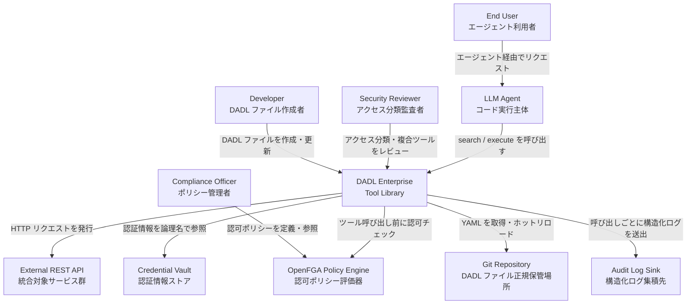
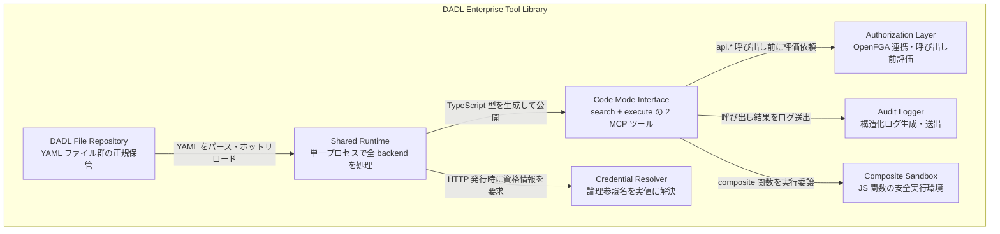
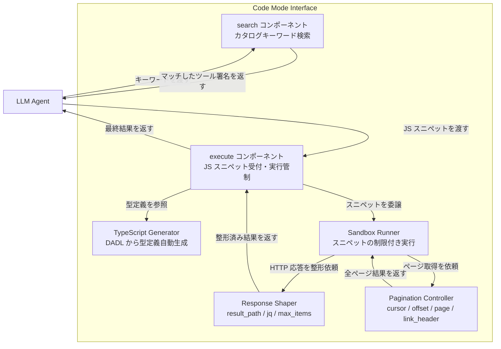
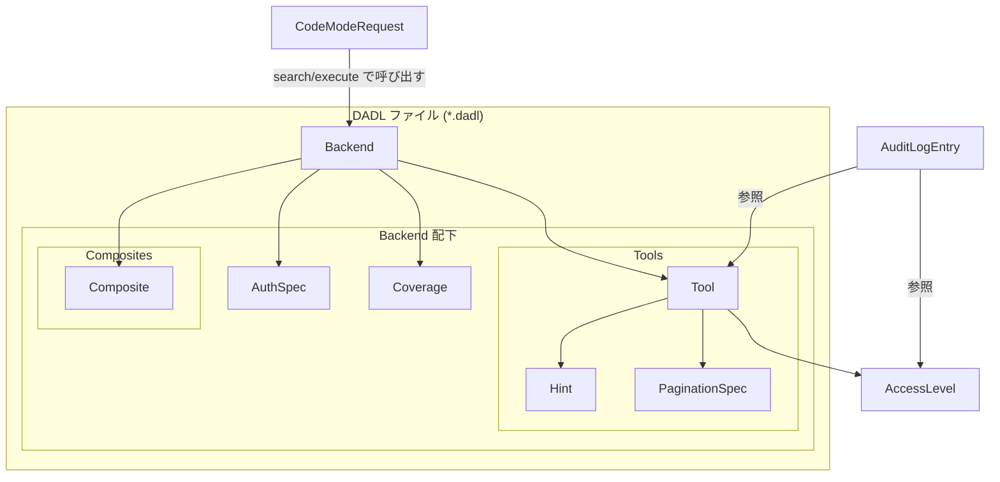
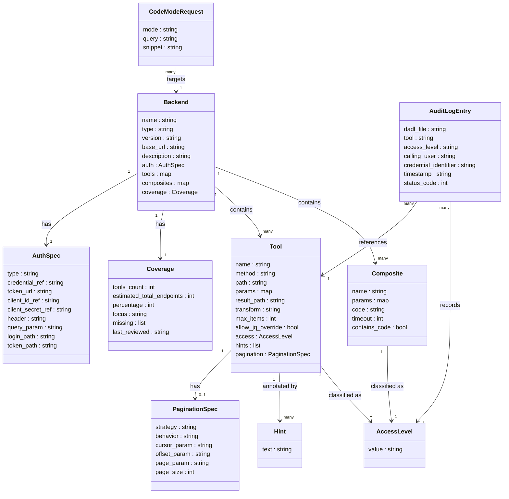

> 対象論文: Axel Dunkel. *DADL: A Declarative Description Language for Enterprise Tool Libraries in LLM Agent Systems*. April 2026. arXiv:2605.05247 / Zenodo DOI 10.5281/zenodo.19931788
> 調査日: 2026-05-09 / 仕様ライセンス: CC BY-SA 4.0 / 参照実装 ToolMesh: Apache-2.0

## 概要

**DADL (Dunkel API Description Language)** は、MCP (Model Context Protocol) を組織規模で運用するために設計された、YAML 宣言型のツールライブラリ仕様です。著者は Axel Dunkel (Dunkel Cloud GmbH) で、April 2026 に arXiv (2605.05247) および Zenodo (DOI: 10.5281/zenodo.19931788) で公開されました。仕様ライセンスは CC BY-SA 4.0、参照実装 ToolMesh は Apache-2.0 です。

### 解決する問題

MCP は 2024 年 11 月の公開から約 1 年半で業界標準となり、公式レジストリのサーバ数は 2026 年 4 月時点で約 9,400 に達しました。一方、組織規模での運用では 2 つの構造問題が顕在化しています。

**問題 1: MCP サーバーの増殖 (server proliferation)**

「1 API = 1 MCP サーバー」モデルでは、API が増えるごとにデプロイ・認証情報・依存管理のコストが線形に増大します。Mastouri et al. の調査では、公式 MCP サーバー 116 件のうち 88.6% が完全または部分的に REST API ベースで、そのうち **92% のツールが bare API ラッパーとして実装**されており、中央値では上流 API の 19% しかカバーしていません。

**問題 2: コンテキスト窓の肥大化 (context window consumption)**

MCP は接続中の全ツール定義を毎ターン LLM コンテキストに載せる設計です。Apideck の検証では、GitHub + Slack + Sentry の 3 サーバーを有効化するだけでユーザー発話前に **55,000 トークン**を消費する事例が報告されています。Lunar.dev の計測でも、5 サーバー (合計約 150 ツール) を接続するとツール定義だけで 30,000〜60,000 トークンを占有し、ツール選択精度が大きく劣化するとされています。

### DADL のアプローチ

DADL は REST API を 1 つの YAML ファイル (`*.dadl`) に宣言的に記述します。ToolMesh ランタイムがこの宣言を読み込み、LLM には `search` と `execute` の **2 つのメタツール** だけを提示します (Code Mode パターン)。LLM は `search` でカタログからツール署名を検索し、`execute` で TypeScript スニペットを sandbox 実行します。

論文の計測では、1,833 ツールを収録した公開レジストリ全体を約 **1,000 トークン**で提示でき、従来の 1-tool-1-schema 方式の約 142,000 トークンと比較して **142 倍の削減**を達成するとしています。なお、この Code Mode パターン自体は Cloudflare が同時期 (2026 年 4 月) に公開した手法と同思想であり、DADL 固有の発明ではありません。

### 位置づけの注意点

論文は単著・未査読 (arXiv / Zenodo はプレプリント / 自己アーカイブ) で、公開レジストリ 20 件はすべて著者自社製作の可能性があり、独立採用実績はありません。技術的新規性より、**組織で MCP をスケールさせるときの設計判断軸** (認証統合・認可境界・カバレッジメトリクス・暗黙知の埋め込み・運用ガバナンス) を 1 フォーマットに集約した点に実用的な価値があります。

## 特徴

### 1. 宣言型クロージャ (Declarative Closure)

DADL ファイルは制御フローを持ちません。任意の DADL ファイルが到達可能な HTTP エンドポイント集合は、ファイル単独の静的検査で有限かつ確定できます。これにより組織のセキュリティ・コンプライアンス監査で「このエージェントが叩く可能性のある API エンドポイントの網羅リスト」を `grep` 可能なディレクトリとして提示できます。

例外は複合ツール (composite) で、`contains_code: true` フラグで明示され、別途レビュー対象となります。

### 2. コンテキストコスト O(1) の維持

ツール数が増えても LLM への広告コストは `search` + `execute` の 2 ツール分で一定です。カタログ全体 (1,833 ツール) でも約 1,000 トークンに収まります。

### 3. 中央集権型認証管理

DADL ファイルに認証情報の実値は含まれません。論理参照名 (例: `vault/stripe-secret-key`) のみを記述し、実値の解決は ToolMesh ランタイムが一元管理します。対応スキームは Bearer / Basic / OAuth 2.0 client credentials / Session-based / API key の 5 種類です。Credential のローテーション・失効・監査がすべて 1 箇所で完結します。

### 4. 中央集権型認可制御

アクセス分類として `read` / `write` / `admin` / `dangerous` の 4 段階 well-known ラベルを定義します。カスタム値 (`pii`, `billing` 等) も追加可能です。ToolMesh は OpenFGA と統合し、「P1 インシデント中のオンコール担当者のみ `dangerous` 操作を実行可能」のような組織ポリシーを一度記述すれば全バックエンドに適用できます。

### 5. カバレッジの第一級概念化

各バックエンドについて「ツール数 / 推定エンドポイント総数 / カバー率」を機械可読に宣言します。GitHub DADL は 205/900 エンドポイント (23%)、NetBox は 89%、DeepL は 100% というように、組織内で実利用されているが未登録の API (shadow API problem) を可視化します。

### 6. 組織知識の埋め込み (Hints)

ツール定義の隣に `hints` フィールドで暗黙知を記述できます (例: `Kanban views return buckets, not flat lists`)。Slack スレッドや古い Wiki に散在していた利用上の注意をツール定義と同じ場所に置くことで、LLM のツール使用精度を高めます。

### 7. ライブラリ合成効果 (Library Composition Effect)

組織内に多数の DADL バックエンドが単一認証・認可境界の背後に並ぶと、複数 API を横断するクエリを 1 つの JS スニペットで記述できます。

> 例: Alertmanager のアラート → NetBox でホスト特定 → Graylog で最近のログ取得 → Wiki の Runbook 参照 → Xen Orchestra で Hypervisor 状態確認

論文はこれを Library Composition Effect と命名しつつ、エージェントが 3〜4 ソースを確実にチェーンできるかは未検証のオープン問題として残しています。

### 8. 運用フレンドリーな設計

- **Hot reload**: DADL ファイルの変更にコンテナリビルドが不要
- **GitOps 対応**: `git merge` がプロモーション操作に相当
- **構造化監査ログ**: `DADL file / tool / access level / user / credential identifier` の形式で記録

### 競合・先行手法との比較

| アプローチ                              | 単位                                     | 認証・認可               | コンテキストコスト                       | 採用実績                                         | OSS ライセンス            | マネージド有無 |
| --------------------------------------- | ---------------------------------------- | ------------------------ | ---------------------------------------- | ------------------------------------------------ | ------------------------- | -------------- |
| **DADL + ToolMesh**                     | YAML 1 ファイル / API                    | ランタイム中央 (OpenFGA) | O(1) — Code Mode で約 1,000 トークン固定 | 単一企業のレジストリのみ (独立採用なし)          | CC BY-SA 4.0 + Apache-2.0 | セルフホスト   |
| **手書き MCP server**                   | コードプロジェクト / API                 | サーバー自前実装         | O(N tools) — ツール数に比例              | 公式レジストリ 9,400+ サーバー                   | 各実装次第                | 各自           |
| **AutoMCP (2507.16044)**                | 自動生成コード / API                     | サーバー自前実装         | O(N tools) — ツール数に比例              | 学術的検証済み (精度 76% → 94.2%)                | OSS                       | セルフホスト   |
| **Cloudflare Code Mode**                | TypeScript + V8 isolate                  | Workers OS 統合          | O(1) — 単純 32% / 複雑 81% 削減を実証    | Cloudflare マネージド + 公式ドキュメント         | OSS                       | マネージドあり |
| **Anthropic Agent Skills**              | SKILL.md + ファイルシステム + bash       | 各ホスト側               | on-demand ロードで O(active skills)      | Atlassian / Cloudflare / Figma / Notion / Sentry | Open Standard (2025-12)   | Anthropic 環境 |
| **Airbyte Low-Code CDK + 独自 wrapper** | YAML connector manifest + MCP アダプター | 各コネクター側           | O(N tools) — データパイプライン向け設計  | 700+ コネクター、80% が declarative              | OSS                       | マネージドあり |

**読み方のポイント**

- コンテキストコスト削減が最優先なら、Cloudflare Code Mode (マネージド) または DADL + ToolMesh (セルフホスト) が選択肢に上がります。
- 採用実績・エコシステム成熟度を重視するなら、手書き MCP server か Anthropic Agent Skills が現時点で最も実績があります。
- 既存 Airbyte 運用組織は、独自 wrapper の追加でコストを抑えられます。

## 構造

### システムコンテキスト図



#### アクター

| 要素名             | 説明                                                                  |
| ------------------ | --------------------------------------------------------------------- |
| Developer          | DADL ファイル作成・更新担当。LLM 補助で 1 ファイル 1 時間未満作成可能 |
| Security Reviewer  | アクセス分類と `contains_code: true` 箇所の監査担当                   |
| Compliance Officer | OpenFGA 認可ポリシーの定義・維持担当。全 backend に一括適用           |
| LLM Agent          | `search` / `execute` の 2 ツールのみで Enterprise Tool Library を利用 |
| End User           | LLM Agent 経由でビジネスタスクを実行する最終利用者                    |

#### 外部システム

| 要素名                | 説明                                                                                                        |
| --------------------- | ----------------------------------------------------------------------------------------------------------- |
| External REST API     | GitHub / Stripe / NetBox 等、DADL ファイルで宣言される統合対象                                              |
| Credential Vault      | Bearer / OAuth クライアントシークレット等の実値ストア。DADL には論理参照名のみ                              |
| OpenFGA Policy Engine | Zanzibar 方式の関係ベースアクセス制御エンジン。`api.*` 呼び出し前に評価                                     |
| Git Repository        | DADL ファイルの正規保管場所。`git merge` がプロモーション                                                   |
| Audit Log Sink        | 呼び出しごとに DADL ファイル名・ツール名・アクセスレベル・ユーザー・credential 識別子を含む構造化ログを受領 |

### コンテナ図



#### コンテナ一覧

| 要素名               | 説明                                                                                           |
| -------------------- | ---------------------------------------------------------------------------------------------- |
| DADL File Repository | `.dadl` 形式の YAML を Git 管理。1 ファイル = 1 REST API backend 宣言                          |
| Shared Runtime       | 全 DADL backend を単一プロセスで処理。API ごとプロセスを立てず 1 プロセスで複数 backend を担う |
| Code Mode Interface  | `search` / `execute` の 2 MCP ツール提供層。広告コスト O(1) を維持                             |
| Authorization Layer  | `api.*` 呼び出し前に OpenFGA へ評価依頼。access 分類を policy engine に渡す                    |
| Audit Logger         | 構造化ログ生成・外部 Sink 送出                                                                 |
| Credential Resolver  | 論理参照名 (`vault/stripe-secret-key` 等) を実値に変換し HTTP 発行時に注入                     |
| Composite Sandbox    | `composites:` ブロックの JS 関数を外部 I/O 禁止・タイムアウト・呼び出し数制限付きで実行        |

### コンポーネント図

Code Mode Interface を代表コンテナとしてドリルダウンします。



**具体例 (GitHub DADL, Code Mode 経由)**

LLM Agent が以下のスニペットを `execute` に渡すと、SandboxRunner が `api.list_repository_issues` を呼び出し、PaginationController が RFC 8288 Link ヘッダーを追跡して全ページを取得し、ResponseShaper が `transform` (jq) でフィールドを射影した後、ExecuteComp がフィルタ結果を返します。

```javascript
const issues = await api.list_repository_issues({
  owner: "DunkelCloud",
  repo: "ToolMesh",
  state: "open",
  labels: "bug",
});
return issues.filter(i => !i.assignee).map(i => ({
  number: i.number, title: i.title, url: i.html_url,
}));
```

#### コンポーネント一覧

| 要素名                 | 説明                                                                                                          |
| ---------------------- | ------------------------------------------------------------------------------------------------------------- |
| search コンポーネント  | カタログをキーワード検索しマッチした TypeScript 関数署名を返す。利用可能 API の発見入口                       |
| execute コンポーネント | JS スニペットを受付け、TypeScript Generator・Sandbox Runner と連携して実行                                    |
| TypeScript Generator   | DADL ファイルから TypeScript インタフェースを自動生成。`execute` sandbox 内のみ可視化                         |
| Sandbox Runner         | スニペットを外部 I/O 禁止 (fetch/require/import/eval/Function 不可) ・タイムアウト・呼び出し数制限付きで実行  |
| Response Shaper        | `result_path` (JSONPath) → `transform` (jq) → `max_items` → `allow_jq_override` の 4 段パイプラインで応答整形 |
| Pagination Controller  | cursor / offset / page / link_header の 4 戦略で処理。`behavior: auto` 時は全ページ透過取得                   |

## データ

### 概念モデル



### 情報モデル



**AccessLevel の value**: `read` / `write` / `admin` / `dangerous` + カスタム値 (`pii`, `billing`, `ops` 等)

**PaginationSpec の strategy**: `cursor` / `offset` / `page` / `link_header`

**PaginationSpec の behavior**: `auto` (runtime が透過的に全ページ取得) / `expose` (LLM がカーソルを明示制御)

**AuthSpec の type**: `bearer` / `basic` / `oauth2_client_credentials` / `session` / `api_key`

**CodeModeRequest の mode**: `search` (カタログをキーワード検索しツール署名を返す) / `execute` (TypeScript インタフェースに対する JS スニペットを sandbox 実行)

**Tool.allow_jq_override**: LLM が `execute` スニペット内で ad-hoc jq filter を渡し、サーバ側の `transform` を上書きできるかを制御する真偽値フラグ。探索的なデータ整形を許容したい場合のみ `true` に設定し、デフォルトは `false` を推奨します (悪意ある DADL 投稿時に攻撃面を広げないため)。

## 構築方法

### 前提条件

DADL を運用するには ToolMesh OSS ランタイムが必要です。ToolMesh は単一の Docker コンテナとして動作し、すべての DADL backend を 1 プロセスで処理します。

#### ToolMesh のセットアップ

```bash
# リポジトリをクローン
git clone https://github.com/DunkelCloud/ToolMesh.git
cd ToolMesh

# 環境変数を設定
cp .env.example .env
# .env を編集し、TOOLMESH_AUTH_PASSWORD と TOOLMESH_API_KEY を設定

# サービスを起動
docker compose up -d

# ヘルスチェック
curl http://localhost:8123/health
```

デフォルトでポート `8123` でリッスンします。MCP クライアント (Claude Code など) から接続するには以下を実行します。

```bash
claude mcp add -t http \
  -H "Authorization: Bearer MY_API_KEY" \
  -s user toolmesh \
  http://localhost:8123/mcp
```

TLS が必要な場合は Caddy / Cloudflare Tunnel / nginx などのリバースプロキシを前段に置きます。

#### Credential Vault

ToolMesh は 3 段階のクレデンシャル解決を行います。

| 優先順位 | ソース              | 概要                                     |
| -------- | ------------------- | ---------------------------------------- |
| 1        | Embedded (環境変数) | `CREDENTIAL_` プレフィックス付き環境変数 |
| 2        | Infisical           | OSS シークレット管理サービス             |
| 3        | Vault / OpenBao     | HashiCorp Vault 互換の外部 KV ストア     |

DADL ファイルには論理参照名のみを記載します (例: `vault/stripe-secret-key`)。実値は DADL ファイルに含まれず、実行時に解決されます。

最小構成では環境変数に直接設定します。

```bash
# .env への追記例
CREDENTIAL_STRIPE_SECRET_KEY=sk_live_xxxx
CREDENTIAL_GITHUB_TOKEN=ghp_xxxx
```

#### OpenFGA エンジン

OpenFGA は認可ポリシーを管理します。デフォルトでは `OPENFGA_MODE=bypass` (全ツール呼び出しを許可) です。

```bash
# 認可強制を有効化する場合
OPENFGA_MODE=restrict
```

`restrict` モードでは `config/users.yaml` でユーザーとロールを定義し、plan ごとに read / write / admin / dangerous へのアクセスを制御できます。

```yaml
# config/users.yaml の例
users:
  - username: alice
    password_hash: "$2a$10$..."  # htpasswd -nbBC 10 "" "pass" | cut -d: -f2
    company: myorg
    plan: pro
    roles: [tool-executor]
```

### DADL ファイルの基本構造

DADL ファイルは拡張子 `.dadl` (または `.dadl.yaml`) の YAML ファイルです。top-level 必須フィールドは `spec` と `backend` です。

以下は論文 Listing 1 相当の最小構成例 (Stripe) です。

```yaml
spec: "https://dadl.ai/spec/dadl-spec-v0.1.md"

# メタデータ (任意)
source_name: Stripe
source_url: https://stripe.com/docs/api
date: "2026-04"

backend:
  name: stripe            # スラッグ形式
  type: rest
  base_url: https://api.stripe.com/v1
  description: "Stripe payment processing API"

  auth:
    type: bearer
    credential: vault/stripe-secret-key  # 論理参照名のみ。実値を含まない

  defaults:
    pagination:
      strategy: cursor
      request:
        cursor_param: starting_after
        limit_param: limit
      response:
        next_cursor: "$.data[-1].id"   # JSONPath
        has_more: "$.has_more"
      behavior: auto                    # runtime が透過的に全ページ取得
    response:
      result_path: "$.data"            # envelope 解除
      max_items: 100

  coverage:
    endpoints: 107
    total_endpoints: 450
    percentage: 24
    focus: "payments, customers, invoices"
    missing: "Connect, Terminal, Radar"
    last_reviewed: "2026-04-01"

  tools:
    list_customers:
      method: GET
      path: /customers
      description: "List all customers"
      access: read
      params:
        limit:
          type: integer
          in: query
          default: 10
          description: "Number of customers to return (max 100)"
        email:
          type: string
          in: query
          description: "Filter by email address"

    create_customer:
      method: POST
      path: /customers
      description: "Create a new customer"
      access: write
      params:
        email:
          type: string
          in: body
          required: true
        name:
          type: string
          in: body
```

#### 主要フィールド一覧

| フィールド           | 必須 | 説明                            |
| -------------------- | ---- | ------------------------------- |
| `spec`               | 必須 | DADL 仕様 URL                   |
| `backend.name`       | 必須 | backend のスラッグ名            |
| `backend.type`       | 必須 | 常に `rest`                     |
| `backend.base_url`   | 必須 | REST API のベース URL           |
| `backend.auth`       | 必須 | 認証設定                        |
| `backend.tools`      | 必須 | ツール定義 map (ツール名がキー) |
| `backend.defaults`   | 任意 | 全ツール共通のデフォルト設定    |
| `backend.coverage`   | 任意 | カバレッジメタデータ            |
| `backend.composites` | 任意 | 複合ツール定義                  |

アンダースコアプレフィックスキー (`_defaults:`, `_common:` など) は runtime に無視され、YAML anchor の共通化に使用できます。

```yaml
# YAML anchor 活用例
_defaults: &pagination_defaults
  behavior: auto
  max_items: 200

backend:
  defaults:
    pagination:
      <<: *pagination_defaults
      strategy: page
```

### 認証設定

DADL v0.1 は 5 種類の認証スキームに対応します。

#### Bearer トークン (最も一般的)

```yaml
auth:
  type: bearer
  credential: vault/github-token   # 論理参照名
  # prefix: "Bearer"               # デフォルト。"token" など変更可能
```

#### Basic 認証

```yaml
auth:
  type: basic
  username: vault/api-username
  password: vault/api-password     # password は省略可 (username のみの場合)
```

#### OAuth 2.0 クライアントクレデンシャル

```yaml
auth:
  type: oauth2_client_credentials
  token_url: https://auth.example.com/oauth/token
  client_id: vault/oauth-client-id
  client_secret: vault/oauth-client-secret
  scope: "read:api write:api"
  # runtime がトークンをキャッシュし、期限前に proactive refresh を行う
```

#### セッションベース (Xen Orchestra 等)

```yaml
auth:
  type: session
  login:
    method: POST
    path: /rest/v0/session
    body:
      email: vault/xen-username
      password: vault/xen-password
  token_path: "$.authenticationToken"    # JSONPath でトークンを抽出
  csrf_path: "$.csrfToken"               # CSRF トークン (任意)
  reauth_on: [401]                       # 再ログイントリガーステータスコード
```

#### API キー (ヘッダーまたはクエリパラメータ)

```yaml
# ヘッダー注入
auth:
  type: api_key
  header: X-Api-Key
  credential: vault/deepl-api-key

# クエリパラメータ注入
auth:
  type: api_key
  query_param: api_key
  credential: vault/service-api-key
```

### ページネーション設定

Airbyte Low-Code CDK の語彙を採用した 4 戦略を提供します。`defaults.pagination` で全ツール共通設定を行い、個別ツールで上書き可能です。

#### cursor (Stripe, Slack 等)

```yaml
defaults:
  pagination:
    strategy: cursor
    request:
      cursor_param: starting_after
      limit_param: limit
      default_limit: 100
    response:
      next_cursor: "$.data[-1].id"
      has_more: "$.has_more"
    behavior: auto
```

#### offset (NetBox, Vikunja 等)

```yaml
defaults:
  pagination:
    strategy: offset
    request:
      offset_param: offset
      limit_param: limit
      default_limit: 100
    response:
      total_count: "$.count"
    behavior: auto
```

#### page (GitLab, Hetzner Cloud 等)

```yaml
defaults:
  pagination:
    strategy: page
    request:
      page_param: page
      per_page_param: per_page
      default_per_page: 50
      first_page: 1
    response:
      total_pages: "$.meta.total_pages"
    behavior: auto
```

#### link_header (GitHub, Mastodon 等)

```yaml
defaults:
  pagination:
    strategy: link_header
    response:
      next_relation: next    # RFC 8288 Link ヘッダーの rel 名
    behavior: auto
```

#### behavior オプション

| 値       | 動作                                                                 |
| -------- | -------------------------------------------------------------------- |
| `auto`   | runtime が全ページを透過的に取得してマージ。LLM はページを意識しない |
| `expose` | カーソルや次のページトークンを LLM に返し、明示的に制御させる        |

### LLM 補助による DADL 著作

論文 Section 5.8 によると、LLM 補助で 1 ファイルあたり **5〜60 分** で作成できます (実績: 一貫して 1 時間未満)。

#### 推奨ワークフロー

1. **コンテキスト準備**: 以下の 3 点を LLM に渡します
   - 対象 API の OpenAPI spec (または公式ドキュメントの URL)
   - DADL spec v0.1
   - 既存の DADL ファイル例 (参考構造として)
2. **初稿生成**: LLM に DADL ファイルのドラフトを生成させます。well-documented な API なら一発で usable なドラフトが出ることが多いです。
3. **段階的追加**: 既存 DADL に 10 エンドポイント追加する場合はツールブロックのコピペ + パス調整が中心作業になります。
4. **Agentic Toolsmithing**: DADL ライブラリを実際に使用した後、エージェントに「どのツールが足りなかったか」を問い合わせ、フィードバックを DADL ファイルに反映します。Brooks の "toolsmith" 概念の agent 拡張版です。
5. **レビュー**: `contains_code: true` のついた composite ブロックは必ず追加レビューを行います。

#### backends.yaml への登録

ToolMesh に DADL ファイルを認識させるには `config/backends.yaml` に追記します。

```yaml
# config/backends.yaml
backends:
  - name: stripe
    transport: rest
    dadl: /app/dadl/stripe.dadl

  - name: github
    transport: rest
    dadl: /app/dadl/github.dadl

  # ネイティブ MCP サーバーとのハイブリッド運用も可能
  - name: memorizer
    transport: http
    url: "https://memorizer.example.com/mcp"
    api_key_env: "MEMORIZER_API_KEY"
```

DADL ファイルの変更はホットリロード対応 (コンテナ再ビルド不要) です。

## 利用方法

### Code Mode による呼び出し

Code Mode は DADL backend 全体を **`search` と `execute` の 2 つの MCP ツールだけ** で露出するインタフェースです。

ツール広告コストは O(1) (カタログ規模に依存しない) です。1,833 ツールの registry でも **約 1,000 tokens** で収まります (従来の 1-tool-1-schema MCP 方式では **約 142,000 tokens**)。

#### search: ツール検索

LLM がキーワードでカタログを検索し、マッチしたツールの TypeScript 関数署名を取得します。

```
search("github issues")
# → list_repository_issues(owner, repo, state?, labels?, ...) の型定義を返す
```

#### execute: JS スニペット実行

LLM が `api.<tool_name>(params)` インタフェースに対して JavaScript スニペットを記述し、`execute` に渡します。

**論文 Section 4.3 の典型例 (GitHub issue 検索):**

```javascript
// execute に渡す JS スニペット
const issues = await api.list_repository_issues({
  owner: "DunkelCloud",
  repo: "ToolMesh",
  state: "open",
  labels: "bug",
});
return issues.filter(i => !i.assignee).map(i => ({
  number: i.number, title: i.title, url: i.html_url,
}));
```

副作用・中間 filtering・join がすべて 1 回の往復に収まります。

#### sandbox 制約

| 許可                                            | 禁止                             |
| ----------------------------------------------- | -------------------------------- |
| `api.*` 呼び出し                                | `fetch()`                        |
| `params` 参照                                   | `require()` / `import`           |
| 純粋 JS (map, filter, reduce, JSON, Math, Date) | `eval()` / `Function()`          |
| `console.log`, `await`                          | `fs`, `process`                  |
|                                                 | 外部バックエンドへの直接アクセス |

ハードリミット: タイムアウトデフォルト 30 秒 (最大 120 秒)、`api.*` 呼び出し最大 50 回。

### Composite tool

複数エンドポイントの結合・条件分岐が必要な場合のみ `composites:` ブロックにサーバーサイド JavaScript 関数を定義します (論文 Listing 2, 3 相当)。

#### 例1: デバイス一覧と status の join (論文 Listing 2: get_named_status)

```yaml
composites:
  get_named_status:
    description: "Get current status for all devices with their names and sites"
    params:
      site:
        type: string
        description: "Filter by site name (optional)"
    depends_on: [list_devices, get_device_status]
    code: |
      const devices = await api.list_devices({
        site: params.site,
        limit: 500,
      });
      const statuses = await Promise.all(
        devices.map(d => api.get_device_status({ id: d.id }))
      );
      return devices.map((d, i) => ({
        name: d.name,
        site: d.site.name,
        status: statuses[i].status,
        last_updated: statuses[i].last_updated,
      }));
```

#### 例2: story + comments の Lookup-then-resolve (論文 Listing 3: get_story_with_comments)

```yaml
composites:
  get_story_with_comments:
    description: "Get a Hacker News story with all its comments resolved"
    params:
      story_id:
        type: integer
        required: true
    depends_on: [get_item]
    timeout: 60
    code: |
      const story = await api.get_item({ id: params.story_id });
      const comments = await Promise.all(
        (story.kids || []).slice(0, 20).map(kid =>
          api.get_item({ id: kid })
        )
      );
      return {
        title: story.title,
        url: story.url,
        score: story.score,
        comments: comments
          .filter(c => !c.deleted && c.text)
          .map(c => ({ by: c.by, text: c.text })),
      };
```

#### composite の 4 パターン

| パターン                          | 概要                                   | 例                              |
| --------------------------------- | -------------------------------------- | ------------------------------- |
| Join across endpoints             | 複数エンドポイントの結果を結合         | デバイス一覧 + status           |
| Lookup-then-resolve               | ID から詳細を Promise.all で並列解決   | HN story の kid 解決            |
| Conditional dispatch              | 条件に応じて異なるエンドポイントを呼ぶ | relevance vs recency の切り替え |
| Projection for context efficiency | 大きなレスポンスを小さく射影           | 1件 2KB から 200bytes           |

composite を含む DADL ファイルには `contains_code: true` フラグが付き、CI/CD での AST スキャン対象になります。

### Hints の活用

各ツールに `hints:` ブロックでドメイン固有知識を付加します。hints はロード時に tool description に注入され、LLM の呼び出し精度を向上させます。

```yaml
tools:
  list_views:
    method: GET
    path: /views
    description: "List all views in the workspace"
    access: read
    hints:
      usage: "Call this first to get a view_id before calling list_tasks"
      note: "Kanban views return buckets, not flat lists"

  get_position:
    method: GET
    path: /tasks/{id}/position
    description: "Get task position in a view"
    access: read
    hints:
      type_note: "position_type is float64, not integer. Use parseFloat() for comparisons"
      example: "position 1.5 means between slot 1 and 2"

  search_issues:
    method: POST
    path: /search/issues
    description: "Search issues across repositories"
    access: read
    hints:
      access_note: "Despite POST method, this is a read operation with no side effects"
      rate_limit: "30 requests/minute for authenticated users"
```

hints のキー名は自由形式ですが、`usage` / `note` / `type_note` / `example` / `rate_limit` が慣習的に使われます。hints の内容は automated security scanning の対象です (プロンプトインジェクションのベクタとなりうるため)。

### Coverage の宣言

backend ごとに `coverage:` ブロックでカバレッジメタデータを宣言します。これにより shadow API problem (社内で実利用されているが library に未登録の API) を可視化できます。

```yaml
backend:
  name: github
  # ...
  coverage:
    endpoints: 205               # DADL に定義済みのツール数
    total_endpoints: 900         # 上流 API の推定総エンドポイント数
    percentage: 23               # カバー率 (%)
    focus: "issues, PRs, repos, actions, releases"
    missing: "GraphQL API, Packages, Copilot, Marketplace"
    last_reviewed: "2026-04-01"
```

ToolMesh registry の実績値 (論文 2026-04 時点):

| API        | tools | 推定総数 | カバー率 |
| ---------- | ----- | -------- | -------- |
| NetBox     | 222   | ~250     | ≈89%     |
| GitHub     | 205   | ~900     | ≈23%     |
| DeepL      | 21    | 21       | 100%     |
| Cloudflare | 195   | 不明     | —        |

`percentage` が低い場合でも、`focus` フィールドで「どの範囲をカバーしているか」を明示することで LLM がライブラリの適用可否を判断できます。

### アクセス分類

各ツールに `access:` ラベルを付与します。これは contract であり、enforcement mechanism ではありません (enforcement は OpenFGA が担う)。HTTP メソッドからの自動推論は行わず、セマンティクスに基づいて人間が分類します。

#### 4 つの well-known レベル

```yaml
tools:
  list_repositories:
    method: GET
    path: /repos
    access: read        # データ取得、副作用なし

  create_issue:
    method: POST
    path: /repos/{owner}/{repo}/issues
    access: write       # リソース作成・更新

  delete_repository:
    method: DELETE
    path: /repos/{owner}/{repo}
    access: admin       # 特権操作

  purge_all_data:
    method: POST
    path: /admin/purge
    access: dangerous   # 破壊的・不可逆な操作
```

#### カスタム分類

組織固有のカテゴリをそのまま使用できます。

```yaml
tools:
  get_customer_pii:
    method: GET
    path: /customers/{id}/personal
    access: pii         # カスタム分類: 個人情報

  charge_card:
    method: POST
    path: /charges
    access: billing     # カスタム分類: 課金操作

  restart_service:
    method: POST
    path: /services/{id}/restart
    access: ops         # カスタム分類: 運用操作
```

#### HTTP メソッドと access の不一致に注意

```yaml
# POST /search は read (副作用なし)
search_issues:
  method: POST
  path: /search/issues
  access: read    # ← HTTP メソッドではなくセマンティクスで分類

# GET /admin/reset-cache は dangerous
reset_cache:
  method: GET
  path: /admin/reset-cache
  access: dangerous    # ← GET でも破壊的操作になりうる
```

composite ツール内で `read` ラベルの composite が内部で `dangerous` プリミティブを呼ぶ場合、その `api.*` 呼び出しは独立して評価されます。composite 全体のラベルではなく、各プリミティブの access ラベルが認可判断に使われます。

## 運用

### GitOps 運用フロー

DADL Library の正規ストアは **git リポジトリ**です。論文 Section 5.7 が明示するように、"promotion = `git merge`" という単純な設計が、MCP server fleet に必要な CI パイプラインを不要にします。

**推奨フロー:**

```
feature/add-slack-dadl
  └─ slack.dadl (新規 or 変更)
  └─ coverage ブロックの last_reviewed 更新
  └─ PR レビュー (YAML なので security/compliance チームが直接読める)
  └─ main へ merge → ToolMesh が hot reload
```

- 各 `.dadl` ファイルが 1 PR の単位になるため、API ごとの変更範囲が明確になる
- `contains_code: true` フラグが立つ composite ブロックは **必ず追加 review ステップ**を PR チェックリストに組み込む
- coverage の `last_reviewed` フィールドを CI で監視し、指定日数を超えた場合に警告を出す

### Hot reload と設定変更

ToolMesh は YAML diff を検知して **コンテナ rebuild なし**で設定を反映します (Section 5.7)。変更の影響範囲を最小化するため、以下を順序立てて行います。

1. **ステージング環境で diff を確認**: jq や yq で auth スキーム変更・ページネーション戦略変更を事前確認
2. **main へ merge**: ToolMesh が reload を自動検知
3. **audit log の末尾を監視**: reload 後の最初の数リクエストに 401 / 500 が出ていないか確認
4. **Credential rotation と同時に行わない**: reload と rotation を同時変更するとデバッグが困難になる

### Audit log の収集

DADL backend の各 invocation は以下の構造化フィールドでログされます (Section 5.7)。

| フィールド      | 内容                             |
| --------------- | -------------------------------- |
| `dadl_file`     | 呼び出した `.dadl` ファイル名    |
| `tool`          | tool 名                          |
| `access_level`  | read / write / admin / dangerous |
| `user`          | 呼び出しユーザー識別子           |
| `credential_id` | vault 参照名 (実値は含まない)    |
| `timestamp`     | ISO 8601                         |
| `status_code`   | HTTP レスポンスコード            |

**収集・保管のポイント:**

- ToolMesh ランタイムの stdout/stderr を **構造化 JSON ログ**として SIEM (Splunk / Datadog / OpenSearch) に転送する
- `access_level: dangerous` の呼び出しは即時アラートのルールを設定する
- composite tool 内の `api.*` primitive call も **primitive 単位で個別ログ**されることを確認する
- Code Mode の `execute` 呼び出しは **どの `api.*` 関数が何回呼ばれたかを構造化**して記録する

### Coverage の定期レビュー

DADL の Coverage ブロックは以下の形式で機械可読に宣言されます。

```yaml
coverage:
  tool_count: 205
  estimated_total_endpoints: 900
  coverage_ratio: 0.23
  focus: "Issues, PRs, repos — admin APIs excluded"
  missing: ["Actions API", "Packages API", "Security advisories"]
  last_reviewed: "2026-04-01"
```

**定期レビューの運用:**

- `last_reviewed` を CI で監視し、**90 日以上更新がないファイルを PR 要求**する
- 上流 API の changelog を購読し、新 endpoint が追加された際に担当チームに通知する
- `coverage_ratio` が下がったファイル (= 上流が増えて追いついていない) を **shadow API 候補リスト**として定期共有する
- coverage レビューは「API 統合の棚卸し会議」と組み合わせて月次 or 四半期で実施する

### Credential 管理

DADL ファイルは **credential の実値を持たない**設計です。記述するのは論理参照名のみです。

```yaml
auth:
  type: bearer
  token: vault/stripe-secret-key
```

**Rotation / Revocation の運用:**

- vault (HashiCorp Vault / AWS Secrets Manager / GCP Secret Manager 等) 側での rotation が即座に全 DADL backend に反映される
- revocation も vault 側で行う。DADL ファイルを変更する必要はない
- **Session-based auth** (Xen Orchestra 等) は 401 を受けると自動 re-login する設計。re-login に使う credential 自体が vault 参照であることを確認する。rotation 後に re-login credential が古いままだと 401 ループが発生する
- OAuth 2.0 client credentials フローはトークンのキャッシュと proactive refresh を runtime が行う。refresh token の有効期限を vault のローテーション間隔より短く設定しない

### Toolsmithing フィードバックループ

Section 5.8 で論文が提示する **Agentic Toolsmithing** は、Brooks (1996) の "toolsmith" 概念を agent に拡張したものです。

**フィードバックループの実装手順:**

1. **agent タスク実行後に振り返りプロンプトを挿入**:
   > "前のタスクで `search` を使って見つからなかったツール、または結果が不十分だったツールを列挙してください"
2. **不足ツールの DADL 追加を LLM に依頼**:
   - 既存の同サービス `.dadl` ファイル + DADL Spec + 上流 API ドキュメントを渡す
   - 新 tool block を draft させ、PR として提出
3. **Hints の更新**:
   - agent が「`position_type` を integer で渡したら失敗した」エラーを経験した場合、hints ブロックに `position_type: float64 を渡すこと` を追記する PR を生成させる
4. **Coverage の更新**:
   - 新規 tool 追加後に `tool_count` と `coverage_ratio` を更新し、`last_reviewed` を今日の日付に更新する

このループを **週次 or スプリント単位**で回すことで、DADL ライブラリはチームの暗黙知を継続的に吸収します。

## ベストプラクティス

### 142x 削減の数字を絶対視しない

**誤解:** 「DADL を導入すれば 142 倍のコンテキスト削減が得られる」

**反証:**

- 142,000 → 1,000 トークン削減は **Cloudflare Code Mode が 2026 年 4 月に同数値で発表**した同一のトリックです。InfoQ と WorkOS が独立検証した Cloudflare の数値は単純タスクで 32%、複雑タスクで 81% 削減であり、条件依存が大きいです
- **MemTool (arXiv:2507.21428, 2025-07 公開)** は DADL 公開 (2026-04) より約 9 ヶ月先行して動的 tool 管理を学術評価済みで、Autonomous モード + 推論モデルの組み合わせで **tool-removal efficiency 90-94%** を達成 (中規模モデルでは 0-60% とばらつき大)
- 142x は **1,833 ツールの公開レジストリ全体を Code Mode に通した場合**の数値です。論文自身が median backend (約 92 ツール) では **5.9x 削減**と明記しています

**推奨:**

- 「142x」を売り文句にするのではなく、**自社の median backend 規模で計測**する
- 全ツールを DADL 化する前に、最も頻繁に使われる 3-5 サービスで A/B 計測を行い、実際のコンテキスト削減率と tool 選択精度を確認する
- Cloudflare Code Mode や Anthropic Agent Skills も同等以上の効果を出せる可能性があるため、技術選定前に比較評価する

### 認可エンジンを分離設計する

**誤解:** 「DADL の access classification (read/write/admin/dangerous) を書けば認可が完結する」

**反証:**

- DADL の論文自身が **「access は contract であり、enforcement mechanism ではない」** と明記しています (Section 3.6)
- Gravitee の OpenFGA + AuthZen 解説が指摘するように、OpenFGA を MCP gateway に統合するには **アプリ側から FGA tuple store へのデータ同期パイプライン**が別途必要です。DADL の YAML 内 access label だけでは組織の RBAC/ReBAC を網羅できません
- "P1 incident 中の on-call のみ dangerous を呼べる" のようなポリシーを実現するには、ユーザーのロール・インシデントステータスを OpenFGA tuple として都度書き込む仕組みが必要です

**推奨:**

- Access classification は **ツールの意図を宣言するラベル**として扱い、実際の enforcement は OpenFGA 等の policy engine に委ねる設計を明示的に分離する
- FGA tuple store と組織のユーザー管理 (IdP / SCIM) を接続するデータ同期パイプラインを設計する工数を事前見積もりに含める
- まずは `read` / `write` の 2 値で始め、`dangerous` は段階的に適用する

### Composite tool は escape hatch として扱う

**誤解:** 「Composite tool を使えば複雑な業務ロジックを DADL に集約できる」

**反証:**

- Composite tool は `contains_code: true` フラグが立つ **明示的な escape hatch** であり、DADL の設計原理である「declarative / auditable HTTP surface」から外れます
- Sandbox は fetch/require/import/eval/Function を禁止していますが、形式的な脅威モデルや adversarial DADL に対する評価は **論文 Section 9 のオープン問題として未解決**です
- Hasan et al. (arXiv:2506.13538) が OSS MCP サーバの 5.5% に tool poisoning を確認しており、code 実行サーフェスは攻撃ベクトルになりうるためです

**推奨:**

- Composite tool は「primitive tool の組み合わせでは **どうしても表現できない join / conditional dispatch**」に限定する
- `contains_code: true` のファイルは PR レビューで必ずセキュリティチームのサインオフを要件化する
- timeout (default 30s、max 120s) と call 数上限を組織のポリシーに合わせて明示的に設定する。デフォルト値に頼らない
- 可能な限り primitive tool + LLM の JS snippet (Code Mode の execute) で解決し、composite は最終手段とする

### Hints と Coverage で組織知識を可視化する

**推奨:**

- Hints は「API ドキュメントに書かれていない暗黙知」の唯一の置き場として積極的に活用する
  - 例: `position_type: float64 を渡すこと (integer は API エラー)` / `list_views を先に呼んで view_id を取得すること` / `Kanban view は buckets を返す、flat list ではない`
- Hints は **ツール定義の隣に置く**ことで、API 進化に合わせてバージョン管理される。wiki に散在させない
- agent が tool 呼び出し失敗から学んだ暗黙知を hints として PR 化する **Toolsmithing フィードバックループ**を運用する
- Coverage は「何が見えていないか」を示す指標として扱う。coverage_ratio が低いファイルを放置しない

### Shadow API を coverage で可視化する

**推奨:**

- 組織で実際に呼ばれている API endpoint のうち、DADL Library に登録されていないものを **shadow API** として定期的に洗い出す
- 具体的な手順:
  1. API gateway / proxy のアクセスログから endpoint 一覧を抽出する
  2. DADL ファイルの tool 一覧と突合して未登録 endpoint をリストアップする
  3. coverage ブロックの `missing` フィールドを更新し、優先度順に追加 PR を立てる
- GitHub DADL が 205/900 endpoints (23%) しかカバーしていないように、**カバレッジが低いほど agent が到達できる range が狭い**。shadow API の存在は agent の能力制限と直結する

### 独自 DSL に依存しない実装選択

**誤解:** 「DADL を採用すれば組織の MCP 運用が標準化される」

**反証:**

- DADL は 2026 年 4 月公開から 1 ヶ月強、**独立採用報告はゼロ**です。registry 20 件はすべて単一著者による可能性が高いです
- 競合は **Anthropic Agent Skills (Open Standard 化、Atlassian/Cloudflare/Figma/Notion/Sentry 採用)**、**Cloudflare Code Mode (マネージド、V8 isolate sandbox)**、**MCP 標準の SEP-1576 (ベンダーロックインなし)** であり、独自 DSL が業界標準になる余地は小さいです
- 単著・自社プロダクトの自己発表・査読なし・同名先行研究 ([USC ISI DADL: Distributed Application Description Language, 2023](https://www.isi.edu/people-mirkovic/wp-content/uploads/sites/52/2023/10/dadlsubmit.pdf)) あり、という条件が重なります

**推奨:**

- DADL を採用するなら **「設計テンプレート」として YAML の書き方を参考にする**に留め、ToolMesh 固有の機能への依存を最小化する
- `access classification` の 4 ラベル体系や `coverage` ブロックの概念は、自社の MCP server 設計に取り込む価値がある
- ToolMesh にロックインせず、同じ YAML を別ランタイムに乗せ換えられるように設計する
- 本番採用前に「自社が最初の採用事例になるリスク」を明示的に許容判断する

## トラブルシューティング

| 症状                                                     | 原因                                                                                                   | 対処                                                                                                                                                    |
| -------------------------------------------------------- | ------------------------------------------------------------------------------------------------------ | ------------------------------------------------------------------------------------------------------------------------------------------------------- |
| **ツール選択精度の劣化 (context が大きい)**              | `search` のヒット数が多く、ツール広告コストが増加                                                      | `search` の返却件数を制限 (top-K を 5-10 に絞る)。Hints を整理して過剰に長い description を短縮する                                                     |
| **Composite tool が無限ループ / 長時間実行**             | timeout や call 数上限の設定不足                                                                       | composite ブロックの `timeout` を明示設定 (推奨: 30s、上限 120s)。`max_calls` を設定して primitive 呼び出し回数を制限する                               |
| **Credential rotation 後に 401 連発**                    | Session-based auth の re-login 設定が古い credential を参照、または OAuth トークンキャッシュが古いまま | DADL の auth 定義の vault 参照名が rotation 後の secret を指しているか確認。Session-based の場合は runtime の session cache を強制クリアする            |
| **Coverage が陳腐化 (shadow API が増える)**              | 上流 API の進化に対して DADL ファイルの更新が遅れている                                                | `last_reviewed` を CI で監視し、90 日超過を PR 要求で警告。上流 API の changelog 通知を自動化する                                                       |
| **Sandbox からの外部 I/O 試行で composite が実行停止**   | composite tool 内で fetch / require / import / eval を呼んでいる                                       | composite tool から外部 I/O は不可。該当ロジックを primitive tool 側に移動するか、Code Mode の execute snippet として LLM に動的生成させる              |
| **142x 削減が自社環境で再現しない**                      | 公開レジストリ全体 (1,833 ツール) の数値は、median backend (5.9x) と乖離                               | カタログ規模に依存する数値を過信しない。自社 backend 規模で実測する。median backend (約 92 ツール) なら 5.9x が現実的な目安                             |
| **OpenFGA との統合で policy が反映されない**             | アプリ側から FGA tuple store へのデータ同期が不完全                                                    | FGA tuple store と IdP/SCIM の同期パイプラインを確認。ユーザーロールの変更が tuple に反映されるラグを計測し、SLA を設定する                             |
| **LLM が execute snippet で存在しない api.* 関数を呼ぶ** | search で取得した tool 名と実際の TypeScript インタフェースが一致していない                            | DADL ファイルの tool 名と TypeScript 型生成のマッピングを確認。search 結果に返る tool 署名と execute 内で使える関数名が一致するよう DADL 仕様に合わせる |
| **Hot reload 後に特定 backend の認証が消える**           | reload タイミングで auth ブロックの parse に失敗し、runtime がデフォルト (認証なし) にフォールバック   | reload ログに parse error がないか確認。YAML の auth ブロック構文 (インデント・スキーム名の typo) を確認する                                            |

## まとめ

DADL は MCP の組織運用で実際に起きている「サーバ増殖」と「コンテキスト窓肥大」に対し、YAML 1 ファイル + 共有ランタイム + Code Mode という設計テンプレートで応えた論文です。技術的新規性は Cloudflare Code Mode や Anthropic Agent Skills と競合し優位とは言えませんが、認可・カバレッジ・暗黙知・監査・Toolsmithing を 1 つの仕様にまとめた構成は、自社で MCP をスケールさせる際の設計判断軸として読む価値があります。採用は時期尚早ですが、access 4 ラベル体系・coverage ブロック・hints の運用パターンは独自 DSL に依存せず取り込めます。

この記事が少しでも参考になった、あるいは改善点などがあれば、ぜひリアクションやコメント、SNSでのシェアをいただけると励みになります！

## 参考リンク

- 一次ソース
  - [DADL 論文 arXiv:2605.05247](https://arxiv.org/abs/2605.05247)
  - [DADL Zenodo DOI 10.5281/zenodo.19931788](https://doi.org/10.5281/zenodo.19931788)
  - [DADL Specification v0.1 (dadl.ai/specs)](https://dadl.ai/specs/)
  - [DADL Registry (dadl.ai/browse)](https://dadl.ai/browse/)
- ToolMesh (参照実装)
  - [ToolMesh on Glama](https://glama.ai/mcp/servers/DunkelCloud/ToolMesh)
  - [ToolMesh 公式サイト](https://toolmesh.io/en/)
  - [GitHub: DunkelCloud/ToolMesh](https://github.com/DunkelCloud/ToolMesh)
- 競合・先行手法
  - [Cloudflare Code Mode: give agents an entire API in 1,000 tokens](https://blog.cloudflare.com/code-mode-mcp/)
  - [Cloudflare: Scaling MCP adoption — enterprise reference architecture](https://blog.cloudflare.com/enterprise-mcp/)
  - [Anthropic: Code execution with MCP](https://www.anthropic.com/engineering/code-execution-with-mcp)
  - [Anthropic Agent Skills (engineering blog)](https://www.anthropic.com/engineering/equipping-agents-for-the-real-world-with-agent-skills)
  - [Lumer et al. MemTool arXiv:2507.21428](https://arxiv.org/abs/2507.21428)
- 関連学術論文 (系譜)
  - [Mastouri et al. From REST to MCP arXiv:2507.16044](https://arxiv.org/abs/2507.16044)
  - [Hasan et al. MCP at first glance arXiv:2506.13538](https://arxiv.org/abs/2506.13538)
  - [Radosevich & Halloran MCP Safety Audit arXiv:2504.03767](https://arxiv.org/abs/2504.03767)
  - [Hou et al. MCP Landscape arXiv:2503.23278](https://arxiv.org/abs/2503.23278)
  - [Ni et al. ToolFactory arXiv:2501.16945](https://arxiv.org/abs/2501.16945)
  - [Ahmadi et al. MCP Bridge arXiv:2504.08999](https://arxiv.org/abs/2504.08999)
  - [Pang et al. Zanzibar (USENIX ATC 2019)](https://www.usenix.org/conference/atc19/presentation/pang)
- 関連ツール公式
  - [OpenFGA](https://openfga.dev)
  - [Airbyte Low-Code CDK overview](https://docs.airbyte.com/platform/connector-development/config-based/low-code-cdk-overview)
  - [Model Context Protocol Specification](https://modelcontextprotocol.io)
  - [MCP issue #1576 SEP-1576 Mitigating Token Bloat](https://github.com/modelcontextprotocol/modelcontextprotocol/issues/1576)
- プラットフォーム公式
  - [Anthropic: Donating MCP to Linux Foundation](https://www.anthropic.com/news/donating-the-model-context-protocol-and-establishing-of-the-agentic-ai-foundation)
  - [Anthropic Skills Open Standard (SiliconANGLE)](https://siliconangle.com/2025/12/18/anthropic-makes-agent-skills-open-standard/)
- 認可・セキュリティ実務記事
  - [Gravitee: MCP Authorization with OpenFGA and AuthZen](https://www.gravitee.io/blog/mcp-authorization-with-openfga-and-authzen)
  - [Eclipse Source: MCP Context Overload](https://eclipsesource.com/blogs/2026/01/22/mcp-context-overload/)
- エコシステム計測・統計
  - [Apideck: MCP server context window benchmarks](https://www.apideck.com/blog/mcp-server-eating-context-window-cli-alternative)
  - [Lunar.dev: MCP tool overload analysis](https://www.lunar.dev/post/why-is-there-mcp-tool-overload-and-how-to-solve-it-for-your-ai-agents)
  - [WorkOS: Cloudflare Code Mode 81% reduction](https://workos.com/blog/cloudflare-code-mode-cuts-token-usage-by-81)
  - [InfoQ: Cloudflare Code Mode MCP Server](https://www.infoq.com/news/2026/04/cloudflare-code-mode-mcp-server/)
  - [MCP Adoption Statistics 2026](https://www.digitalapplied.com/blog/mcp-adoption-statistics-2026-model-context-protocol)
