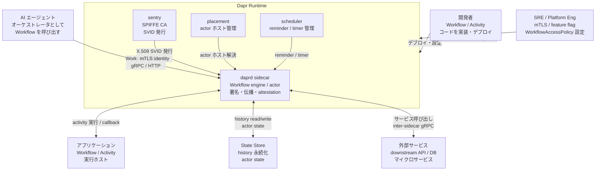
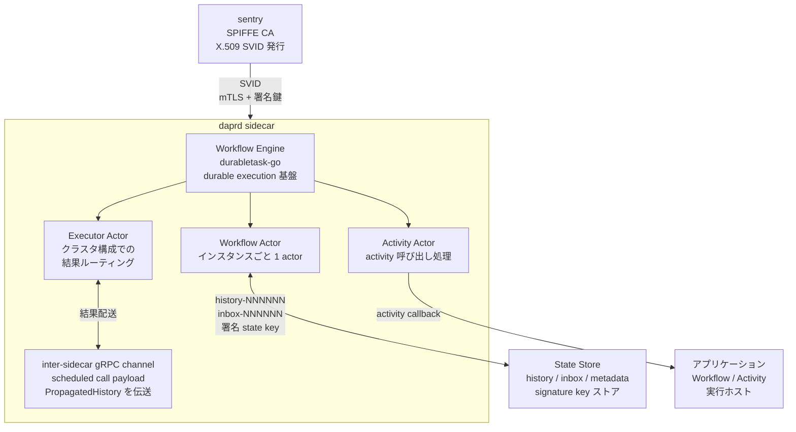
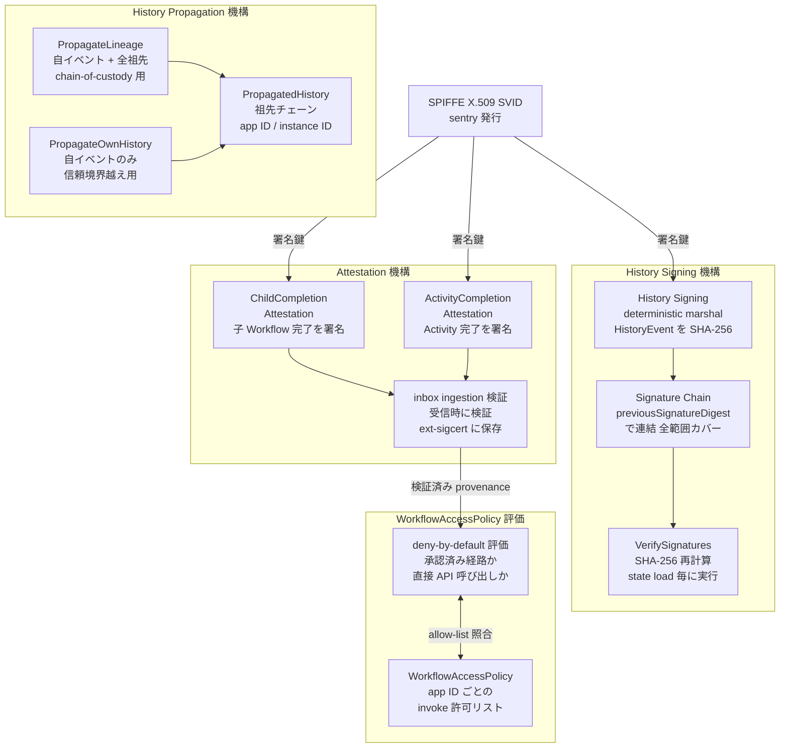
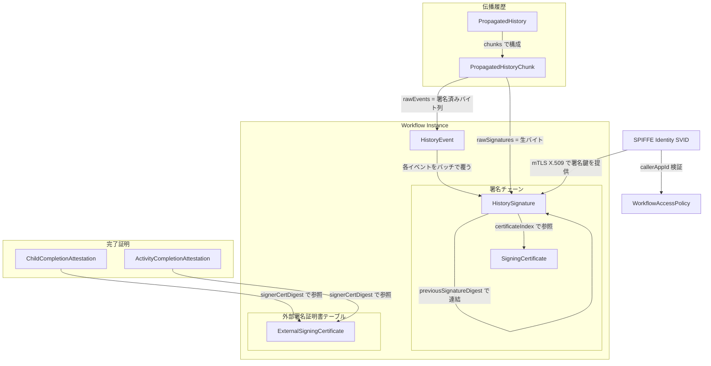
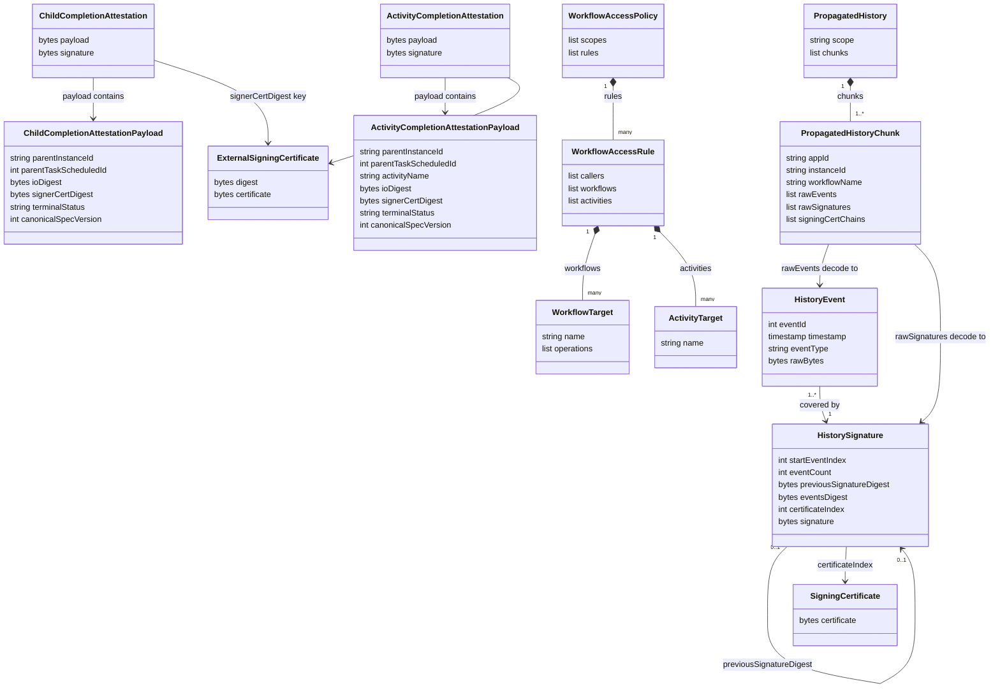

> 調査日: 2026-06-12 / 対象バージョン: Dapr v1.18.0 GA(2026-06-10 リリース)
> 起点: CNCF Blog "Introducing Verifiable Execution in Dapr 1.18"(2026-06-11)

AI エージェントを承認フロー・決済・医療・金融といった本番業務に入れるとき、「実行ログを後から見られる」だけでは監査要件を満たせません。求められるのは「改ざんされていない実行履歴として証明できる」状態です。Dapr 1.18 はこの課題に対して「Verifiable Execution」という機能群を導入しました。本記事では、その実体である 3 つの暗号機能の仕組み・データモデル・構築運用方法を、一次ソース(リリースノート・proto 定義・実装コード)と照合しながら整理します。

## 概要

Dapr 1.18 は「Verifiable Execution」と総称される一連の機能を導入しました。これは CNCF Blog のマーケティング上の傘ラベルであり、実体は **Workflow 実行履歴に対する 3 つの暗号機能**です。

| 機能名 | 一言説明 |
|---|---|
| Workflow History Signing(履歴署名) | 各 HistoryEvent を暗号署名し、前イベントの署名に連鎖させます。state ロード時に署名チェーンを検証し、改ざんをその場で検知します |
| Workflow History Context Propagation(履歴伝播) | ワークフローが実行履歴の一部を子ワークフロー/アクティビティに引き渡します。子は state store を読み返さずに「どこから来た仕事か」を知れます |
| Workflow Attestation(完了の証明) | 子ワークフロー/アクティビティが親へ結果を返す前に完了内容を署名し、親が受信時に検証します。「承認済みワークフロー経由か、直接 API 呼び出しか」を区別できます |

これら 3 機能は SPIFFE ベースのワークロードアイデンティティ(Dapr が sentry を CA として内蔵)の上に乗ります。

- **SPIFFE** — 「あなたは誰か(Who are you?)」に答えます。SPIFFE ID を X.509 SVID に埋め込み、mTLS でワークロードの身元を保証します
- **Verifiable Execution** — 「どうやってここに来たか(How did you get here?)」に答えます。ワークフローの実行系統(execution lineage)を署名付き・検証可能な形で request 経路に乗せます

SPIFFE が「Who」を担保し、Verifiable Execution が「How」を担保することで、ワークフローオーケストレータ・アクティビティ・サービス・AI エージェント・外部システムをまたぐ信頼の連鎖が成立します。

### 重要な前提

履歴署名は **v1.18 ではデフォルト無効の feature flag(`WorkflowHistorySigning`)** であり、有効化には **mTLS が必須**です。GA リリースに同梱されていますが「オプトインで明示的に有効化する」機能です(プレビュー/アルファではありません)。

## 特徴

### 「観測」と「証明」の差

実行の「観測」と「証明」は異なる概念です。

- **観測**: 何が起きたかを後から「見る」。可視化・デバッグが目的
- **証明**: 改ざんされていない実行履歴を暗号学的に「示す」。監査・規制対応が目的

従来の分散システム観測・記録手段が「証明」に向かない理由を以下に示します。

| 手段 | 何をするか | 証明にならない理由 |
|---|---|---|
| OpenTelemetry trace/span | 実行を相関させて観測する | W3C Trace Context 仕様が「相関メタデータであり署名されない/検証用ではない」と明言。span はストレージ保持者が検知されずに改変・削除・並べ替えできる |
| 監査ログ(audit log) | 何が起きたかを記録する | ログ自体の完全性は別途担保が要る。「ログで見える」は「改ざんされていない履歴として証明できる」とは別 |
| SPIFFE/SPIRE の SVID | ワークロードの身元を保証する | 身元(Who)は答えるが、実行の経路・順序(How)は SVID に含まれない |

### 既存の来歴証明技術との比較

Verifiable Execution は新規発明ではなく、既存技術を「ランタイムの request 経路」へ適用・統合した再構成です。

| 比較技術 | 何を保証するか | 署名の有無 | ランタイムか静的成果物か | 透明性ログ |
|---|---|---|---|---|
| in-toto | CI/CD 各工程の実行者・順序の来歴連鎖 | あり(DSSE / functionary 署名) | 静的成果物(ビルド時) | なし(layout+link の照合) |
| SLSA | ビルド成果物の保証レベル(L0–L3) | L2+ でプロビナンス署名あり | 静的成果物(ビルド時) | Sigstore 連携で任意 |
| Sigstore / Rekor | 署名イベントの否認防止・時間的検証 | あり(cosign + Fulcio 短命証明書) | 静的成果物(ビルド時) | あり(Rekor: append-only 公開台帳) |
| OpenTelemetry Trace Context | 分散 request の相関観測 | なし(W3C spec が明言) | ランタイム(request 時) | なし |
| 監査ログ | 実行イベントの事後記録 | ストレージ依存(通常なし) | ランタイム(事後) | なし(別途 append-only ストレージが必要) |
| **Dapr Verifiable Execution** | **ランタイム request 経路上での実行系統の改ざん検知・来歴証明** | **あり(SPIFFE X.509 SVID で署名・チェーン連結)** | **ランタイム(request 時・実行前検証)** | **なし(現状、公開透明性ログの言及なし)** |

Dapr 固有の前進は、これらを「ビルド時の静的な成果物(artifact)」の世界から「**分散ランタイムの動的な request**」の世界へ移し、SPIFFE の Who と実行来歴の How を 1 本の request 経路上で連結して、**実行前に deny-by-default で検証できる**点にあります。

### 規制ドライバ — EU AI Act 高リスク

この機能が直接刺さる文脈は **EU AI Act の高リスク AI システム要件(2026-08-02 全面適用)** です(本記述は Diagrid/EY 等の解説に基づく二次情報であり、条文番号は本調査で一次確認していません)。EU AI Act 高リスク AI は、運用ライフタイム全体の自動イベント記録と 6 ヶ月以上の保持、tamper-evident なレコード、attestation、特定のモデル版・プロンプト版・ポリシー設定・人間オーナーへの帰責可能性を要求するとされます。

CNCF Blog が挙げる具体的なユースケースは次の通りです。

- 銀行の送金が「承認済み決済ワークフロー」由来であることを検証してから実行する
- 医療の請求処理が払い戻し前に実行履歴を検証する
- 製薬の製造がワークフロー系統で品質管理サインオフを強制する
- 病院の AI システムが投薬推奨を「認可された臨床ワークフロー」由来であることを検証する

いずれも「**誰がやったか**だけでなく、**どのワークフローを通ってその操作に至ったか**を検証可能にする」要求です。

### 主要な特徴

- **実行系統の暗号署名**: 各 HistoryEvent を protobuf deterministic marshaling → SHA-256 → SPIFFE X.509 SVID で署名し、`previousSignatureDigest` でチェーン連結します
- **改ざん検知のタイミング**: 署名検証は state をロードするたびに実行されます。改ざんは「読み込んだ瞬間」に検知されてワークフローを terminate します
- **来歴の伝播**: 実行系統(app ID / instance ID / name + 実行した activities・child workflows の実行順チェーン)を inter-sidecar gRPC channel の payload に乗せて子へ引き渡します
- **実行前の検証**: 受信側が伝播された署名済み provenance を暗号検証し、「承認済みワークフロー由来か直接 API 呼び出しか」を実行前に判定できます
- **WorkflowAccessPolicy による deny-by-default**: どの application ID がどのワークフロー/アクティビティを invoke できるかを制御し、attestation と組み合わせて承認済み経路以外を拒否します
- **GA 同梱の opt-in**: v1.18 に正式同梱ですが、履歴署名は `WorkflowHistorySigning` feature flag を明示的に有効化する必要があります。有効化には mTLS + Sentry が前提です
- **片方向コミットメント**: 署名有効で開始した workflow は以後ずっと署名有効ホストで動かす必要があります。途中で無効化すると hard verification error になります。後追い署名(catch-up signing)は存在しません
- **言語 SDK 横断の互換性**: canonical input/output digest は NFC 正規化した符号化で生成されるため、Go / Java / Python / .NET など言語 SDK が違っても digest が安定します

### 境界と留意点

- 証明できる範囲は「Dapr が観測した履歴の改ざん検知」に限られます。sidecar の外で起きた行為・入力データそのものの真正性・アクティビティが嘘の結果を返すこと・下流が検証をスキップすることは保証外です
- 現状の公開記述では第三者が独立に監査できる外部透明性ログ(Rekor 相当)への言及がありません。「tamper-evident」は署名チェーンによる改変検知であり、ストレージ層の不変性(immutability)とは別概念です
- Dapr Workflow を採用しているシステムにしか効きません

## 構造

### システムコンテキスト図



#### システムコンテキスト — 要素一覧

| 要素名 | 説明 |
|---|---|
| 開発者 | Workflow / Activity のコードを実装し、Dapr sidecar 付きアプリをデプロイする役割 |
| SRE / Platform Eng | mTLS・feature flag(`WorkflowHistorySigning`)・WorkflowAccessPolicy を Kubernetes Configuration CRD で設定する役割 |
| AI エージェント | オーケストレータ役として gRPC / HTTP で Workflow を呼び出す主体。Verifiable Execution の主要ユースケース |
| daprd sidecar | Workflow engine・actor 管理・署名・履歴伝播・attestation 検証の中核。各アプリに 1 対 1 で配置 |
| sentry | SPIFFE CA として機能し、各 daprd sidecar に X.509 SVID を発行する基盤。mTLS と履歴署名の両方の鍵基盤 |
| placement | actor のホスト割り当てを管理する Dapr システムサービス |
| scheduler | durable timer / actor reminder を管理する Dapr システムサービス |
| アプリケーション | Workflow / Activity の実際のコードを実行するホスト。daprd が callback して activity を起動 |
| State Store | workflow の history(append-only イベントログ)と actor state を永続化する外部ストア。actor 操作対応の transactional ストアが必須 |
| 外部サービス | downstream API・DB・他マイクロサービス。inter-sidecar gRPC 経由でサービス呼び出しされる対象 |

### コンテナ図



#### コンテナ図 — daprd sidecar 内部

| 要素名 | 説明 |
|---|---|
| Workflow Engine(durabletask-go) | durable execution の基盤ライブラリ。Dapr internal actor を storage provider として使用。event-sourcing で history replay し実行状態を復元 |
| Workflow Actor | 走行中 workflow の state と placement を管理する actor。workflow インスタンスごとに 1 actor(actor ID = workflow ID) |
| Activity Actor | activity の呼び出しを処理する短命な actor。アプリへ callback して activity コードを実行し結果を返却 |
| Executor Actor | クラスタ構成での完了結果ルーティングを担う第 3 の actor type |
| inter-sidecar gRPC channel | sidecar 間の通信路。scheduled call payload(protobuf field)に `PropagatedHistory` を乗せて伝送 |
| sentry | SPIFFE CA。daprd sidecar に X.509 SVID を発行。mTLS と履歴署名の共通鍵基盤。mTLS が無効だと署名有効での daprd 起動を拒否 |
| State Store | `history-NNNNNN`(append-only イベントログ)・`inbox-NNNNNN`・`customStatus`・`metadata` を永続化。署名 state key(`signature-NNNNNN` 等)も格納 |
| アプリケーション | Workflow / Activity の実装コードを持つホスト。Activity Actor が callback して実行させる対象 |

### コンポーネント図



#### コンポーネント図 — History Signing 機構

| 要素名 | 説明 |
|---|---|
| History Signing | `HistoryEvent` を protobuf deterministic mode でマーシャルして安定バイト列を生成し、SHA-256 ダイジェスト化。同バイト列を署名対象かつ state store 保存対象とする処理 |
| Signature Chain | `previousSignatureDigest` で署名を連鎖させるチェーン構造。連続するイベント範囲をバッチで覆い、index 0 から末尾までの全範囲カバレッジを保証 |
| VerifySignatures | `pkg/runtime/wfengine/historyverify/` に実装。state load のたびにチェーンを辿り、SHA-256 再計算・チェーン連結・証明書署名検証・全範囲カバレッジチェックを実行 |

#### コンポーネント図 — History Propagation 機構

| 要素名 | 説明 |
|---|---|
| PropagateLineage | 呼び出し元自身のイベントと、親から継承した全祖先チェーンを子へ伝播。chain-of-custody での標準選択 |
| PropagateOwnHistory | 自分のイベントのみを伝播し、祖先チェーンを除外。信頼境界を越えて低信頼アプリへ渡す際の選択 |
| PropagatedHistory | 伝播される protobuf メッセージ。実行順の祖先 workflow チェーンを保持し、各要素が app ID / instance ID / name と実行した activities・child workflows を保持 |

#### コンポーネント図 — Attestation 機構

| 要素名 | 説明 |
|---|---|
| ChildCompletionAttestation | 子 Workflow の完了時に生成する署名。parent instance ID / parent task scheduled ID / canonical input-output SHA-256 digest / signer 証明書チェーン digest / terminal status にコミット |
| ActivityCompletionAttestation | Activity の完了時に生成される署名。parent task scheduled ID と canonical input-output digest にコミットし、言語 SDK 横断で安定した digest を保証 |
| inbox ingestion 検証 | 親 Workflow が inbox でメッセージを受信する際に attestation を検証。外部 signer の証明書を `ext-sigcert` テーブルへ証明書チェーン digest をキーとして保存 |

#### コンポーネント図 — WorkflowAccessPolicy 評価

| 要素名 | 説明 |
|---|---|
| WorkflowAccessPolicy | どの application ID がどの Workflow / Activity を invoke できるかを宣言する新リソース |
| deny-by-default 評価 | attestation で検証された provenance と WorkflowAccessPolicy の allow-list を照合し、承認済み経路由来か直接 API 呼び出しかを判定。ポリシーが 1 つ以上ロードされると未承認経路を拒否 |

## データ

### 概念モデル



### 情報モデル



#### 主要エンティティの補足

| エンティティ | 補足 |
|---|---|
| HistoryEvent | state store に `history-NNNNNN` キーで protobuf deterministic bytes として永続化。この永続化バイト列が `HistorySignature.eventsDigest` の入力 |
| HistorySignature | `startEventIndex` と `eventCount` でカバー範囲を表現。`previousSignatureDigest` は **直前の `HistorySignature` メッセージ全体を deterministic serialize した protobuf バイト列の SHA-256**(署名バイトだけでなく範囲・digest・証明書 index を含むメッセージ全体に連鎖。チェーン先頭では空)。`signature` は `SHA-256(previousSignatureDigest ‖ eventsDigest)` を秘密鍵で署名。保存キーは `signature-NNNNNN`。署名アルゴリズムは証明書の鍵型で決定(v1.18 の Sentry 既定は Ed25519、ほか ECDSA / RSA PKCS#1 v1.5)※実装から確認 |
| SigningCertificate | 自 sidecar の DER-encoded X.509 cert chain。保存キーは `sigcert-NNNNNN`。証明書ローテーション時のみ新規エントリを追加 |
| ExternalSigningCertificate(ext-sigcert) | 外部 signer から attestation とともに受信した cert chain。`digest`(SHA-256)を検索キーに保存(`ext-sigcert-NNNNNN`)。ContinueAsNew 時にリセット、purge 時にクリア |
| ChildCompletionAttestationPayload | v1.18.0 リリースノート明記の一次フィールド: parentInstanceId / parentTaskScheduledId / ioDigest(NFC 正規化 canonical SHA-256)/ signerCertDigest / terminalStatus。`canonicalSpecVersion` は実装から確認 |
| ActivityCompletionAttestationPayload | Child 構造に `activityName` を追加(activity には binding イベントが無いため名前を明示)。terminalStatus は `COMPLETED` / `FAILED` のみ |
| WorkflowAccessPolicy | CRD。`scopes`(対象 app ID)+ `rules`(callers / workflows / activities / operations)で allow-list を記述。`operations` は workflow ルール側のみ、activity ルールは `name` のみ |
| PropagatedHistory / Chunk | `scope` は `NONE`(default)/ `OWN_HISTORY` / `LINEAGE`。Chunk は単一 app が署名した自己完結パケット(rawEvents / rawSignatures / signingCertChains)で、受信側がチャンク単位で leaf SPIFFE ID と trust anchor を検証 |

## 構築方法

### 前提パラメータ

| 項目 | 内容 | 備考 |
|---|---|---|
| Dapr ランタイム | 1.18.0 以上 | `dapr --version` で確認 |
| mTLS | 必須・有効化済み | Sentry が SPIFFE X.509 SVID を発行する前提 |
| Sentry | 稼働必須 | SVID 発行元。mTLS を切ると daprd が署名有効で起動拒否 |
| Feature flag | `WorkflowHistorySigning` | デフォルト無効。Configuration CRD で明示的に有効化 |
| State store | actor 対応の transactional store 必須 | PostgreSQL / Redis / MongoDB 等 |
| SDK(Propagation) | Go / Java / Python / .NET 対応 | 各 SDK の history-propagation 例を参照 |

### バージョン確認

```bash
dapr --version
# CLI version: 1.18.0
# Runtime version: 1.18.0
```

Kubernetes 上のランタイムバージョンは `kubectl get pods -n dapr-system` で sidecar イメージタグを確認します。

### Dapr init / Kubernetes インストール

```bash
# セルフホスト (ローカル開発)
dapr init --runtime-version 1.18.0

# Kubernetes (Helm)
helm repo add dapr https://dapr.github.io/helm-charts/
helm repo update
helm upgrade --install dapr dapr/dapr \
  --namespace dapr-system \
  --create-namespace \
  --set global.tag=1.18.0 \
  --set dapr_sentry.enabled=true \
  --set global.mtls.enabled=true
```

mTLS は `global.mtls.enabled=true`、Sentry は `dapr_sentry.enabled=true` で有効化します。既存 CA を使う場合は `dapr_sentry.tls.issuer.*` で外部 CA を指定します(詳細は公式 Helm values を参照)。

### WorkflowHistorySigning feature flag を有効化

デフォルト無効です。Configuration リソースに feature flag を追加します。mTLS が無効の状態で有効化すると daprd は起動を拒否します。

```yaml
# signing-config.yaml
# 出典: go-sdk/examples/workflow-history-propagation/k8s/signing-config.yaml
apiVersion: dapr.io/v1alpha1
kind: Configuration
metadata:
  name: signing
  namespace: default
spec:
  features:
  - name: WorkflowHistorySigning
    enabled: true
```

アプリの Pod にアノテーションで紐付けます。

```yaml
annotations:
  dapr.io/enabled: "true"
  dapr.io/config: "signing"
```

### 片方向コミットメントの注意(有効化前の必須作業)

署名は **有効化したら後戻りできない一方向の決定**です。

- 署名有効で起動したホストにロードされた未署名 workflow → 起動拒否(fail)
- 署名無効ホストにロードされた署名済み workflow → 起動拒否(fail)
- 既存イベントへの後追い署名(catch-up signing)は存在しない

有効化手順は次の通りです。

1. 新規インスタンスの作成を停止する
2. 進行中の未署名 workflow をすべて完了させるか purge する
3. 未署名 workflow がゼロになったことを確認してから `enabled: true` に切り替える

## 利用方法

### Workflow History Propagation — SDK API(opt-in per call)

Propagation は **per-call のオプトイン**です。設定ファイルへの追加は不要で、SDK の呼び出しオプションで指定します。

#### Go SDK

```go
// プロデューサ: 全祖先チェーンを子へ伝播 (chain-of-custody の主な選択)
ctx.CallChildWorkflow(FraudDetection,
    workflow.WithChildWorkflowInput(req),
    workflow.WithHistoryPropagation(workflow.PropagateLineage()),
)

// 自分のイベントのみ伝播 (trust boundary を越えて低信頼アプリへ渡す場合)
ctx.CallActivity(SettlePayment,
    workflow.WithActivityInput(req),
    workflow.WithHistoryPropagation(workflow.PropagateOwnHistory()),
)
```

```go
// コンシューマ: 伝播された履歴を受け取る
history := ctx.GetPropagatedHistory()  // *workflow.PropagatedHistory を返す
if history != nil {
    // クエリ API は (result, error) を返す
    wf, err := history.GetLastWorkflowByName("ProcessPayment")
    act, err2 := history.GetLastActivityByName("ValidateCard")
    _, _, _, _ = wf, err, act, err2
}
```

出典: `dapr/go-sdk` examples/workflow-history-propagation/main.go(公式 example 確認済み)

#### Java SDK

```java
import io.dapr.workflows.WorkflowTaskOptions;
import io.dapr.durabletask.HistoryPropagationScope;

// プロデューサ
WorkflowTaskOptions opts = WorkflowTaskOptions.propagateLineage();
// または WorkflowTaskOptions.propagateOwnHistory()
// または WorkflowTaskOptions.withHistoryPropagation(HistoryPropagationScope.LINEAGE)
ctx.callChildWorkflow(FraudDetectionWorkflow.class, input, opts);
```

```java
import io.dapr.durabletask.PropagatedHistory;
import java.util.Optional;

// コンシューマ
Optional<PropagatedHistory> history = ctx.getPropagatedHistory();
history.ifPresent(h -> {
    // h.getLastWorkflowByName("WorkflowName") 等で祖先を検索
});
```

出典: `dapr/java-sdk` の `WorkflowTaskOptions.java` / `WorkflowContext.java`(実コード確認済み)

#### Python / .NET SDK

Python は `python-sdk#1025`、.NET は `dotnet-sdk#1802` で実装されています。下記は v1-18 docs 準拠の形で、SDK コードの直接確認は未実施です(公式 docs 準拠、要 SDK コード確認)。

```python
# Python (公式 docs 準拠)
ctx.call_child_workflow(process_payment, input=order_json, propagation=wf.PropagationScope.LINEAGE)
history = ctx.get_propagated_history()
```

```csharp
// .NET (公式 docs 準拠)
var childOptions = new ChildWorkflowTaskOptions()
    .WithHistoryPropagation(HistoryPropagationScope.Lineage);
var history = ctx.GetPropagatedHistory();
```

### WorkflowAccessPolicy リソース

`WorkflowAccessPolicy` は Kubernetes CRD で、**どの app ID がどの workflow / activity を呼べるか**を allow-list で制御します。マッチするルールが無い場合は deny し、自アプリから自アプリへの呼び出しはポリシーをバイパスします。

```yaml
# orders-policy.yaml
# 出典: dapr/dapr v1.18.0 リリースノート記載例
apiVersion: dapr.io/v1alpha1
kind: WorkflowAccessPolicy
metadata:
  name: orders-policy
  namespace: production
scopes:
  - orders-target        # このポリシーが適用される対象 app ID
spec:
  rules:
    - callers:
        - appID: frontend
        - appID: ops-console
      workflows:
        - name: OrderWF
          operations: [schedule, terminate]
```

操作一覧(`operations` に指定可能な値):

| 操作 | 内容 |
|---|---|
| `schedule` | 新規 workflow インスタンスの起動 |
| `terminate` | 実行中 workflow の強制終了 |
| `raise` | 外部イベントの送信 |
| `pause` | workflow の一時停止 |
| `resume` | 一時停止した workflow の再開 |
| `purge` | workflow の状態削除 |
| `get` | workflow の状態取得 |
| `rerun` | 終了した workflow の再実行 |

workflows は上記 8 操作、activities は `schedule` のみをサポートします。`name` には glob パターン(`*`, `?`, `[abc]`)を使えます。

出典: `dapr/dapr` pkg/apis/workflowaccesspolicy/v1alpha1/types.go(実コード確認済み)+ v1.18.0 リリースノート例

## 運用

### 署名のクラスタ全体有効化の段取り

履歴署名は一方向の決定のため、クラスタ全体で有効化する前に進行中の未署名ワークフローを完了または purge しておくことが必須です。

1. **新規スケジュールを停止**: 対象 appID への新規ワークフロー投入を止める
2. **進行中ワークフローを drain または purge**: 自然完了を待つか `dapr workflow purge` で強制終了する
3. **未署名 state の残存を確認**: 対象 appID の未署名 history が残っていないことを検証する
4. **Configuration を更新して feature flag を有効化**(Dapr はホットリロードするため sidecar 再起動は不要)
5. **新規スケジュールを再開**: 以後は署名付きインスタンスのみが投入される

並走戦略(低リスク): 旧 appID で未署名ワークフローを完了させつつ、新規ワークロードは別の appID(署名有効)で受け付けると移行ウィンドウを最小化できます。

### 署名検証エラーの監視と改ざん検知時の挙動

state がロードされるたびに `historyverify.VerifySignatures()` が以下を検証します。

| チェック | 検知できる改ざん |
|---|---|
| chain linkage(`previousSignatureDigest`) | 署名の並べ替え・挿入 |
| event contiguity(全範囲カバレッジ) | 歯抜け削除 |
| events digest(SHA-256 再計算) | イベントバイト列の書き換え |
| 署名の暗号検証 | 偽造署名 |
| 証明書の有効期間検証 | 失効証明書での署名 |
| signing app の SPIFFE identity 照合 | 別 appID による偽装署名 |

改ざん検知時(in-flight ワークフロー、dapr#9825 の実装)の挙動は次の通りです。

1. terminal `ExecutionCompleted` イベントがエラー種別 `DAPR_WORKFLOW_HISTORY_TAMPERED` で追記される
2. ワークフローは terminal 状態に移行し、以降の実行を停止する
3. 元の履歴・署名は変更せず保持する(フォレンジック解析用)
4. actor reminder が削除されリトライループを防ぐ
5. クライアントの query には `FAILED` ステータスで surfacing される

`daprd` は署名検証失敗時に error レベルのログをインスタンス ID + 失敗チェック名つきで出力します。ログ集約基盤で `DAPR_WORKFLOW_HISTORY_TAMPERED` をアラート化するのが現実解です(専用メトリクス名は v1.18 時点で未確認)。

### 鍵・証明書のライフサイクル

- **leaf cert(SVID)ローテーション**: ワークロード証明書 TTL のデフォルトは 24 時間(`workloadCertTTL` で変更可)。新しい証明書が来ると cert table に追記され、以前の署名は旧証明書に対して有効なまま残ります(透過処理)
- **`ext-sigcert` の蓄積**: 長寿命ワークフローは多数の leaf cert を蓄積する可能性があります。自動 GC の仕組みは公式 docs に記載がなく(未確認)、state store のサイズ監視を推奨します
- **root CA のローテーション**: 同一 root 鍵で issuer cert のみ更新するのが推奨(既存署名チェーンが有効なまま)。root 鍵を変更すると旧 root 下の全ワークフローが検証不能になるため、移行前に全 drain/purge が必要です。Sentry は root 失効 30 日前から毎時 warning ログを出力します。再署名パスは存在しません

### Scheduler の同時実行制限(v1.18 新機能)

Dapr 1.18 は scheduler レベルの global / per-name 同時実行制限を追加しました。全 scheduler レプリカ横断のクラスタ全体制限として機能し、上限到達時は drop せず back-pressure(キューイングして容量が空き次第ディスパッチ)します。グローバル上限は scheduler インスタンス間で決定論的に分割されます。

```yaml
# v1.18.0 リリースノートの例: spec.workflow 配下にネストする
apiVersion: dapr.io/v1alpha1
kind: Configuration
metadata:
  name: scheduler-limits
spec:
  workflow:
    globalMaxConcurrentWorkflowInvocations: 100
    globalMaxConcurrentActivityInvocations: 200
```

## ベストプラクティス

### どのワークフローから署名を有効化するか

署名のコストとリスクが非対称であることを前提に、高リスク経路を優先して段階導入します。

1. 規制・監査要件が直接かかる経路(金融取引承認・医療処置承認・製薬 QC サインオフ)
2. 重大な副作用を持つ操作(送金実行・発注・アクセス権変更)
3. AI エージェントが自律実行するが説明責任が求められる経路(EU AI Act 高リスク)
4. 直 API 呼び出しのバイパスを防ぎたい経路

純粋に内部的な低リスク集計や、レイテンシ要件がシビアなクリティカルパス(署名オーバーヘッドの公式ベンチ未公開のため未確認)は当面見送りも選択肢です。

### WorkflowAccessPolicy を deny-by-default で設計する

WorkflowAccessPolicy は純 allow-list 方式です。ポリシーが 1 つ以上ロードされると、そのアプリへのクロスアプリ呼び出しはデフォルト deny になります(未ロード状態は全許可で後方互換)。namespace 全体の default-deny ベースラインを宣言し、その上に最小権限の allow-list を積み重ねます。

- `scopes` を省略すると namespace 内の全アプリに適用される(意図しないブロックに注意)
- 自己呼び出し(同一 appID)は常に許可、クロスネームスペース呼び出しは常に deny
- ホットリロード対応(apply 後の sidecar 再起動不要)
- mTLS が無効だと caller identity の検証が機能しない(mTLS は前提)

### 既存の in-toto / SLSA / Sigstore / OTel との併用

Verifiable Execution は「ビルド時の来歴保証をランタイムへ延長する」位置づけで理解すると境界が明確になります。

```text
[ビルド時] in-toto (署名済み link) / SLSA (provenance L1-L4) / Sigstore-Rekor (透明性ログ)
   ↓ 「このバイナリが作られた経緯は証明済み」
[デプロイ時] SPIFFE/SPIRE: 「このワークロードは誰か (Who)」
   ↓ 「このサービスが誰かは証明済み」
[ランタイム] Dapr Signing/Propagation/Attestation/WorkflowAccessPolicy: 「実行系統が検証可能 (How)」
   ↓
[観測] OpenTelemetry: 「何が呼ばれたか」の相関 (改ざん耐性は別レイヤ)
```

- OTel trace/span は相関と観測に使い、改ざん検知の根拠にしません(W3C Trace Context はセキュリティ用途外と仕様に明記)
- Sigstore/Rekor への外部透明性ログ連携・DSSE エクスポートは v1.18 時点で公式言及がありません(未確認)。署名チェーンの改ざん検知は state store 上のローカル検証であり、独立した third-party ledger による否認防止は別途設計が必要です

### セキュリティ — GHSA-85gx-3qv6-4463

2026-04-16 に Dapr core で High の advisory(service invocation の path traversal による ACL bypass)が公開されました。影響範囲は 1.3〜1.17.4 で、パッチ版は 1.17.5 / 1.16.14 / 1.15.14 です。本記事の対象である **1.18.0 は修正を含むため直接の影響を受けません**。WorkflowAccessPolicy の allow-list は mTLS + Dapr ACL の上に乗るため、ACL バイパス脆弱性が残る旧バージョンでは policy が意味をなさない可能性があります。1.17 系以前を併用するなら patch 済みバージョンへの更新を強く推奨します。

## トラブルシューティング

| 症状 | 原因 | 対処 |
|---|---|---|
| `daprd` が起動しない(署名有効 + "mTLS is required") | `WorkflowHistorySigning: true` だが mTLS が無効(sentry 未稼働 or `mtls.enabled: false`) | Sentry の稼働を確認し `mtls.enabled: true` を設定。`kubectl -n dapr-system get pods` で healthy か確認 |
| 署名有効化後に既存ワークフローが `FAILED` になる | 未署名で開始したワークフローを署名有効ホストがロードした(後追い署名は不可) | `dapr workflow purge <instance-id>` で破棄し署名付きで再スタート。移行前の drain を遵守 |
| `DAPR_WORKFLOW_HISTORY_TAMPERED` で失敗する | history events の改ざん、または root CA が別鍵で更新されて旧署名が検証不能 | (改ざん)state store のバックアップと比較し forensic 解析。(CA 起因)旧 root 下を全 purge して新 CA で再スタート。再署名パスは無し |
| Propagation で上流履歴が取れない(`GetPropagatedHistory()` が nil) | 呼び出し元が per-call の propagation オプションを指定していない(default off) | producer に `WithHistoryPropagation(PropagateLineage())` を追加。SDK ごとのオプション名は各 SDK の example を参照 |
| Propagation payload が gRPC 上限(default 4 MB)超過 | `PropagateLineage()` で深い祖先チェーンが history を蓄積した | 信頼境界で `PropagateOwnHistory()` に切替えて ancestry を削減、または gRPC message size を増やす |
| history 肥大による rehydrate 遅延 | 長期稼働で history events が大量蓄積 + 署名エントリ加算 | `ContinueAsNew` で定期的に履歴をリセット(新インスタンスとして署名チェーン再開始)。state store の I/O をスケールアップ |
| WorkflowAccessPolicy が apply されない / 全拒否 | `scopes` 不正・allow ルール不足・mTLS 無効で caller identity 取得不可 | `kubectl get workflowaccesspolicy -n <ns>` で存在と `scopes` を確認。mTLS 有効を確認。クロスアプリ呼び出しに限定して検証 |

## まとめ

Dapr 1.18 の Verifiable Execution は、ワークフロー実行履歴の署名・来歴伝播・完了 attestation を SPIFFE 上に統合し、「実行系統を改ざん検知可能な形でランタイムに乗せる」層を埋める機能です。新しい暗号要素の発明ではなく、in-toto / SLSA / Sigstore が担ってきたビルド時の来歴保証を、分散ランタイムの request 経路へ deny-by-default で延長した点に価値があります。一方で署名はデフォルト無効の opt-in で、証明範囲は Dapr が観測した履歴に限られ、外部透明性ログや性能ベンチは現時点で未整備です。AI エージェントを規制領域に投入するチームは、まず高リスク経路から `WorkflowAccessPolicy` と署名を段階導入するのが現実的でしょう。

この記事が少しでも参考になった、あるいは改善点などがあれば、ぜひリアクションやコメント、SNSでのシェアをいただけると励みになります！

## 参考リンク

- Dapr 公式
  - [Dapr Runtime v1.18.0 リリースノート (2026-06-10 GA)](https://github.com/dapr/dapr/releases/tag/v1.18.0)
  - [Dapr docs v1-18 Workflow building block](https://v1-18.docs.dapr.io/developing-applications/building-blocks/workflow/)
  - [Dapr docs v1-18 Workflow History Signing](https://v1-18.docs.dapr.io/developing-applications/building-blocks/workflow/workflow-history-signing/)
  - [Dapr docs v1-18 Workflow History Propagation](https://v1-18.docs.dapr.io/developing-applications/building-blocks/workflow/workflow-history-propagation/)
  - [Dapr docs v1-18 WorkflowAccessPolicy schema](https://v1-18.docs.dapr.io/reference/resource-specs/workflow-access-policy-schema/)
  - [Dapr docs v1-18 mTLS / Security](https://v1-18.docs.dapr.io/operations/security/mtls/)
  - [Dapr services overview](https://docs.dapr.io/concepts/dapr-services/)
- GitHub(設計・実装)
  - [Dapr Proposal #102 (History Signing & Propagation 設計)](https://github.com/dapr/proposals/pull/102)
  - [dapr/dapr PR#9778 (Add workflow history signing for tamper detection)](https://github.com/dapr/dapr/pull/9778)
  - [dapr/dapr PR#9825 (Terminate tampered in-flight workflows)](https://github.com/dapr/dapr/pull/9825)
  - [dapr/dapr PR#9831 (Child workflow and activity attestation)](https://github.com/dapr/dapr/pull/9831)
  - [dapr/dapr WorkflowAccessPolicy types.go](https://github.com/dapr/dapr/blob/main/pkg/apis/workflowaccesspolicy/v1alpha1/types.go)
  - [durabletask-protobuf attestation.proto](https://github.com/dapr/durabletask-protobuf/blob/main/protos/attestation.proto)
  - [durabletask-protobuf backend_service.proto](https://github.com/dapr/durabletask-protobuf/blob/main/protos/backend_service.proto)
  - [durabletask-go api/propagation.go](https://github.com/dapr/durabletask-go/blob/main/api/propagation.go)
  - [go-sdk example: workflow-history-propagation](https://github.com/dapr/go-sdk/tree/main/examples/workflow-history-propagation)
  - [Java SDK WorkflowTaskOptions.java](https://github.com/dapr/java-sdk/blob/main/sdk-workflows/src/main/java/io/dapr/workflows/WorkflowTaskOptions.java)
  - [GHSA-85gx-3qv6-4463 (Dapr High / service invocation path traversal ACL bypass, 2026-04)](https://github.com/dapr/dapr/security/advisories)
- 関連エコシステム
  - [SPIFFE](https://spiffe.io/)
  - [in-toto](https://in-toto.io/)
  - [SLSA](https://slsa.dev/)
  - [Sigstore / Rekor](https://sigstore.dev/)
  - [W3C Trace Context](https://www.w3.org/TR/trace-context/)
  - [OpenTelemetry GenAI semantic conventions](https://opentelemetry.io/docs/specs/semconv/gen-ai/)
- 記事
  - [CNCF Blog "Introducing Verifiable Execution in Dapr 1.18" (2026-06-11)](https://www.cncf.io/blog/2026/06/11/introducing-verifiable-execution-in-dapr-1-18/)
