CNCF Blog（2026-07-03）「How data sovereignty is changing cloud native infrastructure design」を起点に、データ主権を「文書上の主張」から「プラットフォームによる技術的強制」へ移す参照アーキテクチャを、構造・データ・構築・利用・運用の観点で整理します。

## 概要

### この設計論が扱う課題

データ主権を Kubernetes と GitOps で強制する設計論は、主権を「データをどこに置くか」ではなく「そのデータに対する法的支配権を誰が持つか」の問題として捉え直します。CNCF Blog の中心的な主張は次の一文に集約されます。

> "The core issue isn't where your server sits. It's who can be compelled to hand over what's on it."
> （本質的な問題はサーバーの設置場所ではありません。誰がそのデータの提出を強制されうるか、です。）

### 背景にある規制動向

データ主権が技術設計の課題に格上げされた背景には、複数の規制の進展があります。

| 規制 | 制定主体 | 主権に関わる論点 |
|---|---|---|
| US CLOUD Act（2018年制定） | 米国 | 米国の法的手続きの対象となる事業者が、データを possession, custody, or control（占有・保管・支配）していれば、保存場所を問わず開示を強制できる。企業の法人格や親会社の所在は、この到達範囲を左右する補助要因になる |
| EU Cloud and AI Development Act（CADA、2026年6月3日 提案） | 欧州委員会 | 公共部門調達向けに「主権保証レベル」を導入し、インフラ所在地・所有権・運用支配・要員の国籍まで段階的に要求する |
| EU Data Act | EU | クラウド間の相互運用性を求め、事業者変更（ロックイン解消）の障壁を下げる |
| EU AI Act | EU | AI システムの追跡可能性・ガバナンス・説明責任を要求する |
| NIS2 / DORA | EU | サプライチェーン依存・運用レジリエンス・特定ベンダーへの集中リスクに焦点を当てる |

US CLOUD Act の要点は「到達範囲はデータの所在地でなく事業者の支配に従う」という点です。米国の法的手続きの対象となる事業者がフランクフルトでインフラを運営していても、データがその "possession, custody, or control"（占有・保管・支配）下にあれば、米国当局は開示を強制できます。EU の GDPR 第48条は、第三国当局による開示命令それ自体は国際協定に基づく場合にのみ EU 側で認識・執行できるとしています。ただし本条は Chapter V の他の移転根拠を直ちに排除する趣旨ではありません。この 2 つの法規は正面衝突とまでは言えないものの、強い緊張関係にあります。

EU CADA が提案する主権保証の段階は、報道・解説ベースで次のように整理されています。以下は提案内容の解説であり、一次資料（提案本文）の条文で確定した区分ではありません。最終的な区分は変わりうる点に注意します。

| レベル | 要求内容 |
|---|---|
| Level 1 | データのローカライゼーション（EU域内保存） |
| Level 2 | 第三国からの独立性の証明、ソフトウェアサプライチェーンの透明性 |
| Level 3 | EU域内での所有・支配、要員の国籍要件などの追加基準 |
| Level 4 | ソフトウェアサプライチェーンへの完全な透明性・支配、第三国からの干渉排除 |

これらの規制に共通するのは、要求範囲が「データの保存場所（residency）」から「運用支配・サプライチェーンの透明性・可搬性・レジリエンス」へと拡大している点です。

### 主権の再定義: geographic から jurisdictional へ

この設計論の核心は、主権を 3 つの異なる問いに分解することです。

| 問い | 性質 | 従来の誤解 |
|---|---|---|
| データはどこに保存されているか | geographic（地理的） | リージョンを選べば主権が確保できるという誤解の元 |
| 誰がそのデータへのアクセスを法的に強制されうるか | jurisdictional（法的支配） | 親会社の国籍・法人格に紐づき、リージョン選択では解決しない |
| 誰が実際にシステムを運用し、何が起きたかを検証できるか | 運用権限・監査可能性 | 契約書上の保証だけでは検証手段がない |

米国のハイパースケーラーがフランクフルトにインフラを構えていても、親会社が米国法人である以上、米国法の下にあります。したがって「EU リージョンを選ぶ」という対処は jurisdictional な問題を解決しません。この設計論はこの誤解を修正し、主権を「保存場所」でなく「法的支配権・運用権限・監査可能性」の問題として捉え直します。

## 特徴

### 従来アプローチとの比較

従来のコンプライアンスプログラムは、文書化・レビュー・手作業の確認に依存してきました。この設計論はそれを、プラットフォームが直接強制する仕組みへ転換します。

| 項目 | 従来アプローチ（compliance-as-documentation） | 主権強制アプローチ（Kubernetes + GitOps） |
|---|---|---|
| 主権の確保手段 | 契約書・SLA によるガバナンス保証 | アドミッションコントローラー・ノードアフィニティ・ポリシーエンジンによる技術的強制 |
| 地理的対応 | リージョン選択のみ | リージョン選択 + 法的支配・運用主体の分離 |
| 検証タイミング | 定期監査・レビュー時（事後・スポット） | デプロイ前のポリシー評価 + 継続的な自動照合（常時） |
| 変更管理 | 手作業の承認フロー・文書更新 | Git のコミット履歴・ピアレビュー・CI パイプライン |
| 監査証跡 | 文書・チェックリスト | 「特定時点で何が稼働していたか」を Git 履歴から再現可能 |
| スケーラビリティ | ワークロード数の増加に人的確認が追いつかない | 数千ワークロード規模でも自動的・継続的に強制される |
| 主権の対象範囲 | データ保存場所（residency） | 法的支配・サプライチェーン透明性・可搬性・運用レジリエンス |

### なぜ「主張」から「強制」への転換が起きているか

転換の理由はスケーラビリティです。数千のワークロードにまたがる主権要件を、人手による確認だけで担保することはできません。GitOps を組み合わせることで、次のことが自動的に実現します。

- すべての変更が Git 上でバージョン管理される
- 変更はピアレビューと CI パイプラインで検証されてから適用される
- 主権要件はデプロイのたびに自動的・継続的に強制される
- 「ある時点で何が稼働していたか」がコミット履歴から監査可能になる

CNCF Blog は最終的な問いを次のように提示しています。

> "The question is whether sovereignty remains something organizations document, or something their platforms can enforce."
> （問いは、主権が組織が文書化するものであり続けるか、プラットフォームが強制できるものになるか、です。）

### この設計論が実現する範囲

- 主権要件を「文書上の主張」から「プラットフォームによる技術的強制」へ移す
- リージョン選択だけでは解決しない法的支配（jurisdictional control）の問題に対処する
- サプライチェーンの透明性・運用主体の分離・要員国籍まで含む、拡張された主権の定義に対応する
- 監査を「事後のレビュー」から「常時検証可能な状態」に変える
- AI 学習インフラなど新たな領域（フェデレーション学習など、データを移動させず学習だけを分散実行する設計）にも主権の考え方を拡張する

なお、主権の強調は「集中・効率化」というクラウドネイティブの従来の潮流とは逆方向に働きます。

> "Sovereignty is pushing in the opposite direction: more regional control, greater transparency, and stronger operational ownership."
> （主権は逆方向に作用します。より強いリージョン単位の支配、より高い透明性、より強固な運用上の所有権です。）

## 構造

データ主権を強制するプラットフォームの構造を、C4 model の 3 段階で示します。システムコンテキスト図でアクターと外部システムを整理し、コンテナ図でプラットフォーム内の主要コンテナを整理し、コンポーネント図でコンテナ内部の具体的な実装コンポーネントを整理します。

### システムコンテキスト図

データ主権プラットフォームは、4 種類のアクターと 3 種類の外部システムに接続します。

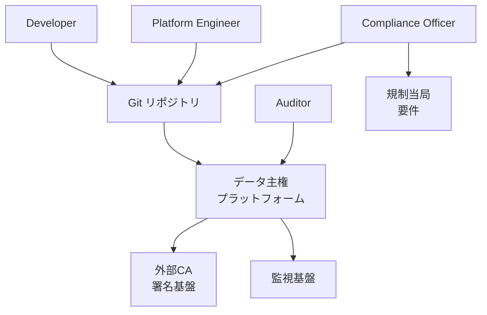

#### 要素一覧

| 要素名 | 説明 |
|---|---|
| Platform Engineer | プラットフォーム基盤設定を運用するアクターです |
| Compliance Officer | 規制要件をポリシーに翻訳するアクターです |
| Auditor | 監査ログを照会するアクターです |
| Developer | アプリケーション manifest を作成するアクターです |
| データ主権プラットフォーム | 主権要件をアーキテクチャで強制する本システムです |
| Git リポジトリ | 共有設定と jurisdiction 別 overlay を保持する外部システムです |
| 規制当局要件 | 準拠すべき法規制を定義する外部システムです |
| 外部CA署名基盤 | コンテナイメージや成果物の署名を検証する外部システムです |
| 監視基盤 | プラットフォームのメトリクスとログを集約する外部システムです |

### コンテナ図

プラットフォーム内部は 6 つの主要コンテナで構成されます。

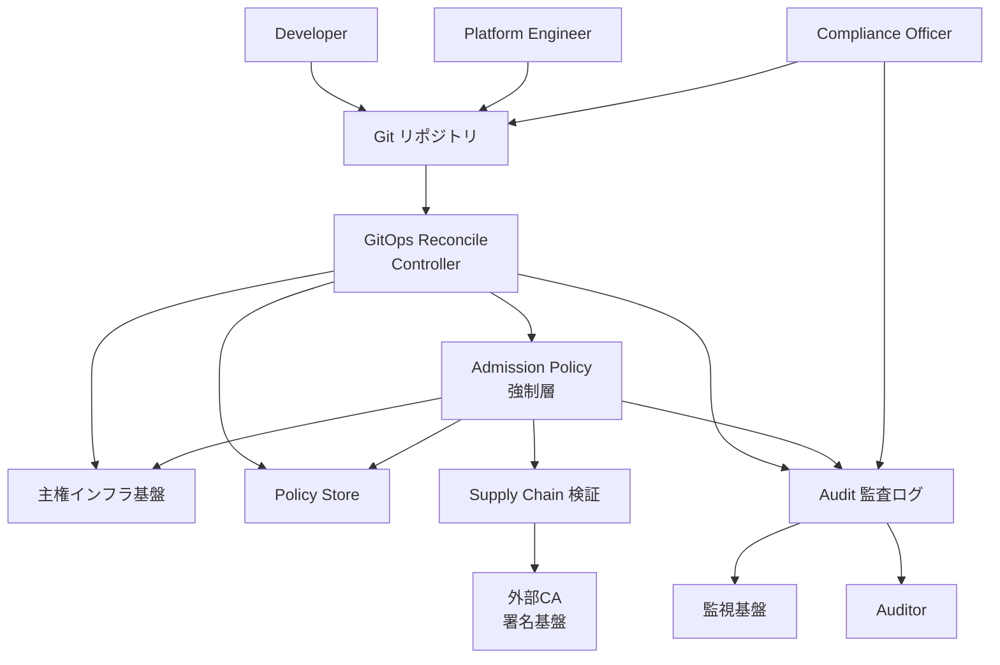

#### 要素一覧

| 要素名 | 説明 |
|---|---|
| Admission Policy 強制層 | 全 API リクエストを主権要件で評価し非準拠を拒否するコンテナです |
| GitOps Reconcile Controller | Git の desired state を各クラスタへ継続的に適用するコンテナです |
| 主権インフラ基盤 | compute storage network identity を組織支配下で提供するコンテナです |
| Policy Store | 適用対象のポリシー定義を保持するコンテナです |
| Audit 監査ログ | 評価結果と reconcile 履歴を記録するコンテナです |
| Supply Chain 検証 | イメージや成果物の署名を検証するコンテナです |
| Developer | アプリケーション manifest を Git に commit するアクターです |
| Platform Engineer | 基盤設定を Git に commit するアクターです |
| Compliance Officer | ポリシー overlay を Git に commit し監査ログを参照するアクターです |
| Auditor | Audit 監査ログを照会するアクターです |
| Git リポジトリ | 共有設定と jurisdiction 別 overlay を保持する外部システムです |
| 外部CA署名基盤 | 署名検証を担う外部システムです |
| 監視基盤 | ログとメトリクスの転送先となる外部システムです |

### コンポーネント図

各コンテナをドリルダウンし、具体的な実装コンポーネントを示します。

#### Admission Policy 強制層

kube-apiserver の admission chain を起点に、複数の policy engine が並列に評価します。

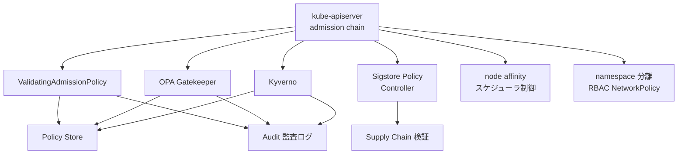

##### 要素一覧

| 要素名 | 説明 |
|---|---|
| kube-apiserver admission chain | 全リクエストを admission 評価に通す入口です |
| ValidatingAdmissionPolicy | CEL 式でインプロセス評価する宣言型ポリシーです |
| OPA Gatekeeper | ConstraintTemplate と Constraint で validating webhook を実装します |
| Kyverno | Kubernetes リソースそのものでポリシーを記述する policy engine です |
| Sigstore Policy Controller | 画像署名の検証を強制する admission webhook です |
| node affinity スケジューラ制御 | ワークロードを承認済み jurisdiction のノードに限定します |
| namespace 分離 | RBAC と NetworkPolicy でテナント・地域の境界を設けます |

#### GitOps Reconcile Controller

Git を単一の真実源とし、各コントローラが jurisdiction 別 overlay を継続的に reconcile します。

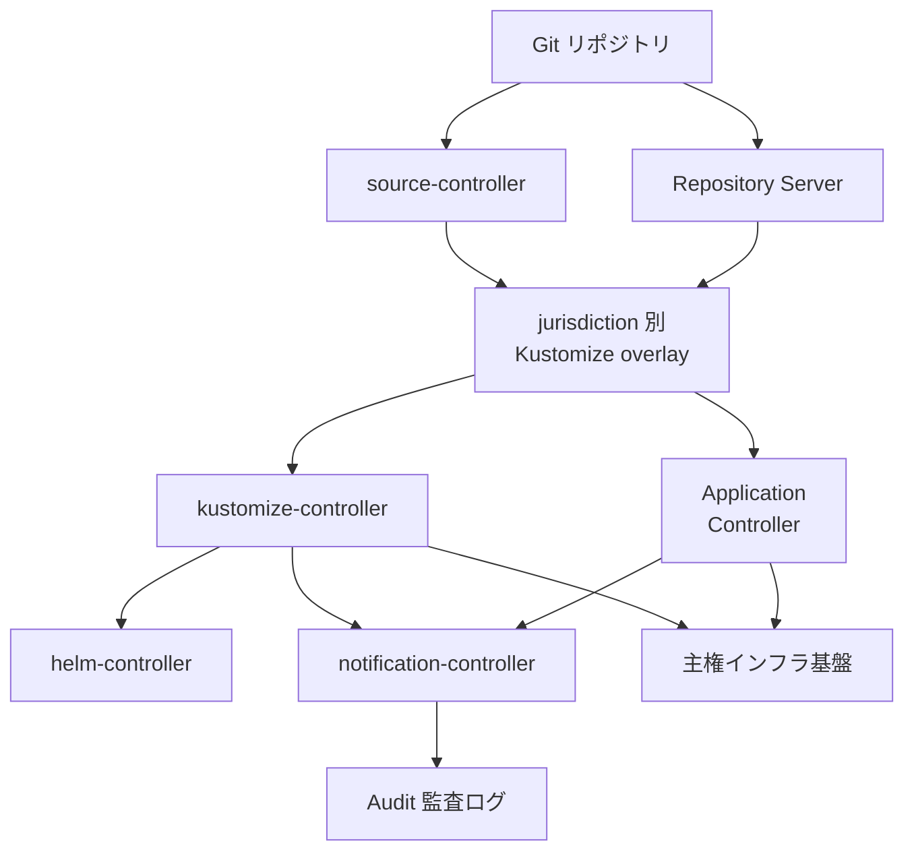

##### 要素一覧

| 要素名 | 説明 |
|---|---|
| source-controller | Flux で Git artifact を取得しキャッシュするコンポーネントです |
| Repository Server | ArgoCD で Git マニフェストを生成し返却するコンポーネントです |
| jurisdiction 別 Kustomize overlay | 共有設定に地域固有差分を重ねる overlay です |
| kustomize-controller | Flux で Kustomize overlay を適用する reconciler です |
| Application Controller | ArgoCD で live state と target state を比較適用するコンポーネントです |
| helm-controller | Helm release を宣言的に管理する reconciler です |
| notification-controller | reconcile イベントを外部へ通知するコンポーネントです |

#### 主権インフラ基盤

OpenStack のコンポーネント群と Ceph（独立プロジェクト）が compute storage network identity を組織支配下に置きます。

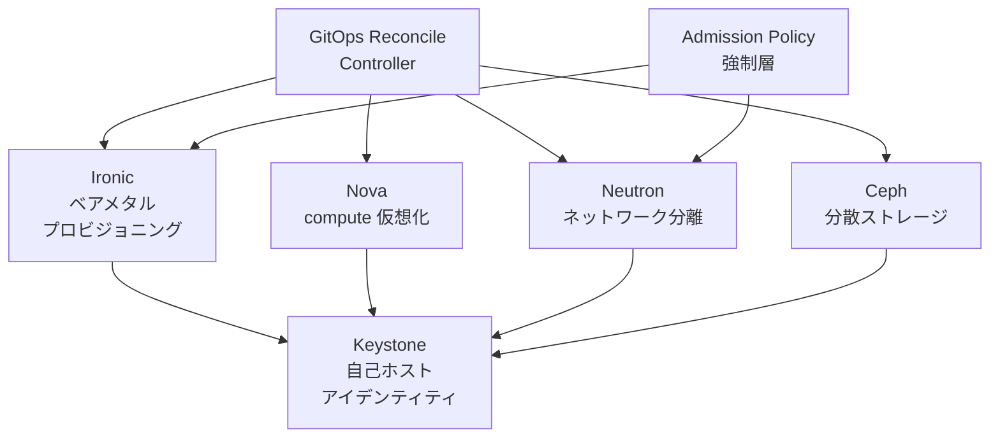

##### 要素一覧

| 要素名 | 説明 |
|---|---|
| Ironic | 所有権を保持したままベアメタルをプロビジョニングします |
| Nova | 承認インフラ上で compute リソースを仮想化します |
| Neutron | オペレータ管理下でネットワークを分離します |
| Ceph | 組織支配下の分散ストレージを提供します |
| Keystone | 自己ホスト型でアイデンティティ認証を行います |

#### Policy Store

jurisdiction 別 overlay に含まれるポリシー定義が、各 policy engine の CRD として etcd に保持されます。

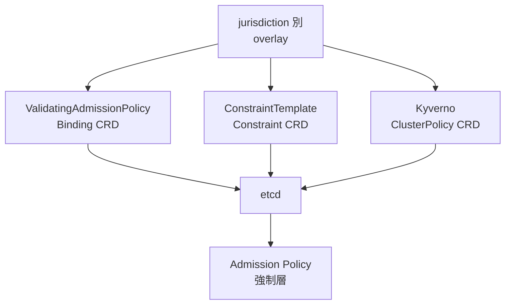

##### 要素一覧

| 要素名 | 説明 |
|---|---|
| jurisdiction 別 overlay | GitOps で同期されたポリシーの overlay です |
| ValidatingAdmissionPolicyBinding CRD | CEL ポリシーとパラメータを結合する CRD です |
| ConstraintTemplate Constraint CRD | Gatekeeper のポリシーテンプレートと適用インスタンスです |
| Kyverno ClusterPolicy CRD | Kyverno のポリシー定義 CRD です |
| etcd | Kubernetes API の状態を永続化するストレージです |

#### Supply Chain 検証

Sigstore のコンポーネント群が、署名済み成果物のみを許可します。

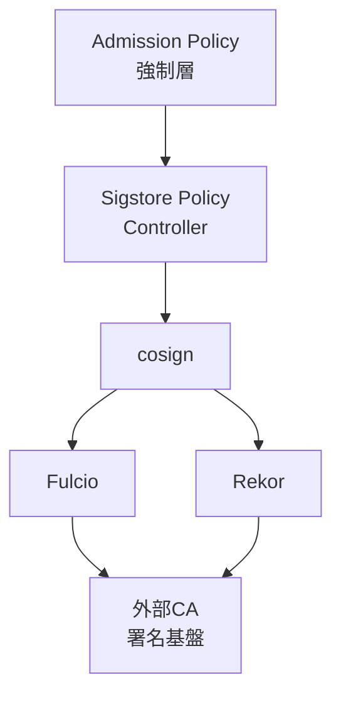

##### 要素一覧

| 要素名 | 説明 |
|---|---|
| Sigstore Policy Controller | 署名検証結果を admission に反映する webhook です |
| cosign | コンテナイメージや成果物に署名と検証を行うツールです |
| Fulcio | 短命証明書を発行する証明書発行局です |
| Rekor | 署名記録を残す改ざん検知可能な透明性ログです |

#### Audit 監査ログ

複数のログ源を集約し、監視基盤と Auditor に提供します。

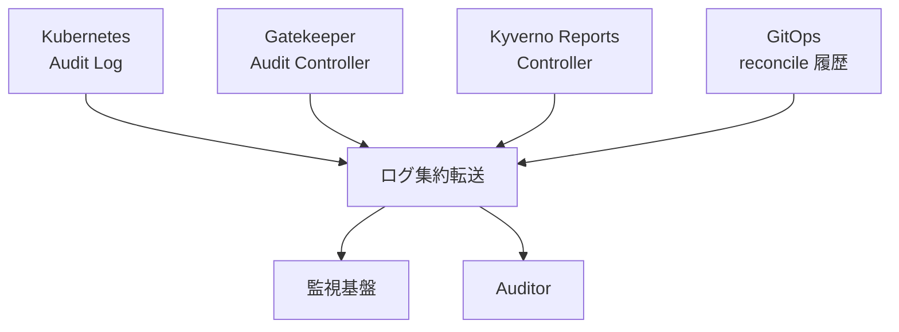

##### 要素一覧

| 要素名 | 説明 |
|---|---|
| Kubernetes Audit Log | API リクエストの評価結果を記録するログです |
| Gatekeeper Audit Controller | 既存リソースの違反を定期監査するコンポーネントです |
| Kyverno Reports Controller | PolicyReport として違反状況を出力するコンポーネントです |
| GitOps reconcile 履歴 | Git commit と適用結果の対応を記録した履歴です |
| ログ集約転送 | 複数ログ源を集約し外部へ転送するコンポーネントです |

## データ

主権強制プラットフォームが扱う主要エンティティを、概念モデルと情報モデルの 2 段階でモデル化します。

### 概念モデル

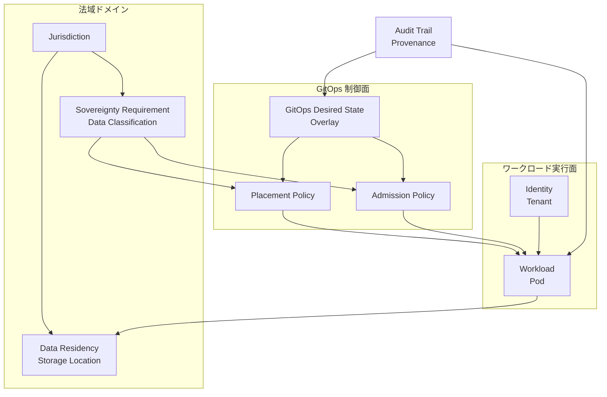

#### 要素一覧

| 要素 | 説明 |
|---|---|
| Jurisdiction | ワークロードとデータが従う法的支配主体を表します。リージョンや国と対応します |
| Sovereignty Requirement / Data Classification | 法域ごとに定まる主権要件とデータ区分を表します |
| Data Residency / Storage Location | データの保存先を表します。法域に紐づきます |
| GitOps Desired State / Overlay | 法域別に分岐した宣言的な望ましい状態を表します |
| Placement Policy | ワークロードの配置制約を表します。ノードアフィニティやトポロジー制約として具体化されます |
| Admission Policy | 配置制約や区分要件を admission 時に検証するポリシーを表します |
| Identity / Tenant | ワークロードの所属先となるテナントと ID を表します |
| Workload / Pod | 配置と検証の対象となる実行単位を表します |
| Audit Trail / Provenance | 変更履歴とサプライチェーンの検証可能性を表します |

概念モデルの読み方は次のとおりです。

- 法域ドメインは、主権要件と保存先を法域の管理下に置きます
- GitOps 制御面は、配置ポリシーと admission ポリシーを望ましい状態として宣言します
- ワークロード実行面は、テナントが所有するワークロードを表します
- 主権要件は配置ポリシーと admission ポリシーに変換されます
- 配置ポリシーと admission ポリシーはワークロードを制約・検証します
- ワークロードは保存先にデータを書き込みます
- 監査証跡は GitOps の望ましい状態とワークロードの両方を記録します

### 情報モデル

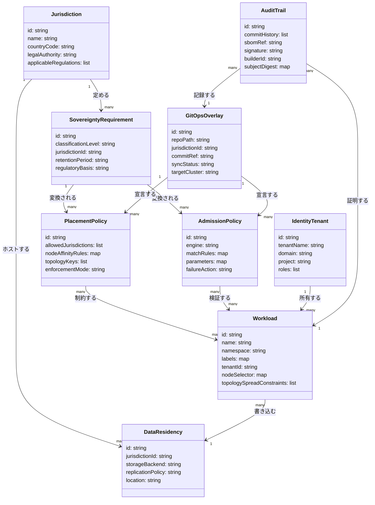

#### 属性一覧

| 属性 | 説明 |
|---|---|
| Jurisdiction.countryCode | 国または地域を識別するコードです。設計上の想定です |
| Jurisdiction.legalAuthority | データ開示を強制しうる法的主体を表します。設計上の想定です |
| Jurisdiction.applicableRegulations | CLOUD Act や CADA など適用される規制の一覧です。設計上の想定です |
| SovereigntyRequirement.classificationLevel | データ区分の段階を表します。設計上の想定です |
| SovereigntyRequirement.retentionPeriod | 保持期間を表します。設計上の想定です |
| PlacementPolicy.allowedJurisdictions | 配置を許可する法域の一覧です。node affinity のラベル値に対応します |
| PlacementPolicy.nodeAffinityRules | `topology.kubernetes.io/region` などのラベルセレクタです |
| PlacementPolicy.topologyKeys | topologySpreadConstraints の topologyKey に対応します |
| AdmissionPolicy.engine | OPA/Gatekeeper か Kyverno かを識別します |
| AdmissionPolicy.matchRules | 適用対象リソースの絞り込み条件です。Gatekeeper の `spec.match`、Kyverno の `match` に対応します |
| AdmissionPolicy.failureAction | 違反時の挙動です。Kyverno の `failureAction`（Enforce/Audit）に対応します |
| Workload.tenantId | ワークロードが属するテナントへの参照です |
| Workload.topologySpreadConstraints | ポッドの分散配置制約です |
| DataResidency.storageBackend | 分散ストレージなど保存基盤の種別です。設計上の想定です |
| DataResidency.replicationPolicy | レプリケーション方針です。設計上の想定です |
| GitOpsOverlay.repoPath | 法域別オーバーレイの Git 上のパスです |
| GitOpsOverlay.commitRef | 適用中の Git コミット参照です |
| GitOpsOverlay.syncStatus | クラスターへの同期状態です |
| AuditTrail.commitHistory | 変更履歴として参照する Git コミットの一覧です |
| AuditTrail.sbomRef | SPDX または CycloneDX 形式の SBOM への参照です |
| AuditTrail.builderId | SLSA provenance の `runDetails.builder.id` に対応します |
| AuditTrail.subjectDigest | SLSA provenance の `subject` に含まれるダイジェストです |
| IdentityTenant.domain | Keystone の domain に対応します。設計上の想定です |
| IdentityTenant.project | Keystone の project、または Kubernetes namespace に対応します |

情報モデルの読み方は次のとおりです。

- Jurisdiction は 1 件から多数の SovereigntyRequirement を定めます
- Jurisdiction は 1 件から多数の DataResidency をホストします
- SovereigntyRequirement は 1 件から多数の PlacementPolicy と AdmissionPolicy に変換されます
- PlacementPolicy と AdmissionPolicy は多数の Workload を多対多で制約・検証します
- Workload は多数から 1 件の DataResidency にデータを書き込みます
- IdentityTenant は 1 件から多数の Workload を所有します
- GitOpsOverlay は 1 件から多数の PlacementPolicy と AdmissionPolicy を宣言します
- AuditTrail は多数から 1 件の GitOpsOverlay と Workload をそれぞれ記録・証明します

## 構築方法

この章と次章のコード例はすべて実装案です。実プロジェクトへの適用前に、各公式ドキュメント（参考リンク）で最新仕様を確認してください。

### 前提条件・バージョン確認

| 項目 | 前提 |
|---|---|
| Kubernetes クラスタ | Gatekeeper は v1.16 で導入された API に依存する。ただし実際のサポート対象は Gatekeeper の現行サポートマトリクスに従うため、公式ドキュメントで確認する |
| Helm | v3 系 |
| クラスタ操作権限 | cluster-admin 相当の RBAC 権限 |
| Git リポジトリ | jurisdiction 別 overlay を配置する GitOps 用リポジトリ |
| cosign | イメージ署名検証を行う場合に別途インストール |

構築前に、次のコマンドでクラスタバージョンとノードの region ラベルを確認します。

```bash
kubectl version
kubectl get nodes --show-labels | grep topology.kubernetes.io/region
```

ノードに `topology.kubernetes.io/region` や `topology.kubernetes.io/zone` ラベルが付与されていない場合、クラウドプロバイダの Cloud Controller Manager 側でラベル付与を有効化する必要があります。

### Admission/Policy engine の導入（Kyverno）

Kyverno は Helm でインストールします。

```bash
helm repo add kyverno https://kyverno.github.io/kyverno/
helm repo update
helm install kyverno kyverno/kyverno \
  --namespace kyverno --create-namespace
```

Pod Security Standards などの既製ポリシー集を追加する場合は、別チャートを重ねてインストールします。

```bash
helm install kyverno-policies kyverno/kyverno-policies \
  --namespace kyverno --create-namespace
```

### Admission/Policy engine の導入（OPA Gatekeeper）

OPA Gatekeeper も Helm でインストールします。

```bash
helm repo add gatekeeper https://open-policy-agent.github.io/gatekeeper/charts --force-update
helm install gatekeeper gatekeeper/gatekeeper \
  --namespace gatekeeper-system --create-namespace
```

kubectl 直接適用でも導入できます。`master`（未固定の HEAD）ではなく、公式リリースページで確認したバージョンタグを固定して適用します。

```bash
# <TAG> は公式リリースページで確認した安定版タグに置き換える（例: v3.x.y）
kubectl apply -f https://raw.githubusercontent.com/open-policy-agent/gatekeeper/<TAG>/deploy/gatekeeper.yaml
```

### GitOps controller の導入（ArgoCD）

ArgoCD は namespace を作成してから公式マニフェストを適用します。

```bash
kubectl create namespace argocd
kubectl apply -n argocd -f https://raw.githubusercontent.com/argoproj/argo-cd/stable/manifests/install.yaml
```

### GitOps controller の導入（Flux）

Flux は bootstrap コマンドで導入します。bootstrap は Flux 自身のマニフェストを Git リポジトリへ push し、以後 Git を正とする同期を開始します。

```bash
flux bootstrap github \
  --owner=<org> \
  --repository=<repo> \
  --branch=main \
  --path=clusters/eu \
  --personal
```

複数クラスタ・複数 jurisdiction を運用する場合は `--path` をクラスタごとに変えて bootstrap を繰り返します。

```bash
flux bootstrap github --owner=<org> --repository=<repo> --branch=main --path=clusters/us --personal
```

### jurisdiction 別 overlay の Kustomize 構成

base に共通マニフェストを置き、overlays 配下に jurisdiction ごとのディレクトリを作成します。

```text
repo/
├── base/
│   ├── kustomization.yaml
│   ├── namespace.yaml
│   └── deployment.yaml
└── overlays/
    ├── eu/
    │   ├── kustomization.yaml
    │   └── patch-node-selector.yaml
    └── us/
        ├── kustomization.yaml
        └── patch-node-selector.yaml
```

`overlays/eu/kustomization.yaml` の実装案です。

```yaml
apiVersion: kustomize.config.k8s.io/v1beta1
kind: Kustomization
namespace: eu-tenant-a
resources:
  - ../../base
labels:
  - pairs:
      jurisdiction: eu
    includeSelectors: true
patches:
  - path: patch-node-selector.yaml
    target:
      kind: Deployment
      name: sovereign-app
```

`patch-node-selector.yaml`（eu）の実装案です。

```yaml
apiVersion: apps/v1
kind: Deployment
metadata:
  name: sovereign-app
spec:
  template:
    spec:
      nodeSelector:
        topology.kubernetes.io/region: eu-central-1
```

`patches` フィールドは現行の推奨です。ここでは `patchesStrategicMerge` ではなく `patches` を優先して使います。

## 利用方法

### 必須パラメータ一覧

| パラメータ | 設定場所 | 値の例 |
|---|---|---|
| `topology.kubernetes.io/region` | PodSpec の `nodeSelector` / `nodeAffinity` | `eu-central-1`, `us-east-1` |
| `jurisdiction`（namespace ラベル） | Namespace の `metadata.labels` | `eu`, `us` |
| `allowedRegions` | Gatekeeper Constraint の `spec.parameters` | `["eu-central-1","eu-west-1"]` |
| `topologyKey` | PodSpec の `topologySpreadConstraints` | `topology.kubernetes.io/zone` |
| `repoURL` / `path` | ArgoCD Application / Flux Kustomization | `overlays/eu`, `overlays/us` |
| `failureAction` | Kyverno ルールの `validate` / `verifyImages` | `Enforce`, `Audit` |

### node affinity / nodeSelector で承認法域ノードに固定する

`requiredDuringSchedulingIgnoredDuringExecution` は hard constraint です。条件を満たすノードが無ければ Pod はスケジュールされません。

```yaml
apiVersion: v1
kind: Pod
metadata:
  name: sovereign-app
  namespace: eu-tenant-a
  labels:
    jurisdiction: eu
spec:
  affinity:
    nodeAffinity:
      requiredDuringSchedulingIgnoredDuringExecution:
        nodeSelectorTerms:
          - matchExpressions:
              - key: topology.kubernetes.io/region
                operator: In
                values:
                  - eu-central-1
                  - eu-west-1
  containers:
    - name: app
      image: registry.example.com/sovereign-app:1.0.0
```

単純な一致だけで十分な場合は `nodeSelector` のみでも固定できます。

```yaml
spec:
  nodeSelector:
    topology.kubernetes.io/region: eu-central-1
```

### topologySpreadConstraints で法域内のゾーンに分散配置する

法域内で単一障害点を避けるため、承認済みリージョン内のゾーンへ均等分散します。`whenUnsatisfiable: DoNotSchedule` は条件を満たせない場合にスケジュールを拒否する hard constraint です。

```yaml
apiVersion: apps/v1
kind: Deployment
metadata:
  name: sovereign-app
  namespace: eu-tenant-a
spec:
  replicas: 6
  template:
    metadata:
      labels:
        app: sovereign-app
        jurisdiction: eu
    spec:
      nodeSelector:
        topology.kubernetes.io/region: eu-central-1
      topologySpreadConstraints:
        - maxSkew: 1
          topologyKey: topology.kubernetes.io/zone
          whenUnsatisfiable: DoNotSchedule
          labelSelector:
            matchLabels:
              app: sovereign-app
```

### Kyverno Policy 例: 承認法域外への配置を拒否する

`validate.deny.conditions` に `AnyNotIn` 演算子を使うと、許可リストに含まれない region を持つ Pod を拒否できます。ブロック挙動は現行スキーマの `spec.rules[].validate.failureAction`（ルール単位）で指定します。旧 `spec.validationFailureAction`（spec 直下）は非推奨のため使用しません。

```yaml
apiVersion: kyverno.io/v1
kind: ClusterPolicy
metadata:
  name: deny-non-approved-jurisdiction
spec:
  background: false
  rules:
    - name: deny-non-approved-region
      match:
        any:
          - resources:
              kinds:
                - Pod
              namespaces:
                - "eu-tenant-*"
      validate:
        failureAction: Enforce
        message: >-
          region {{ request.object.spec.nodeSelector."topology.kubernetes.io/region" }}
          is not an approved EU jurisdiction
        deny:
          conditions:
            all:
              - key: "{{ request.object.spec.nodeSelector.\"topology.kubernetes.io/region\" || '' }}"
                operator: AnyNotIn
                value:
                  - eu-central-1
                  - eu-west-1
```

### OPA Gatekeeper ConstraintTemplate + Constraint 例

Rego は v1 構文（`contains ... if {}`）で記述します。Gatekeeper で Rego v1 を使う場合、公式が推奨する現行形は、`targets` 配下に `code:` + `source: {version: "v1", rego: ...}` を構造化して書く方式です（`version: "v1"` を明示すれば `import rego.v1` は不要）。Rego v1 の対応バージョンや推奨記法は更新されるため、利用前に公式ドキュメントで確認してください。ここでは従来型の `rego:` 直書き例を示すため、明示的に `import rego.v1` を付けています。

ConstraintTemplate の実装案です。

```yaml
apiVersion: templates.gatekeeper.sh/v1
kind: ConstraintTemplate
metadata:
  name: k8sjurisdictionnodeselector
spec:
  crd:
    spec:
      names:
        kind: K8sJurisdictionNodeSelector
      validation:
        openAPIV3Schema:
          type: object
          properties:
            allowedRegions:
              type: array
              items:
                type: string
  targets:
    - target: admission.k8s.gatekeeper.sh
      rego: |
        package k8sjurisdictionnodeselector

        import rego.v1

        violation contains {"msg": msg} if {
          input.review.object.kind == "Pod"
          not input.review.object.spec.nodeSelector["topology.kubernetes.io/region"]
          msg := "pod must set nodeSelector topology.kubernetes.io/region for jurisdiction placement"
        }

        violation contains {"msg": msg} if {
          input.review.object.kind == "Pod"
          region := input.review.object.spec.nodeSelector["topology.kubernetes.io/region"]
          allowed := input.parameters.allowedRegions
          not region in allowed
          msg := sprintf("region '%v' is not in allowed jurisdictions %v", [region, allowed])
        }
```

Constraint の実装案です。

```yaml
apiVersion: constraints.gatekeeper.sh/v1beta1
kind: K8sJurisdictionNodeSelector
metadata:
  name: eu-jurisdiction-only
spec:
  match:
    kinds:
      - apiGroups: [""]
        kinds: ["Pod"]
    namespaces:
      - "eu-tenant-a"
  parameters:
    allowedRegions:
      - "eu-central-1"
      - "eu-west-1"
```

### namespace 分離で tenant/jurisdiction 境界を作る

Namespace に jurisdiction と tenant のラベルを付与し、Policy engine の `match.namespaces` から参照します。

```yaml
apiVersion: v1
kind: Namespace
metadata:
  name: eu-tenant-a
  labels:
    jurisdiction: eu
    tenant: tenant-a
```

Kyverno / Gatekeeper の match 条件は namespace 名またはラベルセレクタで絞り込みます。namespace 名を jurisdiction ごとに規則化しておくと、ワイルドカード一致（`eu-tenant-*` など）で対象を拡張できます。

### GitOps repo レイアウトと ArgoCD Application / Flux Kustomization

GitOps リポジトリは前掲の base + overlays 構成をそのまま使います。ArgoCD の場合は overlay ごとに Application を分けます。

```yaml
apiVersion: argoproj.io/v1alpha1
kind: Application
metadata:
  name: sovereign-app-eu
  namespace: argocd
spec:
  project: default
  source:
    repoURL: https://github.com/example/sovereign-platform.git
    targetRevision: main
    path: overlays/eu
  destination:
    server: https://kubernetes.default.svc
    namespace: eu-tenant-a
  syncPolicy:
    automated:
      prune: true
      selfHeal: true
```

Flux の場合は GitRepository と Kustomization を overlay ごとに分けます。

```yaml
apiVersion: source.toolkit.fluxcd.io/v1
kind: GitRepository
metadata:
  name: sovereign-platform
  namespace: flux-system
spec:
  interval: 5m
  url: https://github.com/example/sovereign-platform.git
  ref:
    branch: main
---
apiVersion: kustomize.toolkit.fluxcd.io/v1
kind: Kustomization
metadata:
  name: sovereign-app-eu
  namespace: flux-system
spec:
  interval: 10m
  sourceRef:
    kind: GitRepository
    name: sovereign-platform
  path: ./overlays/eu
  prune: true
  targetNamespace: eu-tenant-a
```

jurisdiction を追加するたびに、ArgoCD は Application を、Flux は Kustomization を 1 つ追加する運用になります。

### image signing 検証（cosign / Kyverno verifyImages）

イメージ署名は cosign で行います。鍵ペア方式の実装案です。

```bash
cosign generate-key-pair
cosign sign --key cosign.key registry.example.com/sovereign-app:1.0.0
cosign verify --key cosign.pub registry.example.com/sovereign-app:1.0.0
```

keyless（OIDC）署名の実装案です。

```bash
cosign sign registry.example.com/sovereign-app:1.0.0
cosign verify \
  --certificate-identity-regexp "https://github.com/example/.*" \
  --certificate-oidc-issuer https://token.actions.githubusercontent.com \
  registry.example.com/sovereign-app:1.0.0
```

クラスタ側は Kyverno の `verifyImages` で admission 時に署名検証を強制します。

```yaml
apiVersion: kyverno.io/v1
kind: ClusterPolicy
metadata:
  name: check-image-signature
spec:
  webhookConfiguration:
    failurePolicy: Fail
  background: false
  rules:
    - name: check-image
      match:
        any:
          - resources:
              kinds:
                - Pod
      verifyImages:
        - imageReferences:
            - "registry.example.com/sovereign-app*"
          failureAction: Enforce
          attestors:
            - count: 1
              entries:
                - keys:
                    publicKeys: |-
                      -----BEGIN PUBLIC KEY-----
                      (cosign.pub の内容を貼付)
                      -----END PUBLIC KEY-----
```

## 運用

### Policy 違反の検知・監査

Kyverno と OPA Gatekeeper は、いずれも「常時スキャン + レポート化」という同じ運用モデルを取ります。

| 項目 | Kyverno | OPA Gatekeeper |
|---|---|---|
| 違反の記録先 | `PolicyReport` / `ClusterPolicyReport` | Constraint オブジェクトの `status.violations` |
| 継続監視の仕組み | `spec.background: true` によるバックグラウンドスキャン。既存リソースを周期的に再評価する | Audit コントローラーによる周期実行 |
| 主な用途 | 新規デプロイのブロック + 既存リソースの事後検知 | 同左 |

バックグラウンドスキャンにより、ポリシー適用前に作成済みのリソースや、後からポリシーを追加したケースでも違反を捕捉できます。これは GitOps drift 検知と同じ発想で、「デプロイ時点の検証」だけに依存しない継続的な照合です。

Gatekeeper は Prometheus メトリクスエンドポイントを公開しており、次のような運用が推奨されます。

- 違反件数を監視システムへエクスポートする（Constraint に記録される違反件数の上限 `--constraint-violations-limit` はデフォルト 20 のため、超過分の取りこぼしに注意する）
- Constraint 単位・重大度単位でアラートをグルーピングする
- ロールアウト時は重複排除・抑制ウィンドウを設定し、アラート疲れを防ぐ

```bash
# Gatekeeper: audit-controller の監査ログ確認
kubectl logs -n gatekeeper-system -l control-plane=audit-controller

# Kyverno: 既存リソースの PolicyReport 一覧
kubectl get policyreport -A
kubectl get clusterpolicyreport
```

### 監査証跡の取り方

この設計論の監査モデルは、監査ログを別途構築するのではなく **Git の変更履歴そのものを監査証跡として扱う** 点が特徴です。

- Policy / overlay の変更はすべて Pull Request 経由（peer review 必須）
- CI パイプラインでのポリシーテストが merge の前提条件になる
- `git log` / commit 署名（GPG）が「誰が・いつ・何を・なぜ変更したか」の一次証跡になる
- ランタイムの Admission 判定ログ（許可/拒否）と PolicyReport が「実際に何が強制されたか」の証跡になる

Git 側（意図の証跡）とクラスタ側（実行結果の証跡）の 2 系統を突き合わせることで、「宣言された policy」と「実際に強制された policy」の一致を検証できます。

### Policy の段階導入（audit mode → enforce mode）

新規ポリシーをいきなり enforce（block）で投入すると、想定外のワークロード停止を招きます。両ツールとも共通して次の 2 段階ロールアウトが推奨されます。

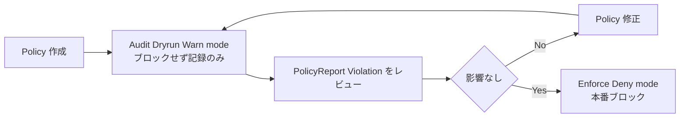

| ツール | 監視のみのモード | ブロックするモード |
|---|---|---|
| Kyverno | `validate.failureAction: Audit` | `validate.failureAction: Enforce` |
| OPA Gatekeeper | `enforcementAction: dryrun`（記録のみ）→ `warn`（警告するが許可） | `enforcementAction: deny` |
| Sigstore Policy Controller | `spec.mode: warn` | `spec.mode: enforce`（デフォルト） |

- 影響範囲が広い主権系ポリシー（ノード配置・イメージ署名）ほど、非本番 namespace → 一部 namespace → 全 namespace の順に enforce 範囲を広げます
- PolicyReport / Violation をレビューする際は、既存ワークロードのうち何件が違反するかを必ず件数で確認してから enforce に切り替えます

### multi-jurisdiction cluster fleet の運用

法域ごとに個別クラスタを持つ構成では、通常 1 クラスタで完結していた運用作業がクラスタ数倍に増えます。

- アップグレード、証明書ローテーション、RBAC 変更、セキュリティパッチ、キャパシティプランニングが法域ごとに発生する
- Git リポジトリに「共通設定」+「法域別 overlay（Kustomize base/overlays 等）」を持たせ、各クラスタ内の GitOps コントローラーがそれぞれ desired state に対して継続的に reconcile する

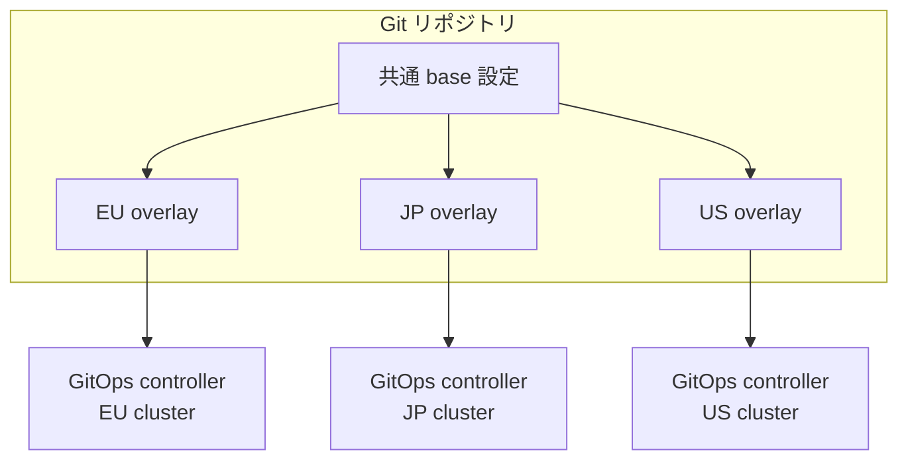

- overlay の更新は base への commit → 各法域 overlay への merge（または自動生成）→ 各クラスタの GitOps controller が自律的に pull/reconcile、という一方向の流れにします。クラスタへの直接 kubectl apply は drift の原因になるため避けます
- ArgoCD は `selfHeal: true` で live state のドリフトを自動的に Git 側へ巻き戻せます。Flux は reconcile のたびに drift を補正する挙動が既定です。両者とも「クラスタ側の手動変更は必ず打ち消される」運用を前提にします

## ベストプラクティス

### 契約でなくアーキテクチャで主権を強制する

この設計論の中心原則は次の対比に集約されます。

| 観点 | 契約による統治（contractual governance） | アーキテクチャによる強制（architectural enforcement） |
|---|---|---|
| 保証の性質 | SLA・DPA 上の約束 | Admission Controller・ノードアフィニティによる技術的拒否 |
| 検証可能性 | 監査時にしか確認できない | デプロイのたびに自動評価される |
| 破られたときの検知 | 契約違反が発覚するまで気づかない | Admission が即座に拒否、または PolicyReport に記録される |

「Sovereignty policies live in Git, are peer reviewed, tested through CI pipelines, and enforced automatically at deployment time」という原文の通り、主権要件は Git 上のコードとして表現し、CI でテストし、デプロイ時に自動強制するところまで一貫させます。

### サプライチェーン: SBOM + image signing + HBOM

| 階層 | 目的 | 代表的な標準・実装 |
|---|---|---|
| ソフトウェア（SBOM） | 依存コンポーネントの出所を追跡する | SPDX（ISO/IEC 5962）、CycloneDX（Ecma International 標準） |
| 署名・来歴 | 「誰がビルドしたか」「改ざんされていないか」を検証可能にする | Sigstore（cosign / Fulcio / Rekor）、SLSA provenance |
| Admission 強制 | 未署名・未検証イメージの実行を拒否する | Kyverno `verifyImages`、Sigstore Policy Controller |
| ハードウェア（HBOM） | 部品・ファームウェアの出所まで追跡する | HBOM framework（CISA）、CycloneDX HBOM 拡張 |

SBOM + 署名検証を admission に組み込むことで、「ビルド元・改ざんの有無」まで含めてサプライチェーン全体を検証できます。CNCF Blog はこれをさらに一段掘り下げ、HBOM とファームウェア検証を「OS より下の層」の主権論点として位置づけています。ハードウェア・ファームウェアの provenance が確認できなければ、OS 以上でどれだけ強制しても土台が保証されない、という指摘です。

### 下位層主権: 自前 identity / 分散ストレージ / ベアメタル

Kubernetes は主にオーケストレーション・ポリシー層を担いますが、その下の層（identity、ストレージ、ハードウェア）が外部事業者に依存していれば、Kubernetes 層で強制した保証は土台から揺らぎます。この設計論は OpenStack コンポーネントによる下位層の自主運用を推奨します。

| 層 | 依存を減らす手段 | 効果 |
|---|---|---|
| Identity | Keystone（自前 IdP） | 外部 IdP のアカウント停止・データ提供要求に依存しない |
| ストレージ | Ceph（分散ストレージ） | 特定クラウドのマネージドストレージに依存しない |
| ベアメタル | Ironic | ハードウェアプロビジョニングまで自主運用し、ライセンスサーバーや必須テレメトリへの依存を断つ |

「OpenStack can be deployed entirely within a controlled environment. No license servers. No mandatory telemetry services. No external dependencies required.」という原文の通り、これらは「外部への強制通信経路を持たない」構成が要点です。

### 分散主権パターン: federated learning

学習データを法域外へ移動させず、集約後のモデル更新のみを越境させるパターンです。

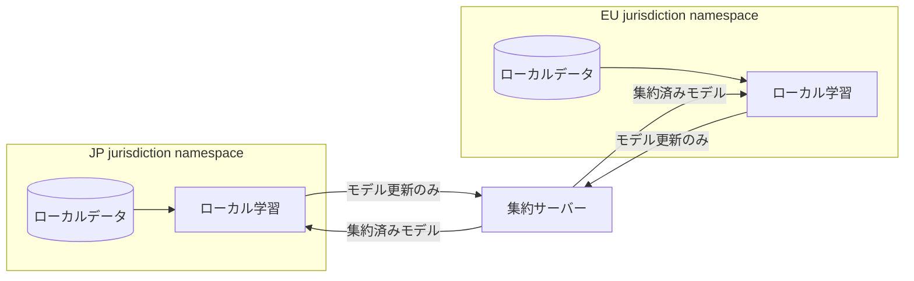

- 生データはローカルの namespace / cluster に留まり、越境するのは勾配やモデル重みなどの集約更新のみです
- 主権確保のための namespace 境界・ガバナンス統制は、通常ワークロードと同じ仕組み（policy engine、admission、RBAC）を流用します
- フレームワーク選定の目安は次のとおりです

| フレームワーク | 適したケース |
|---|---|
| Flower | 軽量に始めたい、Kubernetes ネイティブな構成を優先する場合 |
| NVIDIA FLARE | 監査証跡・secure aggregation・管理コンソールが必須要件の場合 |

### Policy as Code の CI テスト

Policy をコードとしてテストすることで、「Git に merge される前に」影響範囲を検証できます。

```bash
# Kyverno CLI: クラスタ接続不要でポリシーの単体テスト
kyverno test ./policies/sovereignty-node-placement/

# conftest: 構造化データ (Kubernetes manifest 等) を Rego ポリシーで検証
conftest test deployment.yaml -p policy/

# OPA: Rego ルールそのものの単体テスト
opa test policy/ -v
```

- `kyverno test` はクラスタ接続なしでローカル実行できるため、PR の CI で「デプロイ前」に軽量チェックできます
- conftest / `opa test` は Rego ポリシー自体の単体テストに向き、Gatekeeper に投入する前にロジックの正しさを検証します
- CI をブロッキングにする前に、まず non-blocking（警告のみ）で運用し、誤検知の洗い出しを終えてから必須チェック化するのが安全です

## トラブルシューティング

| 症状 | 原因 | 対処 |
|---|---|---|
| workload が想定外のノード（法域外）に配置された | nodeAffinity/nodeSelector の設定漏れ。または `preferredDuringScheduling`（soft constraint）だけを使い hard 制約にしていないため、条件を満たすノードが無いと別法域へ配置される | admission policy（Kyverno/Gatekeeper）で「法域ラベルの一致」を必須の validate rule にし、スケジューラ任せにしない。配置制約は `requiredDuringSchedulingIgnoredDuringExecution`（hard）で書く。`kubectl describe pod` で配置ノードと `FailedScheduling` を確認する |
| admission policy がすり抜けた | 対象 namespace が policy のスコープ（matchExpressions / namespaceSelector）から漏れている。もしくは Sigstore Policy Controller は `policy.sigstore.dev/include: "true"` ラベルがない namespace を検証しない（opt-in 方式） | policy の対象範囲を namespace 単位で棚卸しする。新規 namespace 作成を「主権ラベル付与」とセットで GitOps 化する |
| Rego v0→v1 構文非互換で policy が動かない | OPA v1.0 で `package` 宣言・import の扱いが変わり、v0 で書かれた Rego が構文エラーになる | `opa fmt --write --v0-v1` で自動変換する。移行期は `--v0-compatible` フラグで一時的に互換モード運用しつつ、順次書き換える（恒久利用は非推奨） |
| GitOps drift / reconcile 失敗 | クラスタへの直接 kubectl apply による手動変更。または Kubernetes 側が付与する `managedFields` 等のフィールド差分を drift と誤検知 | ArgoCD は `selfHeal: true` で live state を Git へ自動収束させる。コントローラーが管理するフィールド（HPA/VPA 由来等）は `ignoreDifferences` で除外する。`argocd app diff` / repo-server ログで差分の実体を確認する |
| image 署名検証が全 pod を block した | ClusterImagePolicy / verifyImages の検証パラメータ（signing identity）が実際の署名者と不一致。または Rekor/Fulcio への外部到達性がないクラスタで検証自体が失敗する | まず `warn` / audit mode に戻して影響範囲を確認する。policy 側の identity 設定を実際の signer に合わせるか、外部到達不可の環境では自前の Sigstore インフラ（private Fulcio/Rekor）を構築する |

### 「Kubernetes だけで主権が完結しない」限界

Kubernetes 層の admission・ノードアフィニティ・ポリシーエンジンは、あくまで**強制手段の一部**です。この設計論自身、次の限界を明示しています。

- **下位層への依存が残る**: Kubernetes 自体が、法域外の事業者が運用するプラットフォーム上で動いている場合、Kubernetes 層で強制した保証は土台から揺らぎます。「If that foundation is tied to a platform operated by an organization outside your jurisdiction, some of the guarantees enforced at the Kubernetes layer become harder to maintain.」という原文の通りです。identity（Keystone）・ストレージ（Ceph）・ベアメタル（Ironic）まで自主運用して初めて、Kubernetes 層の保証が意味を持ちます
- **クラウド事業者の法的支配は技術で消せない**: US CLOUD Act のように、司法管轄がサーバー所在地でなく親会社の法人格に従う法制度が存在します。暗号化や地理的配置だけでは、事業者自身が域外法の適用対象である限り、開示強制のリスクは解消しません。真に解消するには、事業者自体の法域を変えるか、事業者に依存しない自主運用（self-hosted）構成にするかのいずれかが必要です
- **技術的強制と法的強制は別レイヤー**: Admission Controller は「ポリシーに反するワークロードを止める」ことはできても、「事業者が司法当局からの開示命令に応じない」ことは保証できません。アーキテクチャによる強制は「意図しない設定・人為的ミスによる違反」を防ぐ手段として有効な一方、「主権国家の法的強制力」に対する防御は、事業者の法人格・所在地・準拠法の設計を伴わなければ完結しません

## まとめ

データ主権は「どのリージョンに置くか」ではなく、「誰が法的にデータ提出を強制されうるか」の問題です。この記事では、その主権要件を契約書の約束から、Kubernetes の admission・node affinity・GitOps・サプライチェーン検証による技術的強制へ移す参照アーキテクチャを、構造・データ・構築・運用の観点で整理しました。

Kubernetes 層だけでは、クラウド事業者の法的支配や下位層への依存という問題は完結しません。それでも「意図しない設定ミスによる主権違反」を防ぐ強制手段としては有効です。契約による統治から、コードとして検証・強制できる主権へ、設計の重心を移す一歩になります。

この記事が少しでも参考になった、あるいは改善点などがあれば、ぜひリアクションやコメント、SNSでのシェアをいただけると励みになります！

## 参考リンク

### 概要 / 規制

- [How data sovereignty is changing cloud native infrastructure design | CNCF Blog (2026-07-03)](https://www.cncf.io/blog/2026/07/03/how-data-sovereignty-is-changing-cloud-native-infrastructure-design/)
- [Cloud and AI Development Act | Shaping Europe's digital future (European Commission)](https://digital-strategy.ec.europa.eu/en/policies/cloud-and-ai-development-act)
- [The EU's Cloud and AI Development Act (CADA) | HLC](https://www.hlc.com/en/publications/the-eus-cloud-and-ai-development-act-cada-towards-a-sovereigntyfocused-framework-for-cloud)
- [European Commission's Proposed Cloud Sovereignty Framework | Jones Day](https://www.jonesday.com/en/insights/2026/06/european-commissions-proposed-cloud-sovereignty-framework-creates-new-compliance-tiers-for-software-providers)
- [The EU Cloud and AI Development Act in Depth | Inside Global Tech](https://www.insideglobaltech.com/2026/06/11/the-eu-cloud-and-ai-development-act-in-depth/)
- [U.S. CLOUD Act And Why Corporate Structure Matters For Data Sovereignty | UpCloud](https://upcloud.com/blog/us-cloud-act-corporate-structure-matters-data-sovereignty/)
- [How the US CLOUD Act and FISA 702 Create Legal Exposure for EU Cloud Data | SoftwareSeni](https://www.softwareseni.com/how-the-us-cloud-act-and-fisa-702-create-legal-exposure-for-eu-cloud-data/)
- [The CLOUD Act and UK Data Protection: Why Jurisdiction Matters | Kiteworks](https://www.kiteworks.com/gdpr-compliance/cloud-act-uk-data-protection-jurisdiction-matters/)
- [Gaia-X - Wikipedia](https://en.wikipedia.org/wiki/Gaia-X)
- [About - Gaia-X: A Federated Secure Data Infrastructure](https://gaia-x.eu/about/)

### 構造 / Policy engine

- [ValidatingAdmissionPolicy | Kubernetes](https://kubernetes.io/docs/reference/access-authn-authz/validating-admission-policy/)
- [Kyverno Introduction](https://kyverno.io/docs/introduction/)
- [OPA Gatekeeper Documentation](https://open-policy-agent.github.io/gatekeeper/website/docs/)
- [Argo CD Architecture Overview](https://argo-cd.readthedocs.io/en/stable/operator-manual/architecture/)
- [Ironic Documentation | OpenStack](https://docs.openstack.org/ironic/latest/)
- [Sigstore Policy Controller Overview](https://docs.sigstore.dev/policy-controller/overview/)
- [sigstore/policy-controller | GitHub](https://github.com/sigstore/policy-controller)
- [fluxcd/kustomize-controller | GitHub](https://github.com/fluxcd/kustomize-controller)
- [fluxcd/helm-controller | GitHub](https://github.com/fluxcd/helm-controller)

### データ / サプライチェーン標準

- [Constraint Templates | Gatekeeper](https://open-policy-agent.github.io/gatekeeper/website/docs/constrainttemplates/)
- [How to use Gatekeeper](https://open-policy-agent.github.io/gatekeeper/website/docs/howto/)
- [Validate Rules | Kyverno](https://kyverno.io/docs/policy-types/cluster-policy/validate/)
- [Resource Definitions | Kyverno](https://kyverno.io/docs/crds/)
- [Pod Topology Spread Constraints | Kubernetes](https://kubernetes.io/docs/concepts/scheduling-eviction/topology-spread-constraints/)
- [SLSA • Provenance](https://slsa.dev/spec/v1.0/provenance)
- [CycloneDX Bill of Materials Standard](https://cyclonedx.org/)
- [A Hardware Bill of Materials (HBOM) Framework for Supply Chain Risk Management | CISA](https://www.cisa.gov/sites/default/files/2023-09/A%20Hardware%20Bill%20of%20Materials%20Framework%20for%20Supply%20Chain%20Risk%20Management%20(508).pdf)
- [SBOMs in the Era of the CRA | OpenSSF](https://openssf.org/blog/2025/10/22/sboms-in-the-era-of-the-cra-toward-a-unified-and-actionable-framework/)

### 構築 / 利用

- [Kyverno Installation](https://kyverno.io/docs/installation/)
- [Kyverno Image Verification (Sigstore)](https://kyverno.io/docs/policy-types/cluster-policy/verify-images/sigstore/)
- [Installation | Gatekeeper](https://open-policy-agent.github.io/gatekeeper/website/docs/install/)
- [Argo CD Getting Started](https://argo-cd.readthedocs.io/en/stable/getting_started/)
- [Argo CD Kustomize integration](https://argo-cd.readthedocs.io/en/stable/user-guide/kustomize/)
- [Flux Installation](https://fluxcd.io/flux/installation/)
- [Flux Repository Structure](https://fluxcd.io/flux/guides/repository-structure/)
- [Declarative Management of Kubernetes Objects Using Kustomize](https://kubernetes.io/docs/tasks/manage-kubernetes-objects/kustomization/)
- [Assign Pods to Nodes using Node Affinity](https://kubernetes.io/docs/tasks/configure-pod-container/assign-pods-nodes-using-node-affinity/)
- [Sigstore cosign](https://docs.sigstore.dev/cosign/overview/)

### 運用 / トラブルシューティング

- [Policy Reports | Kyverno](https://kyverno.io/docs/guides/reports/)
- [Audit | Gatekeeper](https://open-policy-agent.github.io/gatekeeper/website/docs/audit/)
- [GitOps policy-as-code: Securing Kubernetes with Argo CD and Kyverno | CNCF](https://www.cncf.io/blog/2026/04/02/gitops-policy-as-code-securing-kubernetes-with-argo-cd-and-kyverno/)
- [Kubernetes Drift Detection with Policy-as-Code | Nirmata](https://nirmata.com/2025/11/01/drift-detection-for-kubernetes/)
- [Testing Policies | Kyverno](https://kyverno.io/docs/guides/testing-policies/)
- [Upgrading to v1.0 | Open Policy Agent](https://www.openpolicyagent.org/docs/latest/v0-upgrade/)
- [Kubernetes Policy Controller - Sigstore](https://docs.sigstore.dev/policy-controller/overview/)
- [Verify Signed Kubernetes Artifacts | Kubernetes](https://kubernetes.io/docs/tasks/administer-cluster/verify-signed-artifacts/)
- [Welcome to NVIDIA FLARE documentation](https://nvflare.readthedocs.io/en/main/welcome.html)
- [Federated Learning on GPU Cloud: Flower, NVIDIA FLARE, OpenFL | Spheron Blog](https://www.spheron.network/blog/federated-learning-gpu-cloud/)
