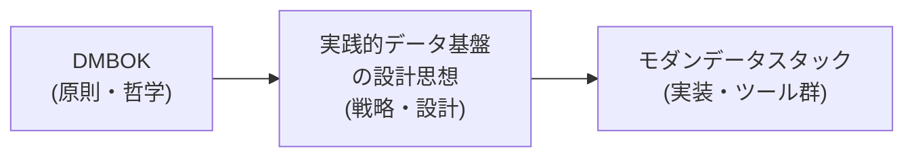
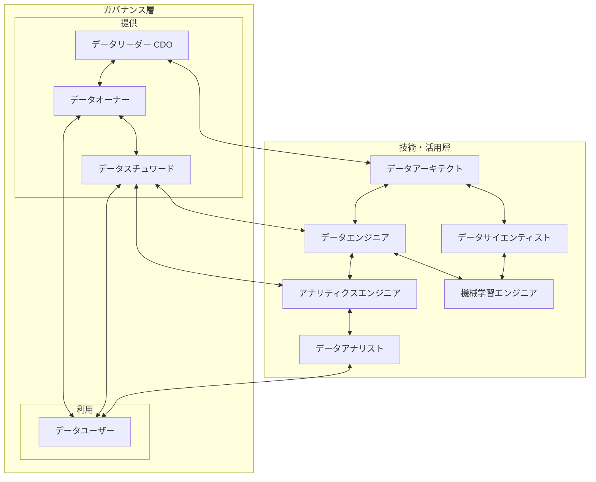
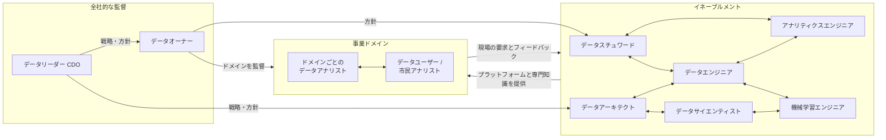
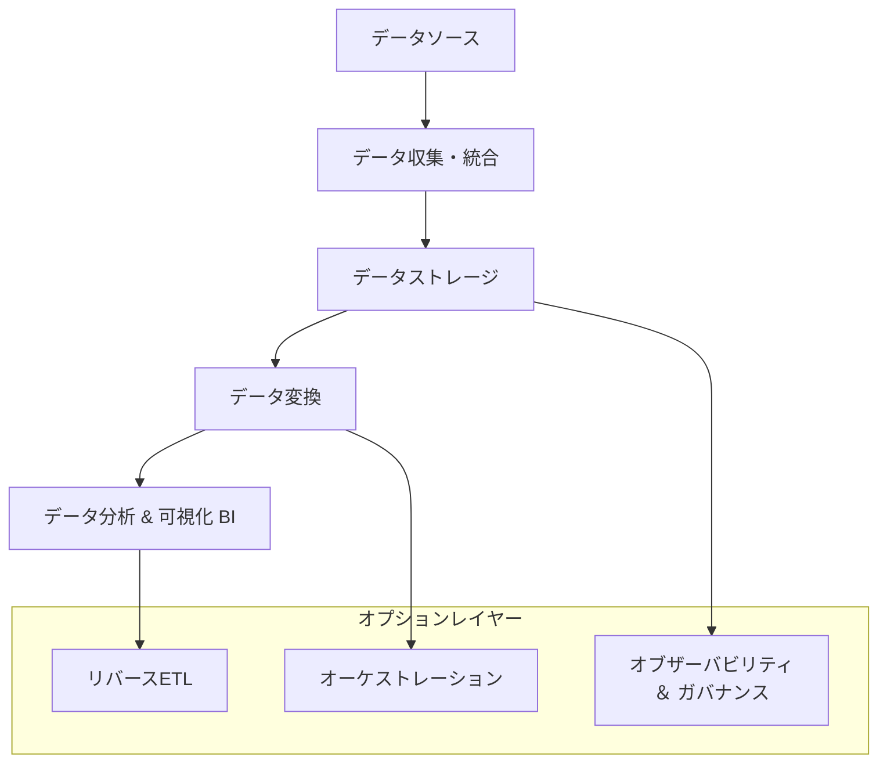

「最新のデータツールを導入したのに、現場では使われない」
「データマネジメントの理論は学んだが、何から手をつければいいか分からない」

現代のデータ活用において、このような課題に直面していないでしょうか。その原因は、データマネジメントを構成する重要な3つの要素が分断されていることにあります。それは、普遍的な **「原則」** 、それを形にする **「戦略」** 、そして戦略を支える具体的な **「実装」** です。

本稿では、これら3つの潮流を統合する「三位一体」のアプローチを提案します。

  * **DMBOK（データマネジメント知識体系）**
      * データマネジメントの **「原則・哲学」** を提供する、最も抽象度の高い羅針盤。
  * **実践的データ基盤の設計思想**
      * DMBOKの原則を実践に落とし込むための **「戦略・設計思想」** 。[『実践的データ基盤への処方箋』](https://gihyo.jp/book/2021/978-4-297-12445-8)で知られるアプローチを基に整理します。
  * **モダンデータスタック（MDS）**
      * 上記の戦略を実現するための、具体的な **「実装・ツール群」** 。

これらは競合する概念ではなく、相互に補完し合う関係にあります。この関係性は、データプラットフォームを構築する際の「何をすべきか（DMBOK）」、「なぜ、どのように考えるべきか（設計思想）」、「どのツールで実装するか（MDS）」という問いに、それぞれが答える階層構造として捉えることができます。

## 第1章 DMBOK：データマネジメントの揺るぎない「羅針盤」

この章では、あらゆるデータマネジメント活動の基礎となる、普遍的なベストプラクティスを体系化したDMBOKの核心に迫ります。

DMBOK（Data Management Body of Knowledge）は、特定の技術やベンダーに依存しない、データマネジメントの広範な知識体系です。

### 1.1 DMBOKの使命と原則

DMBOKは、データマネジメントの国際的な非営利団体DAMA Internationalによって策定されました。その目的は、組織がデータを戦略的資産として扱い、価値を最大化するための共通言語と包括的なフレームワークを提供することにあります。

特に「ベンダー中立」という原則は重要で、これにより特定の技術に依存しない普遍的な指針が提供され、その信頼性が確保されています。

### 1.2 DAMAホイール：包括的なフレームワーク

DMBOKの中核をなすのが、11の知識エリアを視覚的に表現した「DAMAホイール」です。この図は、**データガバナンス**が他のすべての活動を支える中心的な機能であることを明確に示しています。

*https://www.dama-japan.org/DMBOK2ImageDownLoad.html から引用*

| 要素名                               | 説明                                                                     |
| :----------------------------------- | :----------------------------------------------------------------------- |
| **データガバナンス**                 | データ資産を管理するための権限、統制、意思決定の枠組み                   |
| **データアーキテクチャ**             | 組織のデータ資産の全体的な設計図                                         |
| **データモデリングとデザイン**       | ビジネス要件から詳細なデータ構造への変換                                 |
| **データストレージとオペレーション** | データのライフサイクル全体にわたる物理的な管理と運用                     |
| **データセキュリティ**               | データ資産の不正アクセスや漏洩からの保護                                 |
| **データ統合と相互運用性**           | 異なるソースからのデータを統合し、一貫性のあるビューの提供               |
| **ドキュメントとコンテンツ管理**     | 非構造化データ（文書、画像など）の管理                                   |
| **参照データとマスターデータ**       | 組織全体で共有される重要データ（顧客、製品など）の信頼できる情報源の確立 |
| **データウェアハウスとBI**           | 意思決定支援のためのデータの収集、分析、可視化                           |
| **メタデータ管理**                   | 「データに関するデータ」を管理し、文脈と意味を提供                       |
| **データ品質**                       | データが意図された目的に適合していることの保証                           |

DAMAホイールは、各エリアが相互に関連しているため、診断ツールとしても機能します。例えば、「BIレポートの品質が悪い」という問題の根本原因が、「データ品質」や「メタデータ管理」、さらには「データガバナンス」にある可能性を体系的に探ることが可能です。

11の知識エリアを、組織、品質、システム、データの内容、データの活用で整理したものがPeter Aiken's frameworkです。枠組みができたことで、現状との差分からロードマップを考えることができるようになりました。

Peter Aiken's framework
https://speakerdeck.com/yuzutas0/20211210?slide=92

### 1.3 DMBOKの位置づけ

DMBOKは「何をすべきか」という原則を示しますが、具体的な技術で「どのように実現するか」は定義しません。この理論と実践のギャップを埋めるのが、次章で紹介する**戦略**、そしてそれを実現する**技術群**です。

## 第2章 実践的戦略と組織論：原則を実践に変える「設計図」

DMBOKという「原則」を、いかにして組織に根付かせ、持続可能なデータ基盤を構築するか。この章では、そのための「戦略・設計思想」を、ゆずたそ氏の提唱するアプローチを基に解き明かします。

### 2.1 基本哲学：「データ、システム、ヒト」の三位一体

成功するデータプラットフォームは、技術である「システム」だけでは成り立ちません。品質の高い「データ」と、明確な役割とプロセスを持つ「ヒト（組織）」という3つの要素のバランスが不可欠です。「データ」と「ヒト」の側面を軽視することが、多くのプロジェクトが失敗する根源的な原因です。

### 2.2 データ基盤のライフサイクルと「Ops」の重視

データ基盤のライフサイクルは、大きく「初期構築フェーズ」と、その後の「運用・保守・進化フェーズ」に分けられます。データプラットフォームの価値の大部分は、構築後の保守、適応、進化といった長期的な **「Ops」フェーズ** で生み出されます。

### 2.3 データ基盤に関わる主なロールと責務

ライフサイクルの各フェーズでは、多様なロールがそれぞれの責務を担います。

#### 役割の定義

各役割の関心事、責任範囲、使用技術、連携相手を一覧で示します。

| フェーズ           | 役割                     | 主な関心ごと                                                       | 責任範囲                                                                      | 主な使用技術/ツール                                                                   |
| :----------------- | :----------------------- | :----------------------------------------------------------------- | :---------------------------------------------------------------------------- | :------------------------------------------------------------------------------------ |
| **【ガバナンス】** |                          |                                                                    |                                                                               |                                                                                       |
| 全社戦略           | データリーダー (CDO)     | 全社のデータ戦略策定と推進、データガバナンス体制構築               | 組織全体のデータ資産価値最大化、データ関連投資ROI、データガバナンスの最終責任 | (特定の技術は限定されないが、データ戦略策定ツール、ガバナンスフレームワークなど)      |
| ドメイン管理       | データオーナー           | 特定データドメインのビジネス価値、品質、セキュリティ、プライバシー | 担当データのビジネス的な意思決定、品質、セキュリティ、プライバシーの最終責任  | (特定の技術は限定されない)                                                            |
| 日常運用           | データスチュワード       | データ品質の維持、メタデータ管理、アクセス管理、問い合わせ対応     | 担当データの定義、品質、可用性、コンプライアンス遵守の実務                    | メタデータ管理ツール、データ品質管理ツール、BIツール、SQL                             |
| 利用               | データユーザー           | 業務でのデータ活用、データに基づいた意思決定                       | 定められたルールに沿ったデータの適切な利用、異常の報告                        | BIツール、Excel、各種業務システム                                                     |
| **【技術と活用】** |                          |                                                                    |                                                                               |                                                                                       |
| 基盤設計           | データアーキテクト       | データ基盤全体の構造、データモデル、技術選定                       | データ基盤の全体設計、拡張性、パフォーマンス、セキュリティ                    | データモデリングツール、クラウドサービス (AWS/GCP/Azure)、DWH/DB技術                  |
| 基盤構築・運用     | データエンジニア         | データ収集、ETL/ELTパイプライン構築、データウェアハウス/レイク運用 | データパイプラインの安定性、スケーラビリティ、データの鮮度・整合性            | Python, SQL, Spark, Airflow, Kafka, DWH (Snowflake/BigQuery/Redshift), ETLツール      |
| データ変換・整備   | アナリティクスエンジニア | 分析用データの信頼性、使いやすさ、変換ロジックの品質               | データウェアハウス/レイク内の分析用データの品質、ガバナンス準拠               | SQL, dbt, Git, BIツール (Looker/Tableau), Python                                      |
| 分析・可視化       | データアナリスト         | ビジネス課題の特定、データからの洞察、レポート作成                 | ビジネス課題に対するデータに基づいた示唆、レポート/ダッシュボードの正確性     | SQL, BIツール (Tableau/Power BI/Looker), Excel, Python/R (基礎)                       |
| 高度分析・予測     | データサイエンティスト   | 予測モデル構築、統計分析、機械学習、新たなアルゴリズム開発         | 高度分析の結果の精度、モデルの有効性、新たなビジネス価値の創出                | Python/R, SQL, Jupyter Notebook, 機械学習ライブラリ (scikit-learn/TensorFlow/PyTorch) |
| モデル実装・運用   | 機械学習エンジニア       | 機械学習モデルのシステム組み込み、M\&Lops、モデルの運用・監視      | モデルの安定稼働、スケーラビリティ、推論パフォーマンス、M\&Lopsパイプライン   | Python, Docker, Kubernetes, MLOpsプラットフォーム, クラウドサービス                   |

#### 役割間の連携

各役割がどのように連携するかを図で示します。

#### 各役割の詳細

各役割の補足説明です。

##### データリーダー (CDO: Chief Data Officer)

  * データの価値を創造し、リスクを管理します。
  * 上記の両面で経営層に直接責任を負います。
  * データ部門を統括し、全社的なデータ駆動型文化への変革をリードします。
  * 法規制対応や倫理的なデータ利用を最終的に監督します。

##### データオーナー

  * 技術的な詳細より、担当データのビジネス上の意味や価値に焦点を当てます。
  * データが事業活動に与える影響も重視します。
  * 品質問題やセキュリティインシデントが発生した場合、担当データ領域の最終責任を負います。

##### データスチュワード

  * データガバナンスの実務を担当し、データオーナーの方針を実行します。
  * データカタログ（データの辞書や用語集）を作成、維持します。
  * 技術知識に加え、ビジネスへの深い理解と関係者との調整能力が必要です。

##### データユーザー

  * データを業務で活用する中で、品質問題や利用上の課題を発見します。
  * 発見した課題をデータスチュワードやデータアナリストに報告します。
  * この報告が、データ基盤やデータ管理体制の改善につながります。

##### データアーキテクト

  * 将来を見据えて、拡張性や柔軟性のあるデータ基盤を設計します。
  * 特定の技術に偏らず、オンプレミスからクラウド、リアルタイムからバッチ処理まで、幅広い技術知識を用いて多様な要件に対応します。

##### データエンジニア

  * 高度なプログラミングスキル、データベース、分散処理、クラウドインフラの専門知識を活用します。
  * データの「鮮度」「量」「種類」といった要件を満たします。
  * 安定的にデータを提供するためのインフラとパイプラインを構築、運用します。

##### アナリティクスエンジニア

  * dbtなどのツールとソフトウェアエンジニアリングの手法を用います。
  * 手法には、バージョン管理、テスト、自動化が含まれます。
  * データアナリストが利用するデータ変換処理を体系化し、品質を保証します。
  * データ活用のスピードと信頼性を向上させ、データアナリストが分析に集中できる環境を整えます。

##### データアナリスト

  * 特定のビジネスドメイン（マーケティング、営業など）に関する深い知識を持ちます。
  * ビジネス課題をデータ分析の要件に落とし込みます。
  * 分析結果をビジネスの言葉で説明する高いコミュニケーション能力が必要です。
  * BIツールを使い、ダッシュボードを作成します。

##### データサイエンティスト

  * 数学、統計学、プログラミング、ビジネスの4つのスキルを高度に活用します。
  * 分析結果から新たなビジネスチャンスを発見します。
  * 既存業務を劇的に改善するなど、企業に変革をもたらします。

##### 機械学習エンジニア

  * MLOps（Machine Learning Operations）を実践します。
  * データサイエンティストが作成したモデルを、開発環境から本番環境へデプロイし、安定運用させます。
  * モデルのバージョン管理、CI/CD（継続的インテグレーション/デリバリー）、パフォーマンス監視などを担当します。

#### データ活用の民主化後の役割の変化

データ活用の民主化、すなわち専門家以外もデータ分析を実践するようになると、各役割は大きく変化します。全体の傾向として、「専門家が分析作業を独占する」モデルから、「**専門家は、誰もが分析できる環境を整備し、活用を支援する**」モデルへとシフトします。

##### データアナリスト

単なる「分析者」から、各事業ドメインにおける「データ活用戦略の推進者」へと役割が進化します。

  * **ビジネスへの関与**: 各事業ドメインに深く入り込み、ビジネス課題の解決をデータでリードします。
  * **利用の推進**: ドメイン内のデータユーザーを教育・支援し、組織全体のデータリテラシー向上を牽引します。
  * **ガバナンスの実践**: 現場のデータ利用がルールに沿っているかを確認し、新たなニーズをガバナンスチームへフィードバックします。

##### データスチュワード

データの「門番」から、データを探すユーザーを助ける「案内人（コンシェルジュ）」へと役割が変化します。

  * **データカタログの充実**: 誰がアクセスしてもデータの意味を正しく理解できるよう、データカタログの整備と維持がより重要になります。
  * **ユーザー支援の強化**: 一般ユーザーからの問い合わせに対応し、適切なデータ活用を支援する業務の比重が大きくなります。

##### データエンジニア / アナリティクスエンジニア

一部の専門家だけでなく、多様なユーザーが利用することを前提とした、より堅牢で使いやすいデータ基盤の構築が求められます。

  * **セルフサービス環境の構築**: ビジネスユーザー自身が直感的にデータを扱える分析基盤やツールを提供します。
  * **信頼できるデータモデルの提供**: アナリティクスエンジニアは、誰もが安心して利用できる信頼性の高いデータマートを整備し、民主化の基盤を支えます。

##### データユーザー

完成したレポートを待つ「受け身」の姿勢から、自らデータを探索・分析し、意思決定に活かす「能動的」な役割へと変化します。

  * **データリテラシーの向上**: すべてのデータユーザーに、基本的なデータリテラシーが求められるようになります。
  * **市民アナリストの出現**: データユーザーの中から、所属部門のデータ活用をリードする「市民アナリスト（Citizen Analyst）」が登場します。

##### 民主化後の連携図

この新しいモデルでは、中央の専門家チームが各事業ドメインを「支援（イネーブルメント）」する形へと構造が変化します。

| 要素名                             | 説明                                                                                                                                       |
| :--------------------------------- | :----------------------------------------------------------------------------------------------------------------------------------------- |
| 中央支援チーム（イネーブルメント） | 各ドメインが自律的にデータを活用できるよう、信頼できるデータ基盤、ツール、ガバナンス、および高度な専門知識を提供・支援する専門家集団。     |
| 事業ドメイン                       | データアナリストとデータユーザー（市民アナリスト）が協働し、提供された基盤の上で、日々の業務に直結したデータ活用と意思決定を実践する現場。 |

### 2.4 アーキテクチャ戦略：統一プラットフォーム上の3層構造

データ基盤の設計には、実績のある3層アーキテクチャを採用します。

  * **データレイク**: データソースのデータを一切加工せず、そのままコピーした層。
  * **データウェアハウス（DWH）**: 複数データを統合・クレンジングし、部門横断で利用する指標などを格納する「信頼できる唯一の情報源」。
  * **データマート**: 特定のユースケース向けに、データを集計・最適化した層。

重要な点は、これらの3層を物理的に異なるシステムに分散させるのではなく、Google BigQueryやSnowflakeのような**単一の強力なプラットフォーム内**に論理的に構築することです。この思想は、後の章で解説するMedallionアーキテクチャのようなモダンな設計パターンにも通じます。

*データ基盤の3分類と進化的データモデリング から引用*

### 2.5 核心的コンセプト：進化的データモデリング

データモデルは一度設計して完成するものではありません。ビジネスの変化に追随して、継続的かつ安全に進化（リファクタリング）できる必要があります。

前述の「統一プラットフォーム」戦略は、この「進化的データモデリング」を実現するための鍵となります。すべての変換ロジックがdbtのような単一のツールで管理されるため、変更の影響範囲の分析が容易になり、変更コストが劇的に低下します。これは、初期構築（Dev）よりも、長期的な運用保守性（Ops）を最適化する戦略なのです。

## 第3章 モダンデータスタック：戦略を具現化する「建築資材」

この章では、前章で述べた戦略や設計思想を、現代のクラウド技術で実現するための具体的で効率的なツール群であるモダンデータスタック（MDS）を掘り下げます。

### 3.1 モダンデータスタックとは

MDSは、データの収集、保存、変換、分析を可能にする、クラウドベースのツール群を指します。各機能に特化した「ベストオブブリード（その分野で最も優れた）」のツールを組み合わせる、モジュール型のアーキテクチャが特徴です。

### 3.2 レガシーからのパラダイムシフト

MDSは、従来のオンプレミス中心の硬直的なデータ基盤からの大きな転換を意味します。

| 項目                 | レガシーデータスタック               | モダンデータスタック（MDS）        |
| :------------------- | :----------------------------------- | :--------------------------------- |
| **インフラ**         | オンプレミス（物理サーバー）         | クラウドネイティブ                 |
| **スケーラビリティ** | 困難（物理ハードウェアの追加が必要） | 容易（動的・自動で拡張可能）       |
| **コスト**           | 多額の先行投資（CAPEX）              | 従量課金（OPEX）                   |
| **柔軟性**           | モノリシック（一枚岩）               | モジュール式（ベストオブブリード） |
| **データ処理**       | ETL（Extract, Transform, Load）      | ELT（Extract, Load, Transform）    |

### 3.3 アーキテクチャの構成要素

MDSは、データが価値に変換されるまでの一連のプロセスを担う、複数の論理的なレイヤーで構成されます。

| レイヤー                 | 主要機能                                         | 代表的なツール                           |
| :----------------------- | :----------------------------------------------- | :--------------------------------------- |
| **データソース**         | 生データの生成元（データベース、SaaS等）         | Salesforce, Google Analytics, PostgreSQL |
| **データ収集**           | データソースからストレージへデータをロード       | Fivetran, Airbyte, Stitch                |
| **データストレージ**     | データの一元的な保存・管理                       | Snowflake, Google BigQuery, Databricks   |
| **データ変換**           | DWH内で生データを分析可能な形式にモデリング      | dbt (Data Build Tool)                    |
| **BI & アナリティクス**  | 変換済みデータを可視化し、インサイトを導出       | Looker, Tableau, Power BI                |
| **オーケストレーション** | データパイプライン全体の実行順序や依存関係を管理 | Airflow, Dagster, Prefect                |
| **オブザーバビリティ**   | データ品質の問題や異常を検知                     | Monte Carlo, Great Expectations          |
| **リバースETL**          | DWHのデータを業務システムに書き戻し              | Hightouch, Census                        |

### 3.4 中核技術：ELTとdbt

MDSを特徴づける最も重要な技術的変化が、**ELT**への移行です。従来のETLでは専用ツールでデータを「変換」してからDWHに「ロード」しましたが、ELTでは先に生データをDWHに「ロード」し、DWHの強力な計算能力を使って内部で「変換」します。

このELTパラダイムにおいて、データ変換レイヤーの標準ツールとなったのが **dbt (Data Build Tool)** です。dbtは、SQLで記述された変換ロジックに、バージョン管理、テスト、文書化といったソフトウェアエンジニアリングのベストプラクティスを適用可能にします。これにより、データアナリスト自身が堅牢なデータ変換プロセスを構築できるようになりました。

https://zenn.dev/suwash/articles/dbt_product_20250902

https://zenn.dev/suwash/articles/databricks_dbt_cicd_20250905

## 第4章 統合モデル：原則・戦略・実装の連携

成功するデータプラットフォームは、DMBOK、実践的設計思想、MDSの3つを統合的に捉えることで実現します。

  * **DMBOK**：組織全体のデータ戦略の方向性を示す\*\*「羅針盤」\*\*
  * **実践的設計思想**：原則を組織文化や長期運用に根付せるための\*\*「設計図」\*\*
  * **MDS**：設計図を効率的かつスケーラブルに実現する\*\*「建築資材と工具」\*\*

### 4.1 実践的なハイブリッドアーキテクチャ

これらの思想を統合した現代的なアーキテクチャの一例として、以下の組み合わせが挙げられます。詳細な解説は下記の記事で整理しました。ここではそのエッセンスを紹介します。

https://zenn.dev/suwash/articles/data_pf_arch_20250902

1.  **Medallionアーキテクチャを基盤にする**
      * データを「Bronze（生）→ Silver（統合・クレンジング）→ Gold（集計）」と段階的に処理することで、データの来歴（リネージ）が明確になり、品質を体系的に向上することができます。
2.  **各レイヤーに最適なモデリング手法を配置する**
      * **Silverレイヤー: Data Vault 2.0**: raw vaultでデータの履歴を管理し、business vaultでは表記ゆれやコード値などを標準化します。
      * **Goldレイヤー: スタースキーマ / 大福帳（One Big Table）**: 分析やBIツールからの利用に最適化します。利用者が理解しやすく、クエリパフォーマンスが高いモデルです。
3.  **ビジネスで利用するための抽象化レイヤーを追加する**
      * **Semanticレイヤー**: 「売上」「アクティブユーザー」といったビジネス指標の定義をコードで一元管理する層です。

### 4.2 導入のポイント

#### データリーダー向け

  * **ツール選定**: 個々の機能だけでなく、ツール間の統合性と長期的な運用コストを考慮します。
  * **チーム構造**: ビジネスと技術のギャップを埋める「データスチュワード」の役割に投資します。
  * **文化醸成**: 単にプラットフォームを構築するのではなく、データ駆動型の文化を育むことを目標とします。

#### 実務者向け

  * **レイヤーで考える**: 統一プラットフォーム上でも、自身の作業をレイク、DWH、マート（またはBronze, Silver, Gold）の各層に分けて考え、規律を保ちます。
  * **作業しながら文書化する**: dbtの文書化機能を活用し、将来の自分や同僚のためにメタデータを残します。
  * **進化を受け入れる**: 完璧さではなく、継続的に改善できる能力を目指し、リファクタリングしやすいコードを記述します。

## まとめ

現代のデータマネジメントで成功を収めるには、多層的なアプローチが不可欠です。

  * **技術（MDS）だけ**では、ツールを導入しても組織的な課題に直面し、価値を最大限に引き出せません。
  * **原則（DMBOK）だけ**では、理想論に留まり、具体的な実践が伴いません。

真に価値を創出し続けるデータ基盤を構築する鍵は、これら3つの潮流を連携させることにあります。**DMBOK**の包括的な原則を「羅針盤」とし、**実践的な戦略・組織論**を「設計図」とし、そして**MDS**の強力なツール群を「建築資材」として活用する。この三位一体のアプローチこそが、データという資産を組織の力に変えるための、最も確実な道筋となるでしょう。

データマネジメントは一度作って終わるプロジェクトではありません。それは、組織と共に進化し続ける旅です。そして、正しい地図、コンパス、そして頑丈な船があれば、その航海は必ずや組織を新たな価値の大陸へと導くはずです。

明日からでも始められる第一歩は、まず自社のデータマネジメントが「原則・戦略・実装」のどのレイヤーに課題を抱えているか、チームで議論することかもしれません。この記事が、その議論のきっかけとなれば幸いです。

---

## 参考リンク

  * **DMBOKとデータマネジメント全般**
      * [Who We Are - DAMA International®](https://dama.org/about-dama/who-we-are/)
      * [What is Data Management? - DAMA International®](https://dama.org/about-dama/what-is-data-management/)
      * [一般社団法人 データマネジメント協会 日本支部(DAMA Japan)](https://www.dama-japan.org/)
      * [データマネジメントの知識体系DMBOKとは？どう役立つのか？ | 株式会社データ総研](https://jp.drinet.co.jp/blog/about_dmbok)
      * [【DMBOK】11の知識領域から「データマネジメント」を理解する](https://digiana.site/dmbok/)
  * **モダンデータスタック（MDS）**
      * [What Is the Modern Data Stack? - IBM](https://www.ibm.com/think/topics/modern-data-stack)
      * [データ活用の新基軸：モダンデータスタックとは？基本から活用例 ...](https://datalab.flywheel.jp/posts/modern_data_stack)
      * [いま話題のモダンデータスタックとは？dbtとの関係性も解説 - primeNumber](https://primenumber.com/blog/modern-data-stack)
      * [自動データパイプラインサービス 「Fivetran」 - CloudFit](https://cloudfit.co.jp/cloud/fivetran)
      * [データエンジニア界隈で話題のdbt（data build tool）のまとめ - Qiita](https://qiita.com/manabian/items/67af7e4476d436aded77)
  * **実践的データ基盤の設計思想（ゆずたそさん）**
      * [実践的データ基盤への処方箋 | 技術評論社 - gihyo.jp](https://gihyo.jp/book/2021/978-4-297-12445-8)
      * [データ基盤の3分類と進化的データモデリング - 下町柚子黄昏記 by @yuzutas0](https://yuzutas0.hatenablog.com/entry/2018/12/02/180000)
      * [データエンジニア大集合！「実践的データ基盤への処方箋」輪読会レポート 〜データ整備編](https://gihyo.jp/news/report/2022/06/0601)
