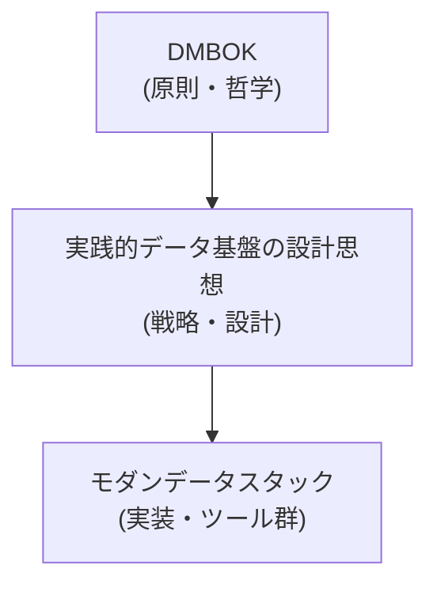
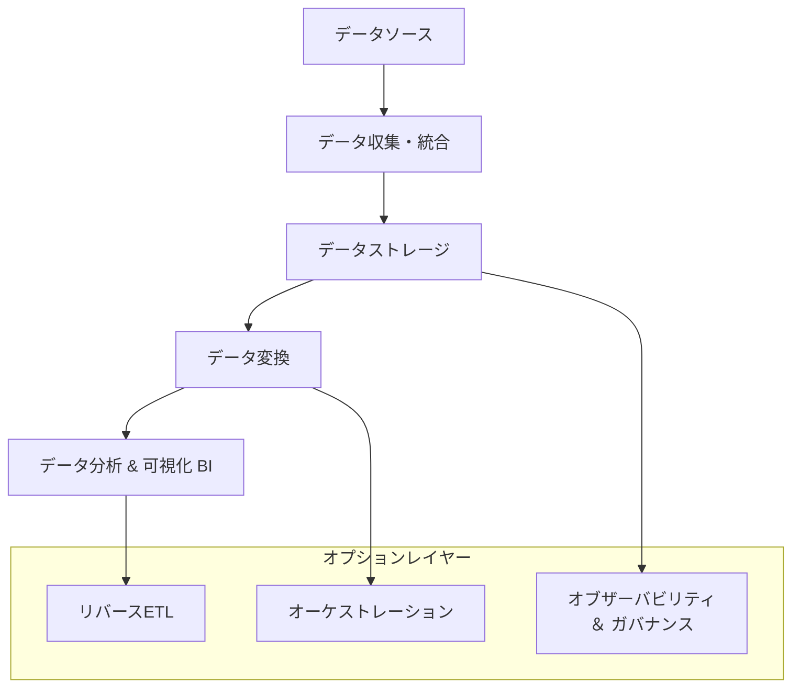

「最新のデータツールを導入したのに、現場では使われない」
「データマネジメントの理論は学んだが、何から手をつければいいか分からない」

現代のデータ活用において、このような課題に直面していないでしょうか。その原因は、データマネジメントを構成する重要な3つの要素が分断されていることにあります。それは、普遍的な **「原則」** 、それを形にする **「戦略」** 、そして戦略を支える具体的な **「実装」** です。

本稿では、これら3つの潮流を統合する「三位一体」のアプローチを提案します。

  * **DMBOK（データマネジメント知識体系）**
      * データマネジメントの **「原則・哲学」** を提供する、最も抽象度の高い羅針盤。
  * **実践的データ基盤の設計思想**
      * DMBOKの原則を実践に落とし込むための **「戦略・設計思想」** 。本稿では特に『実践的データ基盤への処方箋』で知られるアプローチを基に整理します。
  * **モダンデータスタック（MDS）**
      * 上記の戦略を実現するための、具体的な **「実装・ツール群」** 。

これらは競合する概念ではなく、相互に補完し合う関係にあります。この関係性は、データプラットフォームを構築する際の「何をすべきか（DMBOK）」、「なぜ、どのように考えるべきか（設計思想）」、「どのツールで実装するか（MDS）」という問いに、それぞれが答える階層構造として捉えることができます。

## 第1章 DMBOK：データマネジメントの揺るぎない「羅針盤」

この章では、あらゆるデータマネジメント活動の基礎となる、普遍的なベストプラクティスを体系化したDMBOKの核心に迫ります。

DMBOK（Data Management Body of Knowledge）は、特定の技術やベンダーに依存しない、データマネジメントの広範な知識体系です。

### 1.1 DMBOKの使命と原則

DMBOKは、データマネジメントの国際的な非営利団体DAMA Internationalによって策定されました。その目的は、組織がデータを戦略的資産として扱い、価値を最大化するための共通言語と包括的なフレームワークを提供することにあります。

特に「ベンダー中立」という原則は重要で、これにより特定の技術に依存しない普遍的な指針が提供され、その信頼性が確保されています。

### 1.2 DAMAホイール：包括的なフレームワーク

DMBOKの中核をなすのが、11の知識エリアを視覚的に表現した「DAMAホイール」です。この図は、**データガバナンス**が他のすべての活動を支える中心的な機能であることを明確に示しています。

*https://www.dama-japan.org/DMBOK2ImageDownLoad.html から引用*

| 要素名 | 説明 |
| :--- | :--- |
| **データガバナンス** | データ資産を管理するための権限、統制、意思決定の枠組み |
| **データアーキテクチャ** | 組織のデータ資産の全体的な設計図 |
| **データモデリングとデザイン** | ビジネス要件から詳細なデータ構造への変換 |
| **データストレージとオペレーション** | データのライフサイクル全体にわたる物理的な管理と運用 |
| **データセキュリティ** | データ資産の不正アクセスや漏洩からの保護 |
| **データ統合と相互運用性** | 異なるソースからのデータを統合し、一貫性のあるビューの提供 |
| **ドキュメントとコンテンツ管理** | 非構造化データ（文書、画像など）の管理 |
| **参照データとマスターデータ** | 組織全体で共有される重要データ（顧客、製品など）の信頼できる情報源の確立 |
| **データウェアハウスとBI** | 意思決定支援のためのデータの収集、分析、可視化 |
| **メタデータ管理** | 「データに関するデータ」を管理し、文脈と意味を提供 |
| **データ品質** | データが意図された目的に適合していることの保証 |

DAMAホイールは、各エリアが相互に関連しているため、診断ツールとしても機能します。例えば、「BIレポートの品質が悪い」という問題の根本原因が、「データ品質」や「メタデータ管理」、さらには「データガバナンス」にある可能性を体系的に探ることが可能です。

11の知識エリアを、組織、品質、システム、データの内容、データの活用で整理したものがPeter Aiken's frameworkです。枠組みができたことで、現状との差分からロードマップを考えることができるようになりました。

Peter Aiken's framework
https://speakerdeck.com/yuzutas0/20211210?slide=92

### 1.3 DMBOKの位置づけ

DMBOKは「何をすべきか」という原則を示しますが、具体的な技術で「どのように実現するか」は定義しません。この理論と実践のギャップを埋めるのが、次章以降で紹介するアプローチと技術群です。

## 第2章 モダンデータスタック：原則を具現化する技術群

この章では、DMBOKの原則を現代のクラウド技術で実現するための、具体的で効率的なツール群であるモダンデータスタック（MDS）を掘り下げます。

### 2.1 モダンデータスタックとは

MDSは、データの収集、保存、変換、分析を可能にする、クラウドベースのツール群を指します。各機能に特化した「ベストオブブリード（その分野で最も優れた）」のツールを組み合わせる、モジュール型のアーキテクチャが特徴です。

### 2.2 レガシーからのパラダイムシフト

MDSは、従来のオンプレミス中心の硬直的なデータ基盤からの大きな転換を意味します。

| 項目 | レガシーデータスタック | モダンデータスタック（MDS） |
| :--- | :--- | :--- |
| **インフラ** | オンプレミス（物理サーバー） | クラウドネイティブ |
| **スケーラビリティ**| 困難（物理ハードウェアの追加が必要） | 容易（動的・自動で拡張可能） |
| **コスト** | 多額の先行投資（CAPEX） | 従量課金（OPEX） |
| **柔軟性** | モノリシック（一枚岩） | モジュール式（ベストオブブリード） |
| **データ処理** | ETL（Extract, Transform, Load） | ELT（Extract, Load, Transform） |

### 2.3 アーキテクチャの構成要素

MDSは、データが価値に変換されるまでの一連のプロセスを担う、複数の論理的なレイヤーで構成されます。

| レイヤー | 主要機能 | 代表的なツール |
| :--- | :--- | :--- |
| **データソース** | 生データの生成元（データベース、SaaS等） | Salesforce, Google Analytics, PostgreSQL |
| **データ収集** | データソースからストレージへデータをロード | Fivetran, Airbyte, Stitch |
| **データストレージ** | データの一元的な保存・管理 | Snowflake, Google BigQuery, Databricks |
| **データ変換** | DWH内で生データを分析可能な形式にモデリング | dbt (Data Build Tool) |
| **BI & アナリティクス** | 変換済みデータを可視化し、インサイトを導出 | Looker, Tableau, Power BI |
| **オーケストレーション** | データパイプライン全体の実行順序や依存関係を管理 | Airflow, Dagster, Prefect |
| **オブザーバビリティ**| データ品質の問題や異常を検知 | Monte Carlo, Great Expectations |
| **リバースETL** | DWHのデータを業務システムに書き戻し | Hightouch, Census |

### 2.4 中核技術：ELTとdbt

MDSを特徴づける最も重要な技術的変化が、**ELT**への移行です。従来のETLでは専用ツールでデータを「変換」してからDWHに「ロード」しましたが、ELTでは先に生データをDWHに「ロード」し、DWHの強力な計算能力を使って内部で「変換」します。

このELTパラダイムにおいて、データ変換レイヤーの標準ツールとなったのが **dbt (Data Build Tool)** です。dbtは、SQLで記述された変換ロジックに、バージョン管理、テスト、文書化といったソフトウェアエンジニアリングのベストプラクティスを適用可能にします。これにより、データアナリスト自身が堅牢なデータ変換プロセスを構築できるようになりました。

## 第3章 実践的戦略と組織論：持続可能なデータ基盤への道筋

MDSという強力なツール群をいかにして使いこなし、DMBOKの原則を実践に落とし込むか。この章では、そのための「戦略・設計思想」を、ゆずたそ氏の提唱するアプローチを基に解き明かします。

### 3.1 基本哲学：「データ、システム、ヒト」の三位一体

成功するデータプラットフォームは、技術である「システム」だけでは成り立ちません。品質の高い「データ」と、明確な役割とプロセスを持つ「ヒト（組織）」という3つの要素のバランスが不可欠です。「データ」と「ヒト」の側面を軽視することが、多くのプロジェクトが失敗する根源的な原因です。

### 3.2 データ基盤のライフサイクルと「Ops」の重視

データ基盤のライフサイクルは、大きく「初期構築フェーズ」と、その後の「運用・保守・進化フェーズ」に分けられます。データプラットフォームの価値の大部分は、構築後の保守、適応、進化といった長期的な **「Ops」フェーズ** で生み出されます。

### 3.3 データ基盤に関わる主なロールと責務

ライフサイクルの各フェーズでは、多様なロールがそれぞれの責務を担います。

| ロール | 初期構築フェーズの責務 | 運用・保守・進化フェーズの責務 |
| :--- | :--- | :--- |
| **データリーダー** | ・ツールの機能だけでなく、統合性や長期的な運用コストを考慮して選定する。 ・アナリティクスエンジニアの採用やデータスチュワードの任命など、チーム構造を設計する。 ・データ駆動型文化を育むための初期計画を立てる。 | ・チームを継続的に育成し、データ駆動型文化の醸成を推進する。 ・ビジネス価値を評価し、追加投資や戦略の見直しを行う。 |
| **データエンジニア** | ・Fivetran等を用いて、主要データソースからの初期データパイプラインを構築・自動化する。 | ・新規データソースの追加や仕様変更に対応する。 ・データパイプラインの安定稼働を監視し、パフォーマンス問題を解決する。 |
| **アナリティクスエンジニア** | ・dbtを用いて、初期ビジネスユースケースのためのデータマートを構築する。 ・データ変換ロジックのテストや文書化の規約を確立する。 | ・ビジネス要件の変化に対応するため、データモデルを継続的にリファクタリング（進化）させる。 ・技術的負債を管理し、SQLパフォーマンスを最適化する。 |
| **データアナリスト** | ・BIツールで最初のダッシュボードやレポートを作成する。 ・データ変換ロジックの要件定義に協力する。 | ・新たなビジネス課題に対応するため、探索的分析やレポート作成を行う。 ・データマートの改善点をアナリティクスエンジニアにフィードバックする。 |
| **データスチュワード**| ・プロジェクトの早い段階で任命される。 ・メタデータ管理戦略を確立し、最初のデータディクショナリを作成する。 | ・ビジネスユーザーの「相談窓口」としてデータの発見や理解を助ける。 ・データ品質を継続的に監視し、改善のためのフィードバックを収集する。 ・メタデータを常に最新の状態に維持・管理する。 |

### 3.4 アーキテクチャ戦略：統一プラットフォーム上の3層構造

データ基盤の設計には、実績のある3層アーキテクチャを採用します。

  * **データレイク**: データソースのデータを一切加工せず、そのままコピーした層。
  * **データウェアハウス（DWH）**: 複数データを統合・クレンジングし、部門横断で利用する指標などを格納する「信頼できる唯一の情報源」。
  * **データマート**: 特定のユースケース向けに、データを集計・最適化した層。

重要な点は、これらの3層を物理的に異なるシステムに分散させるのではなく、Google BigQueryやSnowflakeのような**単一の強力なプラットフォーム内**に論理的に構築することです。この思想は、後の章で解説するMedallionアーキテクチャのようなモダンな設計パターンにも通じます。

*データ基盤の3分類と進化的データモデリング から引用*

### 3.5 核心的コンセプト：進化的データモデリング

データモデルは一度設計して完成するものではありません。ビジネスの変化に追随して、継続的かつ安全に進化（リファクタリング）できる必要があります。

前述の「統一プラットフォーム」戦略は、この「進化的データモデリング」を実現するための鍵となります。すべての変換ロジックがdbtのような単一のツールで管理されるため、変更の影響範囲の分析が容易になり、変更コストが劇的に低下します。これは、初期構築（Dev）よりも、長期的な運用保守性（Ops）を最適化する戦略なのです。

## 第4章 統合モデル：原則・戦略・実装の連携

成功するデータプラットフォームは、DMBOK、実践的設計思想、MDSの3つを統合的に捉えることで実現します。

  * **DMBOK**：組織全体のデータ戦略の方向性を示す**「羅針盤」**
  * **実践的設計思想**：原則を組織文化や長期運用に根付かせるための**「設計図」**
  * **MDS**：設計図を効率的かつスケーラブルに実現する**「建築資材と工具」**

### 4.1 実践的なハイブリッドアーキテクチャ

これらの思想を統合した現代的なアーキテクチャの一例として、以下の組み合わせが挙げられます。詳細な解説は下記の記事で整理しました。ここではそのエッセンスを紹介します。

https://zenn.dev/suwash/articles/data_pf_arch_20250902

1.  **Medallionアーキテクチャを基盤にする**
      * データを「Bronze（生）→ Silver（統合・クレンジング）→ Gold（集計）」と段階的に処理することで、データの来歴（リネージ）が明確になり、品質を体系的に向上することができます。
2.  **各レイヤーに最適なモデリング手法を配置する**
      * **Silverレイヤー: Data Vault 2.0**: raw vaultでデータの履歴を管理し、business vaultでは表記ゆれやコード値などを標準化します。
      * **Goldレイヤー: スタースキーマ / 大福帳（One Big Table）**: 分析やBIツールからの利用に最適化します。利用者が理解しやすく、クエリパフォーマンスが高いモデルです。
3.  **ビジネスで利用するための抽象化レイヤーを追加する**
      * **Semanticレイヤー**: 「売上」「アクティブユーザー」といったビジネス指標の定義をコードで一元管理する層です。

### 4.2 導入のポイント

#### データリーダー向け

  * **ツール選定**: 個々の機能だけでなく、ツール間の統合性と長期的な運用コストを考慮します。
  * **チーム構造**: ビジネスと技術のギャップを埋める「データスチュワード」の役割に投資します。
  * **文化醸成**: 単にプラットフォームを構築するのではなく、データ駆動型の文化を育むことを目標とします。

#### 実務者向け

  * **レイヤーで考える**: 統一プラットフォーム上でも、自身の作業をレイク、DWH、マート（またはBronze, Silver, Gold）の各層に分けて考え、規律を保ちます。
  * **作業しながら文書化する**: dbtの文書化機能を活用し、将来の自分や同僚のためにメタデータを残します。
  * **進化を受け入れる**: 完璧さではなく、継続的に改善できる能力を目指し、リファクタリングしやすいコードを記述します。

## まとめ

本稿で見てきたように、現代のデータマネジメントで成功を収めるには、多層的なアプローチが不可欠です。

  * **技術（MDS）だけ**では、ツールを導入しても組織的な課題に直面し、価値を最大限に引き出せません。
  * **原則（DMBOK）だけ**では、理想論に留まり、具体的な実践が伴いません。

真に価値を創出し続けるデータ基盤を構築する鍵は、これら3つの潮流を連携させることにあります。**DMBOK**の包括的な原則を「羅針盤」とし、**実践的な戦略・組織論**を「設計図」とし、そして**MDS**の強力なツール群を「建築資材」として活用する。この三位一体のアプローチこそが、データという資産を組織の力に変えるための、最も確実な道筋となるでしょう。

データマネジメントは一度作って終わるプロジェクトではありません。それは、組織と共に進化し続ける旅です。そして、正しい地図、コンパス、そして頑丈な船があれば、その航海は必ずや組織を新たな価値の大陸へと導くはずです。

明日からでも始められる第一歩は、まず自社のデータマネジメントが「原則・戦略・実装」のどのレイヤーに課題を抱えているか、チームで議論することかもしれません。この記事が、その議論のきっかけとなれば幸いです。

---

## 参考リンク

  * **DMBOKとデータマネジメント全般**
      * [Who We Are - DAMA International®](https://dama.org/about-dama/who-we-are/)
      * [What is Data Management? - DAMA International®](https://dama.org/about-dama/what-is-data-management/)
      * [一般社団法人 データマネジメント協会 日本支部(DAMA Japan)](https://www.dama-japan.org/)
      * [データマネジメントの知識体系DMBOKとは？どう役立つのか？ | 株式会社データ総研](https://jp.drinet.co.jp/blog/about_dmbok)
      * [【DMBOK】11の知識領域から「データマネジメント」を理解する](https://digiana.site/dmbok/)
  * **モダンデータスタック（MDS）**
      * [What Is the Modern Data Stack? - IBM](https://www.ibm.com/think/topics/modern-data-stack)
      * [データ活用の新基軸：モダンデータスタックとは？基本から活用例 ...](https://datalab.flywheel.jp/posts/modern_data_stack)
      * [いま話題のモダンデータスタックとは？dbtとの関係性も解説 - primeNumber](https://primenumber.com/blog/modern-data-stack)
      * [自動データパイプラインサービス 「Fivetran」 - CloudFit](https://cloudfit.co.jp/cloud/fivetran)
      * [データエンジニア界隈で話題のdbt（data build tool）のまとめ - Qiita](https://qiita.com/manabian/items/67af7e4476d436aded77)
  * **実践的データ基盤の設計思想（ゆずたそさん）**
      * [実践的データ基盤への処方箋 | 技術評論社 - gihyo.jp](https://gihyo.jp/book/2021/978-4-297-12445-8)
      * [データ基盤の3分類と進化的データモデリング - 下町柚子黄昏記 by @yuzutas0](https://yuzutas0.hatenablog.com/entry/2018/12/02/180000)
      * [データエンジニア大集合！「実践的データ基盤への処方箋」輪読会レポート 〜データ整備編](https://gihyo.jp/news/report/2022/06/0601)
