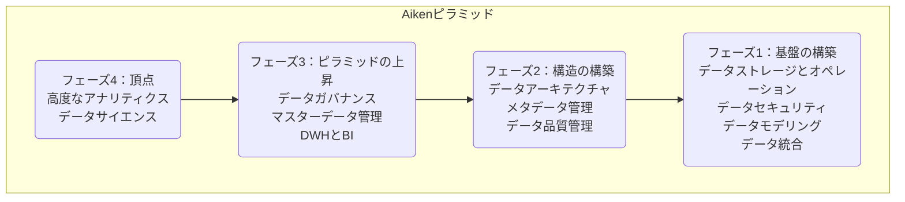
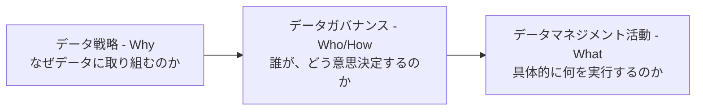

組織のデータ活用を次のレベルへ引き上げたい、しかしどこから手をつければ良いかわからない。そんな課題を抱えるリーダーや実務者のために、体系的な「データマネジメント成熟度アセスメント」を用意しました。

このアセスメントは、DAMA（国際データマネジメント協会）が提唱する知識体系「DMBOK」と、Peter Aiken氏が提唱する実装フレームワーク「Aikenピラミッド」を独自に統合したものです。組織のデータマネジメント能力を客観的に評価し、実効性の高い改善ロードマップの策定を支援します。

## 第1部：現代データマネジメントの揺るぎない基礎

このセクションでは、データマネジメントの基本的な考え方と、本アセスメントの基盤となる2つの強力なフレームワークを解説します。

### 1.1. データ：戦略的かつ「非消耗」の資産

現代の組織にとって、データは事業運営に不可欠な生命線です。多くの経営層はデータから価値を引き出そうと試みていますが、その多くが品質問題やシステム連携の困難さに直面しています。

#### データのユニークな特性

データは、物理資産や人的資源と異なり、以下の特性を持つユニークな戦略資産です。

  * **非消耗性**: 使用しても減少しない
  * **非劣化性**: 使用しても品質が落ちない
  * **永続性**: 長期間にわたり価値を維持する

これらの特性から、データには短期的な視点ではなく、持続可能な資産として管理する長期的な戦略が求められます。

#### 成功の鍵：テクノロジー1割、人・プロセス・文化9割

データマネジメントの課題は、最新テクノロジーの導入だけでは決して解決しません。成功に必要な投資は、テクノロジーが「1」に対し、 **人・プロセス・文化の変革が「9」** であると指摘されています。技術的な解決策以上に、組織文化の変革やデータ中心の思考を促すプロセス改革こそが、成功の鍵を握るのです。この「組織」という側面が、後述する失敗の根本原因を理解する上で極めて重要になります。

本アセスメントは、技術の流行に左右されず、データマネジメントの普遍的な原則と戦略的な整合性に焦点を当てます。

### 1.2. DMBOK：「何をすべきか」を示す包括的な知識体系（What）

DAMAが発行する「データマネジメント知識体系ガイド（DMBOK）」は、データマネジメントのベストプラクティスや共通言語を網羅した業界標準です。組織がデータに関する活動を体系的に理解し、標準化するための「地図」を提供します。

#### DAMAホイールと11の知識領域

DMBOKの中心的な概念は「DAMAホイール」として表現されます。これはデータマネジメントを構成する11の知識領域を示し、その中心に「データガバナンス」を配置しています。データガバナンスが他の全ての領域を統括する中核機能であることを象徴しています。

*https://www.dama-japan.org/DMBOK2ImageDownLoad.html から引用*

| 要素名 | 説明 |
| :--- | :--- |
| **データガバナンス** | データ資産の管理に関する権限、統制、意思決定を実行するシステム。他の10領域の活動を監督する。 |
| **データアーキテクチャ** | ビジネス戦略に整合したデータ資産のマスタープランを設計、維持する活動。 |
| **データモデリングとデザイン** | データの関係性を可視化し、ビジネス要件を満たす形でデータを構造化するプロセス。 |
| **データストレージとオペレーション** | データのライフサイクル全体にわたり、データを安全かつ効率的に格納、保護、維持する活動。 |
| **データセキュリティ** | データへの不正アクセスや不正利用を防ぎ、プライバシーと機密性を確保するためのポリシーと手順。 |
| **データ統合と相互運用性** | 複数のデータソースからデータを統合し、円滑なデータ連携を実現するプロセス。 |
| **ドキュメントとコンテンツ管理** | 文書や画像などの非構造化データを管理する活動。 |
| **参照データとマスターデータ管理** | 組織全体で共有する重要データ（顧客、製品など）の信頼できる唯一の情報源を確立、維持する活動。 |
| **データウェアハウジングとBI** | 意思決定支援のため、データを分析可能な形式で集約、保存し、洞察を提供する活動。 |
| **メタデータ管理** | データに関するデータ（定義、出所、品質など）を管理し、データの発見、理解、利用を促進する活動。 |
| **データ品質管理** | データがビジネス目的に適合することを保証するため、データの品質を定義、測定、改善する活動。 |

11の知識領域の解説は、ゆずたそさんのスライドが圧倒的にわかりやすいです。

https://speakerdeck.com/yuzutas0/20211210?slide=89

#### DMBOKの提供価値と「次の一歩」への課題

DMBOKは、データマネジメントで「何を」すべきかを網羅的に示してくれます。しかし、これらの活動を**どのような順序で実施すべきか**という実践的なロードマップは提示しません。このギャップを埋めるために、次に示すAikenピラミッドが羅針盤となります。

### 1.3. Aikenピラミッド：「どう進めるか」を示す実装フレームワーク（How）

Aikenピラミッドは、DMBOKの知識領域を「どのように」実装すべきかを示す、極めて実践的なフレームワークです。データマネジメント活動間の依存関係と組織の成熟プロセスを階層構造で表現し、戦略実行のロードマップとして機能します。

*https://www.datastrategypros.com/resources/aiken-pyramid から引用*

| フェーズ | 説明 |
| :--- | :--- |
| **フェーズ1：基盤の構築** | データを安全に格納し、構造化し、移動させるための技術的な土台を確立する。 |
| **フェーズ2：構造の構築** | データの信頼性と透明性を確保する。データを「信頼でき、理解可能な状態」にする。 |
| **フェーズ3：ピラミッドの上昇** | 信頼できるデータを全社的に統制し、戦略的に活用する仕組みを導入する。 |
| **フェーズ4：頂点** | 盤石な基盤の上で、予測モデリングや機械学習などを用いてデータから最大限の価値を引き出す。 |

#### 診断ツールとしてのピラミッド

Aikenピラミッドは、データ関連プロジェクトが失敗する原因を説明する診断ツールとしても秀逸です。例えば、データ品質（フェーズ2）が未確立のまま高度なアナリティクス（フェーズ4）を導入する試みは、砂上の楼閣を築くようなもので、失敗する可能性が極めて高いです。下位層の成熟度が低い場合、その層に依存する高度な取り組みは高いリスクを抱えていると判断できます。

#### DMBOKとAikenピラミッドのマッピング

2つのフレームワークの関係性を以下の表に示します。これにより、「何を」と「どう進めるか」が明確に結びつきます。

| Aikenピラミッドのフェーズ | 主に対応するDMBOK知識領域 |
| :--- | :--- |
| フェーズ4：頂点 | 高度なアナリティクス、データサイエンス |
| フェーズ3：ピラミッドの上昇 | データウェアハウスとビジネスインテリジェンス 参照データとマスターデータ管理 ドキュメントとコンテンツ管理 |
| フェーズ2：構造の構築 | データアーキテクチャ メタデータ管理 データ品質管理 |
| フェーズ1：基盤の構築 | データストレージとオペレーション データセキュリティ データモデリングとデザイン データ統合と相互運用性 |
| 全体を統括する機能 | データガバナンス |

*※注：DMBOK2では、データサイエンスは独立した知識領域ではなく、DWHやBIなどの領域内で扱われる高度な活用形態として位置づけられます。*

## 第2部：統合アセスメントフレームワーク

ここからは、第1部で解説した2つのフレームワークを統合し、組織のデータマネジメント能力を評価するための具体的なフレームワークを定義します。

### 2.1. データマネジメント成熟度レベルの定義

組織のデータマネジメント能力を客観的に評価するため、以下の5段階の成熟度レベルを定義します。

| レベル | 名称 | 説明 |
| :--- | :--- | :--- |
| **レベル1** | 初期 / 場当たり的 | プロセスは予測不可能で管理されておらず、事後対応的。活動は個人の英雄的な努力に依存。 |
| **レベル2** | 管理的 / 反復的 | 基本的なプロセスは存在するが、プロジェクト単位の適用にとどまり、組織全体で標準化されていない。 |
| **レベル3** | 定義済み / 標準的 | プロセスは文書化され、組織全体の標準として確立・遵守されている。 |
| **レベル4** | 定量的管理 / 測定可能 | プロセスやデータ品質を測定する定量的メトリクスを収集、分析し、統計的に管理している。 |
| **レベル5** | 最適化 / データ駆動 | 定量的なフィードバックに基づき、継続的なプロセス改善に焦点を当てる。データを能動的に活用し、戦略目標を達成する。 |

### 2.2. フェーズ1アセスメント：基盤となる能力

  * **目的**: 組織の中核となるデータ資産を、信頼性高く安全に保管、モデル化、統合する技術的な基盤能力を評価します。
  * **評価領域**:
      * データストレージとオペレーション
      * データセキュリティ
      * データモデリングとデザイン
      * データ統合と相互運用性

### 2.3. フェーズ2アセスメント：構造と信頼の構築

  * **目的**: データの一貫性、品質、利用目的への適合性を保証する規律を評価します。データを「信頼できる資産」にするための極めて重要なフェーズです。
  * **評価領域**:
      * データアーキテクチャ
      * メタデータ管理
      * データ品質管理

### 2.4. フェーズ3アセスメント：ガバナンスと戦略的実現

  * **目的**: 全社規模でのデータ活用と統制を可能にする公式な組織構造、ポリシー、戦略的プラットフォームを評価します。
  * **評価領域**:
      * データガバナンス
      * 参照データとマスターデータ管理（MDM）
      * ドキュメントとコンテンツ管理
      * データウェアハウス（DWH）とビジネスインテリジェンス（BI）

### 2.5. フェーズ4アセスメント：データ価値創造の頂点

  * **目的**: 成熟したデータエコシステムを活用し、高度なアナリティクスやデータ駆動型のイノベーションを生み出す組織能力を評価します。
  * **評価領域**:
      * 高度なアナリティクスとデータサイエンス

### 2.6. データマネジメント成熟度アセスメントシート

以下のシートは、各評価領域における成熟度レベルを具体的に定義し、評価を客観的に行うためのツールです。コピーしてご利用ください。

https://docs.google.com/spreadsheets/d/1g6Q3vJJbeQICe0-DyfUgn9tPQ6tRfQ5tE_6QVpUlDxQ

#### アセスメントのサンプル

| 評価領域 | 成熟度レベルの定義 | 主要な評価質問 | 典型的な証拠・成果物 |
| :--- | :--- | :--- | :--- |
| **データ品質管理** | レベル1: ユーザーからの苦情で問題が発覚 レベル2: 手動でのデータクレンジング レベル3: 定義された品質ルールと定期的測定 レベル4: KPIとしての品質メトリクスとダッシュボード レベル5: 根本原因分析と発生源でのプロセス改善 | - データ品質を定義する公式なルールは存在するか？ - データ品質を測定し、報告するプロセスはあるか？ - 品質問題の修正責任者とプロセスは明確か？ | - データ品質基準定義書 - データプロファイリングレポート - データ品質ダッシュボード - 問題管理記録 |
| **データガバナンス** | レベル1: 非公式でサイロ化した意思決定 レベル2: プロジェクト単位でのデータオーナー指名 レベル3: ガバナンス憲章とスチュワード制度の導入 レベル4: ポリシー遵守状況の監査と効果測定 レベル5: 組織文化に根付き、戦略目標と整合 | - データガバナンスを推進する公式な組織は存在するか？ - データオーナーなどの役割と責任は定義されているか？ - ポリシーや標準は文書化され、全社からアクセス可能か？ | - データガバナンス憲章 - 役割と責任を定義したRACIチャート - 議事録 - データポリシー・標準文書 |

*注：実際のアセスメントシートでは、全ての評価領域に対して同様の定義を行っています。*

#### 利用イメージ

- アセスメント
  - 
- 現状の可視化
  - 
- 経年変化の追跡
  - 

## 第3部：成功を左右する戦略と組織文化

アセスメントによって技術やプロセスの「能力」を測定しても、それだけでは成功は保証されません。このセクションでは、その能力を正しい方向へ導くための「戦略」と、変革を阻む「組織文化」という、より根源的なテーマを扱います。

### 3.1. データ戦略の絶対的な前提条件

技術やプロセスの成熟度が高くても、それらを導く明確なデータ戦略がなければ、投資は無駄に終わります。重要なのは、データ戦略がIT戦略の一部ではなく、**組織全体の戦略目標を達成するための「ビジネス戦略」そのものである**と認識することです。

#### 戦略、ガバナンス、マネジメントの因果関係

データ戦略、データガバナンス、データマネジメント活動の間には、以下の明確な因果関係があります。この連鎖が断ち切られている組織は少なくありません。

戦略（Why）がなければ、データガバナンスは目的のないルール作りになり、データマネジメントへの投資は活用されないまま時代遅れになります。アセスメントで測定される「実行能力（What）」と、データ戦略という「実行の知恵（Why）」は、車の両輪の関係なのです。

### 3.2. 組織の準備状況の診断：変革を阻む「7つの大罪」

データマネジメントの失敗は、技術的な問題よりも組織文化やリーダーシップに起因することが大半です。Peter Aiken氏は、変革を妨げる根深い文化的な障壁を「7つの大罪」として体系化しました。これらは、アセスメントで明らかになった**低い成熟度スコアの根本原因を特定する、強力な診断ツール**となります。

1.  **データ中心の思考を理解していない**: データをアプリケーションの「副産物」とみなし、独立した資産として扱わない。
2.  **有能なデータリーダーシップの欠如**: ビジネスとデータの両方を理解し、全社的な権限を持つリーダーが不在。
3.  **共有データを開発する計画的な方法がない**: データ連携を場当たり的に行い、全社的な視点が欠如している。
4.  **データプログラムをITプロジェクトと整合させていない**: ITプロジェクトの目標がデータ戦略を無視、または矛盾している。
5.  **期待値を適切に管理できていない**: 基盤整備の重要性を軽視し、AI導入などの短期的な成果を過剰に約束する。
6.  **データ戦略の実装順序を間違えている**: Aikenピラミッドの依存関係を無視する（例：データ品質の前にAIを導入する）。
7.  **組織の準備状況や文化を診断し、対処していない**: データ駆動型組織になるためのチェンジマネジメントを怠る。

アセスメントで明らかになる低い成熟度スコアは「症状」であり、「7つの大罪」は根本原因である「疾患」と見なせます。効果的な改善計画には、症状への対処だけでなく、この疾患そのものの治療が不可欠です。

## 第4部：アセスメントから実行可能なロードマップへ

いよいよ最終セクションです。ここでは、アセスメント結果を解釈し、絵に描いた餅で終わらない、具体的な改善ロードマップを策定する方法を解説します。

### 4.1. アセスメント結果の解釈

アセスメントの完了はゴールではなく、変革のスタートラインです。結果を多角的に分析し、組織の現状を正確に把握します。

1.  **可視化**: スコアをレーダーチャートやヒートマップで可視化し、組織の強みと弱みを一目で把握できるようにします。
2.  **ピラミッド分析**: Aikenピラミッドの観点からスコアを分析します。基盤となる下位層のスコアが低い場合、それは組織が抱える**重大なリスク**を示唆します。
3.  **原因分析**: 特にスコアが低い領域について、「7つの大罪」と照らし合わせ、表面的な問題の背後にある組織的な根本課題を特定します。

### 4.2. 優先順位付けされた改善ロードマップの策定

分析結果に基づき、具体的で実行可能な改善ロードマップを策定します。策定にあたっては、以下の4つの原則を指針とします。

1.  **基盤を強化する**: 何よりもまず、ピラミッドの下位層における改善を最優先します。
2.  **戦略的価値と整合させる**: データ戦略に基づき、最もビジネス価値の高い改善活動に焦点を絞ります。
3.  **「大罪」に対処する**: 技術的な改善と、それを阻む文化的・戦略的な課題（大罪）の克服策をセットで計画します。
4.  **小さく始め、素早く学ぶ**: ロードマップを短期的なフェーズ（例：四半期ごと）に分割し、各フェーズの終わりに進捗を客観的に評価し、次の計画に反映させます。

### 4.3. モメンタムの維持とデータ中心文化の醸成

データマネジメントは一度きりのプロジェクトではなく、終わりなき継続的なプログラムです。ロードマップを着実に実行し、その勢いを維持するためには、組織的な仕組みと文化の醸成が不可欠です。

  * **進捗監督**: データガバナンス組織がロードマップの進捗を監督し、定期的にアセスメントを再実施して改善をトラッキングします。
  * **コミュニケーション**: 小さな成功（Quick Win）を組織全体で共有し、データの価値について継続的に啓蒙活動を行います。

## まとめ

この記事では、DMBOKとAikenピラミッドを統合した独自のアセスメントフレームワークを紹介しました。このアセスメントは、皆さんの組織の現在地を特定し、データ駆動型組織への変革に向けた第一歩を踏み出すための強力なツールです。

最終的な目標は、組織を真のデータ駆動型組織へと変革することです。そこでは、データは単なる管理対象ではなく、持続的な競争優位性を確立するための強力な戦略的武器となります。

https://docs.google.com/spreadsheets/d/1g6Q3vJJbeQICe0-DyfUgn9tPQ6tRfQ5tE_6QVpUlDxQ

このアセスメントが皆さんの組織のデータマネジメントを前進させる一助となれば幸いです。改善点などがあれば、ぜひリアクションやコメント、SNSでのシェアをいただけると励みになります！

---

## 引用リンク

### DMBOK（データマネジメント知識体系）

DMBOKの全体像や、それを構成する各知識領域（データガバナンス、データアーキテクチャ、データ品質など）に関する解説リンクです。

* [一般社団法人 データマネジメント協会 日本支部(DAMA Japan)](https://www.dama-japan.org/)
* [データマネジメント知識体系ガイド - Metafindコンサルティング](https://metafind.jp/books/dmbok2r/)
* [データマネジメント知識体系ガイド「DMBOK2」の攻略法をDAMA日本支部 木山靖史会長に聞く](https://www.youtube.com/watch?v=xN1i81GLE74)
* [【基礎編】DMBOK完全ガイド：組織を成功に導くデータマネジメント戦略の基礎](https://tazna.io/news/dmbok-guide-1)
* [データマネジメントの知識体系DMBOKとは？どう役立つのか？ | 株式会社データ総研](https://jp.drinet.co.jp/blog/about_dmbok)
* [DMBOKとは？メリットや運用方法を分かり易く解説！ - KSC Blog](https://blog.ksc.co.jp/bi-what-is-dmbok/)
* [データマネジメント知識体系ガイド（DMBOK）とは何か？ - DATA VIZ LAB｜データビズラボ](https://data-viz-lab.com/dmbok)
* [【DMBOK】データマネジメントについて整理する（第1章.データマネジメント） - Qiita](https://qiita.com/zumax/items/193358655b0052f2d1dc)
* [データガバナンスとはデータマネジメントを監督すること - DATA VIZ LAB｜データビズラボ](https://data-viz-lab.com/datagovernance)
* [「データアーキテクチャ」データマネジメント知識体系（DMBOK）第4章の解説 - note](https://note.com/datamanagement/n/n5892e738e44c)
* [DMBOK【データモデリングとデザイン】わかりやすいまとめ - デジアナ｜](https://digiana.site/datamodeling/)
* [3分でわかるデータマネジメント【データストレージとオペレーション】 | 株式会社データ総研](https://jp.drinet.co.jp/blog/datamanagement/data_storage_and_operations)
* [「データセキュリティ」データマネジメント知識体系（DMBOK）第7章の解説 - note](https://note.com/datamanagement/n/n6f30b698261a)
* [3分でわかるデータマネジメント【データ統合と相互運用性】 | 株式会社データ総研](https://jp.drinet.co.jp/blog/datamanagement/data_integration_and_interoperability_3minutes)
* [DMBOK【参照データとマスターデータ】わかりやすいまとめ - デジアナ｜](https://digiana.site/refmas/)
* [DMBOK【データウェアハウジングとビジネスインテリジェンス】わかりやすいまとめ - デジアナ｜](https://digiana.site/dwhbi/)
* [【DMBOK】データマネジメントについて整理する（第12章.メタデータ管理） - Qiita](https://qiita.com/zumax/items/dc84dc16724c2d245e0e)
* [今からはじめる、データエンジニアリング・ロードマップ | gihyo.jp](https://gihyo.jp/article/2022/10/primenumber-01datamanagement)
* [【本】DMBOK - Zenn](https://zenn.dev/yuichi_dev/scraps/e265a24285b203)

### Aikenピラミッド

データマネジメントの実装順序と依存関係を示す「Aikenピラミッド」フレームワークに関する解説リンクです。

* [Aiken pyramid | Theory](https://campus.datacamp.com/courses/data-management-concepts/pillars-of-data-management?ex=10)
* [How Data Strategists use the Aiken Pyramid to Structure their Work](https://www.datastrategypros.com/resources/aiken-pyramid)
* [The Many Pillars of Getting the Most Value From Your Organization's Data](https://towardsdatascience.com/the-many-pillars-of-getting-the-most-value-from-your-organizations-data-836b9e712001/)
* [DMBoK Figure 8 Pyramid (Aiken) - DAMA - Rocky Mountain Chapter](https://damarmc.org/news/13228060)

### データ戦略とリーダーシップ

データ戦略の策定、データ駆動型組織への変革、リーダーシップ（CDO）、そして失敗の要因となる組織的課題（7つの大罪）に関するリンクです。

* [Data Strategy - Peter Aiken - Google Books](https://books.google.com/books/about/Data_Strategy.html?id=XLlNzQEACAAJ)
* [Data Strategy and the Enterprise Data Executive - Technics Publications](https://technicspub.com/datastrategy/)
* [Data Strategy Best Practices - dataversity](https://content.dataversity.net/rs/656-WMW-918/images/JAN24_Data-Ed_Slides.pdf?version=0)
* [Your data strategy: It should be concise, actionable, and understandable by business and IT](https://conferences.oreilly.com/strata/strata-eu-2019/public/schedule/detail/74003.html)
* [The Seven Deadly Data Sins | International Society of Chief Data Officers](https://iscdo.org/the-seven-deadly-data-sins/)
* [Data-Ed Webinar: The Seven Deadly Data Sins - YouTube](https://www.youtube.com/watch?v=zZX_yMFtBvo)
* [DataEd Slides: The Seven Deadly Data Sins - SlideShare](https://www.slideshare.net/slideshow/dataed-slides-the-seven-deadly-data-sins/125732706)
* [データガバナンス読本](https://www.ipa.go.jp/digital/data/f55m8k0000005msd-att/dsa004-data-governance-guidebook.pdf)
* [データドリブン経営に導くデータガバナンス 実践する際のポイントは? - Key Technology｜CTC](https://www.ctc-g.co.jp/keys/blog/detail/leads-to-data-driven-management)
* [Data Management Guide - 事業成長を支えるデータ基盤のDev&Ops ...](https://speakerdeck.com/yuzutas0/20211210)
